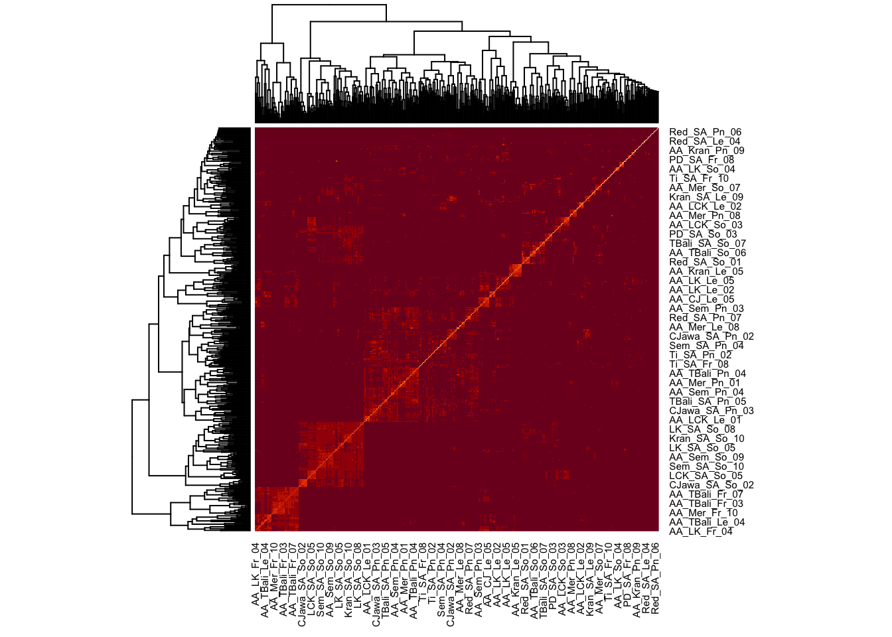
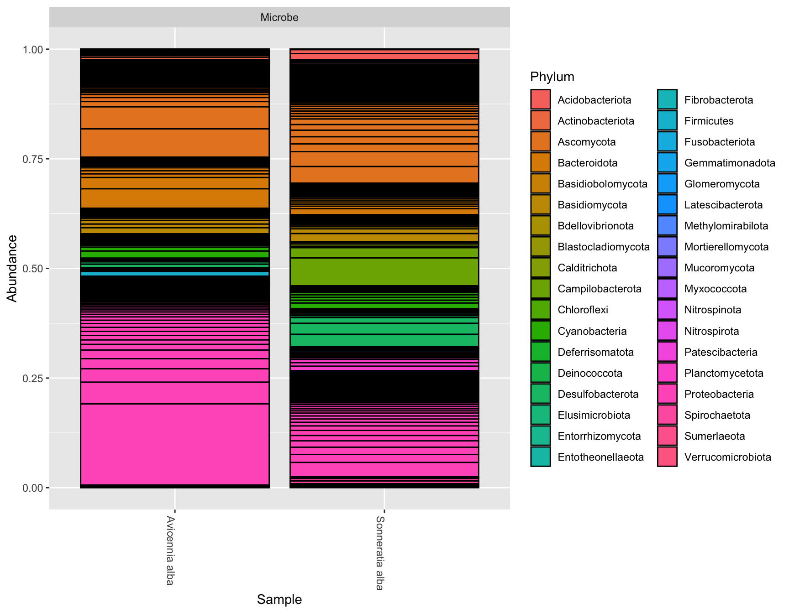
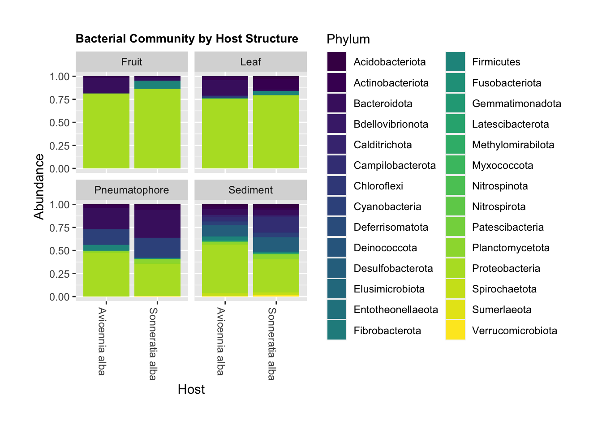

## [Home](https://kjehickman.github.io/) | [Final Project](https://kjehickman.github.io/Final_Project/Final_Project.html) | [About Me](https://kjehickman.github.io/About_Me/About_me.html)


<br>

# <b>Bacterial-Fungal Interactions in Mangrove Roots</b>

## Introduction

<br>
This analysis aims to illuminate potential interactions between bacterial and fungal species in terms of community assembly as a function of location, host plant or plant structure. The samples for this analysis were taken from mangroves trees in Southeast Asia and have been sequenced, targeting the 16S and ITS1 genes for bacteria and fungi, respectively. 
<br><br>


# <b>Data Analysis</b>


## Bacterial and Fungal Community Data

The data in question is comprised of several data sets, resulting from sequencing published by Lee et a. (2019 and 2020) and is forthcoming in Wainright et al. These data illustrate the presence of microbial communities on Mangrove roots. Microbial communities of interest are **Bacteria** and **Fungi**--we will not consider **Archaea** since they are beyond the scope of this research. 

<br>

The data sets have been condensed into a "phyloseq" object, which is generally comprised of sample data, observational taxonomic unit (OTU) tables, taxonomy tables, and phylogenetic trees (not present in our data). The sample data contains a list of variables that present themselves as interesting predictors of community assembly--we will use microbe type and taxa as a proxy for community assembly. Below you will see the parameters for samples taken from two hosts at seven different sites across Southeast Asia.
<br>


```r
full <- readRDS("./bact_and_fungi_clean_ps_object")

full_sam <- full@sam_data %>% as("data.frame")

full_sam %>% 
  select(Location, Host, Structure, Microbe, Lat, Lon) %>% 
  kableExtra::kable() %>% 
  kableExtra::kable_classic() %>% 
  kableExtra::kable_styling() %>% 
  kableExtra::scroll_box(width = "700px", height = "300px")
```

<div style="border: 1px solid #ddd; padding: 0px; overflow-y: scroll; height:300px; overflow-x: scroll; width:700px; "><table class=" lightable-classic table" style='font-family: "Arial Narrow", "Source Sans Pro", sans-serif; margin-left: auto; margin-right: auto; margin-left: auto; margin-right: auto;'>
 <thead>
  <tr>
   <th style="text-align:left;position: sticky; top:0; background-color: #FFFFFF;">   </th>
   <th style="text-align:left;position: sticky; top:0; background-color: #FFFFFF;"> Location </th>
   <th style="text-align:left;position: sticky; top:0; background-color: #FFFFFF;"> Host </th>
   <th style="text-align:left;position: sticky; top:0; background-color: #FFFFFF;"> Structure </th>
   <th style="text-align:left;position: sticky; top:0; background-color: #FFFFFF;"> Microbe </th>
   <th style="text-align:right;position: sticky; top:0; background-color: #FFFFFF;"> Lat </th>
   <th style="text-align:right;position: sticky; top:0; background-color: #FFFFFF;"> Lon </th>
  </tr>
 </thead>
<tbody>
  <tr>
   <td style="text-align:left;"> AA_Mer_Le_05 </td>
   <td style="text-align:left;"> Merang </td>
   <td style="text-align:left;"> Avicennia alba </td>
   <td style="text-align:left;"> Leaf </td>
   <td style="text-align:left;"> Fungi </td>
   <td style="text-align:right;"> 5.534833 </td>
   <td style="text-align:right;"> 102.94433 </td>
  </tr>
  <tr>
   <td style="text-align:left;"> AA_Mer_Le_06 </td>
   <td style="text-align:left;"> Merang </td>
   <td style="text-align:left;"> Avicennia alba </td>
   <td style="text-align:left;"> Leaf </td>
   <td style="text-align:left;"> Fungi </td>
   <td style="text-align:right;"> 5.534833 </td>
   <td style="text-align:right;"> 102.94433 </td>
  </tr>
  <tr>
   <td style="text-align:left;"> AA_Sem_So_04 </td>
   <td style="text-align:left;"> Semakau </td>
   <td style="text-align:left;"> Avicennia alba </td>
   <td style="text-align:left;"> Sediment </td>
   <td style="text-align:left;"> Fungi </td>
   <td style="text-align:right;"> 1.211727 </td>
   <td style="text-align:right;"> 103.75878 </td>
  </tr>
  <tr>
   <td style="text-align:left;"> AA_Sem_So_03 </td>
   <td style="text-align:left;"> Semakau </td>
   <td style="text-align:left;"> Avicennia alba </td>
   <td style="text-align:left;"> Sediment </td>
   <td style="text-align:left;"> Fungi </td>
   <td style="text-align:right;"> 1.211727 </td>
   <td style="text-align:right;"> 103.75878 </td>
  </tr>
  <tr>
   <td style="text-align:left;"> AA_Mer_Le_09 </td>
   <td style="text-align:left;"> Merang </td>
   <td style="text-align:left;"> Avicennia alba </td>
   <td style="text-align:left;"> Leaf </td>
   <td style="text-align:left;"> Fungi </td>
   <td style="text-align:right;"> 5.534833 </td>
   <td style="text-align:right;"> 102.94433 </td>
  </tr>
  <tr>
   <td style="text-align:left;"> AA_Mer_Le_10 </td>
   <td style="text-align:left;"> Merang </td>
   <td style="text-align:left;"> Avicennia alba </td>
   <td style="text-align:left;"> Leaf </td>
   <td style="text-align:left;"> Fungi </td>
   <td style="text-align:right;"> 5.534833 </td>
   <td style="text-align:right;"> 102.94433 </td>
  </tr>
  <tr>
   <td style="text-align:left;"> AA_Mer_Pn_01 </td>
   <td style="text-align:left;"> Merang </td>
   <td style="text-align:left;"> Avicennia alba </td>
   <td style="text-align:left;"> Pneumatophore </td>
   <td style="text-align:left;"> Fungi </td>
   <td style="text-align:right;"> 5.534833 </td>
   <td style="text-align:right;"> 102.94433 </td>
  </tr>
  <tr>
   <td style="text-align:left;"> AA_Sem_Fr_07 </td>
   <td style="text-align:left;"> Semakau </td>
   <td style="text-align:left;"> Avicennia alba </td>
   <td style="text-align:left;"> Fruit </td>
   <td style="text-align:left;"> Fungi </td>
   <td style="text-align:right;"> 1.211727 </td>
   <td style="text-align:right;"> 103.75878 </td>
  </tr>
  <tr>
   <td style="text-align:left;"> AA_Sem_Fr_06 </td>
   <td style="text-align:left;"> Semakau </td>
   <td style="text-align:left;"> Avicennia alba </td>
   <td style="text-align:left;"> Fruit </td>
   <td style="text-align:left;"> Fungi </td>
   <td style="text-align:right;"> 1.211727 </td>
   <td style="text-align:right;"> 103.75878 </td>
  </tr>
  <tr>
   <td style="text-align:left;"> AA_Sem_So_02 </td>
   <td style="text-align:left;"> Semakau </td>
   <td style="text-align:left;"> Avicennia alba </td>
   <td style="text-align:left;"> Sediment </td>
   <td style="text-align:left;"> Fungi </td>
   <td style="text-align:right;"> 1.211727 </td>
   <td style="text-align:right;"> 103.75878 </td>
  </tr>
  <tr>
   <td style="text-align:left;"> AA_Sem_So_01 </td>
   <td style="text-align:left;"> Semakau </td>
   <td style="text-align:left;"> Avicennia alba </td>
   <td style="text-align:left;"> Sediment </td>
   <td style="text-align:left;"> Fungi </td>
   <td style="text-align:right;"> 1.211727 </td>
   <td style="text-align:right;"> 103.75878 </td>
  </tr>
  <tr>
   <td style="text-align:left;"> AA_Kran_Fr_09 </td>
   <td style="text-align:left;"> Kranji </td>
   <td style="text-align:left;"> Avicennia alba </td>
   <td style="text-align:left;"> Fruit </td>
   <td style="text-align:left;"> Fungi </td>
   <td style="text-align:right;"> 1.438302 </td>
   <td style="text-align:right;"> 103.75288 </td>
  </tr>
  <tr>
   <td style="text-align:left;"> AA_Kran_Fr_01 </td>
   <td style="text-align:left;"> Kranji </td>
   <td style="text-align:left;"> Avicennia alba </td>
   <td style="text-align:left;"> Fruit </td>
   <td style="text-align:left;"> Fungi </td>
   <td style="text-align:right;"> 1.438302 </td>
   <td style="text-align:right;"> 103.75288 </td>
  </tr>
  <tr>
   <td style="text-align:left;"> AA_Kran_Fr_03 </td>
   <td style="text-align:left;"> Kranji </td>
   <td style="text-align:left;"> Avicennia alba </td>
   <td style="text-align:left;"> Fruit </td>
   <td style="text-align:left;"> Fungi </td>
   <td style="text-align:right;"> 1.438302 </td>
   <td style="text-align:right;"> 103.75288 </td>
  </tr>
  <tr>
   <td style="text-align:left;"> AA_Kran_Fr_04 </td>
   <td style="text-align:left;"> Kranji </td>
   <td style="text-align:left;"> Avicennia alba </td>
   <td style="text-align:left;"> Fruit </td>
   <td style="text-align:left;"> Fungi </td>
   <td style="text-align:right;"> 1.438302 </td>
   <td style="text-align:right;"> 103.75288 </td>
  </tr>
  <tr>
   <td style="text-align:left;"> AA_Kran_Fr_07 </td>
   <td style="text-align:left;"> Kranji </td>
   <td style="text-align:left;"> Avicennia alba </td>
   <td style="text-align:left;"> Fruit </td>
   <td style="text-align:left;"> Fungi </td>
   <td style="text-align:right;"> 1.438302 </td>
   <td style="text-align:right;"> 103.75288 </td>
  </tr>
  <tr>
   <td style="text-align:left;"> AA_LK_Pn_03 </td>
   <td style="text-align:left;"> Langkawi </td>
   <td style="text-align:left;"> Avicennia alba </td>
   <td style="text-align:left;"> Pneumatophore </td>
   <td style="text-align:left;"> Fungi </td>
   <td style="text-align:right;"> 6.456892 </td>
   <td style="text-align:right;"> 99.82261 </td>
  </tr>
  <tr>
   <td style="text-align:left;"> AA_LK_Fr_07 </td>
   <td style="text-align:left;"> Langkawi </td>
   <td style="text-align:left;"> Avicennia alba </td>
   <td style="text-align:left;"> Fruit </td>
   <td style="text-align:left;"> Fungi </td>
   <td style="text-align:right;"> 6.456892 </td>
   <td style="text-align:right;"> 99.82261 </td>
  </tr>
  <tr>
   <td style="text-align:left;"> AA_Mer_Le_04 </td>
   <td style="text-align:left;"> Merang </td>
   <td style="text-align:left;"> Avicennia alba </td>
   <td style="text-align:left;"> Leaf </td>
   <td style="text-align:left;"> Fungi </td>
   <td style="text-align:right;"> 5.534833 </td>
   <td style="text-align:right;"> 102.94433 </td>
  </tr>
  <tr>
   <td style="text-align:left;"> AA_Mer_Le_03 </td>
   <td style="text-align:left;"> Merang </td>
   <td style="text-align:left;"> Avicennia alba </td>
   <td style="text-align:left;"> Leaf </td>
   <td style="text-align:left;"> Fungi </td>
   <td style="text-align:right;"> 5.534833 </td>
   <td style="text-align:right;"> 102.94433 </td>
  </tr>
  <tr>
   <td style="text-align:left;"> AA_Mer_Le_02 </td>
   <td style="text-align:left;"> Merang </td>
   <td style="text-align:left;"> Avicennia alba </td>
   <td style="text-align:left;"> Leaf </td>
   <td style="text-align:left;"> Fungi </td>
   <td style="text-align:right;"> 5.534833 </td>
   <td style="text-align:right;"> 102.94433 </td>
  </tr>
  <tr>
   <td style="text-align:left;"> AA_Mer_Le_01 </td>
   <td style="text-align:left;"> Merang </td>
   <td style="text-align:left;"> Avicennia alba </td>
   <td style="text-align:left;"> Leaf </td>
   <td style="text-align:left;"> Fungi </td>
   <td style="text-align:right;"> 5.534833 </td>
   <td style="text-align:right;"> 102.94433 </td>
  </tr>
  <tr>
   <td style="text-align:left;"> AA_Sem_So_10 </td>
   <td style="text-align:left;"> Semakau </td>
   <td style="text-align:left;"> Avicennia alba </td>
   <td style="text-align:left;"> Sediment </td>
   <td style="text-align:left;"> Fungi </td>
   <td style="text-align:right;"> 1.211727 </td>
   <td style="text-align:right;"> 103.75878 </td>
  </tr>
  <tr>
   <td style="text-align:left;"> AA_Sem_So_09 </td>
   <td style="text-align:left;"> Semakau </td>
   <td style="text-align:left;"> Avicennia alba </td>
   <td style="text-align:left;"> Sediment </td>
   <td style="text-align:left;"> Fungi </td>
   <td style="text-align:right;"> 1.211727 </td>
   <td style="text-align:right;"> 103.75878 </td>
  </tr>
  <tr>
   <td style="text-align:left;"> AA_Sem_So_08 </td>
   <td style="text-align:left;"> Semakau </td>
   <td style="text-align:left;"> Avicennia alba </td>
   <td style="text-align:left;"> Sediment </td>
   <td style="text-align:left;"> Fungi </td>
   <td style="text-align:right;"> 1.211727 </td>
   <td style="text-align:right;"> 103.75878 </td>
  </tr>
  <tr>
   <td style="text-align:left;"> AA_Sem_So_07 </td>
   <td style="text-align:left;"> Semakau </td>
   <td style="text-align:left;"> Avicennia alba </td>
   <td style="text-align:left;"> Sediment </td>
   <td style="text-align:left;"> Fungi </td>
   <td style="text-align:right;"> 1.211727 </td>
   <td style="text-align:right;"> 103.75878 </td>
  </tr>
  <tr>
   <td style="text-align:left;"> AA_Sem_So_06 </td>
   <td style="text-align:left;"> Semakau </td>
   <td style="text-align:left;"> Avicennia alba </td>
   <td style="text-align:left;"> Sediment </td>
   <td style="text-align:left;"> Fungi </td>
   <td style="text-align:right;"> 1.211727 </td>
   <td style="text-align:right;"> 103.75878 </td>
  </tr>
  <tr>
   <td style="text-align:left;"> AA_Sem_So_05 </td>
   <td style="text-align:left;"> Semakau </td>
   <td style="text-align:left;"> Avicennia alba </td>
   <td style="text-align:left;"> Sediment </td>
   <td style="text-align:left;"> Fungi </td>
   <td style="text-align:right;"> 1.211727 </td>
   <td style="text-align:right;"> 103.75878 </td>
  </tr>
  <tr>
   <td style="text-align:left;"> AA_LK_Pn_01 </td>
   <td style="text-align:left;"> Langkawi </td>
   <td style="text-align:left;"> Avicennia alba </td>
   <td style="text-align:left;"> Pneumatophore </td>
   <td style="text-align:left;"> Fungi </td>
   <td style="text-align:right;"> 6.456892 </td>
   <td style="text-align:right;"> 99.82261 </td>
  </tr>
  <tr>
   <td style="text-align:left;"> AA_LK_Le_10 </td>
   <td style="text-align:left;"> Langkawi </td>
   <td style="text-align:left;"> Avicennia alba </td>
   <td style="text-align:left;"> Leaf </td>
   <td style="text-align:left;"> Fungi </td>
   <td style="text-align:right;"> 6.456892 </td>
   <td style="text-align:right;"> 99.82261 </td>
  </tr>
  <tr>
   <td style="text-align:left;"> AA_Kran_Pn_06 </td>
   <td style="text-align:left;"> Kranji </td>
   <td style="text-align:left;"> Avicennia alba </td>
   <td style="text-align:left;"> Pneumatophore </td>
   <td style="text-align:left;"> Fungi </td>
   <td style="text-align:right;"> 1.438302 </td>
   <td style="text-align:right;"> 103.75288 </td>
  </tr>
  <tr>
   <td style="text-align:left;"> AA_Kran_Pn_05 </td>
   <td style="text-align:left;"> Kranji </td>
   <td style="text-align:left;"> Avicennia alba </td>
   <td style="text-align:left;"> Pneumatophore </td>
   <td style="text-align:left;"> Fungi </td>
   <td style="text-align:right;"> 1.438302 </td>
   <td style="text-align:right;"> 103.75288 </td>
  </tr>
  <tr>
   <td style="text-align:left;"> AA_Kran_Pn_08 </td>
   <td style="text-align:left;"> Kranji </td>
   <td style="text-align:left;"> Avicennia alba </td>
   <td style="text-align:left;"> Pneumatophore </td>
   <td style="text-align:left;"> Fungi </td>
   <td style="text-align:right;"> 1.438302 </td>
   <td style="text-align:right;"> 103.75288 </td>
  </tr>
  <tr>
   <td style="text-align:left;"> AA_Kran_Pn_07 </td>
   <td style="text-align:left;"> Kranji </td>
   <td style="text-align:left;"> Avicennia alba </td>
   <td style="text-align:left;"> Pneumatophore </td>
   <td style="text-align:left;"> Fungi </td>
   <td style="text-align:right;"> 1.438302 </td>
   <td style="text-align:right;"> 103.75288 </td>
  </tr>
  <tr>
   <td style="text-align:left;"> AA_Kran_Pn_02 </td>
   <td style="text-align:left;"> Kranji </td>
   <td style="text-align:left;"> Avicennia alba </td>
   <td style="text-align:left;"> Pneumatophore </td>
   <td style="text-align:left;"> Fungi </td>
   <td style="text-align:right;"> 1.438302 </td>
   <td style="text-align:right;"> 103.75288 </td>
  </tr>
  <tr>
   <td style="text-align:left;"> AA_Kran_Pn_01 </td>
   <td style="text-align:left;"> Kranji </td>
   <td style="text-align:left;"> Avicennia alba </td>
   <td style="text-align:left;"> Pneumatophore </td>
   <td style="text-align:left;"> Fungi </td>
   <td style="text-align:right;"> 1.438302 </td>
   <td style="text-align:right;"> 103.75288 </td>
  </tr>
  <tr>
   <td style="text-align:left;"> AA_Kran_Pn_04 </td>
   <td style="text-align:left;"> Kranji </td>
   <td style="text-align:left;"> Avicennia alba </td>
   <td style="text-align:left;"> Pneumatophore </td>
   <td style="text-align:left;"> Fungi </td>
   <td style="text-align:right;"> 1.438302 </td>
   <td style="text-align:right;"> 103.75288 </td>
  </tr>
  <tr>
   <td style="text-align:left;"> AA_Kran_Pn_03 </td>
   <td style="text-align:left;"> Kranji </td>
   <td style="text-align:left;"> Avicennia alba </td>
   <td style="text-align:left;"> Pneumatophore </td>
   <td style="text-align:left;"> Fungi </td>
   <td style="text-align:right;"> 1.438302 </td>
   <td style="text-align:right;"> 103.75288 </td>
  </tr>
  <tr>
   <td style="text-align:left;"> AA_LK_So_10 </td>
   <td style="text-align:left;"> Langkawi </td>
   <td style="text-align:left;"> Avicennia alba </td>
   <td style="text-align:left;"> Sediment </td>
   <td style="text-align:left;"> Fungi </td>
   <td style="text-align:right;"> 6.456892 </td>
   <td style="text-align:right;"> 99.82261 </td>
  </tr>
  <tr>
   <td style="text-align:left;"> AA_Kran_Pn_10 </td>
   <td style="text-align:left;"> Kranji </td>
   <td style="text-align:left;"> Avicennia alba </td>
   <td style="text-align:left;"> Pneumatophore </td>
   <td style="text-align:left;"> Fungi </td>
   <td style="text-align:right;"> 1.438302 </td>
   <td style="text-align:right;"> 103.75288 </td>
  </tr>
  <tr>
   <td style="text-align:left;"> AA_Kran_Pn_09 </td>
   <td style="text-align:left;"> Kranji </td>
   <td style="text-align:left;"> Avicennia alba </td>
   <td style="text-align:left;"> Pneumatophore </td>
   <td style="text-align:left;"> Fungi </td>
   <td style="text-align:right;"> 1.438302 </td>
   <td style="text-align:right;"> 103.75288 </td>
  </tr>
  <tr>
   <td style="text-align:left;"> AA_LK_Pn_04 </td>
   <td style="text-align:left;"> Langkawi </td>
   <td style="text-align:left;"> Avicennia alba </td>
   <td style="text-align:left;"> Pneumatophore </td>
   <td style="text-align:left;"> Fungi </td>
   <td style="text-align:right;"> 6.456892 </td>
   <td style="text-align:right;"> 99.82261 </td>
  </tr>
  <tr>
   <td style="text-align:left;"> AA_LK_Pn_06 </td>
   <td style="text-align:left;"> Langkawi </td>
   <td style="text-align:left;"> Avicennia alba </td>
   <td style="text-align:left;"> Pneumatophore </td>
   <td style="text-align:left;"> Fungi </td>
   <td style="text-align:right;"> 6.456892 </td>
   <td style="text-align:right;"> 99.82261 </td>
  </tr>
  <tr>
   <td style="text-align:left;"> AA_Mer_Fr_03 </td>
   <td style="text-align:left;"> Merang </td>
   <td style="text-align:left;"> Avicennia alba </td>
   <td style="text-align:left;"> Fruit </td>
   <td style="text-align:left;"> Fungi </td>
   <td style="text-align:right;"> 5.534833 </td>
   <td style="text-align:right;"> 102.94433 </td>
  </tr>
  <tr>
   <td style="text-align:left;"> AA_Mer_Fr_02 </td>
   <td style="text-align:left;"> Merang </td>
   <td style="text-align:left;"> Avicennia alba </td>
   <td style="text-align:left;"> Fruit </td>
   <td style="text-align:left;"> Fungi </td>
   <td style="text-align:right;"> 5.534833 </td>
   <td style="text-align:right;"> 102.94433 </td>
  </tr>
  <tr>
   <td style="text-align:left;"> AA_LK_Fr_08 </td>
   <td style="text-align:left;"> Langkawi </td>
   <td style="text-align:left;"> Avicennia alba </td>
   <td style="text-align:left;"> Fruit </td>
   <td style="text-align:left;"> Fungi </td>
   <td style="text-align:right;"> 6.456892 </td>
   <td style="text-align:right;"> 99.82261 </td>
  </tr>
  <tr>
   <td style="text-align:left;"> AA_LK_Pn_05 </td>
   <td style="text-align:left;"> Langkawi </td>
   <td style="text-align:left;"> Avicennia alba </td>
   <td style="text-align:left;"> Pneumatophore </td>
   <td style="text-align:left;"> Fungi </td>
   <td style="text-align:right;"> 6.456892 </td>
   <td style="text-align:right;"> 99.82261 </td>
  </tr>
  <tr>
   <td style="text-align:left;"> AA_Mer_Pn_05 </td>
   <td style="text-align:left;"> Merang </td>
   <td style="text-align:left;"> Avicennia alba </td>
   <td style="text-align:left;"> Pneumatophore </td>
   <td style="text-align:left;"> Fungi </td>
   <td style="text-align:right;"> 5.534833 </td>
   <td style="text-align:right;"> 102.94433 </td>
  </tr>
  <tr>
   <td style="text-align:left;"> AA_Mer_Pn_04 </td>
   <td style="text-align:left;"> Merang </td>
   <td style="text-align:left;"> Avicennia alba </td>
   <td style="text-align:left;"> Pneumatophore </td>
   <td style="text-align:left;"> Fungi </td>
   <td style="text-align:right;"> 5.534833 </td>
   <td style="text-align:right;"> 102.94433 </td>
  </tr>
  <tr>
   <td style="text-align:left;"> AA_Mer_Pn_07 </td>
   <td style="text-align:left;"> Merang </td>
   <td style="text-align:left;"> Avicennia alba </td>
   <td style="text-align:left;"> Pneumatophore </td>
   <td style="text-align:left;"> Fungi </td>
   <td style="text-align:right;"> 5.534833 </td>
   <td style="text-align:right;"> 102.94433 </td>
  </tr>
  <tr>
   <td style="text-align:left;"> AA_Mer_Pn_06 </td>
   <td style="text-align:left;"> Merang </td>
   <td style="text-align:left;"> Avicennia alba </td>
   <td style="text-align:left;"> Pneumatophore </td>
   <td style="text-align:left;"> Fungi </td>
   <td style="text-align:right;"> 5.534833 </td>
   <td style="text-align:right;"> 102.94433 </td>
  </tr>
  <tr>
   <td style="text-align:left;"> AA_Mer_Pn_09 </td>
   <td style="text-align:left;"> Merang </td>
   <td style="text-align:left;"> Avicennia alba </td>
   <td style="text-align:left;"> Pneumatophore </td>
   <td style="text-align:left;"> Fungi </td>
   <td style="text-align:right;"> 5.534833 </td>
   <td style="text-align:right;"> 102.94433 </td>
  </tr>
  <tr>
   <td style="text-align:left;"> AA_Mer_Pn_08 </td>
   <td style="text-align:left;"> Merang </td>
   <td style="text-align:left;"> Avicennia alba </td>
   <td style="text-align:left;"> Pneumatophore </td>
   <td style="text-align:left;"> Fungi </td>
   <td style="text-align:right;"> 5.534833 </td>
   <td style="text-align:right;"> 102.94433 </td>
  </tr>
  <tr>
   <td style="text-align:left;"> AA_Mer_Fr_01 </td>
   <td style="text-align:left;"> Merang </td>
   <td style="text-align:left;"> Avicennia alba </td>
   <td style="text-align:left;"> Fruit </td>
   <td style="text-align:left;"> Fungi </td>
   <td style="text-align:right;"> 5.534833 </td>
   <td style="text-align:right;"> 102.94433 </td>
  </tr>
  <tr>
   <td style="text-align:left;"> AA_Mer_Pn_10 </td>
   <td style="text-align:left;"> Merang </td>
   <td style="text-align:left;"> Avicennia alba </td>
   <td style="text-align:left;"> Pneumatophore </td>
   <td style="text-align:left;"> Fungi </td>
   <td style="text-align:right;"> 5.534833 </td>
   <td style="text-align:right;"> 102.94433 </td>
  </tr>
  <tr>
   <td style="text-align:left;"> AA_Mer_Pn_02 </td>
   <td style="text-align:left;"> Merang </td>
   <td style="text-align:left;"> Avicennia alba </td>
   <td style="text-align:left;"> Pneumatophore </td>
   <td style="text-align:left;"> Fungi </td>
   <td style="text-align:right;"> 5.534833 </td>
   <td style="text-align:right;"> 102.94433 </td>
  </tr>
  <tr>
   <td style="text-align:left;"> AA_LK_Fr_04 </td>
   <td style="text-align:left;"> Langkawi </td>
   <td style="text-align:left;"> Avicennia alba </td>
   <td style="text-align:left;"> Fruit </td>
   <td style="text-align:left;"> Fungi </td>
   <td style="text-align:right;"> 6.456892 </td>
   <td style="text-align:right;"> 99.82261 </td>
  </tr>
  <tr>
   <td style="text-align:left;"> AA_Mer_Pn_03 </td>
   <td style="text-align:left;"> Merang </td>
   <td style="text-align:left;"> Avicennia alba </td>
   <td style="text-align:left;"> Pneumatophore </td>
   <td style="text-align:left;"> Fungi </td>
   <td style="text-align:right;"> 5.534833 </td>
   <td style="text-align:right;"> 102.94433 </td>
  </tr>
  <tr>
   <td style="text-align:left;"> AA_LK_Fr_05 </td>
   <td style="text-align:left;"> Langkawi </td>
   <td style="text-align:left;"> Avicennia alba </td>
   <td style="text-align:left;"> Fruit </td>
   <td style="text-align:left;"> Fungi </td>
   <td style="text-align:right;"> 6.456892 </td>
   <td style="text-align:right;"> 99.82261 </td>
  </tr>
  <tr>
   <td style="text-align:left;"> AA_LK_So_01 </td>
   <td style="text-align:left;"> Langkawi </td>
   <td style="text-align:left;"> Avicennia alba </td>
   <td style="text-align:left;"> Sediment </td>
   <td style="text-align:left;"> Fungi </td>
   <td style="text-align:right;"> 6.456892 </td>
   <td style="text-align:right;"> 99.82261 </td>
  </tr>
  <tr>
   <td style="text-align:left;"> AA_LK_Fr_10 </td>
   <td style="text-align:left;"> Langkawi </td>
   <td style="text-align:left;"> Avicennia alba </td>
   <td style="text-align:left;"> Fruit </td>
   <td style="text-align:left;"> Fungi </td>
   <td style="text-align:right;"> 6.456892 </td>
   <td style="text-align:right;"> 99.82261 </td>
  </tr>
  <tr>
   <td style="text-align:left;"> AA_LK_Fr_09 </td>
   <td style="text-align:left;"> Langkawi </td>
   <td style="text-align:left;"> Avicennia alba </td>
   <td style="text-align:left;"> Fruit </td>
   <td style="text-align:left;"> Fungi </td>
   <td style="text-align:right;"> 6.456892 </td>
   <td style="text-align:right;"> 99.82261 </td>
  </tr>
  <tr>
   <td style="text-align:left;"> AA_LK_So_06 </td>
   <td style="text-align:left;"> Langkawi </td>
   <td style="text-align:left;"> Avicennia alba </td>
   <td style="text-align:left;"> Sediment </td>
   <td style="text-align:left;"> Fungi </td>
   <td style="text-align:right;"> 6.456892 </td>
   <td style="text-align:right;"> 99.82261 </td>
  </tr>
  <tr>
   <td style="text-align:left;"> AA_LK_So_05 </td>
   <td style="text-align:left;"> Langkawi </td>
   <td style="text-align:left;"> Avicennia alba </td>
   <td style="text-align:left;"> Sediment </td>
   <td style="text-align:left;"> Fungi </td>
   <td style="text-align:right;"> 6.456892 </td>
   <td style="text-align:right;"> 99.82261 </td>
  </tr>
  <tr>
   <td style="text-align:left;"> AA_LK_Fr_06 </td>
   <td style="text-align:left;"> Langkawi </td>
   <td style="text-align:left;"> Avicennia alba </td>
   <td style="text-align:left;"> Fruit </td>
   <td style="text-align:left;"> Fungi </td>
   <td style="text-align:right;"> 6.456892 </td>
   <td style="text-align:right;"> 99.82261 </td>
  </tr>
  <tr>
   <td style="text-align:left;"> AA_LK_So_03 </td>
   <td style="text-align:left;"> Langkawi </td>
   <td style="text-align:left;"> Avicennia alba </td>
   <td style="text-align:left;"> Sediment </td>
   <td style="text-align:left;"> Fungi </td>
   <td style="text-align:right;"> 6.456892 </td>
   <td style="text-align:right;"> 99.82261 </td>
  </tr>
  <tr>
   <td style="text-align:left;"> AA_LK_So_08 </td>
   <td style="text-align:left;"> Langkawi </td>
   <td style="text-align:left;"> Avicennia alba </td>
   <td style="text-align:left;"> Sediment </td>
   <td style="text-align:left;"> Fungi </td>
   <td style="text-align:right;"> 6.456892 </td>
   <td style="text-align:right;"> 99.82261 </td>
  </tr>
  <tr>
   <td style="text-align:left;"> AA_LK_So_07 </td>
   <td style="text-align:left;"> Langkawi </td>
   <td style="text-align:left;"> Avicennia alba </td>
   <td style="text-align:left;"> Sediment </td>
   <td style="text-align:left;"> Fungi </td>
   <td style="text-align:right;"> 6.456892 </td>
   <td style="text-align:right;"> 99.82261 </td>
  </tr>
  <tr>
   <td style="text-align:left;"> AA_LK_Pn_09 </td>
   <td style="text-align:left;"> Langkawi </td>
   <td style="text-align:left;"> Avicennia alba </td>
   <td style="text-align:left;"> Pneumatophore </td>
   <td style="text-align:left;"> Fungi </td>
   <td style="text-align:right;"> 6.456892 </td>
   <td style="text-align:right;"> 99.82261 </td>
  </tr>
  <tr>
   <td style="text-align:left;"> AA_LK_Pn_10 </td>
   <td style="text-align:left;"> Langkawi </td>
   <td style="text-align:left;"> Avicennia alba </td>
   <td style="text-align:left;"> Pneumatophore </td>
   <td style="text-align:left;"> Fungi </td>
   <td style="text-align:right;"> 6.456892 </td>
   <td style="text-align:right;"> 99.82261 </td>
  </tr>
  <tr>
   <td style="text-align:left;"> AA_LK_Pn_02 </td>
   <td style="text-align:left;"> Langkawi </td>
   <td style="text-align:left;"> Avicennia alba </td>
   <td style="text-align:left;"> Pneumatophore </td>
   <td style="text-align:left;"> Fungi </td>
   <td style="text-align:right;"> 6.456892 </td>
   <td style="text-align:right;"> 99.82261 </td>
  </tr>
  <tr>
   <td style="text-align:left;"> AA_CJ_Pn_06 </td>
   <td style="text-align:left;"> Chek Jawa </td>
   <td style="text-align:left;"> Avicennia alba </td>
   <td style="text-align:left;"> Pneumatophore </td>
   <td style="text-align:left;"> Fungi </td>
   <td style="text-align:right;"> 1.410703 </td>
   <td style="text-align:right;"> 103.99110 </td>
  </tr>
  <tr>
   <td style="text-align:left;"> AA_CJ_Pn_05 </td>
   <td style="text-align:left;"> Chek Jawa </td>
   <td style="text-align:left;"> Avicennia alba </td>
   <td style="text-align:left;"> Pneumatophore </td>
   <td style="text-align:left;"> Fungi </td>
   <td style="text-align:right;"> 1.410703 </td>
   <td style="text-align:right;"> 103.99110 </td>
  </tr>
  <tr>
   <td style="text-align:left;"> AA_CJ_Pn_02 </td>
   <td style="text-align:left;"> Chek Jawa </td>
   <td style="text-align:left;"> Avicennia alba </td>
   <td style="text-align:left;"> Pneumatophore </td>
   <td style="text-align:left;"> Fungi </td>
   <td style="text-align:right;"> 1.410703 </td>
   <td style="text-align:right;"> 103.99110 </td>
  </tr>
  <tr>
   <td style="text-align:left;"> AA_CJ_Pn_01 </td>
   <td style="text-align:left;"> Chek Jawa </td>
   <td style="text-align:left;"> Avicennia alba </td>
   <td style="text-align:left;"> Pneumatophore </td>
   <td style="text-align:left;"> Fungi </td>
   <td style="text-align:right;"> 1.410703 </td>
   <td style="text-align:right;"> 103.99110 </td>
  </tr>
  <tr>
   <td style="text-align:left;"> AA_CJ_Pn_04 </td>
   <td style="text-align:left;"> Chek Jawa </td>
   <td style="text-align:left;"> Avicennia alba </td>
   <td style="text-align:left;"> Pneumatophore </td>
   <td style="text-align:left;"> Fungi </td>
   <td style="text-align:right;"> 1.410703 </td>
   <td style="text-align:right;"> 103.99110 </td>
  </tr>
  <tr>
   <td style="text-align:left;"> AA_CJ_Pn_03 </td>
   <td style="text-align:left;"> Chek Jawa </td>
   <td style="text-align:left;"> Avicennia alba </td>
   <td style="text-align:left;"> Pneumatophore </td>
   <td style="text-align:left;"> Fungi </td>
   <td style="text-align:right;"> 1.410703 </td>
   <td style="text-align:right;"> 103.99110 </td>
  </tr>
  <tr>
   <td style="text-align:left;"> AA_CJ_Le_08 </td>
   <td style="text-align:left;"> Chek Jawa </td>
   <td style="text-align:left;"> Avicennia alba </td>
   <td style="text-align:left;"> Leaf </td>
   <td style="text-align:left;"> Fungi </td>
   <td style="text-align:right;"> 1.410703 </td>
   <td style="text-align:right;"> 103.99110 </td>
  </tr>
  <tr>
   <td style="text-align:left;"> AA_CJ_Le_09 </td>
   <td style="text-align:left;"> Chek Jawa </td>
   <td style="text-align:left;"> Avicennia alba </td>
   <td style="text-align:left;"> Leaf </td>
   <td style="text-align:left;"> Fungi </td>
   <td style="text-align:right;"> 1.410703 </td>
   <td style="text-align:right;"> 103.99110 </td>
  </tr>
  <tr>
   <td style="text-align:left;"> AA_LK_Le_08 </td>
   <td style="text-align:left;"> Langkawi </td>
   <td style="text-align:left;"> Avicennia alba </td>
   <td style="text-align:left;"> Leaf </td>
   <td style="text-align:left;"> Fungi </td>
   <td style="text-align:right;"> 6.456892 </td>
   <td style="text-align:right;"> 99.82261 </td>
  </tr>
  <tr>
   <td style="text-align:left;"> AA_CJ_Fr_05 </td>
   <td style="text-align:left;"> Chek Jawa </td>
   <td style="text-align:left;"> Avicennia alba </td>
   <td style="text-align:left;"> Fruit </td>
   <td style="text-align:left;"> Fungi </td>
   <td style="text-align:right;"> 1.410703 </td>
   <td style="text-align:right;"> 103.99110 </td>
  </tr>
  <tr>
   <td style="text-align:left;"> AA_CJ_Fr_06 </td>
   <td style="text-align:left;"> Chek Jawa </td>
   <td style="text-align:left;"> Avicennia alba </td>
   <td style="text-align:left;"> Fruit </td>
   <td style="text-align:left;"> Fungi </td>
   <td style="text-align:right;"> 1.410703 </td>
   <td style="text-align:right;"> 103.99110 </td>
  </tr>
  <tr>
   <td style="text-align:left;"> AA_CJ_Pn_07 </td>
   <td style="text-align:left;"> Chek Jawa </td>
   <td style="text-align:left;"> Avicennia alba </td>
   <td style="text-align:left;"> Pneumatophore </td>
   <td style="text-align:left;"> Fungi </td>
   <td style="text-align:right;"> 1.410703 </td>
   <td style="text-align:right;"> 103.99110 </td>
  </tr>
  <tr>
   <td style="text-align:left;"> AA_CJ_Pn_08 </td>
   <td style="text-align:left;"> Chek Jawa </td>
   <td style="text-align:left;"> Avicennia alba </td>
   <td style="text-align:left;"> Pneumatophore </td>
   <td style="text-align:left;"> Fungi </td>
   <td style="text-align:right;"> 1.410703 </td>
   <td style="text-align:right;"> 103.99110 </td>
  </tr>
  <tr>
   <td style="text-align:left;"> AA_CJ_Pn_09 </td>
   <td style="text-align:left;"> Chek Jawa </td>
   <td style="text-align:left;"> Avicennia alba </td>
   <td style="text-align:left;"> Pneumatophore </td>
   <td style="text-align:left;"> Fungi </td>
   <td style="text-align:right;"> 1.410703 </td>
   <td style="text-align:right;"> 103.99110 </td>
  </tr>
  <tr>
   <td style="text-align:left;"> AA_CJ_Pn_10 </td>
   <td style="text-align:left;"> Chek Jawa </td>
   <td style="text-align:left;"> Avicennia alba </td>
   <td style="text-align:left;"> Pneumatophore </td>
   <td style="text-align:left;"> Fungi </td>
   <td style="text-align:right;"> 1.410703 </td>
   <td style="text-align:right;"> 103.99110 </td>
  </tr>
  <tr>
   <td style="text-align:left;"> AA_CJ_Fr_01 </td>
   <td style="text-align:left;"> Chek Jawa </td>
   <td style="text-align:left;"> Avicennia alba </td>
   <td style="text-align:left;"> Fruit </td>
   <td style="text-align:left;"> Fungi </td>
   <td style="text-align:right;"> 1.410703 </td>
   <td style="text-align:right;"> 103.99110 </td>
  </tr>
  <tr>
   <td style="text-align:left;"> AA_CJ_Fr_02 </td>
   <td style="text-align:left;"> Chek Jawa </td>
   <td style="text-align:left;"> Avicennia alba </td>
   <td style="text-align:left;"> Fruit </td>
   <td style="text-align:left;"> Fungi </td>
   <td style="text-align:right;"> 1.410703 </td>
   <td style="text-align:right;"> 103.99110 </td>
  </tr>
  <tr>
   <td style="text-align:left;"> AA_CJ_Fr_04 </td>
   <td style="text-align:left;"> Chek Jawa </td>
   <td style="text-align:left;"> Avicennia alba </td>
   <td style="text-align:left;"> Fruit </td>
   <td style="text-align:left;"> Fungi </td>
   <td style="text-align:right;"> 1.410703 </td>
   <td style="text-align:right;"> 103.99110 </td>
  </tr>
  <tr>
   <td style="text-align:left;"> AA_LK_Le_09 </td>
   <td style="text-align:left;"> Langkawi </td>
   <td style="text-align:left;"> Avicennia alba </td>
   <td style="text-align:left;"> Leaf </td>
   <td style="text-align:left;"> Fungi </td>
   <td style="text-align:right;"> 6.456892 </td>
   <td style="text-align:right;"> 99.82261 </td>
  </tr>
  <tr>
   <td style="text-align:left;"> AA_LK_Pn_08 </td>
   <td style="text-align:left;"> Langkawi </td>
   <td style="text-align:left;"> Avicennia alba </td>
   <td style="text-align:left;"> Pneumatophore </td>
   <td style="text-align:left;"> Fungi </td>
   <td style="text-align:right;"> 6.456892 </td>
   <td style="text-align:right;"> 99.82261 </td>
  </tr>
  <tr>
   <td style="text-align:left;"> AA_LK_Pn_07 </td>
   <td style="text-align:left;"> Langkawi </td>
   <td style="text-align:left;"> Avicennia alba </td>
   <td style="text-align:left;"> Pneumatophore </td>
   <td style="text-align:left;"> Fungi </td>
   <td style="text-align:right;"> 6.456892 </td>
   <td style="text-align:right;"> 99.82261 </td>
  </tr>
  <tr>
   <td style="text-align:left;"> AA_Mer_So_07 </td>
   <td style="text-align:left;"> Merang </td>
   <td style="text-align:left;"> Avicennia alba </td>
   <td style="text-align:left;"> Sediment </td>
   <td style="text-align:left;"> Fungi </td>
   <td style="text-align:right;"> 5.534833 </td>
   <td style="text-align:right;"> 102.94433 </td>
  </tr>
  <tr>
   <td style="text-align:left;"> AA_Mer_So_06 </td>
   <td style="text-align:left;"> Merang </td>
   <td style="text-align:left;"> Avicennia alba </td>
   <td style="text-align:left;"> Sediment </td>
   <td style="text-align:left;"> Fungi </td>
   <td style="text-align:right;"> 5.534833 </td>
   <td style="text-align:right;"> 102.94433 </td>
  </tr>
  <tr>
   <td style="text-align:left;"> AA_Mer_So_05 </td>
   <td style="text-align:left;"> Merang </td>
   <td style="text-align:left;"> Avicennia alba </td>
   <td style="text-align:left;"> Sediment </td>
   <td style="text-align:left;"> Fungi </td>
   <td style="text-align:right;"> 5.534833 </td>
   <td style="text-align:right;"> 102.94433 </td>
  </tr>
  <tr>
   <td style="text-align:left;"> AA_Mer_So_04 </td>
   <td style="text-align:left;"> Merang </td>
   <td style="text-align:left;"> Avicennia alba </td>
   <td style="text-align:left;"> Sediment </td>
   <td style="text-align:left;"> Fungi </td>
   <td style="text-align:right;"> 5.534833 </td>
   <td style="text-align:right;"> 102.94433 </td>
  </tr>
  <tr>
   <td style="text-align:left;"> AA_Mer_So_10 </td>
   <td style="text-align:left;"> Merang </td>
   <td style="text-align:left;"> Avicennia alba </td>
   <td style="text-align:left;"> Sediment </td>
   <td style="text-align:left;"> Fungi </td>
   <td style="text-align:right;"> 5.534833 </td>
   <td style="text-align:right;"> 102.94433 </td>
  </tr>
  <tr>
   <td style="text-align:left;"> AA_Mer_So_09 </td>
   <td style="text-align:left;"> Merang </td>
   <td style="text-align:left;"> Avicennia alba </td>
   <td style="text-align:left;"> Sediment </td>
   <td style="text-align:left;"> Fungi </td>
   <td style="text-align:right;"> 5.534833 </td>
   <td style="text-align:right;"> 102.94433 </td>
  </tr>
  <tr>
   <td style="text-align:left;"> AA_Mer_So_08 </td>
   <td style="text-align:left;"> Merang </td>
   <td style="text-align:left;"> Avicennia alba </td>
   <td style="text-align:left;"> Sediment </td>
   <td style="text-align:left;"> Fungi </td>
   <td style="text-align:right;"> 5.534833 </td>
   <td style="text-align:right;"> 102.94433 </td>
  </tr>
  <tr>
   <td style="text-align:left;"> AA_LK_Fr_03 </td>
   <td style="text-align:left;"> Langkawi </td>
   <td style="text-align:left;"> Avicennia alba </td>
   <td style="text-align:left;"> Fruit </td>
   <td style="text-align:left;"> Fungi </td>
   <td style="text-align:right;"> 6.456892 </td>
   <td style="text-align:right;"> 99.82261 </td>
  </tr>
  <tr>
   <td style="text-align:left;"> AA_LK_Fr_01 </td>
   <td style="text-align:left;"> Langkawi </td>
   <td style="text-align:left;"> Avicennia alba </td>
   <td style="text-align:left;"> Fruit </td>
   <td style="text-align:left;"> Fungi </td>
   <td style="text-align:right;"> 6.456892 </td>
   <td style="text-align:right;"> 99.82261 </td>
  </tr>
  <tr>
   <td style="text-align:left;"> AA_CJ_So_03 </td>
   <td style="text-align:left;"> Chek Jawa </td>
   <td style="text-align:left;"> Avicennia alba </td>
   <td style="text-align:left;"> Sediment </td>
   <td style="text-align:left;"> Fungi </td>
   <td style="text-align:right;"> 1.410703 </td>
   <td style="text-align:right;"> 103.99110 </td>
  </tr>
  <tr>
   <td style="text-align:left;"> AA_CJ_So_02 </td>
   <td style="text-align:left;"> Chek Jawa </td>
   <td style="text-align:left;"> Avicennia alba </td>
   <td style="text-align:left;"> Sediment </td>
   <td style="text-align:left;"> Fungi </td>
   <td style="text-align:right;"> 1.410703 </td>
   <td style="text-align:right;"> 103.99110 </td>
  </tr>
  <tr>
   <td style="text-align:left;"> AA_CJ_So_01 </td>
   <td style="text-align:left;"> Chek Jawa </td>
   <td style="text-align:left;"> Avicennia alba </td>
   <td style="text-align:left;"> Sediment </td>
   <td style="text-align:left;"> Fungi </td>
   <td style="text-align:right;"> 1.410703 </td>
   <td style="text-align:right;"> 103.99110 </td>
  </tr>
  <tr>
   <td style="text-align:left;"> AA_CJ_Fr_10 </td>
   <td style="text-align:left;"> Chek Jawa </td>
   <td style="text-align:left;"> Avicennia alba </td>
   <td style="text-align:left;"> Fruit </td>
   <td style="text-align:left;"> Fungi </td>
   <td style="text-align:right;"> 1.410703 </td>
   <td style="text-align:right;"> 103.99110 </td>
  </tr>
  <tr>
   <td style="text-align:left;"> AA_CJ_Fr_09 </td>
   <td style="text-align:left;"> Chek Jawa </td>
   <td style="text-align:left;"> Avicennia alba </td>
   <td style="text-align:left;"> Fruit </td>
   <td style="text-align:left;"> Fungi </td>
   <td style="text-align:right;"> 1.410703 </td>
   <td style="text-align:right;"> 103.99110 </td>
  </tr>
  <tr>
   <td style="text-align:left;"> AA_CJ_Fr_08 </td>
   <td style="text-align:left;"> Chek Jawa </td>
   <td style="text-align:left;"> Avicennia alba </td>
   <td style="text-align:left;"> Fruit </td>
   <td style="text-align:left;"> Fungi </td>
   <td style="text-align:right;"> 1.410703 </td>
   <td style="text-align:right;"> 103.99110 </td>
  </tr>
  <tr>
   <td style="text-align:left;"> AA_CJ_Fr_07 </td>
   <td style="text-align:left;"> Chek Jawa </td>
   <td style="text-align:left;"> Avicennia alba </td>
   <td style="text-align:left;"> Fruit </td>
   <td style="text-align:left;"> Fungi </td>
   <td style="text-align:right;"> 1.410703 </td>
   <td style="text-align:right;"> 103.99110 </td>
  </tr>
  <tr>
   <td style="text-align:left;"> AA_LK_Fr_02 </td>
   <td style="text-align:left;"> Langkawi </td>
   <td style="text-align:left;"> Avicennia alba </td>
   <td style="text-align:left;"> Fruit </td>
   <td style="text-align:left;"> Fungi </td>
   <td style="text-align:right;"> 6.456892 </td>
   <td style="text-align:right;"> 99.82261 </td>
  </tr>
  <tr>
   <td style="text-align:left;"> AA_CJ_So_05 </td>
   <td style="text-align:left;"> Chek Jawa </td>
   <td style="text-align:left;"> Avicennia alba </td>
   <td style="text-align:left;"> Sediment </td>
   <td style="text-align:left;"> Fungi </td>
   <td style="text-align:right;"> 1.410703 </td>
   <td style="text-align:right;"> 103.99110 </td>
  </tr>
  <tr>
   <td style="text-align:left;"> AA_CJ_So_04 </td>
   <td style="text-align:left;"> Chek Jawa </td>
   <td style="text-align:left;"> Avicennia alba </td>
   <td style="text-align:left;"> Sediment </td>
   <td style="text-align:left;"> Fungi </td>
   <td style="text-align:right;"> 1.410703 </td>
   <td style="text-align:right;"> 103.99110 </td>
  </tr>
  <tr>
   <td style="text-align:left;"> AA_LK_So_02 </td>
   <td style="text-align:left;"> Langkawi </td>
   <td style="text-align:left;"> Avicennia alba </td>
   <td style="text-align:left;"> Sediment </td>
   <td style="text-align:left;"> Fungi </td>
   <td style="text-align:right;"> 6.456892 </td>
   <td style="text-align:right;"> 99.82261 </td>
  </tr>
  <tr>
   <td style="text-align:left;"> AA_LK_So_09 </td>
   <td style="text-align:left;"> Langkawi </td>
   <td style="text-align:left;"> Avicennia alba </td>
   <td style="text-align:left;"> Sediment </td>
   <td style="text-align:left;"> Fungi </td>
   <td style="text-align:right;"> 6.456892 </td>
   <td style="text-align:right;"> 99.82261 </td>
  </tr>
  <tr>
   <td style="text-align:left;"> AA_Kran_Le_10 </td>
   <td style="text-align:left;"> Kranji </td>
   <td style="text-align:left;"> Avicennia alba </td>
   <td style="text-align:left;"> Leaf </td>
   <td style="text-align:left;"> Fungi </td>
   <td style="text-align:right;"> 1.438302 </td>
   <td style="text-align:right;"> 103.75288 </td>
  </tr>
  <tr>
   <td style="text-align:left;"> AA_Mer_Le_08 </td>
   <td style="text-align:left;"> Merang </td>
   <td style="text-align:left;"> Avicennia alba </td>
   <td style="text-align:left;"> Leaf </td>
   <td style="text-align:left;"> Fungi </td>
   <td style="text-align:right;"> 5.534833 </td>
   <td style="text-align:right;"> 102.94433 </td>
  </tr>
  <tr>
   <td style="text-align:left;"> AA_LK_Le_02 </td>
   <td style="text-align:left;"> Langkawi </td>
   <td style="text-align:left;"> Avicennia alba </td>
   <td style="text-align:left;"> Leaf </td>
   <td style="text-align:left;"> Fungi </td>
   <td style="text-align:right;"> 6.456892 </td>
   <td style="text-align:right;"> 99.82261 </td>
  </tr>
  <tr>
   <td style="text-align:left;"> AA_LK_Le_03 </td>
   <td style="text-align:left;"> Langkawi </td>
   <td style="text-align:left;"> Avicennia alba </td>
   <td style="text-align:left;"> Leaf </td>
   <td style="text-align:left;"> Fungi </td>
   <td style="text-align:right;"> 6.456892 </td>
   <td style="text-align:right;"> 99.82261 </td>
  </tr>
  <tr>
   <td style="text-align:left;"> AA_LK_Le_01 </td>
   <td style="text-align:left;"> Langkawi </td>
   <td style="text-align:left;"> Avicennia alba </td>
   <td style="text-align:left;"> Leaf </td>
   <td style="text-align:left;"> Fungi </td>
   <td style="text-align:right;"> 6.456892 </td>
   <td style="text-align:right;"> 99.82261 </td>
  </tr>
  <tr>
   <td style="text-align:left;"> AA_LK_Le_06 </td>
   <td style="text-align:left;"> Langkawi </td>
   <td style="text-align:left;"> Avicennia alba </td>
   <td style="text-align:left;"> Leaf </td>
   <td style="text-align:left;"> Fungi </td>
   <td style="text-align:right;"> 6.456892 </td>
   <td style="text-align:right;"> 99.82261 </td>
  </tr>
  <tr>
   <td style="text-align:left;"> AA_LK_Le_07 </td>
   <td style="text-align:left;"> Langkawi </td>
   <td style="text-align:left;"> Avicennia alba </td>
   <td style="text-align:left;"> Leaf </td>
   <td style="text-align:left;"> Fungi </td>
   <td style="text-align:right;"> 6.456892 </td>
   <td style="text-align:right;"> 99.82261 </td>
  </tr>
  <tr>
   <td style="text-align:left;"> AA_LK_So_04 </td>
   <td style="text-align:left;"> Langkawi </td>
   <td style="text-align:left;"> Avicennia alba </td>
   <td style="text-align:left;"> Sediment </td>
   <td style="text-align:left;"> Fungi </td>
   <td style="text-align:right;"> 6.456892 </td>
   <td style="text-align:right;"> 99.82261 </td>
  </tr>
  <tr>
   <td style="text-align:left;"> AA_CJ_So_08 </td>
   <td style="text-align:left;"> Chek Jawa </td>
   <td style="text-align:left;"> Avicennia alba </td>
   <td style="text-align:left;"> Sediment </td>
   <td style="text-align:left;"> Fungi </td>
   <td style="text-align:right;"> 1.410703 </td>
   <td style="text-align:right;"> 103.99110 </td>
  </tr>
  <tr>
   <td style="text-align:left;"> AA_CJ_So_09 </td>
   <td style="text-align:left;"> Chek Jawa </td>
   <td style="text-align:left;"> Avicennia alba </td>
   <td style="text-align:left;"> Sediment </td>
   <td style="text-align:left;"> Fungi </td>
   <td style="text-align:right;"> 1.410703 </td>
   <td style="text-align:right;"> 103.99110 </td>
  </tr>
  <tr>
   <td style="text-align:left;"> AA_CJ_So_06 </td>
   <td style="text-align:left;"> Chek Jawa </td>
   <td style="text-align:left;"> Avicennia alba </td>
   <td style="text-align:left;"> Sediment </td>
   <td style="text-align:left;"> Fungi </td>
   <td style="text-align:right;"> 1.410703 </td>
   <td style="text-align:right;"> 103.99110 </td>
  </tr>
  <tr>
   <td style="text-align:left;"> AA_CJ_So_07 </td>
   <td style="text-align:left;"> Chek Jawa </td>
   <td style="text-align:left;"> Avicennia alba </td>
   <td style="text-align:left;"> Sediment </td>
   <td style="text-align:left;"> Fungi </td>
   <td style="text-align:right;"> 1.410703 </td>
   <td style="text-align:right;"> 103.99110 </td>
  </tr>
  <tr>
   <td style="text-align:left;"> AA_Sem_Le_02 </td>
   <td style="text-align:left;"> Semakau </td>
   <td style="text-align:left;"> Avicennia alba </td>
   <td style="text-align:left;"> Leaf </td>
   <td style="text-align:left;"> Fungi </td>
   <td style="text-align:right;"> 1.211727 </td>
   <td style="text-align:right;"> 103.75878 </td>
  </tr>
  <tr>
   <td style="text-align:left;"> AA_Sem_Le_03 </td>
   <td style="text-align:left;"> Semakau </td>
   <td style="text-align:left;"> Avicennia alba </td>
   <td style="text-align:left;"> Leaf </td>
   <td style="text-align:left;"> Fungi </td>
   <td style="text-align:right;"> 1.211727 </td>
   <td style="text-align:right;"> 103.75878 </td>
  </tr>
  <tr>
   <td style="text-align:left;"> AA_CJ_So_10 </td>
   <td style="text-align:left;"> Chek Jawa </td>
   <td style="text-align:left;"> Avicennia alba </td>
   <td style="text-align:left;"> Sediment </td>
   <td style="text-align:left;"> Fungi </td>
   <td style="text-align:right;"> 1.410703 </td>
   <td style="text-align:right;"> 103.99110 </td>
  </tr>
  <tr>
   <td style="text-align:left;"> AA_Sem_Le_01 </td>
   <td style="text-align:left;"> Semakau </td>
   <td style="text-align:left;"> Avicennia alba </td>
   <td style="text-align:left;"> Leaf </td>
   <td style="text-align:left;"> Fungi </td>
   <td style="text-align:right;"> 1.211727 </td>
   <td style="text-align:right;"> 103.75878 </td>
  </tr>
  <tr>
   <td style="text-align:left;"> AA_Kran_Le_08 </td>
   <td style="text-align:left;"> Kranji </td>
   <td style="text-align:left;"> Avicennia alba </td>
   <td style="text-align:left;"> Leaf </td>
   <td style="text-align:left;"> Fungi </td>
   <td style="text-align:right;"> 1.438302 </td>
   <td style="text-align:right;"> 103.75288 </td>
  </tr>
  <tr>
   <td style="text-align:left;"> AA_Kran_Le_07 </td>
   <td style="text-align:left;"> Kranji </td>
   <td style="text-align:left;"> Avicennia alba </td>
   <td style="text-align:left;"> Leaf </td>
   <td style="text-align:left;"> Fungi </td>
   <td style="text-align:right;"> 1.438302 </td>
   <td style="text-align:right;"> 103.75288 </td>
  </tr>
  <tr>
   <td style="text-align:left;"> AA_Sem_Le_05 </td>
   <td style="text-align:left;"> Semakau </td>
   <td style="text-align:left;"> Avicennia alba </td>
   <td style="text-align:left;"> Leaf </td>
   <td style="text-align:left;"> Fungi </td>
   <td style="text-align:right;"> 1.211727 </td>
   <td style="text-align:right;"> 103.75878 </td>
  </tr>
  <tr>
   <td style="text-align:left;"> AA_Kran_Le_03 </td>
   <td style="text-align:left;"> Kranji </td>
   <td style="text-align:left;"> Avicennia alba </td>
   <td style="text-align:left;"> Leaf </td>
   <td style="text-align:left;"> Fungi </td>
   <td style="text-align:right;"> 1.438302 </td>
   <td style="text-align:right;"> 103.75288 </td>
  </tr>
  <tr>
   <td style="text-align:left;"> AA_Kran_Le_02 </td>
   <td style="text-align:left;"> Kranji </td>
   <td style="text-align:left;"> Avicennia alba </td>
   <td style="text-align:left;"> Leaf </td>
   <td style="text-align:left;"> Fungi </td>
   <td style="text-align:right;"> 1.438302 </td>
   <td style="text-align:right;"> 103.75288 </td>
  </tr>
  <tr>
   <td style="text-align:left;"> AA_Kran_Le_01 </td>
   <td style="text-align:left;"> Kranji </td>
   <td style="text-align:left;"> Avicennia alba </td>
   <td style="text-align:left;"> Leaf </td>
   <td style="text-align:left;"> Fungi </td>
   <td style="text-align:right;"> 1.438302 </td>
   <td style="text-align:right;"> 103.75288 </td>
  </tr>
  <tr>
   <td style="text-align:left;"> AA_Sem_Fr_03 </td>
   <td style="text-align:left;"> Semakau </td>
   <td style="text-align:left;"> Avicennia alba </td>
   <td style="text-align:left;"> Fruit </td>
   <td style="text-align:left;"> Fungi </td>
   <td style="text-align:right;"> 1.211727 </td>
   <td style="text-align:right;"> 103.75878 </td>
  </tr>
  <tr>
   <td style="text-align:left;"> AA_Sem_Fr_04 </td>
   <td style="text-align:left;"> Semakau </td>
   <td style="text-align:left;"> Avicennia alba </td>
   <td style="text-align:left;"> Fruit </td>
   <td style="text-align:left;"> Fungi </td>
   <td style="text-align:right;"> 1.211727 </td>
   <td style="text-align:right;"> 103.75878 </td>
  </tr>
  <tr>
   <td style="text-align:left;"> AA_Sem_Pn_10 </td>
   <td style="text-align:left;"> Semakau </td>
   <td style="text-align:left;"> Avicennia alba </td>
   <td style="text-align:left;"> Pneumatophore </td>
   <td style="text-align:left;"> Fungi </td>
   <td style="text-align:right;"> 1.211727 </td>
   <td style="text-align:right;"> 103.75878 </td>
  </tr>
  <tr>
   <td style="text-align:left;"> AA_Sem_Fr_02 </td>
   <td style="text-align:left;"> Semakau </td>
   <td style="text-align:left;"> Avicennia alba </td>
   <td style="text-align:left;"> Fruit </td>
   <td style="text-align:left;"> Fungi </td>
   <td style="text-align:right;"> 1.211727 </td>
   <td style="text-align:right;"> 103.75878 </td>
  </tr>
  <tr>
   <td style="text-align:left;"> AA_Sem_Pn_06 </td>
   <td style="text-align:left;"> Semakau </td>
   <td style="text-align:left;"> Avicennia alba </td>
   <td style="text-align:left;"> Pneumatophore </td>
   <td style="text-align:left;"> Fungi </td>
   <td style="text-align:right;"> 1.211727 </td>
   <td style="text-align:right;"> 103.75878 </td>
  </tr>
  <tr>
   <td style="text-align:left;"> AA_Sem_Pn_07 </td>
   <td style="text-align:left;"> Semakau </td>
   <td style="text-align:left;"> Avicennia alba </td>
   <td style="text-align:left;"> Pneumatophore </td>
   <td style="text-align:left;"> Fungi </td>
   <td style="text-align:right;"> 1.211727 </td>
   <td style="text-align:right;"> 103.75878 </td>
  </tr>
  <tr>
   <td style="text-align:left;"> AA_Sem_Pn_08 </td>
   <td style="text-align:left;"> Semakau </td>
   <td style="text-align:left;"> Avicennia alba </td>
   <td style="text-align:left;"> Pneumatophore </td>
   <td style="text-align:left;"> Fungi </td>
   <td style="text-align:right;"> 1.211727 </td>
   <td style="text-align:right;"> 103.75878 </td>
  </tr>
  <tr>
   <td style="text-align:left;"> AA_Sem_Pn_09 </td>
   <td style="text-align:left;"> Semakau </td>
   <td style="text-align:left;"> Avicennia alba </td>
   <td style="text-align:left;"> Pneumatophore </td>
   <td style="text-align:left;"> Fungi </td>
   <td style="text-align:right;"> 1.211727 </td>
   <td style="text-align:right;"> 103.75878 </td>
  </tr>
  <tr>
   <td style="text-align:left;"> AA_Kran_Le_09 </td>
   <td style="text-align:left;"> Kranji </td>
   <td style="text-align:left;"> Avicennia alba </td>
   <td style="text-align:left;"> Leaf </td>
   <td style="text-align:left;"> Fungi </td>
   <td style="text-align:right;"> 1.438302 </td>
   <td style="text-align:right;"> 103.75288 </td>
  </tr>
  <tr>
   <td style="text-align:left;"> AA_Kran_Fr_10 </td>
   <td style="text-align:left;"> Kranji </td>
   <td style="text-align:left;"> Avicennia alba </td>
   <td style="text-align:left;"> Fruit </td>
   <td style="text-align:left;"> Fungi </td>
   <td style="text-align:right;"> 1.438302 </td>
   <td style="text-align:right;"> 103.75288 </td>
  </tr>
  <tr>
   <td style="text-align:left;"> AA_Sem_Le_08 </td>
   <td style="text-align:left;"> Semakau </td>
   <td style="text-align:left;"> Avicennia alba </td>
   <td style="text-align:left;"> Leaf </td>
   <td style="text-align:left;"> Fungi </td>
   <td style="text-align:right;"> 1.211727 </td>
   <td style="text-align:right;"> 103.75878 </td>
  </tr>
  <tr>
   <td style="text-align:left;"> AA_Sem_Pn_01 </td>
   <td style="text-align:left;"> Semakau </td>
   <td style="text-align:left;"> Avicennia alba </td>
   <td style="text-align:left;"> Pneumatophore </td>
   <td style="text-align:left;"> Fungi </td>
   <td style="text-align:right;"> 1.211727 </td>
   <td style="text-align:right;"> 103.75878 </td>
  </tr>
  <tr>
   <td style="text-align:left;"> AA_Sem_Le_10 </td>
   <td style="text-align:left;"> Semakau </td>
   <td style="text-align:left;"> Avicennia alba </td>
   <td style="text-align:left;"> Leaf </td>
   <td style="text-align:left;"> Fungi </td>
   <td style="text-align:right;"> 1.211727 </td>
   <td style="text-align:right;"> 103.75878 </td>
  </tr>
  <tr>
   <td style="text-align:left;"> AA_Sem_Pn_03 </td>
   <td style="text-align:left;"> Semakau </td>
   <td style="text-align:left;"> Avicennia alba </td>
   <td style="text-align:left;"> Pneumatophore </td>
   <td style="text-align:left;"> Fungi </td>
   <td style="text-align:right;"> 1.211727 </td>
   <td style="text-align:right;"> 103.75878 </td>
  </tr>
  <tr>
   <td style="text-align:left;"> AA_Sem_Pn_02 </td>
   <td style="text-align:left;"> Semakau </td>
   <td style="text-align:left;"> Avicennia alba </td>
   <td style="text-align:left;"> Pneumatophore </td>
   <td style="text-align:left;"> Fungi </td>
   <td style="text-align:right;"> 1.211727 </td>
   <td style="text-align:right;"> 103.75878 </td>
  </tr>
  <tr>
   <td style="text-align:left;"> AA_Sem_Pn_05 </td>
   <td style="text-align:left;"> Semakau </td>
   <td style="text-align:left;"> Avicennia alba </td>
   <td style="text-align:left;"> Pneumatophore </td>
   <td style="text-align:left;"> Fungi </td>
   <td style="text-align:right;"> 1.211727 </td>
   <td style="text-align:right;"> 103.75878 </td>
  </tr>
  <tr>
   <td style="text-align:left;"> AA_Sem_Pn_04 </td>
   <td style="text-align:left;"> Semakau </td>
   <td style="text-align:left;"> Avicennia alba </td>
   <td style="text-align:left;"> Pneumatophore </td>
   <td style="text-align:left;"> Fungi </td>
   <td style="text-align:right;"> 1.211727 </td>
   <td style="text-align:right;"> 103.75878 </td>
  </tr>
  <tr>
   <td style="text-align:left;"> AA_LK_Le_05 </td>
   <td style="text-align:left;"> Langkawi </td>
   <td style="text-align:left;"> Avicennia alba </td>
   <td style="text-align:left;"> Leaf </td>
   <td style="text-align:left;"> Fungi </td>
   <td style="text-align:right;"> 6.456892 </td>
   <td style="text-align:right;"> 99.82261 </td>
  </tr>
  <tr>
   <td style="text-align:left;"> AA_Mer_So_02 </td>
   <td style="text-align:left;"> Merang </td>
   <td style="text-align:left;"> Avicennia alba </td>
   <td style="text-align:left;"> Sediment </td>
   <td style="text-align:left;"> Fungi </td>
   <td style="text-align:right;"> 5.534833 </td>
   <td style="text-align:right;"> 102.94433 </td>
  </tr>
  <tr>
   <td style="text-align:left;"> AA_Mer_So_03 </td>
   <td style="text-align:left;"> Merang </td>
   <td style="text-align:left;"> Avicennia alba </td>
   <td style="text-align:left;"> Sediment </td>
   <td style="text-align:left;"> Fungi </td>
   <td style="text-align:right;"> 5.534833 </td>
   <td style="text-align:right;"> 102.94433 </td>
  </tr>
  <tr>
   <td style="text-align:left;"> AA_Mer_Fr_06 </td>
   <td style="text-align:left;"> Merang </td>
   <td style="text-align:left;"> Avicennia alba </td>
   <td style="text-align:left;"> Fruit </td>
   <td style="text-align:left;"> Fungi </td>
   <td style="text-align:right;"> 5.534833 </td>
   <td style="text-align:right;"> 102.94433 </td>
  </tr>
  <tr>
   <td style="text-align:left;"> AA_Mer_Fr_07 </td>
   <td style="text-align:left;"> Merang </td>
   <td style="text-align:left;"> Avicennia alba </td>
   <td style="text-align:left;"> Fruit </td>
   <td style="text-align:left;"> Fungi </td>
   <td style="text-align:right;"> 5.534833 </td>
   <td style="text-align:right;"> 102.94433 </td>
  </tr>
  <tr>
   <td style="text-align:left;"> AA_Mer_Fr_04 </td>
   <td style="text-align:left;"> Merang </td>
   <td style="text-align:left;"> Avicennia alba </td>
   <td style="text-align:left;"> Fruit </td>
   <td style="text-align:left;"> Fungi </td>
   <td style="text-align:right;"> 5.534833 </td>
   <td style="text-align:right;"> 102.94433 </td>
  </tr>
  <tr>
   <td style="text-align:left;"> AA_Mer_Fr_05 </td>
   <td style="text-align:left;"> Merang </td>
   <td style="text-align:left;"> Avicennia alba </td>
   <td style="text-align:left;"> Fruit </td>
   <td style="text-align:left;"> Fungi </td>
   <td style="text-align:right;"> 5.534833 </td>
   <td style="text-align:right;"> 102.94433 </td>
  </tr>
  <tr>
   <td style="text-align:left;"> AA_Mer_Fr_10 </td>
   <td style="text-align:left;"> Merang </td>
   <td style="text-align:left;"> Avicennia alba </td>
   <td style="text-align:left;"> Fruit </td>
   <td style="text-align:left;"> Fungi </td>
   <td style="text-align:right;"> 5.534833 </td>
   <td style="text-align:right;"> 102.94433 </td>
  </tr>
  <tr>
   <td style="text-align:left;"> AA_Mer_So_01 </td>
   <td style="text-align:left;"> Merang </td>
   <td style="text-align:left;"> Avicennia alba </td>
   <td style="text-align:left;"> Sediment </td>
   <td style="text-align:left;"> Fungi </td>
   <td style="text-align:right;"> 5.534833 </td>
   <td style="text-align:right;"> 102.94433 </td>
  </tr>
  <tr>
   <td style="text-align:left;"> AA_Mer_Fr_08 </td>
   <td style="text-align:left;"> Merang </td>
   <td style="text-align:left;"> Avicennia alba </td>
   <td style="text-align:left;"> Fruit </td>
   <td style="text-align:left;"> Fungi </td>
   <td style="text-align:right;"> 5.534833 </td>
   <td style="text-align:right;"> 102.94433 </td>
  </tr>
  <tr>
   <td style="text-align:left;"> AA_Mer_Fr_09 </td>
   <td style="text-align:left;"> Merang </td>
   <td style="text-align:left;"> Avicennia alba </td>
   <td style="text-align:left;"> Fruit </td>
   <td style="text-align:left;"> Fungi </td>
   <td style="text-align:right;"> 5.534833 </td>
   <td style="text-align:right;"> 102.94433 </td>
  </tr>
  <tr>
   <td style="text-align:left;"> AA_LK_Le_04 </td>
   <td style="text-align:left;"> Langkawi </td>
   <td style="text-align:left;"> Avicennia alba </td>
   <td style="text-align:left;"> Leaf </td>
   <td style="text-align:left;"> Fungi </td>
   <td style="text-align:right;"> 6.456892 </td>
   <td style="text-align:right;"> 99.82261 </td>
  </tr>
  <tr>
   <td style="text-align:left;"> AA_Kran_Le_06 </td>
   <td style="text-align:left;"> Kranji </td>
   <td style="text-align:left;"> Avicennia alba </td>
   <td style="text-align:left;"> Leaf </td>
   <td style="text-align:left;"> Fungi </td>
   <td style="text-align:right;"> 1.438302 </td>
   <td style="text-align:right;"> 103.75288 </td>
  </tr>
  <tr>
   <td style="text-align:left;"> AA_Kran_Le_05 </td>
   <td style="text-align:left;"> Kranji </td>
   <td style="text-align:left;"> Avicennia alba </td>
   <td style="text-align:left;"> Leaf </td>
   <td style="text-align:left;"> Fungi </td>
   <td style="text-align:right;"> 1.438302 </td>
   <td style="text-align:right;"> 103.75288 </td>
  </tr>
  <tr>
   <td style="text-align:left;"> AA_Mer_Le_07 </td>
   <td style="text-align:left;"> Merang </td>
   <td style="text-align:left;"> Avicennia alba </td>
   <td style="text-align:left;"> Leaf </td>
   <td style="text-align:left;"> Fungi </td>
   <td style="text-align:right;"> 5.534833 </td>
   <td style="text-align:right;"> 102.94433 </td>
  </tr>
  <tr>
   <td style="text-align:left;"> AA_CJ_Le_05 </td>
   <td style="text-align:left;"> Chek Jawa </td>
   <td style="text-align:left;"> Avicennia alba </td>
   <td style="text-align:left;"> Leaf </td>
   <td style="text-align:left;"> Fungi </td>
   <td style="text-align:right;"> 1.410703 </td>
   <td style="text-align:right;"> 103.99110 </td>
  </tr>
  <tr>
   <td style="text-align:left;"> AA_CJ_Le_06 </td>
   <td style="text-align:left;"> Chek Jawa </td>
   <td style="text-align:left;"> Avicennia alba </td>
   <td style="text-align:left;"> Leaf </td>
   <td style="text-align:left;"> Fungi </td>
   <td style="text-align:right;"> 1.410703 </td>
   <td style="text-align:right;"> 103.99110 </td>
  </tr>
  <tr>
   <td style="text-align:left;"> AA_CJ_Le_03 </td>
   <td style="text-align:left;"> Chek Jawa </td>
   <td style="text-align:left;"> Avicennia alba </td>
   <td style="text-align:left;"> Leaf </td>
   <td style="text-align:left;"> Fungi </td>
   <td style="text-align:right;"> 1.410703 </td>
   <td style="text-align:right;"> 103.99110 </td>
  </tr>
  <tr>
   <td style="text-align:left;"> AA_CJ_Le_04 </td>
   <td style="text-align:left;"> Chek Jawa </td>
   <td style="text-align:left;"> Avicennia alba </td>
   <td style="text-align:left;"> Leaf </td>
   <td style="text-align:left;"> Fungi </td>
   <td style="text-align:right;"> 1.410703 </td>
   <td style="text-align:right;"> 103.99110 </td>
  </tr>
  <tr>
   <td style="text-align:left;"> AA_CJ_Le_01 </td>
   <td style="text-align:left;"> Chek Jawa </td>
   <td style="text-align:left;"> Avicennia alba </td>
   <td style="text-align:left;"> Leaf </td>
   <td style="text-align:left;"> Fungi </td>
   <td style="text-align:right;"> 1.410703 </td>
   <td style="text-align:right;"> 103.99110 </td>
  </tr>
  <tr>
   <td style="text-align:left;"> AA_CJ_Le_02 </td>
   <td style="text-align:left;"> Chek Jawa </td>
   <td style="text-align:left;"> Avicennia alba </td>
   <td style="text-align:left;"> Leaf </td>
   <td style="text-align:left;"> Fungi </td>
   <td style="text-align:right;"> 1.410703 </td>
   <td style="text-align:right;"> 103.99110 </td>
  </tr>
  <tr>
   <td style="text-align:left;"> CJawa_SA_Fr_08 </td>
   <td style="text-align:left;"> Chek Jawa </td>
   <td style="text-align:left;"> Sonneratia alba </td>
   <td style="text-align:left;"> Fruit </td>
   <td style="text-align:left;"> Fungi </td>
   <td style="text-align:right;"> 1.410703 </td>
   <td style="text-align:right;"> 103.99110 </td>
  </tr>
  <tr>
   <td style="text-align:left;"> Kran_SA_Pn_10 </td>
   <td style="text-align:left;"> Kranji </td>
   <td style="text-align:left;"> Sonneratia alba </td>
   <td style="text-align:left;"> Pneumatophore </td>
   <td style="text-align:left;"> Fungi </td>
   <td style="text-align:right;"> 1.438302 </td>
   <td style="text-align:right;"> 103.75288 </td>
  </tr>
  <tr>
   <td style="text-align:left;"> CJawa_SA_Pn_10 </td>
   <td style="text-align:left;"> Chek Jawa </td>
   <td style="text-align:left;"> Sonneratia alba </td>
   <td style="text-align:left;"> Pneumatophore </td>
   <td style="text-align:left;"> Fungi </td>
   <td style="text-align:right;"> 1.410703 </td>
   <td style="text-align:right;"> 103.99110 </td>
  </tr>
  <tr>
   <td style="text-align:left;"> CJawa_SA_Pn_09 </td>
   <td style="text-align:left;"> Chek Jawa </td>
   <td style="text-align:left;"> Sonneratia alba </td>
   <td style="text-align:left;"> Pneumatophore </td>
   <td style="text-align:left;"> Fungi </td>
   <td style="text-align:right;"> 1.410703 </td>
   <td style="text-align:right;"> 103.99110 </td>
  </tr>
  <tr>
   <td style="text-align:left;"> CJawa_SA_Pn_08 </td>
   <td style="text-align:left;"> Chek Jawa </td>
   <td style="text-align:left;"> Sonneratia alba </td>
   <td style="text-align:left;"> Pneumatophore </td>
   <td style="text-align:left;"> Fungi </td>
   <td style="text-align:right;"> 1.410703 </td>
   <td style="text-align:right;"> 103.99110 </td>
  </tr>
  <tr>
   <td style="text-align:left;"> CJawa_SA_Pn_07 </td>
   <td style="text-align:left;"> Chek Jawa </td>
   <td style="text-align:left;"> Sonneratia alba </td>
   <td style="text-align:left;"> Pneumatophore </td>
   <td style="text-align:left;"> Fungi </td>
   <td style="text-align:right;"> 1.410703 </td>
   <td style="text-align:right;"> 103.99110 </td>
  </tr>
  <tr>
   <td style="text-align:left;"> CJawa_SA_Pn_06 </td>
   <td style="text-align:left;"> Chek Jawa </td>
   <td style="text-align:left;"> Sonneratia alba </td>
   <td style="text-align:left;"> Pneumatophore </td>
   <td style="text-align:left;"> Fungi </td>
   <td style="text-align:right;"> 1.410703 </td>
   <td style="text-align:right;"> 103.99110 </td>
  </tr>
  <tr>
   <td style="text-align:left;"> Kran_SA_Pn_09 </td>
   <td style="text-align:left;"> Kranji </td>
   <td style="text-align:left;"> Sonneratia alba </td>
   <td style="text-align:left;"> Pneumatophore </td>
   <td style="text-align:left;"> Fungi </td>
   <td style="text-align:right;"> 1.438302 </td>
   <td style="text-align:right;"> 103.75288 </td>
  </tr>
  <tr>
   <td style="text-align:left;"> CJawa_SA_Pn_05 </td>
   <td style="text-align:left;"> Chek Jawa </td>
   <td style="text-align:left;"> Sonneratia alba </td>
   <td style="text-align:left;"> Pneumatophore </td>
   <td style="text-align:left;"> Fungi </td>
   <td style="text-align:right;"> 1.410703 </td>
   <td style="text-align:right;"> 103.99110 </td>
  </tr>
  <tr>
   <td style="text-align:left;"> CJawa_SA_Pn_04 </td>
   <td style="text-align:left;"> Chek Jawa </td>
   <td style="text-align:left;"> Sonneratia alba </td>
   <td style="text-align:left;"> Pneumatophore </td>
   <td style="text-align:left;"> Fungi </td>
   <td style="text-align:right;"> 1.410703 </td>
   <td style="text-align:right;"> 103.99110 </td>
  </tr>
  <tr>
   <td style="text-align:left;"> CJawa_SA_Pn_03 </td>
   <td style="text-align:left;"> Chek Jawa </td>
   <td style="text-align:left;"> Sonneratia alba </td>
   <td style="text-align:left;"> Pneumatophore </td>
   <td style="text-align:left;"> Fungi </td>
   <td style="text-align:right;"> 1.410703 </td>
   <td style="text-align:right;"> 103.99110 </td>
  </tr>
  <tr>
   <td style="text-align:left;"> CJawa_SA_Pn_02 </td>
   <td style="text-align:left;"> Chek Jawa </td>
   <td style="text-align:left;"> Sonneratia alba </td>
   <td style="text-align:left;"> Pneumatophore </td>
   <td style="text-align:left;"> Fungi </td>
   <td style="text-align:right;"> 1.410703 </td>
   <td style="text-align:right;"> 103.99110 </td>
  </tr>
  <tr>
   <td style="text-align:left;"> CJawa_SA_Pn_01 </td>
   <td style="text-align:left;"> Chek Jawa </td>
   <td style="text-align:left;"> Sonneratia alba </td>
   <td style="text-align:left;"> Pneumatophore </td>
   <td style="text-align:left;"> Fungi </td>
   <td style="text-align:right;"> 1.410703 </td>
   <td style="text-align:right;"> 103.99110 </td>
  </tr>
  <tr>
   <td style="text-align:left;"> Kran_SA_Pn_08 </td>
   <td style="text-align:left;"> Kranji </td>
   <td style="text-align:left;"> Sonneratia alba </td>
   <td style="text-align:left;"> Pneumatophore </td>
   <td style="text-align:left;"> Fungi </td>
   <td style="text-align:right;"> 1.438302 </td>
   <td style="text-align:right;"> 103.75288 </td>
  </tr>
  <tr>
   <td style="text-align:left;"> LK_SA_So_10 </td>
   <td style="text-align:left;"> Langkawi </td>
   <td style="text-align:left;"> Sonneratia alba </td>
   <td style="text-align:left;"> Sediment </td>
   <td style="text-align:left;"> Fungi </td>
   <td style="text-align:right;"> 6.456892 </td>
   <td style="text-align:right;"> 99.82261 </td>
  </tr>
  <tr>
   <td style="text-align:left;"> LK_SA_So_09 </td>
   <td style="text-align:left;"> Langkawi </td>
   <td style="text-align:left;"> Sonneratia alba </td>
   <td style="text-align:left;"> Sediment </td>
   <td style="text-align:left;"> Fungi </td>
   <td style="text-align:right;"> 6.456892 </td>
   <td style="text-align:right;"> 99.82261 </td>
  </tr>
  <tr>
   <td style="text-align:left;"> LK_SA_Pn_07 </td>
   <td style="text-align:left;"> Langkawi </td>
   <td style="text-align:left;"> Sonneratia alba </td>
   <td style="text-align:left;"> Pneumatophore </td>
   <td style="text-align:left;"> Fungi </td>
   <td style="text-align:right;"> 6.456892 </td>
   <td style="text-align:right;"> 99.82261 </td>
  </tr>
  <tr>
   <td style="text-align:left;"> LK_SA_Pn_06 </td>
   <td style="text-align:left;"> Langkawi </td>
   <td style="text-align:left;"> Sonneratia alba </td>
   <td style="text-align:left;"> Pneumatophore </td>
   <td style="text-align:left;"> Fungi </td>
   <td style="text-align:right;"> 6.456892 </td>
   <td style="text-align:right;"> 99.82261 </td>
  </tr>
  <tr>
   <td style="text-align:left;"> LK_SA_So_08 </td>
   <td style="text-align:left;"> Langkawi </td>
   <td style="text-align:left;"> Sonneratia alba </td>
   <td style="text-align:left;"> Sediment </td>
   <td style="text-align:left;"> Fungi </td>
   <td style="text-align:right;"> 6.456892 </td>
   <td style="text-align:right;"> 99.82261 </td>
  </tr>
  <tr>
   <td style="text-align:left;"> LK_SA_So_07 </td>
   <td style="text-align:left;"> Langkawi </td>
   <td style="text-align:left;"> Sonneratia alba </td>
   <td style="text-align:left;"> Sediment </td>
   <td style="text-align:left;"> Fungi </td>
   <td style="text-align:right;"> 6.456892 </td>
   <td style="text-align:right;"> 99.82261 </td>
  </tr>
  <tr>
   <td style="text-align:left;"> LK_SA_So_06 </td>
   <td style="text-align:left;"> Langkawi </td>
   <td style="text-align:left;"> Sonneratia alba </td>
   <td style="text-align:left;"> Sediment </td>
   <td style="text-align:left;"> Fungi </td>
   <td style="text-align:right;"> 6.456892 </td>
   <td style="text-align:right;"> 99.82261 </td>
  </tr>
  <tr>
   <td style="text-align:left;"> Kran_SA_Pn_07 </td>
   <td style="text-align:left;"> Kranji </td>
   <td style="text-align:left;"> Sonneratia alba </td>
   <td style="text-align:left;"> Pneumatophore </td>
   <td style="text-align:left;"> Fungi </td>
   <td style="text-align:right;"> 1.438302 </td>
   <td style="text-align:right;"> 103.75288 </td>
  </tr>
  <tr>
   <td style="text-align:left;"> LK_SA_So_05 </td>
   <td style="text-align:left;"> Langkawi </td>
   <td style="text-align:left;"> Sonneratia alba </td>
   <td style="text-align:left;"> Sediment </td>
   <td style="text-align:left;"> Fungi </td>
   <td style="text-align:right;"> 6.456892 </td>
   <td style="text-align:right;"> 99.82261 </td>
  </tr>
  <tr>
   <td style="text-align:left;"> LK_SA_So_04 </td>
   <td style="text-align:left;"> Langkawi </td>
   <td style="text-align:left;"> Sonneratia alba </td>
   <td style="text-align:left;"> Sediment </td>
   <td style="text-align:left;"> Fungi </td>
   <td style="text-align:right;"> 6.456892 </td>
   <td style="text-align:right;"> 99.82261 </td>
  </tr>
  <tr>
   <td style="text-align:left;"> LK_SA_So_03 </td>
   <td style="text-align:left;"> Langkawi </td>
   <td style="text-align:left;"> Sonneratia alba </td>
   <td style="text-align:left;"> Sediment </td>
   <td style="text-align:left;"> Fungi </td>
   <td style="text-align:right;"> 6.456892 </td>
   <td style="text-align:right;"> 99.82261 </td>
  </tr>
  <tr>
   <td style="text-align:left;"> LK_SA_So_02 </td>
   <td style="text-align:left;"> Langkawi </td>
   <td style="text-align:left;"> Sonneratia alba </td>
   <td style="text-align:left;"> Sediment </td>
   <td style="text-align:left;"> Fungi </td>
   <td style="text-align:right;"> 6.456892 </td>
   <td style="text-align:right;"> 99.82261 </td>
  </tr>
  <tr>
   <td style="text-align:left;"> LK_SA_So_01 </td>
   <td style="text-align:left;"> Langkawi </td>
   <td style="text-align:left;"> Sonneratia alba </td>
   <td style="text-align:left;"> Sediment </td>
   <td style="text-align:left;"> Fungi </td>
   <td style="text-align:right;"> 6.456892 </td>
   <td style="text-align:right;"> 99.82261 </td>
  </tr>
  <tr>
   <td style="text-align:left;"> Kran_SA_Pn_06 </td>
   <td style="text-align:left;"> Kranji </td>
   <td style="text-align:left;"> Sonneratia alba </td>
   <td style="text-align:left;"> Pneumatophore </td>
   <td style="text-align:left;"> Fungi </td>
   <td style="text-align:right;"> 1.438302 </td>
   <td style="text-align:right;"> 103.75288 </td>
  </tr>
  <tr>
   <td style="text-align:left;"> LK_SA_Fr_03 </td>
   <td style="text-align:left;"> Langkawi </td>
   <td style="text-align:left;"> Sonneratia alba </td>
   <td style="text-align:left;"> Fruit </td>
   <td style="text-align:left;"> Fungi </td>
   <td style="text-align:right;"> 6.456892 </td>
   <td style="text-align:right;"> 99.82261 </td>
  </tr>
  <tr>
   <td style="text-align:left;"> LK_SA_Pn_10 </td>
   <td style="text-align:left;"> Langkawi </td>
   <td style="text-align:left;"> Sonneratia alba </td>
   <td style="text-align:left;"> Pneumatophore </td>
   <td style="text-align:left;"> Fungi </td>
   <td style="text-align:right;"> 6.456892 </td>
   <td style="text-align:right;"> 99.82261 </td>
  </tr>
  <tr>
   <td style="text-align:left;"> LK_SA_Pn_09 </td>
   <td style="text-align:left;"> Langkawi </td>
   <td style="text-align:left;"> Sonneratia alba </td>
   <td style="text-align:left;"> Pneumatophore </td>
   <td style="text-align:left;"> Fungi </td>
   <td style="text-align:right;"> 6.456892 </td>
   <td style="text-align:right;"> 99.82261 </td>
  </tr>
  <tr>
   <td style="text-align:left;"> LK_SA_Pn_08 </td>
   <td style="text-align:left;"> Langkawi </td>
   <td style="text-align:left;"> Sonneratia alba </td>
   <td style="text-align:left;"> Pneumatophore </td>
   <td style="text-align:left;"> Fungi </td>
   <td style="text-align:right;"> 6.456892 </td>
   <td style="text-align:right;"> 99.82261 </td>
  </tr>
  <tr>
   <td style="text-align:left;"> Kran_SA_Pn_05 </td>
   <td style="text-align:left;"> Kranji </td>
   <td style="text-align:left;"> Sonneratia alba </td>
   <td style="text-align:left;"> Pneumatophore </td>
   <td style="text-align:left;"> Fungi </td>
   <td style="text-align:right;"> 1.438302 </td>
   <td style="text-align:right;"> 103.75288 </td>
  </tr>
  <tr>
   <td style="text-align:left;"> LK_SA_Pn_05 </td>
   <td style="text-align:left;"> Langkawi </td>
   <td style="text-align:left;"> Sonneratia alba </td>
   <td style="text-align:left;"> Pneumatophore </td>
   <td style="text-align:left;"> Fungi </td>
   <td style="text-align:right;"> 6.456892 </td>
   <td style="text-align:right;"> 99.82261 </td>
  </tr>
  <tr>
   <td style="text-align:left;"> LK_SA_Pn_04 </td>
   <td style="text-align:left;"> Langkawi </td>
   <td style="text-align:left;"> Sonneratia alba </td>
   <td style="text-align:left;"> Pneumatophore </td>
   <td style="text-align:left;"> Fungi </td>
   <td style="text-align:right;"> 6.456892 </td>
   <td style="text-align:right;"> 99.82261 </td>
  </tr>
  <tr>
   <td style="text-align:left;"> LK_SA_Pn_03 </td>
   <td style="text-align:left;"> Langkawi </td>
   <td style="text-align:left;"> Sonneratia alba </td>
   <td style="text-align:left;"> Pneumatophore </td>
   <td style="text-align:left;"> Fungi </td>
   <td style="text-align:right;"> 6.456892 </td>
   <td style="text-align:right;"> 99.82261 </td>
  </tr>
  <tr>
   <td style="text-align:left;"> LK_SA_Pn_02 </td>
   <td style="text-align:left;"> Langkawi </td>
   <td style="text-align:left;"> Sonneratia alba </td>
   <td style="text-align:left;"> Pneumatophore </td>
   <td style="text-align:left;"> Fungi </td>
   <td style="text-align:right;"> 6.456892 </td>
   <td style="text-align:right;"> 99.82261 </td>
  </tr>
  <tr>
   <td style="text-align:left;"> LK_SA_Pn_01 </td>
   <td style="text-align:left;"> Langkawi </td>
   <td style="text-align:left;"> Sonneratia alba </td>
   <td style="text-align:left;"> Pneumatophore </td>
   <td style="text-align:left;"> Fungi </td>
   <td style="text-align:right;"> 6.456892 </td>
   <td style="text-align:right;"> 99.82261 </td>
  </tr>
  <tr>
   <td style="text-align:left;"> LK_SA_Le_06 </td>
   <td style="text-align:left;"> Langkawi </td>
   <td style="text-align:left;"> Sonneratia alba </td>
   <td style="text-align:left;"> Leaf </td>
   <td style="text-align:left;"> Fungi </td>
   <td style="text-align:right;"> 6.456892 </td>
   <td style="text-align:right;"> 99.82261 </td>
  </tr>
  <tr>
   <td style="text-align:left;"> LK_SA_Le_05 </td>
   <td style="text-align:left;"> Langkawi </td>
   <td style="text-align:left;"> Sonneratia alba </td>
   <td style="text-align:left;"> Leaf </td>
   <td style="text-align:left;"> Fungi </td>
   <td style="text-align:right;"> 6.456892 </td>
   <td style="text-align:right;"> 99.82261 </td>
  </tr>
  <tr>
   <td style="text-align:left;"> LK_SA_Le_03 </td>
   <td style="text-align:left;"> Langkawi </td>
   <td style="text-align:left;"> Sonneratia alba </td>
   <td style="text-align:left;"> Leaf </td>
   <td style="text-align:left;"> Fungi </td>
   <td style="text-align:right;"> 6.456892 </td>
   <td style="text-align:right;"> 99.82261 </td>
  </tr>
  <tr>
   <td style="text-align:left;"> LK_SA_Le_02 </td>
   <td style="text-align:left;"> Langkawi </td>
   <td style="text-align:left;"> Sonneratia alba </td>
   <td style="text-align:left;"> Leaf </td>
   <td style="text-align:left;"> Fungi </td>
   <td style="text-align:right;"> 6.456892 </td>
   <td style="text-align:right;"> 99.82261 </td>
  </tr>
  <tr>
   <td style="text-align:left;"> LK_SA_Le_01 </td>
   <td style="text-align:left;"> Langkawi </td>
   <td style="text-align:left;"> Sonneratia alba </td>
   <td style="text-align:left;"> Leaf </td>
   <td style="text-align:left;"> Fungi </td>
   <td style="text-align:right;"> 6.456892 </td>
   <td style="text-align:right;"> 99.82261 </td>
  </tr>
  <tr>
   <td style="text-align:left;"> PD_SA_So_10 </td>
   <td style="text-align:left;"> Port Dickson </td>
   <td style="text-align:left;"> Sonneratia alba </td>
   <td style="text-align:left;"> Sediment </td>
   <td style="text-align:left;"> Fungi </td>
   <td style="text-align:right;"> 2.408307 </td>
   <td style="text-align:right;"> 101.85885 </td>
  </tr>
  <tr>
   <td style="text-align:left;"> PD_SA_So_09 </td>
   <td style="text-align:left;"> Port Dickson </td>
   <td style="text-align:left;"> Sonneratia alba </td>
   <td style="text-align:left;"> Sediment </td>
   <td style="text-align:left;"> Fungi </td>
   <td style="text-align:right;"> 2.408307 </td>
   <td style="text-align:right;"> 101.85885 </td>
  </tr>
  <tr>
   <td style="text-align:left;"> Kran_SA_Le_09 </td>
   <td style="text-align:left;"> Kranji </td>
   <td style="text-align:left;"> Sonneratia alba </td>
   <td style="text-align:left;"> Leaf </td>
   <td style="text-align:left;"> Fungi </td>
   <td style="text-align:right;"> 1.438302 </td>
   <td style="text-align:right;"> 103.75288 </td>
  </tr>
  <tr>
   <td style="text-align:left;"> PD_SA_So_08 </td>
   <td style="text-align:left;"> Port Dickson </td>
   <td style="text-align:left;"> Sonneratia alba </td>
   <td style="text-align:left;"> Sediment </td>
   <td style="text-align:left;"> Fungi </td>
   <td style="text-align:right;"> 2.408307 </td>
   <td style="text-align:right;"> 101.85885 </td>
  </tr>
  <tr>
   <td style="text-align:left;"> PD_SA_So_07 </td>
   <td style="text-align:left;"> Port Dickson </td>
   <td style="text-align:left;"> Sonneratia alba </td>
   <td style="text-align:left;"> Sediment </td>
   <td style="text-align:left;"> Fungi </td>
   <td style="text-align:right;"> 2.408307 </td>
   <td style="text-align:right;"> 101.85885 </td>
  </tr>
  <tr>
   <td style="text-align:left;"> PD_SA_So_06 </td>
   <td style="text-align:left;"> Port Dickson </td>
   <td style="text-align:left;"> Sonneratia alba </td>
   <td style="text-align:left;"> Sediment </td>
   <td style="text-align:left;"> Fungi </td>
   <td style="text-align:right;"> 2.408307 </td>
   <td style="text-align:right;"> 101.85885 </td>
  </tr>
  <tr>
   <td style="text-align:left;"> PD_SA_So_05 </td>
   <td style="text-align:left;"> Port Dickson </td>
   <td style="text-align:left;"> Sonneratia alba </td>
   <td style="text-align:left;"> Sediment </td>
   <td style="text-align:left;"> Fungi </td>
   <td style="text-align:right;"> 2.408307 </td>
   <td style="text-align:right;"> 101.85885 </td>
  </tr>
  <tr>
   <td style="text-align:left;"> PD_SA_So_04 </td>
   <td style="text-align:left;"> Port Dickson </td>
   <td style="text-align:left;"> Sonneratia alba </td>
   <td style="text-align:left;"> Sediment </td>
   <td style="text-align:left;"> Fungi </td>
   <td style="text-align:right;"> 2.408307 </td>
   <td style="text-align:right;"> 101.85885 </td>
  </tr>
  <tr>
   <td style="text-align:left;"> PD_SA_So_03 </td>
   <td style="text-align:left;"> Port Dickson </td>
   <td style="text-align:left;"> Sonneratia alba </td>
   <td style="text-align:left;"> Sediment </td>
   <td style="text-align:left;"> Fungi </td>
   <td style="text-align:right;"> 2.408307 </td>
   <td style="text-align:right;"> 101.85885 </td>
  </tr>
  <tr>
   <td style="text-align:left;"> PD_SA_So_02 </td>
   <td style="text-align:left;"> Port Dickson </td>
   <td style="text-align:left;"> Sonneratia alba </td>
   <td style="text-align:left;"> Sediment </td>
   <td style="text-align:left;"> Fungi </td>
   <td style="text-align:right;"> 2.408307 </td>
   <td style="text-align:right;"> 101.85885 </td>
  </tr>
  <tr>
   <td style="text-align:left;"> PD_SA_So_01 </td>
   <td style="text-align:left;"> Port Dickson </td>
   <td style="text-align:left;"> Sonneratia alba </td>
   <td style="text-align:left;"> Sediment </td>
   <td style="text-align:left;"> Fungi </td>
   <td style="text-align:right;"> 2.408307 </td>
   <td style="text-align:right;"> 101.85885 </td>
  </tr>
  <tr>
   <td style="text-align:left;"> Kran_SA_Le_08 </td>
   <td style="text-align:left;"> Kranji </td>
   <td style="text-align:left;"> Sonneratia alba </td>
   <td style="text-align:left;"> Leaf </td>
   <td style="text-align:left;"> Fungi </td>
   <td style="text-align:right;"> 1.438302 </td>
   <td style="text-align:right;"> 103.75288 </td>
  </tr>
  <tr>
   <td style="text-align:left;"> PD_SA_Fr_08 </td>
   <td style="text-align:left;"> Port Dickson </td>
   <td style="text-align:left;"> Sonneratia alba </td>
   <td style="text-align:left;"> Fruit </td>
   <td style="text-align:left;"> Fungi </td>
   <td style="text-align:right;"> 2.408307 </td>
   <td style="text-align:right;"> 101.85885 </td>
  </tr>
  <tr>
   <td style="text-align:left;"> PD_SA_Fr_06 </td>
   <td style="text-align:left;"> Port Dickson </td>
   <td style="text-align:left;"> Sonneratia alba </td>
   <td style="text-align:left;"> Fruit </td>
   <td style="text-align:left;"> Fungi </td>
   <td style="text-align:right;"> 2.408307 </td>
   <td style="text-align:right;"> 101.85885 </td>
  </tr>
  <tr>
   <td style="text-align:left;"> PD_SA_Fr_01 </td>
   <td style="text-align:left;"> Port Dickson </td>
   <td style="text-align:left;"> Sonneratia alba </td>
   <td style="text-align:left;"> Fruit </td>
   <td style="text-align:left;"> Fungi </td>
   <td style="text-align:right;"> 2.408307 </td>
   <td style="text-align:right;"> 101.85885 </td>
  </tr>
  <tr>
   <td style="text-align:left;"> PD_SA_Pn_10 </td>
   <td style="text-align:left;"> Port Dickson </td>
   <td style="text-align:left;"> Sonneratia alba </td>
   <td style="text-align:left;"> Pneumatophore </td>
   <td style="text-align:left;"> Fungi </td>
   <td style="text-align:right;"> 2.408307 </td>
   <td style="text-align:right;"> 101.85885 </td>
  </tr>
  <tr>
   <td style="text-align:left;"> PD_SA_Pn_09 </td>
   <td style="text-align:left;"> Port Dickson </td>
   <td style="text-align:left;"> Sonneratia alba </td>
   <td style="text-align:left;"> Pneumatophore </td>
   <td style="text-align:left;"> Fungi </td>
   <td style="text-align:right;"> 2.408307 </td>
   <td style="text-align:right;"> 101.85885 </td>
  </tr>
  <tr>
   <td style="text-align:left;"> PD_SA_Pn_08 </td>
   <td style="text-align:left;"> Port Dickson </td>
   <td style="text-align:left;"> Sonneratia alba </td>
   <td style="text-align:left;"> Pneumatophore </td>
   <td style="text-align:left;"> Fungi </td>
   <td style="text-align:right;"> 2.408307 </td>
   <td style="text-align:right;"> 101.85885 </td>
  </tr>
  <tr>
   <td style="text-align:left;"> PD_SA_Pn_07 </td>
   <td style="text-align:left;"> Port Dickson </td>
   <td style="text-align:left;"> Sonneratia alba </td>
   <td style="text-align:left;"> Pneumatophore </td>
   <td style="text-align:left;"> Fungi </td>
   <td style="text-align:right;"> 2.408307 </td>
   <td style="text-align:right;"> 101.85885 </td>
  </tr>
  <tr>
   <td style="text-align:left;"> PD_SA_Pn_06 </td>
   <td style="text-align:left;"> Port Dickson </td>
   <td style="text-align:left;"> Sonneratia alba </td>
   <td style="text-align:left;"> Pneumatophore </td>
   <td style="text-align:left;"> Fungi </td>
   <td style="text-align:right;"> 2.408307 </td>
   <td style="text-align:right;"> 101.85885 </td>
  </tr>
  <tr>
   <td style="text-align:left;"> PD_SA_Pn_05 </td>
   <td style="text-align:left;"> Port Dickson </td>
   <td style="text-align:left;"> Sonneratia alba </td>
   <td style="text-align:left;"> Pneumatophore </td>
   <td style="text-align:left;"> Fungi </td>
   <td style="text-align:right;"> 2.408307 </td>
   <td style="text-align:right;"> 101.85885 </td>
  </tr>
  <tr>
   <td style="text-align:left;"> PD_SA_Pn_04 </td>
   <td style="text-align:left;"> Port Dickson </td>
   <td style="text-align:left;"> Sonneratia alba </td>
   <td style="text-align:left;"> Pneumatophore </td>
   <td style="text-align:left;"> Fungi </td>
   <td style="text-align:right;"> 2.408307 </td>
   <td style="text-align:right;"> 101.85885 </td>
  </tr>
  <tr>
   <td style="text-align:left;"> PD_SA_Pn_03 </td>
   <td style="text-align:left;"> Port Dickson </td>
   <td style="text-align:left;"> Sonneratia alba </td>
   <td style="text-align:left;"> Pneumatophore </td>
   <td style="text-align:left;"> Fungi </td>
   <td style="text-align:right;"> 2.408307 </td>
   <td style="text-align:right;"> 101.85885 </td>
  </tr>
  <tr>
   <td style="text-align:left;"> PD_SA_Pn_02 </td>
   <td style="text-align:left;"> Port Dickson </td>
   <td style="text-align:left;"> Sonneratia alba </td>
   <td style="text-align:left;"> Pneumatophore </td>
   <td style="text-align:left;"> Fungi </td>
   <td style="text-align:right;"> 2.408307 </td>
   <td style="text-align:right;"> 101.85885 </td>
  </tr>
  <tr>
   <td style="text-align:left;"> PD_SA_Pn_01 </td>
   <td style="text-align:left;"> Port Dickson </td>
   <td style="text-align:left;"> Sonneratia alba </td>
   <td style="text-align:left;"> Pneumatophore </td>
   <td style="text-align:left;"> Fungi </td>
   <td style="text-align:right;"> 2.408307 </td>
   <td style="text-align:right;"> 101.85885 </td>
  </tr>
  <tr>
   <td style="text-align:left;"> Kran_SA_So_10 </td>
   <td style="text-align:left;"> Kranji </td>
   <td style="text-align:left;"> Sonneratia alba </td>
   <td style="text-align:left;"> Sediment </td>
   <td style="text-align:left;"> Fungi </td>
   <td style="text-align:right;"> 1.438302 </td>
   <td style="text-align:right;"> 103.75288 </td>
  </tr>
  <tr>
   <td style="text-align:left;"> Kran_SA_So_09 </td>
   <td style="text-align:left;"> Kranji </td>
   <td style="text-align:left;"> Sonneratia alba </td>
   <td style="text-align:left;"> Sediment </td>
   <td style="text-align:left;"> Fungi </td>
   <td style="text-align:right;"> 1.438302 </td>
   <td style="text-align:right;"> 103.75288 </td>
  </tr>
  <tr>
   <td style="text-align:left;"> Kran_SA_So_08 </td>
   <td style="text-align:left;"> Kranji </td>
   <td style="text-align:left;"> Sonneratia alba </td>
   <td style="text-align:left;"> Sediment </td>
   <td style="text-align:left;"> Fungi </td>
   <td style="text-align:right;"> 1.438302 </td>
   <td style="text-align:right;"> 103.75288 </td>
  </tr>
  <tr>
   <td style="text-align:left;"> TBali_SA_So_01 </td>
   <td style="text-align:left;"> Tok Bali </td>
   <td style="text-align:left;"> Sonneratia alba </td>
   <td style="text-align:left;"> Sediment </td>
   <td style="text-align:left;"> Fungi </td>
   <td style="text-align:right;"> 5.884847 </td>
   <td style="text-align:right;"> 102.48175 </td>
  </tr>
  <tr>
   <td style="text-align:left;"> Kran_SA_So_06 </td>
   <td style="text-align:left;"> Kranji </td>
   <td style="text-align:left;"> Sonneratia alba </td>
   <td style="text-align:left;"> Sediment </td>
   <td style="text-align:left;"> Fungi </td>
   <td style="text-align:right;"> 1.438302 </td>
   <td style="text-align:right;"> 103.75288 </td>
  </tr>
  <tr>
   <td style="text-align:left;"> TBali_SA_Fr_01 </td>
   <td style="text-align:left;"> Tok Bali </td>
   <td style="text-align:left;"> Sonneratia alba </td>
   <td style="text-align:left;"> Fruit </td>
   <td style="text-align:left;"> Fungi </td>
   <td style="text-align:right;"> 5.884847 </td>
   <td style="text-align:right;"> 102.48175 </td>
  </tr>
  <tr>
   <td style="text-align:left;"> TBali_SA_Pn_10 </td>
   <td style="text-align:left;"> Tok Bali </td>
   <td style="text-align:left;"> Sonneratia alba </td>
   <td style="text-align:left;"> Pneumatophore </td>
   <td style="text-align:left;"> Fungi </td>
   <td style="text-align:right;"> 5.884847 </td>
   <td style="text-align:right;"> 102.48175 </td>
  </tr>
  <tr>
   <td style="text-align:left;"> Kran_SA_So_05 </td>
   <td style="text-align:left;"> Kranji </td>
   <td style="text-align:left;"> Sonneratia alba </td>
   <td style="text-align:left;"> Sediment </td>
   <td style="text-align:left;"> Fungi </td>
   <td style="text-align:right;"> 1.438302 </td>
   <td style="text-align:right;"> 103.75288 </td>
  </tr>
  <tr>
   <td style="text-align:left;"> TBali_SA_Pn_09 </td>
   <td style="text-align:left;"> Tok Bali </td>
   <td style="text-align:left;"> Sonneratia alba </td>
   <td style="text-align:left;"> Pneumatophore </td>
   <td style="text-align:left;"> Fungi </td>
   <td style="text-align:right;"> 5.884847 </td>
   <td style="text-align:right;"> 102.48175 </td>
  </tr>
  <tr>
   <td style="text-align:left;"> TBali_SA_Pn_08 </td>
   <td style="text-align:left;"> Tok Bali </td>
   <td style="text-align:left;"> Sonneratia alba </td>
   <td style="text-align:left;"> Pneumatophore </td>
   <td style="text-align:left;"> Fungi </td>
   <td style="text-align:right;"> 5.884847 </td>
   <td style="text-align:right;"> 102.48175 </td>
  </tr>
  <tr>
   <td style="text-align:left;"> TBali_SA_Pn_07 </td>
   <td style="text-align:left;"> Tok Bali </td>
   <td style="text-align:left;"> Sonneratia alba </td>
   <td style="text-align:left;"> Pneumatophore </td>
   <td style="text-align:left;"> Fungi </td>
   <td style="text-align:right;"> 5.884847 </td>
   <td style="text-align:right;"> 102.48175 </td>
  </tr>
  <tr>
   <td style="text-align:left;"> TBali_SA_Pn_06 </td>
   <td style="text-align:left;"> Tok Bali </td>
   <td style="text-align:left;"> Sonneratia alba </td>
   <td style="text-align:left;"> Pneumatophore </td>
   <td style="text-align:left;"> Fungi </td>
   <td style="text-align:right;"> 5.884847 </td>
   <td style="text-align:right;"> 102.48175 </td>
  </tr>
  <tr>
   <td style="text-align:left;"> TBali_SA_Pn_05 </td>
   <td style="text-align:left;"> Tok Bali </td>
   <td style="text-align:left;"> Sonneratia alba </td>
   <td style="text-align:left;"> Pneumatophore </td>
   <td style="text-align:left;"> Fungi </td>
   <td style="text-align:right;"> 5.884847 </td>
   <td style="text-align:right;"> 102.48175 </td>
  </tr>
  <tr>
   <td style="text-align:left;"> TBali_SA_Pn_04 </td>
   <td style="text-align:left;"> Tok Bali </td>
   <td style="text-align:left;"> Sonneratia alba </td>
   <td style="text-align:left;"> Pneumatophore </td>
   <td style="text-align:left;"> Fungi </td>
   <td style="text-align:right;"> 5.884847 </td>
   <td style="text-align:right;"> 102.48175 </td>
  </tr>
  <tr>
   <td style="text-align:left;"> TBali_SA_Pn_03 </td>
   <td style="text-align:left;"> Tok Bali </td>
   <td style="text-align:left;"> Sonneratia alba </td>
   <td style="text-align:left;"> Pneumatophore </td>
   <td style="text-align:left;"> Fungi </td>
   <td style="text-align:right;"> 5.884847 </td>
   <td style="text-align:right;"> 102.48175 </td>
  </tr>
  <tr>
   <td style="text-align:left;"> TBali_SA_Pn_02 </td>
   <td style="text-align:left;"> Tok Bali </td>
   <td style="text-align:left;"> Sonneratia alba </td>
   <td style="text-align:left;"> Pneumatophore </td>
   <td style="text-align:left;"> Fungi </td>
   <td style="text-align:right;"> 5.884847 </td>
   <td style="text-align:right;"> 102.48175 </td>
  </tr>
  <tr>
   <td style="text-align:left;"> TBali_SA_Pn_01 </td>
   <td style="text-align:left;"> Tok Bali </td>
   <td style="text-align:left;"> Sonneratia alba </td>
   <td style="text-align:left;"> Pneumatophore </td>
   <td style="text-align:left;"> Fungi </td>
   <td style="text-align:right;"> 5.884847 </td>
   <td style="text-align:right;"> 102.48175 </td>
  </tr>
  <tr>
   <td style="text-align:left;"> Kran_SA_So_04 </td>
   <td style="text-align:left;"> Kranji </td>
   <td style="text-align:left;"> Sonneratia alba </td>
   <td style="text-align:left;"> Sediment </td>
   <td style="text-align:left;"> Fungi </td>
   <td style="text-align:right;"> 1.438302 </td>
   <td style="text-align:right;"> 103.75288 </td>
  </tr>
  <tr>
   <td style="text-align:left;"> Kran_SA_So_03 </td>
   <td style="text-align:left;"> Kranji </td>
   <td style="text-align:left;"> Sonneratia alba </td>
   <td style="text-align:left;"> Sediment </td>
   <td style="text-align:left;"> Fungi </td>
   <td style="text-align:right;"> 1.438302 </td>
   <td style="text-align:right;"> 103.75288 </td>
  </tr>
  <tr>
   <td style="text-align:left;"> Red_SA_So_10 </td>
   <td style="text-align:left;"> Redang </td>
   <td style="text-align:left;"> Sonneratia alba </td>
   <td style="text-align:left;"> Sediment </td>
   <td style="text-align:left;"> Fungi </td>
   <td style="text-align:right;"> 5.752590 </td>
   <td style="text-align:right;"> 102.99940 </td>
  </tr>
  <tr>
   <td style="text-align:left;"> Red_SA_So_09 </td>
   <td style="text-align:left;"> Redang </td>
   <td style="text-align:left;"> Sonneratia alba </td>
   <td style="text-align:left;"> Sediment </td>
   <td style="text-align:left;"> Fungi </td>
   <td style="text-align:right;"> 5.752590 </td>
   <td style="text-align:right;"> 102.99940 </td>
  </tr>
  <tr>
   <td style="text-align:left;"> Red_SA_So_08 </td>
   <td style="text-align:left;"> Redang </td>
   <td style="text-align:left;"> Sonneratia alba </td>
   <td style="text-align:left;"> Sediment </td>
   <td style="text-align:left;"> Fungi </td>
   <td style="text-align:right;"> 5.752590 </td>
   <td style="text-align:right;"> 102.99940 </td>
  </tr>
  <tr>
   <td style="text-align:left;"> Red_SA_So_07 </td>
   <td style="text-align:left;"> Redang </td>
   <td style="text-align:left;"> Sonneratia alba </td>
   <td style="text-align:left;"> Sediment </td>
   <td style="text-align:left;"> Fungi </td>
   <td style="text-align:right;"> 5.752590 </td>
   <td style="text-align:right;"> 102.99940 </td>
  </tr>
  <tr>
   <td style="text-align:left;"> Red_SA_So_06 </td>
   <td style="text-align:left;"> Redang </td>
   <td style="text-align:left;"> Sonneratia alba </td>
   <td style="text-align:left;"> Sediment </td>
   <td style="text-align:left;"> Fungi </td>
   <td style="text-align:right;"> 5.752590 </td>
   <td style="text-align:right;"> 102.99940 </td>
  </tr>
  <tr>
   <td style="text-align:left;"> Red_SA_So_05 </td>
   <td style="text-align:left;"> Redang </td>
   <td style="text-align:left;"> Sonneratia alba </td>
   <td style="text-align:left;"> Sediment </td>
   <td style="text-align:left;"> Fungi </td>
   <td style="text-align:right;"> 5.752590 </td>
   <td style="text-align:right;"> 102.99940 </td>
  </tr>
  <tr>
   <td style="text-align:left;"> Red_SA_So_04 </td>
   <td style="text-align:left;"> Redang </td>
   <td style="text-align:left;"> Sonneratia alba </td>
   <td style="text-align:left;"> Sediment </td>
   <td style="text-align:left;"> Fungi </td>
   <td style="text-align:right;"> 5.752590 </td>
   <td style="text-align:right;"> 102.99940 </td>
  </tr>
  <tr>
   <td style="text-align:left;"> Red_SA_So_03 </td>
   <td style="text-align:left;"> Redang </td>
   <td style="text-align:left;"> Sonneratia alba </td>
   <td style="text-align:left;"> Sediment </td>
   <td style="text-align:left;"> Fungi </td>
   <td style="text-align:right;"> 5.752590 </td>
   <td style="text-align:right;"> 102.99940 </td>
  </tr>
  <tr>
   <td style="text-align:left;"> Red_SA_So_02 </td>
   <td style="text-align:left;"> Redang </td>
   <td style="text-align:left;"> Sonneratia alba </td>
   <td style="text-align:left;"> Sediment </td>
   <td style="text-align:left;"> Fungi </td>
   <td style="text-align:right;"> 5.752590 </td>
   <td style="text-align:right;"> 102.99940 </td>
  </tr>
  <tr>
   <td style="text-align:left;"> Red_SA_So_01 </td>
   <td style="text-align:left;"> Redang </td>
   <td style="text-align:left;"> Sonneratia alba </td>
   <td style="text-align:left;"> Sediment </td>
   <td style="text-align:left;"> Fungi </td>
   <td style="text-align:right;"> 5.752590 </td>
   <td style="text-align:right;"> 102.99940 </td>
  </tr>
  <tr>
   <td style="text-align:left;"> Kran_SA_So_02 </td>
   <td style="text-align:left;"> Kranji </td>
   <td style="text-align:left;"> Sonneratia alba </td>
   <td style="text-align:left;"> Sediment </td>
   <td style="text-align:left;"> Fungi </td>
   <td style="text-align:right;"> 1.438302 </td>
   <td style="text-align:right;"> 103.75288 </td>
  </tr>
  <tr>
   <td style="text-align:left;"> Red_SA_Fr_10 </td>
   <td style="text-align:left;"> Redang </td>
   <td style="text-align:left;"> Sonneratia alba </td>
   <td style="text-align:left;"> Fruit </td>
   <td style="text-align:left;"> Fungi </td>
   <td style="text-align:right;"> 5.752590 </td>
   <td style="text-align:right;"> 102.99940 </td>
  </tr>
  <tr>
   <td style="text-align:left;"> Red_SA_Fr_07 </td>
   <td style="text-align:left;"> Redang </td>
   <td style="text-align:left;"> Sonneratia alba </td>
   <td style="text-align:left;"> Fruit </td>
   <td style="text-align:left;"> Fungi </td>
   <td style="text-align:right;"> 5.752590 </td>
   <td style="text-align:right;"> 102.99940 </td>
  </tr>
  <tr>
   <td style="text-align:left;"> Red_SA_Fr_06 </td>
   <td style="text-align:left;"> Redang </td>
   <td style="text-align:left;"> Sonneratia alba </td>
   <td style="text-align:left;"> Fruit </td>
   <td style="text-align:left;"> Fungi </td>
   <td style="text-align:right;"> 5.752590 </td>
   <td style="text-align:right;"> 102.99940 </td>
  </tr>
  <tr>
   <td style="text-align:left;"> Red_SA_Fr_05 </td>
   <td style="text-align:left;"> Redang </td>
   <td style="text-align:left;"> Sonneratia alba </td>
   <td style="text-align:left;"> Fruit </td>
   <td style="text-align:left;"> Fungi </td>
   <td style="text-align:right;"> 5.752590 </td>
   <td style="text-align:right;"> 102.99940 </td>
  </tr>
  <tr>
   <td style="text-align:left;"> Red_SA_Fr_04 </td>
   <td style="text-align:left;"> Redang </td>
   <td style="text-align:left;"> Sonneratia alba </td>
   <td style="text-align:left;"> Fruit </td>
   <td style="text-align:left;"> Fungi </td>
   <td style="text-align:right;"> 5.752590 </td>
   <td style="text-align:right;"> 102.99940 </td>
  </tr>
  <tr>
   <td style="text-align:left;"> Kran_SA_So_01 </td>
   <td style="text-align:left;"> Kranji </td>
   <td style="text-align:left;"> Sonneratia alba </td>
   <td style="text-align:left;"> Sediment </td>
   <td style="text-align:left;"> Fungi </td>
   <td style="text-align:right;"> 1.438302 </td>
   <td style="text-align:right;"> 103.75288 </td>
  </tr>
  <tr>
   <td style="text-align:left;"> Red_SA_Pn_10 </td>
   <td style="text-align:left;"> Redang </td>
   <td style="text-align:left;"> Sonneratia alba </td>
   <td style="text-align:left;"> Pneumatophore </td>
   <td style="text-align:left;"> Fungi </td>
   <td style="text-align:right;"> 5.752590 </td>
   <td style="text-align:right;"> 102.99940 </td>
  </tr>
  <tr>
   <td style="text-align:left;"> Red_SA_Pn_09 </td>
   <td style="text-align:left;"> Redang </td>
   <td style="text-align:left;"> Sonneratia alba </td>
   <td style="text-align:left;"> Pneumatophore </td>
   <td style="text-align:left;"> Fungi </td>
   <td style="text-align:right;"> 5.752590 </td>
   <td style="text-align:right;"> 102.99940 </td>
  </tr>
  <tr>
   <td style="text-align:left;"> Red_SA_Pn_07 </td>
   <td style="text-align:left;"> Redang </td>
   <td style="text-align:left;"> Sonneratia alba </td>
   <td style="text-align:left;"> Pneumatophore </td>
   <td style="text-align:left;"> Fungi </td>
   <td style="text-align:right;"> 5.752590 </td>
   <td style="text-align:right;"> 102.99940 </td>
  </tr>
  <tr>
   <td style="text-align:left;"> Red_SA_Pn_06 </td>
   <td style="text-align:left;"> Redang </td>
   <td style="text-align:left;"> Sonneratia alba </td>
   <td style="text-align:left;"> Pneumatophore </td>
   <td style="text-align:left;"> Fungi </td>
   <td style="text-align:right;"> 5.752590 </td>
   <td style="text-align:right;"> 102.99940 </td>
  </tr>
  <tr>
   <td style="text-align:left;"> Red_SA_Pn_05 </td>
   <td style="text-align:left;"> Redang </td>
   <td style="text-align:left;"> Sonneratia alba </td>
   <td style="text-align:left;"> Pneumatophore </td>
   <td style="text-align:left;"> Fungi </td>
   <td style="text-align:right;"> 5.752590 </td>
   <td style="text-align:right;"> 102.99940 </td>
  </tr>
  <tr>
   <td style="text-align:left;"> Red_SA_Pn_03 </td>
   <td style="text-align:left;"> Redang </td>
   <td style="text-align:left;"> Sonneratia alba </td>
   <td style="text-align:left;"> Pneumatophore </td>
   <td style="text-align:left;"> Fungi </td>
   <td style="text-align:right;"> 5.752590 </td>
   <td style="text-align:right;"> 102.99940 </td>
  </tr>
  <tr>
   <td style="text-align:left;"> Red_SA_Pn_02 </td>
   <td style="text-align:left;"> Redang </td>
   <td style="text-align:left;"> Sonneratia alba </td>
   <td style="text-align:left;"> Pneumatophore </td>
   <td style="text-align:left;"> Fungi </td>
   <td style="text-align:right;"> 5.752590 </td>
   <td style="text-align:right;"> 102.99940 </td>
  </tr>
  <tr>
   <td style="text-align:left;"> Red_SA_Pn_01 </td>
   <td style="text-align:left;"> Redang </td>
   <td style="text-align:left;"> Sonneratia alba </td>
   <td style="text-align:left;"> Pneumatophore </td>
   <td style="text-align:left;"> Fungi </td>
   <td style="text-align:right;"> 5.752590 </td>
   <td style="text-align:right;"> 102.99940 </td>
  </tr>
  <tr>
   <td style="text-align:left;"> Kran_SA_Fr_09 </td>
   <td style="text-align:left;"> Kranji </td>
   <td style="text-align:left;"> Sonneratia alba </td>
   <td style="text-align:left;"> Fruit </td>
   <td style="text-align:left;"> Fungi </td>
   <td style="text-align:right;"> 1.438302 </td>
   <td style="text-align:right;"> 103.75288 </td>
  </tr>
  <tr>
   <td style="text-align:left;"> Sem_SA_So_10 </td>
   <td style="text-align:left;"> Semakau </td>
   <td style="text-align:left;"> Sonneratia alba </td>
   <td style="text-align:left;"> Sediment </td>
   <td style="text-align:left;"> Fungi </td>
   <td style="text-align:right;"> 1.211727 </td>
   <td style="text-align:right;"> 103.75878 </td>
  </tr>
  <tr>
   <td style="text-align:left;"> Sem_SA_So_09 </td>
   <td style="text-align:left;"> Semakau </td>
   <td style="text-align:left;"> Sonneratia alba </td>
   <td style="text-align:left;"> Sediment </td>
   <td style="text-align:left;"> Fungi </td>
   <td style="text-align:right;"> 1.211727 </td>
   <td style="text-align:right;"> 103.75878 </td>
  </tr>
  <tr>
   <td style="text-align:left;"> Sem_SA_So_08 </td>
   <td style="text-align:left;"> Semakau </td>
   <td style="text-align:left;"> Sonneratia alba </td>
   <td style="text-align:left;"> Sediment </td>
   <td style="text-align:left;"> Fungi </td>
   <td style="text-align:right;"> 1.211727 </td>
   <td style="text-align:right;"> 103.75878 </td>
  </tr>
  <tr>
   <td style="text-align:left;"> Sem_SA_So_07 </td>
   <td style="text-align:left;"> Semakau </td>
   <td style="text-align:left;"> Sonneratia alba </td>
   <td style="text-align:left;"> Sediment </td>
   <td style="text-align:left;"> Fungi </td>
   <td style="text-align:right;"> 1.211727 </td>
   <td style="text-align:right;"> 103.75878 </td>
  </tr>
  <tr>
   <td style="text-align:left;"> Sem_SA_So_06 </td>
   <td style="text-align:left;"> Semakau </td>
   <td style="text-align:left;"> Sonneratia alba </td>
   <td style="text-align:left;"> Sediment </td>
   <td style="text-align:left;"> Fungi </td>
   <td style="text-align:right;"> 1.211727 </td>
   <td style="text-align:right;"> 103.75878 </td>
  </tr>
  <tr>
   <td style="text-align:left;"> Sem_SA_So_05 </td>
   <td style="text-align:left;"> Semakau </td>
   <td style="text-align:left;"> Sonneratia alba </td>
   <td style="text-align:left;"> Sediment </td>
   <td style="text-align:left;"> Fungi </td>
   <td style="text-align:right;"> 1.211727 </td>
   <td style="text-align:right;"> 103.75878 </td>
  </tr>
  <tr>
   <td style="text-align:left;"> Sem_SA_So_04 </td>
   <td style="text-align:left;"> Semakau </td>
   <td style="text-align:left;"> Sonneratia alba </td>
   <td style="text-align:left;"> Sediment </td>
   <td style="text-align:left;"> Fungi </td>
   <td style="text-align:right;"> 1.211727 </td>
   <td style="text-align:right;"> 103.75878 </td>
  </tr>
  <tr>
   <td style="text-align:left;"> Sem_SA_So_03 </td>
   <td style="text-align:left;"> Semakau </td>
   <td style="text-align:left;"> Sonneratia alba </td>
   <td style="text-align:left;"> Sediment </td>
   <td style="text-align:left;"> Fungi </td>
   <td style="text-align:right;"> 1.211727 </td>
   <td style="text-align:right;"> 103.75878 </td>
  </tr>
  <tr>
   <td style="text-align:left;"> Sem_SA_So_02 </td>
   <td style="text-align:left;"> Semakau </td>
   <td style="text-align:left;"> Sonneratia alba </td>
   <td style="text-align:left;"> Sediment </td>
   <td style="text-align:left;"> Fungi </td>
   <td style="text-align:right;"> 1.211727 </td>
   <td style="text-align:right;"> 103.75878 </td>
  </tr>
  <tr>
   <td style="text-align:left;"> Sem_SA_So_01 </td>
   <td style="text-align:left;"> Semakau </td>
   <td style="text-align:left;"> Sonneratia alba </td>
   <td style="text-align:left;"> Sediment </td>
   <td style="text-align:left;"> Fungi </td>
   <td style="text-align:right;"> 1.211727 </td>
   <td style="text-align:right;"> 103.75878 </td>
  </tr>
  <tr>
   <td style="text-align:left;"> Sem_SA_Pn_10 </td>
   <td style="text-align:left;"> Semakau </td>
   <td style="text-align:left;"> Sonneratia alba </td>
   <td style="text-align:left;"> Pneumatophore </td>
   <td style="text-align:left;"> Fungi </td>
   <td style="text-align:right;"> 1.211727 </td>
   <td style="text-align:right;"> 103.75878 </td>
  </tr>
  <tr>
   <td style="text-align:left;"> Sem_SA_Pn_09 </td>
   <td style="text-align:left;"> Semakau </td>
   <td style="text-align:left;"> Sonneratia alba </td>
   <td style="text-align:left;"> Pneumatophore </td>
   <td style="text-align:left;"> Fungi </td>
   <td style="text-align:right;"> 1.211727 </td>
   <td style="text-align:right;"> 103.75878 </td>
  </tr>
  <tr>
   <td style="text-align:left;"> Sem_SA_Pn_08 </td>
   <td style="text-align:left;"> Semakau </td>
   <td style="text-align:left;"> Sonneratia alba </td>
   <td style="text-align:left;"> Pneumatophore </td>
   <td style="text-align:left;"> Fungi </td>
   <td style="text-align:right;"> 1.211727 </td>
   <td style="text-align:right;"> 103.75878 </td>
  </tr>
  <tr>
   <td style="text-align:left;"> Sem_SA_Pn_07 </td>
   <td style="text-align:left;"> Semakau </td>
   <td style="text-align:left;"> Sonneratia alba </td>
   <td style="text-align:left;"> Pneumatophore </td>
   <td style="text-align:left;"> Fungi </td>
   <td style="text-align:right;"> 1.211727 </td>
   <td style="text-align:right;"> 103.75878 </td>
  </tr>
  <tr>
   <td style="text-align:left;"> Sem_SA_Pn_06 </td>
   <td style="text-align:left;"> Semakau </td>
   <td style="text-align:left;"> Sonneratia alba </td>
   <td style="text-align:left;"> Pneumatophore </td>
   <td style="text-align:left;"> Fungi </td>
   <td style="text-align:right;"> 1.211727 </td>
   <td style="text-align:right;"> 103.75878 </td>
  </tr>
  <tr>
   <td style="text-align:left;"> Sem_SA_Pn_05 </td>
   <td style="text-align:left;"> Semakau </td>
   <td style="text-align:left;"> Sonneratia alba </td>
   <td style="text-align:left;"> Pneumatophore </td>
   <td style="text-align:left;"> Fungi </td>
   <td style="text-align:right;"> 1.211727 </td>
   <td style="text-align:right;"> 103.75878 </td>
  </tr>
  <tr>
   <td style="text-align:left;"> Sem_SA_Pn_04 </td>
   <td style="text-align:left;"> Semakau </td>
   <td style="text-align:left;"> Sonneratia alba </td>
   <td style="text-align:left;"> Pneumatophore </td>
   <td style="text-align:left;"> Fungi </td>
   <td style="text-align:right;"> 1.211727 </td>
   <td style="text-align:right;"> 103.75878 </td>
  </tr>
  <tr>
   <td style="text-align:left;"> Sem_SA_Pn_03 </td>
   <td style="text-align:left;"> Semakau </td>
   <td style="text-align:left;"> Sonneratia alba </td>
   <td style="text-align:left;"> Pneumatophore </td>
   <td style="text-align:left;"> Fungi </td>
   <td style="text-align:right;"> 1.211727 </td>
   <td style="text-align:right;"> 103.75878 </td>
  </tr>
  <tr>
   <td style="text-align:left;"> Sem_SA_Pn_02 </td>
   <td style="text-align:left;"> Semakau </td>
   <td style="text-align:left;"> Sonneratia alba </td>
   <td style="text-align:left;"> Pneumatophore </td>
   <td style="text-align:left;"> Fungi </td>
   <td style="text-align:right;"> 1.211727 </td>
   <td style="text-align:right;"> 103.75878 </td>
  </tr>
  <tr>
   <td style="text-align:left;"> Sem_SA_Pn_01 </td>
   <td style="text-align:left;"> Semakau </td>
   <td style="text-align:left;"> Sonneratia alba </td>
   <td style="text-align:left;"> Pneumatophore </td>
   <td style="text-align:left;"> Fungi </td>
   <td style="text-align:right;"> 1.211727 </td>
   <td style="text-align:right;"> 103.75878 </td>
  </tr>
  <tr>
   <td style="text-align:left;"> Ti_SA_So_10 </td>
   <td style="text-align:left;"> Tioman </td>
   <td style="text-align:left;"> Sonneratia alba </td>
   <td style="text-align:left;"> Sediment </td>
   <td style="text-align:left;"> Fungi </td>
   <td style="text-align:right;"> 2.781230 </td>
   <td style="text-align:right;"> 104.20682 </td>
  </tr>
  <tr>
   <td style="text-align:left;"> Ti_SA_So_09 </td>
   <td style="text-align:left;"> Tioman </td>
   <td style="text-align:left;"> Sonneratia alba </td>
   <td style="text-align:left;"> Sediment </td>
   <td style="text-align:left;"> Fungi </td>
   <td style="text-align:right;"> 2.781230 </td>
   <td style="text-align:right;"> 104.20682 </td>
  </tr>
  <tr>
   <td style="text-align:left;"> Ti_SA_So_08 </td>
   <td style="text-align:left;"> Tioman </td>
   <td style="text-align:left;"> Sonneratia alba </td>
   <td style="text-align:left;"> Sediment </td>
   <td style="text-align:left;"> Fungi </td>
   <td style="text-align:right;"> 2.781230 </td>
   <td style="text-align:right;"> 104.20682 </td>
  </tr>
  <tr>
   <td style="text-align:left;"> Ti_SA_So_07 </td>
   <td style="text-align:left;"> Tioman </td>
   <td style="text-align:left;"> Sonneratia alba </td>
   <td style="text-align:left;"> Sediment </td>
   <td style="text-align:left;"> Fungi </td>
   <td style="text-align:right;"> 2.781230 </td>
   <td style="text-align:right;"> 104.20682 </td>
  </tr>
  <tr>
   <td style="text-align:left;"> Ti_SA_So_06 </td>
   <td style="text-align:left;"> Tioman </td>
   <td style="text-align:left;"> Sonneratia alba </td>
   <td style="text-align:left;"> Sediment </td>
   <td style="text-align:left;"> Fungi </td>
   <td style="text-align:right;"> 2.781230 </td>
   <td style="text-align:right;"> 104.20682 </td>
  </tr>
  <tr>
   <td style="text-align:left;"> Ti_SA_So_05 </td>
   <td style="text-align:left;"> Tioman </td>
   <td style="text-align:left;"> Sonneratia alba </td>
   <td style="text-align:left;"> Sediment </td>
   <td style="text-align:left;"> Fungi </td>
   <td style="text-align:right;"> 2.781230 </td>
   <td style="text-align:right;"> 104.20682 </td>
  </tr>
  <tr>
   <td style="text-align:left;"> Ti_SA_So_04 </td>
   <td style="text-align:left;"> Tioman </td>
   <td style="text-align:left;"> Sonneratia alba </td>
   <td style="text-align:left;"> Sediment </td>
   <td style="text-align:left;"> Fungi </td>
   <td style="text-align:right;"> 2.781230 </td>
   <td style="text-align:right;"> 104.20682 </td>
  </tr>
  <tr>
   <td style="text-align:left;"> Ti_SA_So_03 </td>
   <td style="text-align:left;"> Tioman </td>
   <td style="text-align:left;"> Sonneratia alba </td>
   <td style="text-align:left;"> Sediment </td>
   <td style="text-align:left;"> Fungi </td>
   <td style="text-align:right;"> 2.781230 </td>
   <td style="text-align:right;"> 104.20682 </td>
  </tr>
  <tr>
   <td style="text-align:left;"> Ti_SA_So_02 </td>
   <td style="text-align:left;"> Tioman </td>
   <td style="text-align:left;"> Sonneratia alba </td>
   <td style="text-align:left;"> Sediment </td>
   <td style="text-align:left;"> Fungi </td>
   <td style="text-align:right;"> 2.781230 </td>
   <td style="text-align:right;"> 104.20682 </td>
  </tr>
  <tr>
   <td style="text-align:left;"> Ti_SA_So_01 </td>
   <td style="text-align:left;"> Tioman </td>
   <td style="text-align:left;"> Sonneratia alba </td>
   <td style="text-align:left;"> Sediment </td>
   <td style="text-align:left;"> Fungi </td>
   <td style="text-align:right;"> 2.781230 </td>
   <td style="text-align:right;"> 104.20682 </td>
  </tr>
  <tr>
   <td style="text-align:left;"> Ti_SA_Fr_10 </td>
   <td style="text-align:left;"> Tioman </td>
   <td style="text-align:left;"> Sonneratia alba </td>
   <td style="text-align:left;"> Fruit </td>
   <td style="text-align:left;"> Fungi </td>
   <td style="text-align:right;"> 2.781230 </td>
   <td style="text-align:right;"> 104.20682 </td>
  </tr>
  <tr>
   <td style="text-align:left;"> Ti_SA_Fr_09 </td>
   <td style="text-align:left;"> Tioman </td>
   <td style="text-align:left;"> Sonneratia alba </td>
   <td style="text-align:left;"> Fruit </td>
   <td style="text-align:left;"> Fungi </td>
   <td style="text-align:right;"> 2.781230 </td>
   <td style="text-align:right;"> 104.20682 </td>
  </tr>
  <tr>
   <td style="text-align:left;"> Ti_SA_Fr_08 </td>
   <td style="text-align:left;"> Tioman </td>
   <td style="text-align:left;"> Sonneratia alba </td>
   <td style="text-align:left;"> Fruit </td>
   <td style="text-align:left;"> Fungi </td>
   <td style="text-align:right;"> 2.781230 </td>
   <td style="text-align:right;"> 104.20682 </td>
  </tr>
  <tr>
   <td style="text-align:left;"> Ti_SA_Fr_06 </td>
   <td style="text-align:left;"> Tioman </td>
   <td style="text-align:left;"> Sonneratia alba </td>
   <td style="text-align:left;"> Fruit </td>
   <td style="text-align:left;"> Fungi </td>
   <td style="text-align:right;"> 2.781230 </td>
   <td style="text-align:right;"> 104.20682 </td>
  </tr>
  <tr>
   <td style="text-align:left;"> Ti_SA_Fr_02 </td>
   <td style="text-align:left;"> Tioman </td>
   <td style="text-align:left;"> Sonneratia alba </td>
   <td style="text-align:left;"> Fruit </td>
   <td style="text-align:left;"> Fungi </td>
   <td style="text-align:right;"> 2.781230 </td>
   <td style="text-align:right;"> 104.20682 </td>
  </tr>
  <tr>
   <td style="text-align:left;"> Ti_SA_Pn_10 </td>
   <td style="text-align:left;"> Tioman </td>
   <td style="text-align:left;"> Sonneratia alba </td>
   <td style="text-align:left;"> Pneumatophore </td>
   <td style="text-align:left;"> Fungi </td>
   <td style="text-align:right;"> 2.781230 </td>
   <td style="text-align:right;"> 104.20682 </td>
  </tr>
  <tr>
   <td style="text-align:left;"> Ti_SA_Pn_09 </td>
   <td style="text-align:left;"> Tioman </td>
   <td style="text-align:left;"> Sonneratia alba </td>
   <td style="text-align:left;"> Pneumatophore </td>
   <td style="text-align:left;"> Fungi </td>
   <td style="text-align:right;"> 2.781230 </td>
   <td style="text-align:right;"> 104.20682 </td>
  </tr>
  <tr>
   <td style="text-align:left;"> Ti_SA_Pn_08 </td>
   <td style="text-align:left;"> Tioman </td>
   <td style="text-align:left;"> Sonneratia alba </td>
   <td style="text-align:left;"> Pneumatophore </td>
   <td style="text-align:left;"> Fungi </td>
   <td style="text-align:right;"> 2.781230 </td>
   <td style="text-align:right;"> 104.20682 </td>
  </tr>
  <tr>
   <td style="text-align:left;"> Ti_SA_Pn_07 </td>
   <td style="text-align:left;"> Tioman </td>
   <td style="text-align:left;"> Sonneratia alba </td>
   <td style="text-align:left;"> Pneumatophore </td>
   <td style="text-align:left;"> Fungi </td>
   <td style="text-align:right;"> 2.781230 </td>
   <td style="text-align:right;"> 104.20682 </td>
  </tr>
  <tr>
   <td style="text-align:left;"> Ti_SA_Pn_06 </td>
   <td style="text-align:left;"> Tioman </td>
   <td style="text-align:left;"> Sonneratia alba </td>
   <td style="text-align:left;"> Pneumatophore </td>
   <td style="text-align:left;"> Fungi </td>
   <td style="text-align:right;"> 2.781230 </td>
   <td style="text-align:right;"> 104.20682 </td>
  </tr>
  <tr>
   <td style="text-align:left;"> Ti_SA_Pn_05 </td>
   <td style="text-align:left;"> Tioman </td>
   <td style="text-align:left;"> Sonneratia alba </td>
   <td style="text-align:left;"> Pneumatophore </td>
   <td style="text-align:left;"> Fungi </td>
   <td style="text-align:right;"> 2.781230 </td>
   <td style="text-align:right;"> 104.20682 </td>
  </tr>
  <tr>
   <td style="text-align:left;"> Ti_SA_Pn_04 </td>
   <td style="text-align:left;"> Tioman </td>
   <td style="text-align:left;"> Sonneratia alba </td>
   <td style="text-align:left;"> Pneumatophore </td>
   <td style="text-align:left;"> Fungi </td>
   <td style="text-align:right;"> 2.781230 </td>
   <td style="text-align:right;"> 104.20682 </td>
  </tr>
  <tr>
   <td style="text-align:left;"> Ti_SA_Pn_03 </td>
   <td style="text-align:left;"> Tioman </td>
   <td style="text-align:left;"> Sonneratia alba </td>
   <td style="text-align:left;"> Pneumatophore </td>
   <td style="text-align:left;"> Fungi </td>
   <td style="text-align:right;"> 2.781230 </td>
   <td style="text-align:right;"> 104.20682 </td>
  </tr>
  <tr>
   <td style="text-align:left;"> Ti_SA_Pn_02 </td>
   <td style="text-align:left;"> Tioman </td>
   <td style="text-align:left;"> Sonneratia alba </td>
   <td style="text-align:left;"> Pneumatophore </td>
   <td style="text-align:left;"> Fungi </td>
   <td style="text-align:right;"> 2.781230 </td>
   <td style="text-align:right;"> 104.20682 </td>
  </tr>
  <tr>
   <td style="text-align:left;"> Ti_SA_Pn_01 </td>
   <td style="text-align:left;"> Tioman </td>
   <td style="text-align:left;"> Sonneratia alba </td>
   <td style="text-align:left;"> Pneumatophore </td>
   <td style="text-align:left;"> Fungi </td>
   <td style="text-align:right;"> 2.781230 </td>
   <td style="text-align:right;"> 104.20682 </td>
  </tr>
  <tr>
   <td style="text-align:left;"> Ti_SA_Le_05 </td>
   <td style="text-align:left;"> Tioman </td>
   <td style="text-align:left;"> Sonneratia alba </td>
   <td style="text-align:left;"> Leaf </td>
   <td style="text-align:left;"> Fungi </td>
   <td style="text-align:right;"> 1.410703 </td>
   <td style="text-align:right;"> 103.99110 </td>
  </tr>
  <tr>
   <td style="text-align:left;"> CJawa_SA_So_10 </td>
   <td style="text-align:left;"> Chek Jawa </td>
   <td style="text-align:left;"> Sonneratia alba </td>
   <td style="text-align:left;"> Sediment </td>
   <td style="text-align:left;"> Fungi </td>
   <td style="text-align:right;"> 1.410703 </td>
   <td style="text-align:right;"> 103.99110 </td>
  </tr>
  <tr>
   <td style="text-align:left;"> CJawa_SA_So_09 </td>
   <td style="text-align:left;"> Chek Jawa </td>
   <td style="text-align:left;"> Sonneratia alba </td>
   <td style="text-align:left;"> Sediment </td>
   <td style="text-align:left;"> Fungi </td>
   <td style="text-align:right;"> 1.410703 </td>
   <td style="text-align:right;"> 103.99110 </td>
  </tr>
  <tr>
   <td style="text-align:left;"> CJawa_SA_So_08 </td>
   <td style="text-align:left;"> Chek Jawa </td>
   <td style="text-align:left;"> Sonneratia alba </td>
   <td style="text-align:left;"> Sediment </td>
   <td style="text-align:left;"> Fungi </td>
   <td style="text-align:right;"> 1.410703 </td>
   <td style="text-align:right;"> 103.99110 </td>
  </tr>
  <tr>
   <td style="text-align:left;"> CJawa_SA_So_07 </td>
   <td style="text-align:left;"> Chek Jawa </td>
   <td style="text-align:left;"> Sonneratia alba </td>
   <td style="text-align:left;"> Sediment </td>
   <td style="text-align:left;"> Fungi </td>
   <td style="text-align:right;"> 1.410703 </td>
   <td style="text-align:right;"> 103.99110 </td>
  </tr>
  <tr>
   <td style="text-align:left;"> CJawa_SA_So_06 </td>
   <td style="text-align:left;"> Chek Jawa </td>
   <td style="text-align:left;"> Sonneratia alba </td>
   <td style="text-align:left;"> Sediment </td>
   <td style="text-align:left;"> Fungi </td>
   <td style="text-align:right;"> 1.410703 </td>
   <td style="text-align:right;"> 103.99110 </td>
  </tr>
  <tr>
   <td style="text-align:left;"> CJawa_SA_So_05 </td>
   <td style="text-align:left;"> Chek Jawa </td>
   <td style="text-align:left;"> Sonneratia alba </td>
   <td style="text-align:left;"> Sediment </td>
   <td style="text-align:left;"> Fungi </td>
   <td style="text-align:right;"> 1.410703 </td>
   <td style="text-align:right;"> 103.99110 </td>
  </tr>
  <tr>
   <td style="text-align:left;"> CJawa_SA_So_04 </td>
   <td style="text-align:left;"> Chek Jawa </td>
   <td style="text-align:left;"> Sonneratia alba </td>
   <td style="text-align:left;"> Sediment </td>
   <td style="text-align:left;"> Fungi </td>
   <td style="text-align:right;"> 1.410703 </td>
   <td style="text-align:right;"> 103.99110 </td>
  </tr>
  <tr>
   <td style="text-align:left;"> CJawa_SA_So_03 </td>
   <td style="text-align:left;"> Chek Jawa </td>
   <td style="text-align:left;"> Sonneratia alba </td>
   <td style="text-align:left;"> Sediment </td>
   <td style="text-align:left;"> Fungi </td>
   <td style="text-align:right;"> 1.410703 </td>
   <td style="text-align:right;"> 103.99110 </td>
  </tr>
  <tr>
   <td style="text-align:left;"> CJawa_SA_So_02 </td>
   <td style="text-align:left;"> Chek Jawa </td>
   <td style="text-align:left;"> Sonneratia alba </td>
   <td style="text-align:left;"> Sediment </td>
   <td style="text-align:left;"> Fungi </td>
   <td style="text-align:right;"> 1.410703 </td>
   <td style="text-align:right;"> 103.99110 </td>
  </tr>
  <tr>
   <td style="text-align:left;"> CJawa_SA_So_01 </td>
   <td style="text-align:left;"> Chek Jawa </td>
   <td style="text-align:left;"> Sonneratia alba </td>
   <td style="text-align:left;"> Sediment </td>
   <td style="text-align:left;"> Fungi </td>
   <td style="text-align:right;"> 1.410703 </td>
   <td style="text-align:right;"> 103.99110 </td>
  </tr>
  <tr>
   <td style="text-align:left;"> Kran_SA_Pn_04 </td>
   <td style="text-align:left;"> Kranji </td>
   <td style="text-align:left;"> Sonneratia alba </td>
   <td style="text-align:left;"> Pneumatophore </td>
   <td style="text-align:left;"> Fungi </td>
   <td style="text-align:right;"> 1.438302 </td>
   <td style="text-align:right;"> 103.75288 </td>
  </tr>
  <tr>
   <td style="text-align:left;"> Kran_SA_Pn_03 </td>
   <td style="text-align:left;"> Kranji </td>
   <td style="text-align:left;"> Sonneratia alba </td>
   <td style="text-align:left;"> Pneumatophore </td>
   <td style="text-align:left;"> Fungi </td>
   <td style="text-align:right;"> 1.438302 </td>
   <td style="text-align:right;"> 103.75288 </td>
  </tr>
  <tr>
   <td style="text-align:left;"> Kran_SA_Pn_02 </td>
   <td style="text-align:left;"> Kranji </td>
   <td style="text-align:left;"> Sonneratia alba </td>
   <td style="text-align:left;"> Pneumatophore </td>
   <td style="text-align:left;"> Fungi </td>
   <td style="text-align:right;"> 1.438302 </td>
   <td style="text-align:right;"> 103.75288 </td>
  </tr>
  <tr>
   <td style="text-align:left;"> Kran_SA_Pn_01 </td>
   <td style="text-align:left;"> Kranji </td>
   <td style="text-align:left;"> Sonneratia alba </td>
   <td style="text-align:left;"> Pneumatophore </td>
   <td style="text-align:left;"> Fungi </td>
   <td style="text-align:right;"> 1.438302 </td>
   <td style="text-align:right;"> 103.75288 </td>
  </tr>
  <tr>
   <td style="text-align:left;"> AA_Kran_So_1 </td>
   <td style="text-align:left;"> Kranji </td>
   <td style="text-align:left;"> Avicennia alba </td>
   <td style="text-align:left;"> Sediment </td>
   <td style="text-align:left;"> Bacteria </td>
   <td style="text-align:right;"> 1.438302 </td>
   <td style="text-align:right;"> 103.75288 </td>
  </tr>
  <tr>
   <td style="text-align:left;"> AA_Kran_So_2 </td>
   <td style="text-align:left;"> Kranji </td>
   <td style="text-align:left;"> Avicennia alba </td>
   <td style="text-align:left;"> Sediment </td>
   <td style="text-align:left;"> Bacteria </td>
   <td style="text-align:right;"> 1.438302 </td>
   <td style="text-align:right;"> 103.75288 </td>
  </tr>
  <tr>
   <td style="text-align:left;"> AA_Kran_So_3 </td>
   <td style="text-align:left;"> Kranji </td>
   <td style="text-align:left;"> Avicennia alba </td>
   <td style="text-align:left;"> Sediment </td>
   <td style="text-align:left;"> Bacteria </td>
   <td style="text-align:right;"> 1.438302 </td>
   <td style="text-align:right;"> 103.75288 </td>
  </tr>
  <tr>
   <td style="text-align:left;"> AA_Kran_So_4 </td>
   <td style="text-align:left;"> Kranji </td>
   <td style="text-align:left;"> Avicennia alba </td>
   <td style="text-align:left;"> Sediment </td>
   <td style="text-align:left;"> Bacteria </td>
   <td style="text-align:right;"> 1.438302 </td>
   <td style="text-align:right;"> 103.75288 </td>
  </tr>
  <tr>
   <td style="text-align:left;"> AA_Kran_So_5 </td>
   <td style="text-align:left;"> Kranji </td>
   <td style="text-align:left;"> Avicennia alba </td>
   <td style="text-align:left;"> Sediment </td>
   <td style="text-align:left;"> Bacteria </td>
   <td style="text-align:right;"> 1.438302 </td>
   <td style="text-align:right;"> 103.75288 </td>
  </tr>
  <tr>
   <td style="text-align:left;"> AA_Kran_So_6 </td>
   <td style="text-align:left;"> Kranji </td>
   <td style="text-align:left;"> Avicennia alba </td>
   <td style="text-align:left;"> Sediment </td>
   <td style="text-align:left;"> Bacteria </td>
   <td style="text-align:right;"> 1.438302 </td>
   <td style="text-align:right;"> 103.75288 </td>
  </tr>
  <tr>
   <td style="text-align:left;"> AA_Kran_So_7 </td>
   <td style="text-align:left;"> Kranji </td>
   <td style="text-align:left;"> Avicennia alba </td>
   <td style="text-align:left;"> Sediment </td>
   <td style="text-align:left;"> Bacteria </td>
   <td style="text-align:right;"> 1.438302 </td>
   <td style="text-align:right;"> 103.75288 </td>
  </tr>
  <tr>
   <td style="text-align:left;"> AA_Kran_So_8 </td>
   <td style="text-align:left;"> Kranji </td>
   <td style="text-align:left;"> Avicennia alba </td>
   <td style="text-align:left;"> Sediment </td>
   <td style="text-align:left;"> Bacteria </td>
   <td style="text-align:right;"> 1.438302 </td>
   <td style="text-align:right;"> 103.75288 </td>
  </tr>
  <tr>
   <td style="text-align:left;"> AA_Kran_So_9 </td>
   <td style="text-align:left;"> Kranji </td>
   <td style="text-align:left;"> Avicennia alba </td>
   <td style="text-align:left;"> Sediment </td>
   <td style="text-align:left;"> Bacteria </td>
   <td style="text-align:right;"> 1.438302 </td>
   <td style="text-align:right;"> 103.75288 </td>
  </tr>
  <tr>
   <td style="text-align:left;"> AA_LCK_Fr_01 </td>
   <td style="text-align:left;"> Lim Chu Kang </td>
   <td style="text-align:left;"> Avicennia alba </td>
   <td style="text-align:left;"> Fruit </td>
   <td style="text-align:left;"> Bacteria </td>
   <td style="text-align:right;"> 1.445826 </td>
   <td style="text-align:right;"> 103.70778 </td>
  </tr>
  <tr>
   <td style="text-align:left;"> AA_LCK_Fr_02 </td>
   <td style="text-align:left;"> Lim Chu Kang </td>
   <td style="text-align:left;"> Avicennia alba </td>
   <td style="text-align:left;"> Fruit </td>
   <td style="text-align:left;"> Bacteria </td>
   <td style="text-align:right;"> 1.445826 </td>
   <td style="text-align:right;"> 103.70778 </td>
  </tr>
  <tr>
   <td style="text-align:left;"> AA_LCK_Fr_03 </td>
   <td style="text-align:left;"> Lim Chu Kang </td>
   <td style="text-align:left;"> Avicennia alba </td>
   <td style="text-align:left;"> Fruit </td>
   <td style="text-align:left;"> Bacteria </td>
   <td style="text-align:right;"> 1.445826 </td>
   <td style="text-align:right;"> 103.70778 </td>
  </tr>
  <tr>
   <td style="text-align:left;"> AA_LCK_Fr_05 </td>
   <td style="text-align:left;"> Lim Chu Kang </td>
   <td style="text-align:left;"> Avicennia alba </td>
   <td style="text-align:left;"> Fruit </td>
   <td style="text-align:left;"> Bacteria </td>
   <td style="text-align:right;"> 1.445826 </td>
   <td style="text-align:right;"> 103.70778 </td>
  </tr>
  <tr>
   <td style="text-align:left;"> AA_LCK_Fr_06 </td>
   <td style="text-align:left;"> Lim Chu Kang </td>
   <td style="text-align:left;"> Avicennia alba </td>
   <td style="text-align:left;"> Fruit </td>
   <td style="text-align:left;"> Bacteria </td>
   <td style="text-align:right;"> 1.445826 </td>
   <td style="text-align:right;"> 103.70778 </td>
  </tr>
  <tr>
   <td style="text-align:left;"> AA_LCK_Fr_07 </td>
   <td style="text-align:left;"> Lim Chu Kang </td>
   <td style="text-align:left;"> Avicennia alba </td>
   <td style="text-align:left;"> Fruit </td>
   <td style="text-align:left;"> Bacteria </td>
   <td style="text-align:right;"> 1.445826 </td>
   <td style="text-align:right;"> 103.70778 </td>
  </tr>
  <tr>
   <td style="text-align:left;"> AA_LCK_Fr_08 </td>
   <td style="text-align:left;"> Lim Chu Kang </td>
   <td style="text-align:left;"> Avicennia alba </td>
   <td style="text-align:left;"> Fruit </td>
   <td style="text-align:left;"> Bacteria </td>
   <td style="text-align:right;"> 1.445826 </td>
   <td style="text-align:right;"> 103.70778 </td>
  </tr>
  <tr>
   <td style="text-align:left;"> AA_LCK_Fr_09 </td>
   <td style="text-align:left;"> Lim Chu Kang </td>
   <td style="text-align:left;"> Avicennia alba </td>
   <td style="text-align:left;"> Fruit </td>
   <td style="text-align:left;"> Bacteria </td>
   <td style="text-align:right;"> 1.445826 </td>
   <td style="text-align:right;"> 103.70778 </td>
  </tr>
  <tr>
   <td style="text-align:left;"> AA_LCK_Fr_10 </td>
   <td style="text-align:left;"> Lim Chu Kang </td>
   <td style="text-align:left;"> Avicennia alba </td>
   <td style="text-align:left;"> Fruit </td>
   <td style="text-align:left;"> Bacteria </td>
   <td style="text-align:right;"> 1.445826 </td>
   <td style="text-align:right;"> 103.70778 </td>
  </tr>
  <tr>
   <td style="text-align:left;"> AA_LCK_Le_01 </td>
   <td style="text-align:left;"> Lim Chu Kang </td>
   <td style="text-align:left;"> Avicennia alba </td>
   <td style="text-align:left;"> Leaf </td>
   <td style="text-align:left;"> Bacteria </td>
   <td style="text-align:right;"> 1.445826 </td>
   <td style="text-align:right;"> 103.70778 </td>
  </tr>
  <tr>
   <td style="text-align:left;"> AA_LCK_Le_02 </td>
   <td style="text-align:left;"> Lim Chu Kang </td>
   <td style="text-align:left;"> Avicennia alba </td>
   <td style="text-align:left;"> Leaf </td>
   <td style="text-align:left;"> Bacteria </td>
   <td style="text-align:right;"> 1.445826 </td>
   <td style="text-align:right;"> 103.70778 </td>
  </tr>
  <tr>
   <td style="text-align:left;"> AA_LCK_Le_03 </td>
   <td style="text-align:left;"> Lim Chu Kang </td>
   <td style="text-align:left;"> Avicennia alba </td>
   <td style="text-align:left;"> Leaf </td>
   <td style="text-align:left;"> Bacteria </td>
   <td style="text-align:right;"> 1.445826 </td>
   <td style="text-align:right;"> 103.70778 </td>
  </tr>
  <tr>
   <td style="text-align:left;"> AA_LCK_Le_05 </td>
   <td style="text-align:left;"> Lim Chu Kang </td>
   <td style="text-align:left;"> Avicennia alba </td>
   <td style="text-align:left;"> Leaf </td>
   <td style="text-align:left;"> Bacteria </td>
   <td style="text-align:right;"> 1.445826 </td>
   <td style="text-align:right;"> 103.70778 </td>
  </tr>
  <tr>
   <td style="text-align:left;"> AA_LCK_Le_06 </td>
   <td style="text-align:left;"> Lim Chu Kang </td>
   <td style="text-align:left;"> Avicennia alba </td>
   <td style="text-align:left;"> Leaf </td>
   <td style="text-align:left;"> Bacteria </td>
   <td style="text-align:right;"> 1.445826 </td>
   <td style="text-align:right;"> 103.70778 </td>
  </tr>
  <tr>
   <td style="text-align:left;"> AA_LCK_Le_07 </td>
   <td style="text-align:left;"> Lim Chu Kang </td>
   <td style="text-align:left;"> Avicennia alba </td>
   <td style="text-align:left;"> Leaf </td>
   <td style="text-align:left;"> Bacteria </td>
   <td style="text-align:right;"> 1.445826 </td>
   <td style="text-align:right;"> 103.70778 </td>
  </tr>
  <tr>
   <td style="text-align:left;"> AA_LCK_Le_08 </td>
   <td style="text-align:left;"> Lim Chu Kang </td>
   <td style="text-align:left;"> Avicennia alba </td>
   <td style="text-align:left;"> Leaf </td>
   <td style="text-align:left;"> Bacteria </td>
   <td style="text-align:right;"> 1.445826 </td>
   <td style="text-align:right;"> 103.70778 </td>
  </tr>
  <tr>
   <td style="text-align:left;"> AA_LCK_Le_09 </td>
   <td style="text-align:left;"> Lim Chu Kang </td>
   <td style="text-align:left;"> Avicennia alba </td>
   <td style="text-align:left;"> Leaf </td>
   <td style="text-align:left;"> Bacteria </td>
   <td style="text-align:right;"> 1.445826 </td>
   <td style="text-align:right;"> 103.70778 </td>
  </tr>
  <tr>
   <td style="text-align:left;"> AA_LCK_Le_10 </td>
   <td style="text-align:left;"> Lim Chu Kang </td>
   <td style="text-align:left;"> Avicennia alba </td>
   <td style="text-align:left;"> Leaf </td>
   <td style="text-align:left;"> Bacteria </td>
   <td style="text-align:right;"> 1.445826 </td>
   <td style="text-align:right;"> 103.70778 </td>
  </tr>
  <tr>
   <td style="text-align:left;"> AA_LCK_Pn_01 </td>
   <td style="text-align:left;"> Lim Chu Kang </td>
   <td style="text-align:left;"> Avicennia alba </td>
   <td style="text-align:left;"> Pneumatophore </td>
   <td style="text-align:left;"> Bacteria </td>
   <td style="text-align:right;"> 1.445826 </td>
   <td style="text-align:right;"> 103.70778 </td>
  </tr>
  <tr>
   <td style="text-align:left;"> AA_LCK_Pn_02 </td>
   <td style="text-align:left;"> Lim Chu Kang </td>
   <td style="text-align:left;"> Avicennia alba </td>
   <td style="text-align:left;"> Pneumatophore </td>
   <td style="text-align:left;"> Bacteria </td>
   <td style="text-align:right;"> 1.445826 </td>
   <td style="text-align:right;"> 103.70778 </td>
  </tr>
  <tr>
   <td style="text-align:left;"> AA_LCK_Pn_03 </td>
   <td style="text-align:left;"> Lim Chu Kang </td>
   <td style="text-align:left;"> Avicennia alba </td>
   <td style="text-align:left;"> Pneumatophore </td>
   <td style="text-align:left;"> Bacteria </td>
   <td style="text-align:right;"> 1.445826 </td>
   <td style="text-align:right;"> 103.70778 </td>
  </tr>
  <tr>
   <td style="text-align:left;"> AA_LCK_Pn_04 </td>
   <td style="text-align:left;"> Lim Chu Kang </td>
   <td style="text-align:left;"> Avicennia alba </td>
   <td style="text-align:left;"> Pneumatophore </td>
   <td style="text-align:left;"> Bacteria </td>
   <td style="text-align:right;"> 1.445826 </td>
   <td style="text-align:right;"> 103.70778 </td>
  </tr>
  <tr>
   <td style="text-align:left;"> AA_LCK_Pn_05 </td>
   <td style="text-align:left;"> Lim Chu Kang </td>
   <td style="text-align:left;"> Avicennia alba </td>
   <td style="text-align:left;"> Pneumatophore </td>
   <td style="text-align:left;"> Bacteria </td>
   <td style="text-align:right;"> 1.445826 </td>
   <td style="text-align:right;"> 103.70778 </td>
  </tr>
  <tr>
   <td style="text-align:left;"> AA_LCK_Pn_06 </td>
   <td style="text-align:left;"> Lim Chu Kang </td>
   <td style="text-align:left;"> Avicennia alba </td>
   <td style="text-align:left;"> Pneumatophore </td>
   <td style="text-align:left;"> Bacteria </td>
   <td style="text-align:right;"> 1.445826 </td>
   <td style="text-align:right;"> 103.70778 </td>
  </tr>
  <tr>
   <td style="text-align:left;"> AA_LCK_Pn_07 </td>
   <td style="text-align:left;"> Lim Chu Kang </td>
   <td style="text-align:left;"> Avicennia alba </td>
   <td style="text-align:left;"> Pneumatophore </td>
   <td style="text-align:left;"> Bacteria </td>
   <td style="text-align:right;"> 1.445826 </td>
   <td style="text-align:right;"> 103.70778 </td>
  </tr>
  <tr>
   <td style="text-align:left;"> AA_LCK_Pn_08 </td>
   <td style="text-align:left;"> Lim Chu Kang </td>
   <td style="text-align:left;"> Avicennia alba </td>
   <td style="text-align:left;"> Pneumatophore </td>
   <td style="text-align:left;"> Bacteria </td>
   <td style="text-align:right;"> 1.445826 </td>
   <td style="text-align:right;"> 103.70778 </td>
  </tr>
  <tr>
   <td style="text-align:left;"> AA_LCK_Pn_09 </td>
   <td style="text-align:left;"> Lim Chu Kang </td>
   <td style="text-align:left;"> Avicennia alba </td>
   <td style="text-align:left;"> Pneumatophore </td>
   <td style="text-align:left;"> Bacteria </td>
   <td style="text-align:right;"> 1.445826 </td>
   <td style="text-align:right;"> 103.70778 </td>
  </tr>
  <tr>
   <td style="text-align:left;"> AA_LCK_Pn_10 </td>
   <td style="text-align:left;"> Lim Chu Kang </td>
   <td style="text-align:left;"> Avicennia alba </td>
   <td style="text-align:left;"> Pneumatophore </td>
   <td style="text-align:left;"> Bacteria </td>
   <td style="text-align:right;"> 1.445826 </td>
   <td style="text-align:right;"> 103.70778 </td>
  </tr>
  <tr>
   <td style="text-align:left;"> AA_LCK_So_01 </td>
   <td style="text-align:left;"> Lim Chu Kang </td>
   <td style="text-align:left;"> Avicennia alba </td>
   <td style="text-align:left;"> Sediment </td>
   <td style="text-align:left;"> Bacteria </td>
   <td style="text-align:right;"> 1.445826 </td>
   <td style="text-align:right;"> 103.70778 </td>
  </tr>
  <tr>
   <td style="text-align:left;"> AA_LCK_So_02 </td>
   <td style="text-align:left;"> Lim Chu Kang </td>
   <td style="text-align:left;"> Avicennia alba </td>
   <td style="text-align:left;"> Sediment </td>
   <td style="text-align:left;"> Bacteria </td>
   <td style="text-align:right;"> 1.445826 </td>
   <td style="text-align:right;"> 103.70778 </td>
  </tr>
  <tr>
   <td style="text-align:left;"> AA_LCK_So_03 </td>
   <td style="text-align:left;"> Lim Chu Kang </td>
   <td style="text-align:left;"> Avicennia alba </td>
   <td style="text-align:left;"> Sediment </td>
   <td style="text-align:left;"> Bacteria </td>
   <td style="text-align:right;"> 1.445826 </td>
   <td style="text-align:right;"> 103.70778 </td>
  </tr>
  <tr>
   <td style="text-align:left;"> AA_LCK_So_04 </td>
   <td style="text-align:left;"> Lim Chu Kang </td>
   <td style="text-align:left;"> Avicennia alba </td>
   <td style="text-align:left;"> Sediment </td>
   <td style="text-align:left;"> Bacteria </td>
   <td style="text-align:right;"> 1.445826 </td>
   <td style="text-align:right;"> 103.70778 </td>
  </tr>
  <tr>
   <td style="text-align:left;"> AA_LCK_So_05 </td>
   <td style="text-align:left;"> Lim Chu Kang </td>
   <td style="text-align:left;"> Avicennia alba </td>
   <td style="text-align:left;"> Sediment </td>
   <td style="text-align:left;"> Bacteria </td>
   <td style="text-align:right;"> 1.445826 </td>
   <td style="text-align:right;"> 103.70778 </td>
  </tr>
  <tr>
   <td style="text-align:left;"> AA_LCK_So_06 </td>
   <td style="text-align:left;"> Lim Chu Kang </td>
   <td style="text-align:left;"> Avicennia alba </td>
   <td style="text-align:left;"> Sediment </td>
   <td style="text-align:left;"> Bacteria </td>
   <td style="text-align:right;"> 1.445826 </td>
   <td style="text-align:right;"> 103.70778 </td>
  </tr>
  <tr>
   <td style="text-align:left;"> AA_LCK_So_07 </td>
   <td style="text-align:left;"> Lim Chu Kang </td>
   <td style="text-align:left;"> Avicennia alba </td>
   <td style="text-align:left;"> Sediment </td>
   <td style="text-align:left;"> Bacteria </td>
   <td style="text-align:right;"> 1.445826 </td>
   <td style="text-align:right;"> 103.70778 </td>
  </tr>
  <tr>
   <td style="text-align:left;"> AA_LCK_So_08 </td>
   <td style="text-align:left;"> Lim Chu Kang </td>
   <td style="text-align:left;"> Avicennia alba </td>
   <td style="text-align:left;"> Sediment </td>
   <td style="text-align:left;"> Bacteria </td>
   <td style="text-align:right;"> 1.445826 </td>
   <td style="text-align:right;"> 103.70778 </td>
  </tr>
  <tr>
   <td style="text-align:left;"> AA_LCK_So_09 </td>
   <td style="text-align:left;"> Lim Chu Kang </td>
   <td style="text-align:left;"> Avicennia alba </td>
   <td style="text-align:left;"> Sediment </td>
   <td style="text-align:left;"> Bacteria </td>
   <td style="text-align:right;"> 1.445826 </td>
   <td style="text-align:right;"> 103.70778 </td>
  </tr>
  <tr>
   <td style="text-align:left;"> AA_LCK_So_10 </td>
   <td style="text-align:left;"> Lim Chu Kang </td>
   <td style="text-align:left;"> Avicennia alba </td>
   <td style="text-align:left;"> Sediment </td>
   <td style="text-align:left;"> Bacteria </td>
   <td style="text-align:right;"> 1.445826 </td>
   <td style="text-align:right;"> 103.70778 </td>
  </tr>
  <tr>
   <td style="text-align:left;"> AA_TBali_Fr_01 </td>
   <td style="text-align:left;"> Tok Bali </td>
   <td style="text-align:left;"> Avicennia alba </td>
   <td style="text-align:left;"> Fruit </td>
   <td style="text-align:left;"> Bacteria </td>
   <td style="text-align:right;"> 5.884847 </td>
   <td style="text-align:right;"> 102.48175 </td>
  </tr>
  <tr>
   <td style="text-align:left;"> AA_TBali_Fr_02 </td>
   <td style="text-align:left;"> Tok Bali </td>
   <td style="text-align:left;"> Avicennia alba </td>
   <td style="text-align:left;"> Fruit </td>
   <td style="text-align:left;"> Bacteria </td>
   <td style="text-align:right;"> 5.884847 </td>
   <td style="text-align:right;"> 102.48175 </td>
  </tr>
  <tr>
   <td style="text-align:left;"> AA_TBali_Fr_03 </td>
   <td style="text-align:left;"> Tok Bali </td>
   <td style="text-align:left;"> Avicennia alba </td>
   <td style="text-align:left;"> Fruit </td>
   <td style="text-align:left;"> Bacteria </td>
   <td style="text-align:right;"> 5.884847 </td>
   <td style="text-align:right;"> 102.48175 </td>
  </tr>
  <tr>
   <td style="text-align:left;"> AA_TBali_Fr_04 </td>
   <td style="text-align:left;"> Tok Bali </td>
   <td style="text-align:left;"> Avicennia alba </td>
   <td style="text-align:left;"> Fruit </td>
   <td style="text-align:left;"> Bacteria </td>
   <td style="text-align:right;"> 5.884847 </td>
   <td style="text-align:right;"> 102.48175 </td>
  </tr>
  <tr>
   <td style="text-align:left;"> AA_TBali_Fr_05 </td>
   <td style="text-align:left;"> Tok Bali </td>
   <td style="text-align:left;"> Avicennia alba </td>
   <td style="text-align:left;"> Fruit </td>
   <td style="text-align:left;"> Bacteria </td>
   <td style="text-align:right;"> 5.884847 </td>
   <td style="text-align:right;"> 102.48175 </td>
  </tr>
  <tr>
   <td style="text-align:left;"> AA_TBali_Fr_06 </td>
   <td style="text-align:left;"> Tok Bali </td>
   <td style="text-align:left;"> Avicennia alba </td>
   <td style="text-align:left;"> Fruit </td>
   <td style="text-align:left;"> Bacteria </td>
   <td style="text-align:right;"> 5.884847 </td>
   <td style="text-align:right;"> 102.48175 </td>
  </tr>
  <tr>
   <td style="text-align:left;"> AA_TBali_Fr_07 </td>
   <td style="text-align:left;"> Tok Bali </td>
   <td style="text-align:left;"> Avicennia alba </td>
   <td style="text-align:left;"> Fruit </td>
   <td style="text-align:left;"> Bacteria </td>
   <td style="text-align:right;"> 5.884847 </td>
   <td style="text-align:right;"> 102.48175 </td>
  </tr>
  <tr>
   <td style="text-align:left;"> AA_TBali_Fr_08 </td>
   <td style="text-align:left;"> Tok Bali </td>
   <td style="text-align:left;"> Avicennia alba </td>
   <td style="text-align:left;"> Fruit </td>
   <td style="text-align:left;"> Bacteria </td>
   <td style="text-align:right;"> 5.884847 </td>
   <td style="text-align:right;"> 102.48175 </td>
  </tr>
  <tr>
   <td style="text-align:left;"> AA_TBali_Fr_09 </td>
   <td style="text-align:left;"> Tok Bali </td>
   <td style="text-align:left;"> Avicennia alba </td>
   <td style="text-align:left;"> Fruit </td>
   <td style="text-align:left;"> Bacteria </td>
   <td style="text-align:right;"> 5.884847 </td>
   <td style="text-align:right;"> 102.48175 </td>
  </tr>
  <tr>
   <td style="text-align:left;"> AA_TBali_Fr_10 </td>
   <td style="text-align:left;"> Tok Bali </td>
   <td style="text-align:left;"> Avicennia alba </td>
   <td style="text-align:left;"> Fruit </td>
   <td style="text-align:left;"> Bacteria </td>
   <td style="text-align:right;"> 5.884847 </td>
   <td style="text-align:right;"> 102.48175 </td>
  </tr>
  <tr>
   <td style="text-align:left;"> AA_TBali_Le_01 </td>
   <td style="text-align:left;"> Tok Bali </td>
   <td style="text-align:left;"> Avicennia alba </td>
   <td style="text-align:left;"> Leaf </td>
   <td style="text-align:left;"> Bacteria </td>
   <td style="text-align:right;"> 5.884847 </td>
   <td style="text-align:right;"> 102.48175 </td>
  </tr>
  <tr>
   <td style="text-align:left;"> AA_TBali_Le_02 </td>
   <td style="text-align:left;"> Tok Bali </td>
   <td style="text-align:left;"> Avicennia alba </td>
   <td style="text-align:left;"> Leaf </td>
   <td style="text-align:left;"> Bacteria </td>
   <td style="text-align:right;"> 5.884847 </td>
   <td style="text-align:right;"> 102.48175 </td>
  </tr>
  <tr>
   <td style="text-align:left;"> AA_TBali_Le_03 </td>
   <td style="text-align:left;"> Tok Bali </td>
   <td style="text-align:left;"> Avicennia alba </td>
   <td style="text-align:left;"> Leaf </td>
   <td style="text-align:left;"> Bacteria </td>
   <td style="text-align:right;"> 5.884847 </td>
   <td style="text-align:right;"> 102.48175 </td>
  </tr>
  <tr>
   <td style="text-align:left;"> AA_TBali_Le_04 </td>
   <td style="text-align:left;"> Tok Bali </td>
   <td style="text-align:left;"> Avicennia alba </td>
   <td style="text-align:left;"> Leaf </td>
   <td style="text-align:left;"> Bacteria </td>
   <td style="text-align:right;"> 5.884847 </td>
   <td style="text-align:right;"> 102.48175 </td>
  </tr>
  <tr>
   <td style="text-align:left;"> AA_TBali_Le_05 </td>
   <td style="text-align:left;"> Tok Bali </td>
   <td style="text-align:left;"> Avicennia alba </td>
   <td style="text-align:left;"> Leaf </td>
   <td style="text-align:left;"> Bacteria </td>
   <td style="text-align:right;"> 5.884847 </td>
   <td style="text-align:right;"> 102.48175 </td>
  </tr>
  <tr>
   <td style="text-align:left;"> AA_TBali_Le_06 </td>
   <td style="text-align:left;"> Tok Bali </td>
   <td style="text-align:left;"> Avicennia alba </td>
   <td style="text-align:left;"> Leaf </td>
   <td style="text-align:left;"> Bacteria </td>
   <td style="text-align:right;"> 5.884847 </td>
   <td style="text-align:right;"> 102.48175 </td>
  </tr>
  <tr>
   <td style="text-align:left;"> AA_TBali_Le_07 </td>
   <td style="text-align:left;"> Tok Bali </td>
   <td style="text-align:left;"> Avicennia alba </td>
   <td style="text-align:left;"> Leaf </td>
   <td style="text-align:left;"> Bacteria </td>
   <td style="text-align:right;"> 5.884847 </td>
   <td style="text-align:right;"> 102.48175 </td>
  </tr>
  <tr>
   <td style="text-align:left;"> AA_TBali_Le_08 </td>
   <td style="text-align:left;"> Tok Bali </td>
   <td style="text-align:left;"> Avicennia alba </td>
   <td style="text-align:left;"> Leaf </td>
   <td style="text-align:left;"> Bacteria </td>
   <td style="text-align:right;"> 5.884847 </td>
   <td style="text-align:right;"> 102.48175 </td>
  </tr>
  <tr>
   <td style="text-align:left;"> AA_TBali_Le_09 </td>
   <td style="text-align:left;"> Tok Bali </td>
   <td style="text-align:left;"> Avicennia alba </td>
   <td style="text-align:left;"> Leaf </td>
   <td style="text-align:left;"> Bacteria </td>
   <td style="text-align:right;"> 5.884847 </td>
   <td style="text-align:right;"> 102.48175 </td>
  </tr>
  <tr>
   <td style="text-align:left;"> AA_TBali_Le_10 </td>
   <td style="text-align:left;"> Tok Bali </td>
   <td style="text-align:left;"> Avicennia alba </td>
   <td style="text-align:left;"> Leaf </td>
   <td style="text-align:left;"> Bacteria </td>
   <td style="text-align:right;"> 5.884847 </td>
   <td style="text-align:right;"> 102.48175 </td>
  </tr>
  <tr>
   <td style="text-align:left;"> AA_TBali_Pn_01 </td>
   <td style="text-align:left;"> Tok Bali </td>
   <td style="text-align:left;"> Avicennia alba </td>
   <td style="text-align:left;"> Pneumatophore </td>
   <td style="text-align:left;"> Bacteria </td>
   <td style="text-align:right;"> 5.884847 </td>
   <td style="text-align:right;"> 102.48175 </td>
  </tr>
  <tr>
   <td style="text-align:left;"> AA_TBali_Pn_02 </td>
   <td style="text-align:left;"> Tok Bali </td>
   <td style="text-align:left;"> Avicennia alba </td>
   <td style="text-align:left;"> Pneumatophore </td>
   <td style="text-align:left;"> Bacteria </td>
   <td style="text-align:right;"> 5.884847 </td>
   <td style="text-align:right;"> 102.48175 </td>
  </tr>
  <tr>
   <td style="text-align:left;"> AA_TBali_Pn_03 </td>
   <td style="text-align:left;"> Tok Bali </td>
   <td style="text-align:left;"> Avicennia alba </td>
   <td style="text-align:left;"> Pneumatophore </td>
   <td style="text-align:left;"> Bacteria </td>
   <td style="text-align:right;"> 5.884847 </td>
   <td style="text-align:right;"> 102.48175 </td>
  </tr>
  <tr>
   <td style="text-align:left;"> AA_TBali_Pn_04 </td>
   <td style="text-align:left;"> Tok Bali </td>
   <td style="text-align:left;"> Avicennia alba </td>
   <td style="text-align:left;"> Pneumatophore </td>
   <td style="text-align:left;"> Bacteria </td>
   <td style="text-align:right;"> 5.884847 </td>
   <td style="text-align:right;"> 102.48175 </td>
  </tr>
  <tr>
   <td style="text-align:left;"> AA_TBali_Pn_05 </td>
   <td style="text-align:left;"> Tok Bali </td>
   <td style="text-align:left;"> Avicennia alba </td>
   <td style="text-align:left;"> Pneumatophore </td>
   <td style="text-align:left;"> Bacteria </td>
   <td style="text-align:right;"> 5.884847 </td>
   <td style="text-align:right;"> 102.48175 </td>
  </tr>
  <tr>
   <td style="text-align:left;"> AA_TBali_Pn_06 </td>
   <td style="text-align:left;"> Tok Bali </td>
   <td style="text-align:left;"> Avicennia alba </td>
   <td style="text-align:left;"> Pneumatophore </td>
   <td style="text-align:left;"> Bacteria </td>
   <td style="text-align:right;"> 5.884847 </td>
   <td style="text-align:right;"> 102.48175 </td>
  </tr>
  <tr>
   <td style="text-align:left;"> AA_TBali_Pn_07 </td>
   <td style="text-align:left;"> Tok Bali </td>
   <td style="text-align:left;"> Avicennia alba </td>
   <td style="text-align:left;"> Pneumatophore </td>
   <td style="text-align:left;"> Bacteria </td>
   <td style="text-align:right;"> 5.884847 </td>
   <td style="text-align:right;"> 102.48175 </td>
  </tr>
  <tr>
   <td style="text-align:left;"> AA_TBali_Pn_08 </td>
   <td style="text-align:left;"> Tok Bali </td>
   <td style="text-align:left;"> Avicennia alba </td>
   <td style="text-align:left;"> Pneumatophore </td>
   <td style="text-align:left;"> Bacteria </td>
   <td style="text-align:right;"> 5.884847 </td>
   <td style="text-align:right;"> 102.48175 </td>
  </tr>
  <tr>
   <td style="text-align:left;"> AA_TBali_Pn_09 </td>
   <td style="text-align:left;"> Tok Bali </td>
   <td style="text-align:left;"> Avicennia alba </td>
   <td style="text-align:left;"> Pneumatophore </td>
   <td style="text-align:left;"> Bacteria </td>
   <td style="text-align:right;"> 5.884847 </td>
   <td style="text-align:right;"> 102.48175 </td>
  </tr>
  <tr>
   <td style="text-align:left;"> AA_TBali_Pn_10 </td>
   <td style="text-align:left;"> Tok Bali </td>
   <td style="text-align:left;"> Avicennia alba </td>
   <td style="text-align:left;"> Pneumatophore </td>
   <td style="text-align:left;"> Bacteria </td>
   <td style="text-align:right;"> 5.884847 </td>
   <td style="text-align:right;"> 102.48175 </td>
  </tr>
  <tr>
   <td style="text-align:left;"> AA_TBali_So_01 </td>
   <td style="text-align:left;"> Tok Bali </td>
   <td style="text-align:left;"> Avicennia alba </td>
   <td style="text-align:left;"> Sediment </td>
   <td style="text-align:left;"> Bacteria </td>
   <td style="text-align:right;"> 5.884847 </td>
   <td style="text-align:right;"> 102.48175 </td>
  </tr>
  <tr>
   <td style="text-align:left;"> AA_TBali_So_02 </td>
   <td style="text-align:left;"> Tok Bali </td>
   <td style="text-align:left;"> Avicennia alba </td>
   <td style="text-align:left;"> Sediment </td>
   <td style="text-align:left;"> Bacteria </td>
   <td style="text-align:right;"> 5.884847 </td>
   <td style="text-align:right;"> 102.48175 </td>
  </tr>
  <tr>
   <td style="text-align:left;"> AA_TBali_So_03 </td>
   <td style="text-align:left;"> Tok Bali </td>
   <td style="text-align:left;"> Avicennia alba </td>
   <td style="text-align:left;"> Sediment </td>
   <td style="text-align:left;"> Bacteria </td>
   <td style="text-align:right;"> 5.884847 </td>
   <td style="text-align:right;"> 102.48175 </td>
  </tr>
  <tr>
   <td style="text-align:left;"> AA_TBali_So_04 </td>
   <td style="text-align:left;"> Tok Bali </td>
   <td style="text-align:left;"> Avicennia alba </td>
   <td style="text-align:left;"> Sediment </td>
   <td style="text-align:left;"> Bacteria </td>
   <td style="text-align:right;"> 5.884847 </td>
   <td style="text-align:right;"> 102.48175 </td>
  </tr>
  <tr>
   <td style="text-align:left;"> AA_TBali_So_05 </td>
   <td style="text-align:left;"> Tok Bali </td>
   <td style="text-align:left;"> Avicennia alba </td>
   <td style="text-align:left;"> Sediment </td>
   <td style="text-align:left;"> Bacteria </td>
   <td style="text-align:right;"> 5.884847 </td>
   <td style="text-align:right;"> 102.48175 </td>
  </tr>
  <tr>
   <td style="text-align:left;"> AA_TBali_So_06 </td>
   <td style="text-align:left;"> Tok Bali </td>
   <td style="text-align:left;"> Avicennia alba </td>
   <td style="text-align:left;"> Sediment </td>
   <td style="text-align:left;"> Bacteria </td>
   <td style="text-align:right;"> 5.884847 </td>
   <td style="text-align:right;"> 102.48175 </td>
  </tr>
  <tr>
   <td style="text-align:left;"> AA_TBali_So_07 </td>
   <td style="text-align:left;"> Tok Bali </td>
   <td style="text-align:left;"> Avicennia alba </td>
   <td style="text-align:left;"> Sediment </td>
   <td style="text-align:left;"> Bacteria </td>
   <td style="text-align:right;"> 5.884847 </td>
   <td style="text-align:right;"> 102.48175 </td>
  </tr>
  <tr>
   <td style="text-align:left;"> AA_TBali_So_08 </td>
   <td style="text-align:left;"> Tok Bali </td>
   <td style="text-align:left;"> Avicennia alba </td>
   <td style="text-align:left;"> Sediment </td>
   <td style="text-align:left;"> Bacteria </td>
   <td style="text-align:right;"> 5.884847 </td>
   <td style="text-align:right;"> 102.48175 </td>
  </tr>
  <tr>
   <td style="text-align:left;"> AA_TBali_So_09 </td>
   <td style="text-align:left;"> Tok Bali </td>
   <td style="text-align:left;"> Avicennia alba </td>
   <td style="text-align:left;"> Sediment </td>
   <td style="text-align:left;"> Bacteria </td>
   <td style="text-align:right;"> 5.884847 </td>
   <td style="text-align:right;"> 102.48175 </td>
  </tr>
  <tr>
   <td style="text-align:left;"> AA_TBali_So_10 </td>
   <td style="text-align:left;"> Tok Bali </td>
   <td style="text-align:left;"> Avicennia alba </td>
   <td style="text-align:left;"> Sediment </td>
   <td style="text-align:left;"> Bacteria </td>
   <td style="text-align:right;"> 5.884847 </td>
   <td style="text-align:right;"> 102.48175 </td>
  </tr>
  <tr>
   <td style="text-align:left;"> Kran_SA_So_07 </td>
   <td style="text-align:left;"> Kranji </td>
   <td style="text-align:left;"> Sonneratia alba </td>
   <td style="text-align:left;"> Sediment </td>
   <td style="text-align:left;"> Bacteria </td>
   <td style="text-align:right;"> 1.438302 </td>
   <td style="text-align:right;"> 103.75288 </td>
  </tr>
  <tr>
   <td style="text-align:left;"> LCK_SA_Fr_04 </td>
   <td style="text-align:left;"> Lim Chu Kang </td>
   <td style="text-align:left;"> Sonneratia alba </td>
   <td style="text-align:left;"> Fruit </td>
   <td style="text-align:left;"> Bacteria </td>
   <td style="text-align:right;"> 1.445826 </td>
   <td style="text-align:right;"> 103.76778 </td>
  </tr>
  <tr>
   <td style="text-align:left;"> LCK_SA_Fr_08 </td>
   <td style="text-align:left;"> Lim Chu Kang </td>
   <td style="text-align:left;"> Sonneratia alba </td>
   <td style="text-align:left;"> Fruit </td>
   <td style="text-align:left;"> Bacteria </td>
   <td style="text-align:right;"> 1.445826 </td>
   <td style="text-align:right;"> 103.76778 </td>
  </tr>
  <tr>
   <td style="text-align:left;"> LCK_SA_Le_06 </td>
   <td style="text-align:left;"> Lim Chu Kang </td>
   <td style="text-align:left;"> Sonneratia alba </td>
   <td style="text-align:left;"> Leaf </td>
   <td style="text-align:left;"> Bacteria </td>
   <td style="text-align:right;"> 1.445826 </td>
   <td style="text-align:right;"> 103.76778 </td>
  </tr>
  <tr>
   <td style="text-align:left;"> LCK_SA_Pn_01 </td>
   <td style="text-align:left;"> Lim Chu Kang </td>
   <td style="text-align:left;"> Sonneratia alba </td>
   <td style="text-align:left;"> Pneumatophore </td>
   <td style="text-align:left;"> Bacteria </td>
   <td style="text-align:right;"> 1.445826 </td>
   <td style="text-align:right;"> 103.76778 </td>
  </tr>
  <tr>
   <td style="text-align:left;"> LCK_SA_Pn_02 </td>
   <td style="text-align:left;"> Lim Chu Kang </td>
   <td style="text-align:left;"> Sonneratia alba </td>
   <td style="text-align:left;"> Pneumatophore </td>
   <td style="text-align:left;"> Bacteria </td>
   <td style="text-align:right;"> 1.445826 </td>
   <td style="text-align:right;"> 103.76778 </td>
  </tr>
  <tr>
   <td style="text-align:left;"> LCK_SA_Pn_03 </td>
   <td style="text-align:left;"> Lim Chu Kang </td>
   <td style="text-align:left;"> Sonneratia alba </td>
   <td style="text-align:left;"> Pneumatophore </td>
   <td style="text-align:left;"> Bacteria </td>
   <td style="text-align:right;"> 1.445826 </td>
   <td style="text-align:right;"> 103.76778 </td>
  </tr>
  <tr>
   <td style="text-align:left;"> LCK_SA_Pn_04 </td>
   <td style="text-align:left;"> Lim Chu Kang </td>
   <td style="text-align:left;"> Sonneratia alba </td>
   <td style="text-align:left;"> Pneumatophore </td>
   <td style="text-align:left;"> Bacteria </td>
   <td style="text-align:right;"> 1.445826 </td>
   <td style="text-align:right;"> 103.76778 </td>
  </tr>
  <tr>
   <td style="text-align:left;"> LCK_SA_Pn_05 </td>
   <td style="text-align:left;"> Lim Chu Kang </td>
   <td style="text-align:left;"> Sonneratia alba </td>
   <td style="text-align:left;"> Pneumatophore </td>
   <td style="text-align:left;"> Bacteria </td>
   <td style="text-align:right;"> 1.445826 </td>
   <td style="text-align:right;"> 103.76778 </td>
  </tr>
  <tr>
   <td style="text-align:left;"> LCK_SA_Pn_06 </td>
   <td style="text-align:left;"> Lim Chu Kang </td>
   <td style="text-align:left;"> Sonneratia alba </td>
   <td style="text-align:left;"> Pneumatophore </td>
   <td style="text-align:left;"> Bacteria </td>
   <td style="text-align:right;"> 1.445826 </td>
   <td style="text-align:right;"> 103.76778 </td>
  </tr>
  <tr>
   <td style="text-align:left;"> LCK_SA_Pn_07 </td>
   <td style="text-align:left;"> Lim Chu Kang </td>
   <td style="text-align:left;"> Sonneratia alba </td>
   <td style="text-align:left;"> Pneumatophore </td>
   <td style="text-align:left;"> Bacteria </td>
   <td style="text-align:right;"> 1.445826 </td>
   <td style="text-align:right;"> 103.76778 </td>
  </tr>
  <tr>
   <td style="text-align:left;"> LCK_SA_Pn_08 </td>
   <td style="text-align:left;"> Lim Chu Kang </td>
   <td style="text-align:left;"> Sonneratia alba </td>
   <td style="text-align:left;"> Pneumatophore </td>
   <td style="text-align:left;"> Bacteria </td>
   <td style="text-align:right;"> 1.445826 </td>
   <td style="text-align:right;"> 103.76778 </td>
  </tr>
  <tr>
   <td style="text-align:left;"> LCK_SA_Pn_09 </td>
   <td style="text-align:left;"> Lim Chu Kang </td>
   <td style="text-align:left;"> Sonneratia alba </td>
   <td style="text-align:left;"> Pneumatophore </td>
   <td style="text-align:left;"> Bacteria </td>
   <td style="text-align:right;"> 1.445826 </td>
   <td style="text-align:right;"> 103.76778 </td>
  </tr>
  <tr>
   <td style="text-align:left;"> LCK_SA_Pn_10 </td>
   <td style="text-align:left;"> Lim Chu Kang </td>
   <td style="text-align:left;"> Sonneratia alba </td>
   <td style="text-align:left;"> Pneumatophore </td>
   <td style="text-align:left;"> Bacteria </td>
   <td style="text-align:right;"> 1.445826 </td>
   <td style="text-align:right;"> 103.76778 </td>
  </tr>
  <tr>
   <td style="text-align:left;"> LCK_SA_So_01 </td>
   <td style="text-align:left;"> Lim Chu Kang </td>
   <td style="text-align:left;"> Sonneratia alba </td>
   <td style="text-align:left;"> Sediment </td>
   <td style="text-align:left;"> Bacteria </td>
   <td style="text-align:right;"> 1.445826 </td>
   <td style="text-align:right;"> 103.76778 </td>
  </tr>
  <tr>
   <td style="text-align:left;"> LCK_SA_So_02 </td>
   <td style="text-align:left;"> Lim Chu Kang </td>
   <td style="text-align:left;"> Sonneratia alba </td>
   <td style="text-align:left;"> Sediment </td>
   <td style="text-align:left;"> Bacteria </td>
   <td style="text-align:right;"> 1.445826 </td>
   <td style="text-align:right;"> 103.76778 </td>
  </tr>
  <tr>
   <td style="text-align:left;"> LCK_SA_So_03 </td>
   <td style="text-align:left;"> Lim Chu Kang </td>
   <td style="text-align:left;"> Sonneratia alba </td>
   <td style="text-align:left;"> Sediment </td>
   <td style="text-align:left;"> Bacteria </td>
   <td style="text-align:right;"> 1.445826 </td>
   <td style="text-align:right;"> 103.76778 </td>
  </tr>
  <tr>
   <td style="text-align:left;"> LCK_SA_So_04 </td>
   <td style="text-align:left;"> Lim Chu Kang </td>
   <td style="text-align:left;"> Sonneratia alba </td>
   <td style="text-align:left;"> Sediment </td>
   <td style="text-align:left;"> Bacteria </td>
   <td style="text-align:right;"> 1.445826 </td>
   <td style="text-align:right;"> 103.76778 </td>
  </tr>
  <tr>
   <td style="text-align:left;"> LCK_SA_So_05 </td>
   <td style="text-align:left;"> Lim Chu Kang </td>
   <td style="text-align:left;"> Sonneratia alba </td>
   <td style="text-align:left;"> Sediment </td>
   <td style="text-align:left;"> Bacteria </td>
   <td style="text-align:right;"> 1.445826 </td>
   <td style="text-align:right;"> 103.76778 </td>
  </tr>
  <tr>
   <td style="text-align:left;"> LCK_SA_So_06 </td>
   <td style="text-align:left;"> Lim Chu Kang </td>
   <td style="text-align:left;"> Sonneratia alba </td>
   <td style="text-align:left;"> Sediment </td>
   <td style="text-align:left;"> Bacteria </td>
   <td style="text-align:right;"> 1.445826 </td>
   <td style="text-align:right;"> 103.76778 </td>
  </tr>
  <tr>
   <td style="text-align:left;"> LCK_SA_So_07 </td>
   <td style="text-align:left;"> Lim Chu Kang </td>
   <td style="text-align:left;"> Sonneratia alba </td>
   <td style="text-align:left;"> Sediment </td>
   <td style="text-align:left;"> Bacteria </td>
   <td style="text-align:right;"> 1.445826 </td>
   <td style="text-align:right;"> 103.76778 </td>
  </tr>
  <tr>
   <td style="text-align:left;"> LCK_SA_So_08 </td>
   <td style="text-align:left;"> Lim Chu Kang </td>
   <td style="text-align:left;"> Sonneratia alba </td>
   <td style="text-align:left;"> Sediment </td>
   <td style="text-align:left;"> Bacteria </td>
   <td style="text-align:right;"> 1.445826 </td>
   <td style="text-align:right;"> 103.76778 </td>
  </tr>
  <tr>
   <td style="text-align:left;"> LCK_SA_So_09 </td>
   <td style="text-align:left;"> Lim Chu Kang </td>
   <td style="text-align:left;"> Sonneratia alba </td>
   <td style="text-align:left;"> Sediment </td>
   <td style="text-align:left;"> Bacteria </td>
   <td style="text-align:right;"> 1.445826 </td>
   <td style="text-align:right;"> 103.76778 </td>
  </tr>
  <tr>
   <td style="text-align:left;"> LCK_SA_So_10 </td>
   <td style="text-align:left;"> Lim Chu Kang </td>
   <td style="text-align:left;"> Sonneratia alba </td>
   <td style="text-align:left;"> Sediment </td>
   <td style="text-align:left;"> Bacteria </td>
   <td style="text-align:right;"> 1.445826 </td>
   <td style="text-align:right;"> 103.76778 </td>
  </tr>
  <tr>
   <td style="text-align:left;"> SA_BLANK_01 </td>
   <td style="text-align:left;"> Blank </td>
   <td style="text-align:left;"> Blank </td>
   <td style="text-align:left;"> Blank </td>
   <td style="text-align:left;"> Bacteria </td>
   <td style="text-align:right;"> NA </td>
   <td style="text-align:right;"> NA </td>
  </tr>
  <tr>
   <td style="text-align:left;"> SA_BLANK_02 </td>
   <td style="text-align:left;"> Blank </td>
   <td style="text-align:left;"> Blank </td>
   <td style="text-align:left;"> Blank </td>
   <td style="text-align:left;"> Bacteria </td>
   <td style="text-align:right;"> NA </td>
   <td style="text-align:right;"> NA </td>
  </tr>
  <tr>
   <td style="text-align:left;"> SA_BLANK_03 </td>
   <td style="text-align:left;"> Blank </td>
   <td style="text-align:left;"> Blank </td>
   <td style="text-align:left;"> Blank </td>
   <td style="text-align:left;"> Bacteria </td>
   <td style="text-align:right;"> NA </td>
   <td style="text-align:right;"> NA </td>
  </tr>
  <tr>
   <td style="text-align:left;"> SA_BLANK_04 </td>
   <td style="text-align:left;"> Blank </td>
   <td style="text-align:left;"> Blank </td>
   <td style="text-align:left;"> Blank </td>
   <td style="text-align:left;"> Bacteria </td>
   <td style="text-align:right;"> NA </td>
   <td style="text-align:right;"> NA </td>
  </tr>
  <tr>
   <td style="text-align:left;"> SA_BLANK_05 </td>
   <td style="text-align:left;"> Blank </td>
   <td style="text-align:left;"> Blank </td>
   <td style="text-align:left;"> Blank </td>
   <td style="text-align:left;"> Bacteria </td>
   <td style="text-align:right;"> NA </td>
   <td style="text-align:right;"> NA </td>
  </tr>
  <tr>
   <td style="text-align:left;"> SA_BLANK_06 </td>
   <td style="text-align:left;"> Blank </td>
   <td style="text-align:left;"> Blank </td>
   <td style="text-align:left;"> Blank </td>
   <td style="text-align:left;"> Bacteria </td>
   <td style="text-align:right;"> NA </td>
   <td style="text-align:right;"> NA </td>
  </tr>
  <tr>
   <td style="text-align:left;"> Red_SA_Le_03 </td>
   <td style="text-align:left;"> Redang </td>
   <td style="text-align:left;"> Sonneratia alba </td>
   <td style="text-align:left;"> Leaf </td>
   <td style="text-align:left;"> Bacteria </td>
   <td style="text-align:right;"> 5.752590 </td>
   <td style="text-align:right;"> 102.99940 </td>
  </tr>
  <tr>
   <td style="text-align:left;"> Red_SA_Le_04 </td>
   <td style="text-align:left;"> Redang </td>
   <td style="text-align:left;"> Sonneratia alba </td>
   <td style="text-align:left;"> Leaf </td>
   <td style="text-align:left;"> Bacteria </td>
   <td style="text-align:right;"> 5.752590 </td>
   <td style="text-align:right;"> 102.99940 </td>
  </tr>
  <tr>
   <td style="text-align:left;"> Red_SA_Le_07 </td>
   <td style="text-align:left;"> Redang </td>
   <td style="text-align:left;"> Sonneratia alba </td>
   <td style="text-align:left;"> Leaf </td>
   <td style="text-align:left;"> Bacteria </td>
   <td style="text-align:right;"> 5.752590 </td>
   <td style="text-align:right;"> 102.99940 </td>
  </tr>
  <tr>
   <td style="text-align:left;"> Red_SA_Le_08 </td>
   <td style="text-align:left;"> Redang </td>
   <td style="text-align:left;"> Sonneratia alba </td>
   <td style="text-align:left;"> Leaf </td>
   <td style="text-align:left;"> Bacteria </td>
   <td style="text-align:right;"> 5.752590 </td>
   <td style="text-align:right;"> 102.99940 </td>
  </tr>
  <tr>
   <td style="text-align:left;"> Red_SA_Pn_04 </td>
   <td style="text-align:left;"> Redang </td>
   <td style="text-align:left;"> Sonneratia alba </td>
   <td style="text-align:left;"> Pneumatophore </td>
   <td style="text-align:left;"> Bacteria </td>
   <td style="text-align:right;"> 5.752590 </td>
   <td style="text-align:right;"> 102.99940 </td>
  </tr>
  <tr>
   <td style="text-align:left;"> Red_SA_Pn_08 </td>
   <td style="text-align:left;"> Redang </td>
   <td style="text-align:left;"> Sonneratia alba </td>
   <td style="text-align:left;"> Pneumatophore </td>
   <td style="text-align:left;"> Bacteria </td>
   <td style="text-align:right;"> 5.752590 </td>
   <td style="text-align:right;"> 102.99940 </td>
  </tr>
  <tr>
   <td style="text-align:left;"> TBali_SA_So_02 </td>
   <td style="text-align:left;"> Tok Bali </td>
   <td style="text-align:left;"> Sonneratia alba </td>
   <td style="text-align:left;"> Sediment </td>
   <td style="text-align:left;"> Bacteria </td>
   <td style="text-align:right;"> 5.884847 </td>
   <td style="text-align:right;"> 102.48175 </td>
  </tr>
  <tr>
   <td style="text-align:left;"> TBali_SA_So_03 </td>
   <td style="text-align:left;"> Tok Bali </td>
   <td style="text-align:left;"> Sonneratia alba </td>
   <td style="text-align:left;"> Sediment </td>
   <td style="text-align:left;"> Bacteria </td>
   <td style="text-align:right;"> 5.884847 </td>
   <td style="text-align:right;"> 102.48175 </td>
  </tr>
  <tr>
   <td style="text-align:left;"> TBali_SA_So_04 </td>
   <td style="text-align:left;"> Tok Bali </td>
   <td style="text-align:left;"> Sonneratia alba </td>
   <td style="text-align:left;"> Sediment </td>
   <td style="text-align:left;"> Bacteria </td>
   <td style="text-align:right;"> 5.884847 </td>
   <td style="text-align:right;"> 102.48175 </td>
  </tr>
  <tr>
   <td style="text-align:left;"> TBali_SA_So_05 </td>
   <td style="text-align:left;"> Tok Bali </td>
   <td style="text-align:left;"> Sonneratia alba </td>
   <td style="text-align:left;"> Sediment </td>
   <td style="text-align:left;"> Bacteria </td>
   <td style="text-align:right;"> 5.884847 </td>
   <td style="text-align:right;"> 102.48175 </td>
  </tr>
  <tr>
   <td style="text-align:left;"> TBali_SA_So_06 </td>
   <td style="text-align:left;"> Tok Bali </td>
   <td style="text-align:left;"> Sonneratia alba </td>
   <td style="text-align:left;"> Sediment </td>
   <td style="text-align:left;"> Bacteria </td>
   <td style="text-align:right;"> 5.884847 </td>
   <td style="text-align:right;"> 102.48175 </td>
  </tr>
  <tr>
   <td style="text-align:left;"> TBali_SA_So_07 </td>
   <td style="text-align:left;"> Tok Bali </td>
   <td style="text-align:left;"> Sonneratia alba </td>
   <td style="text-align:left;"> Sediment </td>
   <td style="text-align:left;"> Bacteria </td>
   <td style="text-align:right;"> 5.884847 </td>
   <td style="text-align:right;"> 102.48175 </td>
  </tr>
  <tr>
   <td style="text-align:left;"> TBali_SA_So_08 </td>
   <td style="text-align:left;"> Tok Bali </td>
   <td style="text-align:left;"> Sonneratia alba </td>
   <td style="text-align:left;"> Sediment </td>
   <td style="text-align:left;"> Bacteria </td>
   <td style="text-align:right;"> 5.884847 </td>
   <td style="text-align:right;"> 102.48175 </td>
  </tr>
  <tr>
   <td style="text-align:left;"> TBali_SA_So_09 </td>
   <td style="text-align:left;"> Tok Bali </td>
   <td style="text-align:left;"> Sonneratia alba </td>
   <td style="text-align:left;"> Sediment </td>
   <td style="text-align:left;"> Bacteria </td>
   <td style="text-align:right;"> 5.884847 </td>
   <td style="text-align:right;"> 102.48175 </td>
  </tr>
  <tr>
   <td style="text-align:left;"> TBali_SA_So_10 </td>
   <td style="text-align:left;"> Tok Bali </td>
   <td style="text-align:left;"> Sonneratia alba </td>
   <td style="text-align:left;"> Sediment </td>
   <td style="text-align:left;"> Bacteria </td>
   <td style="text-align:right;"> 5.884847 </td>
   <td style="text-align:right;"> 102.48175 </td>
  </tr>
</tbody>
</table></div>

<br>

Now that we have seen the observed parameters, can can begin to ask questions about the data. For the purposes of this analysis, we'll be focusing on Structure, Microbe (including taxonomy), Host, and Location.

<br>
Before diving into an analysis, it's important to understand the shortcomings in your data--otherwise errors can compound to create patterns that may skew your results. 

<br>


```r
# full_sam %>% 
#   select(Host, Location, Structure) %>% 
#   filter(Location != "Blank") %>% 
#   filter(Host != "Blank") %>% 
#   table() %>% 
#   as.data.frame()

full_sam %>% 
  select(Host, Location, Structure) %>% 
  filter(Location != "Blank") %>% 
  filter(Host != "Blank") %>% 
  table() %>% 
  as.data.frame() %>% 
  ggplot(aes(x=Location, y=Freq, color=Host)) +
  geom_point() +
  facet_wrap(~Structure) +
  labs(y = "Number of Successful Samples") +
  theme_minimal() +
  theme(axis.text.x = element_text(angle = 60, hjust = 1))
```


<br><br>
In our data, there were likely several errors in gathering and storing the samples, as well as in the sequencing process and bioinformatic analysis. This has led to a few inconsistencies in the number of successful samples, as displayed in the graph above. 

<br>
For example, a direct comparison of samples between hosts in some locations, such as Merang, Redang or Tioman, would not yield useful results since some hosts have 10 samples while others have none (the species with no samples may have been absent from the sampling location, which has its own implications). Acknowledging these trends in data collection and analysis are crucial to the publication and dissemination of a successful, peer-reviewed study.

<br>
It may be useful to know which taxa were present in these samples, so here is the taxonomic data retrieved:
<br>

<div style="border: 1px solid #ddd; padding: 0px; overflow-y: scroll; height:300px; overflow-x: scroll; width:700px; "><table class=" lightable-classic table" style='font-family: "Arial Narrow", "Source Sans Pro", sans-serif; margin-left: auto; margin-right: auto; margin-left: auto; margin-right: auto;'>
 <thead>
  <tr>
   <th style="text-align:left;position: sticky; top:0; background-color: #FFFFFF;">   </th>
   <th style="text-align:left;position: sticky; top:0; background-color: #FFFFFF;"> Kingdom </th>
   <th style="text-align:left;position: sticky; top:0; background-color: #FFFFFF;"> Phylum </th>
   <th style="text-align:left;position: sticky; top:0; background-color: #FFFFFF;"> Class </th>
   <th style="text-align:left;position: sticky; top:0; background-color: #FFFFFF;"> Order </th>
   <th style="text-align:left;position: sticky; top:0; background-color: #FFFFFF;"> Family </th>
   <th style="text-align:left;position: sticky; top:0; background-color: #FFFFFF;"> Genus </th>
   <th style="text-align:left;position: sticky; top:0; background-color: #FFFFFF;"> Species </th>
  </tr>
 </thead>
<tbody>
  <tr>
   <td style="text-align:left;"> CTGAGTTAGGGGGTGTCAACGACGCCCCCGACCTCCAACCCTTTGTCTACTTTGACCTCTTGTTGCCTCGGCAGGCCCGCCGACTCCGCGTCGTGGAGGTGGCCGCCTGGAGGAGGAAGGTCGTCCGCGACCCTCGCTCTTCAGGCCCGTGCCTGTCGGGAGCCCCAACATCAACTCTTGTAAAAATCGTGTTGTCTGAGTGTGGAAACACCTAAAATATTCAAAATAAAGCA </td>
   <td style="text-align:left;"> Fungi </td>
   <td style="text-align:left;"> Ascomycota </td>
   <td style="text-align:left;"> Eurotiomycetes </td>
   <td style="text-align:left;"> Chaetothyriales </td>
   <td style="text-align:left;"> Herpotrichiellaceae </td>
   <td style="text-align:left;"> Phialophora </td>
   <td style="text-align:left;"> avicenniae </td>
  </tr>
  <tr>
   <td style="text-align:left;"> CCGAGTGTGGGCTCCGGCCCTACCTCCAACCCCATGTCGAAACGACTCTGTTGCCTCGGGGGCGACCCGGCCTTCGGGCGTCGGGGCCCCCGGTGGACACCTTCATAACTCTTGCATCTCTTGCGTCTGAGTGATACATATAATCAATCA </td>
   <td style="text-align:left;"> Fungi </td>
   <td style="text-align:left;"> Ascomycota </td>
   <td style="text-align:left;"> Dothideomycetes </td>
   <td style="text-align:left;"> Dothideales </td>
   <td style="text-align:left;"> Dothideales_fam_Incertae_sedis </td>
   <td style="text-align:left;"> Hortaea </td>
   <td style="text-align:left;"> werneckii </td>
  </tr>
  <tr>
   <td style="text-align:left;"> ACGAGTTAGGGTCCCTCGCGGCCCGACCTCCCAACCCTCTGTTTACCGAATCTCTGTTGCTTCGGCGGGCCCGTCTCGCGACCGCCCGGGAGACTGTGTCACCACGTCCCCGGGCCCGCGTCCGCCGATAGCCCACCACAATAAACTCGTGACCGAATCGTGTGTTATGTCTGAATCTCATGATTTTAAACGCA </td>
   <td style="text-align:left;"> Fungi </td>
   <td style="text-align:left;"> Ascomycota </td>
   <td style="text-align:left;"> Eurotiomycetes </td>
   <td style="text-align:left;"> Chaetothyriales </td>
   <td style="text-align:left;"> Herpotrichiellaceae </td>
   <td style="text-align:left;"> Cladophialophora </td>
   <td style="text-align:left;"> abundans </td>
  </tr>
  <tr>
   <td style="text-align:left;"> ATGAAACGAAGGACGCTCTTTTTAGAGGTCCGACCAATCATTTACCTTTACACTGTGCACATACTACTTTTTTACACCAATTTTTAACGCATTAGTTTTAAGAATGTAAAATCAGTCTCGAAAGAGCATAAAACAAACA </td>
   <td style="text-align:left;"> Fungi </td>
   <td style="text-align:left;"> Basidiomycota </td>
   <td style="text-align:left;"> Cystobasidiomycetes </td>
   <td style="text-align:left;"> Cystobasidiomycetes_ord_Incertae_sedis </td>
   <td style="text-align:left;"> Symmetrosporaceae </td>
   <td style="text-align:left;"> Symmetrospora </td>
   <td style="text-align:left;"> vermiculata </td>
  </tr>
  <tr>
   <td style="text-align:left;"> CAAGTGACCCCGGTTTACCACCGGGATGTTCATAACCCTTTGTTGTCCGACTCTGTTGCCTCCGGGGCGACCCTGCCTTCGGGCGGGGGCTCCGGGTGGACACTTCAAACTCTTGCGTAACTTTGCAGTCTGAGTAAATTTAATTAATAAATTA </td>
   <td style="text-align:left;"> Fungi </td>
   <td style="text-align:left;"> Ascomycota </td>
   <td style="text-align:left;"> Dothideomycetes </td>
   <td style="text-align:left;"> Capnodiales </td>
   <td style="text-align:left;"> Cladosporiaceae </td>
   <td style="text-align:left;"> Cladosporium </td>
   <td style="text-align:left;"> langeronii </td>
  </tr>
  <tr>
   <td style="text-align:left;"> ATGATTGACCGAAAGGTCTTATCAACTATCCAACACCTCTTGTGAACCGTTGACCTCCGGGTCTCTTTAATACAAACATCAGTGTAACGAACGTCTTGTTATCTTAACAAAAACA </td>
   <td style="text-align:left;"> Fungi </td>
   <td style="text-align:left;"> Basidiomycota </td>
   <td style="text-align:left;"> Tremellomycetes </td>
   <td style="text-align:left;"> Tremellales </td>
   <td style="text-align:left;"> Rhynchogastremataceae </td>
   <td style="text-align:left;"> Papiliotrema </td>
   <td style="text-align:left;"> mangalensis </td>
  </tr>
  <tr>
   <td style="text-align:left;"> CCGAGTTTACAACTCCCAAACCCCTGTGAACATACCTATCGTTGCTTCGGCGGGATCGTCCCAGTTTGTCACAAATCTGGACCCAGGCGCCCGCCGGAGGACCCAAACTCTTGTTTTATTAAGTATCTTCTGAGTAAACAAGCAAATAAATTA </td>
   <td style="text-align:left;"> Fungi </td>
   <td style="text-align:left;"> Ascomycota </td>
   <td style="text-align:left;"> Sordariomycetes </td>
   <td style="text-align:left;"> Hypocreales </td>
   <td style="text-align:left;"> Nectriaceae </td>
   <td style="text-align:left;"> Fusicolla </td>
   <td style="text-align:left;"> merismoides </td>
  </tr>
  <tr>
   <td style="text-align:left;"> CAGAATGAAAAGTGCTTAACTGCATTTTTTCTTACACATGTGTTTTTCTTTTTTTGAAAACTTTGCTTTGGTAGGCCTTCTATATGGGGCCTGCCAGAGATTAAACTCAACCAAATTTTATTTAATGTCAACCGATTATTTAATAGTCA </td>
   <td style="text-align:left;"> Fungi </td>
   <td style="text-align:left;"> Ascomycota </td>
   <td style="text-align:left;"> Saccharomycetes </td>
   <td style="text-align:left;"> Saccharomycetales </td>
   <td style="text-align:left;"> Saccharomycetales_fam_Incertae_sedis </td>
   <td style="text-align:left;"> Candida </td>
   <td style="text-align:left;"> parapsilosis </td>
  </tr>
  <tr>
   <td style="text-align:left;"> ATGAATTTTTAGGGCGCTCTTTTTAGAGGTCCGACCAATTTCATTTCCACACACCGTGAACACACTTCATTTTTTACACACAATTTATAAACACACAAGTCTATAAGAATGTATAAAGTCTCTTAATTGAGCATAAAGTTATAATA </td>
   <td style="text-align:left;"> Fungi </td>
   <td style="text-align:left;"> Basidiomycota </td>
   <td style="text-align:left;"> Cystobasidiomycetes </td>
   <td style="text-align:left;"> Erythrobasidiales </td>
   <td style="text-align:left;"> Erythrobasidiaceae </td>
   <td style="text-align:left;"> Erythrobasidium </td>
   <td style="text-align:left;"> yunnanense </td>
  </tr>
  <tr>
   <td style="text-align:left;"> CTGGAACGCGCCCCAGGCGCACCCAGAAACCCTTTGTGAACTTATACCTTACTGTTGCCTCGGCGTACGCTGGCCCCTAGGGGTCCCTCACTCCGGTGAGGAGCAGGCGCGCCGGCGGCCAAGTTAACTCTTGTTTTTACCCTGAAACTCTGAGAAAAAAAACAAAATGAATCA </td>
   <td style="text-align:left;"> Fungi </td>
   <td style="text-align:left;"> Ascomycota </td>
   <td style="text-align:left;"> Sordariomycetes </td>
   <td style="text-align:left;"> Diaporthales </td>
   <td style="text-align:left;"> Diaporthaceae </td>
   <td style="text-align:left;"> Diaporthe </td>
   <td style="text-align:left;"> biconispora </td>
  </tr>
  <tr>
   <td style="text-align:left;"> CCGAGTGTTTGGGCGCCCCTTCTCGGGGTGTCCGTCCTCCCATCCGTGTCTATTTGTACCCTGTTGCTTCGGCGGGCCCGCCCTCTGTGGCCGCCGGGGGGCTTCCCTTGCCCCCGGGCCCGTGCCCGCCGGAGACCTCAACCATGAACACTGTCTGAAGGTTGCAGTCTGAGTACCGATAATAAAAATCGTTA </td>
   <td style="text-align:left;"> Fungi </td>
   <td style="text-align:left;"> Ascomycota </td>
   <td style="text-align:left;"> Eurotiomycetes </td>
   <td style="text-align:left;"> Eurotiales </td>
   <td style="text-align:left;"> Aspergillaceae </td>
   <td style="text-align:left;"> Aspergillus </td>
   <td style="text-align:left;"> penicillioides </td>
  </tr>
  <tr>
   <td style="text-align:left;"> CCATAACGCGGTCGCCCCGTGATCCCCCCTTCTCCAATTGCTGGGGGGTTAGGGCGGCCACACGCGTTCTTACCACCCTTGATTTTGAGCACCTTCATGTTTCCTCGGCAGGGACGCCTGCCAGCGAGGACCCCCAAAAAACTTTTTGCAGTTTGCAGTATTTGTCTGAAAACAAACATAATAATCA </td>
   <td style="text-align:left;"> Fungi </td>
   <td style="text-align:left;"> Ascomycota </td>
   <td style="text-align:left;"> Dothideomycetes </td>
   <td style="text-align:left;"> Pleosporales </td>
   <td style="text-align:left;"> Thyridariaceae </td>
   <td style="text-align:left;"> Roussoella </td>
   <td style="text-align:left;"> solani </td>
  </tr>
  <tr>
   <td style="text-align:left;"> CCAGTGACCCCCGGCTTCGGCCGGGGATGATCATAACCCTTTGCTGTCCGACTCTGTTGCCTCCGGGGCGACCCTGCCTCCGGGCGGGGGCCCCGGGTGGACACATTCAAACTCTTGCGTAACTTTGCAGTCTGAGTAAATTTAATTAATAAATTA </td>
   <td style="text-align:left;"> Fungi </td>
   <td style="text-align:left;"> Ascomycota </td>
   <td style="text-align:left;"> Dothideomycetes </td>
   <td style="text-align:left;"> Capnodiales </td>
   <td style="text-align:left;"> Cladosporiaceae </td>
   <td style="text-align:left;"> Cladosporium </td>
   <td style="text-align:left;"> dominicanum </td>
  </tr>
  <tr>
   <td style="text-align:left;"> GTGAACGCCCTCACGGGCTTATACTATTCCAAACCTCTGTGAACCGTGCCCTTCGGGGCTATTTTACAAACATGGTGTAATGAACGTCATATATCATAACAAAACA </td>
   <td style="text-align:left;"> Fungi </td>
   <td style="text-align:left;"> Basidiomycota </td>
   <td style="text-align:left;"> Tremellomycetes </td>
   <td style="text-align:left;"> Tremellales </td>
   <td style="text-align:left;"> Trimorphomycetaceae </td>
   <td style="text-align:left;"> Saitozyma </td>
   <td style="text-align:left;"> podzolica </td>
  </tr>
  <tr>
   <td style="text-align:left;"> CTGAAATGTAATAACTTCTATTGAAAGGTTCCAGAGTAGGCGCTACAACGCCGAAATGACCTTCTCACCCTTGTGTACTCACTATGTTGCTTTGGCGGGTCGACCTGGTTCCGACCCAGGCGGCCGGCGCCCCCAGCCTTAACTGGCCAGGACGCCCGGCTAAGTGCCCGCCAGTATACAAAACTCAAGAATTCATTTTGTGAAGTCCTGATATATCATTTAATTGATTA </td>
   <td style="text-align:left;"> Fungi </td>
   <td style="text-align:left;"> Ascomycota </td>
   <td style="text-align:left;"> Dothideomycetes </td>
   <td style="text-align:left;"> Botryosphaeriales </td>
   <td style="text-align:left;"> Phyllostictaceae </td>
   <td style="text-align:left;"> Phyllosticta </td>
   <td style="text-align:left;"> capitalensis </td>
  </tr>
  <tr>
   <td style="text-align:left;"> TCGTTGGGCTCCTGCCCATTCGAGATAACACCCTTGCCTTTTTGAGTACCTTTTCGTTTCCTCGGCAGGCACGCCTGCCAACGGGGACCCTTCAAAACGCTTTGTAATACCTGTCATTGTCTGATATAACAAGCAAAAATCA </td>
   <td style="text-align:left;"> Fungi </td>
   <td style="text-align:left;"> Ascomycota </td>
   <td style="text-align:left;"> Dothideomycetes </td>
   <td style="text-align:left;"> Pleosporales </td>
   <td style="text-align:left;"> Sporormiaceae </td>
   <td style="text-align:left;"> Preussia </td>
   <td style="text-align:left;"> persica </td>
  </tr>
  <tr>
   <td style="text-align:left;"> AAATAGGCCGATAAGAAGGCACTCTCCCCTCGGGGAGAGGGCGGGCCGTATCCCACACCCTTTGTGAACCACAACTCTGTTGCTTCGGGGGCGACCCTGCCGTCAGGCGGCGGTGCCCCCGGTGGCCTTCAACTAAACTCTGCATCTTTTGCGTCGGAGTCTTTTAAAGAATTAAACA </td>
   <td style="text-align:left;"> Fungi </td>
   <td style="text-align:left;"> Ascomycota </td>
   <td style="text-align:left;"> Dothideomycetes </td>
   <td style="text-align:left;"> Capnodiales </td>
   <td style="text-align:left;"> Mycosphaerellaceae </td>
   <td style="text-align:left;"> Phaeophleospora </td>
   <td style="text-align:left;"> hymenocallidicola </td>
  </tr>
  <tr>
   <td style="text-align:left;"> TCGAGTTTTGACTGGGTTGTAGCTGGCCTTCCGAGGCATCGTGCACGCCCTGCTCATCCACTCTACACCTGTGCACTTACTGTGGGTTATAGACCGTGTGGAGCGAGCTCGTTCGTTTGACGAGTTTGCGAAGCGCGTCTGTGCCTGCGTTTTATCACAAACACTATAAAGTATTAGAATGTGTATTGCGATGTAACGCATCTATATA </td>
   <td style="text-align:left;"> Fungi </td>
   <td style="text-align:left;"> Basidiomycota </td>
   <td style="text-align:left;"> Agaricomycetes </td>
   <td style="text-align:left;"> Polyporales </td>
   <td style="text-align:left;"> Ganodermataceae </td>
   <td style="text-align:left;"> Ganoderma </td>
   <td style="text-align:left;"> orbiforme </td>
  </tr>
  <tr>
   <td style="text-align:left;"> TCCATCTTAACCAGGTGCGTTCGCGGCCCTCGAGGGTTCTCTCTCGGGTGGTAGGGGTAACACCCTCACGCGTCGCATTTCTGAATCCTTTTTTTACGAGCACCTTTCGTTCTCCTTCGGTGGGGCAACCTGCCGCTGGAACTTAACAAAACCTTTTTTTGCATCTAGCATTACCTGTTCTGATACAAACAATCGTTA </td>
   <td style="text-align:left;"> Fungi </td>
   <td style="text-align:left;"> Ascomycota </td>
   <td style="text-align:left;"> Dothideomycetes </td>
   <td style="text-align:left;"> Pleosporales </td>
   <td style="text-align:left;"> Didymosphaeriaceae </td>
   <td style="text-align:left;"> Paraphaeosphaeria </td>
   <td style="text-align:left;"> arecacearum </td>
  </tr>
  <tr>
   <td style="text-align:left;"> CTGATTTGCTTAATTGCACCACATGTGTTTTTTATTGAACAAATTTCTTTGGTGGCGGGAGCAATCCTACCGCCAGAGGTTATAACTAAACCAAACTTTTTATTTACAGTCAAACTTGATTTATTATTACAATAGTCA </td>
   <td style="text-align:left;"> Fungi </td>
   <td style="text-align:left;"> Ascomycota </td>
   <td style="text-align:left;"> Saccharomycetes </td>
   <td style="text-align:left;"> Saccharomycetales </td>
   <td style="text-align:left;"> Saccharomycetales_fam_Incertae_sedis </td>
   <td style="text-align:left;"> Candida </td>
   <td style="text-align:left;"> tropicalis </td>
  </tr>
  <tr>
   <td style="text-align:left;"> AAAAGGTCGGGGACCAAAGAAGCGTCCCGTGGTCGGCCTGCTTCTGTCAATTAGCTCGCATCCGGCGCCTCAGGCCTGGAATGCGCGGCAGCACGCCGCAATCCGCCCTCTGTTCACGAGAACTCCGCGTTTCCTCGGCGGGCTCGCTCGTCGGAGGACCCCTCTGAGAAACCGACTTTTATGTAGTCGCAGTCTGTCTGAATCAAAAACATCA </td>
   <td style="text-align:left;"> Fungi </td>
   <td style="text-align:left;"> Ascomycota </td>
   <td style="text-align:left;"> Dothideomycetes </td>
   <td style="text-align:left;"> Pleosporales </td>
   <td style="text-align:left;"> Aigialaceae </td>
   <td style="text-align:left;"> Aigialus </td>
   <td style="text-align:left;"> parvus </td>
  </tr>
  <tr>
   <td style="text-align:left;"> GTGAATATTAGGGCGTCCAACTTAACTTGGAGCCCGAACTCTCACTTTCTAACCCTGTGCATCTGTTTCTGGTCAGTAGCTCTCTCGGGAGTGAACGCCATTCACTTAAAACACAAAGTCTATGAATGTATAAAATTGATAACAAAACA </td>
   <td style="text-align:left;"> Fungi </td>
   <td style="text-align:left;"> Basidiomycota </td>
   <td style="text-align:left;"> Microbotryomycetes </td>
   <td style="text-align:left;"> Sporidiobolales </td>
   <td style="text-align:left;"> Sporidiobolaceae </td>
   <td style="text-align:left;"> Rhodotorula </td>
   <td style="text-align:left;"> paludigena </td>
  </tr>
  <tr>
   <td style="text-align:left;"> AAGATTATGAATGAGTAGTTTACTGGGGGAGTCACCAAGAACTTGAGCCTGCGCTTAATTGCGCGGCCAATTCCTGACTTTCTGCTATCAGTATTCTATTTCTCATCCTAAACACAATGGAGTTTTTTCTCTATAAACTACTTCCCTGGAGAACTCGTTTCTCCAGTGGACATAAACACAAACAATCTTTTGTATTATGAAAACTTATTTATCAATAAATTTAATATTCA </td>
   <td style="text-align:left;"> Fungi </td>
   <td style="text-align:left;"> Ascomycota </td>
   <td style="text-align:left;"> Saccharomycetes </td>
   <td style="text-align:left;"> Saccharomycetales </td>
   <td style="text-align:left;"> Saccharomycetaceae </td>
   <td style="text-align:left;"> Kluyveromyces </td>
   <td style="text-align:left;"> aestuarii </td>
  </tr>
  <tr>
   <td style="text-align:left;"> CTGAGTGCCGGTCCCTCGCGGACCGAACCTCCCACCCTTGTCTCTTGTATACCCTGTTGCTTTGGCGGGCCCACTGGGAATCCCCAGTCGCCGAGGGGCACCGCGCCCCTGGGCCCGTGCCCGCCAGAGCGCCCTTGAACCCTAATGAAGATGGACTGTCTGAGCATGATTGATAATAATCA </td>
   <td style="text-align:left;"> Fungi </td>
   <td style="text-align:left;"> Ascomycota </td>
   <td style="text-align:left;"> Eurotiomycetes </td>
   <td style="text-align:left;"> Eurotiales </td>
   <td style="text-align:left;"> Trichocomaceae </td>
   <td style="text-align:left;"> Talaromyces </td>
   <td style="text-align:left;"> albobiverticillius </td>
  </tr>
  <tr>
   <td style="text-align:left;"> CCGAGTTTACAACTCCCAAACCCCTGTGAACATACCTATACGTTGCCTCGGCGGATCAGCCCGCGCCCCGTAAAACGGGACGGCCCGCCCGAGGACCCCTAAACTCTGTTTTTAGTGGAACTTCTGAGTAAAACAAACAAATAAATCA </td>
   <td style="text-align:left;"> Fungi </td>
   <td style="text-align:left;"> Ascomycota </td>
   <td style="text-align:left;"> Sordariomycetes </td>
   <td style="text-align:left;"> Hypocreales </td>
   <td style="text-align:left;"> Nectriaceae </td>
   <td style="text-align:left;"> Gibberella </td>
   <td style="text-align:left;"> intricans </td>
  </tr>
  <tr>
   <td style="text-align:left;"> CTGTGAATACATTCTACACTGCGTGAGCGCACACAACACATAAACGGGAGTACCAGGTGGTCAAAGAAATCTAATAGA </td>
   <td style="text-align:left;"> Fungi </td>
   <td style="text-align:left;"> Ascomycota </td>
   <td style="text-align:left;"> Saccharomycetes </td>
   <td style="text-align:left;"> Saccharomycetales </td>
   <td style="text-align:left;"> Saccharomycetales_fam_Incertae_sedis </td>
   <td style="text-align:left;"> Candida </td>
   <td style="text-align:left;"> thaimueangensis </td>
  </tr>
  <tr>
   <td style="text-align:left;"> ACCTTTCAAAAAACAGGGTGCGTCGCGGCCCCCCTCCGGGGGCGGTTTGGGGTCCTCCCCTTCACGCGCGCACGACTGCATCCTTACTTTACGAGCACCTTCTGTTCTCCCTCGGCGGGGCAACCTGCCGTTGGAACCGAATAAACCCTTTTTTGCATCCAGCATTACCCGTTCCGAAACAAACAATCGTTA </td>
   <td style="text-align:left;"> Fungi </td>
   <td style="text-align:left;"> Ascomycota </td>
   <td style="text-align:left;"> Dothideomycetes </td>
   <td style="text-align:left;"> Pleosporales </td>
   <td style="text-align:left;"> Didymosphaeriaceae </td>
   <td style="text-align:left;"> Pseudopithomyces </td>
   <td style="text-align:left;"> rosae </td>
  </tr>
  <tr>
   <td style="text-align:left;"> CTGTGGGCTGTTCTTCGGAAAGCCCGCGAGATAGCACCCTCTGCTTTTTTGAGTACCTCTTGTTTCCTCGGCGGGCTTGCCCGCCAACGGGGACCTCAATTCAACCTTTTGCAGTAGTATGAAAACGTCTGATAACAATCTAAATCGTTA </td>
   <td style="text-align:left;"> Fungi </td>
   <td style="text-align:left;"> Ascomycota </td>
   <td style="text-align:left;"> Dothideomycetes </td>
   <td style="text-align:left;"> Pleosporales </td>
   <td style="text-align:left;"> Trematosphaeriaceae </td>
   <td style="text-align:left;"> Medicopsis </td>
   <td style="text-align:left;"> romeroi </td>
  </tr>
  <tr>
   <td style="text-align:left;"> CAAGTGACCCCGGTCTAACCACCGGGATGTTCATAACCCTTTGTTGTCCGACTCTGTTGCCTCCGGGGCGACCCTGCCTTCGGGCGGGGGCTCCGGGTGGACACTTCAAACTCTTGCGTAACTTTGCAGTCTGAGTAAACTTAATTAATAAATTA </td>
   <td style="text-align:left;"> Fungi </td>
   <td style="text-align:left;"> Ascomycota </td>
   <td style="text-align:left;"> Dothideomycetes </td>
   <td style="text-align:left;"> Capnodiales </td>
   <td style="text-align:left;"> Cladosporiaceae </td>
   <td style="text-align:left;"> Cladosporium </td>
   <td style="text-align:left;"> delicatulum </td>
  </tr>
  <tr>
   <td style="text-align:left;"> CTGCTTGCTTACGGTTTCGCTCGGGCAACCGAGCGGGGCCGGGCACGCCTACCCTTGCTTATGTATACCTGTTGTTATTCCCTCGGCGGGGAGACCCGCCGCTGGGATCACATAAACCCTTTTGTATGAAGCATCAAACCTTCTGAAAACAAATCAATAATCA </td>
   <td style="text-align:left;"> Fungi </td>
   <td style="text-align:left;"> Ascomycota </td>
   <td style="text-align:left;"> Dothideomycetes </td>
   <td style="text-align:left;"> Pleosporales </td>
   <td style="text-align:left;"> Dictyosporiaceae </td>
   <td style="text-align:left;"> Pseudocoleophoma </td>
   <td style="text-align:left;"> bauhiniae </td>
  </tr>
  <tr>
   <td style="text-align:left;"> TCAAAACAGCGGACTTCGGTCCTTGCTGCACCCTTGTCTTTTGCGTACCGTATGTTTCCTCGGCGGGCTTGCCTGCCGGTTGGACATTATCAAACCTTTTTGTAGTTGCAATCAGCGTCAGAAAATAAACAATAATTA </td>
   <td style="text-align:left;"> Fungi </td>
   <td style="text-align:left;"> Ascomycota </td>
   <td style="text-align:left;"> Dothideomycetes </td>
   <td style="text-align:left;"> Pleosporales </td>
   <td style="text-align:left;"> Cucurbitariaceae </td>
   <td style="text-align:left;"> Pyrenochaetopsis </td>
   <td style="text-align:left;"> tabarestanensis </td>
  </tr>
  <tr>
   <td style="text-align:left;"> CCGAGTGCGGGTCCTTTGGGCCCAACCTCCCACCCGTGTCTATTGTACCTGTTGCTTCGGCGGGCCCGCCGCTTGTCGGCCGCCGGGGGGGCATCTCTGCCCCTCGGGCCCGTGCCCGCCGGAGACACCAACACGAACACTGTCTGAAATCGTGAAGTCTGAGTCGATTGTTTTCAATCAGTTA </td>
   <td style="text-align:left;"> Fungi </td>
   <td style="text-align:left;"> Ascomycota </td>
   <td style="text-align:left;"> Eurotiomycetes </td>
   <td style="text-align:left;"> Eurotiales </td>
   <td style="text-align:left;"> Aspergillaceae </td>
   <td style="text-align:left;"> Aspergillus </td>
   <td style="text-align:left;"> carbonarius </td>
  </tr>
  <tr>
   <td style="text-align:left;"> CAGTATTCTTTTGCCAGCGCTTAACTGCGCGGCGAAAAACCTTACACACAGTGTCTTTTTGATACAGAACTCTTGCTTTGGTTTGGCCTAGAGATAGGTTGGGCCAGAGGTTTAACAAAACACAATTTAATTATTTTTATTGATAGTCAAATTTTGAATTAATCTTCA </td>
   <td style="text-align:left;"> Fungi </td>
   <td style="text-align:left;"> Ascomycota </td>
   <td style="text-align:left;"> Saccharomycetes </td>
   <td style="text-align:left;"> Saccharomycetales </td>
   <td style="text-align:left;"> Debaryomycetaceae </td>
   <td style="text-align:left;"> Meyerozyma </td>
   <td style="text-align:left;"> caribbica </td>
  </tr>
  <tr>
   <td style="text-align:left;"> CCGAGTGAGGGTCGCCCCCGCGCGCCCGACCTCCCAACCCTTTGATGTGATCAAGACCTCTTATGCCTCGGGGGTGACCCGGCCCTGGCCGCGGTCCCCCCGGTGGACCCCAACCAAAACTCTGCATCAGTTGTCGTCTGAGAATAAAGTTAATTCAATCA </td>
   <td style="text-align:left;"> Fungi </td>
   <td style="text-align:left;"> Ascomycota </td>
   <td style="text-align:left;"> Dothideomycetes </td>
   <td style="text-align:left;"> Capnodiales </td>
   <td style="text-align:left;"> Neodevriesiaceae </td>
   <td style="text-align:left;"> Neodevriesia </td>
   <td style="text-align:left;"> pakbiae </td>
  </tr>
  <tr>
   <td style="text-align:left;"> CTGAGTGCGGGCTGCCTCCGGGCGCCCAACCTCCCACCCGTGAATACCTAACACTGTTGCTTCGGCGGGGAACCCCCTCGGGGGCGAGCCGCCGGGGACTACTGAACTTCATGCCTGAGAGTGATGCAGTCTGAGTCTGAATATAAAATCAGTCA </td>
   <td style="text-align:left;"> Fungi </td>
   <td style="text-align:left;"> Ascomycota </td>
   <td style="text-align:left;"> Eurotiomycetes </td>
   <td style="text-align:left;"> Eurotiales </td>
   <td style="text-align:left;"> Aspergillaceae </td>
   <td style="text-align:left;"> Aspergillus </td>
   <td style="text-align:left;"> sydowii </td>
  </tr>
  <tr>
   <td style="text-align:left;"> TCGAGTGCGGACCCCTCGCGGGTCCAACCTCCCACCCGTGTCTCTTACATACCCTGTTGCTTTGGCGGGCCCACGCCCGCCAGAGCCCCCTGTGAACCCGAACGAAGATGGGCTGTCTGAGTGTGGGATGATAATTCTTTA </td>
   <td style="text-align:left;"> Fungi </td>
   <td style="text-align:left;"> Ascomycota </td>
   <td style="text-align:left;"> Eurotiomycetes </td>
   <td style="text-align:left;"> Eurotiales </td>
   <td style="text-align:left;"> Trichocomaceae </td>
   <td style="text-align:left;"> Talaromyces </td>
   <td style="text-align:left;"> diversus </td>
  </tr>
  <tr>
   <td style="text-align:left;"> CCTTTCATGCCCTTCGGGGCACAGTTGGGGGCTACTCAGCCCCCCTCTGCATCCTTGTCTTTTGCGTACTACATGTTTCCTCGGCGGGCTTGCTCGCCGGTTGGACCATTATAAACTCTTTGTAATTGCAATCAGCGTCTGAATAAATTTAATATTTA </td>
   <td style="text-align:left;"> Fungi </td>
   <td style="text-align:left;"> Ascomycota </td>
   <td style="text-align:left;"> Dothideomycetes </td>
   <td style="text-align:left;"> Pleosporales </td>
   <td style="text-align:left;"> Tzeananiaceae </td>
   <td style="text-align:left;"> Tzeanania </td>
   <td style="text-align:left;"> taiwanensis </td>
  </tr>
  <tr>
   <td style="text-align:left;"> ACGAATAACTATGGTGGGCTGTCGCTGCCTCTTCGGAGGAATGTGCACGTCCACCATTTTTATCTATCCACCTGTGCACCGACTGTAGGTCTGGATAACTCTCGTCTTCACCTCGCAAGGGGCTGTTGGCGGATGCGAGGATTGCTCTCTCTCGGGCGCTCTCCTCGAATTTCCAGGTCTACGTCTTTTACACACCCCAAAAGTATGATATAGAATGTAGTCAATGGGCTTCTTAGCCTATAAAACACTATA </td>
   <td style="text-align:left;"> Fungi </td>
   <td style="text-align:left;"> Basidiomycota </td>
   <td style="text-align:left;"> Agaricomycetes </td>
   <td style="text-align:left;"> Agaricales </td>
   <td style="text-align:left;"> Psathyrellaceae </td>
   <td style="text-align:left;"> Coprinellus </td>
   <td style="text-align:left;"> aureogranulatus </td>
  </tr>
  <tr>
   <td style="text-align:left;"> TCGTTGGGCTTCGGCCCATTCGAGATAACACCCTTGCCTTTTTGAGTACCTTTTCGTTTCCTCGGCAGGCTCGCCTGCCAACGGGGACCCTTCAAAACGCTTTGTAGTACCTGTAACTGTCTGATACAACAAGCAAAAATCA </td>
   <td style="text-align:left;"> Fungi </td>
   <td style="text-align:left;"> Ascomycota </td>
   <td style="text-align:left;"> Dothideomycetes </td>
   <td style="text-align:left;"> Pleosporales </td>
   <td style="text-align:left;"> Sporormiaceae </td>
   <td style="text-align:left;"> Sporormiella </td>
   <td style="text-align:left;"> minima </td>
  </tr>
  <tr>
   <td style="text-align:left;"> GTGAATGCCCTCACGGGCTTAACTATCCAACCAACCTCTGTGAACTGTCGCCCTCGGGCGCTTCTATAACAAACTATAACTGTCATGAACGTCGTATACAAAAACAAACA </td>
   <td style="text-align:left;"> Fungi </td>
   <td style="text-align:left;"> Basidiomycota </td>
   <td style="text-align:left;"> Tremellomycetes </td>
   <td style="text-align:left;"> Tremellales </td>
   <td style="text-align:left;"> Trimorphomycetaceae </td>
   <td style="text-align:left;"> Saitozyma </td>
   <td style="text-align:left;"> flava </td>
  </tr>
  <tr>
   <td style="text-align:left;"> CCGAGTGCGGGCCCTCGCGGCCCAACCTCCCACCCGTGTCTCTCTCTACCTGTTGCTTTGGCGGGCCCACCGGGGCCACCCGGTCGCCGGGGGACGTCGTCCCCGGGCCCGCGCCCGCCGAAGCGCTCTGTGAACCCTGATGAAGATGGGCTGTCTGAGTCGAATGAAAATTGTCA </td>
   <td style="text-align:left;"> Fungi </td>
   <td style="text-align:left;"> Ascomycota </td>
   <td style="text-align:left;"> Eurotiomycetes </td>
   <td style="text-align:left;"> Eurotiales </td>
   <td style="text-align:left;"> Trichocomaceae </td>
   <td style="text-align:left;"> Talaromyces </td>
   <td style="text-align:left;"> aurantiacus </td>
  </tr>
  <tr>
   <td style="text-align:left;"> ACGAATATCTATGGCGTTGGTTGTAGCTGGCTCCTAGGAGCATCTGTGCACGCCCGTCATTCATATCTTTCCACCTGTGAACCATGTGTAGACCTGGATACCCCTCGCTTTGGCAACAAAGCGGATGCGAGGATTGCTGCGTCGACAAGGCCGGCTCTCTTTGAACTTCCAGGGCTATGTTTTTACACACCCCAATTGAATGAAAAAGAATGTAGTCAATGGGCTTTCAAGCCTATAAAACACTATA </td>
   <td style="text-align:left;"> Fungi </td>
   <td style="text-align:left;"> Basidiomycota </td>
   <td style="text-align:left;"> Agaricomycetes </td>
   <td style="text-align:left;"> Agaricales </td>
   <td style="text-align:left;"> Psathyrellaceae </td>
   <td style="text-align:left;"> Psathyrella </td>
   <td style="text-align:left;"> efflorescens </td>
  </tr>
  <tr>
   <td style="text-align:left;"> ATGAGTTTTTTAAAGTAAACTTGATGCTGGTCGGTCTCTGGACTTGCATGTGCTCAGTTTGCGCTCATCCATCTCACACCTGTGCACTTACTGAAGAGAGAGAGGGAGAGGGAGAGTTGGGTTTACTCAACTCAAAGTCTTCAATTTCTCTTTTGACTTTATAATAAACACTATATTGTTTGTGTAGAATGCATTAGCCTCATTGTAGGTGAAATAACTATA </td>
   <td style="text-align:left;"> Fungi </td>
   <td style="text-align:left;"> Basidiomycota </td>
   <td style="text-align:left;"> Agaricomycetes </td>
   <td style="text-align:left;"> Hymenochaetales </td>
   <td style="text-align:left;"> Hymenochaetaceae </td>
   <td style="text-align:left;"> Phellinus </td>
   <td style="text-align:left;"> noxius </td>
  </tr>
  <tr>
   <td style="text-align:left;"> CCAATTCAACGGTGTGGTCGCGGCCTCCGGGGGCTCCCCCCGGGCGGTAGAGGTAACACTCTTACGCGCCACATGTCTGAATCCTTTTTTTACGAGCACCTTTCGTTCTCCTTCGGTGGGGCAACCTGCCGTTGGAACTTATCAAAACCTTTTTTGCATCTAGCATTACCTGTTCAGATACAAACAATCGTTA </td>
   <td style="text-align:left;"> Fungi </td>
   <td style="text-align:left;"> Ascomycota </td>
   <td style="text-align:left;"> Dothideomycetes </td>
   <td style="text-align:left;"> Pleosporales </td>
   <td style="text-align:left;"> Didymosphaeriaceae </td>
   <td style="text-align:left;"> Paraconiothyrium </td>
   <td style="text-align:left;"> cyclothyrioides </td>
  </tr>
  <tr>
   <td style="text-align:left;"> AAGAGTTGCAAAACTCCCAAACCATATGTTTATCTACCTGTTTCGTTGCTTCGGCAGGCGGTCCTTCGGGGCCTTCGCCCTCTGGGTGCCTGCCGGAGTATCCAAAACTCTTGTTAATTACTGTTCTGTCTGAGTAAACTTTTAATAGTTA </td>
   <td style="text-align:left;"> Fungi </td>
   <td style="text-align:left;"> Ascomycota </td>
   <td style="text-align:left;"> Sordariomycetes </td>
   <td style="text-align:left;"> Xylariales </td>
   <td style="text-align:left;"> Xylariales_fam_Incertae_sedis </td>
   <td style="text-align:left;"> Phialemoniopsis </td>
   <td style="text-align:left;"> pluriloculosa </td>
  </tr>
  <tr>
   <td style="text-align:left;"> CCGAGTCTCGAGGGGGCGACCCCTCGCACGCTCTCACACACACACCTGTGCACCCGTCGCGGGGTCTCCAAGGGAAGGCGGGGGGGGACCCTGCGACTTTGTCGGACGCGCATCGGCTTGTGCCGTGCCTTTTTCGCGGCCTTTCGGACGTGGGCTCCGGGGCTCGATGGGAATGGGGGAAAAATGGGAAACCTTATA </td>
   <td style="text-align:left;"> Fungi </td>
   <td style="text-align:left;"> Basidiomycota </td>
   <td style="text-align:left;"> Agaricomycetes </td>
   <td style="text-align:left;"> Boletales </td>
   <td style="text-align:left;"> Serpulaceae </td>
   <td style="text-align:left;"> Serpula </td>
   <td style="text-align:left;"> dendrocalami </td>
  </tr>
  <tr>
   <td style="text-align:left;"> CCGAGTTATACAACTCATCAACCCTGTGAACATACCTATAACGTTGCCTCGGCGGGAACAGACGGCCCCGTAACACGGGCCGCCCCCGCCAGAGGACCCCCTAACTCTGTTTCTATAATGTTTCTTCTGAGTAAACAAGCAAATAAATTA </td>
   <td style="text-align:left;"> Fungi </td>
   <td style="text-align:left;"> Ascomycota </td>
   <td style="text-align:left;"> Sordariomycetes </td>
   <td style="text-align:left;"> Hypocreales </td>
   <td style="text-align:left;"> Nectriaceae </td>
   <td style="text-align:left;"> Neocosmospora </td>
   <td style="text-align:left;"> falciformis </td>
  </tr>
  <tr>
   <td style="text-align:left;"> CCAGAGTGCCCTAGGCTCTCCAACCCATTGTGAACATACCTATCGTTCCCTCGGCGGGCTCAGCGCGCGGTGCCTCCGGGCTCCGGGCGTCCGCCGGGGACAACCAAACTCTGATTTTATTGTGAATCTCTGAGGGGCGAAAGCCCGAAAACAAAATGAATCA </td>
   <td style="text-align:left;"> Fungi </td>
   <td style="text-align:left;"> Ascomycota </td>
   <td style="text-align:left;"> Sordariomycetes </td>
   <td style="text-align:left;"> Hypocreales </td>
   <td style="text-align:left;"> Hypocreales_fam_Incertae_sedis </td>
   <td style="text-align:left;"> Sarocladium </td>
   <td style="text-align:left;"> kiliense </td>
  </tr>
  <tr>
   <td style="text-align:left;"> CCGTAACGCGGCGGTCCAGCAGCCCAAAAAACTGCTGGCCGCCACTCGCGTTTATCACCCTTGAATTTGAGCACCTTCTGTTTCCTCGGCGGGTTCGCCCGCCAACGAGGACCCCTTGAACTCTTTGTAGTAGCAGTATTTGTCTGAAAACAAAGTTAATTAATTA </td>
   <td style="text-align:left;"> Fungi </td>
   <td style="text-align:left;"> Ascomycota </td>
   <td style="text-align:left;"> Sordariomycetes </td>
   <td style="text-align:left;"> Sordariomycetes_ord_Incertae_sedis </td>
   <td style="text-align:left;"> Thyridiaceae </td>
   <td style="text-align:left;"> Pseudoneoconiothyrium </td>
   <td style="text-align:left;"> euonymi </td>
  </tr>
  <tr>
   <td style="text-align:left;"> CCGAGTGCGGGCCCTCGCGGCCCAACCTCCCACCCTTGTCTCTATACACCTGTTGCTTTGGCGGGCCCACCGGGGCCACCTGGTCGCCGGGGGACGCACGTCCCCGGGCCCGCGCCCGCCGAAGCGCTCTGTGAACCCTGATGAAGATGGGCTGTCTGAGTAGTATGAAAATTGTCA </td>
   <td style="text-align:left;"> Fungi </td>
   <td style="text-align:left;"> Ascomycota </td>
   <td style="text-align:left;"> Eurotiomycetes </td>
   <td style="text-align:left;"> Eurotiales </td>
   <td style="text-align:left;"> Trichocomaceae </td>
   <td style="text-align:left;"> Talaromyces </td>
   <td style="text-align:left;"> aculeatus </td>
  </tr>
  <tr>
   <td style="text-align:left;"> CTGAGTGAGGGCCCTCCGGGTCCAACCTCCCACCCGTGTTTATTGTACCTTGTTGCTTCGGCAGGCCCGCCTCACGGCCGCCGGGGGGCTTCTGCCCCCGGGCCCGCGCCTGCCGGAGACAATCTTGAACGCTGTCTGAAGAATGCAGTCTGAGCGATTAGCAAAATTAGTTA </td>
   <td style="text-align:left;"> Fungi </td>
   <td style="text-align:left;"> Ascomycota </td>
   <td style="text-align:left;"> Eurotiomycetes </td>
   <td style="text-align:left;"> Eurotiales </td>
   <td style="text-align:left;"> Aspergillaceae </td>
   <td style="text-align:left;"> Penicillium </td>
   <td style="text-align:left;"> sclerotiorum </td>
  </tr>
  <tr>
   <td style="text-align:left;"> CCTGAATTCGGGCTCCGGCCCCCATTCTACCCTTGTCTACCTTACCATTTGTTGTTCCCTCGGCGGGTCTCTCGCCGATGGGTACCCCAAAACCCTTTGTATAAAGCAATAACGTCTGATACAAAACATAATAATCA </td>
   <td style="text-align:left;"> Fungi </td>
   <td style="text-align:left;"> Ascomycota </td>
   <td style="text-align:left;"> Dothideomycetes </td>
   <td style="text-align:left;"> Pleosporales </td>
   <td style="text-align:left;"> Bambusicolaceae </td>
   <td style="text-align:left;"> Leucaenicola </td>
   <td style="text-align:left;"> aseptata </td>
  </tr>
  <tr>
   <td style="text-align:left;"> ATGAGTTTTCTAAACTCCAAACCCTTGAGAACATACCTAGTTGCCTCGGCGGACTTGCCCTGGGACGACCTACCCTGCAGCGAGTTACCCTGTAACGAGTTGCCCTGTAGAGACCTGCCCTGTAGCCTGCCCGCCGGCGGCCAACCTAAACTCTGTTTTATTGTGGCACTTCTGAGGATTATTCTAAATGAATTA </td>
   <td style="text-align:left;"> Fungi </td>
   <td style="text-align:left;"> Ascomycota </td>
   <td style="text-align:left;"> Sordariomycetes </td>
   <td style="text-align:left;"> Xylariales </td>
   <td style="text-align:left;"> Diatrypaceae </td>
   <td style="text-align:left;"> Peroneutypa </td>
   <td style="text-align:left;"> scoparia </td>
  </tr>
  <tr>
   <td style="text-align:left;"> CATTCAGTAGCCCAGCTACTTGTTTACACCCTTGTTTTTTTGCGTACTTATCGTTTCCTCGGCGGGCTTGCCTGCCGGTTGGACAACTTTATAACCTTTTTAAATCTTCAATCAGCGTCTGAATAATATACAATAATTA </td>
   <td style="text-align:left;"> Fungi </td>
   <td style="text-align:left;"> Ascomycota </td>
   <td style="text-align:left;"> Dothideomycetes </td>
   <td style="text-align:left;"> Pleosporales </td>
   <td style="text-align:left;"> Phaeosphaeriaceae </td>
   <td style="text-align:left;"> Phaeosphaeria </td>
   <td style="text-align:left;"> chiangraina </td>
  </tr>
  <tr>
   <td style="text-align:left;"> TTGAATAAACTTGGTTGGGCTGTTGCTGGCTTCTTGGAGCATGTGCACGCCTAGCACCAATTTTTACCACCTGTGCACCATTTGTGGACCTGGATACCTCTCGAGGAAACTCGGTTGGAGGACTGCTGTGCGAAAGCCAGCTTTCCTTACATTTCCGGTTCATCTTTTCACATACCCCATACGAATGTAACAGACTGTTGTTTACTGGCCTTTGTGCCTTTAATCAAATA </td>
   <td style="text-align:left;"> Fungi </td>
   <td style="text-align:left;"> Basidiomycota </td>
   <td style="text-align:left;"> Agaricomycetes </td>
   <td style="text-align:left;"> Agaricales </td>
   <td style="text-align:left;"> Lyophyllaceae </td>
   <td style="text-align:left;"> Fibulochlamys </td>
   <td style="text-align:left;"> chilensis </td>
  </tr>
  <tr>
   <td style="text-align:left;"> CCGTTGGAGTCCGCTCCAATCTGGGATAGAACCCTTGCCTTTGAGTACCTTTTCGTTTCCTCGGTGGGCTCGCCCGCCGGTGGACAACCATAAACTCTTTGTAATAGCAGTATCTTCTGAGAAAAACAAATAGTCA </td>
   <td style="text-align:left;"> Fungi </td>
   <td style="text-align:left;"> Ascomycota </td>
   <td style="text-align:left;"> Dothideomycetes </td>
   <td style="text-align:left;"> Pleosporales </td>
   <td style="text-align:left;"> Biatriosporaceae </td>
   <td style="text-align:left;"> Biatriospora </td>
   <td style="text-align:left;"> mackinnonii </td>
  </tr>
  <tr>
   <td style="text-align:left;"> TTGAATAAACCTGATGTGGTTGTGCTGGCTCTCTCGAGAGTATGTGCACGCTCATCATCTTTATATTTCCACCTGTGCACCTTTTGTAGACCCAGGCGACTTGAGCAATCAAGTCAATTGAGTCTATGTCTTATCATATACCCCAAAAGCATGTCTTTGAATGTATCAATGGGCTTTGATGCCTATAAACATTATA </td>
   <td style="text-align:left;"> Fungi </td>
   <td style="text-align:left;"> Basidiomycota </td>
   <td style="text-align:left;"> Agaricomycetes </td>
   <td style="text-align:left;"> Agaricales </td>
   <td style="text-align:left;"> Strophariaceae </td>
   <td style="text-align:left;"> Deconica </td>
   <td style="text-align:left;"> hartii </td>
  </tr>
  <tr>
   <td style="text-align:left;"> AAGAAAGGATCGAGTTTGCAGTGTCCGCCACTGCAAGCTCTCTCCGAAACCCCAACCCTTGATCACTGTACCTTTGTTGCCTCGGCGGGTTCGCCCGCCGGTGGATGCAATCAAACTACTGTTTAACTGTGTAGTCTGAGCGATTATAGCAATAGTCA </td>
   <td style="text-align:left;"> Fungi </td>
   <td style="text-align:left;"> Ascomycota </td>
   <td style="text-align:left;"> Dothideomycetes </td>
   <td style="text-align:left;"> Hysteriales </td>
   <td style="text-align:left;"> Hysteriaceae </td>
   <td style="text-align:left;"> Hysterium </td>
   <td style="text-align:left;"> angustatum </td>
  </tr>
  <tr>
   <td style="text-align:left;"> TCGTAGGGGCCTCGCCCCCTTCGAGATAGCACCCTTTGTTTATGAGCACCTCTCGTTTCCTCGGCAGGCCCGCCTGCCAACGGGGACCCACCACAAACCCATTGCAGTACAAGAAGTACACGTCTGAACAAAACAAAACAAACTATTTA </td>
   <td style="text-align:left;"> Fungi </td>
   <td style="text-align:left;"> Ascomycota </td>
   <td style="text-align:left;"> Dothideomycetes </td>
   <td style="text-align:left;"> Pleosporales </td>
   <td style="text-align:left;"> Corynesporascaceae </td>
   <td style="text-align:left;"> Corynespora </td>
   <td style="text-align:left;"> cassiicola </td>
  </tr>
  <tr>
   <td style="text-align:left;"> GTGATTGCCCTAGTGGCTTAAACTATATCCATATACACCTGTGAACCGTTTGATTGACACTCTGTGTCGATTTTACAAACAATGTGTAATGAACGTCTAGTTATTATAACAAAAAA </td>
   <td style="text-align:left;"> Fungi </td>
   <td style="text-align:left;"> Basidiomycota </td>
   <td style="text-align:left;"> Tremellomycetes </td>
   <td style="text-align:left;"> Trichosporonales </td>
   <td style="text-align:left;"> Trichosporonaceae </td>
   <td style="text-align:left;"> Apiotrichum </td>
   <td style="text-align:left;"> sporotrichoides </td>
  </tr>
  <tr>
   <td style="text-align:left;"> CTGAGTGCCGGTCCCGCGTGGACCGAACCTCCCACCCTTGTCTCTTGTACACCCTGTTGCTTTGGCGGGCCCACTGGGCTCTCCCGGTCGCCGAGGAGCCCCTGTGCCCCTGGGCCCGTGCCCGCCAGAGCGCCCTTGAACCCTCATGAAGATGGACTGTCTGAGCATGATTGATAATAATCA </td>
   <td style="text-align:left;"> Fungi </td>
   <td style="text-align:left;"> Ascomycota </td>
   <td style="text-align:left;"> Eurotiomycetes </td>
   <td style="text-align:left;"> Eurotiales </td>
   <td style="text-align:left;"> Trichocomaceae </td>
   <td style="text-align:left;"> Talaromyces </td>
   <td style="text-align:left;"> solicola </td>
  </tr>
  <tr>
   <td style="text-align:left;"> CTGAGTGAGGGCCTCCGGGTCCGACCTCCAACCCTTCTGTGAACCAACTTGTTGCTTCGGGGGCGACCCCGCCGTTCGCGCGGCGGCGGCGCCCCCGGAGGCCAATCAAACACTGCGTAACCGAGCGTCGGAGTATTGATTAAATCAAACA </td>
   <td style="text-align:left;"> Fungi </td>
   <td style="text-align:left;"> Ascomycota </td>
   <td style="text-align:left;"> Dothideomycetes </td>
   <td style="text-align:left;"> Capnodiales </td>
   <td style="text-align:left;"> Mycosphaerellaceae </td>
   <td style="text-align:left;"> Zasmidium </td>
   <td style="text-align:left;"> musae </td>
  </tr>
  <tr>
   <td style="text-align:left;"> GCGAAGTTCGGAACGCGTGTCTGGTACTGATGCTGCCCAGCAATGGGATGTGCTCGTCTGGATGCGTGTCCCTTCACTATTCCACCCCACTGTGAACCAAGCGTGCGAGCGGAAGAGAGATCGGAAGCTTGCATGCATCATACTATATACCCCTCATAAGTAACAGAATGTACATTGCGTTAACTCGCACAAATA </td>
   <td style="text-align:left;"> Fungi </td>
   <td style="text-align:left;"> Basidiomycota </td>
   <td style="text-align:left;"> Agaricomycetes </td>
   <td style="text-align:left;"> Russulales </td>
   <td style="text-align:left;"> Peniophoraceae </td>
   <td style="text-align:left;"> Peniophora </td>
   <td style="text-align:left;"> malaiensis </td>
  </tr>
  <tr>
   <td style="text-align:left;"> ACGAATCAAACAAGTTCATCTTGTTCTGATCCTGTGCACCTTATGTAGTCCCAAAGCCTTCACGGGCGGCGGTTGACTACGTCTACCTCACACCTTAAAGTATGTTAACGAATGTAATCATGGTCTTGACAGACCCTAAAAAGTTAATA </td>
   <td style="text-align:left;"> Fungi </td>
   <td style="text-align:left;"> Basidiomycota </td>
   <td style="text-align:left;"> Agaricomycetes </td>
   <td style="text-align:left;"> Agaricales </td>
   <td style="text-align:left;"> Schizophyllaceae </td>
   <td style="text-align:left;"> Schizophyllum </td>
   <td style="text-align:left;"> commune </td>
  </tr>
  <tr>
   <td style="text-align:left;"> CAAGTGACCCCCGGCTCCGGCCGGGGATGTTCATAACCCTTTGTTGTCCGACTCTGTTGCCTCCGGGGCGACCCTGCCTTTTCACGGGCGGGGGCCCCGGGTGGACACATCAAAACTCTTGCGTAACTTTGCAGTCTGAGTAAATTTAATTAATAAATTA </td>
   <td style="text-align:left;"> Fungi </td>
   <td style="text-align:left;"> Ascomycota </td>
   <td style="text-align:left;"> Dothideomycetes </td>
   <td style="text-align:left;"> Capnodiales </td>
   <td style="text-align:left;"> Cladosporiaceae </td>
   <td style="text-align:left;"> Cladosporium </td>
   <td style="text-align:left;"> sphaerospermum </td>
  </tr>
  <tr>
   <td style="text-align:left;"> CCGAGTGCGGACCCCTCGCGGGTCCAACCTCCCACCCGTGTCTCTTGTATACCCTGTTGCTTTGGCGGGTCCATCGGGGCAACCCGATCGCCGGGGGGCATTTCGCCCCCGGGCCCGCGCCCGCCAGAGCGCCTAATGAACCCTAATGAAGATGGACTGTCTGAGTGATTTGATAATAATCA </td>
   <td style="text-align:left;"> Fungi </td>
   <td style="text-align:left;"> Ascomycota </td>
   <td style="text-align:left;"> Eurotiomycetes </td>
   <td style="text-align:left;"> Eurotiales </td>
   <td style="text-align:left;"> Trichocomaceae </td>
   <td style="text-align:left;"> Talaromyces </td>
   <td style="text-align:left;"> verruculosus </td>
  </tr>
  <tr>
   <td style="text-align:left;"> TCGAGCGAGTGGGCCTGTCCCCTCCCTCCATCCCGTGCGTACCCTCCAGTCTCTGCCTCGGCCGGCCCCTCCCGCCCCGGCGGGCGGCCCGCCGAGGCCCCTCTCAAACCTAGCTGTCCAACGGTGACGTCTGAGTGATTACACAAACCAAAACA </td>
   <td style="text-align:left;"> Fungi </td>
   <td style="text-align:left;"> Ascomycota </td>
   <td style="text-align:left;"> Eurotiomycetes </td>
   <td style="text-align:left;"> Onygenales </td>
   <td style="text-align:left;"> Onygenales_fam_Incertae_sedis </td>
   <td style="text-align:left;"> Zeloasperisporium </td>
   <td style="text-align:left;"> eucalyptorum </td>
  </tr>
  <tr>
   <td style="text-align:left;"> CTGAGTGCGGGTTCTGTTCGAGCCCAACCTCCCACCCGTGTTTACCGTGACCATGTTGCTTTGGCGGGCCCACTAGGGCTCCCCTCTGGTCGCCGGGGGGCTCCTGCCCCCGGGCCCGTGCCCGCCGAAGCGCCTGTGAACCCTGTCTGAATAGTGAGTCTGAGTGAGGGATGAATCATTA </td>
   <td style="text-align:left;"> Fungi </td>
   <td style="text-align:left;"> Ascomycota </td>
   <td style="text-align:left;"> Eurotiomycetes </td>
   <td style="text-align:left;"> Eurotiales </td>
   <td style="text-align:left;"> Trichocomaceae </td>
   <td style="text-align:left;"> Talaromyces </td>
   <td style="text-align:left;"> bacillisporus </td>
  </tr>
  <tr>
   <td style="text-align:left;"> AAGAATTCGCCCTTCGGGGCTCTCTTTATTCACACACCCCTGTGCACTTTGGCCACCTCTTTGTTGAGGTGTGTCTTTTTAATTACCATACCCTATAAACACAAGTTATTGAATGTAAAATCGTTATAAACTAATA </td>
   <td style="text-align:left;"> Fungi </td>
   <td style="text-align:left;"> Basidiomycota </td>
   <td style="text-align:left;"> Tremellomycetes </td>
   <td style="text-align:left;"> Cystofilobasidiales </td>
   <td style="text-align:left;"> Cystofilobasidiaceae </td>
   <td style="text-align:left;"> Cystofilobasidium </td>
   <td style="text-align:left;"> capitatum </td>
  </tr>
  <tr>
   <td style="text-align:left;"> AAATTTTTATATTCAAAATTTTCCAACCTAAACTTAAATAATTCAGTAAATCAATCGAGATTTAAATAATGA </td>
   <td style="text-align:left;"> Fungi </td>
   <td style="text-align:left;"> Glomeromycota </td>
   <td style="text-align:left;"> Glomeromycetes </td>
   <td style="text-align:left;"> Diversisporales </td>
   <td style="text-align:left;"> Acaulosporaceae </td>
   <td style="text-align:left;"> Acaulospora </td>
   <td style="text-align:left;"> kentinensis </td>
  </tr>
  <tr>
   <td style="text-align:left;"> CGCATAGCGGGAGCCGGAAGATAGTCCCCCTGTAGCAAAAATTACGGGGGGTAGGACTCTCGCCCCGAGCAATCGGGTCACCCTGCTTTTCTGAGCACTATTCGTTTCCTCGGCGGGCTTGCCCGCCAATGGGGACCCCCTAAAACCCTTTGTAATGAGCAGTAATTGTCAGTAATACAAATTTATCA </td>
   <td style="text-align:left;"> Fungi </td>
   <td style="text-align:left;"> Ascomycota </td>
   <td style="text-align:left;"> Dothideomycetes </td>
   <td style="text-align:left;"> Pleosporales </td>
   <td style="text-align:left;"> Teichosporaceae </td>
   <td style="text-align:left;"> Teichospora </td>
   <td style="text-align:left;"> quercus </td>
  </tr>
  <tr>
   <td style="text-align:left;"> CCGTAACGCGGCGGTCTGGCAACCGCGAGGAAGTCGGCCGCCACACGCGTTTTTCCACCCTTGATTTTGAGCACCTTCGTTTCCTCGGCGGGTTCGCCCGCCAATGAGGACCCCCTCAAACTCTTTGTAATAGCAATTTTTGTCTGAAAACAAACCAATAATTA </td>
   <td style="text-align:left;"> Fungi </td>
   <td style="text-align:left;"> Ascomycota </td>
   <td style="text-align:left;"> Dothideomycetes </td>
   <td style="text-align:left;"> Pleosporales </td>
   <td style="text-align:left;"> Thyridariaceae </td>
   <td style="text-align:left;"> Roussoella </td>
   <td style="text-align:left;"> mexicana </td>
  </tr>
  <tr>
   <td style="text-align:left;"> CCAGTACCACCGTCGCCTCCGGGCGTCGGTCTACTACCAACCCTTTGTCATCCGACCTCGTTGCCTCCGGGTGCGACCCTGACCTTCGGGTCTCGCGTCTCCCCGGGTGGACACACATCAAAACTCTGCATAACTTTGTAGTCTGAGTAAAACTTTTAATTAAATTA </td>
   <td style="text-align:left;"> Fungi </td>
   <td style="text-align:left;"> Ascomycota </td>
   <td style="text-align:left;"> Dothideomycetes </td>
   <td style="text-align:left;"> Capnodiales </td>
   <td style="text-align:left;"> Cladosporiaceae </td>
   <td style="text-align:left;"> Toxicocladosporium </td>
   <td style="text-align:left;"> immaculatum </td>
  </tr>
  <tr>
   <td style="text-align:left;"> CCGAGTGCGAGCCCTCTGGGCTCAACCTCCCACCCGTGCCGTTATAATACCTGTTGCTTTGGCGGGCCCACTGGGGTCACCTGGTCGCTGGGGGACGCCTGTCCCCGGGCCCGCGCCCGCCGAAGCACCCCCTGAACTCTGAAGAAGATAGGGCTGTCTGAGTACCTAGAAAATTGTCA </td>
   <td style="text-align:left;"> Fungi </td>
   <td style="text-align:left;"> Ascomycota </td>
   <td style="text-align:left;"> Eurotiomycetes </td>
   <td style="text-align:left;"> Eurotiales </td>
   <td style="text-align:left;"> Trichocomaceae </td>
   <td style="text-align:left;"> Talaromyces </td>
   <td style="text-align:left;"> helicus </td>
  </tr>
  <tr>
   <td style="text-align:left;"> CCGAAGCTTGCGTGCGGGTTCCGGCCCGCCCATGCAATTCTTCTACCCTTGACTTTGAGCACCATATGTTTCCTCGGCGGGTTCGCCCGCCAGCGAGGACTCCACAAAACCTTTGCAGTAGCAGTATTTGTCTGAACAAACCAAAACTATTA </td>
   <td style="text-align:left;"> Fungi </td>
   <td style="text-align:left;"> Ascomycota </td>
   <td style="text-align:left;"> Dothideomycetes </td>
   <td style="text-align:left;"> Pleosporales </td>
   <td style="text-align:left;"> Thyridariaceae </td>
   <td style="text-align:left;"> Cycasicola </td>
   <td style="text-align:left;"> goaensis </td>
  </tr>
  <tr>
   <td style="text-align:left;"> GTGAATATAGGATGTCCAACTTAACTTGGAGTCCGAACTCTCACTTTCTAACCCTGTGCATTTGTTTGGGATAGTAGCCTCTCGGGGTGAACTCCTATTCACTTATAAACACAAAGTCTATGAATGTATTTAATTATAACAAAATA </td>
   <td style="text-align:left;"> Fungi </td>
   <td style="text-align:left;"> Basidiomycota </td>
   <td style="text-align:left;"> Microbotryomycetes </td>
   <td style="text-align:left;"> Sporidiobolales </td>
   <td style="text-align:left;"> Sporidiobolaceae </td>
   <td style="text-align:left;"> Rhodotorula </td>
   <td style="text-align:left;"> sphaerocarpa </td>
  </tr>
  <tr>
   <td style="text-align:left;"> ACGAGTTTTAATTGTTAGGTTAGAGTTGAGCTGGTTAATCTAATTAATATGTGCTTACTCTAATCGAAACAAGTCCACTCATTACTTAACACTTGTGAACTTATTCATTACAAACATTATTATTTGTTATTGGAACGTTTGATTATTAAAAAGTTAATA </td>
   <td style="text-align:left;"> Fungi </td>
   <td style="text-align:left;"> Basidiomycota </td>
   <td style="text-align:left;"> Agaricomycetes </td>
   <td style="text-align:left;"> Hymenochaetales </td>
   <td style="text-align:left;"> Hymenochaetales_fam_Incertae_sedis </td>
   <td style="text-align:left;"> Resinicium </td>
   <td style="text-align:left;"> saccharicola </td>
  </tr>
  <tr>
   <td style="text-align:left;"> TCGAGTTAGGGTACCCTTCGTGGGCCCGACCTCCAACCCTTGTGTTTACCAAACCACGTTGCTTCGGCGGGCCCGCTCCTCTAGGAGCCGCCGGGGGATTTCATTCTTGAACCCCTGGCCCGTTGCCCGTCGGTGGCCAACTTCTAAACTCTTGATGAATCGTGTCGTCTGAGTACAAATGTTAATTAAAACA </td>
   <td style="text-align:left;"> Fungi </td>
   <td style="text-align:left;"> Ascomycota </td>
   <td style="text-align:left;"> Eurotiomycetes </td>
   <td style="text-align:left;"> Chaetothyriales </td>
   <td style="text-align:left;"> Chaetothyriaceae </td>
   <td style="text-align:left;"> Chaetothyrium </td>
   <td style="text-align:left;"> agathis </td>
  </tr>
  <tr>
   <td style="text-align:left;"> CCGAGTGTTTCTACTCTAAACCCACTGTGAACCTTACCACTGTCGTTGCTTCGGCGGGCGTCCGCGCCCGCCGGCAGCACCCAAACTCTTGATTTTTGTATGCCTCTCTGAGTACTAAAGACAAAACAATCA </td>
   <td style="text-align:left;"> Fungi </td>
   <td style="text-align:left;"> Ascomycota </td>
   <td style="text-align:left;"> Sordariomycetes </td>
   <td style="text-align:left;"> Microascales </td>
   <td style="text-align:left;"> Graphiaceae </td>
   <td style="text-align:left;"> Graphium </td>
   <td style="text-align:left;"> basitruncatum </td>
  </tr>
  <tr>
   <td style="text-align:left;"> CCGTAACGCGGCCGCCCGCGCGGCGGCCACACGCGTTTATCACCCTTGATTTTGAGCACCTTTGTTTCCTCGGCGGGGACGCCCGCCAGCGAGGACCCCCAAAACCCTTTTGCAGTAGCAGTTTTTGTCTGAAAACAAAGCAATTATTA </td>
   <td style="text-align:left;"> Fungi </td>
   <td style="text-align:left;"> Ascomycota </td>
   <td style="text-align:left;"> Dothideomycetes </td>
   <td style="text-align:left;"> Pleosporales </td>
   <td style="text-align:left;"> Thyridariaceae </td>
   <td style="text-align:left;"> Neoroussoella </td>
   <td style="text-align:left;"> heveae </td>
  </tr>
  <tr>
   <td style="text-align:left;"> CCTGAATACGGGCTCCGGCCCACATTCAACCCTTGTCTATTGCACCTTTGTTGTTCCCTCGGCGGGTCTCCCGCCGGTGGGTAACCCAAAAACCCTTTGCATTTAGCATGTAAATCTGATATCAATTGAATAATCA </td>
   <td style="text-align:left;"> Fungi </td>
   <td style="text-align:left;"> Ascomycota </td>
   <td style="text-align:left;"> Dothideomycetes </td>
   <td style="text-align:left;"> Pleosporales </td>
   <td style="text-align:left;"> Bambusicolaceae </td>
   <td style="text-align:left;"> Palmiascoma </td>
   <td style="text-align:left;"> gregariascomum </td>
  </tr>
  <tr>
   <td style="text-align:left;"> AAGAGTAGTTTTTACAACAACTCCAAACCCATGTGAACTTACCTATGTTGCCTCGGCGGGGGAGCCTACCCTGTAGGAGCCCCGCCGATGGACCATTGAACTCTGTTTATTTTGTAACTTCTGAGTGTTTAAACTTAATAAGTTA </td>
   <td style="text-align:left;"> Fungi </td>
   <td style="text-align:left;"> Ascomycota </td>
   <td style="text-align:left;"> Sordariomycetes </td>
   <td style="text-align:left;"> Diaporthales </td>
   <td style="text-align:left;"> Valsaceae </td>
   <td style="text-align:left;"> Allocryptovalsa </td>
   <td style="text-align:left;"> polyspora </td>
  </tr>
  <tr>
   <td style="text-align:left;"> ACGAGTTAGGGCCTCTGGCCCGAACCTCCAACCCTTTGTATCAAAACCTCGTTGCCTCGGGGAGGCCCTGCCTCACGGCTGGCCCCCCGATGGACCACTAAACTCTGCATCTGTATGACGTCTGAGTAAAGATTTTAAATTAAATCA </td>
   <td style="text-align:left;"> Fungi </td>
   <td style="text-align:left;"> Ascomycota </td>
   <td style="text-align:left;"> Dothideomycetes </td>
   <td style="text-align:left;"> Capnodiales </td>
   <td style="text-align:left;"> Capnodiaceae </td>
   <td style="text-align:left;"> Leptoxyphium </td>
   <td style="text-align:left;"> glochidion </td>
  </tr>
  <tr>
   <td style="text-align:left;"> CAGTATTCTTTTTGCCAGCGCTTAATTGCGCGGCGAAAAAACCTTACACACTATGTTTTTTGTTATTACAAGAACTATTGCTTTGGTCTGTCTCTAGAAATAGAGTTGGGCCAGAGGTTTAACTAAACTTCAATTTTATATTGAATTGTTTCTAATTTAAAATGTCAATTTGTTGATTAATTTCAAAAAATCTTCA </td>
   <td style="text-align:left;"> Fungi </td>
   <td style="text-align:left;"> Ascomycota </td>
   <td style="text-align:left;"> Saccharomycetes </td>
   <td style="text-align:left;"> Saccharomycetales </td>
   <td style="text-align:left;"> Debaryomycetaceae </td>
   <td style="text-align:left;"> Schwanniomyces </td>
   <td style="text-align:left;"> vanrijiae </td>
  </tr>
  <tr>
   <td style="text-align:left;"> CCGTAGGGGGCTCTGCCCCCTTCGAGATAGCACCCTTGATTTTTGAGTACCTTTCTGTTTCCTCGGCGGGTTCGCCCGCCAATGGGGACCCCTCAAAACCTTTTTGCAATAGCAGTATCTTCTGAAAAACAAAGCAAATAATCA </td>
   <td style="text-align:left;"> Fungi </td>
   <td style="text-align:left;"> Ascomycota </td>
   <td style="text-align:left;"> Dothideomycetes </td>
   <td style="text-align:left;"> Pleosporales </td>
   <td style="text-align:left;"> Pleosporales_fam_Incertae_sedis </td>
   <td style="text-align:left;"> Neooccultibambusa </td>
   <td style="text-align:left;"> pandanicola </td>
  </tr>
  <tr>
   <td style="text-align:left;"> CCGAGTGTAGGGTTCCTAGCGAGCCCAACCTCCCACCCGTGTTTACTGTAACCTTAGTTGCTTCGGCGGGCCCGCCTTTAAGGCCGCCGGGGGGCATCAGCCCCCGGGCCCGCGCCCGCCGGAGACACCACGAACTCTGTCTGATCTAGTGAAGTCTGAGTTGATTGTATCGCAATCAGTTA </td>
   <td style="text-align:left;"> Fungi </td>
   <td style="text-align:left;"> Ascomycota </td>
   <td style="text-align:left;"> Eurotiomycetes </td>
   <td style="text-align:left;"> Eurotiales </td>
   <td style="text-align:left;"> Aspergillaceae </td>
   <td style="text-align:left;"> Aspergillus </td>
   <td style="text-align:left;"> tamarii </td>
  </tr>
  <tr>
   <td style="text-align:left;"> AAGAGTTGCAAGACTCCCACAAACCATCGCGAACCAACCTCTGAACAGTTGCTTCGGCAGGCCGGCCCCCCCCGGGGGTGCCGCCAAAGGCCTGCCGGAGGCGCCCAAACCATTGTTTTTACAGGCCTCTCTGAGTATCGTACTTAATAAGTCA </td>
   <td style="text-align:left;"> Fungi </td>
   <td style="text-align:left;"> Ascomycota </td>
   <td style="text-align:left;"> Sordariomycetes </td>
   <td style="text-align:left;"> Sordariales </td>
   <td style="text-align:left;"> Lasiosphaeriaceae </td>
   <td style="text-align:left;"> Cercophora </td>
   <td style="text-align:left;"> samala </td>
  </tr>
  <tr>
   <td style="text-align:left;"> TAGTATATGGAATCTCCATTCTATAAACCCACTCTGTGTATCTTGTAACTGTTGCTTCCATGGGACTTGGTCCTGCCACACCGGCTTCACGGCTGGTGAGCGCCCATGGGAGGAGAAACAAAACTCTTCTTTGAAATGTAGTCAGTCTGAAAATGTTTTTATAAACGTTA </td>
   <td style="text-align:left;"> Fungi </td>
   <td style="text-align:left;"> Ascomycota </td>
   <td style="text-align:left;"> Pezizomycetes </td>
   <td style="text-align:left;"> Pezizales </td>
   <td style="text-align:left;"> Pezizales_fam_Incertae_sedis </td>
   <td style="text-align:left;"> Trichobolus </td>
   <td style="text-align:left;"> zukalii </td>
  </tr>
  <tr>
   <td style="text-align:left;"> TCGTGGGGCTTCGGCCCCGTCGAGATAGCACCCTTGCCTTTATGAGTACCTTGGTTCCCTCCCCCGTACCCTCGGGGAGCGGGAGGGACCTCGTCCGTTTCCTCGCGGCGGCGAGAGCCCCCGGGGACCGCAAACACGCTGTAAACACCTGTAACAGTCTGATAAACAAACAAAAAATCA </td>
   <td style="text-align:left;"> Fungi </td>
   <td style="text-align:left;"> Ascomycota </td>
   <td style="text-align:left;"> Dothideomycetes </td>
   <td style="text-align:left;"> Pleosporales </td>
   <td style="text-align:left;"> Sporormiaceae </td>
   <td style="text-align:left;"> Preussia </td>
   <td style="text-align:left;"> terricola </td>
  </tr>
  <tr>
   <td style="text-align:left;"> GTGAATATAGGACGTCCAACTTAACTTGGAGTCCGAACTCTCACTTTCTAACCCTGTGCACTTGTTTGGGATAGTAACTCTCGCAAGAGAGCGAACTCCTATTCACTTATAAACACAAAGTCTATGAATGTATTAAATTTTATAACAAAATA </td>
   <td style="text-align:left;"> Fungi </td>
   <td style="text-align:left;"> Basidiomycota </td>
   <td style="text-align:left;"> Microbotryomycetes </td>
   <td style="text-align:left;"> Sporidiobolales </td>
   <td style="text-align:left;"> Sporidiobolaceae </td>
   <td style="text-align:left;"> Rhodotorula </td>
   <td style="text-align:left;"> mucilaginosa </td>
  </tr>
  <tr>
   <td style="text-align:left;"> CCGAGTTGCGCGCCCCTCGGGGCGCCACCTCCCAACCCTTTGATTTGATCAAGACCTCTTTATGCCTCGGGGGCGACCCGGCCTCGGTCGGGTCCCCCCGGCGGTACCCCCAACCAACCCTGCATCAATTGTCGTCTGATTTATTTTGAAAATTCAATCA </td>
   <td style="text-align:left;"> Fungi </td>
   <td style="text-align:left;"> Ascomycota </td>
   <td style="text-align:left;"> Dothideomycetes </td>
   <td style="text-align:left;"> Capnodiales </td>
   <td style="text-align:left;"> Neodevriesiaceae </td>
   <td style="text-align:left;"> Neodevriesia </td>
   <td style="text-align:left;"> strelitziicola </td>
  </tr>
  <tr>
   <td style="text-align:left;"> TCGTGGAGCTTCGGCTCCTTCGAGGGAGAACCCTTGCCTTTTCGAGCACCTGTTTGTTTCCTCGGCAGGCCCGCCTGCCAACGGGGACCATTTAAACTCTTGCAATCAACCTGAACAAAATCGTCTGAACAAAAAAAACTAAATCA </td>
   <td style="text-align:left;"> Fungi </td>
   <td style="text-align:left;"> Ascomycota </td>
   <td style="text-align:left;"> Dothideomycetes </td>
   <td style="text-align:left;"> Pleosporales </td>
   <td style="text-align:left;"> Sporormiaceae </td>
   <td style="text-align:left;"> Westerdykella </td>
   <td style="text-align:left;"> dispersa </td>
  </tr>
  <tr>
   <td style="text-align:left;"> CCGAGTGAGGGCCCTCTGGGTCCAACCTCCCACCCGTGTTTAACTGTACCTTGTTGCTTCGGCGGGCCCGCCTCACGGCCGCCGGGGGGCTCTCCTGCCCCCGGGCCCGCGCCCGCCGAAGACACCTGTGAACGCTGTCTGAAGTATGCAGTCTGAGAAAACTAGCTAAATTAGTTA </td>
   <td style="text-align:left;"> Fungi </td>
   <td style="text-align:left;"> Ascomycota </td>
   <td style="text-align:left;"> Eurotiomycetes </td>
   <td style="text-align:left;"> Eurotiales </td>
   <td style="text-align:left;"> Aspergillaceae </td>
   <td style="text-align:left;"> Penicillium </td>
   <td style="text-align:left;"> paxilli </td>
  </tr>
  <tr>
   <td style="text-align:left;"> CCGAGTGAGGGCCCTCTGGGTCCAACCTCCCACCCGTGTTTATCGTACCTTGTTGCTTCGGCGAGCCCGCCTCACGGCCGCCGGGGGGCATCCGCCCCCGGGCCCGCGCTCGCCGAAGACACCATTGAACTCTGTCTGAAGATTGCAGTCTGAGTGATTAACTAAATCAGTTA </td>
   <td style="text-align:left;"> Fungi </td>
   <td style="text-align:left;"> Ascomycota </td>
   <td style="text-align:left;"> Eurotiomycetes </td>
   <td style="text-align:left;"> Eurotiales </td>
   <td style="text-align:left;"> Aspergillaceae </td>
   <td style="text-align:left;"> Penicillium </td>
   <td style="text-align:left;"> rolfsii </td>
  </tr>
  <tr>
   <td style="text-align:left;"> TCCATCTCAACCAGGTGCGGTCGCGGCCTCTGGGTTCGCCCGGGTGGTTTCGCGCCGCATTCCTGCATCCTTTTTTTACGAGCACCTTTCGTTCTCCTTCGGCGGGGCAACCTGCCGCTGGAACTTAACAAAACCTTTTTTTGCATCTAGCATTACCTGTTCTGATACAAACAATCGTTA </td>
   <td style="text-align:left;"> Fungi </td>
   <td style="text-align:left;"> Ascomycota </td>
   <td style="text-align:left;"> Dothideomycetes </td>
   <td style="text-align:left;"> Pleosporales </td>
   <td style="text-align:left;"> Didymosphaeriaceae </td>
   <td style="text-align:left;"> Paraphaeosphaeria </td>
   <td style="text-align:left;"> angularis </td>
  </tr>
  <tr>
   <td style="text-align:left;"> CAGAGTTTCTAAACTCCCAAACCCATGTGAACTTACCTCTTGTTGCCTCGGCAGGGCCTACTGGGGCCGTTCGCGGCCCCCGGTGGTGGCCTGCCGGTGGACCACTAAACTCTTGTTATTGTTGTGGCACTCTGAGTTGTATCAAACTAAATAAGTTA </td>
   <td style="text-align:left;"> Fungi </td>
   <td style="text-align:left;"> Ascomycota </td>
   <td style="text-align:left;"> Sordariomycetes </td>
   <td style="text-align:left;"> Xylariales </td>
   <td style="text-align:left;"> Xylariaceae </td>
   <td style="text-align:left;"> Ascotricha </td>
   <td style="text-align:left;"> guamensis </td>
  </tr>
  <tr>
   <td style="text-align:left;"> CCGAGTTAGGGTGTCGCCTCGGCGCGCCCGACCTCCCAACCCTTTGTCTACCTCACCACAACGTTGCTTCGGCAGGCCCGCCGACCCCTAGAGTCCGCTCTGGGGCGAGGCCGCCGGGGGCCCTGTGCCCCGGGCCCGCGCCTGTCGATGGCCCCTCTTAAACTCATGTCTAAACGTGTCGTCTGAGTAACAATTATAATGCAAACCA </td>
   <td style="text-align:left;"> Fungi </td>
   <td style="text-align:left;"> Ascomycota </td>
   <td style="text-align:left;"> Eurotiomycetes </td>
   <td style="text-align:left;"> Chaetothyriales </td>
   <td style="text-align:left;"> Herpotrichiellaceae </td>
   <td style="text-align:left;"> Phialophora </td>
   <td style="text-align:left;"> livistonae </td>
  </tr>
  <tr>
   <td style="text-align:left;"> ATAAATGTTACTTCGGTAACTTAATTAATCCCTAACACCTGTGCATCTTGTCGCTTCGGCGTCATTTTATAAACATCAGTGTAATGAATGTAAAGTATTATAACAAATA </td>
   <td style="text-align:left;"> Fungi </td>
   <td style="text-align:left;"> Basidiomycota </td>
   <td style="text-align:left;"> Tremellomycetes </td>
   <td style="text-align:left;"> Tremellales </td>
   <td style="text-align:left;"> Bulleribasidiaceae </td>
   <td style="text-align:left;"> Hannaella </td>
   <td style="text-align:left;"> pagnoccae </td>
  </tr>
  <tr>
   <td style="text-align:left;"> TCGAGTTTTGACTGGGTTGTAGCTGGCCTTCCGAGGCATCGTGCACGCCCTGCTCATCCACTCTACACCTGTGCACTTACTGTGGGTTATGGATTGCGTGTAAAAGCGCGTCCGTGCCTGCGTCTTACCACAAACACTCTAAAAGTATCAGAATGTGTATTGCGATGTAACGCATCTATATA </td>
   <td style="text-align:left;"> Fungi </td>
   <td style="text-align:left;"> Basidiomycota </td>
   <td style="text-align:left;"> Agaricomycetes </td>
   <td style="text-align:left;"> Polyporales </td>
   <td style="text-align:left;"> Ganodermataceae </td>
   <td style="text-align:left;"> Ganoderma </td>
   <td style="text-align:left;"> angustisporum </td>
  </tr>
  <tr>
   <td style="text-align:left;"> CCGAGAGTCCGCGCCATAGGCGATCTAGGCTCTGCCTCTGGTCGCGGTGCGCGGCTCACACCTTACCCTTGCTTATGCGCACCTTTTTGTTGTTTCCTCGGCGGGTCCGCCCGCCGACGGGAAGCCCATCAAACCCTTTGCATCAGCATGAAAACCTCTGAGCAAAACCTAAATATTTA </td>
   <td style="text-align:left;"> Fungi </td>
   <td style="text-align:left;"> Ascomycota </td>
   <td style="text-align:left;"> Dothideomycetes </td>
   <td style="text-align:left;"> Pleosporales </td>
   <td style="text-align:left;"> Pleosporales_fam_Incertae_sedis </td>
   <td style="text-align:left;"> Pseudochaetosphaeronema </td>
   <td style="text-align:left;"> martinelli </td>
  </tr>
  <tr>
   <td style="text-align:left;"> TAGAGTTTTCTAAACTCCCAACCCATGTGAACTTACCTTTTGTTGCCTCGGCAGAGGTTACCTGGTACCTGGAGACAGGTTACCCTGTAGCAACTGCCGGTGGACTACTAAACTCTTGTTATTTTATGTAATCTGAGCGTCTTATTTTAATAAGTCA </td>
   <td style="text-align:left;"> Fungi </td>
   <td style="text-align:left;"> Ascomycota </td>
   <td style="text-align:left;"> Sordariomycetes </td>
   <td style="text-align:left;"> Xylariales </td>
   <td style="text-align:left;"> Sporocadaceae </td>
   <td style="text-align:left;"> Pseudopestalotiopsis </td>
   <td style="text-align:left;"> simitheae </td>
  </tr>
  <tr>
   <td style="text-align:left;"> CCGAGTGCGGGCCCGCTCTGGGCCCAACCTCCCACCCGTGTCTCGTGCGTACTGTGTTGCTTTGGCGGGCCCACCAGGTCAGTCTGGTCGCCGGGGGGCGCTATGCTCCCGGGCCCGCGTCCGCCAGAGCACCCCTGTGAACCCTGATGAAGAGAGGCTGTCTGAGTCCCACGATAATCGTTA </td>
   <td style="text-align:left;"> Fungi </td>
   <td style="text-align:left;"> Ascomycota </td>
   <td style="text-align:left;"> Eurotiomycetes </td>
   <td style="text-align:left;"> Eurotiales </td>
   <td style="text-align:left;"> Trichocomaceae </td>
   <td style="text-align:left;"> Talaromyces </td>
   <td style="text-align:left;"> trachyspermus </td>
  </tr>
  <tr>
   <td style="text-align:left;"> ACGAATGTCTTTTTGACACAAACACCTGTGAACTAATGTCTTTGCTTCGGTCGACGCAAGTCGGCCGGTATCAAAACCGAATCAATTTATGTTGTCTGACTGAAGATTAATAAATCA </td>
   <td style="text-align:left;"> Fungi </td>
   <td style="text-align:left;"> Ascomycota </td>
   <td style="text-align:left;"> Saccharomycetes </td>
   <td style="text-align:left;"> Saccharomycetales </td>
   <td style="text-align:left;"> Trichomonascaceae </td>
   <td style="text-align:left;"> Blastobotrys </td>
   <td style="text-align:left;"> muscicola </td>
  </tr>
  <tr>
   <td style="text-align:left;"> CAACAAGGCCACGGGCCCCCCGGCGCCCCGGCGCTGGAGGGTACCGGCCTGACTTACACACCCACCCTTTGCCTATGTGTACCCCTATCGCTTCCTCGGCAGGCCCGCCTGCCGCCAGGAACCACGTAAACCCTTTGCATCATACATCAACTCTGATACCAACCAAAAACTATTA </td>
   <td style="text-align:left;"> Fungi </td>
   <td style="text-align:left;"> Ascomycota </td>
   <td style="text-align:left;"> Dothideomycetes </td>
   <td style="text-align:left;"> Pleosporales </td>
   <td style="text-align:left;"> Periconiaceae </td>
   <td style="text-align:left;"> Periconia </td>
   <td style="text-align:left;"> echinochloae </td>
  </tr>
  <tr>
   <td style="text-align:left;"> ACGAGTTTTGAAATGGGTTGTAGCTGGCCTAAAAAAATAAAGGCATGTGCACACCCTGCTCATCCACTCTCATACCCCTGTGCACTTATTGTAGGCTTGGTCGGACGAGTCTGACTTCGGTTGGACTTTGAAAGCCTTGCCTACGTTTTATTACAAACGCTTCAGTTAAAGAATGTAACCTCGCGTTTAACGCATTTAAATA </td>
   <td style="text-align:left;"> Fungi </td>
   <td style="text-align:left;"> Basidiomycota </td>
   <td style="text-align:left;"> Agaricomycetes </td>
   <td style="text-align:left;"> Polyporales </td>
   <td style="text-align:left;"> Meruliaceae </td>
   <td style="text-align:left;"> Phlebia </td>
   <td style="text-align:left;"> acanthocystis </td>
  </tr>
  <tr>
   <td style="text-align:left;"> ATGAATTTTGAAATGGGTTGTAGCTGGCCTCTCTCGGGGCATGTGCACACCCTATTCAATCCATTTCTATACACCTGTGCACTCTTGTAGGTTGGTTATAAGGGAAAGGGGGCCGAAAGGTTCTCTTCGCTTGTTGCCTTCCTATGTATTTTTACTATTCACTCTAGAATGTCTTTGAATGTCATTTGCATTAACGATGCATTTAAATA </td>
   <td style="text-align:left;"> Fungi </td>
   <td style="text-align:left;"> Basidiomycota </td>
   <td style="text-align:left;"> Agaricomycetes </td>
   <td style="text-align:left;"> Polyporales </td>
   <td style="text-align:left;"> Polyporales_fam_Incertae_sedis </td>
   <td style="text-align:left;"> Pseudofibroporia </td>
   <td style="text-align:left;"> citrinella </td>
  </tr>
  <tr>
   <td style="text-align:left;"> ACGAGTTCCGGGTCGTCTCCGGCCCGATCTCCCATCCCATGTGTACCTTTCTCGCGTTGCTTTGGCGGGCCCGCTGAGGCGGGGTCCATCCCCTCTCACCGCCGGCCTCCTGGGCTGACGAGCGCCCGCCAGAGATACTCGAAACTCTGATTTGATCAGTGTCGTCTGAGTAACATACAATCGTTA </td>
   <td style="text-align:left;"> Fungi </td>
   <td style="text-align:left;"> Ascomycota </td>
   <td style="text-align:left;"> Xylonomycetes </td>
   <td style="text-align:left;"> Xylonomycetales </td>
   <td style="text-align:left;"> Xylonomycetaceae </td>
   <td style="text-align:left;"> Xylona </td>
   <td style="text-align:left;"> heveae </td>
  </tr>
  <tr>
   <td style="text-align:left;"> CCGAGTTTACAAACTCCCAACCCTATGTGAACCATACCTATCGTTGCTTCGGCGGGCTTTAGCCCCCGCGCCCTCCGGGGCGCCGGGAAACAGGCGCCCGCCGGAGACCCAAACTCAATGTTTTTCATGCAGTATTATTCTGAGTGGCAAACGCAAAAATAAATCA </td>
   <td style="text-align:left;"> Fungi </td>
   <td style="text-align:left;"> Ascomycota </td>
   <td style="text-align:left;"> Sordariomycetes </td>
   <td style="text-align:left;"> Hypocreales </td>
   <td style="text-align:left;"> Stachybotryaceae </td>
   <td style="text-align:left;"> Alfaria </td>
   <td style="text-align:left;"> caricicola </td>
  </tr>
  <tr>
   <td style="text-align:left;"> CTGAATGATAATTTCAACACTTGTGAATTATAAATTAATTTGTTTGGGTGTTTTTTTTCTTTTCGAAAGGAGAAAAAAAAAATGCCCAAAGATTTTTTAAAAAACACTTTATATTTTAAAACCAATATCTGAGAAAATTTTAATAAATAAATTA </td>
   <td style="text-align:left;"> Fungi </td>
   <td style="text-align:left;"> Ascomycota </td>
   <td style="text-align:left;"> Saccharomycetes </td>
   <td style="text-align:left;"> Saccharomycetales </td>
   <td style="text-align:left;"> Trichomonascaceae </td>
   <td style="text-align:left;"> Zygoascus </td>
   <td style="text-align:left;"> polysorbophila </td>
  </tr>
  <tr>
   <td style="text-align:left;"> CTGTTATGTTTTAGTTTGTTGCCTGCGCTTAATTGCGCGGCGACTTACAAACAATCTTACACACTGTGTTTTTGTTTTTATGAAACTTGCTTTGGTTTGGCGCAAGCTGGGCCAAAGACACACACAAACTTCAATTTTTAATTGAACTGTTTTTTAATTTTATTGTCAATTTTGTTTGATTAAATTCAAAATAATCTTCA </td>
   <td style="text-align:left;"> Fungi </td>
   <td style="text-align:left;"> Ascomycota </td>
   <td style="text-align:left;"> Saccharomycetes </td>
   <td style="text-align:left;"> Saccharomycetales </td>
   <td style="text-align:left;"> Saccharomycetales_fam_Incertae_sedis </td>
   <td style="text-align:left;"> Candida </td>
   <td style="text-align:left;"> jaroonii </td>
  </tr>
  <tr>
   <td style="text-align:left;"> TCGATTCTATAGTGGCAAGTGTCGGAAGCGCTGTGCTGGCTCGCAAGGGCATGTGCACGCGCATCTGGCCTTGTCAAAAAAACCTCATTCACACCTTGTGCACTTATTGTAGGTTCTGCAATGGACCTATGTCTTTCGATGCGCTCCATAGTATGTCTATAGAATGTTATTTGGGATGGCACAATGCTATA </td>
   <td style="text-align:left;"> Fungi </td>
   <td style="text-align:left;"> Basidiomycota </td>
   <td style="text-align:left;"> Agaricomycetes </td>
   <td style="text-align:left;"> Boletales </td>
   <td style="text-align:left;"> Coniophoraceae </td>
   <td style="text-align:left;"> Gyrodontium </td>
   <td style="text-align:left;"> sacchari </td>
  </tr>
  <tr>
   <td style="text-align:left;"> CCGAGTGAGGGCGCTCGCCGCCCGACCTCCCAACCCTTTGATTTGATCAAGACCTCCTTTTGCCTCGGGGGCGACCCGGCCTTGGCCACGGTCCCCCCGGCCGGCACACATCTCAACTCTGCATCAATTGTCGTCTGATTTCTATTGATAAATTCAATTA </td>
   <td style="text-align:left;"> Fungi </td>
   <td style="text-align:left;"> Ascomycota </td>
   <td style="text-align:left;"> Dothideomycetes </td>
   <td style="text-align:left;"> Capnodiales </td>
   <td style="text-align:left;"> Neodevriesiaceae </td>
   <td style="text-align:left;"> Neodevriesia </td>
   <td style="text-align:left;"> shakazului </td>
  </tr>
  <tr>
   <td style="text-align:left;"> TTGAATAAATCTGGCGCGAGGTTGTAGCTGGCTCTCCGGAGCATGTGCACGCCTTCGTCACCTTTATCTTTCCACCTGTGCACACACTGTAGTCCTGGATACCTCTCGCCGCAAGGCGGATGCAGAGCCTGCTGTGACTTTGGCAACAAAGACCAGTCTTGCTCTGAATTTCCAGGGTCTACGATCTTTACACACCCCTAAACGAATGTCATAGAATGTATATCACTGGGCCTTTGTGCCTATAAACCTTATA </td>
   <td style="text-align:left;"> Fungi </td>
   <td style="text-align:left;"> Basidiomycota </td>
   <td style="text-align:left;"> Agaricomycetes </td>
   <td style="text-align:left;"> Agaricales </td>
   <td style="text-align:left;"> Psathyrellaceae </td>
   <td style="text-align:left;"> Coprinopsis </td>
   <td style="text-align:left;"> urticicola </td>
  </tr>
  <tr>
   <td style="text-align:left;"> CTGAGTGAGGGCCTCCGGGTCCGACCTCCAACCCTTTTGTGAACCAACCTGTTGCTTCGGGGGAGACCCCGCCGTTCGCGGCGGCGGCTCCCCCGGAGGCCCATTAACACTGCGTAACTGTTTGTCGGAGTCTTAATAAATCAATCA </td>
   <td style="text-align:left;"> Fungi </td>
   <td style="text-align:left;"> Ascomycota </td>
   <td style="text-align:left;"> Dothideomycetes </td>
   <td style="text-align:left;"> Capnodiales </td>
   <td style="text-align:left;"> Mycosphaerellaceae </td>
   <td style="text-align:left;"> Zasmidium </td>
   <td style="text-align:left;"> citrigriseum </td>
  </tr>
  <tr>
   <td style="text-align:left;"> CTGAGTTTCTAACAACTCCAACCCTTTGTCGAACCTACCACTGTTTCCTCGGCGTACTGCCGCGGCCTCTGGGCCGCTGCAGCGCCGGAAGGACCGTACCAAACTCTTTTATATCTCCCCAGTAAAACTCATATAAAATTTATTACAAAATAAGTTA </td>
   <td style="text-align:left;"> Fungi </td>
   <td style="text-align:left;"> Ascomycota </td>
   <td style="text-align:left;"> Sordariomycetes </td>
   <td style="text-align:left;"> Xylariales </td>
   <td style="text-align:left;"> Xylariaceae </td>
   <td style="text-align:left;"> Annulohypoxylon </td>
   <td style="text-align:left;"> nitens </td>
  </tr>
  <tr>
   <td style="text-align:left;"> ACGAGTTTTAATGAGTGGGACTTGATGCTGGCCTCCCCTGGCACTTGTGCTCAGTCCCTCTCGCTCATATCCATTCAACCCCTGTGCATTACCTTCGAGTCGCTGTGAGTCTTGTCTCCTCTCTTGGGGGGAGACTTGATTAGCTCGACTTCGGATTATCACACATATAAACTACTTGTCAGAATGTAAAGCTTAATATTAATTATTAAATA </td>
   <td style="text-align:left;"> Fungi </td>
   <td style="text-align:left;"> Basidiomycota </td>
   <td style="text-align:left;"> Agaricomycetes </td>
   <td style="text-align:left;"> Hymenochaetales </td>
   <td style="text-align:left;"> Hymenochaetales_fam_Incertae_sedis </td>
   <td style="text-align:left;"> Echinoporia </td>
   <td style="text-align:left;"> hydnophora </td>
  </tr>
  <tr>
   <td style="text-align:left;"> ACGAGTTAGGGCCTCCGTGCCCGACCTCCAACCCTCTTGTATCACAACACCTCGTTGCCTCGGGGGTGGCCCTGCCTCGCGGCGGGCCCCCCGGAGGACCACTCAAACACTGCATTTTAATGTCGTCTGAGTTAGATTTTAAATGAAATCA </td>
   <td style="text-align:left;"> Fungi </td>
   <td style="text-align:left;"> Ascomycota </td>
   <td style="text-align:left;"> Dothideomycetes </td>
   <td style="text-align:left;"> Capnodiales </td>
   <td style="text-align:left;"> Capnodiaceae </td>
   <td style="text-align:left;"> Antennariella </td>
   <td style="text-align:left;"> placitae </td>
  </tr>
  <tr>
   <td style="text-align:left;"> TCGATGGCCGCCGTGACCTCATCGGGATCGGTTGGCTATTTGACCACACCCTTACTTTACGCGTACCTTTTGTTCTCCTTCGGCGGGGCAACCCGCCGCTGGAACTTAACAGAACCTTTTGTATCTAGTATTACCTGTTCCGATAACCATAATCGTTA </td>
   <td style="text-align:left;"> Fungi </td>
   <td style="text-align:left;"> Ascomycota </td>
   <td style="text-align:left;"> Dothideomycetes </td>
   <td style="text-align:left;"> Pleosporales </td>
   <td style="text-align:left;"> Didymosphaeriaceae </td>
   <td style="text-align:left;"> Alloconiothyrium </td>
   <td style="text-align:left;"> aptrootii </td>
  </tr>
  <tr>
   <td style="text-align:left;"> CAGAGTTGAAAAACTCCAAACCCATGTGAACATACCTCGTGTTGCCTCGGCGGCGAGCGTTAGTGCTCGGGAGGTGCCTACCCGGCACCTACCCTGTAGCTACCCTGTAGCTACCTTGGAGGACTCGCGTATCCGCCGGAGGACCACTCAAACTCTTGTCTCTGTGTGGCACGTCTGAGTTATTATATTTAATAAGTCA </td>
   <td style="text-align:left;"> Fungi </td>
   <td style="text-align:left;"> Ascomycota </td>
   <td style="text-align:left;"> Sordariomycetes </td>
   <td style="text-align:left;"> Xylariales </td>
   <td style="text-align:left;"> Xylariaceae </td>
   <td style="text-align:left;"> Virgaria </td>
   <td style="text-align:left;"> nigra </td>
  </tr>
  <tr>
   <td style="text-align:left;"> CCGAGTGCGGGCCCTCTGGGTCCAACCTCCCACCCGTGTTTATCGTACCTTGTTGCTTCGGCGGGCCCGCCGTCAGGCCGCCGGGGGCTCTATGCCCCGGGCCCGCGCCCGCCGAGGACACCATTGAACGCTGTCTGAAGATTGCAGTCTGAGCGATTAGCGAAATTAGTTA </td>
   <td style="text-align:left;"> Fungi </td>
   <td style="text-align:left;"> Ascomycota </td>
   <td style="text-align:left;"> Eurotiomycetes </td>
   <td style="text-align:left;"> Eurotiales </td>
   <td style="text-align:left;"> Aspergillaceae </td>
   <td style="text-align:left;"> Penicillium </td>
   <td style="text-align:left;"> parvulum </td>
  </tr>
  <tr>
   <td style="text-align:left;"> GCGAAGCTCGGAACGCATGTCCGGTACTGATGCTGCCCAGCAATGGGATGTGCTCGTCTGGATGTGTGTCCCTTCTCTATTCCACCCCACTGTGAACCAAGCGTTGTGAGCCGAAGAGAGATCGGAGGCTTGCGCGCAACACTTATCATACCCCATACGAAGTAACAGAATGTACCATGCGTTAACTCGCACAAATA </td>
   <td style="text-align:left;"> Fungi </td>
   <td style="text-align:left;"> Basidiomycota </td>
   <td style="text-align:left;"> Agaricomycetes </td>
   <td style="text-align:left;"> Russulales </td>
   <td style="text-align:left;"> Peniophoraceae </td>
   <td style="text-align:left;"> Peniophora </td>
   <td style="text-align:left;"> molesta </td>
  </tr>
  <tr>
   <td style="text-align:left;"> AAGATTCGAGGCTTCGGCCTTCACCTCTTCAGCTGTGCGCTTCGGCTGCACGCTGTCGAACTACACACACCTGTGCACCTTATCGGTTTCGGCCTCACGGTCGTCGCCGCTTTACACGTTTAACAACAGTTCAGAATGTATAAAACCATAAAAGTAA </td>
   <td style="text-align:left;"> Fungi </td>
   <td style="text-align:left;"> Basidiomycota </td>
   <td style="text-align:left;"> Agaricomycetes </td>
   <td style="text-align:left;"> Auriculariales </td>
   <td style="text-align:left;"> Exidiaceae </td>
   <td style="text-align:left;"> Heterochaete </td>
   <td style="text-align:left;"> shearii </td>
  </tr>
  <tr>
   <td style="text-align:left;"> GTGATTGCCCTTAGTGGCTAAAAACTATATCCCAAACACCTGTGAACTGTTGAATCGCGTCTTCGGATGTGATTCTTTTACAAACATTGTGTAATGAACGTCATAACATTATAAACAATA </td>
   <td style="text-align:left;"> Fungi </td>
   <td style="text-align:left;"> Basidiomycota </td>
   <td style="text-align:left;"> Tremellomycetes </td>
   <td style="text-align:left;"> Trichosporonales </td>
   <td style="text-align:left;"> Trichosporonaceae </td>
   <td style="text-align:left;"> Vanrija </td>
   <td style="text-align:left;"> humicola </td>
  </tr>
  <tr>
   <td style="text-align:left;"> CCGAGTGTAGGGTTCCTAGCGAGCCCAACCTCCCACCCGTGTTTACTGTACCTTAGTTGCTTCGGCGGGCCCGCCATTCATGGCCGCCGGGGGCTCTCAGCCCCGGGCCCGCGCCCGCCGGAGACACCACGAACTCTGTCTGATCTAGTGAAGTCTGAGTTGATTGTATCGCAATCAGTTA </td>
   <td style="text-align:left;"> Fungi </td>
   <td style="text-align:left;"> Ascomycota </td>
   <td style="text-align:left;"> Eurotiomycetes </td>
   <td style="text-align:left;"> Eurotiales </td>
   <td style="text-align:left;"> Aspergillaceae </td>
   <td style="text-align:left;"> Aspergillus </td>
   <td style="text-align:left;"> flavus </td>
  </tr>
  <tr>
   <td style="text-align:left;"> TTGAATAAACTTGGTCAAGCTGTTGCTGGTCCCTCGGGGCATGTGCACGCTTGCCACCAATTTTAACCACCTGTGCACCTTTTGTAGATTGGAAACGTTTCTCGAGGCAACTCGGATTGAGGACTGCTGTGCGCAAGCCGGCTGTTCTTGTGTTTCTCAATCTATGTTTTCATATACTCCAAATGTATGTATCAGAATGTATTGTTAGGCCTCTGTGCCTTTAAATCAAATA </td>
   <td style="text-align:left;"> Fungi </td>
   <td style="text-align:left;"> Basidiomycota </td>
   <td style="text-align:left;"> Agaricomycetes </td>
   <td style="text-align:left;"> Agaricales </td>
   <td style="text-align:left;"> Entolomataceae </td>
   <td style="text-align:left;"> Clitopilus </td>
   <td style="text-align:left;"> prunulus </td>
  </tr>
  <tr>
   <td style="text-align:left;"> ACGAGTTTGAAACGGGTTGTAGCTGGCCTTCCGAGGCATGTGCACGCCCTGCTCATCCACTCTACACCTGTGCACTTACTGTGGGTTTTGAGGCGCCGAGCGTGCGTTAGTGCGCGAAGTAAATCGGGCCCACGTTTTATTATAAACGCTTTAGTATCAGAATGTGTATCGCGATGTAACGCATCTATATA </td>
   <td style="text-align:left;"> Fungi </td>
   <td style="text-align:left;"> Basidiomycota </td>
   <td style="text-align:left;"> Agaricomycetes </td>
   <td style="text-align:left;"> Polyporales </td>
   <td style="text-align:left;"> Polyporales_fam_Incertae_sedis </td>
   <td style="text-align:left;"> Theleporus </td>
   <td style="text-align:left;"> membranaceus </td>
  </tr>
  <tr>
   <td style="text-align:left;"> CCGAGTGCCAGCCCCTCGCGGGCTGAACCTCCCACCCTTGTCTCTGATACACCCTGTTGCTTTGGCGGGCCCACCGGGGTCCTCCCCGGTCGCCGAGGGGCATCCCGCCCCTGGGCCCGTGCCCGCCGGAGCGCCCATGAACCCGAATGAAGATGGATTGTCTGAGTGTGGGATGAGAATTGTCA </td>
   <td style="text-align:left;"> Fungi </td>
   <td style="text-align:left;"> Ascomycota </td>
   <td style="text-align:left;"> Eurotiomycetes </td>
   <td style="text-align:left;"> Eurotiales </td>
   <td style="text-align:left;"> Trichocomaceae </td>
   <td style="text-align:left;"> Talaromyces </td>
   <td style="text-align:left;"> austrocalifornicus </td>
  </tr>
  <tr>
   <td style="text-align:left;"> TTGAAGCTGTCGAGGGGTTGTTGCTGGCTCTCTGGAGTATTGTGCACGCCCTTCTCACTTTATCTCCATCCACCTGTGCACAAATTGTAGATCTCAGATACCTTTCGGCCTCGGTCGGCTTGGACTGCTGCTCTTGAATATTTAGGGCTTCAGTCTGATTTCTGAGTTCTATGTCACTCTTACAAACACCTAGTAAAAGCCATAGAATGTATTTTGGTCGCATGACCTGTAATAACAATAATA </td>
   <td style="text-align:left;"> Fungi </td>
   <td style="text-align:left;"> Basidiomycota </td>
   <td style="text-align:left;"> Agaricomycetes </td>
   <td style="text-align:left;"> Agaricales </td>
   <td style="text-align:left;"> Radulomycetaceae </td>
   <td style="text-align:left;"> Radulotubus </td>
   <td style="text-align:left;"> resupinatus </td>
  </tr>
  <tr>
   <td style="text-align:left;"> AAGTGTTTCGGAGCCTGGTCCGGGCATCTCAACTCGAGGTGTCCGTGCCAGCGCCCCCACACGTGTTTACTCAACTTGGTTGCCTTGGTAAGCCTGCCCTCGTGGCTGCCGGGGATGCCTCACGGTGTCTCGGGCTCGCGCTCACCAGTGGAACAATTGAACTCTTTATGTATACAGTCAGTCTGAGCATTATGCAAATTAAACA </td>
   <td style="text-align:left;"> Fungi </td>
   <td style="text-align:left;"> Ascomycota </td>
   <td style="text-align:left;"> Eurotiomycetes </td>
   <td style="text-align:left;"> Onygenales </td>
   <td style="text-align:left;"> Onygenales_fam_Incertae_sedis </td>
   <td style="text-align:left;"> Chrysosporium </td>
   <td style="text-align:left;"> queenslandicum </td>
  </tr>
  <tr>
   <td style="text-align:left;"> CCGAGTGCGGGCCCTCTGGGTCCAACCTCCCACCCGTGTTTATCGTACCTTGTTGCTTCGGCGGGCCCGCCGTCAGGCCGCCGGGGGGCATCTGCCCCCGGGCCCGCGCCCGCCGAAGACACCAACGAACGCTGTCTGAAGGTTGCCGTCTGAGTCGATTATTTAAATCGTTA </td>
   <td style="text-align:left;"> Fungi </td>
   <td style="text-align:left;"> Ascomycota </td>
   <td style="text-align:left;"> Eurotiomycetes </td>
   <td style="text-align:left;"> Eurotiales </td>
   <td style="text-align:left;"> Aspergillaceae </td>
   <td style="text-align:left;"> Hamigera </td>
   <td style="text-align:left;"> avellanea </td>
  </tr>
  <tr>
   <td style="text-align:left;"> TTGAATAAATCTGGCGTTGGTTGTAGCTGGCTCTCCGGAGCATGTGCTCGCCCGTCACCTTTATCTTTCCACCTGTGCACACACTGTAGTCCTGGATACCTCTCGCCGCAAGGCGGATGCAGGGATTGCCGCGTCCTCCTCGCGAGGTCGGCTCTCTCTGAATTTCCAGGGCTACGAAATTTACACACCCCAAACGTATGTCATAGAATGTCATCACTAGGCTTCGTGCCTATAAACCTATA </td>
   <td style="text-align:left;"> Fungi </td>
   <td style="text-align:left;"> Basidiomycota </td>
   <td style="text-align:left;"> Agaricomycetes </td>
   <td style="text-align:left;"> Agaricales </td>
   <td style="text-align:left;"> Psathyrellaceae </td>
   <td style="text-align:left;"> Coprinopsis </td>
   <td style="text-align:left;"> scobicola </td>
  </tr>
  <tr>
   <td style="text-align:left;"> TTGAATAAATCTGGCGTGGTTGTAGCTGGCTCTTAGGAGCATGTGCACGCCCGTCATTTTTATCTTTCCACCTGTGCACCCTTTGTAGATCTGGATAACCCTCGCTTACCGAAGCGGATGCAAGGATTGCTGTGTCGAAAGGCCGGCTCTCTTTGAATTTCCAGGTCTATGTCTTTTTACACACCCCAATTGAATGTTGCAGAATGTAGTCAATGGGCCTTCACAAGCCTATAAAACTCAATA </td>
   <td style="text-align:left;"> Fungi </td>
   <td style="text-align:left;"> Basidiomycota </td>
   <td style="text-align:left;"> Agaricomycetes </td>
   <td style="text-align:left;"> Agaricales </td>
   <td style="text-align:left;"> Psathyrellaceae </td>
   <td style="text-align:left;"> Coprinellus </td>
   <td style="text-align:left;"> pakistanicus </td>
  </tr>
  <tr>
   <td style="text-align:left;"> TCGAGTGCGGGCGTCCAGCCCAACCTCCCACCCGTGTTGACCTGTGACCGTGTTGCTTCGGCGGGCCCATCGGGGCCTGTTCTTGATCGCTGGGGGGCCCCGTGCCCCCGGGCGTGTGCCCGCCGGAGAACCCCCTGAACCCTGCATGAATTGGGCGTCTGAGTAAGGATTGAATCGTTA </td>
   <td style="text-align:left;"> Fungi </td>
   <td style="text-align:left;"> Ascomycota </td>
   <td style="text-align:left;"> Eurotiomycetes </td>
   <td style="text-align:left;"> Eurotiales </td>
   <td style="text-align:left;"> Trichocomaceae </td>
   <td style="text-align:left;"> Talaromyces </td>
   <td style="text-align:left;"> tzapotlensis </td>
  </tr>
  <tr>
   <td style="text-align:left;"> CCGAGTTTACAAACTCCCAAACCCTTTGTGAACCTTACCTATCGTTGCTTCGGCGGGATCGCCCCGGGCCGGCCCCTTCGCGGGGGCCCTCCGGAGCCAGGCGCCCGCCGGAGAACCCAAACTCTTTGTTTTTTATGGTTTTCTCCTCTGAGTGGATTATAAACAAATAAATCA </td>
   <td style="text-align:left;"> Fungi </td>
   <td style="text-align:left;"> Ascomycota </td>
   <td style="text-align:left;"> Sordariomycetes </td>
   <td style="text-align:left;"> Hypocreales </td>
   <td style="text-align:left;"> Stachybotryaceae </td>
   <td style="text-align:left;"> Xenomyrothecium </td>
   <td style="text-align:left;"> tongaense </td>
  </tr>
  <tr>
   <td style="text-align:left;"> ATGAAATGTTAGGATGCTCTTTTTAGAGGTCCGACCCATTACATTTTCACACACTGTGCACACACTACTTTTTTTACACCCATTTTATAACTCTGTAAAGAATGTCAAAAGTCTCTTGATTGAGCATACAATTTATATTA </td>
   <td style="text-align:left;"> Fungi </td>
   <td style="text-align:left;"> Basidiomycota </td>
   <td style="text-align:left;"> Cystobasidiomycetes </td>
   <td style="text-align:left;"> Erythrobasidiales </td>
   <td style="text-align:left;"> Erythrobasidiaceae </td>
   <td style="text-align:left;"> Bannoa </td>
   <td style="text-align:left;"> hahajimensis </td>
  </tr>
  <tr>
   <td style="text-align:left;"> AGAGAAAACTGGGCCCGACGGCCCGATCTACCCCACACACACCTGTGAACACGTATCAACGCCCGACGGCCTCGCGGCCCGAGGGCGGCTTTACAAAACGTCTTGTAGTGTCCCGAACGTGATGTTATATCTTAACAGAACA </td>
   <td style="text-align:left;"> Fungi </td>
   <td style="text-align:left;"> Basidiomycota </td>
   <td style="text-align:left;"> Tremellomycetes </td>
   <td style="text-align:left;"> Tremellales </td>
   <td style="text-align:left;"> Tremellales_fam_Incertae_sedis </td>
   <td style="text-align:left;"> Kwoniella </td>
   <td style="text-align:left;"> heveanensis </td>
  </tr>
  <tr>
   <td style="text-align:left;"> TCGAGTTTTAATTGGGTTGTAGCTGGCCTTATAAGGCATGTGCACACCTGGTTTAATCCACTCTACACCTGTGCATTTATTGTAGGCTTTATATCAGTGAAAGCAAATCCTTTATAGGGTTTGTAGAAGCTGTTTAAGTCTGCGTTTATTACAAACTCTTAAAAGTATGAGAATGTATATTATGATGTAATGCATCTTAATA </td>
   <td style="text-align:left;"> Fungi </td>
   <td style="text-align:left;"> Basidiomycota </td>
   <td style="text-align:left;"> Agaricomycetes </td>
   <td style="text-align:left;"> Polyporales </td>
   <td style="text-align:left;"> Ganodermataceae </td>
   <td style="text-align:left;"> Abundisporus </td>
   <td style="text-align:left;"> fuscopurpureus </td>
  </tr>
  <tr>
   <td style="text-align:left;"> CCTAGAGTTTGTAGACTTCGGTCTGCTACCTCTTACCCATGTCTTTTGAGTACCTTCGTTTCCTCGGCGGGTCCGCCCGCCGATTGGACAACATTCAAACCCTTTGCAGTTGCAATCAGCGTCTGAAAAAACATAATAGTTA </td>
   <td style="text-align:left;"> Fungi </td>
   <td style="text-align:left;"> Ascomycota </td>
   <td style="text-align:left;"> Dothideomycetes </td>
   <td style="text-align:left;"> Pleosporales </td>
   <td style="text-align:left;"> Didymellaceae </td>
   <td style="text-align:left;"> Epicoccum </td>
   <td style="text-align:left;"> dendrobii </td>
  </tr>
  <tr>
   <td style="text-align:left;"> CAGTATTTGGACGTAATTCTTCTAGTATCTTGCCAGCGCTTAACTGCGCGGCGAGTGCTATTAGAAGTCCATAAGTTCTTACACACAGTGTTTTTTGTTTGTGAAAAAAATTTACTTTGGTCTGGAGCTAGAAATAGTTTTGGGCCAGAGGTCAACCTAACTTCAATTTATATTGAATTGTTTTTAATTTTATTTGTCAAATTATTGATATTAATCAAAAATCTTCA </td>
   <td style="text-align:left;"> Fungi </td>
   <td style="text-align:left;"> Ascomycota </td>
   <td style="text-align:left;"> Saccharomycetes </td>
   <td style="text-align:left;"> Saccharomycetales </td>
   <td style="text-align:left;"> Debaryomycetaceae </td>
   <td style="text-align:left;"> Millerozyma </td>
   <td style="text-align:left;"> farinosa </td>
  </tr>
  <tr>
   <td style="text-align:left;"> TCGTGGGGCTCCGGCCCCGTCGAGATAGCGTCCTTGCCTATTTTTTGGAGTACCTTTTCGTTTCCTCAGCAGGCCTGCCTGCTCCCGGGGACCCCCAAAACTCTTTTGTAAACGCAGCAATCGTCTGAGCAAACAAACAAAAAAATCA </td>
   <td style="text-align:left;"> Fungi </td>
   <td style="text-align:left;"> Ascomycota </td>
   <td style="text-align:left;"> Dothideomycetes </td>
   <td style="text-align:left;"> Pleosporales </td>
   <td style="text-align:left;"> Lophiostomataceae </td>
   <td style="text-align:left;"> Lophiostoma </td>
   <td style="text-align:left;"> corticola </td>
  </tr>
  <tr>
   <td style="text-align:left;"> CAGAGTTACTACTCCAAACCCATTGTGAACCTTACCTATGTTCTGTTGCCTCGGCGGCGCGGTCAGCGCCCCTCTGAAAAGAGGACGATGCCCTCCCGCCGGCAGCACCAAACTCTTGAATTTTACAGCGGATTACAGTTCTGATTTAAAAACAAAAAACAAGTTA </td>
   <td style="text-align:left;"> Fungi </td>
   <td style="text-align:left;"> Ascomycota </td>
   <td style="text-align:left;"> Sordariomycetes </td>
   <td style="text-align:left;"> Microascales </td>
   <td style="text-align:left;"> Microascaceae </td>
   <td style="text-align:left;"> Pseudallescheria </td>
   <td style="text-align:left;"> fusoidea </td>
  </tr>
  <tr>
   <td style="text-align:left;"> CTGAGTTACCAAACTCCAAACCTTTGTGAACATACCTATCGTTGCTTCGGCGGCTCGTCCCGCGACGCGCTAACCCCCCGGGGCGCGTGATCCGGACCCAGGCGTCCGCCGGAGGATACAAACTCTTGTTTCTTATAGTGACTTCTGAGTGGCATAAGCAAATAAATCA </td>
   <td style="text-align:left;"> Fungi </td>
   <td style="text-align:left;"> Ascomycota </td>
   <td style="text-align:left;"> Sordariomycetes </td>
   <td style="text-align:left;"> Hypocreales </td>
   <td style="text-align:left;"> Bionectriaceae </td>
   <td style="text-align:left;"> Geosmithia </td>
   <td style="text-align:left;"> microcorthyli </td>
  </tr>
  <tr>
   <td style="text-align:left;"> CTGAGTTAGGGTGGCTCTGCCGCCCGACCTCCCAACCCTTTGTCTAAACCGACCATCGTTGCTTCGGCGAGCCGCATCCCCTCGGGGTCGCGCCGGGGGCCTCACCGCCCCTGGAGAGCGCTCGTCGATAGCCAAATTTCAAAACTCTTGATAAAATACCCACCTAAATCTTGTATATCTTAATGATAAAACA </td>
   <td style="text-align:left;"> Fungi </td>
   <td style="text-align:left;"> Ascomycota </td>
   <td style="text-align:left;"> Eurotiomycetes </td>
   <td style="text-align:left;"> Chaetothyriales </td>
   <td style="text-align:left;"> Trichomeriaceae </td>
   <td style="text-align:left;"> Brycekendrickomyces </td>
   <td style="text-align:left;"> acaciae </td>
  </tr>
  <tr>
   <td style="text-align:left;"> ACGAGTTAGGGTCCTGCGTGGCCCGACCTCCCAACCCCGTGTCTACCGCACCTCATGTTGCTTCGGCGGGCCCGTCTCACGACCGCCCGCGGAGATGCTGCAAAGTGTCCCCCCGGGCCCGTGTCCGCCGATCGCCAACCACAATACTCTGGATGAATCGTGTTCCATGTCTCAGTTTTGTGATTTAAAATTCAAGCAAA </td>
   <td style="text-align:left;"> Fungi </td>
   <td style="text-align:left;"> Ascomycota </td>
   <td style="text-align:left;"> Eurotiomycetes </td>
   <td style="text-align:left;"> Chaetothyriales </td>
   <td style="text-align:left;"> Herpotrichiellaceae </td>
   <td style="text-align:left;"> Cladophialophora </td>
   <td style="text-align:left;"> samoensis </td>
  </tr>
  <tr>
   <td style="text-align:left;"> CTGTATGCGTGGCCTCCGGGTCAACGCGACACCCCCTGTGTACCATCCGGTTGCTTCGGCGGGCCGCCTCGGCCGCTGCCTTCGGGCGGCGTGTGCCCGCCGGAAGACCCCCAAACGCTGGCTTTTGCGGTGATGTCTGAGCAAATGATAATCATCA </td>
   <td style="text-align:left;"> Fungi </td>
   <td style="text-align:left;"> Ascomycota </td>
   <td style="text-align:left;"> Dothideomycetes </td>
   <td style="text-align:left;"> Pleosporales </td>
   <td style="text-align:left;"> Pleosporales_fam_Incertae_sedis </td>
   <td style="text-align:left;"> Phellinocrescentia </td>
   <td style="text-align:left;"> guianensis </td>
  </tr>
  <tr>
   <td style="text-align:left;"> ACGAGTTTTGAAAGGGGTTGTAGCTGGCCTTCCGAGGCATGTGCACGCCCCGCTCATCCACTCTACACCTGTGCACTTACTGTGGGCTTTGAAAGCCGTGCTTCTAGTGCGGTGATCGAGCCTACGTTTTATTACAAACTCTTCAGTATCAGAATGTTTATTATGATGTTAACGCATCTATATA </td>
   <td style="text-align:left;"> Fungi </td>
   <td style="text-align:left;"> Basidiomycota </td>
   <td style="text-align:left;"> Agaricomycetes </td>
   <td style="text-align:left;"> Polyporales </td>
   <td style="text-align:left;"> Polyporaceae </td>
   <td style="text-align:left;"> Grammothele </td>
   <td style="text-align:left;"> fuligo </td>
  </tr>
  <tr>
   <td style="text-align:left;"> ATGTGTTTCGGAGCCTGGCACACCCATCTCCACTTGGGATGGGTGTGGCAGCGCCCCCACACGTGTTTACTGAACTTTGTTGCCTTGGTAGGCCTGCCGTTCTGGCTGCCAGGGGCGCCTAACCGTGCCCTCGGCGTGTGCCTACCAGTGGAGCATTTGAACTCAAGAGAAGATTGAATGTCTGAGCATTTATGCAAATTATACA </td>
   <td style="text-align:left;"> Fungi </td>
   <td style="text-align:left;"> Ascomycota </td>
   <td style="text-align:left;"> Eurotiomycetes </td>
   <td style="text-align:left;"> Onygenales </td>
   <td style="text-align:left;"> Onygenales_fam_Incertae_sedis </td>
   <td style="text-align:left;"> Chrysosporium </td>
   <td style="text-align:left;"> zonatum </td>
  </tr>
  <tr>
   <td style="text-align:left;"> CTGAGTTACCGCTCATCAACCCTTTGTGAACATACCTTAACTGTTGCTTCGGCGGGTAGGCGTCCCCTAAAAAGGACGTCTCCCGGCCCTCTCCCGTCCGCGGGTGGGGCGCCCGCCGGAGGATAACCAAACTCTGATTTAACGACGTTTCTTCTGAGTGACACAAGCAAATAATCA </td>
   <td style="text-align:left;"> Fungi </td>
   <td style="text-align:left;"> Ascomycota </td>
   <td style="text-align:left;"> Sordariomycetes </td>
   <td style="text-align:left;"> Glomerellales </td>
   <td style="text-align:left;"> Glomerellaceae </td>
   <td style="text-align:left;"> Colletotrichum </td>
   <td style="text-align:left;"> truncatum </td>
  </tr>
  <tr>
   <td style="text-align:left;"> ATGAATTATAGGGCTTCTTTTTAGAAGTTCCGCCCATTCATTTCCAACCCTGTGCACACACTATTCTTTTTTACACCTTTTTAACTCGTAATAGTTGAAGAATGTAATCAGTCTCTTAATTGAGCATAAAATATAGTCA </td>
   <td style="text-align:left;"> Fungi </td>
   <td style="text-align:left;"> Basidiomycota </td>
   <td style="text-align:left;"> Cystobasidiomycetes </td>
   <td style="text-align:left;"> Erythrobasidiales </td>
   <td style="text-align:left;"> Erythrobasidiales_fam_Incertae_sedis </td>
   <td style="text-align:left;"> Cyrenella </td>
   <td style="text-align:left;"> elegans </td>
  </tr>
  <tr>
   <td style="text-align:left;"> CCGAGTTTACAACTCCCAAACCCCTGTGAACATACCTATTGTTGCCTCGGCGGATCAGCCCGGCCCCGGTAAAACGGGACGGCCCGCCAGAGGACCCTAAACTCTGTTTTTAGTGTAACTTCTGAGTAAAACAAACAAATAAATCA </td>
   <td style="text-align:left;"> Fungi </td>
   <td style="text-align:left;"> Ascomycota </td>
   <td style="text-align:left;"> Sordariomycetes </td>
   <td style="text-align:left;"> Hypocreales </td>
   <td style="text-align:left;"> Nectriaceae </td>
   <td style="text-align:left;"> Fusarium </td>
   <td style="text-align:left;"> polyphialidicum </td>
  </tr>
  <tr>
   <td style="text-align:left;"> TTGAATAAATCTGGCGTGGTTGTAGCTGGCTCTCAGGAGCAAGTGCTCGCCCGTCACCTTTATCTTTCCACCTGTGCACACACTGTAGTCCTGGATATCTCTCGCCGAAAGGCGGATGCGGAGGCTGCTGAGCTCGCAAGGGCCAAGCTTCCTCTGAATTTCCAGGTCTATGATTTTTACACACCCCAAACGAATGTCTCGGAATGTTTTCACAAGGCTTCGTGCCTATAAACCTATA </td>
   <td style="text-align:left;"> Fungi </td>
   <td style="text-align:left;"> Basidiomycota </td>
   <td style="text-align:left;"> Agaricomycetes </td>
   <td style="text-align:left;"> Agaricales </td>
   <td style="text-align:left;"> Psathyrellaceae </td>
   <td style="text-align:left;"> Coprinopsis </td>
   <td style="text-align:left;"> cinerea </td>
  </tr>
  <tr>
   <td style="text-align:left;"> ATGAACTTTGAAGCCCCTTCTTGAGCTGGCATTGCAGGTGCTCGGAGGGGGTCTTTCATCCATTCAACCCCTGTGCACTTTGAAACGTAGGTCTGGGTTGAGGTGTCGCTGTATGCGCGCCTTGATGTAGCCTCGTTTTATTACAAACACATATAAAAGTTTTGTAGAATGTATTGCTCGTCATGAGCTAAACTTAATA </td>
   <td style="text-align:left;"> Fungi </td>
   <td style="text-align:left;"> Basidiomycota </td>
   <td style="text-align:left;"> Agaricomycetes </td>
   <td style="text-align:left;"> Hymenochaetales </td>
   <td style="text-align:left;"> Hymenochaetaceae </td>
   <td style="text-align:left;"> Fuscoporia </td>
   <td style="text-align:left;"> ferruginosa </td>
  </tr>
  <tr>
   <td style="text-align:left;"> CCAATCGAGGGTGCTACCCAGCACCCACGAACCTTCCACCCTTGTCTATTTAACCTCTGTTGCCTCGGCGGGTTCGCCCGCCAGAGGACCCTTCTAAACTCTTGTTGTAAACGGCGTCTGTCTGAGCTACAAAGCAATTGTTTA </td>
   <td style="text-align:left;"> Fungi </td>
   <td style="text-align:left;"> Ascomycota </td>
   <td style="text-align:left;"> Dothideomycetes </td>
   <td style="text-align:left;"> Hysteriales </td>
   <td style="text-align:left;"> Hysteriaceae </td>
   <td style="text-align:left;"> Rhytidhysteron </td>
   <td style="text-align:left;"> thailandicum </td>
  </tr>
  <tr>
   <td style="text-align:left;"> TCGAATAAATCTGATGTGGTTGTAGCTGGCTTCTAGGAGCATGTGCACGCCCGTCACTTTTATCTTTCCACCTGTGAACCCTCTGTAGTCCTGGGATAAACTCTCGCGCGCTTCACGGCGTCGCGGATGCGAAGGTCGTCGTGCCTCTGGCCGGCTTCCTTTGAATTTCCTGGGTCTACGTCTCTTAACACACCCCTAACGAATGTTTAAAAGAATGTTGATTTCAAAGGGCTACGGCCTATAGAAACCAAATA </td>
   <td style="text-align:left;"> Fungi </td>
   <td style="text-align:left;"> Basidiomycota </td>
   <td style="text-align:left;"> Agaricomycetes </td>
   <td style="text-align:left;"> Agaricales </td>
   <td style="text-align:left;"> Psathyrellaceae </td>
   <td style="text-align:left;"> Parasola </td>
   <td style="text-align:left;"> auricoma </td>
  </tr>
  <tr>
   <td style="text-align:left;"> CCGAGTTCTTCTTACTCGAAACCCTTTGTGAACCTTTATACCCGTTGCTTCGGCGGCGCCGAGCTCCCGCGAGGGAGGGAGGCGCCCGCCGGTGTATTCAGAATCTCTGTTTGAACCCGACGTTACCTCTGAGTGTTCTAAGCGAACTGTTA </td>
   <td style="text-align:left;"> Fungi </td>
   <td style="text-align:left;"> Ascomycota </td>
   <td style="text-align:left;"> Sordariomycetes </td>
   <td style="text-align:left;"> Glomerellales </td>
   <td style="text-align:left;"> Plectosphaerellaceae </td>
   <td style="text-align:left;"> Wallrothiella </td>
   <td style="text-align:left;"> gmelinae </td>
  </tr>
  <tr>
   <td style="text-align:left;"> CCGAGTGGCCCAAGTCCGCAAGGACCGGTTACCCGACCTCTTGTCATTTGCTCTGGGGTCGCCGGCAAGGTTCGGCCCGCACTTCCTCCATGTGGGGTTGGGCGGGTCGCGCCGAACTGGCGGCCTCAGCTTCGATAACTTCGGCGGAAGTGGTAGGTTCGACCTGCCCGCCGCCGGCCGTATTCAACCTGCAAGTAATTTTGAAGTCTGATTTGAATCATAATGAAAAGCA </td>
   <td style="text-align:left;"> Fungi </td>
   <td style="text-align:left;"> Ascomycota </td>
   <td style="text-align:left;"> Dothideomycetes </td>
   <td style="text-align:left;"> Venturiales </td>
   <td style="text-align:left;"> Sympoventuriaceae </td>
   <td style="text-align:left;"> Ochroconis </td>
   <td style="text-align:left;"> cordanae </td>
  </tr>
  <tr>
   <td style="text-align:left;"> ACGAGTTAGGGTCTCTCCAGGCCCGACCTCCCAACCCTTTGTTTACCTTGCTGCATGTTGCTTTGGCGGACCCGTCTCACGACCGCCCCTGGGACCGCCGAGAGGCGTCCCTGGGCCCGCGTCCGCCGATAGCCAACCTAAACTCTTGGATGAATCGTGTTTTTATGTCTGAGTCTTATGATTAAATCAAAAGCAA </td>
   <td style="text-align:left;"> Fungi </td>
   <td style="text-align:left;"> Ascomycota </td>
   <td style="text-align:left;"> Eurotiomycetes </td>
   <td style="text-align:left;"> Chaetothyriales </td>
   <td style="text-align:left;"> Herpotrichiellaceae </td>
   <td style="text-align:left;"> Phialophora </td>
   <td style="text-align:left;"> chinensis </td>
  </tr>
  <tr>
   <td style="text-align:left;"> CAATAAGAGTGTTTATGGCACTCTTCAAAAATCCATACCCACCTTGTGTGCAACGTAAAAAGAAAAAAAAAGAAAGATGCGAGTCATGAGGGGAACCTCGAGTCTTGCTCCCTCTCTCTTTTTTCTTTTCCACATACACCTTTCTATTAGTTCCTATTGTCTGAAGCTGTTAGAGAATGACTAATTCTTAAACA </td>
   <td style="text-align:left;"> Fungi </td>
   <td style="text-align:left;"> Mortierellomycota </td>
   <td style="text-align:left;"> Mortierellomycetes </td>
   <td style="text-align:left;"> Mortierellales </td>
   <td style="text-align:left;"> Mortierellaceae </td>
   <td style="text-align:left;"> Mortierella </td>
   <td style="text-align:left;"> capitata </td>
  </tr>
  <tr>
   <td style="text-align:left;"> ACGAGTTAGGGTCTCACAGGCCCGACCTCCCAACCCTATGTTTAATTACCTTCTGTTGCTTCGGCGGGCCCGTCCGTAAGGACCGCCGGGGGACCGTAAAACGTCCTCTGGCCCGCGCCCGTCGGTGGCCTCAACTAAATTCTTGAATAATCATGTTCTTGTCTGAGTTCAAATCTTGAATTACAAGTAA </td>
   <td style="text-align:left;"> Fungi </td>
   <td style="text-align:left;"> Ascomycota </td>
   <td style="text-align:left;"> Eurotiomycetes </td>
   <td style="text-align:left;"> Chaetothyriales </td>
   <td style="text-align:left;"> Herpotrichiellaceae </td>
   <td style="text-align:left;"> Rhinocladiella </td>
   <td style="text-align:left;"> phaeophora </td>
  </tr>
  <tr>
   <td style="text-align:left;"> CAGAGTTATTATAACTCCTAAACCCATGTGAACCTTACCTTTGTTGCCTCGGCAAGTCTACAGCTTACCCTGGGAGACCCTACCCTGTAGGGACCTTACCCGGTAGCTGCGGGTTAGAAAGCCTGCCGGTGGTCTATTAAAAACTCCTGTTTACTTATGTTATTCTGAAGCTTATAACTGTAATAAGTTA </td>
   <td style="text-align:left;"> Fungi </td>
   <td style="text-align:left;"> Ascomycota </td>
   <td style="text-align:left;"> Sordariomycetes </td>
   <td style="text-align:left;"> Xylariales </td>
   <td style="text-align:left;"> Xylariaceae </td>
   <td style="text-align:left;"> Halorosellinia </td>
   <td style="text-align:left;"> rhizophorae </td>
  </tr>
  <tr>
   <td style="text-align:left;"> CTGAGTGCTGGCTGCCTTCGGGCGCCCAACCTCCCACCCGTGACTACCTAACACTGTTGCTTCGGCGGGGAGCCCTCTCGGGGGCGCGCCGCCGGGGACTACTGAACTTCATGCCTGAGAGTGATGCAGTCTGAGTCTGAATATAAAATCAGTCA </td>
   <td style="text-align:left;"> Fungi </td>
   <td style="text-align:left;"> Ascomycota </td>
   <td style="text-align:left;"> Eurotiomycetes </td>
   <td style="text-align:left;"> Eurotiales </td>
   <td style="text-align:left;"> Aspergillaceae </td>
   <td style="text-align:left;"> Aspergillus </td>
   <td style="text-align:left;"> austroafricanus </td>
  </tr>
  <tr>
   <td style="text-align:left;"> GTGAATTATAGGGCGTCTACTTGTAGAGCCTGACCTCCACTTCTAACACTGTGCACTTGATGGCGAGGTAATGGAACTTTCGAGTGAAACTACCTTGCGGCTTCATTTTAAACATTAGTCAAAGTATGTAATGAAATAAAAAACAAAAAA </td>
   <td style="text-align:left;"> Fungi </td>
   <td style="text-align:left;"> Basidiomycota </td>
   <td style="text-align:left;"> Microbotryomycetes </td>
   <td style="text-align:left;"> Kriegeriales </td>
   <td style="text-align:left;"> Kriegeriaceae </td>
   <td style="text-align:left;"> Phenoliferia </td>
   <td style="text-align:left;"> psychrophila </td>
  </tr>
  <tr>
   <td style="text-align:left;"> ACGAGTTTTTAATTGTTAGATTAGAGTTGAGCTGGTTAACTTTGTTAACATCAGTGCTCGCTTTAGTTGATACAAGTCCACTCATCATTTAACACTTGTGAACTTATTCATTATAAACATTATCATTTGTTATTGGAACGTTTGAATTATAACAAGTTAATA </td>
   <td style="text-align:left;"> Fungi </td>
   <td style="text-align:left;"> Basidiomycota </td>
   <td style="text-align:left;"> Agaricomycetes </td>
   <td style="text-align:left;"> Hymenochaetales </td>
   <td style="text-align:left;"> Hymenochaetales_fam_Incertae_sedis </td>
   <td style="text-align:left;"> Resinicium </td>
   <td style="text-align:left;"> bicolor </td>
  </tr>
  <tr>
   <td style="text-align:left;"> TTGAATTTTTGATTTTAACAATCTTATATTCTTGTGAACTTTATAAACTTTGCTTGGGTAATAGTATTGGAGACTTTATTGTTACCCAAAGTTTTTTACAAAAACACTTTATTAAAAAAAAAAACACCAAAACGATTCTGAAAATTTTTAAAAAATTAAATTA </td>
   <td style="text-align:left;"> Fungi </td>
   <td style="text-align:left;"> Ascomycota </td>
   <td style="text-align:left;"> Saccharomycetes </td>
   <td style="text-align:left;"> Saccharomycetales </td>
   <td style="text-align:left;"> Trichomonascaceae </td>
   <td style="text-align:left;"> Zygoascus </td>
   <td style="text-align:left;"> hellenicus </td>
  </tr>
  <tr>
   <td style="text-align:left;"> GTGAAGAACCGAGCCGCAAGGCGAGGTTTTGATCTCTTCAAACAAACTGTGCACGCCTCCGGGCATTTCAAAACGTTATTAGTAAGAAAGCAATACAAAAGTTAATA </td>
   <td style="text-align:left;"> Fungi </td>
   <td style="text-align:left;"> Basidiomycota </td>
   <td style="text-align:left;"> Tremellomycetes </td>
   <td style="text-align:left;"> Tremellales </td>
   <td style="text-align:left;"> Bulleribasidiaceae </td>
   <td style="text-align:left;"> Bulleribasidium </td>
   <td style="text-align:left;"> sanyaense </td>
  </tr>
  <tr>
   <td style="text-align:left;"> AGATGCTACCAGCCTCTGCGCCGCGGGAGGTCCGCCACCTGCCGCGCGCAAGCCTCGCATCCTCGATATTACCGTACCTTGACGTTCTCCTTCGGCGGGCACGGCCCGCCGTCGGAACCGCAACACCCACCTTTTGCACGCAGCAATACCCGTTCGGAAACAAACAATCGTTA </td>
   <td style="text-align:left;"> Fungi </td>
   <td style="text-align:left;"> Ascomycota </td>
   <td style="text-align:left;"> Dothideomycetes </td>
   <td style="text-align:left;"> Pleosporales </td>
   <td style="text-align:left;"> Didymosphaeriaceae </td>
   <td style="text-align:left;"> Pseudopithomyces </td>
   <td style="text-align:left;"> chartarum </td>
  </tr>
  <tr>
   <td style="text-align:left;"> TTGAATGTCGCCTTGATGGGTTGTCGCTGGCTCTAAACAGAGCATGTGCACACCTGTCTTGACTTCTATTCATCCACCTGTGCACCTTTTGTAGTCTTTTTTGGGGCTGGGGAAAACAATAGCTTTATTGCTGTTGGGTAAACCTCCCACTGGGGACTATGTTTTATTCATATACCATTAGTATGTTACAGAATGTTGTCAATGGGCACTTGTGGCCTATATAAAATCTATA </td>
   <td style="text-align:left;"> Fungi </td>
   <td style="text-align:left;"> Basidiomycota </td>
   <td style="text-align:left;"> Agaricomycetes </td>
   <td style="text-align:left;"> Agaricales </td>
   <td style="text-align:left;"> Agaricaceae </td>
   <td style="text-align:left;"> Micropsalliota </td>
   <td style="text-align:left;"> globocystis </td>
  </tr>
  <tr>
   <td style="text-align:left;"> CCGAGTGAGGGCCCTCTGGGTCCAACCTCCCACCCGTGTCTATCGTACCTTGTTGCTTCGGCGGGCCCGCCGTTTCGACGGCCGCCGGGGAGGCCTTGCGCCCCCGGGCCCGCGCCCGCCGAAGACCCCAACATGAACGCTGTTCTGAAAGTATGCAGTCTGAGTTGATTATCGTAATCAGTTA </td>
   <td style="text-align:left;"> Fungi </td>
   <td style="text-align:left;"> Ascomycota </td>
   <td style="text-align:left;"> Eurotiomycetes </td>
   <td style="text-align:left;"> Eurotiales </td>
   <td style="text-align:left;"> Aspergillaceae </td>
   <td style="text-align:left;"> Aspergillus </td>
   <td style="text-align:left;"> fumigatus </td>
  </tr>
  <tr>
   <td style="text-align:left;"> CCGAGTTTTCACAACTCCCAACCCTTGCGAACCGTACCCAATCTAGTTCTCGTTGCTTTCGGCGGGCGGGAGTTGGGGGCCTGGCCCGTAAAACGGCCGGCCTCCTCCTCCCCTCGCCGGGGGCGGCGGGCTCTCTGAACCTTTATTTTAAACAACTAGACCTTCTGAGAAAAAAACAAAAATATATCA </td>
   <td style="text-align:left;"> Fungi </td>
   <td style="text-align:left;"> Ascomycota </td>
   <td style="text-align:left;"> Sordariomycetes </td>
   <td style="text-align:left;"> Ophiostomatales </td>
   <td style="text-align:left;"> Ophiostomataceae </td>
   <td style="text-align:left;"> Sporothrix </td>
   <td style="text-align:left;"> bragantina </td>
  </tr>
  <tr>
   <td style="text-align:left;"> CTGAGTTATCTAAACTCCAACCCTATGTGAACTTACCGCCGTTGCCTCGGCGGGCCGCGTTCGCCCTGTAGTTTACTACCTGGCGGCGCGCTACAGGCCCGCCGGTGGACTGCTAAACTCTGTTATATATACGTATCTCTGAATGCTTCAACTTAATAAGTTA </td>
   <td style="text-align:left;"> Fungi </td>
   <td style="text-align:left;"> Ascomycota </td>
   <td style="text-align:left;"> Sordariomycetes </td>
   <td style="text-align:left;"> Xylariales </td>
   <td style="text-align:left;"> Xylariaceae </td>
   <td style="text-align:left;"> Daldinia </td>
   <td style="text-align:left;"> starbaeckii </td>
  </tr>
  <tr>
   <td style="text-align:left;"> CTGATTTGCTTAATTGCACCACATGTGTCTTTTTTATGATATACATTTCTTTGGCAGCGAGTCTGACTTACTGCCAGAGGTTATAAACTAAACCAAACTTTTTATTTATTCAGTCAACAACGATTATTTATAATAGTCA </td>
   <td style="text-align:left;"> Fungi </td>
   <td style="text-align:left;"> Ascomycota </td>
   <td style="text-align:left;"> Saccharomycetes </td>
   <td style="text-align:left;"> Saccharomycetales </td>
   <td style="text-align:left;"> Saccharomycetales_fam_Incertae_sedis </td>
   <td style="text-align:left;"> Candida </td>
   <td style="text-align:left;"> kantuleensis </td>
  </tr>
  <tr>
   <td style="text-align:left;"> CCGAGTTATACAACTCATCAACCCTGTGAACATACCTAAAACGTTGCCTCGGCGGGAACAGACGGCCCCGTAACACGGGCCGCCCCCGCCAGAGGACCCCCTAACTCTGTTTCTATAATGTTTTTTCTGAGTAAACAAGCAAATAAATCA </td>
   <td style="text-align:left;"> Fungi </td>
   <td style="text-align:left;"> Ascomycota </td>
   <td style="text-align:left;"> Sordariomycetes </td>
   <td style="text-align:left;"> Hypocreales </td>
   <td style="text-align:left;"> Nectriaceae </td>
   <td style="text-align:left;"> Fusarium </td>
   <td style="text-align:left;"> suttonianum </td>
  </tr>
  <tr>
   <td style="text-align:left;"> CCAGAAGACGCCTCGGCGGAAACGCCGGGGCCTTCGTCCAACCCTTTGTGAACGTATCTCTATTGCCCCGGGGGAACCCCGCCTGTCACGGGCGCGGGCCCCCGGCGGCCAACTCAAACTCTGTTTTTATTGCCGTCTGAGTAACAAACAAATCAAAACA </td>
   <td style="text-align:left;"> Fungi </td>
   <td style="text-align:left;"> Ascomycota </td>
   <td style="text-align:left;"> Dothideomycetes </td>
   <td style="text-align:left;"> Capnodiales </td>
   <td style="text-align:left;"> Dissoconiaceae </td>
   <td style="text-align:left;"> Uwebraunia </td>
   <td style="text-align:left;"> musae </td>
  </tr>
  <tr>
   <td style="text-align:left;"> CCGAGTTGGCGCAAGCCAATCTCCCTTTCTTGATGTATGACCGGTTGCCTTGCCTTCGGGCAGCATTATTCTGATACCAGTTGTCTGAGTACTACTTAATAAATCA </td>
   <td style="text-align:left;"> Fungi </td>
   <td style="text-align:left;"> Ascomycota </td>
   <td style="text-align:left;"> Leotiomycetes </td>
   <td style="text-align:left;"> Helotiales </td>
   <td style="text-align:left;"> Chaetomellaceae </td>
   <td style="text-align:left;"> Chaetomella </td>
   <td style="text-align:left;"> raphigera </td>
  </tr>
  <tr>
   <td style="text-align:left;"> CCGAGTGAGAGCCCTCGCGGCTCAACCTCCCACCCTTGTCTCATATACCTGTTGCTTTGGCGGGCCCACTGGGGTAACCTGGTCGCCGGGGGACGTCTGTCCCCGGGCCCGCGCCCGCCGAGGCGCCCTTTGAACCCTGATGAAGATGGGCTGTCTGAGTGATATGAAAATTGTCA </td>
   <td style="text-align:left;"> Fungi </td>
   <td style="text-align:left;"> Ascomycota </td>
   <td style="text-align:left;"> Eurotiomycetes </td>
   <td style="text-align:left;"> Eurotiales </td>
   <td style="text-align:left;"> Trichocomaceae </td>
   <td style="text-align:left;"> Talaromyces </td>
   <td style="text-align:left;"> stipitatus </td>
  </tr>
  <tr>
   <td style="text-align:left;"> TCGAATTTTTAGCTTGGTTGTAGCTGGCCTTCCGGGGCATTGTGCACGCCTGGCTTAAAATCCACTCTACACCTGTGCACTTACTGTGGGTTTCGGAAGTTGCAAAGCCAGAGAGTTACATCTTTGGTAGAGCGCTTCTGGGCCTGCGTTTATCACAAACACTTTAAAGTATTAGAATGTTTATTATGATGTAACGCATCTATATA </td>
   <td style="text-align:left;"> Fungi </td>
   <td style="text-align:left;"> Basidiomycota </td>
   <td style="text-align:left;"> Agaricomycetes </td>
   <td style="text-align:left;"> Polyporales </td>
   <td style="text-align:left;"> Polyporaceae </td>
   <td style="text-align:left;"> Polyporus </td>
   <td style="text-align:left;"> rugulosus </td>
  </tr>
  <tr>
   <td style="text-align:left;"> CCGAGTTTACAACTCCCAAACCCAATGTGAACGTTACCAAACTGTTGCCTCGGCGGGATCTCTGCCCCGGGTGCGTCGCAGCCCCGGACCAAGGCGCCCGCCGGAGGACCAACCAAAACTCTTATTGTATACCCCCTCGCGGGTTTTTTACTATCTGAGCCATCTCGGCGCCCCTCGTGGGCGTTTCGAAAATGAATCA </td>
   <td style="text-align:left;"> Fungi </td>
   <td style="text-align:left;"> Ascomycota </td>
   <td style="text-align:left;"> Sordariomycetes </td>
   <td style="text-align:left;"> Hypocreales </td>
   <td style="text-align:left;"> Hypocreaceae </td>
   <td style="text-align:left;"> Trichoderma </td>
   <td style="text-align:left;"> virens </td>
  </tr>
  <tr>
   <td style="text-align:left;"> CAGAGTTACCAAAACTCCCAACCCTTTGTGTACCTACTACTATTGCTTCGGCGGGCTGCGGCTACCCTGCAGCTACCCTGTAACTCGGGGTGGGCTTGCCTGGTAGCTTGCGAGAAGGCCCGTCAGAGGACCATCAAACTCTTGTTACCCTGTACGTAATATCTGAATGCCTCAACTTAATAAGTTA </td>
   <td style="text-align:left;"> Fungi </td>
   <td style="text-align:left;"> Ascomycota </td>
   <td style="text-align:left;"> Sordariomycetes </td>
   <td style="text-align:left;"> Xylariales </td>
   <td style="text-align:left;"> Xylariaceae </td>
   <td style="text-align:left;"> Hypoxylon </td>
   <td style="text-align:left;"> teeravasati </td>
  </tr>
  <tr>
   <td style="text-align:left;"> TTGAATAAATCTGGCGTGGTTGTTGCTGGCTTGTACGAGCATGTGCACACCCGTCACCTTTATCTTTCCACCTGTGCACACTCTGTAGGCTCTGGGATCATCTCTCGCGCACTTGTGCTGCGGATGCGAAGGTTGTTGTGCCCTCACAGGCCAGCTTCCCTCGAATGTCCCAGGTCTATGTTTTATTAATACACCCCTGAATGTTTAAAAGAATGTTGATTTCAAAGGGCTTTGCCCATACGAAACTCAATA </td>
   <td style="text-align:left;"> Fungi </td>
   <td style="text-align:left;"> Basidiomycota </td>
   <td style="text-align:left;"> Agaricomycetes </td>
   <td style="text-align:left;"> Agaricales </td>
   <td style="text-align:left;"> Psathyrellaceae </td>
   <td style="text-align:left;"> Parasola </td>
   <td style="text-align:left;"> psathyrelloides </td>
  </tr>
  <tr>
   <td style="text-align:left;"> GCGAAGCTCGGAACACTCGTTCGGTACTGATGCTGCCCAGCAATGGGACGTGCTCGTCTGGACTTGTGTCCCTTCTCTATTCCACCCCACTGTGAACCAAGCGTGTGAGCCGAAGAGAGATCGGAGGCTTGCATGCAACACTTAACATACCCCAACGAAGTATCAGAATGTAACTTGCGTTAACTCGCACAAATA </td>
   <td style="text-align:left;"> Fungi </td>
   <td style="text-align:left;"> Basidiomycota </td>
   <td style="text-align:left;"> Agaricomycetes </td>
   <td style="text-align:left;"> Corticiales </td>
   <td style="text-align:left;"> Corticiaceae </td>
   <td style="text-align:left;"> Duportella </td>
   <td style="text-align:left;"> kuehneroides </td>
  </tr>
  <tr>
   <td style="text-align:left;"> CCGAGTTGCAAAACTCCCAAACCCACTGTGAACCTATACCACTGTTGCTTCGGCGGATACGCCCCGGGCGCACCCCCTCCAGGGGGTTGTGCCCCGGAACCAGGCGCCCGCCGGGGGACCGAAACCTCTGTATTTACCGTTTGAGTACTCTGAGTGTGATTTACAAAATCAAAATTA </td>
   <td style="text-align:left;"> Fungi </td>
   <td style="text-align:left;"> Ascomycota </td>
   <td style="text-align:left;"> Sordariomycetes </td>
   <td style="text-align:left;"> Hypocreales </td>
   <td style="text-align:left;"> Hypocreales_fam_Incertae_sedis </td>
   <td style="text-align:left;"> Acremonium </td>
   <td style="text-align:left;"> polychromum </td>
  </tr>
  <tr>
   <td style="text-align:left;"> CAGAGTTACTACTCCAAACCCATTGTGAACCTTACCTATGTTCTGTTGCCTCGGCGGCGTGGTCAGCGCCCCCTCTGAAAAGAGGACGATGCCCTCCCGCCGGCAGCACCAAACTCTTTGAATTTTACAGCGGATTACAGTTCTGATTTGAAAACAAAAAACAAGTTA </td>
   <td style="text-align:left;"> Fungi </td>
   <td style="text-align:left;"> Ascomycota </td>
   <td style="text-align:left;"> Sordariomycetes </td>
   <td style="text-align:left;"> Microascales </td>
   <td style="text-align:left;"> Microascaceae </td>
   <td style="text-align:left;"> Scedosporium </td>
   <td style="text-align:left;"> boydii </td>
  </tr>
  <tr>
   <td style="text-align:left;"> GTGAATAAACAAGTGTGGGTTGTGCTGACCTTCTGGTATGTGCACACCTGCCAATGTTTTATCTCCTTCTTACCACCTGTGCACTTTGTGTAGACCATGTATGCTATTTTCAGGCCTTTTGGCTTGGTTTGGAGGGGTTGCTTGTTTGTAATGAACAGGCTCCTCTTGGGTATGCAGGGTCTATGTTTTATACCAACTCCAGTTGAATGTAACAGAATGTGTACTGGGCCTTTGGCCTTTAAACCATATATA </td>
   <td style="text-align:left;"> Fungi </td>
   <td style="text-align:left;"> Basidiomycota </td>
   <td style="text-align:left;"> Agaricomycetes </td>
   <td style="text-align:left;"> Agaricales </td>
   <td style="text-align:left;"> Pluteaceae </td>
   <td style="text-align:left;"> Pluteus </td>
   <td style="text-align:left;"> losulus </td>
  </tr>
  <tr>
   <td style="text-align:left;"> CAAGTGAACAACCCTTCGGGGCCTGTCTCATAACCCTTTGTTGTCCGACCACGTTGCCTCCGGGGCGACCCTGCCTTCGGGCGGGGGCTCCGGGTGGACAATCCAAACTCTTGCGTAACTTTGCAGTCTGAGTAAATTTAATTAATAAATTA </td>
   <td style="text-align:left;"> Fungi </td>
   <td style="text-align:left;"> Ascomycota </td>
   <td style="text-align:left;"> Dothideomycetes </td>
   <td style="text-align:left;"> Capnodiales </td>
   <td style="text-align:left;"> Cladosporiaceae </td>
   <td style="text-align:left;"> Cladosporium </td>
   <td style="text-align:left;"> austrohemisphaericum </td>
  </tr>
  <tr>
   <td style="text-align:left;"> CCGAGTTAGGGTCGCCCCGCGCGCCCGACCTCCAACCCTTTGTCTACCCGACCTTATTGTTGCTTCGGCAGGCCCGCCGCCCCTCGTGGGTGGCCGCCGGGGGCTTCACAGCCCCGGGCCCGCGCCTGTCGACGGCCCCAACCACAAACTCTTGTACTTAAACGTGTCGTCTGAGTTAACAAACAAAATGAATTA </td>
   <td style="text-align:left;"> Fungi </td>
   <td style="text-align:left;"> Ascomycota </td>
   <td style="text-align:left;"> Eurotiomycetes </td>
   <td style="text-align:left;"> Chaetothyriales </td>
   <td style="text-align:left;"> Cyphellophoraceae </td>
   <td style="text-align:left;"> Cyphellophora </td>
   <td style="text-align:left;"> eucalypti </td>
  </tr>
  <tr>
   <td style="text-align:left;"> CAGATATACATTAATATATCTTCCAACCCCCACTATTGTGAACTTTTGGTGTAAGCTAAGCTAGTGCCCCTAATTAATTAGGGGCAATGCCCCTATTTCATAGGGGTTTTAGCCTTACAAACCAACTTTTTTCATATACACATGACTACATATATGTATTATGCATGAGTTATACAAATATAAAA </td>
   <td style="text-align:left;"> Fungi </td>
   <td style="text-align:left;"> Basidiomycota </td>
   <td style="text-align:left;"> Agaricomycetes </td>
   <td style="text-align:left;"> Russulales </td>
   <td style="text-align:left;"> Lachnocladiaceae </td>
   <td style="text-align:left;"> Asterostroma </td>
   <td style="text-align:left;"> macrosporum </td>
  </tr>
  <tr>
   <td style="text-align:left;"> CCGAGTTTAGGGTGTCGCCCTCCGGGGTGCCCCGAACCTCCCAACCCTGTGTCTAAAATCCAAAGTTGCTTCGGTGGGCCGGACGCCTGACCAACTGGTCGCGTTCGCCGGTCCCGTCGGGCTGGAGAGCTCGCCCACCGATGGCCCTCAACAAACTCTTTTGTACCGAAACCTGTCGTCTGAATCAAACACAAGTGATTGTAAAATCTAAAAAAACA </td>
   <td style="text-align:left;"> Fungi </td>
   <td style="text-align:left;"> Ascomycota </td>
   <td style="text-align:left;"> Eurotiomycetes </td>
   <td style="text-align:left;"> Chaetothyriales </td>
   <td style="text-align:left;"> Chaetothyriales_fam_Incertae_sedis </td>
   <td style="text-align:left;"> Neostrelitziana </td>
   <td style="text-align:left;"> acaciigena </td>
  </tr>
  <tr>
   <td style="text-align:left;"> CCGAGTTCTTTACGCTCGTAACCCTTTGTGAACCATAATACCCGTTGCTTCGGCGGCGCGCCGGCGACCGACTCCCCCCTTCGCCGGGGGATTAGGGGACCGGGCCGCGCCCGCCGGTGTATTCAGAATCTCTGTTCGAACCCGACGTAACTTCTGAGTGTTCTAAGCGAACTGTTA </td>
   <td style="text-align:left;"> Fungi </td>
   <td style="text-align:left;"> Ascomycota </td>
   <td style="text-align:left;"> Sordariomycetes </td>
   <td style="text-align:left;"> Hypocreales </td>
   <td style="text-align:left;"> Bionectriaceae </td>
   <td style="text-align:left;"> Gliomastix </td>
   <td style="text-align:left;"> murorum </td>
  </tr>
  <tr>
   <td style="text-align:left;"> CATTCAGTAGCCTAGCTACTTGTTTACACCCTTGTTTTTTGCGTACCTATTGTTTCCTCGGCGGGCTTGCTCGCCGGTTGGACAAAACTTATAACCTTTTTTTAAATCTTCAATCAGCGTCTGAATTATACATAATAATTA </td>
   <td style="text-align:left;"> Fungi </td>
   <td style="text-align:left;"> Ascomycota </td>
   <td style="text-align:left;"> Dothideomycetes </td>
   <td style="text-align:left;"> Pleosporales </td>
   <td style="text-align:left;"> Phaeosphaeriaceae </td>
   <td style="text-align:left;"> Phaeosphaeria </td>
   <td style="text-align:left;"> ampeli </td>
  </tr>
  <tr>
   <td style="text-align:left;"> CCGAGTGAGGGCCCTCTGGGTCCAACCTCCCACCCGTGTTTATCGTACCTTGTTGCTTCGGCGGGCCCGCCTCACGGCCGCCGGGGGGCATCTGCCCCCGGGCCCGCGCCCGCCGAAGACACCATTGAACGCTGTCTGAAGATTGCAGTCTGAGCATCTTAGCTAAATCAGTTA </td>
   <td style="text-align:left;"> Fungi </td>
   <td style="text-align:left;"> Ascomycota </td>
   <td style="text-align:left;"> Eurotiomycetes </td>
   <td style="text-align:left;"> Eurotiales </td>
   <td style="text-align:left;"> Aspergillaceae </td>
   <td style="text-align:left;"> Penicillium </td>
   <td style="text-align:left;"> daleae </td>
  </tr>
  <tr>
   <td style="text-align:left;"> ACCGTTACAAACAGTGTGTGCTGCGGCCCCCGAGGTGAGGCAACGAGCCTTCGGGAGGTCTGGGGTCCGCCCCTTCACGCGCACGCGTCTGCCATCCTTACTTTACGAGCACCTTCTGTTCTCCCTCGGCATGCGTCCTGCGCTGCCGTTGGAACTACAAAACTCTTTTTTGCATCTAGCATTACCTGTTCCGACAATAACAATCGTTA </td>
   <td style="text-align:left;"> Fungi </td>
   <td style="text-align:left;"> Ascomycota </td>
   <td style="text-align:left;"> Dothideomycetes </td>
   <td style="text-align:left;"> Pleosporales </td>
   <td style="text-align:left;"> Didymosphaeriaceae </td>
   <td style="text-align:left;"> Pseudopithomyces </td>
   <td style="text-align:left;"> karoo </td>
  </tr>
  <tr>
   <td style="text-align:left;"> CCGAGTGAGGGCCCTCTGGGTCCAACCTCCCACCCGTGTTTATCGTACCTTGTTGCTTCGGCGGGCCCGCCACTTGTGGCCGCTGGGGGGCATCTGCCCCCGGGCCCGCGCCCGCCGAAGACACCATTGAACGCTGTCTGAAGAATGCAGTCTGAGCTTCTTAGCTAAATTAGTTA </td>
   <td style="text-align:left;"> Fungi </td>
   <td style="text-align:left;"> Ascomycota </td>
   <td style="text-align:left;"> Eurotiomycetes </td>
   <td style="text-align:left;"> Eurotiales </td>
   <td style="text-align:left;"> Aspergillaceae </td>
   <td style="text-align:left;"> Penicillium </td>
   <td style="text-align:left;"> variratense </td>
  </tr>
  <tr>
   <td style="text-align:left;"> CCGATTTTTAAAAAGGGGGGGGAGGTTCCGAGAGACTCTCGATTTCGAGAGCCCGCTCGCCTCCTTTCCGAAACGAAAACACCCTCTGTGCACTATTACGGAGTGGGGTCGGGTCCCTCCCGCCCTCCCGTTAAATCGAACGCCTATCCTGTCGCGAGCGTATTTGAAGTTGAATTTAAAAACA </td>
   <td style="text-align:left;"> Fungi </td>
   <td style="text-align:left;"> Basidiomycota </td>
   <td style="text-align:left;"> Agaricomycetes </td>
   <td style="text-align:left;"> Phallales </td>
   <td style="text-align:left;"> Phallaceae </td>
   <td style="text-align:left;"> Phallus </td>
   <td style="text-align:left;"> atrovolvatus </td>
  </tr>
  <tr>
   <td style="text-align:left;"> ATGAATTGACAAGGACGTTCTTTTTAGAAGTCCGACCCAACTTCATTCTCGCCCACACTGTGCACACACACACACTTTACACACCCACACCTTTAAAACTCGTATAATAAGTCTTACAAGGATGTAAAAGTCTCTTAATTGAGCATAAACATATAAATA </td>
   <td style="text-align:left;"> Fungi </td>
   <td style="text-align:left;"> Basidiomycota </td>
   <td style="text-align:left;"> Cystobasidiomycetes </td>
   <td style="text-align:left;"> Erythrobasidiales </td>
   <td style="text-align:left;"> Erythrobasidiales_fam_Incertae_sedis </td>
   <td style="text-align:left;"> Hasegawazyma </td>
   <td style="text-align:left;"> lactosa </td>
  </tr>
  <tr>
   <td style="text-align:left;"> CCGAGTTTAACAACTCCCTAACCCCTGTGAACATACCTATCGTTGCTTCGGCGGATCGCCCCGGTGCCATCGCGGCCTGGAACCAGGCGCCCGTCGGGGACCCCAAACCCTTGAATTAGTGAAGTATCTTCTGAGTAAACAAGCAAATAAATTA </td>
   <td style="text-align:left;"> Fungi </td>
   <td style="text-align:left;"> Ascomycota </td>
   <td style="text-align:left;"> Sordariomycetes </td>
   <td style="text-align:left;"> Hypocreales </td>
   <td style="text-align:left;"> Nectriaceae </td>
   <td style="text-align:left;"> Fusicolla </td>
   <td style="text-align:left;"> violacea </td>
  </tr>
  <tr>
   <td style="text-align:left;"> CTGTTAAATGAATTGGACCAGCGCTTAACTGCGCGGTCTATATTCTTTAAACACTTTGTTTTTTTGTTTGGCTTGTCTTATTTTAAGTCAGCCAATTGATAAACCCTAGGCTTCGGCCGATGTATTTTTAATTATTATTTGTCATAAATTTTAAAATAAAATTTA </td>
   <td style="text-align:left;"> Fungi </td>
   <td style="text-align:left;"> Ascomycota </td>
   <td style="text-align:left;"> Saccharomycetes </td>
   <td style="text-align:left;"> Saccharomycetales </td>
   <td style="text-align:left;"> Saccharomycopsidaceae </td>
   <td style="text-align:left;"> Saccharomycopsis </td>
   <td style="text-align:left;"> vini </td>
  </tr>
  <tr>
   <td style="text-align:left;"> CCGAATGATACGCATTCATCCGTCCACACCTGTGCACTCTGGCGCGAGGGGGGAGACCACTCCCGCGTCTAATAAAGATGCCTGTCGTACGCATGAGATTGAGAAAAATTGTCATAAAAGACA </td>
   <td style="text-align:left;"> Fungi </td>
   <td style="text-align:left;"> Basidiomycota </td>
   <td style="text-align:left;"> Agaricomycetes </td>
   <td style="text-align:left;"> Phallales </td>
   <td style="text-align:left;"> Clathraceae </td>
   <td style="text-align:left;"> Ileodictyon </td>
   <td style="text-align:left;"> gracile </td>
  </tr>
  <tr>
   <td style="text-align:left;"> CGAATGGGTCCAAAGACTCTTAAAACCTACCGTGCTCCCCTACGTGGACAACAGGAAAGCCCCCCGGGGCATAGGAAATCTGAGAAGTTGAAGAACTGCGCCCCGGCGCATGACTAAGACAAAAAATTA </td>
   <td style="text-align:left;"> Fungi </td>
   <td style="text-align:left;"> Ascomycota </td>
   <td style="text-align:left;"> Sordariomycetes </td>
   <td style="text-align:left;"> Conioscyphales </td>
   <td style="text-align:left;"> Conioscyphaceae </td>
   <td style="text-align:left;"> Conioscypha </td>
   <td style="text-align:left;"> pleiomorpha </td>
  </tr>
  <tr>
   <td style="text-align:left;"> CTGTGATATACTTTCCACACTGCGTGCGCGTAACAAACCCCTAAACATGAATAACCCAGTCAAGAATCCATAAGAATA </td>
   <td style="text-align:left;"> Fungi </td>
   <td style="text-align:left;"> Ascomycota </td>
   <td style="text-align:left;"> Saccharomycetes </td>
   <td style="text-align:left;"> Saccharomycetales </td>
   <td style="text-align:left;"> Pichiaceae </td>
   <td style="text-align:left;"> Pichia </td>
   <td style="text-align:left;"> terricola </td>
  </tr>
  <tr>
   <td style="text-align:left;"> CAGTATCTTTTTACCAGCGCTTAATTGCGCGGTGAAAAACCTTACACACTGTGTTTTTTGTTATTAAAACATTTCTTTGGTCTGGACATCTGTTCGGGCCAGAGGCTACAACACGAAACTTCAATTTTATTGAACTTTTATTTAATTATTTGTCAATTTGTTGATTAATTTCAAAAAATCTTCA </td>
   <td style="text-align:left;"> Fungi </td>
   <td style="text-align:left;"> Ascomycota </td>
   <td style="text-align:left;"> Saccharomycetes </td>
   <td style="text-align:left;"> Saccharomycetales </td>
   <td style="text-align:left;"> Debaryomycetaceae </td>
   <td style="text-align:left;"> Debaryomyces </td>
   <td style="text-align:left;"> singareniensis </td>
  </tr>
  <tr>
   <td style="text-align:left;"> CCGAGTGCGGGCCCTCTGGGTCCAACCTCCCACCCTTGTCTATCGTACCTTGTTGCTTCGGCGGGCCCGCCATTCGTGGCCGCCGGGGGGCATCTGCCCCCGGGCCCGCGCCCGCCGGAGACACTATACGAACACTGTCTGAAGGTTGCAGTCTGAGTCGATTGTTATAATCGTTA </td>
   <td style="text-align:left;"> Fungi </td>
   <td style="text-align:left;"> Ascomycota </td>
   <td style="text-align:left;"> Eurotiomycetes </td>
   <td style="text-align:left;"> Eurotiales </td>
   <td style="text-align:left;"> Aspergillaceae </td>
   <td style="text-align:left;"> Aspergillus </td>
   <td style="text-align:left;"> pulvinus </td>
  </tr>
  <tr>
   <td style="text-align:left;"> CCTAGTAACGCAGGCCTGGAAACAGGCCTGGTCACTACCCTTACTGTACGAGTACCTATTGTTCTCCTTCGGCGGGGCGACCCGCCGCTGGAACCAAACAAACAACCTTTTTGCATCCAGTATTACCTGTTCTGATAAACGTAATTAATTA </td>
   <td style="text-align:left;"> Fungi </td>
   <td style="text-align:left;"> Ascomycota </td>
   <td style="text-align:left;"> Dothideomycetes </td>
   <td style="text-align:left;"> Pleosporales </td>
   <td style="text-align:left;"> Didymosphaeriaceae </td>
   <td style="text-align:left;"> Xenocamarosporium </td>
   <td style="text-align:left;"> acaciae </td>
  </tr>
  <tr>
   <td style="text-align:left;"> AGAGAAAACTGGGTTCTGTCTCGCGACGGCCCGATCTACCCCACACACACCTGTGAACCGTTTTACATGATGGAGCCTCGGCTCCGTCGTCGGAAGTCTCAACGGCCGTCAAACGCTGGCGGGCTTCCAACCTTTACAAAACATCTGTAACAAGTCTTGAACGTCTATAGTTATATTTTAACAAAAATA </td>
   <td style="text-align:left;"> Fungi </td>
   <td style="text-align:left;"> Basidiomycota </td>
   <td style="text-align:left;"> Tremellomycetes </td>
   <td style="text-align:left;"> Tremellales </td>
   <td style="text-align:left;"> Tremellales_fam_Incertae_sedis </td>
   <td style="text-align:left;"> Kwoniella </td>
   <td style="text-align:left;"> mangrovensis </td>
  </tr>
  <tr>
   <td style="text-align:left;"> CAGAGTTTTCTAAACTCCCAACCCATGTGAACTTACCACTGTTGCCTCGGCGGCGCCCTACTCCCTAGGGGGTGCGGGACCGCCGGTGGAATACCAAACTCTTTTGAATTTTTAGCACTTCTGAGTTAAAAACATAATAAGTTA </td>
   <td style="text-align:left;"> Fungi </td>
   <td style="text-align:left;"> Ascomycota </td>
   <td style="text-align:left;"> Sordariomycetes </td>
   <td style="text-align:left;"> Xylariales </td>
   <td style="text-align:left;"> Xylariales_fam_Incertae_sedis </td>
   <td style="text-align:left;"> Hansfordia </td>
   <td style="text-align:left;"> pulvinata </td>
  </tr>
  <tr>
   <td style="text-align:left;"> TCGAATAAACTAGGTAGATGCTGTTGCTGTCCCTCTCGGGGGAAACTTGTGCACGCTTCTGCCTTTTTTGTTTATCCACCTGTGCACACACTGTAGGTCTGGGGAAGTCTGGTAAGGGAGGTAACTCTCTGAACGGCTTCATTCAATCCCAGGTCCTATGTATTTTTACATATACACTATAGAAAGTAACAGAACGAATCAATGGGCATTAGCCTATAAACTATATA </td>
   <td style="text-align:left;"> Fungi </td>
   <td style="text-align:left;"> Basidiomycota </td>
   <td style="text-align:left;"> Agaricomycetes </td>
   <td style="text-align:left;"> Agaricales </td>
   <td style="text-align:left;"> Bolbitiaceae </td>
   <td style="text-align:left;"> Panaeolus </td>
   <td style="text-align:left;"> cyanescens </td>
  </tr>
  <tr>
   <td style="text-align:left;"> ATGAGTTAGGGTCTTCTAGGCCCGACCTCCCAACCCTTTGTTTACTTGACCTCAGTTGCTTCGGCAGGCCCGTCTTAATCTGACCGCTGGAGGACCGCTTAATGCGGGCGTTGCCTCTGGCCAGTGTCTGCCGATAGCCTAATCTCCTAACTCTGGATCAATCATGATTTACAATGTCTAAGTGATTTTATTCAATTAAAAGCAA </td>
   <td style="text-align:left;"> Fungi </td>
   <td style="text-align:left;"> Ascomycota </td>
   <td style="text-align:left;"> Eurotiomycetes </td>
   <td style="text-align:left;"> Chaetothyriales </td>
   <td style="text-align:left;"> Herpotrichiellaceae </td>
   <td style="text-align:left;"> Fonsecaea </td>
   <td style="text-align:left;"> monophora </td>
  </tr>
  <tr>
   <td style="text-align:left;"> AAGATTGACCGAAAGGTCTTATCTCTATATCCCTCACCTCTGTGAACTGTGGACCTCCGGGTCTATTTAACAAACATCAGTGTAATGAACGTATATATCATTAAACAAAACA </td>
   <td style="text-align:left;"> Fungi </td>
   <td style="text-align:left;"> Basidiomycota </td>
   <td style="text-align:left;"> Tremellomycetes </td>
   <td style="text-align:left;"> Tremellales </td>
   <td style="text-align:left;"> Rhynchogastremataceae </td>
   <td style="text-align:left;"> Papiliotrema </td>
   <td style="text-align:left;"> laurentii </td>
  </tr>
  <tr>
   <td style="text-align:left;"> ACAAAGCTTGAAGTTCGCTCATCCGCGTCTTCAACAAATCCATCCACACCTTGTGCAATATTGACATCGAGGCAAGTTCTTTCGGGAATTTGCTGGTCTTGTGGGGGGAAAAACCTAAAGGATAGGCAGCAATGCTTACCCTTTAAGCCCCCCAAAAGTATTTAACCTATACGTTTTTTGTTTGTCTGAAACTTTTTATTGACACAATAAAAA </td>
   <td style="text-align:left;"> Fungi </td>
   <td style="text-align:left;"> Mucoromycota </td>
   <td style="text-align:left;"> Mucoromycotina_cls_Incertae_sedis </td>
   <td style="text-align:left;"> Mucoromycotina_ord_Incertae_sedis </td>
   <td style="text-align:left;"> Mucoromycotina_fam_Incertae_sedis </td>
   <td style="text-align:left;"> Bifiguratus </td>
   <td style="text-align:left;"> adelaidae </td>
  </tr>
  <tr>
   <td style="text-align:left;"> ACGAGTTAGGGTCTTCTAGGCCCGACCTCCCAACCCTTTGTTTATCAGACCTCTGTTGCTTCGGCGGACCCGTCGCACACTGACCGCCGGAGGACCGCCTGTCCGGCGTCCTCTGGCCAGTGTCCGCCGACAGCCTCTTACCCTTAACTCTGGAACAATCGTGACATGTGTCTAAGTGAATTTATTCAATTAAAAGCAA </td>
   <td style="text-align:left;"> Fungi </td>
   <td style="text-align:left;"> Ascomycota </td>
   <td style="text-align:left;"> Eurotiomycetes </td>
   <td style="text-align:left;"> Chaetothyriales </td>
   <td style="text-align:left;"> Herpotrichiellaceae </td>
   <td style="text-align:left;"> Fonsecaea </td>
   <td style="text-align:left;"> multimorphosa </td>
  </tr>
  <tr>
   <td style="text-align:left;"> AAGAGTTTACAAAACTCCCAAACCCATGTGAACGTTACCTTCTGTTGCCTCGGCAGGGGACGCTGGACGGCTTCCGTCCGGCGAGCTCCCCCCTGCCGGCGGCCCTGAAAACTCTGTTTCGTACATGAATTCTGAATCAATAACTAAATAAGTTA </td>
   <td style="text-align:left;"> Fungi </td>
   <td style="text-align:left;"> Ascomycota </td>
   <td style="text-align:left;"> Sordariomycetes </td>
   <td style="text-align:left;"> Xylariales </td>
   <td style="text-align:left;"> Xylariaceae </td>
   <td style="text-align:left;"> Xylaria </td>
   <td style="text-align:left;"> escharoidea </td>
  </tr>
  <tr>
   <td style="text-align:left;"> TCGAGTTTTGAACGGGTTGTAGCTGGCCTTTAACGAGGTATGTGCACGCCTGGCTCATCCACTCTCAACCTCTGTGCACTTTATGTAAGAAACGGTGTAAGCCAGCTATTTAATAGTCGGTAATAAGCCTTTCTTATGTTTACTACAAACGCTTCAGTTATAGAATGTTTACTGTGTATAACACAATTATATA </td>
   <td style="text-align:left;"> Fungi </td>
   <td style="text-align:left;"> Basidiomycota </td>
   <td style="text-align:left;"> Agaricomycetes </td>
   <td style="text-align:left;"> Polyporales </td>
   <td style="text-align:left;"> Irpicaceae </td>
   <td style="text-align:left;"> Ceriporia </td>
   <td style="text-align:left;"> lacerata </td>
  </tr>
  <tr>
   <td style="text-align:left;"> ACGAGTTTTGAACGGGTTGTAGCTGGCCTCCCGAGGCATGTGCACGCCCTGCTCATCCACTCTACACCTGTGCACTTATTGTAGGTCGGCGTGGGCTTCAGGCCTCCGGGTCTGTGGCATTCTGCCGACCTATGTACACTACAAACTCTAAAGTATCAGAATGTAATCGCGTCTAACGCATCTATATA </td>
   <td style="text-align:left;"> Fungi </td>
   <td style="text-align:left;"> Basidiomycota </td>
   <td style="text-align:left;"> Agaricomycetes </td>
   <td style="text-align:left;"> Polyporales </td>
   <td style="text-align:left;"> Polyporaceae </td>
   <td style="text-align:left;"> Trametes </td>
   <td style="text-align:left;"> cingulata </td>
  </tr>
  <tr>
   <td style="text-align:left;"> CAGTTAATTATTCTTGCCAGCGCTTAACTGCGCGGCGAGATATAATCTTACACACAGTGTTTTTTGTTATTACAAGAACTATTGCTTTGGCTTGGCCGCAAGGTTGGGCCAGAGGTTTATTAAACTTCAATTTTATTATTGAATTGTTATTTTTAATGTTTTGTCAATTTGTTTGATTAAATTCAAAATAATCTTCA </td>
   <td style="text-align:left;"> Fungi </td>
   <td style="text-align:left;"> Ascomycota </td>
   <td style="text-align:left;"> Saccharomycetes </td>
   <td style="text-align:left;"> Saccharomycetales </td>
   <td style="text-align:left;"> Saccharomycetales_fam_Incertae_sedis </td>
   <td style="text-align:left;"> Candida </td>
   <td style="text-align:left;"> insectorum </td>
  </tr>
  <tr>
   <td style="text-align:left;"> AGAGAAAACTGGATCTTCGGATCCGATCTACCCCACACACACCTGTGAACCGTTTATATGCCCGACGGCCGCGAGGCCTGAAGGCTACTTTACAAAACATCTTATATATGTCACGAACGTCTTAGTTATATTTTAACAAAAATA </td>
   <td style="text-align:left;"> Fungi </td>
   <td style="text-align:left;"> Basidiomycota </td>
   <td style="text-align:left;"> Tremellomycetes </td>
   <td style="text-align:left;"> Tremellales </td>
   <td style="text-align:left;"> Tremellales_fam_Incertae_sedis </td>
   <td style="text-align:left;"> Kwoniella </td>
   <td style="text-align:left;"> dejecticola </td>
  </tr>
  <tr>
   <td style="text-align:left;"> ATGAAATCAAAGGTCCAGGTTGTAGCTGGCTTTCTTTGGAAGCATGTGCACACCTGTGACTGTTATCCATCTCATCCCTGTGCACCTTTGCGTGGGTCAAGAGGAGCTTTGTGGTTCCTCAAGGCTTGCGTTTTCTTATACACTCATTGTATGTTTTGGAATGTCTATATGTGTTAATCACATCTAATA </td>
   <td style="text-align:left;"> Fungi </td>
   <td style="text-align:left;"> Basidiomycota </td>
   <td style="text-align:left;"> Agaricomycetes </td>
   <td style="text-align:left;"> Russulales </td>
   <td style="text-align:left;"> Auriscalpiaceae </td>
   <td style="text-align:left;"> Gloeodontia </td>
   <td style="text-align:left;"> eriobotryae </td>
  </tr>
  <tr>
   <td style="text-align:left;"> CAAGTTGACCCCGGCCCTCGGGCCGGGATGTTCACAACCCTTTGTTGTCCGACTCTGTTGCCTCCGGGGCGACCCTGCCTCCGGGCGGGGGCCCCGGGTGGACATTTCAAACTCTTGCGTAACTTTGCAGTCTGAGTAAATTTAATTAATAAATTA </td>
   <td style="text-align:left;"> Fungi </td>
   <td style="text-align:left;"> Ascomycota </td>
   <td style="text-align:left;"> Dothideomycetes </td>
   <td style="text-align:left;"> Capnodiales </td>
   <td style="text-align:left;"> Cladosporiaceae </td>
   <td style="text-align:left;"> Cladosporium </td>
   <td style="text-align:left;"> halotolerans </td>
  </tr>
  <tr>
   <td style="text-align:left;"> CCGAGTTAGGGTTGCCTTTTTAGGTGCCCGACCTCCCAACCCTTTGTCTATGATACCTATTGTTGCTTCGGCGCGCCCGAGGGGTCGCACCCTCGCCTGGACTCGTGCCGGGAGCGTGGCCGCCGATGGCCCAATTTAAACTATTGAACCCAAAACCTGTCGTCTGAAAACGTTATGATTTATTAATCAAAAACA </td>
   <td style="text-align:left;"> Fungi </td>
   <td style="text-align:left;"> Ascomycota </td>
   <td style="text-align:left;"> Eurotiomycetes </td>
   <td style="text-align:left;"> Chaetothyriales </td>
   <td style="text-align:left;"> Chaetothyriales_fam_Incertae_sedis </td>
   <td style="text-align:left;"> Strelitziana </td>
   <td style="text-align:left;"> africana </td>
  </tr>
  <tr>
   <td style="text-align:left;"> CCGAGTTTACAACTCCCAAACCCCAATGTGAACCATACCTAGACGTTGCTTCGGCGGTACCGCCCCGGCGCCCTCGGGCCCGGAACCAGGCGCCCGCCGGGGGACCAACCAAACCCTTTCAGTGAATCCCGGGCGACCCCCGGCGGCATTATCTGAGTACAGCGAAATTAAAAACGCATCA </td>
   <td style="text-align:left;"> Fungi </td>
   <td style="text-align:left;"> Ascomycota </td>
   <td style="text-align:left;"> Sordariomycetes </td>
   <td style="text-align:left;"> Hypocreales </td>
   <td style="text-align:left;"> Niessliaceae </td>
   <td style="text-align:left;"> Niesslia </td>
   <td style="text-align:left;"> indica </td>
  </tr>
  <tr>
   <td style="text-align:left;"> TTAAATAGTTACTTCGGTAACTTTAATATTCCTAACACCTGTGCATTTTGTCGCTCCGGCGATATCATACAAACATCAGTGTAATGAATGTAAATTATTATAACAAATA </td>
   <td style="text-align:left;"> Fungi </td>
   <td style="text-align:left;"> Basidiomycota </td>
   <td style="text-align:left;"> Tremellomycetes </td>
   <td style="text-align:left;"> Tremellales </td>
   <td style="text-align:left;"> Bulleribasidiaceae </td>
   <td style="text-align:left;"> Hannaella </td>
   <td style="text-align:left;"> phetchabunensis </td>
  </tr>
  <tr>
   <td style="text-align:left;"> CCGAGTTTACAACTCCCAAACCCCAATGTGAACAATACCACTTCGTTGCTTCGGCGGTACCGCCCCGGCGCCCTCGGGCCCGGGCCAAGGCGGCCGCCGGGGGACCAACCAAACCCTTTTAGTGAATCCCGGGGGTCCCACTCCCCGGCGGCGTTATCTGAGTACAGCGAAATACAAACGCATAA </td>
   <td style="text-align:left;"> Fungi </td>
   <td style="text-align:left;"> Ascomycota </td>
   <td style="text-align:left;"> Sordariomycetes </td>
   <td style="text-align:left;"> Hypocreales </td>
   <td style="text-align:left;"> Hypocreaceae </td>
   <td style="text-align:left;"> Monocillium </td>
   <td style="text-align:left;"> arctiicola </td>
  </tr>
  <tr>
   <td style="text-align:left;"> GTGAATAATAGGACGTTCCATTTAACTGGAAGTCCGAACTCTCACTTTCTAACCCTGTGCATTTGTTTTGGTTAGTAGGATGCTTGCGTCCGAACACCTCTTCATTTACAAACACAAAGTCTATGAATGTTTAATTTTATAACAAAACA </td>
   <td style="text-align:left;"> Fungi </td>
   <td style="text-align:left;"> Basidiomycota </td>
   <td style="text-align:left;"> Microbotryomycetes </td>
   <td style="text-align:left;"> Sporidiobolales </td>
   <td style="text-align:left;"> Sporidiobolaceae </td>
   <td style="text-align:left;"> Rhodosporidiobolus </td>
   <td style="text-align:left;"> ruineniae </td>
  </tr>
  <tr>
   <td style="text-align:left;"> ATGAAATCATATTCTCCTTTGGGGTTTCTTCTAGCTGATGCGCTTCGGCTGCACGCTGTTTGGACTCCTCAGGGGTTATATTTCCACAAACCCTTCTGTGCATATTGGGAGGCTTCATTGTCCTCTCCTAACTTATATACTCTAATGTTTAATAATGTCATGCAATGTTTAAATACATTAAA </td>
   <td style="text-align:left;"> Fungi </td>
   <td style="text-align:left;"> Basidiomycota </td>
   <td style="text-align:left;"> Agaricomycetes </td>
   <td style="text-align:left;"> Polyporales </td>
   <td style="text-align:left;"> Steccherinaceae </td>
   <td style="text-align:left;"> Ceriporiopsis </td>
   <td style="text-align:left;"> carnegieae </td>
  </tr>
  <tr>
   <td style="text-align:left;"> CTGAGTGAGGGCTACGGTCCGACCTCCAACCCTTTGTGAACCAAACTTGTTGCTTCGGGGGCGACCCTGCCGCTTCGGCGGTGCGGCGCCCCCGGAGGCCATTAAACACTGCATCATTGCGTCGGAGTAAAAGTAAATTAAACA </td>
   <td style="text-align:left;"> Fungi </td>
   <td style="text-align:left;"> Ascomycota </td>
   <td style="text-align:left;"> Dothideomycetes </td>
   <td style="text-align:left;"> Capnodiales </td>
   <td style="text-align:left;"> Mycosphaerellaceae </td>
   <td style="text-align:left;"> Pallidocercospora </td>
   <td style="text-align:left;"> heimii </td>
  </tr>
  <tr>
   <td style="text-align:left;"> CAGTAGGGGGCTCTGCCCCTTGAAGAAGATACCCTTGATTTTTGAGTACCTCTGTTTCCTCGGCGAGTTCGCTCGCCAATGGGGACCCCTCAAAACCTTTTTGTAATAGCAGTTTTTTCTGAAAAACAAAGCAAAAGTTA </td>
   <td style="text-align:left;"> Fungi </td>
   <td style="text-align:left;"> Ascomycota </td>
   <td style="text-align:left;"> Dothideomycetes </td>
   <td style="text-align:left;"> Pleosporales </td>
   <td style="text-align:left;"> Corynesporascaceae </td>
   <td style="text-align:left;"> Corynespora </td>
   <td style="text-align:left;"> smithii </td>
  </tr>
  <tr>
   <td style="text-align:left;"> ATGAATTTTATGGCGGAATTGTAGCTGGCCCCAACCGGGCATGTGCACATTCTGTTCATTCCATTCTCATACACCTCTGTGCACTTTACATAGGTTTGGTATAGAAAAGGTCTTTATTGACTTTGGAAATACTGACCTATGCTTTTATAAACGCTTCAGTTTTAGAATGTCATCCGCGTATAACGCAATAAATA </td>
   <td style="text-align:left;"> Fungi </td>
   <td style="text-align:left;"> Basidiomycota </td>
   <td style="text-align:left;"> Agaricomycetes </td>
   <td style="text-align:left;"> Polyporales </td>
   <td style="text-align:left;"> Cerrenaceae </td>
   <td style="text-align:left;"> Cerrena </td>
   <td style="text-align:left;"> unicolor </td>
  </tr>
  <tr>
   <td style="text-align:left;"> AGAGAAACCGCCGGCGCAAGCCGGTTCTACCCACACACACCTGTGAACCGTATTCAGGACGAGGACTAGCCCCCGGGCGAAACCGTCCGACCTTTACAAAACACCTAGAAACGTGACGAACGTAGTCTTATTTTAACAAAATA </td>
   <td style="text-align:left;"> Fungi </td>
   <td style="text-align:left;"> Basidiomycota </td>
   <td style="text-align:left;"> Tremellomycetes </td>
   <td style="text-align:left;"> Tremellales </td>
   <td style="text-align:left;"> Tremellaceae </td>
   <td style="text-align:left;"> Cryptococcus </td>
   <td style="text-align:left;"> cuniculi </td>
  </tr>
  <tr>
   <td style="text-align:left;"> TAGTATTCTATTGCCAGCGCTTAATTGCGCGGCGATAAACCTTACACACATTGTCTAGTTTTTATTAACTTTGCTTTGGGTGGAAAGCAATTTCTGCCCAGAGGTATTAAACACATTTTTTTAATGTTCAAACCTTTAACCTTTAGTCATGAAATTTTTAACAAAATAAAAATCTTCA </td>
   <td style="text-align:left;"> Fungi </td>
   <td style="text-align:left;"> Ascomycota </td>
   <td style="text-align:left;"> Saccharomycetes </td>
   <td style="text-align:left;"> Saccharomycetales </td>
   <td style="text-align:left;"> Phaffomycetaceae </td>
   <td style="text-align:left;"> Wickerhamomyces </td>
   <td style="text-align:left;"> sydowiorum </td>
  </tr>
  <tr>
   <td style="text-align:left;"> CCGAGTTATACAACTCATCAACCCTGTGAACATACCTAAAACGTTGCTTCGGCGGGAACAGACGGCCCCGTAACACGGGCCGCCCCCGCCAGAGGACCCCCTAACTCTGTTTCTATTATGTTTCTTCTGAGTAAAACAAGCAAATAAATTA </td>
   <td style="text-align:left;"> Fungi </td>
   <td style="text-align:left;"> Ascomycota </td>
   <td style="text-align:left;"> Sordariomycetes </td>
   <td style="text-align:left;"> Hypocreales </td>
   <td style="text-align:left;"> Nectriaceae </td>
   <td style="text-align:left;"> Fusarium </td>
   <td style="text-align:left;"> keratoplasticum </td>
  </tr>
  <tr>
   <td style="text-align:left;"> CAGATAGATTCGGAGGGGCTTCTCCATTCTGGAGGAGCTCCTTCAAACTCTACCTTCAATCCCCCCTCATTACAATGTGAACCTTGACACAAGTTGTCGATGCAAGTGCCCCTATCTTTGTAATAGGGGCACTAGACGCTTGTGCTCATTTTTTCTCTCACGCCTGTCATATGAATGTTGTTGGTTGAAAAATAAAATA </td>
   <td style="text-align:left;"> Fungi </td>
   <td style="text-align:left;"> Basidiomycota </td>
   <td style="text-align:left;"> Agaricomycetes </td>
   <td style="text-align:left;"> Russulales </td>
   <td style="text-align:left;"> Lachnocladiaceae </td>
   <td style="text-align:left;"> Scytinostroma </td>
   <td style="text-align:left;"> duriusculum </td>
  </tr>
  <tr>
   <td style="text-align:left;"> CAGTATTCTTTTTGCCAGCGCTTAATTGCGCGGCGAAAAAACCTTACACACTATGTTTTTTGTTATTACAAGAACTATTGCTTTGGTCTGTCTCTAGAAATAGATTTGGGCCAGAGGTTTAACTAAACTTCAATTTTATATTGAATTGTTTCTAATTTAATTGTCAATTTGTTGATTAATTTCAAAAAATCTTCA </td>
   <td style="text-align:left;"> Fungi </td>
   <td style="text-align:left;"> Ascomycota </td>
   <td style="text-align:left;"> Saccharomycetes </td>
   <td style="text-align:left;"> Saccharomycetales </td>
   <td style="text-align:left;"> Debaryomycetaceae </td>
   <td style="text-align:left;"> Schwanniomyces </td>
   <td style="text-align:left;"> polymorphus </td>
  </tr>
  <tr>
   <td style="text-align:left;"> CCGAGTGCGGCCCCTTCGGGGTGCCAACCTCCCACCCGTGTCTACCGTACCACGTTGCTTCGGCGGGCCCGCCCCCAACCTTGGGGGCCGCCATGGGGCTTCGGCCCCCCGTGCGAGCGCCCGCCGGAGACCACACGAACGCTGTCTGAAGACTGCCGTCTGAGTGGATTTTCAAATCAGTCA </td>
   <td style="text-align:left;"> Fungi </td>
   <td style="text-align:left;"> Ascomycota </td>
   <td style="text-align:left;"> Eurotiomycetes </td>
   <td style="text-align:left;"> Eurotiales </td>
   <td style="text-align:left;"> Aspergillaceae </td>
   <td style="text-align:left;"> Aspergillus </td>
   <td style="text-align:left;"> chlamydosporus </td>
  </tr>
  <tr>
   <td style="text-align:left;"> ACGAGTTTGACATGGGTTGTAGCTGGCCTTCCGAGGCATGTGCACGCCCTGCTCATCCACTCTACACCTGTGCACTTACTGTGGGCTTCAGGCGCGTCGCGGGCTTCAATGCCTGAGGCGTTTCTGGGCCTACGTTTCACTACAAACCATTGAAGTAACAGAATGTGTATAAGATGTTTTAACGCATCAATAATA </td>
   <td style="text-align:left;"> Fungi </td>
   <td style="text-align:left;"> Basidiomycota </td>
   <td style="text-align:left;"> Agaricomycetes </td>
   <td style="text-align:left;"> Polyporales </td>
   <td style="text-align:left;"> Polyporaceae </td>
   <td style="text-align:left;"> Coriolopsis </td>
   <td style="text-align:left;"> aspera </td>
  </tr>
  <tr>
   <td style="text-align:left;"> CCGAGTTTACAACTCCCAAACCCAATGTGAACATACCTAAACGTTGCCTCGGCGGGACCGCCCCGGCGCCCCTCGGGCCCGGAACCAGGCGCCCGCCGCAGGGAAACAAACCTCTGTTTTTGTTAAGATTTCTCCTCTGAGTGGATTTTACAAATAAATCA </td>
   <td style="text-align:left;"> Fungi </td>
   <td style="text-align:left;"> Ascomycota </td>
   <td style="text-align:left;"> Sordariomycetes </td>
   <td style="text-align:left;"> Hypocreales </td>
   <td style="text-align:left;"> Stachybotryaceae </td>
   <td style="text-align:left;"> Myrothecium </td>
   <td style="text-align:left;"> cinctum </td>
  </tr>
  <tr>
   <td style="text-align:left;"> CTGAGTGCGGGCGCTCGCCGCCCAACCTCCCACCCGTGTCGATTATGTCCCTGTTGCTTCGGCGGGCCCACGGGGCCCTGCCCGGTCGCCTGGGGGGTCCCCCCCGGGCCCGTGCCCGCCGGAGAGCTCTGGAACCCTGTGTGAATTGGACGTCTGAGTGAGGGATTGAATCATTA </td>
   <td style="text-align:left;"> Fungi </td>
   <td style="text-align:left;"> Ascomycota </td>
   <td style="text-align:left;"> Eurotiomycetes </td>
   <td style="text-align:left;"> Eurotiales </td>
   <td style="text-align:left;"> Trichocomaceae </td>
   <td style="text-align:left;"> Talaromyces </td>
   <td style="text-align:left;"> palmae </td>
  </tr>
  <tr>
   <td style="text-align:left;"> ACGAGTAACTGAACGGGTTGTAGCTGGCCTCTCGGGGCATGTGCACACCTGGCTCATCCACTCTTCAACCTCTGTGCACTTATTGTAGGTCGGTGGAAAGGCATTAGTCCGTCAGGGCTCTTGCTTGGAAGCCTTCCTATGTTTTACTACAAACGCTTCAGTTTAAGAATGTATCTCTGCGTATAACGCATCTATATA </td>
   <td style="text-align:left;"> Fungi </td>
   <td style="text-align:left;"> Basidiomycota </td>
   <td style="text-align:left;"> Agaricomycetes </td>
   <td style="text-align:left;"> Polyporales </td>
   <td style="text-align:left;"> Phanerochaetaceae </td>
   <td style="text-align:left;"> Phanerochaete </td>
   <td style="text-align:left;"> laevis </td>
  </tr>
  <tr>
   <td style="text-align:left;"> CTGAGTTATCAAAACTCCCAACCCTATGTGAACATACCTATCGTTGCTTCGGCGGAACGCCCCGGCGCCCCTCGCGGCCCGGAACCAGGCGCCCGCCGGAGGCCCCAAACTCTTGTTTGAACCGTATTCTCCTCTGAGTGGATTTTTACAAATAAATCA </td>
   <td style="text-align:left;"> Fungi </td>
   <td style="text-align:left;"> Ascomycota </td>
   <td style="text-align:left;"> Sordariomycetes </td>
   <td style="text-align:left;"> Hypocreales </td>
   <td style="text-align:left;"> Stachybotryaceae </td>
   <td style="text-align:left;"> Capitofimbria </td>
   <td style="text-align:left;"> compacta </td>
  </tr>
  <tr>
   <td style="text-align:left;"> ATGAATAACTATGGTGTTGGTTGTTGCTGGCTTCTAGGAGCAAGTGCACGCCCGCCATTCTTATCTTTCCACCTGTGCACTTTATGTAGGTCTGGATAACTCTCGCTCTTGAGCGGATGCAGGGATTGTCGCATGCGACTCTCCTTGAATTTCCAGGTCTATGTATTTTACATACCCCAAACGAATGATGTAGAATGTAGTCAATGGGCTATCAAGCCTATAAAACACAATA </td>
   <td style="text-align:left;"> Fungi </td>
   <td style="text-align:left;"> Basidiomycota </td>
   <td style="text-align:left;"> Agaricomycetes </td>
   <td style="text-align:left;"> Agaricales </td>
   <td style="text-align:left;"> Psathyrellaceae </td>
   <td style="text-align:left;"> Psathyrella </td>
   <td style="text-align:left;"> pygmaea </td>
  </tr>
  <tr>
   <td style="text-align:left;"> CCAAGCTGAGGGGGTGACGATCTCGGAGGCTGGTGTACACACAAGCCGCTGAGCGGGAGCCGTTGCAAGATGAGACTCCTCGCCGCGGTGCCTCCCAAGACAAGCCCCCGAACCTTCCACCCTTGTCCACTTGTACCCTTTGTTGCCTCGGCGGGTACGCCCGCCGGAGGACCACACCAAAAACTCTTGTTGTAAACGGCGTCTTGTCTGAGCTATAGCGAAAGCAATGGTTTA </td>
   <td style="text-align:left;"> Fungi </td>
   <td style="text-align:left;"> Ascomycota </td>
   <td style="text-align:left;"> Dothideomycetes </td>
   <td style="text-align:left;"> Hysteriales </td>
   <td style="text-align:left;"> Hysteriaceae </td>
   <td style="text-align:left;"> Rhytidhysteron </td>
   <td style="text-align:left;"> neorufulum </td>
  </tr>
  <tr>
   <td style="text-align:left;"> CGTATTAGGGCTGCCTCTGGCGCTCTTTACACACCCACCCATTGCCTATGCGTACCTCTGATAGCTTCCTCGGCGGGCTCGCCCCGCCGATAGGAACCCCCATAACCCTTTGCATCGTACACGAAAACTTCCGATACCCACCTAAATTATCA </td>
   <td style="text-align:left;"> Fungi </td>
   <td style="text-align:left;"> Ascomycota </td>
   <td style="text-align:left;"> Dothideomycetes </td>
   <td style="text-align:left;"> Pleosporales </td>
   <td style="text-align:left;"> Periconiaceae </td>
   <td style="text-align:left;"> Periconia </td>
   <td style="text-align:left;"> epilithographicola </td>
  </tr>
  <tr>
   <td style="text-align:left;"> CAAAACAGCACGCCTGTCTTCGGACGGGTTCGCTACCAACCCTTTGTTTTCCAAACCTCGTTGCCTCCGGGGCGACCCTGACCTCCGGGTCACGGGGGACCCCGGGTGGACATTCAAACTCTGCGTAACTTTGCAGTCTGAGTAAAACAAGTTAATAAATTA </td>
   <td style="text-align:left;"> Fungi </td>
   <td style="text-align:left;"> Ascomycota </td>
   <td style="text-align:left;"> Dothideomycetes </td>
   <td style="text-align:left;"> Capnodiales </td>
   <td style="text-align:left;"> Cladosporiaceae </td>
   <td style="text-align:left;"> Toxicocladosporium </td>
   <td style="text-align:left;"> rubrigenum </td>
  </tr>
  <tr>
   <td style="text-align:left;"> CCGAGTGAGGGCCCTCTGGGTCCAACCTCCCACCCGTGTTTATCGTACCTTGTTGCTTCGGCGGGCCCGCCGCAAGGCCGCCGGGGGGCTTCCGTCCCCGGGTCCGCGCCCGCCGAAGACACCTGTGAACGCTGTCTGAAGATTGCAGTCTGAGCGAAAAGCTAAAATGTATTA </td>
   <td style="text-align:left;"> Fungi </td>
   <td style="text-align:left;"> Ascomycota </td>
   <td style="text-align:left;"> Eurotiomycetes </td>
   <td style="text-align:left;"> Eurotiales </td>
   <td style="text-align:left;"> Aspergillaceae </td>
   <td style="text-align:left;"> Penicillium </td>
   <td style="text-align:left;"> menonorum </td>
  </tr>
  <tr>
   <td style="text-align:left;"> CTGAAGAAACAAGGGTTTTGAGACTGCGCCGTTCCAATGTGGCGGCGTGTGCTCGACCCTTACTCTTTCATCCATTCACACCTGTGCACTAAGGGGACATTGGGTTGTCCCCATATTATAAATACCGAGTTTATATGTATGTCATAATGCTCTACGGAGTAATAAAATAAATA </td>
   <td style="text-align:left;"> Fungi </td>
   <td style="text-align:left;"> Basidiomycota </td>
   <td style="text-align:left;"> Agaricomycetes </td>
   <td style="text-align:left;"> Geastrales </td>
   <td style="text-align:left;"> Geastraceae </td>
   <td style="text-align:left;"> Geastrum </td>
   <td style="text-align:left;"> triplex </td>
  </tr>
  <tr>
   <td style="text-align:left;"> CCGAGTGCGGGAACCCAGTCGGGTCCCAATCTCCCACCCGTGTCTACCACACCTAGTGTTGCTTTGGCGGGCCCACTCCTCCGGTGTTCCGCCGGGGGGGTCGTCCCGGGGCGCGGTGTGCCCCCGGGGCCCGTGCCCGCCAGAGGCACTCACTGTGAACGCTTTTGTGAATGCGAGGATTGTCTGAGTGACGAAATGCAATCGTTCA </td>
   <td style="text-align:left;"> Fungi </td>
   <td style="text-align:left;"> Ascomycota </td>
   <td style="text-align:left;"> Eurotiomycetes </td>
   <td style="text-align:left;"> Eurotiales </td>
   <td style="text-align:left;"> Trichocomaceae </td>
   <td style="text-align:left;"> Thermomyces </td>
   <td style="text-align:left;"> lanuginosus </td>
  </tr>
  <tr>
   <td style="text-align:left;"> AGAAGCTTCGGCGCTAGCCGGAGCGCACTTACACACTGAGTATAACTTCTAGGCTAATACACATACACAAACACAGATTACTAAATCTCCT </td>
   <td style="text-align:left;"> Fungi </td>
   <td style="text-align:left;"> Ascomycota </td>
   <td style="text-align:left;"> Saccharomycetes </td>
   <td style="text-align:left;"> Saccharomycetales </td>
   <td style="text-align:left;"> Phaffomycetaceae </td>
   <td style="text-align:left;"> Komagataella </td>
   <td style="text-align:left;"> phaffii </td>
  </tr>
  <tr>
   <td style="text-align:left;"> GTGAATAAACTTGTGGGTTGTTGCTGACCTCTTCGGAGGTATGTGCACATCTGCATCGTTTCATTCTCCCTTCCACCTGTGCACTACTTGTAGATCAAGCCTCCGCAACTTCAGTAATGCGTCATGCGCTTCTGGTATGAGGATTGCTTTCCAGCTGTCCTTGAGCGGGTGGATCTGGGTCTACGTCTTTACCAACTCCATTGTATGTGATAGAATGTCTGTTTTGGGTTTACAGACCCATAAAACATTATA </td>
   <td style="text-align:left;"> Fungi </td>
   <td style="text-align:left;"> Basidiomycota </td>
   <td style="text-align:left;"> Agaricomycetes </td>
   <td style="text-align:left;"> Agaricales </td>
   <td style="text-align:left;"> Pluteaceae </td>
   <td style="text-align:left;"> Pluteus </td>
   <td style="text-align:left;"> podospileus </td>
  </tr>
  <tr>
   <td style="text-align:left;"> AACATTTTGGCCGTAACAAGCCTCAAACCTTATTTACACGTACCTTCACATTCTCCTTCGGCGGGGTAACCCCCGCCGTCGGAACACAAGGAAACCCTTTTTGCATCTAGCATACCAACCTGTTCTGACAACAAATCAATCGTTA </td>
   <td style="text-align:left;"> Fungi </td>
   <td style="text-align:left;"> Ascomycota </td>
   <td style="text-align:left;"> Dothideomycetes </td>
   <td style="text-align:left;"> Pleosporales </td>
   <td style="text-align:left;"> Didymosphaeriaceae </td>
   <td style="text-align:left;"> Montagnula </td>
   <td style="text-align:left;"> opulenta </td>
  </tr>
  <tr>
   <td style="text-align:left;"> AAGATTGGCCGAGAGGCCTTATCTCTATATCCCTCACCTCTGTGAACTGTGGACCCTCGGGTCTATCTATACAAACATCAGTGTAATGAACGTATGTAACATTAACAAAACA </td>
   <td style="text-align:left;"> Fungi </td>
   <td style="text-align:left;"> Basidiomycota </td>
   <td style="text-align:left;"> Tremellomycetes </td>
   <td style="text-align:left;"> Tremellales </td>
   <td style="text-align:left;"> Rhynchogastremataceae </td>
   <td style="text-align:left;"> Papiliotrema </td>
   <td style="text-align:left;"> odontotermitis </td>
  </tr>
  <tr>
   <td style="text-align:left;"> CAGAGTTACTACTCCAAACCCATTGTGAACCTTACCTATGTTCTGTTGCCTCGGCGGCGTGGTCAGCGCCCCTCTGAAAAGAGGACGATGCCCTCCCGCCGGCAGCACCAAACTCTTGAATTTTACAGCGGATTACAATTCTGATTTGAAAACAAAAAACAAGTTA </td>
   <td style="text-align:left;"> Fungi </td>
   <td style="text-align:left;"> Ascomycota </td>
   <td style="text-align:left;"> Sordariomycetes </td>
   <td style="text-align:left;"> Microascales </td>
   <td style="text-align:left;"> Microascaceae </td>
   <td style="text-align:left;"> Pseudallescheria </td>
   <td style="text-align:left;"> angusta </td>
  </tr>
  <tr>
   <td style="text-align:left;"> ATGATGCCCTCGACGTCTACATGACTGGTAGGGTTTGGGTCTGGCCTCTGGTCGACCTTCATCTAACACACCGTGAACTGTGGCTTCGGCCATTTTACACAAACTCTTAGTAATGAATGTATTATCATAACATAATA </td>
   <td style="text-align:left;"> Fungi </td>
   <td style="text-align:left;"> Basidiomycota </td>
   <td style="text-align:left;"> Tremellomycetes </td>
   <td style="text-align:left;"> Tremellales </td>
   <td style="text-align:left;"> Bulleribasidiaceae </td>
   <td style="text-align:left;"> Vishniacozyma </td>
   <td style="text-align:left;"> taibaiensis </td>
  </tr>
  <tr>
   <td style="text-align:left;"> CAAATTTGGCCACCCCGGTGGCCGCTCGAGCAATCGAGACACCCTGCATTTTGAGAACCTTCTGTTTCCTCGGCGGGCTCGCCCGCCAATGGGGACCATTCAAAACCTTTGCAATAAGCAGTGACTGTCAGTAATTGAATCTATAA </td>
   <td style="text-align:left;"> Fungi </td>
   <td style="text-align:left;"> Ascomycota </td>
   <td style="text-align:left;"> Dothideomycetes </td>
   <td style="text-align:left;"> Pleosporales </td>
   <td style="text-align:left;"> Teichosporaceae </td>
   <td style="text-align:left;"> Teichospora </td>
   <td style="text-align:left;"> nephelii </td>
  </tr>
  <tr>
   <td style="text-align:left;"> CAGGACGTAACACTCCCGTAAACCACCGTGAACCTTACCTATCGTCGTTGCCTCGGCGGGTGCCTCCGGGCGCCCGCCGCAGGCCTACAACTCTTGTCTATGAAGTTGGCATCTCCGAGCAAATAGCAAACGAGTCA </td>
   <td style="text-align:left;"> Fungi </td>
   <td style="text-align:left;"> Ascomycota </td>
   <td style="text-align:left;"> Sordariomycetes </td>
   <td style="text-align:left;"> Chaetosphaeriales </td>
   <td style="text-align:left;"> Chaetosphaeriaceae </td>
   <td style="text-align:left;"> Dictyochaeta </td>
   <td style="text-align:left;"> triseptata </td>
  </tr>
  <tr>
   <td style="text-align:left;"> CAGAGTTGCAAAACTCCCAACCCTTTGTGAACGAACTTGACAGTTGCCTCGGCGGCGAGCCCTCTAGGGGGTGGACCGCCGGAGGAACTCAAACTCTTTGCATTATAGTATCTCTGATTACTTATTCAATAAGTTA </td>
   <td style="text-align:left;"> Fungi </td>
   <td style="text-align:left;"> Ascomycota </td>
   <td style="text-align:left;"> Sordariomycetes </td>
   <td style="text-align:left;"> Sordariales </td>
   <td style="text-align:left;"> Lasiosphaeriaceae </td>
   <td style="text-align:left;"> Cercophora </td>
   <td style="text-align:left;"> mirabilis </td>
  </tr>
  <tr>
   <td style="text-align:left;"> GTGAATAAACCGGGGAGCGTCTTAACTGACCTCCCCATCCCTTCACAATCCACATACACCTGTGCACTGTTTTGGCTTTTGAGCAATCGAAAGCCAATCATTTTATACAAACTCTTAGTTTAATGAATGTAACCGTTTTATATAAACAAAATA </td>
   <td style="text-align:left;"> Fungi </td>
   <td style="text-align:left;"> Basidiomycota </td>
   <td style="text-align:left;"> Tremellomycetes </td>
   <td style="text-align:left;"> Cystofilobasidiales </td>
   <td style="text-align:left;"> Mrakiaceae </td>
   <td style="text-align:left;"> Itersonilia </td>
   <td style="text-align:left;"> perplexans </td>
  </tr>
  <tr>
   <td style="text-align:left;"> CCGAGTGCGGGCCCTCTGGGTCCAACCTCCCATCCGTGTCTCTTGTACCCTGTTGCTTCGGCGGGCCCGCCTTTTGGCCGCCGGGGGGCTTCCCGCCCCCGGGCCCGCGCCCGCCGGAGACTCCAACACGAACACTGTCTGAAGGTTGCCGTCTGAGTTTTCATATACGAAAAATCGTTA </td>
   <td style="text-align:left;"> Fungi </td>
   <td style="text-align:left;"> Ascomycota </td>
   <td style="text-align:left;"> Eurotiomycetes </td>
   <td style="text-align:left;"> Eurotiales </td>
   <td style="text-align:left;"> Aspergillaceae </td>
   <td style="text-align:left;"> Aspergillus </td>
   <td style="text-align:left;"> gracilis </td>
  </tr>
  <tr>
   <td style="text-align:left;"> ATGAATTTTGAAAGGGGTTGTAGCTGGCCGTCTCTTTGGGGCGGCATGTGCACGCCCTGATCACTATCCATCTCACACACCTGTGCACACACTGTAGGTTGGCTTGTGATTTGGAGCCACAGTCTTCATTGACTCTGCTCTGGTTGGAGGCCCTCCTATGTATTATCACAAACTACTTCAGTTTAAAGAATGTACTCTTGCGTCTAACGCATTTAAATA </td>
   <td style="text-align:left;"> Fungi </td>
   <td style="text-align:left;"> Basidiomycota </td>
   <td style="text-align:left;"> Agaricomycetes </td>
   <td style="text-align:left;"> Polyporales </td>
   <td style="text-align:left;"> Fomitopsidaceae </td>
   <td style="text-align:left;"> Pilatoporus </td>
   <td style="text-align:left;"> bondartsevae </td>
  </tr>
  <tr>
   <td style="text-align:left;"> CCGAGTGAGGACCTAACCGGTCCAACCTCCCACCCGTGTCTATCGTACCTTGTTGCTTCGGCGGGCCCGCCATTCGTGGCCGCCGGGGGGCATCTCGCCCCCGGGCCCGCGCCCGCCGGAGACACCAACACGAACACTGTCTGAAGGTTGCAGTCTGAGTCGATTTATTTAATCGTTA </td>
   <td style="text-align:left;"> Fungi </td>
   <td style="text-align:left;"> Ascomycota </td>
   <td style="text-align:left;"> Eurotiomycetes </td>
   <td style="text-align:left;"> Eurotiales </td>
   <td style="text-align:left;"> Aspergillaceae </td>
   <td style="text-align:left;"> Aspergillus </td>
   <td style="text-align:left;"> wentii </td>
  </tr>
  <tr>
   <td style="text-align:left;"> CCTAGAGTTGTAGGCTTTGCCTGCTATCTCTTACCCATGTCTTTTGAGTACCTTCGTTTCCTCGGCGGGTCCGCCCGCCGATTGGACACATTTAAACCCTTTGTAGTTGCAATCAGCGTCTGAAAAACTTTAATAGTTA </td>
   <td style="text-align:left;"> Fungi </td>
   <td style="text-align:left;"> Ascomycota </td>
   <td style="text-align:left;"> Dothideomycetes </td>
   <td style="text-align:left;"> Pleosporales </td>
   <td style="text-align:left;"> Didymellaceae </td>
   <td style="text-align:left;"> Ectophoma </td>
   <td style="text-align:left;"> multirostrata </td>
  </tr>
  <tr>
   <td style="text-align:left;"> CAGGACTCGCAAGACTCCTTACACCCTGTGAACCTTACTGTATACGCGTTGCTTCGGCGGGTCCGCCCGCCGGCAGCATACCACATTCTGTTTCTCTGCGTTGGCATCTCGAGAAAAAAGCAAATAAGTTA </td>
   <td style="text-align:left;"> Fungi </td>
   <td style="text-align:left;"> Ascomycota </td>
   <td style="text-align:left;"> Leotiomycetes </td>
   <td style="text-align:left;"> Helotiales </td>
   <td style="text-align:left;"> Vibrisseaceae </td>
   <td style="text-align:left;"> Phialocephala </td>
   <td style="text-align:left;"> humicola </td>
  </tr>
  <tr>
   <td style="text-align:left;"> ACGAGTTTTGAAACGGGTTGTAGCTGGCCTTCCGAGGCATGTGCACGCCCTGCTCATCCACTCTACACCTGTGCACTTACTGTGGGTCTCAGGCGAGCGTCGTCGCTTCGCGGCGTCGGCGTTCAAATGGGCTCACGTTTTACTACAAACTATTGAAGTATCAGAATGTGTATTGCGATGTAACGCATCTATATA </td>
   <td style="text-align:left;"> Fungi </td>
   <td style="text-align:left;"> Basidiomycota </td>
   <td style="text-align:left;"> Agaricomycetes </td>
   <td style="text-align:left;"> Polyporales </td>
   <td style="text-align:left;"> Polyporaceae </td>
   <td style="text-align:left;"> Hexagonia </td>
   <td style="text-align:left;"> tenuis </td>
  </tr>
  <tr>
   <td style="text-align:left;"> GTGAATAATAGGGTGTCTCATTTAACTGAGAACCCGATCTTCCACTTTCTAACCCTGTGCATCTGTTAATGGCGAGCAGTCTTCGGATTGTGAGCCTTCACTTATAAACACTAGTCTATGAATGTAAACTTTTATAACTATATA </td>
   <td style="text-align:left;"> Fungi </td>
   <td style="text-align:left;"> Basidiomycota </td>
   <td style="text-align:left;"> Microbotryomycetes </td>
   <td style="text-align:left;"> Sporidiobolales </td>
   <td style="text-align:left;"> Sporidiobolaceae </td>
   <td style="text-align:left;"> Sporobolomyces </td>
   <td style="text-align:left;"> bannaensis </td>
  </tr>
  <tr>
   <td style="text-align:left;"> TCGAGTTTTTGAACGGGTTGTTGCTGGCTCGCAAGAGTATGTGCACGCCTGGCTCATCCACACTCAACTTCTGTGCACTCTTCATAGGTCGGCTCGTAGGTGCGTTCACGCATCTGTAGGCCTGGCTTATGCTCTACTACAAACGATTCAGTTTTAGAATGTTACTTTGCTATACGCAATTATATA </td>
   <td style="text-align:left;"> Fungi </td>
   <td style="text-align:left;"> Basidiomycota </td>
   <td style="text-align:left;"> Agaricomycetes </td>
   <td style="text-align:left;"> Polyporales </td>
   <td style="text-align:left;"> Phanerochaetaceae </td>
   <td style="text-align:left;"> Bjerkandera </td>
   <td style="text-align:left;"> adusta </td>
  </tr>
  <tr>
   <td style="text-align:left;"> CCGAGTTAGGGTCTCCTCCGTGAGGCCCGACCTCCCAACCCTGTGTCTAACAAACCTGTTTGTGTTGCTTCGGCGGAACGGCAGTAACCAGCAATGGTTGTCCGTCGCCGGGGGGCCCACGGTCTCACGACCGCCCCTGGAGAGCGTCCGCCGATGGCCCCAACCAAAACAACTACCAAACCCAAATTGTGAACTATAAACTTCTGAATCAGACCTTTTGATATACCAATCAAAAACA </td>
   <td style="text-align:left;"> Fungi </td>
   <td style="text-align:left;"> Ascomycota </td>
   <td style="text-align:left;"> Eurotiomycetes </td>
   <td style="text-align:left;"> Chaetothyriales </td>
   <td style="text-align:left;"> Trichomeriaceae </td>
   <td style="text-align:left;"> Trichomerium </td>
   <td style="text-align:left;"> eucalypti </td>
  </tr>
  <tr>
   <td style="text-align:left;"> ACGAATATCTATGGCGTTGGTTGTAGCTGGCTCCTAGGAGCATTTGTGCACGCCCGTCATTCATATCATCTTTCCACCTGTGAACTATGTGTAGGCCTGGATACCCCTCGCTTTGGCAACAAAGCGGATGCAAGGATTGCTGCGTCGACAAGGCCAGCTCTCTTTGAATTTCCAGGTTCTATGTTTTTTACACACCCCATTTGAATGATGTAGAATGTAGTCAATGGGCTTTCATGCCTATAAAACACTATA </td>
   <td style="text-align:left;"> Fungi </td>
   <td style="text-align:left;"> Basidiomycota </td>
   <td style="text-align:left;"> Agaricomycetes </td>
   <td style="text-align:left;"> Agaricales </td>
   <td style="text-align:left;"> Psathyrellaceae </td>
   <td style="text-align:left;"> Psathyrella </td>
   <td style="text-align:left;"> candolleana </td>
  </tr>
  <tr>
   <td style="text-align:left;"> CAGAGCGTGAGGCTCAGTCGTGGCATCTGCTGCGTGCTGGGCCGACCCTCCCACCCGTGTCGATTTGTATCTTGTTGCTTTGGCGGGCCGGGCCGCGTCGTCGCTGCCCCGCAAGGACAAGCGTCGGCCGCCCACCGGTTTCGGCTGGAGCGCGCCCGCCAAAGACCCCATCAAAACTCATGTTGTTTATGTCGTCTTAGCTTTATTATTGAAATTGATA </td>
   <td style="text-align:left;"> Fungi </td>
   <td style="text-align:left;"> Ascomycota </td>
   <td style="text-align:left;"> Leotiomycetes </td>
   <td style="text-align:left;"> Erysiphales </td>
   <td style="text-align:left;"> Erysiphaceae </td>
   <td style="text-align:left;"> Erysiphe </td>
   <td style="text-align:left;"> quercicola </td>
  </tr>
  <tr>
   <td style="text-align:left;"> CAGTTATTAATTCCCGCCAGCGCTTAATTGCGCGGTAGGAAATAATCCTTACACACTGTGTTTTTTGTTATTACAGGAACCATTGCTTTGGCTTGGCCTAGAGATAGGTTGGGCCAGAGGTAAACTTAAAACTTCAATTTTTAATTGAATTGTTATTTAAAAAAATTATTGTCAATTTGTTTGATTAAATTCAAAATAATCTTCA </td>
   <td style="text-align:left;"> Fungi </td>
   <td style="text-align:left;"> Ascomycota </td>
   <td style="text-align:left;"> Saccharomycetes </td>
   <td style="text-align:left;"> Saccharomycetales </td>
   <td style="text-align:left;"> Debaryomycetaceae </td>
   <td style="text-align:left;"> Yamadazyma </td>
   <td style="text-align:left;"> barbieri </td>
  </tr>
  <tr>
   <td style="text-align:left;"> ACGAGCGCGGTACCCTCCGGGTGCCAACCTCCCATCCTTGTCTATTGTACCATTGTTGCTTCGGCGGGCCGATCCCCCTTCACGGGGGGGCCGTCGGGGGGCATCTGCCCCCGGGCGAGTGCCCGCCGGAGACCCAACACGAACTTCTGTCTGAAAGACTGTCGTCTGAGTTGGTTATACAAATCAGTTA </td>
   <td style="text-align:left;"> Fungi </td>
   <td style="text-align:left;"> Ascomycota </td>
   <td style="text-align:left;"> Eurotiomycetes </td>
   <td style="text-align:left;"> Eurotiales </td>
   <td style="text-align:left;"> Aspergillaceae </td>
   <td style="text-align:left;"> Aspergillus </td>
   <td style="text-align:left;"> thailandensis </td>
  </tr>
  <tr>
   <td style="text-align:left;"> CAGGGTATAGCTTCGGCTATAAACCCCCAAACCATTGTGAATTCCACTCATAACTCTTATAATTGTAATCTCTGAGTAACTTTTTAATAAGTCA </td>
   <td style="text-align:left;"> Fungi </td>
   <td style="text-align:left;"> Ascomycota </td>
   <td style="text-align:left;"> Sordariomycetes </td>
   <td style="text-align:left;"> Sordariales </td>
   <td style="text-align:left;"> Chaetomiaceae </td>
   <td style="text-align:left;"> Trichocladium </td>
   <td style="text-align:left;"> pyriforme </td>
  </tr>
  <tr>
   <td style="text-align:left;"> TCAAATGTTACCTCTGGTAACTTTATAATCCCTTAACACCTGTGCATTTTGTCGCTCCGGCGATATCATACAAACATCAGTGTAATGAATGTAAATTATTATAACAAATA </td>
   <td style="text-align:left;"> Fungi </td>
   <td style="text-align:left;"> Basidiomycota </td>
   <td style="text-align:left;"> Tremellomycetes </td>
   <td style="text-align:left;"> Tremellales </td>
   <td style="text-align:left;"> Bulleribasidiaceae </td>
   <td style="text-align:left;"> Hannaella </td>
   <td style="text-align:left;"> siamensis </td>
  </tr>
  <tr>
   <td style="text-align:left;"> ACGTGTGTCTGTACGGTCTGGTTTATCGCCGGCCGTGCACTCCCACCCTTGTCTACTTACCTGTTGCTTTGGCAGACCTGTGGGTGCTTGCACCTGCTGCCGGGATGACGGTCTCGTCTCCGGGCTCGTGTCTGCCGAAGATCACTGAACTCCGATCGAAGATTGAAGTCTGAAGAACAAAGATTAATAAATCA </td>
   <td style="text-align:left;"> Fungi </td>
   <td style="text-align:left;"> Ascomycota </td>
   <td style="text-align:left;"> Eurotiomycetes </td>
   <td style="text-align:left;"> Onygenales </td>
   <td style="text-align:left;"> Ascosphaeraceae </td>
   <td style="text-align:left;"> Ascosphaera </td>
   <td style="text-align:left;"> asterophora </td>
  </tr>
  <tr>
   <td style="text-align:left;"> AAAGAAAACTGGAGGGCCTTTTTTAGGCTCGCCTGTAAACCCACTGTGAACCTTACCTGTATCGTTGCTTCGGCAGGCGGCCCCAGGGCGGGGCCACCGCCTGTTAGGTCAGGTGCCTGCCGAAGGATACTCTCAAACTCTTTTATGTTTTAGTTGTCTATCTGAGTCTTCCAAAGACAAAATTAGTCA </td>
   <td style="text-align:left;"> Fungi </td>
   <td style="text-align:left;"> Ascomycota </td>
   <td style="text-align:left;"> Sordariomycetes </td>
   <td style="text-align:left;"> Hypocreales </td>
   <td style="text-align:left;"> Hypocreales_fam_Incertae_sedis </td>
   <td style="text-align:left;"> Cancellidium </td>
   <td style="text-align:left;"> applanatum </td>
  </tr>
  <tr>
   <td style="text-align:left;"> CCGAGTTTACAACTCCCAAACCCCTGTGAACATACCACTTGTTGCCTCGGCGGATCAGCCCGCTCCCGGTAAAACGGGACGGCCCGCCAGAGGACCCCTAAACTCTGTTTCTATATGTAACTTCTGAGTAAAACCATAAATAAATCA </td>
   <td style="text-align:left;"> Fungi </td>
   <td style="text-align:left;"> Ascomycota </td>
   <td style="text-align:left;"> Sordariomycetes </td>
   <td style="text-align:left;"> Hypocreales </td>
   <td style="text-align:left;"> Nectriaceae </td>
   <td style="text-align:left;"> Fusarium </td>
   <td style="text-align:left;"> acutatum </td>
  </tr>
  <tr>
   <td style="text-align:left;"> CCGAGTTTACAACTCCCAAACCCTTATGTGAACCTTACCCATCGTTGCTTCGGCGGGAGAGCCCCGGCGCCCTCGCGGCCCGGAACCAGGCGCCCGCCGGAGACCCCAAACTCCATGTTTTAACGAGTATCGTCTGAGTGGTATAAACAAATACATCA </td>
   <td style="text-align:left;"> Fungi </td>
   <td style="text-align:left;"> Ascomycota </td>
   <td style="text-align:left;"> Sordariomycetes </td>
   <td style="text-align:left;"> Hypocreales </td>
   <td style="text-align:left;"> Stachybotryaceae </td>
   <td style="text-align:left;"> Memnoniella </td>
   <td style="text-align:left;"> longistipitata </td>
  </tr>
  <tr>
   <td style="text-align:left;"> AAGAGTGTAACAACTCCCAAACCCATGTGAACATACCTTACGTTGCCTCGGCAGGTCGCGCCCACCCCGTCGGACCCTACCCTGTAGGGCCCTACCCGGTGGGAGCGGGTAAGCCTGCCGGCGGCCCACGAAACTCTGTTTAGCATTGCAACTTCTGAACTGTATAACTAAATAAGTTA </td>
   <td style="text-align:left;"> Fungi </td>
   <td style="text-align:left;"> Ascomycota </td>
   <td style="text-align:left;"> Sordariomycetes </td>
   <td style="text-align:left;"> Xylariales </td>
   <td style="text-align:left;"> Xylariaceae </td>
   <td style="text-align:left;"> Stilbohypoxylon </td>
   <td style="text-align:left;"> elaeicola </td>
  </tr>
  <tr>
   <td style="text-align:left;"> AAAAATTATTATTACACACCGTTCTAATTAAAACAAAACAAACTAACTAAATTCTAAACAAGAAATTCTTA </td>
   <td style="text-align:left;"> Fungi </td>
   <td style="text-align:left;"> Ascomycota </td>
   <td style="text-align:left;"> Saccharomycetes </td>
   <td style="text-align:left;"> Saccharomycetales </td>
   <td style="text-align:left;"> Metschnikowiaceae </td>
   <td style="text-align:left;"> Kodamaea </td>
   <td style="text-align:left;"> kakaduensis </td>
  </tr>
  <tr>
   <td style="text-align:left;"> CCGAGTTTACAACTCCCAAACCCAATGTGAACATTACCTCGACGTTGCCTCGGCGGGACCGCCCCGGCGCCCTCACCGGCACCGGAACCAGGCGCCCGCCGCAGGGACCCAAACCTCTGTTTTATTATGAATTCTCCTCTGAGTGGATTTTATACAAATAAATCA </td>
   <td style="text-align:left;"> Fungi </td>
   <td style="text-align:left;"> Ascomycota </td>
   <td style="text-align:left;"> Sordariomycetes </td>
   <td style="text-align:left;"> Hypocreales </td>
   <td style="text-align:left;"> Stachybotryaceae </td>
   <td style="text-align:left;"> Striaticonidium </td>
   <td style="text-align:left;"> brachysporum </td>
  </tr>
  <tr>
   <td style="text-align:left;"> CCGAGTTTTCAACTCCCAAACCCCTGTGAACCTTACCTATCGTTGCCTCGGCGGGACCGCCCCGGCGCCTCTGTGCCCGGAACCAGGCGCCCGCCGGAGGACCCAAAACTCTTGTATTTTTCAGTGGAATCTTCTGAGTGGCACAAGCAAAATAAATCA </td>
   <td style="text-align:left;"> Fungi </td>
   <td style="text-align:left;"> Ascomycota </td>
   <td style="text-align:left;"> Sordariomycetes </td>
   <td style="text-align:left;"> Hypocreales </td>
   <td style="text-align:left;"> Hypocreales_fam_Incertae_sedis </td>
   <td style="text-align:left;"> Acremonium </td>
   <td style="text-align:left;"> vitellinum </td>
  </tr>
  <tr>
   <td style="text-align:left;"> CCGAGTTATACAACTCCCAAACCCATGTGAACTTACCCGTCGTTGCTTCGGCGGACCGCCCCGGTGCTGTTAGGCACCGGACCCACGGCGCCCGCCGGGGGCTCGAAACACTCTTGTTTTCTTTACGCAGATTTCTGAGTGGCATTTATTACAAATAAATCA </td>
   <td style="text-align:left;"> Fungi </td>
   <td style="text-align:left;"> Ascomycota </td>
   <td style="text-align:left;"> Sordariomycetes </td>
   <td style="text-align:left;"> Hypocreales </td>
   <td style="text-align:left;"> Hypocreales_fam_Incertae_sedis </td>
   <td style="text-align:left;"> Acremonium </td>
   <td style="text-align:left;"> cavaraeanum </td>
  </tr>
  <tr>
   <td style="text-align:left;"> CCGAGTTAGGGTCTTCTAGGCCCGATCTCCCAACCCTGTGTCTATTCAACCTTTTGTTGCTTCGGCGAGCCCGTCCCCCCAAGGGACCGCCGGAGGACCGTTTAGGTGTCCTCTGGCCCGCGCTCGCCGATGGCCCAAATCAAAAACTCTTGAACCAAACTTGAATTGTCTGAATACCACATTTAATCAAAACA </td>
   <td style="text-align:left;"> Fungi </td>
   <td style="text-align:left;"> Ascomycota </td>
   <td style="text-align:left;"> Eurotiomycetes </td>
   <td style="text-align:left;"> Chaetothyriales </td>
   <td style="text-align:left;"> Herpotrichiellaceae </td>
   <td style="text-align:left;"> Melanchlenus </td>
   <td style="text-align:left;"> eumetabolus </td>
  </tr>
  <tr>
   <td style="text-align:left;"> TGAATCAGTAGCTTGCTACTATGCTGGGGTAGACGGGAAAGTCCTAGCTGAAAAGCTAGAGTGCCGGTACCTGTACCCCTATCATACCCTTGTCTTTTGAGTACTTATGTTTCCTTGGTAGGCTTGCCTGCCAAAAGGACAAACTTGAAACCTATTTAAATATCAATCAGCGTCTGAAAATAAATTAATGAATTA </td>
   <td style="text-align:left;"> Fungi </td>
   <td style="text-align:left;"> Ascomycota </td>
   <td style="text-align:left;"> Dothideomycetes </td>
   <td style="text-align:left;"> Pleosporales </td>
   <td style="text-align:left;"> Phaeosphaeriaceae </td>
   <td style="text-align:left;"> Leptospora </td>
   <td style="text-align:left;"> rubella </td>
  </tr>
  <tr>
   <td style="text-align:left;"> ATGAGTTTTGAAGTGGGTTTGATGCTGGCCTTACCAGGCATGTGCTCGCCCTACTCTCATCCACTCACACCTGTGCACCTAAAAGCGTTAGAAGATTCATCCCCTTGACCTTCAGGGGTGCGATCCGAGGAAACTTGGTATCGTTGGGTTGAGTTCTCTGCGTTTTACTCTTCTATAAACCCTTGTATGTTATAGAATGTCTAATGGCCTACGGGCTTTAATGAAATA </td>
   <td style="text-align:left;"> Fungi </td>
   <td style="text-align:left;"> Basidiomycota </td>
   <td style="text-align:left;"> Agaricomycetes </td>
   <td style="text-align:left;"> Hymenochaetales </td>
   <td style="text-align:left;"> Hymenochaetales_fam_Incertae_sedis </td>
   <td style="text-align:left;"> Peniophorella </td>
   <td style="text-align:left;"> odontiiformis </td>
  </tr>
  <tr>
   <td style="text-align:left;"> CAGAATCGAACGCGGGTCGGGCTGATTGCTGGCTCCTCGGAGCAGGTGCACGCCCTCCCCGACGCCTTCCATTCTCCACGTCCCCACCTGTGCACCTTCTGTAGGCCGTGAAGCCGCCTCGTTCGGCTCCCTCGGCTCTACGAGATCTTTTGTACACCCTTGAGAAAAACGTGTTGCAGAGTGTTCTTGTACGACCGGGGACCCCTCGTCGGCCCCATAGACATACCAATA </td>
   <td style="text-align:left;"> Fungi </td>
   <td style="text-align:left;"> Basidiomycota </td>
   <td style="text-align:left;"> Agaricomycetes </td>
   <td style="text-align:left;"> Agaricales </td>
   <td style="text-align:left;"> Pluteaceae </td>
   <td style="text-align:left;"> Volvariella </td>
   <td style="text-align:left;"> volvacea </td>
  </tr>
  <tr>
   <td style="text-align:left;"> ACGTGCCAGCGGGTGCGGTCCCGGATGTCCCCTACAAGGGCGCCCGGGGCGGCTCGCTACAGGCCCCACACTTGTCTACCTACCACGTTGCCTCGGCGGACCACCCCAACTCGGGGGGTCGGTGGGCTCGCGCCCTCTGGCCAGCGTCCGCCCGGGGACTGTTAAAACCACTGTTATTAGTAGTTGCAGTCTGAGCGATACGTAAATAAATCA </td>
   <td style="text-align:left;"> Fungi </td>
   <td style="text-align:left;"> Ascomycota </td>
   <td style="text-align:left;"> Eurotiomycetes </td>
   <td style="text-align:left;"> Onygenales </td>
   <td style="text-align:left;"> Onygenaceae </td>
   <td style="text-align:left;"> Arachnotheca </td>
   <td style="text-align:left;"> glomerata </td>
  </tr>
  <tr>
   <td style="text-align:left;"> ACGAGTTTTGACATGGGTTGTAGCTGGCCTCACGAGGCATGTGCACGCCCTGCTCATCCACTCTACACCTGTGCACTTACTGTAGGTTTGGCGTGGGCTTTCGGGGCCTTCACGGGCTTTGAGAGCATTCTGCCTGCCTATGTATCACTATAAACACTACGAAGTAACAGAATGTAATCGCGTCTAACGCATCTTAATA </td>
   <td style="text-align:left;"> Fungi </td>
   <td style="text-align:left;"> Basidiomycota </td>
   <td style="text-align:left;"> Agaricomycetes </td>
   <td style="text-align:left;"> Polyporales </td>
   <td style="text-align:left;"> Polyporaceae </td>
   <td style="text-align:left;"> Trametes </td>
   <td style="text-align:left;"> cubensis </td>
  </tr>
  <tr>
   <td style="text-align:left;"> CAGAATTTGAAGGTGCTTAGCTGCATTTTTCTTACACACGTGTTTTTCTTTTTTTTGAAACAACTTTGCTTTGGTGGGCGCGCGCTCGCCCGCCAGAGACTAAACTCAACCAAACTTTTTTACTTCTACGTCAACCAAATACACCAATAGTCA </td>
   <td style="text-align:left;"> Fungi </td>
   <td style="text-align:left;"> Ascomycota </td>
   <td style="text-align:left;"> Saccharomycetes </td>
   <td style="text-align:left;"> Saccharomycetales </td>
   <td style="text-align:left;"> Saccharomycetales_fam_Incertae_sedis </td>
   <td style="text-align:left;"> Candida </td>
   <td style="text-align:left;"> theae </td>
  </tr>
  <tr>
   <td style="text-align:left;"> CTGAGTGAGGGCCTTCGGGCTCGACCTCCAACCCTTTGTGAACCAAACTTGTTGCTTCGGGGGCGACCCTGCCGGCATTCGTCAGCGGGCGCCCCCGGAGGCCATCAAACACTGCATCTATGCGTCGGAGTTTAAATTCAATTAAACA </td>
   <td style="text-align:left;"> Fungi </td>
   <td style="text-align:left;"> Ascomycota </td>
   <td style="text-align:left;"> Dothideomycetes </td>
   <td style="text-align:left;"> Capnodiales </td>
   <td style="text-align:left;"> Mycosphaerellaceae </td>
   <td style="text-align:left;"> Coremiopassalora </td>
   <td style="text-align:left;"> leptophlebae </td>
  </tr>
  <tr>
   <td style="text-align:left;"> CCGAGTTAGGGTCCCCTGGGCCCGAACCTCCCAACCCTTTGATTACCAAACTTTTTGTTGCTTCGGCGGACCCGTCCCCCTTGGGGGACCGCCGGAGGGTCGCTGTAACAGGCGCCCTCTGGCCCGCGTCCGCCGATGGCCCCCTTCAAAAATTCTGATTTCAAAAACATGTCATCTGAATTCCACAAAGCAAATAAATGCA </td>
   <td style="text-align:left;"> Fungi </td>
   <td style="text-align:left;"> Ascomycota </td>
   <td style="text-align:left;"> Eurotiomycetes </td>
   <td style="text-align:left;"> Chaetothyriales </td>
   <td style="text-align:left;"> Herpotrichiellaceae </td>
   <td style="text-align:left;"> Cladophialophora </td>
   <td style="text-align:left;"> matsushimae </td>
  </tr>
  <tr>
   <td style="text-align:left;"> GCGAGTTTATAAAACTCCCAAAACCCTTTGTGAACCTTACCACTGTTGCCTCGGCGCGAGCCGCGGCTACCCGGAAGTTACCCTGCAATGGTTACCCTGTAGCTACCCTGTAGCTACCCTGTAATCGTTACCCGGGAGCTACCCTGTAGTACGCACCAAGGCCCGCCGGCGGACCACTAAACTCTGTTTTATCCATGTGGAATTCTGAATACTTAACTGAAATACGTTA </td>
   <td style="text-align:left;"> Fungi </td>
   <td style="text-align:left;"> Ascomycota </td>
   <td style="text-align:left;"> Sordariomycetes </td>
   <td style="text-align:left;"> Xylariales </td>
   <td style="text-align:left;"> Xylariaceae </td>
   <td style="text-align:left;"> Hypoxylon </td>
   <td style="text-align:left;"> papillatum </td>
  </tr>
  <tr>
   <td style="text-align:left;"> TCGAGTTCTAAAAAACTCCCAAACCCATGTGAACATACCATTTGTTGCTTCGGCGGGATCGCCCCGGGTGCCATTCAGTTGCGCCCCGGAGTCAGGCGCCCGCCAGAGGACCGAAACTCTTGTATTATTGAGAATCTCTGAGTGGATTAAACAAATAATCA </td>
   <td style="text-align:left;"> Fungi </td>
   <td style="text-align:left;"> Ascomycota </td>
   <td style="text-align:left;"> Sordariomycetes </td>
   <td style="text-align:left;"> Hypocreales </td>
   <td style="text-align:left;"> Nectriaceae </td>
   <td style="text-align:left;"> Stephanonectria </td>
   <td style="text-align:left;"> keithii </td>
  </tr>
  <tr>
   <td style="text-align:left;"> GTGAAGATTTGGGCAGGCCATACGGACGCCAAAAAGTGTCCCTGGCCGCCTACACCCACTATACATCCACAAACCCGTGTGCACTGTCTTGGAGAAAGGCTTCAGAGAAGTTTTTTGTGGCCTCTCTTGGGGTCTTTCTTCGCTACAAACTCGAATGGTTAGTATGAACGTGGAACTTGGTTGGACCGTCACTGGCCAACAAACTATACA </td>
   <td style="text-align:left;"> Fungi </td>
   <td style="text-align:left;"> Basidiomycota </td>
   <td style="text-align:left;"> Malasseziomycetes </td>
   <td style="text-align:left;"> Malasseziales </td>
   <td style="text-align:left;"> Malasseziaceae </td>
   <td style="text-align:left;"> Malassezia </td>
   <td style="text-align:left;"> restricta </td>
  </tr>
  <tr>
   <td style="text-align:left;"> CTGAGTTATCAAAACTCCCAACCCTTTGTGAACCTTACCACTGTTGCCTCGGCGTCAGCTGCGGCTAACCCATGGAGTGCTACCATGGCACCCTACCTACCTGGTAGGTGCTACCCGGTAGTCACCCTGTAGTCCGCGTATAGCGCGCCGGTGGACCAATAAATTCTGTTTTTACCTGAGAATCTCTGAATGCTTCAACTAAATCAGTTA </td>
   <td style="text-align:left;"> Fungi </td>
   <td style="text-align:left;"> Ascomycota </td>
   <td style="text-align:left;"> Sordariomycetes </td>
   <td style="text-align:left;"> Xylariales </td>
   <td style="text-align:left;"> Xylariaceae </td>
   <td style="text-align:left;"> Hypoxylon </td>
   <td style="text-align:left;"> anthochroum </td>
  </tr>
  <tr>
   <td style="text-align:left;"> ACGAGTTTTGAAACGGGTTGTAGCTGGCCTTCCGAGGCATGTGCACGCCCTGCTCATCCACTCTTACCCCTGTGCACTTACTGTAGGCTTCAGGCGCGCCGCGGCTTTCAACGCCGTGACGTTACTGGGTCTACGTTTTACTACCAACTACAAAGTATCAGAATGTGTATTGCGATGTAACGCATCTATATA </td>
   <td style="text-align:left;"> Fungi </td>
   <td style="text-align:left;"> Basidiomycota </td>
   <td style="text-align:left;"> Agaricomycetes </td>
   <td style="text-align:left;"> Polyporales </td>
   <td style="text-align:left;"> Polyporaceae </td>
   <td style="text-align:left;"> Earliella </td>
   <td style="text-align:left;"> scabrosa </td>
  </tr>
  <tr>
   <td style="text-align:left;"> TTGAATAAATCTGATGGGTTGTCGCTGGCTCTTCACAGAGCATGTGCACGCCTATCACCTTTATCTCTCCACCTGTGCACACTATGTAGATCTGGATACCTCTCGCTGTAATGGCGGATGCGGAGACTGCTGTGACTTCACTTGTGAAGGCCGGCTTTCTCTGAACTTCCAGGTCTATGAACTTTACACACCCCAGACGAATGTTATAGAATGTTATCTTTAGGACTTGTTCCTATAAACCATATA </td>
   <td style="text-align:left;"> Fungi </td>
   <td style="text-align:left;"> Basidiomycota </td>
   <td style="text-align:left;"> Agaricomycetes </td>
   <td style="text-align:left;"> Agaricales </td>
   <td style="text-align:left;"> Psathyrellaceae </td>
   <td style="text-align:left;"> Coprinopsis </td>
   <td style="text-align:left;"> filamentifera </td>
  </tr>
  <tr>
   <td style="text-align:left;"> CCGAGTTTACAACTCCCAAACCCAATGTGAACTATACCTGTCTACCGTTGCCTCGGCGGGTTCGCCCGCCGAGGGACCGACAAATAAACTCTTGTATTTCTATCTTTAGCATGTCTGAGTGGAATCATAAACAAATGAATCA </td>
   <td style="text-align:left;"> Fungi </td>
   <td style="text-align:left;"> Ascomycota </td>
   <td style="text-align:left;"> Sordariomycetes </td>
   <td style="text-align:left;"> Hypocreales </td>
   <td style="text-align:left;"> Clavicipitaceae </td>
   <td style="text-align:left;"> Metarhizium </td>
   <td style="text-align:left;"> flavoviride </td>
  </tr>
  <tr>
   <td style="text-align:left;"> TTGATTTTATTATTATTTGTGGTCTTTTAACGGATATTCGCTGCTTAGCGGTAGCATAAACTATTACTATTATTATTTAAAAACTTAAAATTAAAAATCA </td>
   <td style="text-align:left;"> Fungi </td>
   <td style="text-align:left;"> Ascomycota </td>
   <td style="text-align:left;"> Saccharomycetes </td>
   <td style="text-align:left;"> Saccharomycetales </td>
   <td style="text-align:left;"> Dipodascaceae </td>
   <td style="text-align:left;"> Geotrichum </td>
   <td style="text-align:left;"> siamensis </td>
  </tr>
  <tr>
   <td style="text-align:left;"> GTGAACATAGGACGTCCAACTTAACTTGGAGTCCGAACTCTCACTTTCTAACCCTGTGCATTTGTTTGGGGTAGTAGCCTTTCGGGGCGAATCCCTATTCACTTATAAACACAAAGTCTATGAATGTATTTAATTTTATAACAAAATA </td>
   <td style="text-align:left;"> Fungi </td>
   <td style="text-align:left;"> Basidiomycota </td>
   <td style="text-align:left;"> Microbotryomycetes </td>
   <td style="text-align:left;"> Sporidiobolales </td>
   <td style="text-align:left;"> Sporidiobolaceae </td>
   <td style="text-align:left;"> Rhodotorula </td>
   <td style="text-align:left;"> taiwanensis </td>
  </tr>
  <tr>
   <td style="text-align:left;"> CCGAGTGTTGCGGGCCCCCCTCCGGGGGGGTCCCACCTCCCATCCTTGTCTATCTCTACCCTGTTGCTTCGGCGGGCCCGCCTGCGTTCCCCGTTAAGATCCTTAGCGGGGGCCAGGCCGCCGGGGGGCCTCGCGCCCCCGGGTCCGTGCCCGCCGGGGACTCCCACTTGGAACGCTGTCTGAAGGTTGCAGTCTGAGTCCTTTTTGGAAAAATCGTTA </td>
   <td style="text-align:left;"> Fungi </td>
   <td style="text-align:left;"> Ascomycota </td>
   <td style="text-align:left;"> Eurotiomycetes </td>
   <td style="text-align:left;"> Eurotiales </td>
   <td style="text-align:left;"> Aspergillaceae </td>
   <td style="text-align:left;"> Aspergillus </td>
   <td style="text-align:left;"> halophilicus </td>
  </tr>
  <tr>
   <td style="text-align:left;"> AAGATTCGGGCTTCGGCCTAAACCTCTCTTCAGCTGTGCGCTTCGGCTGCACGCTGTAGAAAACCTCTCACACCTGTGCACCTTTTCGGTTGCGGCGTTAACGCGTCGCTTCCGCTATACATATTACTACAAAGTCTAGAATGTTTAAACTATAATAATAAAA </td>
   <td style="text-align:left;"> Fungi </td>
   <td style="text-align:left;"> Basidiomycota </td>
   <td style="text-align:left;"> Agaricomycetes </td>
   <td style="text-align:left;"> Auriculariales </td>
   <td style="text-align:left;"> Exidiaceae </td>
   <td style="text-align:left;"> Eichleriella </td>
   <td style="text-align:left;"> bactriana </td>
  </tr>
  <tr>
   <td style="text-align:left;"> AAGAGTTCTATAACTCCTAAACCCCATGTGAACATACCTTACGTTGCCTCGGCAGGCCGTGCCTACCCTGTAGTGCCCTACCCTGTAGGTGCCTACCTTGTAGACACGGGTAAGCCTGCCGGTGGCCTACGAAGCTCTGATTTGATTGGATAATTCTGAACAGTAACTGAATAAGTTA </td>
   <td style="text-align:left;"> Fungi </td>
   <td style="text-align:left;"> Ascomycota </td>
   <td style="text-align:left;"> Sordariomycetes </td>
   <td style="text-align:left;"> Xylariales </td>
   <td style="text-align:left;"> Xylariaceae </td>
   <td style="text-align:left;"> Xylaria </td>
   <td style="text-align:left;"> frustulosa </td>
  </tr>
  <tr>
   <td style="text-align:left;"> CCGAGTTTACAACTCCCAAACCCCAATGTGAACGTTACCAATCTGTTGCCTCGGCGGGATTCTCTGCCCCGGGCGCGTCGCAGCCCCGGATCCCATGGCGCCCGCCGGAGGACCAACTCAAACTCTTTTTTCTCTCCGTCGCGGCTTCCGTCGCGGCTCTGTTTTACCTTTGCTCTGAGCCTTTCTCGGCGACCCTAGCGGGCGTCTCGAAAATGAATCA </td>
   <td style="text-align:left;"> Fungi </td>
   <td style="text-align:left;"> Ascomycota </td>
   <td style="text-align:left;"> Sordariomycetes </td>
   <td style="text-align:left;"> Hypocreales </td>
   <td style="text-align:left;"> Hypocreaceae </td>
   <td style="text-align:left;"> Trichoderma </td>
   <td style="text-align:left;"> reesei </td>
  </tr>
  <tr>
   <td style="text-align:left;"> GCGAGTTAATTACAAACTCCAAACCCACGTGAACGTACCTACTGTTGCCTCGGCAGGTTGTGTTGTAGAGTGCCTACCCTGGAGTACTTACCCTGGAGTAGCTACCCTGCAGCGCGCAACCAGGCCTGCCGAAGGACATTCAAATTCTTTATTACCCTGGAACTCTGAAACTATTATACAAATAAGTTA </td>
   <td style="text-align:left;"> Fungi </td>
   <td style="text-align:left;"> Ascomycota </td>
   <td style="text-align:left;"> Sordariomycetes </td>
   <td style="text-align:left;"> Xylariales </td>
   <td style="text-align:left;"> Xylariaceae </td>
   <td style="text-align:left;"> Camillea </td>
   <td style="text-align:left;"> tinctor </td>
  </tr>
  <tr>
   <td style="text-align:left;"> CCGAGTTAGGGTGCTCTTCGTGCCCGACCTCCAACCCTTTGTCTACCCGACCAGATGTTGCTTCGGCAGGCCCGCCGCCCCGCGAGGGGTGGCCGCCGGGGGTCTTTACCGGCCCCGGGCCCGCGCCTGTCGACGGCCCTTTCTAGAAACTCTTGTTTAAACCGTGTCGTCTGAGTAAAACAAACAAATAAAAACA </td>
   <td style="text-align:left;"> Fungi </td>
   <td style="text-align:left;"> Ascomycota </td>
   <td style="text-align:left;"> Eurotiomycetes </td>
   <td style="text-align:left;"> Chaetothyriales </td>
   <td style="text-align:left;"> Cyphellophoraceae </td>
   <td style="text-align:left;"> Cyphellophora </td>
   <td style="text-align:left;"> fusarioides </td>
  </tr>
  <tr>
   <td style="text-align:left;"> TTGAATGCAGCCTTGATGGGTTGTCGCTGGCTCTAAACCTGAGCATGTGCACGCCTGTCTTGACTTCTATTCATCCACCTGTGCACCTTTTGTAGTCTTTTTGGGGGCTGGGGAAGCTGGCAGCTCAGGCTGTTGGATTGAACCTCCCACTTGGGGCTATGTTCTTATCATATACCATTTAGAATGTAACAGAATGTTGTCAATGGGCACTCTGTGGCCTATATGAAAAACTATA </td>
   <td style="text-align:left;"> Fungi </td>
   <td style="text-align:left;"> Basidiomycota </td>
   <td style="text-align:left;"> Agaricomycetes </td>
   <td style="text-align:left;"> Agaricales </td>
   <td style="text-align:left;"> Agaricaceae </td>
   <td style="text-align:left;"> Micropsalliota </td>
   <td style="text-align:left;"> furfuracea </td>
  </tr>
  <tr>
   <td style="text-align:left;"> ATGAATAACTTGATGTGGTTGTAGCTGGCTCTTAGGAGCATGTGCACGCCCGTCATCTTATCTTTCCACCTGTGCACATAATGTAGATCTGGATAACTCTCGCTCTCACGAGCGGAAACAGGGATTGCTGTGTCGCAAGACCAGCTCTCCTTGAATTTCCAGGTCTATGTCATTACAAACTCCAATTGAATGATGTAGAATGAAGTCAATGGGCTCTAAGCCTATAAAACACAATA </td>
   <td style="text-align:left;"> Fungi </td>
   <td style="text-align:left;"> Basidiomycota </td>
   <td style="text-align:left;"> Agaricomycetes </td>
   <td style="text-align:left;"> Agaricales </td>
   <td style="text-align:left;"> Psathyrellaceae </td>
   <td style="text-align:left;"> Coprinellus </td>
   <td style="text-align:left;"> hiascens </td>
  </tr>
  <tr>
   <td style="text-align:left;"> CTGAGCGCGAGGCCCCGCAGCGCGCACGCGCTGCGGCGGTTGACCCTCCACCCGTGTGAACTCTTATCTGTTGCTTTGGCGGGCCGGGCTCGACCTGCCGGCTCCGGCTGGCGAGTGCCCGTCAGAGAAGCCCCAACTCGTGCTGTGAGTGTTGTCTGAGGAAATGTGGAATTAGTA </td>
   <td style="text-align:left;"> Fungi </td>
   <td style="text-align:left;"> Ascomycota </td>
   <td style="text-align:left;"> Leotiomycetes </td>
   <td style="text-align:left;"> Erysiphales </td>
   <td style="text-align:left;"> Erysiphaceae </td>
   <td style="text-align:left;"> Podosphaera </td>
   <td style="text-align:left;"> astericola </td>
  </tr>
  <tr>
   <td style="text-align:left;"> CCGAGTGCGGGTCCCCCCTGTCCGCAGGGGGACAACATGGCCCAACCTCCCCACCCGTGAATACCGTACCTTCTGTTGCTTCGGCGCGGCCTGCCCCCCGCGGGCGGCCCGCCGGAGACCGCCCTTTTCGAATGCTGTCATCTGGAAAACAGTTTGCAGTCTGAGTTGGGCAGTCATGCCAAAACAAAAATTCAATTA </td>
   <td style="text-align:left;"> Fungi </td>
   <td style="text-align:left;"> Ascomycota </td>
   <td style="text-align:left;"> Eurotiomycetes </td>
   <td style="text-align:left;"> Eurotiales </td>
   <td style="text-align:left;"> Aspergillaceae </td>
   <td style="text-align:left;"> Monascus </td>
   <td style="text-align:left;"> pallens </td>
  </tr>
  <tr>
   <td style="text-align:left;"> CCGAGTGCGGGTCCCCTTCGTGGGACCCAACCTCCCACCCGTGATTATTGTACCTCCTGTTGCTTCGGCGCGGCCCCCCGGGGCCCGCCGGAGACATCTTCTCGAACGCTGTCTTTGAAAAGGATTGCTGTCTGAGTAAACATACCAAATCGGTTA </td>
   <td style="text-align:left;"> Fungi </td>
   <td style="text-align:left;"> Ascomycota </td>
   <td style="text-align:left;"> Eurotiomycetes </td>
   <td style="text-align:left;"> Eurotiales </td>
   <td style="text-align:left;"> Aspergillaceae </td>
   <td style="text-align:left;"> Monascus </td>
   <td style="text-align:left;"> pilosus </td>
  </tr>
  <tr>
   <td style="text-align:left;"> CGAAGTATGGTCAGGCCTCCGGGCCGGACTTTCAACCCCTTGTTTAATCTACCTTGTTGCTTTGGCGGACCCGTCCCGCATGGGCCGCCGGGGGACGGCTTCTCTCGGGAGGCGCTCCCCGGCCCGCGTCCGCCAATAGCCTGCACAAAATTCTTTTAGAACCTGTCTTCTGAATGTATTAGTTAAAAATAAGCA </td>
   <td style="text-align:left;"> Fungi </td>
   <td style="text-align:left;"> Ascomycota </td>
   <td style="text-align:left;"> Eurotiomycetes </td>
   <td style="text-align:left;"> Pyrenulales </td>
   <td style="text-align:left;"> Pyrenulaceae </td>
   <td style="text-align:left;"> Pyrenula </td>
   <td style="text-align:left;"> cruenta </td>
  </tr>
  <tr>
   <td style="text-align:left;"> ACGAGTTGCGTTCGGGGTTGTTGCTGGCTCTACTCGAGCATGTGCACGCCCCGCATCCACTTCAACCTCACACGTGCACTTCAGAGGACCGCTCGGTCCTCTTTTTACACACAAACCTTTATATTGTCACAGTAGAACGTCATGTATTAAACAAATA </td>
   <td style="text-align:left;"> Fungi </td>
   <td style="text-align:left;"> Basidiomycota </td>
   <td style="text-align:left;"> Agaricomycetes </td>
   <td style="text-align:left;"> Hymenochaetales </td>
   <td style="text-align:left;"> Schizoporaceae </td>
   <td style="text-align:left;"> Oxyporus </td>
   <td style="text-align:left;"> millavensis </td>
  </tr>
  <tr>
   <td style="text-align:left;"> TCGAGTTTTGAAACGGGTTGTAGCTGGCCTTCCGAGGCATGTGCACGCCCTGCTCATCCACTCTACACCTGTGCACTTACTGTAGGTGATGGGGGGCGTCGCTCGCGCGGCGCTGCTTGTTGCCTACGTTTTACTACAAACGCTTCAGTATCAGAATGTGTATCGCGATGTAACGCATCTATATA </td>
   <td style="text-align:left;"> Fungi </td>
   <td style="text-align:left;"> Basidiomycota </td>
   <td style="text-align:left;"> Agaricomycetes </td>
   <td style="text-align:left;"> Polyporales </td>
   <td style="text-align:left;"> Polyporaceae </td>
   <td style="text-align:left;"> Megasporoporia </td>
   <td style="text-align:left;"> bannaensis </td>
  </tr>
  <tr>
   <td style="text-align:left;"> TTGAAAACTAGGGTGTCCAATTTAACTTGGAACCCAACCTTCTCAATTCTAACTTTGTGCATCTGTATAATGGCGAAGCAGATCTTCGGATCTGTGAGCCTTCACTTACAAAACATCAGTCTATGAATGTAAAATTTTATAACAAATAA </td>
   <td style="text-align:left;"> Fungi </td>
   <td style="text-align:left;"> Basidiomycota </td>
   <td style="text-align:left;"> Microbotryomycetes </td>
   <td style="text-align:left;"> Sporidiobolales </td>
   <td style="text-align:left;"> Sporidiobolaceae </td>
   <td style="text-align:left;"> Sporobolomyces </td>
   <td style="text-align:left;"> carnicolor </td>
  </tr>
  <tr>
   <td style="text-align:left;"> GTGATTTGGCCGAGAGGCCTTTATCCAAATCCTCACACCTGTGAACTCGTCGGTGGGCTCAGCGCCTGCCGGACATACAATACTATGTGTAATGAACGTCATGTATAACATAACAAAAACA </td>
   <td style="text-align:left;"> Fungi </td>
   <td style="text-align:left;"> Basidiomycota </td>
   <td style="text-align:left;"> Tremellomycetes </td>
   <td style="text-align:left;"> Tremellales </td>
   <td style="text-align:left;"> Cuniculitremaceae </td>
   <td style="text-align:left;"> Kockovaella </td>
   <td style="text-align:left;"> prillingeri </td>
  </tr>
  <tr>
   <td style="text-align:left;"> CATGGCGGAGGAGGTGGGCATCGGGCGACACCGCCCGGTGCGATGCCTCCACGCTCTCCTACCCTTGTCTATTGGCACCCTTTGTCGTTCCCTCGGCGGGTCCTGAATCCGCCGACGGGCAACTTTACAAAACCTTTTTTTTGCAGTTAGCATCCAATTCTTCTGATCAAAACGTCTAAATCGTTA </td>
   <td style="text-align:left;"> Fungi </td>
   <td style="text-align:left;"> Ascomycota </td>
   <td style="text-align:left;"> Dothideomycetes </td>
   <td style="text-align:left;"> Pleosporales </td>
   <td style="text-align:left;"> Torulaceae </td>
   <td style="text-align:left;"> Torula </td>
   <td style="text-align:left;"> deospora </td>
  </tr>
  <tr>
   <td style="text-align:left;"> CTGAGTGCGGGCCCTCTGGGTCCAACCTCCCACCCGTGTTTATCGTACCTTGTTGCTTCGGCGGGCCCGCCGTCAGGCCGCCGGGGGGCATCCGCCCCCGGGCCCGCGCCCGCCGAAGACACCATTGAACGCTGTCTGAAGGTTGCAGTCTGAGTTTGATTATTAAATCGTTA </td>
   <td style="text-align:left;"> Fungi </td>
   <td style="text-align:left;"> Ascomycota </td>
   <td style="text-align:left;"> Eurotiomycetes </td>
   <td style="text-align:left;"> Eurotiales </td>
   <td style="text-align:left;"> Aspergillaceae </td>
   <td style="text-align:left;"> Aspergillus </td>
   <td style="text-align:left;"> spinulosus </td>
  </tr>
  <tr>
   <td style="text-align:left;"> CAGTGCCGCCGGGGCGCGCCCCCTAAACCCGGGCGCGTCCCGCAACCTGGCCACACTTGTCTACCGAACCGCGTTGCTTCGGCGGGACCGTGCTCCCCTGCACCGCCCACACTCCGGGCGAGCGCCCGCCGGAGGACTCTCTCGAACCCTTTGCTGATCAGTGACAGTCTGAGTGAATCTTTAATCAGTTA </td>
   <td style="text-align:left;"> Fungi </td>
   <td style="text-align:left;"> Ascomycota </td>
   <td style="text-align:left;"> Eurotiomycetes </td>
   <td style="text-align:left;"> Onygenales </td>
   <td style="text-align:left;"> Gymnoascaceae </td>
   <td style="text-align:left;"> Gymnoascus </td>
   <td style="text-align:left;"> petalosporus </td>
  </tr>
  <tr>
   <td style="text-align:left;"> TTGAATTCAAATGCAGACGCTGAGCTATCTCGCCAAGAGCATGTGCCCGCCGACGCATATATTCAACCACCTGTGAACCTCTTGTAGATCTGAGAATATTTCTCAAGGAAACTTGGACGTAGAGCTTGTTGGCTTCATCAGAGGTCGACTGCTCTTGCTTCTCAGATCTATGTTTTTCATATACCCCGAATATGTTATAGAATGTATTAAATGGCTTGTATGAGCCTTTAACCTTATA </td>
   <td style="text-align:left;"> Fungi </td>
   <td style="text-align:left;"> Basidiomycota </td>
   <td style="text-align:left;"> Agaricomycetes </td>
   <td style="text-align:left;"> Agaricales </td>
   <td style="text-align:left;"> Tricholomataceae </td>
   <td style="text-align:left;"> Resupinatus </td>
   <td style="text-align:left;"> applicatus </td>
  </tr>
  <tr>
   <td style="text-align:left;"> CTGAGTGAGGGCCTCCGGGTCCGACCTCCAACCCTTTGTGAACCAATCTTGTTGCTTCGGGGGCGACCCTGCCGCTTCGGCGGTGCGGCGCCCCCGGAGGCCATCAAACACTGCATCATTGCGTCGGAGTAAAAGTAAATGAAACA </td>
   <td style="text-align:left;"> Fungi </td>
   <td style="text-align:left;"> Ascomycota </td>
   <td style="text-align:left;"> Dothideomycetes </td>
   <td style="text-align:left;"> Capnodiales </td>
   <td style="text-align:left;"> Mycosphaerellaceae </td>
   <td style="text-align:left;"> Mycosphaerella </td>
   <td style="text-align:left;"> etlingerae </td>
  </tr>
  <tr>
   <td style="text-align:left;"> TCGTATCTCTGACGAGGCGGGTCGGCCCTGCTCGGGTTCCAAAAGGGCCTTTGCAGCGGGTCGCCCGTCGCGCTCAACCTTCACAAACCCCTGTGCACCTTCTCGGCGGAGGGTGGTGGCGAGAGCCCCGCCCGATGCCGCTTTACAAACACTTTTGTTACAAAGAGAATGACCAGTGGCCTCTGTGCCGCCTAAATACAAAA </td>
   <td style="text-align:left;"> Fungi </td>
   <td style="text-align:left;"> Basidiomycota </td>
   <td style="text-align:left;"> Agaricomycetes </td>
   <td style="text-align:left;"> Trechisporales </td>
   <td style="text-align:left;"> Hydnodontaceae </td>
   <td style="text-align:left;"> Trechispora </td>
   <td style="text-align:left;"> stevensonii </td>
  </tr>
  <tr>
   <td style="text-align:left;"> CGAGTTTTGAAGTGGGTCTTTGAGCTGGCCTGTAAAACGGCACTGTGCTCGGGCCCCGCTCCATCCACTCAACCCCTGTGCACTTTCGATGGTAGTGTGCGGAGGGGACCGTCTCTCCAGTGGGGGGATCGGCCCTCGTCGATGCCATTGCTGTCGTCTTTATCACAAACTTTTGACATGTAACTGTAGAACGTTGAAGCCTTTGCGGGCGGAAACTCAATA </td>
   <td style="text-align:left;"> Fungi </td>
   <td style="text-align:left;"> Basidiomycota </td>
   <td style="text-align:left;"> Agaricomycetes </td>
   <td style="text-align:left;"> Hymenochaetales </td>
   <td style="text-align:left;"> Schizoporaceae </td>
   <td style="text-align:left;"> Hyphodontia </td>
   <td style="text-align:left;"> subdetritica </td>
  </tr>
  <tr>
   <td style="text-align:left;"> ACGAGTTTGAAACGGGTTGTAGCTGGCCTTCCGAGGCATGTGCACGCCCTGCTCATCCACTCTACACCTGTGCACTTACTGTGGGTTTCGATAGTCGTCGTGGGGTTCTACCTCGCGCGGCGATTCGGGGCTCACGTTTATTACAAACGCTTTAGTATCAGAATGTAAACCGCGATATAAACGCATTATATA </td>
   <td style="text-align:left;"> Fungi </td>
   <td style="text-align:left;"> Basidiomycota </td>
   <td style="text-align:left;"> Agaricomycetes </td>
   <td style="text-align:left;"> Polyporales </td>
   <td style="text-align:left;"> Polyporaceae </td>
   <td style="text-align:left;"> Grammothele </td>
   <td style="text-align:left;"> lineata </td>
  </tr>
  <tr>
   <td style="text-align:left;"> ATGAATATCTATGGCGTTGGTTGTAGCTGGCTCCTAGGAGCATTTGTGCACGCCCGTCATTCATATCATCTTTCCACCTGTGAACTATGTGTAGGCCTGGATACCTCTCGCTTTGGAAACAAGGCGGATGCAAGGATTGCCGCGTCGATAAGGCCGGCTCTCTTTGAATTTCCAGGTTCTATGTCTTTTACACACCCCATTTGAATGATGTAGAATGTAGTCAATGGGCTTTCAAGCCTATAAAACACTATA </td>
   <td style="text-align:left;"> Fungi </td>
   <td style="text-align:left;"> Basidiomycota </td>
   <td style="text-align:left;"> Agaricomycetes </td>
   <td style="text-align:left;"> Agaricales </td>
   <td style="text-align:left;"> Psathyrellaceae </td>
   <td style="text-align:left;"> Psathyrella </td>
   <td style="text-align:left;"> cacao </td>
  </tr>
  <tr>
   <td style="text-align:left;"> CCGAGTGAGGGCCCTCTGGGTCCAACCTCCCACCCGTGTTTATCGTACCTTGTTGCTTCGGCGGGCCCGCCGTCAGGCCGCCGGGGGCTTCGTGCCCCGGGCCCGTGCCCGCCGAAGACACCATTGAACGCTGTCTGAAGATTGCAGTCTGAGCGATTAGCTAAATTAGTTA </td>
   <td style="text-align:left;"> Fungi </td>
   <td style="text-align:left;"> Ascomycota </td>
   <td style="text-align:left;"> Eurotiomycetes </td>
   <td style="text-align:left;"> Eurotiales </td>
   <td style="text-align:left;"> Aspergillaceae </td>
   <td style="text-align:left;"> Penicillium </td>
   <td style="text-align:left;"> cinnamopurpureum </td>
  </tr>
  <tr>
   <td style="text-align:left;"> CCGAGTTATTCAACTCATCAACCCTGTGAACTTACCTAAACGTTGCTTCGGCGGGAACAGACGGCCCCGCAAAACGGGCCGCCCCCGCCAGAGGACCCCTAACTCTGTTTCTATAATGTTTCTTCTGAGTAAAACAAGCAAATAAATTA </td>
   <td style="text-align:left;"> Fungi </td>
   <td style="text-align:left;"> Ascomycota </td>
   <td style="text-align:left;"> Sordariomycetes </td>
   <td style="text-align:left;"> Hypocreales </td>
   <td style="text-align:left;"> Nectriaceae </td>
   <td style="text-align:left;"> Fusarium </td>
   <td style="text-align:left;"> waltergamsii </td>
  </tr>
  <tr>
   <td style="text-align:left;"> CTGAGTGAGGGCTCCGGCCCGACCTCCAACCCTTTGTGAACTACCGAAACGTTGCTTCGGGGGCGACCCTGCCGTCATCTGGCGACGGGAGCCCCCGGAGGCCACTCAACCCTGCATCTTTGCGTCGGAGTCAAAAGTTAATTACACA </td>
   <td style="text-align:left;"> Fungi </td>
   <td style="text-align:left;"> Ascomycota </td>
   <td style="text-align:left;"> Dothideomycetes </td>
   <td style="text-align:left;"> Capnodiales </td>
   <td style="text-align:left;"> Mycosphaerellaceae </td>
   <td style="text-align:left;"> Acervuloseptoria </td>
   <td style="text-align:left;"> ziziphicola </td>
  </tr>
  <tr>
   <td style="text-align:left;"> CTGAGAGCTTAAAAACTCCCAAAATCCTGTGAATTTACCATTTTATTCGTTGCTTCGGCGGTGCGGTCTCGAGCTGAGGCCCCCGCGTGAGGCCCTCCCCATGTGGGGCAGGGCGCCCGCCGAGCGACACCCAACGCAAACTCTTGTCGTACCAAACTAGTATAACTCTGAGTAACAAAGATTTAAATAAATCA </td>
   <td style="text-align:left;"> Fungi </td>
   <td style="text-align:left;"> Ascomycota </td>
   <td style="text-align:left;"> Sordariomycetes </td>
   <td style="text-align:left;"> Sordariomycetes_ord_Incertae_sedis </td>
   <td style="text-align:left;"> Sordariomycetes_fam_Incertae_sedis </td>
   <td style="text-align:left;"> Paracapsulospora </td>
   <td style="text-align:left;"> metroxyli </td>
  </tr>
  <tr>
   <td style="text-align:left;"> AAGATTTTGGGCTTTTAACCCGATCGTTCAGCTGTGCGCCCTTCACCGGGCTGCACGCTGAAGCAAGACCCCACACCTGTGCACCTTTTCGGTTGCGGCTTCGGTCGCTGCCGCTTTTAAATGCAACAACTCAGTCTCGAATGTTAACAAAACCATAAAAAAGTAA </td>
   <td style="text-align:left;"> Fungi </td>
   <td style="text-align:left;"> Basidiomycota </td>
   <td style="text-align:left;"> Agaricomycetes </td>
   <td style="text-align:left;"> Auriculariales </td>
   <td style="text-align:left;"> Auriculariaceae </td>
   <td style="text-align:left;"> Auricularia </td>
   <td style="text-align:left;"> cornea </td>
  </tr>
  <tr>
   <td style="text-align:left;"> ACGAGTTTTTGAAAGGGGTTGTAGCTGGCCTAAAAGAAGGCATGTGCACACCCTGCTCAATCCACTCTCAAACCCCTGTGCACTTACTGTAGGCTATGGTGGGATGGCTGGCTCTGGCCGGCTTGAAAGCCTTGCTTATGTTTATCACAAACGCTTCAGTTAAAGAATGTAAACCGCGTTTAACGCATTATATA </td>
   <td style="text-align:left;"> Fungi </td>
   <td style="text-align:left;"> Basidiomycota </td>
   <td style="text-align:left;"> Agaricomycetes </td>
   <td style="text-align:left;"> Polyporales </td>
   <td style="text-align:left;"> Steccherinaceae </td>
   <td style="text-align:left;"> Geesterania </td>
   <td style="text-align:left;"> davidii </td>
  </tr>
  <tr>
   <td style="text-align:left;"> CCGAGTTTTGGGGGGCTCTGCCCTCCTCTCTCACACCCTATGTGTACCTACCTCTGTTGCTTTGGCGGGCCGCGGTACCCTCCGCGGCCGGCCCCCTAACCGGGGCTGGCCAGCGCCCGCCAGAGGACCACCAAACTCCAGTCAGTAAACGTAGCTGTCTGATCAAATTTTTAATAAACTA </td>
   <td style="text-align:left;"> Fungi </td>
   <td style="text-align:left;"> Ascomycota </td>
   <td style="text-align:left;"> Dothideomycetes </td>
   <td style="text-align:left;"> Botryosphaeriales </td>
   <td style="text-align:left;"> Botryosphaeriaceae </td>
   <td style="text-align:left;"> Endomelanconiopsis </td>
   <td style="text-align:left;"> microspora </td>
  </tr>
  <tr>
   <td style="text-align:left;"> GAAATGGACTGGGATATTCTCATCCCGTGGTCGGCTTAGGCCTTGCCCCGCAGCGGGCCCGGAACCGAAGCGGACCCACGACCCGCCGTGGTCGGAACCCTCTGTTCATGAGCACCCGTACGTTTCCTCGGCAGGCCCGCCTGCCAGGACCCAAACCAGAAACCCTTTGCAGTAGCGTTCGAGTCGTCTGATCTAGAAAACCCTTCA </td>
   <td style="text-align:left;"> Fungi </td>
   <td style="text-align:left;"> Ascomycota </td>
   <td style="text-align:left;"> Dothideomycetes </td>
   <td style="text-align:left;"> Pleosporales </td>
   <td style="text-align:left;"> Aigialaceae </td>
   <td style="text-align:left;"> Neoastrosphaeriella </td>
   <td style="text-align:left;"> krabiensis </td>
  </tr>
  <tr>
   <td style="text-align:left;"> CTGAGTTATCCAAAACTCCCAACCCTTTGTGAACTTACCACTGTTGCCTCGGCGAGTTGTGCTACCCTATAGCTACCCTGTAGCTACCCGGGAACACATTCCAAGCTCGCCAGAGGACCTACCAACTCTGTTTTTATACTGTATCTCTGAACTTTATAACTAAATAAGTTA </td>
   <td style="text-align:left;"> Fungi </td>
   <td style="text-align:left;"> Ascomycota </td>
   <td style="text-align:left;"> Sordariomycetes </td>
   <td style="text-align:left;"> Xylariales </td>
   <td style="text-align:left;"> Xylariaceae </td>
   <td style="text-align:left;"> Hypoxylon </td>
   <td style="text-align:left;"> monticulosum </td>
  </tr>
  <tr>
   <td style="text-align:left;"> CCGAGTGAGGGCCCTCCGGGTCCAACCTCCCACCCGTGTCTATTGTACCTTGTTGCTTCGGCGGGCCCGCCGTTTCTGACGGCCGCCGGGGAGGCCCTCGCGCCCCCGGGCCCGCGCCCGCCGAAGACCCCAACATGAACACTGTTCTGAAAGTATGCAGTCTGAGTTTGATTATCATAATCAGTTA </td>
   <td style="text-align:left;"> Fungi </td>
   <td style="text-align:left;"> Ascomycota </td>
   <td style="text-align:left;"> Eurotiomycetes </td>
   <td style="text-align:left;"> Eurotiales </td>
   <td style="text-align:left;"> Aspergillaceae </td>
   <td style="text-align:left;"> Aspergillus </td>
   <td style="text-align:left;"> ferenczii </td>
  </tr>
  <tr>
   <td style="text-align:left;"> TCGATTCAACCAAATGAGAGAGGAGTTGTTGTAGCTGTTGCTGGTCTTCTAACGGAGACATGTGCACGCTTGACTTCTTCCTTTCTTCATTTACACACCTGTGCACTTGTTTGTAGGGTGTCTCGCAAGAGATACTCTATGTCTTTTCATATACTCCAATACTAGTCTATAGAATGTTGTCTTTTTTGTTCTCGTCAGAGACAAAAAATAAAGCCTTTA </td>
   <td style="text-align:left;"> Fungi </td>
   <td style="text-align:left;"> Basidiomycota </td>
   <td style="text-align:left;"> Agaricomycetes </td>
   <td style="text-align:left;"> Boletales </td>
   <td style="text-align:left;"> Coniophoraceae </td>
   <td style="text-align:left;"> Coniophora </td>
   <td style="text-align:left;"> marmorata </td>
  </tr>
  <tr>
   <td style="text-align:left;"> CCGAGTTTACACTCATAACCCTTTGTGAACATTATAACTTGTTGCTTCGGCGGCTTCTCCGGGAGCCCGCCGGCGTTTCAGCATCTCTGTTTGTACCCGACGATACATCTGAGTGTTCTTAGCGAACTATAA </td>
   <td style="text-align:left;"> Fungi </td>
   <td style="text-align:left;"> Ascomycota </td>
   <td style="text-align:left;"> Sordariomycetes </td>
   <td style="text-align:left;"> Glomerellales </td>
   <td style="text-align:left;"> Plectosphaerellaceae </td>
   <td style="text-align:left;"> Lectera </td>
   <td style="text-align:left;"> capsici </td>
  </tr>
  <tr>
   <td style="text-align:left;"> CCAGAAGACGCCTCGGCGGAAACGCCGGGGCCTTCGTCCAACCCTTTGTGAACGTATCTCTATTGCCCCGGGGGAACCCCGCCTGTCATGGGCGTGGGCCCCCGGTGGCCAACTCAAACTCTGTTTTTATTGCCGTCTGAGTAACAAACAAATCAAAACA </td>
   <td style="text-align:left;"> Fungi </td>
   <td style="text-align:left;"> Ascomycota </td>
   <td style="text-align:left;"> Dothideomycetes </td>
   <td style="text-align:left;"> Capnodiales </td>
   <td style="text-align:left;"> Dissoconiaceae </td>
   <td style="text-align:left;"> Uwebraunia </td>
   <td style="text-align:left;"> dekkeri </td>
  </tr>
  <tr>
   <td style="text-align:left;"> CCGAGTCTGGGTCCTTCGTGGGCCCAACTCCCAACCCTGTGTCTACCAAACCATGTACGTGTTGCTTCGGCGGACCGGCGTCCCTCGGGACTGCCGCCGGGGGTGGCTGCGGCCCCCTTGGAGAGCGTCCGTCGACGGCCCAACCCAAAAAAACACCCAAACCTGAATCGAAGAAACACATTTACCTCTGAAATCAGTATTGATTGATAACCAAATCAAAAACA </td>
   <td style="text-align:left;"> Fungi </td>
   <td style="text-align:left;"> Ascomycota </td>
   <td style="text-align:left;"> Eurotiomycetes </td>
   <td style="text-align:left;"> Chaetothyriales </td>
   <td style="text-align:left;"> Chaetothyriaceae </td>
   <td style="text-align:left;"> Ceramothyrium </td>
   <td style="text-align:left;"> melastoma </td>
  </tr>
  <tr>
   <td style="text-align:left;"> GCGAGTCTCAGCGCTCCAAACACCTGCGAACCGTCCCCCACACGAGCCGTTGCCTCGGCGGGCGGGGGAGCCTGCCTCCCCCCCCCGCCGGCGGCGGCAGCAACGCTGGCAATCTGCAGTGGACCTCACTGAGTGGGCTCTGCCTAGCAAAGCAGCAAGCA </td>
   <td style="text-align:left;"> Fungi </td>
   <td style="text-align:left;"> Ascomycota </td>
   <td style="text-align:left;"> Sordariomycetes </td>
   <td style="text-align:left;"> Microascales </td>
   <td style="text-align:left;"> Halosphaeriaceae </td>
   <td style="text-align:left;"> Corollospora </td>
   <td style="text-align:left;"> maritima </td>
  </tr>
  <tr>
   <td style="text-align:left;"> CCGAGTGAAGGGCCTTCGGGTCCGACCTCCAACCCTTTGTGAAATCGACCGCGTTGCCTCGGGGGCCGAGCCTGGCTCGTCCCCCGGTGGCCCACTCAACTCTGCTTCATCAAGCGTCTGAGTATACTCGAGAAATCGAAACA </td>
   <td style="text-align:left;"> Fungi </td>
   <td style="text-align:left;"> Ascomycota </td>
   <td style="text-align:left;"> Dothideomycetes </td>
   <td style="text-align:left;"> Capnodiales </td>
   <td style="text-align:left;"> Teratosphaeriaceae </td>
   <td style="text-align:left;"> Hyweljonesia </td>
   <td style="text-align:left;"> queenslandica </td>
  </tr>
  <tr>
   <td style="text-align:left;"> TTGAATGAATTCGAGTCTCACGGCTGTCGCTGGCCTCTCGGGGCATGTGCACGCCTGGCTCATTTCCATCCTTCACACCTCTGTGCACTTTCCCATGGGTCGATACTATTCGGAAGTCTCGAAAGAGACGTCCGGGTTTTTTTGGCCTGTGTGTTCTACAACAAACACCTGTCTGTCTCAGAATGTATACTTGTCATGCATGAATGCATATAATA </td>
   <td style="text-align:left;"> Fungi </td>
   <td style="text-align:left;"> Basidiomycota </td>
   <td style="text-align:left;"> Agaricomycetes </td>
   <td style="text-align:left;"> Polyporales </td>
   <td style="text-align:left;"> Steccherinaceae </td>
   <td style="text-align:left;"> Nigroporus </td>
   <td style="text-align:left;"> vinosus </td>
  </tr>
  <tr>
   <td style="text-align:left;"> GTGAATAAACAAGTGCAGGTTGTGCTGACCTTCTTGGTATGTGCACGCCTGCCAATGTTTCATTTCATCTTCCCACCTGTGCACTTTTTGTAGGCTTTATGTATGCTATTGTCAGGCTCTTTGTTGGGTTTGGTTGAGAGGAGTTGCTTGTTTATACAACAAGCTCTTCTTGGGCATACTGAGTCTATGTTTATTATCAACTCCATATGAATGTCATAGAATGTCTTTTAGGCTTTGGCCTTTAAATTATAATA </td>
   <td style="text-align:left;"> Fungi </td>
   <td style="text-align:left;"> Basidiomycota </td>
   <td style="text-align:left;"> Agaricomycetes </td>
   <td style="text-align:left;"> Agaricales </td>
   <td style="text-align:left;"> Pluteaceae </td>
   <td style="text-align:left;"> Pluteus </td>
   <td style="text-align:left;"> purpureofuscus </td>
  </tr>
  <tr>
   <td style="text-align:left;"> AAGATTCGGGCCTCGGCCCACCTCATCCAGCTGTGCGCTTCGGCTGCACGCTGGCATGAACAAACCACACCTGTGCACATCTTCGGTGGCGGCGTTCGCGTCGCTTCCGCTTTACATCTTACTACCAAAAGTCCAGAATGTACAAACCATAAAAACAATA </td>
   <td style="text-align:left;"> Fungi </td>
   <td style="text-align:left;"> Basidiomycota </td>
   <td style="text-align:left;"> Agaricomycetes </td>
   <td style="text-align:left;"> Auriculariales </td>
   <td style="text-align:left;"> Exidiaceae </td>
   <td style="text-align:left;"> Exidia </td>
   <td style="text-align:left;"> uvapassa </td>
  </tr>
  <tr>
   <td style="text-align:left;"> CTGAGATTTGTCCTCCGGGACGGACCTCCAACCCTCTGTTTACTATACCATGTTGCTTCGGCAGGTCAGGCCGGGTGCCGGCTCCCTCGGGGGCTGGGGACCCTACGGCTTCCCGCTCGGGACCTTATGGCTACCGGCCCCTCTTAAGGGGGCTGGACAGTGCCTGCCAGAAGCCCTACCAAACTCGTTTGTTAGCGTCGTCTGAGTATAACTTAATAATTA </td>
   <td style="text-align:left;"> Fungi </td>
   <td style="text-align:left;"> Ascomycota </td>
   <td style="text-align:left;"> Leotiomycetes </td>
   <td style="text-align:left;"> Helotiales </td>
   <td style="text-align:left;"> Marthamycetaceae </td>
   <td style="text-align:left;"> Marthamyces </td>
   <td style="text-align:left;"> renga </td>
  </tr>
  <tr>
   <td style="text-align:left;"> CCGAAATGCAGCGGTGGCAGACGCCCGCGAGGGTGCCGGCCGCCGCGTACATGCATTCTACCACCCTTGACTTTGAGCACCGCTTGTTTCCTCGGCAGGGACGCCTGCCAGCGGGGACCCCCTTGAACACTTGCAGTAGCAGTATTTGTCTGAGAATAAACACAAAAAATCA </td>
   <td style="text-align:left;"> Fungi </td>
   <td style="text-align:left;"> Ascomycota </td>
   <td style="text-align:left;"> Dothideomycetes </td>
   <td style="text-align:left;"> Pleosporales </td>
   <td style="text-align:left;"> Thyridariaceae </td>
   <td style="text-align:left;"> Parathyridaria </td>
   <td style="text-align:left;"> rosae </td>
  </tr>
  <tr>
   <td style="text-align:left;"> CCGAGTGAGGGTCCCCTCGGGGGCCCAACCTCCCACCCGTGTTTACTGTACCCTGTTGCTTCGGCGGGTTGCCCCCGGGCGCCCGCCGGAGACCCCAACATGAACACTGTACGAGAGCATTGCAGTCTGAGTAATTGATATTAATCAGTTA </td>
   <td style="text-align:left;"> Fungi </td>
   <td style="text-align:left;"> Ascomycota </td>
   <td style="text-align:left;"> Eurotiomycetes </td>
   <td style="text-align:left;"> Eurotiales </td>
   <td style="text-align:left;"> Aspergillaceae </td>
   <td style="text-align:left;"> Aspergillus </td>
   <td style="text-align:left;"> diversus </td>
  </tr>
  <tr>
   <td style="text-align:left;"> CGCGTATTAGGGCGCTCCGGCGCTCTTTGCACACACCCACCCTTTGCCTATGCGTACCCCCATAGCTTCCTCGGCGGGCTCGCCCCCGCCGGCAGGAACCCCACAAACCACTTGCATCCTACGCGAAAACTTCTGATAACAACCCAATAAATCA </td>
   <td style="text-align:left;"> Fungi </td>
   <td style="text-align:left;"> Ascomycota </td>
   <td style="text-align:left;"> Dothideomycetes </td>
   <td style="text-align:left;"> Pleosporales </td>
   <td style="text-align:left;"> Periconiaceae </td>
   <td style="text-align:left;"> Periconia </td>
   <td style="text-align:left;"> macrospinosa </td>
  </tr>
  <tr>
   <td style="text-align:left;"> CCGAGTTTACAACTCCCAAACCCCAATGTGAACGTTACCAATCTGTTGCCTCGGCGGGATTCTCTTGCCCCGGGCGCGTCGCAGCCCCGGATCCCATGGCGCCCGCCGGAGGACCAACTCCAAACTCTTTTTTCTCTCCGTCGCGGCTCCCGTCGCGGCTCTGTTTTATTTTTGCTCTGAGCCTTTCTCGGCGACCCTAGCGGGCGTCTCGAAAATGAATCA </td>
   <td style="text-align:left;"> Fungi </td>
   <td style="text-align:left;"> Ascomycota </td>
   <td style="text-align:left;"> Sordariomycetes </td>
   <td style="text-align:left;"> Hypocreales </td>
   <td style="text-align:left;"> Hypocreaceae </td>
   <td style="text-align:left;"> Trichoderma </td>
   <td style="text-align:left;"> longibrachiatum </td>
  </tr>
  <tr>
   <td style="text-align:left;"> ACGAGTTAGGGTCTTCTAGGCCCGACCTCCCAACCCTGTGTTTAATTGACCCAACGTTGCTTCGGCGAGCCCGTCCCCCAAGGACCGCCGGAGGACCATAACCCGTCCTCTGGTCCGCGCTCGTCGGTGGCCAACCATAAACTCTTTGTTAAACGTACCATCTAAGTCAAAATTTTAAATTAAAGCA </td>
   <td style="text-align:left;"> Fungi </td>
   <td style="text-align:left;"> Ascomycota </td>
   <td style="text-align:left;"> Eurotiomycetes </td>
   <td style="text-align:left;"> Chaetothyriales </td>
   <td style="text-align:left;"> Herpotrichiellaceae </td>
   <td style="text-align:left;"> Exophiala </td>
   <td style="text-align:left;"> mesophila </td>
  </tr>
  <tr>
   <td style="text-align:left;"> TTGAATAAATCTGATCAGTTGTAGCTGGCTCTTCGGAGCATGTGCACATTGATCACCTTTATCTTTCCACCTGTGAACACACTGTAGTCCTGGATACCTCTCGCCGCAAGGCGGATGCGTGGTTTGCTGTGCTAGCTCGCAAGAGTCGGTCGGCTTACTACGAATTTCCAGGTCTATGATTTATACAAACCCCAAACGTATGTTATAGAATGTCATCATTGGGCCTTGTGCCTATAAACCTATA </td>
   <td style="text-align:left;"> Fungi </td>
   <td style="text-align:left;"> Basidiomycota </td>
   <td style="text-align:left;"> Agaricomycetes </td>
   <td style="text-align:left;"> Agaricales </td>
   <td style="text-align:left;"> Psathyrellaceae </td>
   <td style="text-align:left;"> Coprinopsis </td>
   <td style="text-align:left;"> clastophylla </td>
  </tr>
  <tr>
   <td style="text-align:left;"> CAGAGTGTAAAAACTCCCAAACCCCTGTGAACTTACCAGTCGTTGCTTCGGCGGGATCGCCCCGGGCGCCATCGCGTGCCCCGGAACCAGGCGCCCGCCGGGGGACTCAAACTCTTGTTTTACTTTAGTGGTATTCTCTGAGTGGCTATATGCAAACAAAATGAATCA </td>
   <td style="text-align:left;"> Fungi </td>
   <td style="text-align:left;"> Ascomycota </td>
   <td style="text-align:left;"> Sordariomycetes </td>
   <td style="text-align:left;"> Hypocreales </td>
   <td style="text-align:left;"> Hypocreales_fam_Incertae_sedis </td>
   <td style="text-align:left;"> Acremonium </td>
   <td style="text-align:left;"> rutilum </td>
  </tr>
  <tr>
   <td style="text-align:left;"> CTGAAAGACAAAGAGGGCTTTGAGACTACGTCTCTGACGTGTGCTTGGCTCTTACTCTTCGTCCACATACACCTTTGTGCACTTATGGGAGACTTCTCCCATTTTCGTAACAAACACGTGGGATAGACATGCATGTATATAGTAATGCTCTACGGAGTAATGTA </td>
   <td style="text-align:left;"> Fungi </td>
   <td style="text-align:left;"> Basidiomycota </td>
   <td style="text-align:left;"> Agaricomycetes </td>
   <td style="text-align:left;"> Geastrales </td>
   <td style="text-align:left;"> Geastraceae </td>
   <td style="text-align:left;"> Geastrum </td>
   <td style="text-align:left;"> albonigrum </td>
  </tr>
  <tr>
   <td style="text-align:left;"> ATGAATTTAAAGGACAAGGTTGTTGCTGGCCTTTTGGTATGTGCACACCTTGTCTATTCATCCACACACCTTTGTGCACCCTTCATGTAGATTGGCTCATTATAATGGCTGCCTTATGGTGGTCTTGAGTTCTTTCTATGTGGTTTTATTACAAACATGAATCTAGTCTTTGAATGTTTATTATTGCAGTTAATGCATTTAAATA </td>
   <td style="text-align:left;"> Fungi </td>
   <td style="text-align:left;"> Basidiomycota </td>
   <td style="text-align:left;"> Agaricomycetes </td>
   <td style="text-align:left;"> Polyporales </td>
   <td style="text-align:left;"> Hyphodermataceae </td>
   <td style="text-align:left;"> Hyphoderma </td>
   <td style="text-align:left;"> cremeoalbum </td>
  </tr>
  <tr>
   <td style="text-align:left;"> AAGAGTTGCAAAACTCCCACAAACCATCGCGAACGTTACCCAGACGTCGTTGCTTCGGCGGGCTCGCCCGCCGGGGGGACGCTACCAGACTCTTGCAGTTATTCGGCCTCTCTGAGAATGATTTTTAAATAAGTCA </td>
   <td style="text-align:left;"> Fungi </td>
   <td style="text-align:left;"> Ascomycota </td>
   <td style="text-align:left;"> Sordariomycetes </td>
   <td style="text-align:left;"> Sordariales </td>
   <td style="text-align:left;"> Lasiosphaeriaceae </td>
   <td style="text-align:left;"> Triangularia </td>
   <td style="text-align:left;"> mangenotii </td>
  </tr>
  <tr>
   <td style="text-align:left;"> TCGAGTTTTGACTGGGTTGTAGCTGGCCTTCCGAGGCATGTGCACGCCCTGCTCATCCACTCTACACCTGTGCACTTACTGTGGGTTTCAAACGTCGTAAAGCGGGTCTCTTCACCGAGCTTGTAGAGCGGCGTCTGTGCCTGCGTTTATCACAAACTCTATAAAGTATCAGAATGTGTATTGCGATGTAACGCATCTATATA </td>
   <td style="text-align:left;"> Fungi </td>
   <td style="text-align:left;"> Basidiomycota </td>
   <td style="text-align:left;"> Agaricomycetes </td>
   <td style="text-align:left;"> Polyporales </td>
   <td style="text-align:left;"> Ganodermataceae </td>
   <td style="text-align:left;"> Ganoderma </td>
   <td style="text-align:left;"> sichuanense </td>
  </tr>
  <tr>
   <td style="text-align:left;"> TAGAGTTATCACAACTCCCAACCCATGTGAACATACCTATTGTTGCCTCGGCAGGTCGCAGGCTGCTGGGAAAGGTCCCCCTAGCTTGGGGGGCCTACCCGGGAGCTGCGGTCAAGCCTGCCGGCGGCCCGCAAAACTCTGTTTAGCATTGAAATTCTGAATCATAACTAAATAAGTTA </td>
   <td style="text-align:left;"> Fungi </td>
   <td style="text-align:left;"> Ascomycota </td>
   <td style="text-align:left;"> Sordariomycetes </td>
   <td style="text-align:left;"> Coniochaetales </td>
   <td style="text-align:left;"> Coniochaetaceae </td>
   <td style="text-align:left;"> Coniochaeta </td>
   <td style="text-align:left;"> cypraeaespora </td>
  </tr>
  <tr>
   <td style="text-align:left;"> CCGAGTTAGGGTCCTCTGGGCCCGAACCTCCCAACCCTTTGTTTACTGAACCTTTGTTGCTTCGGCGGGCCCGTCTTCTCGCGAGGACCGCCGGAGGACCGCCCTCACGGGGGTCCTCTGGCCCGCGCCCGCCGGTGGCCCCCCTTCAAAAACTCTCGTCTCAACCGTGTCGTCTGTCTGAATGTCATAGAAAGCAAATAAATGCA </td>
   <td style="text-align:left;"> Fungi </td>
   <td style="text-align:left;"> Ascomycota </td>
   <td style="text-align:left;"> Eurotiomycetes </td>
   <td style="text-align:left;"> Chaetothyriales </td>
   <td style="text-align:left;"> Herpotrichiellaceae </td>
   <td style="text-align:left;"> Cladophialophora </td>
   <td style="text-align:left;"> mycetomatis </td>
  </tr>
  <tr>
   <td style="text-align:left;"> TTGAATGTTTGAAGTAGTTGAGCTGGTCCTAACGGACATGTGCTTGCCGCTTCTATTCATCTCATCCACCTGTGCACTTATTGTAGAGCTTTGAGGAATGTCCTAGTTCATTCTGGGACTAGTATTCGGGTTCTATGTATTTCACAAACTCTATGAATGTCTTGAATGTCTTTTATTGGGACTTAATTGACCCTTTAAACTTTGTA </td>
   <td style="text-align:left;"> Fungi </td>
   <td style="text-align:left;"> Basidiomycota </td>
   <td style="text-align:left;"> Agaricomycetes </td>
   <td style="text-align:left;"> Agaricales </td>
   <td style="text-align:left;"> Omphalotaceae </td>
   <td style="text-align:left;"> Marasmiellus </td>
   <td style="text-align:left;"> paspali </td>
  </tr>
  <tr>
   <td style="text-align:left;"> ATGGGAGATAATCGGGGCCGCAAGGCCTGTCTGACCTTCACCCTTGACTTTTTTGTACCTTCTGTTTCCTCGGCAGCTCTGCCTGCCAATGGGGACCCCCAATAAACCTTTTGCAATACTAGTATGAACTTTCTGAACAAACACAAACGTTA </td>
   <td style="text-align:left;"> Fungi </td>
   <td style="text-align:left;"> Ascomycota </td>
   <td style="text-align:left;"> Dothideomycetes </td>
   <td style="text-align:left;"> Pleosporales </td>
   <td style="text-align:left;"> Lophiostomataceae </td>
   <td style="text-align:left;"> Pseudolophiostoma </td>
   <td style="text-align:left;"> obtusisporum </td>
  </tr>
  <tr>
   <td style="text-align:left;"> ACGAGTATTAATTGCTGGTTAGAGTTGAGCTGGTTAGCCCAGTTAGCATGTGCTCGCTCTAATCGACAAGTCCACTATACTTAACACCTGTGAACTTTTTATTATAAACATTATATTTTGTCATTGGAACGTTTGATGATAATAAGTTAATA </td>
   <td style="text-align:left;"> Fungi </td>
   <td style="text-align:left;"> Basidiomycota </td>
   <td style="text-align:left;"> Agaricomycetes </td>
   <td style="text-align:left;"> Hymenochaetales </td>
   <td style="text-align:left;"> Hymenochaetales_fam_Incertae_sedis </td>
   <td style="text-align:left;"> Resinicium </td>
   <td style="text-align:left;"> confertum </td>
  </tr>
  <tr>
   <td style="text-align:left;"> CTGAGTATCTTACTCTCTACCCTTTGTGAACTATTATACCTGTTGCTTCGGCGGCGTCCCCCCGGGGGCGCCCGCCGGTAATCAGAATCTCTGTTTTCGAACCCGACGATACTTCTGAGTGTTCTTAGCGAACTGTCA </td>
   <td style="text-align:left;"> Fungi </td>
   <td style="text-align:left;"> Ascomycota </td>
   <td style="text-align:left;"> Sordariomycetes </td>
   <td style="text-align:left;"> Glomerellales </td>
   <td style="text-align:left;"> Plectosphaerellaceae </td>
   <td style="text-align:left;"> Plectosphaerella </td>
   <td style="text-align:left;"> sinensis </td>
  </tr>
  <tr>
   <td style="text-align:left;"> ACGAATTTCTCAAAGTTGCTTACAGCGTTGTGCGGCCTTTCGCATATGCTGAAGGTAGCTCTTGAGCATTTCACACATCCCCTGTGCACCTTAGGAGGGTATCTGTTTTATCTTGAGCGCGTCAGTGCTCGATAGGACGTGTTGCCTTCTCTTTACAAAATCTTATGTCTAGAATGTCGATAGCATTAAACAAAA </td>
   <td style="text-align:left;"> Fungi </td>
   <td style="text-align:left;"> Basidiomycota </td>
   <td style="text-align:left;"> Agaricomycetes </td>
   <td style="text-align:left;"> Trechisporales </td>
   <td style="text-align:left;"> Trechisporales_fam_Incertae_sedis </td>
   <td style="text-align:left;"> Sistotremastrum </td>
   <td style="text-align:left;"> guttuliferum </td>
  </tr>
  <tr>
   <td style="text-align:left;"> CGAAAGGAGTATTCCGTACTCTTCAACCCTTTGTGAACCTTACCAAACGTCAGTTGCTTCGGCGGGAGGCCCCTGGGAGGGGCCCCGGGGCCCGGCCAGAGCCGGGCTCCCGCCGGAGGAGCGCAAACCAAACTCTTTGCTGTACCTCAGTGGCACCTCCGAGTAAAAAACAAAAAACAAGTTA </td>
   <td style="text-align:left;"> Fungi </td>
   <td style="text-align:left;"> Ascomycota </td>
   <td style="text-align:left;"> Sordariomycetes </td>
   <td style="text-align:left;"> Phomatosporales </td>
   <td style="text-align:left;"> Phomatosporaceae </td>
   <td style="text-align:left;"> Phomatospora </td>
   <td style="text-align:left;"> biseriata </td>
  </tr>
  <tr>
   <td style="text-align:left;"> CGAAATGTTGTAGTATTGAAGCGCCCCACGGCGCTCCTACACTTCACCCTTTGCCTATACGTACCCTTATAGCTTCCTCGGCAGGCTCGCCTGCCGCCAGGAACCAACCAAACCCTTTGCATTATACATGAAAACTTCTGATACAAACCTAAATTATCA </td>
   <td style="text-align:left;"> Fungi </td>
   <td style="text-align:left;"> Ascomycota </td>
   <td style="text-align:left;"> Dothideomycetes </td>
   <td style="text-align:left;"> Pleosporales </td>
   <td style="text-align:left;"> Periconiaceae </td>
   <td style="text-align:left;"> Periconia </td>
   <td style="text-align:left;"> homothallica </td>
  </tr>
  <tr>
   <td style="text-align:left;"> TAGAGTGTAAAACTCCCAAACCTTTGTGAACATACCACTGTTGCTTCGGCGGACGCGCCGGGTGTTCCCCGAGCATCCGGGGCCAACGCGGCCGCCGAGGGTACCAAACTCTTGCTTTTACAGCGGACTTCTGAGTACGAAACATAAATGAATTA </td>
   <td style="text-align:left;"> Fungi </td>
   <td style="text-align:left;"> Ascomycota </td>
   <td style="text-align:left;"> Sordariomycetes </td>
   <td style="text-align:left;"> Hypocreales </td>
   <td style="text-align:left;"> Hypocreales_fam_Incertae_sedis </td>
   <td style="text-align:left;"> Acremonium </td>
   <td style="text-align:left;"> hennebertii </td>
  </tr>
  <tr>
   <td style="text-align:left;"> CCGAATCGTCAAACACGGGTTGTTGCTGGCCCTCGACGGGGCACGTGCACGCTCTGTTTACACATCCACTCACACCTGTGCACCCCCTGTAGTTCTGTGGTTTGGAGGATCTCATCTTCCTTCCATAGCTTCTACGTCTTTACACACACACTGTAGTGATGTCTCGTGGGATGTTTTTCTGCGTTTAACGCAATACAATA </td>
   <td style="text-align:left;"> Fungi </td>
   <td style="text-align:left;"> Basidiomycota </td>
   <td style="text-align:left;"> Agaricomycetes </td>
   <td style="text-align:left;"> Thelephorales </td>
   <td style="text-align:left;"> Thelephoraceae </td>
   <td style="text-align:left;"> Tomentella </td>
   <td style="text-align:left;"> hjortstamiana </td>
  </tr>
  <tr>
   <td style="text-align:left;"> CCGAGTTGTCGAAAGACAATCTCCCGTTCTTGATGTGTGACTATGTTGCCTTGCCTTCGGGCAGGATAAATTCTGAATCAGTGTTGTCTGAGAACTTTTTAATCAATTA </td>
   <td style="text-align:left;"> Fungi </td>
   <td style="text-align:left;"> Ascomycota </td>
   <td style="text-align:left;"> Leotiomycetes </td>
   <td style="text-align:left;"> Helotiales </td>
   <td style="text-align:left;"> Chaetomellaceae </td>
   <td style="text-align:left;"> Pilidium </td>
   <td style="text-align:left;"> septatum </td>
  </tr>
  <tr>
   <td style="text-align:left;"> CAGATTGTTATTACAATCTCTTCCTTATTCTCCCTTATGTGCACTCTATTGCATGGGCTAGTAGCAGTTGTAGTGACTCTTAAGCAGCACTACATGTTGCGAAAGCTTATGTGATTTCACTTCAATTACTATATTATCTGTATGGCACTGTTGTACAATATGAGTATAATGGAATATA </td>
   <td style="text-align:left;"> Fungi </td>
   <td style="text-align:left;"> Basidiomycota </td>
   <td style="text-align:left;"> Agaricomycetes </td>
   <td style="text-align:left;"> Russulales </td>
   <td style="text-align:left;"> Lachnocladiaceae </td>
   <td style="text-align:left;"> Scytinostroma </td>
   <td style="text-align:left;"> phaeosarcum </td>
  </tr>
  <tr>
   <td style="text-align:left;"> ACGAGTAACTGAACGGGTTGTAGCTGGCCTTTCGGGGCATGTGCACGCCTGGCTCATCCACTCTTCAACCTCTGTGCACTTATTGTAGGTCGGTGGAAAGGCAAGTCTCTTAGGGGATTTTTGCTTGAAAGCCTTCCTATGTTTTACTACAAACGCTTCAGTTTAAGAATGTAATCTGCGTATAACGCATCTATATA </td>
   <td style="text-align:left;"> Fungi </td>
   <td style="text-align:left;"> Basidiomycota </td>
   <td style="text-align:left;"> Agaricomycetes </td>
   <td style="text-align:left;"> Polyporales </td>
   <td style="text-align:left;"> Phanerochaetaceae </td>
   <td style="text-align:left;"> Phanerochaete </td>
   <td style="text-align:left;"> canobrunnea </td>
  </tr>
  <tr>
   <td style="text-align:left;"> CCGAGTTCTTTACTCATAACCCTTTGTGAACCTTTATACCTAGTTGCTTCGGCGGCGCGCCCTCTTCGGGGGCGTGCCCGCCGGAAAACACCAGTCTCTTAGTTGTGAAATCGACGTTACATCTGAGTGTTCTAAGCGAACTGTTA </td>
   <td style="text-align:left;"> Fungi </td>
   <td style="text-align:left;"> Ascomycota </td>
   <td style="text-align:left;"> Sordariomycetes </td>
   <td style="text-align:left;"> Glomerellales </td>
   <td style="text-align:left;"> Plectosphaerellaceae </td>
   <td style="text-align:left;"> Acrostalagmus </td>
   <td style="text-align:left;"> luteoalbus </td>
  </tr>
  <tr>
   <td style="text-align:left;"> CAGATATACATTACATATATCTTCCAACCCCCTTCATTGTGAACTTTTGGTGCAAGTCAAGCTAAAGCCCCTGTCTAGATAGGGGCACTGCCCCTATTCAATAGGGGTATTAGCCTTGCAAACCAAACTTTTTCATATACACAACTACTACACATGTTAATATTACAATAAAA </td>
   <td style="text-align:left;"> Fungi </td>
   <td style="text-align:left;"> Basidiomycota </td>
   <td style="text-align:left;"> Agaricomycetes </td>
   <td style="text-align:left;"> Russulales </td>
   <td style="text-align:left;"> Lachnocladiaceae </td>
   <td style="text-align:left;"> Asterostroma </td>
   <td style="text-align:left;"> cervicolor </td>
  </tr>
  <tr>
   <td style="text-align:left;"> AAGTTTGCTTAATTGCATTACACATGTTTTTTTAGAGAACTTGCTTGCAAGAACACTAATAATTTACTTAGTCAACAAATAAAAATATCA </td>
   <td style="text-align:left;"> Fungi </td>
   <td style="text-align:left;"> Ascomycota </td>
   <td style="text-align:left;"> Saccharomycetes </td>
   <td style="text-align:left;"> Saccharomycetales </td>
   <td style="text-align:left;"> Saccharomycetales_fam_Incertae_sedis </td>
   <td style="text-align:left;"> Candida </td>
   <td style="text-align:left;"> sake </td>
  </tr>
  <tr>
   <td style="text-align:left;"> CCAGAAGACGCTCTGGCGGAAACGCCGGGGCCTTCGTCCAACCCTTTGTGAACGTATCTCTATTGCCCCGGGGGAACCCCGCCTGTCATGGGCGTGGGCCCCCGCCGGCCACTTCAAACTCTGTTTTTATTGCCGTCTGAGTAACAAACAAATTAAAACA </td>
   <td style="text-align:left;"> Fungi </td>
   <td style="text-align:left;"> Ascomycota </td>
   <td style="text-align:left;"> Dothideomycetes </td>
   <td style="text-align:left;"> Capnodiales </td>
   <td style="text-align:left;"> Dissoconiaceae </td>
   <td style="text-align:left;"> Uwebraunia </td>
   <td style="text-align:left;"> communis </td>
  </tr>
  <tr>
   <td style="text-align:left;"> AAAGAGAGCGGCCGCTCCGGCGGCCACCCCTCGAACCCTTGAATTTGCTCACCGAGTAGCCCCCCCGGGCCGCCCCAGGCGGCCGAGGGGGGGCGGGAAAACCGCGAAACGTTTTGACCTCTGAGCGTCTGAGCCCCCAAGCGGCGAATAAATCA </td>
   <td style="text-align:left;"> Fungi </td>
   <td style="text-align:left;"> Ascomycota </td>
   <td style="text-align:left;"> Dothideomycetes </td>
   <td style="text-align:left;"> Valsariales </td>
   <td style="text-align:left;"> Valsariaceae </td>
   <td style="text-align:left;"> Valsaria </td>
   <td style="text-align:left;"> neotropica </td>
  </tr>
  <tr>
   <td style="text-align:left;"> GCGAGTATAACTCTCTAAAACCATTGTGAACGAACGAACCCGTTGCTTCGGCGGACGGCTTTGCCGCCGCCGGAAGAACGTAAACTCTTGTTATTATTGTTTCTCTGAGTACTTATTCAATAAGTAA </td>
   <td style="text-align:left;"> Fungi </td>
   <td style="text-align:left;"> Ascomycota </td>
   <td style="text-align:left;"> Eurotiomycetes </td>
   <td style="text-align:left;"> Chaetothyriales </td>
   <td style="text-align:left;"> Herpotrichiellaceae </td>
   <td style="text-align:left;"> Phialophora </td>
   <td style="text-align:left;"> cyclaminis </td>
  </tr>
  <tr>
   <td style="text-align:left;"> TCGAGTCTTGAAACGGGTTGTAGCTGGCCTTCCGAGGCATGTGCACGCCCTGCTCATCCACTCTACACCTGTGCACTTACTGTGGGTTTCAGGAGCTTCGAAAGCGAGAAGGGCCCCTTGCGGGGGTCAGTCTCGTCGTAGTAGTGACTGGGCCCACGTTTACTATAAACTCTTAAAAGTATCAGAATGTGTATTGCGATGTAACGCATCTATATA </td>
   <td style="text-align:left;"> Fungi </td>
   <td style="text-align:left;"> Basidiomycota </td>
   <td style="text-align:left;"> Agaricomycetes </td>
   <td style="text-align:left;"> Polyporales </td>
   <td style="text-align:left;"> Polyporaceae </td>
   <td style="text-align:left;"> Lentinus </td>
   <td style="text-align:left;"> polychrous </td>
  </tr>
  <tr>
   <td style="text-align:left;"> ACGAGTTTTTGAAAGGGGTTGTAGCTGGCCAAACAAAAAGGCATGTGCACACCCTGCTCAATCCACTCTCAAACCCCTGTGCACTTATTGTAGGCTGTGGTGGGAGAGCTGGCTTCGGCCAGTTTGAAAGCCTTGCCTATGTTTATTACAAACGCTTCAGTTAAAGAATGTCATATCGCGTTTAACGCATATATA </td>
   <td style="text-align:left;"> Fungi </td>
   <td style="text-align:left;"> Basidiomycota </td>
   <td style="text-align:left;"> Agaricomycetes </td>
   <td style="text-align:left;"> Polyporales </td>
   <td style="text-align:left;"> Meruliaceae </td>
   <td style="text-align:left;"> Phlebiporia </td>
   <td style="text-align:left;"> bubalina </td>
  </tr>
  <tr>
   <td style="text-align:left;"> TCGAGTTTTGACTGGGTTGTAGCTGGCCTTCCGAGGCATGTGCACGCCCCGCTCATCCACTCTACACCTGTGCACTTACTGTGGGCTTCAGATCGTAAAACGGGTCCCTTTACCGGGCTTGCGGAGCGTGTCTGTGCCTGCGTTTATCACAAACTCTATAAAGTATCAGAATGTGTATTGCGATGTAACGCATCTATATA </td>
   <td style="text-align:left;"> Fungi </td>
   <td style="text-align:left;"> Basidiomycota </td>
   <td style="text-align:left;"> Agaricomycetes </td>
   <td style="text-align:left;"> Polyporales </td>
   <td style="text-align:left;"> Ganodermataceae </td>
   <td style="text-align:left;"> Ganoderma </td>
   <td style="text-align:left;"> multipileum </td>
  </tr>
  <tr>
   <td style="text-align:left;"> GAGAGTTAACACAACTCCCAAACCCCTGTGAACGTACCTCTCGTTGCCTCGGTAGGCAGAACCCCCCTCGCGAGGGGGGGGGAGCCGGCCTGCCGAAGGCCCACGAAAACTCTGTTTATTGTTGTCTTCTGAACACATAACTGAATCAGTTA </td>
   <td style="text-align:left;"> Fungi </td>
   <td style="text-align:left;"> Ascomycota </td>
   <td style="text-align:left;"> Sordariomycetes </td>
   <td style="text-align:left;"> Xylariales </td>
   <td style="text-align:left;"> Xylariaceae </td>
   <td style="text-align:left;"> Xylaria </td>
   <td style="text-align:left;"> intraflava </td>
  </tr>
  <tr>
   <td style="text-align:left;"> CCGAGCGTACCGACGGGTCTCCCGTCGTGCCTCCAACCCTTTGTTATACCACACCGCGTTGCCTCGGGGGGCGTCTCGCCGCTCGTCGGCGAGCACCCCCGGAGGACCACTCAACTCTGCGTCTTTGCGTCGGAGTATTGAATCACAAATCAATCA </td>
   <td style="text-align:left;"> Fungi </td>
   <td style="text-align:left;"> Ascomycota </td>
   <td style="text-align:left;"> Dothideomycetes </td>
   <td style="text-align:left;"> Capnodiales </td>
   <td style="text-align:left;"> Capnodiales_fam_Incertae_sedis </td>
   <td style="text-align:left;"> Pseudoramichloridium </td>
   <td style="text-align:left;"> brasilianum </td>
  </tr>
  <tr>
   <td style="text-align:left;"> TTGAAACAAACTGCGGCTGTGGATTGTTGCTGACCTTTAACTGGGTATGTGCACATCTGCAGTTGCTTTAACTTCATCCACCTGTGCACTACTGTAGGCCTGGATATCTTTCACAAGCGATTGCTATGTGGTTTGGAGGGTGTTTCACGACTCCCTTCAATTTCCAGGTCTATGCTCACTTATACTCTTTGTATGTTTTGAATGTCTTGTTTATTGGACTCTGTCCTATAAAACTCAATA </td>
   <td style="text-align:left;"> Fungi </td>
   <td style="text-align:left;"> Basidiomycota </td>
   <td style="text-align:left;"> Agaricomycetes </td>
   <td style="text-align:left;"> Agaricales </td>
   <td style="text-align:left;"> Physalacriaceae </td>
   <td style="text-align:left;"> Physalacria </td>
   <td style="text-align:left;"> bambusae </td>
  </tr>
  <tr>
   <td style="text-align:left;"> TTGAGACTGGGTTTAACAGCCCGACCTCCAACCCTTTGTTTACTTACCACTGTTGCCTCCGGTGTCTTGGGCCTCACGGTCCTCGCCCGGGAAAGGCCTTTTACCAAACCCTTTATGTTTAAACCAATGTCTTCTGAGAAAAACATGAATAAACTTCA </td>
   <td style="text-align:left;"> Fungi </td>
   <td style="text-align:left;"> Ascomycota </td>
   <td style="text-align:left;"> Arthoniomycetes </td>
   <td style="text-align:left;"> Lichenostigmatales </td>
   <td style="text-align:left;"> Phaeococcomycetaceae </td>
   <td style="text-align:left;"> Phaeococcomyces </td>
   <td style="text-align:left;"> nigricans </td>
  </tr>
  <tr>
   <td style="text-align:left;"> TTGAATAAAGGGTTGTTGCTCATTGTGTGCACACCTTTCAAAACCCCACACACCCTTTTGTGAACTTTTGCATGAAGCTAGTAAAAAGAGAAATGCTTTTGAACGCTTTATGATTTATATACACACACACACTGTATTTAGAATGATGTTGGTTATAATAAAAAATATA </td>
   <td style="text-align:left;"> Fungi </td>
   <td style="text-align:left;"> Basidiomycota </td>
   <td style="text-align:left;"> Agaricomycetes </td>
   <td style="text-align:left;"> Russulales </td>
   <td style="text-align:left;"> Lachnocladiaceae </td>
   <td style="text-align:left;"> Vararia </td>
   <td style="text-align:left;"> minidichophysa </td>
  </tr>
  <tr>
   <td style="text-align:left;"> CTGTATTCTAATTGCCAGCGCTTAATTGCGCGGCGATTAAACCTTACACACAATGTTTTTCTTTATTAGAAACTATTGCTTTGGCTTGGCTAAGAAATTAGTCGGGCCAGAGGTTTACACAAACTTCAATTTTTAATTGAATTGTTATTTAATACTTTGTCAATTTGTTGATTAAATTCAAACAATCTTCA </td>
   <td style="text-align:left;"> Fungi </td>
   <td style="text-align:left;"> Ascomycota </td>
   <td style="text-align:left;"> Saccharomycetes </td>
   <td style="text-align:left;"> Saccharomycetales </td>
   <td style="text-align:left;"> Saccharomycetales_fam_Incertae_sedis </td>
   <td style="text-align:left;"> Candida </td>
   <td style="text-align:left;"> palmioleophila </td>
  </tr>
  <tr>
   <td style="text-align:left;"> TAGAGTTCTAAACTCCAAACCTTTGTGAACATATACGTGTTGCTTCGGCGGGTTGGGGGGCCCAGCGCCCACCGTCGCCCGCCGGGGACCCAAACTCTTGCCTTCTAGCGGAATCTTCTGAGTGAAAGCAAATAAAATCA </td>
   <td style="text-align:left;"> Fungi </td>
   <td style="text-align:left;"> Ascomycota </td>
   <td style="text-align:left;"> Sordariomycetes </td>
   <td style="text-align:left;"> Hypocreales </td>
   <td style="text-align:left;"> Hypocreales_fam_Incertae_sedis </td>
   <td style="text-align:left;"> Acremonium </td>
   <td style="text-align:left;"> pinkertoniae </td>
  </tr>
  <tr>
   <td style="text-align:left;"> GAAAAACAGCATCTTCAGTGATCACACCCTTCTGTGAACCCTGACCCCCTGTTGCTTCCCGCCTCCCCCGCGGAGGGCCGCCCCCCAGGGGCGGCCCCGCGGCAGCGGAAGACGCTTACGCGAAACCCCCGTTTTCTCATGCCCTCGGTCTGAACTGAAGTGACACAACAGTCA </td>
   <td style="text-align:left;"> Fungi </td>
   <td style="text-align:left;"> Ascomycota </td>
   <td style="text-align:left;"> Pezizomycetes </td>
   <td style="text-align:left;"> Pezizales </td>
   <td style="text-align:left;"> Sarcosomataceae </td>
   <td style="text-align:left;"> Trichaleurina </td>
   <td style="text-align:left;"> javanica </td>
  </tr>
  <tr>
   <td style="text-align:left;"> CCGTGCCTGTAGTTGTTGGCGGGCTCCCTCGGGGGTTCGTTCAGCGCTACATCCGGCCCAACCGTGTCTATTTCTACCTGTTGCTTCGGCGGGCCTGCGGGCTTGCTCGCTGCCGGAAGCCCCTAAGGCTTCGGGCTCGTGTCCGCCGAAGACGCCTAGAACTACTGTTGAACTTGGCGGTCTGAGTAAGCTTGATTAATTATCA </td>
   <td style="text-align:left;"> Fungi </td>
   <td style="text-align:left;"> Ascomycota </td>
   <td style="text-align:left;"> Eurotiomycetes </td>
   <td style="text-align:left;"> Onygenales </td>
   <td style="text-align:left;"> Onygenales_fam_Incertae_sedis </td>
   <td style="text-align:left;"> Spiromastix </td>
   <td style="text-align:left;"> asexualis </td>
  </tr>
  <tr>
   <td style="text-align:left;"> GAGATTTCGCCCTCCGGGGCTCTCTTTTTCTTCACACACCCCTGTGCACTTTGGCTGCCGCTTCATTGCGGTGGTCTTTTATAATTACCATACCCATATACACAAGTCATTGAATGTAAAATCGTTATAAACTAATA </td>
   <td style="text-align:left;"> Fungi </td>
   <td style="text-align:left;"> Basidiomycota </td>
   <td style="text-align:left;"> Tremellomycetes </td>
   <td style="text-align:left;"> Cystofilobasidiales </td>
   <td style="text-align:left;"> Cystofilobasidiaceae </td>
   <td style="text-align:left;"> Cystofilobasidium </td>
   <td style="text-align:left;"> infirmominiatum </td>
  </tr>
  <tr>
   <td style="text-align:left;"> CCGAGTTTACAACTCCCAAACCCCTGTGAACCTTACCAATCGTTGCCTCGGCGGACGCCTCCCTCGCGGGGCGGCCGCCAGAGGACCAAAACTCTCTGTCTTTATTTACGTGGTATCTTCTGAGTAACACAAGCAAAATATAATCA </td>
   <td style="text-align:left;"> Fungi </td>
   <td style="text-align:left;"> Ascomycota </td>
   <td style="text-align:left;"> Sordariomycetes </td>
   <td style="text-align:left;"> Hypocreales </td>
   <td style="text-align:left;"> Nectriaceae </td>
   <td style="text-align:left;"> Atractium </td>
   <td style="text-align:left;"> crassum </td>
  </tr>
  <tr>
   <td style="text-align:left;"> TTGAATGAAATTGAGTGGGGTTGTAGCTGGCTTTTTTATTGAAGCATGTGCACGCCTTGTTCAACCACTTCTACACCACTGTGCACTTCTCATGGGTTGGATTGCGTTTTAAACGACGAGATCCTTCTCATGTGTCTTATACACACTACTACATGTCTATAGAATGTAAACGCAATGCATGAATGCATTTTAATA </td>
   <td style="text-align:left;"> Fungi </td>
   <td style="text-align:left;"> Basidiomycota </td>
   <td style="text-align:left;"> Agaricomycetes </td>
   <td style="text-align:left;"> Polyporales </td>
   <td style="text-align:left;"> Steccherinaceae </td>
   <td style="text-align:left;"> Steccherinum </td>
   <td style="text-align:left;"> ochraceum </td>
  </tr>
  <tr>
   <td style="text-align:left;"> AAGATTCTGGGCCTTTACCTGCCCGTCTCAATTCTGGCTGTGCGCCCTTCCGGGGGCTGCACGCTGGGATGAACACCTCACACCTGTGCACCTTTTCGGTTGCGGTCTCGGCCGCTGCCGCTTTCACATGCAACTACACCAGTCTCGAATGTCATTAAAACTATAAAAGTAA </td>
   <td style="text-align:left;"> Fungi </td>
   <td style="text-align:left;"> Basidiomycota </td>
   <td style="text-align:left;"> Agaricomycetes </td>
   <td style="text-align:left;"> Auriculariales </td>
   <td style="text-align:left;"> Auriculariaceae </td>
   <td style="text-align:left;"> Auricularia </td>
   <td style="text-align:left;"> thailandica </td>
  </tr>
  <tr>
   <td style="text-align:left;"> TCGAACTATCGAGGGTTGTTGCTGGGTGTCACAAGACACCATGTGCACGCCTTCATAATTCTCAAACCCCTGTGCACCTATTGTAGGCTGGTCGTAGGGCTGACTTCGGTCGGTTCGAAAGCCAGACTATGTTTACACACGCTTCAGTCTAAGAATGTCATTTGCGGATAACGCATCGTATA </td>
   <td style="text-align:left;"> Fungi </td>
   <td style="text-align:left;"> Basidiomycota </td>
   <td style="text-align:left;"> Agaricomycetes </td>
   <td style="text-align:left;"> Polyporales </td>
   <td style="text-align:left;"> Meruliaceae </td>
   <td style="text-align:left;"> Phlebia </td>
   <td style="text-align:left;"> tuberculata </td>
  </tr>
  <tr>
   <td style="text-align:left;"> TCGAGTCTTGACCGGGTTGTAGCTGGCCTTCCGAGGCATGTGCACGCCCGGCTCATCCCACTCTACACCTGTGCACTTACTGTGGGTTTCAGATGGTGGAGCGTTCCTTTACGGGTTCGCGAAGCTGTCCGAGCCTGCGTTTATTATAAACCCTTTAAAGTAACAGAATGTGTATTGCGATGTAACGCATTTATATA </td>
   <td style="text-align:left;"> Fungi </td>
   <td style="text-align:left;"> Basidiomycota </td>
   <td style="text-align:left;"> Agaricomycetes </td>
   <td style="text-align:left;"> Polyporales </td>
   <td style="text-align:left;"> Ganodermataceae </td>
   <td style="text-align:left;"> Abundisporus </td>
   <td style="text-align:left;"> pubertatis </td>
  </tr>
  <tr>
   <td style="text-align:left;"> TTGAATGTCGCCTTGATGGGTTGTCGCTGGCTCTAAATAGAGTATGTGCACACCTGTCTTGACTTCTATTCATCCACCTGTGCACCTTTTGTAGTCTTTTTGGGGGCTGGGGAAATGGCAGTTTTATTGCTGTCAGTGAACCTCCCACTGGGGACTATGTTTATATTCATATACCATGTAGTATGTTACAGAATGTTGTTAATGGGCACTTGTGCCTATATAAAATCTATA </td>
   <td style="text-align:left;"> Fungi </td>
   <td style="text-align:left;"> Basidiomycota </td>
   <td style="text-align:left;"> Agaricomycetes </td>
   <td style="text-align:left;"> Agaricales </td>
   <td style="text-align:left;"> Agaricaceae </td>
   <td style="text-align:left;"> Micropsalliota </td>
   <td style="text-align:left;"> megarubescens </td>
  </tr>
  <tr>
   <td style="text-align:left;"> ACGAGTTGCAAAACTCCCAACCATTGTGAACCCCTCGACGTTTCTTCGGCGGGCGGCCGCCAGGCCGCGCTGACCCCTCGGGGGAGGCACCCCGCCGGAGGGCACCCAACTCTACCCTCCATTACCTCTCTGAGAAAAAGCTAAATAATCA </td>
   <td style="text-align:left;"> Fungi </td>
   <td style="text-align:left;"> Ascomycota </td>
   <td style="text-align:left;"> Sordariomycetes </td>
   <td style="text-align:left;"> Sordariales </td>
   <td style="text-align:left;"> Lasiosphaeriaceae </td>
   <td style="text-align:left;"> Cercophora </td>
   <td style="text-align:left;"> coronata </td>
  </tr>
  <tr>
   <td style="text-align:left;"> AAGAGTTAGGGTCTTCTCGGCCCGACCTCCCAACCCCGTGTTTATCAAACCTGTGTTGCTTCGGCGGGTCCGTCTCCGTGACCGCCGGAGGATCGCCGCAAGGCGTCCTCTGGCCCGCGCCCGCCGATGGCCTCTACTCAAAACTCTGAATCAACCGTGTCTCGTGTCTAAGTCCTTCATAAATAAAGCA </td>
   <td style="text-align:left;"> Fungi </td>
   <td style="text-align:left;"> Ascomycota </td>
   <td style="text-align:left;"> Eurotiomycetes </td>
   <td style="text-align:left;"> Chaetothyriales </td>
   <td style="text-align:left;"> Herpotrichiellaceae </td>
   <td style="text-align:left;"> Capronia </td>
   <td style="text-align:left;"> coronata </td>
  </tr>
  <tr>
   <td style="text-align:left;"> AAGAGTTAACACAACTCCCAAACCCTGTGAACGTACCTCTTGTTGCCTCGGCAGGGCGCGAGGGCCCCGGCGCGAGCCGGGCACTCGCGCGTCACCTGCCGGCGGCTCACGAAAACTATGTTTATTAATGACTTCTGAACCAACAACTTAATAAGTTA </td>
   <td style="text-align:left;"> Fungi </td>
   <td style="text-align:left;"> Ascomycota </td>
   <td style="text-align:left;"> Sordariomycetes </td>
   <td style="text-align:left;"> Xylariales </td>
   <td style="text-align:left;"> Xylariaceae </td>
   <td style="text-align:left;"> Xylaria </td>
   <td style="text-align:left;"> nigripes </td>
  </tr>
  <tr>
   <td style="text-align:left;"> ACGAGTTAGGGTCTTTTATAGGCTCGACCTCCCAACCCTTTGTTTACCCGACCCACGTTGCTTCGGCGAGCCCGTCTCTCCCTCTCCGGGGGGGCAGACCGCCGGGGGGCCTTCAAACCGTCCTCTGGCCCGCGCTCGTCGGTGGCCAACCTTTACAAATTCTTAATTAAACGTGTCTACTCTGAGTACTATTTTTTAATTAAAAGCA </td>
   <td style="text-align:left;"> Fungi </td>
   <td style="text-align:left;"> Ascomycota </td>
   <td style="text-align:left;"> Eurotiomycetes </td>
   <td style="text-align:left;"> Chaetothyriales </td>
   <td style="text-align:left;"> Herpotrichiellaceae </td>
   <td style="text-align:left;"> Exophiala </td>
   <td style="text-align:left;"> lecanii-corni </td>
  </tr>
  <tr>
   <td style="text-align:left;"> CAGAGTGTAAAAACTCCCAAACCCATTGTGAACATACCACTGTTGCTTCGGCGGGACCGCCCCGGGCGCGTGACCCCCCCCTCGGGGGGCTGCGCTCCCCGGAACCAGGCGCCCGCCGGGGGACCGAAACTCTAGTCTTACAGCGAGTATCTCTGAGTGTGATTGACAAACAATCAAATTA </td>
   <td style="text-align:left;"> Fungi </td>
   <td style="text-align:left;"> Ascomycota </td>
   <td style="text-align:left;"> Sordariomycetes </td>
   <td style="text-align:left;"> Hypocreales </td>
   <td style="text-align:left;"> Bionectriaceae </td>
   <td style="text-align:left;"> Hydropisphaera </td>
   <td style="text-align:left;"> bambusicola </td>
  </tr>
  <tr>
   <td style="text-align:left;"> CCGAGTGAGGGCCCCTCGCGGCCCAACCTCCCACCCTTGTCTCCAACACCTGTTGCTTCGGCGGGCCCACCGGGGCCACCCGGTCGCCGGGGGACATCCGTCCCCGGGCCCGCGCCCGCCGAGGCGCTCTGTGAACCCTGATGAAGATGGGCTGTCTGAGTGATATGAAAATTGTCA </td>
   <td style="text-align:left;"> Fungi </td>
   <td style="text-align:left;"> Ascomycota </td>
   <td style="text-align:left;"> Eurotiomycetes </td>
   <td style="text-align:left;"> Eurotiales </td>
   <td style="text-align:left;"> Trichocomaceae </td>
   <td style="text-align:left;"> Talaromyces </td>
   <td style="text-align:left;"> purpureogenus </td>
  </tr>
  <tr>
   <td style="text-align:left;"> TCGAGTTTGAAAGGGGTTTGCAGCTGGCTCTCCGGAGCATGTGCTCGCCTCGCTCATCCACTCTACACCTGTGCACTTGCTGTGGGTTGGGATTAAACATCCCAGCCTACGTCTTTACACAAACACTATCAGTTTTGAATGTATACTGCGTCTAACGCATCTAATA </td>
   <td style="text-align:left;"> Fungi </td>
   <td style="text-align:left;"> Basidiomycota </td>
   <td style="text-align:left;"> Agaricomycetes </td>
   <td style="text-align:left;"> Corticiales </td>
   <td style="text-align:left;"> Vuilleminiaceae </td>
   <td style="text-align:left;"> Vuilleminia </td>
   <td style="text-align:left;"> pseudocystidiata </td>
  </tr>
  <tr>
   <td style="text-align:left;"> TTGAATTCACTAACAAGGTTGTTGCTGGCTCCTCTGGGGCATGTGCACGCCTTGTAAGTCATTTCTACCACCTGTGAACCTTTTGTAGTCTCGGGGAACGCTAAAGCTCAAAGGAAACTTTGGATTTGAATGCTGCAGGCTTGCAAAAGTCGGCTTCATTCTACAGCTGAACCTGGGTCTATGCTTTAAATACCCCAATTGTATGTCTATGAATGTAATTGAAGGGCTTTAACGCCTTTAAATTTATA </td>
   <td style="text-align:left;"> Fungi </td>
   <td style="text-align:left;"> Basidiomycota </td>
   <td style="text-align:left;"> Agaricomycetes </td>
   <td style="text-align:left;"> Agaricales </td>
   <td style="text-align:left;"> Pleurotaceae </td>
   <td style="text-align:left;"> Hohenbuehelia </td>
   <td style="text-align:left;"> leightonii </td>
  </tr>
  <tr>
   <td style="text-align:left;"> ATGGGAGATAATCGGGGTCGAAAGGCCTGTCTGCATCACCCTTGACTTTTTGTGCACCTTCTGTTTCCTCGGCAGCTCCGCCTGCCAATGGGGACCTCCAACAAACCTTTTTGCAATTTTAGTATGAACTTTCAGAACAAACCCTAAACGTTA </td>
   <td style="text-align:left;"> Fungi </td>
   <td style="text-align:left;"> Ascomycota </td>
   <td style="text-align:left;"> Dothideomycetes </td>
   <td style="text-align:left;"> Pleosporales </td>
   <td style="text-align:left;"> Lophiostomataceae </td>
   <td style="text-align:left;"> Pseudolophiostoma </td>
   <td style="text-align:left;"> tropicum </td>
  </tr>
  <tr>
   <td style="text-align:left;"> ACGAGTTTTTGAAATGGGTTGTAGCTGGCCTCCCGAGGCATGTGCACACCCTGCTCAATCCATTCTACAACTGTGCATGAATTGTAGTGCTTCAGAGGCGAAAGCGGGCTTTGCGGCTCGTCGTAGTCTCTAGGCCTACGTATGATTACAAACACTTTACGAGTATAAGACTGTCCATTGCGACTTAACGCATCTATGTA </td>
   <td style="text-align:left;"> Fungi </td>
   <td style="text-align:left;"> Basidiomycota </td>
   <td style="text-align:left;"> Agaricomycetes </td>
   <td style="text-align:left;"> Russulales </td>
   <td style="text-align:left;"> Wrightoporiaceae </td>
   <td style="text-align:left;"> Wrightoporia </td>
   <td style="text-align:left;"> subadusta </td>
  </tr>
  <tr>
   <td style="text-align:left;"> CAGAGTTTCGTACTCCAAACCCTTTGTGAACATACCTGTTTTCGTTGCTTCGGCAGGTGAAGGCGGACGGCCTCCGGGCCTCTCCCGCCGCCGCCGGGTCCGGGAAACCGGCCGGGTGGGCCTGCCGGAGGGCACAGACTCTTGTATTAAACGTACCTCTCTGAGTTATCTTTTACAAACAAGTAA </td>
   <td style="text-align:left;"> Fungi </td>
   <td style="text-align:left;"> Ascomycota </td>
   <td style="text-align:left;"> Sordariomycetes </td>
   <td style="text-align:left;"> Togniniales </td>
   <td style="text-align:left;"> Togniniaceae </td>
   <td style="text-align:left;"> Phaeoacremonium </td>
   <td style="text-align:left;"> fuscum </td>
  </tr>
  <tr>
   <td style="text-align:left;"> TAGAGTTTTCTAACTCCCAAACCCATGTGAACTTACCTTTGTTGCCTCGGCGGAGCCTACCCGGTACCTACCCTGTAGCGCCCCGCCGGTGGACTTCTAAACTATTGTTATTTTAATGATATCTGAGAGTCTTATTTTAATAAGTCA </td>
   <td style="text-align:left;"> Fungi </td>
   <td style="text-align:left;"> Ascomycota </td>
   <td style="text-align:left;"> Sordariomycetes </td>
   <td style="text-align:left;"> Xylariales </td>
   <td style="text-align:left;"> Xylariales_fam_Incertae_sedis </td>
   <td style="text-align:left;"> Castanediella </td>
   <td style="text-align:left;"> acaciae </td>
  </tr>
  <tr>
   <td style="text-align:left;"> TTGAATTCAAAGTGAAGTTGTGCTGGCTTTCAGGAGCATGTGCACGCTTCGCATATATTCAACCACCTGTGAACCAGTTGTAGACCTAGAGATTAACAATCTCAAGGTAACTTGGACGTGGGCGTTGCGGGTCTCATTAGAGATCGGCTTTGTTCTAGTAGTCCCTAGGTCTATGTCTTTACAAACCCCTTATAAATGTTAATGAATGTCTTTACGGGCTTGTATGGCCTTTAAAATCAATA </td>
   <td style="text-align:left;"> Fungi </td>
   <td style="text-align:left;"> Basidiomycota </td>
   <td style="text-align:left;"> Agaricomycetes </td>
   <td style="text-align:left;"> Agaricales </td>
   <td style="text-align:left;"> Tricholomataceae </td>
   <td style="text-align:left;"> Resupinatus </td>
   <td style="text-align:left;"> americanus </td>
  </tr>
  <tr>
   <td style="text-align:left;"> ACGAGTTTACTGAGTTGTCGCTGCCCTTTCGGGGGATGTGCACGCTCTTTCACTCATCTATACACCTGTGAACCTATGCGAGTCAATGGGGGATTAGCGAAAGGGACCGAAAGGTCTTCGACTAGCGTTCTCTGTCGGCTCGATTTTTTTTACAAACTCTTGTATGTCTCAGAATGTCTACTTTGCTTAACGCAATAAATA </td>
   <td style="text-align:left;"> Fungi </td>
   <td style="text-align:left;"> Basidiomycota </td>
   <td style="text-align:left;"> Agaricomycetes </td>
   <td style="text-align:left;"> Corticiales </td>
   <td style="text-align:left;"> Corticiaceae </td>
   <td style="text-align:left;"> Limonomyces </td>
   <td style="text-align:left;"> roseipellis </td>
  </tr>
  <tr>
   <td style="text-align:left;"> CAGAAGAGATAGGAGAGTTGAAGGGGTTGCAATACACCTCTTTGCTCTCTTTGATCACTATTATCTTCCCCCCCTTTACAATTGTGAACAATGACACGAGTTCAAGTCAAGTGCCCCTATCTTCGGAATAGGGGCTCTAGACACTCGTGCTCTTTTTTTACCACCTATACACTACAATGTTGTACAATGCATGAATTGGGTTTTAATACACAATGAAAGAA </td>
   <td style="text-align:left;"> Fungi </td>
   <td style="text-align:left;"> Basidiomycota </td>
   <td style="text-align:left;"> Agaricomycetes </td>
   <td style="text-align:left;"> Russulales </td>
   <td style="text-align:left;"> Lachnocladiaceae </td>
   <td style="text-align:left;"> Gloiothele </td>
   <td style="text-align:left;"> lactescens </td>
  </tr>
  <tr>
   <td style="text-align:left;"> CCGAGTTTACAACTCCCAAACCCATGTGAACATACCAAACGTTGCCTCGGCGGGAGAGCCCCGGGCCTGGCGAAAGCCTCGCACCGGTATCAGGCGCCCGCCGCAGGACCAAACCAAACTCTTGTATTCCAAAGAATCTTCTGAGTAACCATAAGTTAATAAATTA </td>
   <td style="text-align:left;"> Fungi </td>
   <td style="text-align:left;"> Ascomycota </td>
   <td style="text-align:left;"> Sordariomycetes </td>
   <td style="text-align:left;"> Hypocreales </td>
   <td style="text-align:left;"> Nectriaceae </td>
   <td style="text-align:left;"> Volutella </td>
   <td style="text-align:left;"> thailandensis </td>
  </tr>
  <tr>
   <td style="text-align:left;"> AAGAGTTAGGGTCTTCTAGGCCCGACCTCCCAACCCTGTGTTTAACAAACCATTTGTTGCTTCGGCGGGCCCGTCTAAATCGACCGCCGGAGGACCGTCGAGAGACGCCCTCTGGCCCGCGCCCGCCAATGGCCAACTATACCAAAACTCTGAACAAACATGCCTATGTCTAAGTCATTGATTAAATAAAGCA </td>
   <td style="text-align:left;"> Fungi </td>
   <td style="text-align:left;"> Ascomycota </td>
   <td style="text-align:left;"> Eurotiomycetes </td>
   <td style="text-align:left;"> Chaetothyriales </td>
   <td style="text-align:left;"> Herpotrichiellaceae </td>
   <td style="text-align:left;"> Capronia </td>
   <td style="text-align:left;"> pilosella </td>
  </tr>
  <tr>
   <td style="text-align:left;"> TCGAGTTCAGAATGTGGGCCTGAGCTGGCGCTTCGGCGCAAGTGCTCGGCCCCGCTCATCCACTCAACCCCTGTGCACTTGAGAGGTGTGGTCCTCCCTGTCGAGGGAGCCGTCGGGCGTCGAGCCTGGCTGGGACCGCGCCTCGACCTCTTTCACACAAACCCCTGAAAAAGTAACAGTGAACGTGAATCGCGTCAGCGATGAAACTTAATA </td>
   <td style="text-align:left;"> Fungi </td>
   <td style="text-align:left;"> Basidiomycota </td>
   <td style="text-align:left;"> Agaricomycetes </td>
   <td style="text-align:left;"> Hymenochaetales </td>
   <td style="text-align:left;"> Tubulicrinaceae </td>
   <td style="text-align:left;"> Tubulicrinis </td>
   <td style="text-align:left;"> glebulosus </td>
  </tr>
  <tr>
   <td style="text-align:left;"> CCGAGTGAGGGCCCTCTGGGTCCAACCTCCCGCCCGTGTTTAACGAACCTGGTTGCTTCGGCGGGCCCGCCGTTAGGCTGTCCGGGGGCTTCACTGCCCCCGGGCCCGCGCCCGCCGGAGACCCCAATCGAACGCTGTCTGAAGTATGCAGTCTGAGCTTTTAAGCAAAATCAGTTA </td>
   <td style="text-align:left;"> Fungi </td>
   <td style="text-align:left;"> Ascomycota </td>
   <td style="text-align:left;"> Eurotiomycetes </td>
   <td style="text-align:left;"> Eurotiales </td>
   <td style="text-align:left;"> Aspergillaceae </td>
   <td style="text-align:left;"> Penicillium </td>
   <td style="text-align:left;"> costaricense </td>
  </tr>
  <tr>
   <td style="text-align:left;"> CTGAAGGCCCCTAATCGGGCTTTTCTGTATGGTCTCTCTCTGGCTGTGCGCCGCGAGGCTTGCACGCTCGAGGGGGACCGTCCATCGACACCTGTGCACTCTGCGGGTCACGTTTGTGGCCCTGCTTTTTTCATTATCTACTTAGTTTTGGATGTCATTGCTTTCGTAATTGAAAATA </td>
   <td style="text-align:left;"> Fungi </td>
   <td style="text-align:left;"> Basidiomycota </td>
   <td style="text-align:left;"> Agaricomycetes </td>
   <td style="text-align:left;"> Auriculariales </td>
   <td style="text-align:left;"> Hyaloriaceae </td>
   <td style="text-align:left;"> Stypella </td>
   <td style="text-align:left;"> subgelatinosa </td>
  </tr>
  <tr>
   <td style="text-align:left;"> CTGGAACTGTGTCCGCAAGGACACAACCCCAGATACCCTTTGTGAACTTATACCTTTTTATCGTTGCCTCGGCGCTGAGCTGGGAGCTTCTCGAAGCCCTCCCGCATTCTTTCGAGAACGCGGAGCAAGCCCGCCGGTGGCCCTTTAAACTCTGTTTTTATTACGTATCTCTTCTGAGTTATTCAAAACAAATGAATCA </td>
   <td style="text-align:left;"> Fungi </td>
   <td style="text-align:left;"> Ascomycota </td>
   <td style="text-align:left;"> Sordariomycetes </td>
   <td style="text-align:left;"> Diaporthales </td>
   <td style="text-align:left;"> Schizoparmaceae </td>
   <td style="text-align:left;"> Coniella </td>
   <td style="text-align:left;"> eucalyptigena </td>
  </tr>
  <tr>
   <td style="text-align:left;"> CCTAGTACCGCTATGCATAGGGGGGACACCCCCCCGCCGCAGGTATTTACCACCCTTGACTTTGAGCACCTTTTTGTTTCCTCGGCAGGTTCGCCTGCCAGCAGAGGACCCTATAAACACTTGTAGTTTGCAGTATTTGTCTGAAAACATACCAATAATCA </td>
   <td style="text-align:left;"> Fungi </td>
   <td style="text-align:left;"> Ascomycota </td>
   <td style="text-align:left;"> Dothideomycetes </td>
   <td style="text-align:left;"> Pleosporales </td>
   <td style="text-align:left;"> Thyridariaceae </td>
   <td style="text-align:left;"> Roussoella </td>
   <td style="text-align:left;"> siamensis </td>
  </tr>
  <tr>
   <td style="text-align:left;"> CACAAAAAATATGAAGGCTGTACGCGGCTGTGCCTCTCGGGGCCAGCTTTGCGGAGGCTGAAATATTTTTCACCCATGTCTTTTGCGCACTTGTTGTTTCCTGGGCGGGTTTCGCCCGCCACCAGGACCACACCATAAACCTTTTTTCTATGCAGTTGCAATCAGCGTCAGTATAACAAATGTAAATCATTTA </td>
   <td style="text-align:left;"> Fungi </td>
   <td style="text-align:left;"> Ascomycota </td>
   <td style="text-align:left;"> Dothideomycetes </td>
   <td style="text-align:left;"> Pleosporales </td>
   <td style="text-align:left;"> Pleosporaceae </td>
   <td style="text-align:left;"> Curvularia </td>
   <td style="text-align:left;"> brachyspora </td>
  </tr>
  <tr>
   <td style="text-align:left;"> CTGTAACCCCGGCTCCGGCTGGAGGAACACCAACCCTTTGTTGTCCGACCGCGTTGCCTCCGGGGCGACCCTGACCTCCGGGTCTGGGGGACCCCGGGTGGACACCTAAACTCTGCGTAACTTTGTAGTCTGAGTAAACATTTTTAATAAATTA </td>
   <td style="text-align:left;"> Fungi </td>
   <td style="text-align:left;"> Ascomycota </td>
   <td style="text-align:left;"> Dothideomycetes </td>
   <td style="text-align:left;"> Capnodiales </td>
   <td style="text-align:left;"> Cladosporiaceae </td>
   <td style="text-align:left;"> Toxicocladosporium </td>
   <td style="text-align:left;"> cacti </td>
  </tr>
  <tr>
   <td style="text-align:left;"> ATGAATTTTATGACAGGGGTTGTAGCTGGCCTCAACTGGGGCATGTGCACACCTTTGTACATTCCAATTCTTACACCTCTGTGCACTTTTCATAGATTTAGTATGGAAAAGGTCATATTGGCCTTGGAAATACTGAGTCTATGTTTTTACAAACGCTTTAGTAATTAGAATGTCATCTGCGAATAACGCAATAAATA </td>
   <td style="text-align:left;"> Fungi </td>
   <td style="text-align:left;"> Basidiomycota </td>
   <td style="text-align:left;"> Agaricomycetes </td>
   <td style="text-align:left;"> Polyporales </td>
   <td style="text-align:left;"> Cerrenaceae </td>
   <td style="text-align:left;"> Pseudolagarobasidium </td>
   <td style="text-align:left;"> belizense </td>
  </tr>
  <tr>
   <td style="text-align:left;"> CAGTATTCTATTGCCTGCGCTTAACTGCGCGGCGATAAACCTTTACACACGTTGTTTTTTAATATTTAAAGACACCATTGCTTTGGTGGGTTCGAAGGGTAAAATCTTCGGTTTCAAGCCTGCCAGAGGTTTCAATAAACTCAAATTATAAACTTTATGTTTTACTACTAGTCAGAAATTTTACTTGCCTGGTTAATTTCAGTGCAAACAAAACTTCA </td>
   <td style="text-align:left;"> Fungi </td>
   <td style="text-align:left;"> Ascomycota </td>
   <td style="text-align:left;"> Saccharomycetes </td>
   <td style="text-align:left;"> Saccharomycetales </td>
   <td style="text-align:left;"> Pichiaceae </td>
   <td style="text-align:left;"> Nakazawaea </td>
   <td style="text-align:left;"> siamensis </td>
  </tr>
  <tr>
   <td style="text-align:left;"> TTGAATAAATCTGACATGGTTGTAGCTGGCTCTTCGGGGCATGTGCTCGCCTGTCACCTTTATCTTTCCACCTGTGCACACACTGTAGTCCTGGATACCTCTCGCCGCAAGGCGGATACAGAGACTGCTGTTCAGCCTCCGAAAGGGGGAGGTCGGCTATCTCTGAATTTCCAGGTCTACGATTATCACACACCCCAATTGAATGTTACAGAATGTTATCAAAGGGCCTTGTGCCTATAAATCTATA </td>
   <td style="text-align:left;"> Fungi </td>
   <td style="text-align:left;"> Basidiomycota </td>
   <td style="text-align:left;"> Agaricomycetes </td>
   <td style="text-align:left;"> Agaricales </td>
   <td style="text-align:left;"> Psathyrellaceae </td>
   <td style="text-align:left;"> Coprinopsis </td>
   <td style="text-align:left;"> pachyderma </td>
  </tr>
  <tr>
   <td style="text-align:left;"> ACGAGTTATTAACTCCATAAAACCCTATGTGAACTTTACCTAGTTGCCTCGGCGTGAGCCCGCGCTTGCTCCGGAGCCGCCATGCGCGGCCCCGAGCGGCGCACCTACGGCCCGCCAGAGGACCGCTAAACTCTTGTTTATACTGATGGAACTCTGAATTCTTAACTAAATAAGTTA </td>
   <td style="text-align:left;"> Fungi </td>
   <td style="text-align:left;"> Ascomycota </td>
   <td style="text-align:left;"> Sordariomycetes </td>
   <td style="text-align:left;"> Xylariales </td>
   <td style="text-align:left;"> Xylariaceae </td>
   <td style="text-align:left;"> Hypoxylon </td>
   <td style="text-align:left;"> duranii </td>
  </tr>
  <tr>
   <td style="text-align:left;"> CAGAGTTATCCAACTCCCAACCCTTTGTGAACCTTACCGCAGTTGCCTCGGCGCGAGCCGCGGCTACCCTGTAGCTACCCTGTAGCTGCCGCGTAGCACGCACATGGCCCGCCGGTGGACAGCTAAACTCTTGTATGTACACAAGTATGTCTGATTGCTTAAATAAAATAAGTCA </td>
   <td style="text-align:left;"> Fungi </td>
   <td style="text-align:left;"> Ascomycota </td>
   <td style="text-align:left;"> Sordariomycetes </td>
   <td style="text-align:left;"> Xylariales </td>
   <td style="text-align:left;"> Xylariaceae </td>
   <td style="text-align:left;"> Hypoxylon </td>
   <td style="text-align:left;"> haematostroma </td>
  </tr>
  <tr>
   <td style="text-align:left;"> AAGAGTGTAATAACTCCCAAACCCATGTGAACATACCTCATGTTGCCTCGGCAGGTCGCGCCCCCTCGTAGGCCCTACCCTGTAAGGCTTACCCGGAAGGCGCGGGTACTCCTGCCGGCGGCCCACGAAACTCTGTCTCATCGTTGAATTCTGAACCTATAACTAAATAAGTTA </td>
   <td style="text-align:left;"> Fungi </td>
   <td style="text-align:left;"> Ascomycota </td>
   <td style="text-align:left;"> Sordariomycetes </td>
   <td style="text-align:left;"> Xylariales </td>
   <td style="text-align:left;"> Xylariaceae </td>
   <td style="text-align:left;"> Nemania </td>
   <td style="text-align:left;"> diffusa </td>
  </tr>
  <tr>
   <td style="text-align:left;"> CCGAGTGAGGGCCCTCTGGGTCCAACCTCCCACCCGTGTTTATCGTACCTTGTTGCTTCGGCGGGCCCGCCGTCATGGCCGCCGGGGGGCACCCGCCCCCGGGCCCGCGCCCGCCGAAGACACCATTGAACTCTGTCTGAAGATTGCAGTCTGAGTGATTAGCTAAATCAGTTA </td>
   <td style="text-align:left;"> Fungi </td>
   <td style="text-align:left;"> Ascomycota </td>
   <td style="text-align:left;"> Eurotiomycetes </td>
   <td style="text-align:left;"> Eurotiales </td>
   <td style="text-align:left;"> Aspergillaceae </td>
   <td style="text-align:left;"> Penicillium </td>
   <td style="text-align:left;"> javanicum </td>
  </tr>
  <tr>
   <td style="text-align:left;"> CTGAGTTTACGCTCTATAACCCTTTGTGAACTTTATAAACCTGTTGCTTCGGCGGCGCGCCTCCGGGCGTGCCCGCCGGTGTTCAGAATCTCTTGTTTCTCTATGAGTTACCTCTGAGTGTTCCAAAGCGAACTGTTA </td>
   <td style="text-align:left;"> Fungi </td>
   <td style="text-align:left;"> Ascomycota </td>
   <td style="text-align:left;"> Eurotiomycetes </td>
   <td style="text-align:left;"> Chaetothyriales </td>
   <td style="text-align:left;"> Herpotrichiellaceae </td>
   <td style="text-align:left;"> Phialophora </td>
   <td style="text-align:left;"> geniculata </td>
  </tr>
  <tr>
   <td style="text-align:left;"> CTGTGGGTCTTCTCTGAAGCCCGCGAGATAGCACCCTTGCCTTTTGAGTACCTCTTGTTTCCTCGGCAGGCCCGCCTGCCACGAGGACACCTCAACCCTTTGCAGTTGTATTAAATATCTGAAAACAAGCAATCGTAA </td>
   <td style="text-align:left;"> Fungi </td>
   <td style="text-align:left;"> Ascomycota </td>
   <td style="text-align:left;"> Dothideomycetes </td>
   <td style="text-align:left;"> Pleosporales </td>
   <td style="text-align:left;"> Neohendersoniaceae </td>
   <td style="text-align:left;"> Brevicollum </td>
   <td style="text-align:left;"> versicolor </td>
  </tr>
  <tr>
   <td style="text-align:left;"> CTGAGTTTACGCTCTACAACCCTTTGTGAACATACCTACAACTGTTGCTTCGGCGGGTAGGGTCCCCGTGACCCTCCCGGCCTCCCGCCCCCCCGGGCGGGTCGGCGCCCGCCGGAGGATAACCAAACTCTGATTTAACGACGTTTCTTCTGAGTGGTACAAGCAAATAATCA </td>
   <td style="text-align:left;"> Fungi </td>
   <td style="text-align:left;"> Ascomycota </td>
   <td style="text-align:left;"> Sordariomycetes </td>
   <td style="text-align:left;"> Glomerellales </td>
   <td style="text-align:left;"> Glomerellaceae </td>
   <td style="text-align:left;"> Colletotrichum </td>
   <td style="text-align:left;"> theobromicola </td>
  </tr>
  <tr>
   <td style="text-align:left;"> ATGAATATTGAAAAGGGTTGTAGCTGGCCTTTTCGTCTGAGAGGCATCTTGTGCACACCCCGATCATTGTCCAATTTTACACCTGTGCACACACTGTAGGTTGGCTTTCAGGGTGAAGTCTTCATTGGCTTTGCTTTGTGACCTTCCTATGTTTTATCACAAACTACTCGGTCTAAAGAATGTCTGTCGCGTGTAACGCATTATATA </td>
   <td style="text-align:left;"> Fungi </td>
   <td style="text-align:left;"> Basidiomycota </td>
   <td style="text-align:left;"> Agaricomycetes </td>
   <td style="text-align:left;"> Polyporales </td>
   <td style="text-align:left;"> Fomitopsidaceae </td>
   <td style="text-align:left;"> Fomitopsis </td>
   <td style="text-align:left;"> feei </td>
  </tr>
  <tr>
   <td style="text-align:left;"> GTGATTTGGCCGAGAGGCCTCTATCCAATCCTCACACCTGTGAACATGTCGGTGGGACCCTCGAAGGAGGGGACCGCCGGACACACCACACTATGTGTAATGAACGTGATGTATAGTAACAAAAACA </td>
   <td style="text-align:left;"> Fungi </td>
   <td style="text-align:left;"> Basidiomycota </td>
   <td style="text-align:left;"> Tremellomycetes </td>
   <td style="text-align:left;"> Tremellales </td>
   <td style="text-align:left;"> Cuniculitremaceae </td>
   <td style="text-align:left;"> Kockovaella </td>
   <td style="text-align:left;"> machilophila </td>
  </tr>
  <tr>
   <td style="text-align:left;"> TCAAAAGTCAAGTCGGGGGCTGTAAAGCTCTCGTCTACACCCATGTCTTTTGCGTACTCTTGTTTCCTCGGTGGCGCAAGCTGCCGATTGGACAAACCAAAACCTTTTTTGTAATTGCAATCAGCGTCTGAAAATAATCTAATTATTTA </td>
   <td style="text-align:left;"> Fungi </td>
   <td style="text-align:left;"> Ascomycota </td>
   <td style="text-align:left;"> Dothideomycetes </td>
   <td style="text-align:left;"> Pleosporales </td>
   <td style="text-align:left;"> Phaeosphaeriaceae </td>
   <td style="text-align:left;"> Setophoma </td>
   <td style="text-align:left;"> terrestris </td>
  </tr>
  <tr>
   <td style="text-align:left;"> TTGAATGAAACACTTGTAGTTTTGAACTGTTGCTGGCCTTGTAAAAGAGGTATGTGCACGTTCATGCTGCAATTTCCTTCATCCACCTGTGCACTACTGTAGATCTGGATATCTCTCGCGTCTTTGATGCGGATTGAAGGGTTGCGTTCTGTACGCTCCCTTTGCTTTCCAGGTCTATGTTTTATACAAACTCTGAATGTTTAGAATGTTTTTTAAATGGACTTAGTCCTTTAAACTATATA </td>
   <td style="text-align:left;"> Fungi </td>
   <td style="text-align:left;"> Basidiomycota </td>
   <td style="text-align:left;"> Agaricomycetes </td>
   <td style="text-align:left;"> Agaricales </td>
   <td style="text-align:left;"> Physalacriaceae </td>
   <td style="text-align:left;"> Mycotribulus </td>
   <td style="text-align:left;"> indonesiae </td>
  </tr>
  <tr>
   <td style="text-align:left;"> CACAAATGAAAATATGAAGGCCCTTCAAACCGGCTGGATTATTTTTCTTCACCCTTGTCTTTTGCGCACTTGTTGTTTCCTGGGCGGGTTCGCTCGCCACCAGGACCACACCATAAACCTTTTTGTTAATGCAATCAGCGTCAGTAAAAAGTAATAATTATTTTA </td>
   <td style="text-align:left;"> Fungi </td>
   <td style="text-align:left;"> Ascomycota </td>
   <td style="text-align:left;"> Dothideomycetes </td>
   <td style="text-align:left;"> Pleosporales </td>
   <td style="text-align:left;"> Pleosporaceae </td>
   <td style="text-align:left;"> Curvularia </td>
   <td style="text-align:left;"> verruculosa </td>
  </tr>
  <tr>
   <td style="text-align:left;"> TCGAGTTACCGCTCCTTATAACCCTTTGTGAACATACCCCAAACGTTGCCTCGGCGGGCAGCCGGAGCCTAGCTCCGTCGCCCGGAGCCGCCGTCTCGGCGCGCCCCACCCGCCGGCGGACCACCAAACTCTATTTAAACGACGTCTCTTCTGAGTGGCACAAGCAAATAATCA </td>
   <td style="text-align:left;"> Fungi </td>
   <td style="text-align:left;"> Ascomycota </td>
   <td style="text-align:left;"> Sordariomycetes </td>
   <td style="text-align:left;"> Glomerellales </td>
   <td style="text-align:left;"> Glomerellaceae </td>
   <td style="text-align:left;"> Colletotrichum </td>
   <td style="text-align:left;"> cliviae </td>
  </tr>
  <tr>
   <td style="text-align:left;"> ACGAGTCTTTGACTGGGTTGTAGCTGGCCTTCTTAACGGAGGCATGTGCACGCCTGGCTCAATTCCACTCTACACCTGTGCACTTACTGTGGGCTTTGGATATTTGTTGAACGGGTAACCGCGAAGCATTAGCCGGGCCTGCGTTTATTACAAACCCTTATAAAGTATCAGAATGTGTATTGCGATGTAACGCATCTATATA </td>
   <td style="text-align:left;"> Fungi </td>
   <td style="text-align:left;"> Basidiomycota </td>
   <td style="text-align:left;"> Agaricomycetes </td>
   <td style="text-align:left;"> Polyporales </td>
   <td style="text-align:left;"> Meruliaceae </td>
   <td style="text-align:left;"> Megasporia </td>
   <td style="text-align:left;"> guangdongensis </td>
  </tr>
  <tr>
   <td style="text-align:left;"> TCGAGTTTTGAAACGGGTTGTAGCTGGCCTTCCGAGGCATGTGCACGCCCTGCTCATCCACTCTACACCTGTGCACTTACTGTGGGTTTCAGGAGCTTCGAAAGCGAGAAAGGGGCCTTCACGGGCTTTTTTCTTGCCTAGATGTTACTGGGCCTACGTTTCACTACAAACACTTATAAAGTATCAGAATGTGTATTGCGATGTAACGCATCTATATA </td>
   <td style="text-align:left;"> Fungi </td>
   <td style="text-align:left;"> Basidiomycota </td>
   <td style="text-align:left;"> Agaricomycetes </td>
   <td style="text-align:left;"> Polyporales </td>
   <td style="text-align:left;"> Polyporaceae </td>
   <td style="text-align:left;"> Lentinus </td>
   <td style="text-align:left;"> squarrosulus </td>
  </tr>
  <tr>
   <td style="text-align:left;"> TCGAGTTTTGAAACAGGTTGTAGCTGACCTCTGAAAGGAGGTATGTGCACGCTTGGCTCATCCACTCTCAAACCCCTGTGCACCTATTGTAGGCTGGGCGCGGAAGAGGCTGACTTCGGTCGGCTTTGAAAGCCTCGGTCTATGTTTTAATACAAACGCTTCAGTTCAGAATGTAATCTATTGCGGATAACGCAAATAAATA </td>
   <td style="text-align:left;"> Fungi </td>
   <td style="text-align:left;"> Basidiomycota </td>
   <td style="text-align:left;"> Agaricomycetes </td>
   <td style="text-align:left;"> Polyporales </td>
   <td style="text-align:left;"> Meruliaceae </td>
   <td style="text-align:left;"> Phlebia </td>
   <td style="text-align:left;"> lindtneri </td>
  </tr>
  <tr>
   <td style="text-align:left;"> CTGAGTACTACACTCTCTACCCTTTGTGAACTATTATACCTGTTGCTTCGGCGGCGCCCGCAAGGGTGCCCGCCGGTCTCATCAGAATCTCTGTTTTCGAACCCGACGATACTTCTGAGTGTTCTTAGCGAACTGTCA </td>
   <td style="text-align:left;"> Fungi </td>
   <td style="text-align:left;"> Ascomycota </td>
   <td style="text-align:left;"> Sordariomycetes </td>
   <td style="text-align:left;"> Glomerellales </td>
   <td style="text-align:left;"> Plectosphaerellaceae </td>
   <td style="text-align:left;"> Plectosphaerella </td>
   <td style="text-align:left;"> niemeijerarum </td>
  </tr>
  <tr>
   <td style="text-align:left;"> ACGAAACATTTTGTCGAGAGGGGTTGCTGCTGGCCTTCCGGGGCATGTGCACGCCTCTGTCGCAATCCACCCTTCACACCTGTGCACAACCTGTAGCCCTGGAGATGCTAACCTGGGAGGGGCCAGACACATACATGGCCTTTCCTTGGGATGCTTTGGGGCTATGACATTTTTACAAACCTTACGAATGTATCAGAACGTCGAAGATTGTAGCGCCTTCACAAGCGTGAATAAATA </td>
   <td style="text-align:left;"> Fungi </td>
   <td style="text-align:left;"> Basidiomycota </td>
   <td style="text-align:left;"> Agaricomycetes </td>
   <td style="text-align:left;"> Thelephorales </td>
   <td style="text-align:left;"> Thelephoraceae </td>
   <td style="text-align:left;"> Amaurodon </td>
   <td style="text-align:left;"> sumatranus </td>
  </tr>
  <tr>
   <td style="text-align:left;"> TAGAGTTTTCTAAACTCCCAACCCATGTGAACTTACCATTGTTGCCTCGGCAGAAGCTACCCTGTGGCGTCTTACCCGGGAACGGCCTACCCTGTAGCGCCTTACCCTGGAACGACCTACCCTGTAGCGGCTGCCGGTGGACTACTCAACTCTTGTTATTTTATGGTTATCTGAGCGTCTTATTTTAATAAGTCA </td>
   <td style="text-align:left;"> Fungi </td>
   <td style="text-align:left;"> Ascomycota </td>
   <td style="text-align:left;"> Sordariomycetes </td>
   <td style="text-align:left;"> Xylariales </td>
   <td style="text-align:left;"> Sporocadaceae </td>
   <td style="text-align:left;"> Pestalotiopsis </td>
   <td style="text-align:left;"> arengae </td>
  </tr>
  <tr>
   <td style="text-align:left;"> ACGAGTTTGACATGGGTTGTAGCTGGCCTTCCGAGGCATGTGCACGCCCTGCTCATCCACTCTACACCTGTGCACTTACTGTGGGTTTCAGGCGCGTCGCGGACTTCACTGTCCGAGGCGTTACTGGGCCTACGTTTCACTACAAACCATTGAAGTAACAGAATGTGTATAGATGTTTTAACGCATCAATAATA </td>
   <td style="text-align:left;"> Fungi </td>
   <td style="text-align:left;"> Basidiomycota </td>
   <td style="text-align:left;"> Agaricomycetes </td>
   <td style="text-align:left;"> Polyporales </td>
   <td style="text-align:left;"> Polyporaceae </td>
   <td style="text-align:left;"> Hexagonia </td>
   <td style="text-align:left;"> apiaria </td>
  </tr>
  <tr>
   <td style="text-align:left;"> CAGAGTTATTAAAAACTCCCAAACCCTTTGTGAACGTTACTGTTGTTGCCTCGGCGTGAGCGAGGGCTACCCGGGAGCTACCCTGTAGCTACCCTGTAACCCGCTGCAAGCCCGCCGGAGGACCACTAAACTCTGGTTAATTACTGTGTATCTCTGAATGCTTCAACTGAAATCAGTTA </td>
   <td style="text-align:left;"> Fungi </td>
   <td style="text-align:left;"> Ascomycota </td>
   <td style="text-align:left;"> Sordariomycetes </td>
   <td style="text-align:left;"> Xylariales </td>
   <td style="text-align:left;"> Xylariaceae </td>
   <td style="text-align:left;"> Hypoxylon </td>
   <td style="text-align:left;"> notatum </td>
  </tr>
  <tr>
   <td style="text-align:left;"> CCGAGTTTACAACTCCCAAACCCAATGTGAACATACCTCTCGTTGCTTCGGCGGGAACGCCCCGGCTCTGCCCGGAACCAGGCGCCCGCCGGAGGTACGCAAACTCTTGTCTTCAGTATATTCTTCTGAGTGGCAAACGCAAAATAAATCA </td>
   <td style="text-align:left;"> Fungi </td>
   <td style="text-align:left;"> Ascomycota </td>
   <td style="text-align:left;"> Sordariomycetes </td>
   <td style="text-align:left;"> Hypocreales </td>
   <td style="text-align:left;"> Stachybotryaceae </td>
   <td style="text-align:left;"> Achroiostachys </td>
   <td style="text-align:left;"> saccharicola </td>
  </tr>
  <tr>
   <td style="text-align:left;"> ATGTAATTGAAAAGAGAAAAGTTTTGACTTATTAGTCATTCAAGACCAGCGCTTAACTGCGCGGTCTGGCTTTTAGGCGGATTTTTCTTTTTATTTTCAATACACTTTGTTTTTGTTATATGGTTGATGGGATTTGAATGTATATTCATGCTTCGTCTTCTATATCTTGATAAACTCTTAACAAATATATTTTTTTCTAAAAAATTAATCAATTATATAAATCTTTTTTAAAGATTGAATAACAAAAAATTA </td>
   <td style="text-align:left;"> Fungi </td>
   <td style="text-align:left;"> Ascomycota </td>
   <td style="text-align:left;"> Saccharomycetes </td>
   <td style="text-align:left;"> Saccharomycetales </td>
   <td style="text-align:left;"> Saccharomycopsidaceae </td>
   <td style="text-align:left;"> Saccharomycopsis </td>
   <td style="text-align:left;"> fermentans </td>
  </tr>
  <tr>
   <td style="text-align:left;"> CCGAGTTTACAACTCCCAAACCCCTGTGAACTTATACCGTCACGTTGCTTCGGCGGGAATCGCCCCGGCTGCCCCTCGCGGGCGGACCGGATCCCAGTGCGCCCGCCGGAGGACCAACAAACTCTTCTGTCTCTCATAGCGGCATGTCTGAGTGGATTTTATACAAATGAATCA </td>
   <td style="text-align:left;"> Fungi </td>
   <td style="text-align:left;"> Ascomycota </td>
   <td style="text-align:left;"> Sordariomycetes </td>
   <td style="text-align:left;"> Hypocreales </td>
   <td style="text-align:left;"> Hypocreales_fam_Incertae_sedis </td>
   <td style="text-align:left;"> Acremonium </td>
   <td style="text-align:left;"> camptosporum </td>
  </tr>
  <tr>
   <td style="text-align:left;"> ACGAGTGCGGCCCCTCCGGGGTGCCAACCTCCCACCCGTGTCTATTGTACCACGTTGCTTCGGCGGGACCGTCCCTATCCGTAGGGGCCGTCGGGAGCCTCGCTCCGGGCGTGCGCCCGCCGAAGACCCCACGAACGCTGTCTGAAGACTGCCGTCTGAGTGGATTATCGAATCAGTTA </td>
   <td style="text-align:left;"> Fungi </td>
   <td style="text-align:left;"> Ascomycota </td>
   <td style="text-align:left;"> Eurotiomycetes </td>
   <td style="text-align:left;"> Eurotiales </td>
   <td style="text-align:left;"> Aspergillaceae </td>
   <td style="text-align:left;"> Aspergillus </td>
   <td style="text-align:left;"> caninus </td>
  </tr>
  <tr>
   <td style="text-align:left;"> CAGTATTCTTTTGCCAGCGCTTAATTGCGCGGCGAAAAACCTTACACACTATGTTTTTTTAATTTGAAACTATTGCTTTGGTCTGGCTTAGAAATAGGTTGGGCCAAAGGTTTTATCAAAACTTCAATATTTATTATTGAATTGTTATTTTTAATTTTATGTCAATTTGTTGATTAATATCAAAAATCTTCA </td>
   <td style="text-align:left;"> Fungi </td>
   <td style="text-align:left;"> Ascomycota </td>
   <td style="text-align:left;"> Saccharomycetes </td>
   <td style="text-align:left;"> Saccharomycetales </td>
   <td style="text-align:left;"> Saccharomycetales_fam_Incertae_sedis </td>
   <td style="text-align:left;"> Candida </td>
   <td style="text-align:left;"> railenensis </td>
  </tr>
  <tr>
   <td style="text-align:left;"> AAGATTCGAGGCTTCGGCCTTCACCTCTTCAGCTGTGCGCCTCGGCTGCACGCTGTCGAACTACACACACCTGTGCACCTTATCGGTTTCGGCCTCACGGTCGTCGCCGCTTCACATCTTACAACGTCAGTCCAGAATGTTTAAAACTATAAAAGTAA </td>
   <td style="text-align:left;"> Fungi </td>
   <td style="text-align:left;"> Basidiomycota </td>
   <td style="text-align:left;"> Agaricomycetes </td>
   <td style="text-align:left;"> Auriculariales </td>
   <td style="text-align:left;"> Exidiaceae </td>
   <td style="text-align:left;"> Eichleriella </td>
   <td style="text-align:left;"> tenuicula </td>
  </tr>
  <tr>
   <td style="text-align:left;"> CATTAGAACATAGGCCCAAAGCTGTAGCAATACTGCCCAAAGGCCTCTTCTATTACCCTTGTTTTTTGAGTACCTATGTTTCCTTGGTGGGCTTGCCTGCCAACAGGACAAACTATTTAAACCTTTTTTAATTTTCAATCAGCGTCTGAATAAACTTTAATAATTA </td>
   <td style="text-align:left;"> Fungi </td>
   <td style="text-align:left;"> Ascomycota </td>
   <td style="text-align:left;"> Dothideomycetes </td>
   <td style="text-align:left;"> Pleosporales </td>
   <td style="text-align:left;"> Phaeosphaeriaceae </td>
   <td style="text-align:left;"> Ophiosphaerella </td>
   <td style="text-align:left;"> aquatica </td>
  </tr>
  <tr>
   <td style="text-align:left;"> GTGATTAAATCGAGCGTGTCTTCATTGACCGCTCACCCTTCTCACCATCCACATACACCTGTGCACTGTTTAGCCTGAGCCGGTTTTCCGGTCCAGGTTATCATTTCATACAAACTCTAGTCTTATGAATGTAAACGTTTTAATAACATAATA </td>
   <td style="text-align:left;"> Fungi </td>
   <td style="text-align:left;"> Basidiomycota </td>
   <td style="text-align:left;"> Tremellomycetes </td>
   <td style="text-align:left;"> Cystofilobasidiales </td>
   <td style="text-align:left;"> Mrakiaceae </td>
   <td style="text-align:left;"> Tausonia </td>
   <td style="text-align:left;"> pullulans </td>
  </tr>
  <tr>
   <td style="text-align:left;"> GTGAATAACAGGGTGTTCAATTTAACTTGGAGCCCGATCTTCCACTTTCTAACTTTGTGCATCTGTATATTGGCGAGCGGTCTTCGGACTGTGAGCCTTCACTTACAAACACTAGTCTATGAATGTAAACTTTTTATAACATATAA </td>
   <td style="text-align:left;"> Fungi </td>
   <td style="text-align:left;"> Basidiomycota </td>
   <td style="text-align:left;"> Microbotryomycetes </td>
   <td style="text-align:left;"> Sporidiobolales </td>
   <td style="text-align:left;"> Sporidiobolaceae </td>
   <td style="text-align:left;"> Sporobolomyces </td>
   <td style="text-align:left;"> blumeae </td>
  </tr>
  <tr>
   <td style="text-align:left;"> CTGGAACGCGCTTCGGCGCACCCAGAAACCCTTTGTGAACTTATACCTATACTGTTGCCTCGGCGCTGGCCGGCCTCCTCACCGAGGCCCCCTGGAGACAGGGAGCAGCCCGCCGGCGGCCAAACAAACTCTTGTTTCTTAGTGAATCTCTGAGTAAAAAACATAATGAATCA </td>
   <td style="text-align:left;"> Fungi </td>
   <td style="text-align:left;"> Ascomycota </td>
   <td style="text-align:left;"> Sordariomycetes </td>
   <td style="text-align:left;"> Diaporthales </td>
   <td style="text-align:left;"> Diaporthaceae </td>
   <td style="text-align:left;"> Diaporthe </td>
   <td style="text-align:left;"> tectonae </td>
  </tr>
  <tr>
   <td style="text-align:left;"> AAGAGTTCTATAACTCCCAAACCCATGTGAACATACCGTATGTTGCCTCGGCAGGTCGTGTCTACCCTGTGATGCCCTACCCTGTAGGGCCTACCTGGTAGATCCGGATAGCCTGCCGACGGCCCCTCAAACTCTGTTTAATAGTGAATCTCTGAACTATAACTAAATAAGTTA </td>
   <td style="text-align:left;"> Fungi </td>
   <td style="text-align:left;"> Ascomycota </td>
   <td style="text-align:left;"> Sordariomycetes </td>
   <td style="text-align:left;"> Xylariales </td>
   <td style="text-align:left;"> Xylariaceae </td>
   <td style="text-align:left;"> Xylaria </td>
   <td style="text-align:left;"> longipes </td>
  </tr>
  <tr>
   <td style="text-align:left;"> CAAAAAGATTGGTATGCCTCGCGCATGTCCGCTCTTTAAACCCACACCTGAGTACCTTTCCTGTTGCTTCCGCGGAGCGGGCCACGTCCCGCCGGTAGGGGTGAAACATCCCCTGTCGGAGAGCCTCCGCGGGAGGTACACATCAAACCCTTTTGCATTGCCATGTCGTCTGTCTGATACTGTTTATAACAAATGTTA </td>
   <td style="text-align:left;"> Fungi </td>
   <td style="text-align:left;"> Ascomycota </td>
   <td style="text-align:left;"> Pezizomycetes </td>
   <td style="text-align:left;"> Pezizales </td>
   <td style="text-align:left;"> Pyronemataceae </td>
   <td style="text-align:left;"> Monascella </td>
   <td style="text-align:left;"> botryosa </td>
  </tr>
  <tr>
   <td style="text-align:left;"> CCGAGTGCGGGCTCCCTCGCGAGCCCAACCTCCCACCCGTGTTTTTACCAACCTGTTGCTTCGGCGGGCCCACCGGGTTCCCCCTGGTCGCCGGGGGGCACTTCGCCCCCGGGCCCGCGCCCGCCGAAGCGCCTATTGAACCCTGATGAAGATGTACTGTCTGAGTCAACATGAAAATTGTCA </td>
   <td style="text-align:left;"> Fungi </td>
   <td style="text-align:left;"> Ascomycota </td>
   <td style="text-align:left;"> Eurotiomycetes </td>
   <td style="text-align:left;"> Eurotiales </td>
   <td style="text-align:left;"> Trichocomaceae </td>
   <td style="text-align:left;"> Talaromyces </td>
   <td style="text-align:left;"> purpureus </td>
  </tr>
  <tr>
   <td style="text-align:left;"> CAGTATTCTTTTGCCAGCGCTTAACTGCGCGGCGAAAAACCTTACACACCGTGTCTTTTTTTGATACAGAACTCTTGCTTTGGTCTGGCCTAGAGATAGGCTGGGCCAAAGGCACTACAAAACACAATTTAAATTTTTTTAACCATTAGTCAATGTTTTTGAAATTAATCTTCA </td>
   <td style="text-align:left;"> Fungi </td>
   <td style="text-align:left;"> Ascomycota </td>
   <td style="text-align:left;"> Saccharomycetes </td>
   <td style="text-align:left;"> Saccharomycetales </td>
   <td style="text-align:left;"> Debaryomycetaceae </td>
   <td style="text-align:left;"> Meyerozyma </td>
   <td style="text-align:left;"> neustonensis </td>
  </tr>
  <tr>
   <td style="text-align:left;"> CAGAGTACTTTACTCATAAACCACTGTGAACTTACCTATTGTTGCTTCGGCTGGGCTGTCCCCCAGGCCTCGTCTGAGGCCCGGGGCGGCGTCAAGGCCCGCCGAGGGACCCTAAACTCATGTATCTCTGTGGAAATTCTGAGAAACGATTTAAATAAATCA </td>
   <td style="text-align:left;"> Fungi </td>
   <td style="text-align:left;"> Ascomycota </td>
   <td style="text-align:left;"> Sordariomycetes </td>
   <td style="text-align:left;"> Diaporthales </td>
   <td style="text-align:left;"> Diaporthales_fam_Incertae_sedis </td>
   <td style="text-align:left;"> Leptosillia </td>
   <td style="text-align:left;"> acerina </td>
  </tr>
  <tr>
   <td style="text-align:left;"> CAGTGCTCTGGAGGCCGGTCCGTGCCGCTCCCCCTTGGGGGTCCGGTGGGGCCCGCGCCCCCTCCACACGTGTCTACCACACTCTGTTGCCTTGGTGGGTCTGCCCCTGTGGCTGCCGGGGATCGCCGCTGTCGTCCCGGGCCCGCACCCACCGATGGACACCCTGAACCCTCTTTGAATCCAGTACGTCTGAGCATTGAAGCAAATGAAATA </td>
   <td style="text-align:left;"> Fungi </td>
   <td style="text-align:left;"> Ascomycota </td>
   <td style="text-align:left;"> Eurotiomycetes </td>
   <td style="text-align:left;"> Onygenales </td>
   <td style="text-align:left;"> Onygenales_fam_Incertae_sedis </td>
   <td style="text-align:left;"> Chrysosporium </td>
   <td style="text-align:left;"> fluviale </td>
  </tr>
  <tr>
   <td style="text-align:left;"> TCGAGTGCCGGGCGCAAGCCCGTCTTCGCACACCCTCTGTCGACTCTCCGCAGTTGCTTCGGCGGCGCGCCCTCACGGGCGCCCGCCGGAGGACCAACCCAAACGCATGGCAAACCGGTCTGTCCGAGGCTATACGCGAAATCAGTCA </td>
   <td style="text-align:left;"> Fungi </td>
   <td style="text-align:left;"> Ascomycota </td>
   <td style="text-align:left;"> Dothideomycetes </td>
   <td style="text-align:left;"> Dothideomycetes_ord_Incertae_sedis </td>
   <td style="text-align:left;"> Eremomycetaceae </td>
   <td style="text-align:left;"> Arthrographis </td>
   <td style="text-align:left;"> kalrae </td>
  </tr>
  <tr>
   <td style="text-align:left;"> CCGAGTTTACAACTCCCAAACCCATGTGAACATACCTATCGTTGCTTCGGCGGATCGCCCCGGGCGCCTTGCGTGCCCCGGATCCAGGCGGCCGCCGGGGGACCTTAACTCTTGTTTTTACTGAGAATCTTCTGAGTCGTTTTTACAAATAAATAA </td>
   <td style="text-align:left;"> Fungi </td>
   <td style="text-align:left;"> Ascomycota </td>
   <td style="text-align:left;"> Sordariomycetes </td>
   <td style="text-align:left;"> Hypocreales </td>
   <td style="text-align:left;"> Bionectriaceae </td>
   <td style="text-align:left;"> Clonostachys </td>
   <td style="text-align:left;"> miodochialis </td>
  </tr>
  <tr>
   <td style="text-align:left;"> CCAGAAGCCGCGTCGGCCGCGAGGCCGGCGCCTTCGCCCAACCCTTTGTGAACGATATTGATTGCCCCGGGGGACCCCGCACCCGTGCGGCCCCCCGGTGGCCCCCCATAACTCTTGTTGTATCTGCCGTCTGAGTCGCAAATGCAAATGAAACA </td>
   <td style="text-align:left;"> Fungi </td>
   <td style="text-align:left;"> Ascomycota </td>
   <td style="text-align:left;"> Dothideomycetes </td>
   <td style="text-align:left;"> Capnodiales </td>
   <td style="text-align:left;"> Dissoconiaceae </td>
   <td style="text-align:left;"> Ramichloridium </td>
   <td style="text-align:left;"> luteum </td>
  </tr>
  <tr>
   <td style="text-align:left;"> AAGAGTTGCAAGACTCCCCTAAACCATCGTGAACCATACCTCTGAACAGTTGCTTCGGCGGGCCGGCCCTCCCCCGGGAGGCGCCGCCCAGGGCCCGCCGGAGGCACCCAAACCATTGTCTTTACGGGCCTCTCTGAGTTACACTTAATAAGTCA </td>
   <td style="text-align:left;"> Fungi </td>
   <td style="text-align:left;"> Ascomycota </td>
   <td style="text-align:left;"> Sordariomycetes </td>
   <td style="text-align:left;"> Sordariales </td>
   <td style="text-align:left;"> Lasiosphaeriaceae </td>
   <td style="text-align:left;"> Triangularia </td>
   <td style="text-align:left;"> verruculosa </td>
  </tr>
  <tr>
   <td style="text-align:left;"> TTGAAACATTGTAAAGGAGAGTTGAGCTGGCCCTTCAAGGGCAAGTGCTCGCTTTTCTTTCAATCTTCATCCACCTGTGCACTTTTTGTAGAGAGTTTGAGAAACGTGAGGCCCTCTAACCAGGGTTTCTAAGTATTGGGCTCTCTATGTCTTTATAAACTCTGAATGTATGTCTTTGAATGTCTTTATAAGGGACTTAACTGGACCTTTTAAAAACTATA </td>
   <td style="text-align:left;"> Fungi </td>
   <td style="text-align:left;"> Basidiomycota </td>
   <td style="text-align:left;"> Agaricomycetes </td>
   <td style="text-align:left;"> Agaricales </td>
   <td style="text-align:left;"> Marasmiaceae </td>
   <td style="text-align:left;"> Marasmius </td>
   <td style="text-align:left;"> suthepensis </td>
  </tr>
  <tr>
   <td style="text-align:left;"> TAGTATTCTATTGCCAGCGCTTAATTGCGCGGCGATAAACCTTACACACATTGTCTAGTTTTTTTGAACTTTGCTTTGGGTGGTGAGCCTGGCTTACTGCCCAAAGGTCTAAACACATTTTTTTAATGTTAAAACCTTTAACCAATAGTCATGAAAATTTTTAACAAAAATTAAAATCTTCA </td>
   <td style="text-align:left;"> Fungi </td>
   <td style="text-align:left;"> Ascomycota </td>
   <td style="text-align:left;"> Saccharomycetes </td>
   <td style="text-align:left;"> Saccharomycetales </td>
   <td style="text-align:left;"> Phaffomycetaceae </td>
   <td style="text-align:left;"> Wickerhamomyces </td>
   <td style="text-align:left;"> anomalus </td>
  </tr>
  <tr>
   <td style="text-align:left;"> CCGAGTGAGGGTTTCTCTGAAGCCCAACCTCCCACCCGTGTATACCGTACCCTGTTGCTTCGGCGGGCCCGCCTCACGGCCGCCGGGGGACCTCGCGTCCCCGGGCCCGCGCCCGCCGAAGACCCCAACACGAACACTGTCTGAAAAGTGCAGTCTGAGTCGATTGTTACCAATCAGTCA </td>
   <td style="text-align:left;"> Fungi </td>
   <td style="text-align:left;"> Ascomycota </td>
   <td style="text-align:left;"> Eurotiomycetes </td>
   <td style="text-align:left;"> Eurotiales </td>
   <td style="text-align:left;"> Aspergillaceae </td>
   <td style="text-align:left;"> Aspergillus </td>
   <td style="text-align:left;"> candidus </td>
  </tr>
  <tr>
   <td style="text-align:left;"> ACGAGTTAGGGTCTCCTAGGCCCGACCTCCCAACCCTTTGTTTACTAGACCTCTGTTGCTTTGGCGGACCCGTCTCAGACATGGGACCGCCAGAGGATCGCCTACCTGGGCGTCCTCTGGCCCGTTGTCCGCCGATAGCCTATTCTCCCAACTCTGGAATAATCATGATAATATTGTCTAAGTGAATTTATTCAATTAAAAAGCAA </td>
   <td style="text-align:left;"> Fungi </td>
   <td style="text-align:left;"> Ascomycota </td>
   <td style="text-align:left;"> Eurotiomycetes </td>
   <td style="text-align:left;"> Chaetothyriales </td>
   <td style="text-align:left;"> Herpotrichiellaceae </td>
   <td style="text-align:left;"> Cladophialophora </td>
   <td style="text-align:left;"> saturnica </td>
  </tr>
  <tr>
   <td style="text-align:left;"> CCGAGTTGATTCGGGCTCCGGCCCGATCCTCCCACCCTTTGTGTACCTACCTCTGTTGCTTTGGCGGGCCGCGGTCCTCCGCGGCTGCCCCCTCCCCGGGGGGTGGCCAGCGCCCGCCAGAGGACCATCAAACTCCAGTCAGTAAACGATGCAGTCTGAAAAACATTCAATAAACTA </td>
   <td style="text-align:left;"> Fungi </td>
   <td style="text-align:left;"> Ascomycota </td>
   <td style="text-align:left;"> Dothideomycetes </td>
   <td style="text-align:left;"> Botryosphaeriales </td>
   <td style="text-align:left;"> Botryosphaeriaceae </td>
   <td style="text-align:left;"> Botryosphaeria </td>
   <td style="text-align:left;"> scharifii </td>
  </tr>
  <tr>
   <td style="text-align:left;"> ACGAGTTTTTGAAAGTAGGGGAGCCTGTTGCTGGCGTGCTTGCGCGCGCATGTGCACGGCTTCCGTGCTCCTCAATCCACTCAACCCCTGTGCACTTTATGGGAGTTAGTAGTCGGCGGTTATCCGTTTTGTTTAGTTAGTAGCCGTAAGGCGAAAGCACTTGACGGTTGTCGGCGAACACTTCAATATATATACAAACCCATTCTATTGTTATGTTGAATGTAATAGCTCCTTGTGGGCGAAATAAAATA </td>
   <td style="text-align:left;"> Fungi </td>
   <td style="text-align:left;"> Basidiomycota </td>
   <td style="text-align:left;"> Agaricomycetes </td>
   <td style="text-align:left;"> Hymenochaetales </td>
   <td style="text-align:left;"> Hymenochaetaceae </td>
   <td style="text-align:left;"> Phellinus </td>
   <td style="text-align:left;"> castanopsidis </td>
  </tr>
  <tr>
   <td style="text-align:left;"> CCGAGTTTACAACTCCCAAACCCACATGTGAACATACCATTTTGTTGCTTCGGCGGACCCGTCCCAGCGTCCGGGCGACCTCGCGTCGTCCCGCGGCCTGGAACCAGACGGCCGCCGGGGAAAACTAAAACTCTTTGTATCTATCTATTCTTCTGAATGAGCCGCAAGGCAAAAACAAATGAATCA </td>
   <td style="text-align:left;"> Fungi </td>
   <td style="text-align:left;"> Ascomycota </td>
   <td style="text-align:left;"> Sordariomycetes </td>
   <td style="text-align:left;"> Hypocreales </td>
   <td style="text-align:left;"> Cordycipitaceae </td>
   <td style="text-align:left;"> Lecanicillium </td>
   <td style="text-align:left;"> antillanum </td>
  </tr>
  <tr>
   <td style="text-align:left;"> CCGAGTGAAGGGGGCTCCGGCCCCCGACCTCCCTACCCTTTGTACCAACCTACTCTGTTGCCTCGGGGGGCGACCCGGACGTCCGTCGGGCGTCGGGCACCCCCGGAGGACCCAACCATAACCCTGCATCCATGCGTCGGAGTATTGAAAGCAAATCAATCA </td>
   <td style="text-align:left;"> Fungi </td>
   <td style="text-align:left;"> Ascomycota </td>
   <td style="text-align:left;"> Dothideomycetes </td>
   <td style="text-align:left;"> Capnodiales </td>
   <td style="text-align:left;"> Capnodiales_fam_Incertae_sedis </td>
   <td style="text-align:left;"> Eriosporella </td>
   <td style="text-align:left;"> bambusicola </td>
  </tr>
  <tr>
   <td style="text-align:left;"> ATGAATTTAACAGCAGAGTTGTCGCTGGCCATCTGGCATGTGCACGCTCTGTTAATTCATCCACACACCTCTGTGCACCTCTCATAGATTGACATACGGTAGAGTTCATTCTCTGCCAGTCTTTCTGTGTTATATCACTACAAACATCAGTATTAGAATGTCTACTTGCGATAAACGCATTAAATA </td>
   <td style="text-align:left;"> Fungi </td>
   <td style="text-align:left;"> Basidiomycota </td>
   <td style="text-align:left;"> Agaricomycetes </td>
   <td style="text-align:left;"> Polyporales </td>
   <td style="text-align:left;"> Hyphodermataceae </td>
   <td style="text-align:left;"> Hyphoderma </td>
   <td style="text-align:left;"> subsetigerum </td>
  </tr>
  <tr>
   <td style="text-align:left;"> CCGAGTTATACAACTCATCAACCCCTGTGAACTTACCTATAACGTTGCTTCGGCGGGAACAGACGGCCCCGTAAAACGGGCCGCCCCCGCCAGAGGACCCCTAACTCTGTTCTTATAATGTTTTTCTGAGTAAGCAAGCAAATAAATTA </td>
   <td style="text-align:left;"> Fungi </td>
   <td style="text-align:left;"> Ascomycota </td>
   <td style="text-align:left;"> Sordariomycetes </td>
   <td style="text-align:left;"> Hypocreales </td>
   <td style="text-align:left;"> Nectriaceae </td>
   <td style="text-align:left;"> Fusarium </td>
   <td style="text-align:left;"> ornamentatum </td>
  </tr>
  <tr>
   <td style="text-align:left;"> ACGAAGTATAAGGAGGGTTGTAGCTGCCTTGAAAGAGGATGTGCACACCTTTCAATCTTCCATAACCACCTGTGCACCCTTACATGGGATTGTGGTGTAACAAATGGGTTGCTGTTTGTTGCTTTGCAATCCTATGTCTTTTATACACTCTATAAATTATTTGAATGGTTGTTTAACGGATTGTAATGATCTGTTATAAATTAAATA </td>
   <td style="text-align:left;"> Fungi </td>
   <td style="text-align:left;"> Basidiomycota </td>
   <td style="text-align:left;"> Agaricomycetes </td>
   <td style="text-align:left;"> Agaricales </td>
   <td style="text-align:left;"> Agaricales_fam_Incertae_sedis </td>
   <td style="text-align:left;"> Acanthocorticium </td>
   <td style="text-align:left;"> brueggemannii </td>
  </tr>
  <tr>
   <td style="text-align:left;"> CCGAGTTCTCGGGCTTCGGCTCGAATCTCCCACCCTTTGTGAACGTACCTCTGTTGCTTTGGCGGCCCCGGCCTGCGGAATTTGGGGGGTAACCCCCCCAAACCGCCGGGCCCCCGCCAGAGGACCTTTAAACTCCAGTCAGTGAACGTCGACGTCTGATAAACAAGTTAATAAACTA </td>
   <td style="text-align:left;"> Fungi </td>
   <td style="text-align:left;"> Ascomycota </td>
   <td style="text-align:left;"> Dothideomycetes </td>
   <td style="text-align:left;"> Botryosphaeriales </td>
   <td style="text-align:left;"> Botryosphaeriaceae </td>
   <td style="text-align:left;"> Neodeightonia </td>
   <td style="text-align:left;"> rattanicola </td>
  </tr>
  <tr>
   <td style="text-align:left;"> ATGAATTTACAAAAGCTTTTGAAGTTGTTTTGCTGGTCTCTAGGGACATTGTGCACGCTTCATTAGTTTCCACTTCATACCCCTGTGCACCTTTGATAGATTTCGGTTTGGGTTATCCTTTGGTTTTTTTCTTAATTGGAAAGGCCTTTGGTTTCCTTAACACGACTTCTATACTATACCACACACCAAATGTATGTTTTATTAATGAATGGTTTATAATAACAAGGCCATGAGCCTTATAAACTTAATA </td>
   <td style="text-align:left;"> Fungi </td>
   <td style="text-align:left;"> Basidiomycota </td>
   <td style="text-align:left;"> Agaricomycetes </td>
   <td style="text-align:left;"> Agaricales </td>
   <td style="text-align:left;"> Pleurotaceae </td>
   <td style="text-align:left;"> Pleurotus </td>
   <td style="text-align:left;"> flabellatus </td>
  </tr>
  <tr>
   <td style="text-align:left;"> CTGAGTTATCAAAAACTCCAAAACCCTTTGTGAACCTACCGCCGTTGCCTCGGCGCGCGCTGCGGCTACCCGCCCCGGACAGAAGGGCAGCTGCCTGTGAGGGCCGCTGTAAACCCTTCCGTCCAGGTACCGGCTAGCCGGCTGAACAGCCCGCCGAAGGACCGCTATAAAAACTCTCGCTCCGGCGTGTATACCTTCTGAATCTTCCAACTTATAATGAGTTA </td>
   <td style="text-align:left;"> Fungi </td>
   <td style="text-align:left;"> Ascomycota </td>
   <td style="text-align:left;"> Sordariomycetes </td>
   <td style="text-align:left;"> Xylariales </td>
   <td style="text-align:left;"> Xylariaceae </td>
   <td style="text-align:left;"> Annulohypoxylon </td>
   <td style="text-align:left;"> purpureonitens </td>
  </tr>
  <tr>
   <td style="text-align:left;"> TCGAGTTCTGAAATGGGTTGTAGCTGGCCTTCCGAGGCATGTGCACGCCCTGCTCATCCACTCTACACCTGTGCACTTACTGTGGGTTTCAGGAGCTTCGAAGCGAGGGTTTAACCGCTCTCGTCGAGTTGTTACTGGGCCTACGTTTATCACAAACTCTTAAAGTATCAGAATGTAAACGCGTCTAACGCATCTATATA </td>
   <td style="text-align:left;"> Fungi </td>
   <td style="text-align:left;"> Basidiomycota </td>
   <td style="text-align:left;"> Agaricomycetes </td>
   <td style="text-align:left;"> Polyporales </td>
   <td style="text-align:left;"> Polyporaceae </td>
   <td style="text-align:left;"> Lentinus </td>
   <td style="text-align:left;"> arcularius </td>
  </tr>
  <tr>
   <td style="text-align:left;"> AATTCAGTAGCTTGCTACTGTTAGGGGGGTCCGTTAGTCTGTATAGTATCACTACTGATGAGCAGCACGACCCTCTGTCTATACCCTTGTCTTTTGCGCACTCATGTTTCCTCGGCGGCTTGATACCCGCCGGCTGGATCAATCTATAACCTTTTTAATTTTCAATCAGCGTCTGAAAAACCTAATAATTA </td>
   <td style="text-align:left;"> Fungi </td>
   <td style="text-align:left;"> Ascomycota </td>
   <td style="text-align:left;"> Dothideomycetes </td>
   <td style="text-align:left;"> Pleosporales </td>
   <td style="text-align:left;"> Phaeosphaeriaceae </td>
   <td style="text-align:left;"> Neosetophoma </td>
   <td style="text-align:left;"> rosarum </td>
  </tr>
  <tr>
   <td style="text-align:left;"> ACGAGCGCGGTACCCTCCTGGGTGCCAACCTCCCATCCGTGTCTATCGTACCACGTTGCTTCGGCGGGCCCGCCCCTTTTCGGGGGGCCGTCGGGGGGCAGCCGCCCCCGGGCGAGCGCCCGCCGGAGACCCCAACACGAACTCTGTCTGAAAGACTGTCGTCTGAGTGGGTTTTTGATAAATCAGTTA </td>
   <td style="text-align:left;"> Fungi </td>
   <td style="text-align:left;"> Ascomycota </td>
   <td style="text-align:left;"> Eurotiomycetes </td>
   <td style="text-align:left;"> Eurotiales </td>
   <td style="text-align:left;"> Aspergillaceae </td>
   <td style="text-align:left;"> Aspergillus </td>
   <td style="text-align:left;"> waynelawii </td>
  </tr>
  <tr>
   <td style="text-align:left;"> ACGAGTTTTGAAGTGGGTTTGATGCTGGCCTTCCCAGGCATGTGCTCGCCCTACTCTTCATCCACTCACACCTGTGCACCTTATAAATGCTAAGAGATTCATCCCCTAGACTTCGTCAGGGGTGCGGTTGAAGGAGACTTCGACCGTTGGGTTGAATCTTTTGCGTTTAACTTTTCTATAAGCTCTTGAATGTTATAGAATGTTTATGGCCTACGGGCTTGTATAAATTAAAATA </td>
   <td style="text-align:left;"> Fungi </td>
   <td style="text-align:left;"> Basidiomycota </td>
   <td style="text-align:left;"> Agaricomycetes </td>
   <td style="text-align:left;"> Hymenochaetales </td>
   <td style="text-align:left;"> Hymenochaetales_fam_Incertae_sedis </td>
   <td style="text-align:left;"> Peniophorella </td>
   <td style="text-align:left;"> subpraetermissa </td>
  </tr>
  <tr>
   <td style="text-align:left;"> GTGAATTCGGGAGTTCAGCTCTGAAATATGAGTCTGACCCCATTCCTTTCCAATTAACACTTGTGCATTTTTCCTTCAGCGATCCCTTAGAGGAAAGCTGGGAAAGCTCTTGTGATTGTAAACACAGTCGAGGATGTAAATCCAAATTGAAAAAGTTATAAA </td>
   <td style="text-align:left;"> Fungi </td>
   <td style="text-align:left;"> Basidiomycota </td>
   <td style="text-align:left;"> Agaricostilbomycetes </td>
   <td style="text-align:left;"> Agaricostilbales </td>
   <td style="text-align:left;"> Agaricostilbaceae </td>
   <td style="text-align:left;"> Sterigmatomyces </td>
   <td style="text-align:left;"> elviae </td>
  </tr>
  <tr>
   <td style="text-align:left;"> CAGTATTGTTTTTGCCAGCGCTTAATTGCGCGGCGAAAAAAAACCTTACACACAGTGATTTTTCTTTTACTAGAACTATTGCTTTGGCTTGGCCGAAAGGTTGGGCCAGAGGTTATCACTAAACTTCAATATTATTATTGAATTGTTAATTAAATATTTATTTGTCAATTTGTTTGATTTTATTCAAAAAAAATTA </td>
   <td style="text-align:left;"> Fungi </td>
   <td style="text-align:left;"> Ascomycota </td>
   <td style="text-align:left;"> Saccharomycetes </td>
   <td style="text-align:left;"> Saccharomycetales </td>
   <td style="text-align:left;"> Debaryomycetaceae </td>
   <td style="text-align:left;"> Yamadazyma </td>
   <td style="text-align:left;"> insecticola </td>
  </tr>
  <tr>
   <td style="text-align:left;"> ACGAGTAACTGAACGGGTTGTAGCTGGCCTCTCGGGGCATGTGCACACCTGGCTCATCCACTCTTCAACCTCTGTGCACTATCTGTAGGTCGGCGGAAAGGCGAGTCTAACTCGCTCGGAAGCCTTCCTATGTTTTACTACAAACGCTTCAGTTTAAGAATGTATCTCTGCGTATAACGCATCTATATA </td>
   <td style="text-align:left;"> Fungi </td>
   <td style="text-align:left;"> Basidiomycota </td>
   <td style="text-align:left;"> Agaricomycetes </td>
   <td style="text-align:left;"> Polyporales </td>
   <td style="text-align:left;"> Phanerochaetaceae </td>
   <td style="text-align:left;"> Phanerochaete </td>
   <td style="text-align:left;"> bambusicola </td>
  </tr>
  <tr>
   <td style="text-align:left;"> CACAAAAAAATATGAAGGCTGTACGCAGCTGAATTATTTTTCACCCATGTCTTTTGCGCACTTGTTGTTTCCTGGGCGGGTTCGCCCGCCACCAGGACCACACCATAAACCTTTTTTATGCAGTTGCAATCAGCGTCAGTAAAACAAGTAATTAATTTA </td>
   <td style="text-align:left;"> Fungi </td>
   <td style="text-align:left;"> Ascomycota </td>
   <td style="text-align:left;"> Dothideomycetes </td>
   <td style="text-align:left;"> Pleosporales </td>
   <td style="text-align:left;"> Pleosporaceae </td>
   <td style="text-align:left;"> Bipolaris </td>
   <td style="text-align:left;"> cactivora </td>
  </tr>
  <tr>
   <td style="text-align:left;"> TCGAGTTAGGGTTCCCTCTCGCGGGCCCGATCTCCCAACCCTGTGTCTACCACACCTTGTCGTTGCTTCGGCGGACCGGTCCTCCCACCGCCGGGGGTGCATGCCCCTGGAGAGTTGTCCGCCGATGGCCCAACCACAACAAAACTCTTTGTACGAAACCATGTCGTCTGAAGTTACTTGATATCAATCAATCAAAAAA </td>
   <td style="text-align:left;"> Fungi </td>
   <td style="text-align:left;"> Ascomycota </td>
   <td style="text-align:left;"> Eurotiomycetes </td>
   <td style="text-align:left;"> Chaetothyriales </td>
   <td style="text-align:left;"> Trichomeriaceae </td>
   <td style="text-align:left;"> Arthrocladium </td>
   <td style="text-align:left;"> tardum </td>
  </tr>
  <tr>
   <td style="text-align:left;"> TTGAAATACATTTACCACACGTAGGACTTACATGCTTCGGCGGCTTGCCGTCGAGGAACACACACAACAACGTAACTTGTCAAACACAACGAAATAATCA </td>
   <td style="text-align:left;"> Fungi </td>
   <td style="text-align:left;"> Ascomycota </td>
   <td style="text-align:left;"> Saccharomycetes </td>
   <td style="text-align:left;"> Saccharomycetales </td>
   <td style="text-align:left;"> Saccharomycetales_fam_Incertae_sedis </td>
   <td style="text-align:left;"> Suhomyces </td>
   <td style="text-align:left;"> tanzawaensis </td>
  </tr>
  <tr>
   <td style="text-align:left;"> CCGAGTTTACAACTCCCAAACCCCATGTGAACTTATACCCTTTTCCTGTTGCCTCGGCGGGTCATTTGCCCCGGACCGGGCTCGTCCAGAGCCCGCCCGGAAACAGGCGCCCGCCGCGGGACCGAAACTCTGTATCTCTTAGCCTTTGGCACGTCTGAGTGGAATCATACAAAAATGAATCA </td>
   <td style="text-align:left;"> Fungi </td>
   <td style="text-align:left;"> Ascomycota </td>
   <td style="text-align:left;"> Sordariomycetes </td>
   <td style="text-align:left;"> Hypocreales </td>
   <td style="text-align:left;"> Clavicipitaceae </td>
   <td style="text-align:left;"> Metarhizium </td>
   <td style="text-align:left;"> rileyi </td>
  </tr>
  <tr>
   <td style="text-align:left;"> CCGAGTTTCTACACTCATAAACCCGCGTGAACGCATTTATAGAGAGGAAGCAGAGGCTTTTTGCTTCTGGTTTCTCTCGAAACAAAAACCAGTTGCTTCGGCGGGAGGGCCCCTGGGTGGGCTCCCCCGGCGCCGTCTTCATTTTACTATGAGCGGCTGCTCCCGCCGGCAGCGCAAAACTCTCTCGTCTTCAGTGGATTCTGGTGATGCTGAGTGTCAGTTTATTTTAAACAAGTCA </td>
   <td style="text-align:left;"> Fungi </td>
   <td style="text-align:left;"> Ascomycota </td>
   <td style="text-align:left;"> Sordariomycetes </td>
   <td style="text-align:left;"> Microascales </td>
   <td style="text-align:left;"> Gondwanamycetaceae </td>
   <td style="text-align:left;"> Custingophora </td>
   <td style="text-align:left;"> olivacea </td>
  </tr>
  <tr>
   <td style="text-align:left;"> CCGAGTTAGGGTCCTCACAGGCCCGACCTCCCAACCCATTGTTTATGATACTCAGTGTTGCTTCGGCAGGCCTGGTCTTTGACCTGCCGGAGGGCCGTAACACGCCCCCCGGAGAGCGCCTGCCGACGGCCCCAACTTCAAAATTCTTAACTAAACATGTCTTTGTCTAAGTAAAGTCTTTAATAAAAGCA </td>
   <td style="text-align:left;"> Fungi </td>
   <td style="text-align:left;"> Ascomycota </td>
   <td style="text-align:left;"> Eurotiomycetes </td>
   <td style="text-align:left;"> Chaetothyriales </td>
   <td style="text-align:left;"> Herpotrichiellaceae </td>
   <td style="text-align:left;"> Exophiala </td>
   <td style="text-align:left;"> exophialae </td>
  </tr>
  <tr>
   <td style="text-align:left;"> CAGGACTCGCAAGACTCCCGTAAACCACTGTGAACCTACCTATTGTTGCCTCGGCGGGCGCTCGAGCTCAGCGCTCAGCCCGCCGCTGGCCCCTTACTCTGGCTCATTGCGTTGGCATCTCAGAGAAAACACAAACCAATCA </td>
   <td style="text-align:left;"> Fungi </td>
   <td style="text-align:left;"> Ascomycota </td>
   <td style="text-align:left;"> Sordariomycetes </td>
   <td style="text-align:left;"> Chaetosphaeriales </td>
   <td style="text-align:left;"> Chaetosphaeriaceae </td>
   <td style="text-align:left;"> Pseudodinemasporium </td>
   <td style="text-align:left;"> fabiforme </td>
  </tr>
  <tr>
   <td style="text-align:left;"> TCGAGTTTTGAAAGGGGCTGTAGCTGGCCTTCCGAGGCATGTGCACGCCCCGCTCATCCACTCTCTCTACACCTGTGCACGTTTTGCGGGCGGGAGGGCAAGAGCCCTTTTGCCCGTGTCTCACACACACATACGCCTGGTAACAGAATGTATAAACACCGCGTTTAGGTGCGTTATCATAATA </td>
   <td style="text-align:left;"> Fungi </td>
   <td style="text-align:left;"> Basidiomycota </td>
   <td style="text-align:left;"> Agaricomycetes </td>
   <td style="text-align:left;"> Corticiales </td>
   <td style="text-align:left;"> Punctulariaceae </td>
   <td style="text-align:left;"> Punctularia </td>
   <td style="text-align:left;"> strigosozonata </td>
  </tr>
  <tr>
   <td style="text-align:left;"> ACGAGTTAGGGTCCTCTGGGCCCGACCTCCCAACCCTTTGTTTATTGAACCTTTTGTTGCTTCGGCGGGCCCGTCGTCTCACGACGACCGCCGGAGGACTGCCGCGAGGCGTCCTCTGGCCCGCGCCCGCCGGTGGCCGACACAAAATTCTTCTGTATGAACCGTGTCTACTCTAAGTCTTTTGATATTAATCAAAAATAA </td>
   <td style="text-align:left;"> Fungi </td>
   <td style="text-align:left;"> Ascomycota </td>
   <td style="text-align:left;"> Eurotiomycetes </td>
   <td style="text-align:left;"> Chaetothyriales </td>
   <td style="text-align:left;"> Herpotrichiellaceae </td>
   <td style="text-align:left;"> Exophiala </td>
   <td style="text-align:left;"> halophila </td>
  </tr>
  <tr>
   <td style="text-align:left;"> CCGAGTTTTGGGTCTCTTCACCGAGCCCACTCTCCAACCCTTTGTGTACCTACCTCTGTTGCTTTGGCGGGCCGCGGTTCTCCGCGGCCGGCCCCCTGACCGGGGCTGGCCCGCGCCCGCCAGAGGACCACAAAACTCCAGTCAGTGAACTTTGCTGTCTGATACCAATTCAATAAACTA </td>
   <td style="text-align:left;"> Fungi </td>
   <td style="text-align:left;"> Ascomycota </td>
   <td style="text-align:left;"> Dothideomycetes </td>
   <td style="text-align:left;"> Botryosphaeriales </td>
   <td style="text-align:left;"> Botryosphaeriaceae </td>
   <td style="text-align:left;"> Pseudofusicoccum </td>
   <td style="text-align:left;"> adansoniae </td>
  </tr>
  <tr>
   <td style="text-align:left;"> TTGAATAAACTTGGTTGGGTTGATGCTGGCTTTTAGGAGCATGTGCACGCTCACGCCATTTTTTAAACCACCTGTGCACCTTGTGTAGATCTGAACAACTCTCGAGGAAACTCGGTTAGAGAATTGCTGCGTGTCAAAGCCGGCTTTTCTTGAGTTCAGATCTATGTCTTTATAAACTTCAGAATGTATTGGAATGTAATTGACAGGCATTACAGCCTTTAAAATCAAATA </td>
   <td style="text-align:left;"> Fungi </td>
   <td style="text-align:left;"> Basidiomycota </td>
   <td style="text-align:left;"> Agaricomycetes </td>
   <td style="text-align:left;"> Agaricales </td>
   <td style="text-align:left;"> Entolomataceae </td>
   <td style="text-align:left;"> Entoloma </td>
   <td style="text-align:left;"> shandongense </td>
  </tr>
  <tr>
   <td style="text-align:left;"> CACAAATTAAAATATGAAGGCTTCGGCTGGATTATTTTTATCACCCTTGTCTTTTGCGCACTTGTTGTTTCCTGGGCGGGTTCGCCCGCCACCAGGACCACACCATAAACCTTTTTTATGCAGTTGCAATCAGCGTCAGTATAACAAATGTAAATCATTTA </td>
   <td style="text-align:left;"> Fungi </td>
   <td style="text-align:left;"> Ascomycota </td>
   <td style="text-align:left;"> Dothideomycetes </td>
   <td style="text-align:left;"> Pleosporales </td>
   <td style="text-align:left;"> Pleosporaceae </td>
   <td style="text-align:left;"> Curvularia </td>
   <td style="text-align:left;"> caricae-papayae </td>
  </tr>
  <tr>
   <td style="text-align:left;"> CTGAAGTGAGTCTTCAACTTATTGAAGCTTCTTCCCATTGTGCTGGCTTTGACCGTAATGTTAAGTTGGGGATTAAACATGGTGGAGAGTGTTTCACTCTTGGCCGTCCCCAACAATTTATCTCATCCTTTGATTAATTTGAACTGAACTCATTTTGAGATTACATAAAACATAATCTTTAAATA </td>
   <td style="text-align:left;"> Fungi </td>
   <td style="text-align:left;"> Mucoromycota </td>
   <td style="text-align:left;"> Umbelopsidomycetes </td>
   <td style="text-align:left;"> Umbelopsidales </td>
   <td style="text-align:left;"> Umbelopsidaceae </td>
   <td style="text-align:left;"> Umbelopsis </td>
   <td style="text-align:left;"> gibberispora </td>
  </tr>
  <tr>
   <td style="text-align:left;"> CTGAGTTATACAACTCCAACCCATGTGAACTATACCACTGTTGCCTCGGCGGGGGGACGCCTACCCGGTACCTACCCTGTAGGCCAGCCCCGCCGGCGGATTTTCAGACTCTTGTTTCTTTGTGACACATCTGAGTAACATTTTGAAATAAGTCA </td>
   <td style="text-align:left;"> Fungi </td>
   <td style="text-align:left;"> Ascomycota </td>
   <td style="text-align:left;"> Sordariomycetes </td>
   <td style="text-align:left;"> Xylariales </td>
   <td style="text-align:left;"> Xylariaceae </td>
   <td style="text-align:left;"> Circinotrichum </td>
   <td style="text-align:left;"> cycadis </td>
  </tr>
  <tr>
   <td style="text-align:left;"> CCGAGTAAGGGTCGCCCCCAAGGCGCCCGACCTCCCAACCCTGTGTCTACACTACCTTGTCGTTGCTTCGGCGGACCGGTTGACGACCAACTGGTTCCAATGACCGCCGGGGTCGGCCCAGCCGCCCTGGAGAGCGTCCGCCGACGGCCATCCACAAAAACTCTTGAACAAAACCGTGTCGTCTGAATCTATTTTATTGATTAAACAAATCAAACCA </td>
   <td style="text-align:left;"> Fungi </td>
   <td style="text-align:left;"> Ascomycota </td>
   <td style="text-align:left;"> Eurotiomycetes </td>
   <td style="text-align:left;"> Chaetothyriales </td>
   <td style="text-align:left;"> Chaetothyriales_fam_Incertae_sedis </td>
   <td style="text-align:left;"> Hyalocladosporiella </td>
   <td style="text-align:left;"> tectonae </td>
  </tr>
  <tr>
   <td style="text-align:left;"> CCGAGTTTTCGGGCTTCGGCTCGACTCTCCCACCCTTTGTGAACGTACCTCTGTTGCTTCGGCGGCCCCGGCCGCCGAAGGACCTTCAAACTCCAGTCAGTGAACGCAGACGTCTGAGAAACAAGTTAATAAACTA </td>
   <td style="text-align:left;"> Fungi </td>
   <td style="text-align:left;"> Ascomycota </td>
   <td style="text-align:left;"> Dothideomycetes </td>
   <td style="text-align:left;"> Botryosphaeriales </td>
   <td style="text-align:left;"> Botryosphaeriaceae </td>
   <td style="text-align:left;"> Lasiodiplodia </td>
   <td style="text-align:left;"> avicenniae </td>
  </tr>
  <tr>
   <td style="text-align:left;"> CACAATATGAAAGCGGGTTGGGACCTCACTTTGGTGAGGGCTCCAGCTCGTCTGAATTATTCACCCATGTCTTTTGCGCACTTCTTGTTTCCTGGGCGGGTTCGCCCGCCACCAGGACCAAACCATAAACCTTTTTGTAATTGCAATCAGCGTCAGTAAACAATGTAATTATTA </td>
   <td style="text-align:left;"> Fungi </td>
   <td style="text-align:left;"> Ascomycota </td>
   <td style="text-align:left;"> Dothideomycetes </td>
   <td style="text-align:left;"> Pleosporales </td>
   <td style="text-align:left;"> Pleosporaceae </td>
   <td style="text-align:left;"> Stemphylium </td>
   <td style="text-align:left;"> vesicarium </td>
  </tr>
  <tr>
   <td style="text-align:left;"> CTGAGTTATCACAACTCCAACCCTATGTGAACGTACTACAGTTGCCTCGGCGGCGCCTGTACGGCCCGCCGGCGGACCCCTAAACTCTGTTTTGCTACAGCATCTCTGAGTCAGTAACGAAATCGTTA </td>
   <td style="text-align:left;"> Fungi </td>
   <td style="text-align:left;"> Ascomycota </td>
   <td style="text-align:left;"> Sordariomycetes </td>
   <td style="text-align:left;"> Xylariales </td>
   <td style="text-align:left;"> Xylariaceae </td>
   <td style="text-align:left;"> Hypoxylon </td>
   <td style="text-align:left;"> pelliculosum </td>
  </tr>
  <tr>
   <td style="text-align:left;"> CTGAGTTTTCTAAACTCCAAACCCTATGCGAACCTACCTCTGTTGCCTCGGCGGGAGGCCCCCCCCACTGGGGGGGGGATCCGCCCGCCGACGGCCTCCCGAACTCTGTTGTTCTAGTGGCACTTCTGAGTATGACTGGTAATTAAATTA </td>
   <td style="text-align:left;"> Fungi </td>
   <td style="text-align:left;"> Ascomycota </td>
   <td style="text-align:left;"> Sordariomycetes </td>
   <td style="text-align:left;"> Xylariales </td>
   <td style="text-align:left;"> Diatrypaceae </td>
   <td style="text-align:left;"> Peroneutypa </td>
   <td style="text-align:left;"> longiasca </td>
  </tr>
  <tr>
   <td style="text-align:left;"> TCGAGTTCTGAAAAAACTCCCAACCCCTGTGAACTATACCTGTAATTGTTGCTTCGGCGGGACTTGCGCCCGCCGGGGGACCCAAACCTTCTGAATTTTTTAAAGTATCTTCTGAGTGGTAAAAAAATGAATCA </td>
   <td style="text-align:left;"> Fungi </td>
   <td style="text-align:left;"> Ascomycota </td>
   <td style="text-align:left;"> Sordariomycetes </td>
   <td style="text-align:left;"> Hypocreales </td>
   <td style="text-align:left;"> Clavicipitaceae </td>
   <td style="text-align:left;"> Metarhizium </td>
   <td style="text-align:left;"> lepidiotae </td>
  </tr>
  <tr>
   <td style="text-align:left;"> ATGAAATGCAAGGACGCTCTTTTTAGAGGTCCGACCCAATTCATTTTCTCACACTGTGCACACACTACTTTTTACACCATTTTTAACACTTGAAGTCTAAGAGTGTAAACAGTCTCTTAATTGAGCATAAAATTTAAACA </td>
   <td style="text-align:left;"> Fungi </td>
   <td style="text-align:left;"> Basidiomycota </td>
   <td style="text-align:left;"> Cystobasidiomycetes </td>
   <td style="text-align:left;"> Erythrobasidiales </td>
   <td style="text-align:left;"> Erythrobasidiales_fam_Incertae_sedis </td>
   <td style="text-align:left;"> Sakaguchia </td>
   <td style="text-align:left;"> lamellibrachiae </td>
  </tr>
  <tr>
   <td style="text-align:left;"> CTGAGCGAGGGTTTCCCTTCGGGGGCCCAACCTCCCACCCTTGTATCTTTATACCAAGTTGCTTCGGCGGGCCCGCCGTTCACGCGGCCGCCGGGGGGGCTACCACCCCCCGGGCGAGCGCCCGCCGGAGACCCCAACGTGAACCCTGTCTGAAGTTTTTGTCGTCTGAGTTTCGATTGTATCGCAATCAGTTA </td>
   <td style="text-align:left;"> Fungi </td>
   <td style="text-align:left;"> Ascomycota </td>
   <td style="text-align:left;"> Eurotiomycetes </td>
   <td style="text-align:left;"> Eurotiales </td>
   <td style="text-align:left;"> Aspergillaceae </td>
   <td style="text-align:left;"> Aspergillus </td>
   <td style="text-align:left;"> occultus </td>
  </tr>
  <tr>
   <td style="text-align:left;"> CCGAGTTAGGGTGTCAAACTTATGCGCCCGACCTCCAACCCTTTGTCTACTTGACCTTATGTTGCTTCGGCAGGCCCGCTGGTGTCCCTTTGGGGCCCGGCCGCCGGGGGTCCTCGTGGCCCCGGGTCCGCGCCTGCCGATGGCCCCTTCTTAAACTATTGTTAAAACGTGTCGTCTGAGTTTATGATTAAACAATCAAAACA </td>
   <td style="text-align:left;"> Fungi </td>
   <td style="text-align:left;"> Ascomycota </td>
   <td style="text-align:left;"> Eurotiomycetes </td>
   <td style="text-align:left;"> Chaetothyriales </td>
   <td style="text-align:left;"> Cyphellophoraceae </td>
   <td style="text-align:left;"> Cyphellophora </td>
   <td style="text-align:left;"> oxyspora </td>
  </tr>
  <tr>
   <td style="text-align:left;"> TCAAAAGTCAGTCGGGAGCCCTTGTGGCTGCCGTCTACACCCAAGTCTTTTGTGTACTCTTTGTTTCCTCGGCGGCGTAAGTCGCCGAATGGACAAACTAAAACCTTTTTGTAATTGCAATCAGCGTCATTAAATATAATAATATTTA </td>
   <td style="text-align:left;"> Fungi </td>
   <td style="text-align:left;"> Ascomycota </td>
   <td style="text-align:left;"> Dothideomycetes </td>
   <td style="text-align:left;"> Pleosporales </td>
   <td style="text-align:left;"> Pleosporaceae </td>
   <td style="text-align:left;"> Edenia </td>
   <td style="text-align:left;"> gomezpompae </td>
  </tr>
  <tr>
   <td style="text-align:left;"> TCGAGTATTTGAAAGAGGTTGTAGCTGGCCTTTCGGGGCATTGTGCACGCCTTGCTCAATTCCAACTCTTTAACACCTGTGCACTCATTGTAGGTTGGTTCATTAGCGGAAACGCTAAGAGACCTTCCTATGTTTATAACAAACTCTTTGTTGTATTATGAATGTATCACTGCGCTTTTAATAACGCATTAAATA </td>
   <td style="text-align:left;"> Fungi </td>
   <td style="text-align:left;"> Basidiomycota </td>
   <td style="text-align:left;"> Agaricomycetes </td>
   <td style="text-align:left;"> Polyporales </td>
   <td style="text-align:left;"> Fomitopsidaceae </td>
   <td style="text-align:left;"> Skeletocutis </td>
   <td style="text-align:left;"> diluta </td>
  </tr>
  <tr>
   <td style="text-align:left;"> TCGAGTTTTGAAAGTGGGACCTTTGATGCTGGTTTCGACATGTGCTCAAGGTCTCCGCTCAAATCCACTCAACCCCTGTGCACTAATTCGAAGCTTTTGCGGTCCTCCTGTAAAGGAGCAGCTCCCTCTCCAACGAGGTTGAGCCGGGGCTTGCGAGGCTTCGAGCCTTTCACACAAACAACTTTATTGTCATGTAGAATGTATAAATTGAAAAGTA </td>
   <td style="text-align:left;"> Fungi </td>
   <td style="text-align:left;"> Basidiomycota </td>
   <td style="text-align:left;"> Agaricomycetes </td>
   <td style="text-align:left;"> Hymenochaetales </td>
   <td style="text-align:left;"> Schizoporaceae </td>
   <td style="text-align:left;"> Hyphodontia </td>
   <td style="text-align:left;"> subefibulata </td>
  </tr>
  <tr>
   <td style="text-align:left;"> CCGAGTTCTATAACTTTGTAAAACCCTATGTGAAATATATTCATGTATGCCTCGGCAGGAGCTGCTACGCTTTCTCGAGGGGGAGGGCTGCTACCCTGTAGCAACCCCTCTTTCCCGGGACGTGGCGCGGCCCTGTAATTGGACCCGTTCCTGCCAGCAGGCTTCTAAAATTCTATTTACCACTATATATTCAGATTTATTATGTATAATAAGTTA </td>
   <td style="text-align:left;"> Fungi </td>
   <td style="text-align:left;"> Ascomycota </td>
   <td style="text-align:left;"> Sordariomycetes </td>
   <td style="text-align:left;"> Xylariales </td>
   <td style="text-align:left;"> Xylariaceae </td>
   <td style="text-align:left;"> Hypoxylon </td>
   <td style="text-align:left;"> lechatii </td>
  </tr>
  <tr>
   <td style="text-align:left;"> ACGAGTTAAACAAACTCCAAACCCTTTGTGAACCTTACCATAGTTGCCTCGGCGGTGAGCTGCGGTTACCCTATAGATGTTTACCCTACAGGCGTTTACCCTGTAGGTGTCTACCCTATAGTTACCCTGTAACCGGCTAACGGCCCGCCGAAGGACCACTAAACTCTGTTTTTACCCAAGTGTATCTCTGAATGCTTAAACTAAATAAGTTA </td>
   <td style="text-align:left;"> Fungi </td>
   <td style="text-align:left;"> Ascomycota </td>
   <td style="text-align:left;"> Sordariomycetes </td>
   <td style="text-align:left;"> Xylariales </td>
   <td style="text-align:left;"> Xylariaceae </td>
   <td style="text-align:left;"> Annulohypoxylon </td>
   <td style="text-align:left;"> archeri </td>
  </tr>
  <tr>
   <td style="text-align:left;"> ACGAGTTTTGAAATGGGTTGTAGCTGGCCTTCCGAGGCATGTGCACGCCCTGCTCATCCACTCTACCCCTGTGCACTTACTGTAGGCTCTGGGTTTGACGAGTGTCGTTTACGACGCTTTGATTCTCGGGGCTTACGTCTATTATAAACTATTAAAGTATCAGAATGTGTATTGCGATGTAACGCATCTATATA </td>
   <td style="text-align:left;"> Fungi </td>
   <td style="text-align:left;"> Basidiomycota </td>
   <td style="text-align:left;"> Agaricomycetes </td>
   <td style="text-align:left;"> Polyporales </td>
   <td style="text-align:left;"> Polyporaceae </td>
   <td style="text-align:left;"> Neofomitella </td>
   <td style="text-align:left;"> rhodophaea </td>
  </tr>
  <tr>
   <td style="text-align:left;"> CCGAGTGCGGGTCCTTTGGGCCCAACCTCCCACCCGTGTCTACCGTACTATGTTGCTTCGGCGGGCGTCTGGCCCGCCGGAGACCCTCTCGAACGCTGCTGTGAACAAGGGTACTGTCTGAGTGTGAGATGAAAAATCGTTA </td>
   <td style="text-align:left;"> Fungi </td>
   <td style="text-align:left;"> Ascomycota </td>
   <td style="text-align:left;"> Eurotiomycetes </td>
   <td style="text-align:left;"> Eurotiales </td>
   <td style="text-align:left;"> Trichocomaceae </td>
   <td style="text-align:left;"> Rasamsonia </td>
   <td style="text-align:left;"> pulvericola </td>
  </tr>
  <tr>
   <td style="text-align:left;"> ATAGTGCCCTCTGATGCAAATCATTGGGTTAGATCTGCTCTCTTCGCAAGAAGAGGGTTTCCATACACACCGTGAACTGTGGCTTCGGCCATCACAAACTGTTAGTAATGAATGTAATATCATAACAAAAACA </td>
   <td style="text-align:left;"> Fungi </td>
   <td style="text-align:left;"> Basidiomycota </td>
   <td style="text-align:left;"> Tremellomycetes </td>
   <td style="text-align:left;"> Tremellales </td>
   <td style="text-align:left;"> Bulleribasidiaceae </td>
   <td style="text-align:left;"> Vishniacozyma </td>
   <td style="text-align:left;"> victoriae </td>
  </tr>
  <tr>
   <td style="text-align:left;"> CTGAGTTCTACAAAACTCCCAACCCTTTGTGAATCTTACCACTGTTGCCTCGGCGCCGAGCGGCAGCTACCCGGGAGCTACCCTGTAGTTGCACTCAACGCTCCGCCGGCGGACCATTAAACTCTGTTTTACATTGTATCTCTGAGTATATAACCAAAATACGTTA </td>
   <td style="text-align:left;"> Fungi </td>
   <td style="text-align:left;"> Ascomycota </td>
   <td style="text-align:left;"> Sordariomycetes </td>
   <td style="text-align:left;"> Xylariales </td>
   <td style="text-align:left;"> Xylariaceae </td>
   <td style="text-align:left;"> Hypoxylon </td>
   <td style="text-align:left;"> pilgerianum </td>
  </tr>
  <tr>
   <td style="text-align:left;"> ATGAGTGCAGGCCCTCTGGGTCTAACCTCCCACCCGTGTCTATTGTACCTTGTTGCTTCGGTGGGCCCGCCTGACCCCAGGTCGCCAGGGGGCACTCCCCGGGCGCGCGCCCGCCGAAGACACCCTGGAACTCTGTCTGTGAGTGTTGTCTGAGTAGGATTTGAATCAGTTA </td>
   <td style="text-align:left;"> Fungi </td>
   <td style="text-align:left;"> Ascomycota </td>
   <td style="text-align:left;"> Eurotiomycetes </td>
   <td style="text-align:left;"> Eurotiales </td>
   <td style="text-align:left;"> Aspergillaceae </td>
   <td style="text-align:left;"> Penicillium </td>
   <td style="text-align:left;"> georgiense </td>
  </tr>
  <tr>
   <td style="text-align:left;"> TTGAATTTATGATTTAAACAATCTTATATTCTTGTGAACTTTATAAACTTTGCTTGGGTGATAGTATTGGAGACTTTACTGTTGCCCAAAGTTTTTTACAAAAACACTTTATTAAAAAAAACACCAAAACGATTCTGAAAATTTTTAAAAAATTAAATTA </td>
   <td style="text-align:left;"> Fungi </td>
   <td style="text-align:left;"> Ascomycota </td>
   <td style="text-align:left;"> Saccharomycetes </td>
   <td style="text-align:left;"> Saccharomycetales </td>
   <td style="text-align:left;"> Trichomonascaceae </td>
   <td style="text-align:left;"> Zygoascus </td>
   <td style="text-align:left;"> meyerae </td>
  </tr>
  <tr>
   <td style="text-align:left;"> CTGGAACGCGCCCCAGGCGCACCCAGAAACCCTTTGTGAACTTATACCTTACTGTTGCCTCGGCGCATGCTGGCCCCCTCGGGGTCCCTTGGAGACAAGGAGCAGGCACGCCGGCGGCCAAGTTAACTCTTGTTTTTACACTGAAACTCTGAGAAAAAACACAAATGAATCA </td>
   <td style="text-align:left;"> Fungi </td>
   <td style="text-align:left;"> Ascomycota </td>
   <td style="text-align:left;"> Sordariomycetes </td>
   <td style="text-align:left;"> Diaporthales </td>
   <td style="text-align:left;"> Diaporthaceae </td>
   <td style="text-align:left;"> Diaporthe </td>
   <td style="text-align:left;"> eucalyptorum </td>
  </tr>
  <tr>
   <td style="text-align:left;"> ATGAACTTTGAACTGCTTGTGGCTCTTGGGCTGTTGCTGACGAGGACCTTCACGGGTTCTTCGTACGTGCACGTCTGGGGTTGCAGCTTTCTTCGTCCACCTGTGCACACTCTGTAGGTCTGGATACCCCATTGGAAGGGTGCGCTTTTTGCGCTCCCTTTGCCTTCCAGGCCTATGTCTTACAAACACTATAGTATGTAACGAATGTCATTGATTATTGGACTTCACTGTCCTTTAAACTAAATA </td>
   <td style="text-align:left;"> Fungi </td>
   <td style="text-align:left;"> Basidiomycota </td>
   <td style="text-align:left;"> Agaricomycetes </td>
   <td style="text-align:left;"> Agaricales </td>
   <td style="text-align:left;"> Physalacriaceae </td>
   <td style="text-align:left;"> Flammulina </td>
   <td style="text-align:left;"> filiformis </td>
  </tr>
  <tr>
   <td style="text-align:left;"> ACGAGGTAGGGTTTCTCCCCACGGGGAAAAGCCCGAACTCCCCACCCTTTGCTGTTGCGAATCCGTTGCTTCGGCGGGACCCCCCCCCTCCGCGAGGAGAGGGAGGACCGGGAGCCCCCTTCGCCGGGGGCCCCGGGCAGCGCCCGCCGGGGGACCGAACCAACTCTTGCAGTCAAACATTTGCAGTCGGAGTACAACGTACACAATCAAATTA </td>
   <td style="text-align:left;"> Fungi </td>
   <td style="text-align:left;"> Ascomycota </td>
   <td style="text-align:left;"> Dothideomycetes </td>
   <td style="text-align:left;"> Myriangiales </td>
   <td style="text-align:left;"> Elsinoaceae </td>
   <td style="text-align:left;"> Elsinoe </td>
   <td style="text-align:left;"> pongamiae </td>
  </tr>
  <tr>
   <td style="text-align:left;"> AAAATAATTTATACAACACTTTTAGGAAAAAAACACTTAATATTAATTTATCAATCTAAGTTTAAAAAA </td>
   <td style="text-align:left;"> Fungi </td>
   <td style="text-align:left;"> Ascomycota </td>
   <td style="text-align:left;"> Saccharomycetes </td>
   <td style="text-align:left;"> Saccharomycetales </td>
   <td style="text-align:left;"> Metschnikowiaceae </td>
   <td style="text-align:left;"> Metschnikowia </td>
   <td style="text-align:left;"> cibodasensis </td>
  </tr>
  <tr>
   <td style="text-align:left;"> CAGAATGAAAGTGCTTAACTGCATTTTTTTACACATGTGTTTTTCTTTTTTTTTGAAAACTTTGCTTTGGTGGGCCCATGGCCTGCCAGAGATTAAACTCAACCAAATTTTATTTAAGTCAACTGATTAACTAATAGTCA </td>
   <td style="text-align:left;"> Fungi </td>
   <td style="text-align:left;"> Ascomycota </td>
   <td style="text-align:left;"> Saccharomycetes </td>
   <td style="text-align:left;"> Saccharomycetales </td>
   <td style="text-align:left;"> Saccharomycetales_fam_Incertae_sedis </td>
   <td style="text-align:left;"> Candida </td>
   <td style="text-align:left;"> orthopsilosis </td>
  </tr>
  <tr>
   <td style="text-align:left;"> TTGAACAAACCGGTGTTGGCTGAGCTGGCCTCTTCGGAGGCATGTGCACGACCCACCATTGTTTCATCCTTCTCTACCACCTGTGCACTTCTGTGGGCCCACTCCAGCACACTTTGTGCGCTGGAATCTGGTGCCTACGCTTCACTACCCACACCATTGAATGTTGAGAACGCATGAATAAGGGCATCTTGCCCATAAAACCTTATA </td>
   <td style="text-align:left;"> Fungi </td>
   <td style="text-align:left;"> Basidiomycota </td>
   <td style="text-align:left;"> Agaricomycetes </td>
   <td style="text-align:left;"> Agaricales </td>
   <td style="text-align:left;"> Pluteaceae </td>
   <td style="text-align:left;"> Pluteus </td>
   <td style="text-align:left;"> semibulbosus </td>
  </tr>
  <tr>
   <td style="text-align:left;"> TCCATCCAAAACCAGCTGCGGTCGCGGCCCCACGCTTACCCGTGGCGGTACGCGCCGCACGTCTGCACCCTTTTTTTACGAGTACCTTCGTTCTCCCTCGGCAGGGCAACCTGCCGTTGGAACCATACAAAACCTTTTTTTGCATCTAGCATTACCTGTTCTGATACAAACAATCGTTA </td>
   <td style="text-align:left;"> Fungi </td>
   <td style="text-align:left;"> Ascomycota </td>
   <td style="text-align:left;"> Dothideomycetes </td>
   <td style="text-align:left;"> Pleosporales </td>
   <td style="text-align:left;"> Didymosphaeriaceae </td>
   <td style="text-align:left;"> Paraconiothyrium </td>
   <td style="text-align:left;"> brasiliense </td>
  </tr>
  <tr>
   <td style="text-align:left;"> TTGAATAAACTTGGCGTGGTTGAGCTGACTCTCTCGGGAGTATGTGCTCGCTCGTCATCTTTATCTTTCCACCTGTGCACTTTTTGTAGATTTGGATGTAACTTTCTGAGGCAACTCAGTTGGGAGGAATGCTATTTCGATGGCTTTCCTTGTATGTCCAAGTCTATGTTTTCATATACTCCAAGTATGTAACAGAATGTATCACTGGGCCTTGTGCCTATAAACCTTATA </td>
   <td style="text-align:left;"> Fungi </td>
   <td style="text-align:left;"> Basidiomycota </td>
   <td style="text-align:left;"> Agaricomycetes </td>
   <td style="text-align:left;"> Agaricales </td>
   <td style="text-align:left;"> Cortinariaceae </td>
   <td style="text-align:left;"> Gymnopilus </td>
   <td style="text-align:left;"> luteofolius </td>
  </tr>
  <tr>
   <td style="text-align:left;"> CCGAGTGCGGGTCCCGAACTTACTTCGGGGCCCTACCTCCGACCCGTGACTACCGAACCTCTGTTGCTTCGGCGTGTTGGCCTCGTCCCACGAGGCGGCGCCGGAGACCTTCTCCTGAACGCTTATTTATTTTGAAGGGAATTGCAGTCTGAGTCGAAACGATACAAATCGGTTA </td>
   <td style="text-align:left;"> Fungi </td>
   <td style="text-align:left;"> Ascomycota </td>
   <td style="text-align:left;"> Eurotiomycetes </td>
   <td style="text-align:left;"> Eurotiales </td>
   <td style="text-align:left;"> Aspergillaceae </td>
   <td style="text-align:left;"> Xeromyces </td>
   <td style="text-align:left;"> bisporus </td>
  </tr>
  <tr>
   <td style="text-align:left;"> CTGAATGCGTGGCCTTCGGGCCCGTCTTCTTCACCCTGTGTTTACCTTCCAGGTGCCGCGGGGACGTCTCGGTTCGCCGGGGCGTCGTCCGGCGCCGCAAACTCTGGAGACGATGCGTCGTAGACAAATCTAATCCTTATA </td>
   <td style="text-align:left;"> Fungi </td>
   <td style="text-align:left;"> Ascomycota </td>
   <td style="text-align:left;"> Eurotiomycetes </td>
   <td style="text-align:left;"> Coryneliales </td>
   <td style="text-align:left;"> Coryneliaceae </td>
   <td style="text-align:left;"> Hypsotheca </td>
   <td style="text-align:left;"> maxima </td>
  </tr>
  <tr>
   <td style="text-align:left;"> CAGAGTTGCAAAACTCCCACAAACCATCGCGAATCTTACCCGTACGGTTGCCTCGGCGCTGGCGGTCCGGAAGGCCCCTCGGAGCCCCCCGGACCCTCGGGTCTCCCGCTCGCGGGAGGCTGCCCGCCGGAGTGCCGAAACCAAACTCTTGATATTTTTATGTCTCTCTGAGTAAACTTTTAAATAAGTCA </td>
   <td style="text-align:left;"> Fungi </td>
   <td style="text-align:left;"> Ascomycota </td>
   <td style="text-align:left;"> Dothideomycetes </td>
   <td style="text-align:left;"> Pleosporales </td>
   <td style="text-align:left;"> Sporormiaceae </td>
   <td style="text-align:left;"> Preussia </td>
   <td style="text-align:left;"> tenerifae </td>
  </tr>
  <tr>
   <td style="text-align:left;"> TCGAGTTAATTGACTGGGTTGTAGCTGGCCTTCCGAGGCATGTGCACGCCCGGCTCATCCACGCTCTTACACCTGTGCACTTACTGTGGGTTTACGGGTCGTTAAACGGGCTCGTTTATTCGGGCTTGTTGAGCGCACTTGTTGCCTGCGTTTATCACACACAAACACTACAAAGTATTAGAATGAATTGGGTAAATTGGGATATACAATATCATA </td>
   <td style="text-align:left;"> Fungi </td>
   <td style="text-align:left;"> Basidiomycota </td>
   <td style="text-align:left;"> Agaricomycetes </td>
   <td style="text-align:left;"> Polyporales </td>
   <td style="text-align:left;"> Ganodermataceae </td>
   <td style="text-align:left;"> Ganoderma </td>
   <td style="text-align:left;"> australe </td>
  </tr>
  <tr>
   <td style="text-align:left;"> AAGAGTAAGGGTGCTCAGCGCCCGACCTCCAACCCTCTGTTGTTAAAACTACCTTGTTGCTTTGGCGGGACCGCTCGGTCTCGAGCCGCAGGGGCCCCCCGGGGCCCAGGCGAGCGCCCGCCAGAGTTAAACCAAACTCTTGTTTTTATAACCGGTCGTCTGAGTAAAAATTTTTGAATAAATCA </td>
   <td style="text-align:left;"> Fungi </td>
   <td style="text-align:left;"> Ascomycota </td>
   <td style="text-align:left;"> Dothideomycetes </td>
   <td style="text-align:left;"> Dothideales </td>
   <td style="text-align:left;"> Aureobasidiaceae </td>
   <td style="text-align:left;"> Aureobasidium </td>
   <td style="text-align:left;"> thailandense </td>
  </tr>
  <tr>
   <td style="text-align:left;"> CTGAGTGAGGGCCCTCTGGGTCCAACCTCCCACCCGTGTTTATTGTACCTTGTTGCTTCGGCAGGCCCGCCTCACGGCCGCCGGGGGGCTTCTCGCCCCCGGGCCCGCGCCTGCCGGAGACACCTTTGAACGCTGTCTGAAGTTTGCAGTCTGAGCGATTAGCTAAATTAGTTA </td>
   <td style="text-align:left;"> Fungi </td>
   <td style="text-align:left;"> Ascomycota </td>
   <td style="text-align:left;"> Eurotiomycetes </td>
   <td style="text-align:left;"> Eurotiales </td>
   <td style="text-align:left;"> Aspergillaceae </td>
   <td style="text-align:left;"> Penicillium </td>
   <td style="text-align:left;"> herquei </td>
  </tr>
  <tr>
   <td style="text-align:left;"> TCGAGTCTTGACTGGGTTGTAGCTGGCCTTCCGAGGCATGTGCACGCCCTGCTCATCCACTCTACACCTGTGCACTTACTGTGGGCTTCAGATCGTAAAGCAGGGCCCTTCACCGGGCTTTGCAGGACGTGTCTGTGCCTGCGTTTATCACAAACTCTATAAAGTATCAGAATGTGTATTGCGATGTAACGCATCTATATA </td>
   <td style="text-align:left;"> Fungi </td>
   <td style="text-align:left;"> Basidiomycota </td>
   <td style="text-align:left;"> Agaricomycetes </td>
   <td style="text-align:left;"> Polyporales </td>
   <td style="text-align:left;"> Ganodermataceae </td>
   <td style="text-align:left;"> Ganoderma </td>
   <td style="text-align:left;"> tropicum </td>
  </tr>
  <tr>
   <td style="text-align:left;"> ACATTAATTTACTACACACTGTTTTTTTACAACAAAAAAAATCTATCTAAAAACAATTCTTTACAAGAAATTCTTA </td>
   <td style="text-align:left;"> Fungi </td>
   <td style="text-align:left;"> Ascomycota </td>
   <td style="text-align:left;"> Saccharomycetes </td>
   <td style="text-align:left;"> Saccharomycetales </td>
   <td style="text-align:left;"> Metschnikowiaceae </td>
   <td style="text-align:left;"> Kodamaea </td>
   <td style="text-align:left;"> ohmeri </td>
  </tr>
  <tr>
   <td style="text-align:left;"> CAGTATATTGAATTCTTATTCATATCAACCCACACTGTGTACCTTTTATTTGTTGCTTCCATGGGACATGGCTCTGCCACGTCGGCCTTCGGGCTGGTGAGTTCCCATGGAAGGAAACCCAATACTCTTTTTATTTTTGACATCTGTCTGAATAGTTTTTATAAACGTTA </td>
   <td style="text-align:left;"> Fungi </td>
   <td style="text-align:left;"> Ascomycota </td>
   <td style="text-align:left;"> Pezizomycetes </td>
   <td style="text-align:left;"> Pezizales </td>
   <td style="text-align:left;"> Ascodesmidaceae </td>
   <td style="text-align:left;"> Eleutherascus </td>
   <td style="text-align:left;"> lectardii </td>
  </tr>
  <tr>
   <td style="text-align:left;"> GCGAGTCTTTAGCGCTCCAAACCCCCTGCGAACAGTATCCTACTGGCGGCGCCGTTGCTTCGGCGGGGGGGACCCTGCGCGCGACGCAGCCCCCGCCGGCGGCGCCAAACTCTTACAGCCACCTGCAGCGGTCGTTTTCCACTGAGTTTAGAGCAAACGCAACTGAAAA </td>
   <td style="text-align:left;"> Fungi </td>
   <td style="text-align:left;"> Ascomycota </td>
   <td style="text-align:left;"> Sordariomycetes </td>
   <td style="text-align:left;"> Microascales </td>
   <td style="text-align:left;"> Halosphaeriaceae </td>
   <td style="text-align:left;"> Corollospora </td>
   <td style="text-align:left;"> fusca </td>
  </tr>
  <tr>
   <td style="text-align:left;"> CTGAGTGAGGGCTCACGCCCGACCTCCAACCCTTTGTGAACGTAACTTGTTGCTTCGGGGGCGACCCTGCCGTCATCTGGCGACGGGCGCCCCCGGAGGCCTTCAAACACTGCATCTTTGCGTCGGAGTCAAAAGTTAATTAAACA </td>
   <td style="text-align:left;"> Fungi </td>
   <td style="text-align:left;"> Ascomycota </td>
   <td style="text-align:left;"> Dothideomycetes </td>
   <td style="text-align:left;"> Capnodiales </td>
   <td style="text-align:left;"> Mycosphaerellaceae </td>
   <td style="text-align:left;"> Ramulariopsis </td>
   <td style="text-align:left;"> gossypii </td>
  </tr>
  <tr>
   <td style="text-align:left;"> GTAATGCCGAGCCTTTCGGGGTGAGGTCTATTATCTATACCACACACTGTGCACGCCCTTTGGGGCTTCAAACTTACAAGTAATGAACGTCTATAATACATAAACATGATA </td>
   <td style="text-align:left;"> Fungi </td>
   <td style="text-align:left;"> Basidiomycota </td>
   <td style="text-align:left;"> Tremellomycetes </td>
   <td style="text-align:left;"> Tremellales </td>
   <td style="text-align:left;"> Bulleribasidiaceae </td>
   <td style="text-align:left;"> Bulleribasidium </td>
   <td style="text-align:left;"> siamense </td>
  </tr>
  <tr>
   <td style="text-align:left;"> CCGAGTCTTGACTGGGTTGTAGCTGGCCTTCCGAGGCATGTGCACGCCCCGCTCATCCACTCTACACCTGTGCACTCACTGTGGGCTTCAGATCGTGAAGCGGGCTCTTTGCTGGGCTTGCGAAGCGTGTCTGTGCCTGCGTTTATTACAAACTCTATAAAGTATCAGAATGTGTATTGCGATGTAACGCATCTATATA </td>
   <td style="text-align:left;"> Fungi </td>
   <td style="text-align:left;"> Basidiomycota </td>
   <td style="text-align:left;"> Agaricomycetes </td>
   <td style="text-align:left;"> Polyporales </td>
   <td style="text-align:left;"> Ganodermataceae </td>
   <td style="text-align:left;"> Ganoderma </td>
   <td style="text-align:left;"> philippii </td>
  </tr>
  <tr>
   <td style="text-align:left;"> CTGATTTGCTTAATTGCACCACATGTGTTTTTCTTTGAAACAAACTTGCTTTGGCGGTGGGCCCAGCCTGCCGCCAGAGGTCTAAACTTACAACCAATTTTTTATCAACTTGTCACACCAGATTATTACTAATAGTCA </td>
   <td style="text-align:left;"> Fungi </td>
   <td style="text-align:left;"> Ascomycota </td>
   <td style="text-align:left;"> Saccharomycetes </td>
   <td style="text-align:left;"> Saccharomycetales </td>
   <td style="text-align:left;"> Saccharomycetales_fam_Incertae_sedis </td>
   <td style="text-align:left;"> Candida </td>
   <td style="text-align:left;"> albicans </td>
  </tr>
  <tr>
   <td style="text-align:left;"> CAGAGGCCTTTTCAAGGACTCCAAACCACTGTGGACATACCTAGAAGCGTTGTTTCGGCGGGCAGTCGCGGCGGTCTCCGACCGCCGGGGCGTGCCGCAAGGCACCCGCCGGCAGCGCCAATCTCTCTGATTTTTACAGCGGGCCCGGCTTGCCGGGCTCTTCTGAGTCCAGCTTCTGAAGCATCATA </td>
   <td style="text-align:left;"> Fungi </td>
   <td style="text-align:left;"> Ascomycota </td>
   <td style="text-align:left;"> Sordariomycetes </td>
   <td style="text-align:left;"> Microascales </td>
   <td style="text-align:left;"> Halosphaeriaceae </td>
   <td style="text-align:left;"> Lignincola </td>
   <td style="text-align:left;"> laevis </td>
  </tr>
  <tr>
   <td style="text-align:left;"> CCGAGTGAGGGTCCTTTGGGCCCAACCTCCCACCCGTGTCTATTGTACCCTGTTGCTTCGGCGGGCCCGCCGCTTGTCGGCCGCCGGGGGGGCATCTCTGCCCCTCTGGCCCGCGCCCGCCGGAGACACCAACACGAACACTGTCTGAAATCGTGAAGTCTGAGTCGATTGTTTTCAATCAGTTA </td>
   <td style="text-align:left;"> Fungi </td>
   <td style="text-align:left;"> Ascomycota </td>
   <td style="text-align:left;"> Eurotiomycetes </td>
   <td style="text-align:left;"> Eurotiales </td>
   <td style="text-align:left;"> Aspergillaceae </td>
   <td style="text-align:left;"> Aspergillus </td>
   <td style="text-align:left;"> ibericus </td>
  </tr>
  <tr>
   <td style="text-align:left;"> CCTGTGGCCGCCGTGAACGCTCCGGCGCGAGCGACGGCCATTCTCTAGCGACGCCTCCACGTCCGGGAAACCGGCTGGGGCTGACCTAACCCTTCTCTACGCGTACCTCTGTTCTCCTTCGGCGGGCTCGTCTCGCCGCTGGAACTCACGAACCAACTTGCATTTAGCATTATCTGTTCTGATAACAATCAATTGTTA </td>
   <td style="text-align:left;"> Fungi </td>
   <td style="text-align:left;"> Ascomycota </td>
   <td style="text-align:left;"> Dothideomycetes </td>
   <td style="text-align:left;"> Pleosporales </td>
   <td style="text-align:left;"> Didymosphaeriaceae </td>
   <td style="text-align:left;"> Neptunomyces </td>
   <td style="text-align:left;"> aureus </td>
  </tr>
  <tr>
   <td style="text-align:left;"> TTGAGACTTGAACAGGTTGTAGCTGGCTCTGAAAGGAGTACGTGCACGCCTGGCTCATCCACTCTTTAACCTTTGTGCACTCTTTGCAAGAGCTTGGTAAACATTGGTCTTTCATGGCTAGTGATCTCCTCTCTCTTGTGTTTTTATCACAAACATGTCATGTTGTAGAATGGTCTTTATGCAGATAATGCATGTTGAATAAA </td>
   <td style="text-align:left;"> Fungi </td>
   <td style="text-align:left;"> Basidiomycota </td>
   <td style="text-align:left;"> Agaricomycetes </td>
   <td style="text-align:left;"> Polyporales </td>
   <td style="text-align:left;"> Irpicaceae </td>
   <td style="text-align:left;"> Ceriporia </td>
   <td style="text-align:left;"> mellita </td>
  </tr>
  <tr>
   <td style="text-align:left;"> ATGAATTGGCCCTTGTGGCCTTATTCAATCCCACACCTTTGTGAACTGTCTTGGTTACTTTGGCGGGGTCGCAATCCAATTGCGCCCGCATTAGGGACTCCCCGCCAAGGTCTTTTGCAAACTTATGTTTAAAAAGTTAGAAAGTTTATATTCAATCTATA </td>
   <td style="text-align:left;"> Fungi </td>
   <td style="text-align:left;"> Entorrhizomycota </td>
   <td style="text-align:left;"> Entorrhizomycetes </td>
   <td style="text-align:left;"> Entorrhizales </td>
   <td style="text-align:left;"> Entorrhizaceae </td>
   <td style="text-align:left;"> Entorrhiza </td>
   <td style="text-align:left;"> cypericola </td>
  </tr>
  <tr>
   <td style="text-align:left;"> CCGAGTGCGGGCCCCTCGTGGCCCAACCTCCCACCCTTGTCTCTATACACCTGTTGCTTTGGCGGGCCCACCGGGGCCACCTGGTCGCCGGGGGACGTTCGTCCCCGGGCCCGCGCCCGCCGAAGCGCTCTGTGAACCCTGATGAAGATGGGCTGTCTGAGTACTATGAAAATTGTCA </td>
   <td style="text-align:left;"> Fungi </td>
   <td style="text-align:left;"> Ascomycota </td>
   <td style="text-align:left;"> Eurotiomycetes </td>
   <td style="text-align:left;"> Eurotiales </td>
   <td style="text-align:left;"> Trichocomaceae </td>
   <td style="text-align:left;"> Talaromyces </td>
   <td style="text-align:left;"> stollii </td>
  </tr>
  <tr>
   <td style="text-align:left;"> CCACATATCATCGGGGGGGAAACTTCGGTTTCCCCTGTCTGAACCCTTGTCTTTTGCGTACTATTTGTTTCCTCGGTGGGCTTGCCTGCCGATAGGACAACCATTAAACCTTTTGTAATTGCAATCAGCGTCAGAAAAACATAATAGTTA </td>
   <td style="text-align:left;"> Fungi </td>
   <td style="text-align:left;"> Ascomycota </td>
   <td style="text-align:left;"> Dothideomycetes </td>
   <td style="text-align:left;"> Pleosporales </td>
   <td style="text-align:left;"> Cucurbitariaceae </td>
   <td style="text-align:left;"> Neocucurbitaria </td>
   <td style="text-align:left;"> irregularis </td>
  </tr>
  <tr>
   <td style="text-align:left;"> TTGATTGGTCGAAAGACCTTATCAGATTCTACCACCTCTGTGAACTGTTGGACCTCCGGGTCTACAATCAAACATCAGTGTAACGAACGTAAGAGTATCTTAACGAAACA </td>
   <td style="text-align:left;"> Fungi </td>
   <td style="text-align:left;"> Basidiomycota </td>
   <td style="text-align:left;"> Tremellomycetes </td>
   <td style="text-align:left;"> Tremellales </td>
   <td style="text-align:left;"> Rhynchogastremataceae </td>
   <td style="text-align:left;"> Papiliotrema </td>
   <td style="text-align:left;"> aurea </td>
  </tr>
  <tr>
   <td style="text-align:left;"> ACGAGTTAGGGTCTTCTCAGGCCCGACCTCCCAACCCTTTGTTTACCCGACCCATGTTGCTTCGGCGGGCCCGCCGTTTCGACGGCCGCCGGAGGACCGCCTATTCAGGTCCTCTGGCCCGCGCCCGCCGGTAGCCAATTCTACCAAACTCTCGAATCAAATCGTGTCCAATGTTCTGAGTATATTCCAAAATAAAAGCA </td>
   <td style="text-align:left;"> Fungi </td>
   <td style="text-align:left;"> Ascomycota </td>
   <td style="text-align:left;"> Eurotiomycetes </td>
   <td style="text-align:left;"> Chaetothyriales </td>
   <td style="text-align:left;"> Herpotrichiellaceae </td>
   <td style="text-align:left;"> Exophiala </td>
   <td style="text-align:left;"> dermatitidis </td>
  </tr>
  <tr>
   <td style="text-align:left;"> TCGAATTTCGAAGGCTCGGGTTGCAGCTGGTCTCTCTCTCGAGATAGGTGCTCGCCCTTGCTCTTTACACCCCACATACCCTGTGCACTCCTGCGTGAGCCGTGTCGAACTTCAGTTCGGTGCGCTCGCGAATTTATAAACCCTCAGTATGTCTTAGAATGTCTCTGCGTATCTACGCAACCTAGTA </td>
   <td style="text-align:left;"> Fungi </td>
   <td style="text-align:left;"> Basidiomycota </td>
   <td style="text-align:left;"> Agaricomycetes </td>
   <td style="text-align:left;"> Russulales </td>
   <td style="text-align:left;"> Wrightoporiaceae </td>
   <td style="text-align:left;"> Larssoniporia </td>
   <td style="text-align:left;"> incrustatocystidiata </td>
  </tr>
  <tr>
   <td style="text-align:left;"> CTGGAACGCGCCCCAGGCGCACCCAGAAACCCTTTGTGAACTTATACCTTTTGTTGCCTCGGCGCTGCTGGTCTTCACAGGCCCTTTGCTTCACAGCAAAGAGACGGCACGCCGGCGGCCAAGTCAACTCTGTTTTTACACTGAAACTCTGAGAAAAAATACAAATGAATCA </td>
   <td style="text-align:left;"> Fungi </td>
   <td style="text-align:left;"> Ascomycota </td>
   <td style="text-align:left;"> Sordariomycetes </td>
   <td style="text-align:left;"> Diaporthales </td>
   <td style="text-align:left;"> Diaporthaceae </td>
   <td style="text-align:left;"> Diaporthe </td>
   <td style="text-align:left;"> phoenicicola </td>
  </tr>
  <tr>
   <td style="text-align:left;"> CTGAGTTCTGGGTCCAACCGACCCGACCTCCAACCCTTTGTTGTCCGACTCTGTTGCCTCGGGGGCGACCCTGACGTCCGCGTCTCGGGCCCCCGGTGGACATTCAAACTCTGCGTTAACATGTCGTCTGAGTATTGATTAAATCATATCA </td>
   <td style="text-align:left;"> Fungi </td>
   <td style="text-align:left;"> Ascomycota </td>
   <td style="text-align:left;"> Dothideomycetes </td>
   <td style="text-align:left;"> Botryosphaeriales </td>
   <td style="text-align:left;"> Planistromellaceae </td>
   <td style="text-align:left;"> Ramimonilia </td>
   <td style="text-align:left;"> apicalis </td>
  </tr>
  <tr>
   <td style="text-align:left;"> CCGAGTTTACAACTCCCAAACCCAATGTGAACGTTACCAAACTGTTGCCTCGGCGGGATCTCTGCCCCGGGTGCGTCGCAGCCCCGGACCAAGGCGCCCGCCGGAGGACCAACCAAAACTCTTATTGTATACCCCCTCGCGGGTTTTTTTATAATCTGAGCCTTCTCGGCGCCTCTCGTAGGCGTTTCGAAAATGAATCA </td>
   <td style="text-align:left;"> Fungi </td>
   <td style="text-align:left;"> Ascomycota </td>
   <td style="text-align:left;"> Sordariomycetes </td>
   <td style="text-align:left;"> Hypocreales </td>
   <td style="text-align:left;"> Hypocreaceae </td>
   <td style="text-align:left;"> Trichoderma </td>
   <td style="text-align:left;"> lixii </td>
  </tr>
  <tr>
   <td style="text-align:left;"> CCAATTCAACGGTGTGGTCGCGGCCTCCGGGGGTTCCCCCCCGGGCGGTAGAGGTAACACTCTCACGCGCCACATGTCTGAATCCTTTTTTTACGAGCACCTTTCGTTCTCCTTCGGTGGGGCAACCTGCCGCTGGAACTTATCAAAACCTTTTTTGCATCTAGCATTACCTGTTCAGATACAAACAATCGTTA </td>
   <td style="text-align:left;"> Fungi </td>
   <td style="text-align:left;"> Ascomycota </td>
   <td style="text-align:left;"> Dothideomycetes </td>
   <td style="text-align:left;"> Pleosporales </td>
   <td style="text-align:left;"> Didymosphaeriaceae </td>
   <td style="text-align:left;"> Paraconiothyrium </td>
   <td style="text-align:left;"> estuarinum </td>
  </tr>
  <tr>
   <td style="text-align:left;"> CTGGAACGCGCCCTAGGCGCACCCAGAAACCCTTTGTGAACTTATACCTTACTGTTGCCTCGGCGCATGCTGGCCCCCTCGGGGCCCCCTGGAGACAGGGAGCAGGCACGCCGGCGGCCAAGTTAACTCTTGTTTTTACACTGAAACTCTGAGAAAAACACAAATGAATCA </td>
   <td style="text-align:left;"> Fungi </td>
   <td style="text-align:left;"> Ascomycota </td>
   <td style="text-align:left;"> Sordariomycetes </td>
   <td style="text-align:left;"> Diaporthales </td>
   <td style="text-align:left;"> Diaporthaceae </td>
   <td style="text-align:left;"> Diaporthe </td>
   <td style="text-align:left;"> arecae </td>
  </tr>
  <tr>
   <td style="text-align:left;"> CTGGAAGCGCCGCAAGGTGCACCCAGAAACCCTTTGTGAACTTATACCTATTATCGTTGCCTCGGCGCTGGCTGCCCTGTTTTCCTTCGGGACTATAGGGGCCCCCTTTCAGGGGACAGCAGGCCCGCCGGCGGCCTACTTAACTCTTGTTTTTACTGAGTATCTTCTGAGTAAAGCTTCTAAATGAATCA </td>
   <td style="text-align:left;"> Fungi </td>
   <td style="text-align:left;"> Ascomycota </td>
   <td style="text-align:left;"> Sordariomycetes </td>
   <td style="text-align:left;"> Diaporthales </td>
   <td style="text-align:left;"> Valsaceae </td>
   <td style="text-align:left;"> Cytospora </td>
   <td style="text-align:left;"> lumnitzericola </td>
  </tr>
  <tr>
   <td style="text-align:left;"> CTGTATCTGGCGGTAGCAAATGTCTCGCTCTTTGCAGCCGCCTCGAGATAGAACCCCATACCTTGCACACCTCTTGTTTTCCTCGGCAGGCCCATCCGCCTGCCAGTAGTTGGCACGCCCGCCCTGCCAGCTGGGGGACCCTTATCTTAAACACTATCAAAAGCAGAAACCGTACCCAAAACCTTAATACTTTTAA </td>
   <td style="text-align:left;"> Fungi </td>
   <td style="text-align:left;"> Ascomycota </td>
   <td style="text-align:left;"> Dothideomycetes </td>
   <td style="text-align:left;"> Pleosporales </td>
   <td style="text-align:left;"> Testudinaceae </td>
   <td style="text-align:left;"> Verruculina </td>
   <td style="text-align:left;"> enalia </td>
  </tr>
  <tr>
   <td style="text-align:left;"> GCGAGTATGGCCCTCACGGGTCTATCCACTATAAACACCAGTGAACTTTTCGGGGATGCTGAGTGGTGAAAGCTTTGGCGATTAGCTGTGAGGCGTCCCTCTGTAAACACGTTTTGAAGTCTTGAAAGTCATGTTGAATAATTAATCA </td>
   <td style="text-align:left;"> Fungi </td>
   <td style="text-align:left;"> Basidiomycota </td>
   <td style="text-align:left;"> Atractiellomycetes </td>
   <td style="text-align:left;"> Atractiellales </td>
   <td style="text-align:left;"> Hoehnelomycetaceae </td>
   <td style="text-align:left;"> Atractiella </td>
   <td style="text-align:left;"> solani </td>
  </tr>
  <tr>
   <td style="text-align:left;"> CCGAGTGCGGGTTCCAACGAGCCCAACCTCCCACCCGTGTTTACCGTCACCGCGTTGCCTCGGCGGGCCCACTGGGGCCTGACCCCGGTCGCCGGGGGGCACCTGCCCCCGGGCCCGCGCCCGCCGAAGCGCCCTGGAACCCTGCCTGAATAGTGAGTCTGAGTGAGATTTTGAATCATTA </td>
   <td style="text-align:left;"> Fungi </td>
   <td style="text-align:left;"> Ascomycota </td>
   <td style="text-align:left;"> Eurotiomycetes </td>
   <td style="text-align:left;"> Eurotiales </td>
   <td style="text-align:left;"> Trichocomaceae </td>
   <td style="text-align:left;"> Talaromyces </td>
   <td style="text-align:left;"> delawarensis </td>
  </tr>
  <tr>
   <td style="text-align:left;"> ACGTAAACGCGGCGGTCGAGCACTGCCGGCCGCCACCCTGCGTCTACCACCCTTGAATTTGAGAACCTTCTGTTTCCTCGGCGGGTCCGCCCGCCAACGAGGACCCCTTGAACTCTTTGCAGTAGCAGTATTTGTCTGAAAACAAAAGTTAAACAATTA </td>
   <td style="text-align:left;"> Fungi </td>
   <td style="text-align:left;"> Ascomycota </td>
   <td style="text-align:left;"> Dothideomycetes </td>
   <td style="text-align:left;"> Pleosporales </td>
   <td style="text-align:left;"> Thyridariaceae </td>
   <td style="text-align:left;"> Roussoella </td>
   <td style="text-align:left;"> elaeicola </td>
  </tr>
  <tr>
   <td style="text-align:left;"> GCGAAGCTCGGAATGCCAGTCCGGTACTGTAGCTGCCCAGCAATGGGATGTGCTCGTTCGGGCTGGTGTCCCTTCTCTATTCCACCCCACTGTGAACCAAGCGTGCGAGCAGAAGAGAGATTGGACGCTCGCATGCACACTTTAACATACCCCATCAAGTATCTGAATGTAACTTGCGTTAACTCGCACAAATA </td>
   <td style="text-align:left;"> Fungi </td>
   <td style="text-align:left;"> Basidiomycota </td>
   <td style="text-align:left;"> Agaricomycetes </td>
   <td style="text-align:left;"> Russulales </td>
   <td style="text-align:left;"> Peniophoraceae </td>
   <td style="text-align:left;"> Peniophora </td>
   <td style="text-align:left;"> crassitunicata </td>
  </tr>
  <tr>
   <td style="text-align:left;"> GTGAATTGCTCTTTGAGCGTTAACTACATCCATCTACACCTGTGAACTGTTGATTGACTCCGGTCAATTACTTTACAAACATTGTGTAATGAACGTCATGTTATTATAACAAAAA </td>
   <td style="text-align:left;"> Fungi </td>
   <td style="text-align:left;"> Basidiomycota </td>
   <td style="text-align:left;"> Tremellomycetes </td>
   <td style="text-align:left;"> Trichosporonales </td>
   <td style="text-align:left;"> Trichosporonaceae </td>
   <td style="text-align:left;"> Cutaneotrichosporon </td>
   <td style="text-align:left;"> jirovecii </td>
  </tr>
  <tr>
   <td style="text-align:left;"> CAGAGTTATCCAACTCCCAAACCCATGTGAACTTATCTCTTTGTTGCCTCGGCGCAAGCTACCCGGGACCCAGCGCCCCGGGCGGCCCGCCGGCGGACAAACCAAAACTCTTGTTATCTTAGTTGATTATCTGAGCGTCTTATTTAATAAGTCA </td>
   <td style="text-align:left;"> Fungi </td>
   <td style="text-align:left;"> Ascomycota </td>
   <td style="text-align:left;"> Sordariomycetes </td>
   <td style="text-align:left;"> Trichosphaeriales </td>
   <td style="text-align:left;"> Trichosphaeriaceae </td>
   <td style="text-align:left;"> Nigrospora </td>
   <td style="text-align:left;"> oryzae </td>
  </tr>
  <tr>
   <td style="text-align:left;"> CCGAGTGCGGGTTCTAACGAGCCCAACCTCCCACCCGTGTTTACTGTTACCGCGTTGCCTCGGCGGGCCCACTGGGGCCTGGCCCCGGTCGCCGGGGGGCTTCTGCCCCCGGGCCCGCGCCCGCCGAAGCACCCTAGAACCCTGCCTGAATAGTGAGTCTGAGTGAGATATTAAATCATTA </td>
   <td style="text-align:left;"> Fungi </td>
   <td style="text-align:left;"> Ascomycota </td>
   <td style="text-align:left;"> Eurotiomycetes </td>
   <td style="text-align:left;"> Eurotiales </td>
   <td style="text-align:left;"> Trichocomaceae </td>
   <td style="text-align:left;"> Talaromyces </td>
   <td style="text-align:left;"> wortmannii </td>
  </tr>
  <tr>
   <td style="text-align:left;"> ATGAATTAATCGACAGGATTGTCGCTGGCCTTTACTGGCATGTGCACGTCTTGCTCAATTCATCCACTATACCTCTGTGCACTTTTCATAGGTTGGCTTATATAAAGAACTGTTCGCATGAATGGTTTGGGCCTCTCTATGCTTTATACAAACATCTTTTGTTATAGAATGTTACTTGCGAAATAACGCATTATATA </td>
   <td style="text-align:left;"> Fungi </td>
   <td style="text-align:left;"> Basidiomycota </td>
   <td style="text-align:left;"> Agaricomycetes </td>
   <td style="text-align:left;"> Polyporales </td>
   <td style="text-align:left;"> Hyphodermataceae </td>
   <td style="text-align:left;"> Hyphoderma </td>
   <td style="text-align:left;"> mutatum </td>
  </tr>
  <tr>
   <td style="text-align:left;"> ATGAATTTTATGACAGGGTTGTTGCTGGCCCTTACTGGGCATGTGCACGCTTTGTACATTCCAATTCTTATACCTCTGTGCACTTTTCATAGATTTAGTGTGGAAGAGATCTTTTTGATCTTGGAAATGCTGGATCTGTGTTTTTACAAACGCTTTAGTATTAGAATGTCATCTGCGAATAACGCAATAAATA </td>
   <td style="text-align:left;"> Fungi </td>
   <td style="text-align:left;"> Basidiomycota </td>
   <td style="text-align:left;"> Agaricomycetes </td>
   <td style="text-align:left;"> Polyporales </td>
   <td style="text-align:left;"> Cerrenaceae </td>
   <td style="text-align:left;"> Pseudolagarobasidium </td>
   <td style="text-align:left;"> acaciicola </td>
  </tr>
  <tr>
   <td style="text-align:left;"> TCGAGTTTACAACTCCCAAACCCTTATGTGAACATACCTACTGTTGCTTCGGCGGACTCGCCCCGGCGTCCGGACGGCCTCGCGCCGCCCGCGGCCCGGACCCAGGCGGCCGCCGGAGACCCCTAAACTCTGTATTATCAGCATTTTCTGAATCCGCCGCAAGGCAAAACAAATGAATCA </td>
   <td style="text-align:left;"> Fungi </td>
   <td style="text-align:left;"> Ascomycota </td>
   <td style="text-align:left;"> Sordariomycetes </td>
   <td style="text-align:left;"> Hypocreales </td>
   <td style="text-align:left;"> Cordycipitaceae </td>
   <td style="text-align:left;"> Akanthomyces </td>
   <td style="text-align:left;"> muscarius </td>
  </tr>
  <tr>
   <td style="text-align:left;"> CCGAGTTGATTCGAGCTCCGGCTCGACTCTCCCACCCAATGTGTACCTACCTCTGTTGCTTTGGCGGGCCGCGGTCCTCCGCACCGGCGCCCTTCGGGGGGGCTGGCCAGCGCCCGCCAGAGGACCATAAAACTCCAGTCAGTGAACTTCGCAGTCTGAAAAACAAGTTAATAAACTA </td>
   <td style="text-align:left;"> Fungi </td>
   <td style="text-align:left;"> Ascomycota </td>
   <td style="text-align:left;"> Dothideomycetes </td>
   <td style="text-align:left;"> Botryosphaeriales </td>
   <td style="text-align:left;"> Botryosphaeriaceae </td>
   <td style="text-align:left;"> Neofusicoccum </td>
   <td style="text-align:left;"> parvum </td>
  </tr>
  <tr>
   <td style="text-align:left;"> CCGAGTTCTAGGGGTCTTCGGACCTCTTCTCTCACACCCTATGTGTACCTACCTCTGTTGCTTTGGCGGGCCGCGGTCCTCCGCGGCCGGCCCCCTAACCGGGGCTGGCCAGCGCCCGCCAGAGGACTACCAAACTCCAGTCAGTAAACGTAGCTGTCTGATCAAAAGTTTAATAAACTA </td>
   <td style="text-align:left;"> Fungi </td>
   <td style="text-align:left;"> Ascomycota </td>
   <td style="text-align:left;"> Dothideomycetes </td>
   <td style="text-align:left;"> Botryosphaeriales </td>
   <td style="text-align:left;"> Botryosphaeriaceae </td>
   <td style="text-align:left;"> Endomelanconiopsis </td>
   <td style="text-align:left;"> endophytica </td>
  </tr>
  <tr>
   <td style="text-align:left;"> CCGAGTGCGGGCCCCCTAGGGGTCCAACCTCCCACCCGTGTCTATCGTACCTTGTTGCTTCGGCGGGCCCGCCGCCCGCGGCCGCCCGGAGGCATCCTGTCTCCGGGCCCGTGCCCGCCGAAGACCCCTCCGAACGCTGCCTGAAGGTTGCAGTCTGAGTGACTTAGCGAAATCGTTA </td>
   <td style="text-align:left;"> Fungi </td>
   <td style="text-align:left;"> Ascomycota </td>
   <td style="text-align:left;"> Eurotiomycetes </td>
   <td style="text-align:left;"> Eurotiales </td>
   <td style="text-align:left;"> Aspergillaceae </td>
   <td style="text-align:left;"> Penicillium </td>
   <td style="text-align:left;"> cryptum </td>
  </tr>
  <tr>
   <td style="text-align:left;"> CAGAGTTTATCCAAACTCCCAAACCCATGTGAACATTACCTTTTGTTGCCTCGGCAGTGGTGTCTCTTCCCCGTTCCGCGGTGGATGGGGGCAGCCTGCCGGTGGACCACACCAAAACTCTTGTTGTTACAGTGTCATTCTGAATTTAAAAACTTAATCAGTTA </td>
   <td style="text-align:left;"> Fungi </td>
   <td style="text-align:left;"> Ascomycota </td>
   <td style="text-align:left;"> Sordariomycetes </td>
   <td style="text-align:left;"> Xylariales </td>
   <td style="text-align:left;"> Xylariaceae </td>
   <td style="text-align:left;"> Zygosporium </td>
   <td style="text-align:left;"> pseudogibbum </td>
  </tr>
  <tr>
   <td style="text-align:left;"> CAGTGTCGGCACGGCGGCCTCCGGGTCGCCCGCTACTGACCACCCTTGTCTACCTTAACCACTGTTGCTTCGGCAGGCCGGGCGCCCCCGCGAGGGGGTGGCACACCTGAGGCCCAGGCTTAACCGCCGCTCAGGGCAGCGCCTGCCGGAGGATTAGTTGAAACTCTTTGCTGATTAGTGACAATTCTGAGTCTTTGATCAATAGTCA </td>
   <td style="text-align:left;"> Fungi </td>
   <td style="text-align:left;"> Ascomycota </td>
   <td style="text-align:left;"> Eurotiomycetes </td>
   <td style="text-align:left;"> Onygenales </td>
   <td style="text-align:left;"> Gymnoascaceae </td>
   <td style="text-align:left;"> Arachniotus </td>
   <td style="text-align:left;"> flavoluteus </td>
  </tr>
  <tr>
   <td style="text-align:left;"> ACGAATGAACGCCACATGGGGTTGTAGCTGGTCCTCGCGGACAAGTGCTCGCCTCTGTGTCTTCCAACACACCCTGTGCACACCGGCGTGGGTTGTGGGGGCCCTTCGGGGTCTTCGCGGCTCATTGCTTTTCTCTTACAAACCCTTGTATGTCTCAGAATGTACTTTGCGCTTAAATGCATCTAATA </td>
   <td style="text-align:left;"> Fungi </td>
   <td style="text-align:left;"> Basidiomycota </td>
   <td style="text-align:left;"> Agaricomycetes </td>
   <td style="text-align:left;"> Russulales </td>
   <td style="text-align:left;"> Russulales_fam_Incertae_sedis </td>
   <td style="text-align:left;"> Gloeohypochnicium </td>
   <td style="text-align:left;"> analogum </td>
  </tr>
  <tr>
   <td style="text-align:left;"> TCGAGTTTTTGAAAGAGGTTGTAGCTGGCCCTTTGGGTATGTGCACGCCTTGCTCAATTCCACAACTCTATAACACCTGTGCACACACTGTAGGTTGGCGCGGTATACGAAAGTATATTAAGCCTTCCTATGTTCTATTATAACAAACTCTTGTTGTATCTGAATGTAACATTTTGCGGTTAACGCATTTAAATA </td>
   <td style="text-align:left;"> Fungi </td>
   <td style="text-align:left;"> Basidiomycota </td>
   <td style="text-align:left;"> Agaricomycetes </td>
   <td style="text-align:left;"> Polyporales </td>
   <td style="text-align:left;"> Ganodermataceae </td>
   <td style="text-align:left;"> Pyrofomes </td>
   <td style="text-align:left;"> albomarginatus </td>
  </tr>
  <tr>
   <td style="text-align:left;"> CCCAAGGGGCTGGATGCTAGCTGGCTTGCCAGCTAGCTCCGGCTAACAACCCTTACCACCTTTGCCTATTTGTACCTCTTGTTCATCCCTCGGCGGGGACGCCTGCCGCTAGGGACCCCCATTAAACCTTTTTGCATCAAAAAGTATGACCTGAAAACAAAACACAATTATTA </td>
   <td style="text-align:left;"> Fungi </td>
   <td style="text-align:left;"> Ascomycota </td>
   <td style="text-align:left;"> Dothideomycetes </td>
   <td style="text-align:left;"> Pleosporales </td>
   <td style="text-align:left;"> Pleosporales_fam_Incertae_sedis </td>
   <td style="text-align:left;"> Trichobotrys </td>
   <td style="text-align:left;"> effusa </td>
  </tr>
  <tr>
   <td style="text-align:left;"> ACGAATAACTATGGTGTCTTGGTTGTCGCTGGCTCCTCGGAGCATCGTGCACGCCCGCCATTTTTATCTATCCACCTGTGCACCGAATGTAGGTCTGGATGACTCTCGCCTCCGGGCGGATGCGAGGTTTGCGTGCGAGCGCTCTCCTCGAATTTCCAGGCTCTACGTCTCTTTACACACCCCAAACGTATGATGCAGAATGTAGTCAATGGGCCTTTACAAGCCTATAAAACACTATA </td>
   <td style="text-align:left;"> Fungi </td>
   <td style="text-align:left;"> Basidiomycota </td>
   <td style="text-align:left;"> Agaricomycetes </td>
   <td style="text-align:left;"> Agaricales </td>
   <td style="text-align:left;"> Psathyrellaceae </td>
   <td style="text-align:left;"> Coprinellus </td>
   <td style="text-align:left;"> disseminatus </td>
  </tr>
  <tr>
   <td style="text-align:left;"> ATGAATTTGAAAGGGGGTTGTTGCTGGCTTGACACAACGAGCACCGTGCACGCCTCCTATCACATCCATCTCACACCTGTGCACCCTTGCGTGAGCCGGATGGGTGGGGAGACCCCCCGCTGGCTTGCGTCTTTTCGTCATAAACTCTACAGCATGTATTGGAATGTGTGTCTGCGTTGCTATAAAGCGCAATATTGTA </td>
   <td style="text-align:left;"> Fungi </td>
   <td style="text-align:left;"> Basidiomycota </td>
   <td style="text-align:left;"> Agaricomycetes </td>
   <td style="text-align:left;"> Russulales </td>
   <td style="text-align:left;"> Wrightoporiaceae </td>
   <td style="text-align:left;"> Wrightoporia </td>
   <td style="text-align:left;"> biennis </td>
  </tr>
  <tr>
   <td style="text-align:left;"> CAGAAATAGGAGAAGGTTGCTTAACTGCAATCCTTTTCTTTCTACACATGTGTTTTTCTTTTTTTTGAAAACTTTGCTTTGGTGGGCCCACGGCCTGCCAGAGATTAAACTCAACCAAATTTTTATTTAATTGTCAACTTGATTAACTAATAGTCA </td>
   <td style="text-align:left;"> Fungi </td>
   <td style="text-align:left;"> Ascomycota </td>
   <td style="text-align:left;"> Saccharomycetes </td>
   <td style="text-align:left;"> Saccharomycetales </td>
   <td style="text-align:left;"> Saccharomycetales_fam_Incertae_sedis </td>
   <td style="text-align:left;"> Candida </td>
   <td style="text-align:left;"> metapsilosis </td>
  </tr>
  <tr>
   <td style="text-align:left;"> ACGAGTTAGGGTCTCTCAGGCCCGACCTCCCAACCCTCTGTTTACTAGACCTCTGTTGCTTCGGCGGACCCGTCTCAAGCGGACCGCCGGAGGACCGCCCACCGCGGCGTGCGTCCTCTGGCCAGTGTCCGCCGATAGCCTCTTTAAACTCTGGAAACAATCATGATTTTAGTGTCTAAGTGATTTTATTCAATTAAAAGCAA </td>
   <td style="text-align:left;"> Fungi </td>
   <td style="text-align:left;"> Ascomycota </td>
   <td style="text-align:left;"> Eurotiomycetes </td>
   <td style="text-align:left;"> Chaetothyriales </td>
   <td style="text-align:left;"> Herpotrichiellaceae </td>
   <td style="text-align:left;"> Cladophialophora </td>
   <td style="text-align:left;"> immunda </td>
  </tr>
  <tr>
   <td style="text-align:left;"> CTGAGTGAGGGCCCTCTGGGTCCAACCTCCCACCCGTGTTTAACGAACCTTGTTGCTTCGGCGGGCCCGCCTCACGGCCGCCGGGAGGCATCCGCCCCTGGGCCCGCGCCCGCCGAAGACACCTGTGAACTCTGTCTGAAGTTGCAGTCTGAGAAACTATTTAAATTAGTTA </td>
   <td style="text-align:left;"> Fungi </td>
   <td style="text-align:left;"> Ascomycota </td>
   <td style="text-align:left;"> Eurotiomycetes </td>
   <td style="text-align:left;"> Eurotiales </td>
   <td style="text-align:left;"> Aspergillaceae </td>
   <td style="text-align:left;"> Penicillium </td>
   <td style="text-align:left;"> miczynskii </td>
  </tr>
  <tr>
   <td style="text-align:left;"> CCGAGTGCGGGCCCTCTGGGTCCACCCTCCCACCCGTGTCTACCGTCCCTTGTTGCTTCGGCGGGCCTGCCCCCCCGGGAGGGGGGGCGGCCGGGGGGCCCTCGCGCCCCCGGGCTCCGTGCCCGCCGGAGACCCCTCCACGAACCCTGTGTGAAGGTTGCCGTCTGAGTGGATTTATCCAAATCGTCA </td>
   <td style="text-align:left;"> Fungi </td>
   <td style="text-align:left;"> Ascomycota </td>
   <td style="text-align:left;"> Eurotiomycetes </td>
   <td style="text-align:left;"> Eurotiales </td>
   <td style="text-align:left;"> Aspergillaceae </td>
   <td style="text-align:left;"> Aspergillus </td>
   <td style="text-align:left;"> tardus </td>
  </tr>
  <tr>
   <td style="text-align:left;"> CCAGAGTGGACCGGCCCTCGCGGCTGGAACCTCCCAACCCCATGTCGTTTCGACTCTGTTGCCTCGGGGGCGACCCGGCCTTCGGGCGTCGGGGCCCCCGGCGGACCCCTCAAACTCTGCATGCTTTGCGTCTGAGTACAGATACAAATCAATCA </td>
   <td style="text-align:left;"> Fungi </td>
   <td style="text-align:left;"> Ascomycota </td>
   <td style="text-align:left;"> Dothideomycetes </td>
   <td style="text-align:left;"> Capnodiales </td>
   <td style="text-align:left;"> Teratosphaeriaceae </td>
   <td style="text-align:left;"> Eupenidiella </td>
   <td style="text-align:left;"> venezuelensis </td>
  </tr>
  <tr>
   <td style="text-align:left;"> CCGAGTGCGGGCCCTCTGGGTCCAACCTCCCACCCGTGTCTATCGTACCTTGTTGCTTCGGCGGGCCCGCCTGCTGGCCGCCGGGGGGCCTCCGCCCCCGGGCCCGCGCCCGCCGAAGACACCGCCGAACTCTGTCTGAAGATTGCAGTCTGAGCGATTTACGAAATTAGTTA </td>
   <td style="text-align:left;"> Fungi </td>
   <td style="text-align:left;"> Ascomycota </td>
   <td style="text-align:left;"> Eurotiomycetes </td>
   <td style="text-align:left;"> Eurotiales </td>
   <td style="text-align:left;"> Aspergillaceae </td>
   <td style="text-align:left;"> Penicillium </td>
   <td style="text-align:left;"> ornatum </td>
  </tr>
  <tr>
   <td style="text-align:left;"> TTGAATAAACTTGGTCGAACTGTTGCTGGTCCTTCGGGACATGTGCACGTTTGCCGCCAATTTTATCACCACCTGTGCACCTTTTGTAGACTAGAAACAGTTCTCGAGGCAACTCGGTGTGAGGACTGCTGTGCGAAAGCCGGCTGTCCTTGTGTTTCTCAGTCTATGTTTCTATACACCCCGAATGTATGTATCAGAATGTTTTGTTGGGCCTCCGTGCCTATAAATCAAATA </td>
   <td style="text-align:left;"> Fungi </td>
   <td style="text-align:left;"> Basidiomycota </td>
   <td style="text-align:left;"> Agaricomycetes </td>
   <td style="text-align:left;"> Agaricales </td>
   <td style="text-align:left;"> Entolomataceae </td>
   <td style="text-align:left;"> Clitopilus </td>
   <td style="text-align:left;"> crispus </td>
  </tr>
  <tr>
   <td style="text-align:left;"> TAATAAAAGTGTTTTATGGCACTTTGAAAAAAATCCATATCCACCTTGTGTGCAATGTCATCCCGAATGTGTTTGCAAAAACCTTTTGGGATTTTATATCTACTCAGAACTTTAGTGACTTTGTCTGAAAAATATTTATGAATACTTAATTCAAAAATA </td>
   <td style="text-align:left;"> Fungi </td>
   <td style="text-align:left;"> Mortierellomycota </td>
   <td style="text-align:left;"> Mortierellomycetes </td>
   <td style="text-align:left;"> Mortierellales </td>
   <td style="text-align:left;"> Mortierellaceae </td>
   <td style="text-align:left;"> Mortierella </td>
   <td style="text-align:left;"> horticola </td>
  </tr>
  <tr>
   <td style="text-align:left;"> TCTATAACCGGGTGTGGCTGCGGCCTCCGGGGGCGTAGGCGTCGAAACGATGCCCTCTCTCTCGGGTGGTAGAGGTAAAACTCTCACGCGCCACATGTCTGAATCCTTTTTTTACGAGCACCTTTCGTTCTCCTTCGGTGGGGTGACCTGCCGTTGGAACCTATTATAACTCTTTTTGCATCTAGCATTACCTGTTCTGATACAAACAATCGTTA </td>
   <td style="text-align:left;"> Fungi </td>
   <td style="text-align:left;"> Ascomycota </td>
   <td style="text-align:left;"> Dothideomycetes </td>
   <td style="text-align:left;"> Pleosporales </td>
   <td style="text-align:left;"> Didymosphaeriaceae </td>
   <td style="text-align:left;"> Paraconiothyrium </td>
   <td style="text-align:left;"> archidendri </td>
  </tr>
  <tr>
   <td style="text-align:left;"> CCGAGTTAGGGTCGCCCCCGCGCGCCCGACCTCCAACCCTTTGTCTACCCGACCTTATTGTTGCTTCGGCAGGCCCGCCGCCCCTCGGGGTGGCCGCCGGGGGTTTAACCGCCCCGGGCCCGCGCCTGTCGACGGCCCCAACCACAAACTCTTGTACCTAAACGTGTCATCTGAGTTAACAAACAAAATGAATTA </td>
   <td style="text-align:left;"> Fungi </td>
   <td style="text-align:left;"> Ascomycota </td>
   <td style="text-align:left;"> Eurotiomycetes </td>
   <td style="text-align:left;"> Chaetothyriales </td>
   <td style="text-align:left;"> Cyphellophoraceae </td>
   <td style="text-align:left;"> Cyphellophora </td>
   <td style="text-align:left;"> guyanensis </td>
  </tr>
  <tr>
   <td style="text-align:left;"> ACAAAGTTCGCTTCTCTGAAGCAACTGATCTCTAACACCTGTGCATCTTGTCGCTCCGGCGATATATCAAACATCAGTGTAAAGAATGTAATTTATTATAACAAATA </td>
   <td style="text-align:left;"> Fungi </td>
   <td style="text-align:left;"> Basidiomycota </td>
   <td style="text-align:left;"> Tremellomycetes </td>
   <td style="text-align:left;"> Tremellales </td>
   <td style="text-align:left;"> Bulleribasidiaceae </td>
   <td style="text-align:left;"> Hannaella </td>
   <td style="text-align:left;"> sinensis </td>
  </tr>
  <tr>
   <td style="text-align:left;"> CCGAGTGAGGGTCCCCTCGCGGGGCCCAACCTCCCACCCGTGTCTACTGTACCCTGTTGCTTCGGCGGGCCGACCCCCCCCTTTCCGGGGGGCCTGCCCGCCGGAGACCCCCAACATGAACCCTGTACGAGAGTATTGCAGTCTGAGTGGATTGATACCAATCAGTTA </td>
   <td style="text-align:left;"> Fungi </td>
   <td style="text-align:left;"> Ascomycota </td>
   <td style="text-align:left;"> Eurotiomycetes </td>
   <td style="text-align:left;"> Eurotiales </td>
   <td style="text-align:left;"> Aspergillaceae </td>
   <td style="text-align:left;"> Aspergillus </td>
   <td style="text-align:left;"> panamensis </td>
  </tr>
  <tr>
   <td style="text-align:left;"> CTGAAATAGTAATTCTTTTTGAAAGGTCTTCGAGTAGGCTGCAAGGCCCAAAGAACCTCTCTCACCCTTGTGTACCTTACCATGTTGCTTTGGCGGGCCGACCCGGTTTCGACCCGGGCGGCCGGCGCCCCCAGCCCTCAGGGGCCAGGACGCCCGGCTAAGTGCCCGCCAGTATACAAAACTCAAGCGATTATTTTGTGAAGTCCTGATATATCATTCAATTGATTA </td>
   <td style="text-align:left;"> Fungi </td>
   <td style="text-align:left;"> Ascomycota </td>
   <td style="text-align:left;"> Dothideomycetes </td>
   <td style="text-align:left;"> Botryosphaeriales </td>
   <td style="text-align:left;"> Phyllostictaceae </td>
   <td style="text-align:left;"> Phyllosticta </td>
   <td style="text-align:left;"> carochlae </td>
  </tr>
  <tr>
   <td style="text-align:left;"> TTGAAACATTGTGAAGAAAGTTGTAGCTGGCTCTTCAAGGGCATGTGCTCGCTTTCTTTCAATCTTCATCCACCTGTGCACTTTCTGTAGAAGGGGCTTTTAGAAAGGACGCAAGTCTTAGTATTGGAACCTCTTCTATGTCTTATAAACTCTTGATGTATGTCTTTGAATGTCTTTTTATAGGGACTTTACTGGCCCTTTAAAAACAATA </td>
   <td style="text-align:left;"> Fungi </td>
   <td style="text-align:left;"> Basidiomycota </td>
   <td style="text-align:left;"> Agaricomycetes </td>
   <td style="text-align:left;"> Agaricales </td>
   <td style="text-align:left;"> Marasmiaceae </td>
   <td style="text-align:left;"> Chaetocalathus </td>
   <td style="text-align:left;"> fragilis </td>
  </tr>
  <tr>
   <td style="text-align:left;"> CCGAGTGAGGGCCCTCTGGGTCCAACCTCCCACCCGTGTTTATCGTACCTTGTTGCTTCGGCGGGCCCGCCACTTGTGGCCGCCGGGAGGCACCTGCCTCCGGGCCCGCGCCCGCCGAAGACACCATTGAACGCTGTATGAAGATTGCAGTCTGAGCTTATTAGCTAAATTAGTTA </td>
   <td style="text-align:left;"> Fungi </td>
   <td style="text-align:left;"> Ascomycota </td>
   <td style="text-align:left;"> Eurotiomycetes </td>
   <td style="text-align:left;"> Eurotiales </td>
   <td style="text-align:left;"> Aspergillaceae </td>
   <td style="text-align:left;"> Penicillium </td>
   <td style="text-align:left;"> riverlandense </td>
  </tr>
  <tr>
   <td style="text-align:left;"> CTGAGTGAGGGTTCCTTCGGGGCCCAACCTCCCACCCTTGTATACTGTACCAAGTTGCTTCGGCGGGCCCGCCGTTCGCGCGGCCGCCGGGGGGGAACCCCTCCCCCCGGGCGAGCGCCCGCCGGAGACCCCAACGTGAACACTGTCTGAAGTTTTGTCGTCTGAGTTCGATTGTATCGCAATCAGTTA </td>
   <td style="text-align:left;"> Fungi </td>
   <td style="text-align:left;"> Ascomycota </td>
   <td style="text-align:left;"> Eurotiomycetes </td>
   <td style="text-align:left;"> Eurotiales </td>
   <td style="text-align:left;"> Aspergillaceae </td>
   <td style="text-align:left;"> Aspergillus </td>
   <td style="text-align:left;"> ochraceopetaliformis </td>
  </tr>
  <tr>
   <td style="text-align:left;"> GTGAATTGCTCTTTGAGCGTTAAACTATATCCATCTACACCTGTGAACTGTTGATTGACTTCGGTCAATTACTTTTACAAACATTGTGTAATGAACGTCATGTTATTATAACAAAAA </td>
   <td style="text-align:left;"> Fungi </td>
   <td style="text-align:left;"> Basidiomycota </td>
   <td style="text-align:left;"> Tremellomycetes </td>
   <td style="text-align:left;"> Trichosporonales </td>
   <td style="text-align:left;"> Trichosporonaceae </td>
   <td style="text-align:left;"> Cutaneotrichosporon </td>
   <td style="text-align:left;"> dermatis </td>
  </tr>
  <tr>
   <td style="text-align:left;"> CTGAGTGAGGGCCCCTCGGGGTCCAACCTCCCACCCGTGTTTAACGAACCTTTGTTGCTTCGGCGGGCCCGCCTCACGGCCGCCGGGGGGCTCCTGCCCCCGGGCCCGCGCCCGCCGAAGCCCCCCCCTTGAACGCTGTCTGAAGTTTGCAGTCTGAGAAACTAGCTAAATTAGTTA </td>
   <td style="text-align:left;"> Fungi </td>
   <td style="text-align:left;"> Ascomycota </td>
   <td style="text-align:left;"> Eurotiomycetes </td>
   <td style="text-align:left;"> Eurotiales </td>
   <td style="text-align:left;"> Aspergillaceae </td>
   <td style="text-align:left;"> Penicillium </td>
   <td style="text-align:left;"> sumatraense </td>
  </tr>
  <tr>
   <td style="text-align:left;"> CAGTGTCGGCACGGTGGCCCCTCGGGTCGCCCGCTACTGACCACACTTGTTTACAACACCAACGTTGCTTCGGCAGGACGGACAGCCCCAGCTCAGGGGCCGTTCGCCTGGGGCCTGGCTTAGCAGCCGCCCGGGAGAGCGCCTGCCGGAGGATTAGTTGAAACTCTTTGCTGATCAGTGACAACTCTGAGTCTTTGACAAATAGTTA </td>
   <td style="text-align:left;"> Fungi </td>
   <td style="text-align:left;"> Ascomycota </td>
   <td style="text-align:left;"> Eurotiomycetes </td>
   <td style="text-align:left;"> Onygenales </td>
   <td style="text-align:left;"> Gymnoascaceae </td>
   <td style="text-align:left;"> Gymnascella </td>
   <td style="text-align:left;"> nodulosa </td>
  </tr>
  <tr>
   <td style="text-align:left;"> TCCATACCAAAACCAGGTGCGGTCGCGGCCTCCGGGCAACCGGGTGGTTTCGCGCCGCATTCCTGCACCCTTTTTTTACGAGCACCTTTGTTCTCCTTCGGCGGGGCAACCTGCCGCTGGAACTTATAAAACCTTTTTTTGCATCTAGCATTACCTGTTCTGATACAAACAATCGTTA </td>
   <td style="text-align:left;"> Fungi </td>
   <td style="text-align:left;"> Ascomycota </td>
   <td style="text-align:left;"> Dothideomycetes </td>
   <td style="text-align:left;"> Pleosporales </td>
   <td style="text-align:left;"> Didymosphaeriaceae </td>
   <td style="text-align:left;"> Paraphaeosphaeria </td>
   <td style="text-align:left;"> michotii </td>
  </tr>
  <tr>
   <td style="text-align:left;"> TAGAACTGAAACGAGAAATGGGGGGACTGTTGCTGGTTCGAGTTCGCTCTCGAACATCGTGCACGTCTGAAATCTCGTTCCACACCCAACCTCCCACCGTGTGCACCTATTGTAGGCCCTCGATAACCAAGAGGATCTATGTCATCTACACCTCATCGTATGTCTTAGAACGTCGTTATCTTTA </td>
   <td style="text-align:left;"> Fungi </td>
   <td style="text-align:left;"> Basidiomycota </td>
   <td style="text-align:left;"> Agaricomycetes </td>
   <td style="text-align:left;"> Boletales </td>
   <td style="text-align:left;"> Boletaceae </td>
   <td style="text-align:left;"> Ionosporus </td>
   <td style="text-align:left;"> australis </td>
  </tr>
  <tr>
   <td style="text-align:left;"> TAGAGTCTCCGAACTCCCAAACCTTTGTGAACATACCACTGTTGCTTCGGCGGCGTTCCGGGTGTCGGGTCCCCTGGCATCCGGGCTCTCCGCGCCGCCGAGGGTACCAAACTCTTGCTTTTACAGCGGACTTCTGAGTATAAAACAAAATGAATCA </td>
   <td style="text-align:left;"> Fungi </td>
   <td style="text-align:left;"> Ascomycota </td>
   <td style="text-align:left;"> Sordariomycetes </td>
   <td style="text-align:left;"> Hypocreales </td>
   <td style="text-align:left;"> Hypocreales_fam_Incertae_sedis </td>
   <td style="text-align:left;"> Acremonium </td>
   <td style="text-align:left;"> citrinum </td>
  </tr>
  <tr>
   <td style="text-align:left;"> TCGAAACCCGAGGGTGCAGAGGGGGATCGGAGAGATCCGTTCCTCCGAAGCCCTTCGTTTTTACTCTTTGACACACCCGCGTGCACCCCATTCGCAAGGGTCCCTTCGGGACCTGTGCGTTTCGTCTCCGACTCGCATGTCTACAGAATGTCGATAGCATTTGATATATATATAAAAATA </td>
   <td style="text-align:left;"> Fungi </td>
   <td style="text-align:left;"> Basidiomycota </td>
   <td style="text-align:left;"> Agaricomycetes </td>
   <td style="text-align:left;"> Boletales </td>
   <td style="text-align:left;"> Pisolithaceae </td>
   <td style="text-align:left;"> Pisolithus </td>
   <td style="text-align:left;"> orientalis </td>
  </tr>
  <tr>
   <td style="text-align:left;"> TTGAACAAACCGGTGTGGCTGAGCTGGCCTTTTCGAAGGCATGTGCACGGCCCGCCATTGTTTCATCCTTCTCTTCCACCTGTGCACTTCTGTGGGTCCACTCCAGCACACACCTTAGTGCGCTGGAACCTGGTGCCTACGTTTCACTATCTACACCATTGAATGTTCAGAATGCATGAATTGGGCGTTACTGCCTATAAAACCTTATA </td>
   <td style="text-align:left;"> Fungi </td>
   <td style="text-align:left;"> Basidiomycota </td>
   <td style="text-align:left;"> Agaricomycetes </td>
   <td style="text-align:left;"> Agaricales </td>
   <td style="text-align:left;"> Pluteaceae </td>
   <td style="text-align:left;"> Pluteus </td>
   <td style="text-align:left;"> longistriatus </td>
  </tr>
  <tr>
   <td style="text-align:left;"> CACAAATATGAAGGCGGGCTGGAACCTCTCGGGGTTACAGCCTTGCTGAATTATTCACCCTTGTCTTTTGCGTACTTCTTGTTTCCTTGGTGGGTTCGCCCACCACTAGGACAAACATAAACCTTTTGTAATTGCAATCAGAGTCAGTAACAAATTAATAATTA </td>
   <td style="text-align:left;"> Fungi </td>
   <td style="text-align:left;"> Ascomycota </td>
   <td style="text-align:left;"> Dothideomycetes </td>
   <td style="text-align:left;"> Pleosporales </td>
   <td style="text-align:left;"> Pleosporaceae </td>
   <td style="text-align:left;"> Alternaria </td>
   <td style="text-align:left;"> angustiovoidea </td>
  </tr>
  <tr>
   <td style="text-align:left;"> ATGAATTTTAGGACGTTCTTTTTAGAAGTCCGACCATTTCATTTTCTTACACTGTGCACACACTTCTTTTTACACACACTTTTAACACATTAGTATAAGAATGTAATAGTCTCTTAATTGAGCATAAACAAAAATA </td>
   <td style="text-align:left;"> Fungi </td>
   <td style="text-align:left;"> Basidiomycota </td>
   <td style="text-align:left;"> Cystobasidiomycetes </td>
   <td style="text-align:left;"> Cystobasidiales </td>
   <td style="text-align:left;"> Cystobasidiaceae </td>
   <td style="text-align:left;"> Cystobasidium </td>
   <td style="text-align:left;"> minuta </td>
  </tr>
  <tr>
   <td style="text-align:left;"> CCGAGTGCTGGGTCCTCCGGGGCCCAACCTCCCACCCGTGCTTACCGTACCATGTTGCTTCGGCGGGCCCGCCTCCCAGGCGGCCCGGGGCCTGCCCCCGGGACCGCGCCCGCCGGAGACCCCATTGGAACACTGTCTGAAAGCGTGTAGTCTGAGTTGATTGATACCAATCAGTTA </td>
   <td style="text-align:left;"> Fungi </td>
   <td style="text-align:left;"> Ascomycota </td>
   <td style="text-align:left;"> Eurotiomycetes </td>
   <td style="text-align:left;"> Eurotiales </td>
   <td style="text-align:left;"> Aspergillaceae </td>
   <td style="text-align:left;"> Aspergillus </td>
   <td style="text-align:left;"> japonicus </td>
  </tr>
  <tr>
   <td style="text-align:left;"> CAGGACTCGCAAGACTCCTACAACCCTGTGAACCTACTATACGAACGTTGCTTCGGCGGGTGCGCCCCGGGGATTCGTTCCCGAGGCGCGTCAGCCCGCCGGCAGCCTACAAATTCTGTTTCTTTGCGTTGGCATCTCGAGAAAAAAAAATAAGTTA </td>
   <td style="text-align:left;"> Fungi </td>
   <td style="text-align:left;"> Ascomycota </td>
   <td style="text-align:left;"> Sordariomycetes </td>
   <td style="text-align:left;"> Chaetosphaeriales </td>
   <td style="text-align:left;"> Chaetosphaeriaceae </td>
   <td style="text-align:left;"> Chloridium </td>
   <td style="text-align:left;"> aseptatum </td>
  </tr>
  <tr>
   <td style="text-align:left;"> TTGAAAACAAGGGTGTCCAATTTAACTTGGAACCCAAACTTCTCAATTCTAACTTTGTGCATCTGTATTAATGGCGAGCAACTTCGGTTGTGAGCCTTCACTTACAAAACACTAGTCTATGAATGTAAAATTTTTATAACAAATAA </td>
   <td style="text-align:left;"> Fungi </td>
   <td style="text-align:left;"> Basidiomycota </td>
   <td style="text-align:left;"> Microbotryomycetes </td>
   <td style="text-align:left;"> Sporidiobolales </td>
   <td style="text-align:left;"> Sporidiobolaceae </td>
   <td style="text-align:left;"> Sporobolomyces </td>
   <td style="text-align:left;"> patagonicus </td>
  </tr>
  <tr>
   <td style="text-align:left;"> CTGGAACGCGCCCCAGGCGCACCCAGAAACCCTTTGTGAACTTATACCTTACTGTTGCCTCGGCGCATGCTGGCCTCTAGTAGGCCCCTCATCCCGGTGAGGAGACGGCACGCCGGCGGCCAAGTTAACTCTTGTTTTTACACTGAAACTCTGAGAAAAAACACAAATGAATCA </td>
   <td style="text-align:left;"> Fungi </td>
   <td style="text-align:left;"> Ascomycota </td>
   <td style="text-align:left;"> Sordariomycetes </td>
   <td style="text-align:left;"> Diaporthales </td>
   <td style="text-align:left;"> Diaporthaceae </td>
   <td style="text-align:left;"> Diaporthe </td>
   <td style="text-align:left;"> limonicola </td>
  </tr>
  <tr>
   <td style="text-align:left;"> CCGAATTTAATTCCGGGGTTGTAGCTGGCCAATATTTTGGCATGTGCACGCCTTGGTCTAATCCAAATTCATTTACACCTTTGTGCACCATTTCATGGGACTGTCGGGTATTTCAAGGATTTCTTTGTTTTGCCCAAATGTTCTATGTATTCTTAATACACTCTTTAGTTCTAGAATGTTGATTGCGTTGAACGCATTTATATA </td>
   <td style="text-align:left;"> Fungi </td>
   <td style="text-align:left;"> Basidiomycota </td>
   <td style="text-align:left;"> Agaricomycetes </td>
   <td style="text-align:left;"> Polyporales </td>
   <td style="text-align:left;"> Podoscyphaceae </td>
   <td style="text-align:left;"> Hypochnicium </td>
   <td style="text-align:left;"> cystidiatum </td>
  </tr>
  <tr>
   <td style="text-align:left;"> TTGTTTTTGATTTTGATTGATTAGTTTTGGATATAAGGACCTGCGCTTAACTGCGCGGTCTGTCTAAGGCTTAATCATTCTTAATTATATTACACTTTGTTTTTGTTTGGTCTTCGGATCTTTAATTAAACTCTCAGATTTATATCTGAATGTATATTTTATCCTTTTATTCAACTTTTAAATTAATAATTTA </td>
   <td style="text-align:left;"> Fungi </td>
   <td style="text-align:left;"> Ascomycota </td>
   <td style="text-align:left;"> Saccharomycetes </td>
   <td style="text-align:left;"> Saccharomycetales </td>
   <td style="text-align:left;"> Saccharomycopsidaceae </td>
   <td style="text-align:left;"> Saccharomycopsis </td>
   <td style="text-align:left;"> amapae </td>
  </tr>
  <tr>
   <td style="text-align:left;"> CCGAGTGCGGGCTGCCTCCGGGCGCCCAACCTCCCACCCTTGAATACTAAACACTGTTGCTTCGGCGGGGAGCCCCTTCCGGGGGGCAAGCCGCCGGGGGCCACTGAACTTCATGCCTGAGAGTGATGCAGTCTGAGTCTGAATTATAAATCAGTCA </td>
   <td style="text-align:left;"> Fungi </td>
   <td style="text-align:left;"> Ascomycota </td>
   <td style="text-align:left;"> Eurotiomycetes </td>
   <td style="text-align:left;"> Eurotiales </td>
   <td style="text-align:left;"> Aspergillaceae </td>
   <td style="text-align:left;"> Aspergillus </td>
   <td style="text-align:left;"> unguis </td>
  </tr>
  <tr>
   <td style="text-align:left;"> CCGAGTCCGGGCTCCCCGCGAGCCCTCACTCCCACCCGTGTCTACCGTTACCGCGTTGCTTTGGCGGGCCCACTGGAGCCTACAGGTCCGGTCGCCGGGGGGTCCTTGCCCCCGGGCCCGCGCCCGCCGAAGCGCCCCCGAACCCTGTGTGAATAGTGAGTCTGAGTCCCGATGAAATCGTTA </td>
   <td style="text-align:left;"> Fungi </td>
   <td style="text-align:left;"> Ascomycota </td>
   <td style="text-align:left;"> Eurotiomycetes </td>
   <td style="text-align:left;"> Eurotiales </td>
   <td style="text-align:left;"> Trichocomaceae </td>
   <td style="text-align:left;"> Talaromyces </td>
   <td style="text-align:left;"> columbiensis </td>
  </tr>
  <tr>
   <td style="text-align:left;"> ACGAGTTAGGGTCTACACGGCCCGACCTCCCAACCCTTTGTGTATTGAACCTGTGTTGCTTCGGCGGGCCCGTCGTGAAAACGACCGCCGGAGGATCGTCGAGAGGCGTCCTCTGGTCCGCGCCCGCCGGTGGCCTACACCAAAACTCTGAATGAATCATGTTCTATGTCTAAGTCTTTTGATAAATAAAGCA </td>
   <td style="text-align:left;"> Fungi </td>
   <td style="text-align:left;"> Ascomycota </td>
   <td style="text-align:left;"> Eurotiomycetes </td>
   <td style="text-align:left;"> Chaetothyriales </td>
   <td style="text-align:left;"> Herpotrichiellaceae </td>
   <td style="text-align:left;"> Melanoctona </td>
   <td style="text-align:left;"> tectonae </td>
  </tr>
  <tr>
   <td style="text-align:left;"> AAGAAACCGTCGAGGAGCGGTCCTAACCGGGCCCTTCTCGCTCTTTCCACCCACCCCTTTGTGAACCTTTGCGTGGACCAGTACGGGTCGCCGTCGCGTGGCTCGGAACGTTTGCGTTCTTTATCACATACCCTTTGGAAAGTCTCGGAATGTACTCTGCGTTTACTCGCATAAATA </td>
   <td style="text-align:left;"> Fungi </td>
   <td style="text-align:left;"> Basidiomycota </td>
   <td style="text-align:left;"> Agaricomycetes </td>
   <td style="text-align:left;"> Russulales </td>
   <td style="text-align:left;"> Lachnocladiaceae </td>
   <td style="text-align:left;"> Vararia </td>
   <td style="text-align:left;"> malaysiana </td>
  </tr>
  <tr>
   <td style="text-align:left;"> CTGAGTGAGGGCCCTCTGGGTCCAACCTCCCACCCGTGTCTCTTGTACCATGTTGCTTCGGCGCGCCCGCCTCACGGCCGCCGGGGGGCATCTGCCCCCGGGCCCGCGCCCGCCGAAGCCCCCTCTGAACGCTGTCTGAAGATTGCAGTCTGAGCGATAAGCAAAAATTATTTA </td>
   <td style="text-align:left;"> Fungi </td>
   <td style="text-align:left;"> Ascomycota </td>
   <td style="text-align:left;"> Eurotiomycetes </td>
   <td style="text-align:left;"> Eurotiales </td>
   <td style="text-align:left;"> Aspergillaceae </td>
   <td style="text-align:left;"> Penicillium </td>
   <td style="text-align:left;"> bilaiae </td>
  </tr>
  <tr>
   <td style="text-align:left;"> CTGAGTGTAAAAACTCCCAAACCCATTGTGAACATACCACTGTTGCTTCGGCGGATCCGCCCCGGGCGCCCCCCCTCACGGGGGCGTGCCCCGGACCCAGGCGCCCGCCGGAGGACCTAAACTCTCTGTATTCTAACGAGTATCTCTGAGTCTGATTTATACAAATCAAATCA </td>
   <td style="text-align:left;"> Fungi </td>
   <td style="text-align:left;"> Ascomycota </td>
   <td style="text-align:left;"> Sordariomycetes </td>
   <td style="text-align:left;"> Hypocreales </td>
   <td style="text-align:left;"> Bionectriaceae </td>
   <td style="text-align:left;"> Synnemellisia </td>
   <td style="text-align:left;"> aurantia </td>
  </tr>
  <tr>
   <td style="text-align:left;"> CCGAGTGTAGGGCCCTCTGGGTCCAACCTCCCACCCTTGTCTATCGTACCTTGTTGCTTCGGCGGGCCCGCCATTCGTGGCCGCCGGGGGGCATCTGCCCCCGGGCCCGCGCCCGCCGAAGACAAATACGAACACTGTCTGAAGTTGCAGTCTGAGTTGATTTATTCAATCATTA </td>
   <td style="text-align:left;"> Fungi </td>
   <td style="text-align:left;"> Ascomycota </td>
   <td style="text-align:left;"> Eurotiomycetes </td>
   <td style="text-align:left;"> Eurotiales </td>
   <td style="text-align:left;"> Aspergillaceae </td>
   <td style="text-align:left;"> Aspergillus </td>
   <td style="text-align:left;"> stromatoides </td>
  </tr>
  <tr>
   <td style="text-align:left;"> CCGAGTGCGGGCCCCTCGCGGGTCCAACCTCCCACCCGTGTCTCTTGAATACCCTGTTGCTTTGGCGGGCCCACCGGGACACCCCCGGTCGCCGGGGGGCACTGCGCCCCCGGGCCCGCGCCCGCCAGAGCGCCGATGAACCCGAATGAAGAAGGACTGTCTGAGTCTACGATATAATTATCA </td>
   <td style="text-align:left;"> Fungi </td>
   <td style="text-align:left;"> Ascomycota </td>
   <td style="text-align:left;"> Eurotiomycetes </td>
   <td style="text-align:left;"> Eurotiales </td>
   <td style="text-align:left;"> Trichocomaceae </td>
   <td style="text-align:left;"> Talaromyces </td>
   <td style="text-align:left;"> minioluteus </td>
  </tr>
  <tr>
   <td style="text-align:left;"> CTGAAGAAATGGTAGTTGCTGAGCTGACTCCTGTATAGGTGTATGTGCTCGCTCTATCACTTTTCTCCATTCTCCACTGTGCACCTATTGTAGGCTATGATAACTCTCTAGCATCCGCTTGGGTTTTTGAAGGCTATGCAAACTCTTTTTGGTTTTGCTTGCTTTCGACTTCATAGCCTATGTTCATACAAACTCTTTATAGTCATATGAATGTGTATTGTTGATCTCTTATGATCGATAAATTATATA </td>
   <td style="text-align:left;"> Fungi </td>
   <td style="text-align:left;"> Basidiomycota </td>
   <td style="text-align:left;"> Agaricomycetes </td>
   <td style="text-align:left;"> Agaricales </td>
   <td style="text-align:left;"> Tricholomataceae </td>
   <td style="text-align:left;"> Gerronema </td>
   <td style="text-align:left;"> keralense </td>
  </tr>
  <tr>
   <td style="text-align:left;"> CCGTGACGAGACCCGTGGGGGGGGAACCTCCCCTCCCTCGGCGATCGTAGCACCAACCCTTCCTTGACACGCACCGACGTCCTTCCTCGGCGGGGCAACCCGCCGGCGGAACGTTCGCAAACCCTTTATTCATCTCAGCAGTAACCCGTTCCGATGAGAAATTCAATCGTTA </td>
   <td style="text-align:left;"> Fungi </td>
   <td style="text-align:left;"> Ascomycota </td>
   <td style="text-align:left;"> Dothideomycetes </td>
   <td style="text-align:left;"> Pleosporales </td>
   <td style="text-align:left;"> Didymosphaeriaceae </td>
   <td style="text-align:left;"> Spegazzinia </td>
   <td style="text-align:left;"> lobulata </td>
  </tr>
  <tr>
   <td style="text-align:left;"> TTGAAACATTGTAAAGGGGAGTTGAGCTGGTCCTTCTAGGGCATGTGCTCGCTCTTCTTTCAATCTTCATCCACCTGTGCACCTTTTGTAGAGAGTCTTTAGAAAGCAAAGGTCCTTTTGGCCCTTCGCAAGTATTGAGGCTTTCTATGTATTATAAACTCTACATGTATGTCTTTGAATGTCTTTTATAAGGGACTTAGTTGGCCCTTTTAAAAACTATA </td>
   <td style="text-align:left;"> Fungi </td>
   <td style="text-align:left;"> Basidiomycota </td>
   <td style="text-align:left;"> Agaricomycetes </td>
   <td style="text-align:left;"> Agaricales </td>
   <td style="text-align:left;"> Marasmiaceae </td>
   <td style="text-align:left;"> Marasmius </td>
   <td style="text-align:left;"> dendrosetosus </td>
  </tr>
  <tr>
   <td style="text-align:left;"> ATGAATTTAAACGCAAGGTTGTCGCTGGCCTATTCGGCATGTGCACGCCTTGTAAATTCATCCATACACCTCTTGTGCACTTTTCATAGATTGACGTTACGGTGGATTGCCTATGGTGATTCTGCTAGTCTCTCTGTGTATTTTTATAAACTTCAGTATATGAATGTATACCTGCGATAAAACGCATTTAAATA </td>
   <td style="text-align:left;"> Fungi </td>
   <td style="text-align:left;"> Basidiomycota </td>
   <td style="text-align:left;"> Agaricomycetes </td>
   <td style="text-align:left;"> Polyporales </td>
   <td style="text-align:left;"> Hyphodermataceae </td>
   <td style="text-align:left;"> Hyphoderma </td>
   <td style="text-align:left;"> nudicephalum </td>
  </tr>
  <tr>
   <td style="text-align:left;"> AAGAGTAGTTTTTTACAACAACTCCAAACCCATGTGAACTTACCTATGTTGCCTCGGCGGGGAGACCTACCCGGTAGTTACCCTGTAGTTACCCTGTAGAGCTACCCGTCGATGGACCATCAAACTCTGTTTTTCTATGAAACTTCTGAGTGTTTTAACTTAATAAATTA </td>
   <td style="text-align:left;"> Fungi </td>
   <td style="text-align:left;"> Ascomycota </td>
   <td style="text-align:left;"> Sordariomycetes </td>
   <td style="text-align:left;"> Xylariales </td>
   <td style="text-align:left;"> Diatrypaceae </td>
   <td style="text-align:left;"> Eutypella </td>
   <td style="text-align:left;"> citricola </td>
  </tr>
  <tr>
   <td style="text-align:left;"> CCGAGTGAGGGCCCTCTGGGTCCAACCTCCCACCCGTGTTTATCGTACCTTGTTGCTTCGGCGGGCCCGCCTCACGGCCGCCGGGGGGCATCCGCCCCCGGGCCCGCGCCCGCCGAAGACACACAAACGAACTCTTGTCTGAAGATTGCAGTCTGAGTACTTGACTAAATCAGTTA </td>
   <td style="text-align:left;"> Fungi </td>
   <td style="text-align:left;"> Ascomycota </td>
   <td style="text-align:left;"> Eurotiomycetes </td>
   <td style="text-align:left;"> Eurotiales </td>
   <td style="text-align:left;"> Aspergillaceae </td>
   <td style="text-align:left;"> Penicillium </td>
   <td style="text-align:left;"> oxalicum </td>
  </tr>
  <tr>
   <td style="text-align:left;"> CCGAGTGAGGGTCCCCTCCGGGGGCCCAACCTCCCACCCGTGTCTACCGTACCATGTTGCTTCGGCGGGCGCGCCCGTGCCCGCCGGAGACCCCTTGAACGCTGTTGTGAACAAGGTTGTCTGAGTGATATTGCAAACTGTCA </td>
   <td style="text-align:left;"> Fungi </td>
   <td style="text-align:left;"> Ascomycota </td>
   <td style="text-align:left;"> Eurotiomycetes </td>
   <td style="text-align:left;"> Eurotiales </td>
   <td style="text-align:left;"> Trichocomaceae </td>
   <td style="text-align:left;"> Rasamsonia </td>
   <td style="text-align:left;"> eburnea </td>
  </tr>
  <tr>
   <td style="text-align:left;"> CAGTTATTAATTCTTTGCCAGCGCTTAATTGCGCGGCGGGAACTAATCCTTACACACTGTGTTTTTTGTTATTACAAGAACTATTGCTTTGGCTTGGCCTTCGGGTTGGGCCAGAGACTTGAATAAACTTCAATTTTTTATTGAATTGTTTTTTAAATTATTGTCAATTTGTTTGATTAAATTCAAAATAATCTTCA </td>
   <td style="text-align:left;"> Fungi </td>
   <td style="text-align:left;"> Ascomycota </td>
   <td style="text-align:left;"> Saccharomycetes </td>
   <td style="text-align:left;"> Saccharomycetales </td>
   <td style="text-align:left;"> Saccharomycetales_fam_Incertae_sedis </td>
   <td style="text-align:left;"> Candida </td>
   <td style="text-align:left;"> diddensiae </td>
  </tr>
  <tr>
   <td style="text-align:left;"> CCGAGTGCGGGTCTTTATGGCCCAACCTCCCACCCGTGACTATTGTACCTTGTTGCTTCGGCGGGCCCGCCAGCGTTGCTGGCCGCCGGGGGGCGACTCGCCCCCGGGCCCGTGCCCGCCGGAGACCCCAACATGAACCCTGTTCTGAAAGCTTGCAGTCTGAGTGTGATTCTTTGCAATCAGTTA </td>
   <td style="text-align:left;"> Fungi </td>
   <td style="text-align:left;"> Ascomycota </td>
   <td style="text-align:left;"> Eurotiomycetes </td>
   <td style="text-align:left;"> Eurotiales </td>
   <td style="text-align:left;"> Aspergillaceae </td>
   <td style="text-align:left;"> Aspergillus </td>
   <td style="text-align:left;"> terreus </td>
  </tr>
  <tr>
   <td style="text-align:left;"> CTGAAGACCATAGGGTTTTGAGACTGCGTCAGTATTGGCGTGTTGCTCGACCCTTACTCTTTATCCACACACACCTTTGTGCACCATGGGATGATAAAAAGTCCCCTTTTATACATAAACACCAAGTTATATGCATGTTTTTATAATACTCTACGGAGTAATAATATA </td>
   <td style="text-align:left;"> Fungi </td>
   <td style="text-align:left;"> Basidiomycota </td>
   <td style="text-align:left;"> Agaricomycetes </td>
   <td style="text-align:left;"> Geastrales </td>
   <td style="text-align:left;"> Geastraceae </td>
   <td style="text-align:left;"> Geastrum </td>
   <td style="text-align:left;"> floriforme </td>
  </tr>
  <tr>
   <td style="text-align:left;"> ACGAGTTAGGGTCTCCAAGGCCCGACCTCCCAACCCTTTGTTTACCAAACCATTTTGTTGCTTCGGCGAGCCCGTCTTCACGGACCGCCGGGGGACCCCTAACAGAGTCTCCTGGCCCGCGCTCGCCGGTGGCCCCGATCAAATTCTTAACTAAACGTGTTTTGACTGAGTACCAATTTATTAAATTAAAAGCA </td>
   <td style="text-align:left;"> Fungi </td>
   <td style="text-align:left;"> Ascomycota </td>
   <td style="text-align:left;"> Eurotiomycetes </td>
   <td style="text-align:left;"> Chaetothyriales </td>
   <td style="text-align:left;"> Herpotrichiellaceae </td>
   <td style="text-align:left;"> Veronaea </td>
   <td style="text-align:left;"> botryosa </td>
  </tr>
  <tr>
   <td style="text-align:left;"> CAGAGTACTATACTCATAACCCTTTGTGAACCTTTATAACTTGTTGCTTCGGCGGCGCGAGCCCCTCGGGGAGCGTGCCCGCCGGTGTCATCAGAATCTCTGTTCGAACCCGACGATACTTCTGAGTGTTCTAAGCGAACTGTTA </td>
   <td style="text-align:left;"> Fungi </td>
   <td style="text-align:left;"> Ascomycota </td>
   <td style="text-align:left;"> Sordariomycetes </td>
   <td style="text-align:left;"> Hypocreales </td>
   <td style="text-align:left;"> Hypocreales_fam_Incertae_sedis </td>
   <td style="text-align:left;"> Acremonium </td>
   <td style="text-align:left;"> furcatum </td>
  </tr>
  <tr>
   <td style="text-align:left;"> CCGATTCGCGACGGTTCGCAGGCGCGGTGCTGCGGGGTTCCCCCCGCGGCCCGCGTCCTGCGGCCATCGCATCTACCCTTCACTGTACGAGCACCTTTTCGTTCTCCTTCGGCGGGGCAACCTGCCGCTGGAACCAACAACCAAACCTTTTATTAACAGCATTACCCGTTCCGATACCAACAATCAATTA </td>
   <td style="text-align:left;"> Fungi </td>
   <td style="text-align:left;"> Ascomycota </td>
   <td style="text-align:left;"> Dothideomycetes </td>
   <td style="text-align:left;"> Pleosporales </td>
   <td style="text-align:left;"> Didymosphaeriaceae </td>
   <td style="text-align:left;"> Paraconiothyrium </td>
   <td style="text-align:left;"> variabile </td>
  </tr>
  <tr>
   <td style="text-align:left;"> AACATTTTTGGCCGTAACAAGCCTTAAACCTTATCTATACGTACCTTCGCATTCTCCTTCGGCGGGGTAACACCCGCCGTCGGAACAACAAACCCACTTTGCATCTAGTATTCTACCAGTTCTGATAAAAATTCAATCGTTA </td>
   <td style="text-align:left;"> Fungi </td>
   <td style="text-align:left;"> Ascomycota </td>
   <td style="text-align:left;"> Dothideomycetes </td>
   <td style="text-align:left;"> Pleosporales </td>
   <td style="text-align:left;"> Phaeosphaeriaceae </td>
   <td style="text-align:left;"> Phaeodothis </td>
   <td style="text-align:left;"> winteri </td>
  </tr>
  <tr>
   <td style="text-align:left;"> CTGGAATCGCAAGACTCCAACACCCCGTGAACCTACCGAACGTCGCCTCGGCGGGCGCCGCGGCACCGGACCCCCAGGGGTCTGGCTCCGGGGCGCGAGCCCGCCGGTGGCCCCAGACCCTGTCTCCAGCGCTGTGTCTCGGAGTCCCTAGAACGCTAA </td>
   <td style="text-align:left;"> Fungi </td>
   <td style="text-align:left;"> Ascomycota </td>
   <td style="text-align:left;"> Sordariomycetes </td>
   <td style="text-align:left;"> Chaetosphaeriales </td>
   <td style="text-align:left;"> Chaetosphaeriaceae </td>
   <td style="text-align:left;"> Chaetosphaeria </td>
   <td style="text-align:left;"> jonesii </td>
  </tr>
  <tr>
   <td style="text-align:left;"> CCTGAACAGGGGAGTCGCCCGGTCGTCAGACCGTGAGGCTGCCTTGCTTGCACCCTTGTCTATGAGCACCCTTTTGTAGTTTCCTCGGCGGGCTCGCCCGTCGACAGGAACCCCTTTAACCATCTTGCATCAGCATCATACTTCTGACACGAAAACAAAAATTAATCA </td>
   <td style="text-align:left;"> Fungi </td>
   <td style="text-align:left;"> Ascomycota </td>
   <td style="text-align:left;"> Dothideomycetes </td>
   <td style="text-align:left;"> Pleosporales </td>
   <td style="text-align:left;"> Pleosporales_fam_Incertae_sedis </td>
   <td style="text-align:left;"> Pseudochaetosphaeronema </td>
   <td style="text-align:left;"> siamensis </td>
  </tr>
  <tr>
   <td style="text-align:left;"> CCGAGTGCGGGTCCCTCGTGGCCCAACCTCCCATCCGTGTTGACCGACACCTGTTGCTTCGGCGGGCCCGCCAGGGCTCCCGCCCCGGCCGCCGGGGGGCATTGCCCCCGGGCCCGCGCCCGCCGAAGACCCCTCGAACGCTGCCTTGAAGGTTGCCGTCTGAGTATCAAATCAAATCGTTA </td>
   <td style="text-align:left;"> Fungi </td>
   <td style="text-align:left;"> Ascomycota </td>
   <td style="text-align:left;"> Eurotiomycetes </td>
   <td style="text-align:left;"> Eurotiales </td>
   <td style="text-align:left;"> Thermoascaceae </td>
   <td style="text-align:left;"> Byssochlamys </td>
   <td style="text-align:left;"> lagunculariae </td>
  </tr>
  <tr>
   <td style="text-align:left;"> CCGAGTGCGGGTCCCTTGGGGCCCAACCTCCCACCCGTGTCTACCGTACCATGTTGCTTCGGCGGGCCCGCCGCTTGTCGGCCGCCGGGGGGGCGCCTCTGCCCCCCGGGCCCGTGCCCGCCGGAGACCCCAACACGAACACTGTCTGAAAGCATGCAGTCTGAGTTGATTCTTAGCAATCAGTTA </td>
   <td style="text-align:left;"> Fungi </td>
   <td style="text-align:left;"> Ascomycota </td>
   <td style="text-align:left;"> Eurotiomycetes </td>
   <td style="text-align:left;"> Eurotiales </td>
   <td style="text-align:left;"> Aspergillaceae </td>
   <td style="text-align:left;"> Aspergillus </td>
   <td style="text-align:left;"> ellipticus </td>
  </tr>
  <tr>
   <td style="text-align:left;"> TCGAGTTAGGGTCTCTCACGGCCCGATCTCCAACCCTGTGTCTATATTACCATGTTGCTTCGGCGGGCCCGTCCATCTCGGTGGACCGCCGGGGGGTCACTCGAACCTCCTGGCCCGCGCCCGTCGATGGCCGTTATATCTAACTCTTGGTACAACCATGTCAGTCTGAGTACACGTGTGGAAACACACCTTTTAAAAACTTGAAA </td>
   <td style="text-align:left;"> Fungi </td>
   <td style="text-align:left;"> Ascomycota </td>
   <td style="text-align:left;"> Eurotiomycetes </td>
   <td style="text-align:left;"> Chaetothyriales </td>
   <td style="text-align:left;"> Herpotrichiellaceae </td>
   <td style="text-align:left;"> Phialophora </td>
   <td style="text-align:left;"> japonica </td>
  </tr>
  <tr>
   <td style="text-align:left;"> CCGAGTGAGGGCCCTCTGGGTCCAACCTCCCACCCGTGTTTATCATACCTAGTTGCTTCGGCGGGCCCGCCGTCATGGCCGCCGGGGGGCACCCGCCCCCGGGCCCGCGCCCGCCGAAGCCCCCCCTGAACGCTGTCTGAAGATTGCTGTCTGAGCGATTAGCTAAATCAGTTA </td>
   <td style="text-align:left;"> Fungi </td>
   <td style="text-align:left;"> Ascomycota </td>
   <td style="text-align:left;"> Eurotiomycetes </td>
   <td style="text-align:left;"> Eurotiales </td>
   <td style="text-align:left;"> Aspergillaceae </td>
   <td style="text-align:left;"> Penicillium </td>
   <td style="text-align:left;"> glaucoroseum </td>
  </tr>
  <tr>
   <td style="text-align:left;"> TCGATTCAACACAAATGAAAGGAGGAGCTGTTCGCAGCTGTGCTGGCTTTTTGCACTGTGCACGCTCGACTGTTCCTTCTCTTCATTTACACACCTGTGAACCTGTTGTAGGGTGTCCCGCGAGGGATGCTCTATGTTTTTTCATACACTCCATTGTATGTTGTTAGAATGTACCTTTTTGCTCTCGTCAGAGACAAAAATAAAGCCTTTA </td>
   <td style="text-align:left;"> Fungi </td>
   <td style="text-align:left;"> Basidiomycota </td>
   <td style="text-align:left;"> Agaricomycetes </td>
   <td style="text-align:left;"> Boletales </td>
   <td style="text-align:left;"> Coniophoraceae </td>
   <td style="text-align:left;"> Coniophora </td>
   <td style="text-align:left;"> hanoiensis </td>
  </tr>
  <tr>
   <td style="text-align:left;"> AAGAGACGTTGCCCTTCGGGGTATACCTCCCACCCTTTGTTTATTATACCTTTGTTGCTTTGGCGGGCCCGTCCTCGGACCACCGGCTTCGGCTGGTCAGTGCCCGCCAGAGGACCTAAAACTCTGTTTGTTCATATTGTCTGAGTACTATATAATAGTTA </td>
   <td style="text-align:left;"> Fungi </td>
   <td style="text-align:left;"> Ascomycota </td>
   <td style="text-align:left;"> Leotiomycetes </td>
   <td style="text-align:left;"> Thelebolales </td>
   <td style="text-align:left;"> Pseudeurotiaceae </td>
   <td style="text-align:left;"> Pseudeurotium </td>
   <td style="text-align:left;"> bakeri </td>
  </tr>
  <tr>
   <td style="text-align:left;"> CTGAGTGAGGGTCCCTCGGGGCCCAACCTCCCACCCGTGTATACCGTACCTTGTTGCTTCGGCGAGCCCGCCCCCCTTCCTTAGGGGTGGCACAGCGCTCGCCGGAGACACCAACGTGAACACTGTCTGAAGTTTTGTCGTCTGAGTCGATTGTATCGCAATCAGTTA </td>
   <td style="text-align:left;"> Fungi </td>
   <td style="text-align:left;"> Ascomycota </td>
   <td style="text-align:left;"> Eurotiomycetes </td>
   <td style="text-align:left;"> Eurotiales </td>
   <td style="text-align:left;"> Aspergillaceae </td>
   <td style="text-align:left;"> Aspergillus </td>
   <td style="text-align:left;"> westerdijkiae </td>
  </tr>
  <tr>
   <td style="text-align:left;"> ACGTGTTCTTCTGGCCGTCGGGTCGGCCCTGCACCGGCGGAGACGCCGTGATGCGGGCTCCCGACGCGCCTTCCACACCAAACCCCTGTGAACCTTTGGGAGGGCTCGAGAGGGCCGTCCCCTTTACAAACTCTTGTCATTTTTAGAATGAACGCGGACTCTGTCCGCCTAAACATGTAA </td>
   <td style="text-align:left;"> Fungi </td>
   <td style="text-align:left;"> Basidiomycota </td>
   <td style="text-align:left;"> Agaricomycetes </td>
   <td style="text-align:left;"> Trechisporales </td>
   <td style="text-align:left;"> Hydnodontaceae </td>
   <td style="text-align:left;"> Subulicystidium </td>
   <td style="text-align:left;"> perlongisporum </td>
  </tr>
  <tr>
   <td style="text-align:left;"> ACATGAAACCGGCAGCCCAGCTGTCCGGTCGGGGGCCCCTTCGGGGGCCCTGTCGGCACCCTATGTCGTTGTAGTACCTCGCGTTTCCTCGGCGGGCTCGCCCGCCAACGGGGGCCCCAATCAAAACCTTTTGAAGTACCTGCAGTAAACGTCTCACAAACAATTAAATCA </td>
   <td style="text-align:left;"> Fungi </td>
   <td style="text-align:left;"> Ascomycota </td>
   <td style="text-align:left;"> Dothideomycetes </td>
   <td style="text-align:left;"> Pleosporales </td>
   <td style="text-align:left;"> Anteagloniaceae </td>
   <td style="text-align:left;"> Anteaglonium </td>
   <td style="text-align:left;"> parvulum </td>
  </tr>
  <tr>
   <td style="text-align:left;"> TTGAGTTATTAGGGGTAGCTTCGACATGCAAATGTTGAACTACTCTTACACTCTTCACCCTTTGATATTTCTTCTTAGTTGCTTTGGCAAAGTATATTGCTTTGCCAGAGGACGTATACCAAACCATTTTGTTAACCAATAATTGGGATACTTGTAGTCTGATTTAGTTACTTTAATAGTATACA </td>
   <td style="text-align:left;"> Fungi </td>
   <td style="text-align:left;"> Ascomycota </td>
   <td style="text-align:left;"> Laboulbeniomycetes </td>
   <td style="text-align:left;"> Pyxidiophorales </td>
   <td style="text-align:left;"> Pyxidiophoraceae </td>
   <td style="text-align:left;"> Pyxidiophora </td>
   <td style="text-align:left;"> arvernensis </td>
  </tr>
  <tr>
   <td style="text-align:left;"> ATGAATTTTGCACGATTAGAGTTGAGCTGGTTAACCTAGTTAACAAGTGCTCATTCTAATTGACAAATCCAATCATTATTTAACACCTGTGAACTTATCTATTATAAACATTATAATATGTCATTGGAACGTTTGATTATAATAAGTTAATA </td>
   <td style="text-align:left;"> Fungi </td>
   <td style="text-align:left;"> Basidiomycota </td>
   <td style="text-align:left;"> Agaricomycetes </td>
   <td style="text-align:left;"> Hymenochaetales </td>
   <td style="text-align:left;"> Hymenochaetales_fam_Incertae_sedis </td>
   <td style="text-align:left;"> Resinicium </td>
   <td style="text-align:left;"> friabile </td>
  </tr>
  <tr>
   <td style="text-align:left;"> ATGAATATTAGGGTGCTCTTTTCATCAAAGAGGCCTGACCTTCATTCTTCTACCCTGTGCACTATTTCTATTTGGCAGTTGGTAGTAGGGCTTGTCCCTACGACTCTGCTGAATTCACTCTTAAACTCTACAAGTCTAAGAATGTTAAAAATCATAAACAAAAAA </td>
   <td style="text-align:left;"> Fungi </td>
   <td style="text-align:left;"> Basidiomycota </td>
   <td style="text-align:left;"> Microbotryomycetes </td>
   <td style="text-align:left;"> Microbotryomycetes_ord_Incertae_sedis </td>
   <td style="text-align:left;"> Microbotryomycetes_fam_Incertae_sedis </td>
   <td style="text-align:left;"> Colacogloea </td>
   <td style="text-align:left;"> philyla </td>
  </tr>
  <tr>
   <td style="text-align:left;"> TCGAGTAAGGGTCTTCTAGGCCCGACCTCCCAACCCTTTGTTTAATTGACCTCACGTTGCTTCGGCGGGACCGTCCCTAGTCTCTAGGGACCGCCGGAGGACCGTCAAACGTCCTCTGGCCCGCGCCCGTCGATGGCCCTTCTTAAACTCTTCAATAAACGTGTCCTTGTCTGAGTATACATGTTAAATAAAAACA </td>
   <td style="text-align:left;"> Fungi </td>
   <td style="text-align:left;"> Ascomycota </td>
   <td style="text-align:left;"> Eurotiomycetes </td>
   <td style="text-align:left;"> Chaetothyriales </td>
   <td style="text-align:left;"> Herpotrichiellaceae </td>
   <td style="text-align:left;"> Capronia </td>
   <td style="text-align:left;"> parasitica </td>
  </tr>
  <tr>
   <td style="text-align:left;"> CCGAGTTATCGCTCAAAACCCACTGTGAACCTTACCGTACTCTGTTGCTTCGGCGGGCGGCCCCGGGGGGGCCCCGGGCCTTCCAGGTGCCCGCCGGCAGCGCCCAACTCTGTCGTATTGCCTAGTGTCGTCTGATTGTGCTCCAAGCGAGAACACTAA </td>
   <td style="text-align:left;"> Fungi </td>
   <td style="text-align:left;"> Ascomycota </td>
   <td style="text-align:left;"> Sordariomycetes </td>
   <td style="text-align:left;"> Microascales </td>
   <td style="text-align:left;"> Microascales_fam_Incertae_sedis </td>
   <td style="text-align:left;"> Triadelphia </td>
   <td style="text-align:left;"> loudetiae </td>
  </tr>
  <tr>
   <td style="text-align:left;"> CATGGCGGAGGAGGTGGGCACCTGGTACTCTCCGGGTGTGTTGCCTTCACGCTTTTCTACCCTTGTCTATTTGCACCTTTTTGTCGTTCCCTCGGTGGGTCTTGTACCTGCCGGCGGTAACCTCTCAAACCTCTTGCAGTTAGTATCTAATTCTTCTGATAAAATAACAAATCGTTA </td>
   <td style="text-align:left;"> Fungi </td>
   <td style="text-align:left;"> Ascomycota </td>
   <td style="text-align:left;"> Dothideomycetes </td>
   <td style="text-align:left;"> Pleosporales </td>
   <td style="text-align:left;"> Pleosporales_fam_Incertae_sedis </td>
   <td style="text-align:left;"> Polyschema </td>
   <td style="text-align:left;"> congolense </td>
  </tr>
  <tr>
   <td style="text-align:left;"> CCGAGTGCGGGCCCTCTGGGTCCAACCTCCCACCCGTGTTTATCGTACCTTGTTGCTTCGGCGGGCCCACCGTCTTCGGACGGCCGCCGGGGAGGCCTCCGCGGCCCCGGGCCCGCGCCCGCCGAAGACCACAGCATGAACTCTGTTCTGAAGTTTTGCAGTCTGAGATGATTATTCATAATCAGTTA </td>
   <td style="text-align:left;"> Fungi </td>
   <td style="text-align:left;"> Ascomycota </td>
   <td style="text-align:left;"> Eurotiomycetes </td>
   <td style="text-align:left;"> Eurotiales </td>
   <td style="text-align:left;"> Aspergillaceae </td>
   <td style="text-align:left;"> Aspergillus </td>
   <td style="text-align:left;"> clavatus </td>
  </tr>
  <tr>
   <td style="text-align:left;"> TCGAGTTATTCAACTCCCAAACCCTATGTGAACTTACCACTTGTTGCTTCGGCGCGCGCTTCGGCGCCGCCGAGGACACTTAAACTCTTTGTTTTTATAAGCATTTTTGAGTGGCCGAAAGGCAAAAATACAAATGAATCA </td>
   <td style="text-align:left;"> Fungi </td>
   <td style="text-align:left;"> Ascomycota </td>
   <td style="text-align:left;"> Sordariomycetes </td>
   <td style="text-align:left;"> Hypocreales </td>
   <td style="text-align:left;"> Cordycipitaceae </td>
   <td style="text-align:left;"> Leptobacillium </td>
   <td style="text-align:left;"> leptobactrum </td>
  </tr>
  <tr>
   <td style="text-align:left;"> TCGAATGTATCTACAAGTCCGGTTGTAGCTGGCTCTCCGGAGCAGGTGCTCGCCGCTTGTCTTTACTACCTTTCCACTTTGTGCACCTTTGTAGACCTCGGATGAACTCGCCTGAAAACGGTGGACTGAGAAGGGGACTTGTCCCTTGATTAGTGTAGTTCGAGGTCTATGCCCTTATCATTTACTCTTGACTGAATGTTATTGAATGTAAATTTACTGGTCTCTTCTGGACCTTTAAACCTTTATA </td>
   <td style="text-align:left;"> Fungi </td>
   <td style="text-align:left;"> Basidiomycota </td>
   <td style="text-align:left;"> Agaricomycetes </td>
   <td style="text-align:left;"> Agaricales </td>
   <td style="text-align:left;"> Agaricales_fam_Incertae_sedis </td>
   <td style="text-align:left;"> Gloeostereum </td>
   <td style="text-align:left;"> incarnatum </td>
  </tr>
  <tr>
   <td style="text-align:left;"> CTGCTTGCTCATGGCCGCCTGGAGTTCTGCTCCGGCGCGGTACGGCAACACTACCCTTGTCTATACATACCTTTTGTTATTTCCCTCGGCGGGGTCACACCCGTCGATGGGGACACTATAAACCCTTGTATCTTAAGCATCAAACTTCTGAAACAAAACAAAATAATCA </td>
   <td style="text-align:left;"> Fungi </td>
   <td style="text-align:left;"> Ascomycota </td>
   <td style="text-align:left;"> Dothideomycetes </td>
   <td style="text-align:left;"> Pleosporales </td>
   <td style="text-align:left;"> Dictyosporiaceae </td>
   <td style="text-align:left;"> Dictyosporium </td>
   <td style="text-align:left;"> heptasporum </td>
  </tr>
  <tr>
   <td style="text-align:left;"> AAATACTTTTCAAAACTTTGTTTTGAATTAAAAGCAACCACCGTTAAGTTCAAAAATCTAAAACA </td>
   <td style="text-align:left;"> Fungi </td>
   <td style="text-align:left;"> Ascomycota </td>
   <td style="text-align:left;"> Saccharomycetes </td>
   <td style="text-align:left;"> Saccharomycetales </td>
   <td style="text-align:left;"> Saccharomycetales_fam_Incertae_sedis </td>
   <td style="text-align:left;"> Candida </td>
   <td style="text-align:left;"> haemulonis </td>
  </tr>
  <tr>
   <td style="text-align:left;"> ACGAGTAACTGAACAGGTTGTAGCTGGCCTCTCGGGGCATGTGCACGCCTGGCTCATCCACTCTTCAACCTCTGTGCACTTGTTGTAGGTCGGCAGAAGAGGTCATTAAGGGCGCAAGCTTTTAATGGCTTTGGAAGTCTTCCTATGTTTTATTACAAACGCTTCAGTTTAAGAATGTATCTCTGCGTATAACGCATCTATATA </td>
   <td style="text-align:left;"> Fungi </td>
   <td style="text-align:left;"> Basidiomycota </td>
   <td style="text-align:left;"> Agaricomycetes </td>
   <td style="text-align:left;"> Polyporales </td>
   <td style="text-align:left;"> Phanerochaetaceae </td>
   <td style="text-align:left;"> Phanerochaete </td>
   <td style="text-align:left;"> stereoides </td>
  </tr>
  <tr>
   <td style="text-align:left;"> ATGAATACAGATGCCTGTCGAGCTTGCTCACGGGTTTTCTATCATATCCATAACACCTGTGCACTTGTTGGATGTTCTAAAGACGTAGGCTTAAAGCTGAAGTCAATAGTCATCCACTTACACTAAACAATAATGTAACAAATGTAGTCTTATTATAACATAATA </td>
   <td style="text-align:left;"> Fungi </td>
   <td style="text-align:left;"> Basidiomycota </td>
   <td style="text-align:left;"> Tremellomycetes </td>
   <td style="text-align:left;"> Filobasidiales </td>
   <td style="text-align:left;"> Filobasidiaceae </td>
   <td style="text-align:left;"> Naganishia </td>
   <td style="text-align:left;"> globosa </td>
  </tr>
  <tr>
   <td style="text-align:left;"> ATTACGATAGCAATAGCCCCTTCGGGGGTTATCGCACTCACCCTTTGTCTACAAGTACCTCTTGTTGTTTCCTCGGCAGGCTTGCCTGCCGCCAGGAACCTCTTAAACTCTTTGTATTTAAAGTATTCAATCTCTGATAACTATTTAAATTATCA </td>
   <td style="text-align:left;"> Fungi </td>
   <td style="text-align:left;"> Ascomycota </td>
   <td style="text-align:left;"> Dothideomycetes </td>
   <td style="text-align:left;"> Pleosporales </td>
   <td style="text-align:left;"> Massarinaceae </td>
   <td style="text-align:left;"> Stagonospora </td>
   <td style="text-align:left;"> trichophoricola </td>
  </tr>
  <tr>
   <td style="text-align:left;"> CCGAGTGCGGGTCCTTTGGGCCCAACCTCCCATCCGTGTCTATTGTACCCTGTTGCTTCGGCGGGCCCGCCGCTTGTCGGCCGCCGGGGGGGCGTCTCTGCCCCCCGGGCCCGTGCCCGCCGGAGACCCCAACACGAACACTGTCTGAAAGCGTGCAGTCTGAGTTGATTGAATGCAATCAGTTA </td>
   <td style="text-align:left;"> Fungi </td>
   <td style="text-align:left;"> Ascomycota </td>
   <td style="text-align:left;"> Eurotiomycetes </td>
   <td style="text-align:left;"> Eurotiales </td>
   <td style="text-align:left;"> Aspergillaceae </td>
   <td style="text-align:left;"> Aspergillus </td>
   <td style="text-align:left;"> niger </td>
  </tr>
  <tr>
   <td style="text-align:left;"> CTGAGTTAATTGCGTCGAAAGACGCAGACTTCTCCCATACACTTGTGAACTTTGTACTCTTGCTTTGCGTATACAAAGCAGAGTGCGAGGATTTAATTTAAACTCTGTGCTAAACTAATGCAGTCGAAATCAAATTTATAAAAAATTGAATCA </td>
   <td style="text-align:left;"> Fungi </td>
   <td style="text-align:left;"> Ascomycota </td>
   <td style="text-align:left;"> Saccharomycetes </td>
   <td style="text-align:left;"> Saccharomycetales </td>
   <td style="text-align:left;"> Trigonopsidaceae </td>
   <td style="text-align:left;"> Trigonopsis </td>
   <td style="text-align:left;"> cantarellii </td>
  </tr>
  <tr>
   <td style="text-align:left;"> CCGAGTGCGGGCCCTCGTGGCCCAACCTCCCACCCTTGTCTCTATACACCTGTTGCTTCGGCGGGCCCACCGGGGCCATCCGGTCGCTGGGGGACGTTGTCCCCGGGCCCGCGCCCGCCGAAGCGCCCTGTGAACCCTGATGAAGATGGACTGTCTGAGTACCATGAAAATTGTCA </td>
   <td style="text-align:left;"> Fungi </td>
   <td style="text-align:left;"> Ascomycota </td>
   <td style="text-align:left;"> Eurotiomycetes </td>
   <td style="text-align:left;"> Eurotiales </td>
   <td style="text-align:left;"> Trichocomaceae </td>
   <td style="text-align:left;"> Talaromyces </td>
   <td style="text-align:left;"> marneffei </td>
  </tr>
  <tr>
   <td style="text-align:left;"> CAGTATTCTTTTTGCCAGCGCTTAATTGCGCGGCGAAAAAACCTTACACACTATGTTTTTTGTTATTACAAGAACTTTTGCTTTGGTCTGTCTCTAGAAATAGAGTTGGGCCAAAGGTTTAACTAAACTTCAATTTTATTATTGAATTGTTTTTAACTAATTGTCAATTTGTTGATTAATTTCAAAAAATCTTCA </td>
   <td style="text-align:left;"> Fungi </td>
   <td style="text-align:left;"> Ascomycota </td>
   <td style="text-align:left;"> Saccharomycetes </td>
   <td style="text-align:left;"> Saccharomycetales </td>
   <td style="text-align:left;"> Debaryomycetaceae </td>
   <td style="text-align:left;"> Schwanniomyces </td>
   <td style="text-align:left;"> yamadae </td>
  </tr>
  <tr>
   <td style="text-align:left;"> AAGATTCGGGCTTCGGCCTAACCTCTTCAGCTGTGCGCTTCGGCTGCACGCTGTTGAAACCTCTCACACCTGTGCACCTTTTCGGTTGCGGCGTTCGCGTCGCTTCCGCTTTACACATTTTACTACAAAAGTCCAGAATGTCAAAACTATAAACATAATA </td>
   <td style="text-align:left;"> Fungi </td>
   <td style="text-align:left;"> Basidiomycota </td>
   <td style="text-align:left;"> Agaricomycetes </td>
   <td style="text-align:left;"> Auriculariales </td>
   <td style="text-align:left;"> Exidiaceae </td>
   <td style="text-align:left;"> Exidia </td>
   <td style="text-align:left;"> glandulosa </td>
  </tr>
  <tr>
   <td style="text-align:left;"> CTGAGTGCGGGCCCTCTGGGTCCAACCTCCCACCCGTGTATACTGTACCTTGTTGCTTCGGCGGGCCCGCCAGCCTGGCCGCCGGGGGGCATCCGCCCCCGGGCCCGCGCCCGCCGAAGACACCCTGAACGCTGTCTGAAGATTGCAGTCTGAGCGATAAGCACAAATTAGTTA </td>
   <td style="text-align:left;"> Fungi </td>
   <td style="text-align:left;"> Ascomycota </td>
   <td style="text-align:left;"> Eurotiomycetes </td>
   <td style="text-align:left;"> Eurotiales </td>
   <td style="text-align:left;"> Aspergillaceae </td>
   <td style="text-align:left;"> Penicillium </td>
   <td style="text-align:left;"> alfredii </td>
  </tr>
  <tr>
   <td style="text-align:left;"> CCGAGTTTTCAACTCCCAAACCCCTGTGAACATACCTCGACGTTGCTTCGGCGGGACCGCCCCGGTCGCCCCTCGCGGGCGGACCGGAACCAGGCGCCCGCCGGAGGACCACAAACTCTTGTTTCCTAATAGTGGCAATACTCTGAGTAAAACAAAAAAATAAATCA </td>
   <td style="text-align:left;"> Fungi </td>
   <td style="text-align:left;"> Ascomycota </td>
   <td style="text-align:left;"> Sordariomycetes </td>
   <td style="text-align:left;"> Hypocreales </td>
   <td style="text-align:left;"> Ophiocordycipitaceae </td>
   <td style="text-align:left;"> Tolypocladium </td>
   <td style="text-align:left;"> tropicale </td>
  </tr>
  <tr>
   <td style="text-align:left;"> CACAAATACAATATGAAGGCTTCGGCTGGATTATTTATTTCACCCTTGTCTTTTGCGCACTTGTTGTTTCCTGGGCGGGTTCGCCCGCCACCAGGACCACACCATAAACCTTTTTTGTTAATGCAGTCAGCGTCAGTACAACAAATGTAAATCATTTA </td>
   <td style="text-align:left;"> Fungi </td>
   <td style="text-align:left;"> Ascomycota </td>
   <td style="text-align:left;"> Dothideomycetes </td>
   <td style="text-align:left;"> Pleosporales </td>
   <td style="text-align:left;"> Pleosporaceae </td>
   <td style="text-align:left;"> Curvularia </td>
   <td style="text-align:left;"> sorghina </td>
  </tr>
  <tr>
   <td style="text-align:left;"> TTGAATGTCGCCTTGATGGGTTGTCGCTGGCTCTTAAAACAAAAGAGCATGTGCACGCCTGTCTTGACTTCTATTCATCCACCTGTGCACCTTTTGTAGTCTTTTTGGGGGCTGGGGAAAGCTTGGCAGGCTCAGGCTTGTCGGGTGAAACCTCCCACAGGGGACTATGTTTTTATATTCATATACCATGTAGAATGTCACAGAATGTTGTCAATGGGCACTTGTGCCTATATAAAAATCTATA </td>
   <td style="text-align:left;"> Fungi </td>
   <td style="text-align:left;"> Basidiomycota </td>
   <td style="text-align:left;"> Agaricomycetes </td>
   <td style="text-align:left;"> Agaricales </td>
   <td style="text-align:left;"> Agaricaceae </td>
   <td style="text-align:left;"> Micropsalliota </td>
   <td style="text-align:left;"> rubrobrunnescens </td>
  </tr>
  <tr>
   <td style="text-align:left;"> TCAATTATAGGCGGCAGCAATGCCACTATACACCCTTTGTCTTTTGCGTACTGTATGTTTCCTCGGTGGGCTCGCCCGCCGATAGGACATTTTAAAACCTTTTGTAATTGCAATCAGCGTCAGAAATAACTATAATAGTTA </td>
   <td style="text-align:left;"> Fungi </td>
   <td style="text-align:left;"> Ascomycota </td>
   <td style="text-align:left;"> Dothideomycetes </td>
   <td style="text-align:left;"> Pleosporales </td>
   <td style="text-align:left;"> Phaeosphaeriaceae </td>
   <td style="text-align:left;"> Setophaeosphaeria </td>
   <td style="text-align:left;"> sidae </td>
  </tr>
  <tr>
   <td style="text-align:left;"> TTGAATAAACCTGGCTTGGTTGATGCTGGTCTTTTCGGAGACATGTGCACACCTTGTCATCTTTATATCTCCACCTGTGCACCTTTTGTAGACCTGGATTCAACTTTCCGAGGAAACTTGGTTGTGAGGAATTGCTTAATAGGCTTTCCTTGTTAGTTTCCAGGGCTATGTTTTCATATACACCTTAATAATGTAACAGAATGTCATTATTAGGCTTAATTGCCTTATAAACTATATA </td>
   <td style="text-align:left;"> Fungi </td>
   <td style="text-align:left;"> Basidiomycota </td>
   <td style="text-align:left;"> Agaricomycetes </td>
   <td style="text-align:left;"> Agaricales </td>
   <td style="text-align:left;"> Strophariaceae </td>
   <td style="text-align:left;"> Hypholoma </td>
   <td style="text-align:left;"> fasciculare </td>
  </tr>
  <tr>
   <td style="text-align:left;"> CCGTAAGATAACTTAGAGTTTTGAGACTGTGTTCCAAAATGGGACGCGTGCTCGACTCTTATTCTTTATCCATACACACCGCTGTGCACTTATGGGACTGTAAAGTCCCCTTTTTCATTATAAAAACCTGTCATAATGCATGTTTATTGTATACTCTACGGAGTAATATA </td>
   <td style="text-align:left;"> Fungi </td>
   <td style="text-align:left;"> Basidiomycota </td>
   <td style="text-align:left;"> Agaricomycetes </td>
   <td style="text-align:left;"> Geastrales </td>
   <td style="text-align:left;"> Geastraceae </td>
   <td style="text-align:left;"> Geastrum </td>
   <td style="text-align:left;"> mirabile </td>
  </tr>
  <tr>
   <td style="text-align:left;"> CTGAGTGAGGGTTCCCTCCCATGGGCCCAACCTCCCACCCGTGTTTACTTATACTTTGTTGCTTCGGCGAGCCCACCAAGGGGGTTTATCACCCCTGGTCGCTTGGGACGGAGGCAGCTCCTACCCGGGCCTGTTGCTCGCCGGAGGTCTTAACTACGAACCCTGATCTCGAATGGAATGGTGTCTGAGTGGATGATGTACAATCGTTA </td>
   <td style="text-align:left;"> Fungi </td>
   <td style="text-align:left;"> Ascomycota </td>
   <td style="text-align:left;"> Eurotiomycetes </td>
   <td style="text-align:left;"> Eurotiales </td>
   <td style="text-align:left;"> Aspergillaceae </td>
   <td style="text-align:left;"> Penicillium </td>
   <td style="text-align:left;"> lignorum </td>
  </tr>
  <tr>
   <td style="text-align:left;"> ACGAGTTAGGGTCCCTCAAGGCCCCGACCTCCCAACCCTATGTTTATTGTACCTTGTGTTGCTTCGGTAGGCCTGGCATTCCGTCCTACCGGAGGACCGTAAAACGTCCTCTGGTGAGTGCCTACCGATAGCCCAAACCACCAAAACTCTGAACAAAATGTGTCTTGTCTGAGTAAAACTAGTAAATTAAAAGCA </td>
   <td style="text-align:left;"> Fungi </td>
   <td style="text-align:left;"> Ascomycota </td>
   <td style="text-align:left;"> Eurotiomycetes </td>
   <td style="text-align:left;"> Chaetothyriales </td>
   <td style="text-align:left;"> Herpotrichiellaceae </td>
   <td style="text-align:left;"> Exophiala </td>
   <td style="text-align:left;"> xenobiotica </td>
  </tr>
  <tr>
   <td style="text-align:left;"> CAGAGTTCGTGCCCTCACGGGTAGATCTCCCACCCTTGTGTGTTCCTTACATTTGTTGCTTTGGCAGGCCGTTGGTTCGCCAACCACCGGCTCGCGGGCTGGTGCGTGCCTGCCGGAGGACCTCTCAAACTCGGTTTGTTAGTGTCGTCTGAGTATCATAACAATCGTTA </td>
   <td style="text-align:left;"> Fungi </td>
   <td style="text-align:left;"> Ascomycota </td>
   <td style="text-align:left;"> Leotiomycetes </td>
   <td style="text-align:left;"> Helotiales </td>
   <td style="text-align:left;"> Helotiaceae </td>
   <td style="text-align:left;"> Scytalidium </td>
   <td style="text-align:left;"> sphaerosporum </td>
  </tr>
  <tr>
   <td style="text-align:left;"> CCGAGTGCGGGCTGCCTCCGGGCGCCCAACCTCCCACCCGTGACTACCTAACACTGTTGCTTCGGCGGGGAGCCCCCTAGGGGCGAGCCGCCGGGGACCACTGAACTTCATGCCTGAGAGTGATGCAGTCTGAGCCTGAATACAAATCAGTCA </td>
   <td style="text-align:left;"> Fungi </td>
   <td style="text-align:left;"> Ascomycota </td>
   <td style="text-align:left;"> Eurotiomycetes </td>
   <td style="text-align:left;"> Eurotiales </td>
   <td style="text-align:left;"> Aspergillaceae </td>
   <td style="text-align:left;"> Aspergillus </td>
   <td style="text-align:left;"> quadrilineatus </td>
  </tr>
  <tr>
   <td style="text-align:left;"> CCGAGTTATACAACTCCCAAACCCACTGTGAACCTTACCTCAGTTGCCTCGGCGGGAACGCCCCGGCCGCCTGCCCCCGCGCCGGCGCCGGACCCAGGCGCCCGCCGCAGGGACCCCAAACTCTCTTGCATTACGCCCAGCGGGCGGAATTTCTTCTCTGAGTTGCACAAGCAAAAACAAATGAATCA </td>
   <td style="text-align:left;"> Fungi </td>
   <td style="text-align:left;"> Ascomycota </td>
   <td style="text-align:left;"> Sordariomycetes </td>
   <td style="text-align:left;"> Hypocreales </td>
   <td style="text-align:left;"> Ophiocordycipitaceae </td>
   <td style="text-align:left;"> Purpureocillium </td>
   <td style="text-align:left;"> lilacinum </td>
  </tr>
  <tr>
   <td style="text-align:left;"> TCGAATAAATCTGGCGTGGTTGTAGCTGGCTCTCCGGAGCAGGTGCTCGCCCGTCACTTTTATCTTTCCACCTGTGCACACACTGTAGTCCTGGATACCTCTCGCCGTCAAGGCGGATGCAGGGATTGTCGGTCCTCCTCGAGAGGTCGGCTCTCTCTGAATTTCCAGGGCTATGAACCATTACACACCCCATGAGTATGTCATAGAATGTATTCACTAGGCTTCGTGCCTATAAACCAATA </td>
   <td style="text-align:left;"> Fungi </td>
   <td style="text-align:left;"> Basidiomycota </td>
   <td style="text-align:left;"> Agaricomycetes </td>
   <td style="text-align:left;"> Agaricales </td>
   <td style="text-align:left;"> Psathyrellaceae </td>
   <td style="text-align:left;"> Coprinopsis </td>
   <td style="text-align:left;"> villosa </td>
  </tr>
  <tr>
   <td style="text-align:left;"> TCGAGTTTTGAAAGGGGTTGTAGCTGGCCTTCCGAGGCATGTGCACGCCCTGCTCAATCCACTCTACACCTGTGCACTTACTGTGGGTTTCAGATGGTGAAGCGAGCCCTTTTACGGGGGCTTGTGGAAACATCTGGGCCTGCGTTTATTACAAACTCTGTAAAGTATTAGAATGTGTATTGCGATGTAACGCATCTATATA </td>
   <td style="text-align:left;"> Fungi </td>
   <td style="text-align:left;"> Basidiomycota </td>
   <td style="text-align:left;"> Agaricomycetes </td>
   <td style="text-align:left;"> Polyporales </td>
   <td style="text-align:left;"> Polyporaceae </td>
   <td style="text-align:left;"> Donkioporiella </td>
   <td style="text-align:left;"> mellea </td>
  </tr>
  <tr>
   <td style="text-align:left;"> CAGTTAGTTTATGTTCTCTCTGCCTGCGCTTAATTGCGCGGCGAGGAACAGACAACCTTACACACTGTGTTTTTGTTTTTTTGAAACATTGCTTTGGCCTGGCTTCATTGTCGGGCCAGAGACCACACTAAACTTCAAATTTTTTTGAATTGTTTTTTTAATTTGTTTGTCAATTTTGTTTGATTAATTTCAAAAATAATCTTCA </td>
   <td style="text-align:left;"> Fungi </td>
   <td style="text-align:left;"> Ascomycota </td>
   <td style="text-align:left;"> Saccharomycetes </td>
   <td style="text-align:left;"> Saccharomycetales </td>
   <td style="text-align:left;"> Saccharomycetales_fam_Incertae_sedis </td>
   <td style="text-align:left;"> Candida </td>
   <td style="text-align:left;"> michaelii </td>
  </tr>
  <tr>
   <td style="text-align:left;"> ATGAAATTATGACTGGGGTTGTAGCTGGCCCATAAAACGGCATGTGCACGCTCCTTTCACAATCCACACACACCTGTGCACCTTCGCGGGGGTCCTCTTTCCTTTTGGGAAGAAGGCTCGCGTCCCTTTACACACCCTTTGTATGTCTTAAGAATGTCTACTCGATGTAATAAAACGCATCTAATA </td>
   <td style="text-align:left;"> Fungi </td>
   <td style="text-align:left;"> Basidiomycota </td>
   <td style="text-align:left;"> Agaricomycetes </td>
   <td style="text-align:left;"> Russulales </td>
   <td style="text-align:left;"> Stereaceae </td>
   <td style="text-align:left;"> Stereum </td>
   <td style="text-align:left;"> ostrea </td>
  </tr>
  <tr>
   <td style="text-align:left;"> CCGAGTGCGGGCTGCCTTCGGGCGCCCAACCTCCCACCCGTGACTACCTAACACTGTTGCTTCGGCGGGGAGCCCCCTTCCCGGGGGCGAGCCGCCGGGGACTACTGAACTTCATGCCTGAGAGTGATGCAGTCTGAGTCTGAATATATAAAATCAGTCA </td>
   <td style="text-align:left;"> Fungi </td>
   <td style="text-align:left;"> Ascomycota </td>
   <td style="text-align:left;"> Eurotiomycetes </td>
   <td style="text-align:left;"> Eurotiales </td>
   <td style="text-align:left;"> Aspergillaceae </td>
   <td style="text-align:left;"> Aspergillus </td>
   <td style="text-align:left;"> subversicolor </td>
  </tr>
  <tr>
   <td style="text-align:left;"> CTGAGTGAGGGTTCCTTCGGGGCCCAACCTCCCACCCTTGTATACCGTACCTAGTTGCTTCGGCGGGCCCGCCGTTCACGCGGCCGCCGGGGGGGGGTTTCCCCCCCGGGCGAGCGCCCGCCGGAGACACCAACGTGAACACTGTCTGAAGTTTTGTCGTCTGAGTCGATTGTATCGCAATCAGTTA </td>
   <td style="text-align:left;"> Fungi </td>
   <td style="text-align:left;"> Ascomycota </td>
   <td style="text-align:left;"> Eurotiomycetes </td>
   <td style="text-align:left;"> Eurotiales </td>
   <td style="text-align:left;"> Aspergillaceae </td>
   <td style="text-align:left;"> Aspergillus </td>
   <td style="text-align:left;"> elegans </td>
  </tr>
  <tr>
   <td style="text-align:left;"> CCGAGTGCGGGCCCCTCGGGGCCCAACCTCCCACCCGTGTTGCCCGAACCTATGTTGCCTCGGCGGGCCCCGCGCCCGCCGACGGCCCCCCTGAACGCTGTCTGAAGTTGCAGTCTGAGACCTATAACGAGATTAGTTA </td>
   <td style="text-align:left;"> Fungi </td>
   <td style="text-align:left;"> Ascomycota </td>
   <td style="text-align:left;"> Eurotiomycetes </td>
   <td style="text-align:left;"> Eurotiales </td>
   <td style="text-align:left;"> Aspergillaceae </td>
   <td style="text-align:left;"> Penicillium </td>
   <td style="text-align:left;"> hetheringtonii </td>
  </tr>
  <tr>
   <td style="text-align:left;"> ACGAGTTTTGAAGTGGGTTTGATGCTGGTCTTCACAGGCATGTGCTCGCCCTACTCTCATCCACTCACACCTGTGCACCTATAAATGCTGGAAGTTATTGTCCCCTGTTGGAGAGTGCTTCTTTGCGTTTAATTTTCACAAACTCTTGAATGTCATAGAATGTTCATGGCCTACGGGCTTCATAAATGAAATA </td>
   <td style="text-align:left;"> Fungi </td>
   <td style="text-align:left;"> Basidiomycota </td>
   <td style="text-align:left;"> Agaricomycetes </td>
   <td style="text-align:left;"> Hymenochaetales </td>
   <td style="text-align:left;"> Hymenochaetales_fam_Incertae_sedis </td>
   <td style="text-align:left;"> Peniophorella </td>
   <td style="text-align:left;"> praetermissa </td>
  </tr>
  <tr>
   <td style="text-align:left;"> TCGAAATGCAGCGTGTTGACACCAACTCGCGTACATGCATTACACCCTTTGACTTTGAGCACCGTACGTTTCCTCGGCAGGTTCGCCTGCCAGCGGGGACCCTCATAAACTCTTGCAGTTAGTAGTATTTGTCTGAAATTAAACATAATAATCA </td>
   <td style="text-align:left;"> Fungi </td>
   <td style="text-align:left;"> Ascomycota </td>
   <td style="text-align:left;"> Dothideomycetes </td>
   <td style="text-align:left;"> Pleosporales </td>
   <td style="text-align:left;"> Thyridariaceae </td>
   <td style="text-align:left;"> Thyridaria </td>
   <td style="text-align:left;"> acaciae </td>
  </tr>
  <tr>
   <td style="text-align:left;"> TAGAGCGCTTTGGTGCGGTCACAATGAAGACGCGAGCCGGTGCGAGCCGGCGAGCACAAACACAAACAAACAGTATTGGAACTTGTCTATGCAAACATACAATAATTA </td>
   <td style="text-align:left;"> Fungi </td>
   <td style="text-align:left;"> Ascomycota </td>
   <td style="text-align:left;"> Saccharomycetes </td>
   <td style="text-align:left;"> Saccharomycetales </td>
   <td style="text-align:left;"> Saccharomycetaceae </td>
   <td style="text-align:left;"> Tetrapisispora </td>
   <td style="text-align:left;"> blattae </td>
  </tr>
  <tr>
   <td style="text-align:left;"> ACAATCCTAAACCGATTCTTTGCTCCGGTTCCGCCGGTCAAAGTCTTAAACCCTTTGTGAAAACAAAAACCTTTTTTGCTTCGGCAGCAGGTCGGAAGTCCCCCGCGGCCCCGACCGTCAGCCTGCCGACGGCGCCAAACCAAACTTGTTATTTCTGTACAGTCTGAAAAAACATTTTTGAATGAAATCA </td>
   <td style="text-align:left;"> Fungi </td>
   <td style="text-align:left;"> Ascomycota </td>
   <td style="text-align:left;"> Orbiliomycetes </td>
   <td style="text-align:left;"> Orbiliales </td>
   <td style="text-align:left;"> Orbiliaceae </td>
   <td style="text-align:left;"> Orbilia </td>
   <td style="text-align:left;"> aristata </td>
  </tr>
  <tr>
   <td style="text-align:left;"> CCGAGTGAGGGCCCTCTGGGTCCAACCTCCCACCCGTGTTGCACGAACCTGTGTTGCTTCGGCGGGCCCGCCGCCAGGCCGCCGGGGGGCATCCGCCCCCGGGTCCGCGCCCGCCGAAGCCCCCCTCTGAACGCTGTCTGAAGTTGCAGTCTGAGACAACTAGCTAAATTAGTTA </td>
   <td style="text-align:left;"> Fungi </td>
   <td style="text-align:left;"> Ascomycota </td>
   <td style="text-align:left;"> Eurotiomycetes </td>
   <td style="text-align:left;"> Eurotiales </td>
   <td style="text-align:left;"> Aspergillaceae </td>
   <td style="text-align:left;"> Penicillium </td>
   <td style="text-align:left;"> steckii </td>
  </tr>
  <tr>
   <td style="text-align:left;"> CCAAGTTGAGGGGGCTACGATCTCGGAGGCTGGTGTACACACAACCGCGAGCGTTGGGCAATTGCCAGCCGTGGGCCTCCCAAGACTAGCCCCCGAACCTCCCACCCTTGTCCACTTGTACCCTTTGTTGCCTCGGCGGGCCCGCCCGCCGGAGGACCAACCAAAATAACTCTTGTTGTCAAACGGCGTGAGTCTGAGCGATAGCAAAAGCAATAATTTA </td>
   <td style="text-align:left;"> Fungi </td>
   <td style="text-align:left;"> Ascomycota </td>
   <td style="text-align:left;"> Dothideomycetes </td>
   <td style="text-align:left;"> Hysteriales </td>
   <td style="text-align:left;"> Hysteriaceae </td>
   <td style="text-align:left;"> Rhytidhysteron </td>
   <td style="text-align:left;"> rufulum </td>
  </tr>
  <tr>
   <td style="text-align:left;"> TCGAGTGTTACAACTCCCAAACCCTTTGTGAACCATACCTACTGTTGCTTCGGCGGGATCGCCCCGGCGCCTCTGCGCGCCGGACCCAGGCACCCGCCGGGGGACCGAAACTCTTGATTGTCTTAGTGGTATTCTCTCTGAGTGGCACAAGCAAAATAAAATTA </td>
   <td style="text-align:left;"> Fungi </td>
   <td style="text-align:left;"> Ascomycota </td>
   <td style="text-align:left;"> Sordariomycetes </td>
   <td style="text-align:left;"> Hypocreales </td>
   <td style="text-align:left;"> Nectriaceae </td>
   <td style="text-align:left;"> Acremoniopsis </td>
   <td style="text-align:left;"> suttonii </td>
  </tr>
  <tr>
   <td style="text-align:left;"> CTGAGTGAGGGTCCCCTTCGCGGGCCCGACCTCCCACCCGTGTCTACTGTACCGTGTTGCTTCGGCGGGCCCGCCGGGGGCTTCTGTCCCTGGCCGCCGGGGGGCCATCTACCGCGCCCCCGGGCCCGCGCCCGCCGGAGACCTTCGCGAACGCTGTCTTGAACAAAGGTTGCAGTCTGAGTGAAAAGCATAATCGTCA </td>
   <td style="text-align:left;"> Fungi </td>
   <td style="text-align:left;"> Ascomycota </td>
   <td style="text-align:left;"> Eurotiomycetes </td>
   <td style="text-align:left;"> Eurotiales </td>
   <td style="text-align:left;"> Trichocomaceae </td>
   <td style="text-align:left;"> Rasamsonia </td>
   <td style="text-align:left;"> byssochlamydoides </td>
  </tr>
  <tr>
   <td style="text-align:left;"> CCGAGTTCGTGCCCCGCAGCGGGGTAGATCTCCCACCCTTGTGTATCTTCGTACCGTTCTGTTGCTTTGGCAGGCCGCTCAGGCTTCGGCTCGACCACCGGCTCCCCCAGGGGGGCGGGTGTGCGCCTGCCAGAGGACCCCCCAACTCTTGTTTGTCAGTGTCGTCTGAGTACTATAACCAATCGTTA </td>
   <td style="text-align:left;"> Fungi </td>
   <td style="text-align:left;"> Ascomycota </td>
   <td style="text-align:left;"> Leotiomycetes </td>
   <td style="text-align:left;"> Helotiales </td>
   <td style="text-align:left;"> Helotiaceae </td>
   <td style="text-align:left;"> Scytalidium </td>
   <td style="text-align:left;"> lignicola </td>
  </tr>
  <tr>
   <td style="text-align:left;"> GCGAGTTAACAAAACTCCAAACCCATGTGAACATACCTTTTGTTGCCTCGGCAGGTCGTGCTGCGCGGCCGGACCGCTACCCTGGAGCAGCTACCCTGGAGTAGCTACCCTGGAGTTGGCGGCACCTACCCTGCAGCACACAACCAGGCCTGCCGGAGTGCTCCTAAACTCTGTTTTACACCTGTATCTCTGAGTCTATTATACAAATAAGTTA </td>
   <td style="text-align:left;"> Fungi </td>
   <td style="text-align:left;"> Ascomycota </td>
   <td style="text-align:left;"> Sordariomycetes </td>
   <td style="text-align:left;"> Xylariales </td>
   <td style="text-align:left;"> Xylariaceae </td>
   <td style="text-align:left;"> Biscogniauxia </td>
   <td style="text-align:left;"> nothofagi </td>
  </tr>
  <tr>
   <td style="text-align:left;"> CCGAGTTATCAACTCCCAAACCCCTGTGAACATACCTCGACGTTGCTTCGGCGGGACCGCCCCGGCGCCCTCACCGGCCCGGAACCAGGCGCCCGCCGGAGGACCCAAACTCTTGTTTTTAATTAGTGGATTATTCTGAGTCTCAAAAACATAAATGAATCA </td>
   <td style="text-align:left;"> Fungi </td>
   <td style="text-align:left;"> Ascomycota </td>
   <td style="text-align:left;"> Sordariomycetes </td>
   <td style="text-align:left;"> Hypocreales </td>
   <td style="text-align:left;"> Ophiocordycipitaceae </td>
   <td style="text-align:left;"> Tolypocladium </td>
   <td style="text-align:left;"> pustulatum </td>
  </tr>
  <tr>
   <td style="text-align:left;"> TCGAGTTTTGAAACGGGTTGTAGCTGTCCTTCGCAAAGGAGGTACGTGCACGCCTTGCTCATCCACTCTTCAAACCCCTGTGCACTTTTTGTAGGCTTGGTGGGATAGGCTGACTTCGGTCGGCTTTGAAAGCCTCGCCTATGTATTAAAACAAACGCTTCAGTTCAGAATGTAAACCTTGCATAATAAGCAAATAAATA </td>
   <td style="text-align:left;"> Fungi </td>
   <td style="text-align:left;"> Basidiomycota </td>
   <td style="text-align:left;"> Agaricomycetes </td>
   <td style="text-align:left;"> Polyporales </td>
   <td style="text-align:left;"> Meruliaceae </td>
   <td style="text-align:left;"> Phlebia </td>
   <td style="text-align:left;"> acerina </td>
  </tr>
  <tr>
   <td style="text-align:left;"> ACGAATGGAACAACAGCGCCCGAGGCTGATGCTGGCCCCTCGGGGCAAGTGCACGTCCGGGTGCGACTTCAATTCGCTTCACCCCCCCTTGTGCACTCCATGTAGGTCGTCGAAGGTGGCTGGCCCCCCCGGCCTCCGACGGCGCCTATGATCCCGTCTTTGTACGCACCTCGATTGAATGTATGGAAAATCCTTTTCGTAACGAAATA </td>
   <td style="text-align:left;"> Fungi </td>
   <td style="text-align:left;"> Basidiomycota </td>
   <td style="text-align:left;"> Agaricomycetes </td>
   <td style="text-align:left;"> Agaricales </td>
   <td style="text-align:left;"> Pluteaceae </td>
   <td style="text-align:left;"> Volvariella </td>
   <td style="text-align:left;"> sathei </td>
  </tr>
  <tr>
   <td style="text-align:left;"> CAGAGTTGCAAAACTCCCTAAACCATTGTGAACGTTACCTAAACCGTTGCTTCGGCGGGCGGCCCGGGTCCTTCCCGGCGCCCCTCGGCCCTCGCGGGCGCCCGCCGGAGGTAAACCAAACTATTGCATTGTATGGCCTCTCTGAGTCTTCTGTACTGAATAAGTCA </td>
   <td style="text-align:left;"> Fungi </td>
   <td style="text-align:left;"> Ascomycota </td>
   <td style="text-align:left;"> Sordariomycetes </td>
   <td style="text-align:left;"> Sordariales </td>
   <td style="text-align:left;"> Chaetomiaceae </td>
   <td style="text-align:left;"> Condenascus </td>
   <td style="text-align:left;"> tortuosus </td>
  </tr>
  <tr>
   <td style="text-align:left;"> CAGAGTGTAAAAACTCCCAACCCATGTGGACGTACCACGCGTTGCCTCGGCGGTGCCCCTGTGGCCCCGCCGGCGGCCCTCTGAACTCTTGTCTATAACCAGTATTCTGAAACCATATGTAAATACGTTA </td>
   <td style="text-align:left;"> Fungi </td>
   <td style="text-align:left;"> Ascomycota </td>
   <td style="text-align:left;"> Sordariomycetes </td>
   <td style="text-align:left;"> Xylariales </td>
   <td style="text-align:left;"> Xylariaceae </td>
   <td style="text-align:left;"> Xylaria </td>
   <td style="text-align:left;"> angulosa </td>
  </tr>
  <tr>
   <td style="text-align:left;"> ACGAGTTAGGGTCTTCTTGGCCCGACCTCCCAACCCAATGTTTACCACACCGTTTGTTGCTTCGGCGAGCCCGTCTCCACGGACCGCCGGGGGACCATAACAGGGTCTCCTGGCCCGCGCCCGCCGGTAGCCTCCAAAACTCTTCTAACTAAACATGTTTTTGACTAAGTACCTATTGTTAATTAAAAGCA </td>
   <td style="text-align:left;"> Fungi </td>
   <td style="text-align:left;"> Ascomycota </td>
   <td style="text-align:left;"> Eurotiomycetes </td>
   <td style="text-align:left;"> Chaetothyriales </td>
   <td style="text-align:left;"> Herpotrichiellaceae </td>
   <td style="text-align:left;"> Veronaea </td>
   <td style="text-align:left;"> japonica </td>
  </tr>
  <tr>
   <td style="text-align:left;"> CTGAGTGAGGGCCCTCTGGGTCCAACCTCCCACCCGTGTTTACCGTACCCTGTTGCTTCGGCGCGCCCGCCCTCGCGGCCGCCGGGGGGCCTCCGCCCCCGGGCCCGTGCCCGCCGAAGACACCCCTGAACGCTGTCTGAAGATTGTCGTCTGAGCGAATAGCGAAAAATAAGTTA </td>
   <td style="text-align:left;"> Fungi </td>
   <td style="text-align:left;"> Ascomycota </td>
   <td style="text-align:left;"> Eurotiomycetes </td>
   <td style="text-align:left;"> Eurotiales </td>
   <td style="text-align:left;"> Aspergillaceae </td>
   <td style="text-align:left;"> Penicillium </td>
   <td style="text-align:left;"> brocae </td>
  </tr>
  <tr>
   <td style="text-align:left;"> CAAGAACGCCCGGGCTTCGGCCTGGTTATTCATAACCCTTTGTTGTCCGACTCTGTTGCCTCCGGGGCGACCCTGCCTTCGGGCGGGGGCTCCGGGTGGACACTTCAAACTCTTGCGTAACTTTGCAGTCTGAGTAAACTTAATTAATAAATTA </td>
   <td style="text-align:left;"> Fungi </td>
   <td style="text-align:left;"> Ascomycota </td>
   <td style="text-align:left;"> Dothideomycetes </td>
   <td style="text-align:left;"> Capnodiales </td>
   <td style="text-align:left;"> Mycosphaerellaceae </td>
   <td style="text-align:left;"> Mycosphaerella </td>
   <td style="text-align:left;"> tassiana </td>
  </tr>
  <tr>
   <td style="text-align:left;"> CCAGAGATGGCGGCCTCCGGGCCCCGTCCCCAACCCTTTGTTGACCAACACCTTTTGCCTCGGGGGCGGAACGTCCGCGTCGCCCCCGGCGGACCACCAAACTCTGTCTCTGTACGTCGGAGTCTTGAAAGCAAATAAACGA </td>
   <td style="text-align:left;"> Fungi </td>
   <td style="text-align:left;"> Ascomycota </td>
   <td style="text-align:left;"> Dothideomycetes </td>
   <td style="text-align:left;"> Capnodiales </td>
   <td style="text-align:left;"> Teratosphaeriaceae </td>
   <td style="text-align:left;"> Devriesia </td>
   <td style="text-align:left;"> strelitziicola </td>
  </tr>
  <tr>
   <td style="text-align:left;"> ATGAATTTTTGAAGGGGTTGTAGCTGGCCCGCGAGGGCATGTGCACGCCCCGTTCAATCCATTCTACCCCTGTGAACCACACTGTAGGGATCGAGGGGCCGTGAGGCCCGCTTTCCCTATGTCATTTTACAAACTCTGTAGTGTCAGAATGTCACCTGCGTATAACGCATCTTATA </td>
   <td style="text-align:left;"> Fungi </td>
   <td style="text-align:left;"> Basidiomycota </td>
   <td style="text-align:left;"> Agaricomycetes </td>
   <td style="text-align:left;"> Polyporales </td>
   <td style="text-align:left;"> Fomitopsidaceae </td>
   <td style="text-align:left;"> Dacryobolus </td>
   <td style="text-align:left;"> gracilis </td>
  </tr>
  <tr>
   <td style="text-align:left;"> CCGAGTGAGGGCCCTCTGGGTCCAACCTCCCACCCGTGTCTATCGTACCTTGTTGCTTCGGCGGGCCCGCCATTCGTGGCCGCCGGGGGGCATTCGCCCCCCGGGCCCGCGCCCGCCGGAGACACCAACACGAACACTGTCTGAAGGTTGCAGTCTGAGTCGATTTATTTAATCGTTA </td>
   <td style="text-align:left;"> Fungi </td>
   <td style="text-align:left;"> Ascomycota </td>
   <td style="text-align:left;"> Eurotiomycetes </td>
   <td style="text-align:left;"> Eurotiales </td>
   <td style="text-align:left;"> Aspergillaceae </td>
   <td style="text-align:left;"> Aspergillus </td>
   <td style="text-align:left;"> flaschentraegeri </td>
  </tr>
  <tr>
   <td style="text-align:left;"> GTGAACGGCCCTCTGTGGCCTTGGATCTATCCAAACCTCTGTGAACCGTGGCCTTTGGGCCGTAAAATTTTTACAAACTATAAGTCTAGAACGTTGAACTATTGTAACCAAAACA </td>
   <td style="text-align:left;"> Fungi </td>
   <td style="text-align:left;"> Basidiomycota </td>
   <td style="text-align:left;"> Tremellomycetes </td>
   <td style="text-align:left;"> Tremellales </td>
   <td style="text-align:left;"> Trimorphomycetaceae </td>
   <td style="text-align:left;"> Trimorphomyces </td>
   <td style="text-align:left;"> sakaeraticus </td>
  </tr>
  <tr>
   <td style="text-align:left;"> CCGAGTGAGGGCCCTCTAGGTCCAACCTCCCACCCGTGTTTATCGTACCTTGTTGCTTCGGCGGGCCCACCGCAAGGCCGCCGGGGGGCGTCTGTCCCCGGGCCCGCGCCCGCCGAAGACACCTGTGAACGCTGTATGAAGATTGCAGTCTGAGCGAAAAGCTAAATCGTTA </td>
   <td style="text-align:left;"> Fungi </td>
   <td style="text-align:left;"> Ascomycota </td>
   <td style="text-align:left;"> Eurotiomycetes </td>
   <td style="text-align:left;"> Eurotiales </td>
   <td style="text-align:left;"> Aspergillaceae </td>
   <td style="text-align:left;"> Penicillium </td>
   <td style="text-align:left;"> erubescens </td>
  </tr>
  <tr>
   <td style="text-align:left;"> ACGAGTTAGGGTCTTCTAGGCCCGATCTCCCAACCCTTTGTTTACCAAAACCGTTTTGTTGCTTCGGCGAGCCCGTCTTCACGGACCGCCGGGGGACCTATCCAGGACCCCTGGCCCGCGCTCGTCGATGGCCCAAACCTTTAAATTCTTAACTAAACGTGTCATGACTGAGTACCAATTTTTAATTAAAAGCA </td>
   <td style="text-align:left;"> Fungi </td>
   <td style="text-align:left;"> Ascomycota </td>
   <td style="text-align:left;"> Eurotiomycetes </td>
   <td style="text-align:left;"> Chaetothyriales </td>
   <td style="text-align:left;"> Herpotrichiellaceae </td>
   <td style="text-align:left;"> Exophiala </td>
   <td style="text-align:left;"> brunnea </td>
  </tr>
  <tr>
   <td style="text-align:left;"> CCGAGTTATTACTCCAAACCCTTTGTGAACGTTACCATTGTTCTGTTGCCTCGGCGGGTACCGGCCCCTAAAGCCGCGCCCGCCGGCAGCACTAAACTCTTGAACTTTATAGCGGATTACACTTCTGAATAAAATACAAAACAAATCA </td>
   <td style="text-align:left;"> Fungi </td>
   <td style="text-align:left;"> Ascomycota </td>
   <td style="text-align:left;"> Sordariomycetes </td>
   <td style="text-align:left;"> Microascales </td>
   <td style="text-align:left;"> Microascaceae </td>
   <td style="text-align:left;"> Petriella </td>
   <td style="text-align:left;"> musispora </td>
  </tr>
  <tr>
   <td style="text-align:left;"> CAGAGTTGCAAAACTCCCAAACCATTGTGAACGTTACCTTTACCGTTGCTTCGGCGGGCGGCCCGGGTCCTGCCCGGCGCCCCTCGGCCCTCGCGGGCGCCCGCCGGAGGTAAACCAAACCATTGCATTGTATGGCCTCTCTGAGTCTTCTGTACTGAATAAGTCA </td>
   <td style="text-align:left;"> Fungi </td>
   <td style="text-align:left;"> Ascomycota </td>
   <td style="text-align:left;"> Sordariomycetes </td>
   <td style="text-align:left;"> Sordariales </td>
   <td style="text-align:left;"> Chaetomiaceae </td>
   <td style="text-align:left;"> Humicola </td>
   <td style="text-align:left;"> olivacea </td>
  </tr>
  <tr>
   <td style="text-align:left;"> GCGAGTTATCTAAAAACTCCCACACCCTGTGTGAACATACCTCTGTTGCCTCGGCAGGTCTGACCTGCCGGCGGCGTACAACAAACTCTTTATACATAACCAGTCTTCTGAAAAACAACTTGAATTAGTTA </td>
   <td style="text-align:left;"> Fungi </td>
   <td style="text-align:left;"> Ascomycota </td>
   <td style="text-align:left;"> Sordariomycetes </td>
   <td style="text-align:left;"> Xylariales </td>
   <td style="text-align:left;"> Xylariaceae </td>
   <td style="text-align:left;"> Xylaria </td>
   <td style="text-align:left;"> ochraceostroma </td>
  </tr>
  <tr>
   <td style="text-align:left;"> CCGAGTGAGGGTCCCTCGGGGCCCAACCTCCCATCCGTGTTGTCCTGACACCTGTTGCTTCGGCGGGCCCGCCGTGGTTCACGCCCCGGCCGCCGGGGGGTTCACGCCCCCGGGCCCGCGCCCGCCGAAGACCCCTGGAACGCTGCCTGGAAGGTTGCCGTCTGAGTATACAATCAATCAATTA </td>
   <td style="text-align:left;"> Fungi </td>
   <td style="text-align:left;"> Ascomycota </td>
   <td style="text-align:left;"> Eurotiomycetes </td>
   <td style="text-align:left;"> Eurotiales </td>
   <td style="text-align:left;"> Thermoascaceae </td>
   <td style="text-align:left;"> Byssochlamys </td>
   <td style="text-align:left;"> spectabilis </td>
  </tr>
  <tr>
   <td style="text-align:left;"> CCGAGTTTACAACTCCCAAACCCCTGTGAACATACCTATAATTGTTGCTTCGGCGGGACCGCCCCGGCGCCCACTCGGGCCCGGACCCAGGCGCCCGCCGGAGGCCCCAAACTCTTTGTTTTTACGTTGTGTATCTTCTGAGTTATACAAGCAAATAAATCA </td>
   <td style="text-align:left;"> Fungi </td>
   <td style="text-align:left;"> Ascomycota </td>
   <td style="text-align:left;"> Sordariomycetes </td>
   <td style="text-align:left;"> Hypocreales </td>
   <td style="text-align:left;"> Nectriaceae </td>
   <td style="text-align:left;"> Nectria </td>
   <td style="text-align:left;"> pseudotrichia </td>
  </tr>
  <tr>
   <td style="text-align:left;"> TTGAGTTTAACAAAGTGGGCTTGATGCTGGCTTGTCTCTGGACTTGCATGTGCTCAGTCTGCGCTCATCCACTTCACACCTGTGCACTTTAAAAGGAGGACTGGATCTTACTAGATAGATTTGCAAAAATCTTCGAACAGTTCAGTTTTCTTTTACATATATATAAACACTATATTGTTTGTGTAGAATGTACTTGCCTCTTGTAGGTGAATAATACTATA </td>
   <td style="text-align:left;"> Fungi </td>
   <td style="text-align:left;"> Basidiomycota </td>
   <td style="text-align:left;"> Agaricomycetes </td>
   <td style="text-align:left;"> Hymenochaetales </td>
   <td style="text-align:left;"> Hymenochaetaceae </td>
   <td style="text-align:left;"> Pyrrhoderma </td>
   <td style="text-align:left;"> yunnanense </td>
  </tr>
  <tr>
   <td style="text-align:left;"> CAGAGTTATTCTAAACTCCAAACCCTATGTGAACTTTACCACTGTTGCCTTGGCGTGTGCCGCGGGCTACCCTGTAGCGACCTACCCGGGAGCTACCCTGTAGTACGCATACGGCCCGCCAAAGGACCACTAAACTCTTGTTTTTTACTGTGAATATCTGAATGCTTCAAAACTAAATAAGTTA </td>
   <td style="text-align:left;"> Fungi </td>
   <td style="text-align:left;"> Ascomycota </td>
   <td style="text-align:left;"> Sordariomycetes </td>
   <td style="text-align:left;"> Xylariales </td>
   <td style="text-align:left;"> Xylariaceae </td>
   <td style="text-align:left;"> Hypoxylon </td>
   <td style="text-align:left;"> fendleri </td>
  </tr>
  <tr>
   <td style="text-align:left;"> CTGAGTGCGGGCCCTCTGGGTCCAACCTCCCACCCGTGTATACCGTACCTTGTTGCTTCGGCGGGCCCGCCAGCCTGGCCGCCGGGGGGCACCCGCCCCCGGGCCCGCGCCCGCCGAAGACACCCCGAACGCTGTCTGAAGATTGCAGTCTGAGCGATAAGCACAAATTAGTTA </td>
   <td style="text-align:left;"> Fungi </td>
   <td style="text-align:left;"> Ascomycota </td>
   <td style="text-align:left;"> Eurotiomycetes </td>
   <td style="text-align:left;"> Eurotiales </td>
   <td style="text-align:left;"> Aspergillaceae </td>
   <td style="text-align:left;"> Penicillium </td>
   <td style="text-align:left;"> chermesinum </td>
  </tr>
  <tr>
   <td style="text-align:left;"> TCCATCTCAACCAGGAGCGGTGGCGGCCAGGCATCGTCCTCGGTTCCTGCCCCGCTTTCCTGCATCCTTTTTTTACGAGCACCTTTCGTTCTCCTTCGGCGGGGCAACCTGCCGCTGGAACTTAACAAAACCTTTTTTTGCATCTAGCATTACCTGTTCTGATACAAACAATCGTTA </td>
   <td style="text-align:left;"> Fungi </td>
   <td style="text-align:left;"> Ascomycota </td>
   <td style="text-align:left;"> Dothideomycetes </td>
   <td style="text-align:left;"> Pleosporales </td>
   <td style="text-align:left;"> Didymosphaeriaceae </td>
   <td style="text-align:left;"> Paraphaeosphaeria </td>
   <td style="text-align:left;"> parmeliae </td>
  </tr>
  <tr>
   <td style="text-align:left;"> AAGAGTTAGGGTCTTCTCGGCCCGACCTCCCAACCCCATGTTTATCACACCTGTGTTGCTTCGGCGGGCCCGTCTTCGTGACCGCCGGAGGATCGTCGAAAGGCGTCCTCTGGCCCGCGCCCGCCGACGGCCTACGCTCAAAAATTCTGAATCAACCGTGTCTCACGTCTCTAAGTCCTTTGATAAATTAAAGCA </td>
   <td style="text-align:left;"> Fungi </td>
   <td style="text-align:left;"> Ascomycota </td>
   <td style="text-align:left;"> Eurotiomycetes </td>
   <td style="text-align:left;"> Chaetothyriales </td>
   <td style="text-align:left;"> Herpotrichiellaceae </td>
   <td style="text-align:left;"> Exophiala </td>
   <td style="text-align:left;"> angulospora </td>
  </tr>
  <tr>
   <td style="text-align:left;"> TTGAACAATCAAACCAATGTGGACAAGTTGTAGCTGGCCTCTCGGGGCATGTGCACGCTTGTTTGCAATTGTTCTCCATCCACCTGTGAACATTTTGTAGATTTGTGAAGCTTTACGAGGGAGGGCAACCTTCTAAACTAATGATTCGCAGTCTATGTTTTACAAACTCTAACGAATGTTAAAGAATGTTTTGTTATATTCAAATATAAATA </td>
   <td style="text-align:left;"> Fungi </td>
   <td style="text-align:left;"> Basidiomycota </td>
   <td style="text-align:left;"> Agaricomycetes </td>
   <td style="text-align:left;"> Agaricales </td>
   <td style="text-align:left;"> Cystostereaceae </td>
   <td style="text-align:left;"> Cystidiodontia </td>
   <td style="text-align:left;"> laminifera </td>
  </tr>
  <tr>
   <td style="text-align:left;"> CCGAGTTTACAAACTCCCAAACCCATCGCGAACATACCTTTTGTTGCTTCGGCGGTGCCGCCCCAGGGCGCCCGCCGAAGGCCCCAAACCTCTGTATCTGATATGGAATTCTGAGTGGCGAAAGCAAAAACGAATCA </td>
   <td style="text-align:left;"> Fungi </td>
   <td style="text-align:left;"> Ascomycota </td>
   <td style="text-align:left;"> Sordariomycetes </td>
   <td style="text-align:left;"> Hypocreales </td>
   <td style="text-align:left;"> Tilachlidiaceae </td>
   <td style="text-align:left;"> Tilachlidium </td>
   <td style="text-align:left;"> brachiatum </td>
  </tr>
  <tr>
   <td style="text-align:left;"> ACGAGTAACTGAACGGGTTGTAGCTGGCCTCTCGGGGCATGTGCACACCTGGCTCATCCACTCTTCAACCTCTGTGCACTTGTTGTAGGTCGGCAGAAGGGCGAGCCTTAAAACAGCTCGCTTGGAAGCCTTCCTATGTTTTACCACAAACGCTTCAGTTTAAGAATGTAACCTGCGTATAACGCAACTATATA </td>
   <td style="text-align:left;"> Fungi </td>
   <td style="text-align:left;"> Basidiomycota </td>
   <td style="text-align:left;"> Agaricomycetes </td>
   <td style="text-align:left;"> Polyporales </td>
   <td style="text-align:left;"> Phanerochaetaceae </td>
   <td style="text-align:left;"> Phanerochaete </td>
   <td style="text-align:left;"> livescens </td>
  </tr>
  <tr>
   <td style="text-align:left;"> CCGAGTTTACAACTCCCAAACCCCTGTGAACTTATACCTTTTACCGTTGCTTCGGCGGGTTCTCGCCCCGGAACAGGTTCTTCCTGCCCGGAACCAGGCGCCCGCCGGGGGACCTAAACTCTTGTATTTTTTACATTTACATGTCTGAGTGGAATCATATCAAATGAATCA </td>
   <td style="text-align:left;"> Fungi </td>
   <td style="text-align:left;"> Ascomycota </td>
   <td style="text-align:left;"> Sordariomycetes </td>
   <td style="text-align:left;"> Hypocreales </td>
   <td style="text-align:left;"> Clavicipitaceae </td>
   <td style="text-align:left;"> Metacordyceps </td>
   <td style="text-align:left;"> shibinensis </td>
  </tr>
  <tr>
   <td style="text-align:left;"> CCGAGTGAGGGCCCTCTGGGTCCAACCTCCCACCCGTGTTTATTTACCTTGTTGCTTCGGCGAGCCTGCCTTTTGGCTGCCGGGGGACGTCAGTCCCCGGGTCCGTGCTCGCCGGAGACACCTTAGAACTCTGTCTGAAGATTGTAGTCTGAGATTAAATATAAATTATTTA </td>
   <td style="text-align:left;"> Fungi </td>
   <td style="text-align:left;"> Ascomycota </td>
   <td style="text-align:left;"> Eurotiomycetes </td>
   <td style="text-align:left;"> Eurotiales </td>
   <td style="text-align:left;"> Aspergillaceae </td>
   <td style="text-align:left;"> Penicillium </td>
   <td style="text-align:left;"> bialowiezense </td>
  </tr>
  <tr>
   <td style="text-align:left;"> CCGAGTGAGGGCCCTCTGGGTCCAACCTCCCACCCGTGTTTATCGTACCTTGTTGCTTCGGTGGGCCCGCCTATTCTGGCCGCCGGGGGGCATCCGCCCCCGGGCCCGCGCCCGCCGAAGACACATTGAACGCTGTCTGAAGATTGCAGTCTGAGCACTTAGCTAAATCAGTTA </td>
   <td style="text-align:left;"> Fungi </td>
   <td style="text-align:left;"> Ascomycota </td>
   <td style="text-align:left;"> Eurotiomycetes </td>
   <td style="text-align:left;"> Eurotiales </td>
   <td style="text-align:left;"> Aspergillaceae </td>
   <td style="text-align:left;"> Penicillium </td>
   <td style="text-align:left;"> simplicissimum </td>
  </tr>
  <tr>
   <td style="text-align:left;"> GTGAATAAACAAGTGCTGGCTGTGCTGGTCATTCGTGGCATGTGCACGTCGGCCCGTTTCATTCTATCTTTCCACCTGTGCACTTTATGTAGTCTATTGTATTGCTGCTTTTCAGGCATTGGTCTGGTTGAGAGGTTGCTTGTTCCCTTGGATCAGGCTCTTCTTGGGCATGCAGTAGGCTACGTTCATTACCAACACCATAGAAATGTTATAGAATGCGTATTAGGCTTTTCAGCCTTTAAAACATAATA </td>
   <td style="text-align:left;"> Fungi </td>
   <td style="text-align:left;"> Basidiomycota </td>
   <td style="text-align:left;"> Agaricomycetes </td>
   <td style="text-align:left;"> Agaricales </td>
   <td style="text-align:left;"> Pluteaceae </td>
   <td style="text-align:left;"> Pluteus </td>
   <td style="text-align:left;"> glaucotinctus </td>
  </tr>
  <tr>
   <td style="text-align:left;"> CAAGAAGTCTCAGGGCTTTATGCCCTGAAACCTTCCACCCTATGTTTATTGAACTTACATTTGTTGTTGCCTCGGCGGGTGTGTTGCGCTCTGCGCATCCTCCGCCGGCGTACAGCTATAAAAACTTTTGATATAAACTATATTGTCAGAGCCTTCATGGCATTTTGATAAATAAATCA </td>
   <td style="text-align:left;"> Fungi </td>
   <td style="text-align:left;"> Ascomycota </td>
   <td style="text-align:left;"> Dothideomycetes </td>
   <td style="text-align:left;"> Pleosporales </td>
   <td style="text-align:left;"> Pleosporales_fam_Incertae_sedis </td>
   <td style="text-align:left;"> Pseudorobillarda </td>
   <td style="text-align:left;"> sojae </td>
  </tr>
  <tr>
   <td style="text-align:left;"> CAGAGTCTAGCGACTCCCAAACCACTGTTAACCTACCTATCGTTGCCTCGGCGGGCGCGCCCCCTCTCAGGGGGCCGCAGCTGCGCCCGCCGAAGGCCTCAAAACTATATCTATTTGAGTGGCACTTCTGAGCAAACTTCCAAACAATCA </td>
   <td style="text-align:left;"> Fungi </td>
   <td style="text-align:left;"> Ascomycota </td>
   <td style="text-align:left;"> Sordariomycetes </td>
   <td style="text-align:left;"> Sordariales </td>
   <td style="text-align:left;"> Cephalothecaceae </td>
   <td style="text-align:left;"> Phialemonium </td>
   <td style="text-align:left;"> globosum </td>
  </tr>
  <tr>
   <td style="text-align:left;"> CCGAGTTTACAAACTCCCAAACCCTTTGTGAACCTTACCTATTGTTGCTTCGGCGGAACCGCCCCGGCGCCCTCGGGCAACGGAACCAGGCGCCCGCCGAAGAACCCAAACTCTTATGTCTTTAGTGGTTTTCTCCTCTGAGTGACACATAAACAAATAAATAA </td>
   <td style="text-align:left;"> Fungi </td>
   <td style="text-align:left;"> Ascomycota </td>
   <td style="text-align:left;"> Sordariomycetes </td>
   <td style="text-align:left;"> Hypocreales </td>
   <td style="text-align:left;"> Stachybotryaceae </td>
   <td style="text-align:left;"> Paramyrothecium </td>
   <td style="text-align:left;"> breviseta </td>
  </tr>
  <tr>
   <td style="text-align:left;"> CCGAGTTCTAACAAACTCCCAAACCCCTGTGAACATACCTACTGTTGCTTCGGCGGATCGCCCCGGGCGCCATTCGTGGTGCCCCGGAACCAGGCGCCCGCCGGGGACATCAAACTCTTGATTGTTATAGTGGCATTCTCTGAGTAAATTATACAAATAAGTCA </td>
   <td style="text-align:left;"> Fungi </td>
   <td style="text-align:left;"> Ascomycota </td>
   <td style="text-align:left;"> Sordariomycetes </td>
   <td style="text-align:left;"> Hypocreales </td>
   <td style="text-align:left;"> Hypocreales_fam_Incertae_sedis </td>
   <td style="text-align:left;"> Acremonium </td>
   <td style="text-align:left;"> persicinum </td>
  </tr>
  <tr>
   <td style="text-align:left;"> CCGAGTTGCAAAACTCCCAAACCCACGCGTACCTACCTACACGTTGCTTCGGCGGTGCCGCCGCGGGGGGTGCCCAGCTGCTGGGCCCCCCCGGGGCGCCCGCCGGAGGCCACTAAAACTCTTCTGTATCTCGCGTACCATCTGAGCGAATGGCGAATAATAA </td>
   <td style="text-align:left;"> Fungi </td>
   <td style="text-align:left;"> Ascomycota </td>
   <td style="text-align:left;"> Sordariomycetes </td>
   <td style="text-align:left;"> Calosphaeriales </td>
   <td style="text-align:left;"> Pleurostomataceae </td>
   <td style="text-align:left;"> Pleurostoma </td>
   <td style="text-align:left;"> richardsiae </td>
  </tr>
  <tr>
   <td style="text-align:left;"> AAGAGTTTTCTACAACTCCCAAACCCCTGTGAACATACCTTCTGTTGCCTCGGCAGGCCTCGCCTACCCTCGTAGCCCCCTACACCGTAGGGCCTACGCCGGGTGGTGCGCGGACCCTGCCGGCGGCCCGCGAAACTCTGTTTAGCACTGAATCTCTGAACATATAACTAAATAAGTTA </td>
   <td style="text-align:left;"> Fungi </td>
   <td style="text-align:left;"> Ascomycota </td>
   <td style="text-align:left;"> Sordariomycetes </td>
   <td style="text-align:left;"> Xylariales </td>
   <td style="text-align:left;"> Xylariaceae </td>
   <td style="text-align:left;"> Nemania </td>
   <td style="text-align:left;"> primolutea </td>
  </tr>
  <tr>
   <td style="text-align:left;"> CTGAGTGCGGGCCCTCTGGGTCCAACCTCCCACCCGTGTTTACCATACCTAGTTGCTTCGGCGGGCCCGCCGTTCAACGGCCGCCGGGGGGCATCTGCCCCCGGGCCCGCGCCCGCCGGAGACACCCTCGAACGCTGTCTGAAGGTTGCAGTCTGAGCTTGATTAGCAAATCAATCA </td>
   <td style="text-align:left;"> Fungi </td>
   <td style="text-align:left;"> Ascomycota </td>
   <td style="text-align:left;"> Eurotiomycetes </td>
   <td style="text-align:left;"> Eurotiales </td>
   <td style="text-align:left;"> Aspergillaceae </td>
   <td style="text-align:left;"> Penicillium </td>
   <td style="text-align:left;"> megasporum </td>
  </tr>
  <tr>
   <td style="text-align:left;"> CCGAGTTTCTAACTCCATACCTTTGTGAACATACCATCGTTGCTTCGGCGGGTTCGTCCCGGGGCTCGCAGTGCACGGCCTGCCCCGGAACCAGACGCCCGCCGAGGACCCCAAACTCTTGTTTTTATAGTGGATCTTCTGAGTCTTTATACAAATAAATCA </td>
   <td style="text-align:left;"> Fungi </td>
   <td style="text-align:left;"> Ascomycota </td>
   <td style="text-align:left;"> Sordariomycetes </td>
   <td style="text-align:left;"> Hypocreales </td>
   <td style="text-align:left;"> Cordycipitaceae </td>
   <td style="text-align:left;"> Beauveria </td>
   <td style="text-align:left;"> felina </td>
  </tr>
  <tr>
   <td style="text-align:left;"> GAGAGTCTAAACAACTCCCAAACCCACTGTGAACATACCCTACGTTGCCTCGGCAGGCGCCCGGCTCCGCGACCCCTCGGGGCTGCGGGGTGGCCCTGCCGGCGGCCCACGAAACTCTTGTCTAGCACTGAATTCTGAGCCCGAGAGGGATAAAAACAAAATTAGTTA </td>
   <td style="text-align:left;"> Fungi </td>
   <td style="text-align:left;"> Ascomycota </td>
   <td style="text-align:left;"> Sordariomycetes </td>
   <td style="text-align:left;"> Xylariales </td>
   <td style="text-align:left;"> Xylariaceae </td>
   <td style="text-align:left;"> Nemania </td>
   <td style="text-align:left;"> bipapillata </td>
  </tr>
  <tr>
   <td style="text-align:left;"> CCGAGTGCGGGTCCTTCGGGGCCCAACCTCCCACCCGTGTCTACCGTACCGTGTTGCTTCGGCGGGCCCGCCGCAAGGCCGCCGGGGGGCGTCACCCCGCCCCCGGGCCCGTGCCCGCCGGAGACCCTTTGAACGCTGATCTGTGAAGGTGTGTCGTCTGAGTCGCGTGAGAAATCGTGA </td>
   <td style="text-align:left;"> Fungi </td>
   <td style="text-align:left;"> Ascomycota </td>
   <td style="text-align:left;"> Eurotiomycetes </td>
   <td style="text-align:left;"> Eurotiales </td>
   <td style="text-align:left;"> Thermoascaceae </td>
   <td style="text-align:left;"> Thermoascus </td>
   <td style="text-align:left;"> crustaceus </td>
  </tr>
  <tr>
   <td style="text-align:left;"> TTGAAGTCTCTGAGAGGTTTCGTTGCTGACTCTCCGGAGTATGTGCACGCCTCTCACACTTTATTCAACCACCTGTGCACCTCTCGTAGCTTCTCAGATGCTTTCAGTCTTTGGACTGGTGGGGACTGCTGCAGTGACTCTGCTCACAGCTTCAGTCCGATATCTGAGGGGTTGCGCACTACACAAACTCTGTTAAAGTTTAAGAATGTATCACGGTCTTTGGACCTTAAAACTATAATA </td>
   <td style="text-align:left;"> Fungi </td>
   <td style="text-align:left;"> Basidiomycota </td>
   <td style="text-align:left;"> Agaricomycetes </td>
   <td style="text-align:left;"> Agaricales </td>
   <td style="text-align:left;"> Pterulaceae </td>
   <td style="text-align:left;"> Coronicium </td>
   <td style="text-align:left;"> gemmiferum </td>
  </tr>
  <tr>
   <td style="text-align:left;"> TCGAGTACCGTTTTTTAACGCTCGTAACCCTTTGTGAACCATTATAACTCGTTGCTTCGGCGGCGCGTCCCCCCCGGGGGCCGCGCCCGCCGGTGACTTCAGAATCTCTGTTCGAACCCGACGTTACTTCTGAGTGTTCTTAAGCGAACTATTA </td>
   <td style="text-align:left;"> Fungi </td>
   <td style="text-align:left;"> Ascomycota </td>
   <td style="text-align:left;"> Sordariomycetes </td>
   <td style="text-align:left;"> Glomerellales </td>
   <td style="text-align:left;"> Plectosphaerellaceae </td>
   <td style="text-align:left;"> Stachylidium </td>
   <td style="text-align:left;"> bicolor </td>
  </tr>
  <tr>
   <td style="text-align:left;"> CCGAGTTAGGGTTCGCTTCTGGCGGCCCGACCTCCCTACCCTGTGTCTAATTTACCTTTGTTGCTTCGGCGGACCGGTCGACCAACTGGTCTCGACCGCCGGGGTTCATCCCTGGAGAGCGTCCGCCGACGGCCTAACCACAAACTCTTGTACCAAACCATGTCGTCTGAATTTTACTTGATTATAATCAAAAAAAACA </td>
   <td style="text-align:left;"> Fungi </td>
   <td style="text-align:left;"> Ascomycota </td>
   <td style="text-align:left;"> Eurotiomycetes </td>
   <td style="text-align:left;"> Chaetothyriales </td>
   <td style="text-align:left;"> Trichomeriaceae </td>
   <td style="text-align:left;"> Knufia </td>
   <td style="text-align:left;"> epidermidis </td>
  </tr>
  <tr>
   <td style="text-align:left;"> CCGAGTCGAGGGTCTTTCCAGGCCCGAACCTCCCAACCCTTTGTTTACTGAACCCTTTGTTGCTTCGGCGGGCCCGTCTTCTCACGAGGACCGCCGGAGGACCGCCCGTCACGGGCGTCCTCTGGCCCGCGCCCGCCGATGGCCCCCCTCAAAAAACTCTTTTATCTAAACCGTGTCGTCTGTCTGAATGTCATTAAAAGCAAATAAATGCA </td>
   <td style="text-align:left;"> Fungi </td>
   <td style="text-align:left;"> Ascomycota </td>
   <td style="text-align:left;"> Eurotiomycetes </td>
   <td style="text-align:left;"> Chaetothyriales </td>
   <td style="text-align:left;"> Herpotrichiellaceae </td>
   <td style="text-align:left;"> Cladophialophora </td>
   <td style="text-align:left;"> exuberans </td>
  </tr>
  <tr>
   <td style="text-align:left;"> CCGAGTTTACAACTCCCAAACCCCTGTGAACATACCAATCGTTGCCTCGGCGGGATCGCCCCGGCGCCCCCGGGCCCGGACCCAGGCGCCCGCCGGAGGACCCCCAAAACTCACTGATTCCACGGTGTATCTTCTGAGTGACACAAGCAAATAAAATCA </td>
   <td style="text-align:left;"> Fungi </td>
   <td style="text-align:left;"> Ascomycota </td>
   <td style="text-align:left;"> Sordariomycetes </td>
   <td style="text-align:left;"> Hypocreales </td>
   <td style="text-align:left;"> Nectriaceae </td>
   <td style="text-align:left;"> Paracremonium </td>
   <td style="text-align:left;"> binnewijzendii </td>
  </tr>
  <tr>
   <td style="text-align:left;"> ACGAGTTTCGTACTCCAAACCCTTTGTGAACATACCTGTTTTCGTTGCTTCGGCAGGTGAAGGCGGAAGGCCCCCGGGCCCGAAGCCGCCGCCGGGCGCCCCTCCGGGGGCCGCCGGGTGGGCCTGCCGGAGGGCACAGACTCTGTATTACAACGTACCTCTCTGAGTTTTATTTTACAAACAAGTAA </td>
   <td style="text-align:left;"> Fungi </td>
   <td style="text-align:left;"> Ascomycota </td>
   <td style="text-align:left;"> Sordariomycetes </td>
   <td style="text-align:left;"> Togniniales </td>
   <td style="text-align:left;"> Togniniaceae </td>
   <td style="text-align:left;"> Phaeoacremonium </td>
   <td style="text-align:left;"> aquaticum </td>
  </tr>
  <tr>
   <td style="text-align:left;"> CTGAGTGTAAAAACTCCCAAACCCTATGCGAACCTACCAAAGTTGCTTCGGCGGACCGCCCCGGGCGCCCTGCGCACCCGGGCCTAGGCGGCCGCCGGAGGCTCCAAACTCTGAATTTACAGTGGATTTCTGAGTGGCATAAGCAAATAAATCA </td>
   <td style="text-align:left;"> Fungi </td>
   <td style="text-align:left;"> Ascomycota </td>
   <td style="text-align:left;"> Sordariomycetes </td>
   <td style="text-align:left;"> Hypocreales </td>
   <td style="text-align:left;"> Hypocreales_fam_Incertae_sedis </td>
   <td style="text-align:left;"> Acremonium </td>
   <td style="text-align:left;"> brachypenium </td>
  </tr>
  <tr>
   <td style="text-align:left;"> CCGAGCGAGGGTCCCCCGGGGCCCAACCTCCCACCCGTGTTTACTGTACCTTGTTGCTTCGGCGGGCCCGCCGTTTGTTCGGCCGCCGGGGGGGCATCGCCCCCCGGGCTCGCGCCCGCCGGAGACCCCAACATGAACCCTATCTGAAGCCTTGCAGTCTGAGTCGATTGTATCGCAATCAGTTA </td>
   <td style="text-align:left;"> Fungi </td>
   <td style="text-align:left;"> Ascomycota </td>
   <td style="text-align:left;"> Eurotiomycetes </td>
   <td style="text-align:left;"> Eurotiales </td>
   <td style="text-align:left;"> Aspergillaceae </td>
   <td style="text-align:left;"> Aspergillus </td>
   <td style="text-align:left;"> tanneri </td>
  </tr>
  <tr>
   <td style="text-align:left;"> CCGAGTGAGGGTTCTCTCGAACCCAACCTCCCACCCGTGTTTATCGTACCTTGTTGCTTCGGCGGGCCCGCCCTCTGTGGCCGCCGGGGGGCTTCTGCCCCCGGGCCCGCGCCCGCCGGAGACCCCAACATGAACCCTGTCTGAACTGAAGTCTGAGTCGATTGTTTACAATCAGTTA </td>
   <td style="text-align:left;"> Fungi </td>
   <td style="text-align:left;"> Ascomycota </td>
   <td style="text-align:left;"> Eurotiomycetes </td>
   <td style="text-align:left;"> Eurotiales </td>
   <td style="text-align:left;"> Aspergillaceae </td>
   <td style="text-align:left;"> Aspergillus </td>
   <td style="text-align:left;"> robustus </td>
  </tr>
  <tr>
   <td style="text-align:left;"> GAGAGTGCAAAACTCCCAAACCCATGTGAACGTTACCGACGTTGCCTCGGCAGGCCCCCGTGCCTGCCGGAGGCCCCCTGAACCCTGTTTGACACGGTGCTCTGAGTTTGATACAGAATACGTTA </td>
   <td style="text-align:left;"> Fungi </td>
   <td style="text-align:left;"> Ascomycota </td>
   <td style="text-align:left;"> Sordariomycetes </td>
   <td style="text-align:left;"> Xylariales </td>
   <td style="text-align:left;"> Xylariaceae </td>
   <td style="text-align:left;"> Geniculisynnema </td>
   <td style="text-align:left;"> termiticola </td>
  </tr>
  <tr>
   <td style="text-align:left;"> CCGAATCGTCAAACACGGGTTGTTGCTGGTTCTCAAACGAGAACATGTGCACGCTCTGTTTACACATCCACTCACACCTGTGCACCCTCTGTAGTTCTATGGTCTGGGGGACGCCGTCTTCCTTCTGTAGTTCTGCGCCTTTACACATACACTGTAACAAAGTCTTATGGAATGTGTGCCGCGTTTAACGCAATACAATA </td>
   <td style="text-align:left;"> Fungi </td>
   <td style="text-align:left;"> Basidiomycota </td>
   <td style="text-align:left;"> Agaricomycetes </td>
   <td style="text-align:left;"> Thelephorales </td>
   <td style="text-align:left;"> Thelephoraceae </td>
   <td style="text-align:left;"> Tomentella </td>
   <td style="text-align:left;"> sublilacina </td>
  </tr>
  <tr>
   <td style="text-align:left;"> CCGAGTTTACAACTCCCAAACCCAATGTGAACCGTACCAAACCGTTGCCTCGGCGGGGTCACGCCCCGGGCGCGTCGCAGCCCCGGAACCAGGCGCCCGCCGGAGGGACCAACCAAACTCTCTTTGTAGTCCCCTCGCGGACGTTATTCCTTACAGCTCTGAGCAAAAAATTCAAAATGAATCA </td>
   <td style="text-align:left;"> Fungi </td>
   <td style="text-align:left;"> Ascomycota </td>
   <td style="text-align:left;"> Sordariomycetes </td>
   <td style="text-align:left;"> Hypocreales </td>
   <td style="text-align:left;"> Hypocreaceae </td>
   <td style="text-align:left;"> Trichoderma </td>
   <td style="text-align:left;"> pararogersonii </td>
  </tr>
  <tr>
   <td style="text-align:left;"> ACGATTTCGGTTTACACCGTTTTCTACCTATGTCTACGCGTACCACACGTTTCCTCGGGGGGCTTGCCCCCCGTTAGGACTTTATATCAACCTTTTTGCAATAGCAGTCAGCGTCTGATAAATAATTTAATTATTA </td>
   <td style="text-align:left;"> Fungi </td>
   <td style="text-align:left;"> Ascomycota </td>
   <td style="text-align:left;"> Dothideomycetes </td>
   <td style="text-align:left;"> Pleosporales </td>
   <td style="text-align:left;"> Morosphaeriaceae </td>
   <td style="text-align:left;"> Acrocalymma </td>
   <td style="text-align:left;"> fici </td>
  </tr>
  <tr>
   <td style="text-align:left;"> CCGAGTCTAAACAACTCATCAACCCTGTGAACATACCTAAAACGTTGCTTCGGCGGGAACAGACGGCCCCGTAAAACGGGCCGCCCCCGCCAGAGGACCCCTAACTCTGTTGCTATATGTATCTTCTGAGTAAACAAGCAAATAAATTA </td>
   <td style="text-align:left;"> Fungi </td>
   <td style="text-align:left;"> Ascomycota </td>
   <td style="text-align:left;"> Sordariomycetes </td>
   <td style="text-align:left;"> Hypocreales </td>
   <td style="text-align:left;"> Nectriaceae </td>
   <td style="text-align:left;"> Fusarium </td>
   <td style="text-align:left;"> croci </td>
  </tr>
  <tr>
   <td style="text-align:left;"> CCGAGTGAGGGTCCTCGCGGCCCGACCTCCAACCCTTTGTGAACCAAACCTCGTTGCTTCGGGGGCGACCCTGCCGTCCGCGGCGAGCGCCCCCGGAGGACCTCCAACCCTGCATCACTGGCGTCGGAGTTTTATACAAATAAAACA </td>
   <td style="text-align:left;"> Fungi </td>
   <td style="text-align:left;"> Ascomycota </td>
   <td style="text-align:left;"> Dothideomycetes </td>
   <td style="text-align:left;"> Capnodiales </td>
   <td style="text-align:left;"> Mycosphaerellaceae </td>
   <td style="text-align:left;"> Madagascaromyces </td>
   <td style="text-align:left;"> intermedius </td>
  </tr>
  <tr>
   <td style="text-align:left;"> CTGTGATTTATATCTTATACACATGCGTGAGCGCACCAAACACCTAAAATTGTAATACTACCAGTCACTAAGTTTTAACAAAACA </td>
   <td style="text-align:left;"> Fungi </td>
   <td style="text-align:left;"> Ascomycota </td>
   <td style="text-align:left;"> Saccharomycetes </td>
   <td style="text-align:left;"> Saccharomycetales </td>
   <td style="text-align:left;"> Pichiaceae </td>
   <td style="text-align:left;"> Pichia </td>
   <td style="text-align:left;"> kluyveri </td>
  </tr>
  <tr>
   <td style="text-align:left;"> CTGTGATTTAGTACTACACTGCGTGAGCGGAACGAAAACAACAACACCTAAAATGTGGAATATAGCATATAGTCGACAAGAGAAATCTACGAAAAACAAACA </td>
   <td style="text-align:left;"> Fungi </td>
   <td style="text-align:left;"> Ascomycota </td>
   <td style="text-align:left;"> Saccharomycetes </td>
   <td style="text-align:left;"> Saccharomycetales </td>
   <td style="text-align:left;"> Saccharomycetaceae </td>
   <td style="text-align:left;"> Issatchenkia </td>
   <td style="text-align:left;"> orientalis </td>
  </tr>
  <tr>
   <td style="text-align:left;"> TCGAGTCTTGAAACGGGTTGCAGCTGGCCCTTTTACCTGGGCATGTGCTCGCTCTTTCAAATCCACTTTACACCTGTGCACTTACTGTGAGTTTTCGGTCTTTGTGGGGTTCTTGTTTTTGATAACTTGGCCTTACGAAAGCCCGGGCTTACGTTTTCTTACAAACTCTTTCAGTATTGGAATGTGTATTGCGATGTTAACGCATCTTATA </td>
   <td style="text-align:left;"> Fungi </td>
   <td style="text-align:left;"> Basidiomycota </td>
   <td style="text-align:left;"> Agaricomycetes </td>
   <td style="text-align:left;"> Polyporales </td>
   <td style="text-align:left;"> Polyporaceae </td>
   <td style="text-align:left;"> Polyporus </td>
   <td style="text-align:left;"> guianensis </td>
  </tr>
  <tr>
   <td style="text-align:left;"> ACGAATAACTAGATGTGGTTGTAGCTGGCTTCTAGGAGCATGTGCACGCCCGTCTTCTTATCTTTCCACCTGTGCACCAAATGTAGGCTTGGATAACTCTCGCTCTCGGGCGGATGCGAGGATTGTCTTCGGACTCTCCTCGAATTTCCAAGTCTATGTCTTTCACAAACCCCAATTGAAAAATGCAGAATGTAGTCAATGGGCTTTTAGCCTATAAAACAATATA </td>
   <td style="text-align:left;"> Fungi </td>
   <td style="text-align:left;"> Basidiomycota </td>
   <td style="text-align:left;"> Agaricomycetes </td>
   <td style="text-align:left;"> Agaricales </td>
   <td style="text-align:left;"> Agaricaceae </td>
   <td style="text-align:left;"> Coprinus </td>
   <td style="text-align:left;"> cordisporus </td>
  </tr>
  <tr>
   <td style="text-align:left;"> CTGAGTTATCCAACTCCCAAACCCCTGTGAACATACCTATGTTGCTTCGGCGGACCGTCCCGCGGCGCGCCCTCGTGGCGTGACCCGGATCCAGGCGCCCGCCGGGGAACCAAACTCTTGTTTTCTAGTGTCTCCTCTGAGTGGCATAAGCAAAAATAAACA </td>
   <td style="text-align:left;"> Fungi </td>
   <td style="text-align:left;"> Ascomycota </td>
   <td style="text-align:left;"> Sordariomycetes </td>
   <td style="text-align:left;"> Hypocreales </td>
   <td style="text-align:left;"> Hypocreales_fam_Incertae_sedis </td>
   <td style="text-align:left;"> Emericellopsis </td>
   <td style="text-align:left;"> minima </td>
  </tr>
  <tr>
   <td style="text-align:left;"> ACGAGTTAGGGTCTTCCAAGGCCCGACCTCCCAACCCCATGTCTATTGTACCTTGTGTTGCTTCGGCGGGACCGTCTCACGACCGCCGGAGGGCCGTAAAACGCCCTCTGGCCCGCGCCCGCCGATGGCCCTCCACAAAAAACTTCTGAATAAATCATGTCTAATTGTCTGAGTATAATCCAAAAAATTAAAAGCA </td>
   <td style="text-align:left;"> Fungi </td>
   <td style="text-align:left;"> Ascomycota </td>
   <td style="text-align:left;"> Eurotiomycetes </td>
   <td style="text-align:left;"> Chaetothyriales </td>
   <td style="text-align:left;"> Herpotrichiellaceae </td>
   <td style="text-align:left;"> Exophiala </td>
   <td style="text-align:left;"> bergeri </td>
  </tr>
  <tr>
   <td style="text-align:left;"> ACAATGAGTCCCAAGACTTAAAACCTACCGTGCTCCCCTACGTGGACAACAGGAAAGCCCCCCGGGGCATAGGAAATCTGAGAAGTTGAAGAACTGCGCCCCCGGCGCATGACTAAAACAAAAAATTA </td>
   <td style="text-align:left;"> Fungi </td>
   <td style="text-align:left;"> Ascomycota </td>
   <td style="text-align:left;"> Sordariomycetes </td>
   <td style="text-align:left;"> Conioscyphales </td>
   <td style="text-align:left;"> Conioscyphaceae </td>
   <td style="text-align:left;"> Conioscypha </td>
   <td style="text-align:left;"> varia </td>
  </tr>
  <tr>
   <td style="text-align:left;"> CAGAGTTACTACTCCAAACCCATTGTGAACCTTACCTATGTTCTGTTGCCTCGGCGGCGCGGTCAGCGTCCCCACGGACGACGGCCCCCGCCGGCAGCACCAAACTCTTGAATTTTACAGCGGATTACAGTTCTGATTTGAAACAAAAAACAAGTTA </td>
   <td style="text-align:left;"> Fungi </td>
   <td style="text-align:left;"> Ascomycota </td>
   <td style="text-align:left;"> Sordariomycetes </td>
   <td style="text-align:left;"> Microascales </td>
   <td style="text-align:left;"> Microascaceae </td>
   <td style="text-align:left;"> Scedosporium </td>
   <td style="text-align:left;"> dehoogii </td>
  </tr>
  <tr>
   <td style="text-align:left;"> ATGAGTTTGAAAGCGGGGCTTGCTGCTGGCGGAAACGCATGTGCACGGCCTCGCACTCAATCCACTCAACCCCTGTGCACTCTATGGGAGCTAGTAGTCGGGTTCAACACTTGGAAGAGGAAGAGGGCAAGTCGTTTTAAAAGACGAACACCTTTTCTTTGACGGGTGCCGATGAACACTTCAATTTATTTATCAACCATAACTTGTTATGTTGGATGTATTACTCGTTATCGAGTGAAATAACAATA </td>
   <td style="text-align:left;"> Fungi </td>
   <td style="text-align:left;"> Basidiomycota </td>
   <td style="text-align:left;"> Agaricomycetes </td>
   <td style="text-align:left;"> Hymenochaetales </td>
   <td style="text-align:left;"> Hymenochaetaceae </td>
   <td style="text-align:left;"> Phellinus </td>
   <td style="text-align:left;"> bicuspidatus </td>
  </tr>
  <tr>
   <td style="text-align:left;"> TCGAGTTATTGACAGGGTTGTAGCTGGCCTTCCGAGGCAATGTGCACGCCCTTGTTCATCCACTCTCTACACCTGTGCACTTACTGTGGGTTTCAGTTGAATGAAGCGAGCCTTTTAAATTAAAGGGCTTGTGGAATTTATTCTGTGCCTGCGTTTATCACATTAAACTCCATTGTATCAGAATGTGTATATTGCGATGTAACGCATCTATGTA </td>
   <td style="text-align:left;"> Fungi </td>
   <td style="text-align:left;"> Basidiomycota </td>
   <td style="text-align:left;"> Agaricomycetes </td>
   <td style="text-align:left;"> Polyporales </td>
   <td style="text-align:left;"> Ganodermataceae </td>
   <td style="text-align:left;"> Perenniporia </td>
   <td style="text-align:left;"> hainaniana </td>
  </tr>
  <tr>
   <td style="text-align:left;"> ATAGTATTGACCCTTTGTTTGGTCATTCTTTTTCTTGTGGTATCTTTGAAGGGGGGGGGGTTTTGCGGATTGTTTAAGATTTGTGACTCTCTCCTATTTTATCCTAGTGAATGAAATTTTTAAACTGAACTGAAATTGTTTTAAATAATAATTTATCTAAAAA </td>
   <td style="text-align:left;"> Fungi </td>
   <td style="text-align:left;"> Mortierellomycota </td>
   <td style="text-align:left;"> Mortierellomycetes </td>
   <td style="text-align:left;"> Mortierellales </td>
   <td style="text-align:left;"> Mortierellaceae </td>
   <td style="text-align:left;"> Mortierella </td>
   <td style="text-align:left;"> longicollis </td>
  </tr>
  <tr>
   <td style="text-align:left;"> AAGAGTTGCAAAACTCCCAAACCATTTGTTTATCTACCTGTTTCGTTGCTTCGGCAGGCGGCTCTTCGGGGCCTTTGCTACCTGTAGTGCCTGCCGGAGTATCCAAAACTCTTGTTATTTTTGTTCTGTCTGAGTAAACTTTTAATAGTTA </td>
   <td style="text-align:left;"> Fungi </td>
   <td style="text-align:left;"> Ascomycota </td>
   <td style="text-align:left;"> Sordariomycetes </td>
   <td style="text-align:left;"> Xylariales </td>
   <td style="text-align:left;"> Xylariales_fam_Incertae_sedis </td>
   <td style="text-align:left;"> Phialemoniopsis </td>
   <td style="text-align:left;"> ocularis </td>
  </tr>
  <tr>
   <td style="text-align:left;"> CCGAGTTAGGGTCGCCCTCGCGCGCCCGACCTCCAACCCTTTGTCTACCCGACCTATTTGTTGCTTCGGCAGGCCCGCCGCCCCTTACAGGGTGGCCGCCGGGGGCCTAACCGCCCCGGGCCCGCGCCTGTCGATGGCCAAACCACAAACTCTTGTACCTAAACGTGTCGTCTGAGTTAACAAACAAAATAAATTA </td>
   <td style="text-align:left;"> Fungi </td>
   <td style="text-align:left;"> Ascomycota </td>
   <td style="text-align:left;"> Sordariomycetes </td>
   <td style="text-align:left;"> Hypocreales </td>
   <td style="text-align:left;"> Nectriaceae </td>
   <td style="text-align:left;"> Ophionectria </td>
   <td style="text-align:left;"> trichospora </td>
  </tr>
  <tr>
   <td style="text-align:left;"> CCGAGTTATCAACTCCCAAACCCCTGTGAACATACCTATAACGTTGCCTCGGCGGGACCGCCCCGGCGCCCCTAGCGGCCCGGAACCAGGCGCCCGCCGGAGGACCCAAACTCTTGCTTTGAACAGTGGCATACTCTCTGAGTCTCACAAACAAAAATAAATCA </td>
   <td style="text-align:left;"> Fungi </td>
   <td style="text-align:left;"> Ascomycota </td>
   <td style="text-align:left;"> Sordariomycetes </td>
   <td style="text-align:left;"> Hypocreales </td>
   <td style="text-align:left;"> Ophiocordycipitaceae </td>
   <td style="text-align:left;"> Tolypocladium </td>
   <td style="text-align:left;"> album </td>
  </tr>
  <tr>
   <td style="text-align:left;"> TCGAGTATGGACTGGGTTGTAGCTGGCCTTCCAAGGCATGTGCACGCCCTGCTCATCCACTCTACACCTGTGCACTTACTGTGGGTTTCAGATTGGAGAGCAGGTCTTTTACAGGCTTGTGAACCGTCTGGACTCGCGTTTATTATAAATGCTATAAAGTACTAGAATGTATATTGTGATGTAACGCATCTGCGTA </td>
   <td style="text-align:left;"> Fungi </td>
   <td style="text-align:left;"> Basidiomycota </td>
   <td style="text-align:left;"> Agaricomycetes </td>
   <td style="text-align:left;"> Polyporales </td>
   <td style="text-align:left;"> Ganodermataceae </td>
   <td style="text-align:left;"> Tomophagus </td>
   <td style="text-align:left;"> cattienensis </td>
  </tr>
  <tr>
   <td style="text-align:left;"> CAAGAAACCCTACGGTATTACTCCTCGGAGTATTGCCGCTAGGTTATTTCACAACCCTTTGTTGTCCGACTCTGTTGCCTCCGGGGCGACCCTGCCTTCGGGCGGGGGCTCCGGGTGGACACTTCAAACTCTTGCGTAACTTTGCAGTCTGAGTAAACTTAATTAATAAATTA </td>
   <td style="text-align:left;"> Fungi </td>
   <td style="text-align:left;"> Ascomycota </td>
   <td style="text-align:left;"> Dothideomycetes </td>
   <td style="text-align:left;"> Capnodiales </td>
   <td style="text-align:left;"> Cladosporiaceae </td>
   <td style="text-align:left;"> Cladosporium </td>
   <td style="text-align:left;"> grevilleae </td>
  </tr>
  <tr>
   <td style="text-align:left;"> TTGAATAAATCTGACGGGATTGTAGCTGGCTCGTTAGAGCATGTGCACGTCCTTGTCACCTTTATATTTCCACCTGTGCACTCATTGTAGTCCTGGATACCTCTCGTCGCAAGACGGATGCGGAGTCTGCTGTTTCTTGGAACGGCTAGCTCTGAATTTCCAGGTCTACGATTTTTCATACACCCCAAATGAATGTTATAGAATGTAATCATAAGGCCTAGTGCCTATAAATCAATA </td>
   <td style="text-align:left;"> Fungi </td>
   <td style="text-align:left;"> Basidiomycota </td>
   <td style="text-align:left;"> Agaricomycetes </td>
   <td style="text-align:left;"> Agaricales </td>
   <td style="text-align:left;"> Psathyrellaceae </td>
   <td style="text-align:left;"> Coprinopsis </td>
   <td style="text-align:left;"> ochraceolanata </td>
  </tr>
  <tr>
   <td style="text-align:left;"> ACAAATAATATCCAATACCAACCTCTTGTGCACTGTTGACGTATGCTTTGGTAGGGAGTGAAATGACTTGCTCAGGCGAGTCTTTCGATCTGCCAGAGTTTATTCAATACTAAACAAACTAATGTCTCATCTAATTGACTGAAATTCATTTTACAAATGAAAATA </td>
   <td style="text-align:left;"> Fungi </td>
   <td style="text-align:left;"> Basidiobolomycota </td>
   <td style="text-align:left;"> Basidiobolomycetes </td>
   <td style="text-align:left;"> Basidiobolales </td>
   <td style="text-align:left;"> Basidiobolaceae </td>
   <td style="text-align:left;"> Basidiobolus </td>
   <td style="text-align:left;"> microsporus </td>
  </tr>
  <tr>
   <td style="text-align:left;"> GTGATAAACGCAACGCGACCGCAAGGTCGTGTTGCTAACCTTCTACTATTACCAAACCACTGTTTAAAAATGTTACTAGAATGTCATAGTGCGCTACTTAGCCACGTAAAAGAAAGCTTTTAATA </td>
   <td style="text-align:left;"> Fungi </td>
   <td style="text-align:left;"> Basidiomycota </td>
   <td style="text-align:left;"> Wallemiomycetes </td>
   <td style="text-align:left;"> Wallemiales </td>
   <td style="text-align:left;"> Wallemiaceae </td>
   <td style="text-align:left;"> Wallemia </td>
   <td style="text-align:left;"> peruviensis </td>
  </tr>
  <tr>
   <td style="text-align:left;"> CAGAGTTGCGAAACTCCATAAACCATTGCGAACCCACCACTGAACAGTTGCTTCGGCGGGTGGCTGGCAGGGCACCCCTAGCTGGGGCCGGCCGCCGCGAAACCCGCCGGAGGCACCCAAACTCTTGTTTGTTACAGGCCTCTCTGAGTTATAGCACTTGAATAAAGTCA </td>
   <td style="text-align:left;"> Fungi </td>
   <td style="text-align:left;"> Ascomycota </td>
   <td style="text-align:left;"> Sordariomycetes </td>
   <td style="text-align:left;"> Sordariales </td>
   <td style="text-align:left;"> Lasiosphaeriaceae </td>
   <td style="text-align:left;"> Apiosordaria </td>
   <td style="text-align:left;"> jamaicensis </td>
  </tr>
  <tr>
   <td style="text-align:left;"> ATGAATTTTAGGACGTTCTTTTTAGAAGTCCGACCCTTTCATTTTCTTACACTGTGCACACACTTCTTTTTTACACACACTTTTAACACCTTAGTATAAGAATGTAATAGTCTCTTAATTGAGCATAAATAAAAACA </td>
   <td style="text-align:left;"> Fungi </td>
   <td style="text-align:left;"> Basidiomycota </td>
   <td style="text-align:left;"> Cystobasidiomycetes </td>
   <td style="text-align:left;"> Cystobasidiales </td>
   <td style="text-align:left;"> Cystobasidiaceae </td>
   <td style="text-align:left;"> Cystobasidium </td>
   <td style="text-align:left;"> slooffiae </td>
  </tr>
  <tr>
   <td style="text-align:left;"> CAGAGTTACTATAAAACTCCCAACCCTTTGTGAACCTTACCGTCGTTGCCTCGGTGGAAGGTGGTGTGCGGTGGGAAGCTACCCTGGAGTTATCTACCCTGTAGATAGCTACCCTGGAGCTACCCTGAAAATACGCCCCCGCCAGCCGCCGAAGGACCACTAAACTCTTGTTTTTACTGTGTCTCTCTGAATAATGAAACAAAAATTCGTTA </td>
   <td style="text-align:left;"> Fungi </td>
   <td style="text-align:left;"> Ascomycota </td>
   <td style="text-align:left;"> Sordariomycetes </td>
   <td style="text-align:left;"> Xylariales </td>
   <td style="text-align:left;"> Xylariaceae </td>
   <td style="text-align:left;"> Hypoxylon </td>
   <td style="text-align:left;"> hypomiltum </td>
  </tr>
  <tr>
   <td style="text-align:left;"> CTGGAACGCGCTTCGGCGCACCCAGAAACCCTTTGTGAACTTATACCTACTGTTGCCTCGGCGCAGGCCGGCCTCTGTCACAAGAGGCCCCCTGGAGACAGGGAGCAGCCCGCCGGCGGCCAACTAAACTCTTGTTTCTTTAGTGAATCTCTGAGCAAAAAACATAAATGAATCA </td>
   <td style="text-align:left;"> Fungi </td>
   <td style="text-align:left;"> Ascomycota </td>
   <td style="text-align:left;"> Sordariomycetes </td>
   <td style="text-align:left;"> Diaporthales </td>
   <td style="text-align:left;"> Diaporthaceae </td>
   <td style="text-align:left;"> Diaporthe </td>
   <td style="text-align:left;"> tectonendophytica </td>
  </tr>
  <tr>
   <td style="text-align:left;"> CTGGAACTGTGTCCGCAAGGACACAACCCCAGATACCCTATGTGAACTTATACCTTTAATCGTTGCCTCGGCGCTGAGCTGGGAGCCTTTTGTGCTCTCCCAATTTCACCTTGTGTGAAACTGGAGCAGGCCCGCCGGCGGCCCATTAAACTCTTGTATTTATTGTATCTCTTCTGAGTTATTCAAAAACAAATGAATCA </td>
   <td style="text-align:left;"> Fungi </td>
   <td style="text-align:left;"> Ascomycota </td>
   <td style="text-align:left;"> Sordariomycetes </td>
   <td style="text-align:left;"> Diaporthales </td>
   <td style="text-align:left;"> Schizoparmaceae </td>
   <td style="text-align:left;"> Coniella </td>
   <td style="text-align:left;"> wangiensis </td>
  </tr>
  <tr>
   <td style="text-align:left;"> CCGAGTTTACAACTCCCAAACCCCTGTGAACATACCTATCGTTGCTTCGGCGGGATCGCCCCGGCGCCCTCGGGCCCGGACCCAGGCGCCCGCCGGAGGACCCAAACTCTTGTCTTTCATGAGTATCTTCTGAGTAACATAAGCAAATAAATCA </td>
   <td style="text-align:left;"> Fungi </td>
   <td style="text-align:left;"> Ascomycota </td>
   <td style="text-align:left;"> Sordariomycetes </td>
   <td style="text-align:left;"> Hypocreales </td>
   <td style="text-align:left;"> Nectriaceae </td>
   <td style="text-align:left;"> Cosmospora </td>
   <td style="text-align:left;"> khandalensis </td>
  </tr>
  <tr>
   <td style="text-align:left;"> CTAAGTTTTAAACAACTTACCCAAACATTGTGAACTGTTTACCCCTCTTAGAACCTTTTAGTTCTTTGAGGGCCCTTATTCACCAAACCTATGTTTAAATATCATTTACTTTTTGAATACCTAAATTCAAATA </td>
   <td style="text-align:left;"> Fungi </td>
   <td style="text-align:left;"> Blastocladiomycota </td>
   <td style="text-align:left;"> Blastocladiomycetes </td>
   <td style="text-align:left;"> Blastocladiales </td>
   <td style="text-align:left;"> Physodermataceae </td>
   <td style="text-align:left;"> Paraphysoderma </td>
   <td style="text-align:left;"> sedebokerense </td>
  </tr>
  <tr>
   <td style="text-align:left;"> TTGAATAAACCTGATGTGGTTGTAGCTGGCTCTTTCGGGAGTATGTGCACGCCCGTCATCTTTATATCTCCACCTGTGCACCTTTTGTAGACGTGAAGGATTGAGAAATCAATCGTTTGTGTTTACGTTTTATCATATACCCCATAGTATGTATTAGAATGAATCAATGGGCTTTGTGCCTATAAACATTATA </td>
   <td style="text-align:left;"> Fungi </td>
   <td style="text-align:left;"> Basidiomycota </td>
   <td style="text-align:left;"> Agaricomycetes </td>
   <td style="text-align:left;"> Agaricales </td>
   <td style="text-align:left;"> Strophariaceae </td>
   <td style="text-align:left;"> Psilocybe </td>
   <td style="text-align:left;"> coprophila </td>
  </tr>
  <tr>
   <td style="text-align:left;"> CCAGAGTGCCTTCAGGCTCTCCAACCCATTGTGAACATACCTACGTTCCCCCGGCGGGCCCAGCGCGCGGCGAGGCCTCCTCGCCCCGCGTCCGCCGAGGGCATCTCAAACCCGATTTTATGTCGTGTCTTCTGAGGGGCGAAAGCCCGTAAAACAAAATGAATCA </td>
   <td style="text-align:left;"> Fungi </td>
   <td style="text-align:left;"> Ascomycota </td>
   <td style="text-align:left;"> Sordariomycetes </td>
   <td style="text-align:left;"> Hypocreales </td>
   <td style="text-align:left;"> Hypocreales_fam_Incertae_sedis </td>
   <td style="text-align:left;"> Sarocladium </td>
   <td style="text-align:left;"> bifurcatum </td>
  </tr>
  <tr>
   <td style="text-align:left;"> GTGAATTTAGCGTATCTTTTCATCAAAGAGCGCGACCTCTCACTTTTCAAACTCTGTGCACTTTTTAATTCGGCGTTAGAAATGTTGCTTCATTGCGACGGCTCTTTCGCGTCTCATCATTCATATAAAACACTACAAGTCAGAGAATGTTTATGAAACTTTATAACAAAA </td>
   <td style="text-align:left;"> Fungi </td>
   <td style="text-align:left;"> Basidiomycota </td>
   <td style="text-align:left;"> Microbotryomycetes </td>
   <td style="text-align:left;"> Microbotryales </td>
   <td style="text-align:left;"> Ustilentylomataceae </td>
   <td style="text-align:left;"> Microbotryozyma </td>
   <td style="text-align:left;"> collariae </td>
  </tr>
  <tr>
   <td style="text-align:left;"> CCGAGTGAGGGTCCCCTCTGGGGGCCCAACCTCCCACCCGTGTCTACCGTACCATGTTGCTTCGGCGGGCGTGCCCGCGCCCGCCGGAGACCCCCTGAACGCTGTTGTGATTAAGGTTGTCTGAGTGAGATTGCAAACTGTCA </td>
   <td style="text-align:left;"> Fungi </td>
   <td style="text-align:left;"> Ascomycota </td>
   <td style="text-align:left;"> Eurotiomycetes </td>
   <td style="text-align:left;"> Eurotiales </td>
   <td style="text-align:left;"> Trichocomaceae </td>
   <td style="text-align:left;"> Rasamsonia </td>
   <td style="text-align:left;"> argillacea </td>
  </tr>
  <tr>
   <td style="text-align:left;"> GAGTTTGAGCCGGCGCTTGGGTGCGCGGCGAGATCTACACGGTGGGAAGCTTTAGGGGAGATTGCTTTGGGTGTGGTGGTGGCTGCTGGGCTCTGCCTGGCAGGCCTGCCCGCCCAGAGGTTAAAAACACGAGAGTAATCATTTGAACCAGAGAGTCACCAGAAATACAAAATTTATCA </td>
   <td style="text-align:left;"> Fungi </td>
   <td style="text-align:left;"> Ascomycota </td>
   <td style="text-align:left;"> Saccharomycetes </td>
   <td style="text-align:left;"> Saccharomycetales </td>
   <td style="text-align:left;"> Phaffomycetaceae </td>
   <td style="text-align:left;"> Wickerhamomyces </td>
   <td style="text-align:left;"> onychis </td>
  </tr>
  <tr>
   <td style="text-align:left;"> CAGTTATTAGTTCCAGGCCAGCGCTTAATTGCGCGGCGGGAAATAATCCTTACACACTGTGTTTTTTATATTCGTGATAAATTACTTTGGTTCTGGACCTAGAAATAGGTTTTTGGGGCCAGAGGTTTACTACCAAAACTTCAATTTTTTAATTGAATTGTTTATTATATTTATTTTGTCAATTTGTTTGATTAATTTCAAAAATAATCTTCA </td>
   <td style="text-align:left;"> Fungi </td>
   <td style="text-align:left;"> Ascomycota </td>
   <td style="text-align:left;"> Saccharomycetes </td>
   <td style="text-align:left;"> Saccharomycetales </td>
   <td style="text-align:left;"> Saccharomycetales_fam_Incertae_sedis </td>
   <td style="text-align:left;"> Candida </td>
   <td style="text-align:left;"> oceani </td>
  </tr>
  <tr>
   <td style="text-align:left;"> TCGAGTTACCACTCTATAACCCTTTGTGAACATACCTACATGTTGCTTCGGCGGTCGGCCCCCCGGGCCCCCGGCCCCGCTCACGCGGGGCGTCCGCCGGAGGATAACCAAACTCTGATTTAACGACGTTTCTTCTGAGTGGCACAAGCAAATAATCA </td>
   <td style="text-align:left;"> Fungi </td>
   <td style="text-align:left;"> Ascomycota </td>
   <td style="text-align:left;"> Sordariomycetes </td>
   <td style="text-align:left;"> Glomerellales </td>
   <td style="text-align:left;"> Glomerellaceae </td>
   <td style="text-align:left;"> Colletotrichum </td>
   <td style="text-align:left;"> thailandicum </td>
  </tr>
  <tr>
   <td style="text-align:left;"> ACGGTTTTCGGGTGCTCTGCGCCCAAACCCCAACCCTATGATTTATTCATCCTGTTTCTTTGCCGGCTCCGGCCGGCAGAAGCCTTCTCAAACTCGATGCAATCGTGTCGTCTGAATTGTGAAAACAAATGAATCA </td>
   <td style="text-align:left;"> Fungi </td>
   <td style="text-align:left;"> Ascomycota </td>
   <td style="text-align:left;"> Eurotiomycetes </td>
   <td style="text-align:left;"> Sclerococcales </td>
   <td style="text-align:left;"> Sclerococcaceae </td>
   <td style="text-align:left;"> Rhopalophora </td>
   <td style="text-align:left;"> clavispora </td>
  </tr>
  <tr>
   <td style="text-align:left;"> ACGATTTCGGTTAACACCGTTCTCTACCTTTGTCTATGCGTACTACATGTTTCCTCGGGGAGCCTGCTCCCCGCTAGGACTATATATCAACCTTTTTGTAATAGCAGTCAGCGTCTGAAATTAAGTTAATTATTA </td>
   <td style="text-align:left;"> Fungi </td>
   <td style="text-align:left;"> Ascomycota </td>
   <td style="text-align:left;"> Dothideomycetes </td>
   <td style="text-align:left;"> Pleosporales </td>
   <td style="text-align:left;"> Morosphaeriaceae </td>
   <td style="text-align:left;"> Acrocalymma </td>
   <td style="text-align:left;"> medicaginis </td>
  </tr>
  <tr>
   <td style="text-align:left;"> CAGAGTCTACTGAACTCCAAACCTTTGTGAACCTTCTATCATGTTGCTTCGGCGGGTTGCCGGGCGGCTCAGCGCCCCCAGCGTCGCCCGCCGAGGACCCAAACTCTTGTCTTCTAGAGGAATCTTCTGAGTCTTACAAATAAGCAATCA </td>
   <td style="text-align:left;"> Fungi </td>
   <td style="text-align:left;"> Ascomycota </td>
   <td style="text-align:left;"> Sordariomycetes </td>
   <td style="text-align:left;"> Hypocreales </td>
   <td style="text-align:left;"> Hypocreales_fam_Incertae_sedis </td>
   <td style="text-align:left;"> Leucosphaerina </td>
   <td style="text-align:left;"> arxii </td>
  </tr>
  <tr>
   <td style="text-align:left;"> CCGAGTTTTCAACTCCCAAACCCACTGTGAACGCTACCAGACGTTGCCTCGGCGGGACCGCCCCGGCGCCCCCTCCCCCCTCGGGTCTCCCCGGGGGGGTGGCGGCCCGGAACCAGGCGCCCGCCGGAGGACCAAAACTCTTCTTCTTACAGCGGCATTCTCTCTGAGTACACAAGAATTCAATGAATCA </td>
   <td style="text-align:left;"> Fungi </td>
   <td style="text-align:left;"> Ascomycota </td>
   <td style="text-align:left;"> Sordariomycetes </td>
   <td style="text-align:left;"> Hypocreales </td>
   <td style="text-align:left;"> Clavicipitaceae </td>
   <td style="text-align:left;"> Metarhiziopsis </td>
   <td style="text-align:left;"> microspora </td>
  </tr>
  <tr>
   <td style="text-align:left;"> AAGAGTTATTACAACTCCCAAACCCATGTGAACTTACCTTCTGTTGCCTCGGCAGGTCGCGACCTACCCTGTGAGGCCCTACCCTGTAGGGCCCTACCTGGTAGTCGCGGGTACGCCTGCCGGTGGCCCATGAAACTCTGTTTATTCTTGTTATTCTGAATCTATAACTAAATAAGTTA </td>
   <td style="text-align:left;"> Fungi </td>
   <td style="text-align:left;"> Ascomycota </td>
   <td style="text-align:left;"> Sordariomycetes </td>
   <td style="text-align:left;"> Xylariales </td>
   <td style="text-align:left;"> Xylariaceae </td>
   <td style="text-align:left;"> Xylaria </td>
   <td style="text-align:left;"> grammica </td>
  </tr>
  <tr>
   <td style="text-align:left;"> CACAAAAAATATGAAGGCTGCAACCGCCAGTTTTGGCGGGGAAGCTGAATTATTTTTCACCCATGTCTTTTGCGCACTTGTTGTTTCCTGGGCGGGTTCGCCCGCCACCAGGACCACACCATAAACCTTTTTTATGCAGTTGCAATCAGCGTCAGTATAACAAATGTAAATCATTTA </td>
   <td style="text-align:left;"> Fungi </td>
   <td style="text-align:left;"> Ascomycota </td>
   <td style="text-align:left;"> Dothideomycetes </td>
   <td style="text-align:left;"> Pleosporales </td>
   <td style="text-align:left;"> Pleosporaceae </td>
   <td style="text-align:left;"> Curvularia </td>
   <td style="text-align:left;"> eragrostidis </td>
  </tr>
  <tr>
   <td style="text-align:left;"> CTGAGTTGCAAAACTCCCAAACCCACGCGTACCTACCTATGTCGTTGCTTCGGCGGCGCCGTCCCCAGGTGCTCCGGCACCGCGGGGCGCCCGCCGGAGGTCCTAAACTCTCTGTATCATTGTGGACTCTCTGAGAAAACATACCAATAATCA </td>
   <td style="text-align:left;"> Fungi </td>
   <td style="text-align:left;"> Ascomycota </td>
   <td style="text-align:left;"> Sordariomycetes </td>
   <td style="text-align:left;"> Calosphaeriales </td>
   <td style="text-align:left;"> Pleurostomataceae </td>
   <td style="text-align:left;"> Pleurostoma </td>
   <td style="text-align:left;"> ootheca </td>
  </tr>
  <tr>
   <td style="text-align:left;"> CCGAGTTTACAACTCCCAAACCCAATGTGAACATACCTCAAGTTGCTTCGGCGGGAACGCCCCGGCGCGCCCTCCGACCTCCCCGTCCGCGGGGGGATCGGGGAGCCGAGCCCGGACCCAGGCGCCCGCCGGAGGTACCCAAACTCTTGTCTTCAGTATATTCTTCTGAGTGGCAAACGCAAAATAAATCA </td>
   <td style="text-align:left;"> Fungi </td>
   <td style="text-align:left;"> Ascomycota </td>
   <td style="text-align:left;"> Sordariomycetes </td>
   <td style="text-align:left;"> Hypocreales </td>
   <td style="text-align:left;"> Stachybotryaceae </td>
   <td style="text-align:left;"> Achroiostachys </td>
   <td style="text-align:left;"> levigata </td>
  </tr>
  <tr>
   <td style="text-align:left;"> CCGAGTTTACAACTCCCAAACCATTGTGAATCTTACCTTTTCGTTGCTTCGGCGGGACCGCCCCGGGCGCCATCGTGTGCCCCGGACCCAGGCGCCCGCCGGGGGACCTAAACTCTGTCGTTTAGTGGTATTTCTGAGTGGATTGTTCAAATAATCA </td>
   <td style="text-align:left;"> Fungi </td>
   <td style="text-align:left;"> Ascomycota </td>
   <td style="text-align:left;"> Sordariomycetes </td>
   <td style="text-align:left;"> Hypocreales </td>
   <td style="text-align:left;"> Bionectriaceae </td>
   <td style="text-align:left;"> Clonostachys </td>
   <td style="text-align:left;"> phyllophila </td>
  </tr>
  <tr>
   <td style="text-align:left;"> CAGTGCCAGCCGGGCCCCCCCGTTGCACCCCGCAAGGGATGCTGCATGGGCGGTGGCCCTGGCTAAACGGCCCCACACTTGTCTATCGACCGCGTTGTCTCGGCGGGACGTCCGCATCGTCGGCGACCGGGGAGCCCCTGAGGTCCCCTGGCCAGCGCCCGCCCGAGTACCGTTCGAACCACTGTTTTCAGCTAGTGAAGTCTGAGAGAATATTTTTAATATTATA </td>
   <td style="text-align:left;"> Fungi </td>
   <td style="text-align:left;"> Ascomycota </td>
   <td style="text-align:left;"> Eurotiomycetes </td>
   <td style="text-align:left;"> Onygenales </td>
   <td style="text-align:left;"> Onygenales_fam_Incertae_sedis </td>
   <td style="text-align:left;"> Arthropsis </td>
   <td style="text-align:left;"> hispanica </td>
  </tr>
  <tr>
   <td style="text-align:left;"> CCGAGTTTACAACTCCCAAACCCCTGTGAACCATACCATATCGTTGCCTCGGCGGCGCCCCCTCGGGGGACCGCCAGAGGACCCAAACTCTTGCTTTCGTACAAGTTTGTCTGAGTGTTGCTGCAAGCAAAATAAATCA </td>
   <td style="text-align:left;"> Fungi </td>
   <td style="text-align:left;"> Ascomycota </td>
   <td style="text-align:left;"> Sordariomycetes </td>
   <td style="text-align:left;"> Hypocreales </td>
   <td style="text-align:left;"> Nectriaceae </td>
   <td style="text-align:left;"> Penicillifer </td>
   <td style="text-align:left;"> diparietisporus </td>
  </tr>
  <tr>
   <td style="text-align:left;"> ACGAGCAAGGGTCTCTCCGGCCCGACCTCCCAACCCTTTGTTTACTAGACCTCTGTTGCTTCGGCGGACCCGTCCCAAACGGACCGCCGGAGGACCGCCCACCGTGCCGCGTCCTCTGGCCAGCGTCCGCCGACAGCCCCTTCAAACTCTGGAACAACCATGGTTTTACTGTCTAAGTGAATTTATTCAATTAAAAGCAA </td>
   <td style="text-align:left;"> Fungi </td>
   <td style="text-align:left;"> Ascomycota </td>
   <td style="text-align:left;"> Eurotiomycetes </td>
   <td style="text-align:left;"> Chaetothyriales </td>
   <td style="text-align:left;"> Herpotrichiellaceae </td>
   <td style="text-align:left;"> Cladophialophora </td>
   <td style="text-align:left;"> devriesii </td>
  </tr>
  <tr>
   <td style="text-align:left;"> CCGAGTTAGGGTCCTCTCAGGGCCCGACCTCCCAACCCATTGTTTATGATACCTAGTGTTGCTTCGGTAGGCCTGGTCTTTGACCTGCTGGGGGGCCGTCAAACGCCCGCCGGAGAGCGCCTACCGACAGCCTCAACCTCCAAAACTCTTAACTAAACGTGTCTTGTCTGAGTAAACGTCTTTTAATAAAAGCA </td>
   <td style="text-align:left;"> Fungi </td>
   <td style="text-align:left;"> Ascomycota </td>
   <td style="text-align:left;"> Eurotiomycetes </td>
   <td style="text-align:left;"> Chaetothyriales </td>
   <td style="text-align:left;"> Herpotrichiellaceae </td>
   <td style="text-align:left;"> Exophiala </td>
   <td style="text-align:left;"> jeanselmei </td>
  </tr>
  <tr>
   <td style="text-align:left;"> CAAGACATTATGTCCCAAAACCCATGTGAACATACCTTTGTTGCCTCGGCGGAGCTACCCGGTAGCTCCGCCAGAGGACTATTAAACTCTTGTTATTTTTGGAAATCTGAGCGTCTTATTTTAATAAGTTA </td>
   <td style="text-align:left;"> Fungi </td>
   <td style="text-align:left;"> Ascomycota </td>
   <td style="text-align:left;"> Sordariomycetes </td>
   <td style="text-align:left;"> Xylariales </td>
   <td style="text-align:left;"> Xylariales_fam_Incertae_sedis </td>
   <td style="text-align:left;"> Oxydothis </td>
   <td style="text-align:left;"> palmicola </td>
  </tr>
  <tr>
   <td style="text-align:left;"> TCGAATAAATCTGGCGTGGCTGTCGCTGGCTCCTCCGGGAGCATGTGCACGCCCGTCACTTTTATTTCTCCACCTGTGCACACACTGTAGGCCTTGGATACCTCTCGCCGCAAGGCGGATGCGTGGCTTGCTGTTGCTTTCGCAAGAAGGCCGGCTCGCCATGAATTTCCAGGTCTATGATTTCTTTTACACACCCCGAACTGAATGTTATGGAATGTGATCTCAAGGCCTTGTGCCTATAAACCTATA </td>
   <td style="text-align:left;"> Fungi </td>
   <td style="text-align:left;"> Basidiomycota </td>
   <td style="text-align:left;"> Agaricomycetes </td>
   <td style="text-align:left;"> Agaricales </td>
   <td style="text-align:left;"> Agaricaceae </td>
   <td style="text-align:left;"> Coprinus </td>
   <td style="text-align:left;"> annuloporus </td>
  </tr>
  <tr>
   <td style="text-align:left;"> ATGAATAAACCTGGCATGGTTGTTGCTGGCTCTTAGGAGCATGTGCACACCTGTCATCTTTATCTTTCCACCTGTGCACACAATGTAGATCTGGATAACTCTCGCTCTTCGGAGCGGAAACATAGATTGCTGTGTCGAAAGGCCGGCTTTCTGTGAATTTCCAGATCTATGTCTTTACAAACCCCAAATGAATGTTGAAGAATGCAGTCAATAGGCTCTAAGCCTATAAAACATATA </td>
   <td style="text-align:left;"> Fungi </td>
   <td style="text-align:left;"> Basidiomycota </td>
   <td style="text-align:left;"> Agaricomycetes </td>
   <td style="text-align:left;"> Agaricales </td>
   <td style="text-align:left;"> Psathyrellaceae </td>
   <td style="text-align:left;"> Coprinellus </td>
   <td style="text-align:left;"> marculentus </td>
  </tr>
  <tr>
   <td style="text-align:left;"> CCGAGTTTACAAACTCCCAAACCCTTTGTGAACCTTACCTATCGTTGCTTCGGCGGGATCGCCCCGGGTCGCCCTTCACGGGGCCTCCGGAACCAGGCGCCCGCCGGAGAACCCAAACTCTTGTTTTATATGGTTTTCTCCTCTGAGTGGATTATAAACAAATAAATCA </td>
   <td style="text-align:left;"> Fungi </td>
   <td style="text-align:left;"> Ascomycota </td>
   <td style="text-align:left;"> Sordariomycetes </td>
   <td style="text-align:left;"> Hypocreales </td>
   <td style="text-align:left;"> Stachybotryaceae </td>
   <td style="text-align:left;"> Myrothecium </td>
   <td style="text-align:left;"> inundatum </td>
  </tr>
  <tr>
   <td style="text-align:left;"> GTGAATATAGGGTGTCCAACTTAACTTGGAGCCCGACCCTCACTTTCTAACCCTGTGCATTTGTCTTGGGTAGTAGCTTGCGTCAGCGAGCGAATCCCATTTCACTTACAAACACAAAGTCTATGAATGTAACAAATTTATAACAAACA </td>
   <td style="text-align:left;"> Fungi </td>
   <td style="text-align:left;"> Basidiomycota </td>
   <td style="text-align:left;"> Microbotryomycetes </td>
   <td style="text-align:left;"> Sporidiobolales </td>
   <td style="text-align:left;"> Sporidiobolaceae </td>
   <td style="text-align:left;"> Rhodotorula </td>
   <td style="text-align:left;"> toruloides </td>
  </tr>
  <tr>
   <td style="text-align:left;"> CCGAGTTTACAACTCCCAAACCCCTGTGAACATACCTATTGTTGCTTCGGCGGGATCGCCCCGGCGCCCTCGGGCCCGGACCCAGGCACCCGCCGGAGGACCCAAACTCTTGTCTTCATGAGAATCTTCTGAGTGATACAAGCAAATAAATCA </td>
   <td style="text-align:left;"> Fungi </td>
   <td style="text-align:left;"> Ascomycota </td>
   <td style="text-align:left;"> Sordariomycetes </td>
   <td style="text-align:left;"> Hypocreales </td>
   <td style="text-align:left;"> Nectriaceae </td>
   <td style="text-align:left;"> Pseudocosmospora </td>
   <td style="text-align:left;"> vilior </td>
  </tr>
  <tr>
   <td style="text-align:left;"> CCGAGTGAGGGCCACCCCCTGGGTGGCCCGACCTCCCACCCCATGTTATCCGACCCTGTTGCCTCGGGGGCGACCCGGCCTTCGGGCGTCGGGGCCCCCGGTGGACCACACAACCCTGCATCGTGGCGTCCGAGTGAGATATTGAATCAATCA </td>
   <td style="text-align:left;"> Fungi </td>
   <td style="text-align:left;"> Ascomycota </td>
   <td style="text-align:left;"> Dothideomycetes </td>
   <td style="text-align:left;"> Capnodiales </td>
   <td style="text-align:left;"> Teratosphaeriaceae </td>
   <td style="text-align:left;"> Catenulostroma </td>
   <td style="text-align:left;"> corymbiae </td>
  </tr>
  <tr>
   <td style="text-align:left;"> AAGAATTTGTTAGAGCAGCCGGGAAAGTTCAGATGCCTGCGCTTAATTGCGCGGCTGATGTAGCTTTCTGTTAACGACTGTCTCTTCTACACACACACTGTGGAGTAATTTATTTTACAACGCTTCTTCTTTGGGCTTCGGCCCAAGGGTTACAAACACAAACAACTATTTTATTTTAAACATTGTCAACTATTTTTCATTTTAGAAAAAAATATTTA </td>
   <td style="text-align:left;"> Fungi </td>
   <td style="text-align:left;"> Ascomycota </td>
   <td style="text-align:left;"> Saccharomycetes </td>
   <td style="text-align:left;"> Saccharomycetales </td>
   <td style="text-align:left;"> Saccharomycetaceae </td>
   <td style="text-align:left;"> Lachancea </td>
   <td style="text-align:left;"> meyersii </td>
  </tr>
  <tr>
   <td style="text-align:left;"> CCGAGTTTTCAACTCCCAAACCCCATGTGAACTTATACCATTTACAACCGTTGCTTCGGCGGGTTCTCGCCCCGGGCTTTACACCCCGGAACCAGGCGGCCCGCCGGGGGACCCAAACTCTAGATTTTTATTTTAGCATGTCTGAGTGGAATCATTACAAAATGAATCA </td>
   <td style="text-align:left;"> Fungi </td>
   <td style="text-align:left;"> Ascomycota </td>
   <td style="text-align:left;"> Sordariomycetes </td>
   <td style="text-align:left;"> Hypocreales </td>
   <td style="text-align:left;"> Clavicipitaceae </td>
   <td style="text-align:left;"> Metacordyceps </td>
   <td style="text-align:left;"> chlamydosporia </td>
  </tr>
  <tr>
   <td style="text-align:left;"> GTGATTTGACCTCCGGGTCTATTACAAATCCACATACCTCTGTGAACCGTTGGACCCTCGGGTCTGCTTTACAAACATCAGTGTAATGAACGTCATATCTTATAACATAATA </td>
   <td style="text-align:left;"> Fungi </td>
   <td style="text-align:left;"> Basidiomycota </td>
   <td style="text-align:left;"> Tremellomycetes </td>
   <td style="text-align:left;"> Tremellales </td>
   <td style="text-align:left;"> Bulleraceae </td>
   <td style="text-align:left;"> Fonsecazyma </td>
   <td style="text-align:left;"> mujuensis </td>
  </tr>
  <tr>
   <td style="text-align:left;"> CCGAGTTAGGGTGTCTCTCTCGAGCGCCCGACCTCCCAACCCTTTGTCTATGATACCCATTAGTTGCTTCGGCGTGCCGAGGGGTCATACCCTCGCCGGATCTCCGGTCTGGAGCGTGCCCGCCGATGGCCTCAACTTAACACTTGAACCCAAAACCTGTCGTCTGAAAACTTTATGATTTATAATCAAAAACA </td>
   <td style="text-align:left;"> Fungi </td>
   <td style="text-align:left;"> Ascomycota </td>
   <td style="text-align:left;"> Eurotiomycetes </td>
   <td style="text-align:left;"> Chaetothyriales </td>
   <td style="text-align:left;"> Chaetothyriales_fam_Incertae_sedis </td>
   <td style="text-align:left;"> Strelitziana </td>
   <td style="text-align:left;"> eucalypti </td>
  </tr>
  <tr>
   <td style="text-align:left;"> TCGAGTTTACAACTCCCAAACCATTGTGAATCTTACCTTTTCGTTGCTTCGGCGGGATCGCCCCGGGCGCTTCGGTGCCCCGGATTCAGGCGCCCGCCGGGGGACCCAAACTCTTGTATTATAGTGGATTTCTGAGTGGATTACACAAATAATCA </td>
   <td style="text-align:left;"> Fungi </td>
   <td style="text-align:left;"> Ascomycota </td>
   <td style="text-align:left;"> Sordariomycetes </td>
   <td style="text-align:left;"> Hypocreales </td>
   <td style="text-align:left;"> Bionectriaceae </td>
   <td style="text-align:left;"> Clonostachys </td>
   <td style="text-align:left;"> candelabrum </td>
  </tr>
  <tr>
   <td style="text-align:left;"> AAGAGTTCTATAACTCCCAAACCCATGTGAACATACCGTACGTTGCCTCGGCAGGTCGCGCCTACCCCGTAGCACCCTACCCTGTAAGGCCCCTACCCTGTAGGACCTACCCGGTAGGGCCTACCCGGCAGACGCGGGTGAGCCTGCCGGCGGCCCACGAAAACTCTGTTTCAGCATTGTACTTCTGAATACTATAACTAAATCAGTTA </td>
   <td style="text-align:left;"> Fungi </td>
   <td style="text-align:left;"> Ascomycota </td>
   <td style="text-align:left;"> Sordariomycetes </td>
   <td style="text-align:left;"> Xylariales </td>
   <td style="text-align:left;"> Xylariaceae </td>
   <td style="text-align:left;"> Xylaria </td>
   <td style="text-align:left;"> curta </td>
  </tr>
  <tr>
   <td style="text-align:left;"> TTGAATAAACCTGGCTTGCTGATGCTGGTCTCCCCGGAGGCATGTGCTCGCTTGTCATCTTTATATCTCCACCTGTGCACACTTTGTAGAACTGGTAGAGCTTTCGTCTCCCTAGGGAGGATGTGGGACTGCTGTGCGTCTTTGCTATGCCGGCTTTCCTTGGGTTCTTTCCAGGGCTATGTTTTTTTCACATACACCTTTGAAATGTAAAAGAATGCATCACTAGGTCTTTGAACCTATAAAACAATATA </td>
   <td style="text-align:left;"> Fungi </td>
   <td style="text-align:left;"> Basidiomycota </td>
   <td style="text-align:left;"> Agaricomycetes </td>
   <td style="text-align:left;"> Agaricales </td>
   <td style="text-align:left;"> Crepidotaceae </td>
   <td style="text-align:left;"> Simocybe </td>
   <td style="text-align:left;"> serrulata </td>
  </tr>
  <tr>
   <td style="text-align:left;"> CCGAAGTTACTCTTCATACCCTATTGCGAACCTGTACCACGTCATTGCAGCGTTGCCTCGGCGGCGAGGTCAGGGGGTCGGGGGGCTCCGCGCCCCCCCTCCCCAGGGCCCCCGCCGGCATCGCCCAACTCTTCATTTGCAAAGCGGACTGTACCATTCTGATTAAATCTTGACAACAAGTCA </td>
   <td style="text-align:left;"> Fungi </td>
   <td style="text-align:left;"> Ascomycota </td>
   <td style="text-align:left;"> Sordariomycetes </td>
   <td style="text-align:left;"> Microascales </td>
   <td style="text-align:left;"> Microascaceae </td>
   <td style="text-align:left;"> Microascus </td>
   <td style="text-align:left;"> verrucosus </td>
  </tr>
  <tr>
   <td style="text-align:left;"> CCGAGTTTACAACTCCCAAACCCTTTGTGAACATACCTTTTGTTGCTTCGGCGGGATCGCCCCGGCTTGCCCAGAGCGCCGGAACCAGGCCCCCGCCGCAAGACCCAAAACTCTGTTTTTATTCAGTGGATTCTTCTGAGTAGCTTCTAAAGCAAAAAATAAATCA </td>
   <td style="text-align:left;"> Fungi </td>
   <td style="text-align:left;"> Ascomycota </td>
   <td style="text-align:left;"> Sordariomycetes </td>
   <td style="text-align:left;"> Hypocreales </td>
   <td style="text-align:left;"> Nectriaceae </td>
   <td style="text-align:left;"> Cylindromonium </td>
   <td style="text-align:left;"> eugeniicola </td>
  </tr>
  <tr>
   <td style="text-align:left;"> ACGAATTTGATTTTTTTCATTCATTTTTGTGAACTTTTTGTTTATTTGCTTTGGCATTCTTCGGAGTGCCAAAAGAAAAACTTTATAACCATTTGTCTAAAACTTAAAAGATTTTAATATATTA </td>
   <td style="text-align:left;"> Fungi </td>
   <td style="text-align:left;"> Ascomycota </td>
   <td style="text-align:left;"> Saccharomycetes </td>
   <td style="text-align:left;"> Saccharomycetales </td>
   <td style="text-align:left;"> Trichomonascaceae </td>
   <td style="text-align:left;"> Blastobotrys </td>
   <td style="text-align:left;"> proliferans </td>
  </tr>
  <tr>
   <td style="text-align:left;"> ACGCATCCCGTGGCGGGTGACGGCGAGCCCTGCTCCGCCCCCTGTGGGGCGTGAAGCGGGCCCCGTCCCCGTCCCAACCTTCACAAACCCCACGTGCACGTTTGCGGGAGGAAGGGGGCTCTCTGCCCCCGGAAACCGCTTCACAAACCCTTGCAAACCCAGAATGACACGAGCGACCTCTGAGTCGTGCGAAAATTGAAA </td>
   <td style="text-align:left;"> Fungi </td>
   <td style="text-align:left;"> Basidiomycota </td>
   <td style="text-align:left;"> Agaricomycetes </td>
   <td style="text-align:left;"> Trechisporales </td>
   <td style="text-align:left;"> Hydnodontaceae </td>
   <td style="text-align:left;"> Trechispora </td>
   <td style="text-align:left;"> bispora </td>
  </tr>
  <tr>
   <td style="text-align:left;"> CCGAGTTTACAACTCCCAAACCCATGTGAACATACCTTTAAACGTTGCCTCGGCGGGAACCGATCGCCCCGTAACAAGGGCCGGCCCGCCAGAGGACCCCCAAACTCTTGTATTATTTGGTATCCTCTGAGTAAACAAGCAAAATAAATCA </td>
   <td style="text-align:left;"> Fungi </td>
   <td style="text-align:left;"> Ascomycota </td>
   <td style="text-align:left;"> Sordariomycetes </td>
   <td style="text-align:left;"> Hypocreales </td>
   <td style="text-align:left;"> Nectriaceae </td>
   <td style="text-align:left;"> Rectifusarium </td>
   <td style="text-align:left;"> ventricosum </td>
  </tr>
  <tr>
   <td style="text-align:left;"> CTGGAACGCGCTTCGGCGCACCCAGAAACCCTTTGTGAACTTATACCTTTTGTTGCCTCGGCGAAGGCCGGCCTCCTCTTGAGGCCCCCTGGAGACAGGGAGCAGCCCGCCGGCGGCCAACCAAACTCTTGTTTCTTAGTGAATCTCTGAGTAAAAAAACATAATGAATCA </td>
   <td style="text-align:left;"> Fungi </td>
   <td style="text-align:left;"> Ascomycota </td>
   <td style="text-align:left;"> Dothideomycetes </td>
   <td style="text-align:left;"> Pleosporales </td>
   <td style="text-align:left;"> Coniothyriaceae </td>
   <td style="text-align:left;"> Coniothyrium </td>
   <td style="text-align:left;"> platani </td>
  </tr>
  <tr>
   <td style="text-align:left;"> CCGAGTGAGGGCCCTCTGGGTCCAACCTCCCACCCGTGTTTATTTTACCTTGTTGCTTCGGCGGGCCCGCCTTTACTGGCCGCCGGGGGGCTCACGCCCCCGGGCCCGCGCCCGCCGAAGACACCCTCGAACTCTGTCTGAAGATTGAAGTCTGAGTGAAAATATAAATTATTTA </td>
   <td style="text-align:left;"> Fungi </td>
   <td style="text-align:left;"> Ascomycota </td>
   <td style="text-align:left;"> Eurotiomycetes </td>
   <td style="text-align:left;"> Eurotiales </td>
   <td style="text-align:left;"> Aspergillaceae </td>
   <td style="text-align:left;"> Penicillium </td>
   <td style="text-align:left;"> aurantiogriseum </td>
  </tr>
  <tr>
   <td style="text-align:left;"> CAGTGTCTTGGAGGCCGGCCCGCACTGGCTCCCCCCCGGGGGATCAGTGTGGCCTGCGCCCCCTCCACACGTGTCTACCACACTCTGTTGCCTTGGTGGGTCTGCCCTCGTGGCTGCCGGGGATCGCCGTTGGCGTCCTGGGCCCGTACCCACCGATGGAACCCCTGAACCCTCTGTGAATGTAGTCTGTCTGAGCTTGAATTAGAATAAACA </td>
   <td style="text-align:left;"> Fungi </td>
   <td style="text-align:left;"> Ascomycota </td>
   <td style="text-align:left;"> Eurotiomycetes </td>
   <td style="text-align:left;"> Onygenales </td>
   <td style="text-align:left;"> Onygenales_fam_Incertae_sedis </td>
   <td style="text-align:left;"> Chrysosporium </td>
   <td style="text-align:left;"> minutisporosum </td>
  </tr>
  <tr>
   <td style="text-align:left;"> CCGAGTGAAAACTCCCAAACCCCATGTGAACCTTACCTATCGTTGCTTCGGCGGACACGCCCCGGCGCCTCCCTCACGGGAGAGCCGGACCCAGGCGCCCGCCGGAGACCCCAAACCCTTATGTTTTTAGTGGTTTTCTCCTCTGAGTGACACATAAACAAATAAATAA </td>
   <td style="text-align:left;"> Fungi </td>
   <td style="text-align:left;"> Ascomycota </td>
   <td style="text-align:left;"> Sordariomycetes </td>
   <td style="text-align:left;"> Hypocreales </td>
   <td style="text-align:left;"> Stachybotryaceae </td>
   <td style="text-align:left;"> Myxospora </td>
   <td style="text-align:left;"> aptrootii </td>
  </tr>
  <tr>
   <td style="text-align:left;"> ACGAGTTTTGAAAGGGGTTGTAGCTGGCCTTCCGGGGCATGTGCACACCCTGCTCATCCACTCTACACCTGTGCACTTACTGTAGGTTGGCGTGGGTTTTTGGTCTTTGCGGATCAGAGACATTCTGCCGGCCTATGTATTCTACACAAACACCAAGTAAATGAATGTAAACGCGTCTAACGCATCTTAATA </td>
   <td style="text-align:left;"> Fungi </td>
   <td style="text-align:left;"> Basidiomycota </td>
   <td style="text-align:left;"> Agaricomycetes </td>
   <td style="text-align:left;"> Polyporales </td>
   <td style="text-align:left;"> Polyporaceae </td>
   <td style="text-align:left;"> Trametes </td>
   <td style="text-align:left;"> pavonia </td>
  </tr>
  <tr>
   <td style="text-align:left;"> CCGAGTTTACAACTCCCAAACCCCTGTGAACATACCTTACAGTTGCTTCGGCGGACCACCCTCGCCTCGCCGCGAGGGCCCGCCAGAGGACCCCAAACCCAACTTTGTATTTTGTCTTAAAGAAAAGCTTCTGAGTGGATTTTATAAATCAAATCA </td>
   <td style="text-align:left;"> Fungi </td>
   <td style="text-align:left;"> Ascomycota </td>
   <td style="text-align:left;"> Sordariomycetes </td>
   <td style="text-align:left;"> Hypocreales </td>
   <td style="text-align:left;"> Nectriaceae </td>
   <td style="text-align:left;"> Thelonectria </td>
   <td style="text-align:left;"> lucida </td>
  </tr>
  <tr>
   <td style="text-align:left;"> TCGAGTTTACAACTCCCAAACCCATGTGAATATACCTTTACTGTTGCTTCGGCGGGCTCGCCCCGGGAAACAGGCTCGCGAGAGCCCGGCCCTCGGAACCAAGGCGGCCTGCCGGTGGAAATTATAGAACGCTTGTATGTTTATTTTTGCACGTCTGAGTGGATTTTATATTATAAAATGAATCA </td>
   <td style="text-align:left;"> Fungi </td>
   <td style="text-align:left;"> Ascomycota </td>
   <td style="text-align:left;"> Sordariomycetes </td>
   <td style="text-align:left;"> Hypocreales </td>
   <td style="text-align:left;"> Clavicipitaceae </td>
   <td style="text-align:left;"> Metarhizium </td>
   <td style="text-align:left;"> owariense </td>
  </tr>
  <tr>
   <td style="text-align:left;"> GTGAATAACAGGACGTTCAATTTAACTTGAAGTCCGAACTCTCACTTTCTAACCCTGTGCATTTGTTTTGGTTAGTAGAATGCTTGCGTTCGAACACCTCTTCATTTTACAAACACTAAGTCAAAGAATGTTTAAATTTTATAACAAAACA </td>
   <td style="text-align:left;"> Fungi </td>
   <td style="text-align:left;"> Basidiomycota </td>
   <td style="text-align:left;"> Microbotryomycetes </td>
   <td style="text-align:left;"> Sporidiobolales </td>
   <td style="text-align:left;"> Sporidiobolaceae </td>
   <td style="text-align:left;"> Rhodosporidiobolus </td>
   <td style="text-align:left;"> colostri </td>
  </tr>
  <tr>
   <td style="text-align:left;"> ACGAGTTAGGGTCTCTCGCGGCCCGACCTCCCAACCCTTTGTCTACTTGACCACTGTTGCTTCGGCGAGCCCGTCTGTAATGGACCGCCGGGGGGTACCTTAATCGGCCCTCTGGTCAGCGCCCGTCGATAGCCAAACTTTTAAAATCTTAACCAAACGTGTCTCAATCTAAGTATTATTTGTTAAATAAAAGCA </td>
   <td style="text-align:left;"> Fungi </td>
   <td style="text-align:left;"> Ascomycota </td>
   <td style="text-align:left;"> Eurotiomycetes </td>
   <td style="text-align:left;"> Chaetothyriales </td>
   <td style="text-align:left;"> Herpotrichiellaceae </td>
   <td style="text-align:left;"> Exophiala </td>
   <td style="text-align:left;"> pisciphila </td>
  </tr>
  <tr>
   <td style="text-align:left;"> CAGTGTTTTGCGGCGCGCGCAGGCTGCTAATCCGGCATGCCGCGCCGCTAAAACCCCACCCGTGACTACTGTACCGTCTGTTGCTTCGGCGGGCCCGCCTCCGGGCCGCCGGGGGGCTCCTCCCCTGGCCCGCGCCCGCCGGAGACACATCTGAACTCGATTGTGAATTTTGGCCGTCTGAGTCGATTTTGAATCGTTA </td>
   <td style="text-align:left;"> Fungi </td>
   <td style="text-align:left;"> Ascomycota </td>
   <td style="text-align:left;"> Eurotiomycetes </td>
   <td style="text-align:left;"> Onygenales </td>
   <td style="text-align:left;"> Onygenaceae </td>
   <td style="text-align:left;"> Auxarthron </td>
   <td style="text-align:left;"> concentricum </td>
  </tr>
  <tr>
   <td style="text-align:left;"> CAGTATTTTGCCAGCGCTTAACTGCGCGGTGAACATCACACACTGTGTTTTCTTTTTTGAAATCATTGCTTTGGTCTGTCATCAGAAATGGTGTTGGGCCAGAGGTTTAACTAACTTCAATTTATATTGAATGGTTTATTAATTTTAATTGTCAAAATGAAATTTAATTTCA </td>
   <td style="text-align:left;"> Fungi </td>
   <td style="text-align:left;"> Ascomycota </td>
   <td style="text-align:left;"> Saccharomycetes </td>
   <td style="text-align:left;"> Saccharomycetales </td>
   <td style="text-align:left;"> Saccharomycetales_fam_Incertae_sedis </td>
   <td style="text-align:left;"> Candida </td>
   <td style="text-align:left;"> thasaenensis </td>
  </tr>
  <tr>
   <td style="text-align:left;"> ATGAATTTGAAAGAGGTTGTTGCTGGCCTTCACGGGCATGTGCACGCCTTGATCTCATCCATTCTACACCTGTGCACCTTTGCGTGGGTCTGTCTGTTGCAAAACAGATGGATCGACGTTTTTACACAAACTCCCATGTATGTAACAGAATGTCTTATGCTATAAACGCATGTAATA </td>
   <td style="text-align:left;"> Fungi </td>
   <td style="text-align:left;"> Basidiomycota </td>
   <td style="text-align:left;"> Agaricomycetes </td>
   <td style="text-align:left;"> Russulales </td>
   <td style="text-align:left;"> Hericiaceae </td>
   <td style="text-align:left;"> Dentipellis </td>
   <td style="text-align:left;"> tropicalis </td>
  </tr>
  <tr>
   <td style="text-align:left;"> CAGTGTTCTGGAGGCCGGTCCGCCCCGTCCCTCACCGGGCGGGGTGGCCTGCGCCCCCTCCACACGTGTCTACCACACCCTGTTGCCTTGGTGGGCCTGCCCCCGTGGCTGCCGGGGAACGCCGCCGCGCGTCCCGGGCCCGTGCCCACCGATGGAAAACCCCGAACCCTCTGTGAATCTAGTGTGTCTGAGCGATAGAGCGAATGAAACA </td>
   <td style="text-align:left;"> Fungi </td>
   <td style="text-align:left;"> Ascomycota </td>
   <td style="text-align:left;"> Eurotiomycetes </td>
   <td style="text-align:left;"> Onygenales </td>
   <td style="text-align:left;"> Onygenales_fam_Incertae_sedis </td>
   <td style="text-align:left;"> Chrysosporium </td>
   <td style="text-align:left;"> linfenense </td>
  </tr>
  <tr>
   <td style="text-align:left;"> GTGATTGGGCTCACGCCCGTTTACACATCCAACACCTCTGTGAACTGTCGGTCGGCCGTGAGGCCGATTCTTTTACAACACAATGTGTCATGAACGTCATATGTATAACAATTAGA </td>
   <td style="text-align:left;"> Fungi </td>
   <td style="text-align:left;"> Basidiomycota </td>
   <td style="text-align:left;"> Tremellomycetes </td>
   <td style="text-align:left;"> Tremellales </td>
   <td style="text-align:left;"> Cuniculitremaceae </td>
   <td style="text-align:left;"> Fellomyces </td>
   <td style="text-align:left;"> borneensis </td>
  </tr>
  <tr>
   <td style="text-align:left;"> TTGAATAAACTTGGTTAGGTTGATGCTGGCTCTTTGGAGCATGTGCACGCCGACTCCATCTTTAACCACCTGTGCACTTTGCGTAGATCTGAACATTTCGAGGAAACTCGGTTTGAGAATTGCTGTGTGTAAGCCAGCTTTTCTTGTATTCAGGTCTATGTCTTCACATACCCCATATGAATGTATATGAATGTCGAAATTGGCCCTTGTGCCTTTAAAAACAAATA </td>
   <td style="text-align:left;"> Fungi </td>
   <td style="text-align:left;"> Basidiomycota </td>
   <td style="text-align:left;"> Agaricomycetes </td>
   <td style="text-align:left;"> Agaricales </td>
   <td style="text-align:left;"> Entolomataceae </td>
   <td style="text-align:left;"> Entoloma </td>
   <td style="text-align:left;"> piceinum </td>
  </tr>
  <tr>
   <td style="text-align:left;"> CAGTGCCGCCGGGACACGCCCCCTAAACCAGGGCGTGCTCCCGCAACTGGCCACCCGTGTCTACCTGACCTCGTTGCTTTGGCGGGCCCGCGACTCCCCTATTCGTTAGGGGCGAAGCCACCTGGAGGCGCCCCTGGCGCCCTGGGTCCGTGCCCGCCAGAGGACTCTTTCTGAACTCTTTGCTGATGAGTGACTGTCTGAGTGATTATCAAATTAGTTA </td>
   <td style="text-align:left;"> Fungi </td>
   <td style="text-align:left;"> Ascomycota </td>
   <td style="text-align:left;"> Eurotiomycetes </td>
   <td style="text-align:left;"> Onygenales </td>
   <td style="text-align:left;"> Onygenaceae </td>
   <td style="text-align:left;"> Mallochia </td>
   <td style="text-align:left;"> reticulata </td>
  </tr>
  <tr>
   <td style="text-align:left;"> ATGAAGAAATAAGGGTGCTTTCGAGACCCGACTCTCATTATTAACCCTGTGAACTAAACTTTTTTCATCTATATACACTGTAAAGTCTTTGGATGTAAATAGCTTTTTACTAAGCAATAATAATATA </td>
   <td style="text-align:left;"> Fungi </td>
   <td style="text-align:left;"> Basidiomycota </td>
   <td style="text-align:left;"> Cystobasidiomycetes </td>
   <td style="text-align:left;"> Naohideales </td>
   <td style="text-align:left;"> Naohideaceae </td>
   <td style="text-align:left;"> Naohidea </td>
   <td style="text-align:left;"> sebacea </td>
  </tr>
  <tr>
   <td style="text-align:left;"> GCGAGTTCTCTGCAACTCCCAACCCTGTGAACCATACCAAAGTCTGTTCTCGTTGCTTCCTGGCGGGCGCCCGCCCCCTCCCCCTCTCGCGGCGGGGGGGCGCTGGGCCTGCCCGCCAGGGGCGGCCTGCACGAACCTTCTATTCTTTACCTGACCGTCTGAGCACACGATTTTTAAATCAAATCA </td>
   <td style="text-align:left;"> Fungi </td>
   <td style="text-align:left;"> Ascomycota </td>
   <td style="text-align:left;"> Sordariomycetes </td>
   <td style="text-align:left;"> Ophiostomatales </td>
   <td style="text-align:left;"> Ophiostomataceae </td>
   <td style="text-align:left;"> Hawksworthiomyces </td>
   <td style="text-align:left;"> taylorii </td>
  </tr>
  <tr>
   <td style="text-align:left;"> CAGTGTCGGCATGGCGGCCTTCGGGCTGCCCGCTACTGACCACCCTTGTCTACCTAACCACTGTTGCTTCGGCAGGCCGGGTTTCTCTCCCTGACTCAGGGGGCTGTTTACCCGCCTGGGGTCTGGCTTAACCGCCGCCCGGGACAGTGCCTGCCGGGGGATTAGTTGAAACTCTTGCTGATCAGTGATAACTCTGAGTCTTTACTTAATAGTTA </td>
   <td style="text-align:left;"> Fungi </td>
   <td style="text-align:left;"> Ascomycota </td>
   <td style="text-align:left;"> Eurotiomycetes </td>
   <td style="text-align:left;"> Onygenales </td>
   <td style="text-align:left;"> Gymnoascaceae </td>
   <td style="text-align:left;"> Gymnoascus </td>
   <td style="text-align:left;"> udagawae </td>
  </tr>
  <tr>
   <td style="text-align:left;"> TTGAATAACTTTGGCGTGGTTGTAGCTGGCCCTCTCGGGGGCATGTGCTCGCCCGTCATCTTTATATTTCCACCTGTGCACTTTTTGTAGATCATTGTTTTTGGAAGCTGGATTGAAGTCAGAGATTACTCTCTGATGAATTGAAGGCTTTCTCAATGATGGTCTACGTTTTCATATACTCCAATGAATGTAACAGAATGTATCTATATGGCCTTGTGCCTATAAAACAATATA </td>
   <td style="text-align:left;"> Fungi </td>
   <td style="text-align:left;"> Basidiomycota </td>
   <td style="text-align:left;"> Agaricomycetes </td>
   <td style="text-align:left;"> Agaricales </td>
   <td style="text-align:left;"> Strophariaceae </td>
   <td style="text-align:left;"> Psilocybe </td>
   <td style="text-align:left;"> cubensis </td>
  </tr>
  <tr>
   <td style="text-align:left;"> CTGTAACGTTTGGGCTCCGGTCCTGCGTTTATCACCCTTGACTTTGAGCACCTTTGTTTCCTCGGCGGGTTCGCCCGCCAGCGAGGACCCTCTAAACACTTTGTAATAGCAATATTTGTCTGAAAAACATACCAATAATCA </td>
   <td style="text-align:left;"> Fungi </td>
   <td style="text-align:left;"> Ascomycota </td>
   <td style="text-align:left;"> Dothideomycetes </td>
   <td style="text-align:left;"> Pleosporales </td>
   <td style="text-align:left;"> Thyridariaceae </td>
   <td style="text-align:left;"> Roussoella </td>
   <td style="text-align:left;"> neopustulans </td>
  </tr>
  <tr>
   <td style="text-align:left;"> CCGAGTGAAGGGCCTCCGGGTCCGACCTCCAACCCTTCTGTTATCTGACCTCTGTTGCCTCGGGGGCGACCCGGCCCTCGCGCCGGGGCCCCCCGTGGACCACCCTTTGAAACTCGTGCATCTTTGCGTCTGAGTATGATTTTGAATCAATCA </td>
   <td style="text-align:left;"> Fungi </td>
   <td style="text-align:left;"> Ascomycota </td>
   <td style="text-align:left;"> Dothideomycetes </td>
   <td style="text-align:left;"> Capnodiales </td>
   <td style="text-align:left;"> Teratosphaeriaceae </td>
   <td style="text-align:left;"> Fodinomyces </td>
   <td style="text-align:left;"> uranophilus </td>
  </tr>
  <tr>
   <td style="text-align:left;"> GTGAACAAACCGGTGTGGTTGCTGCTGGCCTTCTCTGAGGCATGTGCACGCTCACCATTGTTTCATTCCTTCTCTCCCACCTGTGCACTCCCTGTAGGCCAGCCTGTCAAACCCTTCGAGTTGTCTCAACTCGGTGTGAGGGTGGTGTCATCCACCCTTGGACTGGCAACAATGGTCTATGTTTTCTTATCAGCACCAATGAATGTATAGAATGTATGTATCAGGCCAGCATGGCCTATAAAACCTTTATA </td>
   <td style="text-align:left;"> Fungi </td>
   <td style="text-align:left;"> Basidiomycota </td>
   <td style="text-align:left;"> Agaricomycetes </td>
   <td style="text-align:left;"> Agaricales </td>
   <td style="text-align:left;"> Pluteaceae </td>
   <td style="text-align:left;"> Pluteus </td>
   <td style="text-align:left;"> umbrosoides </td>
  </tr>
  <tr>
   <td style="text-align:left;"> CCAAGTACAACCCGTCTCCGGACGGGCTGCTACCAACCCTTCGTTGTCCGACCGCGTTGCCTCCGGGGCGACCCTGACCTTCGGGTTTTGGGGGACCCCGGGTGGACACCTAAACTCTGCGTAACTTTGTAGTCTGAGTAATAGATTAAATCAATCA </td>
   <td style="text-align:left;"> Fungi </td>
   <td style="text-align:left;"> Ascomycota </td>
   <td style="text-align:left;"> Dothideomycetes </td>
   <td style="text-align:left;"> Capnodiales </td>
   <td style="text-align:left;"> Cladosporiaceae </td>
   <td style="text-align:left;"> Toxicocladosporium </td>
   <td style="text-align:left;"> irritans </td>
  </tr>
  <tr>
   <td style="text-align:left;"> CAAGAGTATTTCAGTTTGGCTTTATGCCCTCTGAAAATCTCCACCCTTTGTTTACATTACCTTTGTTGTTGCCTCGGTGGGTGCTTTATAGCACCTGCCGGCAGACACCTTCAAAAACCCTTGATTTAATACTATAGTCAGAGCTGTAACAAGCAAAAGATTAATAAATCA </td>
   <td style="text-align:left;"> Fungi </td>
   <td style="text-align:left;"> Ascomycota </td>
   <td style="text-align:left;"> Dothideomycetes </td>
   <td style="text-align:left;"> Pleosporales </td>
   <td style="text-align:left;"> Pleosporales_fam_Incertae_sedis </td>
   <td style="text-align:left;"> Pseudorobillarda </td>
   <td style="text-align:left;"> phragmitis </td>
  </tr>
  <tr>
   <td style="text-align:left;"> TCGAGTTCTAAACTCCCAAACCTTTGTGAACATACCTTTGTTGCCTCGGCGGTTTAACCACCGCCGGCGGCCAACCAAACTCTGTTTTCTACAGTATCTTCTGAGTTATCTTATAAATAAGAATTA </td>
   <td style="text-align:left;"> Fungi </td>
   <td style="text-align:left;"> Ascomycota </td>
   <td style="text-align:left;"> Sordariomycetes </td>
   <td style="text-align:left;"> Hypocreales </td>
   <td style="text-align:left;"> Bionectriaceae </td>
   <td style="text-align:left;"> Ovicillium </td>
   <td style="text-align:left;"> oosporum </td>
  </tr>
  <tr>
   <td style="text-align:left;"> GAGAGTTCTCATAAAACTCCCAAACCCATGTGAACATACCTTCTGTTGCCTCGGCAGGTCGGCGCCGGCGCCCACCGGCGTAGCACCCCTACCCTGTAGGGCTTACCCGGGAAGCGCCCGGCGGCCTCTCTGCCGGCGGCCCACGAAACTCTGTTTAGCATATTGAATTCTGAAACGTATAACTAAATCAGTTA </td>
   <td style="text-align:left;"> Fungi </td>
   <td style="text-align:left;"> Ascomycota </td>
   <td style="text-align:left;"> Sordariomycetes </td>
   <td style="text-align:left;"> Xylariales </td>
   <td style="text-align:left;"> Xylariaceae </td>
   <td style="text-align:left;"> Nemania </td>
   <td style="text-align:left;"> abortiva </td>
  </tr>
  <tr>
   <td style="text-align:left;"> CAGAGTTGCAAAACTCCCAAACCCATGCGTACATACCGTGTCGTTGCTTCGGCGGGCTGTCGCCTCCCCCCGGGGGGTGCGGCCCCGGCCCGCGAGGGAGCCCGCCGGAGGTCTAAACTCTGTATCTCAGCGAGTTGTCTTCTGAGTATCTTGAAAAAATCAAGTAA </td>
   <td style="text-align:left;"> Fungi </td>
   <td style="text-align:left;"> Ascomycota </td>
   <td style="text-align:left;"> Sordariomycetes </td>
   <td style="text-align:left;"> Calosphaeriales </td>
   <td style="text-align:left;"> Calosphaeriaceae </td>
   <td style="text-align:left;"> Jattaea </td>
   <td style="text-align:left;"> prunicola </td>
  </tr>
  <tr>
   <td style="text-align:left;"> ACGAATAGTTCTTCGGAACATTTCATCCTTACACACCTGTGAATTTTTAAAAAAGATACTTTGCTTTGGTCAGACTTTTGTTAGTTTGGCCAGAGGTATACAAACTCCAAATTTTATTTTTAAACATGAGTCTGAATTGAAGAAAAAGAATAAATTATTCA </td>
   <td style="text-align:left;"> Fungi </td>
   <td style="text-align:left;"> Ascomycota </td>
   <td style="text-align:left;"> Saccharomycetes </td>
   <td style="text-align:left;"> Saccharomycetales </td>
   <td style="text-align:left;"> Trichomonascaceae </td>
   <td style="text-align:left;"> Trichomonascus </td>
   <td style="text-align:left;"> ciferrii </td>
  </tr>
  <tr>
   <td style="text-align:left;"> ACGAGTTTTGAAACGGGTTGTAGCTGGCCTTTGCGAGGCATGTGCACGCCCTGCTCATCCACTCTACACCTGTGCACTTACAGTGGGTTTCGGGAGACGGTCGCGCCTTCACGGGTTGCAGTCGTTGATCGGGCCTGCGTTTTACCACAAACCACAAAGTATCAGAATGTGTATCGCGATGTAACGCATCTATATA </td>
   <td style="text-align:left;"> Fungi </td>
   <td style="text-align:left;"> Basidiomycota </td>
   <td style="text-align:left;"> Agaricomycetes </td>
   <td style="text-align:left;"> Polyporales </td>
   <td style="text-align:left;"> Polyporaceae </td>
   <td style="text-align:left;"> Coriolopsis </td>
   <td style="text-align:left;"> strumosa </td>
  </tr>
  <tr>
   <td style="text-align:left;"> CTGAATTTTTAATGCCTTGGTTGTAGCTGGCCTTTCATCAGGCATGTGCACGCCTCGGTTATTCCAAAATTCTTATACCTCTGTGCACTTATTACATGGAAAGTGATGAAAAAGTCAGAGCGCTCGGTTGAATTACCGAGAGTTCGGCAAAAGTCACCTCTGTGGATTTACCATTTGTACGCTTCAGTTTATAGAATGTAAATCTTGCGTTTGACGCAACATAAAAGTTTATATA </td>
   <td style="text-align:left;"> Fungi </td>
   <td style="text-align:left;"> Basidiomycota </td>
   <td style="text-align:left;"> Agaricomycetes </td>
   <td style="text-align:left;"> Polyporales </td>
   <td style="text-align:left;"> Panaceae </td>
   <td style="text-align:left;"> Cymatoderma </td>
   <td style="text-align:left;"> dendriticum </td>
  </tr>
  <tr>
   <td style="text-align:left;"> ACAAATGGATCTTCGGATCAACCAGGCCTCACCCTTCTCGGGCGGCTCGGGTTAACCCTTTGTGAACCAAAAAAACCTTTTTCGCTTCGGCAGCTGGGTCCCAAACCAACCCGTCAGCCTGCCGCTAGCACAAACTTCAAAAACTTGTTGTCAAAAACATTGTCTGATAACCAAAATTTTCGAATGAAAATCA </td>
   <td style="text-align:left;"> Fungi </td>
   <td style="text-align:left;"> Ascomycota </td>
   <td style="text-align:left;"> Orbiliomycetes </td>
   <td style="text-align:left;"> Orbiliales </td>
   <td style="text-align:left;"> Orbiliaceae </td>
   <td style="text-align:left;"> Arthrobotrys </td>
   <td style="text-align:left;"> javanica </td>
  </tr>
  <tr>
   <td style="text-align:left;"> CCGAGTTTACAACTCCCAAACCCAATGTGAACGTTACCAATCTGTTGCCTCGGCGGGATTCTCTGCCCCGGGCGCGTCGCAGCCCCGGATCCCATGGCGCCCGCCGGAGGACCAACTCAAACTCTTTTTTCTCTCCGTCGCGGCCTACGTCGCGGCTCTGTTTTATTTTTGCTCTGAGCCTTTCTCGGCGACCCTAGCGGGCGTCTCGAAAATGAATCA </td>
   <td style="text-align:left;"> Fungi </td>
   <td style="text-align:left;"> Ascomycota </td>
   <td style="text-align:left;"> Sordariomycetes </td>
   <td style="text-align:left;"> Hypocreales </td>
   <td style="text-align:left;"> Hypocreaceae </td>
   <td style="text-align:left;"> Trichoderma </td>
   <td style="text-align:left;"> citrinoviride </td>
  </tr>
  <tr>
   <td style="text-align:left;"> ATGAATTTTAGGACTCTCTTTTTAGAGGTCCGACCATTTCATTTCCTTACACTGTGCACACACTTCTTTTTCACACATTTTAACACTATAGTATAAGAATGTAACAGTCTCTTAATTGAGCATAAATAAAAATA </td>
   <td style="text-align:left;"> Fungi </td>
   <td style="text-align:left;"> Basidiomycota </td>
   <td style="text-align:left;"> Cystobasidiomycetes </td>
   <td style="text-align:left;"> Cystobasidiales </td>
   <td style="text-align:left;"> Cystobasidiaceae </td>
   <td style="text-align:left;"> Cystobasidium </td>
   <td style="text-align:left;"> benthicum </td>
  </tr>
  <tr>
   <td style="text-align:left;"> CTGAGTGAGGGCCCTCTGGGTCCAACCTCCCACCCGTGTTTACCGTACCCTGTTGCTTCGGCGGGCCCGCCTTCACCGGCCGCCGGGATGGCCTCTAGCGCCTCCGGGCCCGCGCCCGCCGAAGACCCCTCTGAACGCTTCTATGCAGATTGCAGTCTGAGTGATTTTACAAATCAATCA </td>
   <td style="text-align:left;"> Fungi </td>
   <td style="text-align:left;"> Ascomycota </td>
   <td style="text-align:left;"> Eurotiomycetes </td>
   <td style="text-align:left;"> Eurotiales </td>
   <td style="text-align:left;"> Aspergillaceae </td>
   <td style="text-align:left;"> Phialomyces </td>
   <td style="text-align:left;"> macrosporus </td>
  </tr>
  <tr>
   <td style="text-align:left;"> TTGAAGCATAAGAGCGCACTTCACTGTGGCTCGACCTTCATATCCATTCACACCGTGCACTGTAATACCCTTTTTTATTAGACCCTACAAGTCAAAGAATGTACTACTTTGTATAAAGTAAACA </td>
   <td style="text-align:left;"> Fungi </td>
   <td style="text-align:left;"> Basidiomycota </td>
   <td style="text-align:left;"> Pucciniomycetes </td>
   <td style="text-align:left;"> Septobasidiales </td>
   <td style="text-align:left;"> Septobasidiaceae </td>
   <td style="text-align:left;"> Septobasidium </td>
   <td style="text-align:left;"> carestianum </td>
  </tr>
  <tr>
   <td style="text-align:left;"> GTGAAAGCAAGGGCCAGCCATACGGACGGCGCTACTCGCGTACAACGTCTCTGGCGCCCAACTTTACACAATATCCACAAACCCGTGTGCACCGTTTGGATGAGTAGGCCTCCTCGCGAGGCAGACTCTCCAATCCATTTCTACCAAACTCGTATGGTTGTATGAACGTGGAAATCGTTGGACCGTAACTGGCCAACAAACAATAATA </td>
   <td style="text-align:left;"> Fungi </td>
   <td style="text-align:left;"> Basidiomycota </td>
   <td style="text-align:left;"> Malasseziomycetes </td>
   <td style="text-align:left;"> Malasseziales </td>
   <td style="text-align:left;"> Malasseziaceae </td>
   <td style="text-align:left;"> Malassezia </td>
   <td style="text-align:left;"> obtusa </td>
  </tr>
  <tr>
   <td style="text-align:left;"> TTGAAAAAACTGGCGTTGGCTGAGCTGGCCTTCTCGGAGGCATGTGCACGGTCCGCCATTGTTTCATCCTTCTCTTCCACCTGTGCACTTCTGTGGGCCCACTCCAGCGCGCGCGCCATGTGTGCGCTGGAACCTGGCGCCTACGTTTTACTACCAACACCATTGAATGTTCAGAATGCATGAATGGGACTTTGTTGCCCATAAAACCTTATA </td>
   <td style="text-align:left;"> Fungi </td>
   <td style="text-align:left;"> Basidiomycota </td>
   <td style="text-align:left;"> Agaricomycetes </td>
   <td style="text-align:left;"> Agaricales </td>
   <td style="text-align:left;"> Pluteaceae </td>
   <td style="text-align:left;"> Pluteus </td>
   <td style="text-align:left;"> velutinus </td>
  </tr>
  <tr>
   <td style="text-align:left;"> AAAGCTGTACCCTTCGGGGCACTTCCACCCTTGCAAATATACATCTGCTTGGCCTTCGGGCCAAAATTATATCCGTGACTGCTTTTCTGAACAAGAACAAATTAAACA </td>
   <td style="text-align:left;"> Fungi </td>
   <td style="text-align:left;"> Ascomycota </td>
   <td style="text-align:left;"> Lecanoromycetes </td>
   <td style="text-align:left;"> Ostropales </td>
   <td style="text-align:left;"> Stictidaceae </td>
   <td style="text-align:left;"> Absconditella </td>
   <td style="text-align:left;"> rubra </td>
  </tr>
  <tr>
   <td style="text-align:left;"> ATGAGTTTGAATGGGTTGTTGCTGGCCTTTCGAGGCATGTGCACGCCTTTCTCAATCCAACCAACACCTGTGAACTTATGGGGAAGATGAAGAGTGACGCTGGATAACGGCTGATCTCTAAGTCCTCTCTTCTTTACACCAAACTAAAGTTATAGAACGTCCTTTGCTTAATGCAAAACAAATA </td>
   <td style="text-align:left;"> Fungi </td>
   <td style="text-align:left;"> Basidiomycota </td>
   <td style="text-align:left;"> Agaricomycetes </td>
   <td style="text-align:left;"> Agaricomycetes_ord_Incertae_sedis </td>
   <td style="text-align:left;"> Agaricomycetes_fam_Incertae_sedis </td>
   <td style="text-align:left;"> Xenasmatella </td>
   <td style="text-align:left;"> ardosiaca </td>
  </tr>
  <tr>
   <td style="text-align:left;"> GAGAAATGAGGCGAAGGGCGGCCCAACCGCCGCCCGGAGCCGACGCTCTCCACCCTGCCTTTTGAATACCTCACCTCCTCCCCGGCCTCCGCGCCGGGCAGGCTTACTCGAAAAAACCTTGCAGTTTATAGTCTATTCAGTCATTACAAACAAAATTA </td>
   <td style="text-align:left;"> Fungi </td>
   <td style="text-align:left;"> Ascomycota </td>
   <td style="text-align:left;"> Dothideomycetes </td>
   <td style="text-align:left;"> Pleosporales </td>
   <td style="text-align:left;"> Torulaceae </td>
   <td style="text-align:left;"> Torula </td>
   <td style="text-align:left;"> hollandica </td>
  </tr>
  <tr>
   <td style="text-align:left;"> CCGAGTTATCACTCAAACACCCTTTGTGAACCTACTGTACATTTTGTTGCTTCGGCGGGCGGCCCCTGGGGGGGTCCCCGGCCCGCTCGTTCGGGTGCCCGCCGGCAGCGTTATACTCTGTATTTATTGTCTAGCGTCGTTTTCTGATTGTAACTCGCACTGCGAGATATAAAAACAAGTCA </td>
   <td style="text-align:left;"> Fungi </td>
   <td style="text-align:left;"> Ascomycota </td>
   <td style="text-align:left;"> Sordariomycetes </td>
   <td style="text-align:left;"> Microascales </td>
   <td style="text-align:left;"> Microascales_fam_Incertae_sedis </td>
   <td style="text-align:left;"> Triadelphia </td>
   <td style="text-align:left;"> romanica </td>
  </tr>
  <tr>
   <td style="text-align:left;"> AAAAACTTATTACACACTGATTTTGTGCAAAAACTACCAAACCTTTACTATTCAATTAACTTTACAATCA </td>
   <td style="text-align:left;"> Fungi </td>
   <td style="text-align:left;"> Ascomycota </td>
   <td style="text-align:left;"> Saccharomycetes </td>
   <td style="text-align:left;"> Saccharomycetales </td>
   <td style="text-align:left;"> Saccharomycetales_fam_Incertae_sedis </td>
   <td style="text-align:left;"> Candida </td>
   <td style="text-align:left;"> melibiosica </td>
  </tr>
  <tr>
   <td style="text-align:left;"> CCGAGAGACGAGGTCTAACCGACCTCAACTCTTCGCCCTCGCATATCTTACCTCTGTTGCTTTGGCGGGCCACCGGGGAGGGATTCTCCCGTCGTCGGGTGTCGCAAGGCTTCTGGCCCGCATCTGATGAGCGCCCGTCAGAGGATCTGCAAACACCGTTAGCAGCGTGGTCCGAGCAATTGAACAATCGGCA </td>
   <td style="text-align:left;"> Fungi </td>
   <td style="text-align:left;"> Ascomycota </td>
   <td style="text-align:left;"> Lecanoromycetes </td>
   <td style="text-align:left;"> Caliciales </td>
   <td style="text-align:left;"> Caliciaceae </td>
   <td style="text-align:left;"> Dirinaria </td>
   <td style="text-align:left;"> aegialita </td>
  </tr>
  <tr>
   <td style="text-align:left;"> CCGAGTTTACAACTCCCAAACCCCAATGTGAACGTTACCAAACTGTTGCCTCGGCGGGATTTCTGCCCCGGGCGCGTCGCAGCCCCGGACCAAGGCGCCCGCCGGAGGACCAATTTACAAACTCTTTGTATGTCCCTTTGCGGATTTTTTATACATTCTGAGCTTTCTCGGCGCTCCTAGCGAGCGTTTCGAAAATGAATCA </td>
   <td style="text-align:left;"> Fungi </td>
   <td style="text-align:left;"> Ascomycota </td>
   <td style="text-align:left;"> Sordariomycetes </td>
   <td style="text-align:left;"> Hypocreales </td>
   <td style="text-align:left;"> Hypocreaceae </td>
   <td style="text-align:left;"> Trichoderma </td>
   <td style="text-align:left;"> deliquescens </td>
  </tr>
  <tr>
   <td style="text-align:left;"> ACGAAGCTGAACACAAGTAGTTGCTGGCTCTCTAGGGAGCACTGTGCACACTTGTAAGTCTTCAACTCTTCCCCTTTGTGCACCTTTGGCTAGTACTTATTGAAGTGAGAGACTTCCTTTTGGGAAGTCTTGTTTGAGCTTTGGTATCTTGTACTATGCAACTTTTTATAAACGTATGTCTTTGAAAGTCTTTGCAAGGTCTTTGTACCTGTAAATCTATA </td>
   <td style="text-align:left;"> Fungi </td>
   <td style="text-align:left;"> Basidiomycota </td>
   <td style="text-align:left;"> Agaricomycetes </td>
   <td style="text-align:left;"> Agaricales </td>
   <td style="text-align:left;"> Tricholomataceae </td>
   <td style="text-align:left;"> Mycena </td>
   <td style="text-align:left;"> acicula </td>
  </tr>
  <tr>
   <td style="text-align:left;"> CCGAGTGAGGGCCCTCTGGGTCCAACCTCCCACCCGTGTTTATTTTACCTTGTTGCTTCGGCGAGCCTGCCTTTTGGCTGCCGGGGGACGTCTGTCCCCGGGTCCGCGCTCGCCGAAGACACCTTAGAACTCTGTCTGAAGATTGTAGTCTGAGATTAAATATAAATTATTTA </td>
   <td style="text-align:left;"> Fungi </td>
   <td style="text-align:left;"> Ascomycota </td>
   <td style="text-align:left;"> Eurotiomycetes </td>
   <td style="text-align:left;"> Eurotiales </td>
   <td style="text-align:left;"> Aspergillaceae </td>
   <td style="text-align:left;"> Penicillium </td>
   <td style="text-align:left;"> brevicompactum </td>
  </tr>
  <tr>
   <td style="text-align:left;"> TCGAGTTTTGAAACGGGTTGTAGCTGTCCTTCGCAAAGGAGGTACGTGCACGCCTTGCTCATCCACTCTCAAACCCCTGTGCACTTTTTGTAGGCTTGGTCGGATGGGCTGACTTCGGTCGGCTTTGAAAGCCTTGCCTATGTATTAAAACAAACGCTTCAGTTCAGAATGTAACCTTGCATAATAAGCAAATAAATA </td>
   <td style="text-align:left;"> Fungi </td>
   <td style="text-align:left;"> Basidiomycota </td>
   <td style="text-align:left;"> Agaricomycetes </td>
   <td style="text-align:left;"> Polyporales </td>
   <td style="text-align:left;"> Meruliaceae </td>
   <td style="text-align:left;"> Phlebia </td>
   <td style="text-align:left;"> rufa </td>
  </tr>
  <tr>
   <td style="text-align:left;"> TTGAATAAATCTGACGTGGTTGTCGCTGGCTTCAACTGGAGCATGTGCACGCCCGTCACCTTTATTTCTCCACCTGTGCACACACTGTAGGCCTGGATACCTCTCGCCGCAAGGCGGATGCGTGGCTTGCTGTTGCTTTCGAAAGAAGGCCGGCTTGCCATGAATTTCCAGGTCTATGATTTCTTACACACCCCAAACTGAATGTTATGGAATGTAATCTCAAGGCCTTGTGCCTATAAACCTATA </td>
   <td style="text-align:left;"> Fungi </td>
   <td style="text-align:left;"> Basidiomycota </td>
   <td style="text-align:left;"> Agaricomycetes </td>
   <td style="text-align:left;"> Agaricales </td>
   <td style="text-align:left;"> Psathyrellaceae </td>
   <td style="text-align:left;"> Coprinopsis </td>
   <td style="text-align:left;"> afrocinerea </td>
  </tr>
  <tr>
   <td style="text-align:left;"> CAGATTGTTATAACAATCTCTCCATTATTCTCTCCCCTTTGTGCACCTTATCGCATGGGCTTAGTAGTAGCTGTTGTAGTGACACAGAAGTGGTACTACACACTGCAAAAGGCTTGTGTGATTTCACTTCAAACACTATACACTATCTGTATGGCATTGTTGTGCATATTTATGAGCATAATGAAATATA </td>
   <td style="text-align:left;"> Fungi </td>
   <td style="text-align:left;"> Basidiomycota </td>
   <td style="text-align:left;"> Agaricomycetes </td>
   <td style="text-align:left;"> Russulales </td>
   <td style="text-align:left;"> Lachnocladiaceae </td>
   <td style="text-align:left;"> Scytinostroma </td>
   <td style="text-align:left;"> ochroleucum </td>
  </tr>
  <tr>
   <td style="text-align:left;"> TTGAAACATTGTAAAGGAGAGTTGAGCTGGCCCTTCAAGGGCAAGTGCTCGCTTTTCTTTCAATCTTCATCCACCTGTGCACCTTTTGTAGAAAGTCTTGAGAAACAAAGGGGCCTTGTAACAGAGGTCCCTTCGAGTATCAGGCTTTTCTATGTTTTTACACACTCTGAATGTATGTCTTTGAATGTCTTTTGTAAGGGACTTAACTGGCCCTTTTAAAAACTATA </td>
   <td style="text-align:left;"> Fungi </td>
   <td style="text-align:left;"> Basidiomycota </td>
   <td style="text-align:left;"> Agaricomycetes </td>
   <td style="text-align:left;"> Agaricales </td>
   <td style="text-align:left;"> Tricholomataceae </td>
   <td style="text-align:left;"> Amyloflagellula </td>
   <td style="text-align:left;"> inflata </td>
  </tr>
  <tr>
   <td style="text-align:left;"> ACGAGTTTTTTCAACTCCCTAACCCTTTGTGAACATACCTATCGTTGCTTCGGCGGACTCGCCCCGGCGTCCGGACGGCCCTGCGCCGCCCGCGACCCGGACCCAGGCGGCCGCCGGAGATCCACAAATTCTGTTTCTATCAGTCTTTCTGAATCCGCCGCAAGGCAAAACAAATGAATCA </td>
   <td style="text-align:left;"> Fungi </td>
   <td style="text-align:left;"> Ascomycota </td>
   <td style="text-align:left;"> Sordariomycetes </td>
   <td style="text-align:left;"> Hypocreales </td>
   <td style="text-align:left;"> Cordycipitaceae </td>
   <td style="text-align:left;"> Cordyceps </td>
   <td style="text-align:left;"> javanica </td>
  </tr>
  <tr>
   <td style="text-align:left;"> TTGAATAAATCTGATGTGGTTGTAGCTGGCTCTCCGGAGCATGTGCACGCCCGTCACCTTTATCTCTCCACCTGTGCACACACTGTAGTCCTGGATACCTCTCGCCGCAAGGCGGATGCGAGGCTTGCTGTGTCTTTGCAAGAAGACCGGCTCGCTTCGAATTTCCAGGTCTACGATACTTATACACCCCAAACTGAATGTTACAGAATGTTATCACTGGGCCTTGTGCCTATAAACCTATA </td>
   <td style="text-align:left;"> Fungi </td>
   <td style="text-align:left;"> Basidiomycota </td>
   <td style="text-align:left;"> Agaricomycetes </td>
   <td style="text-align:left;"> Agaricales </td>
   <td style="text-align:left;"> Agaricaceae </td>
   <td style="text-align:left;"> Coprinus </td>
   <td style="text-align:left;"> foetidellus </td>
  </tr>
  <tr>
   <td style="text-align:left;"> CCGAGTTTACAACTCCCAAACCCCTGTGAACTATACCTTTACGTTGCCTCGGCGGCGTCTGCTTCGGCAGGCCCGCCAGAGGACCCAAACTCTTGTATTTGAATTGAGTATTCTCTGAGTGATACAAGCAATAAATTA </td>
   <td style="text-align:left;"> Fungi </td>
   <td style="text-align:left;"> Ascomycota </td>
   <td style="text-align:left;"> Sordariomycetes </td>
   <td style="text-align:left;"> Hypocreales </td>
   <td style="text-align:left;"> Nectriaceae </td>
   <td style="text-align:left;"> Gliocladiopsis </td>
   <td style="text-align:left;"> peggii </td>
  </tr>
  <tr>
   <td style="text-align:left;"> CTGAGTTCTACAAAAACTCCCAACCCTTTGTGAACATTACCTATGTTGCCTCGGCGCCGAGCAGCAGCTACCCGGGAGCTACCCTGGAGCTACCCTGGAGCTACCCTGGAGTTGCATTTACGCTCCGCCGATGGACCAGTAAACTCTGTTTTTTTCCAGTGTATCTCTGAATTCTTTAACAAAAATAGTTA </td>
   <td style="text-align:left;"> Fungi </td>
   <td style="text-align:left;"> Ascomycota </td>
   <td style="text-align:left;"> Sordariomycetes </td>
   <td style="text-align:left;"> Xylariales </td>
   <td style="text-align:left;"> Xylariaceae </td>
   <td style="text-align:left;"> Hypoxylon </td>
   <td style="text-align:left;"> isabellinum </td>
  </tr>
  <tr>
   <td style="text-align:left;"> CAGTGCCGCCGGGACGCGCCCCCTAAACCGGGGCGTGCTCCCGCAACTGGCCACCCGTGTCTACCGAACCTCGTTGCTTTGGCGGGCCCGCGAACCCCTCACGGGGGGAGCCGCCTTGGGGAGCAGTCCCCGGGCCCGCGCCCGCCAGAGAACCACAACTGAACTCTTTGCTGATGAGTGACTGTCTGAGTGATTTGATTTAATCATTA </td>
   <td style="text-align:left;"> Fungi </td>
   <td style="text-align:left;"> Ascomycota </td>
   <td style="text-align:left;"> Eurotiomycetes </td>
   <td style="text-align:left;"> Onygenales </td>
   <td style="text-align:left;"> Gymnoascaceae </td>
   <td style="text-align:left;"> Gymnascella </td>
   <td style="text-align:left;"> hyalinospora </td>
  </tr>
  <tr>
   <td style="text-align:left;"> CCGAGTTTACACTCCCAACCCTTTGTGAACCTTACCTACCGTTGCTTCGGCGGACCGCCCCGGGCGCTGCGTGCCCCGGACCCAGGCGCCCGCCGGGGACCACTCAAACCCTGTTTTTGTTTTCAAAACATGTGTATCTTCTGAGCGAGCCGAAAGGCGCAAAAAAAACAATCA </td>
   <td style="text-align:left;"> Fungi </td>
   <td style="text-align:left;"> Ascomycota </td>
   <td style="text-align:left;"> Sordariomycetes </td>
   <td style="text-align:left;"> Hypocreales </td>
   <td style="text-align:left;"> Hypocreales_fam_Incertae_sedis </td>
   <td style="text-align:left;"> Trichothecium </td>
   <td style="text-align:left;"> crotocinigenum </td>
  </tr>
  <tr>
   <td style="text-align:left;"> CCGAGTGGAGGGCGCTCCGGCGCCCGACCTCCCAACCCTTTGATTTGATCAAGACCTCTTCTGCCTCGGGGGTGACCCGGCCTTCGCGCCGCGGTCCTCCCGGTGGTCACCAACTCCAACCCTGCATCAATTGTCGTCTGAGTGAAAAAGTTAAATCTAAACA </td>
   <td style="text-align:left;"> Fungi </td>
   <td style="text-align:left;"> Ascomycota </td>
   <td style="text-align:left;"> Dothideomycetes </td>
   <td style="text-align:left;"> Capnodiales </td>
   <td style="text-align:left;"> Mycosphaerellaceae </td>
   <td style="text-align:left;"> Mycosphaerella </td>
   <td style="text-align:left;"> pseudocryptica </td>
  </tr>
  <tr>
   <td style="text-align:left;"> CCGAGTTCTTTGCAACTCCCAACCCTGTGAACCATACCCAAAGTTTTTGTTCTCGTTGCTTCTGGCAGGCGGCCCTCCGGGGCACGCAGGCTCCGGTGCCACGCCCGGGTGCCTGCCAGAGGCGGCTTGCGCCAACGTCTCTTCTTTCTTACCTGACCGTCTGAGGAACGATTTTCATAAATCAAATCA </td>
   <td style="text-align:left;"> Fungi </td>
   <td style="text-align:left;"> Ascomycota </td>
   <td style="text-align:left;"> Sordariomycetes </td>
   <td style="text-align:left;"> Ophiostomatales </td>
   <td style="text-align:left;"> Ophiostomataceae </td>
   <td style="text-align:left;"> Hawksworthiomyces </td>
   <td style="text-align:left;"> hibbettii </td>
  </tr>
  <tr>
   <td style="text-align:left;"> CCGAGTTAGGGTCGCCCCCGCGCGCCCGACCTCCAACCCTTTGTCTACCTGACCTAACTGTTGCTTCGGCAGGCCCGCCGCCCCTGTCCCGCGGGGGAGGCCGCCGGGGGTCTCCGCGATCCCGGGCCCGCGCCTGTCGACGGCCCTTACCACAAAACTCTGGTTTAAAACAAACGTGTCAGTCTGAGTACCACATTTTAATCAAATTA </td>
   <td style="text-align:left;"> Fungi </td>
   <td style="text-align:left;"> Ascomycota </td>
   <td style="text-align:left;"> Eurotiomycetes </td>
   <td style="text-align:left;"> Chaetothyriales </td>
   <td style="text-align:left;"> Cyphellophoraceae </td>
   <td style="text-align:left;"> Cyphellophora </td>
   <td style="text-align:left;"> olivacea </td>
  </tr>
  <tr>
   <td style="text-align:left;"> TCGAATAAATCTGACATGGTTGTAGCTGGCTCTTAGGAGCATGTGCACACCTGTCACCTTTATCTTTCCACCTGTGAACCCTTTGTAGTCCCAGGATACACTCGCGCACTCAGGTGTTGCGGATGCGAAGGTTGTTGTGCCTCACCAGGTCAACTCCCATCGAATTTCCTGGGTCTATGTCTCTTTACACACCCCTGTATGTTAAAAAGAATGTTGATTTCAAAGGCTTCGGCCTATAGAAACTCAATA </td>
   <td style="text-align:left;"> Fungi </td>
   <td style="text-align:left;"> Basidiomycota </td>
   <td style="text-align:left;"> Agaricomycetes </td>
   <td style="text-align:left;"> Agaricales </td>
   <td style="text-align:left;"> Psathyrellaceae </td>
   <td style="text-align:left;"> Parasola </td>
   <td style="text-align:left;"> schroeteri </td>
  </tr>
  <tr>
   <td style="text-align:left;"> CCGAGTTTACAAACTCCCAAACCCCCTGTGAACATACCTATCGTTGCTTCGGCGGGACCGCCCCGGCGCCCCCCCGGGCCCGGATCCAGGCGCCCGCCGGAGGACCCAAACTCTTGTCTCTGTGGATGTATCTTCTGAGTGACGCAAGCAAATAAAATTA </td>
   <td style="text-align:left;"> Fungi </td>
   <td style="text-align:left;"> Ascomycota </td>
   <td style="text-align:left;"> Sordariomycetes </td>
   <td style="text-align:left;"> Hypocreales </td>
   <td style="text-align:left;"> Nectriaceae </td>
   <td style="text-align:left;"> Paracremonium </td>
   <td style="text-align:left;"> inflatum </td>
  </tr>
  <tr>
   <td style="text-align:left;"> CTGGAACGCGCCGCAAGGTGCACCCAGAAACCCTTTGTGAACTTATACCTATTATCGTTGCCTCGGCGCTGGCTGCCCTGGACCTTCAGGTTTAGGGGCCCTCTCCTCGGAGGGGACAGCAGGCCCGCCGGCGGCCTACTTAACTCTTGTTTTTACTGAGTATCTTCTGAGTAAAGCTTCTAAATGAATCA </td>
   <td style="text-align:left;"> Fungi </td>
   <td style="text-align:left;"> Ascomycota </td>
   <td style="text-align:left;"> Sordariomycetes </td>
   <td style="text-align:left;"> Diaporthales </td>
   <td style="text-align:left;"> Valsaceae </td>
   <td style="text-align:left;"> Cytospora </td>
   <td style="text-align:left;"> rhizophorae </td>
  </tr>
  <tr>
   <td style="text-align:left;"> CCGAGTTAGGGTCGCCCCCGCGCGCCCGACCTCCAACCCTTTGTCTACCTGACCTTTATGTTGCTTCGGCAGGCCCGCCGCAAGGCCGCCGGGGGTCCCCCGTGACCCCGGGCCCGCGCCTGTCGATGGCCCTTATCAAAACTCTTGTTTAATAAACGTGTCGTCTGAGTTTTTTATGATAATTAAAAATCA </td>
   <td style="text-align:left;"> Fungi </td>
   <td style="text-align:left;"> Ascomycota </td>
   <td style="text-align:left;"> Eurotiomycetes </td>
   <td style="text-align:left;"> Chaetothyriales </td>
   <td style="text-align:left;"> Cyphellophoraceae </td>
   <td style="text-align:left;"> Cyphellophora </td>
   <td style="text-align:left;"> pluriseptata </td>
  </tr>
  <tr>
   <td style="text-align:left;"> CAGTATTCTTTTCGCCAGCGCTTAATTGCGCGGCGAGAAAACCTTACACACAATGTTTTTCTGTTCTAAGAAACTTGCTTTGGTCTGGACAATTTATTTGTCTGGGCCAGAGGTTTTATAAACTAAACTTCAATATTTATTGAATTTTTACTTAATATAATTATGTCAAATTGTTGATTTAAATATCAAAAAAATCTTCA </td>
   <td style="text-align:left;"> Fungi </td>
   <td style="text-align:left;"> Ascomycota </td>
   <td style="text-align:left;"> Saccharomycetes </td>
   <td style="text-align:left;"> Saccharomycetales </td>
   <td style="text-align:left;"> Debaryomycetaceae </td>
   <td style="text-align:left;"> Schwanniomyces </td>
   <td style="text-align:left;"> etchellsii </td>
  </tr>
  <tr>
   <td style="text-align:left;"> CCGAGTGAGGGCCCTCTGGGTCCAACCTCCCACCCGTGTTTATTTTACCTTGTTGCTTCGGCGGGCCCGCCTTAACTGGCCGCCGGGGGGCTTACGCCCCCGGGCCCGCGCCCGCCGAAGACACCCTCGAACTCTGTCTGAAGATTGAAGTCTGAGTGAAAATATAAATTATTTA </td>
   <td style="text-align:left;"> Fungi </td>
   <td style="text-align:left;"> Ascomycota </td>
   <td style="text-align:left;"> Eurotiomycetes </td>
   <td style="text-align:left;"> Eurotiales </td>
   <td style="text-align:left;"> Aspergillaceae </td>
   <td style="text-align:left;"> Penicillium </td>
   <td style="text-align:left;"> solitum </td>
  </tr>
  <tr>
   <td style="text-align:left;"> CCAGAGATGCCATCAGGCTCTCCAACCCACTGTGAACATACCTACGTTCCCCCGGCGGGATCAGCGCGCGTCGGCCTCAGCGCCCCGCGCGTCCGCCGGGGACCCCCAAACCCGAATTTATAGCGTGTCTTCTGAGGGGCGAAAGCCCGTAAAACAAATGAATCA </td>
   <td style="text-align:left;"> Fungi </td>
   <td style="text-align:left;"> Ascomycota </td>
   <td style="text-align:left;"> Sordariomycetes </td>
   <td style="text-align:left;"> Hypocreales </td>
   <td style="text-align:left;"> Hypocreales_fam_Incertae_sedis </td>
   <td style="text-align:left;"> Sarocladium </td>
   <td style="text-align:left;"> gamsii </td>
  </tr>
  <tr>
   <td style="text-align:left;"> CTGAATTTATTTTCAATCCTTTCACACACCTGTGCACTCTGGCGCGAGGGGAGACCCTCGCGCGTTATTATACCCACGCCTGTCGTACGCATGCGAAAATGAAAAAAAGTTTATAAAAACA </td>
   <td style="text-align:left;"> Fungi </td>
   <td style="text-align:left;"> Basidiomycota </td>
   <td style="text-align:left;"> Agaricomycetes </td>
   <td style="text-align:left;"> Phallales </td>
   <td style="text-align:left;"> Clathraceae </td>
   <td style="text-align:left;"> Clathrus </td>
   <td style="text-align:left;"> archeri </td>
  </tr>
  <tr>
   <td style="text-align:left;"> GTGAACAAACCCGGTGTGGTTGCTGCTGGCCCTTTCCCTAGGGCATGTGCACACCCGCCATTTGTTTCATCCTTCTTCCCACCTGTGCACTTCTGTAGGACACCCAGCCAAAGGCCTTCCTGGCATGCGGCTGGAGCAAGTGTTCTACGTTTTCTCATCAGCTCCAATGAATGTGTAGAGTGTAGAAACAAGGTCCTTCATGGCCTTATAAAACTAATA </td>
   <td style="text-align:left;"> Fungi </td>
   <td style="text-align:left;"> Basidiomycota </td>
   <td style="text-align:left;"> Agaricomycetes </td>
   <td style="text-align:left;"> Agaricales </td>
   <td style="text-align:left;"> Pluteaceae </td>
   <td style="text-align:left;"> Pluteus </td>
   <td style="text-align:left;"> chrysaegis </td>
  </tr>
  <tr>
   <td style="text-align:left;"> CTGAATAAACGTTGATAGGCTGTTGCTGGCTTAAATGCAAATGTGCACGCTTGTCATCTTTATCTTCCACCTGTGCACTTTTTGTAGACTCTGGAGAATTAATTATCTGATTGACAGATAGATAGAGGACTGCTGCATTGTGGCTTTGCCTTGTTAATCTCTAAGGGCTCTATGTTATTCACATACTCCTATGGATGTAATAGAATGTTGACCTGTTTATGAAATGTATA </td>
   <td style="text-align:left;"> Fungi </td>
   <td style="text-align:left;"> Basidiomycota </td>
   <td style="text-align:left;"> Agaricomycetes </td>
   <td style="text-align:left;"> Agaricales </td>
   <td style="text-align:left;"> Inocybaceae </td>
   <td style="text-align:left;"> Inocybe </td>
   <td style="text-align:left;"> rimulosa </td>
  </tr>
  <tr>
   <td style="text-align:left;"> CCAGAGTGCCATAGGCTCTCCAACCCACTGTGAACATACCTATCGTTCCCTCGGCGGGCTCAGCGCGCGGGGCCTCCGGGCCTCCGGGCGTCCGCCGGGGACAACCAAACCCTGATTTACCACGTGTATCTCTGAGGGGCGAGAGCCCGAAAACAAAATAAATCA </td>
   <td style="text-align:left;"> Fungi </td>
   <td style="text-align:left;"> Ascomycota </td>
   <td style="text-align:left;"> Sordariomycetes </td>
   <td style="text-align:left;"> Hypocreales </td>
   <td style="text-align:left;"> Hypocreales_fam_Incertae_sedis </td>
   <td style="text-align:left;"> Sarocladium </td>
   <td style="text-align:left;"> hominis </td>
  </tr>
  <tr>
   <td style="text-align:left;"> GCGAGCGAGGGCTCCGGCCCGACCTCCAACCCCTTGCATACCTTGGCCTGTTGCTTTGGCGGCCGCCGGCCCTCGGGCCCCCGCCAGAGGACTCCATCAACGCTATAACAGTGGCTCTTCCGAGTATGGACCAAACGCATA </td>
   <td style="text-align:left;"> Fungi </td>
   <td style="text-align:left;"> Ascomycota </td>
   <td style="text-align:left;"> Dothideomycetes </td>
   <td style="text-align:left;"> Mytilinidales </td>
   <td style="text-align:left;"> Kirschsteiniotheliaceae </td>
   <td style="text-align:left;"> Kirschsteiniothelia </td>
   <td style="text-align:left;"> tectonae </td>
  </tr>
  <tr>
   <td style="text-align:left;"> TTAAACGTTACTTCGGTAACTTAATATCCTCAACACCTGTGCATCTTGTCGCTCCGGCGATATAATACAAACATCAGTGTAAAGAATGTATTATATTATAACAAATA </td>
   <td style="text-align:left;"> Fungi </td>
   <td style="text-align:left;"> Basidiomycota </td>
   <td style="text-align:left;"> Tremellomycetes </td>
   <td style="text-align:left;"> Tremellales </td>
   <td style="text-align:left;"> Bulleribasidiaceae </td>
   <td style="text-align:left;"> Hannaella </td>
   <td style="text-align:left;"> luteola </td>
  </tr>
  <tr>
   <td style="text-align:left;"> ATGAGTTATTAAAACTCCAAACCCTATGTGAACCTTACCGTCGTTGCCTCGGCGTGAGCTACGGCTACCCTGTAGTTACCCTATAGCTACCCTGCAGCTACCCTATAGGTACCCTGGAGCTACCCTGTAGACGGCTTATGGCCCGCCGAAGGACCGCTAAACTCTTGTTTTTATTGCTGTTATTCTGAATTATAAACTAAAATAAGTTA </td>
   <td style="text-align:left;"> Fungi </td>
   <td style="text-align:left;"> Ascomycota </td>
   <td style="text-align:left;"> Sordariomycetes </td>
   <td style="text-align:left;"> Xylariales </td>
   <td style="text-align:left;"> Xylariaceae </td>
   <td style="text-align:left;"> Nodulisporium </td>
   <td style="text-align:left;"> indicum </td>
  </tr>
  <tr>
   <td style="text-align:left;"> AAGAGTTATTACAACTCCCAAACCCATGTGAACCTTACCATTTGTTGCCTCGGCAGGTCGCAGCTTACCCTGTGAGATCCTACCCTGTAGGGCCTCACCTGGTAGTTGCGGGTAATCCTGCCGGTGGTCTACCAAACTCTGTTTACTATGTTATTCTGAATATTATAACTAAATAAGTTA </td>
   <td style="text-align:left;"> Fungi </td>
   <td style="text-align:left;"> Ascomycota </td>
   <td style="text-align:left;"> Sordariomycetes </td>
   <td style="text-align:left;"> Xylariales </td>
   <td style="text-align:left;"> Xylariaceae </td>
   <td style="text-align:left;"> Xylaria </td>
   <td style="text-align:left;"> bambusicola </td>
  </tr>
  <tr>
   <td style="text-align:left;"> ACGAGTTAGGGTCTTCTAGGCCCGACCTCCCAACCCTTTGATTACTAGACCTCTGTTGCTTCGGCGGACCCGTCCCATAAAGACCGCCGGAGGACCGCCCATCCAGGCGGTCCTTTGGCCAGTGTTCGCCGACAGCCTCATCATCCCAATTCTGGAATAATCGTGACAATACTAAGTGAATTTTATTCAATTCAAAAGCAA </td>
   <td style="text-align:left;"> Fungi </td>
   <td style="text-align:left;"> Ascomycota </td>
   <td style="text-align:left;"> Eurotiomycetes </td>
   <td style="text-align:left;"> Chaetothyriales </td>
   <td style="text-align:left;"> Herpotrichiellaceae </td>
   <td style="text-align:left;"> Cladophialophora </td>
   <td style="text-align:left;"> minourae </td>
  </tr>
  <tr>
   <td style="text-align:left;"> CCGAGTTAGGGTCCTCATCGGGCCCGACCTCCCAACCCATTGTTTATGATACCTAGTGTTGCTTCGGTAGGCCTGGTCTATCTGTTATAGACCTGCCGGGGGGCCGTAAGACGCCCGCCGGAGAGTGCCTACCGACAGCCTCAACTCCAAAATTCTTTAACCAAACGTGTCTTTGTCTGAGTAACGTCTTTTAAAATAAAGCA </td>
   <td style="text-align:left;"> Fungi </td>
   <td style="text-align:left;"> Ascomycota </td>
   <td style="text-align:left;"> Eurotiomycetes </td>
   <td style="text-align:left;"> Chaetothyriales </td>
   <td style="text-align:left;"> Herpotrichiellaceae </td>
   <td style="text-align:left;"> Exophiala </td>
   <td style="text-align:left;"> oligosperma </td>
  </tr>
  <tr>
   <td style="text-align:left;"> CCGAGTTTTCAACTCCCAAACCCTTATGTGAACCTACCTACTGTTGCTTCGGCGGACTCGCCCCAGCCGGACGCGGACTGGACCAGGCGGCCGCCGGAGACCCCTAAACTCTTGTATTATCAGCATCTTCTGAATCCGCCGCAAGGCAAAACAAACAATCA </td>
   <td style="text-align:left;"> Fungi </td>
   <td style="text-align:left;"> Ascomycota </td>
   <td style="text-align:left;"> Sordariomycetes </td>
   <td style="text-align:left;"> Hypocreales </td>
   <td style="text-align:left;"> Cordycipitaceae </td>
   <td style="text-align:left;"> Beauveria </td>
   <td style="text-align:left;"> sungii </td>
  </tr>
  <tr>
   <td style="text-align:left;"> CTGTGATTATTTTGTCCACACGCGTGAGCGCACACAACACCTAAACATGAAGTACCCCGTCACCAGAAATCTAGAAACATA </td>
   <td style="text-align:left;"> Fungi </td>
   <td style="text-align:left;"> Ascomycota </td>
   <td style="text-align:left;"> Saccharomycetes </td>
   <td style="text-align:left;"> Saccharomycetales </td>
   <td style="text-align:left;"> Pichiaceae </td>
   <td style="text-align:left;"> Pichia </td>
   <td style="text-align:left;"> norvegensis </td>
  </tr>
  <tr>
   <td style="text-align:left;"> TCGAGTTAGGGTCTTCTCAGGCCCGACCTCCCAACCCTTTGTTTACTGAACCACTGTTGCTTCGGCGGGCCCGTCGTTTACACGACCGCCGGAGGACTGCGAAATCAGTCCTCTGGTCCGCGCCCGCCGGTGGCCAACCTTTATAAACTCTTGAATGAATCGTGTTTATTCTCTGAGTAATATTTTAAAATTAAAAGCA </td>
   <td style="text-align:left;"> Fungi </td>
   <td style="text-align:left;"> Ascomycota </td>
   <td style="text-align:left;"> Eurotiomycetes </td>
   <td style="text-align:left;"> Chaetothyriales </td>
   <td style="text-align:left;"> Herpotrichiellaceae </td>
   <td style="text-align:left;"> Exophiala </td>
   <td style="text-align:left;"> palmae </td>
  </tr>
  <tr>
   <td style="text-align:left;"> CCGAGTTTACAACTCCCAAACCCCTGTGAACATACCTAACGTTGCCTCGGCGGGAAAGCCCCGGGCGCTGGCGCAAGCCTCGCACCGGTATCAGGCGCCCGCCGGAGGACCAAACCAAACTCTTGTATTCTAAAGAATCTTCTGAGTAACCATAAGTTAATAAATTA </td>
   <td style="text-align:left;"> Fungi </td>
   <td style="text-align:left;"> Ascomycota </td>
   <td style="text-align:left;"> Sordariomycetes </td>
   <td style="text-align:left;"> Hypocreales </td>
   <td style="text-align:left;"> Nectriaceae </td>
   <td style="text-align:left;"> Volutella </td>
   <td style="text-align:left;"> consors </td>
  </tr>
  <tr>
   <td style="text-align:left;"> AAGAACTTTGTACATGTGGCTCAGCAATGGCGCTGAGTTACATATGAATGAGTGCTGTTGCAAACGTGAAAACATGAGGTAAGGAGGAGGACACCTTGTGAACTGTGGCCTTTCGGGGCTTTATACAAACTCTAGTGATGTTAATGAATGTCATTGTTATTCATAACAAATA </td>
   <td style="text-align:left;"> Fungi </td>
   <td style="text-align:left;"> Basidiomycota </td>
   <td style="text-align:left;"> Dacrymycetes </td>
   <td style="text-align:left;"> Dacrymycetales </td>
   <td style="text-align:left;"> Dacrymycetaceae </td>
   <td style="text-align:left;"> Dacryopinax </td>
   <td style="text-align:left;"> martinii </td>
  </tr>
  <tr>
   <td style="text-align:left;"> AAGAGTTGCAAAACTCCCAAACCATATGTTTATCTACCTGTTTCGTTGCTTCGGCAGGTTGCGCCCTCCGGGGCCGCCTGCCGGAGTATCCAAAACTCTTGTTAATTACTGTTCTGTCTGAGTAAACTTTTAATAGTTA </td>
   <td style="text-align:left;"> Fungi </td>
   <td style="text-align:left;"> Ascomycota </td>
   <td style="text-align:left;"> Sordariomycetes </td>
   <td style="text-align:left;"> Xylariales </td>
   <td style="text-align:left;"> Xylariales_fam_Incertae_sedis </td>
   <td style="text-align:left;"> Phialemoniopsis </td>
   <td style="text-align:left;"> cornearis </td>
  </tr>
  <tr>
   <td style="text-align:left;"> CCGAGTTTACAACTCCCAAACCCATGTGAACATACCTGTCTTGTTGCTTCGGCGGCGCCCACGGCCCTCACGGGCTTGGGGCCCGCCAGAGGACCCAAACAAAACTCTTTGCATTTTGAATACAGTATTCTGAGTGACATGATTAAATAAAATCA </td>
   <td style="text-align:left;"> Fungi </td>
   <td style="text-align:left;"> Ascomycota </td>
   <td style="text-align:left;"> Sordariomycetes </td>
   <td style="text-align:left;"> Hypocreales </td>
   <td style="text-align:left;"> Nectriaceae </td>
   <td style="text-align:left;"> Mariannaea </td>
   <td style="text-align:left;"> punicea </td>
  </tr>
  <tr>
   <td style="text-align:left;"> TCGAGTTTTTGAAGCGAGGCTTGCTGCTGGTGCGGAAACGCACATGTGCACGGCATTCGCACTCAAATCCACTCAACACCTGTGCACTTATATCTGGTCGAAATGAGTAGCTTAGACATTTGGGACGGAGTAATGAGTAGAAAGGTGCTTCCATTCGAAAGTGAAATGTCTCGGTCGGGTGAAAGCTTCGACTTGTTTTATAAACCACATTTATTGTCTTGTGAATGTGATGCTCCATGTGGGCAAGAATAAATA </td>
   <td style="text-align:left;"> Fungi </td>
   <td style="text-align:left;"> Basidiomycota </td>
   <td style="text-align:left;"> Agaricomycetes </td>
   <td style="text-align:left;"> Hymenochaetales </td>
   <td style="text-align:left;"> Hymenochaetaceae </td>
   <td style="text-align:left;"> Tropicoporus </td>
   <td style="text-align:left;"> tropicalis </td>
  </tr>
  <tr>
   <td style="text-align:left;"> CTGAGTACCACACTCTCTACCCTTTGTGAACTATTATACCTGTTGCTTCGGCGGCGCCCGCGAGGGCGCCCGCCGGTCTCATCAGAATCTCTGTTTTCGAACCCGACGATACTTCTGAGTGTTCTTAGCGAACTGTCA </td>
   <td style="text-align:left;"> Fungi </td>
   <td style="text-align:left;"> Ascomycota </td>
   <td style="text-align:left;"> Sordariomycetes </td>
   <td style="text-align:left;"> Glomerellales </td>
   <td style="text-align:left;"> Plectosphaerellaceae </td>
   <td style="text-align:left;"> Plectosphaerella </td>
   <td style="text-align:left;"> oratosquillae </td>
  </tr>
  <tr>
   <td style="text-align:left;"> GTGAATCTAGGACGTCCAACTTAACTTGGAGTCCGAACTCTCACTTTCTAACCCTGTGCATCTGTTTTAAAATTGGCCAGTAGCTCTTCGGAGCGAACCACCATTTTTCACTTATACAAACACAAAGTCTATGAATGTAAACAAATTTATAACAAAACA </td>
   <td style="text-align:left;"> Fungi </td>
   <td style="text-align:left;"> Basidiomycota </td>
   <td style="text-align:left;"> Microbotryomycetes </td>
   <td style="text-align:left;"> Sporidiobolales </td>
   <td style="text-align:left;"> Sporidiobolaceae </td>
   <td style="text-align:left;"> Rhodotorula </td>
   <td style="text-align:left;"> diobovata </td>
  </tr>
  <tr>
   <td style="text-align:left;"> ACGAGTTTCGTACTCCAAACCCTTTGTGAACATACCTGTTTTCGTTGCTTCGGCAGGTGAAGGCGGACGGCCTCCGGGCCTCCCCCGCCGCCGCCGGGACCCCTGGGAGACCAGGGACCGGGCGGGCCTGCCGGAGGGCACAGACTCTTGTATTAAACGTACCTCTCTGAGTTATCTTTTACAAACAAGTAA </td>
   <td style="text-align:left;"> Fungi </td>
   <td style="text-align:left;"> Ascomycota </td>
   <td style="text-align:left;"> Sordariomycetes </td>
   <td style="text-align:left;"> Togniniales </td>
   <td style="text-align:left;"> Togniniaceae </td>
   <td style="text-align:left;"> Phaeoacremonium </td>
   <td style="text-align:left;"> venezuelense </td>
  </tr>
  <tr>
   <td style="text-align:left;"> CTGAGTTATTTAAACTCCAAAACCCTTTGTGAACCTTACCGTCGTTGCCTCGGCGTGAGCTGCGGCTACCCGGTAGCTACCCTGTAGCTACCCTGTAGCCGGTTCACGGCCCGCCGAAGGACAGCTAAACTCTTGTTAATTACCACTGTATCTCTGAATTGTTAACTAAATAAGTTA </td>
   <td style="text-align:left;"> Fungi </td>
   <td style="text-align:left;"> Ascomycota </td>
   <td style="text-align:left;"> Sordariomycetes </td>
   <td style="text-align:left;"> Xylariales </td>
   <td style="text-align:left;"> Xylariaceae </td>
   <td style="text-align:left;"> Hypoxylon </td>
   <td style="text-align:left;"> lateripigmentum </td>
  </tr>
  <tr>
   <td style="text-align:left;"> CCGAGTACGGGCCCTCCGTGGCCCCATCTCCCACCCGTGTCGTTGATAACCTGTTGCTTGGGCGGGCCCACCGGGTTCTGCCTGGTCGCCGGGGGGCATCGCCCCCGGGCCCGCGCCCGCCGAAGCACCCTAGGAACCCTGATGAAGATAGGCTGTCTGAGTCTGACGAAAAAATTGTCA </td>
   <td style="text-align:left;"> Fungi </td>
   <td style="text-align:left;"> Ascomycota </td>
   <td style="text-align:left;"> Eurotiomycetes </td>
   <td style="text-align:left;"> Eurotiales </td>
   <td style="text-align:left;"> Trichocomaceae </td>
   <td style="text-align:left;"> Talaromyces </td>
   <td style="text-align:left;"> diversiformis </td>
  </tr>
  <tr>
   <td style="text-align:left;"> TTGAAAGTGAAATGTGGTTGGTTGAGCTGGTCTCTCTGGGACATGTGCTCACTTTCTGCGCTTTCTCACATCCACCTGTGCACCTTTGTAGACAGTAGGTAGCTCTCTCCTCGAAAGAGGGGGATAGGAGACTCGTGCCCCACGGTGCTTGACTCTAATTATCTACTTGTCTATGTTATTACACACACTTTAGAAAACTTTGAATGTCTTTTTACTGGTCTTTGACCTTTAAATTTTATA </td>
   <td style="text-align:left;"> Fungi </td>
   <td style="text-align:left;"> Basidiomycota </td>
   <td style="text-align:left;"> Agaricomycetes </td>
   <td style="text-align:left;"> Agaricales </td>
   <td style="text-align:left;"> Agaricales_fam_Incertae_sedis </td>
   <td style="text-align:left;"> Granulobasidium </td>
   <td style="text-align:left;"> vellereum </td>
  </tr>
  <tr>
   <td style="text-align:left;"> CGAGAGTGTCACCACTCCCAACCACTGTTTACCTACCCGTCCACCGTGCCTCGGCAGGCAGCCCTGTGGGACAGAGCCTCGCCCCCCCGCTGGGGGGTGCCTGCCGCTGGCCGACCAACAACTCTAGCTGTTTAGTACCATCTGAGTCTTCCACAAATGAACA </td>
   <td style="text-align:left;"> Fungi </td>
   <td style="text-align:left;"> Ascomycota </td>
   <td style="text-align:left;"> Sordariomycetes </td>
   <td style="text-align:left;"> Myrmecridiales </td>
   <td style="text-align:left;"> Myrmecridiaceae </td>
   <td style="text-align:left;"> Myrmecridium </td>
   <td style="text-align:left;"> pulvericola </td>
  </tr>
  <tr>
   <td style="text-align:left;"> GTGATTGCCTTTATAGGCTTATAACTATATCCACTTACACCTGTGAACTGTTCTATTACTTGACGCAAGTCGAGTATTTTTACAAACAATGTGTAATGAACGTCGTTTTATTATAACAAAATA </td>
   <td style="text-align:left;"> Fungi </td>
   <td style="text-align:left;"> Basidiomycota </td>
   <td style="text-align:left;"> Tremellomycetes </td>
   <td style="text-align:left;"> Trichosporonales </td>
   <td style="text-align:left;"> Trichosporonaceae </td>
   <td style="text-align:left;"> Trichosporon </td>
   <td style="text-align:left;"> coremiiforme </td>
  </tr>
  <tr>
   <td style="text-align:left;"> CAGAGTTATACAACTCCCAAACCATTGTGAACTTACCTATGTTGCCTCGGCGGAAGCTACCCTGTAGCGGCCGCCGGTGGACCATTAAACTATTGTTATTATCATGACATCTGAGCGTCTTATTTTAATAAGTCA </td>
   <td style="text-align:left;"> Fungi </td>
   <td style="text-align:left;"> Ascomycota </td>
   <td style="text-align:left;"> Sordariomycetes </td>
   <td style="text-align:left;"> Xylariales </td>
   <td style="text-align:left;"> Xylariales_fam_Incertae_sedis </td>
   <td style="text-align:left;"> Synnemadiella </td>
   <td style="text-align:left;"> eucalypti </td>
  </tr>
  <tr>
   <td style="text-align:left;"> TTGAATAAACTTGGTCAAGCTGTTGCTGGTCCTTCGAGGCATGTGCACGCTTGCCACTTTTATAACCACCTGTGCACTTTTTGTAGACTGAAAACGTTTCTCGAGGCAACTCGGATTGAGGACTGCTGCGCGCAAGCCAGCTGTTCTTGTGTTTCTCAGTCTATGTTTTCATATACTCCAAATGTATGTATCTGAATGTATTGCTGGGCCTTTGTGCCTTTAAAACAAATA </td>
   <td style="text-align:left;"> Fungi </td>
   <td style="text-align:left;"> Basidiomycota </td>
   <td style="text-align:left;"> Agaricomycetes </td>
   <td style="text-align:left;"> Agaricales </td>
   <td style="text-align:left;"> Entolomataceae </td>
   <td style="text-align:left;"> Clitopilus </td>
   <td style="text-align:left;"> hobsonii </td>
  </tr>
  <tr>
   <td style="text-align:left;"> CACAAAAAATATGAAGGCTGTATGCGCTGGCGCCCTCCGGGCACCAGTGGCGGAGGCTGAATTATTTTTCCACCCATGTCTTTTGCGTACTTGTTGTTTCCTGGGCGGGTTCGCCCGCCACCAGGACCACACCACAAACTTTTTTAAATTGTAATCAGCGTCAGTATAACAAATGTTAAATCATTTA </td>
   <td style="text-align:left;"> Fungi </td>
   <td style="text-align:left;"> Ascomycota </td>
   <td style="text-align:left;"> Dothideomycetes </td>
   <td style="text-align:left;"> Pleosporales </td>
   <td style="text-align:left;"> Pleosporaceae </td>
   <td style="text-align:left;"> Curvularia </td>
   <td style="text-align:left;"> nodulosa </td>
  </tr>
  <tr>
   <td style="text-align:left;"> CCGAGCGCGGCCCCTTCGGGGTGCCAACCTCCCACCCGTGACTACCGTACCACGTTGCTTCGGCGGGCCCGCCCCCCTGTTCGGGGGGGCCGTCGGGGGGCACCTGCCCCCGGGTGTGCGCCCGCCGGGGACCCCAACACGAACGCTGTCTGAAGGACTGCTGTCTGAGTGGGATTTACAATCAGTCA </td>
   <td style="text-align:left;"> Fungi </td>
   <td style="text-align:left;"> Ascomycota </td>
   <td style="text-align:left;"> Eurotiomycetes </td>
   <td style="text-align:left;"> Eurotiales </td>
   <td style="text-align:left;"> Aspergillaceae </td>
   <td style="text-align:left;"> Aspergillus </td>
   <td style="text-align:left;"> baarnensis </td>
  </tr>
  <tr>
   <td style="text-align:left;"> ATGAACTTGTCTCTCTTGCTTTGGTTGACTGTTGCGCCTCTGGCTGCACGTTGACTAGCGGAGGGCTAATTCCACTAACCCTTGTGCATTCTGGGAGGTTTAGCCTCTTCACATATAACCTAATAAAATGTACATGTCTTATGTTTAATTCATAATTATTAAA </td>
   <td style="text-align:left;"> Fungi </td>
   <td style="text-align:left;"> Basidiomycota </td>
   <td style="text-align:left;"> Agaricomycetes </td>
   <td style="text-align:left;"> Trechisporales </td>
   <td style="text-align:left;"> Trechisporales_fam_Incertae_sedis </td>
   <td style="text-align:left;"> Sistotremastrum </td>
   <td style="text-align:left;"> fibrillosum </td>
  </tr>
  <tr>
   <td style="text-align:left;"> TTGAACAAACCGGCGGGCTAAGCTGCTGGCCTCCTCGGAGGCATGTGCACGGTCCGCCATTGTTTCATCCTTCTCTTCCACCTGTGCACTCCTGTGGGCCCACTCCAGCACACACCGTGCGCTGGACTCTGGTGCCTACGTTTTCACTATCCACACCATTGAATGTTCAGAATGTATGTAACAGGCATTTGTGCCTATAAAACCTTATA </td>
   <td style="text-align:left;"> Fungi </td>
   <td style="text-align:left;"> Basidiomycota </td>
   <td style="text-align:left;"> Agaricomycetes </td>
   <td style="text-align:left;"> Agaricales </td>
   <td style="text-align:left;"> Pluteaceae </td>
   <td style="text-align:left;"> Pluteus </td>
   <td style="text-align:left;"> decoloratus </td>
  </tr>
  <tr>
   <td style="text-align:left;"> CCGAGTTCTTACAGAACCCAACCCTGTGTGATAAGTTCTCACCCGAACTTTTCCACTACAGGTCTCGGTCCGCCGCGGTGGACTTCGAGGCGCCTGTAGGAAACCCAAACCTCTGTATCATTAACACAAATATCTGAGCGACTTTACATAAAGAGTCA </td>
   <td style="text-align:left;"> Fungi </td>
   <td style="text-align:left;"> Ascomycota </td>
   <td style="text-align:left;"> Sordariomycetes </td>
   <td style="text-align:left;"> Sordariales </td>
   <td style="text-align:left;"> Lasiosphaeriaceae </td>
   <td style="text-align:left;"> Podospora </td>
   <td style="text-align:left;"> prolifica </td>
  </tr>
  <tr>
   <td style="text-align:left;"> CCGAGTTATCGCTCAAAACCCACTGTGAACCTACCGTATTCGTTGCTTCGGCGGGCGGCCCCTGGGGGGGCCCCGGGCCCTCGCGGTGCCCGCCGGCAGCACCTAGCTCTGTGTACTTTCTAGCTCACCGTCTGATTGTGCTACAAGCGAAAACTATAA </td>
   <td style="text-align:left;"> Fungi </td>
   <td style="text-align:left;"> Ascomycota </td>
   <td style="text-align:left;"> Sordariomycetes </td>
   <td style="text-align:left;"> Microascales </td>
   <td style="text-align:left;"> Microascales_fam_Incertae_sedis </td>
   <td style="text-align:left;"> Triadelphia </td>
   <td style="text-align:left;"> diversa </td>
  </tr>
  <tr>
   <td style="text-align:left;"> ACGAGCGCGGCCCCTTCGGGGTGCCAACCTCCCACCCGTGACTACTGTACCTTGTTGCTTCGGCGGGCCGCCGTCAGGCCCCCGGGGGAAGCGATTCCCCCGGGGCAGCGCCCGCCGGAGACACCTTGAAACTCTGTGTGAAGGTTGCCTCTGAGTGGAACACAAAATAGCCTA </td>
   <td style="text-align:left;"> Fungi </td>
   <td style="text-align:left;"> Ascomycota </td>
   <td style="text-align:left;"> Eurotiomycetes </td>
   <td style="text-align:left;"> Eurotiales </td>
   <td style="text-align:left;"> Aspergillaceae </td>
   <td style="text-align:left;"> Aspergillus </td>
   <td style="text-align:left;"> insolitus </td>
  </tr>
  <tr>
   <td style="text-align:left;"> CCGAGTTTTCAACTCCCAAACCCCTGTGAACATACCTATCGTTGCCTCGGCGGGAGAGCCCCGGGCGCTGGCGCAAGCCTCGCACCGGTACCAGGCGCCCGCCGGAGGACCCAACACAAACTCTTTGCATTCTAGAGAATCTTCTGAGTGATTATAAGCAATAAATTA </td>
   <td style="text-align:left;"> Fungi </td>
   <td style="text-align:left;"> Ascomycota </td>
   <td style="text-align:left;"> Sordariomycetes </td>
   <td style="text-align:left;"> Hypocreales </td>
   <td style="text-align:left;"> Nectriaceae </td>
   <td style="text-align:left;"> Volutella </td>
   <td style="text-align:left;"> ciliata </td>
  </tr>
  <tr>
   <td style="text-align:left;"> CTGTTCTTGCTGCCGGCGCTTGACTGCGCGGCGGCCACCTTACACACTTGCTTATTATTAATGCCTTTGCTTTGGGTGGGCGGAGCCCTTGGGCCCTGCCCGCCCGGAGATTAAACTCAAGATTTTATCTTTTATTACAGCTTGTCACGAAGAACACAAATCTTCA </td>
   <td style="text-align:left;"> Fungi </td>
   <td style="text-align:left;"> Ascomycota </td>
   <td style="text-align:left;"> Saccharomycetes </td>
   <td style="text-align:left;"> Saccharomycetales </td>
   <td style="text-align:left;"> Phaffomycetaceae </td>
   <td style="text-align:left;"> Cyberlindnera </td>
   <td style="text-align:left;"> rhodanensis </td>
  </tr>
  <tr>
   <td style="text-align:left;"> CTGAGTTCCACTGGACTCCCACCCTGTGTGATTCGACTCGCGAACCACTTGTTGCCTCGGCAGAAGACAGTGGTTGAGCCTGCCCCCAGTGGTGCGGGCTCCCATTAGCTGCCGGGCGAGCAAAAACTCTTTTTGTAATTGTTGGCATCTCTGAGTAGCTTTTGCAATAAGTCA </td>
   <td style="text-align:left;"> Fungi </td>
   <td style="text-align:left;"> Ascomycota </td>
   <td style="text-align:left;"> Sordariomycetes </td>
   <td style="text-align:left;"> Sordariales </td>
   <td style="text-align:left;"> Lasiosphaeriaceae </td>
   <td style="text-align:left;"> Podospora </td>
   <td style="text-align:left;"> prethopodalis </td>
  </tr>
  <tr>
   <td style="text-align:left;"> TAGTATTCTATTGCCAGCGCTTAATTGCGCGGCGATAAACCTTTACACACATTGTCTAGTTTTTTTGAACTTTGCTTTGGGTGGAGTAAGCCTAGCTTCTCTGCCCAAAGGTTATTAAACACATTATTTTCTAATGTTAAACAATTAAACCTTTAGTCATGAAAATTTTTTACAAATTAAAAATCTTCA </td>
   <td style="text-align:left;"> Fungi </td>
   <td style="text-align:left;"> Ascomycota </td>
   <td style="text-align:left;"> Saccharomycetes </td>
   <td style="text-align:left;"> Saccharomycetales </td>
   <td style="text-align:left;"> Pichiaceae </td>
   <td style="text-align:left;"> Pichia </td>
   <td style="text-align:left;"> myanmarensis </td>
  </tr>
  <tr>
   <td style="text-align:left;"> CCGAGTACTTTTGGGACTGGGTTGTCGCTGGCCTTTATAAAAGGGCATTGTGCACGCCTAGTTTCAAATCCCACTCTTCATATTTACCCCTTGTGCACCTATGGTAGGCTTTTGAGTGACTGTAAAGTCATTCAATGTCTGCATTTATTACCTACTCTAAAACAGTACTAGAATGCATTAGTGCGATGTAACGCATTTATATA </td>
   <td style="text-align:left;"> Fungi </td>
   <td style="text-align:left;"> Basidiomycota </td>
   <td style="text-align:left;"> Agaricomycetes </td>
   <td style="text-align:left;"> Polyporales </td>
   <td style="text-align:left;"> Ganodermataceae </td>
   <td style="text-align:left;"> Abundisporus </td>
   <td style="text-align:left;"> mollissimus </td>
  </tr>
  <tr>
   <td style="text-align:left;"> GTGAATAAACAAGTGCAGGTTGTGCTGGCCTTCTTGGTATGTGCACGCCTGCCAATGTTTCATTCTATCTTCCCACCTGTGCACTATGTGTAGATCTGTATGCTATTGTCAAGTCTTTTACTAGGCTTGGTTGAGAGGAGTTGCTTGTTCCATTGGACAAGCTCTTCTTGGGTATGCAGGTCTATGTTTTATATCAACACCATATGAATATAATAGAATGTGCTTTGGGCTTTTTAGCCTTTAAAACATATA </td>
   <td style="text-align:left;"> Fungi </td>
   <td style="text-align:left;"> Basidiomycota </td>
   <td style="text-align:left;"> Agaricomycetes </td>
   <td style="text-align:left;"> Agaricales </td>
   <td style="text-align:left;"> Pluteaceae </td>
   <td style="text-align:left;"> Pluteus </td>
   <td style="text-align:left;"> petasatus </td>
  </tr>
  <tr>
   <td style="text-align:left;"> CCGATTTGAAAAGGGTTCTCGAGACTCTCTTCCGGAGAGCGCTCGCCCTTCTTTCACGATTCAAACACCCCGTGCACTCTCGAGGGAACCTCACCGTTCTCTCGCTTTGAAAACGCCCTTTCTGTAGAACGCGTGTCGGATTTATTGATATGAAATA </td>
   <td style="text-align:left;"> Fungi </td>
   <td style="text-align:left;"> Basidiomycota </td>
   <td style="text-align:left;"> Agaricomycetes </td>
   <td style="text-align:left;"> Phallales </td>
   <td style="text-align:left;"> Phallaceae </td>
   <td style="text-align:left;"> Phallus </td>
   <td style="text-align:left;"> rugulosus </td>
  </tr>
  <tr>
   <td style="text-align:left;"> TAGAGTTCTTTTCTAGACTCCCAAAACCATTGTGAACTTACCTTCTGTTGCCTCGGCGGCTGTCACGGCCGCCGGCGGTCTACTTAAAAACTCTTTGTTATATATTGTCATCTGAGAGTCTTATGTAAATAAGTCA </td>
   <td style="text-align:left;"> Fungi </td>
   <td style="text-align:left;"> Ascomycota </td>
   <td style="text-align:left;"> Sordariomycetes </td>
   <td style="text-align:left;"> Xylariales </td>
   <td style="text-align:left;"> Xylariales_fam_Incertae_sedis </td>
   <td style="text-align:left;"> Polyancora </td>
   <td style="text-align:left;"> globosa </td>
  </tr>
  <tr>
   <td style="text-align:left;"> CTGAGTGCGGGTTCGAACGAGCCCAACCTCCCACCCGTGTCTACTGTTACCGCGTTGCTTCGGCGGGCCCACTGGGGCCTCGCCCCGGTCGCCGGGGGGTTCTTGCCCCCGGGCCCGCGCCCGCCGAAGCGCCCTGGAACCCTGTCTGAATAGTGAGTCTGAGTGAGAGATTGAATCATTA </td>
   <td style="text-align:left;"> Fungi </td>
   <td style="text-align:left;"> Ascomycota </td>
   <td style="text-align:left;"> Eurotiomycetes </td>
   <td style="text-align:left;"> Eurotiales </td>
   <td style="text-align:left;"> Trichocomaceae </td>
   <td style="text-align:left;"> Talaromyces </td>
   <td style="text-align:left;"> allahabadensis </td>
  </tr>
  <tr>
   <td style="text-align:left;"> CAGAGTTACCAAAACTCCCAACCCTTTGTGTACCTACTACCATTGCTTCGGCGGGCTGCGGCTACCCTGCAGCTACCCTGTAATTCAGGGTGGGCTTGCCTGGTAGCTCGCGCGAAGGCCCGTCAGAGGACCATTAAACTCTTGTTACCATGTACGTCATATCTGAATGCTTCAACTTAATAAGTTA </td>
   <td style="text-align:left;"> Fungi </td>
   <td style="text-align:left;"> Ascomycota </td>
   <td style="text-align:left;"> Sordariomycetes </td>
   <td style="text-align:left;"> Xylariales </td>
   <td style="text-align:left;"> Xylariaceae </td>
   <td style="text-align:left;"> Hypoxylon </td>
   <td style="text-align:left;"> jaklitschii </td>
  </tr>
  <tr>
   <td style="text-align:left;"> ATGAATTTTGAAAGGGGTTGTAGCTGGTCTTTTCCGAGACATGTGCACGCCCTGCTCATCCATTCTACCCCTGTGCACATTCTGTAGGTCGGTTTTGAAGTGATTCCTCACGGAATTGCTCGGGCCTTCCTATGTTTTTATACAAACACTTTAAAGTCAAAGAATGTAATCGCGTGTAACGCATTTAATA </td>
   <td style="text-align:left;"> Fungi </td>
   <td style="text-align:left;"> Basidiomycota </td>
   <td style="text-align:left;"> Agaricomycetes </td>
   <td style="text-align:left;"> Polyporales </td>
   <td style="text-align:left;"> Fomitopsidaceae </td>
   <td style="text-align:left;"> Amyloporia </td>
   <td style="text-align:left;"> sinuosa </td>
  </tr>
  <tr>
   <td style="text-align:left;"> ATGAATTTGAACGGGACTTGATGCTGGTCTACTTGTAGGCATGTGCTCGGTCCTCTCAATCCATTCAACACCTGTGCACTTTCAAAGTTGTAGTCCTCCGTCATGGGAGCTGCGTCTTGTAATGAGACGCTGGGACTATGCTTTGCCCATTATCACAAACCAATTTGTTGTCTTGTAGAATGTAACTAGCCTATGGGCTTAATCTAATA </td>
   <td style="text-align:left;"> Fungi </td>
   <td style="text-align:left;"> Basidiomycota </td>
   <td style="text-align:left;"> Agaricomycetes </td>
   <td style="text-align:left;"> Hymenochaetales </td>
   <td style="text-align:left;"> Schizoporaceae </td>
   <td style="text-align:left;"> Lyomyces </td>
   <td style="text-align:left;"> mascarensis </td>
  </tr>
  <tr>
   <td style="text-align:left;"> ATGATTAACTGTCTGTCGAGCTTGCTCACAGACTTATCATATCCATAACACCTGTGCACTTGTCGGATGGCTTAGTGAAGACCGCAAGGTTGGAACTATCCATCTACTTTACATAACAATTTAGTAACAAATGTAGTCTTATTATAACATAATA </td>
   <td style="text-align:left;"> Fungi </td>
   <td style="text-align:left;"> Basidiomycota </td>
   <td style="text-align:left;"> Tremellomycetes </td>
   <td style="text-align:left;"> Filobasidiales </td>
   <td style="text-align:left;"> Filobasidiaceae </td>
   <td style="text-align:left;"> Naganishia </td>
   <td style="text-align:left;"> diffluens </td>
  </tr>
  <tr>
   <td style="text-align:left;"> CTGTGAATATAACTTCCACACATGCGTGAGCGCACAAAACACATAAACCGTGAGTAATTTTAGTCGAAACTTGAAAAAAAAAATACA </td>
   <td style="text-align:left;"> Fungi </td>
   <td style="text-align:left;"> Ascomycota </td>
   <td style="text-align:left;"> Saccharomycetes </td>
   <td style="text-align:left;"> Saccharomycetales </td>
   <td style="text-align:left;"> Pichiaceae </td>
   <td style="text-align:left;"> Pichia </td>
   <td style="text-align:left;"> mandshurica </td>
  </tr>
  <tr>
   <td style="text-align:left;"> ACGAATCTATTCTTTCTTACACACTTTGTGAACTTTTGAAATGATTACTTGGCTAGAGGAAGTAAAATTTTTCTAGCCAGGCGTTTTAAACTAAACACTTTTTTTATTATACAATTGATTTTTATAATTCTGAAACAGAAAAAAAATAATCTTTTA </td>
   <td style="text-align:left;"> Fungi </td>
   <td style="text-align:left;"> Ascomycota </td>
   <td style="text-align:left;"> Saccharomycetes </td>
   <td style="text-align:left;"> Saccharomycetales </td>
   <td style="text-align:left;"> Dipodascaceae </td>
   <td style="text-align:left;"> Sporopachydermia </td>
   <td style="text-align:left;"> lactativora </td>
  </tr>
  <tr>
   <td style="text-align:left;"> CAGTATTCTTTTGCCAGCGCTTAATTGCGCGGCGAAAAACCTTACACACTATGTTTTTCTAATTTGAAACTCTTGCTTTGGTCTGTCTTAGAAATAAGTTGGGCCAAAGGTTTACACCAAACTTCAATATTTATATTGAATTGTTATTTTAATTTATTGTCAATTTGTTGATTAAATTCAAAAATCTTCA </td>
   <td style="text-align:left;"> Fungi </td>
   <td style="text-align:left;"> Ascomycota </td>
   <td style="text-align:left;"> Saccharomycetes </td>
   <td style="text-align:left;"> Saccharomycetales </td>
   <td style="text-align:left;"> Saccharomycetales_fam_Incertae_sedis </td>
   <td style="text-align:left;"> Candida </td>
   <td style="text-align:left;"> santamariae </td>
  </tr>
  <tr>
   <td style="text-align:left;"> CTGAGTGTAAAAACTCCCAAACCCATTGTGAACATACCTCTGTTGCTTCGGCGGATGCGCCCCGGGCGCGCTCCTCACAGGGCGTGCCCCGGAACCAGGCGCCCGCCGGGGGACCGAAACTCTTGTTTTTATAGGATCTCTGAGTGTGATTATAAATAAATCA </td>
   <td style="text-align:left;"> Fungi </td>
   <td style="text-align:left;"> Ascomycota </td>
   <td style="text-align:left;"> Sordariomycetes </td>
   <td style="text-align:left;"> Hypocreales </td>
   <td style="text-align:left;"> Bionectriaceae </td>
   <td style="text-align:left;"> Paracylindrocarpon </td>
   <td style="text-align:left;"> aloicola </td>
  </tr>
  <tr>
   <td style="text-align:left;"> CCGAGTGAGGGTCCCCCCGGGGGCCCAACCTCCCACCCGTGTTTACTATACCCTGTTGCTTCGGCGGGCTGCCCCCGGGCGCCCGCCGGAGACCCCAACATGAACACTGTACGAGAGCATTGCAGTCTGAGTGATTGATACCAATCAGTTA </td>
   <td style="text-align:left;"> Fungi </td>
   <td style="text-align:left;"> Ascomycota </td>
   <td style="text-align:left;"> Eurotiomycetes </td>
   <td style="text-align:left;"> Eurotiales </td>
   <td style="text-align:left;"> Aspergillaceae </td>
   <td style="text-align:left;"> Aspergillus </td>
   <td style="text-align:left;"> biplanus </td>
  </tr>
  <tr>
   <td style="text-align:left;"> CTGAGTGAGGGTCCCTCGGGGCCCAACCTCCCACCCGTGTATACCGTACCTTGTTGCTTCGGCGAGCCCGCCCCCTTTTTCTTTTAGGGGGCACAGCGCTCGCCGGAGACACCAACGTGAACACTGTCTGAAGTTTTGTCGTCTGAGTCGATTGTATCGCAATCAGTTA </td>
   <td style="text-align:left;"> Fungi </td>
   <td style="text-align:left;"> Ascomycota </td>
   <td style="text-align:left;"> Eurotiomycetes </td>
   <td style="text-align:left;"> Eurotiales </td>
   <td style="text-align:left;"> Aspergillaceae </td>
   <td style="text-align:left;"> Aspergillus </td>
   <td style="text-align:left;"> ochraceus </td>
  </tr>
  <tr>
   <td style="text-align:left;"> CCGAGTTTACAACTCCCAAACCCCTGTGAACTATACCTTTACGTTGCCTCGGCGGCGTCCGCTTCGGCGGCCCGCCAGAGGACCCAAACTCTTGTATTTGAATTGAGTATTCTCTGAGTGATACAAGCAATAAATTA </td>
   <td style="text-align:left;"> Fungi </td>
   <td style="text-align:left;"> Ascomycota </td>
   <td style="text-align:left;"> Sordariomycetes </td>
   <td style="text-align:left;"> Hypocreales </td>
   <td style="text-align:left;"> Nectriaceae </td>
   <td style="text-align:left;"> Gliocladiopsis </td>
   <td style="text-align:left;"> tenuis </td>
  </tr>
  <tr>
   <td style="text-align:left;"> TACGGAGGATGCAAGCGTTATCCGGAATCATTGGGCGTAAAGCGTCCGCAGGTGGTTCATCAAGTCTGCTGTTAAAGACAGAAGCTCAACTTCTGGTGGGCAGTGGAAACTGGCGAACTAGAGTATGGTAGGGGTTGAGGGAATTCCCAGTGTAGCGGTGAAATGCGTAGATATTGGGAAGAACACCAGTGGCGAAGGCGCTCAACTGGGCCATAACTGACACTCAGGGACGAAAGCTAGGGGAGCGAAAGGGATTAGAAACCCCAGTAGTCCGGCTGACTGACTGACAATCTGCTTATC </td>
   <td style="text-align:left;"> Bacteria </td>
   <td style="text-align:left;"> Cyanobacteria </td>
   <td style="text-align:left;"> Cyanobacteriia </td>
   <td style="text-align:left;"> Cyanobacteriales </td>
   <td style="text-align:left;"> Xenococcaceae </td>
   <td style="text-align:left;"> Pleurocapsa PCC-7319 </td>
   <td style="text-align:left;"> NA </td>
  </tr>
  <tr>
   <td style="text-align:left;"> TACGGAGGGTGCAAGCGTTAATCGGAATTACTGGGCGTAAAGCGAGTGCAGGCGGTCGCGTGTGTCGGATGTGAAAGCCCTGGGCTCAACCTGGGAATGGCATTCGAAACTGCGTGACTCGAATATGGTAGAGGAAGACGGAATTCCACGTGTAGCGGTGAAATGCGTAGATATGTGGAGGAACACCAATGGCGAAGGCAGTCTTCTGGGCCAATATTGACGCTGAGGCTCGAAAGCGTGGGTAGCAAACAGGATTAGAAACCCCTGTAGTCCGGCTGACTGACTTCGACCAGCAATATC </td>
   <td style="text-align:left;"> Bacteria </td>
   <td style="text-align:left;"> Proteobacteria </td>
   <td style="text-align:left;"> Gammaproteobacteria </td>
   <td style="text-align:left;"> Salinisphaerales </td>
   <td style="text-align:left;"> Salinisphaeraceae </td>
   <td style="text-align:left;"> Salinisphaera </td>
   <td style="text-align:left;"> NA </td>
  </tr>
  <tr>
   <td style="text-align:left;"> TACGGAGGGTGCGAGCGTTAATCGGAATTACTGGGCGTAAAGCGTACGCAGGCGGTTTGTTAAGCGAGATGTGAAAGCCCCGGGCTCAACCTGGGAACTGCATTTCGAACTGGCAAACTAGAGTGTGATAGAGGGTGGTAGAATTTCAGGTGTAGCGGTGAAATGCGTAGAGATCTGAAGGAATACCGATGGCGAAGGCAGCCACCTGGGTCAACACTGACGCTCATGTACGAAAGCGTGGGGAGCAAACAGGATTAGAAACCCCGGTAGTCCGGCTGACTGACTTAGAGTACCGGCATC </td>
   <td style="text-align:left;"> Bacteria </td>
   <td style="text-align:left;"> Proteobacteria </td>
   <td style="text-align:left;"> Gammaproteobacteria </td>
   <td style="text-align:left;"> Alteromonadales </td>
   <td style="text-align:left;"> Pseudoalteromonadaceae </td>
   <td style="text-align:left;"> Pseudoalteromonas </td>
   <td style="text-align:left;"> NA </td>
  </tr>
  <tr>
   <td style="text-align:left;"> TACGGAGGGTGCCAGCGTTGTCCGGATTTATTGGGTTTAAAGGGTACGTAGGCGGAATGCTAAGTCCGAGGTGAAAGCCCACCGCTTAACGGTGGAGGTGCCTTGGATACTGGTAATCTTGAGTGCCGTAGAGGTAGGCGGAATTCATGGTGTAGCGGTGAAATGCATAGATACCATGAGGAACACCGATAGGGAAGCCAGCTTACTGGACGGTCACTGACGCTGAGGTACGAAAGCGTGGGGAGCGAACAGGATTAGAAACCCTGGTAGTCCGGCTGACTGACTAGGTTTGCCAGTATC </td>
   <td style="text-align:left;"> Bacteria </td>
   <td style="text-align:left;"> Bacteroidota </td>
   <td style="text-align:left;"> Bacteroidia </td>
   <td style="text-align:left;"> Cytophagales </td>
   <td style="text-align:left;"> Cyclobacteriaceae </td>
   <td style="text-align:left;"> Tunicatimonas </td>
   <td style="text-align:left;"> NA </td>
  </tr>
  <tr>
   <td style="text-align:left;"> TACGAGGGGTGCAAGCGTTAATCGGAATTACTGGGCGTAAAGCGCGCGTAGGCGGTTATTTAAGCCAGATGTGAAACCCCCGGGCTTAACCTGGGACGTGCATTTGGAACTGGATGGCTAGAATGCAGCAGAGGGTAGTGGAATTTCCGGTGTAGCGGTGAAATGCGTAGAGATCGGAAGGAACATCAGTGGCGAAGGCGACTGCCTGGGCTGACATTGACGCTGAGGTGCGAAAGCGTGGGTAGCAAACAGGATTAGAAACCCCTGTAGTCCGGCTGACTGACTCAGTAACGGCCAATC </td>
   <td style="text-align:left;"> Bacteria </td>
   <td style="text-align:left;"> Proteobacteria </td>
   <td style="text-align:left;"> Gammaproteobacteria </td>
   <td style="text-align:left;"> Cellvibrionales </td>
   <td style="text-align:left;"> Cellvibrionaceae </td>
   <td style="text-align:left;"> Halioxenophilus </td>
   <td style="text-align:left;"> NA </td>
  </tr>
  <tr>
   <td style="text-align:left;"> TACGGAGGGTGCAAGCGTTAATCGGAATTACTGGGCGTAAAGCGCACGCAGGCGGTTTGTTAAGCTAGATGTGAAAGCCCCGGGCTCAACCTGGGATGGTCATTTAGAACTGGCAGACTAGAGTCTTGGAGAGGGGAGTGGAATTCCAGGTGTAGCGGTGAAATGCGTAGATATCTGGAGGAACATCAGTGGCGAAGGCGGCTCCCTGGCCAAAGACTGACGCTCATGTGCGAAAGTGTGGGTAGCGAACAGGATTAGAAACCCCTGTAGTCCGGCTGACTGACTATAAGGCCTTCTATC </td>
   <td style="text-align:left;"> Bacteria </td>
   <td style="text-align:left;"> Proteobacteria </td>
   <td style="text-align:left;"> Gammaproteobacteria </td>
   <td style="text-align:left;"> Alteromonadales </td>
   <td style="text-align:left;"> Alteromonadaceae </td>
   <td style="text-align:left;"> Salinimonas </td>
   <td style="text-align:left;"> NA </td>
  </tr>
  <tr>
   <td style="text-align:left;"> TACGGAGGGTGCAAGCGTTGTCCGGATTTATTGGGTTTAAAGGGTACGTAGGCGGATTTTTAAGTCCGTGGTGAAAGCCTACAGCTTAACTGTAGAACTGCCATGGATACTGGAAATCTTGAATTCAGTTGAGGTAAGCGGAATTTATGATGTAGCGGTGAAATGCATAGATATCATAAAGAACACCTATTGCGAAGGCAGCTTGCTGGACTTGAATTGACGCTAAGGTACGAAAGCGTGGGGAGCGAACAGGATTAGAAACCCCGGTAGTCCGGCTGACTGACTACATCACTTAGCATC </td>
   <td style="text-align:left;"> Bacteria </td>
   <td style="text-align:left;"> Bacteroidota </td>
   <td style="text-align:left;"> Bacteroidia </td>
   <td style="text-align:left;"> Cytophagales </td>
   <td style="text-align:left;"> Cyclobacteriaceae </td>
   <td style="text-align:left;"> Ekhidna </td>
   <td style="text-align:left;"> NA </td>
  </tr>
  <tr>
   <td style="text-align:left;"> TACGGAGGAGGCAAGCGTTATCCGGAATGATTGGGCGTAAAGCGTCCGCAGGTGGCCATGTAAGTCTGCTGTCAAAACCCAGGGCTCAACTCTGGTCAGGCAGTGGAAACTACAAAGCTAGAGTCTGGTAGGGGCAAAGGGAATTCCCGGCGTAGCGGTGAAATGCGTAGATTTCGGGAAGAACATCGGTGGCGAAAGCGCTTTGCTAGACCAGAACTGACACTCAGGGACGAAAGCTAGGGGAGCGAATGGGATTAGAAACCCTTGTAGTCCGGCTGACTGACTACCCATGACGGAATC </td>
   <td style="text-align:left;"> Bacteria </td>
   <td style="text-align:left;"> Cyanobacteria </td>
   <td style="text-align:left;"> Cyanobacteriia </td>
   <td style="text-align:left;"> Cyanobacteriales </td>
   <td style="text-align:left;"> Phormidiaceae </td>
   <td style="text-align:left;"> Trichodesmium IMS101 </td>
   <td style="text-align:left;"> NA </td>
  </tr>
  <tr>
   <td style="text-align:left;"> TACGGAGGGTGCAAGCGTTAATCGGAATTACTGGGCGTAAAGCGCGCGTAGGTGGCTAAGTCAGCCAGGTGTGAAAGCCCCGGGCTCAACCTGGGAACGGCATCTGGAACTGCTTGGCTAGAGTGCAGGAGAGGAAGGTAGAATTCCCGGTGTAGCGGTGAAATGCGTAGAGATCGGGAGGAATACCAGTGGCGAAGGCGGCCTTCTGGACTGACACTGACACTGAGGTGCGAAAGCGTGGGTAGCAAACAGGATTAGAAACCCCAGTAGTCCGGCTGACTGACTTCACAGATCCGAATC </td>
   <td style="text-align:left;"> Bacteria </td>
   <td style="text-align:left;"> Proteobacteria </td>
   <td style="text-align:left;"> Gammaproteobacteria </td>
   <td style="text-align:left;"> Oceanospirillales </td>
   <td style="text-align:left;"> Halomonadaceae </td>
   <td style="text-align:left;"> Cobetia </td>
   <td style="text-align:left;"> NA </td>
  </tr>
  <tr>
   <td style="text-align:left;"> TACGGAGGGAGCTAGCGTTGTTCGGAATTACTGGGCGTAAAGCGCGCGTAGGCGGCTTTGTAAGTCAGAGGTGAAATCCCGGGGCTCAACCCCGGAACTGCCTTTGAAACTACATCGCTAGAGTCTTGGAGAGGTGAGTGGAATTCCGAGTGTAGAGGTGGAATTCGTAGATATTCGGAAGAACACCAGTGGCGAAGGCGACTCACTGGACAAGTACTGACGCTGAGGTGCGAAAGCGTGGGGAGCAAACAGGATTAGAAACCCTAGTAGTCCGGCTGACTGACTATAAGGCCTTCTATC </td>
   <td style="text-align:left;"> Bacteria </td>
   <td style="text-align:left;"> Proteobacteria </td>
   <td style="text-align:left;"> Alphaproteobacteria </td>
   <td style="text-align:left;"> Sphingomonadales </td>
   <td style="text-align:left;"> Sphingomonadaceae </td>
   <td style="text-align:left;"> Sphingomicrobium </td>
   <td style="text-align:left;"> NA </td>
  </tr>
  <tr>
   <td style="text-align:left;"> TACGGAGGGTGCGAGCGTTAATCGGAATTACTGGGCGTAAAGCGCGCGTAGGCGGCAAGTTAAGTTGGATGTGAAAGCCCCGGGCTCAACCTGGGAACGGCATTCAAAACTGGCTCGCTTGAGTACGGCAGAGGAGTGTGGAATTTCCGGTGTAGCGGTGAAATGCGTAGAGATCGGAAGGAACACCAGTGGCGAAGGCGACACTCTGGGCTGATACTGACGCTGAGGTGCGAAAGCGTGGGGAGCAAACAGGATTAGAAACCCCTGTAGTCCGGCTGACTGACTCACTTGTCCCTTATC </td>
   <td style="text-align:left;"> Bacteria </td>
   <td style="text-align:left;"> Proteobacteria </td>
   <td style="text-align:left;"> Gammaproteobacteria </td>
   <td style="text-align:left;"> Oceanospirillales </td>
   <td style="text-align:left;"> Saccharospirillaceae </td>
   <td style="text-align:left;"> Saccharospirillum </td>
   <td style="text-align:left;"> NA </td>
  </tr>
  <tr>
   <td style="text-align:left;"> TACGGAGGGTGCGAGCGTTAATCGGAATTACTGGGCGTAAAGCGTACGCAGGCGGCTGACTAAGTCAGATGTGAAAGCCCCGGGCTTAACCTGGGAACTGCATTTGAAACTGGTTAGCTAGAGTCTTGTAGAGGGAGGTAGAATTTCAGGTGTAGCGGTGAAATGCGTAGAGATCTGAAGGAATACCAGTGGCGAAGGCGGCCTCCTGGACAAAGACTGACGCTCAGGTACGAAAGCGTGGGGAGCAAACAGGATTAGAAACCCCAGTAGTCCGGCTGACTGACTTGACCCAGGCAAATC </td>
   <td style="text-align:left;"> Bacteria </td>
   <td style="text-align:left;"> Proteobacteria </td>
   <td style="text-align:left;"> Gammaproteobacteria </td>
   <td style="text-align:left;"> Alteromonadales </td>
   <td style="text-align:left;"> Celerinatantimonadaceae </td>
   <td style="text-align:left;"> Celerinatantimonas </td>
   <td style="text-align:left;"> NA </td>
  </tr>
  <tr>
   <td style="text-align:left;"> TACGGAGGGTGCAAGCGTTAATCGGAATTACTGGGCGTAAAGCGCGCGTAGGCGGCTTGTTAAGTCGAATGTGAAATCCCCGGGCTCAACCTGGGAACTGCATCCGATACTGGCTGGCTAGAGTGTGGTAGAGGGAAGTGGAATTCCAGGTGTAGCGGTGAAATGCGTAGATATCTGGAGGAACATCAGTGGCGAAGGCGGCTTCCTGGACCAACACTGACGCTGAGGTGCGAAAGCGTGGGGAGCAAACAGGATTAGAAACCCCGGTAGTCCGGCTGACTGACTTTCGTTGTGGTAATC </td>
   <td style="text-align:left;"> Bacteria </td>
   <td style="text-align:left;"> Proteobacteria </td>
   <td style="text-align:left;"> Gammaproteobacteria </td>
   <td style="text-align:left;"> Immundisolibacterales </td>
   <td style="text-align:left;"> Immundisolibacteraceae </td>
   <td style="text-align:left;"> Immundisolibacter </td>
   <td style="text-align:left;"> NA </td>
  </tr>
  <tr>
   <td style="text-align:left;"> TACGTAGGGTGCGAGCGTTGTCCGGAATTATTGGGCGTAAAGGGCTCGTAGGCGGTCTGTCGCGTCGGGAGTGAAAACACCGGGCTTAACTCGGTGCCTGCTTTCGATACGGGCAGACTAGAGGCATGCAGGGGAGAACGGAATTCCTGGTGTAGCGGTGAAATGCGCAGATATCAGGAGGAACACCGGTGGCGAAGGCGGTTCTCTGGGCATGTCCTGACGCTGAGGAGCGAAAGTGTGGGGAGCGAACAGGATTAGAAACCCCAGTAGTCCGGCTGACTGACTCGAGGCTCAGTAATC </td>
   <td style="text-align:left;"> Bacteria </td>
   <td style="text-align:left;"> Actinobacteriota </td>
   <td style="text-align:left;"> Actinobacteria </td>
   <td style="text-align:left;"> Propionibacteriales </td>
   <td style="text-align:left;"> Nocardioidaceae </td>
   <td style="text-align:left;"> Nocardioides </td>
   <td style="text-align:left;"> NA </td>
  </tr>
  <tr>
   <td style="text-align:left;"> TACGGAGGGTGCAAGCGTTAATCGGAATTACTGGGCGTAAAGCGCGCGTAGGTGGTTTGATAAGCGAGATGTGAAAGCCCCGGGCTCAACCTGGGAACGGCATTTCGAACTGTCAGGCTAGAGTGTGGTAGAGGGTAGTGGAATTTCCTGTGTAGCGGTGAAATGCGTAGATATAGGAAGGAACACCAGTGGCGAAGGCGGCTACCTGGACCAACACTGACACTGAGGTGCGAAAGCGTGGGGAGCAAACAGGATTAGAAACCCCGGTAGTCCGGCTGACTGACTACAGGAACTCGCATC </td>
   <td style="text-align:left;"> Bacteria </td>
   <td style="text-align:left;"> Proteobacteria </td>
   <td style="text-align:left;"> Gammaproteobacteria </td>
   <td style="text-align:left;"> Alteromonadales </td>
   <td style="text-align:left;"> Marinobacteraceae </td>
   <td style="text-align:left;"> Marinobacter </td>
   <td style="text-align:left;"> NA </td>
  </tr>
  <tr>
   <td style="text-align:left;"> TACGGAGGGTGCAAGCGTTATCCGGATTTACTGGGTTTAAAGGGTGCGTAGGCGGCTCCTTAAGTCAGTGGTGAAAGCCTGGCGCTTAACGCCAGAACTGCCATTGATACTGGGGAGCTTGAGTCAAGAAGAGGTAAGCAGAATTCATGGTGTAGCGGTGAAATGCTTAGATACCATGAGGAATTCCAATAGCGAAGGCAGCTTACTGGTCTTGTACTGACGCTGAGGCACGAAAGCGTGGGGAGCGAACAGGATTAGAAACCCCGGTAGTCCGGCTGACTGACTAACAATGGTAGGATC </td>
   <td style="text-align:left;"> Bacteria </td>
   <td style="text-align:left;"> Bacteroidota </td>
   <td style="text-align:left;"> Bacteroidia </td>
   <td style="text-align:left;"> Cytophagales </td>
   <td style="text-align:left;"> Amoebophilaceae </td>
   <td style="text-align:left;"> Candidatus Amoebophilus </td>
   <td style="text-align:left;"> NA </td>
  </tr>
  <tr>
   <td style="text-align:left;"> TACGGAGGATGCAAGCGTTATCCGGAATAATTGGGCGTAAAGCGTTCGTAGGTGGTTTTGTAAGTCTGCTGTTAAAGCGTGTAGCTCAACTACATATAGGCAGTGGAAACTACAAGACTTGAGTGCGTTCGGGGTAGAGGGAATTCCTGGTGTAGCGGTGAAATGCGTAGAGATCAGGAAGAACACCGGTGGCGAAGGCGCTCTACTAGGCCGCAACTGACACTGAGGGACGAAAGCTAGGGGAGCGAATGGGATTAGAAACCCCAGTAGTCCGGCTGACTGACTACCCATGACGGAATC </td>
   <td style="text-align:left;"> Bacteria </td>
   <td style="text-align:left;"> Cyanobacteria </td>
   <td style="text-align:left;"> Cyanobacteriia </td>
   <td style="text-align:left;"> Cyanobacteriales </td>
   <td style="text-align:left;"> Nostocaceae </td>
   <td style="text-align:left;"> Rivularia PCC-7116 </td>
   <td style="text-align:left;"> NA </td>
  </tr>
  <tr>
   <td style="text-align:left;"> TACAGAGGGTGCAAGCGTTAATCGGAATTACTGGGCGTAAAGCGTGCGTAGGCGGTCTTTTAAGTTGGATGTGAAATCCCCGGGCTTAACCTGGGAACTGCATTCAAGACTGGGAGACTGGAGTCTGGGAGAGGATGGTGGAATTTCCGGTGTAGCGGTGAAATGCGTAGATATCGGAAGGAACATCAGTGGCGAAGGCGACCATCTGGCCTAAGACTGACGCTGAGGCACGAAAGCGTGGGGAGCAAACAGGATTAGAAACCCGGGTAGTCCGGCTGACTGACTGCCTTCTAAGGAATC </td>
   <td style="text-align:left;"> Bacteria </td>
   <td style="text-align:left;"> Proteobacteria </td>
   <td style="text-align:left;"> Gammaproteobacteria </td>
   <td style="text-align:left;"> Pseudomonadales </td>
   <td style="text-align:left;"> Moraxellaceae </td>
   <td style="text-align:left;"> Permianibacter </td>
   <td style="text-align:left;"> NA </td>
  </tr>
  <tr>
   <td style="text-align:left;"> TACGGAGGATGCAAGCGTTATCCGGAATTATTGGGCGTAAAGAGTCCGTAGGCGGCCCGACAAGTCTGCTGTCAAAGAATGGAGCTTAACTCCATAGAGGCGGTGGAAACTGAAGAGCTAGAGTCTAGGAGGGGTAGAGGGAATTCCCAGTGTAGCGGTGAAATGCGTAGAGATTGGGAAGAACACCGGTGGCGAAAGCGCTCTACTGGACTAGAACTGACGCTGAGGGACGAAAGCTAGGGTAGCGAAAGGGATTAGAAACCCTGGTAGTCCGGCTGACTGACTATGGCAGCTCTAATC </td>
   <td style="text-align:left;"> Bacteria </td>
   <td style="text-align:left;"> Cyanobacteria </td>
   <td style="text-align:left;"> Cyanobacteriia </td>
   <td style="text-align:left;"> Cyanobacteriales </td>
   <td style="text-align:left;"> Cyanobacteriaceae </td>
   <td style="text-align:left;"> Annamia HOs24 </td>
   <td style="text-align:left;"> NA </td>
  </tr>
  <tr>
   <td style="text-align:left;"> TACGAAGGGTGCAAGCGTTACTCGGAATTACTGGGCGTAAAGCGTGCGCAGGCGGTTTGTTAAGTCTGATGTGAAAGCCCCGGGCTCAACCTGGGAATTGCATTGGAAACTGGCAGGCTAGAGTGCGGTAGAGGATGGTGGAATTCCCGGTGTAGCGGTGAAATGCGTAGAGATCGGGAGGAACATCTGTGGCGAAGGCGGCCATCTGGACCAGCACTGACGCTCATGCACGAAAGCGTGGGGAGCAAACAGGATTAGAAACCCCAGTAGTCCGGCTGACTGACTGCCTTCTAAGGAATC </td>
   <td style="text-align:left;"> Bacteria </td>
   <td style="text-align:left;"> Proteobacteria </td>
   <td style="text-align:left;"> Gammaproteobacteria </td>
   <td style="text-align:left;"> Xanthomonadales </td>
   <td style="text-align:left;"> Xanthomonadaceae </td>
   <td style="text-align:left;"> Rehaibacterium </td>
   <td style="text-align:left;"> NA </td>
  </tr>
  <tr>
   <td style="text-align:left;"> TACGGAGGGTCCGAGCGTTAATCGGAATTACTGGGCGTAAAGCGTGCGCAGGCGGTTTGTTAAGCGAGATGTGAAAGCCCTGGGCTCAACCTAGGAATAGCATTTCGAACTGGCGAACTAGAGTCTTGTAGAGGGGGGTAGAATTCCAGGTGTAGCGGTGAAATGCGTAGAGATCTGGAGGAATACCGGTGGCGAAGGCGGCCCCCTGGACAAAGACTGACGCTCATGCACGAAAGCGTGGGGAGCAAACAGGATTAGAAACCCCGGTAGTCCGGCTGACTGACTTGCTCGTAGGATATC </td>
   <td style="text-align:left;"> Bacteria </td>
   <td style="text-align:left;"> Proteobacteria </td>
   <td style="text-align:left;"> Gammaproteobacteria </td>
   <td style="text-align:left;"> Alteromonadales </td>
   <td style="text-align:left;"> Shewanellaceae </td>
   <td style="text-align:left;"> Shewanella </td>
   <td style="text-align:left;"> NA </td>
  </tr>
  <tr>
   <td style="text-align:left;"> TACGGAGGGTGCAAGCGTTACTCGGAATCACTGGGCGTAAAGCGCGCGCAGGCGGGCTAATAAGTTGGATGTGAAAGCCTACGGCTCAACCGTAGAACTGCATCCAAAACTGTTAGTCTAGAGTGTGGGAGAGGAAGATGGAATTAGTTGTGTAGGGGTAAAATCCGTAGAGATAACTAGGAATACCAAAAGCGAAGGCAATCTTCTGGAACATTACTGACGCTGAGGCGCGAAAGCGTGGGGAGCAAACAGGATTAGAAACCCGTGTAGTCCGGCTGACTGACTTTCGTTGTGGTAATC </td>
   <td style="text-align:left;"> Bacteria </td>
   <td style="text-align:left;"> Campilobacterota </td>
   <td style="text-align:left;"> Campylobacteria </td>
   <td style="text-align:left;"> Campylobacterales </td>
   <td style="text-align:left;"> Sulfurovaceae </td>
   <td style="text-align:left;"> Sulfurovum </td>
   <td style="text-align:left;"> NA </td>
  </tr>
  <tr>
   <td style="text-align:left;"> TACGGGAGACACAAGCGTTATCCGGATTTATTGGGTTTAAAGGGTGTGTAGGCTGTTTGTTAAGTCAGTAGTGAAAGCTTACAGCTTAACTGTAAAATTGCTATTGATACTGGTAAACTTGAGTAAGATTGGAGCATCTGGAATGTATGGTGTAGCGGTGAAATGCATAGAGCTCATACAGAACACCGATAGCGAAGGCAGGTTGCTAAATCTTTACTGACGTTGAGACACGAAAGCGTGGGGAGCAAACAGGATTAGAAACCCCAGTAGTCCGGCTGACTGACTGTACCGTGGTAGATC </td>
   <td style="text-align:left;"> Bacteria </td>
   <td style="text-align:left;"> Bacteroidota </td>
   <td style="text-align:left;"> Bacteroidia </td>
   <td style="text-align:left;"> Flavobacteriales </td>
   <td style="text-align:left;"> Blattabacteriaceae </td>
   <td style="text-align:left;"> Candidatus Uzinura </td>
   <td style="text-align:left;"> NA </td>
  </tr>
  <tr>
   <td style="text-align:left;"> TACGGAGGGTGCAAGCGTTAATCGGAATTACTGGGCGTAAAGCGCACGCAGGCGGCTTGTTAAGTTAGATGTGAAAGCCCCGGGCTTAACCTGGGAATTGCATTTAAGACTGGCAAGCTAGAGTCTTGGAGAGGGGGGTGGAATTTCCGGTGTAGCGGTGAAATGCGTAGAGATCGGAAGGAACATCAATGGCGAAGGCAACCCCCTGGCCAAAGACTGACGCTCAGGTGCGAAAGCGTGGGGAGCAAACAGGATTAGAAACCCCGGTAGTCCGGCTGACTGACTAGCACGAGCCTAATC </td>
   <td style="text-align:left;"> Bacteria </td>
   <td style="text-align:left;"> Proteobacteria </td>
   <td style="text-align:left;"> Gammaproteobacteria </td>
   <td style="text-align:left;"> Alteromonadales </td>
   <td style="text-align:left;"> Gallaecimonadaceae </td>
   <td style="text-align:left;"> Gallaecimonas </td>
   <td style="text-align:left;"> NA </td>
  </tr>
  <tr>
   <td style="text-align:left;"> TACGTAGGTGGCGAGCGTTATCCGGAATTATTGGGCGTAAAGAGCGCGCAGGTGGTTGATTAAGTCTGATGTGAAAGCCCACGGCTTAACCGTGGAGGGTCATTGGAAACTGGTCGACTTGAGTGCAGAAGAGGGAAGTGGAATTCCATGTGTAGCGGTGAAATGCGTAGAGATATGGAGGAACACCAGTGGCGAAGGCGGCTTCCTGGTCTGTAACTGACACTGAGGCGCGAAAGCGTGGGGAGCAAACAGGATTAGAAACCCTGGTAGTCCGGCTGACTGACTGACAGCGTTGACATC </td>
   <td style="text-align:left;"> Bacteria </td>
   <td style="text-align:left;"> Firmicutes </td>
   <td style="text-align:left;"> Bacilli </td>
   <td style="text-align:left;"> Erysipelotrichales </td>
   <td style="text-align:left;"> Erysipelotrichaceae </td>
   <td style="text-align:left;"> Turicibacter </td>
   <td style="text-align:left;"> NA </td>
  </tr>
  <tr>
   <td style="text-align:left;"> TACGGAGGGTGCGAGCGTTAATCGGAATTACTGGGCGTAAAGCGCGTGTAGGTGGCTTGTTAAGCCAGATGTGAAAGCCCCGGGCTCAACCTGGGAACTGCATTTGGAACTGGCAGGCTAGAGTTTTGTAGAGGGTGGTAGAATTTCAGGTGTAGCGGTGAAATGCGTAGAGATCTGAAGGAATACCGGTGGCGAAGGCGACCACCTGGCCAATAACTGACACTGAGACGCGAAGGCGTGGGTAGCAAACGGGATTAGAAACCCTGGTAGTCCGGCTGACTGACTCCTTTCTTCTCAATC </td>
   <td style="text-align:left;"> Bacteria </td>
   <td style="text-align:left;"> Proteobacteria </td>
   <td style="text-align:left;"> Gammaproteobacteria </td>
   <td style="text-align:left;"> Alteromonadales </td>
   <td style="text-align:left;"> Psychromonadaceae </td>
   <td style="text-align:left;"> Motilimonas </td>
   <td style="text-align:left;"> NA </td>
  </tr>
  <tr>
   <td style="text-align:left;"> TACGAACCGTCCAAACGTTATTCGGAATTATTGGGCTTAAAGGGTGCGTAGGCGGCGTGTTAAGTCGGGTGTGAAATCCCACAGCTCAACTGTGGAACTGCGCCCGATACTGGCATGCTTGAGGGAGACAGAGGTAAGCGGAACTGATGGTGGAGCGGTGAAATGCGTTGATATCATCAGGAACACCAGTGGCGAAAGCGGCTTACTGGGTCTCTTCTGACGCTGAGGCACGAAAGCTAGGGTAGCGAACGGGATTAGAAACCCTGGTAGTCCGGCTGACTGACTCACTTGTCCCTTATC </td>
   <td style="text-align:left;"> Bacteria </td>
   <td style="text-align:left;"> Planctomycetota </td>
   <td style="text-align:left;"> Planctomycetes </td>
   <td style="text-align:left;"> Pirellulales </td>
   <td style="text-align:left;"> Pirellulaceae </td>
   <td style="text-align:left;"> Pir4 lineage </td>
   <td style="text-align:left;"> NA </td>
  </tr>
  <tr>
   <td style="text-align:left;"> TACGAAGGGGGCTAGCGTTGTTCGGAATTACTGGGCGTAAAGCGCGCGTAGGCGGATTGTTAAGTCAGGGGTGAAATCCCAGAGCTCAACTCTGGAACTGCCTCTGATACTGGCAATCTCGAGTCCGGAAGAGGTTGGTGGAATTCCGAGTGTAGAGGTGAAATTCGTAGATATTCGGAGGAACACCAGAGGCGAAGGCGGCCAACTGGTCCGAGACTGACGCTGAGGCGCGAAAGCGTGGGGAGCAAACAGGATTAGAAACCCCAGTAGTCCGGCTGACTGACTCTAGAGACTCTTATC </td>
   <td style="text-align:left;"> Bacteria </td>
   <td style="text-align:left;"> Proteobacteria </td>
   <td style="text-align:left;"> Alphaproteobacteria </td>
   <td style="text-align:left;"> Rhizobiales </td>
   <td style="text-align:left;"> Rhodobiaceae </td>
   <td style="text-align:left;"> Afifella </td>
   <td style="text-align:left;"> NA </td>
  </tr>
  <tr>
   <td style="text-align:left;"> TACGTAGGTGACAAGCGTTGTCCGGATTTATTGGGCGTAAAGCGAGCGCAGGCGGTCTTTTAAGTCTGATGTGAAAGCCCACGGCTCAACCGTGGAGGGTCATTGGAAACTGGAAGACTTGAATGCAGAAGAGGAAAGTGGAATTCCATGTGTAGCGGTGAAATGCGTAGATATATGGAGGAACACCAGTGGCGAAGGCGACTTTCTGGTCTGTAATTGACGCTGAGGCTCGAAAGCGTGGGGAGCGAACAGGATTAGAAACCCCAGTAGTCCGGCTGACTGACTAGGCTGATTTGCATC </td>
   <td style="text-align:left;"> Bacteria </td>
   <td style="text-align:left;"> Firmicutes </td>
   <td style="text-align:left;"> Bacilli </td>
   <td style="text-align:left;"> Lactobacillales </td>
   <td style="text-align:left;"> Carnobacteriaceae </td>
   <td style="text-align:left;"> Marinilactibacillus </td>
   <td style="text-align:left;"> NA </td>
  </tr>
  <tr>
   <td style="text-align:left;"> TACGGAGGGTGCAAGCGTTGTCCGGATTTATTGGGTTTAAAGGGTGCGTAGGCGGAAGATTAAGTCAGTGGTGAAAGCCCACAGCTCAACTGTGGAACTGCCATTGATACTGGTTTTCTTGAATTCAGTTAAGGTAGGCGGAATTGATGGTGTAGCGGTGAAATGCATAGATACCATCAGGAACACCGATTGCGAAGGCAGCTTACTGGGCTTGAATTGACGCTGAGGCACGAAAGCGTGGGGAGCGAACAGGATTAGAAACCCCAGTAGTCCGGCTGACTGACTCAGTAACGGCCAATC </td>
   <td style="text-align:left;"> Bacteria </td>
   <td style="text-align:left;"> Bacteroidota </td>
   <td style="text-align:left;"> Bacteroidia </td>
   <td style="text-align:left;"> Cytophagales </td>
   <td style="text-align:left;"> Cyclobacteriaceae </td>
   <td style="text-align:left;"> Marinoscillum </td>
   <td style="text-align:left;"> NA </td>
  </tr>
  <tr>
   <td style="text-align:left;"> TACGGAGGAGGCAAGCGTTATCCGGAATGATTGGGCGTAAAGCGTCCGCAGGTGGCTCGTCAAGTCTGCTGTTAAATCCAGTAGCTTAACTACTGAGGGGCAGTGGAAACTGAAGAGCTAGAGTGCGGTAGGGGCAGAGGGAATTCCTGGTGTAGCGGTGAAATGCGTAGAGATCAGGAAGAACACCGGTGGCGAAAGCGCTCTGCTGGGCCGCAACTGACACTCAGGGACGAAAGCTAGGGGAGCGAATGGGATTAGAAACCCCAGTAGTCCGGCTGACTGACTCAAGCTCTGATTATC </td>
   <td style="text-align:left;"> Bacteria </td>
   <td style="text-align:left;"> Cyanobacteria </td>
   <td style="text-align:left;"> Cyanobacteriia </td>
   <td style="text-align:left;"> Cyanobacteriales </td>
   <td style="text-align:left;"> Phormidiaceae </td>
   <td style="text-align:left;"> Arthrospira PCC-7345 </td>
   <td style="text-align:left;"> NA </td>
  </tr>
  <tr>
   <td style="text-align:left;"> TACGGAGGGTGCGAGCGTTAATCGGAATTACTGGGCGTAAAGCGCGCGTAGGCGGCTTCGTCAGTCAGATGTGAAAGCCCCGGGCTCAACCTGGGAACTGCATTTGATACTGCGGAGCTAGAGTATGGTAGAGGATAGTGGAATTCCAGGTGTAGCGGTGAAATGCGTAGATATCTGGAGGAACATCAGTGGCGAAGGCGACTGTCTGGACCAATACTGACGCTGAGGTGCGAAAGCGTGGGGAGCAAACAGGATTAGAAACCCCTGTAGTCCGGCTGACTGACTTTGAAGTCCATCATC </td>
   <td style="text-align:left;"> Bacteria </td>
   <td style="text-align:left;"> Proteobacteria </td>
   <td style="text-align:left;"> Gammaproteobacteria </td>
   <td style="text-align:left;"> Cellvibrionales </td>
   <td style="text-align:left;"> Spongiibacteraceae </td>
   <td style="text-align:left;"> Spongiibacter </td>
   <td style="text-align:left;"> NA </td>
  </tr>
  <tr>
   <td style="text-align:left;"> TACGGAGGGTCCAAGCGTTATCCGGAATCATTGGGTTTAAAGGGTTCGCAGGCGGTTAATTAAGTCAGTGGTGAAATCTCGGGGCTCAACTCCGAAACTGCCATTGATACTGATTGACTTGAATTAAGTTGGAGTAGGCGGAATGTGTAGTGTAGCGGTGAAATGCTTAGATATTACACAGAACACCGATAGCGAAGGCAGCTTACTAAACTTATATTGACGCTCATGAACGAAAGCGTGGGGAGCGAACAGGATTAGAAACCCCAGTAGTCCGGCTGACTGACTTGCTCGTAGGATATC </td>
   <td style="text-align:left;"> Bacteria </td>
   <td style="text-align:left;"> Bacteroidota </td>
   <td style="text-align:left;"> Bacteroidia </td>
   <td style="text-align:left;"> Flavobacteriales </td>
   <td style="text-align:left;"> Crocinitomicaceae </td>
   <td style="text-align:left;"> Crocinitomix </td>
   <td style="text-align:left;"> NA </td>
  </tr>
  <tr>
   <td style="text-align:left;"> TACGGAGGATCCAAGCGTTATCCGGAATCATTGGGTTTAAAGGGTCCGTAGGCGGGCAGTTAAGTCAGTGGTGAAAGTCTTCCGCTCAACGGGAGAATTGCCATTGATACTGATTGTCTTGAGTCATTATGAAGTGGTTAGAATGAGTAGTGTAGCGGTGAAATGCATAGATATTACTCAGAATACCGATTGCGAAGGCAGATCACTAATAATGTACTGACGCTGATGGACGAAAGCGTAGGTAGCGAACAGGATTAGAAACCCTAGTAGTCCGGCTGACTGACTGAATGCAACGCCATC </td>
   <td style="text-align:left;"> Bacteria </td>
   <td style="text-align:left;"> Bacteroidota </td>
   <td style="text-align:left;"> Bacteroidia </td>
   <td style="text-align:left;"> Flavobacteriales </td>
   <td style="text-align:left;"> Flavobacteriaceae </td>
   <td style="text-align:left;"> Mesonia </td>
   <td style="text-align:left;"> NA </td>
  </tr>
  <tr>
   <td style="text-align:left;"> TACGGAGGGTCCGAGCGTTATCCGGAATCATTGGGTTTAAAGGGTCCGCAGGCGGGTCAGTAAGTCAGGGGTGAAAGTTTGCCGCTTAACGGTAAAATTGCCTTTGATACTGCTGGTCTTGAGTTGCGGTGAAGTGGCCGGAATATGTGGTGTAGCGGTGAAATGCATAGATATCACATAGAACACCGATTGCGAAGGCAGGTCACTAACCGCTAACTGACGCTGATGGACGAAAGCGTGGGGAGCGAACGGGATTAGAAACCCTGGTAGTCCGGCTGACTGACTTCTCACTAGGTAATC </td>
   <td style="text-align:left;"> Bacteria </td>
   <td style="text-align:left;"> Bacteroidota </td>
   <td style="text-align:left;"> Bacteroidia </td>
   <td style="text-align:left;"> Flavobacteriales </td>
   <td style="text-align:left;"> Flavobacteriaceae </td>
   <td style="text-align:left;"> Robiginitalea </td>
   <td style="text-align:left;"> NA </td>
  </tr>
  <tr>
   <td style="text-align:left;"> TACGGAGGGTGCAAGCGTTAATCGGAATTACTGGGCGTAAAGCGCACGTAGGCGGTATGTTAAGTTGGATGTGAAAGCCCCGGGCTCAACCTGGGAATTGCATTCAAAACTGGCATGCTAGAGTATGTGAGAGGGGGGTAGAATTCCAAGTGTAGCGGTGAAATGCGTAGAGATTTGGAGGAATACCAGTGGCGAAGGCGGCCCCCTGGCACAATACTGACGCTGAGGTGCGAAAGCGTGGGGAGCAAACAGGATTAGAAACCCCGGTAGTCCGGCTGACTGACTTGGCTCTACAGAATC </td>
   <td style="text-align:left;"> Bacteria </td>
   <td style="text-align:left;"> Proteobacteria </td>
   <td style="text-align:left;"> Gammaproteobacteria </td>
   <td style="text-align:left;"> Alteromonadales </td>
   <td style="text-align:left;"> Alteromonadaceae </td>
   <td style="text-align:left;"> Rheinheimera </td>
   <td style="text-align:left;"> NA </td>
  </tr>
  <tr>
   <td style="text-align:left;"> TACGGAGGGGGTTAGCGTTGTTCGGAATTACTGGGCGTAAAGCGCGCGTAGGCGGATCGGAAAGTTGGGGGTGAAATCCCGGGGCTCAACCCCGGAACGGCCTCCAAAACTATCGGTCTAGAGGTCGAGAGAGGTGAGTGGAATTCCGAGTGTAGAGGTGAAATTCGTAGATATTCGGAGGAACACCAGTGGCGAAGGCGGCTCACTGGCTCGATACTGACGCTGAGGTGCGAAAGCGTGGGGAGCAAACAGGATTAGAAACCCCGGTAGTCCGGCTGACTGACTTTGAAGTCCATCATC </td>
   <td style="text-align:left;"> Bacteria </td>
   <td style="text-align:left;"> Proteobacteria </td>
   <td style="text-align:left;"> Alphaproteobacteria </td>
   <td style="text-align:left;"> Rhodobacterales </td>
   <td style="text-align:left;"> Rhodobacteraceae </td>
   <td style="text-align:left;"> Limimaricola </td>
   <td style="text-align:left;"> NA </td>
  </tr>
  <tr>
   <td style="text-align:left;"> TACGGAGGATCCAAGCGTTATCCGGAATCATTGGGTTTAAAGGGTCCGTAGGCGGTTTGTTAAGTCAGAGGTGAAAGTTTGCAGCTCAACTGTAAAATTGCCTTTGATACTGATAGACTTGAATAATTAGGAAGTGGTTAGAATATGTAGTGTAGCGGTGAAATGCATAGATATTACATAGAATACCAATTGCGAAGGCAGATCACTACTAATTTATTGACGCTGATGGACGAAAGCGTGGGGAGCGAACAGGATTAGAAACCCGGGTAGTCCGGCTGACTGACTCAAGCTCTGATTATC </td>
   <td style="text-align:left;"> Bacteria </td>
   <td style="text-align:left;"> Bacteroidota </td>
   <td style="text-align:left;"> Bacteroidia </td>
   <td style="text-align:left;"> Flavobacteriales </td>
   <td style="text-align:left;"> Flavobacteriaceae </td>
   <td style="text-align:left;"> Neptunitalea </td>
   <td style="text-align:left;"> NA </td>
  </tr>
  <tr>
   <td style="text-align:left;"> TACGGAGGGTCCAAGCGTTAATCGGAATTACTGGGCGTAAAGCGCGCGTAGGCGGCTTGTTAAGCCAGATGTGAAAGCCCTGGGCTCAACCTAGGAATTGCATTTGGAACTGGCTCGCTAGAGTACAGAAGAGGGTGGTGGAATTTCCTGTGTAGCGGTGAAATGCGTAGATATAGGAAGGAACATCAGTGGCGAAGGCGGCCACCTGGTCTGATACTGACGCTGAGGTGCGAAAGCGTGGGGAGCAAACAGGATTAGAAACCCCTGTAGTCCGGCTGACTGACTCCTTTCTTCTCAATC </td>
   <td style="text-align:left;"> Bacteria </td>
   <td style="text-align:left;"> Proteobacteria </td>
   <td style="text-align:left;"> Gammaproteobacteria </td>
   <td style="text-align:left;"> Oceanospirillales </td>
   <td style="text-align:left;"> Oceanospirillaceae </td>
   <td style="text-align:left;"> Oceanospirillum </td>
   <td style="text-align:left;"> NA </td>
  </tr>
  <tr>
   <td style="text-align:left;"> TACGGAGGATCCAAGCGTTATCCGGATTTATTGGGTTTAAAGGGTCCGCAGGCGGGATATTAAGTCAGTGGTGAAAGGCCGTCGCTTAACGATGGCACTGCCATTGATACTGGTATTCTTGAGTGTAGTTGAGGTAGGCGGAATAAGTCATGTAGCGGTGAAATGCATAGATATGACTTAGAACACCGATTGCGAAGGCAGCTTACTAAGCTATAACTGACGCTGAGGGACGAAAGCGTGGGTAGCAAACAGGATTAGAAACCCTTGTAGTCCGGCTGACTGACTACTGTCGAAGCTATC </td>
   <td style="text-align:left;"> Bacteria </td>
   <td style="text-align:left;"> Bacteroidota </td>
   <td style="text-align:left;"> Bacteroidia </td>
   <td style="text-align:left;"> Flavobacteriales </td>
   <td style="text-align:left;"> Cryomorphaceae </td>
   <td style="text-align:left;"> Owenweeksia </td>
   <td style="text-align:left;"> NA </td>
  </tr>
  <tr>
   <td style="text-align:left;"> TACGAAAGGTGCGAGCGTTAATCGGAATTACTGGGCGTAAAGCGCGCGTAGGCGGTTTGTTAAGTCAGATGTGAAAGCCCCGGGCTCAACCTGGGAATTGCATTTGAAACTGGCAGGCTAGAATGCAGTAGAGGGAGGTGGAATTTCCGGTGTAGCGGTGAAATGCGTAGAGATCGGAAGGAACACCAGTGGCGAAGGCGGCCTCCTGGACTGACATTGACGCTGAGGTGCGAAAGCGTGGGGAGCAAACAGGATTAGAAACCCGAGTAGTCCGGCTGACTGACTGCCTTCTAAGGAATC </td>
   <td style="text-align:left;"> Bacteria </td>
   <td style="text-align:left;"> Proteobacteria </td>
   <td style="text-align:left;"> Gammaproteobacteria </td>
   <td style="text-align:left;"> Oceanospirillales </td>
   <td style="text-align:left;"> Alcanivoracaceae1 </td>
   <td style="text-align:left;"> Alcanivorax </td>
   <td style="text-align:left;"> NA </td>
  </tr>
  <tr>
   <td style="text-align:left;"> TACGGAGGGTCCGAGCGTTAATCGGAATTACTGGGCGTAAAGCGTGCGTAGGCGGATTGTTAAGTCAGATGTGAAATCCCGGGGCTCAACCTCGGAACTGCATTTGAAACTGGCTGTCTAGAGTATTGTAGAGGGTGGTGGAATTTCCAGTGTAGCGGTGAAATGCGTAGAGATTGGAAGGAACATCAGTGGCGAAGGCGGCCACCTGGACAAATACTGACGCTGAGGCACGAAAGCGTGGGGAGCAAACAGGATTAGATACCCCGGTAGTCCGGCTGACTGACTAGATTCGTTGTCATC </td>
   <td style="text-align:left;"> Bacteria </td>
   <td style="text-align:left;"> Proteobacteria </td>
   <td style="text-align:left;"> Gammaproteobacteria </td>
   <td style="text-align:left;"> Alteromonadales </td>
   <td style="text-align:left;"> Colwelliaceae </td>
   <td style="text-align:left;"> Thalassotalea </td>
   <td style="text-align:left;"> NA </td>
  </tr>
  <tr>
   <td style="text-align:left;"> TACGGAGGGTGCAAGCGTTAATCGGAATTACTGGGCGTAAAGCGCACGTAGGCGGGTGACTAAGTCGGATGTGAAATCCCCGGGCTTAACCTGGGAACTGCGTCCGATACTGGTCGCCTAGAGTATGGAAGAGGGAAGCGGAATTCCAGGTGTAGCGGTGAAATGCGTAGATATCTGGAGGAACATCAGTGGCGAAGGCGGCTTCCTGGTCCAATACTGACGCTGAGGTGCGAAAGCGTGGGGAGCAAACAGGATTAGAAACCCCGGTAGTCCGGCTGACTGACTTTCGTTGTGGTAATC </td>
   <td style="text-align:left;"> Bacteria </td>
   <td style="text-align:left;"> Proteobacteria </td>
   <td style="text-align:left;"> Gammaproteobacteria </td>
   <td style="text-align:left;"> Acidithiobacillales </td>
   <td style="text-align:left;"> Acidithiobacillaceae </td>
   <td style="text-align:left;"> KCM-B-112 </td>
   <td style="text-align:left;"> NA </td>
  </tr>
  <tr>
   <td style="text-align:left;"> CACGTAGGAGGCAAGCGTTATCCGGATTTACTGGGCGTAAAGCGCGTGCAGGCGGTTTGGTAAGTTGGATGTGAAAGCTCCTGGCTTAACTGGGAGAGGTCGTTCAATACTGCCAGACTAGAGGACGGTAGAGGAAGGTAGAATTCCTGGTGTAGTGGTGAAATGCGTAGATATCAGGAGGAATACCAGAGGCGAAGGCGGCCTTCTGGGCCGTTCCTGACGCTAAGACGCGAAAGCATGGGTAGCAAACGGGATTAGATACCCGTGTAGTCCGGCTGACTGACTCCACTTGGATAGATC </td>
   <td style="text-align:left;"> Bacteria </td>
   <td style="text-align:left;"> Chloroflexi </td>
   <td style="text-align:left;"> Anaerolineae </td>
   <td style="text-align:left;"> Anaerolineales </td>
   <td style="text-align:left;"> Anaerolineaceae </td>
   <td style="text-align:left;"> GWD2-49-16 </td>
   <td style="text-align:left;"> NA </td>
  </tr>
  <tr>
   <td style="text-align:left;"> TACGGAGGGTGCAAGCGTTAATCGGAATTACTGGGCGTAAAGCGCGCGTAGGCGGTTGATTAAGTTGGATGTGAAAGCCCTGGGCTCAACCTGGGAACTGCATTCAAAACTGGTCAACTGGAGTACAGCAGAGGCAAGTGGAATTTCCAGTGTAGCGGTGAAATGCGTAGAGATTGGAAGGAACACCAGTGGCGAAGGCGACTTGCTGGGCTGATACTGACGCTGAGGTGCGAAAGCGTGGGGAGCAAACAGGATTAGAAACCCCAGTAGTCCGGCTGACTGACTCCTTTCTTCTCAATC </td>
   <td style="text-align:left;"> Bacteria </td>
   <td style="text-align:left;"> Proteobacteria </td>
   <td style="text-align:left;"> Gammaproteobacteria </td>
   <td style="text-align:left;"> Oceanospirillales </td>
   <td style="text-align:left;"> Saccharospirillaceae </td>
   <td style="text-align:left;"> Reinekea </td>
   <td style="text-align:left;"> NA </td>
  </tr>
  <tr>
   <td style="text-align:left;"> TACGGAGGGTGCAAGCGTTGTCCGGAATTATTGGGTTTAAAGGGTGCGTAGGCGGCCCGTTAAGTCAGTGGTGAAAGTCTGTGGCTCAACCATAGAAGTGCCATTGATACTGACGGGCTTGAGTACACCAGAGGTAGGCGGAATTTATGATGTAGCGGTGAAATGCATAGATATCATAAAGAACACCGATAGCGTAGGCAGCTTACTGGAGTGTAACTGACGCTGAGGCACGAAAGCGTGGGGAGCGAACAGGATTAGAAACCCTGGTAGTCCGGCTGACTGACTACTGTCGAAGCTATC </td>
   <td style="text-align:left;"> Bacteria </td>
   <td style="text-align:left;"> Bacteroidota </td>
   <td style="text-align:left;"> Bacteroidia </td>
   <td style="text-align:left;"> Cytophagales </td>
   <td style="text-align:left;"> Flammeovirgaceae </td>
   <td style="text-align:left;"> Luteivirga </td>
   <td style="text-align:left;"> NA </td>
  </tr>
  <tr>
   <td style="text-align:left;"> TACGGAGGGTGCAAGCGTTATCCGGAATCACTGGGTTTAAAGGGTACGTAGGCGGCGGTATAAGTCAGACGTCAAAGGCCAAGGCTAAACCTTGGTACGCGTTTGAAACTGTACGGCTTGAATATGTTCGAGGTGCATGGAATGCTTCATGTAGCGGTGAAATGCATAGATATGAAGTAGAACACCAATTGCGAAGGCAGTGCACTAGGGCAATATTGACGCTGAGGTACGAAAGCGTGGGTAGCGAACAGGATTAGAAACCCGTGTAGTCCGGCTGACTGACTAGTTTCTCTAGGATCT </td>
   <td style="text-align:left;"> Bacteria </td>
   <td style="text-align:left;"> Bacteroidota </td>
   <td style="text-align:left;"> Bacteroidia </td>
   <td style="text-align:left;"> Chitinophagales </td>
   <td style="text-align:left;"> Saprospiraceae </td>
   <td style="text-align:left;"> Aureispira </td>
   <td style="text-align:left;"> NA </td>
  </tr>
  <tr>
   <td style="text-align:left;"> GACGGAGGATGCAAGCGTTATCCGGAATTATTGGGCGTAAAGCGTCCGTAGGCGGTTTATCAAGTCTGCCGTTAAAGACTGCAGCTTAACTGTGGGATGGCGGTGGAAACTGATTAACTAGAGTACGGTAGGGGTAGAGGGAATTCCCAGTGTAGCGGTGAAATGCGTAGATATTGGGAAGAACACCAGTGGCGAAGGCGCTCTACTGGGCCGTAACTGACGCTGAGGGACGAAAGCTAGGGGAGCGAAAGGGATTAGATACCCGGGTAGTCCGGCTGACTGACTCTAGAGACTCTTATC </td>
   <td style="text-align:left;"> Bacteria </td>
   <td style="text-align:left;"> Cyanobacteria </td>
   <td style="text-align:left;"> Cyanobacteriia </td>
   <td style="text-align:left;"> Phormidesmiales </td>
   <td style="text-align:left;"> Phormidesmiaceae </td>
   <td style="text-align:left;"> Phormidium MBIC10003 </td>
   <td style="text-align:left;"> NA </td>
  </tr>
  <tr>
   <td style="text-align:left;"> TACGGAGGATCCAAGCGTTATCCGGAATCATTGGGTTTAAAGGGTCCGTAGGCGGTTTTATAAGTCAGTGGTGAAATCCGGCAGCTCAACTGTCGAACTGCCATTGATACTGTAGAACTTGAATTATTGTGAAGTAACTAGAATATGTAGTGTAGCGGTGAAATGCTTAGAGATTACATGGAATACCAATTGCGAAGGCAGGTTACTAACAATATATTGACGCTGATGGACGAAAGCGTGGGTAGCGAACAGGATTAGAAACCCCTGTAGTCCGGCTGACTGACTGGCTCTGCTCTTATC </td>
   <td style="text-align:left;"> Bacteria </td>
   <td style="text-align:left;"> Bacteroidota </td>
   <td style="text-align:left;"> Bacteroidia </td>
   <td style="text-align:left;"> Flavobacteriales </td>
   <td style="text-align:left;"> Flavobacteriaceae </td>
   <td style="text-align:left;"> Flavobacterium </td>
   <td style="text-align:left;"> NA </td>
  </tr>
  <tr>
   <td style="text-align:left;"> TACGGAGGGGGCTAGCGTTGTTCGGAATTACTGGGCGTAAAGCGCGCGTAGGCGGCGATCTAAGTCAGGGGTGAAAGCCCGGGGCTCAACCCCGGAATTGCCCTTGAGACTGGATTGCTAGAATCTGGGAGAGGTGAGTGGAATTCCGAGTGTAGAGGTGAAATTCGTAGATATTCGGAAGAACACCAGTGGCGAAGGCGGCTCACTGGACCAGTATTGACGCTGAGGTGCGAAAGCGTGGGGAGCAAACAGGATTAGAAACCCCGGTAGTCCGGCTGACTGACTTTAGTGCGTTTGATC </td>
   <td style="text-align:left;"> Bacteria </td>
   <td style="text-align:left;"> Proteobacteria </td>
   <td style="text-align:left;"> Alphaproteobacteria </td>
   <td style="text-align:left;"> Sphingomonadales </td>
   <td style="text-align:left;"> Sphingomonadaceae </td>
   <td style="text-align:left;"> Sphingobium </td>
   <td style="text-align:left;"> NA </td>
  </tr>
  <tr>
   <td style="text-align:left;"> TACGGAGGGTGCGAGCGTTAATCGGAATTACTGGGCGTAAAGCGCGCGTAGGCGGTGAGTTAAGTCGGATGTGAAAGCCCTGGGCTCAACCTGGGAACTGCATACGATACTGGCTGACTAGAGTCTTGCAGAGGGGTGTGGAATTTCCGGTGTAGCGGTGAAATGCGTAGAGATCGGAAGGAACATCAGTGGCGAAGGCGACACCCTGGGCAAAGACTGACGCTGAGGTGCGAAAGCGTGGGTAGCAAACAGGATTAGAAACCCCTGTAGTCCGGCTGACTGACTCAGTAACGGCCAATC </td>
   <td style="text-align:left;"> Bacteria </td>
   <td style="text-align:left;"> Proteobacteria </td>
   <td style="text-align:left;"> Gammaproteobacteria </td>
   <td style="text-align:left;"> Oceanospirillales </td>
   <td style="text-align:left;"> Saccharospirillaceae </td>
   <td style="text-align:left;"> Gynuella </td>
   <td style="text-align:left;"> NA </td>
  </tr>
  <tr>
   <td style="text-align:left;"> TACGTAGGGTGCGAGCGTTAATCGGAATCACTGGGCGTAAAGGGTGCGCGGGTGGTTTGCCAAGACCCCTGTAAAATCCTACGGCCCAACCGTAGTGCTGCGGAGGTTACTGGTAAGCTTGAGTATGGCAGAGGGGGGTAGAATTCCAGGTGTAGCGGTGAAATGCGTAGATATCTGGAGGAATACCGAAGGCGAAGGCAACCCCCTGGGCCATCACTGACACTGAGGCACGAAAGCGTGGGGAGCAAACAGGATTAGAAACCCCTGTAGTCCGGCTGACTGACTCCACGAAGCTATATC </td>
   <td style="text-align:left;"> Bacteria </td>
   <td style="text-align:left;"> Proteobacteria </td>
   <td style="text-align:left;"> Gammaproteobacteria </td>
   <td style="text-align:left;"> Burkholderiales </td>
   <td style="text-align:left;"> Burkholderiaceae </td>
   <td style="text-align:left;"> Candidatus Tremblaya </td>
   <td style="text-align:left;"> NA </td>
  </tr>
  <tr>
   <td style="text-align:left;"> TACGGAGGGCGCAAGCGTTACTCGGAATCACTGGGCGTAAAGAGCGTGTAGGCGGATAAATAAGTCAGAAGTGAAATCCAATAGCTCAACTATTGAACTGCTTTTGAAACTGTTTATCTAGAGTATGGGAGAGGTAGATGGAATTTCTGGTGTAGGGGTAAAATCCGTAGAGATCAGAAGGAATACCGATTGCGAAGGCGATCTACTGGAACATAACTGACGCTGAGACGCGAAAGCGTGGGGAGCAAACAGGATTAGAAACCCCTGTAGTCCGGCTGACTGACTTGACCCAGGCAAATC </td>
   <td style="text-align:left;"> Bacteria </td>
   <td style="text-align:left;"> Campilobacterota </td>
   <td style="text-align:left;"> Campylobacteria </td>
   <td style="text-align:left;"> Campylobacterales </td>
   <td style="text-align:left;"> Arcobacteraceae </td>
   <td style="text-align:left;"> Malaciobacter </td>
   <td style="text-align:left;"> NA </td>
  </tr>
  <tr>
   <td style="text-align:left;"> TACGGAGGGTCCGAGCGTTATCCGGAATCATTGGGTTTAAAGGGTCCGTAGGCGGGCGATTAAGTCAGAGGTGAAATCCCACAGCTTAACTGTGGAACTGCCTTTGATACTGGTTGTCTTGAGTTACAGTGAAGTAGATAGAATATGTAGTGTAGCGGTGAAATGCATAGATATTACATAGAATACCGATTGCGAAGGCAGTCTACTAACTGTTGACTGACGCTGATGGACGAAAGCGTGGGGAGCGAACAGGATTAGAAACCCCGGTAGTCCGGCTGACTGACTTCACAGATCCGAATC </td>
   <td style="text-align:left;"> Bacteria </td>
   <td style="text-align:left;"> Bacteroidota </td>
   <td style="text-align:left;"> Bacteroidia </td>
   <td style="text-align:left;"> Flavobacteriales </td>
   <td style="text-align:left;"> Flavobacteriaceae </td>
   <td style="text-align:left;"> Actibacter </td>
   <td style="text-align:left;"> NA </td>
  </tr>
  <tr>
   <td style="text-align:left;"> TACGGAGGATGCAAGCGTTATCCGGAATTATTGGGCGTAAAGAGTCCGTAGGTGGCTAATCAAGTCTGTTGTCAAAGACCGCAGCTTAACTGCGGAAAGGCAATGGAAACTGATGAGCTAGAGTATGGTAGGGGTAGAGGGAATTCCCAGTGTAGCGGTGAAATGCGTAGATATTGGGAAGAACACCGGTGGCGAAAGCGCTCTACTGGACCAAAACTGACACTGAGGGACGAAAGCTAAGGTAGCGAAAGGGATTAGAAACCCCGGTAGTCCGGCTGACTGACTACCTAGAGTCGGATC </td>
   <td style="text-align:left;"> Bacteria </td>
   <td style="text-align:left;"> Cyanobacteria </td>
   <td style="text-align:left;"> Cyanobacteriia </td>
   <td style="text-align:left;"> Cyanobacteriales </td>
   <td style="text-align:left;"> Cyanobacteriaceae </td>
   <td style="text-align:left;"> Symphothece PCC-7002 </td>
   <td style="text-align:left;"> NA </td>
  </tr>
  <tr>
   <td style="text-align:left;"> TACGGAGGGTCCAAGCGTTGTCCGGAATCACTGGGTGTAAAGGGTGCGCAGGCGGGCGTGTAAGTCAGGGGTGAAAGCCACCGGCCTAACCGGTGAACTGCCCTTGATACTGCACGTCTTGAATCCAAGAGAGGCTATCGGAATTCGTGGTGTAGCGGTGAAATGCGTAAATATCACGAGGAACACCTGATGCGTAGGCGGATAGCTGGATTGGTATTGACGCTGAGGCACGAAAGCGTGGGGAGCGAACAGGATTAGAAACCCGAGTAGTCCGGCTGACTGACTATAAGGCCTTCTATC </td>
   <td style="text-align:left;"> Bacteria </td>
   <td style="text-align:left;"> Bacteroidota </td>
   <td style="text-align:left;"> Rhodothermia </td>
   <td style="text-align:left;"> Rhodothermales </td>
   <td style="text-align:left;"> Rhodothermaceae </td>
   <td style="text-align:left;"> Rubricoccus </td>
   <td style="text-align:left;"> NA </td>
  </tr>
  <tr>
   <td style="text-align:left;"> TACGGAGGGTGCAAGCGTTAATCGGAATTACTGGGCGTAAAGCGCGCGTAGGCGGCTAAGTCAGTCAGATGTGAAAGCCCCGGGCTCAACCTGGGAATTGCACCTGATACTGCTTAGCTAGAGTACAGAAGAGGGTGGTGGAATTTCCTGTGTAGCGGTGAAATGCGTAGATATAGGAAGGAACATCAGTGGCGAAGGCGGCCACCTGGACTGATACTGACGCTGAGGTGCGAAAGCGTGGGGAGCAAACAGGATTAGAAACCCTGGTAGTCCGGCTGACTGACTTGCTCAGTATGTATC </td>
   <td style="text-align:left;"> Bacteria </td>
   <td style="text-align:left;"> Proteobacteria </td>
   <td style="text-align:left;"> Gammaproteobacteria </td>
   <td style="text-align:left;"> Oceanospirillales </td>
   <td style="text-align:left;"> Nitrincolaceae </td>
   <td style="text-align:left;"> Neptunomonas </td>
   <td style="text-align:left;"> NA </td>
  </tr>
  <tr>
   <td style="text-align:left;"> TACGGAGGGTGCAAGCGTTAATCGGAATTACTGGGCGTAAAGCGCGCGTAGGCGGTTATTTAAGTCAGATGTGAAAGCCCCGGGCTCAACCTGGGAATTGCATTTGATACTGGATGGCTAGAGTGTGGTAGAGGTGAGTGGAATTTCAGGTGTAGCGGTGAAATGCGTAGAGATCTGAAGGAACATCAGTGGCGAAGGCGACTCACTGGGCCATTACTGACGCTGAGGTGCGAAAGCGTGGGTAGCAAACAGGATTAGAAACCCCAGTAGTCCGGCTGACTGACTGGCTCTGCTCTTATC </td>
   <td style="text-align:left;"> Bacteria </td>
   <td style="text-align:left;"> Proteobacteria </td>
   <td style="text-align:left;"> Gammaproteobacteria </td>
   <td style="text-align:left;"> Nitrosococcales </td>
   <td style="text-align:left;"> Methylophagaceae </td>
   <td style="text-align:left;"> Methylophaga </td>
   <td style="text-align:left;"> NA </td>
  </tr>
  <tr>
   <td style="text-align:left;"> TACGGAGGGTGCAAGCGTTAATCGGAATTACTGGGCGTAAAGCGCGCGTAGGCGGTTGTCTAAGCTAGATGTGAAAGCCCCGGGCTTAACCTGGGAACTGCATTTAGAACTGGATGACTAGAGTACAGCAGAGGAGTGTGGAATTTCAGGTGTAGCGGTGAAATGCGTAGAGATCTGAAGGAACATCAGTGGCGAAGGCGACACTCTGGGTTGATACTGACGCTGAGGTGCGAAAGCGTGGGGAGCAAACAGGATTAGAAACCCTAGTAGTCCGGCTGACTGACTCAAGCTCTGATTATC </td>
   <td style="text-align:left;"> Bacteria </td>
   <td style="text-align:left;"> Proteobacteria </td>
   <td style="text-align:left;"> Gammaproteobacteria </td>
   <td style="text-align:left;"> Cellvibrionales </td>
   <td style="text-align:left;"> Cellvibrionaceae </td>
   <td style="text-align:left;"> Agarilytica </td>
   <td style="text-align:left;"> NA </td>
  </tr>
  <tr>
   <td style="text-align:left;"> TACGGAGGGTGCGAGCGTTAATCGGAATTACTGGGCGTAAAGGGCGCGTAGGTGGTTCTGTAAGTCGGGTGTGAAAGCCCCGGGCTTAACCCGGGAACTGCATTCGATACTGCAGAGCTAGAGTATGGTAGAGGAAAGTGGAATTCCCGGTGTAGCGGTGAAATGCGTAGATATCGGGAGGAACACCAGTGGCGAAGGCGACTTTCTGGACCAATACTGACACTGAGGCGCGAAAGCGTGGGGAGCAAACAGGATTAGAAACCCCTGTAGTCCGGCTGACTGACTTTCAACAGGTGCATC </td>
   <td style="text-align:left;"> Bacteria </td>
   <td style="text-align:left;"> Proteobacteria </td>
   <td style="text-align:left;"> Gammaproteobacteria </td>
   <td style="text-align:left;"> Nitrosococcales </td>
   <td style="text-align:left;"> Nitrosococcaceae </td>
   <td style="text-align:left;"> AqS1 </td>
   <td style="text-align:left;"> NA </td>
  </tr>
  <tr>
   <td style="text-align:left;"> TACGTAGGTGGCAAGCGTTGTCCGGATTTACTGGGCGTAAAGGGAGCGTAGGTGGACTTTTAAGTGAGATGTGAAATACCCGGGCTCAACTTGGGTGCTGCATTTCAAACTGGAAGTCTAGAGTGCAGGAGAGGAAAGTGGAATTCCTAGTGTAGCGGTGAAATGCGTAGAGATTAGGAAGAACACCAGTGGCGAAGGCGACTTTCTGGACTGTAACTGACACTGAGGCTCGAAAGCGTGGGGAGCAAACAGGATTAGAAACCCTGGTAGTCCGGCTGACTGACTACACCCTCCTGTATC </td>
   <td style="text-align:left;"> Bacteria </td>
   <td style="text-align:left;"> Firmicutes </td>
   <td style="text-align:left;"> Clostridia </td>
   <td style="text-align:left;"> Clostridiales </td>
   <td style="text-align:left;"> Clostridiaceae </td>
   <td style="text-align:left;"> Clostridium sensu stricto 4 </td>
   <td style="text-align:left;"> NA </td>
  </tr>
  <tr>
   <td style="text-align:left;"> TACGGAGGGGGCAAGCGTTATTCGGATTTACTGGGCGTAAAGCGCACGTAGGTGGCATGGTAAGTCAAAGGTGAAAGCCCTCGGCTCAACCGAGGAATTGCCTTTGAAACTGCTTTGCTTGAGTCCGGGAGGGGGGAGCGGAATTCCCAGTGTAGCGGTGAAATGCGTAGATACTGGGAGGAACACCGGTGGCGAAGGCGGCTCCCTGGACCGGTACTGACACTGAGGTGCGAAAGCGTGGGTAGCAAACAGGATTAGAAACCCCGGTAGTCCGGCTGACTGACTGTTGGCATGGTTATC </td>
   <td style="text-align:left;"> Bacteria </td>
   <td style="text-align:left;"> Acidobacteriota </td>
   <td style="text-align:left;"> Thermoanaerobaculia </td>
   <td style="text-align:left;"> Thermoanaerobaculales </td>
   <td style="text-align:left;"> Thermoanaerobaculaceae </td>
   <td style="text-align:left;"> Subgroup 23 </td>
   <td style="text-align:left;"> NA </td>
  </tr>
  <tr>
   <td style="text-align:left;"> TACGGAGGGAGCTAGCGTTGTTCGGAATTACTGGGCGTAAAGCGTACGTAGGCGGCTTTGTAAGTTAGAGGTGAAAGCCCGGAGCTCAACTCCGGAATAGCCTTTAAAACTGCATCGCTTGAATCCGGGAGAGGTGAGCGGAATTCCGAGTGTAGAGGTGAAATTCGTAGATATTCGGAAGAACACCAGTGGCGAAGGCGGCTCACTGGACCGGCATTGACGCTGAGGTACGAAAGCGTGGGGAGCAAACAGGATTAGATACCCCGGTAGTCCGGCTGACTGACTGGCGACATGTACATC </td>
   <td style="text-align:left;"> Bacteria </td>
   <td style="text-align:left;"> Proteobacteria </td>
   <td style="text-align:left;"> Alphaproteobacteria </td>
   <td style="text-align:left;"> Sphingomonadales </td>
   <td style="text-align:left;"> Sphingomonadaceae </td>
   <td style="text-align:left;"> Hephaestia </td>
   <td style="text-align:left;"> NA </td>
  </tr>
  <tr>
   <td style="text-align:left;"> TACGGAGGGTGCAAGCGTTAATCGGAATTACTGGGCGTAAAGCGCGCGTAGGCGGCTTTGTCAGTTGGGTGTGAAAGCCCCGGGCTTAACCTGGGAACTGCATCCAATACTGCAAGGCTAGAGTATGGTAGAGGGAAGTGGAATTTCAGGTGTAGCGGTGAAATGCGTAGATATCTGAAGGAACACCAGTGGCGAAGGCGGCTTCCTGGACCAATACTGACGCTGAGGTGCGAAAGCGTGGGGAGCAAACAGGATTAGAAACCCCTGTAGTCCGGCTGACTGACTATAAGGCCTTCTATC </td>
   <td style="text-align:left;"> Bacteria </td>
   <td style="text-align:left;"> Proteobacteria </td>
   <td style="text-align:left;"> Gammaproteobacteria </td>
   <td style="text-align:left;"> Cellvibrionales </td>
   <td style="text-align:left;"> Spongiibacteraceae </td>
   <td style="text-align:left;"> Litorivivens </td>
   <td style="text-align:left;"> NA </td>
  </tr>
  <tr>
   <td style="text-align:left;"> TACGGAGGGTGCAAGCGTTAATCGGAATTACTGGGCGTAAAGCGCGCGTAGGCGGCTTGGTAAGTTGGATGTGAAATCCCAGGGCTCAACCTTGGAACTGCATTCGATACTGCCTGGCTAGAGTATGTTAGAGGAAAGCGGAATTCCGGGTGTAGCGGTGAAATGCGTAGATATCCGGAGGAACATCAGTGGCGAAGGCGGCTTTCTGGAACAATACTGACGCTGAGGTGCGAAAGCGTGGGGAGCAAACAGGATTAGAAACCCTGGTAGTCCGGCTGACTGACTCCTACGCCTCTAATC </td>
   <td style="text-align:left;"> Bacteria </td>
   <td style="text-align:left;"> Proteobacteria </td>
   <td style="text-align:left;"> Gammaproteobacteria </td>
   <td style="text-align:left;"> Granulosicoccales </td>
   <td style="text-align:left;"> Granulosicoccaceae </td>
   <td style="text-align:left;"> Granulosicoccus </td>
   <td style="text-align:left;"> NA </td>
  </tr>
  <tr>
   <td style="text-align:left;"> TACGTAGGGGGCAAGCGTTGCTCGGATTTACTGGGCGTAAAGAGCGCGTAGGCGGCCAGGTAAGTCCGGTGTGAAATCCTTCGGCTCAACCGAGGACCCGCATCGGAAACTACTTGGCTTGAGTCCAGGAGAGGAGGGTGGAATTCCCGGTGTAGCGGTGAAATGCGTAGATATCGGGAGGAACACCGGTGGCGAAGGCGGCCCTCTGGAATGGTACTGACGCTGAGGCGCGAAAGCTGGGGGAGCGAACGGGATTAGAAACCCGAGTAGTCCGGCTGACTGACTTGACGGACATCTATC </td>
   <td style="text-align:left;"> Bacteria </td>
   <td style="text-align:left;"> Methylomirabilota </td>
   <td style="text-align:left;"> Methylomirabilia </td>
   <td style="text-align:left;"> Methylomirabilales </td>
   <td style="text-align:left;"> Methylomirabilaceae </td>
   <td style="text-align:left;"> wb1-A12 </td>
   <td style="text-align:left;"> NA </td>
  </tr>
  <tr>
   <td style="text-align:left;"> TACGGAGGGTGCAAGCGTTAATCGGAATTACTGGGCGTAAAGCGCGCGTAGGCGGCTATCTAAGCCAGATGTGAAATCCCCGGGCTTAACCTGGGAACTGCATTTGGAACTGGATGGCTAGAGTGCAGGAGAGGATAGTGGAATTCCAGGTGTAGCGGTGAAATGCGTAGATATCTGGAGGAACATCAGTGGCGAAGGCGACTGTCTGGTCTGACACTGACGCTGAGGTGCGAAAGCGTGGGGAGCAAACAGGATTAGAAACCCCTGTAGTCCGGCTGACTGACTACTGTCGAAGCTATC </td>
   <td style="text-align:left;"> Bacteria </td>
   <td style="text-align:left;"> Proteobacteria </td>
   <td style="text-align:left;"> Gammaproteobacteria </td>
   <td style="text-align:left;"> Cellvibrionales </td>
   <td style="text-align:left;"> Cellvibrionaceae </td>
   <td style="text-align:left;"> Simiduia </td>
   <td style="text-align:left;"> NA </td>
  </tr>
  <tr>
   <td style="text-align:left;"> TACAGAGGGTGCGAGCGTTAATCGGAATTACTGGGCGTAAAGCGAGTGTAGGTGGCTCATTAAGTCACATGTGAAATCCCCGGGCTTAACCTGGGAACTGCATGTGATACTGGTGGTGCTAGAATATGTGAGAGGGAAGTAGAATTCCAGGTGTAGCGGTGAAATGCGTAGAGATCTGGAGGAATACCGATGGCGAAGGCAGCTTCCTGGCATAATATTGACACTGAGATTCGAAAGCGTGGGTAGCAAACAGGATTAGAAACCCCAGTAGTCCGGCTGACTGACTTTAGTGCGTTTGAT </td>
   <td style="text-align:left;"> Bacteria </td>
   <td style="text-align:left;"> Proteobacteria </td>
   <td style="text-align:left;"> Gammaproteobacteria </td>
   <td style="text-align:left;"> Pseudomonadales </td>
   <td style="text-align:left;"> Moraxellaceae </td>
   <td style="text-align:left;"> Enhydrobacter </td>
   <td style="text-align:left;"> NA </td>
  </tr>
  <tr>
   <td style="text-align:left;"> TACGGAGGGTGCGAGCGTTAATCGGAATTACTGGGCGTAAAGCGTACGTAGGCGGTTGGGTCAGTCAGATGTGAAAGCCCTGGGCTTAACCTGGGAACTGCATTTGATACTGCCTGACTGGAGTGTGGTAGAGGGAAGTGGAATTCCGGGTGTAGCGGTGAAATGCGTAGATATCCGGAGGAACACCGGTGGCGAAGGCGGCTTCCTGGACCAACACTGACGCTGAGGTACGAAAGCGTGGGTAGCAAACAGGATTAGAAACCCCGGTAGTCCGGCTGACTGACTTTCGTTGTGGTAATC </td>
   <td style="text-align:left;"> Bacteria </td>
   <td style="text-align:left;"> Proteobacteria </td>
   <td style="text-align:left;"> Gammaproteobacteria </td>
   <td style="text-align:left;"> Chromatiales </td>
   <td style="text-align:left;"> Sedimenticolaceae </td>
   <td style="text-align:left;"> Sedimenticola </td>
   <td style="text-align:left;"> NA </td>
  </tr>
  <tr>
   <td style="text-align:left;"> CACGAACCGGACGAACGTTATTCGGAATTATTGGGCTTAAAGGGTGCGTAGGCGGTGCGGTAAGTGAGGTGTGAAAGCCCACGGCTCAACCGTGGAATTGCGCTTCATACTGCCGTGCTAGAGGGAGACAGAGGTAAGCGGAACTGATGGTGGAGCGGTGAAATGCGTTGATATCATCAGGAACACCAGTGGCGAAAGCGGCTTACTGGGTCTCTTCTGACGCTGAGGCACGAAAGCTAGGGTAGCGAACGGGATTAGAAACCCCTGTAGTCCGGCTGACTGACTACCACCAGAACGATC </td>
   <td style="text-align:left;"> Bacteria </td>
   <td style="text-align:left;"> Planctomycetota </td>
   <td style="text-align:left;"> Planctomycetes </td>
   <td style="text-align:left;"> Pirellulales </td>
   <td style="text-align:left;"> Pirellulaceae </td>
   <td style="text-align:left;"> Bythopirellula </td>
   <td style="text-align:left;"> NA </td>
  </tr>
  <tr>
   <td style="text-align:left;"> TACGGAGGGAGCTAGCGTTGTTCGGAATTACTGGGCGTAAAGCGCGCGTAGGCGGTTTTTTAAGTCAGAGGTGAAAGCCCGGGGCTCAACCCCGGAATTGCCTTTGAAACTGGAAAACTTGAATCTTGGAGAGGTCAGTGGAATTCCGAGTGTAGAGGTGAAATTCGTAGATATTCGGAAGAACACCAGTGGCGAAGGCGACTGACTGGACAAGTATTGACGCTGAGGTGCGAAAGCGTGGGGAGCAAACAGGATTAGAAACCCGAGTAGTCCGGCTGACTGACTACTGTCGAAGCTATC </td>
   <td style="text-align:left;"> Bacteria </td>
   <td style="text-align:left;"> Proteobacteria </td>
   <td style="text-align:left;"> Alphaproteobacteria </td>
   <td style="text-align:left;"> Sphingomonadales </td>
   <td style="text-align:left;"> Sphingomonadaceae </td>
   <td style="text-align:left;"> Sphingopyxis </td>
   <td style="text-align:left;"> NA </td>
  </tr>
  <tr>
   <td style="text-align:left;"> TACGTAGGGACCAAGCGTTGTTCGGATTTACTGGGCGTAAAGGGTGCGTAGGCGGCGTGACAAGTCACTTGTGAAATCTCCGGGCTTAACTCGGAGTTGCCAAGTGATACTGTTGTGCTAGAGTGCAGAAAGGGTAACTGGAATTCTTGGTGTAGCGGTGAAATGCGTAGATATCAAGAGGAACACCTGAGGCGAAGGCGAGTTACTAGGCTGACACTGACGCTGAAGTACGAAAGCTAGGGGAGCGAACGGGATTAGAAACCCCAGTAGTCCGGCTGACTGACTTGCTCAGTATGTATC </td>
   <td style="text-align:left;"> Bacteria </td>
   <td style="text-align:left;"> Acidobacteriota </td>
   <td style="text-align:left;"> Blastocatellia </td>
   <td style="text-align:left;"> Blastocatellales </td>
   <td style="text-align:left;"> Blastocatellaceae </td>
   <td style="text-align:left;"> Blastocatella </td>
   <td style="text-align:left;"> NA </td>
  </tr>
  <tr>
   <td style="text-align:left;"> TACGGAGGGTGCAAGCGTTAATCGGAATGACTGGGCGTAAAGCGCACGCAGGCGGTTTGTTAAGCCAGATGTGAAAGCCCCGAGCTCAACTCGGGAACTGCATTTGGAACTGGCAAACTAGAGTCTTGTAGAGGGGGGTAGAATTTCCAGTGTAGCGGTGAAATGCGTAGAGATTGGAAGGAATACCAGTGGCGAAGGCGGCCCCCTGGACAAAGACTGACGCTCAGGTGCGAAAGCGTGGGGAGCAAACAGGATTAGATACCCCGGTAGTCCGGCTGACTGACTTGCTCGTAGGATATC </td>
   <td style="text-align:left;"> Bacteria </td>
   <td style="text-align:left;"> Proteobacteria </td>
   <td style="text-align:left;"> Gammaproteobacteria </td>
   <td style="text-align:left;"> Aeromonadales </td>
   <td style="text-align:left;"> Aeromonadaceae </td>
   <td style="text-align:left;"> Oceanisphaera </td>
   <td style="text-align:left;"> NA </td>
  </tr>
  <tr>
   <td style="text-align:left;"> TACGAAGGGCCCGAGCGTTGCGCGGAATCATTGGGCTTAAAGCGTGCGTAGGCGGGCGCGCAAGCACCTTGTGAAATCCCTCGGCTCAACCGAGGAATTGCTTGGTGAACTGCGCGTCTTGAGGCAAGTAGGGGCTGTCGGAACGATAGGTGGAGCGGTGAAATGCGTTGATATCTATCGGAACGCCGAAGGCGAAGGCAGGCAGCTGGGCTTGTTCTGACGCTCAGGCACGAAAGCGTGGGGAGCGAACGGGATTAGAAACCCGTGTAGTCCGGCTGACTGACTGACAAGGCTCCAATC </td>
   <td style="text-align:left;"> Bacteria </td>
   <td style="text-align:left;"> Planctomycetota </td>
   <td style="text-align:left;"> Phycisphaerae </td>
   <td style="text-align:left;"> Phycisphaerales </td>
   <td style="text-align:left;"> Phycisphaeraceae </td>
   <td style="text-align:left;"> Urania-1B-19 marine sediment group </td>
   <td style="text-align:left;"> NA </td>
  </tr>
  <tr>
   <td style="text-align:left;"> TACGAAGGGTGCAAGCGTTACTCGGAATTACTGGGCGTAAAGCGTGCGTAGGTGGTGGCTTAAGTCCGTTGTGAAAGCCCTGGGCTCAACCTGGGAATTGCAGTGGATACTGGGTCACTAGAGTGTGGTAGAGGATAGTGGAATTTCCGGTGTAGCAGTGAAATGCGTAGAGATCGGAAGGAACATCTGTGGCGAAGGCGACTATCTGGGCCAACACTGACACTGAGGCACGAAAGCGTGGGGAGCAAACAGGATTAGAAACCCCAGTAGTCCGGCTGACTGACTGATCGCAGGTGTATC </td>
   <td style="text-align:left;"> Bacteria </td>
   <td style="text-align:left;"> Proteobacteria </td>
   <td style="text-align:left;"> Gammaproteobacteria </td>
   <td style="text-align:left;"> Xanthomonadales </td>
   <td style="text-align:left;"> Xanthomonadaceae </td>
   <td style="text-align:left;"> Pseudoxanthomonas </td>
   <td style="text-align:left;"> NA </td>
  </tr>
  <tr>
   <td style="text-align:left;"> GACGGAGGGGGCAAGCGTTATTCGGAATTACTGGGCGTAAAGGGCGCGTAGGCGGCGAGGTAAGTGAGAAGTGAAAGCCCACGGCTTAACCGTGGAGGTGCTTCTCATACTGCTTGGCTTGAGGATGGGAGAGGAGAGTGGAATTCCCGGTGTAGCGGTGAAATGCGTAGAGATCGGGAGGAACACCAGTGGCGAAGGCGACTCTCTGGACCATACCTGACGCTGAGGCGCGAAAGCGTGGGGAGCAAACAGGATTAGAAACCCCAGTAGTCCGGCTGACTGACTACTTAGCTTGCAATC </td>
   <td style="text-align:left;"> Bacteria </td>
   <td style="text-align:left;"> Acidobacteriota </td>
   <td style="text-align:left;"> Holophagae </td>
   <td style="text-align:left;"> Acanthopleuribacterales </td>
   <td style="text-align:left;"> Acanthopleuribacteraceae </td>
   <td style="text-align:left;"> Acanthopleuribacter </td>
   <td style="text-align:left;"> NA </td>
  </tr>
  <tr>
   <td style="text-align:left;"> TACGGAGGGTCCGAGCGTTATCCGGAATCATTGGGTTTAAAGGGTCCGTAGGCGGGCCGTTAAGTCAGGGGTGAAAGTCTGCGGCTCAACCGTAGAACTGCCCTTGATACTGGCGGTCTTGAGTCATACTGGAGTAGGCGGAATATGTAGTGTAGCGGTGAAATGCATAGATATTACATAGAACACCGATCGCGAAGGCAGCTTACTAAGTATGTACTGACGCTGATGGACGAAAGCGTGGGGAGCGAACGGGATTAGAAACCCCGGTAGTCCGGCTGACTGACTTTGCCACTAGATATC </td>
   <td style="text-align:left;"> Bacteria </td>
   <td style="text-align:left;"> Bacteroidota </td>
   <td style="text-align:left;"> Bacteroidia </td>
   <td style="text-align:left;"> Flavobacteriales </td>
   <td style="text-align:left;"> Flavobacteriaceae </td>
   <td style="text-align:left;"> Euzebyella </td>
   <td style="text-align:left;"> NA </td>
  </tr>
  <tr>
   <td style="text-align:left;"> TACGTAGGCGGCAAGCGTTGTCCGGAATCATTGGGCGTAAAGGGAGCGTAGGTGGATATTTAAGTGGATCTTAAAAGTGCGGGGCTCAACCCCGTGATGGGGTCCAAACTGGATATCTTGAGTGCAGGAGAGGAAAGCGGAATTCCTAGTGTAGCGGTGAAATGCGTAGATATTAGGAAGAACACCAGTGGCGAAGGCGGCTTTCTGGACTGTAACTGACACTGAGGCTCGAAAGCCAGGGTAGCGAACGGGATTAGATACCCCTGTAGTCCGGCTGACTGACTTATGGCACACACATCT </td>
   <td style="text-align:left;"> Bacteria </td>
   <td style="text-align:left;"> Firmicutes </td>
   <td style="text-align:left;"> Negativicutes </td>
   <td style="text-align:left;"> Veillonellales-Selenomonadales </td>
   <td style="text-align:left;"> Selenomonadaceae </td>
   <td style="text-align:left;"> Pectinatus </td>
   <td style="text-align:left;"> NA </td>
  </tr>
  <tr>
   <td style="text-align:left;"> TACAGAGGGTGCGAGCGTTAATCGGATTTACTGGGCGTAAAGCGTGCGTAGGCGGCCTGCTAAGTCAGCTGTGAAAGCCCAGGGCTTAACCTTGGAATTGCAGTTGATACTGGCAGGCTGGAGATCGGTAGAGGGTGGTGGAATTCCCGGTGTAGCGGTGAAATGCGTAGATATCGGGAGGAACATCGATGGCGAAGGCAACCACCTGGGCCTGATCTGACGCTGAGGCACGAAAGCGTGGGGAGCAAACAGGATTAGATACCCGAGTAGTCCGGCTGACTGACTATAAGGCCTTCTATC </td>
   <td style="text-align:left;"> Bacteria </td>
   <td style="text-align:left;"> Proteobacteria </td>
   <td style="text-align:left;"> Gammaproteobacteria </td>
   <td style="text-align:left;"> Salinisphaerales </td>
   <td style="text-align:left;"> Solimonadaceae </td>
   <td style="text-align:left;"> Oceanococcus </td>
   <td style="text-align:left;"> NA </td>
  </tr>
  <tr>
   <td style="text-align:left;"> TACAGAGGGTGCAAGCGTTAATCGGAATTACTGGGCGTAAAGCGAGCGTAGGTGGCTTGATAAGTCAGATGTGAAATCCCCGGGCTTAACCTGGGAACTGCATCTGAAACTGTTAGGCTAGAGTAGGTGAGAGGGAAGTAGAATTTCAGGTGTAGCGGTGAAATGCGTAGAGATCTGAAGGAATACCGATGGCGAAGGCAGCTTCCTGGCATCATACTGACACTGAGGCTCGAAAGCGTGGGTAGCAAACAGGATTAGAAACCCCTGTAGTCCGGCTGACTGACTAGATTCGTTGTCATC </td>
   <td style="text-align:left;"> Bacteria </td>
   <td style="text-align:left;"> Proteobacteria </td>
   <td style="text-align:left;"> Gammaproteobacteria </td>
   <td style="text-align:left;"> Pseudomonadales </td>
   <td style="text-align:left;"> Moraxellaceae </td>
   <td style="text-align:left;"> Psychrobacter </td>
   <td style="text-align:left;"> NA </td>
  </tr>
  <tr>
   <td style="text-align:left;"> AACGTAGGTCACAAGCGTTGTCCGGAATTACTGGGTGTAAAGGGAGCGCAGGCGGGAAGACAAGTTGGAAGTGAAATCTATGGGCTCAACCCATAAACTGCTTTCAAAACTGTTTTTCTTGAGTAGTGCAGAGGTAGGCGGAATTCCCGGTGTAGCGGTGGAATGCGTAGATATCGGGAGGAACACCAGTGGCGAAGGCGGCCTACTGGGCACCAACTGACGCTGAGGCTCGAAAGTGTGGGTAGCAAACAGGATTAGAAACCCGAGTAGTCCGGCTGACTGACTTCTGCTAGATGTATC </td>
   <td style="text-align:left;"> Bacteria </td>
   <td style="text-align:left;"> Firmicutes </td>
   <td style="text-align:left;"> Clostridia </td>
   <td style="text-align:left;"> Oscillospirales </td>
   <td style="text-align:left;"> Ruminococcaceae </td>
   <td style="text-align:left;"> Faecalibacterium </td>
   <td style="text-align:left;"> NA </td>
  </tr>
  <tr>
   <td style="text-align:left;"> TACGTAGGGTGCAAGCGTTGTCCGGAATTATTGGGCGTAAAGAGCTCGTAGGCGGTGTGTCGCGTCTGCTGTGAAAACTCAGGGCTCAACTCTGAGCTTGCAGTGGGTACGGGCACACTTGAGTGCTGTAGGGGAGACTGGAATTCCTGGTGTAGCGGTGAAATGCGCAGATATCAGGAGGAACACCGGTGGCGAAGGCGGGTCTCTGGGCAGTTACTGACGCTGAGGAGCGAAAGCATGGGGAGCGAACAGGATTAGAAACCCCAGTAGTCCGGCTGACTGACTAAGACCGGTGCTATC </td>
   <td style="text-align:left;"> Bacteria </td>
   <td style="text-align:left;"> Actinobacteriota </td>
   <td style="text-align:left;"> Actinobacteria </td>
   <td style="text-align:left;"> Kineosporiales </td>
   <td style="text-align:left;"> Kineosporiaceae </td>
   <td style="text-align:left;"> Kineococcus </td>
   <td style="text-align:left;"> NA </td>
  </tr>
  <tr>
   <td style="text-align:left;"> TACGGAGGGTGCAAGCGTTAATCGGAATCACTGGGCGTAAAGCGCGCGTAGGCGGGTCTTTAAGTCAGCTGTGAAAGCCCAGGGCTTAACCTTGGAACTGCAGTTGATACTGGAGGCCTAGAGTACAGTAGAGGAAGGTGGAATTTCAGGTGTAGCGGTGAAATGCGTAGAGATCTGAAGGAACATCAGTGGCGAAGGCGGCCTTCTGGACTGATACTGACGCTGAGGTGCGAAAGCGTGGGGAGCAAACAGGATTAGAAACCCGTGTAGTCCGGCTGACTGACTATAAGGCCTTCTATC </td>
   <td style="text-align:left;"> Bacteria </td>
   <td style="text-align:left;"> Proteobacteria </td>
   <td style="text-align:left;"> Gammaproteobacteria </td>
   <td style="text-align:left;"> Oceanospirillales </td>
   <td style="text-align:left;"> Kangiellaceae </td>
   <td style="text-align:left;"> Pleionea </td>
   <td style="text-align:left;"> NA </td>
  </tr>
  <tr>
   <td style="text-align:left;"> TACGTAGGGTGCAAGCGTTGTCCGGAATTACTGGGTTTAAAGGGTACGTAGGTGGATATATAAGTCTGGAGTGAAAGTTCAGGGCTCAACCCTGAAAGTGCTTTGGATACTGTTTATCTAGGGTTAGAGAGAGGTAGCTGGAATTTGTGGTGTAGCGGTGAAATGCATAGATACCACGAGGAACACCTATTGCGAAGGCAGGCTACTGGCTCTATACCGACACTGATGTACGAAAGTCTGGGTAGCGAACAGGATTAGAAACCCCGGTAGTCCGGCTGACTGACTACAGGAACTCGCATC </td>
   <td style="text-align:left;"> Bacteria </td>
   <td style="text-align:left;"> Bacteroidota </td>
   <td style="text-align:left;"> Bacteroidia </td>
   <td style="text-align:left;"> Cytophagales </td>
   <td style="text-align:left;"> Bernardetiaceae </td>
   <td style="text-align:left;"> Bernardetia </td>
   <td style="text-align:left;"> NA </td>
  </tr>
  <tr>
   <td style="text-align:left;"> TACGGAGGGTGCGAGCGTTAATCGGAATTACTGGGCGTAAAGCGTGCGTAGGCGGTTATTTAAGTCAGATGTGAAAGCCCCGGGCTTAACCTGGGAACTGCATTTGAAACTGGATGACTCGAGTTGAGTAGAGGGGAGTGGAATTTCAGGTGTAGCGGTGAAATGCGTAGAGATCTGAAGGAACACCAGTGGCGAAGGCGACTCCCTGGACTCAAACTGACGCTGAGGTACGAAAGCGTGGGTAGCAAACAGGATTAGAAACCCCAGTAGTCCGGCTGACTGACTTACATCACCACAATC </td>
   <td style="text-align:left;"> Bacteria </td>
   <td style="text-align:left;"> Proteobacteria </td>
   <td style="text-align:left;"> Gammaproteobacteria </td>
   <td style="text-align:left;"> Methylococcales </td>
   <td style="text-align:left;"> Methylomonadaceae </td>
   <td style="text-align:left;"> Methylomarinum </td>
   <td style="text-align:left;"> NA </td>
  </tr>
  <tr>
   <td style="text-align:left;"> TACGTAGGTGGCAAGCGTTATCCGGAATTATTGGGCGTAAAGCGCGCGCAGGCGGTCTCTTAAGTCTGATGTGAAAGCCCACGGCTCAACCGTGGAGGGTCATTGGAAACTGGGAGACTTGAGTGCAGGAGAGAAAAGTGGAATTCCACGTGTAGCGGTGAAATGCGTAGAGATGTGGAGGAACACCAGTGGCGAAGGCGGCTTTTTGGCCTGTAACTGACGCTGAGGCGCGAAAGCGTGGGGAGCAAACAGGATTAGAAACCCTTGTAGTCCGGCTGACTGACTACTGTCGAAGCTATC </td>
   <td style="text-align:left;"> Bacteria </td>
   <td style="text-align:left;"> Firmicutes </td>
   <td style="text-align:left;"> Bacilli </td>
   <td style="text-align:left;"> Bacillales </td>
   <td style="text-align:left;"> Bacillaceae </td>
   <td style="text-align:left;"> Fictibacillus </td>
   <td style="text-align:left;"> NA </td>
  </tr>
  <tr>
   <td style="text-align:left;"> TACGGAGGATGCAAGCGTTATCCGGAATCATTGGGTTTAAAGGGTCCGTAGGCGGACAAATAAGTCAGTGGTGAAAGTCTGCAGCTCAACTGTAGAATTGCCATTGATACTGTTAGTCTTGAATCACTATGAAGTAATTAGAATGTGTAGTGTAGCGGTGAAATGCATAGATATTACACAGAATACCGATTGCGAAGGCAGATTACTAGTAGTGTATTGACGCTGATGGACGAAAGCGTGGGTAGCGAACAGGATTAGATACCCCGGTAGTCCGGCTGACTGACTATTCGGTTGTCAATC </td>
   <td style="text-align:left;"> Bacteria </td>
   <td style="text-align:left;"> Bacteroidota </td>
   <td style="text-align:left;"> Bacteroidia </td>
   <td style="text-align:left;"> Flavobacteriales </td>
   <td style="text-align:left;"> Flavobacteriaceae </td>
   <td style="text-align:left;"> Ascidiimonas </td>
   <td style="text-align:left;"> NA </td>
  </tr>
  <tr>
   <td style="text-align:left;"> TACGTAGGTGGCAAGCGTTGTCCGGATTTATTGGGTTTAAAGGGTGCGTAGGCGGCTGTCTAAGTCAGTGCTGAAATATCCCGGCTTAACCGGGAGGGTGGCATTGATACTGGGCAGCTTGAGTAAAGTTGAGGTAGGCGGAATTGACGGTGTAGCGGTGAAATGCTTAGATATCGTCAAGAACACCGATAGTGAAGACAGCTTACTAAACTTTAACTGACGCTGAGGCACGAAAGTGTGGGGATCAAACAGGATTAGAAACCCTGGTAGTCCGGCTGACTGACTGCCTTCTAAGGAATC </td>
   <td style="text-align:left;"> Bacteria </td>
   <td style="text-align:left;"> Bacteroidota </td>
   <td style="text-align:left;"> Bacteroidia </td>
   <td style="text-align:left;"> Cytophagales </td>
   <td style="text-align:left;"> Microscillaceae </td>
   <td style="text-align:left;"> Ohtaekwangia </td>
   <td style="text-align:left;"> NA </td>
  </tr>
  <tr>
   <td style="text-align:left;"> TACGGAGGGGGCTAGCGTTGTTCGGAATTACTGGGCGTAAAGCGCTCGTAGGCGGATTGGTCAGTCAGAGGTGAAAGCCCAGGGCTCAACCTTGGAATTGCCTTTGATACTGCCAGTCTTGAGTTCGGGAGAGGTGAGCGGAATTCCGAGTGTAGAGGTGAAATTCGTAGATATTCGGAGGAACACCAGAGGCGAAGGCGGCTCACTGGACCGATACTGACGCTGAGGAGCGAAAGCGTGGGGAGCAAACAGGATTAGAAACCCCTGTAGTCCGGCTGACTGACTATAAGGCCTTCTATC </td>
   <td style="text-align:left;"> Bacteria </td>
   <td style="text-align:left;"> Proteobacteria </td>
   <td style="text-align:left;"> Alphaproteobacteria </td>
   <td style="text-align:left;"> Caulobacterales </td>
   <td style="text-align:left;"> Hyphomonadaceae </td>
   <td style="text-align:left;"> Maricaulis </td>
   <td style="text-align:left;"> NA </td>
  </tr>
  <tr>
   <td style="text-align:left;"> TACGGAGGGTGCAAGCGTTATCCGGAATCACTGGGTTTAAAGGGTGCGTAGGCGGCTTAGTAAGTCAGGGGTGAAAGCTCACCGCTCAACGGTGGAATTGCCTTTGATACTGCTAGGCTTGAATCGGCGCGAGGCAGGCGGAATGTGGCATGTAGCGGTGAAATGCATAGATATGCCATAGAACACCAATTGCGTAGGCAGCTTGCCAGAGTCGTATTGACGCTGAGGCACGAAAGCGTGGGGAGCGAACAGGATTAGAAACCCCGGTAGTCCGGCTGACTGACTACTGTCGAAGCTATC </td>
   <td style="text-align:left;"> Bacteria </td>
   <td style="text-align:left;"> Bacteroidota </td>
   <td style="text-align:left;"> Bacteroidia </td>
   <td style="text-align:left;"> Chitinophagales </td>
   <td style="text-align:left;"> Saprospiraceae </td>
   <td style="text-align:left;"> Phaeodactylibacter </td>
   <td style="text-align:left;"> NA </td>
  </tr>
  <tr>
   <td style="text-align:left;"> TACGGAGGGTGCAAGCGTTGTCCGGATTTATTGGGTTTAAAGGGTGCGTAGGTGGTTTGGCAAGTCTGGTTTGAAAGCTGGTCGCTCAACGATCAGATGTGGCTGGAAACTGCTGAACTTGAATGGCGTAGCGGTAGCCGGAATGGGTCATGTAGCGGTGAAATGCATAGATATGACCCGGAACTCCGATTGCGAAGGCAGGCTACTGGGCGTCGATTGACACTGAGGCACGAGAGCATGGGTAGCAAACAGGATTAGAAACCCCTGTAGTCCGGCTGACTGACTACCTGTCTCTCTATC </td>
   <td style="text-align:left;"> Bacteria </td>
   <td style="text-align:left;"> Bacteroidota </td>
   <td style="text-align:left;"> Bacteroidia </td>
   <td style="text-align:left;"> Cytophagales </td>
   <td style="text-align:left;"> Spirosomaceae </td>
   <td style="text-align:left;"> Spirosoma </td>
   <td style="text-align:left;"> NA </td>
  </tr>
  <tr>
   <td style="text-align:left;"> TACGGAGGGGGCTAGCGTTATTCGGAATTACTGGGCGTAAAGCGCACGTAGGCGGATTGGAAAGTTAGAGGTGAAATCCCAGGGCTCAACCTTGGAACTGCCTTTAAAACTATCAGTCTAGAGATCGAGAGAGGTGAGTGGAATTCCGAGTGTAGAGGTGAAATTCGTAGATATTCGGAGGAACACCAGTGGCGAAGGCGGCTCACTGGCTCGATACTGACGCTGAGGTGCGAAAGCGTGGGGAGCAAACAGGATTAGAAACCCTGGTAGTCCGGCTGACTGACTAGATTCGTTGTCATC </td>
   <td style="text-align:left;"> Bacteria </td>
   <td style="text-align:left;"> Proteobacteria </td>
   <td style="text-align:left;"> Alphaproteobacteria </td>
   <td style="text-align:left;"> Rhodobacterales </td>
   <td style="text-align:left;"> Rhodobacteraceae </td>
   <td style="text-align:left;"> Albirhodobacter </td>
   <td style="text-align:left;"> NA </td>
  </tr>
  <tr>
   <td style="text-align:left;"> TACGGAGGAGGCAAGCGTTATCCGGAATGATTGGGCGTAAAGCGTTCGTAGGTGGCAACTCAAGTCTGCTGTCAAAGACCGGAGCTCAACTCCGGAAAGGCAGTGGAAACTGAGTAGCTGGAGTGCGGTAGGGGCAGAGGGAATTCCCGGTGTAGCGGTGAAATGCGTAGAGATCGGGAAGAACACCGGTGGCGAAAGCGCTCTGCTGGGCCGCAACTGACACTGAGGGACGAAAGCTAGGGGAGCGAATGGGATTAGAAACCCCGGTAGTCCGGCTGACTGACTTCTCACTAGGTAATC </td>
   <td style="text-align:left;"> Bacteria </td>
   <td style="text-align:left;"> Cyanobacteria </td>
   <td style="text-align:left;"> Cyanobacteriia </td>
   <td style="text-align:left;"> Cyanobacteriales </td>
   <td style="text-align:left;"> Phormidiaceae </td>
   <td style="text-align:left;"> Lyngbya PCC-7419 </td>
   <td style="text-align:left;"> NA </td>
  </tr>
  <tr>
   <td style="text-align:left;"> TACGGAGGGTGCAAGCGTTATCCGGATTCACTGGGTTTAAAGGGTGCGTAGGCGGGTAGGTAAGTCAGAGGTGAAATCCTGGAGCTTAACTCCAGAACTGCCTTTGATACTATCTATCTTGAATATGGTGGAGGTAAGCGGAATATGTCATGTAGCGGTGAAATGCATAGATATGACATAGAACACCTATTGCGAAGGCAGCTTACTACGCCTATATTGACGCTGAGGCACGAAAGCGTGGGGATCAAACAGGATTAGAAACCCGTGTAGTCCGGCTGACTGACTGTAGAGCTGTTCATC </td>
   <td style="text-align:left;"> Bacteria </td>
   <td style="text-align:left;"> Bacteroidota </td>
   <td style="text-align:left;"> Bacteroidia </td>
   <td style="text-align:left;"> Chitinophagales </td>
   <td style="text-align:left;"> Chitinophagaceae </td>
   <td style="text-align:left;"> Vibrionimonas </td>
   <td style="text-align:left;"> NA </td>
  </tr>
  <tr>
   <td style="text-align:left;"> TACGGAGGATGCAAGCGTTATCCGGAATCATTGGGTTTAAAGGGTCCGTAGGCGGGTTATTAAGTCAGTGGTGAAAGTTAGTGGCTCAACCATTAAATTGCCATTGATACTGATAGTCTTGAGTGATATTGAAGTAACCAGAATGTGTAGTGTAGCGGTGAAATGCATAGATATTACACAGAATACCGATAGCGAAGGCAGGTTACTAAATATTTACTGACGCTGATGGACGAAAGCGTGGGTAGCGAACAGGATTAGATACCCCGGTAGTCCGGCTGACTGACTTGACCCAGGCAAATC </td>
   <td style="text-align:left;"> Bacteria </td>
   <td style="text-align:left;"> Bacteroidota </td>
   <td style="text-align:left;"> Bacteroidia </td>
   <td style="text-align:left;"> Flavobacteriales </td>
   <td style="text-align:left;"> Flavobacteriaceae </td>
   <td style="text-align:left;"> Citreitalea </td>
   <td style="text-align:left;"> NA </td>
  </tr>
  <tr>
   <td style="text-align:left;"> TACGGAGGATGCAAGCGTTATCCGGAATTATTGGGCGTAAAGCGTCCGCAGGTGGCTTCTCAAGTCTGCTGTCAAAGACTGGGGCTTAACTCCGGATAGGCAGTGGAAACTGAGCGGCTAGAGTGCAGGAGGGGTAGAGGGAATTCCCGGTGTAGCGGTGAAATGCGTAGATATCGGGAAGAACATCGGTGGCGAAGGCGCTCTACTGGACTGCAACTGACACTCAGGGACGAAAGCTAGGGGAGCGAATGGGATTAGAAACCCCAGTAGTCCGGCTGACTGACTCTAGAGACTCTTATC </td>
   <td style="text-align:left;"> Bacteria </td>
   <td style="text-align:left;"> Cyanobacteria </td>
   <td style="text-align:left;"> Cyanobacteriia </td>
   <td style="text-align:left;"> Cyanobacteriales </td>
   <td style="text-align:left;"> Coleofasciculaceae </td>
   <td style="text-align:left;"> Symploca PCC-8002 </td>
   <td style="text-align:left;"> NA </td>
  </tr>
  <tr>
   <td style="text-align:left;"> TACGGAGGGTGCGAGCGTTAATCGGAATTACTGGGCGTAAAGCGTGCGTAGGCGGATGTCTAAGTCTGATGTGAAATCCCCGGGCTTAACCTGGGAATTGCATTGGATACTGGGCGTCTAGAGTGTGGTAGAGGGTAGTGGAATTTCTGGTGTAGCGGTGAAATGCGTAGATATCAGAAAGAACACCAATGGCGAAGGCAACTACCTGGGCCAACACTGACGCTGAGGTACGAAAGCGTGGGGAGCAAACAGGATTAGAAACCCGGGTAGTCCGGCTGACTGACTGGTAATCCTGTGATC </td>
   <td style="text-align:left;"> Bacteria </td>
   <td style="text-align:left;"> Proteobacteria </td>
   <td style="text-align:left;"> Gammaproteobacteria </td>
   <td style="text-align:left;"> Halothiobacillales </td>
   <td style="text-align:left;"> Halothiobacillaceae </td>
   <td style="text-align:left;"> Halothiobacillus </td>
   <td style="text-align:left;"> NA </td>
  </tr>
  <tr>
   <td style="text-align:left;"> GACGGAGGGGGCAAGCGTTGTTCGGAATCATTGGGCGTAAAGCGTATGTAGGCGGCCGGATAAGTCGGGCGTGCAAGCCCGTGGCTCAACCACGGAATTGCGCCCGAAACTGTTCGGCTTGAGTGCAGGAGAGGAAAGCGGAATTCCCAGTGTAGCGGTGAAATGCGTTGATATTGGGAAGAACACCGGTGGCGAAGGCGGCTTTCTGGCCTGCAACTGACGCTGAGATACGAAAGCCAGGGGAGCGAACGGGATTAGAAACCCGTGTAGTCCGGCTGACTGACTCGAGGCTCAGTAATC </td>
   <td style="text-align:left;"> Bacteria </td>
   <td style="text-align:left;"> Nitrospinota </td>
   <td style="text-align:left;"> Nitrospinia </td>
   <td style="text-align:left;"> Nitrospinales </td>
   <td style="text-align:left;"> Nitrospinaceae </td>
   <td style="text-align:left;"> Nitrospina </td>
   <td style="text-align:left;"> NA </td>
  </tr>
  <tr>
   <td style="text-align:left;"> TACGGAGGGTGCGAGCGTTAATCGGAATAACTGGGCGTAAAGGGCACGCAGGCGGTGACTTAAGTGAGGTGTGAAAGCCCCGGGCTTAACCTGGGAATTGCATTTCATACTGGGTCGCTAGAGTACTTTAGGGAGGGGTAGAATTCCACGTGTAGCGGTGAAATGCGTAGAGATGTGGAGGAATACCGAAGGCGAAGGCAGCCCCTTGGGAATGTACTGACGCTCATGTGCGAAAGCGTGGGGAGCAAACAGGATTAGAAACCCCTGTAGTCCGGCTGACTGACTTCTGCTAGATGTATC </td>
   <td style="text-align:left;"> Bacteria </td>
   <td style="text-align:left;"> Proteobacteria </td>
   <td style="text-align:left;"> Gammaproteobacteria </td>
   <td style="text-align:left;"> Pasteurellales </td>
   <td style="text-align:left;"> Pasteurellaceae </td>
   <td style="text-align:left;"> Conservatibacter </td>
   <td style="text-align:left;"> NA </td>
  </tr>
  <tr>
   <td style="text-align:left;"> TACGGGAGGTGCAAGCGTTATCCGGTTTTATTGGGTTTAAAGGGTGCGTAGGCGGCTTATTAAGTCAGTTGTGAAATCCTAGTGCTTAACGCTAGAACTGCGATTGATACTATTAGGCTTGAGTTAAGAAGAGGTAAGTAGAATTTATGGTGTAGTAGTGAAATGCTTAGATATCATAAGGAATACCAATAGCGTAGGCAGCTTACTGGTCTTTAACTGACGCTGAGGCACGAAAGCGTGGGGAGCAAACAGGATTAGAAACCCGGGTAGTCCGGCTGACTGACTAGAGCGCCGTTAATC </td>
   <td style="text-align:left;"> Bacteria </td>
   <td style="text-align:left;"> Bacteroidota </td>
   <td style="text-align:left;"> Bacteroidia </td>
   <td style="text-align:left;"> Cytophagales </td>
   <td style="text-align:left;"> Amoebophilaceae </td>
   <td style="text-align:left;"> Candidatus Cardinium </td>
   <td style="text-align:left;"> NA </td>
  </tr>
  <tr>
   <td style="text-align:left;"> TACGAAAGGGGCTAGCGTTGTTCGGAATTACTGGGCGTAAAGCGCACGTAGGCGGCCTTGTAAGTTGGGGGTGAAATCCCGGAGCTCAACTCCGGAATTGCCTTCAAAACTGCAAAGCTAGAGGATGTGAGAGGTTGGCGGAATTCCGAGTGTAGAGGTGAAATTCGTAGATATTCGGAAGAACACCAGTGGCGAAGGCGGCCAACTGGCACATTTCTGACGCTGAGGTGCGAAAGCGTGGGGAGCAAACAGGATTAGAAACCCCTGTAGTCCGGCTGACTGACTGGTAATCCTGTGATC </td>
   <td style="text-align:left;"> Bacteria </td>
   <td style="text-align:left;"> Proteobacteria </td>
   <td style="text-align:left;"> Alphaproteobacteria </td>
   <td style="text-align:left;"> Caulobacterales </td>
   <td style="text-align:left;"> Parvularculaceae </td>
   <td style="text-align:left;"> Amphiplicatus </td>
   <td style="text-align:left;"> NA </td>
  </tr>
  <tr>
   <td style="text-align:left;"> TACGGAGGATGCAAGCGTTATCCGGATTCATTGGGTTTAAAGGGTGCGTAGGCGGTCTCTTAAGTCAGTGGTGAAATCCTGCGGCTCAACCGTAGAACTGCCATTGAAACTGAGGGACTTGAGTACACTGGAGGTAAGCGGAATGTGTAGTGTAGCGGTGAAATGCTTAGATATTACACAGAACACCGATTGCGAAGGCAGCTTACTATAGTGTCACTGACGCTGATGCACGAAAGCGTGGGGAGCGAACAGGATTAGAAACCCCTGTAGTCCGGCTGACTGACTCAGAATCTTCGGATC </td>
   <td style="text-align:left;"> Bacteria </td>
   <td style="text-align:left;"> Bacteroidota </td>
   <td style="text-align:left;"> Bacteroidia </td>
   <td style="text-align:left;"> Bacteroidales </td>
   <td style="text-align:left;"> Prolixibacteraceae </td>
   <td style="text-align:left;"> Prolixibacter </td>
   <td style="text-align:left;"> NA </td>
  </tr>
  <tr>
   <td style="text-align:left;"> TACGAAGGGGGCTAGCGTTGTTCGGATTTACTGGGCGTAAAGCGCGTGTAGGCGGGCCGATAAGTTGGGGGTGAAATCCCGAGGCTCAACCTCGGAACTGCCTCCAAGACTGTCGGCCTGGAGCAAGATAGAGGCGAGTGGAATTGCGAGTGTAGAGGTGAAATTCGTAGATATTCGCAGGAACACCAGTGGCGAAGGCGACTCGCTGGATCTTTGCTGACGCTGAGACGCGAAAGCGTGGGGAGCAAACAGGATTAGAAACCCTAGTAGTCCGGCTGACTGACTCTTGATGCGTATATC </td>
   <td style="text-align:left;"> Bacteria </td>
   <td style="text-align:left;"> Proteobacteria </td>
   <td style="text-align:left;"> Alphaproteobacteria </td>
   <td style="text-align:left;"> Caulobacterales </td>
   <td style="text-align:left;"> Hyphomonadaceae </td>
   <td style="text-align:left;"> SWB02 </td>
   <td style="text-align:left;"> NA </td>
  </tr>
  <tr>
   <td style="text-align:left;"> TACGAAGGTCCCAAGCGTTGTTCGGAATCACTGGGCGTAAAGCGTGTGTAGGCTGCGCGGAAAGTCAAATGTGAAAGCCCGGGGCTTAACCCCGGAACTGCATTCGATACTCCCGTGCTGGAGTAATGGAGAGGTTAGTGGAATTCTCGGTGTAGCAGTGAAATGCGTAGATATCGAGAGGAACATCAATGGCGAAGGCAACTAACTGGACATTTACTGACGCTGAGACACGAAGGCCAGGGGAGCGAAAGGGATTAGAAACCCCTGTAGTCCGGCTGACTGACTCACTTGTCCCTTATC </td>
   <td style="text-align:left;"> Bacteria </td>
   <td style="text-align:left;"> Verrucomicrobiota </td>
   <td style="text-align:left;"> Verrucomicrobiae </td>
   <td style="text-align:left;"> Verrucomicrobiales </td>
   <td style="text-align:left;"> Rubritaleaceae </td>
   <td style="text-align:left;"> Roseibacillus </td>
   <td style="text-align:left;"> NA </td>
  </tr>
  <tr>
   <td style="text-align:left;"> TACGGAGGATGCAAGCGTTATCCGGAATTATTGGGCGTAAAGCGTCCGCAGGTGGAATTTCAAGTCTGCTGTCAAAGACCGTAGCTTAACTACGGGCAGGCAGTGGAAACTGAAAAACTAGAGGCCAGTAGGGGTAGCGGGAATTCCCAGTGTAGCGGTGAAATGCGTAGAGATTGGGAAGAACATCGGTGGCGAAAGCGCGCTACTGGGCTGGGCCTGACACTGAGGGACGAAAGCTAGGGGAGCGAAAGGGATTAGAAACCCCGGTAGTCCGGCTGACTGACTTTCAACAGGTGCATC </td>
   <td style="text-align:left;"> Bacteria </td>
   <td style="text-align:left;"> Cyanobacteria </td>
   <td style="text-align:left;"> Cyanobacteriia </td>
   <td style="text-align:left;"> Cyanobacteriales </td>
   <td style="text-align:left;"> Microcystaceae </td>
   <td style="text-align:left;"> Cyanothece PCC-7424 </td>
   <td style="text-align:left;"> NA </td>
  </tr>
  <tr>
   <td style="text-align:left;"> TACGGAGGATCCAAGCGTTATCCGGATTTATTGGGTTTAAAGGGTGCGTAGGCGGTTCTTTAAGTCAGAGGTGAAAGACGGCAGCTTAACTGTCGCAGTGCCTTTGATACTGAAGAACTTGAATAGGGTTGAGGAATGCGGAATGAGACAAGTAGCGGTGAAATGCATAGATATGTCTCAGAACCCCGATTGCGAAGGCAGCATTCCAAGCCTTTATTGACGCTGATGCACGAAAGCGTGGGGATCGAACAGGATTAGAAACCCCGGTAGTCCGGCTGACTGACTAGGAGTAACACAATC </td>
   <td style="text-align:left;"> Bacteria </td>
   <td style="text-align:left;"> Bacteroidota </td>
   <td style="text-align:left;"> Bacteroidia </td>
   <td style="text-align:left;"> Sphingobacteriales </td>
   <td style="text-align:left;"> Sphingobacteriaceae </td>
   <td style="text-align:left;"> Sphingobacterium </td>
   <td style="text-align:left;"> NA </td>
  </tr>
  <tr>
   <td style="text-align:left;"> CACGTACTGTGCGAACGTTATTCGGAATCACTGGGCTTAAAGGGTACGTAGGCGGTTAATCAAGTCAGGTGTGAAATGCCTGAGCTCAACTGAGGCACTGCGCTTGAAACTGATTAACTAGAGTATTCCAGGGGTGTGCGGAACTTATGGTGGAGCGGTGAAATGCGTTGATATCATGAGGAACACCGGAGGCGAAGGCGGCACACTGGGGGATAACTGACGCTGAGGTACGAAAGCCAGGGTAGCGAACGGGATTAGAAACCCTAGTAGTCCGGCTGACTGACTTTGAAGTCCATCATC </td>
   <td style="text-align:left;"> Bacteria </td>
   <td style="text-align:left;"> Planctomycetota </td>
   <td style="text-align:left;"> Planctomycetes </td>
   <td style="text-align:left;"> Planctomycetales </td>
   <td style="text-align:left;"> Rubinisphaeraceae </td>
   <td style="text-align:left;"> Fuerstia </td>
   <td style="text-align:left;"> NA </td>
  </tr>
  <tr>
   <td style="text-align:left;"> TACGTAGGTGGCAAGCGTTGTCCGGATTTACTGGGCGTAAAGGATGCGTAGGCGGATATGTAAGTCAGATGTGAAATACCCGGGCTTAACTTGGGTGCTGCATTTGAAACTGCATATCTAGAGTGCGGGAGAGGTAAGTGGAATTCCTAGTGTAGCGGTGAAATGCGTAGAGATTAGGAAGAACACCAGTGGCGAAGGCGACTTACTGGACCGTAACTGACGCTGAGGCATGAAAGCGTGGGGAGCAAACAGGATTAGAAACCCTTGTAGTCCGGCTGACTGACTCCTATGTGATGGATC </td>
   <td style="text-align:left;"> Bacteria </td>
   <td style="text-align:left;"> Firmicutes </td>
   <td style="text-align:left;"> Clostridia </td>
   <td style="text-align:left;"> Clostridiales </td>
   <td style="text-align:left;"> Clostridiaceae </td>
   <td style="text-align:left;"> Clostridium sensu stricto 9 </td>
   <td style="text-align:left;"> NA </td>
  </tr>
  <tr>
   <td style="text-align:left;"> TACGGAGGGTGCAAGCGTTAATCGGAATTACTGGGCGTAAAGCGCACGTAGGTGGCTTGTTAAGCTGGATGTGAAAGCCCCGGGCTCAACCTGGGAACTGCATCCAGAACTGGCAGGCTAGAGTACGGTAGAGGTGAGTGGAATTTCCTGTGTAGCGGTGAAATGCGTAGAGATGGGAAGGAACATCAGTGGCGAAGGCGACTCACTGGACTGATACTGACACTGAGGTGCGAAAGCGTGGGTAGCAAACAGGATTAGAAACCCCAGTAGTCCGGCTGACTGACTGGTATGACTCACATC </td>
   <td style="text-align:left;"> Bacteria </td>
   <td style="text-align:left;"> Proteobacteria </td>
   <td style="text-align:left;"> Gammaproteobacteria </td>
   <td style="text-align:left;"> Oceanospirillales </td>
   <td style="text-align:left;"> Saccharospirillaceae </td>
   <td style="text-align:left;"> Bermanella </td>
   <td style="text-align:left;"> NA </td>
  </tr>
  <tr>
   <td style="text-align:left;"> TACGAAGGGGGCTAGCGTTGTTCGGAATTACTGGGCGTAAAGCGCACGTAGGCGGATTTGTAAGTAGGGGGTGAAATCCCCAGGCTCAACCTGGGAACTGCCTTCTAGACTGCAAGTCTGGAGATCAGGAGAGGCGAGTGGAATACCGAGTGTAGAGGTGAAATTCGTAGATATTCGGTGGAACACCAGTGGCGAAGGCGACTCGCTGGACTGATACTGACGCTGAGGTGCGAAAGCGTGGGGAGCAAACAGGATTAGAAACCCCGGTAGTCCGGCTGACTGACTCTTGATGCGTATATC </td>
   <td style="text-align:left;"> Bacteria </td>
   <td style="text-align:left;"> Proteobacteria </td>
   <td style="text-align:left;"> Alphaproteobacteria </td>
   <td style="text-align:left;"> Caulobacterales </td>
   <td style="text-align:left;"> Hyphomonadaceae </td>
   <td style="text-align:left;"> Hirschia </td>
   <td style="text-align:left;"> NA </td>
  </tr>
  <tr>
   <td style="text-align:left;"> TACAGAGGGTGCGAGCGTTAATCGGATTTACTGGGCGTAAAGCGTGTGTAGGTGGCTTCGTAAGTCAATTGTGAAATCCCCGGGCTCAACCTGGGAATTGCAGTCGATACTGCGGAGCTCGAGTTCGGTAGAGGGTGGCAGAATTCCCGGTGTAGCGGTGAAATGCGTAGATATCGGGAGGAATACCGATGGCGAAGGCAACCACCTGGGCCTGAACTGACACTGTGACACGAAAGCGTGGGGAGCAAACAGGATTAGAAACCCTTGTAGTCCGGCTGACTGACTCGAGGCTCAGTACTC </td>
   <td style="text-align:left;"> Bacteria </td>
   <td style="text-align:left;"> Proteobacteria </td>
   <td style="text-align:left;"> Gammaproteobacteria </td>
   <td style="text-align:left;"> Salinisphaerales </td>
   <td style="text-align:left;"> Solimonadaceae </td>
   <td style="text-align:left;"> Polycyclovorans </td>
   <td style="text-align:left;"> NA </td>
  </tr>
  <tr>
   <td style="text-align:left;"> TACAGAGGGGGCAAGCGTTGTTCGGAATTACTGGGCGTAAAGGGCGCGTAGGCGGCCTGTTAAGTCAGACGTGAAATCCCCCGGCTCAACCGGGGAACTGCGTCTGATACTGGCGGGCTTGAGTTCGGGAGAGGAATGTGGAATTCCAGGTGTAGCGGTGAAATGCGTAGATATCTGGAGGAACACCGGTGGCGAAGGCGGCATTCTGGACCGACACTGACGCTGAGGCGCGAAAGCCAGGGGAGCAAACGGGATTAGATACCCGTGTAGTCCGGCTGACTGACTACTGTCGAAGCTATC </td>
   <td style="text-align:left;"> Bacteria </td>
   <td style="text-align:left;"> Acidobacteriota </td>
   <td style="text-align:left;"> Vicinamibacteria </td>
   <td style="text-align:left;"> Vicinamibacterales </td>
   <td style="text-align:left;"> Vicinamibacteraceae </td>
   <td style="text-align:left;"> Luteitalea </td>
   <td style="text-align:left;"> NA </td>
  </tr>
  <tr>
   <td style="text-align:left;"> TACGGAGGGTGCAAGCGTTGTCCGGAATCATTGGGTGTAAAGGGTGCGTAGGCGGGCGTCTAAGTCTGAGGTGAAATCTTGCCGCTTAACGGTAAAATGGCCTTGGATACTGGGCGTCTTGAGTGTAGAAGAGGCAGGTGGAATTCGTAGTGTAGCGGTGAAATGCATAGATATTACGAAGAACATCAGTGGCGAAGGCGGCCTGCTGGTCTACAACTGACGCTGAGGCACGAAAGCGTGGGGAGCGAACAGGATTAGAAACCCGGGTAGTCCGGCTGACTGACTTTGAAGTCCATCATC </td>
   <td style="text-align:left;"> Bacteria </td>
   <td style="text-align:left;"> Bacteroidota </td>
   <td style="text-align:left;"> Rhodothermia </td>
   <td style="text-align:left;"> Balneolales </td>
   <td style="text-align:left;"> Balneolaceae </td>
   <td style="text-align:left;"> Balneola </td>
   <td style="text-align:left;"> NA </td>
  </tr>
  <tr>
   <td style="text-align:left;"> TACGGAGGGTGCGAGCGTTGTCCGGATTTATTGGGTTTAAAGGGTGCGTAGGCGGCTTGTTAAGTCCGGGGTGAAAGCCCACTGCTCAACAGTGGAACTGCCCTGGATACTGGCAAGCTTGAGTCCAGACGAGGTTGGCGGAATAGAAGCTGTAGCGGTGAAATGCATAGATAGCTTCTAGAACCCCGATTGCGAAGGCAGCTGACTAGGCTGGCACTGACGCTGAGGCACGAAAGCGTGGGGAGCGAACAGGATTAGATACCCGGGTAGTCCGGCTGACTGACTTCGTTGGATGGTATC </td>
   <td style="text-align:left;"> Bacteria </td>
   <td style="text-align:left;"> Bacteroidota </td>
   <td style="text-align:left;"> Bacteroidia </td>
   <td style="text-align:left;"> Cytophagales </td>
   <td style="text-align:left;"> Hymenobacteraceae </td>
   <td style="text-align:left;"> Hymenobacter </td>
   <td style="text-align:left;"> NA </td>
  </tr>
  <tr>
   <td style="text-align:left;"> TACGTAGGGTGCGAGCGTTAATCGGAATTACTGGGCGTAAAGCGTGCGCAGGCGGTTTTGTAAGACAGGCGTGAAATCCCCGAGCTCAACTTGGGAATGGCGCTTGTGACTGCAAGGCTAGAGTATGTCAGAGGGGGGTAGAATTCCACGTGTAGCAGTGAAATGCGTAGAGATGTGGAGGAATACCGATGGCGAAGGCAGCCCCCTGGGACGTCACTGACGCTCATGCACGAAAGCGTGGGGAGCAAACAGGATTAGATACCCCAGTAGTCCGGCTGACTGACTTCTGCTAGATGTATC </td>
   <td style="text-align:left;"> Bacteria </td>
   <td style="text-align:left;"> Proteobacteria </td>
   <td style="text-align:left;"> Gammaproteobacteria </td>
   <td style="text-align:left;"> Burkholderiales </td>
   <td style="text-align:left;"> Burkholderiaceae </td>
   <td style="text-align:left;"> Cupriavidus </td>
   <td style="text-align:left;"> NA </td>
  </tr>
  <tr>
   <td style="text-align:left;"> TACGGAGGGTGCAAGCGTTAATCGGAATTACTGGGCGTAAAGCGCGCGTAGGCGGTTGTTTAAGTCAGATGTGAAAGCCCCGGGCTCAACCTGGGAATGGCCTCTGATACTGGATAACTAGAGTTTGGGAGAGGGGAGTAGAATTTCAGGTGTAGCGGTGAAATGCATAGATATCTGAAGGAATACCAGTGGCGAAGGCGACTCCCTGGCCTAAAACTGACGCTGAGGTGCGAAAGCGTGGGTAGCAAACAGGATTAGATACCCTGGTAGTCCGGCTGACTGACTCCACTTGGATAGATC </td>
   <td style="text-align:left;"> Bacteria </td>
   <td style="text-align:left;"> Proteobacteria </td>
   <td style="text-align:left;"> Gammaproteobacteria </td>
   <td style="text-align:left;"> Thiotrichales </td>
   <td style="text-align:left;"> Thiotrichaceae </td>
   <td style="text-align:left;"> Leucothrix </td>
   <td style="text-align:left;"> NA </td>
  </tr>
  <tr>
   <td style="text-align:left;"> GACGTAGGGTGCAAGCGTTGTCCGGAATTATTGGGCGTAAAGAGTTCGTAGGCGGTGGCTTAAGTCTGGTGTTAAAGCCCGGAGCTTAACTCCGGCATGGCATCGGAAACTGGGCCGCTAGAGTGCGGTAGAGGTATCGGGAATTCCAGGTGTAGCGGTGAAATGCGTAGATATCTGGAGGAACACCAGTGGCGAAAGCGCGATACTGGGCCGTAACTGACGCTGAGGAACGAAAGCCAGGGTAGCAAAAGGGATTAGAAACCCGAGTAGTCCGGCTGACTGACTCGAGGCTCAGTAATC </td>
   <td style="text-align:left;"> Bacteria </td>
   <td style="text-align:left;"> Cyanobacteria </td>
   <td style="text-align:left;"> Vampirivibrionia </td>
   <td style="text-align:left;"> Vampirovibrionales </td>
   <td style="text-align:left;"> Vampirovibrionaceae </td>
   <td style="text-align:left;"> Vampirovibrio </td>
   <td style="text-align:left;"> NA </td>
  </tr>
  <tr>
   <td style="text-align:left;"> TACGAAGGGGGCTAGCGTTGCTCGGAATTACTGGGCGTAAAGGGCGCGTAGGCGGATCGTTAAGTCAGAGGTGAAATCCCAGGGCTCAACCCTGGAACTGCCTTTGATACTGGCGATCTTGAGTATGAGAGAGGTATGTGGAACTCCGAGTGTAGAGGTGAAATTCGTAGATATTCGGAAGAACACCAGTGGCGAAGGCGACATACTGGCTCATTACTGACGCTGAGGCGCGAAAGCGTGGGGAGCAAACAGGATTAGAAACCCGTGTAGTCCGGCTGACTGACTTGTCATAGGTTCATC </td>
   <td style="text-align:left;"> Bacteria </td>
   <td style="text-align:left;"> Proteobacteria </td>
   <td style="text-align:left;"> Alphaproteobacteria </td>
   <td style="text-align:left;"> Caulobacterales </td>
   <td style="text-align:left;"> Caulobacteraceae </td>
   <td style="text-align:left;"> Brevundimonas </td>
   <td style="text-align:left;"> NA </td>
  </tr>
  <tr>
   <td style="text-align:left;"> TACAGAGGGTGCGAGCGTTAATCGGAATTACTGGGCGTAAAGCGGGTGCAGGTGGTGCACTAAGTCATATGTGAAAGCCCTGGGCTTAACCTAGGAACAGCATATGATACTGGTGAACTAGAGTATATGAGAGGAAAGTAGAATTCCAGGTGTAGCGGTGAAATGCGTAGAGATCTGGAGGAATACCGATGGCGAAGGCAGCTTTCTGGCACAATACTGACACTCAGACCCGAAAGCGTGGGTAGCAAACAGGATTAGAAACCCCTGTAGTCCGGCTGACTGACTCATAACATCCGTATC </td>
   <td style="text-align:left;"> Bacteria </td>
   <td style="text-align:left;"> Proteobacteria </td>
   <td style="text-align:left;"> Gammaproteobacteria </td>
   <td style="text-align:left;"> Pseudomonadales </td>
   <td style="text-align:left;"> Moraxellaceae </td>
   <td style="text-align:left;"> Moraxella </td>
   <td style="text-align:left;"> NA </td>
  </tr>
  <tr>
   <td style="text-align:left;"> TACGTAGGTGGCGAGCGTTGTCCGGAATTATTGGGCGTAAAGGATGCGTAGGTGGTCTTTTAAGTGAGATGTGAAATCCCTGGGCTTAACCCAGGAACTGCATTTCAAACTGGAAGACTAGAGTGCAGGAGAGGAAAGTGGAATTCCTAGTGTAGCGGTGAAATGCGTAGAGATTAGGAGGAACACCAGTGGCGAAGGCGACTTTCTGGACTGTAACTGACACTGAGGCATGAAAGCGTGGGGAGCAAACAGGATTAGAAACCCTAGTAGTCCGGCTGACTGACTTGGTGTTGGTGTATC </td>
   <td style="text-align:left;"> Bacteria </td>
   <td style="text-align:left;"> Firmicutes </td>
   <td style="text-align:left;"> Clostridia </td>
   <td style="text-align:left;"> Clostridiales </td>
   <td style="text-align:left;"> Caloramatoraceae </td>
   <td style="text-align:left;"> Fervidicella </td>
   <td style="text-align:left;"> NA </td>
  </tr>
  <tr>
   <td style="text-align:left;"> TACGGAGGGTGCAAGCGTTGTCCGGATTTATTGGGTTTAAAGGGTGCGTAGGCGGCGCTGTAAGTCAGTGGTGAAATCCTCCAGCTCAACTGGAGAACTGCCATTGATACTGCAGTGCTTGAGTACAGACGAGGTTGGCGGAATTGATGGTGTAGCGGTGAAATGCATAGATACCATCAAGAACTCCGATTGCGTAGGCAGCTAACTAGGCTGTAACTGACGCTGAGGCACGAAAGCGTGGGGAGCGAACAGGATTAGAAACCCTGGTAGTCCGGCTGACTGACTCGAGGCTCAGTAATC </td>
   <td style="text-align:left;"> Bacteria </td>
   <td style="text-align:left;"> Bacteroidota </td>
   <td style="text-align:left;"> Bacteroidia </td>
   <td style="text-align:left;"> Cytophagales </td>
   <td style="text-align:left;"> Hymenobacteraceae </td>
   <td style="text-align:left;"> Adhaeribacter </td>
   <td style="text-align:left;"> NA </td>
  </tr>
  <tr>
   <td style="text-align:left;"> TACGTAGGGTGCGAGCGTTGTCCGGAATTACTGGGCGTAAAGAGCTCGTAGGTGGTTTGTCGCGTCGTTTGTGTAAGCCCGCAGCTTAACTGCGGGACTGCAGGCGATACGGGCATAACTTGAGTGCTGTAGGGGAGACTGGAATTCCTGGTGTAGCGGTGGAATGCGCAGATATCAGGAGGAACACCGATGGCGAAGGCAGGTCTCTGGGCAGTAACTGACGCTGAGGAGCGAAAGCATGGGGAGCGAACAGGATTAGAAACCCGAGTAGTCCGGCTGACTGACTAAGACACAGGTAAA </td>
   <td style="text-align:left;"> Bacteria </td>
   <td style="text-align:left;"> Actinobacteriota </td>
   <td style="text-align:left;"> Actinobacteria </td>
   <td style="text-align:left;"> Corynebacteriales </td>
   <td style="text-align:left;"> Corynebacteriaceae </td>
   <td style="text-align:left;"> Corynebacterium </td>
   <td style="text-align:left;"> NA </td>
  </tr>
  <tr>
   <td style="text-align:left;"> TACGGAGGGTGCAAGCGTTAATCGGAATTACTGGGCGTAAAGCGTGCGCAGGCGGTTAGTTAAGTCTGCTGTGAAAGCCCCGGGCTCAACCTGGGAATCGCAGTGGATACTGGCTAGCTAGAGTGTGGTAGAGGAAGGTGGAATTCCCGGTGTAGCGGTGAAATGCGTAGAGATCGGGAGGAACACCAGTGGCGAAGGCGGCCTTCTGGACCAACACTGACGCTCAGGCACGAAAGCGTGGGGAGCAAACAGGATTAGAAACCCGGGTAGTCCGGCTGACTGACTGGTAATCCTGTGATC </td>
   <td style="text-align:left;"> Bacteria </td>
   <td style="text-align:left;"> Proteobacteria </td>
   <td style="text-align:left;"> Gammaproteobacteria </td>
   <td style="text-align:left;"> Xanthomonadales </td>
   <td style="text-align:left;"> Rhodanobacteraceae </td>
   <td style="text-align:left;"> Oleiagrimonas </td>
   <td style="text-align:left;"> NA </td>
  </tr>
  <tr>
   <td style="text-align:left;"> TACGAAGGGGGCAAGCGTTACTCGGAATTATTGGGCGTAAAGAGTGCGCAGGCGGTTTTATAAGTTGGAAGTGAAAGCCTTTGGCTCAACCAAAGAATTGCTTACAAAACTGTAAAACTAGAGTATTAGAGAGGATAGAGGAATTCCTGATGTAGGGGTGAAATCCATAGATATCAGGAGGAATATCAAAGGCGAAGGCATCTATCTGGCTAAATACTGACGCTGATGCACGAAGGCGTGGGGAGCAAACAGGATTAGAAACCCGAGTAGTCCGGCTGACTGACTTTGCCACTAGATATC </td>
   <td style="text-align:left;"> Bacteria </td>
   <td style="text-align:left;"> Proteobacteria </td>
   <td style="text-align:left;"> Alphaproteobacteria </td>
   <td style="text-align:left;"> Rickettsiales </td>
   <td style="text-align:left;"> Fokiniaceae </td>
   <td style="text-align:left;"> MD3-55 </td>
   <td style="text-align:left;"> NA </td>
  </tr>
  <tr>
   <td style="text-align:left;"> TACGGAGGGTGCAAGCGTTATCCGGATTTATTGGGTTTAAAGGGTGCGCAGGCGGCCTATTAAGTCAGTGGTGAAATCTTACAGCTTAACTGTGAACGTGCCATTGAAACTGGTAGGCTTGAGTGCGGTGAAGGTAGGCGGAATTCCACATGTAGCGGTGAAATGCATAGATATGTGGAAGAACACCAATAGCGAAGGCAGCTTACTGTACCGTTACTGACGCTCATGCACGAAAGCGTGGGGAGCGAACAGGATTAGATACCCCGGTAGTCCGGCTGACTGACTTCACAGATCCGAATC </td>
   <td style="text-align:left;"> Bacteria </td>
   <td style="text-align:left;"> Bacteroidota </td>
   <td style="text-align:left;"> Bacteroidia </td>
   <td style="text-align:left;"> Cytophagales </td>
   <td style="text-align:left;"> Cyclobacteriaceae </td>
   <td style="text-align:left;"> Persicobacter </td>
   <td style="text-align:left;"> NA </td>
  </tr>
  <tr>
   <td style="text-align:left;"> TACTGAAGGTGCAAGCGTTAATCGGAATTACTGGGCGTAAAGCGCGCGTAGGCGGTTACTTAAGTCAGATGTGAAAGCCCCGGGCTCAACCTGGGAACTGCATTTGATACTGGGTGACTAGAGTATGTTAGAGGGAAGTGGAATTCCGGGTGTAGCGGTGAAATGCGTAGATATCCGGAGGAACACCAATGGCGAAGGCAACTTCCTGGGACAATACTGACGCTGAGGTGCGAAAGCGTGGGGAGCAAACGGGATTAGAAACCCCGGTAGTCCGGCTGACTGACTCGTGATCTCTCCATC </td>
   <td style="text-align:left;"> Bacteria </td>
   <td style="text-align:left;"> Proteobacteria </td>
   <td style="text-align:left;"> Gammaproteobacteria </td>
   <td style="text-align:left;"> Arenicellales </td>
   <td style="text-align:left;"> Arenicellaceae </td>
   <td style="text-align:left;"> HTCC5015 </td>
   <td style="text-align:left;"> NA </td>
  </tr>
  <tr>
   <td style="text-align:left;"> GACGGAGGATGCAAGCGTTATCCGGAATTATTGGGCGTAAAGCGTCCGTAGGCGGCGATTCAAGTCTGCTGTTAAAGGCCAGGGCTCAACTCTGGATTGGCAGTGGAAACTGAATAGCTAGAGTTCGGTAGGGGTAGAGGGAATTCCCAGTGTAGCGGTGAAATGCGTAGATATTGGGAAGAACACCAGTGGCGAAGGCGCTCTACTGGGCCGAGACTGACGCTGATGGACGAAAGCTAGGGGAGCGAATGGGATTAGATACCCGTGTAGTCCGGCTGACTGACTTTCAACAGGTGCATC </td>
   <td style="text-align:left;"> Bacteria </td>
   <td style="text-align:left;"> Cyanobacteria </td>
   <td style="text-align:left;"> Cyanobacteriia </td>
   <td style="text-align:left;"> Phormidesmiales </td>
   <td style="text-align:left;"> Phormidesmiaceae </td>
   <td style="text-align:left;"> Phormidium MBIC10002 </td>
   <td style="text-align:left;"> NA </td>
  </tr>
  <tr>
   <td style="text-align:left;"> TACAGAGGTCCCAAGCGTTGTTCGGATTCACTGGGCGTAAAGGGTGCGTAGGTGGCGGGGTAAGTCGGATGTGAAATCTCCGAGCTCAACTCGGAAATGGCATTGGAAACTACCTTGCTCGAGGGTTGGAGGGGGGACTGGAATACTTGGTGTAGCAGTGAAATGCGTAGATATCAAGTGGAACACCAGTGGCGTAAGCGAGTCCCTGGACAACTCCTGACACTGAGGCACGAAAGCTAGGGGAGCAAACAGGATTAGAAACCCCAGTAGTCCGGCTGACTGACTTGCTCGTAGGATATC </td>
   <td style="text-align:left;"> Bacteria </td>
   <td style="text-align:left;"> Verrucomicrobiota </td>
   <td style="text-align:left;"> Verrucomicrobiae </td>
   <td style="text-align:left;"> Pedosphaerales </td>
   <td style="text-align:left;"> Pedosphaeraceae </td>
   <td style="text-align:left;"> ADurb.Bin063-1 </td>
   <td style="text-align:left;"> NA </td>
  </tr>
  <tr>
   <td style="text-align:left;"> TACGGAGGGTGCAAGCGTTAATCGGAATTACTGGGCGTAAAGCGCGCGTAGGTGGCGTGATAAGCCGGTTGTGAAAGCCCCGGGCTCAACCTGGGAACGGCATCCGGAACTGTCAGGCTAGAGTGCAGGAGAGGAAGGTGGAATTCCCGGTGTAGCGGTGAAATGCGTAGAGATCGGGAGGAATACCAGTGGCGAAGGCGGCCTTCTGGACTGACACTGACACTGAGGTGCGAAAGCGTGGGTAGCAAACAGGATTAGAAACCCCGGTAGTCCGGCTGACTGACTTGGCTCTACAGAATC </td>
   <td style="text-align:left;"> Bacteria </td>
   <td style="text-align:left;"> Proteobacteria </td>
   <td style="text-align:left;"> Gammaproteobacteria </td>
   <td style="text-align:left;"> Oceanospirillales </td>
   <td style="text-align:left;"> Halomonadaceae </td>
   <td style="text-align:left;"> Halomonas </td>
   <td style="text-align:left;"> NA </td>
  </tr>
  <tr>
   <td style="text-align:left;"> TACAGAGGGTGCGAGCGTTAATCGGAATTACTGGGCGTAAAGCGCGCGTAGGCGGTTTGTTAAGTCGGATGTGAAATCCCAGGGCTCAACCTTGGAATGGCACCCGATACTGGCAGGCTAGAGTACGGTAGAGGGGTGTGGAATTTCCTGTGTAGCGGTGAAATGCGTAGATATAGGAAGGAACATCAGTGGCGAAGGCGACACCCTGGACCGATACTGACGCTGAGGTGCGAAAGCGTGGGGAGCAAACAGGATTAGAAACCCCGGTAGTCCGGCTGACTGACTTGCTCGTAGGATATC </td>
   <td style="text-align:left;"> Bacteria </td>
   <td style="text-align:left;"> Proteobacteria </td>
   <td style="text-align:left;"> Gammaproteobacteria </td>
   <td style="text-align:left;"> Oceanospirillales </td>
   <td style="text-align:left;"> Marinomonadaceae </td>
   <td style="text-align:left;"> Marinomonas </td>
   <td style="text-align:left;"> NA </td>
  </tr>
  <tr>
   <td style="text-align:left;"> TACGGAGGGTGCAAGCGTTAATCGGAATTACTGGGCGTAAAGGGCGCGTAGGCGGCCTGCCAAGCCGGATGTGAAAGCCCCGGGCTCAACCCGGGAATGGCATTCGGAACTGGCAGGCTCGAGTGCAGGAGAGGAAGGTGGAATTCCCGGTGTAGCGGTGAAATGCGTAGAGATCGGGAGGAATACCAGTGGCGAAGGCGGCCTTCTGGACTGACACTGACGCTGAGGCGCGAAAGCGTGGGTAGCAAACAGGATTAGAAACCCCGGTAGTCCGGCTGACTGACTCTCAATGACTCAATC </td>
   <td style="text-align:left;"> Bacteria </td>
   <td style="text-align:left;"> Proteobacteria </td>
   <td style="text-align:left;"> Gammaproteobacteria </td>
   <td style="text-align:left;"> Oceanospirillales </td>
   <td style="text-align:left;"> Halomonadaceae </td>
   <td style="text-align:left;"> Kushneria </td>
   <td style="text-align:left;"> NA </td>
  </tr>
  <tr>
   <td style="text-align:left;"> TACGGAGGGTGCAAGCGTTAATCGGAATTACTGGGCGTAAAGCGCACGCAGGCGGTCTGTTAAGTCAGATGTGAAATCCCCGGGCTCAACCCGGGAACTGCATTTGAAACTGGCAGGCTTGAGTCTCGTAGAGGGGGGTAGAATTCCAGGTGTAGCGGTGAAATGCGTAGAGATCTGGAGGAATACCGGTGGCGAAGGCGGCCCCCTGGACGAAGACTGACGCTCAGGTGCGAAAGCGTGGGGAGCAAACAGGATTAGAAACCCCGGTAGTCCGGCTGACTGACTTCCCATTGAAGGATC </td>
   <td style="text-align:left;"> Bacteria </td>
   <td style="text-align:left;"> Proteobacteria </td>
   <td style="text-align:left;"> Gammaproteobacteria </td>
   <td style="text-align:left;"> Enterobacterales </td>
   <td style="text-align:left;"> Enterobacteriaceae </td>
   <td style="text-align:left;"> Franconibacter </td>
   <td style="text-align:left;"> NA </td>
  </tr>
  <tr>
   <td style="text-align:left;"> TACGGAGGGTGCAAGCGTTACTCGGAATCACTGGGCGTAAAGAGCGTGTAGGCGGATTATTAAGTCAGAAGTGAAATCCAATAGCTCAACTATTGAACTGCTTTTGAAACTGGTAATCTAGAATATGGGAGAGGTAGATGGAATTTCTGGTGTAGGGGTAAAATCCGTAGAGATCAGAAGGAATACCGATTGCGAAGGCGATCTACTGGAACATTATTGACGCTGAGACGCGAAAGCGTGGGGAGCAAACAGGATTAGAAACCCCTGTAGTCCGGCTGACTGACTACGTTAGCACACATC </td>
   <td style="text-align:left;"> Bacteria </td>
   <td style="text-align:left;"> Campilobacterota </td>
   <td style="text-align:left;"> Campylobacteria </td>
   <td style="text-align:left;"> Campylobacterales </td>
   <td style="text-align:left;"> Arcobacteraceae </td>
   <td style="text-align:left;"> Halarcobacter </td>
   <td style="text-align:left;"> NA </td>
  </tr>
  <tr>
   <td style="text-align:left;"> TACATAGGGGGCAAGCGTTATCCGGAATTATTGGGCGTAAAGGGTGCGTAGGCGGTTAAATAAGTTTATGGTCTAAGTGCAATGCTTAACGTTGTGATGCTATAAAAACTGTTTAGCTAGAGTTGGATAGAGGCAAGTGGAATTCCATGTGTAGTGGTAAAATGCGTAAATATATGGAGGAACACCAGAAGCGAAGGCGGCTTGCTGGGTCTTAACTGACGCTGAGGCACGAAAGCGTGGGGAGCAAACAGGATTAGAAACCCCAGTAGTCCGGCTGACTGACTATAAGGCCTTCTATCT </td>
   <td style="text-align:left;"> Bacteria </td>
   <td style="text-align:left;"> Firmicutes </td>
   <td style="text-align:left;"> Bacilli </td>
   <td style="text-align:left;"> Acholeplasmatales </td>
   <td style="text-align:left;"> Acholeplasmataceae </td>
   <td style="text-align:left;"> Candidatus Phytoplasma </td>
   <td style="text-align:left;"> NA </td>
  </tr>
  <tr>
   <td style="text-align:left;"> TACGGAGGGTGCGAGCGTTAATCGGAATTACTGGGCGTAAAGCGCATGCAGGCGGCTTGTTAAGCCAGATGTGAAAGCCCGGGGCTCAACCTCGGAATCGCATTTGGAACTGGCAGGCTAGAGTCTTGTAGAGGGGGGTAGAATTTCAGGTGTAGCGGTGAAATGCGTAGAGATCTGAAGGAATACCGGTGGCGAAGGCGGCCCCCTGGACAAAGACTGACGCTCAGATGCGAAAGCGTGGGGAGCAAACAGGATTAGAAACCCTGGTAGTCCGGCTGACTGACTTAACGGCGCTGAATC </td>
   <td style="text-align:left;"> Bacteria </td>
   <td style="text-align:left;"> Proteobacteria </td>
   <td style="text-align:left;"> Gammaproteobacteria </td>
   <td style="text-align:left;"> Vibrionales </td>
   <td style="text-align:left;"> Vibrionaceae </td>
   <td style="text-align:left;"> Photobacterium </td>
   <td style="text-align:left;"> NA </td>
  </tr>
  <tr>
   <td style="text-align:left;"> TACGGAGGGTGCGAGCGTTAATCGGAATTACTGGGCGTAAAGCGCATGCAGGTGGTTTGTTAAGTCAGATGTGAAAGCCCGGGGCTCAACCTCGGAATAGCATTTGAAACTGGCAGACTAGAGTACTGTAGAGGGGGGTAGAATTTCAGGTGTAGCGGTGAAATGCGTAGAGATCTGAAGGAATACCGGTGGCGAAGGCGGCCCCCTGGACAGATACTGACACTCAGATGCGAAAGCGTGGGGAGCAAACAGGATTAGAAACCCCTGTAGTCCGGCTGACTGACTTTCTACGGAGCAATC </td>
   <td style="text-align:left;"> Bacteria </td>
   <td style="text-align:left;"> Proteobacteria </td>
   <td style="text-align:left;"> Gammaproteobacteria </td>
   <td style="text-align:left;"> Vibrionales </td>
   <td style="text-align:left;"> Vibrionaceae </td>
   <td style="text-align:left;"> Catenococcus </td>
   <td style="text-align:left;"> NA </td>
  </tr>
  <tr>
   <td style="text-align:left;"> TACGGAGGGTGCAAGCGTTAATCGGAATAACTGGGCGTAAAGCGCACGCAGGCGGTTTGTTAAGCCAGATGTGAAAGCCCCGGGCTCAACCCGGGAACTGCATTTGGAACTGGCAGACTAGAGTCTTGGAGAGGGGGGTAGAATTTCCGGTGTAGCGGTGAAATGCGTAGAGATCGGAAGGAATACCAGTGGCGAAGGCGGCCCCCTGGCCAAAGACTGACGCTCAGGTGCGAAAGCGTGGGGAGCAAACAGGATTAGAAACCCCTGTAGTCCGGCTGACTGACTCCTACGCCTCTAATC </td>
   <td style="text-align:left;"> Bacteria </td>
   <td style="text-align:left;"> Proteobacteria </td>
   <td style="text-align:left;"> Gammaproteobacteria </td>
   <td style="text-align:left;"> Aeromonadales </td>
   <td style="text-align:left;"> Aeromonadaceae </td>
   <td style="text-align:left;"> Oceanimonas </td>
   <td style="text-align:left;"> NA </td>
  </tr>
  <tr>
   <td style="text-align:left;"> TACGAAGGGTGCTAGCGTTGTTCGGAATTACTGGGCGTAAAGGGCGTGTAGGCGGACTGTCCAGTCAGGGGTGAAATCCCGGGGCTTAACCTCGGAACTGCCTTTGATACTGACAGTCTAGAGTCTGCGAGAGGATAGTGGAATACCCAGTGTAGAGGTGAAATTCGTAGATATTGGGTAGAACACCAGTGGCGAAGGCGACTATCTGGAGCAGTACTGACGCTGAGGCGCGAAAGCGTGGGGAGCAAACAGGATTAGAAACCCCGGTAGTCCGGCTGACTGACTTCGACCAGCAATATC </td>
   <td style="text-align:left;"> Bacteria </td>
   <td style="text-align:left;"> Proteobacteria </td>
   <td style="text-align:left;"> Alphaproteobacteria </td>
   <td style="text-align:left;"> Rhodospirillales </td>
   <td style="text-align:left;"> Terasakiellaceae </td>
   <td style="text-align:left;"> Aestuariispira </td>
   <td style="text-align:left;"> NA </td>
  </tr>
  <tr>
   <td style="text-align:left;"> TACGGAGGATCCAAGCGTTATCCGGAATCATTGGGTTTAAAGGGTCCGTAGGCGGGTTTATAAGTCAGTGGTGAAAGTCTGCAGCTTAACTGTAGAACTGCCATTGATACTGTAGACCTTGAATGAGTATGAAGTGGTTAGAATGTGTAGTGTAGCGGTGAAATGCATAGATATTACACAGAATACCGATTGCGAAGGCAGATCACTAATACTGTATTGACGCTGATGGACGAAAGCGTAGGTAGCGAACAGGATTAGAAACCCTGGTAGTCCGGCTGACTGACTCCTTATAGGCGAATC </td>
   <td style="text-align:left;"> Bacteria </td>
   <td style="text-align:left;"> Bacteroidota </td>
   <td style="text-align:left;"> Bacteroidia </td>
   <td style="text-align:left;"> Flavobacteriales </td>
   <td style="text-align:left;"> Flavobacteriaceae </td>
   <td style="text-align:left;"> Zunongwangia </td>
   <td style="text-align:left;"> NA </td>
  </tr>
  <tr>
   <td style="text-align:left;"> TACGGGGGGTGCAAGCGTTATTCGGAATTACTGGGCGTAAAGAGCGCGTAGGCGGTCTCTTAAGTCAGGTGTGAAAGCCCGGGGCTCAACCCCGGAAGTGCACTTGAAACTAAGAGACTTGAGTATGGGAGAGGGAAGTGGAATTCCTGGTGTAGCGGTGAAATGCGTAGATATCAGGAGGAACACCGGTGGCGAAGGCGACTTCCTGGACCAATACTGACGCTGAGGCGCGAAGGCGTGGGGAGCAAACAGGATTAGAAACCCCGGTAGTCCGGCTGACTGACTTGGTGTTGGTGTATC </td>
   <td style="text-align:left;"> Bacteria </td>
   <td style="text-align:left;"> Desulfobacterota </td>
   <td style="text-align:left;"> Desulfobacteria </td>
   <td style="text-align:left;"> Desulfobacterales </td>
   <td style="text-align:left;"> Desulfosarcinaceae </td>
   <td style="text-align:left;"> Sva0081 sediment group </td>
   <td style="text-align:left;"> NA </td>
  </tr>
  <tr>
   <td style="text-align:left;"> TACGGAGGGGGCTAGCGTTGTTCGGAATTACTGGGCGTAAAGCGCGCGTAGGCGGACTTTCAAGTCAGGGGTGAAATCCCGAGGCTCAACCTCGGAACTGCCTTTGATACTGTAAGTCTTGAGTCCGAGAGAGGTGAGTGGAATTCCTAGTGTAGAGGTGAAATTCGTAGATATTAGGAAGAACACCAGTGGCGAAGGCGGCTCACTGGCTCGGTACTGACGCTGAGGTGCGAAAGCGTGGGGAGCAAACAGGATTAGAAACCCCAGTAGTCCGGCTGACTGACTGATTGCCGCAAGATC </td>
   <td style="text-align:left;"> Bacteria </td>
   <td style="text-align:left;"> Proteobacteria </td>
   <td style="text-align:left;"> Alphaproteobacteria </td>
   <td style="text-align:left;"> Rhizobiales </td>
   <td style="text-align:left;"> Methyloligellaceae </td>
   <td style="text-align:left;"> Methyloceanibacter </td>
   <td style="text-align:left;"> NA </td>
  </tr>
  <tr>
   <td style="text-align:left;"> CACGTAGGCACCAAGCGTTATCCGGATTTATTGGGCGTAAAGAGCTCGTAGGCGGTTCAGTCAGTCGGGTGTGAAAACTCAAGGCTCAACCTTGAGAGGTCACTCGATACTACTGTGACTAGAGTGCGGTAGGGGAGCGGGGAATTCCTGGTGTAGCGGTGAAATGCGCAGATATCAGGAGGAACACCAGTGGCGAAGGCGCCGCTCTGGGCCGTAACTGACGCTGAGGAGCGAAAGCATGGGTAGCAAACAGGATTAGAAACCCTAGTAGTCCGGCTGACTGACTACCTAGAGTCGGAT </td>
   <td style="text-align:left;"> Bacteria </td>
   <td style="text-align:left;"> Actinobacteriota </td>
   <td style="text-align:left;"> Acidimicrobiia </td>
   <td style="text-align:left;"> Microtrichales </td>
   <td style="text-align:left;"> Ilumatobacteraceae </td>
   <td style="text-align:left;"> Ilumatobacter </td>
   <td style="text-align:left;"> NA </td>
  </tr>
  <tr>
   <td style="text-align:left;"> TACGAAGGGGGCTAGCGTTGCTCGGAATGACTGGGCGTAAAGGGCGTGTAGGCGGTTTGCACAGTCAGATGTGAAATTCCAGGGCTTAACCTTGGGGCTGCATTTGATACGTGTAGACTAGAGTGTGAGAGAGGGTTGTGGAATTCCCAGTGTAGAGGTGAAATTCGTAGATATTGGGAAGAACACCGGTGGCGAAGGCGGCAACCTGGCTCATGACTGACGCTGAGGCGCGAAAGCGTGGGGAGCAAACAGGATTAGAAACCCCGGTAGTCCGGCTGACTGACTATTGCAGGTACCATC </td>
   <td style="text-align:left;"> Bacteria </td>
   <td style="text-align:left;"> Proteobacteria </td>
   <td style="text-align:left;"> Alphaproteobacteria </td>
   <td style="text-align:left;"> Acetobacterales </td>
   <td style="text-align:left;"> Acetobacteraceae </td>
   <td style="text-align:left;"> Swaminathania </td>
   <td style="text-align:left;"> NA </td>
  </tr>
  <tr>
   <td style="text-align:left;"> TACGTAGGTGGCAAGCGTTGTCCGGATTTACTGGGCGTAAAGGATGTGTAGGCGGATATTTAAGTGAGATGTGAAATCCCCGGGCTTAACTTGGGGGCTGCATTTCAAACTGGATGTCTAGAGTGCAGGAGAGGAAAGCAGAATTCCTAGTGTAGCGGTGAAATGCGTAGAGATTAGGAAGAATACCAGTGGCGAAGGCGGCTTTCTGGACTGTAACTGACGCTGAGGCATGAAAGCGTGGGGAGCAAACAGGATTAGAAACCCCAGTAGTCCGGCTGACTGACTAGGATCCGCATGATC </td>
   <td style="text-align:left;"> Bacteria </td>
   <td style="text-align:left;"> Firmicutes </td>
   <td style="text-align:left;"> Clostridia </td>
   <td style="text-align:left;"> Clostridiales </td>
   <td style="text-align:left;"> Clostridiaceae </td>
   <td style="text-align:left;"> Clostridium sensu stricto 11 </td>
   <td style="text-align:left;"> NA </td>
  </tr>
  <tr>
   <td style="text-align:left;"> TACGGAGGGTCCAAGCGTTGTCCGGAATCACTGGGTGTAAAGGGTGCGCAGGCGGGCGTGTAAGTCAGGGGTGAAAGCCACCGGCCTAACCGGTGAACTGCCCTTGATACTGCACGTCTTGAGTCCCGGAGAGGCTATCGGAATTCGTGGTGTAGCGGTGAAATGCGTAAATATCACGAGGAACACCTAATGCGTAGGCAGATAGCTGGACGGGTACTGACGCTCAGGCACGAAAGCGTGGGGAGCGAACAGGATTAGAAACCCTGGTAGTCCGGCTGACTGACTATGGGCTCTGATATC </td>
   <td style="text-align:left;"> Bacteria </td>
   <td style="text-align:left;"> Bacteroidota </td>
   <td style="text-align:left;"> Rhodothermia </td>
   <td style="text-align:left;"> Rhodothermales </td>
   <td style="text-align:left;"> Rhodothermaceae </td>
   <td style="text-align:left;"> Rubrivirga </td>
   <td style="text-align:left;"> NA </td>
  </tr>
  <tr>
   <td style="text-align:left;"> TACGGAGGGTGCGAGCGTTAATCGGAATTACTGGGCGTAAAGCGCGCGTAGGTGGCTTGGCACGCCGGTTGTGAAAGCCCCGGGCTCAACCTGGGAACTGCATCCGGAACGGCCAAGCTAGAGTGCAGGAGAGGAAGGTAGAATTCCCGGTGTAGCGGTGAAATGCGTAGAGATCGGGAGGAATACCAGTGGCGAAGGCGGCCTTCTGGCCTGACACTGACACTGAGGTGCGAAAGCGTGGGTAGCAAACAGGATTAGAAACCCTGGTAGTCCGGCTGACTGACTCGTGTTTCAAACATC </td>
   <td style="text-align:left;"> Bacteria </td>
   <td style="text-align:left;"> Proteobacteria </td>
   <td style="text-align:left;"> Gammaproteobacteria </td>
   <td style="text-align:left;"> Oceanospirillales </td>
   <td style="text-align:left;"> Halomonadaceae </td>
   <td style="text-align:left;"> Salinicola </td>
   <td style="text-align:left;"> NA </td>
  </tr>
  <tr>
   <td style="text-align:left;"> TACGGAGGGAGCTAGCGTTGTTCGGAATTACTGGGCGTAAAGCGCGCGTAGGCGGCTATTCAAGTCAGGGGTGAAATCCCGGGGCTCAACCCCGGAACTGCCTTTGAAACTGGATGGCTAGAATCCTGGAGAGGCGAGTGGAATTCCGAGTGTAGAGGTGAAATTCGTAGATATTCGGAAGAACACCAGTGGCGAAGGCGACTCGCTGGACAGGTATTGACGCTGAGGTGCGAAAGCGTGGGGAGCAAACAGGATTAGAAACCCCAGTAGTCCGGCTGACTGACTGGTAATCCTGTGATC </td>
   <td style="text-align:left;"> Bacteria </td>
   <td style="text-align:left;"> Proteobacteria </td>
   <td style="text-align:left;"> Alphaproteobacteria </td>
   <td style="text-align:left;"> Sphingomonadales </td>
   <td style="text-align:left;"> Sphingomonadaceae </td>
   <td style="text-align:left;"> Altererythrobacter </td>
   <td style="text-align:left;"> NA </td>
  </tr>
  <tr>
   <td style="text-align:left;"> TACGAAGGGGGCTAGCGTTGTTCGGAATTACTGGGCGTAAAGCGCACGTAGGCGGATCAGCCAGTCAGGGGTGAAATCCCAGGGCTCAACCCTGGAACGGCCTCTGATACTGTTGATCTAGAGTGTGAGAGAGGTGAGTGGAATTGCGAGTGTAGAGGTGAAATTCGTAGATATTCGCAGGAACACCAGTGGCGAAGGCGGCTCACTGGCTCACAACTGACGCTGAGGTGCGAAAGCGTGGGGAGCAAACAGGATTAGAAACCCCAGTAGTCCGGCTGACTGACTAGGAGTAACACAATC </td>
   <td style="text-align:left;"> Bacteria </td>
   <td style="text-align:left;"> Proteobacteria </td>
   <td style="text-align:left;"> Alphaproteobacteria </td>
   <td style="text-align:left;"> Rhizobiales </td>
   <td style="text-align:left;"> Rhizobiaceae </td>
   <td style="text-align:left;"> Fulvimarina </td>
   <td style="text-align:left;"> NA </td>
  </tr>
  <tr>
   <td style="text-align:left;"> TACGTAGGGTGCGAGCGTTGTCCGGAATTATTGGGCGTAAAGAGCTCGTAGGCGGTGTGTCGCGTCGGCCGTGAAAACCTGGGGCTTAACTCTGGGCGTGCGGTCGATACGGGCATCACTTGAGTTCGGCAGGGGAGACTGGAATTCCTGGTGTAGCGGTGAAATGCGCAGATATCAGGAGGAACACCGGTGGCGAAGGCGGGTCTCTGGGCCGATACTGACGCTGAGGAGCGAAAGCATGGGTAGCGAACAGGATTAGAAACCCTGGTAGTCCGGCTGACTGACTCGATATTCATCGAA </td>
   <td style="text-align:left;"> Bacteria </td>
   <td style="text-align:left;"> Actinobacteriota </td>
   <td style="text-align:left;"> Actinobacteria </td>
   <td style="text-align:left;"> Pseudonocardiales </td>
   <td style="text-align:left;"> Pseudonocardiaceae </td>
   <td style="text-align:left;"> Actinomycetospora </td>
   <td style="text-align:left;"> NA </td>
  </tr>
  <tr>
   <td style="text-align:left;"> TACGAAGGGGGCTAGCGTTGTTCGGAATTACTGGGCGTAAAGCGCACGTAGGCGGACCATTAAGTCAGGGGTGAAATCCCGGAGCTCAACTCCGGAACTGCCTTTGATACTGGTGGTCTAGAGTCCGAGAGAGGTAAGTGGAACTCCTAGTGTAGAGGTGGAATTCGTAGATATTAGGAAGAACACCAGTGGCGAAGGCGGCTTACTGGCTCGGAACTGACGCTGAGGTGCGAAAGCGTGGGGAGCAAACAGGATTAGAAACCCCAGTAGTCCGGCTGACTGACTACCACCAGAACGATC </td>
   <td style="text-align:left;"> Bacteria </td>
   <td style="text-align:left;"> Proteobacteria </td>
   <td style="text-align:left;"> Alphaproteobacteria </td>
   <td style="text-align:left;"> Rhizobiales </td>
   <td style="text-align:left;"> Devosiaceae </td>
   <td style="text-align:left;"> Pelagibacterium </td>
   <td style="text-align:left;"> NA </td>
  </tr>
  <tr>
   <td style="text-align:left;"> TACGGAGGGTGCAAGCGTTGTCCGGATTTATTGGGTTTAAAGGGTACGTAGGCGGCTTGATCAGTCCGTGGTGAAAGTCAGTGGCTCAACCATTGAAGTGCCATGGATACTGTCAAGCTTGAGAAGTGTAGAGGCGAGCGGAATTGGTGGTGTAGCGGTGAAATGCATAGATACCACCAGGAACACCGATTGCGAAGGCAGCTCGCTGGGCACCATCTGACGCTGAGGTACGAAAGCGTGGGGAGCGAACAGGATTAGAAACCCCTGTAGTCCGGCTGACTGACTCGAGGCTCAGTAATC </td>
   <td style="text-align:left;"> Bacteria </td>
   <td style="text-align:left;"> Bacteroidota </td>
   <td style="text-align:left;"> Bacteroidia </td>
   <td style="text-align:left;"> Cytophagales </td>
   <td style="text-align:left;"> Mooreiaceae </td>
   <td style="text-align:left;"> Mooreia </td>
   <td style="text-align:left;"> NA </td>
  </tr>
  <tr>
   <td style="text-align:left;"> TACGGAGGGGGCTAGCGTTGTTCGGAATTACTGGGCGTAAAGCGCGCGTAGGCGGGCATTTAAGTCGGGGGTGAAATCCCGGGGCTCAACCCCGGAACTGCCTTCGATACTGGGTGCCTAGAGGTCGAGAGAGGTGAGTGGAATGGCGAGTGTAGAGGTGAAATTCGTAGATATTCGCCGGAACACCAGTGGCGAAGGCGGCTCACTGGCTCGATACTGACGCTGAGGTGCGAAAGCGTGGGGAGCAAACAGGATTAGAAACCCCGGTAGTCCGGCTGACTGACTATGCACTGGCGAATC </td>
   <td style="text-align:left;"> Bacteria </td>
   <td style="text-align:left;"> Proteobacteria </td>
   <td style="text-align:left;"> Alphaproteobacteria </td>
   <td style="text-align:left;"> Rhodobacterales </td>
   <td style="text-align:left;"> Rhodobacteraceae </td>
   <td style="text-align:left;"> Limibaculum </td>
   <td style="text-align:left;"> NA </td>
  </tr>
  <tr>
   <td style="text-align:left;"> TACGTAGGGTGCAAGCGTTGTCCGGAATTATTGGGCGTAAAGAGCTCGTAGGCGGCTCGTCGCGTCTGCTGTGAAAGCCCGGGGCTTAACCCTGGGTCTGCAGTGGGTACGGGCGAGCTAGAGTGCGGTAGGGGAGACTGGAATTCCTGGTGTAGCGGTGAAATGCGCAGATATCAGGAGGAACACCGGTGGCGAAGGCGGGTCTCTGGGCCGTAACTGACGCTGAGGAGCGAAAGCATGGGTAGCGAACAGGATTAGAAACCCGTGTAGTCCGGCTGACTGACTACTGTCGAAGCTATC </td>
   <td style="text-align:left;"> Bacteria </td>
   <td style="text-align:left;"> Actinobacteriota </td>
   <td style="text-align:left;"> Actinobacteria </td>
   <td style="text-align:left;"> Kineosporiales </td>
   <td style="text-align:left;"> Kineosporiaceae </td>
   <td style="text-align:left;"> Pseudokineococcus </td>
   <td style="text-align:left;"> NA </td>
  </tr>
  <tr>
   <td style="text-align:left;"> TACGGAGGGGGTTAGCGTTGTTCGGAATTACTGGGCGTAAAGCGCGCGTAGGCGGATCAGAAAGTTGGGGGTGAAATCCCGGGGCTCAACCTCGGAACTGCCTCCAAAACTCCTGGTCTTGAGTTCGAGAGAGGTGAGTGGAACTCCGAGTGTAGAGGTGAAATTCGTAGATATTCGGAAGAACACCAGTGGCGAAGGCGGCTCACTGGCTCGATACTGACGCTGAGGTGCGAAAGTGTGGGGAGCAAACAGGATTAGAAACCCCAGTAGTCCGGCTGACTGACTGCAATAGCTGCTATC </td>
   <td style="text-align:left;"> Bacteria </td>
   <td style="text-align:left;"> Proteobacteria </td>
   <td style="text-align:left;"> Alphaproteobacteria </td>
   <td style="text-align:left;"> Rhodobacterales </td>
   <td style="text-align:left;"> Rhodobacteraceae </td>
   <td style="text-align:left;"> Pelagibaca </td>
   <td style="text-align:left;"> NA </td>
  </tr>
  <tr>
   <td style="text-align:left;"> TACGGAGGATGCAAGCGTTATCCGGAATTATTGGGCGTAAAGCGTCCGCAGGTGGTTGGTCAAGTCTGCTGTCAAAGACTGGAGCTTAACTCCGGAAAGGCGGTGGAAACTGGTCAACTAGAGTTCGGTAGGGGTAGCGGGAATTCCCAGTGTAGCGGTGAAATGCGTAGAGATTGGGAAGAACATCGGTGGCGAAAGCGCGCTACTGGACCGAGACTGACACTCAGGGACGAAAGCTAGGGGAGCGAAAGGGATTAGAAACCCCAGTAGTCCGGCTGACTGACTGTGTACCTATCAATC </td>
   <td style="text-align:left;"> Bacteria </td>
   <td style="text-align:left;"> Cyanobacteria </td>
   <td style="text-align:left;"> Cyanobacteriia </td>
   <td style="text-align:left;"> Cyanobacteriales </td>
   <td style="text-align:left;"> Microcystaceae </td>
   <td style="text-align:left;"> UCYN-C </td>
   <td style="text-align:left;"> NA </td>
  </tr>
  <tr>
   <td style="text-align:left;"> TACGGGGGGAGCAAGCGTTGTCCGGAATCACTGGGCGTAAAGGGCGCGTAGGCGGGCGATCGAGTCAGATGTAAAAGGCAACGGCTCAACCGTTGTAAGTCATCTGATACTGGTTGTCTTGAGTTCGAAAGAGGGTGGTGGAATTCCCGGTGTAGCGGTGAAATGCGTAGATATCGGGAAGAACACCTGATGCGAAGGCGGCCACCTGGTTCGATACTGACGCTGAGGCGCGAAAGCGTGGGGAGCAAACAGGATTAGAAACCCCAGTAGTCCGGCTGACTGACTTCGATGAACTCGATC </td>
   <td style="text-align:left;"> Bacteria </td>
   <td style="text-align:left;"> Calditrichota </td>
   <td style="text-align:left;"> Calditrichia </td>
   <td style="text-align:left;"> Calditrichales </td>
   <td style="text-align:left;"> Calditrichaceae </td>
   <td style="text-align:left;"> Calorithrix </td>
   <td style="text-align:left;"> NA </td>
  </tr>
  <tr>
   <td style="text-align:left;"> TACTGAAGGTGCAAGCGTTAATCGGAATCACTGGGCGTAAAGCGCTCGTAGGTGGCTTTGTAAGTCAGGTGTGAAAGCCCACGGCTCAACCGTGGAATTGCACTTGATACTGCATCGCTAGAGTATAGGAGAGGGAAGTGGAATTTCTGGTGTAGGAGTGAAATCCGTAGAGATCAGAAGGAACACCCGTGGCGAAGGCGACTTCCTGGACTATTACTGACACTGAGGAGCGAAAGCGTGGGGAGCAAACAGGATTAGAAACCCCGGTAGTCCGGCTGACTGACTTCTATCGGGTTAATC </td>
   <td style="text-align:left;"> Bacteria </td>
   <td style="text-align:left;"> Desulfobacterota </td>
   <td style="text-align:left;"> Desulfovibrionia </td>
   <td style="text-align:left;"> Desulfovibrionales </td>
   <td style="text-align:left;"> Desulfovibrionaceae </td>
   <td style="text-align:left;"> Halodesulfovibrio </td>
   <td style="text-align:left;"> NA </td>
  </tr>
  <tr>
   <td style="text-align:left;"> TACGGAAGGGGCTAGCGTTGTTCGGATTTACTGGGCGTAAAGCGCGCGTAGGCGGCGGACCGAGTTAGGCGTGAAAGCCCTGGGCTCAACCCGGGAACTGCGCTTAAGACTGGTTTGCTGGAGTCCGGGAGAGGGTGGTGGAACTCCCAGTGTAGAGGTGAAATTCGTAGATATTGGGAAGAACACCGGTGGCGAAGGCGGCCACCTGGACCGGTACTGACGCTGAGGTGCGAAAGCGTGGGGAGCAAACAGGATTAGAAACCCCAGTAGTCCGGCTGACTGACTGTGTACCTATCAATC </td>
   <td style="text-align:left;"> Bacteria </td>
   <td style="text-align:left;"> Proteobacteria </td>
   <td style="text-align:left;"> Alphaproteobacteria </td>
   <td style="text-align:left;"> Defluviicoccales </td>
   <td style="text-align:left;"> Defluviicoccaceae </td>
   <td style="text-align:left;"> Defluviicoccus </td>
   <td style="text-align:left;"> NA </td>
  </tr>
  <tr>
   <td style="text-align:left;"> TACGGAGGATCCAAGCGTTATCCGGAATCATTGGGTTTAAAGGGTCCGCAGGCGGGATAATAAGTCAGTGGTGAAAGTCTACCGCTTAACGGTAGAATTGCCATTGATACTGTTGTTCTTGAATTAGTATGAAGTGGTTGGAATGAGTAGTGTAGCGGTGAAATGCATAGATATTACTCAGAACACCTATTGCGAAGGCAGATCACTAATACTATATTGACGCTGATGGACGAAAGCGTAGGTAGCGAACAGGATTAGAAACCCCGGTAGTCCGGCTGACTGACTATGACTCATTCGATC </td>
   <td style="text-align:left;"> Bacteria </td>
   <td style="text-align:left;"> Bacteroidota </td>
   <td style="text-align:left;"> Bacteroidia </td>
   <td style="text-align:left;"> Flavobacteriales </td>
   <td style="text-align:left;"> Flavobacteriaceae </td>
   <td style="text-align:left;"> Gramella </td>
   <td style="text-align:left;"> NA </td>
  </tr>
  <tr>
   <td style="text-align:left;"> TACGGAGGGGACTAGCGTTGTTCGGAATTACTGGGCGTAAAGCGCGCGTAGGCGGACTATTAAGTCAGGGGTGAAATCCCGGGGCTCAACCCCGGAACTGCCCTTGATACTGGTAGTCTGGAGTTCTGGAGAGGTGAGTGGAATTCCGAGTGTAGAGGTGAAATTCGTAGATATTCGGAGGAACACCAGTGGCGAAGGCGGCTCACTGGCCAGATACTGACGCTGAGGTGCGAAAGTGTGGGGAGCAAACAGGATTAGAAACCCCGGTAGTCCGGCTGACTGACTGCAATAGCTGCTATC </td>
   <td style="text-align:left;"> Bacteria </td>
   <td style="text-align:left;"> Proteobacteria </td>
   <td style="text-align:left;"> Alphaproteobacteria </td>
   <td style="text-align:left;"> Rhodobacterales </td>
   <td style="text-align:left;"> Rhodobacteraceae </td>
   <td style="text-align:left;"> Palleronia-Pseudomaribius </td>
   <td style="text-align:left;"> NA </td>
  </tr>
  <tr>
   <td style="text-align:left;"> GACGGAGGGTGCAAGCGTTATTCGGAATCATTGGGCGTAAAGAGCGTGTAGGCGGCCGGGCAAGTCAGAGGTGAAAGCCCAGGGCTCAACCCTGGAAGTGCCTTTGAAACTGCTTGGCTTGAGTTCGGGAGAGGGAAGTGGAATTCCTGGTGTAGAGGTGAAATTCGTAGATATCAGGAGGAACACCGGTGGCGAAGGCGACTTCCTGGACCGAAACTGACGCTGAGACGCGAAAGCGTGGGGAGCAAACAGGATTAGAAACCCCAGTAGTCCGGCTGACTGACTTAACGGCGCTGAATC </td>
   <td style="text-align:left;"> Bacteria </td>
   <td style="text-align:left;"> Desulfobacterota </td>
   <td style="text-align:left;"> Desulfobaccia </td>
   <td style="text-align:left;"> Desulfobaccales </td>
   <td style="text-align:left;"> Desulfobaccaceae </td>
   <td style="text-align:left;"> Desulfobacca </td>
   <td style="text-align:left;"> NA </td>
  </tr>
  <tr>
   <td style="text-align:left;"> TACGGAGGGTGCAAGCGTTAATCGGAATTACTGGGCGTAAAGGGCGCGTAGGCGGTCTGTCACGCCGGGTGTGAAAGCCCCGGGCTCAACCTGGGAATTGCATCCGGAACGGGCAGACTTGAGTGCAGGAGAGGAAGGTAGAATTCCCGGTGTAGCGGTGAAATGCGTAGAGATCGGGAGGAATACCAGTGGCGAAGGCGGCCTTCTGGACTGACACTGACGCTGAGGCGCGAAAGCATGGGTAGCAAACAGGATTAGAAACCCGAGTAGTCCGGCTGACTGACTGCCTTCTAAGGAATC </td>
   <td style="text-align:left;"> Bacteria </td>
   <td style="text-align:left;"> Proteobacteria </td>
   <td style="text-align:left;"> Gammaproteobacteria </td>
   <td style="text-align:left;"> Oceanospirillales </td>
   <td style="text-align:left;"> Halomonadaceae </td>
   <td style="text-align:left;"> Larsenimonas </td>
   <td style="text-align:left;"> NA </td>
  </tr>
  <tr>
   <td style="text-align:left;"> TACGGAGGGTGCAAGCGTTATCCGGAATCACTGGGTTTAAAGGGTGCGTAGGCGGGCCTGTAAGTCAGAGGTGAAAGCCCACCGCTTAACGGTGGAATTGCCCCTGATACTGCGGGTCTTGAATTAGGTTGAGGTTAGCGGAATGTGGCATGTAGCGGTGAAATGCTTAGATATGCCATAGAACACCGATTGCGAAGGCAGCTAACTGGCCCTTGATTGACGCTGAGGCACGAAAGCGTGGGGAGCGAACAGGATTAGAAACCCCGGTAGTCCGGCTGACTGACTGGCTCTGCTCTTATC </td>
   <td style="text-align:left;"> Bacteria </td>
   <td style="text-align:left;"> Bacteroidota </td>
   <td style="text-align:left;"> Bacteroidia </td>
   <td style="text-align:left;"> Chitinophagales </td>
   <td style="text-align:left;"> Saprospiraceae </td>
   <td style="text-align:left;"> Lewinella </td>
   <td style="text-align:left;"> NA </td>
  </tr>
  <tr>
   <td style="text-align:left;"> GACGGAGGATGCAAGCGTTATCCGGAATTATTGGGCGTAAAGCGTCCGTAGGCGGTTAATCAAGTCTGCTGTCAAAGACTGCAGCTCAACTGTGGGCAGGCAGTGGAAACTGAATAACTTGAGTACGGTAGGGGTAGAGGGAATTCCCAGTGTAGCGGTGAAATGCGTAGATATTGGGAAGAACACCAGTGGCGAAGGCGCTCTACTGGGCCGTAACTGACGCTGAGGGACGAAAGCTAGGGGAGCGAAAGGGATTAGAAACCCCGGTAGTCCGGCTGACTGACTATGACTCATTCGATC </td>
   <td style="text-align:left;"> Bacteria </td>
   <td style="text-align:left;"> Cyanobacteria </td>
   <td style="text-align:left;"> Cyanobacteriia </td>
   <td style="text-align:left;"> Phormidesmiales </td>
   <td style="text-align:left;"> Nodosilineaceae </td>
   <td style="text-align:left;"> Halomicronema TFEP1 </td>
   <td style="text-align:left;"> NA </td>
  </tr>
  <tr>
   <td style="text-align:left;"> TACGTAGGGTCCGAGCGTTGTCCGGAATTACTGGGCGTAAAGAGCTCGTAGGTGGTTTGTCGCGTTGTTCGTGAAAACTCACAGCTTAACTGTGGGCGTGCGGGCGATACGGGCAGACTGGAGTACTGCAGGGGAGACTGGAATTCCTGGTGTAGCGGTGGAATGCGCAGATATCAGGAGGAACACCGGTGGCGAAGGCGGGTCTCTGGGCAGTAACTGACGCTGAGGAGCGAAAGCGTGGGGAGCGAACAGGATTAGAAACCCTAGTAGTCCGGCTGACTGACTGCACCCAAAGTGATC </td>
   <td style="text-align:left;"> Bacteria </td>
   <td style="text-align:left;"> Actinobacteriota </td>
   <td style="text-align:left;"> Actinobacteria </td>
   <td style="text-align:left;"> Corynebacteriales </td>
   <td style="text-align:left;"> Mycobacteriaceae </td>
   <td style="text-align:left;"> Mycobacterium </td>
   <td style="text-align:left;"> NA </td>
  </tr>
  <tr>
   <td style="text-align:left;"> TACGTAGGGGGCAAGCGTTATCCGGAATTACTGGGTGTAAAGGGTGCGTAGGCGGCAGCACAAGTCAGATGTGAAAGCCCGATGCTCAACATCGGGACTGCATTTGAAACTGTGCAGCTAGAGTACAGGAGAGGTAAGTGGAATTCCTAGTGTAGCGGTGAAATGCGTAGATATTAGGAAGAACACCAGTGGCGAAGGCGGCTTACTGGACTGTAACTGACGCTGAGGCACGAAAGCGTGGGGAGCGAACAGGATTAGAAACCCCAGTAGTCCGGCTGACTGACTAGGATCCGCATGATC </td>
   <td style="text-align:left;"> Bacteria </td>
   <td style="text-align:left;"> Firmicutes </td>
   <td style="text-align:left;"> Clostridia </td>
   <td style="text-align:left;"> Lachnospirales </td>
   <td style="text-align:left;"> Lachnospiraceae </td>
   <td style="text-align:left;"> Natranaerovirga </td>
   <td style="text-align:left;"> NA </td>
  </tr>
  <tr>
   <td style="text-align:left;"> TACAGAGGGTGCAAGCGTTAATCGGAATTACTGGGCGTAAAGCGTGTGTAGGTGGTTTGCTAAGTCAGGTGTGAAATCCCCGGGCTCAACCTGGGAACTGCGCTTGATACTGGCAGACTGGAGTGTGGTAGAGGGTAGTGGAATTCCGCATGTAGCGGTGAAATGCGTAGAGATGCGGAGGAACACCAGTGGCGAAGGCGGCTACCTGGACCAACACTGACACTGAGGCACGAAAGCGTGGGGAGCAAACAGGATTAGAAACCCTAGTAGTCCGGCTGACTGACTGACAATCTGCTTATC </td>
   <td style="text-align:left;"> Bacteria </td>
   <td style="text-align:left;"> Proteobacteria </td>
   <td style="text-align:left;"> Gammaproteobacteria </td>
   <td style="text-align:left;"> Acidiferrobacterales </td>
   <td style="text-align:left;"> Acidiferrobacteraceae </td>
   <td style="text-align:left;"> Sulfurifustis </td>
   <td style="text-align:left;"> NA </td>
  </tr>
  <tr>
   <td style="text-align:left;"> TACGGAGGGGGCTAGCGTTGTTCGGAATTACTGGGCGTAAAGCGCGCGTAGGCGGATCTTTAAGTCAGGGGTGAAATCCTGGGGCTCAACCTCAGAACTGCCCTTGATACTGAAGATCTTGAGTCCGGAAGAGGTTAGTGGAATTCCCAGTGTAGAGGTGAAATTCGTAGATATTGGGAAGAACACCAGTGGCGAAGGCGGCTAACTGGTCCGGTACTGACGCTGAGGTGCGAAAGCGTGGGGAGCAAACAGGATTAGAAACCCTTGTAGTCCGGCTGACTGACTCATCAAACCTCAATC </td>
   <td style="text-align:left;"> Bacteria </td>
   <td style="text-align:left;"> Proteobacteria </td>
   <td style="text-align:left;"> Alphaproteobacteria </td>
   <td style="text-align:left;"> Rhizobiales </td>
   <td style="text-align:left;"> Rhizobiales Incertae Sedis </td>
   <td style="text-align:left;"> Anderseniella </td>
   <td style="text-align:left;"> NA </td>
  </tr>
  <tr>
   <td style="text-align:left;"> TACGGAGGGTGCAAGCGTTAATCGGAATTACTGGGCGTAAAGCGCGCGTAGGTTGTTTGTTAAGCGAGATGTGAAAGCCCCGGGCTTAACCTGGGAACTGCATTTCGAACTGGCAGACTAGAGTACAGTAGAGGGTGGCGGAATTTCCTGTGTAGCGGTGAAATGCGTAGAGATGGGAAGGAACATCAGTGGCGAAGGCGGCCACCTGGACTGATACTGACACTGAGGTGCGAAAGCGTGGGGAGCAAACAGGATTAGAAACCCCGGTAGTCCGGCTGACTGACTTTGAAGTCCATCATC </td>
   <td style="text-align:left;"> Bacteria </td>
   <td style="text-align:left;"> Proteobacteria </td>
   <td style="text-align:left;"> Gammaproteobacteria </td>
   <td style="text-align:left;"> Oceanospirillales </td>
   <td style="text-align:left;"> Saccharospirillaceae </td>
   <td style="text-align:left;"> Oleibacter </td>
   <td style="text-align:left;"> NA </td>
  </tr>
  <tr>
   <td style="text-align:left;"> TACGGAGGGAGCTAGCGTTGTTCGGAAATACTGGGCGTAAAGCGCACGTAGGCGGTGTCGCAAGTCAGGGGTGAAATCCCGGGGCTCAACCCCGGAACTGCCCTTGAAACTGCAGCACTAGAATACTGGAGAGGCAAGTGGAATTCCGAGTGTAGAGGTGAAATTCGTAGATATTCGGAAGAACACCAGTGGCGAAGGCGACTTGCTGGACAGTGATTGACGCTGAGGTGCGAAAGCGTGGGGAGCAAACAGGATTAGAAACCCGAGTAGTCCGGCTGACTGACTATTCTAGCGTTGATC </td>
   <td style="text-align:left;"> Bacteria </td>
   <td style="text-align:left;"> Proteobacteria </td>
   <td style="text-align:left;"> Alphaproteobacteria </td>
   <td style="text-align:left;"> Sphingomonadales </td>
   <td style="text-align:left;"> Sphingomonadaceae </td>
   <td style="text-align:left;"> Erythrobacter </td>
   <td style="text-align:left;"> NA </td>
  </tr>
  <tr>
   <td style="text-align:left;"> TACGTAGGGTGCGAGCGTTAATCGGAATTACTGGGCGTAAAGCGTGCGCAGGCGGTTTGCTAAGACCGATGTGAAATCCCCGGGCTCAACCTGGGAACTGCATTGGTGACTGGCAGGCTAGAGTATGGCAGAGGGGGGTAGAATTCCACGTGTAGCAGTGAAATGCGTAGAGATGTGGAGGAATACCGATGGCGAAGGCAGCCCCCTGGGCCAATACTGACGCTCATGCACGAAAGCGTGGGGAGCAAACAGGATTAGAAACCCTAGTAGTCCGGCTGACTGACTCTTGCCTTGTGCATC </td>
   <td style="text-align:left;"> Bacteria </td>
   <td style="text-align:left;"> Proteobacteria </td>
   <td style="text-align:left;"> Gammaproteobacteria </td>
   <td style="text-align:left;"> Burkholderiales </td>
   <td style="text-align:left;"> Burkholderiaceae </td>
   <td style="text-align:left;"> Burkholderia-Caballeronia-Paraburkholderia </td>
   <td style="text-align:left;"> NA </td>
  </tr>
  <tr>
   <td style="text-align:left;"> TACGGGGGGTGCAAGCGTTATTCGGAATCATTGGGCGTAAAGAGCACGTAGGCGGCCTGGTAAGTCAGATGTGAAAGCCCGGGGCTTAACCCCGGAAGTGCATTTGATACTGTCAGGCTTGAGTATGGGAGAGGGAAGTGGAATTCCTGGTGTAGAGGTGAAATTCGTAGATATCAGGAGGAACACCGGTGGCGAAGGCGACTTCCTGGACCAATACTGACGCTGAGGTGCGAAGGCGTGGGTAGCAAACAGGATTAGAAACCCCAGTAGTCCGGCTGACTGACTCCTATGTGATGGATC </td>
   <td style="text-align:left;"> Bacteria </td>
   <td style="text-align:left;"> Desulfobacterota </td>
   <td style="text-align:left;"> Desulfobacteria </td>
   <td style="text-align:left;"> Desulfobacterales </td>
   <td style="text-align:left;"> Desulfosarcinaceae </td>
   <td style="text-align:left;"> Desulfosarcina </td>
   <td style="text-align:left;"> NA </td>
  </tr>
  <tr>
   <td style="text-align:left;"> TACGGAGGATGCAAGCGTTATCCGGAATTATTGGGCGTAAAGCGTCCGCAGGTGGATCATCAAGTCTGCTGTCAAAGACCGGAGCTCAACTCCGGGCAGGCAGTGGAAACTGGTGAACTAGAGTACGGTAGGGGTAGAGGGAATTCCCAGTGTAGCGGTGAAATGCGTAGAGATTGGGAAGAACACCAGTGGCGAAGGCGCTCTACTGGGCCGTAACTGACACTCAGGGACGAAAGCTAGGGGAGCGAAAGGGATTAGAAACCCCAGTAGTCCGGCTGACTGACTTCGATGAACTCGATC </td>
   <td style="text-align:left;"> Bacteria </td>
   <td style="text-align:left;"> Cyanobacteria </td>
   <td style="text-align:left;"> Cyanobacteriia </td>
   <td style="text-align:left;"> Cyanobacteriales </td>
   <td style="text-align:left;"> Xenococcaceae </td>
   <td style="text-align:left;"> Xenococcus CRM </td>
   <td style="text-align:left;"> NA </td>
  </tr>
  <tr>
   <td style="text-align:left;"> TACGAAGGGGGCTAGCGTTGTTCGGAATTACTGGGCGTAAAGCGCACGTAGGCGGATATTTAAGTCAGGGGTGAAATCCCGGGGCTCAACCCCGGAACTGCCTTTGATACTGGGTATCTTGAGTGTGGTAGAGGTGAGTGGAATTGCGAGTGTAGAGGTGAAATTCGTAGATATTCGCAGGAACACCAGTGGCGAAGGCGGCTCACTGGACCACAACTGACGCTGAGGTGCGAAAGCGTGGGGAGCAAACAGGATTAGAAACCCCAGTAGTCCGGCTGACTGACTGCCTCCCTTATGATC </td>
   <td style="text-align:left;"> Bacteria </td>
   <td style="text-align:left;"> Proteobacteria </td>
   <td style="text-align:left;"> Alphaproteobacteria </td>
   <td style="text-align:left;"> Rhizobiales </td>
   <td style="text-align:left;"> Rhizobiaceae </td>
   <td style="text-align:left;"> Aurantimonas </td>
   <td style="text-align:left;"> NA </td>
  </tr>
  <tr>
   <td style="text-align:left;"> TACGGAGGATGCAAGCGTTATCCGGAATTATTGGGCGTAAAGCGTCCGCAGGTGGCCTATCAAGTCTGCTGTCAAAGACTAGAGCTCAACTCTGGAAAGGCAGTGGAAACTGGGAGGCTAGAGTACGGTAGGGGTTGAGGGAATTCCCAGTGTAGCGGTGAAATGCGTAGATATTGGGAAGAACACCAGTGGCGAAGGCGCTCAACTGGGCCGTAACTGACACTCAGGGACGAAAGCTAGGGTAGCGAAAGGGATTAGAAACCCCAGTAGTCCGGCTGACTGACTTGGCTCTACAGAATC </td>
   <td style="text-align:left;"> Bacteria </td>
   <td style="text-align:left;"> Cyanobacteria </td>
   <td style="text-align:left;"> Cyanobacteriia </td>
   <td style="text-align:left;"> Cyanobacteriales </td>
   <td style="text-align:left;"> Xenococcaceae </td>
   <td style="text-align:left;"> Myxosarcina GI1 </td>
   <td style="text-align:left;"> NA </td>
  </tr>
  <tr>
   <td style="text-align:left;"> TACGAACTGCGCAAACGTTATTCGGAATCACTGGGCTTACAGGGTGCGTAGGCGGCCTACCAGGTCAGATGTGAAATCCCACAGCTCAACTGTGGAACTGCATTTGAAACCGGCAGGCTTGAGTGAACTAGAGGTACACGGAACTTCAGGTGGAGCGGTGAAATGTGTTGAGATCTGAAGGAACACCAGAGGCGAAAGCGGTGTACTGGAGTTTGTCTGACGCTGAGGCACGAAAGCCAGGGGAGCGAACGGGATTAGAAACCCCGGTAGTCCGGCTGACTGACTATGACTCATTCGATC </td>
   <td style="text-align:left;"> Bacteria </td>
   <td style="text-align:left;"> Planctomycetota </td>
   <td style="text-align:left;"> Planctomycetes </td>
   <td style="text-align:left;"> Planctomycetales </td>
   <td style="text-align:left;"> Rubinisphaeraceae </td>
   <td style="text-align:left;"> Planctomicrobium </td>
   <td style="text-align:left;"> NA </td>
  </tr>
  <tr>
   <td style="text-align:left;"> TACGTAGGGACCGAGCGTTGTCCGGAATTATTGGGCGTAAAGAGCTCGTAGGTGGTTTTTTAAGTCGGGTGTGAAATCTCAGGGCTTAACCCTGAAACTGCACCCGATACTGGGAGACTTGAGGCAGGTAGGGGAGATCGGAATTCCTGGTGTAGCGGTGAAATGCGCAGATATCAGGAGGAACACCGGTGGCGAAGGCGGATCTCTGGGCCTGTTCTGACACTGAGGAGCGAAAGCGTGGGGAGCGAACAGGATTAGAAACCCGGGTAGTCCGGCTGACTGACTACCTGTCTCTCTATC </td>
   <td style="text-align:left;"> Bacteria </td>
   <td style="text-align:left;"> Actinobacteriota </td>
   <td style="text-align:left;"> Actinobacteria </td>
   <td style="text-align:left;"> Euzebyales </td>
   <td style="text-align:left;"> Euzebyaceae </td>
   <td style="text-align:left;"> Euzebya </td>
   <td style="text-align:left;"> NA </td>
  </tr>
  <tr>
   <td style="text-align:left;"> TACGGAGGGTGCAAGCGTTAATCGGAATTACTGGGCGTAAAGCGCGCGTAGGCGGTTAGTTAAGCTGGATGTGAAAGCCCCGGGCTCAACCTGGGAACTGCATTCAGAACTGGCTAGCTAGAGTACGAGAGAGGGTAGTGGAATTTCCTGTGTAGCGGTGAAATGCGTAGATATAGGAAGGAACATCAGTGGCGAAGGCGACTGCCTGGCTCGATACTGACGCTGAGGTGCGAAAGCGTGGGGAGCAAACAGGATTAGAAACCCCAGTAGTCCGGCTGACTGACTGTGTACCTATCAATC </td>
   <td style="text-align:left;"> Bacteria </td>
   <td style="text-align:left;"> Proteobacteria </td>
   <td style="text-align:left;"> Gammaproteobacteria </td>
   <td style="text-align:left;"> Cellvibrionales </td>
   <td style="text-align:left;"> Microbulbiferaceae </td>
   <td style="text-align:left;"> Microbulbifer </td>
   <td style="text-align:left;"> NA </td>
  </tr>
  <tr>
   <td style="text-align:left;"> TACGGAGGGTGCAAGCGTTGTCCGGATTTATTGGGTTTAAAGGGTACGTAGGCGGGCGTCTAAGTCAGTGGTGAAAGCCTACAGCTCAACTGTGGAATTGCCATTGATACTGGATGTCTTGAGTGTAGTAGAGGTGGGCAGAATTCATGGTGTAGCGGTGAAATGCATAGATACCATGAGGAATACCGATAGGGAAGCCAGCTCACTGGACTATTACTGACGCTAAGGTACGAAAGCGTGGGGAGCGAACAGGATTAGAAACCCCGGTAGTCCGGCTGACTGACTGCGCTAAAGTTCATC </td>
   <td style="text-align:left;"> Bacteria </td>
   <td style="text-align:left;"> Bacteroidota </td>
   <td style="text-align:left;"> Bacteroidia </td>
   <td style="text-align:left;"> Cytophagales </td>
   <td style="text-align:left;"> Cyclobacteriaceae </td>
   <td style="text-align:left;"> Catalinimonas </td>
   <td style="text-align:left;"> NA </td>
  </tr>
  <tr>
   <td style="text-align:left;"> TACGTAGGGGGCAAGCGTTGTCCGGATTCACTGGGTGTAAAGGGCGCGCAGGCGGGTTGGCAAGTCAGAGGTGAAATCCTACAGCTTAACTGTAGAACTGCCTTTGAGACTGCTAATCTTGAGTACGGAAGAGAGAGATGGAATTCCAGGTGTAGTGGTGAAATACGTAGATATCTGGAAGAACACCAGTGGCGAAGGCGATCTCTTGGTCCTTTACTGACGCTAAGGCGCGAAAGCGTGGGGAGCAAACAGGATTAGAAACCCGGGTAGTCCGGCTGACTGACTTGAACTGCCGTAATC </td>
   <td style="text-align:left;"> Bacteria </td>
   <td style="text-align:left;"> Bacteroidota </td>
   <td style="text-align:left;"> Ignavibacteria </td>
   <td style="text-align:left;"> Ignavibacteriales </td>
   <td style="text-align:left;"> Ignavibacteriaceae </td>
   <td style="text-align:left;"> Ignavibacterium </td>
   <td style="text-align:left;"> NA </td>
  </tr>
  <tr>
   <td style="text-align:left;"> TACGTAGGGGGCAAGCGTTATCCGGAATCACTGGGCGTAAAGGGTGCGTAGGCGGCCAAATAAGCCAGAGGTGAAAGGCTACGGCTCAACCGTAGTAAGCCTTTGGAACTGTATGGCTTGAGTGCAGGAGAGGAGAGTGGAATTCCTAGTGTAGCGGTGAAATGCGTAGATATTAGGAGGAACACCAGTGGCGAAGGCGACTCTCTGGACTGCAACTGACGCTGAGGCACGAAAGCGTGGGGAGCGAACAGGATTAGATACCCGAGTAGTCCGGCTGACTGACTCATCAAACCTCAATCT </td>
   <td style="text-align:left;"> Bacteria </td>
   <td style="text-align:left;"> Firmicutes </td>
   <td style="text-align:left;"> Clostridia </td>
   <td style="text-align:left;"> Peptostreptococcales-Tissierellales </td>
   <td style="text-align:left;"> Caminicellaceae </td>
   <td style="text-align:left;"> Paramaledivibacter </td>
   <td style="text-align:left;"> NA </td>
  </tr>
  <tr>
   <td style="text-align:left;"> TACGGAGGGGGTTAGCGTTGTTCGGAATTACTGGGCGTAAAGCGTACGTAGGCGGATCGTAAAGTTGGGGGTGAAATCCCGGGGCTCAACCCCGGAACTGCCTCCAAAACTGCCGATCTAGAGGTCGAGAGAGGTGAGTGGAATTCCGAGTGTAGAGGTGAAATTCGTAGATATTCGGAGGAACACCAGTGGCGAAGGCGGCTCACTGGCTCGATACTGACGCTGAGGTACGAAAGTGTGGGGAGCAAACAGGATTAGAAACCCGTGTAGTCCGGCTGACTGACTATGGGCTCTGATATC </td>
   <td style="text-align:left;"> Bacteria </td>
   <td style="text-align:left;"> Proteobacteria </td>
   <td style="text-align:left;"> Alphaproteobacteria </td>
   <td style="text-align:left;"> Rhodobacterales </td>
   <td style="text-align:left;"> Rhodobacteraceae </td>
   <td style="text-align:left;"> Pontivivens </td>
   <td style="text-align:left;"> NA </td>
  </tr>
  <tr>
   <td style="text-align:left;"> TACGAAGGGGGCTAGCGTTGTTCGGAATTACTGGGCGTAAAGCGCACGTAGGCGGACATTTAAGTCAGGGGTGAAATCCCGGGGCTCAACCCCGGAACTGCCTCTGATACTGGATGTCTCGAGTGTGGTAGAGGTGAGTGGAATTGCGAGTGTAGAGGTGAAATTCGTAGATATTCGCAGGAACACCAGTGGCGAAGGCGGCTCACTGGACCACAACTGACGCTGAGGTGCGAAAGCGTGGGGAGCAAACAGGATTAGAAACCCCAGTAGTCCGGCTGACTGACTGCAATAGCTGCTATC </td>
   <td style="text-align:left;"> Bacteria </td>
   <td style="text-align:left;"> Proteobacteria </td>
   <td style="text-align:left;"> Alphaproteobacteria </td>
   <td style="text-align:left;"> Rhizobiales </td>
   <td style="text-align:left;"> Rhizobiaceae </td>
   <td style="text-align:left;"> Jiella </td>
   <td style="text-align:left;"> NA </td>
  </tr>
  <tr>
   <td style="text-align:left;"> TACGGAGGATGCAAGCGTTATCCGGAATTATTGGGCGTAAAGCGTCCGCAGGTGGCGTATCAAGTCTGCTGTCAAAGACTAGAGCTCAACTCTGGAAAGGCGGTGGAAACTGGTAGGCTAGAGTACGGTAGGGGTTGAGGGAATTCCCAGTGTAGCGGTGAAATGCGTAGATATTGGGAAGAACACCAGTGGCGAAGGCGCTCAACTGGGCCGTAACTGACACTCAGGGACGAAAGCTAGGGTAGCGAAAGGGATTAGAAACCCCAGTAGTCCGGCTGACTGACTATGACTCATTCGATC </td>
   <td style="text-align:left;"> Bacteria </td>
   <td style="text-align:left;"> Cyanobacteria </td>
   <td style="text-align:left;"> Cyanobacteriia </td>
   <td style="text-align:left;"> Cyanobacteriales </td>
   <td style="text-align:left;"> Xenococcaceae </td>
   <td style="text-align:left;"> Foliisarcina </td>
   <td style="text-align:left;"> NA </td>
  </tr>
  <tr>
   <td style="text-align:left;"> GACGGAGGGTGCAAGCGTTGTTCGGAATTACTGGGCGTAAAGCGCGTGTAGGCGGTCCGATAAGTCGGATGTGAAAGCCCGAGGCTCAACCTCGGAAGTGCATTCGAAACTGTCGAGCTAGAGTACGGGAGAGGGAAGTGGAATTCCTGGTGTAGAGGTGAAATTCGTAGATATCAGGAGGAACACCGGTGGCGAAGGCGGCTTCCTGGACCGATACTGACGCTGAGACGCGAAAGCGTGGGGAGCAAACAGGATTAGAAACCCGAGTAGTCCGGCTGACTGACTGATTGCCGCAAGATC </td>
   <td style="text-align:left;"> Bacteria </td>
   <td style="text-align:left;"> Desulfobacterota </td>
   <td style="text-align:left;"> Desulfomonilia </td>
   <td style="text-align:left;"> Desulfomonilales </td>
   <td style="text-align:left;"> Desulfomonilaceae </td>
   <td style="text-align:left;"> Desulfomonile </td>
   <td style="text-align:left;"> NA </td>
  </tr>
  <tr>
   <td style="text-align:left;"> TACGTAGGGGGCAAGCGTTGTCCGGAATTATTGGGCGTAAAGCGCGCGCAGGCGGTTCCTTAAGTCTGATGTGAAAGCCCACGGCTCAACCGTGGAGGGTCATTGGAAACTGGGGAACTTGAGGACAGAAGAGGAGAGTGGAATTCCACGTGTAGCGGTGAAATGCGTAGATATGTGGAGGAACACCAGTGGCGAAGGCGACTCTCTGGTCTGTTTCTGACGCTGAGGTGCGAAAGCGTGGGTAGCAAACAGGATTAGAAACCCGTGTAGTCCGGCTGACTGACTTCGATGAACTCGATC </td>
   <td style="text-align:left;"> Bacteria </td>
   <td style="text-align:left;"> Firmicutes </td>
   <td style="text-align:left;"> Bacilli </td>
   <td style="text-align:left;"> Bacillales </td>
   <td style="text-align:left;"> Bacillaceae </td>
   <td style="text-align:left;"> Halobacillus </td>
   <td style="text-align:left;"> NA </td>
  </tr>
  <tr>
   <td style="text-align:left;"> TACGGAGGGTGCAAGCGTTAATCGGAATTACTGGGCGTAAAGCGTACGTAGGCGGCGTGTTAAGCAAGATGTGAAAGCCCCGGGCTCAACCTGGGAATGGCATTTTGAACTGGCATGCTAGAGTCCTGGAGAGGGTGGTAGAATTTCCAGTGTAGCGGTGAAATGCGTAGATATTGGAAGGAATACCGGTGGCGAAGGCGGCCACCTGGTCAGAGACTGACGCTGAGGTACGAAAGCGTGGGGAGCAAACAGGATTAGAAACCCTTGTAGTCCGGCTGACTGACTTAGAGTACCGGCATC </td>
   <td style="text-align:left;"> Bacteria </td>
   <td style="text-align:left;"> Proteobacteria </td>
   <td style="text-align:left;"> Gammaproteobacteria </td>
   <td style="text-align:left;"> Alteromonadales </td>
   <td style="text-align:left;"> Idiomarinaceae </td>
   <td style="text-align:left;"> Idiomarina </td>
   <td style="text-align:left;"> NA </td>
  </tr>
  <tr>
   <td style="text-align:left;"> TACGTAGGTGGCAAGCGTTGTCCGGAATTATTGGGCGTAAAGCGCGCGCAGGCGGCCTCTTAAGTCTGATGTGAAAGCCCCCGGCTCAACCGGGGAGGGCCATTGGAAACTGGGAGGCTTGAGTATAGGAGAGAAGAGTGGAATTCCACGTGTAGCGGTGAAATGCGTAGAGATGTGGAGGAACACCAGTGGCGAAGGCGACTCTTTGGCCTATAACTGACGCTGAGGCGCGAAAGCGTGGGGAGCAAACAGGATTAGAAACCCCTGTAGTCCGGCTGACTGACTCATCAAACCTCAATC </td>
   <td style="text-align:left;"> Bacteria </td>
   <td style="text-align:left;"> Firmicutes </td>
   <td style="text-align:left;"> Bacilli </td>
   <td style="text-align:left;"> Exiguobacterales </td>
   <td style="text-align:left;"> Exiguobacteraceae </td>
   <td style="text-align:left;"> Exiguobacterium </td>
   <td style="text-align:left;"> NA </td>
  </tr>
  <tr>
   <td style="text-align:left;"> TACGTATGTCGCAAGCGTTATCCGGAATTATTGGGCGTAAAGCGCGTCTAGGCGGCCTATTAAGTCTGATGTGAAAATGCGGGGCTCAACTCCGTATTGCGTTGGAAACTGGTAGGCTAGAGTATCAGAGAGGTGGGCGGAACTACAAGTGTAGAGGTGAAATTCGTAGATATTTGTAGGAATGCCGATGGGGAAGCCAGCTCACTGGATGAATACTGACGCTGAAGCGCGAAAGCGTGGGGAGCAAACGGGATTAGAAACCCTGGTAGTCCGGCTGACTGACTGTCCGGCTTCTTATCT </td>
   <td style="text-align:left;"> Bacteria </td>
   <td style="text-align:left;"> Fusobacteriota </td>
   <td style="text-align:left;"> Fusobacteriia </td>
   <td style="text-align:left;"> Fusobacteriales </td>
   <td style="text-align:left;"> Fusobacteriaceae </td>
   <td style="text-align:left;"> Ilyobacter </td>
   <td style="text-align:left;"> NA </td>
  </tr>
  <tr>
   <td style="text-align:left;"> TACGGAGGGAGCTAGCGTTGTTCGGAATTACTGGGCGTAAAGCGCGCGTAGGCGGTTTTGCAAGTTAGAGGTGAAAGCCCGGGGCTCAACCCCGGAACTGCCTTTAAAACTGCATCACTTGAATCCAGGAGAGGTGAGTGGAATTCCGAGTGTAGAGGTGAAATTCGTAGATATTCGGAAGAACACCAGTGGCGAAGGCGGCTCACTGGACTGGTATTGACGCTGAGGTGCGAAAGTGTGGGGAGCAAACAGGATTAGAAACCCTGGTAGTCCGGCTGACTGACTGCAATAGCTGCTATC </td>
   <td style="text-align:left;"> Bacteria </td>
   <td style="text-align:left;"> Proteobacteria </td>
   <td style="text-align:left;"> Alphaproteobacteria </td>
   <td style="text-align:left;"> Sphingomonadales </td>
   <td style="text-align:left;"> Sphingomonadaceae </td>
   <td style="text-align:left;"> Stakelama </td>
   <td style="text-align:left;"> NA </td>
  </tr>
  <tr>
   <td style="text-align:left;"> TACGGAGGATGCAAGCGTTATCCGGAATCATTGGGCGTAAAGAGTCTGTAGGTGGCACTTCCAGTCTGCTGTCAAAGACCGAAGCTTAACTTCGGAAAGGCGGTGGAAACTGAAGAGCTAGAGTCAAGCAGGGGTAGAGGGAATTCCCAGTGTAGCGGTGAAATGCGTAGAGATTGGGAAGAACACCAGTGGCGAAGGCGCTCTACTGGGCTTGAACTGACACTCAGAGACGAAAGCTAGGGTAGCGAAAGGGATTAGAAACCCTAGTAGTCCGGCTGACTGACTGTAGAGCTGTTCATC </td>
   <td style="text-align:left;"> Bacteria </td>
   <td style="text-align:left;"> Cyanobacteria </td>
   <td style="text-align:left;"> Cyanobacteriia </td>
   <td style="text-align:left;"> Cyanobacteriales </td>
   <td style="text-align:left;"> Cyanobacteriaceae </td>
   <td style="text-align:left;"> Cyanobacterium CLg1 </td>
   <td style="text-align:left;"> NA </td>
  </tr>
  <tr>
   <td style="text-align:left;"> TACGTAGGGTGCAAGCGTTGTCCGGAATCATTGGGCGTAAAGAGCTCGTAGGCGGTCTGTCGCGTCTGCTGTGAAAACGCGGGGCTCAACCCCGCGCCTGCAGTGGGTACGGGCAGACTAGAGTGCAGTAGGGGAGACTGGAATTCCTGGTGTAGCGGTGGAATGCGCAGATATCAGGAGGAACACCGGTGGCGAAGGCGGGTCTCTGGGCTGTAACTGACGCTGAGGAGCGAAAGCGTGGGTAGCGAACAGGATTAGAAACCCCAGTAGTCCGGCTGACTGACTGGTAATCCTGTGATC </td>
   <td style="text-align:left;"> Bacteria </td>
   <td style="text-align:left;"> Actinobacteriota </td>
   <td style="text-align:left;"> Actinobacteria </td>
   <td style="text-align:left;"> Kineosporiales </td>
   <td style="text-align:left;"> Kineosporiaceae </td>
   <td style="text-align:left;"> Quadrisphaera </td>
   <td style="text-align:left;"> NA </td>
  </tr>
  <tr>
   <td style="text-align:left;"> TACGTAGGGTGCGAGCGTTGTCCGGAATTATTGGGCGTAAAGGGCTCGTAGGCGGTCTGTCGCGTCAGGAGTGAAAACTCGGGGCTCAACCCCGAGCCTGCTTCTGATACGGGCAGACTAGAGGTATGCAGGGGAGAATGGAATTCCTGGTGTAGCGGTGAAATGCGCAGATATCAGGAGGAACACCGGTGGCGAAGGCGGTTCTCTGGGCATTACCTGACGCTGAGGAGCGAAAGTGTGGGGAGCGAACAGGATTAGAAACCCTAGTAGTCCGGCTGACTGACTAGATTCGTTGTCATC </td>
   <td style="text-align:left;"> Bacteria </td>
   <td style="text-align:left;"> Actinobacteriota </td>
   <td style="text-align:left;"> Actinobacteria </td>
   <td style="text-align:left;"> Propionibacteriales </td>
   <td style="text-align:left;"> Nocardioidaceae </td>
   <td style="text-align:left;"> Marmoricola </td>
   <td style="text-align:left;"> NA </td>
  </tr>
  <tr>
   <td style="text-align:left;"> TACGGAGGGTGCGAGCGTTATCCGGAATCACTGGGCGTAAAGGGCACGTAGGCGGTCTACTAAGTCCGATGTTAAAGAGTGGGGCTCAACCCCATCACGGCGTTGGATACTGGCAGGCTTGACGACTGGAGAGGAAAGTAGAATTACCAGTGTAGCGGTGAAATGCGTAGATACTGGTAGGAATACCCATTGCGAAGGCAGCTTTCTGGACAGTTTGTGACGCTGAGGTGCGAAAGTGTGGGGAGCAAACCGGATTAGAAACCCCAGTAGTCCGGCTGACTGACTATGACTCATTCGATC </td>
   <td style="text-align:left;"> Bacteria </td>
   <td style="text-align:left;"> Deinococcota </td>
   <td style="text-align:left;"> Deinococci </td>
   <td style="text-align:left;"> Deinococcales </td>
   <td style="text-align:left;"> Trueperaceae </td>
   <td style="text-align:left;"> Truepera </td>
   <td style="text-align:left;"> NA </td>
  </tr>
  <tr>
   <td style="text-align:left;"> TACGGAGGGTGCGAGCGTTAATCGGAATAACTGGGCGTAAAGCGCGCGTAGGTGGTTGAGTCAGTCAGATGTGAAAGCCCCGGGCTTAACCTGGGAACTGCACCTGATACTGCTTGACTAGAGTACGGTAGAGGGCAGTGGAATTTCCTGTGTAGCGGTGAAATGCGTAGATATAGGAAGGAACACCAGTGGCGAAGGCGACTGCCTGGACTGATACTGACACTGAGGTGCGAAAGCGTGGGTAGCAAACAGGATTAGAAACCCCAGTAGTCCGGCTGACTGACTGACAATCTGCTTATC </td>
   <td style="text-align:left;"> Bacteria </td>
   <td style="text-align:left;"> Proteobacteria </td>
   <td style="text-align:left;"> Gammaproteobacteria </td>
   <td style="text-align:left;"> Oceanospirillales </td>
   <td style="text-align:left;"> Nitrincolaceae </td>
   <td style="text-align:left;"> Marinobacterium </td>
   <td style="text-align:left;"> NA </td>
  </tr>
  <tr>
   <td style="text-align:left;"> TACGAAGGGTGCAAGCGTTATTCGGATTTACTGGGCGTAAAGCGCGCGCAGGCGGATTGATAAGTCAGATGTGAAATCTCGGGGCTCAACCTCGAAACTGCGTCTGAAACTATTAATCTAGAGTTATGGAGGGGGAAGTGGAATTTCGCATGTAGGGGTAAAATCCGTAGAGATGCGAAGGAACACCAGAGGCGAAGGCGACTTCCTGGCCATATACTGACGCTGAGGCGCGAAAGCGTGGGGAGCAAACAGGATTAGAAACCCCAGTAGTCCGGCTGACTGACTCTGCATAGATCTATC </td>
   <td style="text-align:left;"> Bacteria </td>
   <td style="text-align:left;"> Bdellovibrionota </td>
   <td style="text-align:left;"> Bdellovibrionia </td>
   <td style="text-align:left;"> Bacteriovoracales </td>
   <td style="text-align:left;"> Bacteriovoracaceae </td>
   <td style="text-align:left;"> Peredibacter </td>
   <td style="text-align:left;"> NA </td>
  </tr>
  <tr>
   <td style="text-align:left;"> CACGTAAGGGGCGAGCGTTGTTCGGATTTATTGGGCGTAAAGGGCGTGTAGGCGGTTTGTCAAGCCTGATGTGAAAGACCCCGGCTTAACCGGGGGAACGCGTTGGGAACTGACAGACTAGAGTATAGGAGGGGTAGTTGGAATTCCAGGTGTAGGGGTGAAATCTGTAGATATCTGGAAGAACACCGGTGGCGAAGGCGAACTACTGGCCATATACTGACGCTGAGGCGCGAAAGTGTGGGGAGCGAACAGGATTAGAAACCCCGGTAGTCCGGCTGACTGACTCATCAAACCTCAATC </td>
   <td style="text-align:left;"> Bacteria </td>
   <td style="text-align:left;"> Spirochaetota </td>
   <td style="text-align:left;"> Spirochaetia </td>
   <td style="text-align:left;"> Spirochaetales </td>
   <td style="text-align:left;"> Spirochaetaceae </td>
   <td style="text-align:left;"> Sediminispirochaeta </td>
   <td style="text-align:left;"> NA </td>
  </tr>
  <tr>
   <td style="text-align:left;"> TACGGAGGGTGCAAGCGTTATCCGGAATCATTGGGTTTAAAGGGTCCGTAGGTGGACTTTTAAGTCAGTGGTGAAATTCTGCGGCTCAACCGCAGGACTGCCATTGAAACTGAAAGTCTTGAATTGTTGTGAAGTAGCTAGAATATGTGGTGTAGCGGTGAAATGCATAGATATCACATAGAACACCGATTGCGAAGGCAGGCTACTAACAATATATTGACACTGAGGGACGAAAGCGTGGGGAGCGAACAGGATTAGAAACCCCGGTAGTCCGGCTGACTGACTTTCACGGGTTGAATC </td>
   <td style="text-align:left;"> Bacteria </td>
   <td style="text-align:left;"> Bacteroidota </td>
   <td style="text-align:left;"> Bacteroidia </td>
   <td style="text-align:left;"> Flavobacteriales </td>
   <td style="text-align:left;"> Flavobacteriaceae </td>
   <td style="text-align:left;"> Flavimarina </td>
   <td style="text-align:left;"> NA </td>
  </tr>
  <tr>
   <td style="text-align:left;"> TACGAAGGGAACTAGCGTTGTTCGGATTTACTGGGCGTAAAGAGCATGTAGGCGGATTGGTCAGTTGGGGGTGAAATCCCGGAGCTCAACTCCGGAACTGCCTCCAATACTGCTAATCTAGAGTCCGTAAGGGGGTGGTGGAATTCCGAGTGTAGAGGTGAAATTCGTAGATATTCGGAGGAACACCAGTGGCGAAGGCGACCACCTGGTACGGTACTGACGCTGAGATGCGAAAGCGTGGGGAGCAAACAGGATTAGAAACCCGAGTAGTCCGGCTGACTGACTACGTTAGCACACATC </td>
   <td style="text-align:left;"> Bacteria </td>
   <td style="text-align:left;"> Proteobacteria </td>
   <td style="text-align:left;"> Alphaproteobacteria </td>
   <td style="text-align:left;"> Rhodospirillales </td>
   <td style="text-align:left;"> Terasakiellaceae </td>
   <td style="text-align:left;"> Terasakiella </td>
   <td style="text-align:left;"> NA </td>
  </tr>
  <tr>
   <td style="text-align:left;"> TACGAAGGGGGCTAGCGTTGCTCGGAATTACTGGGCGTAAAGCGCACGTAGGCGGCTTTCTAAGTCGGGGGTGAAATCCTGGAGCTCAACTCCAGAACTGCCTTCGATACTGGGAAGCTCGAGTCCGGGAGAGGTGAGTGGAACTGCGAGTGTAGAGGTGAAATTCGTAGATATTCGCAAGAACACCAGTGGCGAAGGCGGCTCACTGGCCCGGTACTGACGCTGAGGTGCGAAAGCGTGGGGAGCAAACAGGATTAGAAACCCCGGTAGTCCGGCTGACTGACTCCTGTATCCCGTATC </td>
   <td style="text-align:left;"> Bacteria </td>
   <td style="text-align:left;"> Proteobacteria </td>
   <td style="text-align:left;"> Alphaproteobacteria </td>
   <td style="text-align:left;"> Rhizobiales </td>
   <td style="text-align:left;"> Xanthobacteraceae </td>
   <td style="text-align:left;"> Pseudolabrys </td>
   <td style="text-align:left;"> NA </td>
  </tr>
  <tr>
   <td style="text-align:left;"> TACGGGAGTGGCAAGCGTTATCCGGAATTATTGGGCGTAAAGCGTCCGCAGGCGGCCTTGTAAGTCTGCTGTCAAAGCGTGGAGCTTAACTCCATATCGGCAGTGGAAACTGTAAGGCTTGAGTGTGGTAGGGGCAGAGGGAATTCCCGGTGTAGCGGTGAAATGCGTAGATATCGGGAAGAACACCAGTGGCGAAGGCGCTCTGCTGGGCCATCACTGACGCTCATGGACGAAAGCCAGGGGAGCGAAAGGGATTAGAAACCCTGGTAGTCCGGCTGACTGACTCCTGTATCCCGTATC </td>
   <td style="text-align:left;"> Bacteria </td>
   <td style="text-align:left;"> Cyanobacteria </td>
   <td style="text-align:left;"> Cyanobacteriia </td>
   <td style="text-align:left;"> Synechococcales </td>
   <td style="text-align:left;"> Cyanobiaceae </td>
   <td style="text-align:left;"> Synechococcus MBIC10613 </td>
   <td style="text-align:left;"> NA </td>
  </tr>
  <tr>
   <td style="text-align:left;"> TACGAAAGGGGCTAGCGTTGTTCGGAATTACTGGGCGTAAAGCGCGCGTAGGCGGCATGCCAAGTTGGGGGTGAAATCCCGGGGCTCAACCCCGGAACTGCCTCCAAAACTGGCAAGCTAGAGGATGTGAGAGGATAGTGGAATTCCGAGTGTAGAGGTGAAATTCGTAGATATTCGGAAGAACACCAGTGGCGAAGGCGACTGTCTGGCACATTTCTGACGCTGAGGTGCGAAAGCGTGGGGAGCAAACAGGATTAGAAACCCTGGTAGTCCGGCTGACTGACTATGCACTGGCGAATC </td>
   <td style="text-align:left;"> Bacteria </td>
   <td style="text-align:left;"> Proteobacteria </td>
   <td style="text-align:left;"> Alphaproteobacteria </td>
   <td style="text-align:left;"> Caulobacterales </td>
   <td style="text-align:left;"> Parvularculaceae </td>
   <td style="text-align:left;"> Parvularcula </td>
   <td style="text-align:left;"> NA </td>
  </tr>
  <tr>
   <td style="text-align:left;"> TACGAGGGGTCCTAGCGTTGTTCGGAATCATTGGGCGTAAAGCGGGTGTAGGCGGATCGGAAAGTCAGATGTGAAAGCCCCGGGCTTAACCTGGGAAGTGCATTTGATACTACTGATCTTGAGTGTGGTAGAGGCTAGTGGAATTCCTGGTGTAGTGGTGAAATACGTAGATATCAGGAGGAACATCGGTGGCGAAGGCGGCTAGCTGGACCAACACTGACGCTCAGACCCGAAAGCGTGGGGAGCAAACAGGATTAGATACCCGGGTAGTCCGGCTGACTGACTATGGGCTCTGATATC </td>
   <td style="text-align:left;"> Bacteria </td>
   <td style="text-align:left;"> Bdellovibrionota </td>
   <td style="text-align:left;"> Bdellovibrionia </td>
   <td style="text-align:left;"> Bdellovibrionales </td>
   <td style="text-align:left;"> Bdellovibrionaceae </td>
   <td style="text-align:left;"> Bdellovibrio </td>
   <td style="text-align:left;"> NA </td>
  </tr>
  <tr>
   <td style="text-align:left;"> CACGTATGGGGCGAGCGTTGTTCGGAATCATTGGGCGTAAAGGGCGCGCAGGCGGTTATGCAAGCCTGGTGTGAAAGACCGCAGCTCAACTGCGGGAACGCGCTGGGAACTGTGTGACTGGAGTTCAAGAGGGGAAGCTGGAATTCCTGGTGTAGGGGTGAAATCTGTAGATATCAGGAAGAACATCAGTGGCGAAGGCGAGCTTCTGGCTATGAACTGACGCTGAGGCGCGAAAGCGTGGGGAGCAAACAGGATTAGAAACCCTGGTAGTCCGGCTGACTGACTTGTCATAGGTTCATC </td>
   <td style="text-align:left;"> Bacteria </td>
   <td style="text-align:left;"> Spirochaetota </td>
   <td style="text-align:left;"> Spirochaetia </td>
   <td style="text-align:left;"> Spirochaetales </td>
   <td style="text-align:left;"> Spirochaetaceae </td>
   <td style="text-align:left;"> Spirochaeta 2 </td>
   <td style="text-align:left;"> NA </td>
  </tr>
  <tr>
   <td style="text-align:left;"> TACGGGGGGAGCGAGCGTTGTCCGGAATTACTGGGCGTAAAGGGCGTGTAGGCGGTTTAATAAGTCAGATGTTAAAGCCCCCGGCTTAACCGGGGATAGTCATTTGAAACTGTTAGGCTTGAGTGCGAGAGAGGGTAGTGGAATTCCCAGTGTAGCGGTGAAATGCGTAGATATTGGGAAGAACACCAGTAGCGAAGGCGGCTACCTGGCTCGCAACTGACGCTAATGCGCGAAAGCGTGGGGAGCAAACAGGATTAGAAACCCCGGTAGTCCGGCTGACTGACTGACAATCTGCTTATC </td>
   <td style="text-align:left;"> Bacteria </td>
   <td style="text-align:left;"> Calditrichota </td>
   <td style="text-align:left;"> Calditrichia </td>
   <td style="text-align:left;"> Calditrichales </td>
   <td style="text-align:left;"> Calditrichaceae </td>
   <td style="text-align:left;"> Caldithrix </td>
   <td style="text-align:left;"> NA </td>
  </tr>
  <tr>
   <td style="text-align:left;"> TACGAAGGGGGCTAGCGTTGTTCGGAATTACTGGGCGTAAAGCGCGCGTAGGCGGCTCATTAAGTCAGGGGTGAAATCCCGGGGCTCAACCTCGGAATTGCCTTTGATACTGGTGAGCTTGAGTCCGTGAGAGGTGAGTGGAACTCCGAGTGTAGAGGTGAAATTCGTAGATATTCGGAAGAACACCAGTGGCGAAGGCGGCTCACTGGCACGGTACTGACGCTGAGGTGCGAAAGCGTGGGGAGCAAACAGGATTAGAAACCCCTGTAGTCCGGCTGACTGACTATGACTCATTCGATC </td>
   <td style="text-align:left;"> Bacteria </td>
   <td style="text-align:left;"> Proteobacteria </td>
   <td style="text-align:left;"> Alphaproteobacteria </td>
   <td style="text-align:left;"> Alphaproteobacteria Incertae Sedis </td>
   <td style="text-align:left;"> Unknown Family </td>
   <td style="text-align:left;"> Acuticoccus </td>
   <td style="text-align:left;"> NA </td>
  </tr>
  <tr>
   <td style="text-align:left;"> TACGAAGGGGGCTAGCGTTGTTCGGAATTACTGGGCGTAAAGCGCACGTAGGCGGACTATTAAGTCAGGGGTGAAATCCCGGAGCTCAACTCCGGAACTGCCTTTGATACTGGTAGTCTAGAGTCCGAGAGAGGTGAGTGGAACTCCTAGTGTAGAGGTGGAATTCGTAGATATTAGGAAGAACACCAGTGGCGAAGGCGGCTCACTGGCTCGGTACTGACGCTGAGGTGCGAAAGCGTGGGGAGCAAACAGGATTAGATACCCGGGTAGTCCGGCTGACTGACTACGCATTGCATTATC </td>
   <td style="text-align:left;"> Bacteria </td>
   <td style="text-align:left;"> Proteobacteria </td>
   <td style="text-align:left;"> Alphaproteobacteria </td>
   <td style="text-align:left;"> Rhizobiales </td>
   <td style="text-align:left;"> Devosiaceae </td>
   <td style="text-align:left;"> Cucumibacter </td>
   <td style="text-align:left;"> NA </td>
  </tr>
  <tr>
   <td style="text-align:left;"> TACGGAGGGTGCAAGCGTTAATCGGAATTACTGGGCGTAAAGCGTGCGTAGGCGGTTTACTAAGCTGGATGTGAAATCCCCGGGCTTAACCTGGGAACTGCATTCATAACTGGTAGGCTAGAGTATGGCAGAGGCGAGTGGAATTTCCTGTGTAGCGGTGAAATGCGTAGATATAGGAAGGAACACCAGTGGCGAAGGCGACTCGCTGGGTCAATACTGACGCTGAGGTACGAAAGCGTGGGTAGCAAACAGGATTAGAAACCCGAGTAGTCCGGCTGACTGACTGTGTACCTATCAATC </td>
   <td style="text-align:left;"> Bacteria </td>
   <td style="text-align:left;"> Proteobacteria </td>
   <td style="text-align:left;"> Gammaproteobacteria </td>
   <td style="text-align:left;"> Oceanospirillales </td>
   <td style="text-align:left;"> Endozoicomonadaceae </td>
   <td style="text-align:left;"> Zooshikella </td>
   <td style="text-align:left;"> NA </td>
  </tr>
  <tr>
   <td style="text-align:left;"> CACGTATGAGGCGAGCGTTGTTCGGAATTATTGGGCGTAAAGAGCGTGTAGGCGGGGGATTAAGTTAGTTGTGAAATCCATGGGCTCAACCCGTGAATTGCATCTAATACTGATTCTCTTGAGTTCGGGAGAGGAGAGCGGAATTCCCGGTGTAGCGGTGAAATGCGTAGATATCGGGAAGAACACCAGTGGCGAAGGCGGCTCTCTGGCCTAGAACTGACGCTGAGACGCGAAAGCGTGGGGAGCGAACGGGATTAGATACCCTAGTAGTCCGGCTGACTGACTTCTATCGGGTTAATC </td>
   <td style="text-align:left;"> Bacteria </td>
   <td style="text-align:left;"> Spirochaetota </td>
   <td style="text-align:left;"> Leptospirae </td>
   <td style="text-align:left;"> Leptospirales </td>
   <td style="text-align:left;"> Leptospiraceae </td>
   <td style="text-align:left;"> RBG-16-49-21 </td>
   <td style="text-align:left;"> NA </td>
  </tr>
  <tr>
   <td style="text-align:left;"> TACGGAGGGTGCAAGCGTTGCTCGGAATCACTGGGCGTAAAGCGTACGCAGGCGGCTTGACAAGTCGGATGTGAAATCCCGAGGCTCAACCTCGGAACTGCATTCGAAACTGTCAGGCTTGAGTACGGGAGAGGTGAGCGGAATTCCTGGTGTAGAGGTGAAATTCGTAGATATCAGGAGGAACACCCGTGGCGAAAGCGGCTCACTGGCCCGATACTGACGCTCATGTACGAAAGCGTGGGGAGCAAACAGGATTAGAAACCCCGGTAGTCCGGCTGACTGACTATGCACTGGCGAATC </td>
   <td style="text-align:left;"> Bacteria </td>
   <td style="text-align:left;"> Bdellovibrionota </td>
   <td style="text-align:left;"> Bdellovibrionia </td>
   <td style="text-align:left;"> Bdellovibrionales </td>
   <td style="text-align:left;"> Bdellovibrionaceae </td>
   <td style="text-align:left;"> OM27 clade </td>
   <td style="text-align:left;"> NA </td>
  </tr>
  <tr>
   <td style="text-align:left;"> TACGGAGGATCCGAGCGTTATCCGGAATCATTGGGTTTAAAGGGTCCGTAGGTGGATTGTTAAGTCAGGGGTGAAAGTCTGCGGCTCAACCGTAGAATTGCCCTTGATACTGGCGATCTTGAGTTGTCGTGAAGTGGCTGGAATATGTGGTGTAGCGGTGAAATGCATAGATATCACATAGAACACCGATTGCGAAGGCAGGTCACTAACGGCACACTGACACTGATGGACGAAAGCGTGGGGAGCGAACAGGATTAGAAACCCTTGTAGTCCGGCTGACTGACTATGACTCATTCGATC </td>
   <td style="text-align:left;"> Bacteria </td>
   <td style="text-align:left;"> Bacteroidota </td>
   <td style="text-align:left;"> Bacteroidia </td>
   <td style="text-align:left;"> Flavobacteriales </td>
   <td style="text-align:left;"> Flavobacteriaceae </td>
   <td style="text-align:left;"> Hoppeia </td>
   <td style="text-align:left;"> NA </td>
  </tr>
  <tr>
   <td style="text-align:left;"> TACGTAGGTGGCAAGCGTTGTCCGGATTTACTGGGCGTAAAGGGAGCGTAGGTGGATATTTAAGTGGGATGTGAAATACTCGGGCTTAACCTGGGTGCTGCATTCCAAACTGGATATCTAGAGTGCAGGAGAGGAAAGTAGAATTCCTAGTGTAGCGGTGAAATGCGTAGAGATTAGGAAGAATACCAGTGGCGAAGGCGACTTTCTGGACTGTAACTGACACTGAGGCTCGAAAGCGTGGGGAGCAAACAGGATTAGAAACCCTGGTAGTCCGGCTGACTGACTTCTATCGGGTTAATC </td>
   <td style="text-align:left;"> Bacteria </td>
   <td style="text-align:left;"> Firmicutes </td>
   <td style="text-align:left;"> Clostridia </td>
   <td style="text-align:left;"> Clostridiales </td>
   <td style="text-align:left;"> Clostridiaceae </td>
   <td style="text-align:left;"> Clostridium sensu stricto 1 </td>
   <td style="text-align:left;"> NA </td>
  </tr>
  <tr>
   <td style="text-align:left;"> TACGTAGGGGGCGAGCGTTGTCCGGAATTATTGGGCGTAAAGAGCGTGTAGGCGGCCTGGTAAGTCTGCCGTGAAAACTTGGGGCTCAACCCTGAGCGTGCGGTGGATACTGCTAGGCTAGAGGATGGTAGAGGCGAGTGGAATTCCCGGTGTAGCGGTGAAATGCGCAGATATCGGGAGGAACACCAGTAGCGAAGGCGGCTCGCTGGGCCATTCCTGACGCTGAGACGCGAAAGCTAGGGGAGCAAACAGGATTAGAAACCCCGGTAGTCCGGCTGACTGACTAGATTCGTTGTCATC </td>
   <td style="text-align:left;"> Bacteria </td>
   <td style="text-align:left;"> Actinobacteriota </td>
   <td style="text-align:left;"> Rubrobacteria </td>
   <td style="text-align:left;"> Rubrobacterales </td>
   <td style="text-align:left;"> Rubrobacteriaceae </td>
   <td style="text-align:left;"> Rubrobacter </td>
   <td style="text-align:left;"> NA </td>
  </tr>
  <tr>
   <td style="text-align:left;"> CACGAACTGCGCGAACGTTATTCGGATTTACTGGGCTTAAAGAGTTCGTAGGCGGCTTTGCAGGTGGGGTGTGAAATCCCCCGGCTCAACCGGGGAACTGCGCTCCAAACCGCAGGGCTTGAGGGAGATAGAGGTGAGCGGAACTCACGGTGGAGCGGTGAAATGCGTTGATATCGTGAGGAACACCGGTGGCGAAAGCGGCTCACTGGGTCTCTTCTGACGCTGAGGAACGAAAGCTAGGGGAGCGAACGGGATTAGAAACCCCGGTAGTCCGGCTGACTGACTTTCTCCGTGTCGATC </td>
   <td style="text-align:left;"> Bacteria </td>
   <td style="text-align:left;"> Planctomycetota </td>
   <td style="text-align:left;"> Planctomycetes </td>
   <td style="text-align:left;"> Pirellulales </td>
   <td style="text-align:left;"> Pirellulaceae </td>
   <td style="text-align:left;"> Pirellula </td>
   <td style="text-align:left;"> NA </td>
  </tr>
  <tr>
   <td style="text-align:left;"> TACGTAGGGGGCAAGCGTTATCCGGATTTACTGGGTGTAAAGGGTGCGTAGGCGGCGAAGTAAGTCAGATGTGAAAGCCCGAGGCTCAACCTCGGGACTGCATTTGAAACTGCTTTGCTAGAGTGCAGGAGAGGAAAGCGGAATTCCTAGTGTAGCGGTGAAATGCGTAGATATTAGGAGGAACACCAGTGGCGAAGGCGGCTTTCTGGACTGTAACTGACGCTGAGGCACGAAAGCGTGGGGAGCGAACAGGATTAGAAACCCCAGTAGTCCGGCTGACTGACTTCTATCGGGTTAATC </td>
   <td style="text-align:left;"> Bacteria </td>
   <td style="text-align:left;"> Firmicutes </td>
   <td style="text-align:left;"> Clostridia </td>
   <td style="text-align:left;"> Lachnospirales </td>
   <td style="text-align:left;"> Lachnospiraceae </td>
   <td style="text-align:left;"> Abyssivirga </td>
   <td style="text-align:left;"> NA </td>
  </tr>
  <tr>
   <td style="text-align:left;"> TACGGAGGGTGCAAACGTTGCTCGGAATTATTGGGCGTAAAGCGCGCGTAGGCGGCTTGGCAAGTTGGATGTGAAAGCCCTGGGCTCAACCCAGGAGGTGCATTCAAAACTGCCTCGCTTGAATCTCGGAGGGGGACAGGGAATTCCCGGTGTAGAGGTGAAATTCGTAGATATCGGGAGGAACACCAGTGGCGAAGGCGCTGTCCTGGACGATGATTGACGCTGAGGCGCGAAAGCGTGGGGAGCAAACAGGATTAGAAACCCTGGTAGTCCGGCTGACTGACTGTCCGGCTTCTTATC </td>
   <td style="text-align:left;"> Bacteria </td>
   <td style="text-align:left;"> Myxococcota </td>
   <td style="text-align:left;"> Polyangia </td>
   <td style="text-align:left;"> Nannocystales </td>
   <td style="text-align:left;"> Nannocystaceae </td>
   <td style="text-align:left;"> Pseudenhygromyxa </td>
   <td style="text-align:left;"> NA </td>
  </tr>
  <tr>
   <td style="text-align:left;"> GACAGAGGGTGCGAACGTTGCTCGGAATCACTGGGCGTAAAGCGCGTGTAGGCGGGCAGGAAAGTCAGGTGTGAAATCCCTGGGCTCAACCTAGGAACTGCATCTGAAACTTCCTGTCTAGAGTGTCGGAGAGGGAAGCGGAATTCCTGGTGTAGAGGTGAAATTCGTAGATATCAGGAGGAACACCGGTGGCGAAGGCGGCTTCCTGGACGATGACTGACGCTGAGACGCGAAAGTGTGGGGAGCAAACAGGATTAGATACCCTGGTAGTCCGGCTGACTGACTGATTGCCGCAAGATC </td>
   <td style="text-align:left;"> Bacteria </td>
   <td style="text-align:left;"> Myxococcota </td>
   <td style="text-align:left;"> Polyangia </td>
   <td style="text-align:left;"> Polyangiales </td>
   <td style="text-align:left;"> Sandaracinaceae </td>
   <td style="text-align:left;"> Sandaracinus </td>
   <td style="text-align:left;"> NA </td>
  </tr>
  <tr>
   <td style="text-align:left;"> TACGTAGGGGGCTAGCGTTATCCGGAATTACTGGGCGTAAAGGGTGCGTAGGTGGTTTTTTAAGTCAGAAGTGAAAGGCTACGGCTCAACCGTAGTAAGCTTTTGAAACTAGAGAACTTGAGTGCAGGAGAGGAGAGTAGAATTCCTAGTGTAGCGGTGAAATGCGTAGATATTAGGAGGAATACCAGTAGCGAAGGCGGCTCTCTGGACTGTAACTGACACTGAGGCACGAAAGCGTGGGGAGCAAACAGGATTAGATACCCTGGTAGTCCGGCTGACTGACTTGAACTGCCGTAATCT </td>
   <td style="text-align:left;"> Bacteria </td>
   <td style="text-align:left;"> Firmicutes </td>
   <td style="text-align:left;"> Clostridia </td>
   <td style="text-align:left;"> Peptostreptococcales-Tissierellales </td>
   <td style="text-align:left;"> Peptostreptococcaceae </td>
   <td style="text-align:left;"> Paraclostridium </td>
   <td style="text-align:left;"> NA </td>
  </tr>
  <tr>
   <td style="text-align:left;"> TACGTAGGGAGCGAGCGTTATCCGGAATTATTGGGCGTAAAGCGTGCGTAGGCGGTTTGTTAAGTCGTATCTGAAAGCCCACAGCTTAACTGTGGAGGGTGATACGAAACTGGCAGACTTGAGTACGGCAGAGGTTAGTGGAATTCAATGTGTAGCGGTGGAATGCGTAGATATATTGAGGAACACCAGTGGCGAAGGCGGCTAACTGGACCGGAACTGACGCTGAGGCACGAAAGCGTGGGGAGCAAACAGGATTAGAAACCCCAGTAGTCCGGCTGACTGACTTTGCCACTAGATATC </td>
   <td style="text-align:left;"> Bacteria </td>
   <td style="text-align:left;"> Firmicutes </td>
   <td style="text-align:left;"> Bacilli </td>
   <td style="text-align:left;"> Izemoplasmatales </td>
   <td style="text-align:left;"> Izemoplasmataceae </td>
   <td style="text-align:left;"> Izimaplasma </td>
   <td style="text-align:left;"> NA </td>
  </tr>
  <tr>
   <td style="text-align:left;"> TACGGAGGGGGCTAGCGTTGTTCGGAATTACTGGGCGTAAAGCGCACGTAGGCGGACTGTTTAGTCAGAGGTGAAATCCCGGGGCTCAACCTCGGAATAGCCTTTGATACTGGCAGTCTCGAGTCCGTGAGAGGTGAGTGGAATTCCGAGTGTAGAGGTGAAATTCGTAGATATTCGGAGGAACACCAGTGGCGAAGGCGGCTCACTGGCACGGTACTGACGCTGAGGTGCGAAAGCGTGGGGAGCAAACAGGATTAGAAACCCCGGTAGTCCGGCTGACTGACTTGCCAGGCTAGAATC </td>
   <td style="text-align:left;"> Bacteria </td>
   <td style="text-align:left;"> Proteobacteria </td>
   <td style="text-align:left;"> Alphaproteobacteria </td>
   <td style="text-align:left;"> Rhizobiales </td>
   <td style="text-align:left;"> Lutibaculaceae </td>
   <td style="text-align:left;"> Lutibaculum </td>
   <td style="text-align:left;"> NA </td>
  </tr>
  <tr>
   <td style="text-align:left;"> TACGTAGGTGGCAAGCGTTGTCCGGAATTATTGGGCGTAAAGGGCTCGCAGGCGGTTTCTTAAGTCTGATGTGAAAGCCCCCGGCTCAACCGGGGAGGGTCATTGGAAACTGGGAAACTTGAGTGCAGAAGAGGAGAGTGGAATTCCACGTGTAGCGGTGAAATGCGTAGAGATGTGGAGGAACACCAGTGGCGAAGGCGACTCTCTGGTCTGTAACTGACGCTGAGGAGCGAAAGCGTGGGGAGCGAACAGGATTAGAAACCCCAGTAGTCCGGCTGACTGACTTCTATCGGGTTAATC </td>
   <td style="text-align:left;"> Bacteria </td>
   <td style="text-align:left;"> Firmicutes </td>
   <td style="text-align:left;"> Bacilli </td>
   <td style="text-align:left;"> Bacillales </td>
   <td style="text-align:left;"> Bacillaceae </td>
   <td style="text-align:left;"> Bacillus </td>
   <td style="text-align:left;"> NA </td>
  </tr>
  <tr>
   <td style="text-align:left;"> TACGTAGGGGACAAGCGTTGTCCGGATTCATTGGGCGTAAAGAGCTCGTAGGCGGTTCAGTAAGTTGGGTGTGAAAGCTCCGGGCTCAACCCGGAGAGGCCACTCAATACTGCTGTGACTAGAGTCCAGTAGAGGAGCGTGGAACTCCTGGTGTAGCGGTGAAATGCGCAGATATCAGGAAGAACACCGGCAGCGAAGGCGGCGCTCTGGGCTGGTACTGACGCTGAGGAGCGAAAGCATGGGTAGCAAACAGGATTAGAAACCCTAGTAGTCCGGCTGACTGACTTCTATCGGGTTAAT </td>
   <td style="text-align:left;"> Bacteria </td>
   <td style="text-align:left;"> Actinobacteriota </td>
   <td style="text-align:left;"> Acidimicrobiia </td>
   <td style="text-align:left;"> Microtrichales </td>
   <td style="text-align:left;"> Microtrichaceae </td>
   <td style="text-align:left;"> IMCC26207 </td>
   <td style="text-align:left;"> NA </td>
  </tr>
  <tr>
   <td style="text-align:left;"> TACGGAGGAGGCAAGCGTTATCCGGAATTATTGGGCGTAAAGCGTCCGCAGGTGGCGATTCAAGTCTGCTGTCAAAGCACGGGGCTTAACTCCGTTAAGGCAGTGGAAACTGAATAGCTAGAGTGCCGTAGGGGTAGAGGGAATTCCCGGTGTAGCGGTGAAATGCGTAGAGATCGGGAAGAACATCGGTGGCGAAAGCGCTCTACTGGACGGCAACTGACACTCAGGGACGAAAGCTAGGGGAGCGAATGGGATTAGAAACCCTTGTAGTCCGGCTGACTGACTCCTATGTGATGGATC </td>
   <td style="text-align:left;"> Bacteria </td>
   <td style="text-align:left;"> Cyanobacteria </td>
   <td style="text-align:left;"> Cyanobacteriia </td>
   <td style="text-align:left;"> Cyanobacteriales </td>
   <td style="text-align:left;"> Coleofasciculaceae </td>
   <td style="text-align:left;"> Coleofasciculus PCC-7420 </td>
   <td style="text-align:left;"> NA </td>
  </tr>
  <tr>
   <td style="text-align:left;"> CACGTAGGGCGCAAGCGTTGTCCGGAATCATTGGGCGTAAAGAGCTCGTAGGCGGTCTGTCACGTCCGCTGTGAAAACCAGGGGCTTAACCCCTGGCTTGCAGTGGATACGGGCAGACTAGAGGTAGGTAGGGGAGAATGGAATTCCCGGTGTAGCGGTGAAATGCGCAGATATCGGGAGGAACACCGGTGGCGAAGGCGGTTCTCTGGGCCTTACCTGACGCTGAGGAGCGAAAGCGTGGGGAGCGAACAGGATTAGAAACCCCGGTAGTCCGGCTGACTGACTGTCCGGCTTCTTATC </td>
   <td style="text-align:left;"> Bacteria </td>
   <td style="text-align:left;"> Actinobacteriota </td>
   <td style="text-align:left;"> Actinobacteria </td>
   <td style="text-align:left;"> Frankiales </td>
   <td style="text-align:left;"> Acidothermaceae </td>
   <td style="text-align:left;"> Acidothermus </td>
   <td style="text-align:left;"> NA </td>
  </tr>
  <tr>
   <td style="text-align:left;"> TACGTAGGTGGCAAGCGTTGTCCGGATTTACTGGGCGTAAAGGATGCGTAGGCGGATTTTTAAGTGGGATGTGAAATTCCGAGGCTCAACCTCGGCGCTGCATTCCAAACTGGAAGTCTAGAGTGCGGGAGAGGAAAGTGGAATTCCTAGTGTAGCGGTGAAATGCGTAGAGATTAGGAAGAACACCAGTGGCGAAGGCGACTTTCTGGACCGTAACTGACGCTGATGCATGAAAGCGTGGGGAGCAAACAGGATTAGAAACCCCAGTAGTCCGGCTGACTGACTCATCAAACCTCAATC </td>
   <td style="text-align:left;"> Bacteria </td>
   <td style="text-align:left;"> Firmicutes </td>
   <td style="text-align:left;"> Clostridia </td>
   <td style="text-align:left;"> Clostridiales </td>
   <td style="text-align:left;"> Clostridiaceae </td>
   <td style="text-align:left;"> Clostridium sensu stricto 3 </td>
   <td style="text-align:left;"> NA </td>
  </tr>
  <tr>
   <td style="text-align:left;"> TACAGAGGGTCCAAGCGTTAATCGGAATCACTGGGCTTAAAGGGTCCGCAGGCGGATCAGTAAGTACGTTGTGAAATCCCACGGCTCAACCGTGGAATTGCTTCGTAGACTGCTGATCTTGAGCCCGTCAGGGGTCGTCGGAACGATAGGTGGAGCGGTGAAATGCGTAGATATCTATCGGAACGCCAATGGTGAAGACAGACGACTGGGACGGAGCTGACGCTCAGGGACGAAAGCATGGGTAGCGAACGGGATTAGATACCCGAGTAGTCCGGCTGACTGACTGCGCTAAAGTTCATC </td>
   <td style="text-align:left;"> Bacteria </td>
   <td style="text-align:left;"> Planctomycetota </td>
   <td style="text-align:left;"> Phycisphaerae </td>
   <td style="text-align:left;"> Phycisphaerales </td>
   <td style="text-align:left;"> Phycisphaeraceae </td>
   <td style="text-align:left;"> Algisphaera </td>
   <td style="text-align:left;"> NA </td>
  </tr>
  <tr>
   <td style="text-align:left;"> TACGTAGGTGGCAAGCGTTGTCCGGATTTACTGGGCGTAAAGGGTGCGTAGGCGGACAATTAAGTCAGATGTGAAATCCCAGGGCTTAACCTTGGGGCTGCATTTGATACTGGTTGTCTAGAGTGCAGGAGAGGAGAGTGGAATTCCTAGTGTAGCGGTGAAATGCGTAGATATTAGGAAGAACACCAGTGGCGAAGGCGACTCTCTGGACTGTAACTGACGCTGAGGCACGAAAGCGTGGGGAGCGAACAGGATTAGAAACCCTGGTAGTCCGGCTGACTGACTTGAACTGCCGTAATC </td>
   <td style="text-align:left;"> Bacteria </td>
   <td style="text-align:left;"> Firmicutes </td>
   <td style="text-align:left;"> Clostridia </td>
   <td style="text-align:left;"> Clostridiales </td>
   <td style="text-align:left;"> Clostridiaceae </td>
   <td style="text-align:left;"> Oceanirhabdus </td>
   <td style="text-align:left;"> NA </td>
  </tr>
  <tr>
   <td style="text-align:left;"> TACGGAGGGAGCTAGCGTTGTTCGGAATTACTGGGCGTAAAGCGCGCGTAGGCGGCTTAGCAAGTTGGGGGTGAAATCCCGGGGCTCAACCTCGGAACTGCCTCCAAAACTGCTAAGCTAGAATCCTGGAGAGGTGAGCGGAATTCCTAGTGTAGAGGTGAAATTCGTAGATATTAGGAAGAACACCAGTGGCGAAGGCGGCTCACTGGACAGGTATTGACGCTGAGGTGCGAAAGCGTGGGGAGCGAACAGGATTAGAAACCCCGGTAGTCCGGCTGACTGACTGACAATCTGCTTATC </td>
   <td style="text-align:left;"> Bacteria </td>
   <td style="text-align:left;"> Proteobacteria </td>
   <td style="text-align:left;"> Alphaproteobacteria </td>
   <td style="text-align:left;"> Kordiimonadales </td>
   <td style="text-align:left;"> Kordiimonadaceae </td>
   <td style="text-align:left;"> Kordiimonas </td>
   <td style="text-align:left;"> NA </td>
  </tr>
  <tr>
   <td style="text-align:left;"> TACGGAGGGTGCGAGCGTTAATCGGAATTACTGGGCGTAAAGCGCGCGTAGGCGGTTTGTTAAGTCGGATGTGAAAGCCCCGGGCTCAACCTGGGAATTGCACCCGATACTGGCCGACTGGAGTGCGAGAGAGGGAGGTAGAATTCCACGTGTAGCGGTGAAATGCGTAGATATGTGGAGGAATACCGGTGGCGAAGGCGGCCTCCTGGCTCGACACTGACGCTGAGGTGCGAAAGCGTGGGGAGCAAACAGGATTAGAAACCCTGGTAGTCCGGCTGACTGACTTATTACCGGCATATC </td>
   <td style="text-align:left;"> Bacteria </td>
   <td style="text-align:left;"> Proteobacteria </td>
   <td style="text-align:left;"> Gammaproteobacteria </td>
   <td style="text-align:left;"> Cellvibrionales </td>
   <td style="text-align:left;"> Halieaceae </td>
   <td style="text-align:left;"> Congregibacter </td>
   <td style="text-align:left;"> NA </td>
  </tr>
  <tr>
   <td style="text-align:left;"> TACGGAGGGGGCTAGCGTTGTTCGGAATTACTGGGCGTAAAGCGCACGTAGGCGGGCTGTTTAGTCAGTGGTGAAATCCCGGGGCTCAACCTCGGAATTGCCTTTGATACTGGCAGCCTTGAGTTCGAGAGAGGTGAGTGGAATTCCGAGTGTAGAGGTGAAATTCGTAGATATTCGGAGGAACACCAGTGGCGAAGGCGGCTCACTGGCTCGATACTGACGCTGAGGTGCGAAAGCGTGGGGAGCAAACAGGATTAGAAACCCTAGTAGTCCGGCTGACTGACTGTCCGGCTTCTTATC </td>
   <td style="text-align:left;"> Bacteria </td>
   <td style="text-align:left;"> Proteobacteria </td>
   <td style="text-align:left;"> Alphaproteobacteria </td>
   <td style="text-align:left;"> Rhizobiales </td>
   <td style="text-align:left;"> Rhodobiaceae </td>
   <td style="text-align:left;"> Tepidamorphus </td>
   <td style="text-align:left;"> NA </td>
  </tr>
  <tr>
   <td style="text-align:left;"> TACGTAGGTGGCAAGCGTTGTCCGGAATTACTGGGTGTAAAGGGTGCGCAGGCGGGCTGTCAAGTTGGGTGTGAAATCTCTGGGCTTAACTCAGAGGTTGCATTCAAAACTGGCGGTCTTGAGTGAGGCAGAGGCAGGCGGAATTCCCGGTGTAGCGGTGAAATGCGTAGATATCGGGAGGAACACCAGTGGCGAAGGCGGCCTGCTGGGCCTTAACTGACGCTGAGGCACGAAAGCGTGGGTAGCAAACAGGATTAGAAACCCTGGTAGTCCGGCTGACTGACTAGGATCCGCATGATC </td>
   <td style="text-align:left;"> Bacteria </td>
   <td style="text-align:left;"> Firmicutes </td>
   <td style="text-align:left;"> Clostridia </td>
   <td style="text-align:left;"> Oscillospirales </td>
   <td style="text-align:left;"> Ethanoligenenaceae </td>
   <td style="text-align:left;"> Incertae Sedis </td>
   <td style="text-align:left;"> NA </td>
  </tr>
  <tr>
   <td style="text-align:left;"> GACGGAGGATGCAAGCGTTATCCGGAATTATTGGGCGTAAAGCGTCCGTAGGCGGTTTAGAAAGTCAGTTGTTAAAGCCCACAGCTCAACTGTGGATCGGCAATTGAAACTACTAGACTAGAGAGTGGTAGGGGTAGAGGGAATTCCTAGTGTAGCGGTGAAATGCGTAGATATTAGGAAGAACACCAGTGGCGAAGGCGCTCTACTGGGCCATTACTGACGCTGATGGACGAAAGCTAGGGGAGCGAAAGGGATTAGATACCCCTGTAGTCCGGCTGACTGACTACGCATTGCATTATC </td>
   <td style="text-align:left;"> Bacteria </td>
   <td style="text-align:left;"> Cyanobacteria </td>
   <td style="text-align:left;"> Cyanobacteriia </td>
   <td style="text-align:left;"> Phormidesmiales </td>
   <td style="text-align:left;"> Phormidesmiaceae </td>
   <td style="text-align:left;"> Phormidesmis ANT.LACV5.1 </td>
   <td style="text-align:left;"> NA </td>
  </tr>
  <tr>
   <td style="text-align:left;"> TACGTAGGTGGCAAGCGTTGTCCGGAATTACTGGGCGTAAAGCGCGCGCAGGCGGCGATCTACGTCTGGGGTGAAAGCCCGGGGCTCAACCTCGGGACTGCCTTGGATACGGGATCGCTTGAGGATCGGAGAGGCAAGGGGAATTCCACGTGTAGCGGTGAAATGCGTAGAGATGTGGAGGAACACCAGTGGCGAAGGCGCCTTGCTGGCCGATTACTGACGCTGAGGCGCGAAAGCGTGGGGAGCAAACAGGATTAGAAACCCTGGTAGTCCGGCTGACTGACTCTAGAGACTCTTATC </td>
   <td style="text-align:left;"> Bacteria </td>
   <td style="text-align:left;"> Firmicutes </td>
   <td style="text-align:left;"> Bacilli </td>
   <td style="text-align:left;"> Alicyclobacillales </td>
   <td style="text-align:left;"> Alicyclobacillaceae </td>
   <td style="text-align:left;"> Tumebacillus </td>
   <td style="text-align:left;"> NA </td>
  </tr>
  <tr>
   <td style="text-align:left;"> CACGTAGGGTGCGAGCGTTGTCCGGAATTATTGGGCGTAAAGAGCTCGTAGGCGGTGTGTCGCGTCGGCCGTGAAAACTTGCAGCTTAACTGTGGGCGTGCGGTCGATACGGGCATCACTGGAGTTCGGCAGGGGAGACTGGAATTCCTGGTGTAGCGGTGAAATGCGCAGATATCAGGAGGAACACCGGTGGCGAAGGCGGGTCTCTGGGCCGATACTGACGCTGAGGAGCGAAAGCGTGGGGAGCGAACAGGATTAGATACCCCGGTAGTCCGGCTGACTGACTGATAGTGCCACTAT </td>
   <td style="text-align:left;"> Bacteria </td>
   <td style="text-align:left;"> Actinobacteriota </td>
   <td style="text-align:left;"> Actinobacteria </td>
   <td style="text-align:left;"> Pseudonocardiales </td>
   <td style="text-align:left;"> Pseudonocardiaceae </td>
   <td style="text-align:left;"> Pseudonocardia </td>
   <td style="text-align:left;"> NA </td>
  </tr>
  <tr>
   <td style="text-align:left;"> TACGTAGGTCCCGAGCGTTATCCGGAATTATTGGGCGTAAAGCGCATGTAGGCGGTTTACTAAGTCTGGTGTGAAAGCTCACGGCCTAACCGTGAAATTGCATTGGAAACTGGTAAACTAGAATACTGGAGGGGTAAGTGGAATTCCATGTGTAGCGGTGGAATGCGTAGATATATGGAGGAACACCAATGGCGAAGGCAGCTTACTGGACAGAGATTGACGCTGAGATGCGAAAGCGTGGGGAGCAAACAGGATTAGAAACCCCAGTAGTCCGGCTGACTGACTACTCTTCTAGAGATC </td>
   <td style="text-align:left;"> Bacteria </td>
   <td style="text-align:left;"> Firmicutes </td>
   <td style="text-align:left;"> Bacilli </td>
   <td style="text-align:left;"> Mycoplasmatales </td>
   <td style="text-align:left;"> Mycoplasmataceae </td>
   <td style="text-align:left;"> Candidatus Lumbricincola </td>
   <td style="text-align:left;"> NA </td>
  </tr>
  <tr>
   <td style="text-align:left;"> GACGGAGGAGGCAAGCGTTATCCGGAATTATTGGGCGTAAAGCGTCCGCAGGCGGTTTTTTAAGTCTGTTGTCAAAGCCCACAGCTCAACTGTGGATCGGCAATGGAAACTGGGGAACTAGAGTGTGGTAGGGGTAGAGGGAATTCCCGGTGTAGCGGTGAAATGCGTAGATATCGGGAAGAACACCAGTGGCGAAGGCGCTCTACTGGGCCACAACTGACGCTGAGGGACGAAAGCTAGGGGAGCGAAAGGGATTAGAAACCCCAGTAGTCCGGCTGACTGACTATGACTCATTCGATC </td>
   <td style="text-align:left;"> Bacteria </td>
   <td style="text-align:left;"> Cyanobacteria </td>
   <td style="text-align:left;"> Cyanobacteriia </td>
   <td style="text-align:left;"> Phormidesmiales </td>
   <td style="text-align:left;"> Nodosilineaceae </td>
   <td style="text-align:left;"> Nodosilinea PCC-7104 </td>
   <td style="text-align:left;"> NA </td>
  </tr>
  <tr>
   <td style="text-align:left;"> TACGTATGTCGCAAGCGTTATCCGGAATTATTGGGCATAAAGGGCGTCTAGGCGGTTTAATAAGTCTGATGTGAAAATGCGGGGCTCAACTCCGTATTGCGTTGGAAACTGTTAAACTAGAGTTTTGGAGAGGTAGGCGGAACTACAAGTGTAGAGGTGAAATTCGTAGAGATTTGTAGGAATGCCGATGACGAAGGTAGCTTACTGGACAAATACTGACGCTAAAGCGCGAAAGCTAGGGGAGCGAACAGGATTAGATACCCTGGTAGTCCGGCTGACTGACTTTGCCACTAGATATCT </td>
   <td style="text-align:left;"> Bacteria </td>
   <td style="text-align:left;"> Fusobacteriota </td>
   <td style="text-align:left;"> Fusobacteriia </td>
   <td style="text-align:left;"> Fusobacteriales </td>
   <td style="text-align:left;"> Leptotrichiaceae </td>
   <td style="text-align:left;"> Hypnocyclicus </td>
   <td style="text-align:left;"> NA </td>
  </tr>
  <tr>
   <td style="text-align:left;"> TACGAAGGGGGCTAGCGTTGTTCGGAATTACTGGGCGTAAAGCGCGCGTAGGCGGATAGATCAGTTGGGGGTGAAATCCCGGGGCTCAACCCCGGAACTGCCTCCAATACTGTCTATCTAGAGTTCGAGAGAGGTGAGTGGAATTCCGAGTGTAGAGGTGAAATTCGTAGATATTCGGAGGAACACCAGTGGCGAAGGCGGCTCACTGGCTCGATACTGACGCTGAGGTGCGAAAGTGTGGGGAGCAAACAGGATTAGATACCCCTGTAGTCCGGCTGACTGACTACCTGTCTCTCTATC </td>
   <td style="text-align:left;"> Bacteria </td>
   <td style="text-align:left;"> Proteobacteria </td>
   <td style="text-align:left;"> Alphaproteobacteria </td>
   <td style="text-align:left;"> Rhizobiales </td>
   <td style="text-align:left;"> Rhizobiaceae </td>
   <td style="text-align:left;"> Roseitalea </td>
   <td style="text-align:left;"> NA </td>
  </tr>
  <tr>
   <td style="text-align:left;"> TACGGAGGGTGCAAGCGTTAATCGGAATCACTGGGCGTAAAGGGCGCGCAGGCGGCTGATCAAGTCAGATGTGAAATCCCACGGCTCAACCGTGGAAGTGCATCTGAAACTGGTCGGCTTGAGTACTGGAGGGGAAAGTGGAATTCCCGGTGTAGAGGTGAAATTCGTAGAGATCGGGAGGAATACCGGTGGCGAAGGCGACTTTCTGGACAGATACTGACGCTGAGGCGCGAAAGCGTGGGGAGCAAACAGGATTAGAAACCCCGGTAGTCCGGCTGACTGACTCCTACGCCTCTAATC </td>
   <td style="text-align:left;"> Bacteria </td>
   <td style="text-align:left;"> Desulfobacterota </td>
   <td style="text-align:left;"> Desulfobulbia </td>
   <td style="text-align:left;"> Desulfobulbales </td>
   <td style="text-align:left;"> Desulfurivibrionaceae </td>
   <td style="text-align:left;"> Desulfurivibrio </td>
   <td style="text-align:left;"> NA </td>
  </tr>
  <tr>
   <td style="text-align:left;"> TACGTAGGGGGCGAGCGTTGTCCGGAATCACTGGGCGTAAAGCGTGCGTAGGCGGCCTTGTAAGTCTGGGGTGAAAACTCAGGGCTCAACCTTGAGAATGCCTTGGAAACTGTGGGGCTTGAGTACTGGAGAGGCAAGGGGAATTCCACGTGTAGCGGTGAAATGCGTAGAGATGTGGAGGAATACCAGTGGCGAAGGCGCCTTGCTGGACAGTGACTGACGCTGAGGCACGAAAGCGTGGGGAGCGAACAGGATTAGATACCCCGGTAGTCCGGCTGACTGACTACCCATGACGGAATC </td>
   <td style="text-align:left;"> Bacteria </td>
   <td style="text-align:left;"> Firmicutes </td>
   <td style="text-align:left;"> Bacilli </td>
   <td style="text-align:left;"> Alicyclobacillales </td>
   <td style="text-align:left;"> Alicyclobacillaceae </td>
   <td style="text-align:left;"> Alicyclobacillus </td>
   <td style="text-align:left;"> NA </td>
  </tr>
  <tr>
   <td style="text-align:left;"> TACAGAGGGCCCGAGCGTTAATCGGAATCACTGGGCTTAAAGCGTACGTAGGCGGACTTGTAGGCATCTTGTGAAATCCCTCGGCTCAACCGGGGAATTGCAGGGTGAACCACAAGTCTTGAGGCGAGTAGAGGCGGTCGGAACGATAGGTGGAGCGGTGAAATGCGTAGATATCTATCGGAACGCCAAAGGTGAAGACAGGCCGCTGGGCTCGTCCTGACGCTGAGGTACGAAAGCGTGGGTAGCGAACGGGATTAGAAACCCCAGTAGTCCGGCTGACTGACTTTGAAGTCCATCATC </td>
   <td style="text-align:left;"> Bacteria </td>
   <td style="text-align:left;"> Planctomycetota </td>
   <td style="text-align:left;"> Phycisphaerae </td>
   <td style="text-align:left;"> Phycisphaerales </td>
   <td style="text-align:left;"> Phycisphaeraceae </td>
   <td style="text-align:left;"> CL500-3 </td>
   <td style="text-align:left;"> NA </td>
  </tr>
  <tr>
   <td style="text-align:left;"> TACGTAGGGTGCGAGCGTTAATCGGAATTACTGGGCGTAAAGCGTGCGTAGGCGGTTTCGCAAGTCAGATGTGAAATCCCCGGGCTTAACCTGGGAACTGCGTTTGAAACTACGGAGCTGGAGTGTGGCAGAGGGGGGTGGAATTCCACGTGTAGCAGTGAAATGCGTAGATATGTGGAGGAACACCGATGGCGAAGGCAACCCCCTGGGCCAACACTGACGCTGAGGCACGAAAGCGTGGGGAGCAAACAGGATTAGAAACCCCGGTAGTCCGGCTGACTGACTGGAGTCGGTCTAATC </td>
   <td style="text-align:left;"> Bacteria </td>
   <td style="text-align:left;"> Proteobacteria </td>
   <td style="text-align:left;"> Gammaproteobacteria </td>
   <td style="text-align:left;"> Burkholderiales </td>
   <td style="text-align:left;"> Nitrosomonadaceae </td>
   <td style="text-align:left;"> GOUTA6 </td>
   <td style="text-align:left;"> NA </td>
  </tr>
  <tr>
   <td style="text-align:left;"> GACGGAGGGGGCTAGCGTTGTTCGGAATTACTGGGCGTAAAGGGCGCGTAGGCGGATTAGTAAGTTGGGAGTGAAATCCCGGGGCTCAACCTCGGAACTGCTTTCAAAACTGCTAGTCTTGAGTCAAGTAGGGGGTGATGGAATTCCTAGTGTAGAGGTGAAATTCTTAGATATTAGGAGGAACACCGGTGGCGAAAGCGGTCACCTGGACTTCGACTGACGCTGAGGCGCGAAAGCGTGGGGAGCAAACAGGATTAGAAACCCTTGTAGTCCGGCTGACTGACTGAGTCAACCGCAATC </td>
   <td style="text-align:left;"> Bacteria </td>
   <td style="text-align:left;"> Proteobacteria </td>
   <td style="text-align:left;"> Alphaproteobacteria </td>
   <td style="text-align:left;"> Rickettsiales </td>
   <td style="text-align:left;"> Rickettsiaceae </td>
   <td style="text-align:left;"> Candidatus Megaira </td>
   <td style="text-align:left;"> NA </td>
  </tr>
  <tr>
   <td style="text-align:left;"> TACGTAGGGGGCGAGCGTTGTTCGGATTTACTGGGCGTAAAGAGCGCGTAGGCGGTTCGATAAGTCGGAGGTGAAATCCCTCGGCTCAACCGAGGACCCGCGTCCGATACTGTCGAACTTGAGTGCAGGAGAGGAGAGCGGAATTCCCAGTGTAGCGGTGAAATGCGTAGATATTGGGAGGAACACCGGTGGCGAAGGCGGCTCTCTGGACTGTCACTGACGCTGAGGCGCGAAAGCTAGGGGAGCAAACGGGATTAGAAACCCCGGTAGTCCGGCTGACTGACTGTGTACCTATCAATC </td>
   <td style="text-align:left;"> Bacteria </td>
   <td style="text-align:left;"> Methylomirabilota </td>
   <td style="text-align:left;"> Methylomirabilia </td>
   <td style="text-align:left;"> Methylomirabilales </td>
   <td style="text-align:left;"> Methylomirabilaceae </td>
   <td style="text-align:left;"> Sh765B-TzT-35 </td>
   <td style="text-align:left;"> NA </td>
  </tr>
  <tr>
   <td style="text-align:left;"> TACAGAGGGTGCAAGCGTTAATCAGAATGACTGGGCGTAAAGGGCGTGTAGGTGGTTGACTAGGTTTGATGTGAAATCCCCGGGCTTAACCTGGGAATTGCGTCGAAAACGGGTCGACTCGAGTGAGATAGAGGGTTGTGGAATTTCCGGTGTAGCGGTGAAATGCGTAGATATCGGAAAGAACATCAGTGGCGAAGGCGACAACCTGGATCTTAACTGACACTGAGGCGCGAAGGCGTGGGGAGCAAACAGGATTAGAAACCCTAGTAGTCCGGCTGACTGACTGATAGTGCCACTATC </td>
   <td style="text-align:left;"> Bacteria </td>
   <td style="text-align:left;"> Proteobacteria </td>
   <td style="text-align:left;"> Gammaproteobacteria </td>
   <td style="text-align:left;"> Diplorickettsiales </td>
   <td style="text-align:left;"> Diplorickettsiaceae </td>
   <td style="text-align:left;"> Rickettsiella </td>
   <td style="text-align:left;"> NA </td>
  </tr>
  <tr>
   <td style="text-align:left;"> AACGTAGGGGGCAAGCGTTGTTCGGAATTACTGGGCGTAAAGCGCGTGTAGGCGGCTTGGCAAGTCGGAAGTGAAAGCCCTCGGCTCAACCGGGGAACTGCTTTCGAAACTGCCTGGCTTGAATGCGGGATGGGAGAGCGGAATTCCCGGTGTAGCGGTGAAATGCGTAGATATCGGGAAGAACACCGGTGGCGAAGGCGGCTCTCTGGACCGTGATTGACGCTGAGACGCGAAAGCGTGGGTAGCAAACAGGATTAGATACCCGGGTAGTCCGGCTGACTGACTGGAGTCGGTCTAATC </td>
   <td style="text-align:left;"> Bacteria </td>
   <td style="text-align:left;"> Acidobacteriota </td>
   <td style="text-align:left;"> Thermoanaerobaculia </td>
   <td style="text-align:left;"> Thermoanaerobaculales </td>
   <td style="text-align:left;"> Thermoanaerobaculaceae </td>
   <td style="text-align:left;"> TPD-58 </td>
   <td style="text-align:left;"> NA </td>
  </tr>
  <tr>
   <td style="text-align:left;"> TACGGGAGTGGCAAGCGTTATCCGGAATTATTGGGCGTAAAGCGTCCGCAGGCGGCCTTGTAAGTCTGTTGTTAAAGCGTGGAGCTCAACTCCATTTCAGCGATGGAAACTACAAGGCTTGAGTGTGGTAGGGGCAGAGGGAATTCCCGGTGTAGCGGTGAAATGCGTAGATATCGGGAAGAACACCAGTGGCGAAGGCGCTCTGCTGGGCCATCACTGACGCTCATGGACGAAAGCCAGGGGAGCGAAAGGGATTAGATACCCCAGTAGTCCGGCTGACTGACTCCTATGTGATGGATC </td>
   <td style="text-align:left;"> Bacteria </td>
   <td style="text-align:left;"> Cyanobacteria </td>
   <td style="text-align:left;"> Cyanobacteriia </td>
   <td style="text-align:left;"> Synechococcales </td>
   <td style="text-align:left;"> Cyanobiaceae </td>
   <td style="text-align:left;"> Cyanobium PCC-6307 </td>
   <td style="text-align:left;"> NA </td>
  </tr>
  <tr>
   <td style="text-align:left;"> TACGAAGGGGGCTAGCGTTACTCGGAATTATTGGGCGTAAAGCGTGCGCAGGCGGCAAAGTAAGTTAGGAGTGAAATCCTGAGGCTCAACCTCAGAACAGCTTCTAATACTGCTTTACTAGAGTGTCGGAGGGGGTGACGGAATTCCTAGTGTAGAGGTGAAATTCGTAGATATTAGGAGGAACACCAGTGGCGAAAGCGGTCACCTGGAAGAACACTGACGCTGTTGCACGAAAGCGTGGGGAGCAAACAGGATTAGAAACCCTAGTAGTCCGGCTGACTGACTCTTGATGCGTATATC </td>
   <td style="text-align:left;"> Bacteria </td>
   <td style="text-align:left;"> Proteobacteria </td>
   <td style="text-align:left;"> Alphaproteobacteria </td>
   <td style="text-align:left;"> Rickettsiales </td>
   <td style="text-align:left;"> Fokiniaceae </td>
   <td style="text-align:left;"> Lyticum </td>
   <td style="text-align:left;"> NA </td>
  </tr>
  <tr>
   <td style="text-align:left;"> TACAGAGGGTGCGAGCGTTAATCGGATTTACTGGGCGTAAAGCGTGCGTAGGCGGCCATTTAAGTCAAATGTGAAATCCCCGAGCTTAACTTGGGAATTGCATTCGATACTGGATGGCTAGAGTATGGGAGAGGATGGTAGAATTCCAGGTGTAGCGGTGAAATGCGTAGAGATCTGGAGGAATACCGATGGCGAAGGCAGCCATCTGGCCTAATACTGACGCTGAGGTACGAAAGCATGGGGAGCAAACAGGATTAGATACCCGAGTAGTCCGGCTGACTGACTTTGAAGTCCATCATC </td>
   <td style="text-align:left;"> Bacteria </td>
   <td style="text-align:left;"> Proteobacteria </td>
   <td style="text-align:left;"> Gammaproteobacteria </td>
   <td style="text-align:left;"> Pseudomonadales </td>
   <td style="text-align:left;"> Moraxellaceae </td>
   <td style="text-align:left;"> Acinetobacter </td>
   <td style="text-align:left;"> NA </td>
  </tr>
  <tr>
   <td style="text-align:left;"> TACGTAGGTGGCAAGCGTTATCCGGAATTATTGGGCGTAAAGGGTTCGTAGGCGGTCTATTAAGTCCGATCTGAAAGCCCACGGCTTAACCGTGGAGGGTGATTGGAAACTGGTAGACTTGAGTACATGAGAGGAAAGTGGAATTCCATGTGTAGCGGTGAAATGCGTAGATATATGGAGGAACACCAGTGGCGAAGGCGGCTTTCTGGCATGTAACTGACGCTGAGGAACGAAAGCATGGGGAGCAAACAGGATTAGATACCCGTGTAGTCCGGCTGACTGACTGATTGCCGCAAGATC </td>
   <td style="text-align:left;"> Bacteria </td>
   <td style="text-align:left;"> Firmicutes </td>
   <td style="text-align:left;"> Bacilli </td>
   <td style="text-align:left;"> Haloplasmatales </td>
   <td style="text-align:left;"> Haloplasmataceae </td>
   <td style="text-align:left;"> Haloplasma </td>
   <td style="text-align:left;"> NA </td>
  </tr>
  <tr>
   <td style="text-align:left;"> TACGTAGGGTGCGAGCGTTAATCGGAATTACTGGGCGTAAAGCGTGCGCAGGCGGTTTTGCAAGACAGATGTGAAATCCCCGGGCTTAACCTGGGAACTGCATTTGTGACTGCAAGGCTAGAGTGCGGCAGAGGGGGGTAGAATTCCACGTGTAGCAGTGAAATGCGTAGATATGTGGAGGAATACCGATGGCGAAGGCAGCCCCCTGGGTCGACACTGACGCTCATGCACGAAAGCGTGGGGAGCAAACAGGATTAGAAACCCCGGTAGTCCGGCTGACTGACTGTGTACCTATCAATC </td>
   <td style="text-align:left;"> Bacteria </td>
   <td style="text-align:left;"> Proteobacteria </td>
   <td style="text-align:left;"> Gammaproteobacteria </td>
   <td style="text-align:left;"> Burkholderiales </td>
   <td style="text-align:left;"> Gallionellaceae </td>
   <td style="text-align:left;"> Candidatus Nitrotoga </td>
   <td style="text-align:left;"> NA </td>
  </tr>
  <tr>
   <td style="text-align:left;"> TACGTAGGGAGCGAGCGTTGTCCGGATTTACTGGGTGTAAAGGGTGCGTAGGCGGCTCTGCAAGTCAGGTGTGAAAACCATCGGCTCAACTGATGGACTGCATTTGAAACTGTGGGGCTTGAGTGAAGTAGAGGCAGGCGGAATTCCCGGTGTAGCGGTGAAATGCGTAGAGATCGGGAGGAACACCAGTGGCGAAGGCGGCCTGCTGGGCTTTAACTGACGCTGAGGCACGAAAGCATGGGTAGCAAACAGGATTAGAAACCCCAGTAGTCCGGCTGACTGACTTCTATCGGGTTAATC </td>
   <td style="text-align:left;"> Bacteria </td>
   <td style="text-align:left;"> Firmicutes </td>
   <td style="text-align:left;"> Clostridia </td>
   <td style="text-align:left;"> Oscillospirales </td>
   <td style="text-align:left;"> Ruminococcaceae </td>
   <td style="text-align:left;"> Caproiciproducens </td>
   <td style="text-align:left;"> NA </td>
  </tr>
  <tr>
   <td style="text-align:left;"> GACGGAGGGGGCTAGCGTTGTTCGGAATGACTGGGCGTAAAGGGCGCGTAGGCGGTTGATTAAGTTAGACGTGAAAGCCTCAGGCTCAACCTGAGAACGGCGTTTGATACTGGTCGACTTGAGGACGAGAGAGGAAAGTGGAATTCCGAGTGTAGAGGTGAAATTCGTAGATATTCGGAGGAACATCAGAAGCGAAGGCGGCTTTCTGGCTCGTCCCTGACGCTGAGGCGCGAAAGCGTGGGGAGCAAACAGGATTAGAAACCCCTGTAGTCCGGCTGACTGACTACAGGAACTCGCATC </td>
   <td style="text-align:left;"> Bacteria </td>
   <td style="text-align:left;"> Proteobacteria </td>
   <td style="text-align:left;"> Alphaproteobacteria </td>
   <td style="text-align:left;"> Caedibacterales </td>
   <td style="text-align:left;"> Caedibacteraceae </td>
   <td style="text-align:left;"> Caedibacter </td>
   <td style="text-align:left;"> NA </td>
  </tr>
  <tr>
   <td style="text-align:left;"> TACGGAGGGTGCAAGCGTTGTCCGGATTTATTGGGTTTAAAGGGTGCGTAGGCGGCCCTATAAGTCAGCGGTGAAAGTTTCCGGCTCAACCGGGAAATTGCCATTGATACTGTAGGGCTTGAGTGCCGATGGGGTACATGGAATTTATGGTGTAGCGGTGAAATGCATAGATACCATAAGGAACACCGATAGCGAAGGCATTGTACTGATCGGCAACTGACGCTGAGGCACGAAAGCGTGGGTAGCGAACAGGATTAGAAACCCTGGTAGTCCGGCTGACTGACTTGAACTGCCGTAATC </td>
   <td style="text-align:left;"> Bacteria </td>
   <td style="text-align:left;"> Bacteroidota </td>
   <td style="text-align:left;"> Bacteroidia </td>
   <td style="text-align:left;"> Cytophagales </td>
   <td style="text-align:left;"> Cyclobacteriaceae </td>
   <td style="text-align:left;"> Echinicola </td>
   <td style="text-align:left;"> NA </td>
  </tr>
  <tr>
   <td style="text-align:left;"> TACGGAGGGTGCAAGCGTTATCCGGATTTATTGGGTTTAAAGGGTCCGTAGGCGGACTTATAAGTCAGTGGTGAAAGCCTGTCGCTTAACGATAGAACTGCCATTGATACTGTAAGTCTTGAGTATATTTGAGGTAGCTGGAATAAGTAGTGTAGCGGTGAAATGCATAGATATTACTTAGAACACCAATTGCGAAGGCAGGTTACCAAGATATAACTGACGCTGAGGGACGAAAGCGTGGGGAGCGAACAGGATTAGATACCCCAGTAGTCCGGCTGACTGACTGCCTTAAGCGATATC </td>
   <td style="text-align:left;"> Bacteria </td>
   <td style="text-align:left;"> Bacteroidota </td>
   <td style="text-align:left;"> Bacteroidia </td>
   <td style="text-align:left;"> Flavobacteriales </td>
   <td style="text-align:left;"> Weeksellaceae </td>
   <td style="text-align:left;"> Cloacibacterium </td>
   <td style="text-align:left;"> NA </td>
  </tr>
  <tr>
   <td style="text-align:left;"> TACGGAGGGTGCAAGCGTTAATCGGAATTACTGGGCGTAAAGGGTGCGTAGGTGGTTTGATAAGTTATCTGTGAAATTCCTGGGCTTAACCTGGGGTGGTCAGATAAGACTGTTGAACTCGAGTATGGGAGAGGGTAGTGGAATTTCCGGTGTAGCGGTGAAATGCGTAGAGATCGGAAGGAACACCAGTTGCGAAGGCGGCTACCTGGCCTAATACTGACACTGAGGCACGAAAGCGTGGGGAGCAAACAGGATTAGAAACCCTTGTAGTCCGGCTGACTGACTTCTATCGGGTTAATC </td>
   <td style="text-align:left;"> Bacteria </td>
   <td style="text-align:left;"> Proteobacteria </td>
   <td style="text-align:left;"> Gammaproteobacteria </td>
   <td style="text-align:left;"> Legionellales </td>
   <td style="text-align:left;"> Legionellaceae </td>
   <td style="text-align:left;"> Legionella </td>
   <td style="text-align:left;"> NA </td>
  </tr>
  <tr>
   <td style="text-align:left;"> TACAGAGGGTGCGAGCGTTGTTCGGAATCACTGGGCGTAAAGCGCGCGCAGGCGGCTCTTTAAGTCGGAGGTTCAATGCCGGGGCTCAACCCCGTGCCCGCCTCGGATACTGGAGAGCTTGAGACACGTAGAGGCAAGCGGAATTCCGGGTGTAGCGGTGGAATGCGTAGAGATCCGGAAGAACACCGGAGGCGAAGGCGGCTTGCTGGGCGTGATCTGACGCTGAGGCGCGAAAGCGTGGGGAGCGAACAGGATTAGAAACCCCTGTAGTCCGGCTGACTGACTGCACCCAAAGTGATC </td>
   <td style="text-align:left;"> Bacteria </td>
   <td style="text-align:left;"> Gemmatimonadota </td>
   <td style="text-align:left;"> Longimicrobia </td>
   <td style="text-align:left;"> Longimicrobiales </td>
   <td style="text-align:left;"> Longimicrobiaceae </td>
   <td style="text-align:left;"> YC-ZSS-LKJ147 </td>
   <td style="text-align:left;"> NA </td>
  </tr>
  <tr>
   <td style="text-align:left;"> GACGGAGGATGCAAGCGTTATCCGGAATTATTGGGCGTAAAGCGTCCGCAGGTGGCTCATCAAGTCTGCTGTCAAATTTCAGGGCTCAACCCTGAGTCGGCAGTGGAAACTGGAGAGCTAGAGTACGGTAGGGGCAGAGGGAATTCCTGGTGTAGCGGTGAAATGCGTAGATATCAGGAAGAACACCGGTGGCGAAGGCGCTCTGCTGGGCCGTAACTGACACTCATGGACGAAAGCTAGGGGAGCGAAAGGGATTAGATACCCCGGTAGTCCGGCTGACTGACTATGACTCATTCGATA </td>
   <td style="text-align:left;"> Bacteria </td>
   <td style="text-align:left;"> Cyanobacteria </td>
   <td style="text-align:left;"> Cyanobacteriia </td>
   <td style="text-align:left;"> Thermosynechococcales </td>
   <td style="text-align:left;"> Thermosynechococcaceae </td>
   <td style="text-align:left;"> Synechococcus IR11 </td>
   <td style="text-align:left;"> NA </td>
  </tr>
  <tr>
   <td style="text-align:left;"> TACGGAGGGGGCAAGCGTTATTCGGAATTACTGGGCGTAAAGCGCGCGCAGGTGGCGCGGTAAGTGGCAGGTGAAAGCCCTCGGCTCAACCGAGGAACTGCCTGCCAAACTGTTGCGCTTGAGGCCGGGAGGGGGAAGCGGAATTCCTGGTGTAGCGGTGAAATGCGTAGATACCAGGAGGAACACCGGTGGCGAAGGCGGCTTCCTGGACCGGTTCTGACACTCATGCGCGAAAGCGTGGGGAGCAAACAGGATTAGAAACCCCAGTAGTCCGGCTGACTGACTGACAATCTGCTTATC </td>
   <td style="text-align:left;"> Bacteria </td>
   <td style="text-align:left;"> Acidobacteriota </td>
   <td style="text-align:left;"> Thermoanaerobaculia </td>
   <td style="text-align:left;"> Thermoanaerobaculales </td>
   <td style="text-align:left;"> Thermoanaerobaculaceae </td>
   <td style="text-align:left;"> Thermoanaerobaculum </td>
   <td style="text-align:left;"> NA </td>
  </tr>
  <tr>
   <td style="text-align:left;"> TACAGAGGTCCCAAGCGTTGTTCGGATTCACTGGGCGTAAAGGGTGCGTAGGCGGTCGGGTAAGTCTGACGTGAAATGCCGGAGCTCAACTCCGGCACGGCGTCGGAAACTATTCGGCTCGAGGATTAGAGGGGGGACTGGAATTCTCGGTGTAGCAGTGAAATGCGTAGATATCGAGAGGAACACCCGTGGCGAAGGCGAGTCCCTGGATAATTCCTGACGCTGAGGCACGAAAGCTAGGGGAGCAAACAGGATTAGAAACCCCGGTAGTCCGGCTGACTGACTGACAATCTGCTTATC </td>
   <td style="text-align:left;"> Bacteria </td>
   <td style="text-align:left;"> Verrucomicrobiota </td>
   <td style="text-align:left;"> Verrucomicrobiae </td>
   <td style="text-align:left;"> Pedosphaerales </td>
   <td style="text-align:left;"> Pedosphaeraceae </td>
   <td style="text-align:left;"> ADurb.Bin118 </td>
   <td style="text-align:left;"> NA </td>
  </tr>
  <tr>
   <td style="text-align:left;"> CACGAACTGTGCAAACGTTATTCGGAATCACTGGGCTTAAAGAGTTCGTAGGCGGTCTGCTAAGTCGGGTGTGAAATCCCCCGTCTCAACCGGGGAATTGCGCCCGAAACTGGCGGGCTGGAGTGAGATAGAGGTGAGCGGAACTGATGGTGGAGCGGTGAAATGCGTTGATATCATCAGGAACACCGGTTGCGAAAGCGGCTCACTGGGTCTTTACTGACGCTGAGGAACGAAAGCTAGGGGAGCGAACGGGATTAGATACCCTGGTAGTCCGGCTGACTGACTGATTGCCGCAAGATC </td>
   <td style="text-align:left;"> Bacteria </td>
   <td style="text-align:left;"> Planctomycetota </td>
   <td style="text-align:left;"> Planctomycetes </td>
   <td style="text-align:left;"> Pirellulales </td>
   <td style="text-align:left;"> Pirellulaceae </td>
   <td style="text-align:left;"> Candidatus Anammoximicrobium </td>
   <td style="text-align:left;"> NA </td>
  </tr>
  <tr>
   <td style="text-align:left;"> TACGGAGGGTGCAAGCGTTATCCGGAATCATTGGGTTTAAAGGGTCCGCAGGCGGATGTATAAGTCAGTGGTGAAATCCTGCAGCTTAACTGCAGAACTGCCATTGATACTGTACATCTTGAATTCGGTCGAAGTGGGCGGAATGTGTAGTGTAGCGGTGAAATGCATAGATATTACACAGAACACCGATAGCGAAGGCAGCTCACTAGGCCTGGATTGACGCTCAGGGACGAAAGCGTGGGGATCAAACAGGATTAGAAACCCTGGTAGTCCGGCTGACTGACTTTGAAGTCCATCATC </td>
   <td style="text-align:left;"> Bacteria </td>
   <td style="text-align:left;"> Bacteroidota </td>
   <td style="text-align:left;"> Bacteroidia </td>
   <td style="text-align:left;"> Flavobacteriales </td>
   <td style="text-align:left;"> Crocinitomicaceae </td>
   <td style="text-align:left;"> Fluviicola </td>
   <td style="text-align:left;"> NA </td>
  </tr>
  <tr>
   <td style="text-align:left;"> TACGTAGGTGGCAAGCGTTGTCCGGATTTACTGGGCGTAAAGGGTGCGTAGGCGGACCTTTAAGTGAGATGTGAAATCCCCGAGCTTAACTTGGGGGCTGCATTTCAAACTGGAGGTCTAGAGTGCAGGAGAGGAGAGTGGAATTCCTAGTGTAGCGGTGAAATGCGTAGAGATTAGGAAGAACACCAGTGGCGAAGGCGACTCTCTGGACTGTAACTGACGCTGAGGCACGAAAGCGTGGGGAGCAAACAGGATTAGAAACCCTTGTAGTCCGGCTGACTGACTGGAGTCGGTCTAATC </td>
   <td style="text-align:left;"> Bacteria </td>
   <td style="text-align:left;"> Firmicutes </td>
   <td style="text-align:left;"> Clostridia </td>
   <td style="text-align:left;"> Clostridiales </td>
   <td style="text-align:left;"> Clostridiaceae </td>
   <td style="text-align:left;"> Clostridium sensu stricto 6 </td>
   <td style="text-align:left;"> NA </td>
  </tr>
  <tr>
   <td style="text-align:left;"> TACGTAGGGAGCGAGCGTTATCCGGATTTACTGGGTGTAAAGGGTGCGTAGGCGGTTTGTTAAGTCAGAAGTGAAATTTAGGGGCTCAACCTCTAAGCTGCTTCTGAAACTGATGAACTAGAGTGTGGGAGAGGAAAGTGGAATTCCGAGTGTAGCGGTGAAATGCGTAGAGATTCGGAGGAACACCAGTAGCGAAGGCGGCTTTCTGGACCATAACTGACGCTGAGGCACGAAAGCGTGGGGAGCAAACAGGATTAGAAACCCTGGTAGTCCGGCTGACTGACTCCTGTATCCCGTATC </td>
   <td style="text-align:left;"> Bacteria </td>
   <td style="text-align:left;"> Firmicutes </td>
   <td style="text-align:left;"> Clostridia </td>
   <td style="text-align:left;"> Lachnospirales </td>
   <td style="text-align:left;"> Lachnospiraceae </td>
   <td style="text-align:left;"> Cellulosilyticum </td>
   <td style="text-align:left;"> NA </td>
  </tr>
  <tr>
   <td style="text-align:left;"> TACGTATGTGGCGAGCGTTACTCGGAATCACTGGGCGTAAAGAGTTCGTAGGCGGACTTTCAAGTCAGAAGTGAAATTTTGGGGCTTAACCCCGAAACTGCTTTTGAAACTGTTAGTCTTGAGTATGTGAGAGGAAGATGGAATTCCTGGTGTAGCGGTGGAATGCGTAGATATCAGGAAGAACACCGGTGGCGAAGGCGATCTTCTGGCACAATACTGACGCTGAGGAACGAAAGCGTGGGGAGCGAACAGGATTAGAAACCCGAGTAGTCCGGCTGACTGACTTTGCCACTAGATATC </td>
   <td style="text-align:left;"> Bacteria </td>
   <td style="text-align:left;"> Fibrobacterota </td>
   <td style="text-align:left;"> Chitinivibrionia </td>
   <td style="text-align:left;"> Chitinivibrionales </td>
   <td style="text-align:left;"> Chitinivibrionaceae </td>
   <td style="text-align:left;"> possible genus 03 </td>
   <td style="text-align:left;"> NA </td>
  </tr>
  <tr>
   <td style="text-align:left;"> TACGGAGGATGCAAGCGTTATCCGGAATGATTGGGCGTAAAGCGTCCGTAGGTGGTTTTGTGTGTCTGCTGTTAAAGCGTGCGGCTCAACCGCATAAGGGCGGTGGAAACTACAAGACTAGAGTACGTTCGGGGCAGGGGGAATTCCCAGTGTAGCGGTGAAATGCGTAGAGATTGGGAAGAACACCGGTGGCGAAAGCGCCCTGCTAGGCCGTAACTGACACTGAGGGACGAAAGCTAGGGGAGCGAATGGGATTAGAAACCCGAGTAGTCCGGCTGACTGACTTCGATGAACTCGATC </td>
   <td style="text-align:left;"> Bacteria </td>
   <td style="text-align:left;"> Cyanobacteria </td>
   <td style="text-align:left;"> Cyanobacteriia </td>
   <td style="text-align:left;"> Cyanobacteriales </td>
   <td style="text-align:left;"> Nostocaceae </td>
   <td style="text-align:left;"> Calothrix PCC-6303 </td>
   <td style="text-align:left;"> NA </td>
  </tr>
  <tr>
   <td style="text-align:left;"> TACGTAGGGGGCGAGCGTTGTCCGGAATTATTGGGCGTAAAGCGCGCGCAGGCGGCAATGTAAGTTGGGTGTTTAAACCTAGGGCTCAACCTTGGGTCGCATCCAAAACTGCATAGCTTGAGTACAGAAGAGGAAAGTGGAATTCCACGTGTAGCGGTGAAATGCGTAGAGATGTGGAGGAACACCAGTGGCGAAGGCGACTTTCTGGGCTGTAACTGACGCTGAGGCGCGAAAGCGTGGGGAGCAAACAGGATTAGAAACCCGTGTAGTCCGGCTGACTGACTTGAACTGCCGTAATCT </td>
   <td style="text-align:left;"> Bacteria </td>
   <td style="text-align:left;"> Firmicutes </td>
   <td style="text-align:left;"> Bacilli </td>
   <td style="text-align:left;"> Paenibacillales </td>
   <td style="text-align:left;"> Paenibacillaceae </td>
   <td style="text-align:left;"> Paenibacillus </td>
   <td style="text-align:left;"> NA </td>
  </tr>
  <tr>
   <td style="text-align:left;"> TACGGAGGATCCCAGCGTTATCCGGATTTACTGGGTTTAAAGGGTGCGTAGGCGGGCGCTTAAGTCTGCGGTGAAAGGCGGCGGCTCAACCGTCGGACTGCCGTGGAAACTGGGTGCCTTGAATGCGGTCGGGGCGGGTGGAATTCGTGGTGTAGCGGTGAAATGCATAGATATCACGAGGAACGCCGATAGCGAAGGCAGCTCGCCGGGCCGGCATTGACGCTGAGGCACGAAAGCGTGGGGATCGAACAGGATTAGAAACCCGGGTAGTCCGGCTGACTGACTGGAGTCGGTCTAATC </td>
   <td style="text-align:left;"> Bacteria </td>
   <td style="text-align:left;"> Bacteroidota </td>
   <td style="text-align:left;"> Bacteroidia </td>
   <td style="text-align:left;"> Bacteroidales </td>
   <td style="text-align:left;"> Williamwhitmaniaceae </td>
   <td style="text-align:left;"> Blvii28 wastewater-sludge group </td>
   <td style="text-align:left;"> NA </td>
  </tr>
  <tr>
   <td style="text-align:left;"> TACGGAGGGTGCGAGCATTAATCGGATTTATTGGGCGTAAAGGGGGCGTAGGCGGGAATATAAGTCAGCCGTGAAATCCCGGGGCTCAACCCCGGAACTGCGTTTGAAACTATATTTCTAGAGGCAAGGCGGAGAAAACGGAATTCCACATGTAGCGGTGAAATGCGTAGATATGTGGAAGAACACCAGTGGCGAAGGCGGTTTTCTAGCTTTGACCTGACGCTGATGCCCGAAAGCTAGGGGAGCGAACAGGATTAGAAACCCCAGTAGTCCGGCTGACTGACTGATAGTGCCACTATC </td>
   <td style="text-align:left;"> Bacteria </td>
   <td style="text-align:left;"> Verrucomicrobiota </td>
   <td style="text-align:left;"> Chlamydiae </td>
   <td style="text-align:left;"> Chlamydiales </td>
   <td style="text-align:left;"> Waddliaceae </td>
   <td style="text-align:left;"> Waddlia </td>
   <td style="text-align:left;"> NA </td>
  </tr>
  <tr>
   <td style="text-align:left;"> TACGGAGGGTGCAAGCGTTATTCGGAATGACTGGGCGTAAAGCGCACGCAGGCGGCTTATTAAGTCAGATGTGAAAGCCCTGGGCTTAACCTAGGAATTGCATTTGAAACTGGTTAGCTAGAGTATGTTAGAGGAAGGCGGAATTTCCAGTGTAGCAGTGAAATGCGTAGATATTGGAAGGAACACCGATGGCGAAGGCAGCCTTCTGGGACAATACTGACGCTCATGTGCGAAAGCGTGGGGAGCAAACAGGATTAGATACCCCGGTAGTCCGGCTGACTGACTCAACCTTTACAGATC </td>
   <td style="text-align:left;"> Bacteria </td>
   <td style="text-align:left;"> Proteobacteria </td>
   <td style="text-align:left;"> Gammaproteobacteria </td>
   <td style="text-align:left;"> Cardiobacteriales </td>
   <td style="text-align:left;"> Cardiobacteriaceae </td>
   <td style="text-align:left;"> Suttonella </td>
   <td style="text-align:left;"> NA </td>
  </tr>
  <tr>
   <td style="text-align:left;"> TACGGAGGGTCCAAGCGTTATCCGGAATTATTGGGTTTAAAGGGTCCGTAGGCGGGCGTATAAGTCAGTGGTGAAATCCTGCAGCTTAACTGTAGAACTGCCATTGATACTGTATGTCTTGAATGTGTTTGAAGTGGGCGGAATATGACATGTAGCGGTGAAATGCTTAGATATGTCATAGAACACCGATTGCGAAGGCAGCTCACTAAGCCACAATTGACGCTAATGGACGAAAGCGTGGGGAGCGAACAGGATTAGAAACCCGTGTAGTCCGGCTGACTGACTTTGAAGTCCATCATC </td>
   <td style="text-align:left;"> Bacteria </td>
   <td style="text-align:left;"> Bacteroidota </td>
   <td style="text-align:left;"> Bacteroidia </td>
   <td style="text-align:left;"> Flavobacteriales </td>
   <td style="text-align:left;"> Cryomorphaceae </td>
   <td style="text-align:left;"> Luteibaculum </td>
   <td style="text-align:left;"> NA </td>
  </tr>
  <tr>
   <td style="text-align:left;"> TACGGAGACTGCAAGCGTTACTCGGATTCACTGGGCGTAAAGGGTGCGTAGGCCGCCAAGCGTGTCGGGTGTGAAATCTCGGGGCTCAACCTCGAAACTGCGCCCGAAACTGTTTGGCTAGAGTGTCGGAGAGGTAAGCGGAATTCCTAGTGTAGCGGTGAAATGCGTAGATATTAGGAGGAACACCAATGGCGAAGGCAGCTTACTGGACGACAACTGACGCTGAGGCACGAAAGCGTGGGTAGCGAAAGGGATTAGATACCCCTGTAGTCCGGCTGACTGACTTGAACTGCCGTAATC </td>
   <td style="text-align:left;"> Bacteria </td>
   <td style="text-align:left;"> Verrucomicrobiota </td>
   <td style="text-align:left;"> Verrucomicrobiae </td>
   <td style="text-align:left;"> Opitutales </td>
   <td style="text-align:left;"> Puniceicoccaceae </td>
   <td style="text-align:left;"> Coraliomargarita </td>
   <td style="text-align:left;"> NA </td>
  </tr>
  <tr>
   <td style="text-align:left;"> TACGTAGGGGGCAAGCGTTATCCGGAATTATTGGGCGTAAAGAGTGCGTAGGTGGTCTTGTAAGCGTGGGGTGAAAGGCAGTGGCTTAACCATTGTAAGCCCTGCGAACTGTGAGACTTGAGTGCAGGAGAGGAAAGCGGAATTCCTAGTGTAGCGGTGAAATGCGTAGATATTAGGAGGAACACCAGTGGCGAAGGCGGCTTTCTGGACTGTAACTGACACTGAGGCACGAAAGCGTGGGGAGCAAACAGGATTAGAAACCCCTGTAGTCCGGCTGACTGACTGATAGTGCCACTATCT </td>
   <td style="text-align:left;"> Bacteria </td>
   <td style="text-align:left;"> Firmicutes </td>
   <td style="text-align:left;"> Clostridia </td>
   <td style="text-align:left;"> Peptostreptococcales-Tissierellales </td>
   <td style="text-align:left;"> Anaerovoracaceae </td>
   <td style="text-align:left;"> Amnipila </td>
   <td style="text-align:left;"> NA </td>
  </tr>
  <tr>
   <td style="text-align:left;"> TACGAAGGGGGCTAGCGTTGCTCGGAATTACTGGGCGTAAAGGGAGCGTAGGCGGACTGTTTAGTCAGAGGTGAAAGCCCAGGGCTCAACCTTGGAATTGCCTTTGATACTGGCAGTCTTGAGTACGGAAGAGGTATGTGGAACTCCGAGTGTAGAGGTGAAATTCGTAGATATTCGGAAGAACACCAGTGGCGAAGGCGACATACTGGTCCGTTACTGACGCTGAGGCTCGAAAGCGTGGGGAGCAAACAGGATTAGAAACCCCAGTAGTCCGGCTGACTGACTGCCTTAAGCGATATC </td>
   <td style="text-align:left;"> Bacteria </td>
   <td style="text-align:left;"> Proteobacteria </td>
   <td style="text-align:left;"> Alphaproteobacteria </td>
   <td style="text-align:left;"> Caulobacterales </td>
   <td style="text-align:left;"> Caulobacteraceae </td>
   <td style="text-align:left;"> Caulobacter </td>
   <td style="text-align:left;"> NA </td>
  </tr>
  <tr>
   <td style="text-align:left;"> TACGTATGTGGCGAGCGTTATTCGGAATCACTGGGCGTAAAGAGTACGTAGGCTGGTGAATAAGTCAGAGGTGAAAGTTTTGGGCTCAACCCAGAATCTGCCTTTGAAACTGTTTACCTTGAATATGCGAGGGGAAGACGGAATTTCTGGTGTAGCGGTGGAATGCGTAGATATCAGAAAGAACACCGGTGGCGAAGGCGGTCTTCTGGCGCAATATTGACGCTGAGGTACGAAAGCGTGGGGAGCGAACAGGATTAGATACCCGAGTAGTCCGGCTGACTGACTTTGCCACTAGATATC </td>
   <td style="text-align:left;"> Bacteria </td>
   <td style="text-align:left;"> Fibrobacterota </td>
   <td style="text-align:left;"> Chitinivibrionia </td>
   <td style="text-align:left;"> Chitinivibrionales </td>
   <td style="text-align:left;"> Chitinivibrionaceae </td>
   <td style="text-align:left;"> Chitinivibrio </td>
   <td style="text-align:left;"> NA </td>
  </tr>
  <tr>
   <td style="text-align:left;"> TACGTAGGTGGCAAGCGTTGTCCGGAATTACTGGGCGTAAAGAGTATGTAGGCGGATATTTAAGTCAGATGTGAAATTCCCGGGCTTAACCTGGGCGCTGCATTTGATACTGGGTATCTAGAGTGTGGGAGAGGAAAGTGGAATTCCTAGTGTAGCGGTGAAATGCGTAGAGATTAGGAAGAACACCAGTGGCGAAGGCGGCTTTCTGGACCATAACTGACGCTGAGATACGAAAGCGTGGGGAGCAAACAGGATTAGAAACCCTGGTAGTCCGGCTGACTGACTACTCTTCTAGAGATC </td>
   <td style="text-align:left;"> Bacteria </td>
   <td style="text-align:left;"> Firmicutes </td>
   <td style="text-align:left;"> Clostridia </td>
   <td style="text-align:left;"> Clostridiales </td>
   <td style="text-align:left;"> Clostridiaceae </td>
   <td style="text-align:left;"> Clostridium sensu stricto 7 </td>
   <td style="text-align:left;"> NA </td>
  </tr>
  <tr>
   <td style="text-align:left;"> TACGTAGGGGGCGAGCGTTGTCCGGAGTTACTGGGCGTAAAGCGCGCGCAGGCGGTCAGCCAAGTTCGGAGTGACAGTTTCCGGCTTAACTGGGAAAGGTCTTCGAAAACTGACTGACTTGAGAGCTTGAGGGGGAGACGGAATTCCGGGTGGAGCGGTGAAATGCGTAGAGATCCGGAGGAACACCGAAGGCGAAGGCAGTCTCCTGGCAAGTTTCTGACGCTCAGGTGCGAAAGCTAGGGGAGCGAACAGGATTAGAAACCCCAGTAGTCCGGCTGACTGACTGATAGTGCCACTATC </td>
   <td style="text-align:left;"> Bacteria </td>
   <td style="text-align:left;"> Chloroflexi </td>
   <td style="text-align:left;"> Ktedonobacteria </td>
   <td style="text-align:left;"> Ktedonobacterales </td>
   <td style="text-align:left;"> Ktedonobacteraceae </td>
   <td style="text-align:left;"> 1959-1 </td>
   <td style="text-align:left;"> NA </td>
  </tr>
  <tr>
   <td style="text-align:left;"> TACGTAGGTGGCAAGCGTTGTCCGGATTTACTGGGTGTAAAGGGCGCGTAGGCGGGAGGACAAGTCAGATGTGAAATCTGGGGGCTTAACCCTCAAACTGCATTTGAAACTGTACTTCTTGAGTATCGGAGAGGCAGGCGGAATTCCTAGTGTAGCGGTGAAATGCGTAGATATTAGGAGGAACACCAGTGGCGAAGGCGGCCTGCTGGACGACAACTGACGCTGAGGCGCGAAAGCGTGGGGAGCAAACAGGATTAGAAACCCCGGTAGTCCGGCTGACTGACTGATTGCCGCAAGATC </td>
   <td style="text-align:left;"> Bacteria </td>
   <td style="text-align:left;"> Firmicutes </td>
   <td style="text-align:left;"> Clostridia </td>
   <td style="text-align:left;"> Oscillospirales </td>
   <td style="text-align:left;"> Oscillospiraceae </td>
   <td style="text-align:left;"> Sporobacter </td>
   <td style="text-align:left;"> NA </td>
  </tr>
  <tr>
   <td style="text-align:left;"> TACGTAGGTGGCAAGCGTTGTCCGGATTTACTGGGCGTAAAGGATGCGTAGGTGGATATTTAAGTGGGATGTGAAATACCCGGGCTCAACTTGGGTGCTGCATTCCAAACTGGATATCTAGAGTGCAGGAGAGGTAAGTGGAATTCCTAGTGTAGCGGTGAAATGCGTAGAGATTAGGAAGAACACCAGTGGCGAAGGCGACTTACTGGACTGTAACTGACACTGAGGCATGAAAGCGTGGGGAGCAAACAGGATTAGATACCCGTGTAGTCCGGCTGACTGACTGTGTACCTATCAATC </td>
   <td style="text-align:left;"> Bacteria </td>
   <td style="text-align:left;"> Firmicutes </td>
   <td style="text-align:left;"> Clostridia </td>
   <td style="text-align:left;"> Clostridiales </td>
   <td style="text-align:left;"> Clostridiaceae </td>
   <td style="text-align:left;"> Clostridium sensu stricto 8 </td>
   <td style="text-align:left;"> NA </td>
  </tr>
  <tr>
   <td style="text-align:left;"> TACGTAGGTGGCAAGCGTTGTCCGGAATTACTGGGCGTAAAGAGCGCGTAGGCGGGGATTTAAGTCAGGAGTGTAAACTATCGGCTCAACCGGTAGCTTGCTTCTGAAACTGAATCTCTTGAGGGTATGAGAGGAAAGCGGAATTCCCAGTGTAGCGGTGAAATGCGTAGATATTGGGAGGAACACCAGTGGCGAAGGCGGCTTTCTGGCATACAACTGACGCTGAGGCGCGAAAGCGTGGGGAGCAAACGGGATTAGAAACCCCGGTAGTCCGGCTGACTGACTTCTATCGGGTTAATC </td>
   <td style="text-align:left;"> Bacteria </td>
   <td style="text-align:left;"> Firmicutes </td>
   <td style="text-align:left;"> Clostridia </td>
   <td style="text-align:left;"> Thermincolales </td>
   <td style="text-align:left;"> Thermincolaceae </td>
   <td style="text-align:left;"> Thermincola </td>
   <td style="text-align:left;"> NA </td>
  </tr>
  <tr>
   <td style="text-align:left;"> TACGTAGGTGGCAAGCGTTATCCGGAATTATTGGGCGTAAAGAGGGAGCAGGCGGCTATAAAGGTCTGTGGTGAAAGACTGAAGCTCAACTTCAGTAAGCCATGGAAACCAAATAGCTAGAGTGCATTAGAGGATCGTGGAATTCCATGTGTAGCGGTGAAATGCGTAGATATATGGAGGAACACCAGTGGCGAAGGCGACGATCTGGGATGTAACAGACGCTGAGTCCCGAAAGCGTGGGGAGCAAATAGGATTAGATACCCGGGTAGTCCGGCTGACTGACTGATAGTGCCACTATCC </td>
   <td style="text-align:left;"> Bacteria </td>
   <td style="text-align:left;"> Firmicutes </td>
   <td style="text-align:left;"> Bacilli </td>
   <td style="text-align:left;"> Erysipelotrichales </td>
   <td style="text-align:left;"> Erysipelatoclostridiaceae </td>
   <td style="text-align:left;"> Erysipelatoclostridium </td>
   <td style="text-align:left;"> NA </td>
  </tr>
  <tr>
   <td style="text-align:left;"> TACGGAGGATCCAAGCGTTATCCGGAATTATTGGGTTTAAAGGGTCCGCAGGCTGTTTGTTAAGTCAGAGGTGAAATCCTACCGCTCAACGGTAGAACTGCCTTTGATACTGGCAAACTTGAGTTATTGTGAAGTAGTTAGAATGTGTAGTGTAGCGGTGAAATGCATAGATATTACACAGAATACCGATTGCGAAAGCAGATTACTAACAATATACTGACGCTGAGGGACGAAAGCGTGGGTAGCGAACAGGATTAGATACCCGTGTAGTCCGGCTGACTGACTGTGTACCTATCAATC </td>
   <td style="text-align:left;"> Bacteria </td>
   <td style="text-align:left;"> Bacteroidota </td>
   <td style="text-align:left;"> Bacteroidia </td>
   <td style="text-align:left;"> Flavobacteriales </td>
   <td style="text-align:left;"> Flavobacteriaceae </td>
   <td style="text-align:left;"> NS5 marine group </td>
   <td style="text-align:left;"> NA </td>
  </tr>
  <tr>
   <td style="text-align:left;"> CACGTAGGAGACGAGCGTTATCCGGATTTACTGGGTGTAAAGCGCGTGTAGGCGGCTGGGTAAGTTGGATGTGAAAGCTCCTGGCTTAACTGGGAGAGGTCGTTCAAAACTGCCTGGCTAGAGTGCAGCAGAGGGGAGTGGAATTCCGAGTGTAGCGGTAAAATGCATAGATATTCGGAAGAACACCAGTGGCGAAGGCGGCTCTCTGGGCTGCAACTGACGCTCAGACGCGAAAGCTAGGGTAGCGAACGGGATTAGAAACCCCAGTAGTCCGGCTGACTGACTCCTACGCCTCTAATC </td>
   <td style="text-align:left;"> Bacteria </td>
   <td style="text-align:left;"> Chloroflexi </td>
   <td style="text-align:left;"> Anaerolineae </td>
   <td style="text-align:left;"> Anaerolineales </td>
   <td style="text-align:left;"> Anaerolineaceae </td>
   <td style="text-align:left;"> Anaerolinea </td>
   <td style="text-align:left;"> NA </td>
  </tr>
  <tr>
   <td style="text-align:left;"> GACGAACCGTGCGAACGTTATTCGGAATCACTGGGCTTAAAGCGCGTGTAGGCGGATGGGAACGTCGGCAACTGAAAGCCCCCGGCTCAACCGGGGAAGTGGAGCCGAAACGCCCCGTCTGGAGGGACGTAGGGGGACCTGGAACTTCCGGTGGAGCGGTGAAATGCGTTGAGATCGGAAGGAACGCCCGTGGCGAAAGCGAGGTCCTGGACGTCTGCTGACGCTGAGACGCGAAAGCTAGGGGAGCAAACGGGATTAGAAACCCTGGTAGTCCGGCTGACTGACTAGATTCGTTGTCAT </td>
   <td style="text-align:left;"> Bacteria </td>
   <td style="text-align:left;"> Planctomycetota </td>
   <td style="text-align:left;"> Planctomycetes </td>
   <td style="text-align:left;"> Isosphaerales </td>
   <td style="text-align:left;"> Isosphaeraceae </td>
   <td style="text-align:left;"> Aquisphaera </td>
   <td style="text-align:left;"> NA </td>
  </tr>
  <tr>
   <td style="text-align:left;"> TACGAAGGGTGCAAGCGTTGTTCGGAATTACTGGGCGTAAAGGGCGTGTAGGCGGAACGGCAAGATAGGGGTGAAAGGCCTGGGCTCAACCTGGGAACTGCCTTTATAACTTCCGTTCTAGAGTTCGAGAGAGGATAGCGGAATTCCTAGTGTAGAGGTGAAATTCGTAGATATTAGGAAGAACACCAGTGGCGAAGGCGGCTATCTGGCTCGATACTGACGCTGAGGCGCGAAAGCGTGGGGAGCAAACAGGATTAGAAACCCGTGTAGTCCGGCTGACTGACTGACAATCTGCTTATC </td>
   <td style="text-align:left;"> Bacteria </td>
   <td style="text-align:left;"> Proteobacteria </td>
   <td style="text-align:left;"> Alphaproteobacteria </td>
   <td style="text-align:left;"> Kiloniellales </td>
   <td style="text-align:left;"> Kiloniellaceae </td>
   <td style="text-align:left;"> Kiloniella </td>
   <td style="text-align:left;"> NA </td>
  </tr>
  <tr>
   <td style="text-align:left;"> TACGGAGGGTGCAAGCATTAATCGGATTTATTGGGCGTAAAGGGCGCGTAGGCGGGAAGATAAGTCAGATGTGAAATCCTGGGGCTCAACCTCAGAACTGCATTTGAAACTATTTTTCTAGAGGATAGGAGGAGAAAACGGAATTCCACAAGTAGCGGTGAAATGCGTAGATATGTGGAAGAACACCGGTGGCGAAGGCGGTTTTCTATCTTATACCTGACGCTGATGCGCGAAAGCAAGGGGATCAAACAGGATTAGAAACCCTGGTAGTCCGGCTGACTGACTACGCATTGCATTATC </td>
   <td style="text-align:left;"> Bacteria </td>
   <td style="text-align:left;"> Verrucomicrobiota </td>
   <td style="text-align:left;"> Chlamydiae </td>
   <td style="text-align:left;"> Chlamydiales </td>
   <td style="text-align:left;"> Parachlamydiaceae </td>
   <td style="text-align:left;"> Candidatus Protochlamydia </td>
   <td style="text-align:left;"> NA </td>
  </tr>
  <tr>
   <td style="text-align:left;"> TACGTAGGATCCGAGCGTTATCCGGAGTGACTGGGCGTAAAGAGTTGCGTAGGTGGTTAGTAAAGCGAATGGTGAAATCTGGCGGCTCAACCGTACAGACTATTATTCGAACTCACTAACTCGAGAACAGCAGAGGTAACTGGAATTTCTGAAGTAGGGGTAATATCCGTAGATATCAGAAGGAACACCGATGGCGTAGGCAGGTTACTGGGCTGTTTCTGACACTGAGGCACGAAAGCGTGGGGAGCGAACCGGATTAGATACCCGGGTAGTCCGGCTGACTGACTACGCATTGCATTA </td>
   <td style="text-align:left;"> Bacteria </td>
   <td style="text-align:left;"> Patescibacteria </td>
   <td style="text-align:left;"> Saccharimonadia </td>
   <td style="text-align:left;"> Saccharimonadales </td>
   <td style="text-align:left;"> Saccharimonadaceae </td>
   <td style="text-align:left;"> TM7a </td>
   <td style="text-align:left;"> NA </td>
  </tr>
  <tr>
   <td style="text-align:left;"> GACGAACCGTGCGAACGTTGTTCGGAATCACTGGGCTTAAAGGGCGCGTAGGCGGGCCGCCGCGTCCGGGGTGAAATCCCCCCGCTCAACGGGGGAACGGCCTCGGATACGGGCGGCCTGGAGGCGGGTAGGGGCACGCGGAACTGTGGGTGGAGCGGTGAAATGCGTTGAGATCCACAGGAACTCCGGTGGCGAAGGCGGCGTGCTGGACCCGTCCTGACGCTGAGGCGCGAAAGCCAGGGGAGCGAACGGGATTAGAAACCCGAGTAGTCCGGCTGACTGACTACAAAGGCCCTGATC </td>
   <td style="text-align:left;"> Bacteria </td>
   <td style="text-align:left;"> Planctomycetota </td>
   <td style="text-align:left;"> Planctomycetes </td>
   <td style="text-align:left;"> Gemmatales </td>
   <td style="text-align:left;"> Gemmataceae </td>
   <td style="text-align:left;"> Gemmata </td>
   <td style="text-align:left;"> NA </td>
  </tr>
  <tr>
   <td style="text-align:left;"> TACGTAGGGGGCGAGCGTTGTCCGGATTTATTGGGCGTAAAGAGCTCGTAGGCGGTTCAACAAGTCGGTCGTGAAAGTTCAGGGCTCAACCCTGAAATGTCGATCGATACTGTTGTGACTAGGATACGGTAGAGGTGAGTGGAATTCCGAGTGTAGCGGTGAAATGCGTAGATATTCGGAGGAACACCAATTGCGAAGGCAGCTCACTGGGCCGCTATCGACGCTGAGGAGCGAAAGCTAGGGGAGCAAACAGGATTAGATACCCGAGTAGTCCGGCTGACTGACTCCTGTATCCCGTAA </td>
   <td style="text-align:left;"> Bacteria </td>
   <td style="text-align:left;"> Actinobacteriota </td>
   <td style="text-align:left;"> Acidimicrobiia </td>
   <td style="text-align:left;"> Actinomarinales </td>
   <td style="text-align:left;"> Actinomarinaceae </td>
   <td style="text-align:left;"> Candidatus Actinomarina </td>
   <td style="text-align:left;"> NA </td>
  </tr>
  <tr>
   <td style="text-align:left;"> TACAGAGGGGGCAAGCGTTATTCGGAATTATTGGGCGTAAAGGGCGCGTAGGCGGTTTTTTAAGTCAGATGTGTAATCCCCGAGCTCAACTTGGGAACTGCATCTGAGACTGGGAGGCTAGAGTACTGGAGAGGGTGGTGGAATTCCTCGTGTAGCGGTGAAATGCGTAGAGATGAGGAGGAACACCAGTGGCGAAGGCGGCCACCTGGACAGTAACTGACGCTGAGGCGCGAAAGTGTGGGTAGCAAACAGGATTAGAAACCCGGGTAGTCCGGCTGACTGACTAGGATCCGCATGATC </td>
   <td style="text-align:left;"> Bacteria </td>
   <td style="text-align:left;"> Acidobacteriota </td>
   <td style="text-align:left;"> Holophagae </td>
   <td style="text-align:left;"> Holophagales </td>
   <td style="text-align:left;"> Holophagaceae </td>
   <td style="text-align:left;"> Geothrix </td>
   <td style="text-align:left;"> NA </td>
  </tr>
  <tr>
   <td style="text-align:left;"> TACGGAGGGTGCAAGCGTTAATCGGAATCACTGGGCGTAAAGCGCGCGTAGGTGGCTTGGTAAGTCGGATGTGAAAGCCCTGGGCTTAACCTAGGAACTGCATTCGATACTGCCAGGCTGGAGTACGGTAGAGGAGAGTGGAATTCCCGGTGTAGCGGTGAAATGCGTAGATATCGGGAGGAACATCAGTGGCGAAGGCGACTCTCTGGATCGATACTGACACTGAGGCGCGAAAGCGTGGGGAGCAAACAGGATTAGAAACCCCAGTAGTCCGGCTGACTGACTGGTGGTGGTTACATC </td>
   <td style="text-align:left;"> Bacteria </td>
   <td style="text-align:left;"> Proteobacteria </td>
   <td style="text-align:left;"> Gammaproteobacteria </td>
   <td style="text-align:left;"> Nitrosococcales </td>
   <td style="text-align:left;"> Nitrosococcaceae </td>
   <td style="text-align:left;"> CI75cm.2.12 </td>
   <td style="text-align:left;"> NA </td>
  </tr>
  <tr>
   <td style="text-align:left;"> TACGAAGGGTGCAAGCGTTACTCGGAATTACTGGGCGTAAAGCGTGCGTAGGTGGTTATTTAAGTCCGTTGTGAAAGCCCTGGGCTCAACCTGGGAACTGCAGTGGATACTGGATGACTAGAATGTGGTAGAGGGTAGCGGAATTCCTGGTGTAGCAGTGAAATGCGTAGAGATCAGGAGGAACATCCATGGCGAAGGCAGCTACCTGGACCAACATTGACACTGAGGCACGAAAGCGTGGGGAGCAAACAGGATTAGAAACCCCGGTAGTCCGGCTGACTGACTCTGAACGCTAGTATC </td>
   <td style="text-align:left;"> Bacteria </td>
   <td style="text-align:left;"> Proteobacteria </td>
   <td style="text-align:left;"> Gammaproteobacteria </td>
   <td style="text-align:left;"> Xanthomonadales </td>
   <td style="text-align:left;"> Xanthomonadaceae </td>
   <td style="text-align:left;"> Stenotrophomonas </td>
   <td style="text-align:left;"> NA </td>
  </tr>
  <tr>
   <td style="text-align:left;"> TACGGGGGGTGCAAGCGTTATTCGGAATTATTGGGCGTAAAGGGCGCGTAGGCGGTCTCTTAAGTCAGATGTGAAAGCCCGGGGCTTAACCCCGGAAGTGCATTTGAAACTAAGGGACTTGAGTATGGGAGAGGGAAGTGGAATTCCTGGTGTAGAGGTGAAATTCGTAGATATCAGGAGGAACACCGGTGGCGAAGGCGACTTCCTGGACCAATACTGACGCTGAGGCGCGAAGGCGTGGGGAGCAAACAGGATTAGAAACCCGAGTAGTCCGGCTGACTGACTCAGAATCTTCGGATC </td>
   <td style="text-align:left;"> Bacteria </td>
   <td style="text-align:left;"> Desulfobacterota </td>
   <td style="text-align:left;"> Desulfobacteria </td>
   <td style="text-align:left;"> Desulfobacterales </td>
   <td style="text-align:left;"> Desulfosarcinaceae </td>
   <td style="text-align:left;"> SEEP-SRB1 </td>
   <td style="text-align:left;"> NA </td>
  </tr>
  <tr>
   <td style="text-align:left;"> TACGGAGGGTGCAAGCGTTAATCGGAATTACTGGGCGTAAAGCGCGCGTAGGCGGCTTGTTAAGTTGGAGGTGAAATCCCCGGGCTCAACCTGGGACTTGCTTTCAAAACTGGCAGGCTTGAGTGCAGCAGAGGATAGTGGAATTTCTAGTGTAGCGGTGAAATGCGTAGATATTAGAAGGAACACCAGTGGCGAAGGCGACTGTCTGGGCTGACACTGACGCTGAGGTGCGAAAGCGTGGGGAGCAAACAGGATTAGAAACCCGGGTAGTCCGGCTGACTGACTAACAATGGTAGGATC </td>
   <td style="text-align:left;"> Bacteria </td>
   <td style="text-align:left;"> Proteobacteria </td>
   <td style="text-align:left;"> Gammaproteobacteria </td>
   <td style="text-align:left;"> Cellvibrionales </td>
   <td style="text-align:left;"> Cellvibrionaceae </td>
   <td style="text-align:left;"> Aestuariicella </td>
   <td style="text-align:left;"> NA </td>
  </tr>
  <tr>
   <td style="text-align:left;"> CACGTATGGGGCGAGCGTTGTTCGGAATTACTGGGCGTAAAGGGTGCGCAGGCGGTTCAGCAAGCTTGGTGTTAAATACCCCGGCCCAACCGGGGGGCTGCGCTGAGAACTGCTGGGCTTGAGTTCAGGAGGGGAAGCTGGAATTCCTGGTGTAGGGGTGAAATCTGTAGAGATCAGGAAGAACACCGGTGGCGAAGGCGAGCTTCTGGCCATGGACTGACGCTGAGGCACGAAAGCGTGGGGAGCGAACAGGATTAGAAACCCTGGTAGTCCGGCTGACTGACTCCACTTGGATAGATC </td>
   <td style="text-align:left;"> Bacteria </td>
   <td style="text-align:left;"> Spirochaetota </td>
   <td style="text-align:left;"> Spirochaetia </td>
   <td style="text-align:left;"> Spirochaetales </td>
   <td style="text-align:left;"> Spirochaetaceae </td>
   <td style="text-align:left;"> Spirochaeta </td>
   <td style="text-align:left;"> NA </td>
  </tr>
  <tr>
   <td style="text-align:left;"> GACGGAGGATGCAAGCGTTATCCGGAATTATTGGGCGTAAAGCGTCCGTAGGTGGGACTTCAAGTCTGTTTTCAAAGAGTGCAGCTCAACTGCATAAAGGGAATGGAAACTGAAGACCTAGAGTTCGGTAGGGGCAGAGGGAATTCCCGGTGTAGCGGTGAAATGCGTAGATATCGGGAAGAACACCAGTGGCGAAAGCGCTCTGCTGGGCCTGAACTGACACTGATGGACGAAAGCTAGGGGAGCGAAAGGGATTAGAAACCCCGGTAGTCCGGCTGACTGACTCGTGATCTCTCCATC </td>
   <td style="text-align:left;"> Bacteria </td>
   <td style="text-align:left;"> Cyanobacteria </td>
   <td style="text-align:left;"> Cyanobacteriia </td>
   <td style="text-align:left;"> Synechococcales </td>
   <td style="text-align:left;"> Synechococcales Incertae Sedis </td>
   <td style="text-align:left;"> Schizothrix LEGE 07164 </td>
   <td style="text-align:left;"> NA </td>
  </tr>
  <tr>
   <td style="text-align:left;"> TACGTAGGGGGCAAGCGTTATCCGGAATTACTGGGCGTAAAGGGTGCGTAGGCGGCCTTGTAAGTCAGAAGTGAAAGGCTACGGCTCAACCGTAGTAAGCTTTTGAAACTGCAGGGCTTGAGTGCAGGAGAGGAGAGTAGAATTCCTAGTGTAGCGGTGAAATGCGTAGATATTAGGAGGAATACCAGTTGCGAAGGCGGCTCTCTGGACTGTAACTGACGCTGAGGCACGAAAGCGTGGGGAGCGAACAGGATTAGAAACCCTGGTAGTCCGGCTGACTGACTGCCTTCTAAGGAATCT </td>
   <td style="text-align:left;"> Bacteria </td>
   <td style="text-align:left;"> Firmicutes </td>
   <td style="text-align:left;"> Clostridia </td>
   <td style="text-align:left;"> Peptostreptococcales-Tissierellales </td>
   <td style="text-align:left;"> Peptostreptococcaceae </td>
   <td style="text-align:left;"> Tepidibacter </td>
   <td style="text-align:left;"> NA </td>
  </tr>
  <tr>
   <td style="text-align:left;"> TACGGAGGGTGCAAGCGTTGTCCGGATTTATTGGGTTTAAAGGGTGCGTAGGCGGATCTTTAAGTCAGTGGTGAAAGCCTGCAGCTTAACTGTAGAACTGCCATTGATACTGGAGATCTTGAGTATACTAGAGGTAGGCGGAATTTATGGTGTAGCGGTGAAATGCATAGATACCATAAAGAACACCGATAGCGTAGGCAGCTTACTGGAGTGTAACTGACGCTGATGCACGAAAGCATGGGTAGCGAACAGGATTAGAAACCCGGGTAGTCCGGCTGACTGACTACATCACTTAGCATC </td>
   <td style="text-align:left;"> Bacteria </td>
   <td style="text-align:left;"> Bacteroidota </td>
   <td style="text-align:left;"> Bacteroidia </td>
   <td style="text-align:left;"> Cytophagales </td>
   <td style="text-align:left;"> Cyclobacteriaceae </td>
   <td style="text-align:left;"> Fabibacter </td>
   <td style="text-align:left;"> NA </td>
  </tr>
  <tr>
   <td style="text-align:left;"> TACGAAGGTGGCGAGCGTTGTTCGGATTTACTGGGCGTAAAGAGCACGTAGGCGGTTGGGTAAGCCTCTTGGGAAAGCTCCCGGCTTAACCGGGAAAGGTCGAGGGGAACTACTCAGCTAGAGGACGGGAGAGGAGCGCGGAATTCCCGGTGTAGCGGTGAAATGCGTAGATATCGGGAAGAAGGCCGGTGGCGAAGGCGGCGCTCTGGAACGTACCTGACGCTGAGGTGCGAAAGCGTGGGGAGCAAACAGGATTAGAAACCCCAGTAGTCCGGCTGACTGACTCTACTGATATCGATC </td>
   <td style="text-align:left;"> Bacteria </td>
   <td style="text-align:left;"> Nitrospirota </td>
   <td style="text-align:left;"> Nitrospiria </td>
   <td style="text-align:left;"> Nitrospirales </td>
   <td style="text-align:left;"> Nitrospiraceae </td>
   <td style="text-align:left;"> Nitrospira </td>
   <td style="text-align:left;"> NA </td>
  </tr>
  <tr>
   <td style="text-align:left;"> TACGGAAGGTGCGAGCGTTAATCGGAATTACTGGGCGTAAAGAGCACGTAGGCGGTTTGTTAAGTTGGATGTGAAAGCCCAGGGCTCAACCTTGGAATTGCATCCGATACTGGCAGGCTAGAGTACAGTAGAGGGAGGTGGAATTTCCGGTGTAGCGGTGAAATGCGTAGAGATCGGAAGGAACACCAGTGGCGAAGGCGGCCTCCTGGACTGATACTGACGCTGAGGTGCGAAAGCGTGGGGAGCAAACAGGATTAGAAACCCCAGTAGTCCGGCTGACTGACTGAAGCAGAATTGATC </td>
   <td style="text-align:left;"> Bacteria </td>
   <td style="text-align:left;"> Proteobacteria </td>
   <td style="text-align:left;"> Gammaproteobacteria </td>
   <td style="text-align:left;"> Oceanospirillales </td>
   <td style="text-align:left;"> Alcanivoracaceae </td>
   <td style="text-align:left;"> Ketobacter </td>
   <td style="text-align:left;"> NA </td>
  </tr>
  <tr>
   <td style="text-align:left;"> TACGGAGGGAGCTAGCGTTGTTCGGAATTACTGGGCGTAAAGCGCGCGTAGGCGGCTACTCAAGTCAGAGGTGAAAGCCCGGGGCTCAACCCCGGAACTGCCTTTGAAACTAGGTAGCTAGAATCTTGGAGAGGTCAGTGGAATTCCGAGTGTAGAGGTGAAATTCGTAGATATTCGGAAGAACACCAGTGGCGAAGGCGACTGACTGGACAAGTATTGACGCTGAGGTGCGAAAGTGTGGGGAGCAAACAGGATTAGAAACCCTGGTAGTCCGGCTGACTGACTAGGTTTGCCAGTATC </td>
   <td style="text-align:left;"> Bacteria </td>
   <td style="text-align:left;"> Proteobacteria </td>
   <td style="text-align:left;"> Alphaproteobacteria </td>
   <td style="text-align:left;"> Sphingomonadales </td>
   <td style="text-align:left;"> Sphingomonadaceae </td>
   <td style="text-align:left;"> Novosphingobium </td>
   <td style="text-align:left;"> NA </td>
  </tr>
  <tr>
   <td style="text-align:left;"> TACGGAGGGTGCAAGCGTTAATCGGAATTACTGGGCGTAAAGCGCGCGTAGGTGGTTTGGTAAGTCAGATGTGAAAGCCCTGGGCTCAACCTGGGAATTGCATTTGATACTGCCTGACTAGAGTATGGTAGAGGGAAGCGGAATTCCGGGTGTAGCGGTGAAATGCGTAGATATCCGGAGGAACATCAGTGGCGAAGGCGGCTTCCTGGACCAATACTGACACTGAGGTGCGAAAGCGTGGGTAGCAAACAGGATTAGAAACCCGAGTAGTCCGGCTGACTGACTGTTGAACGAAAGATC </td>
   <td style="text-align:left;"> Bacteria </td>
   <td style="text-align:left;"> Proteobacteria </td>
   <td style="text-align:left;"> Gammaproteobacteria </td>
   <td style="text-align:left;"> Chromatiales </td>
   <td style="text-align:left;"> Sedimenticolaceae </td>
   <td style="text-align:left;"> Candidatus Thiodiazotropha </td>
   <td style="text-align:left;"> NA </td>
  </tr>
  <tr>
   <td style="text-align:left;"> TACGGAGGAGGCAAGCGTTATCCGGAATTATTGGGCGTAAAGCGTTCGTAGGTTGCCCTTCAAGTCTGCTGTCAAAGACCCGGGCTTAACTCGGGAAAGGCAGTGGAAACTGAAGAGCTAGAGTACGGTAGGGGTAGAGGGAATTCCCGGTGTAGCGGTGAAATGCGTAGATATCGGGAAGAACACCGGCGGCGAAAGCGCTCTACTGGGCCGTAACTGACACTGAGGGACGAAAGCTAGGGGAGCGAATGGGATTAGAAACCCCAGTAGTCCGGCTGACTGACTTAACGGCGCTGAATC </td>
   <td style="text-align:left;"> Bacteria </td>
   <td style="text-align:left;"> Cyanobacteria </td>
   <td style="text-align:left;"> Cyanobacteriia </td>
   <td style="text-align:left;"> Cyanobacteriales </td>
   <td style="text-align:left;"> Geitlerinemaceae </td>
   <td style="text-align:left;"> Geitlerinema PCC-7105 </td>
   <td style="text-align:left;"> NA </td>
  </tr>
  <tr>
   <td style="text-align:left;"> TACGGAGGGTGCGAGCGTTAATCGGAATTACTGGGCGTAAAGCGCATGCAGGCGGCTGGCTAAGCCAGATGTGAAAGCCCGGGGCTTAACCTCGGAATTGCATTTGGAACTGGTCGGCTAGAGTTCTTGAGAGGGTGGTAGAATTTCAGGTGTAGCGGTGAAATGCGTAGAGATCTGAAGGAATACCGGTGGCGAAGGCGGCCACCTGGCAAGTAACTGACGCTCAGATGCGAAAGCGTGGGGAGCAAACAGGATTAGAAACCCCGGTAGTCCGGCTGACTGACTGCTTACATCGAGATC </td>
   <td style="text-align:left;"> Bacteria </td>
   <td style="text-align:left;"> Proteobacteria </td>
   <td style="text-align:left;"> Gammaproteobacteria </td>
   <td style="text-align:left;"> Alteromonadales </td>
   <td style="text-align:left;"> Moritellaceae </td>
   <td style="text-align:left;"> Paramoritella </td>
   <td style="text-align:left;"> NA </td>
  </tr>
  <tr>
   <td style="text-align:left;"> TACGGAGGGTGCGAGCGTTAATCGGAATTACTGGGCGTAAAGCGCGCGTAGGTGGTTAATTAAGTCAGATGTGAAAGCCCAGGGCTCAACCTTGGAACTGCATTTGAAACTGGTTGACTAGAGTTTTGTAGAGGGTGGTAGAATTTCAGGTGTAGCGGTGAAATGCGTAGAGATCTGAAGGAATACCAGTGGCGAAGGCGGCCACCTGGACAGAGACTGACACTGAGGCGCGAAGGCGTGGGGAGCAAACGGGATTAGAAACCCTGGTAGTCCGGCTGACTGACTCCACTTGGATAGATC </td>
   <td style="text-align:left;"> Bacteria </td>
   <td style="text-align:left;"> Proteobacteria </td>
   <td style="text-align:left;"> Gammaproteobacteria </td>
   <td style="text-align:left;"> Alteromonadales </td>
   <td style="text-align:left;"> Psychromonadaceae </td>
   <td style="text-align:left;"> Psychromonas </td>
   <td style="text-align:left;"> NA </td>
  </tr>
  <tr>
   <td style="text-align:left;"> TACGTAGGTGGCAAGCGTTATCCGGAATTATTGGGCGTAAAGCGCGCGTAGGCGGTTTTTTAAGTCTGATGTGAAAGCCCACGGCTCAACCGTGGAGGGTCATTGGAAACTGGAAAACTTGAGTGCAGAAGAGGAAAGTGGAATTCCATGTGTAGCGGTGAAATGCGCAGAGATATGGAGGAACACCAGTGGCGAAGGCGACTTTCTGGTCTGTAACTGACGCTGATGTGCGAAAGCGTGGGGATCAAACAGGATTAGAAACCCTGGTAGTCCGGCTGACTGACTAGACTGCGTACTATC </td>
   <td style="text-align:left;"> Bacteria </td>
   <td style="text-align:left;"> Firmicutes </td>
   <td style="text-align:left;"> Bacilli </td>
   <td style="text-align:left;"> Staphylococcales </td>
   <td style="text-align:left;"> Staphylococcaceae </td>
   <td style="text-align:left;"> Staphylococcus </td>
   <td style="text-align:left;"> NA </td>
  </tr>
  <tr>
   <td style="text-align:left;"> TACGGAGGGTGCGAGCGTTAATCGGAATTACTGGGCGTAAAGCGCGCGTAGGCGGTTATGTAAGCTAGATGTGAAATCCCCGGGCTCAACCTGGGAACTGCATTTAGAACTGCATGGCTAGAGTTTTGGAGAGGAGAGTAGAATTCCCGGTGTAGCGGTGAAATGCGTAGAGATCGGGAGGAATACCAGTGGCGAAGGCGGCTCTCTGGCCAAAAACTGACGCTGAGGTGCGAAAGCGTGGGGAGCAAACAGGATTAGAAACCCCGGTAGTCCGGCTGACTGACTCGTGATCTCTCCATC </td>
   <td style="text-align:left;"> Bacteria </td>
   <td style="text-align:left;"> Proteobacteria </td>
   <td style="text-align:left;"> Gammaproteobacteria </td>
   <td style="text-align:left;"> Oceanospirillales </td>
   <td style="text-align:left;"> Hahellaceae </td>
   <td style="text-align:left;"> Hahella </td>
   <td style="text-align:left;"> NA </td>
  </tr>
  <tr>
   <td style="text-align:left;"> TACGGAGGGGGCTAGCGTTGTTCGGAATTACTGGGCGTAAAGCGCACGTAGGCGGACTATTAAGTCAGGGGTGAAATCCCGGGGCTCAACCCCGGAACTGCCTCTGATACTGGTAGTCTTGAGTTCGAGAGAGGTAAGTGGAATTCCGAGTGTAGAGGTGAAATTCGTAGATATTCGGAGGAACACCAGTGGCGAAGGCGGCTTACTGGCTCGATACTGACGCTGAGGTGCGAAAGTGTGGGGAGCAAACAGGATTAGAAACCCTGGTAGTCCGGCTGACTGACTCCTGTATCCCGTATC </td>
   <td style="text-align:left;"> Bacteria </td>
   <td style="text-align:left;"> Proteobacteria </td>
   <td style="text-align:left;"> Alphaproteobacteria </td>
   <td style="text-align:left;"> Rhodobacterales </td>
   <td style="text-align:left;"> Rhodobacteraceae </td>
   <td style="text-align:left;"> Thioclava </td>
   <td style="text-align:left;"> NA </td>
  </tr>
  <tr>
   <td style="text-align:left;"> TACGTAGGGCGCAAGCGTTGTCCGGAATTATTGGGCGTAAAGAGCTTGTAGGTGGCTTGTCGCGTCTGCCGTGAAAACCCGAGGCTCAACCTCGGGCGTGCGGTGGGTACGGGCAGGCTAGAGTGTGATAGGGGAGACTGGAACTCCTGGTGTAGCGGTGAAATGCGCAGATATCAGGAAGAACACCGATGGCGAAAGCAGGTCTCTGGGCCATTACTGACACTGAGAAGCGAAAGCATGGGTAGCGAACAGGATTAGAAACCCTGGTAGTCCGGCTGACTGACTCTTGCCTTGTGCATC </td>
   <td style="text-align:left;"> Bacteria </td>
   <td style="text-align:left;"> Actinobacteriota </td>
   <td style="text-align:left;"> Actinobacteria </td>
   <td style="text-align:left;"> Micrococcales </td>
   <td style="text-align:left;"> Dermabacteraceae </td>
   <td style="text-align:left;"> Brachybacterium </td>
   <td style="text-align:left;"> NA </td>
  </tr>
  <tr>
   <td style="text-align:left;"> TACGGAAGGTGCGAGCGTTAATCGGAATTACTGGGCGTAAAGCGCGCGTAGGCGGCTGAGTAAGTCGGATGTGAAAGCCCTGGGCTTAACCTGGGAATTGCATTCGAAACTGCTCAACTAGAGTATGGAAGAGGAAAGCGGAATTCCCGGTGTAGCGGTGAAATGCGTAGATATCGGGAGGAACACCAGTGGCGAAGGCGGCTTTCTGGTCCAATACTGACGCTGAGGTGCGAAAGCGTGGGGAGCAAACAGGATTAGAAACCCCGGTAGTCCGGCTGACTGACTCTACTGATATCGATC </td>
   <td style="text-align:left;"> Bacteria </td>
   <td style="text-align:left;"> Proteobacteria </td>
   <td style="text-align:left;"> Gammaproteobacteria </td>
   <td style="text-align:left;"> Nitrosococcales </td>
   <td style="text-align:left;"> Nitrosococcaceae </td>
   <td style="text-align:left;"> SZB85 </td>
   <td style="text-align:left;"> NA </td>
  </tr>
  <tr>
   <td style="text-align:left;"> TACGGAGGGTCCGAGCGTTATCCGGAATCATTGGGTTTAAAGGGTCCGTAGGCGGGCCTATAAGTCAGGGGTGAAAGGCCACGGCTCAACCGTGGGACCGCCCTTGATACTGTAGGTCTTGAGTCGTTGTGGGGTTGCCGGAACATGTGGTGTAGCGGTGAAATGCATAGATATCACATAGAACACCTATCGCGAAGGCAGGTGGCCAACAACGTACTGACGCTGATGGACGAAAGCGTGGGGAGCGAACGGGATTAGAAACCCGGGTAGTCCGGCTGACTGACTCGTACAGTTATCATC </td>
   <td style="text-align:left;"> Bacteria </td>
   <td style="text-align:left;"> Bacteroidota </td>
   <td style="text-align:left;"> Bacteroidia </td>
   <td style="text-align:left;"> Flavobacteriales </td>
   <td style="text-align:left;"> Flavobacteriaceae </td>
   <td style="text-align:left;"> Muricauda </td>
   <td style="text-align:left;"> NA </td>
  </tr>
  <tr>
   <td style="text-align:left;"> TACGGAGGATGCAAGCGTTATCCGGATTCATTGGGTTTAAAGGGTGCGTAGGCGGAATAGTAAGTCAGGGGTGAAAGTTTGCGGCTCAACCGTAAAATTGCCTTTGATACTGTTATTCTTGAGTACATACGAGGTAGGCGGAATGTGACATGTAGCGGTGAAATGCTTAGATATGTCACAGAACACCGATTGCGAAGGCAGCTTACTAGACTGTAACTGACGCTGATGCACGAAAGCGTGGGGATCGAACAGGATTAGAAACCCCGGTAGTCCGGCTGACTGACTGGTAATCCTGTGATC </td>
   <td style="text-align:left;"> Bacteria </td>
   <td style="text-align:left;"> Bacteroidota </td>
   <td style="text-align:left;"> Bacteroidia </td>
   <td style="text-align:left;"> Bacteroidales </td>
   <td style="text-align:left;"> Marinilabiliaceae </td>
   <td style="text-align:left;"> Carboxylicivirga </td>
   <td style="text-align:left;"> NA </td>
  </tr>
  <tr>
   <td style="text-align:left;"> TACGGAGGGTGCAAGCGTTATCCGGATTTACTGGGTTTAAAGGGTGTGTAGGCGGGCATTTAAGTCAGAGGTGAAATCTCCGGGCTCAACCCGGAAACTGCCTTTGATACTATTTGTCTTGAATTTCGTTGAGGTTGGCGGAATATATCATGTAGCGGTGAAATGCATAGATATGATATAGAACACCGATTGCGAAGGCAGCTGGCTGAACGAACATTGACGCTGAGGCACGAAAGCGTGGGTAGCGAACAGGATTAGAAACCCCTGTAGTCCGGCTGACTGACTCGTGATCTCTCCATC </td>
   <td style="text-align:left;"> Bacteria </td>
   <td style="text-align:left;"> Bacteroidota </td>
   <td style="text-align:left;"> Bacteroidia </td>
   <td style="text-align:left;"> Chitinophagales </td>
   <td style="text-align:left;"> Chitinophagaceae </td>
   <td style="text-align:left;"> Edaphobaculum </td>
   <td style="text-align:left;"> NA </td>
  </tr>
  <tr>
   <td style="text-align:left;"> TACGGAGGATCCAAGCGTTATCCGGAATCATTGGGTTTAAAGGGTCCGCAGGCTGTTGTTTAAGTCAGAGGTGAAAGTTTGCAGCTCAACTGTAAAATTGCCTTTGATACTGGATGACTTGAGTAATAATGAAGTGGTTAGAATATGTAGTGTAGCGGTGAAATGCATAGATATTACATAGAATACCGATTGCGAAGGCAGATCACTAATTATATACTGACGCTGATGGACGAAAGCGTGGGGAGCGAACAGGATTAGAAACCCTTGTAGTCCGGCTGACTGACTCGTACAGTTATCATC </td>
   <td style="text-align:left;"> Bacteria </td>
   <td style="text-align:left;"> Bacteroidota </td>
   <td style="text-align:left;"> Bacteroidia </td>
   <td style="text-align:left;"> Flavobacteriales </td>
   <td style="text-align:left;"> Flavobacteriaceae </td>
   <td style="text-align:left;"> Kordia </td>
   <td style="text-align:left;"> NA </td>
  </tr>
  <tr>
   <td style="text-align:left;"> TACGTAGGGTGCAAGCGTTAATCGGAATTATTGGGCGTAAAGGGTGCGCAGGCGGTTCTGTAAGTCAGATGTGAAATCCCCGGGCTTAACCTGGGAATTGCGTTTGAAACTACAGGACTAGAGTGTAGCAGAGGGGGGTGGAATTCCATGTGTAGCAGTGAAATGCGTAGAGATGTGGAAGAACATCGATAGCGAAGGCAACCCCCTGGGTTAACACTGACGCTCAGGCACGAAAGCGTGGGGAGCAAACAGGATTAGAAACCCCAGTAGTCCGGCTGACTGACTAGAGTCCTGAGCATC </td>
   <td style="text-align:left;"> Bacteria </td>
   <td style="text-align:left;"> Proteobacteria </td>
   <td style="text-align:left;"> Gammaproteobacteria </td>
   <td style="text-align:left;"> Burkholderiales </td>
   <td style="text-align:left;"> Nitrosomonadaceae </td>
   <td style="text-align:left;"> Nitrosomonas </td>
   <td style="text-align:left;"> NA </td>
  </tr>
  <tr>
   <td style="text-align:left;"> TACGAAGGGGGCTAGCGTTGTTCGGAATCACTGGGCGTAAAGCGCACGTAGGTGGACATTTAAGTCAGGGGTGAAATCCCGGGGCTCAACCCCGGAACTGCCTTTGATACTGGATGTCTAGAGGCCGAGAGAGGTGAGTGGAACTCCGAGTGTAGAGGTGAAATTCGTAGATATTCGGAAGAACACCAGTGGCGAAGGCGGCTCACTGGCTCGGTACTGACGCTGAGGTGCGAAAGCGTGGGGAGCAAACAGGATTAGAAACCCGAGTAGTCCGGCTGACTGACTTAACGGCGCTGAATC </td>
   <td style="text-align:left;"> Bacteria </td>
   <td style="text-align:left;"> Proteobacteria </td>
   <td style="text-align:left;"> Alphaproteobacteria </td>
   <td style="text-align:left;"> Rhizobiales </td>
   <td style="text-align:left;"> Stappiaceae </td>
   <td style="text-align:left;"> Breoghania </td>
   <td style="text-align:left;"> NA </td>
  </tr>
  <tr>
   <td style="text-align:left;"> TACGTATGTCGCAAGCGTTATCCGGAATTATTGGGCGTAAAGCGAGTCTAGGCGGCTTGTTAAGTCAGATGTGAAAATGCGGGGCTCAACTCCGTATTGCGTTTGAAACTGGCAGGCTAGAGTACTGGAGAGGTGGGCGGAACTACAAGTGTAGAGGTGAAATTCGTAGATATTTGTAGGAATGCCGATAGTGAAGACAGCTCACTGGACAGATACTGACGCTAAAGCTCGAAAGCGTGGGGAGCGAACAGGATTAGAAACCCCTGTAGTCCGGCTGACTGACTATAAGGCCTTCTATCT </td>
   <td style="text-align:left;"> Bacteria </td>
   <td style="text-align:left;"> Fusobacteriota </td>
   <td style="text-align:left;"> Fusobacteriia </td>
   <td style="text-align:left;"> Fusobacteriales </td>
   <td style="text-align:left;"> Fusobacteriaceae </td>
   <td style="text-align:left;"> Psychrilyobacter </td>
   <td style="text-align:left;"> NA </td>
  </tr>
  <tr>
   <td style="text-align:left;"> GACGGAGGATGCAAGCGTTATCCGGAATTATTGGGCGTAAAGCGTCCGTAGGCGGTTAGATAAGTCAGTTGTTAAAGACTGCAGCTCAACTGTGGGAGAGCAACTGAAACTGTTTAACTAGAGTATGGTAGGGGTAGAGGGAATTCCTAGTGTAGCGGTGAAATGCGTAGATATTAGGAAGAACACCAGTGGCGAAGGCGCTCTGCTGGGCCATAACTGACGCTGATGGACGAAAGCTAGGGGAGCGAAAGGGATTAGAAACCCGAGTAGTCCGGCTGACTGACTGACAATCTGCTTATC </td>
   <td style="text-align:left;"> Bacteria </td>
   <td style="text-align:left;"> Cyanobacteria </td>
   <td style="text-align:left;"> Cyanobacteriia </td>
   <td style="text-align:left;"> Phormidesmiales </td>
   <td style="text-align:left;"> Phormidesmiaceae </td>
   <td style="text-align:left;"> Acrophormium PCC-7375 </td>
   <td style="text-align:left;"> NA </td>
  </tr>
  <tr>
   <td style="text-align:left;"> TACGAGAGGCCCAAGCGTTAGACGGAATCACTGGGCTTAAAGGGTGCGTAGGCGGATATGTAAGCGTGTTGTGAAAGTCCTCGGCTCAACCGGGGAATTGCGGTGCGAACTGCATATCTTGAGGCAGGTAGGGGCCAGCGGAACGTTCGGTGGAGCGGTGAAATGCGTAGATATCGAACGGAACGCCGATGGTGAAGACAGCTGGCTGGGCCTGTCCTGACGCTGAGGCACGAAAGCGTGGGGAGCAAACAGGATTAGAAACCCTAGTAGTCCGGCTGACTGACTGGAGTCGGTCTAATC </td>
   <td style="text-align:left;"> Bacteria </td>
   <td style="text-align:left;"> Planctomycetota </td>
   <td style="text-align:left;"> Phycisphaerae </td>
   <td style="text-align:left;"> Phycisphaerales </td>
   <td style="text-align:left;"> Phycisphaeraceae </td>
   <td style="text-align:left;"> SM1A02 </td>
   <td style="text-align:left;"> NA </td>
  </tr>
  <tr>
   <td style="text-align:left;"> TACGGAGGGTGCAAACGTTGCTCGGAATCACTGGGCGTAAAGCGCGCGTAGGCGGTCCGATAAGTTGAATGTGAAAGCCCTGGGCTCAACCCAGGAAGTGCATCCAAAACTGGCGGACTTGAATCTCGGAGGGGGCCAGAGAATTCCCGGTGTAGAGGTGAAATTCGTAGATATCGGGAGGAATACCAGTGGCGAAGGCGCTGGCCTGGACGAAGATTGACGCTGAGGTGCGAAAGCGTGGGGAGCAAACAGGATTAGAAACCCTGGTAGTCCGGCTGACTGACTCGTGATCTCTCCATC </td>
   <td style="text-align:left;"> Bacteria </td>
   <td style="text-align:left;"> Myxococcota </td>
   <td style="text-align:left;"> Polyangia </td>
   <td style="text-align:left;"> Nannocystales </td>
   <td style="text-align:left;"> Nannocystaceae </td>
   <td style="text-align:left;"> Nannocystis </td>
   <td style="text-align:left;"> NA </td>
  </tr>
  <tr>
   <td style="text-align:left;"> TACGAAGGGGGCTAGCGTTGTTCGGAATTACTGGGCGTAAAGCGCGCGTAGGCGGACTATCAAGTTGGATGTGAAATCCCGGGGCTCAACTCCGGAACTGCATTCAAAACTGGTAGTCTAGAGGCTAGGAGAGGTCAGTGGAATACCGAGTGTAGAGGTGAAATTCGTAGATATTCGGTGGAACACCAGTGGCGAAGGCGACTGACTGGACTAGTACTGACGCTGAGGTGCGAAAGTGTGGGGAGCAAACAGGATTAGAAACCCCAGTAGTCCGGCTGACTGACTCACTTGTCCCTTATC </td>
   <td style="text-align:left;"> Bacteria </td>
   <td style="text-align:left;"> Proteobacteria </td>
   <td style="text-align:left;"> Alphaproteobacteria </td>
   <td style="text-align:left;"> Caulobacterales </td>
   <td style="text-align:left;"> Hyphomonadaceae </td>
   <td style="text-align:left;"> Ponticaulis </td>
   <td style="text-align:left;"> NA </td>
  </tr>
  <tr>
   <td style="text-align:left;"> TACGGAGGGTGCAAGCGTTAATCGGAATTACTGGGCGTAAAGGGTACGTAGGCGGCTTGATAAGTCAGATGTGAAATCCCCGGGCTTAACCTGGGAACTGCATTTGAAACTGTCTGGCTAGAGTGAGTGAGAGGTTAGTGGAATTCAAGGCGTAGCGGTGAAATGCGTAGAGGTCTTGAGGAACATCAGTGGCGAAGGCGACTAACTGGCACTACACTGACGCTGAGGTACGAAAGCGTGGGGAGCGAACAGGATTAGAAACCCGAGTAGTCCGGCTGACTGACTGGCTCTGCTCTTATC </td>
   <td style="text-align:left;"> Bacteria </td>
   <td style="text-align:left;"> Proteobacteria </td>
   <td style="text-align:left;"> Gammaproteobacteria </td>
   <td style="text-align:left;"> Gammaproteobacteria Incertae Sedis </td>
   <td style="text-align:left;"> Unknown Family </td>
   <td style="text-align:left;"> Marinicella </td>
   <td style="text-align:left;"> NA </td>
  </tr>
  <tr>
   <td style="text-align:left;"> TACGGAGGGTGCAAGCGTTAATCGGAATTACTGGGCGTAAAGCGCGCGTAGGCGGTTTTGTAAGTCGGATGTGAAAGCCCCGGGCTTAACCTGGGAATTGCATTCGATACTGCATAACTAGAGTATGGTAGAGGGAAGTGGAATTTCCGGTGTAGCGGTGAAATGCGTAGATATCGGAAGGAACACCAGTGGCGAAGGCGACTTCCTGGGCCAATACTGACGCTGAGGTGCGAAAGCGTGGGGAGCAAACAGGATTAGAAACCCGTGTAGTCCGGCTGACTGACTCGAGGCTCAGTAATC </td>
   <td style="text-align:left;"> Bacteria </td>
   <td style="text-align:left;"> Proteobacteria </td>
   <td style="text-align:left;"> Gammaproteobacteria </td>
   <td style="text-align:left;"> Steroidobacterales </td>
   <td style="text-align:left;"> Woeseiaceae </td>
   <td style="text-align:left;"> Woeseia </td>
   <td style="text-align:left;"> NA </td>
  </tr>
  <tr>
   <td style="text-align:left;"> TACGAAGGGGGCTAGCGTTGTTCGGAATCACTGGGCGTAAAGCGCACGTAGGCGGACCGTTAAGTCGGAGGTGAAAGCCTGGGGCTCAACCCCAGAACTGCCTTCGATACTGGCGGTCTTGAGTATGGTAGAGGTTGGTGGAACTCCGAGTGTAGAGGTGAAATTCGTAGATATTCGGAAGAACACCAGTGGCGAAGGCGGCCAACTGGACCATTACTGACGCTGAGGTGCGAAAGCGTGGGGAGCAAACAGGATTAGAAACCCCGGTAGTCCGGCTGACTGACTTGAAGAGGTAGTATC </td>
   <td style="text-align:left;"> Bacteria </td>
   <td style="text-align:left;"> Proteobacteria </td>
   <td style="text-align:left;"> Alphaproteobacteria </td>
   <td style="text-align:left;"> Rhizobiales </td>
   <td style="text-align:left;"> Rhizobiales Incertae Sedis </td>
   <td style="text-align:left;"> Phreatobacter </td>
   <td style="text-align:left;"> NA </td>
  </tr>
  <tr>
   <td style="text-align:left;"> TACGGAGGATCCAAGCGTTATCCGGAATCATTGGGTTTAAAGGGTCCGTAGGCGGGTCTGTAAGTCAGTGGTGAAAGTTTGCGGCTCAACCGTAAAATTGCCATTGATACTGCAGGTCTTGAATCATTGTGAAGTGGTTAGAATGTGTAGTGTAGCGGTGAAATGCATAGATATTACACAGAATACCGATTGCGAAGGCAGATCACTAACAATTGATTGACGCTAAGGGACGAAAGCGTGGGTAGCGAACAGGATTAGAAACCCTGGTAGTCCGGCTGACTGACTAGAGCGCCGTTAATC </td>
   <td style="text-align:left;"> Bacteria </td>
   <td style="text-align:left;"> Bacteroidota </td>
   <td style="text-align:left;"> Bacteroidia </td>
   <td style="text-align:left;"> Flavobacteriales </td>
   <td style="text-align:left;"> Flavobacteriaceae </td>
   <td style="text-align:left;"> Aquimarina </td>
   <td style="text-align:left;"> NA </td>
  </tr>
  <tr>
   <td style="text-align:left;"> TACGGAGGGTCCGAGCGTTATCCGGAATTATTGGGTTTAAAGGGTCCGTAGGCGGGCCGGTAAGTCAGGGGTGAAAGTCTGTAGCTCAACTATAGAATTGCCTTTGATACTGCTGGTCTTGAGTCATGGTGAAGTTGCCGGAATATGTGGTGTAGCGGTGAAATGCATAGATATCACATAGAACACCGATTGCGAAGGCAGGTGACTAACCATGTACTGACGCTGATGGACGAAAGCGTGGGGAGCGAACAGGATTAGAAACCCTAGTAGTCCGGCTGACTGACTCGTGATCTCTCCATC </td>
   <td style="text-align:left;"> Bacteria </td>
   <td style="text-align:left;"> Bacteroidota </td>
   <td style="text-align:left;"> Bacteroidia </td>
   <td style="text-align:left;"> Flavobacteriales </td>
   <td style="text-align:left;"> Flavobacteriaceae </td>
   <td style="text-align:left;"> Maribacter </td>
   <td style="text-align:left;"> NA </td>
  </tr>
  <tr>
   <td style="text-align:left;"> CACGTACTGTGCGAACGTTATTCGGAATCACTGGGCTTAAAGGGTGCGTAGGCGGCCAGTCAAGTCAGGTGTGAAATCCCACGGCTCAACCGTGGAACTGCGCTTGAAACTGATTGGCTTGAGTAGAACAGGGGTGTGTGGAACTTCTAGTGGAGCGGTGAAATGTGTTGATATTAGAAGGAACACCGGTGGCGAAAGCGACACACTGGGTTCTCACTGACGCTGAGGCACGAAAGCCAGGGTAGCGAACGGGATTAGAAACCCGAGTAGTCCGGCTGACTGACTGACAATCTGCTTATC </td>
   <td style="text-align:left;"> Bacteria </td>
   <td style="text-align:left;"> Planctomycetota </td>
   <td style="text-align:left;"> Planctomycetes </td>
   <td style="text-align:left;"> Planctomycetales </td>
   <td style="text-align:left;"> Rubinisphaeraceae </td>
   <td style="text-align:left;"> Rubinisphaera </td>
   <td style="text-align:left;"> NA </td>
  </tr>
  <tr>
   <td style="text-align:left;"> TACGGAGGGTGCAAGCGTTAATCGGAATTACTGGGCGTAAAGCGCGCGTAGGCGGTTTGTTAAGCTAGATGTGAAAGCCCCGGGCTCAACCTGGGAACTGCATTTAGAACTGGCAGACTAGAATACGGTAGAGGTTAGTGGAATTTCCTGTGTAGCGGTGAAATGCGTAGAGATGGGAAGGAACACCAGTGGCGAAGGCGACTGACTGGACCGATATTGACGCTGAGGTGCGAAAGCGTGGGTAGCAAACAGGATTAGAAACCCGTGTAGTCCGGCTGACTGACTTCTTGTCAAGGTATC </td>
   <td style="text-align:left;"> Bacteria </td>
   <td style="text-align:left;"> Proteobacteria </td>
   <td style="text-align:left;"> Gammaproteobacteria </td>
   <td style="text-align:left;"> Oceanospirillales </td>
   <td style="text-align:left;"> Saccharospirillaceae </td>
   <td style="text-align:left;"> Litoribrevibacter </td>
   <td style="text-align:left;"> NA </td>
  </tr>
  <tr>
   <td style="text-align:left;"> TACGAAGGGGGCTAGCGTTGTTCGGAATTACTGGGCGTAAAGCGCACGTAGGCGGATTGATCAGTTGGGGGTGAAATCCCAGGGCTTAACCCTGGAACTGCCTTCAATACTGTCTGTCTAGAGGTCGAGAGAGGTGAGTGGAATTCCGAGTGTAGAGGTGAAATTCGTAGATATTCGGAGGAACACCAGTGGCGAAGGCGGCTCACTGGCTCGATTCTGACGCTGAGGTGCGAAAGCGTGGGGAGCAAACAGGATTAGAAACCCCGGTAGTCCGGCTGACTGACTCCTTTCTTCTCAATC </td>
   <td style="text-align:left;"> Bacteria </td>
   <td style="text-align:left;"> Proteobacteria </td>
   <td style="text-align:left;"> Alphaproteobacteria </td>
   <td style="text-align:left;"> Rhizobiales </td>
   <td style="text-align:left;"> Rhizobiaceae </td>
   <td style="text-align:left;"> Oricola </td>
   <td style="text-align:left;"> NA </td>
  </tr>
  <tr>
   <td style="text-align:left;"> TACGAAGGGGGCTAGCGTTGCTCGGAATCACTGGGCGTAAAGGGCGCGTAGGCGGCGTTTTAAGTCGGGGGTGAAAGCCTGTGGCTCAACCACAGAATGGCCTTCGATACTGGGACGCTTGAGTATGGTAGAGGTTGGTGGAACTGCGAGTGTAGAGGTGAAATTCGTAGATATTCGCAAGAACACCGGTGACGAAGGCGGCCAACTGGACCATTACTGACGCTGAGGCGCGAAAGCGTGGGGAGCAAACAGGATTAGATACCCCGGTAGTCCGGCTGACTGACTTGAAGAGGTAGTATC </td>
   <td style="text-align:left;"> Bacteria </td>
   <td style="text-align:left;"> Proteobacteria </td>
   <td style="text-align:left;"> Alphaproteobacteria </td>
   <td style="text-align:left;"> Rhizobiales </td>
   <td style="text-align:left;"> Beijerinckiaceae </td>
   <td style="text-align:left;"> Methylobacterium-Methylorubrum </td>
   <td style="text-align:left;"> NA </td>
  </tr>
  <tr>
   <td style="text-align:left;"> TACGTAGGGTGCGAGCGTTATCCGGAATTATTGGGCGTAAAGAGCTCGTAGGCGGTTTGTCACGTCTGTCGTGAAAGTCCGGGGCTTAACCCCGGATCTGCGGTGGGTACGGGCAGACTAGAGTGCAGTAGGGGAGACTGGAATTCCTGGTGTAGCGGTGGAATGCGCAGATATCAGGAGGAACACCGATGGCGAAGGCAGGTCTCTGGGCTGTAACTGACGCTGAGGAGCGAAAGCATGGGGAGCGAACAGGATTAGAAACCCCTGTAGTCCGGCTGACTGACTAGCGACTGTGCAATC </td>
   <td style="text-align:left;"> Bacteria </td>
   <td style="text-align:left;"> Actinobacteriota </td>
   <td style="text-align:left;"> Actinobacteria </td>
   <td style="text-align:left;"> Micrococcales </td>
   <td style="text-align:left;"> Micrococcaceae </td>
   <td style="text-align:left;"> Micrococcus </td>
   <td style="text-align:left;"> NA </td>
  </tr>
  <tr>
   <td style="text-align:left;"> TACGTAGGGCGCAAGCGTTGTCCGGAATTATTGGGCGTAAAGAGCTCGTAGGCGGTTCGTCGCGTCTGCTGTGAAAGCACGAGGCTCAACCTCGTGTCTGCAGTGGGTACGGGCGGACTAGAGTGTGGTAGGGGAGACTGGAATTCCTGGTGTAGCGGTGGAATGCGCAGATATCAGGAGGAACACCGATGGCGAAGGCAGGTCTCTGGGCCACAACTGACGCTGAGGAGCGAAAGCGTGGGGAGCGAACAGGATTAGAAACCCCGGTAGTCCGGCTGACTGACTCGTGATCTCTCCATC </td>
   <td style="text-align:left;"> Bacteria </td>
   <td style="text-align:left;"> Actinobacteriota </td>
   <td style="text-align:left;"> Actinobacteria </td>
   <td style="text-align:left;"> Micrococcales </td>
   <td style="text-align:left;"> Demequinaceae </td>
   <td style="text-align:left;"> Demequina </td>
   <td style="text-align:left;"> NA </td>
  </tr>
  <tr>
   <td style="text-align:left;"> TACGGAGGGTGCGAGCGTTAATCGGAATCACTGGGCGTAAAGCGCGCGTAGGCGGTCGGATAAGTCAGATGTGAAAGCCCCGGGCTCAACCTGGGAACTGCATTTGATACTGTCCGGCTAGAGTATGGTAGAGGGGGGTGGAATTCCAGGTGTAGCGGTGAAATGCGTAGATATCTGGAGGAACATCAGTGGCGAAGGCGACCCCCTGGACCAATACTGACGCTGAGGTGCGAAAGCGTGGGGAGCAAACAGGATTAGAAACCCCAGTAGTCCGGCTGACTGACTCTACTGATATCGATC </td>
   <td style="text-align:left;"> Bacteria </td>
   <td style="text-align:left;"> Proteobacteria </td>
   <td style="text-align:left;"> Gammaproteobacteria </td>
   <td style="text-align:left;"> Arenicellales </td>
   <td style="text-align:left;"> Arenicellaceae </td>
   <td style="text-align:left;"> Candidatus Thiosymbion </td>
   <td style="text-align:left;"> NA </td>
  </tr>
  <tr>
   <td style="text-align:left;"> TACGGAGGGTGCAAGCGTTGTCCGGATTTATTGGGTTTAAAGGGTACGTAGGCGGTAGTTTAAGTCAGTGGTGAAAGTCTGCAGCTCAACTGTAGAAGTGCCATTGATACTGAATTACTTGAGTATTGTAAGGGTAGGCGGAATTCCGCATGTAGCGGTGAAATGCATAGATATGCGGAGGAACACCAAAAGCGAAGGCAGCTTACTAGGCAATAACTGACGCTGAGGTACGAAAGCGTGGGGAGCGAACAGGATTAGAAACCCTGGTAGTCCGGCTGACTGACTTCCCATTGAAGGATC </td>
   <td style="text-align:left;"> Bacteria </td>
   <td style="text-align:left;"> Bacteroidota </td>
   <td style="text-align:left;"> Bacteroidia </td>
   <td style="text-align:left;"> Cytophagales </td>
   <td style="text-align:left;"> Flammeovirgaceae </td>
   <td style="text-align:left;"> Rapidithrix </td>
   <td style="text-align:left;"> NA </td>
  </tr>
  <tr>
   <td style="text-align:left;"> TACGGAGGGTGCAAGCGTTAATCGGAATTACTGGGCGTAAAGCGCGCGTAGGTGGTCTGTTAAGCGGAATGTGAAAGCCCCGGGCTCAACCTGGGAACTGCATTGCGAACTGGCAGACTAGAGTACAGTAGAGGGTAGTGGAATTTCCTGTGTAGCGGTGAAATGCGTAGAGATGGGAAGGAACATCAGTGGCGAAGGCGACTGCCTGGACTGATACTGACACTGAGGTGCGAAAGCGTGGGGAGCAAACAGGATTAGAAACCCCAGTAGTCCGGCTGACTGACTGACTGCATCTTAATC </td>
   <td style="text-align:left;"> Bacteria </td>
   <td style="text-align:left;"> Proteobacteria </td>
   <td style="text-align:left;"> Gammaproteobacteria </td>
   <td style="text-align:left;"> Oceanospirillales </td>
   <td style="text-align:left;"> Saccharospirillaceae </td>
   <td style="text-align:left;"> Thalassolituus </td>
   <td style="text-align:left;"> NA </td>
  </tr>
  <tr>
   <td style="text-align:left;"> TACAGAGGGTGCAAGCGTTAATCGGAATTACTGGGCGTAAAGCGTGCGTAGACGGTTACATAAGTCGGGTGTGAAAGCCCCGGGCTCAACCTGAGAATTGCATTCGAGACTGCGTAGCTAGGGTGCGGAAGAGGGAAGCGGAATTTCCGGTGTAGCGATGAAATGCGTAGATATCGGAAGGAACACCAGTGGCGAAAGCGGCTTCCTGGTCCAGCACCGACGTTCAGGCACGAAAGCGTGGGGAGCAAACAGGATTAGATACCCCGGTAGTCCGGCTGACTGACTAGCGACTGTGCAATC </td>
   <td style="text-align:left;"> Bacteria </td>
   <td style="text-align:left;"> Proteobacteria </td>
   <td style="text-align:left;"> Gammaproteobacteria </td>
   <td style="text-align:left;"> Gammaproteobacteria Incertae Sedis </td>
   <td style="text-align:left;"> Unknown Family </td>
   <td style="text-align:left;"> Acidibacter </td>
   <td style="text-align:left;"> NA </td>
  </tr>
  <tr>
   <td style="text-align:left;"> TACGAAGGTCCCGAGCGTTGTTCGGAATCACTGGGCGTAAAGGGAGCGTAGGCGGTTTGGTAAGTCAGATGTGAAATCCCGGGGCTCAACCCCGGAACTGCATTTGATACTGCCGGACTTGAGTAATGGAGGGGTAGCTGGAATTCTCGGTGTAGCAGTGAAATGCGTGGATATCGAGAGGAACACTCGTGGCGAAGGCGAGCTACTGGACATTTACTGACGCTGAGGCTCGAAGGCCAGGGGAGCGAAAGGGATTAGAAACCCGAGTAGTCCGGCTGACTGACTTCACAGATCCGAATC </td>
   <td style="text-align:left;"> Bacteria </td>
   <td style="text-align:left;"> Verrucomicrobiota </td>
   <td style="text-align:left;"> Verrucomicrobiae </td>
   <td style="text-align:left;"> Verrucomicrobiales </td>
   <td style="text-align:left;"> Rubritaleaceae </td>
   <td style="text-align:left;"> Haloferula </td>
   <td style="text-align:left;"> NA </td>
  </tr>
  <tr>
   <td style="text-align:left;"> TACGGAGGGTGCAAGCGTTAATCGGAATTACTGGGCGTAAAGCGCGCGTAGGCGGTTTGATAAGTCGGATGTGAAATCCCCGGGCTCAACCTGGGAATTGCATTCGATACTGTCTGACTAGAGTATGGTAGAGGGAAGTGGAATTTCAGGTGTAGCGGTGAAATGCGTAGATATCTGAAGGAACATCAGTGGCGAAGGCGACTTCCTGGACCAATACTGACGCTGAGGTGCGAAAGCGTGGGGAGCAAACAGGATTAGAAACCCTTGTAGTCCGGCTGACTGACTGTTGAACGAAAGATC </td>
   <td style="text-align:left;"> Bacteria </td>
   <td style="text-align:left;"> Proteobacteria </td>
   <td style="text-align:left;"> Gammaproteobacteria </td>
   <td style="text-align:left;"> Gammaproteobacteria Incertae Sedis </td>
   <td style="text-align:left;"> Unknown Family </td>
   <td style="text-align:left;"> Sulfuriflexus </td>
   <td style="text-align:left;"> NA </td>
  </tr>
  <tr>
   <td style="text-align:left;"> TACGAAGGGTGCTAGCGTTGTTCGGAATTACTGGGCGTAAAGCGCGCGTAGGCGGATGAATTAGTCAGAGGTGAAAGCCCCGAGCTCAACTTGGGAACTGCCTTTGATACTGTTTATCTTGAGTCCGAGAGAGGGTAGTGGAATTCCCAGTGTAGAGGTGAAATTCGTAGATATTGGGAAGAACACCAGTGGCGAAGGCGGCTACCTGGCTCGGTACTGACGCTGAGGTGCGAAAGCGTGGGGAGCAAACAGGATTAGAAACCCTGGTAGTCCGGCTGACTGACTGACCGAGCTATGATC </td>
   <td style="text-align:left;"> Bacteria </td>
   <td style="text-align:left;"> Proteobacteria </td>
   <td style="text-align:left;"> Alphaproteobacteria </td>
   <td style="text-align:left;"> Rhodospirillales </td>
   <td style="text-align:left;"> Magnetospiraceae </td>
   <td style="text-align:left;"> Magnetovibrio </td>
   <td style="text-align:left;"> NA </td>
  </tr>
  <tr>
   <td style="text-align:left;"> GACGGAGGGTGCTAGCGTTGTTCGGAATCACTGGGCGTAAAGGGCGCGTAGGCGGCTTGGTCAGTCAGATGTGAAAGCCCGGGGCTCAACTCCGGAACTGCATTTGATACTGCCTGGCTTGAGGTCGAAAGAGGAGAGTGGAATACCCAGTGTAGAGGTGAAATTCGTAGATATTGGGTGGAACACCAGTGGCGAAAGCGGCTCTCTGGTTCGAACCTGACGCTGAGGCGCGAAAGCGTGGGGAGCAAACAGGATTAGAAACCCGTGTAGTCCGGCTGACTGACTCCTTTCTTCTCAATC </td>
   <td style="text-align:left;"> Bacteria </td>
   <td style="text-align:left;"> Proteobacteria </td>
   <td style="text-align:left;"> Alphaproteobacteria </td>
   <td style="text-align:left;"> Tistrellales </td>
   <td style="text-align:left;"> Geminicoccaceae </td>
   <td style="text-align:left;"> Arboricoccus </td>
   <td style="text-align:left;"> NA </td>
  </tr>
  <tr>
   <td style="text-align:left;"> TACGGAGGATCCGAGCGTTATCCGGAATCATTGGGTTTAAAGGGTCCGTAGGCGGGCGTCTAAGTCAGTGGTGAAATCCCGCGGCTCAACCGTGGAATTGCCGTTGATACTGGTCGCCTTGAATTAGTGTGAAGTGGCTAGAATATGTAGTGTAGCGGTGAAATGCTTAGATATTACATAGAATACCGATTGCGAAGGCAGGTCGCTAACACTATATTGACGCTGATGGACGAAAGCGTGGGGAGCGAACAGGATTAGAAACCCGAGTAGTCCGGCTGACTGACTGGCTCTGCTCTTATC </td>
   <td style="text-align:left;"> Bacteria </td>
   <td style="text-align:left;"> Bacteroidota </td>
   <td style="text-align:left;"> Bacteroidia </td>
   <td style="text-align:left;"> Flavobacteriales </td>
   <td style="text-align:left;"> Flavobacteriaceae </td>
   <td style="text-align:left;"> Vitellibacter </td>
   <td style="text-align:left;"> NA </td>
  </tr>
  <tr>
   <td style="text-align:left;"> TACGGAGGGTGCGAGCGTTAATCGGAATTACTGGGCGTAAAGCGCATGCAGGCGGTTTGGTCAGTCAGATGTGAAAGCCCCGGGCTTAACCTGGGAATTGCATTTGATACTGCCAAACTAGAGTCCTTGAGAGGGGGGTAGAATTTCAGGTGTAGCGGTGAAATGCGTAGAGATCTGAAGGAATACCAGTGGCGAAGGCGGCCCCCTGGCAAGAGACTGACGCTCAGATGCGAAAGCGTGGGGAGCAAACAGGATTAGAAACCCCAGTAGTCCGGCTGACTGACTGGTAATCCTGTGATC </td>
   <td style="text-align:left;"> Bacteria </td>
   <td style="text-align:left;"> Proteobacteria </td>
   <td style="text-align:left;"> Gammaproteobacteria </td>
   <td style="text-align:left;"> Alteromonadales </td>
   <td style="text-align:left;"> Shewanellaceae </td>
   <td style="text-align:left;"> Ferrimonas </td>
   <td style="text-align:left;"> NA </td>
  </tr>
  <tr>
   <td style="text-align:left;"> TACGTAGGAGGCTAACGTTATCCGGATTTACTGGGCGTAAAGCGCGTGCAGGCGGTTTGATAAGTTGGACGTGAAAGCTCCTGGCTCAACTAGGAGAGGTCGTTCAATACTGTCAGACTTGAGGATGGTAGAGGGAGGTGGAATTCCGGGTGTAGTGGTGAAATGCGCAGATATCCGGAGGAACACCAGTGGCGAAAGCGGCCTCCTGGACCATTCCTGACGCTCAGACGCGAAAGCTAGGGTAGCAAACGGGATTAGAAACCCTAGTAGTCCGGCTGACTGACTTTCGTTGTGGTAATC </td>
   <td style="text-align:left;"> Bacteria </td>
   <td style="text-align:left;"> Chloroflexi </td>
   <td style="text-align:left;"> Anaerolineae </td>
   <td style="text-align:left;"> Anaerolineales </td>
   <td style="text-align:left;"> Anaerolineaceae </td>
   <td style="text-align:left;"> ADurb.Bin120 </td>
   <td style="text-align:left;"> NA </td>
  </tr>
  <tr>
   <td style="text-align:left;"> TACGGAGACTGCGAGCGTTACTCGGATTCACTGGGCGTAAAGGGTGCGCAGGCGGATAGATGTGTCAGGTGTGAAATCTCGGGGCTCAACCTCGAAACTGCGCCTGAAACTGTCTATCTAGAGTATTGGAGAGGTAAGCGGAATTTCCGGTGTAGCGGTGAAATGCGTAGATATCGGAAGGAACACCAATGGCGAAGGCAGCTTACTGGACAATTACTGACGCTCAGGCACGAAAGCATGGGTAGCGAAAGGGATTAGAAACCCGGGTAGTCCGGCTGACTGACTTCTTGTCAAGGTATC </td>
   <td style="text-align:left;"> Bacteria </td>
   <td style="text-align:left;"> Verrucomicrobiota </td>
   <td style="text-align:left;"> Verrucomicrobiae </td>
   <td style="text-align:left;"> Opitutales </td>
   <td style="text-align:left;"> Puniceicoccaceae </td>
   <td style="text-align:left;"> Lentimonas </td>
   <td style="text-align:left;"> NA </td>
  </tr>
  <tr>
   <td style="text-align:left;"> TACGGAGACTGCGAGCGTTACTCGGATTTACTGGGCGTAAAGGGTCCGTAGGCGGCCATGTGTGTCGGGTGTGAAATCCTGCAGCTCAACTGCAGAACTGCGCCCGAAACTACATGGCTAGAGTATTGGAGAGGTGAGTGGAATTCCAGGTGTAGCGGTGAAATGCGTAGATATCTGGAGGAACACCAACGGCGAAGGCAGCTCACTGGACAATTACTGACGCTGAGGGACGAAAGCGTGGGGAGCGAAAGGGATTAGAAACCCTTGTAGTCCGGCTGACTGACTACTGTCGAAGCTATC </td>
   <td style="text-align:left;"> Bacteria </td>
   <td style="text-align:left;"> Verrucomicrobiota </td>
   <td style="text-align:left;"> Verrucomicrobiae </td>
   <td style="text-align:left;"> Opitutales </td>
   <td style="text-align:left;"> Puniceicoccaceae </td>
   <td style="text-align:left;"> Verruc-01 </td>
   <td style="text-align:left;"> NA </td>
  </tr>
  <tr>
   <td style="text-align:left;"> TACGGAGGGTGCAAGCGTTGTTCGGAATTACTGGGCGTAAAGCGTGTGCAGGCGGCCAGGTAAGTCATATGTGAAAGCCCTCGGCTCAACCGAGGAACTGCATCTGATACTGCTTGGCTTGAGTCTCGGAGAGGGGTGTGGAATTCCCGGTGTAGAGGTGAAATTCGTAGATATCGGGAGGAACACCAGTGGCGAAGGCGACACCCTGGACGAAGACTGACGCTGAGACACGAAAGCGTGGGGAGCAAACAGGATTAGAAACCCTTGTAGTCCGGCTGACTGACTCGAGGCTCAGTAATC </td>
   <td style="text-align:left;"> Bacteria </td>
   <td style="text-align:left;"> Desulfobacterota </td>
   <td style="text-align:left;"> Desulfarculia </td>
   <td style="text-align:left;"> Desulfarculales </td>
   <td style="text-align:left;"> Desulfarculaceae </td>
   <td style="text-align:left;"> Desulfocarbo </td>
   <td style="text-align:left;"> NA </td>
  </tr>
  <tr>
   <td style="text-align:left;"> TACAGAGACTCCAAGCGTTATTCGGATTCACTGGGCGTAAAGGGAGCGCAGGCGGCCAGATGTGTCAGGGGTGAAATGCTGCAGCTTAACTGTAGCACTGCCTCTGAAACTATCTGGCTAGAGTATCGGAGAGGTAAGCGGAATTCCAGGTGTAGCAGTGAAATGCGTAGATATCTGGAGGAACACCAATGGCGAAGGCAGCTTACTGGACGATTACTGACGCTCAGGCTCGAAAGCATGGGGAGCGAAAGGGATTAGAAACCCCTGTAGTCCGGCTGACTGACTCGAATCGACACTATC </td>
   <td style="text-align:left;"> Bacteria </td>
   <td style="text-align:left;"> Verrucomicrobiota </td>
   <td style="text-align:left;"> Verrucomicrobiae </td>
   <td style="text-align:left;"> Opitutales </td>
   <td style="text-align:left;"> Puniceicoccaceae </td>
   <td style="text-align:left;"> Pelagicoccus </td>
   <td style="text-align:left;"> NA </td>
  </tr>
  <tr>
   <td style="text-align:left;"> TACGTAGGGTGCGAGCGTTAATCGGAATTACTGGGCGTAAAGCGTGCGCAGGCTGTTTGGCAAGTCAGATGTGAAATCCCCGAGCTCAACTTGGGAACTGCGTTTGAAACTGCCAGACTAGAATAGGTCAGAGGGGGGTAGAATTCCACGTGTAGCAGTGAAATGCGTAGAGATGTGGAGGAATACCAATGGCGAAGGCAGCCCCCTGGGATCATATTGACGCTCATGCACGAAAGCGTGGGGAGCGAACAGGATTAGAAACCCCTGTAGTCCGGCTGACTGACTCGTGATCTCTCCATC </td>
   <td style="text-align:left;"> Bacteria </td>
   <td style="text-align:left;"> Proteobacteria </td>
   <td style="text-align:left;"> Gammaproteobacteria </td>
   <td style="text-align:left;"> Burkholderiales </td>
   <td style="text-align:left;"> Methylophilaceae </td>
   <td style="text-align:left;"> Methylotenera </td>
   <td style="text-align:left;"> NA </td>
  </tr>
  <tr>
   <td style="text-align:left;"> TACGGAGGGTGCAAGCGTTAATCGGAATTACTGGGCGTAAAGCGCGCGTAGGCGGTTTGGTCAGTTGGATGTGAAAGCCCCGGGCTTAACCTGGGAACTGCATTCAATACTGCCAGGCTAGAGTACGGTAGAGGGGGGTAGAATTCCACGTGTAGCGGTGAAATGCGTAGAGATGTGGAGGAATACCAGTGGCGAAGGCGGCCCCCTGGACTGATACTGACGCTGAGGTGCGAAAGCGTGGGGAGCAAACAGGATTAGAAACCCCGGTAGTCCGGCTGACTGACTCCGAGGTAGTACATC </td>
   <td style="text-align:left;"> Bacteria </td>
   <td style="text-align:left;"> Proteobacteria </td>
   <td style="text-align:left;"> Gammaproteobacteria </td>
   <td style="text-align:left;"> Oceanospirillales </td>
   <td style="text-align:left;"> Pseudohongiellaceae </td>
   <td style="text-align:left;"> Pseudohongiella </td>
   <td style="text-align:left;"> NA </td>
  </tr>
  <tr>
   <td style="text-align:left;"> TACGGAGGGTGCAAGCGTTATCCGGATTTATTGGGTTTAAAGGGTCCGTAGGCGGGCCGATAAGTCAGTGGTGAAATCTCGCAGCTTAACTGTGAAACTGCCATTGATACTGTTGGTCTTGAGTAAATTTGAAGTGGCTGGAATAAGTAGTGTAGCGGTGAAATGCATAGATATTACTTAGAACACCAATTGCGAAGGCAGGTCACTAAGATTTAACTGACGCTGATGGACGAAAGCGTGGGTAGCGAACAGGATTAGAAACCCTAGTAGTCCGGCTGACTGACTAGCAACGGACTCATC </td>
   <td style="text-align:left;"> Bacteria </td>
   <td style="text-align:left;"> Bacteroidota </td>
   <td style="text-align:left;"> Bacteroidia </td>
   <td style="text-align:left;"> Flavobacteriales </td>
   <td style="text-align:left;"> Weeksellaceae </td>
   <td style="text-align:left;"> Chryseobacterium </td>
   <td style="text-align:left;"> NA </td>
  </tr>
  <tr>
   <td style="text-align:left;"> TACGGAGGGTGCAAGCGTTGTTCGGAATCACTGGGCGTAAAGGGCGCGTAGGCGGCTTAGCAAGTCAGATGTGAAAGCCCACGGCTTAACCGTGGAAGTGCATTTGAAACTGCTTCGCTTGAGTATCAGAGGGGAAGGTGGAATTCCCGGTGTAGAGGTGAAATTCGTAGATATCGGGAGGAATACCGGTGGCGAAGGCGACTTTCTGGCTGAATACTGACGCTGAGGCGCGAAAGCGTGGGGAGCAAACAGGATTAGAAACCCGTGTAGTCCGGCTGACTGACTACTGTCGAAGCTATC </td>
   <td style="text-align:left;"> Bacteria </td>
   <td style="text-align:left;"> Desulfobacterota </td>
   <td style="text-align:left;"> Desulfobulbia </td>
   <td style="text-align:left;"> Desulfobulbales </td>
   <td style="text-align:left;"> Desulfobulbaceae </td>
   <td style="text-align:left;"> Candidatus Electrothrix </td>
   <td style="text-align:left;"> NA </td>
  </tr>
  <tr>
   <td style="text-align:left;"> TACGGAGGGTGCAAGCGTTATCCGGAATCATTGGGTTTAAAGGGTCCGTAGGCGGATTGATAAGTCAGAGGTGAAATCCCGCAGCTTAACTGTGGAACTGCCTTTGATACTGTTAGTCTTGAGTTATGTGGAAGTAGATAGAATGTGTAGTGTAGCGGTGAAATGCTTAGAGATTACACAGAATACCGATTGCGAAGGCAGTCTACTACGTATATACTGACGCTCATGGACGAAAGCGTGGGGAGCGAACAGGATTAGAAACCCTTGTAGTCCGGCTGACTGACTTGGGTTATCATCATC </td>
   <td style="text-align:left;"> Bacteria </td>
   <td style="text-align:left;"> Bacteroidota </td>
   <td style="text-align:left;"> Bacteroidia </td>
   <td style="text-align:left;"> Flavobacteriales </td>
   <td style="text-align:left;"> Flavobacteriaceae </td>
   <td style="text-align:left;"> Lutibacter </td>
   <td style="text-align:left;"> NA </td>
  </tr>
  <tr>
   <td style="text-align:left;"> TACGGAGGGTGCGAGCGTTGTCCGGATTTATTGGGTTTAAAGGGTGCGTAGGCGGCTGATTAAGTCAGCGGTGAAAGACTTCGGCTCAACCGGAGCAGTGCCGTTGATACTGGTCAGCTTGAGTGCTGCAGGGGTACATGGAATTGATGGTGTAGCGGTGAAATGCATAGATACCATCAGGAACACCGATAGCGAAGGCATTGTACTGGGCAGCAACTGACGCTGAGGCACGAAAGCGTGGGGAGCGAACAGGATTAGATACCCCGGTAGTCCGGCTGACTGACTGACAAGGCTCCAATC </td>
   <td style="text-align:left;"> Bacteria </td>
   <td style="text-align:left;"> Bacteroidota </td>
   <td style="text-align:left;"> Bacteroidia </td>
   <td style="text-align:left;"> Cytophagales </td>
   <td style="text-align:left;"> Cyclobacteriaceae </td>
   <td style="text-align:left;"> Algoriphagus </td>
   <td style="text-align:left;"> NA </td>
  </tr>
  <tr>
   <td style="text-align:left;"> TACGGAGGGTGCGAGCGTTAATCGGAATTACTGGGCGTAAAGCGCACGCAGGCGGATTGTTAAGCTAGAGGTGAAAGCCCCGCGCTCAACGTGGGAATTGCCTTTAGAACTGGCAGTCTAGAGTCTTGGAGAGGGGAGTGGAATTCCAGGTGTAGCGGTGAAATGCGTAGAGATCTGGAGGAACATCAGTGGCGAAGGCGACTCCCTGGCCAAAGACTGACGCTCATGTGCGAAAGTGTGGGTAGCGAACAGGATTAGAAACCCCGGTAGTCCGGCTGACTGACTGGTGGTGGTTACATC </td>
   <td style="text-align:left;"> Bacteria </td>
   <td style="text-align:left;"> Proteobacteria </td>
   <td style="text-align:left;"> Gammaproteobacteria </td>
   <td style="text-align:left;"> Alteromonadales </td>
   <td style="text-align:left;"> Alteromonadaceae </td>
   <td style="text-align:left;"> XY-R5 </td>
   <td style="text-align:left;"> NA </td>
  </tr>
  <tr>
   <td style="text-align:left;"> TACGGAGGGTGCAAGCGTTGTCCGGATTTATTGGGTTTAAAGGGTACGTAGGCGGCTTATTAAGTCAGTGGTGAAAGTTTGCAGCTTAACTGTAAAAGTGCCATTGATACTGGTAGGCTTGAGTACTGTAGAGGTGGGCGGAATTCCGCATGTAGCGGTGAAATGCATAGATATGCGGAGGAACACCAAAAGCGAAGGCAGCTCACTGGACAGTAACTGACGCTGAGGTACGAAAGCGTGGGGATCGAACAGGATTAGAAACCCCTGTAGTCCGGCTGACTGACTAAGTGTTTGCCGATC </td>
   <td style="text-align:left;"> Bacteria </td>
   <td style="text-align:left;"> Bacteroidota </td>
   <td style="text-align:left;"> Bacteroidia </td>
   <td style="text-align:left;"> Cytophagales </td>
   <td style="text-align:left;"> Flammeovirgaceae </td>
   <td style="text-align:left;"> Flexithrix </td>
   <td style="text-align:left;"> NA </td>
  </tr>
  <tr>
   <td style="text-align:left;"> TACGAAAGGGGCTAGCGTTGTTCGGAATTACTGGGCGTAAAGCGCACGTAGGCGGCCGTGTAAGTTAGAGGTGAAATCCCGGGGCTCAACCCCGGAACTGCCTTTAAAACTACATAGCTAGAGGATGTGAGAGGATAGTGGAATTCCGAGTGTAGAGGTGAAATTCGTAGATATTCGGAAGAACACCAGTGGCGAAGGCGACTGTCTGGCACATTTCTGACGCTGAGGTGCGAAAGCGTGGGGAGCAAACAGGATTAGAAACCCTGGTAGTCCGGCTGACTGACTCGAGGCTCAGTAATC </td>
   <td style="text-align:left;"> Bacteria </td>
   <td style="text-align:left;"> Proteobacteria </td>
   <td style="text-align:left;"> Alphaproteobacteria </td>
   <td style="text-align:left;"> Caulobacterales </td>
   <td style="text-align:left;"> Parvularculaceae </td>
   <td style="text-align:left;"> Hyphococcus </td>
   <td style="text-align:left;"> NA </td>
  </tr>
  <tr>
   <td style="text-align:left;"> TACGAAGGGGGCTAGCGTTGTTCGGAATCACTGGGCGTAAAGCGCACGTAGGCGGACTGATCAGTCAGGGGTGAAATCCCGGGGCTCAACCCCGGAACTGCCTTTGATACTGTCAGTCTTGAGTCCGAGAGAGGTGAGTGGAACTCCGAGTGTAGAGGTGAAATTCGTAGATATTCGGAAGAACACCAGTGGCGAAGGCGGCTCACTGGCTCGGTACTGACGCTGAGGTGCGAAAGCGTGGGGAGCAAACAGGATTAGAAACCCCGGTAGTCCGGCTGACTGACTACTGTCGAAGCTATC </td>
   <td style="text-align:left;"> Bacteria </td>
   <td style="text-align:left;"> Proteobacteria </td>
   <td style="text-align:left;"> Alphaproteobacteria </td>
   <td style="text-align:left;"> Rhizobiales </td>
   <td style="text-align:left;"> Stappiaceae </td>
   <td style="text-align:left;"> Roseibium </td>
   <td style="text-align:left;"> NA </td>
  </tr>
  <tr>
   <td style="text-align:left;"> TACGGAGGAGGCAAGCGTTATCCGGAATTATTGGGCGTAAAGAGTCCGTAGGTGGTGGGGCAAGTCGGCGGTTAAAGACTGGGGCTTAACTCCAGACGGGCCGTGGAAACTGCACCACTAGAGGGCGGTAGGGGTAGAGGGAATTCCCGGTGTAGCGGTGAAATGCGTAGATATCGGGAAGAACACCAGTGGCGAAAGCGCTCTACTGGACCGCAACTGACACTGAGGGACGAAAGCTAGGGGAGCGAATGGGATTAGAAACCCCGGTAGTCCGGCTGACTGACTCGTGATCTCTCCATC </td>
   <td style="text-align:left;"> Bacteria </td>
   <td style="text-align:left;"> Cyanobacteria </td>
   <td style="text-align:left;"> Cyanobacteriia </td>
   <td style="text-align:left;"> Cyanobacteriales </td>
   <td style="text-align:left;"> Oscillatoriaceae </td>
   <td style="text-align:left;"> Planktothricoides SR001 </td>
   <td style="text-align:left;"> NA </td>
  </tr>
  <tr>
   <td style="text-align:left;"> TACGGAGGATCCGAGCGTTATCCGGAATCATTGGGTTTAAAGGGTCCGTAGGCGGGTTTATAAGTCAGTGGTGAAAGTTTGCGGCTTAACCGTAAAATTGCCATTGATACTGTAGATCTTGAATTAGTGTGAAGTGGTTAGAATGTGTAGTGTAGCGGTGAAATGCATAGATATTACACAGAATACCAATTGCGAAGGCAGATCACTAACACTATATTGACGCTGAGGGACGAAAGCGTGGGGAGCGAACAGGATTAGATACCCTGGTAGTCCGGCTGACTGACTTAGAGTACCGGCATC </td>
   <td style="text-align:left;"> Bacteria </td>
   <td style="text-align:left;"> Bacteroidota </td>
   <td style="text-align:left;"> Bacteroidia </td>
   <td style="text-align:left;"> Flavobacteriales </td>
   <td style="text-align:left;"> Flavobacteriaceae </td>
   <td style="text-align:left;"> Ulvibacter </td>
   <td style="text-align:left;"> NA </td>
  </tr>
  <tr>
   <td style="text-align:left;"> TACGTAGGAGGCGAACGTTATTCGGATTTACTGGGCGTAAAGAGAGCGTAGGCGGTTCCTTAAGTCAGATGTGAAATCTTCTAACTCAATTAGAAGGCGCCATTTGATACTGAGGGACTTGAGAACAGCAGAGGGAAATGGAATCCCCAGTGTAGCGGTGAAATGCGTAGATATTGGGGAGAACACCAGTGGCGAAGGCGATTTTCCAGGTTGTTTCTGACGCTGAGGCTCGAAAGCGTGGGGAGCGAAGCGGATTAGAAACCCGAGTAGTCCGGCTGACTGACTGTTGAACGAAAGATC </td>
   <td style="text-align:left;"> Bacteria </td>
   <td style="text-align:left;"> Chloroflexi </td>
   <td style="text-align:left;"> Dehalococcoidia </td>
   <td style="text-align:left;"> GIF9 </td>
   <td style="text-align:left;"> AB-539-J10 </td>
   <td style="text-align:left;"> SCGC-AB-539-J10 </td>
   <td style="text-align:left;"> NA </td>
  </tr>
  <tr>
   <td style="text-align:left;"> TACGGAAGGTGCGAGCGTTAATCGGAATTACTGGGCGTAAAGCGCGCGTAGGTGGTTCAGTCAGTCAGATGTGAAAGCCCCGGGCTCAACCTGGGAACTGCACCTGATACTGCTGGACTTGAGTACGGTAGAGGGTAGTGGAATTTCCTGTGTAGCGGTGAAATGCGTAGATATAGGAAGGAACACCAGTGGCGAAGGCGACTACCTGGACCGATACTGACACTGAGGTGCGAAAGCGTGGGGAGCAAACAGGATTAGATACCCTGGTAGTCCGGCTGACTGACTGACTGCATCTTAATC </td>
   <td style="text-align:left;"> Bacteria </td>
   <td style="text-align:left;"> Proteobacteria </td>
   <td style="text-align:left;"> Gammaproteobacteria </td>
   <td style="text-align:left;"> Oceanospirillales </td>
   <td style="text-align:left;"> Nitrincolaceae </td>
   <td style="text-align:left;"> Pontibacterium </td>
   <td style="text-align:left;"> NA </td>
  </tr>
  <tr>
   <td style="text-align:left;"> TACGGAGGGTGCAAGCGTTAATCGGAATTACTGGGCGTAAAGCGCACGTAGGCGGTTTGTTAAGCTAGCTGTGAAAGCCCAGGGCTCAACCTTGGAACTGCAGTTAGAACTGGCAAGCTAGAGTACAGTAGAGGGGTGTGGAATTTCAGGTGTAGCGGTGAAATGCGTAGATATCTGAAGGAACATCAGTGGCGAAGGCGACACCCTGGACTGATACTGACGCTGAGGTGCGAAAGCGTGGGGAGCAAACAGGATTAGATACCCTAGTAGTCCGGCTGACTGACTTTGCCACTAGATATC </td>
   <td style="text-align:left;"> Bacteria </td>
   <td style="text-align:left;"> Proteobacteria </td>
   <td style="text-align:left;"> Gammaproteobacteria </td>
   <td style="text-align:left;"> Cellvibrionales </td>
   <td style="text-align:left;"> Cellvibrionaceae </td>
   <td style="text-align:left;"> Gilvimarinus </td>
   <td style="text-align:left;"> NA </td>
  </tr>
  <tr>
   <td style="text-align:left;"> TACGGAGGGTGCGAGCGTTAATCGGAATTACTGGGCGTAAAGGGCGTGTAGGCGGCCTGTTAAGCCAGATGTGAAAGCCCCGGGCTCAACCTGGGAACTGCATTTGGAACTGGCAGGCTTGAGTGCAGGAGAGGAAGGTAGAACTCCCGGTGTAGCGGTGAAATGCGTAGAGATCGGGAAGAATACCAGTGGCGAAGGCGGCCTTCTGGACTGACACTGACGCTGAGGCGCGAAAGCGTGGGTAGCAAACAGGATTAGAAACCCGAGTAGTCCGGCTGACTGACTAGAGGAGACCAAATC </td>
   <td style="text-align:left;"> Bacteria </td>
   <td style="text-align:left;"> Proteobacteria </td>
   <td style="text-align:left;"> Gammaproteobacteria </td>
   <td style="text-align:left;"> Oceanospirillales </td>
   <td style="text-align:left;"> Halomonadaceae </td>
   <td style="text-align:left;"> Carnimonas </td>
   <td style="text-align:left;"> NA </td>
  </tr>
  <tr>
   <td style="text-align:left;"> TACGGAGGGTGCAAGCGTTGTTCGGAATCACTGGGCGTAAAGGGCGCGCAGGCGGTTTGGTAAGTCAGATGTGAAAGCCCACGGCTCAACCGTGGAAGTGCATTTGAAACTGTCAGACTTGAGTACCAGAGGGGAAAGTGGAATTCCCGGTGTAGAGGTGAAATTCGTAGATATCGGGAGGAATACCGGTGGCGAAGGCGACTTTCTGGCTGGATACTGACGCTGAGGCGCGAAAGCGTGGGGAGCAAACAGGATTAGATACCCGGGTAGTCCGGCTGACTGACTATAAGGCCTTCTATC </td>
   <td style="text-align:left;"> Bacteria </td>
   <td style="text-align:left;"> Desulfobacterota </td>
   <td style="text-align:left;"> Desulfobulbia </td>
   <td style="text-align:left;"> Desulfobulbales </td>
   <td style="text-align:left;"> Desulfobulbaceae </td>
   <td style="text-align:left;"> Desulfobulbus </td>
   <td style="text-align:left;"> NA </td>
  </tr>
  <tr>
   <td style="text-align:left;"> TACGGAGGGTGCGAGCGTTAATCGGAATTACTGGGCGTAAAGCGCGCGTAGGCGGTTGATTAAGTCAGCTGTGAAAGCCCCGGGCTCAACCTGGGAACTGCAGTTGATACTGGCCGACTAGAGTGCAGGAGAGGGAGGTAGAATTCCACGTGTAGCGGTGAAATGCGTAGATATGTGGAGGAATACCGGTGGCGAAGGCGGCCTCCTGGCCTGACACTGACGCTGAGGTGCGAAAGCGTGGGGAGCAAACAGGATTAGAAACCCCTGTAGTCCGGCTGACTGACTACTGTCGAAGCTATC </td>
   <td style="text-align:left;"> Bacteria </td>
   <td style="text-align:left;"> Proteobacteria </td>
   <td style="text-align:left;"> Gammaproteobacteria </td>
   <td style="text-align:left;"> Cellvibrionales </td>
   <td style="text-align:left;"> Halieaceae </td>
   <td style="text-align:left;"> Parahaliea </td>
   <td style="text-align:left;"> NA </td>
  </tr>
  <tr>
   <td style="text-align:left;"> TACGGAGGATCCGAGCGTTATCCGGAATCATTGGGTTTAAAGGGTCCGTAGGTGGATTGGTAAGTCAGAGGTGAAAGCCTGCAGCTCAACTGTAGAACTGCCTTTGATACTGCTAGTCTTGAGTCGTTGTGAAGTGGTTAGAATATGTAGTGTAGCGGTGAAATGCATAGATATTACATAGAATACCAATTGCGAAGGCAGATCACTAACAACGTACTGACACTGATGGACGAAAGCGTGGGGAGCGAACAGGATTAGAAACCCTTGTAGTCCGGCTGACTGACTCCTTTCTTCTCAATC </td>
   <td style="text-align:left;"> Bacteria </td>
   <td style="text-align:left;"> Bacteroidota </td>
   <td style="text-align:left;"> Bacteroidia </td>
   <td style="text-align:left;"> Flavobacteriales </td>
   <td style="text-align:left;"> Flavobacteriaceae </td>
   <td style="text-align:left;"> Hanstruepera </td>
   <td style="text-align:left;"> NA </td>
  </tr>
  <tr>
   <td style="text-align:left;"> GACGGAGGAGGCAAGCGTTATCCGGAATGATTGGGCGTAAAGGGTCCGCAGGTGGCGGTTCAAGTCTGCCGTCAAAGGTCGGGGCTCAACCCCGAAAAGGCGGTGGAAACTGAACGGCTGGAGTCCGGTAGGGGCAGAGGGAATTCCCGGTGTAGCGGTGAAATGCGTAGAGATCGGGAAGAACACCGGTGGCGAAAGCGCTCTGCTAGGCCGAAACTGACACTGAGGGACGAAAGCTAGGGGAGCGAAAGGGATTAGAAACCCCGGTAGTCCGGCTGACTGACTCGAGGCTCAGTAATC </td>
   <td style="text-align:left;"> Bacteria </td>
   <td style="text-align:left;"> Cyanobacteria </td>
   <td style="text-align:left;"> Cyanobacteriia </td>
   <td style="text-align:left;"> Cyanobacteriales </td>
   <td style="text-align:left;"> Oscillatoriaceae </td>
   <td style="text-align:left;"> Oxynema BDU 92071 </td>
   <td style="text-align:left;"> NA </td>
  </tr>
  <tr>
   <td style="text-align:left;"> AACGTAGGAGGCAAGCGTTATCCGGATTTATTGGGCGTAAAGCGCGTGCAGGCGGTCTTTCAAGTTGGATGTGAAAGCTCCCGGCTTAACTGGGAGAGGTCGTTCAATACTGATAGACTAGAGAATGGGAGAGGGAGGTGGAATTCCGGGTGTAGTGGTGAAATGCGTAGATATCCGGAGGAACACCAGTGGCGAAAGCGGCCTCCTGGACCATTTCTGACGCTAAGACGCGAAAGCTAGGGTAGCAAACGGGATTAGAAACCCTTGTAGTCCGGCTGACTGACTCAGAATCTTCGGATC </td>
   <td style="text-align:left;"> Bacteria </td>
   <td style="text-align:left;"> Chloroflexi </td>
   <td style="text-align:left;"> Anaerolineae </td>
   <td style="text-align:left;"> Anaerolineales </td>
   <td style="text-align:left;"> Anaerolineaceae </td>
   <td style="text-align:left;"> Pelolinea </td>
   <td style="text-align:left;"> NA </td>
  </tr>
  <tr>
   <td style="text-align:left;"> GACGAACTGTGCGAACGTTATTCGGAATCACTGGGCTTACAGGGTGCGTAGGCGGCTTGTCAGGTCAGGTGTGAAATCCCACGGCCCAACCGTGGAACTGCGCTTGAAACCGATAAGCTTGAGTCAGCTAGGGGTGCACGGAACTTCCAGTGGAGCGGTGAAATGTGTTGATATTGGAAGGAACACCAGAAGCGAAAGCGGTGCACTGGGGCTGGTCTGACGCTGAGGCACGAAAGCCAGGGGAGCGAACGGGATTAGAAACCCTGGTAGTCCGGCTGACTGACTTGGCTCTACAGAATC </td>
   <td style="text-align:left;"> Bacteria </td>
   <td style="text-align:left;"> Planctomycetota </td>
   <td style="text-align:left;"> Planctomycetes </td>
   <td style="text-align:left;"> Planctomycetales </td>
   <td style="text-align:left;"> Rubinisphaeraceae </td>
   <td style="text-align:left;"> SH-PL14 </td>
   <td style="text-align:left;"> NA </td>
  </tr>
  <tr>
   <td style="text-align:left;"> GACGGAGGATGCAAGCGTTATCCGGAATTATTGGGCGTAAAGGGTCCGCAGGTGGTTAATCAAGTCTGCTTTCAAAGAGTGGAGCTTAACTCCATAGAGGGAGTGGAAACTGATTAACTAGAGTAAGGAAGGGGTAAGAGGAATTCCCAGTGTAGCGGTGAAATGCGTAGATATTGGGAAGAACACCAGCAGCGAAGGCGTCTTACTGGTCCTTAACTGACACTGAGGGACGAAAGCTAGGGGAGCGAAAGGGATTAGAAACCCTGGTAGTCCGGCTGACTGACTGTCCGGCTTCTTATC </td>
   <td style="text-align:left;"> Bacteria </td>
   <td style="text-align:left;"> Cyanobacteria </td>
   <td style="text-align:left;"> Cyanobacteriia </td>
   <td style="text-align:left;"> Limnotrichales </td>
   <td style="text-align:left;"> Limnotrichaceae </td>
   <td style="text-align:left;"> Limnothrix </td>
   <td style="text-align:left;"> NA </td>
  </tr>
  <tr>
   <td style="text-align:left;"> TACGGAGGGGGCGAGCGTTGCTCGGAATTACTGGGCGTAAAGGGCGCGTAGGCGGCTTCGTGAGTTGGGCGTGAAAGCCCCGGGCTCAACCTGGGAACTGCGCTCGATACTGCGAAGCTTGAGAACGGGAGAGGGTAGTGGAATTCCCAGTGTAGAGGTGAAATTCGTAGATATTGGGAAGAACACCAGTGGCGAAGGCGGCTGCCTGGCCCGTTTCTGACGCTGAGGCGCGAAAGCGTGGGGAGCAAACAGGATTAGAAACCCCTGTAGTCCGGCTGACTGACTCGAGGCTCAGTAATC </td>
   <td style="text-align:left;"> Bacteria </td>
   <td style="text-align:left;"> Proteobacteria </td>
   <td style="text-align:left;"> Alphaproteobacteria </td>
   <td style="text-align:left;"> Thalassobaculales </td>
   <td style="text-align:left;"> Thalassobaculaceae </td>
   <td style="text-align:left;"> Thalassobaculum </td>
   <td style="text-align:left;"> NA </td>
  </tr>
  <tr>
   <td style="text-align:left;"> TACGAAGGGGGCTAGCGTTGCTCGGAATGACTGGGCGTAAAGGGCGCGTAGGCGGCTTACACAGTCAGATGTGAAATCCCAGGGCTTAACCTTGGAGCTGCATTTGAGACGTGTAGGCTAGAGTTCGAGAGAGGGTTGTGGAATTCCCAGTGTAGAGGTGAAATTCGTAGATATTGGGAAGAACACCGGTGGCGAAGGCGGCAACCTGGCTCGATACTGACGCTGAGGCGCGAAAGCGTGGGGAGCAAACAGGATTAGAAACCCGAGTAGTCCGGCTGACTGACTGAATGCAACGCCATC </td>
   <td style="text-align:left;"> Bacteria </td>
   <td style="text-align:left;"> Proteobacteria </td>
   <td style="text-align:left;"> Alphaproteobacteria </td>
   <td style="text-align:left;"> Acetobacterales </td>
   <td style="text-align:left;"> Acetobacteraceae </td>
   <td style="text-align:left;"> Tanticharoenia </td>
   <td style="text-align:left;"> NA </td>
  </tr>
  <tr>
   <td style="text-align:left;"> TACGTAGGTGGCGAGCGTTATCCGGATTTATTGGGTTTAAAGGGTGCGTAGGCGGCTGATTAAGTCGGTGGTTAAAGGTAGCAGCTTAACTGTTTTACATGCCATCGATACTGGTTAGCTTGAGTTATCAGGAGGCAGGCGGAATTTCTGGTGTAGCGGTGAAATGCATAGATACCAGAAGGAACCCCTATTGCGAAGGCAGCTTGCTGCAGATAAACTGACGCTGATGCACGAAAGCGTGGGGATCGAACAGGATTAGAAACCCCAGTAGTCCGGCTGACTGACTCGAATCGACACTAT </td>
   <td style="text-align:left;"> Bacteria </td>
   <td style="text-align:left;"> Bacteroidota </td>
   <td style="text-align:left;"> Bacteroidia </td>
   <td style="text-align:left;"> Cytophagales </td>
   <td style="text-align:left;"> Spirosomaceae </td>
   <td style="text-align:left;"> Taeseokella </td>
   <td style="text-align:left;"> NA </td>
  </tr>
  <tr>
   <td style="text-align:left;"> TACATAGGTGGCGAGCGTTATCCGGATTTATTGGGCGTAAAGAGTGCACAGGTTGTTTATTAAGTCAGTTGTTAAAGCCCGAGGCTCAACCTCGGTTCGCAATTGAAACTAATAGACTAGAATACAGGTGGGGGCAATGGAATTCCATGTGTAGCGGTGGAATGCATAAATACATGGAGGAACACCAGTGGCGAAGGCGGTTGCCTGAACTGTAATTGACACTTAAGCACGAAAGCGTGGGGAGCAAATAGGATTAGAAACCCGAGTAGTCCGGCTGACTGACTTCACAGATCCGAATCT </td>
   <td style="text-align:left;"> Bacteria </td>
   <td style="text-align:left;"> Firmicutes </td>
   <td style="text-align:left;"> Bacilli </td>
   <td style="text-align:left;"> Entomoplasmatales </td>
   <td style="text-align:left;"> Entomoplasmatales Incertae Sedis </td>
   <td style="text-align:left;"> Candidatus Hepatoplasma </td>
   <td style="text-align:left;"> NA </td>
  </tr>
  <tr>
   <td style="text-align:left;"> TACGGAGGGTGCAAGCGTTATCCGGATTCATTGGGTTTAAAGGGTACGTAGGTGGCCCGGTAAGTCAGTGGTGAAAGTTTGCGGCTTAACCGTAAAATTGCCATTGATACTGTCGGGCTTGAGTGCAGTTGAGGTAGGCGGAATGTGTAGTGTAGCGGTGAAATGCTTAGATATTACACAGAACTCCGATTGCGAAGGCAGCTTACTAAACTGTAACTGACACTGAGGTACGAAAGCGTGGGGAGCGAACAGGATTAGAAACCCGGGTAGTCCGGCTGACTGACTGGTAATCCTGTGATC </td>
   <td style="text-align:left;"> Bacteria </td>
   <td style="text-align:left;"> Bacteroidota </td>
   <td style="text-align:left;"> Bacteroidia </td>
   <td style="text-align:left;"> Bacteroidales </td>
   <td style="text-align:left;"> Prolixibacteraceae </td>
   <td style="text-align:left;"> Mangrovibacterium </td>
   <td style="text-align:left;"> NA </td>
  </tr>
  <tr>
   <td style="text-align:left;"> TACGTAGGTGGCAAGCGTTGTCCGGAATTATTGGGCGTAAAGCGCGCGCAGGCGGTTCCTTAAGTCTGATGTGAAAGCCCACGGCTCAACCGTGGAGGGTCATTGGAAACTGGGGAACTTGAGTGCAGAAGAGAAGAGCGGAATTCCACGTGTAGCGGTGAAATGCGTAGAGATGTGGAGGAACACCAGTGGCGAAGGCGGCTCTTTGGTCTGTAACTGACGCTGAGGCGCGAAAGCGTGGGGAGCAAACAGGATTAGAAACCCTAGTAGTCCGGCTGACTGACTACTCTTCTAGAGATC </td>
   <td style="text-align:left;"> Bacteria </td>
   <td style="text-align:left;"> Firmicutes </td>
   <td style="text-align:left;"> Bacilli </td>
   <td style="text-align:left;"> Bacillales </td>
   <td style="text-align:left;"> Bacillaceae </td>
   <td style="text-align:left;"> Falsibacillus </td>
   <td style="text-align:left;"> NA </td>
  </tr>
  <tr>
   <td style="text-align:left;"> TACGAAGGGGGCTAACGTTGTTCGGATTTACTGGGCGTAAAGCGCACGTAGGCGGATTAGTAAGTTAGGGGTGAAATCCCGAGGCTCAACCTCGGAACTGCCTTTAATACTGCTAGTCTAGAGATCGGGAGAGGTGTATGGAACTCCTAGTGTAGAGGTGGAATTCGTAGATATTAGGAAGAACACCAGTGGCGAAGGCGATACACTGGCCCGATACTGACGCTGAGGTGCGAAAGCGTGGGGAGCAAACAGGATTAGATACCCGAGTAGTCCGGCTGACTGACTCGTGATCTCTCCATC </td>
   <td style="text-align:left;"> Bacteria </td>
   <td style="text-align:left;"> Proteobacteria </td>
   <td style="text-align:left;"> Alphaproteobacteria </td>
   <td style="text-align:left;"> Rhizobiales </td>
   <td style="text-align:left;"> Devosiaceae </td>
   <td style="text-align:left;"> Maritalea </td>
   <td style="text-align:left;"> NA </td>
  </tr>
  <tr>
   <td style="text-align:left;"> TACGGAGGGTCCGAGCGTTATCCGGAATCATTGGGTTTAAAGGGTCCGTAGGCGGGCCGTTAAGTCAGGGGTGAAAGTCTGCGGCTCAACCGTAGAAATGCCTTTGATACTGGCGGTCTTGAGTTATGGCGAAGTGGGCGGAATATGTAGTGTAGCGGTGAAATGCATAGATATTACATAGAACACCGATTGCGAAGGCAGCCCACTAGCCATGGACTGACGCTGATGGACGAAAGCGTGGGGAGCGAACAGGATTAGAAACCCTGGTAGTCCGGCTGACTGACTCGTGATCTCTCCATC </td>
   <td style="text-align:left;"> Bacteria </td>
   <td style="text-align:left;"> Bacteroidota </td>
   <td style="text-align:left;"> Bacteroidia </td>
   <td style="text-align:left;"> Flavobacteriales </td>
   <td style="text-align:left;"> Flavobacteriaceae </td>
   <td style="text-align:left;"> Pseudozobellia </td>
   <td style="text-align:left;"> NA </td>
  </tr>
  <tr>
   <td style="text-align:left;"> TACGGAGGGTGCAAGCGTTAATCGGAATTACTGGGCGTAAAGCGCACGTAGGCGGCTCTTTAAGTCAGATGTGAAATCCCCGGGCTTAACCTGGGAACTGCACCTGATACTGGGGAGCTAGAATCTGGGAGAGGGGAGTAGAATTTCCGGTGTAGCGGTGAAATGCATAGAGATCGGAAGGAATACCAGTGGCGAAGGCGGCTCCCTGGACCAAGATTGACGCTGAGGTGCGAAAGCGTGGGTAGCAAACAGGATTAGAAACCCCAGTAGTCCGGCTGACTGACTACCACCAGAACGATC </td>
   <td style="text-align:left;"> Bacteria </td>
   <td style="text-align:left;"> Proteobacteria </td>
   <td style="text-align:left;"> Gammaproteobacteria </td>
   <td style="text-align:left;"> Thiotrichales </td>
   <td style="text-align:left;"> Thiotrichaceae </td>
   <td style="text-align:left;"> Thiothrix </td>
   <td style="text-align:left;"> NA </td>
  </tr>
  <tr>
   <td style="text-align:left;"> TACGGAGGATGCAAGCGTTATCCGGAATTATTGGGCGTAAAGCGTCCGCAGGTGGCAATTCAAGTCTGCTGTTAAAGACCGGGGCTTAACTCCGGAAAGGCGGTGGAAACTGAATTGCTAGAGTGCAGGAGGGGTAGAGGGAATTCCCGGTGTAGCGGTGAAATGCGTAGATATCGGGAAGAACATCGGTGGCGAAAGCGCTCTACTGGACTGCAACTGACACTCAGGGACGAAAGCTAGGGGAGCGAATGGGATTAGAAACCCCTGTAGTCCGGCTGACTGACTTCCCATTGAAGGATC </td>
   <td style="text-align:left;"> Bacteria </td>
   <td style="text-align:left;"> Cyanobacteria </td>
   <td style="text-align:left;"> Cyanobacteriia </td>
   <td style="text-align:left;"> Cyanobacteriales </td>
   <td style="text-align:left;"> Coleofasciculaceae </td>
   <td style="text-align:left;"> Caldora VP642b </td>
   <td style="text-align:left;"> NA </td>
  </tr>
  <tr>
   <td style="text-align:left;"> TACGAAGGGGGCTAGCGTTGTTCGGAATCACTGGGCGTAAAGCGCGCGTAGGCGGACTTTTAAGTCAGGGGTGAAATCCCGGGGCTCAACCTCGGAACTGCCTTTGATACTGGAAGTCTTGAGTTCGAGAGAGGTGAGTGGAATACCGAGTGTAGAGGTGAAATTCGTAGATATTCGGTGGAACACCAGTGGCGAAGGCGGCTCACTGGCTCGATACTGACGCTGAGGTGCGAAAGCGTGGGGAGCAAACAGGATTAGATACCCCGGTAGTCCGGCTGACTGACTCGTGATCTCTCCATC </td>
   <td style="text-align:left;"> Bacteria </td>
   <td style="text-align:left;"> Proteobacteria </td>
   <td style="text-align:left;"> Alphaproteobacteria </td>
   <td style="text-align:left;"> Rhizobiales </td>
   <td style="text-align:left;"> Rhizobiaceae </td>
   <td style="text-align:left;"> Cohaesibacter </td>
   <td style="text-align:left;"> NA </td>
  </tr>
  <tr>
   <td style="text-align:left;"> TACGGAGGATGCAAGCGTTATCCGGAATTATTGGGCGTAAAGCGTCCGTAGGCGGCTTTTCAAGTCTGCTGTTAAATCGTGCAGCTCAACTGCATAACGGCAGTGGAAACTGAGAGGCTAGAGTGTAGTAGGGGTAGAGGGAATTCCCAGTGTAGCGGTGAAATGCGTAGATATTGGGAAGAACACCGGTGGCGAAAGCGCTCTACTGGGCTACAACTGACGCTGATGGACGAAAGCTAGGGGAGCGAAAGGGATTAGATACCCGAGTAGTCCGGCTGACTGACTGACAATCTGCTTATC </td>
   <td style="text-align:left;"> Bacteria </td>
   <td style="text-align:left;"> Cyanobacteria </td>
   <td style="text-align:left;"> Cyanobacteriia </td>
   <td style="text-align:left;"> Oxyphotobacteria Incertae Sedis </td>
   <td style="text-align:left;"> Unknown Family </td>
   <td style="text-align:left;"> Pseudanabaena NgrPSln22 </td>
   <td style="text-align:left;"> NA </td>
  </tr>
  <tr>
   <td style="text-align:left;"> TACGGAGGGTGCGAGCGTTAATCGGAATTACTGGGCGTAAAGCGTGCGTAGGCGGTTTGATAAGCCAGATGTGAAAGCCCCGGGCTCAACCTGGGAACTGCATTTGGAACTGTCAGGCTAGAGTTTTGTAGAGGGTGGTGGAATTTCCAGTGTAGCGGTGAAATGCGTAGAGATTGGAAGGAACATCAGTGGCGAAGGCGGCCACCTGGACAAAAACTGACGCTGAGGCACGAAAGCGTGGGGAGCAAACAGGATTAGAAACCCCAGTAGTCCGGCTGACTGACTTGGGTTATCATCATC </td>
   <td style="text-align:left;"> Bacteria </td>
   <td style="text-align:left;"> Proteobacteria </td>
   <td style="text-align:left;"> Gammaproteobacteria </td>
   <td style="text-align:left;"> Alteromonadales </td>
   <td style="text-align:left;"> Colwelliaceae </td>
   <td style="text-align:left;"> Thalassomonas </td>
   <td style="text-align:left;"> NA </td>
  </tr>
  <tr>
   <td style="text-align:left;"> TACGTAGGGTGCGAGCGTTAATCGGAATTACTGGGCGTAAAGCGTGCGCAGGCGGATTGTTAAGCAAGATGTGAAATCCCCGGGCTTAACCTGGGAATGGCATTTTGAACTGGCAGTCTAGAGTGCGTCAGAGGGGGGTGGAATTCCACGTGTAGCAGTGAAATGCGTAGATATGTGGAGGAACACCAATGGCGAAGGCAGCCCCCTGGGATGACACTGACGCTCATGTACGAAAGCGTGGGTAGCAAACAGGATTAGAAACCCTGGTAGTCCGGCTGACTGACTGACAAGGCTCCAATC </td>
   <td style="text-align:left;"> Bacteria </td>
   <td style="text-align:left;"> Proteobacteria </td>
   <td style="text-align:left;"> Gammaproteobacteria </td>
   <td style="text-align:left;"> Burkholderiales </td>
   <td style="text-align:left;"> Hydrogenophilaceae </td>
   <td style="text-align:left;"> Thiobacillus </td>
   <td style="text-align:left;"> NA </td>
  </tr>
  <tr>
   <td style="text-align:left;"> TACGGAGGGGACTAGCGTTGTTCGGAATTACTGGGCGTAAAGCGCGCGTAGGCGGATTAGTCAGTCAGAGGTGAAATCCCAGGGCTCAACCCTGGAACTGCCTTTGATACTGCTAGTCTTGAGTTCGAGAGAGGTGAGTGGAATTCCGAGTGTAGAGGTGAAATTCGTAGATATTCGGAGGAACACCAGTGGCGAAGGCGGCTCACTGGCTCGATACTGACGCTGAGGTGCGAAAGTGTGGGGAGCAAACAGGATTAGAAACCCGTGTAGTCCGGCTGACTGACTACAGGAACTCGCATC </td>
   <td style="text-align:left;"> Bacteria </td>
   <td style="text-align:left;"> Proteobacteria </td>
   <td style="text-align:left;"> Alphaproteobacteria </td>
   <td style="text-align:left;"> Rhodobacterales </td>
   <td style="text-align:left;"> Rhodobacteraceae </td>
   <td style="text-align:left;"> Maribius </td>
   <td style="text-align:left;"> NA </td>
  </tr>
  <tr>
   <td style="text-align:left;"> TACGGAGGGTGCAAGCGTTGTCCGGAATTATTGGGTTTAAAGGGTACGCAGGCGGTTTGTTAAGTCAGTGGTGAAAGTTCGCAGCTTAACTGTGAAAGTGCCATTGATACTGGCAAACTTGAGTATCGGAGAGGTAGGCGGAATTCCTCATGTAGCGGTGAAATGCACAGATATGAGGAGGAACCCCGAAAGCGAAGGCAGCTTACTGGCCGATAACTGACGCTCATGTACGAAAGCGTGGGTAGCGAACAGGATTAGATACCCCAGTAGTCCGGCTGACTGACTGACCGAGCTATGATC </td>
   <td style="text-align:left;"> Bacteria </td>
   <td style="text-align:left;"> Bacteroidota </td>
   <td style="text-align:left;"> Bacteroidia </td>
   <td style="text-align:left;"> Cytophagales </td>
   <td style="text-align:left;"> Flammeovirgaceae </td>
   <td style="text-align:left;"> Algivirga </td>
   <td style="text-align:left;"> NA </td>
  </tr>
  <tr>
   <td style="text-align:left;"> TACGGAGGGTCCGAGCGTTATCCGGAATCATTGGGTTTAAAGGGTCCGTAGGCGGGCAGCTAAGTCAGTGGTGAAAGTCTGTGGCTCAACCATAGAATTGCCATTGATACTGGTTGTCTTGAATTATTGTGAAGTGGTTAGAATAAGTAGTGTAGCGGTGAAATGCATAGATATTACTTAGAATACCGATTGCGAAGGCAGATCACTAACAATATATTGACGCTGAGGGACGAAAGCGTGGGGAGCGAACAGGATTAGAAACCCCTGTAGTCCGGCTGACTGACTCGTGATCTCTCCATC </td>
   <td style="text-align:left;"> Bacteria </td>
   <td style="text-align:left;"> Bacteroidota </td>
   <td style="text-align:left;"> Bacteroidia </td>
   <td style="text-align:left;"> Flavobacteriales </td>
   <td style="text-align:left;"> Flavobacteriaceae </td>
   <td style="text-align:left;"> Jejudonia </td>
   <td style="text-align:left;"> NA </td>
  </tr>
  <tr>
   <td style="text-align:left;"> TACGAAAGGTGCAAGCGTTGTTCGGATTTACTGGGCGTAAAGAGATCGTAGGTGGTTTGTTAAGTCGGATGTGAAATCCCGGGGCTCAACCTCGGAACTGCATTCGATACTGGCAGGCTAGAGTTCGGGAGGGGGAAGCGGAATTCCGTGTGTAGCAGTGAAATGCGTAGATATACGGAGGAACACCTGAGGCGAAGGCGGCTTCCTGGACCGATACTGACACTGAGGATCGAAAGCGTGGGTAGCAAACAGGATTAGAAACCCGGGTAGTCCGGCTGACTGACTTGGCTCTACAGAATC </td>
   <td style="text-align:left;"> Bacteria </td>
   <td style="text-align:left;"> Proteobacteria </td>
   <td style="text-align:left;"> Zetaproteobacteria </td>
   <td style="text-align:left;"> Mariprofundales </td>
   <td style="text-align:left;"> Mariprofundaceae </td>
   <td style="text-align:left;"> Mariprofundus </td>
   <td style="text-align:left;"> NA </td>
  </tr>
  <tr>
   <td style="text-align:left;"> TACGGAGGGTCCGAGCGTTAATCGGAATTACTGGGCGTAAAGCGCGCGTAGGTGGATTGGTCAGTCAGATGTGAAAGCCCCGGGCTCAACCTGGGAATTGCACCTGATACTGCCAGTCTAGAATACGGTAGAGGGTAGTGGAATTTCCTGTGTAGCGGTGAAATGCGTAGATATAGGAAGGAACACCAGTGGCGAAGGCGACTACCTGGACCGATATTGACACTGAGGTGCGAAAGCGTGGGGAGCAAACAGGATTAGAAACCCGTGTAGTCCGGCTGACTGACTCCGAGGTAGTACATC </td>
   <td style="text-align:left;"> Bacteria </td>
   <td style="text-align:left;"> Proteobacteria </td>
   <td style="text-align:left;"> Gammaproteobacteria </td>
   <td style="text-align:left;"> Oceanospirillales </td>
   <td style="text-align:left;"> Nitrincolaceae </td>
   <td style="text-align:left;"> Neptuniibacter </td>
   <td style="text-align:left;"> NA </td>
  </tr>
  <tr>
   <td style="text-align:left;"> TACGTAGGGTCCAAGCGTTAATCGGAATTACTGGGCGTAAAGCGTGCGCAGGCGGTTGTGCAAGACCGATGTGAAATCCCCGGGCTTAACCTGGGAATTGCATTGGTGACTGCACGGCTAGAGTGTGTCAGAGGGGGGTAGAATTCCACGTGTAGCAGTGAAATGCGTAGAGATGTGGAGGAATACCGATGGCGAAGGCAGCCCCCTGGGATAACACTGACGCTCATGCACGAAAGCGTGGGGAGCAAACAGGATTAGATACCCGTGTAGTCCGGCTGACTGACTACCCATGACGGAATC </td>
   <td style="text-align:left;"> Bacteria </td>
   <td style="text-align:left;"> Proteobacteria </td>
   <td style="text-align:left;"> Gammaproteobacteria </td>
   <td style="text-align:left;"> Burkholderiales </td>
   <td style="text-align:left;"> Burkholderiaceae </td>
   <td style="text-align:left;"> Ralstonia </td>
   <td style="text-align:left;"> NA </td>
  </tr>
  <tr>
   <td style="text-align:left;"> TACGTAGGGGGCTAGCGTTGTTCGGATTCATTGGGCGTAAAGGGCATGTAGGCTGTTATGCAAGTGTGGATTTAAAGGCCCAGGCTTAACCTGGTGTATGGTCTGCAAACTGCATAACTAGAGTCTGGAATGGGAAACTGGAATTCCGCGTGTAGGGGTGAAATCTGTAGAGATGCGGAAGAATACCGGAGGCGAAAGCGAGTTTCTGGTCTGTGACTGACGCTAATATGCGAAAGTGTGGGGAGCGAACAGGATTAGAAACCCCGGTAGTCCGGCTGACTGACTCCACTTGGATAGATC </td>
   <td style="text-align:left;"> Bacteria </td>
   <td style="text-align:left;"> Spirochaetota </td>
   <td style="text-align:left;"> Spirochaetia </td>
   <td style="text-align:left;"> Spirochaetales </td>
   <td style="text-align:left;"> Spirochaetaceae </td>
   <td style="text-align:left;"> GWE2-31-10 </td>
   <td style="text-align:left;"> NA </td>
  </tr>
  <tr>
   <td style="text-align:left;"> TACGAAGGGGGCTAGCGTTGTTCGGAATTACTGGGCGTAAAGCGCACGTAGGCGGACTTTTAAGTCAGATGTGAAATCCCGAGGCTCAACCTCGGAACTGCATTTGAAACTGGGAGTCTAGAGATCAGGAGAGGTTAGCGGAATACCGAGTGTAGAGGTGAAATTCGTAGATATTCGGTGGAACACCAGTGGCGAAGGCGGCTAACTGGACTGATACTGACGCTGAGGTGCGAAAGTGTGGGGAGCAAACAGGATTAGAAACCCCAGTAGTCCGGCTGACTGACTGCTTACATCGAGATC </td>
   <td style="text-align:left;"> Bacteria </td>
   <td style="text-align:left;"> Proteobacteria </td>
   <td style="text-align:left;"> Alphaproteobacteria </td>
   <td style="text-align:left;"> Caulobacterales </td>
   <td style="text-align:left;"> Hyphomonadaceae </td>
   <td style="text-align:left;"> Hyphomonas </td>
   <td style="text-align:left;"> NA </td>
  </tr>
  <tr>
   <td style="text-align:left;"> TACTGAGGGTGCGAGCGTTAATCGGAATTACTGGGCGTAAAGCGCGCGTAGGCGGCTTACTAAGCCAGATGTGAAAGCCCCGGGCTTAACCTGGGAACTGCATTTGGAACTGGTTCGCTAGAGTACAGTAGAGGGTGGTGGAATTTCCAGTGTAGCGGTGAAATGCGTAGAGATTGGAAGGAACATCAGTGGCGAAGGCGGCCACCTGGACTGATACTGACGCTGAGGTGCGAAAGCGTGGGGAGCAAACAGGATTAGAAACCCCAGTAGTCCGGCTGACTGACTACCTAGAGTCGGATC </td>
   <td style="text-align:left;"> Bacteria </td>
   <td style="text-align:left;"> Proteobacteria </td>
   <td style="text-align:left;"> Gammaproteobacteria </td>
   <td style="text-align:left;"> Oceanospirillales </td>
   <td style="text-align:left;"> Oleiphilaceae </td>
   <td style="text-align:left;"> Oleiphilus </td>
   <td style="text-align:left;"> NA </td>
  </tr>
  <tr>
   <td style="text-align:left;"> TACGGAGACGGCGAGCGTTACTCGGATTCACTGGGCGTAAAGGGAGCGCAGGCGGCTAAGTGTGTCAGGTGTGAAATCCCAGGGCTCAACTCTGGAACTGCGCCTGAAACTACTTAGCTTGAGACTCGGAGGGGTAAGCGGAATTCCAGGTGTAGCGGTGAAATGCGTAGATATCTGGAGGAACACCAACGGCGAAGGCAGCTTACTGGACGAGATCTGACGCTCAGGCTCGAAAGCGTGGGGAGCGAAAGGGATTAGATACCCCAGTAGTCCGGCTGACTGACTTCCCATTGAAGGATC </td>
   <td style="text-align:left;"> Bacteria </td>
   <td style="text-align:left;"> Verrucomicrobiota </td>
   <td style="text-align:left;"> Verrucomicrobiae </td>
   <td style="text-align:left;"> Opitutales </td>
   <td style="text-align:left;"> Puniceicoccaceae </td>
   <td style="text-align:left;"> Cerasicoccus </td>
   <td style="text-align:left;"> NA </td>
  </tr>
  <tr>
   <td style="text-align:left;"> CACGTACTGTGCGAACGTTATTCGGAATCACTGGGCTTAAAGGGTGCGTAGGCGGTTTAGTAAGTAGGGTGTGAAATGCCAGAGCTCAACTTTGGCACGGCGCTCTAAACTGCTAAACTTGAGTGAGATAGGGGTGTACGGAACTTCCGGTGGAGCGGTGAAATGCGTTGATATCGGAAGGAACACCGGTGGCGAAAGCGGTACACTGGGTCTTAACTGACGCTGAGGCACGAAAGCTAGGGTAGCGAACGGGATTAGATACCCCAGTAGTCCGGCTGACTGACTCGTGATCTCTCCATC </td>
   <td style="text-align:left;"> Bacteria </td>
   <td style="text-align:left;"> Planctomycetota </td>
   <td style="text-align:left;"> Planctomycetes </td>
   <td style="text-align:left;"> Planctomycetales </td>
   <td style="text-align:left;"> Gimesiaceae </td>
   <td style="text-align:left;"> Gimesia </td>
   <td style="text-align:left;"> NA </td>
  </tr>
  <tr>
   <td style="text-align:left;"> TACGAAGGTCCCGAGCGTTGTTCGGAATCACTGGGCGTAAAGGGAGCGTAGGCGGCATGGTAAGTCAGATGTGAAATCCCGGGGCTCAACCCCGGAACTGCATCCGATACTGCCTTGCTAGAGTAATGGAGGGGTAACTGGAATTCTCGGTGTAGCAGTGAAATGCGTAGATATCGAGAGGAAGACCAACGGCGAAGGCAGGTTACTGGACATTTACTGACGCTGAGGCTCGAAGGCCAGGGGAGCGAAAGGGATTAGATACCCCAGTAGTCCGGCTGACTGACTGAGCCTTACATGATC </td>
   <td style="text-align:left;"> Bacteria </td>
   <td style="text-align:left;"> Verrucomicrobiota </td>
   <td style="text-align:left;"> Verrucomicrobiae </td>
   <td style="text-align:left;"> Verrucomicrobiales </td>
   <td style="text-align:left;"> Rubritaleaceae </td>
   <td style="text-align:left;"> Rubritalea </td>
   <td style="text-align:left;"> NA </td>
  </tr>
  <tr>
   <td style="text-align:left;"> TACGAAGGTCCCGAGCGTTATTCGGAATCACTGGGCGTAAAGAGTACGTAGGCGGTTTGGTAAGTCAGGTGTGAAATCCCGGGGCTCAACCCCGGAACTGCATCCGATACTGCCAGACTGGAGTAATGGAGAGGCAGGTGGAATTCTCGGTGTAGCAGTGAAATGCGTGGATATCGAGAGGAAGACCAATGGCGAAGGCAGCCTGCTGGACATTTACTGACGCTGAGGTACGAAGGCCAGGGTAGCGAAAGGGATTAGATACCCGTGTAGTCCGGCTGACTGACTAACCGTTCCAGAATC </td>
   <td style="text-align:left;"> Bacteria </td>
   <td style="text-align:left;"> Verrucomicrobiota </td>
   <td style="text-align:left;"> Verrucomicrobiae </td>
   <td style="text-align:left;"> Verrucomicrobiales </td>
   <td style="text-align:left;"> Rubritaleaceae </td>
   <td style="text-align:left;"> Persicirhabdus </td>
   <td style="text-align:left;"> NA </td>
  </tr>
  <tr>
   <td style="text-align:left;"> TACGTAGGGTGCGAGCGTTGTCCGGATTTACTGGGCGTAAAGAGCTCGTAGGTGGCTTGTCGCGTCGTCTGTGAAAGTCTGGGGCTTAACTCCGGGTGTGCAGGCGATACGGGCTGGCTTGAGTGCTGTAGGGGAGACTGGAATTCCTGGTGTAGCGGTGGAATGCGCAGATATCAGGAGGAACACCGATGGCGAAGGCAGGTCTCTGGGCAGTCACTGACGCTGAGGAGCGAGAGCATGGGTAGCGAACAGGATTAGAAACCCCGGTAGTCCGGCTGACTGACTAATGGCCTCTATATC </td>
   <td style="text-align:left;"> Bacteria </td>
   <td style="text-align:left;"> Actinobacteriota </td>
   <td style="text-align:left;"> Actinobacteria </td>
   <td style="text-align:left;"> Corynebacteriales </td>
   <td style="text-align:left;"> Corynebacteriaceae </td>
   <td style="text-align:left;"> Turicella </td>
   <td style="text-align:left;"> NA </td>
  </tr>
  <tr>
   <td style="text-align:left;"> TACGGAGGGGGCAAGCGTTGTTCGGAATTACTGGGCGTAAAGGGCGTGTAGGCGGCGGTTTTAGTCAGGCGTGAAAGCCCGGGGCTCAACCTCGGAATAGCGCTTGATACTGGATCGCTTGAGACCGGAAGAGGGTAGTGGAATTCCCAGTGTAGAGGTGAAATTCGTAGATATTGGGAAGAACACCAGTGGCGAAGGCGGCTACCTGGTCCGGATCTGACGCTGAGGCGCGAAAGCGTGGGGAGCAAACAGGATTAGATACCCCGGTAGTCCGGCTGACTGACTTTGAAGTCCATCATC </td>
   <td style="text-align:left;"> Bacteria </td>
   <td style="text-align:left;"> Proteobacteria </td>
   <td style="text-align:left;"> Alphaproteobacteria </td>
   <td style="text-align:left;"> Thalassobaculales </td>
   <td style="text-align:left;"> Nisaeaceae </td>
   <td style="text-align:left;"> Nisaea </td>
   <td style="text-align:left;"> NA </td>
  </tr>
  <tr>
   <td style="text-align:left;"> TACAGAGAGTGCAAGCGTTAATCGGAATTACTGGGCGTAAAGCGCGCGTAGGTGGATATTTAAGTCGGATGTGAAAGCCCTGGGCTTAACCTGGGAATTGCACCCGATACTGGATATCTAGAGTATGGTAGAGGATAGTGGAATTTCCGGTGTAGCGGTGAAATGCGTAGATATCGGAAAGAACACCAGTGGCGAAGGCGGCTATCTGGACCAATACTGACACTGAGGTGCGAAAGCGTGGGGAGCAAACAGGATTAGATACCCGAGTAGTCCGGCTGACTGACTGGTATGACTCACATC </td>
   <td style="text-align:left;"> Bacteria </td>
   <td style="text-align:left;"> Proteobacteria </td>
   <td style="text-align:left;"> Gammaproteobacteria </td>
   <td style="text-align:left;"> Coxiellales </td>
   <td style="text-align:left;"> Coxiellaceae </td>
   <td style="text-align:left;"> Coxiella </td>
   <td style="text-align:left;"> NA </td>
  </tr>
  <tr>
   <td style="text-align:left;"> TACGGGGGAGGCAAGCGTTATCCGGAATTATTGGGCGTAAAGCGTCCGCAGGTGGTCAGCCAAGTCTGCCGTCAAATCAGGTTGCTTAACGACCTAAAGGCGGTGGAAACTGGCAGACTAGAGAGCAGTAGGGGTAGCAGGAATTCCCAGTGTAGCGGTGAAATGCGTAGAGATTGGGAAGAACATCGGTGGCGAAAGCGTGCTACTGGGCTGTATCTGACACTCAGGGACGAAAGCTAGGGGAGCGAAAGGGATTAGAAACCCCGGTAGTCCGGCTGACTGACTCCTTTCTTCTCAATC </td>
   <td style="text-align:left;"> Bacteria </td>
   <td style="text-align:left;"> Cyanobacteria </td>
   <td style="text-align:left;"> Cyanobacteriia </td>
   <td style="text-align:left;"> Cyanobacteriales </td>
   <td style="text-align:left;"> Microcystaceae </td>
   <td style="text-align:left;"> Microcystis PCC-7914 </td>
   <td style="text-align:left;"> NA </td>
  </tr>
  <tr>
   <td style="text-align:left;"> TACGGAGGGTGCGAGCGTTAATCGGAATTACTGGGCGTAAAGCGCGCGTAGGCGGCTATTTAAGTGGGATGTGAAAGCCCTGGGCTCAACCTGGGAACTGCATCCCAAACTGAATAGCTAGAGTGTGTCAGAGGGTACTGGAATTTCCTGTGTAGCGGTGAAATGCGTAGATATAGGAAGGAACACCAGTGGCGAAGGCGAGTACCTGGGATAACACTGACGCTGAGGTGCGAAAGCGTGGGGAGCAAACAGGATTAGAAACCCGAGTAGTCCGGCTGACTGACTGCCTTCTAAGGAATC </td>
   <td style="text-align:left;"> Bacteria </td>
   <td style="text-align:left;"> Proteobacteria </td>
   <td style="text-align:left;"> Gammaproteobacteria </td>
   <td style="text-align:left;"> Oceanospirillales </td>
   <td style="text-align:left;"> Endozoicomonadaceae </td>
   <td style="text-align:left;"> Kistimonas </td>
   <td style="text-align:left;"> NA </td>
  </tr>
  <tr>
   <td style="text-align:left;"> TACGGAGGGTGCAAGCGTTAATCGGAATTACTGGGCGTAAAGCGCGCGTAGGCGGTTTGTTAAGCTGGATGTGAAAGCCCCGGGCTCAACCTGGGAACTGCATTCAGAACTGGCAGGCTAGAGTATTGGAGAGGTGAGTGGAATTTCCCGTGTAGCAGTGAAATGCGTAGATATGGGAAGGAACACCAGTGGCGAAGGCGACTCACTGGCCAAATACTGACGCTGAGGTGCGAAAGCGTGGGGAGCAAACGGGATTAGATACCCTAGTAGTCCGGCTGACTGACTTGCTCGTAGGATATC </td>
   <td style="text-align:left;"> Bacteria </td>
   <td style="text-align:left;"> Proteobacteria </td>
   <td style="text-align:left;"> Gammaproteobacteria </td>
   <td style="text-align:left;"> Cellvibrionales </td>
   <td style="text-align:left;"> Cellvibrionaceae </td>
   <td style="text-align:left;"> Umboniibacter </td>
   <td style="text-align:left;"> NA </td>
  </tr>
  <tr>
   <td style="text-align:left;"> CACGTATGGGGCGAGCGTTGTTCGGAATTATTGGGCGTAAAGGGCACGCAGGCGGACTGGAAAGTCTGATGTGTAAGACCGCAGCTTAACTGCGGGACCGCATTGGAAACTATCAGTCTTGAGTTCAAGAGGGGTAACTGGAATTCCTGGTGTAGGGGTGAAATCTGTAGATATCAGGAAGAACATCGGTGGCGAAGGCGAGTTACTGGCTTTGAACTGACGCTGAGGTGCGAAAGCGTGGGGAGCGAACAGGATTAGATACCCGGGTAGTCCGGCTGACTGACTGATTACTCGGCAATC </td>
   <td style="text-align:left;"> Bacteria </td>
   <td style="text-align:left;"> Spirochaetota </td>
   <td style="text-align:left;"> Spirochaetia </td>
   <td style="text-align:left;"> Spirochaetales </td>
   <td style="text-align:left;"> Spirochaetaceae </td>
   <td style="text-align:left;"> Salinispira </td>
   <td style="text-align:left;"> NA </td>
  </tr>
  <tr>
   <td style="text-align:left;"> TACGGAGGATGCAAGCGTTATCCGGAATCATTGGGTTTAAAGGGTCCGTAGGTGGATTAATAAGTCAGAGGTGAAATCCTGCAGCTCAACTGTAGAATTGCCTTTGATACTGTTAATCTTGAGTCATTATGAAGTGGTTAGAATGTGTAGTGTAGCGGTGAAATGCATAGATATTACACAGAATACCGATTGCGAAGGCAGATCACTAATAATGTACTGACACTGAGGGACGAAAGCGTGGGGAGCGAACAGGATTAGAAACCCTAGTAGTCCGGCTGACTGACTGCCTTCTAAGGAATC </td>
   <td style="text-align:left;"> Bacteria </td>
   <td style="text-align:left;"> Bacteroidota </td>
   <td style="text-align:left;"> Bacteroidia </td>
   <td style="text-align:left;"> Flavobacteriales </td>
   <td style="text-align:left;"> Flavobacteriaceae </td>
   <td style="text-align:left;"> Aquibacter </td>
   <td style="text-align:left;"> NA </td>
  </tr>
  <tr>
   <td style="text-align:left;"> TACGGAGGGTGCGAGCGTTAATCGGAATTACTGGGCGTAAAGCGCGCGTAGGCGGTTATTTAAGCGGGATGTGAAATCCCCGGGCTCAACCTGGGAACTGCATTCCGAACTGGGTAGCTAGAGTACAAGAGAGGGTGGTGGAATTTCCAGTGTAGCGGTGAAATGCGTAGAGATTGGAAGGAACATCAGTGGCGAAGGCGGCCACCTGGATTGATACTGACGCTGAGGTGCGAAAGCGTGGGGAGCAAACAGGATTAGAAACCCTGGTAGTCCGGCTGACTGACTGATTACTCGGCAATC </td>
   <td style="text-align:left;"> Bacteria </td>
   <td style="text-align:left;"> Proteobacteria </td>
   <td style="text-align:left;"> Gammaproteobacteria </td>
   <td style="text-align:left;"> Cellvibrionales </td>
   <td style="text-align:left;"> Cellvibrionaceae </td>
   <td style="text-align:left;"> Candidatus Endobugula </td>
   <td style="text-align:left;"> NA </td>
  </tr>
  <tr>
   <td style="text-align:left;"> TACGGAGGATCCAAGCGTTATCCGGAATCATTGGGTTTAAAGGGTCCGTAGGTGGATAATTAAGTCAGAGGTGAAATCCTGCAGCTCAACTGTAGAATTGCCTTTGATACTGGTTATCTTGAATTATTGTGAAGTAGTTAGAATATGTAGTGTAGCGGTGAAATGCATAGATATTACATAGAATACCAATTGCGAAGGCAGATTACTAACAATATATTGACACTGATGGACGAAAGCGTGGGGAGCGAACAGGATTAGAAACCCTAGTAGTCCGGCTGACTGACTCTACTGATATCGATC </td>
   <td style="text-align:left;"> Bacteria </td>
   <td style="text-align:left;"> Bacteroidota </td>
   <td style="text-align:left;"> Bacteroidia </td>
   <td style="text-align:left;"> Flavobacteriales </td>
   <td style="text-align:left;"> Flavobacteriaceae </td>
   <td style="text-align:left;"> Flavirhabdus </td>
   <td style="text-align:left;"> NA </td>
  </tr>
  <tr>
   <td style="text-align:left;"> TACGGAGGGTGCAAGCGTTAATCGGAATTACTGGGCGTAAAGCGTGCGTAGGCGGCTTGCTAAGTCAGATGTGAAAGCCCCGGGCTTAACCTGGGAACTGCATTTGATACTGGTGGGCTAGAGTTTAATAGAGGGGAGTGGAATTTCCGGTGTAGCGGTGAAATGCGTAGAGATCGGAAGGAACACCAGTGGCGAAGGCGACTCCCTGGATTAAAACTGACGCTGAGGTACGAAAGCGTGGGTAGCAAACAGGATTAGAAACCCGGGTAGTCCGGCTGACTGACTCGCCTTAAGGAGATC </td>
   <td style="text-align:left;"> Bacteria </td>
   <td style="text-align:left;"> Proteobacteria </td>
   <td style="text-align:left;"> Gammaproteobacteria </td>
   <td style="text-align:left;"> Methylococcales </td>
   <td style="text-align:left;"> Methylomonadaceae </td>
   <td style="text-align:left;"> Methylosarcina </td>
   <td style="text-align:left;"> NA </td>
  </tr>
  <tr>
   <td style="text-align:left;"> TACGGAGGGTGCAAGCGTTAATCGGAATTACTGGGCGTAAAGCGCACGTAGGTGGCGTGATAAGTTGGATGTGAAAAACCGGGGCTTAACCTCGGCCGTGCATTCAAAACTGTCATGCTAGAGTAAGGGAGAGGGGGGTAGAATTTCAGGTGTAGCGGTGAAATGCGTAGAGATCTGAAGGAATACCGGTGGCGAAGGCGGCCCCCTGGCCCATTACTGACACTGAGGTGCGAAAGCGTGGGTAGCGAACAGGATTAGAAACCCGTGTAGTCCGGCTGACTGACTTGACCCAGGCAACTC </td>
   <td style="text-align:left;"> Bacteria </td>
   <td style="text-align:left;"> Proteobacteria </td>
   <td style="text-align:left;"> Gammaproteobacteria </td>
   <td style="text-align:left;"> Alteromonadales </td>
   <td style="text-align:left;"> Alteromonadaceae </td>
   <td style="text-align:left;"> Catenovulum </td>
   <td style="text-align:left;"> NA </td>
  </tr>
  <tr>
   <td style="text-align:left;"> CACGGGGGGGGCAAGCGTTATTCGGAATTACTGGGCGTAAAGGGCGCGTAGGCGGTCTGTTAAGTGTGAAGTGAAATCCCTCGGCTCAACCGAGGACGTGCTTTGCATACTGGTGGACTTGAGTCCGAGAGGGGGTGGTGGAATTCCTGGTGTAGGGGTGAAATCCGTAGAGATCAGGAGGAACACCGTTGGCGAAGGCGGCCACCTGGATCGGTACTGACGCTGAGGCGCGAAAGCGTGGGGAGCAAACAGGATTAGAAACCCTTGTAGTCCGGCTGACTGACTCGTACTAGACTGATC </td>
   <td style="text-align:left;"> Bacteria </td>
   <td style="text-align:left;"> Acidobacteriota </td>
   <td style="text-align:left;"> Holophagae </td>
   <td style="text-align:left;"> Acanthopleuribacterales </td>
   <td style="text-align:left;"> Acanthopleuribacteraceae </td>
   <td style="text-align:left;"> Thermotomaculum </td>
   <td style="text-align:left;"> NA </td>
  </tr>
  <tr>
   <td style="text-align:left;"> TACGGAGGATGCGAGCGTTATCCGGATTTATTGGGTTTAAAGGGTGCGTAGGCGGACTAATAAGTCAGTGGTGAAATCTTGCAGCTCAACTGTAAAACTGCCATTGATACTGTTAGTCTTGAATTTAGTTGAGGTAGGCGGAATGTGTTGTGTAGCGGTGAAATGCATAGATATAACACAGAACACCGATTGCGAAGGCAGCTTACTAAGCTATAATTGACGCTGATGCACGAAAGCGTGGGGAGCGAACAGGATTAGATACCCGTGTAGTCCGGCTGACTGACTGACAAGGCTCCAATC </td>
   <td style="text-align:left;"> Bacteria </td>
   <td style="text-align:left;"> Bacteroidota </td>
   <td style="text-align:left;"> Bacteroidia </td>
   <td style="text-align:left;"> Bacteroidales </td>
   <td style="text-align:left;"> Marinilabiliaceae </td>
   <td style="text-align:left;"> Labilibacter </td>
   <td style="text-align:left;"> NA </td>
  </tr>
  <tr>
   <td style="text-align:left;"> TACGGAGGGTGCGAGCGTTGTTCGGAATCACTGGGCGTAAAGCGGGTGTAGGCGGTCCATCAAGTCAGATGTGAAAGCCCACGGCTCAACCGTGGAAGTGCATCTGAAACTGGCGGACTTGAGTACCGGAGAGGGAAGTGGAATTCCTGGTGTAGGGGTGAAATCCGTAGATATCAGGAGGAACACCGGTGGCGAAGGCGACTTCCTGGACGGATACTGACGCTGAGACCCGAAAGCGTGGGGAGCAAACAGGATTAGATACCCTGGTAGTCCGGCTGACTGACTGGTTAACAGGAAATC </td>
   <td style="text-align:left;"> Bacteria </td>
   <td style="text-align:left;"> Desulfobacterota </td>
   <td style="text-align:left;"> Dissulfuribacteria </td>
   <td style="text-align:left;"> Dissulfuribacterales </td>
   <td style="text-align:left;"> Dissulfuribacteraceae </td>
   <td style="text-align:left;"> Dissulfurirhabdus </td>
   <td style="text-align:left;"> NA </td>
  </tr>
  <tr>
   <td style="text-align:left;"> TACAGAGGGCTCAAGCGTTAATCGGAATCACTGGGCTTAAAGGGTCCGCAGGCGGATTGGTAAGTATCTTGTGAAATACCATGGCTCAACCATGGAATTGCTCGGTAAACTGCCAATCTTGAACACGGTAGGGGCCATCGGAACTCTAGGTGGAGCGGTGAAATGCGTAGATATCTAGAGGAACGCCAGAGGCGAAGGCGGATGGCTGGGCCGTTGTTGACGCTCAGGGACGAAAGCATGGGTAGCGAACGGGATTAGAAACCCGTGTAGTCCGGCTGACTGACTCCTTTCTTCTCAATC </td>
   <td style="text-align:left;"> Bacteria </td>
   <td style="text-align:left;"> Planctomycetota </td>
   <td style="text-align:left;"> Phycisphaerae </td>
   <td style="text-align:left;"> Phycisphaerales </td>
   <td style="text-align:left;"> Phycisphaeraceae </td>
   <td style="text-align:left;"> Phycisphaera </td>
   <td style="text-align:left;"> NA </td>
  </tr>
  <tr>
   <td style="text-align:left;"> TACGGAGGGTGCGAGCGTTAATCGGAATTACTGGGCGTAAAGCGCGCGTAGGCGGTCTGTTAAGTCAGCTGTGAAAGCCCCGGGCTTAACCTGGGAACTGCAGTTGATACTGGCAGGCTAGAGTACGAGAGAGGGAGGTAGAATTCCATGTGTAGCGGTGAAATGCGTAGATATATGGAGGAATACCAGTGGCGAAGGCGGCCTCCTGGCTCGATACTGACGCTGAGGTGCGAAAGCGTGGGTAGCAAACAGGATTAGATACCCCGGTAGTCCGGCTGACTGACTGATTACTCGGCAATC </td>
   <td style="text-align:left;"> Bacteria </td>
   <td style="text-align:left;"> Proteobacteria </td>
   <td style="text-align:left;"> Gammaproteobacteria </td>
   <td style="text-align:left;"> Cellvibrionales </td>
   <td style="text-align:left;"> Halieaceae </td>
   <td style="text-align:left;"> OM60(NOR5) clade </td>
   <td style="text-align:left;"> NA </td>
  </tr>
  <tr>
   <td style="text-align:left;"> TACGAAGGGAGCTAGCGTTGTTCGGAATTACTGGGCGTAAAGCGCGCGTAGGCGGCTTTGTCAGTCAGGGGTGAAATCCCGGAGCTTAACTCCGGAACGGCCTTTGATACTGCAGAGCTTGAGTCCGTGAGAGGATGGTGGAATACCCAGTGTAGAGGTGAAATTCGTAGATATTGGGTGGAACACCGGTGGCGAAGGCGGCCATCTGGCACGGTACTGACGCTGAGGTGCGAAAGCGTGGGGAGCAAACAGGATTAGAAACCCCAGTAGTCCGGCTGACTGACTTCACAGATCCGAATC </td>
   <td style="text-align:left;"> Bacteria </td>
   <td style="text-align:left;"> Proteobacteria </td>
   <td style="text-align:left;"> Alphaproteobacteria </td>
   <td style="text-align:left;"> Rhodospirillales </td>
   <td style="text-align:left;"> Rhodospirillaceae </td>
   <td style="text-align:left;"> Haematospirillum </td>
   <td style="text-align:left;"> NA </td>
  </tr>
  <tr>
   <td style="text-align:left;"> GACAGAGGGTGCGAACGTTGTTCGGAATTACTGGGCGTAAAGCGCGTGTAGGCGGCTATGCAAGTCGGGTGTGAAAGCCCTGGGCTTAACCTAGGAAGTGCACTCGAAACTGCATAGCTCGAGTCCCGGAGAGGATGGTGGAATTCTCGGTGTAGAGGTGAAATTCGTAGATATCGAGAGGAACACCGGTGGCGAAGGCGGCCATCTGGACGGGTACTGACGCTGAGACGCGAAAGCGTGGGTAGCAAACAGGATTAGAAACCCCAGTAGTCCGGCTGACTGACTGGTTAACAGGAAATC </td>
   <td style="text-align:left;"> Bacteria </td>
   <td style="text-align:left;"> Myxococcota </td>
   <td style="text-align:left;"> Polyangia </td>
   <td style="text-align:left;"> Polyangiales </td>
   <td style="text-align:left;"> Phaselicystidaceae </td>
   <td style="text-align:left;"> Phaselicystis </td>
   <td style="text-align:left;"> NA </td>
  </tr>
  <tr>
   <td style="text-align:left;"> TACGGAGGATGCGAGCGTTATCCGGATTTATTGGGTTTAAAGGGTGCGTAGGCGGAAGATTAAGTCAGTGGTGAAAGTTTGCAGCTTAACTGTAAAATTGCCATTGATACTGGTTTTCTTGAGTACATTTGAGGTAGGCGGAATGTAGTATGTAGCGGTGAAATGCATAGATATACTACAGAACACCGATTGCGAAGGCAGCTTACTAAACTGTAACTGACGCTGATGCACGAAAGCGTGGGTATCAAACAGGATTAGAAACCCGAGTAGTCCGGCTGACTGACTCGTACTAGACTGATC </td>
   <td style="text-align:left;"> Bacteria </td>
   <td style="text-align:left;"> Bacteroidota </td>
   <td style="text-align:left;"> Bacteroidia </td>
   <td style="text-align:left;"> Bacteroidales </td>
   <td style="text-align:left;"> Marinilabiliaceae </td>
   <td style="text-align:left;"> [Cytophaga] xylanolytica group </td>
   <td style="text-align:left;"> NA </td>
  </tr>
  <tr>
   <td style="text-align:left;"> TACAGAGGGTGCAAGCGTTATTCGGAATTACTGGGCGTAAAGCGCGCGTAGGCGGACTGTTAAGTCGGTTGTGAAAGCCCTGGGCTCAACCTAGGAACTGCATCCGATACTGGCAATCTAGAGTTTAAGAGAGGGAAGTGGAATTCCAGGTGTAGCAGTGAAATGCGTAGATATCTGGAGGAACATCAGTGGCGAAGGCGACTTCCTGGCTTAAAACTGACGCTGAGGTGCGAAAGCTTGGGTAGCGAACGGGATTAGATACCCCGGTAGTCCGGCTGACTGACTCCTGTCATACAAATC </td>
   <td style="text-align:left;"> Bacteria </td>
   <td style="text-align:left;"> Proteobacteria </td>
   <td style="text-align:left;"> Gammaproteobacteria </td>
   <td style="text-align:left;"> Thiomicrospirales </td>
   <td style="text-align:left;"> Thiomicrospiraceae </td>
   <td style="text-align:left;"> Thiomicrospira </td>
   <td style="text-align:left;"> NA </td>
  </tr>
  <tr>
   <td style="text-align:left;"> TACGGAGGGTCCGAGCGTTATCCGGAATCATTGGGTTTAAAGGGTCCGCAGGCGGGCCGCTAAGTCAGAGGTGAAATCCCACGGCTCAACCGTGGAACTGCCTTTGATACTGGCGGTCTTGAGTCACGGTGGGGTGGTTGGAACATGTGGTGTAGCGGTGAAATGCATAGATATCACATAGAACACCGATCGCGAAGGCAGATCACCAACCGTCGACTGACGCTGAGGGACGAAAGCGTGGGGAGCGAACAGGATTAGAAACCCGGGTAGTCCGGCTGACTGACTCGAGGCTCAGTAATC </td>
   <td style="text-align:left;"> Bacteria </td>
   <td style="text-align:left;"> Bacteroidota </td>
   <td style="text-align:left;"> Bacteroidia </td>
   <td style="text-align:left;"> Flavobacteriales </td>
   <td style="text-align:left;"> Flavobacteriaceae </td>
   <td style="text-align:left;"> Sungkyunkwania </td>
   <td style="text-align:left;"> NA </td>
  </tr>
  <tr>
   <td style="text-align:left;"> TACGGAGGGTGCAAGCGTTAATCGGAATTACTGGGCGTAAAGCGCGCGTAGGTGGCTTACTAAGTCAGATGTGAAAGCCCCGGGCTTAACCTGGGAACTGCATTTGATACTGGTTCGCTAGAGTATGGTAGAGGGAAGTGGAATTCCACATGTAGCGGTGAAATGCGTAGAGATGTGGAGGAACACCAGTGGCGAAGGCGACTTCCTGGACCAATACTGACACTGAGGTGCGAAAGCGTGGGGAGCAAACAGGATTAGAAACCCCGGTAGTCCGGCTGACTGACTAACAATGGTAGGATC </td>
   <td style="text-align:left;"> Bacteria </td>
   <td style="text-align:left;"> Proteobacteria </td>
   <td style="text-align:left;"> Gammaproteobacteria </td>
   <td style="text-align:left;"> Arenicellales </td>
   <td style="text-align:left;"> Arenicellaceae </td>
   <td style="text-align:left;"> Arenicella </td>
   <td style="text-align:left;"> NA </td>
  </tr>
  <tr>
   <td style="text-align:left;"> TACGGAGGGTGCGAGCGTTAATCGGAATTACTGGGCGTAAAGCGCACGTAGGCGGCTTTTTAAGCGAGATGTGAAATCCCCGGGCTTAACCTGGGAACTGCATTTCGAACTGGAAAGCTAGAATATGGTAGAGGATAGTGGAATTTCAGGTGTAGCGGTGAAATGCGTAGAGATCTGAAGGAACATCAGTGGCGAAGGCGACTGTCTGGACCAATATTGACGCTGAGGTGCGAAAGCGTGGGTAGCAAACAGGATTAGAAACCCTGGTAGTCCGGCTGACTGACTGCTTACATCGAGATC </td>
   <td style="text-align:left;"> Bacteria </td>
   <td style="text-align:left;"> Proteobacteria </td>
   <td style="text-align:left;"> Gammaproteobacteria </td>
   <td style="text-align:left;"> Cellvibrionales </td>
   <td style="text-align:left;"> Cellvibrionaceae </td>
   <td style="text-align:left;"> Agaribacterium </td>
   <td style="text-align:left;"> NA </td>
  </tr>
  <tr>
   <td style="text-align:left;"> TACGGAGGGGGCTAGCGTTGTTCGGAATTACTGGGCGTAAAGCGTACGTAGGCGGATTGGAAAGTCAGATGTGAAATCCCGGAGCTCAACTCCGGAACTGCATTTGAAACTATCAGTCTAGAGTTCTGGAGAGGTAAGGGGAATTCCTAGTGTAGAGGTGAAATTCGTAGATATTAGGAGGAACACCAGAGGCGAAGGCGCCTTACTGGACAGACACTGACGCTGAGGTACGAAAGTGTGGGTAGCAAACAGGATTAGATACCCCTGTAGTCCGGCTGACTGACTTATGGCACACACATC </td>
   <td style="text-align:left;"> Bacteria </td>
   <td style="text-align:left;"> Proteobacteria </td>
   <td style="text-align:left;"> Alphaproteobacteria </td>
   <td style="text-align:left;"> Caulobacterales </td>
   <td style="text-align:left;"> Hyphomonadaceae </td>
   <td style="text-align:left;"> Robiginitomaculum </td>
   <td style="text-align:left;"> NA </td>
  </tr>
  <tr>
   <td style="text-align:left;"> TACGTAGGGCGCAAGCGTTGTCCGGAATTATTGGGCGTAAAGAGCTCGTAGGCGGTTTGTCGCGTCTGCTGTGAAAGCCCGGGGCTCAACCCCGGGTCTGCAGTGGGTACGGGCAGACTAGAGTGCAGTAGGGGAGACTGGAATTCCTGGTGTAGCGGTGAAATGCGCAGATATCAGGAGGAACACCGATGGCGAAGGCAGGTCTCTGGGCTGTTACTGACGCTGAGGAGCGAAAGCATGGGGAGCGAACAGGATTAGATACCCCGGTAGTCCGGCTGACTGACTTACATCACCACAATC </td>
   <td style="text-align:left;"> Bacteria </td>
   <td style="text-align:left;"> Actinobacteriota </td>
   <td style="text-align:left;"> Actinobacteria </td>
   <td style="text-align:left;"> Micrococcales </td>
   <td style="text-align:left;"> Micrococcaceae </td>
   <td style="text-align:left;"> Tersicoccus </td>
   <td style="text-align:left;"> NA </td>
  </tr>
  <tr>
   <td style="text-align:left;"> TACGGAGGGTCCGAGCGTTAATCGGAATTACTGGGCGTAAAGCGCGCGTAGGCGGTTTGTTAAGTCAGATGTGAAAGCCCAGGGCTCAACCTTGGAACTGCACCTGATACTGGCAAACTAGAGTACAGAAGAGGGTGGTGGAATTTCCTGTGTAGCGGTGAAATGCGTAGATATAGGAAGGAACACCAGTGGCGAAGGCGACCACCTGGTCTGATACTGACGCTGAGGTGCGAAAGCGTGGGGAGCAAACAGGATTAGAAACCCGAGTAGTCCGGCTGACTGACTGACTGCATCTTAATC </td>
   <td style="text-align:left;"> Bacteria </td>
   <td style="text-align:left;"> Proteobacteria </td>
   <td style="text-align:left;"> Gammaproteobacteria </td>
   <td style="text-align:left;"> Oceanospirillales </td>
   <td style="text-align:left;"> Nitrincolaceae </td>
   <td style="text-align:left;"> Amphritea </td>
   <td style="text-align:left;"> NA </td>
  </tr>
  <tr>
   <td style="text-align:left;"> TACGAAGGGTGCAAGCGTTACTCGGAATTACTGGGCGTAAAGCGTGCGTAGGTGGTGCGTTAAGTCCGATGTGAAAGCCCTGGGCTCAACCTGGGAATGGCATTGGATACTGGCGTGCTCGAGTACGGTAGAGGGTGGCGGAATTCCCGGTGTAGCAGTGAAATGCGTAGAGATCGGGAGGAACATCCGTGGCGAAGGCGGCCACCTGGACCAGTACTGACACTGAGGCACGAAAGCGTGGGGAGCAAACAGGATTAGAAACCCCGGTAGTCCGGCTGACTGACTGTTGGCATGGTTATC </td>
   <td style="text-align:left;"> Bacteria </td>
   <td style="text-align:left;"> Proteobacteria </td>
   <td style="text-align:left;"> Gammaproteobacteria </td>
   <td style="text-align:left;"> Xanthomonadales </td>
   <td style="text-align:left;"> Xanthomonadaceae </td>
   <td style="text-align:left;"> Luteimonas </td>
   <td style="text-align:left;"> NA </td>
  </tr>
  <tr>
   <td style="text-align:left;"> TACGGAGGGTGCAAGCGTTGTTCGGAATTACTGGGCGTAAAGCGCGTGTAGGCGGCTTGGCAAGTCGAGTGTGAAATCCCAGGGCTCAACCTTGGAACTGCACCCGAAACTGCCTCGCTGGAGTCCCGGAGAGGGTGGCGGAATTTCCGGTGTAGAGGTGAAATTCGTAGATATCGGAAGGAACACCAGTGGCGAAGGCGGCCACCTGGACGGTGACTGACGCTGAGACGCGAAAGCGTGGGGAGCAAACAGGATTAGAAACCCTTGTAGTCCGGCTGACTGACTTGGGTTATCATCATC </td>
   <td style="text-align:left;"> Bacteria </td>
   <td style="text-align:left;"> Acidobacteriota </td>
   <td style="text-align:left;"> Thermoanaerobaculia </td>
   <td style="text-align:left;"> Thermoanaerobaculales </td>
   <td style="text-align:left;"> Thermoanaerobaculaceae </td>
   <td style="text-align:left;"> B276-D12 </td>
   <td style="text-align:left;"> NA </td>
  </tr>
  <tr>
   <td style="text-align:left;"> TACGGAGGGGGCAAGCGTTGTTCGGAATTACTGGGCGTAAAGGGCGCGTAGGCGGACGGCCAAGTCAGAGGTGAAAGGCCCGGGCTCAACCTGGGACGTGCCTTTGAAACTGGTTGTCTTGAGTGCGGGAGAGGGTGACGGAATTCCCAGTGTAGAGGTGAAATTCGTAGATATTGGGAAGAACACCGGTGGCGAAGGCGGTCACCTGGCCCGCAACTGACGCTGAGGCGCGAAAGCGTGGGGAGCAAACAGGATTAGAAACCCCTGTAGTCCGGCTGACTGACTCGAGGCTCAGTAATC </td>
   <td style="text-align:left;"> Bacteria </td>
   <td style="text-align:left;"> Proteobacteria </td>
   <td style="text-align:left;"> Alphaproteobacteria </td>
   <td style="text-align:left;"> Kiloniellales </td>
   <td style="text-align:left;"> Fodinicurvataceae </td>
   <td style="text-align:left;"> Fodinicurvata </td>
   <td style="text-align:left;"> NA </td>
  </tr>
  <tr>
   <td style="text-align:left;"> TACGAAGGGAGCTAGCGTTGTTCGGAATTACTGGGCGTAAAGGGCGCGTAGGCGGCTTTGTAAGTCAGATGTGAAAGCCCCGGGCTTAACCTGGGAACTGCATTTGATACTGCAAGGCTAGAGATCGAGAGAGGAAAGTGGAATTACGAGTGTAGAAGTGAAATTCGTAGATATTCGTAGGAACACCGGTGGCGAAGGCGACTTTCTGGCTCGATACTGACGCTAAAGCGCGAAAGCGTGGGGAGCAAACAGGATTAGATACCCCGGTAGTCCGGCTGACTGACTCAACCTTTACAGATC </td>
   <td style="text-align:left;"> Bacteria </td>
   <td style="text-align:left;"> Proteobacteria </td>
   <td style="text-align:left;"> Alphaproteobacteria </td>
   <td style="text-align:left;"> Paracaedibacterales </td>
   <td style="text-align:left;"> Paracaedibacteraceae </td>
   <td style="text-align:left;"> Candidatus Paracaedibacter </td>
   <td style="text-align:left;"> NA </td>
  </tr>
  <tr>
   <td style="text-align:left;"> TACGGAGGGGGCTAGCGTTGTTCGGAATTACTGGGCGTAAAGCGCACGTAGGCGGACCAGTCAGTGAGAGGTGAAATCCCAGGGCTCAACCCTGGAACTGCCTTTCATACTGCTGGTCTAGAGGATGAGAGAGGCGAGTGGAATTCCGAGTGTAGAGGTGAAATTCGTAGATATTCGGAGGAACACCAGTGGCGAAGGCGGCTCGCTGGCTCATTTCTGACGCTGAGGTGCGAAAGCGTGGGGAGCAAACAGGATTAGAAACCCGTGTAGTCCGGCTGACTGACTTCACAGATCCGAATC </td>
   <td style="text-align:left;"> Bacteria </td>
   <td style="text-align:left;"> Proteobacteria </td>
   <td style="text-align:left;"> Alphaproteobacteria </td>
   <td style="text-align:left;"> Rhodobacterales </td>
   <td style="text-align:left;"> Rhodobacteraceae </td>
   <td style="text-align:left;"> Oceanicella </td>
   <td style="text-align:left;"> NA </td>
  </tr>
  <tr>
   <td style="text-align:left;"> TACGGAGGGTGCGAGCGTTAATCGGAATTACTGGGCGTAAAGCGTGCGTAGGCGGCTGCCTAAGTTGGATGTGAAAGCCCCGGGCTCAACCTGGGAACTGCATCCAAAACTGGGCAGCTAGAGTGCGGAAGAGGAGTGTGGAATTTCCTGTGTAGCGGTGAAATGCGTAGATATAGGAAGGAACACCAGTGGCGAAGGCGACACTCTGGTCTGACACTGACGCTGAGGTACGAAAGCGTGGGGAGCAAACAGGATTAGAAACCCTTGTAGTCCGGCTGACTGACTGAAGCAGAATTGATC </td>
   <td style="text-align:left;"> Bacteria </td>
   <td style="text-align:left;"> Proteobacteria </td>
   <td style="text-align:left;"> Gammaproteobacteria </td>
   <td style="text-align:left;"> Oceanospirillales </td>
   <td style="text-align:left;"> Endozoicomonadaceae </td>
   <td style="text-align:left;"> Endozoicomonas </td>
   <td style="text-align:left;"> NA </td>
  </tr>
  <tr>
   <td style="text-align:left;"> TACGGAGGGTGCAAGCGTTGTCCGGATTTATTGGGTTTAAAGGGTGCGTAGGCGGGCCTTTAAGTCAGTGGTGAAAGCCTGCAGCTTAACTGTAGAACTGCCATTGATACTGGAGGCCTTGAGTATACTAGAGGTAGGCGGAATTTATGGTGTAGCGGTGAAATGCATAGATACCATAAAGAACACCGATAGCGTAGGCAGCTTACTGGAGTATAACTGACGCTGAGGCACGAAAGCATGGGGAGCGAACAGGATTAGAAACCCCGGTAGTCCGGCTGACTGACTAGGTTTGCCAGTATC </td>
   <td style="text-align:left;"> Bacteria </td>
   <td style="text-align:left;"> Bacteroidota </td>
   <td style="text-align:left;"> Bacteroidia </td>
   <td style="text-align:left;"> Cytophagales </td>
   <td style="text-align:left;"> Cyclobacteriaceae </td>
   <td style="text-align:left;"> Roseivirga </td>
   <td style="text-align:left;"> NA </td>
  </tr>
  <tr>
   <td style="text-align:left;"> TACGGAGGGTGCGAGCGTTAATCGGAATTACTGGGCGTAAAGCGCGCGTAGGCGGTTTGGTCAGTTGGATGTGAAAGCCCCGGGCTTAACCTGGGAACTGCATTCAATACTGCCAGACTCGAGTACGAGAGAGGGGGGTAGAATTTCTAGTGTAGCGGTGAAATGCGTAGATATTAGAAGGAATACCAGTGGCGAAGGCGGCCCCCTGGTTCGATACTGACGCTGAGGTGCGAAAGCGTGGGGAGCAAACAGGATTAGAAACCCCGGTAGTCCGGCTGACTGACTGGTTAACAGGAAATC </td>
   <td style="text-align:left;"> Bacteria </td>
   <td style="text-align:left;"> Proteobacteria </td>
   <td style="text-align:left;"> Gammaproteobacteria </td>
   <td style="text-align:left;"> Cellvibrionales </td>
   <td style="text-align:left;"> Spongiibacteraceae </td>
   <td style="text-align:left;"> BD1-7 clade </td>
   <td style="text-align:left;"> NA </td>
  </tr>
  <tr>
   <td style="text-align:left;"> TACGGAGGGTGCAAGCGTTATCCGGATTCATTGGGTTTAAAGGGTACGTAGGTGGCCTTGTAAGTCAGTGGTGAAATCCTGCCGCTTAACGGTAGAACTGCCATTGATACTGCAAGGCTTGAGTACAGTTGAGGTAGGCGGAATGTGCAGTGTAGCGGTGAAATGCTTAGATATTGCACAGAACCCCGATTGCGAAGGCAGCTTACTAAACTGTAACTGACACTGAGGTACGAAAGCGTGGGGAGCGAACAGGATTAGATACCCCGGTAGTCCGGCTGACTGACTCCGAGGTAGTACATC </td>
   <td style="text-align:left;"> Bacteria </td>
   <td style="text-align:left;"> Bacteroidota </td>
   <td style="text-align:left;"> Bacteroidia </td>
   <td style="text-align:left;"> Bacteroidales </td>
   <td style="text-align:left;"> Prolixibacteraceae </td>
   <td style="text-align:left;"> Sunxiuqinia </td>
   <td style="text-align:left;"> NA </td>
  </tr>
  <tr>
   <td style="text-align:left;"> TACGTAAGGGGCGAGCGTTGCTCGGAATCACTGGGCGTAAAGGGCATGTAGGCGGCTGTGCAAGTCGAATGTAAAAGACCCCGGCTCAACCGGGGAGCTGCGTTCGAAACTGCATGGCTAGAACCTGGTGGAGGGTGACGGAACTCCCGGTGTAGCGGTGAAATGCGTAGATATCGGGAAGAACACCAAAGGCGAAGGCAGTCATCCATGCCGAGGTTGACGCTAAGGTGCGAAAGCGTGGGGAGCAAACAGGATTAGAAACCCTAGTAGTCCGGCTGACTGACTCAGAATCTTCGGATC </td>
   <td style="text-align:left;"> Bacteria </td>
   <td style="text-align:left;"> Spirochaetota </td>
   <td style="text-align:left;"> Brevinematia </td>
   <td style="text-align:left;"> Brevinematales </td>
   <td style="text-align:left;"> Brevinemataceae </td>
   <td style="text-align:left;"> Brevinema </td>
   <td style="text-align:left;"> NA </td>
  </tr>
  <tr>
   <td style="text-align:left;"> TACGGAGGGTCCGAGCGTTATCCGGAATCATTGGGTTTAAAGGGTCCGTAGGCGGGCCGTTAAGTCAGGGGTGAAATACTGCGGCTCAACCGTAGAGGTGCCCTTGATACTGGCGGTCTTGAGTCACGGTGGGGCGGCCGGAATATGTGGTGTAGCGGTGAAATGCATAGATATCACATAGAACACCGATCGCGAAGGCAGGTCGCCAACCGTGTACTGACGCTGATGGACGAAAGCGTGGGGAGCGAACGGGATTAGAAACCCCGGTAGTCCGGCTGACTGACTCGAGGCTCAGTAATC </td>
   <td style="text-align:left;"> Bacteria </td>
   <td style="text-align:left;"> Bacteroidota </td>
   <td style="text-align:left;"> Bacteroidia </td>
   <td style="text-align:left;"> Flavobacteriales </td>
   <td style="text-align:left;"> Flavobacteriaceae </td>
   <td style="text-align:left;"> Costertonia </td>
   <td style="text-align:left;"> NA </td>
  </tr>
  <tr>
   <td style="text-align:left;"> TACGGAGGGTGCAAGCGTTATCCGGAATCATTGGGTTTAAAGGGTCCGTAGGCGGACAATTAAGTCAGAGGTGAAAGTCTGCAGCTCAACTGTAGAATTGCCTTTGATACTGGTTGTCTTGAATTATTGTGAAGTGGTTAGAATAAGTAGTGTAGCGGTGAAATGCATAGATATTACTTAGAATACCAATTGCGAAGGCAGATCACTAACAATACATTGACGCTGAGGGACGAAAGCGTGGGGAGCGAACAGGATTAGAAACCCGGGTAGTCCGGCTGACTGACTACTGTCGAAGCTATC </td>
   <td style="text-align:left;"> Bacteria </td>
   <td style="text-align:left;"> Bacteroidota </td>
   <td style="text-align:left;"> Bacteroidia </td>
   <td style="text-align:left;"> Flavobacteriales </td>
   <td style="text-align:left;"> Flavobacteriaceae </td>
   <td style="text-align:left;"> Gilvibacter </td>
   <td style="text-align:left;"> NA </td>
  </tr>
  <tr>
   <td style="text-align:left;"> TACGTAGGTGGCGAGCGTTACTCGGAATTACTAGGCGTAAAGCGCATGTAGGTGGTTAGATAAGTCTGTGGTGAAATTTCGTAGCTTAACTACGAAACGGCCACAGAAACTATCTATCTTGAGTGTGGGAGGGGGAGACGGAATTCCCGGTGTAGCGGTGAAATGCGTAGATATCGGGAGGAACACCAATGGCGAAAGCAGTCTCCTGGCCCAATACTGACACTGAGGTGCGAAAGCTAGGGGAGCAAACAGGATTAGAAACCCTTGTAGTCCGGCTGACTGACTGGTTAACAGGAAATC </td>
   <td style="text-align:left;"> Bacteria </td>
   <td style="text-align:left;"> Elusimicrobiota </td>
   <td style="text-align:left;"> Endomicrobia </td>
   <td style="text-align:left;"> Endomicrobiales </td>
   <td style="text-align:left;"> Endomicrobiaceae </td>
   <td style="text-align:left;"> Endomicrobium </td>
   <td style="text-align:left;"> NA </td>
  </tr>
  <tr>
   <td style="text-align:left;"> TACGTAGGGTCCAAGCGTTAATCGGAATTACTGGGCGTAAAGCGTGCGCAGGTGGTTTGTTAAGCGCGATGTGAAATCCCCGGGCTCAACCTGGGAATTGCATTGTGAACTGACTGACTAGAGTACGGCAGAGGGGGGTGGAATTCCACGTGTAGTAGTGAAATGCGTAGAGATGTGGAGGAACACCGATGGCGAAGGCAACCCCCTGGGCTGATGCTGACACTCATGCACGAAAGCGTGGGGAGCAAACAGGATTAGAAACCCGGGTAGTCCGGCTGACTGACTCGTACAGTTATCATC </td>
   <td style="text-align:left;"> Bacteria </td>
   <td style="text-align:left;"> Proteobacteria </td>
   <td style="text-align:left;"> Gammaproteobacteria </td>
   <td style="text-align:left;"> Burkholderiales </td>
   <td style="text-align:left;"> Chitinibacteraceae </td>
   <td style="text-align:left;"> Chitinibacter </td>
   <td style="text-align:left;"> NA </td>
  </tr>
  <tr>
   <td style="text-align:left;"> TACGTAGGTGGCAAGCGTTATCCGGAATTATTGGGCGTAAAGCGCATGTAGGCGGTTTATTAAGTCTGATGTGAAAGCTAGTGGCTCAACCACTAAATTGCATTGGATACTGGTAAACTAGAATCTTGGAGAGGTAAGTGGAATTCCATGTGTAGCGGTGGAATGCGTAGATATATGGAGGAACACCAATGGCGAAGGCAGCTTACTGGACAAGAATTGACGCTGAGATGCGAAAGTGTGGGTAGCAAACAGGATTAGAAACCCCTGTAGTCCGGCTGACTGACTTCACAGATCCGAATC </td>
   <td style="text-align:left;"> Bacteria </td>
   <td style="text-align:left;"> Firmicutes </td>
   <td style="text-align:left;"> Bacilli </td>
   <td style="text-align:left;"> Mycoplasmatales </td>
   <td style="text-align:left;"> Mycoplasmataceae </td>
   <td style="text-align:left;"> Candidatus Bacilloplasma </td>
   <td style="text-align:left;"> NA </td>
  </tr>
  <tr>
   <td style="text-align:left;"> TACGTAGGTGGCAAGCGTTGTCCGGAATTATTGGGCGTAAAGCGCGCGCAGGTGGTTATGTAAGTCTGATGTTAAAGCCCGGGGCTCAACCTCGGTTCGCATTGGAAACTGCGTAACTTGAGTGCAGAAGAGGAAAGTGGTATTCCACGTGTAGCGGTGAAATGCGTAGAGATGTGGAGGAACACCAGTGGCGAAGGCGACTTTCTGGTCTGTAACTGACACTGAGGCGCGAAAGCGTGGGGAGCAAACAGGATTAGAAACCCCGGTAGTCCGGCTGACTGACTGACCGAGCTATGATCT </td>
   <td style="text-align:left;"> Bacteria </td>
   <td style="text-align:left;"> Firmicutes </td>
   <td style="text-align:left;"> Bacilli </td>
   <td style="text-align:left;"> Brevibacillales </td>
   <td style="text-align:left;"> Brevibacillaceae </td>
   <td style="text-align:left;"> Brevibacillus </td>
   <td style="text-align:left;"> NA </td>
  </tr>
  <tr>
   <td style="text-align:left;"> TACGGGGGGTGCGAGCGTTAATCGGAATTACTGGGCGTAAAGGGTCTGTAGGTGGTATGTTAAGTCAGATGTGAAAGCCCAGGGCTCAACCTTGGAACTGCATTTGATACTGGCAAACTAGAGTACGGTAGAGGAATGGGGAATTTCTGGTGTAGCGGTGAAATGCGTAGAGATCAGAAGGAACACCAATGGCGAAGGCAACATTCTGGACCGATACTGACACTGAGGGACGAAAGCGTGGGGATCAAACAGGATTAGATACCCGAGTAGTCCGGCTGACTGACTACCCATGACGGAATC </td>
   <td style="text-align:left;"> Bacteria </td>
   <td style="text-align:left;"> Proteobacteria </td>
   <td style="text-align:left;"> Gammaproteobacteria </td>
   <td style="text-align:left;"> Francisellales </td>
   <td style="text-align:left;"> Francisellaceae </td>
   <td style="text-align:left;"> Francisella </td>
   <td style="text-align:left;"> NA </td>
  </tr>
  <tr>
   <td style="text-align:left;"> TACGGAGGGTGCAAGCGTTGTCCGGAATCATTGGGTGTAAAGGGTGCGTAGGCGGACTATTAAGTCTGAGGTGAAATCCTGCCGCTTAACGGTAGAACTGCCTTGGATACTGATAGTCTTGAGTACAGAAGAGGTCGGTGGAATTCGTAGTGTAGCGGTGAAATGCTTAGATATTACGAAGAACACCAGTGGCGAAGGCGGCCGACTGGGCTGTAACTGACGCTGAGGCACGAAAGCGTGGGGAGCGAACAGGATTAGAAACCCTGGTAGTCCGGCTGACTGACTGACAAGGCTCCAATC </td>
   <td style="text-align:left;"> Bacteria </td>
   <td style="text-align:left;"> Bacteroidota </td>
   <td style="text-align:left;"> Rhodothermia </td>
   <td style="text-align:left;"> Balneolales </td>
   <td style="text-align:left;"> Balneolaceae </td>
   <td style="text-align:left;"> B2706-C7 </td>
   <td style="text-align:left;"> NA </td>
  </tr>
  <tr>
   <td style="text-align:left;"> TACGAAGGGTGCAAGCGTTAATCGGAATTACTGGGCGTAAAGCGTGCGTAGGCGGTTTGTTAAGTCAGATGTGAAAGCCCCGGGCTCAACCTGGGAACTGCATTTGATACTGGCAGGCTAGAGTACGGTAGAGGGTGGTGGAATTCCCGGTGTAGCGGTGAAATGCGTAGAGATCGGGAGGAACATCCGTGGCGAAGGCGGCCACCTGGACCAGTACTGACGCTGAGGCACGAAAGCGTGGGGAGCAAACAGGATTAGAAACCCCAGTAGTCCGGCTGACTGACTGACAAGGCTCCAATC </td>
   <td style="text-align:left;"> Bacteria </td>
   <td style="text-align:left;"> Proteobacteria </td>
   <td style="text-align:left;"> Gammaproteobacteria </td>
   <td style="text-align:left;"> Xanthomonadales </td>
   <td style="text-align:left;"> Rhodanobacteraceae </td>
   <td style="text-align:left;"> Aquimonas </td>
   <td style="text-align:left;"> NA </td>
  </tr>
  <tr>
   <td style="text-align:left;"> TACAGAGGGTGCGAGCGTTAATCGGAATTACTGGGCGTAAAGGGCACGTAGGTGGATAGATAAGTCAGATGTGAAATACCTGGGCTCAACCTGGGAAGTGCATATGATACTGTTTATCTAGAGTATAGTAGAGGAAAGGGGAATTCACAGTGTAGCGGTGAAATGCGTAGATATTGTGAGGAACATCAGTGGCGAAGGCGCCTTTCTGGACTAATACTGACACTGAGGTGCGAAAGCGTGGGTAGCGAACAGGATTAGAAACCCGAGTAGTCCGGCTGACTGACTACATCACTTAGCATC </td>
   <td style="text-align:left;"> Bacteria </td>
   <td style="text-align:left;"> Proteobacteria </td>
   <td style="text-align:left;"> Gammaproteobacteria </td>
   <td style="text-align:left;"> Piscirickettsiales </td>
   <td style="text-align:left;"> Piscirickettsiaceae </td>
   <td style="text-align:left;"> Candidatus Endoecteinascidia </td>
   <td style="text-align:left;"> NA </td>
  </tr>
  <tr>
   <td style="text-align:left;"> TACGGAGGAGGCAAGCGTTATCCGGAATCATTGGGCGTAAAGCGTCCGTAGGTGGCGAAGTAAGTCTGCTGTCAAAGACCACAGCTTAACTGTGGAAAGGCAGTGGAAACTGCGGCGCTAGAGTACGGTAGGGGTAGAGGGAATTCCAGGTGTAGCGGTGAAATGCGTAGAGCTCTGGAAGAACACCGGTGGCGAAAGCGCTCTACTGGGCCGAAACTGACACTGAGGGACGAAAGCTAGGGGAGCGAAAGGGATTAGAAACCCCTGTAGTCCGGCTGACTGACTCAAGCTCTGATTATC </td>
   <td style="text-align:left;"> Bacteria </td>
   <td style="text-align:left;"> Cyanobacteria </td>
   <td style="text-align:left;"> Cyanobacteriia </td>
   <td style="text-align:left;"> Cyanobacteriales </td>
   <td style="text-align:left;"> Desertifilaceae </td>
   <td style="text-align:left;"> Hormoscilla SI04-45 </td>
   <td style="text-align:left;"> NA </td>
  </tr>
  <tr>
   <td style="text-align:left;"> TACGTAGGGGGCAAACGTTGTCCGGATTTACTGGGTATAAAGGGCGCGCAGGCGGACTTGTAAGTCAGAGGTGAAATACTGCGGCTTAACCGTAGAACTGCCTTTGATACTGCAGGTCTTGAGTTTGGAAGAGAGAAGCGGAATTCCAGGTGTAGTGGTGAAATACGTAGATATCTGGAAGAACACCAGTGGCGAAGGCGGCTTCTTGGTCCATAACTGACGCTGAGGCGCGAAAGCGTGGGGAGCAAACAGGATTAGAAACCCGTGTAGTCCGGCTGACTGACTTAACGGCGCTGAATC </td>
   <td style="text-align:left;"> Bacteria </td>
   <td style="text-align:left;"> Bacteroidota </td>
   <td style="text-align:left;"> Ignavibacteria </td>
   <td style="text-align:left;"> Ignavibacteriales </td>
   <td style="text-align:left;"> Melioribacteraceae </td>
   <td style="text-align:left;"> Melioribacter </td>
   <td style="text-align:left;"> NA </td>
  </tr>
  <tr>
   <td style="text-align:left;"> CACGGGGGGTGCAAGCGTTATTCGGAATTATTGGGCGTAAAGGGCGCGTAGGCGGCCGTTTAAGTCGGGTGTGAAATCCCGGGGCTTAACCCCGGAACTGCATCCGATACTGGATGGCTTGAGTATGGGAGAGGGAAGTGGAATTCCAGGTGTAGAGGTGAAATTCGTAGATATCTGGAGGAACACCAGTGGCGAAGGCGACTTCCTGGACCAATACTGACGCTGAGGCGCGAAGGCGTGGGGAGCAAACAGGATTAGAAACCCGAGTAGTCCGGCTGACTGACTATAAGGCCTTCTATC </td>
   <td style="text-align:left;"> Bacteria </td>
   <td style="text-align:left;"> Desulfobacterota </td>
   <td style="text-align:left;"> Desulfobacteria </td>
   <td style="text-align:left;"> Desulfobacterales </td>
   <td style="text-align:left;"> Desulfolunaceae </td>
   <td style="text-align:left;"> Desulfoluna </td>
   <td style="text-align:left;"> NA </td>
  </tr>
  <tr>
   <td style="text-align:left;"> TACGGAGGATCCGAGCGTTATCCGGAATCATTGGGTTTAAAGGGTCCGTAGGTGGGCCGGTCAGTCAGAGGTGAAATCCCGCGGCTCAACCGTGGAACTGCCTTTGATACTGCCGGCCTTGAATCGCTGTGAAGTGGCTAGAATATGTAGTGTAGCGGTGAAATGCATAGATATTACATAGAATACCGATTGCGAAGGCAGGTCACTAACAGCGCATTGACACTGATGGACGAAAGCGTAGGTAGCGAACGGGATTAGAAACCCGTGTAGTCCGGCTGACTGACTGAGTCAACCGCAATC </td>
   <td style="text-align:left;"> Bacteria </td>
   <td style="text-align:left;"> Bacteroidota </td>
   <td style="text-align:left;"> Bacteroidia </td>
   <td style="text-align:left;"> Flavobacteriales </td>
   <td style="text-align:left;"> Flavobacteriaceae </td>
   <td style="text-align:left;"> Hyunsoonleella </td>
   <td style="text-align:left;"> NA </td>
  </tr>
  <tr>
   <td style="text-align:left;"> TACGGAGGGTGCGAGCGTTAATCGGAATTACTGGGCGTAAAGCGCGCGTAGGCGGTTACATAAGTTGGAGGTGAAAGCCCAGGGCTCAACCTTGGAATTGCTTTCAAAACTGTGTGACTTGAGTACAGCAGAGGATAGTGGAATTTCTAGTGTAGCGGTGAAATGCGTAGATATTAGAAGGAACACCAGTGGCGAAGGCGACTGTCTGGGCTGATACTGACGCTGAGGTGCGAAAGCGTGGGGAGCAAACAGGATTAGAAACCCCGGTAGTCCGGCTGACTGACTGGTAATCCTGTGATC </td>
   <td style="text-align:left;"> Bacteria </td>
   <td style="text-align:left;"> Proteobacteria </td>
   <td style="text-align:left;"> Gammaproteobacteria </td>
   <td style="text-align:left;"> Cellvibrionales </td>
   <td style="text-align:left;"> Cellvibrionaceae </td>
   <td style="text-align:left;"> Maricurvus </td>
   <td style="text-align:left;"> NA </td>
  </tr>
  <tr>
   <td style="text-align:left;"> TACGGAGGGTGCGAGCGTTAATCGGAATTACTGGGCGTAAAGAGCACGTAGGTGGTTTGGTAAGTCGGATGTGAAATCCCTGGGCTTAACCTGGGAATTGCATTCGAAACTGCCTCACTAGAGTCTAGCAGAGGGATGGGGAATTCCGGGTGTAGCGGTGAAATGCGTAGAGATCCGGAGGAACATCAGTGGCGAAGGCGCCATCCTGGGCTAAGACTGACACTGAGGTGCGAAAGCGTGGGGAGCAAACAGGATTAGAAACCCGTGTAGTCCGGCTGACTGACTCCGAGGTAGTACATC </td>
   <td style="text-align:left;"> Bacteria </td>
   <td style="text-align:left;"> Proteobacteria </td>
   <td style="text-align:left;"> Gammaproteobacteria </td>
   <td style="text-align:left;"> Tenderiales </td>
   <td style="text-align:left;"> Tenderiaceae </td>
   <td style="text-align:left;"> Candidatus Tenderia </td>
   <td style="text-align:left;"> NA </td>
  </tr>
  <tr>
   <td style="text-align:left;"> TACGGAGGGGGCAAGCGTTGTTCGGAATTACTGGGCGTAAAGGGCGCGCAGGCGGCGTCGCCAGTCAGGTGTGAAATCCCCGGGCTCAACCTGGGAACTGCACTTGATACTGCGATGCTAGAGTTCGGGAGAGGGTAGTGGAATTCCCAGTGTAGAGGTGAAATTCGTAGATATTGGGAAGAACACCAGTGGCGAAGGCGGCTACCTGGACCGATACTGACGCTGAGGCGCGAAAGCGTGGGGAGCAAACAGGATTAGAAACCCCGGTAGTCCGGCTGACTGACTACTGTCGAAGCTATC </td>
   <td style="text-align:left;"> Bacteria </td>
   <td style="text-align:left;"> Proteobacteria </td>
   <td style="text-align:left;"> Alphaproteobacteria </td>
   <td style="text-align:left;"> Rhodospirillales </td>
   <td style="text-align:left;"> Magnetospiraceae </td>
   <td style="text-align:left;"> Magnetospira </td>
   <td style="text-align:left;"> NA </td>
  </tr>
  <tr>
   <td style="text-align:left;"> TACTAAAGGTGCGAGCGTTAATCGGAATTACTGGGCGTAAAGCGCGCGTAGGTGGTTTGTCAAGTTGGATGTGAAAGCCCAGGGCTCAACCTTGGAACTGCATCCAAAACTGGCTCACTAGAGTACGAGAGAGGTTAGTGGAATTTCCTGTGTAGCGGTGAAATGCGTAGAGATGGGAAGGAACACCAGTGGCGAAGGCGACTGACTGGCTCGATACTGACACTGAGGTGCGAAAGCGTGGGGAGCAAACAGGATTAGAAACCCCGGTAGTCCGGCTGACTGACTCTACTGATATCGATC </td>
   <td style="text-align:left;"> Bacteria </td>
   <td style="text-align:left;"> Proteobacteria </td>
   <td style="text-align:left;"> Gammaproteobacteria </td>
   <td style="text-align:left;"> Oceanospirillales </td>
   <td style="text-align:left;"> Saccharospirillaceae </td>
   <td style="text-align:left;"> Oleispira </td>
   <td style="text-align:left;"> NA </td>
  </tr>
  <tr>
   <td style="text-align:left;"> TACAGAGGTCCCAAGCGTTGTTCGGATTCACTGGGCGTAAAGGGTGCGTAGGTGGCTAGGAAAGTTTGATGTGAAATCCCCGGGCTCAACCCGGGAACTGCATTGAAAACTATCTAGCTAGAGGATCGGAGGGGAGACTGGAATTCTTGGTGTAGCAGTGAAATGCGTAGATATCAAGAGGAACACCAGTGGCGAAGGCGAGTCTCTGGACGATACCTGACACTGAGGCACGAAAGCTAGGGGAGCAAACAGGATTAGATACCCGTGTAGTCCGGCTGACTGACTCCTGTCATACAAATC </td>
   <td style="text-align:left;"> Bacteria </td>
   <td style="text-align:left;"> Verrucomicrobiota </td>
   <td style="text-align:left;"> Verrucomicrobiae </td>
   <td style="text-align:left;"> Pedosphaerales </td>
   <td style="text-align:left;"> Pedosphaeraceae </td>
   <td style="text-align:left;"> SCGC AAA164-E04 </td>
   <td style="text-align:left;"> NA </td>
  </tr>
  <tr>
   <td style="text-align:left;"> CACGTAGGAGGCAAGCGTTATCCGGATTTACTGGGCGTAAAGCGCGTGCAGGCGGGCAAATAAGTTGGATGTGAAATCTCCTGGCTTAACTGGGAGAGGTCGTCCAAAACTGTATGTCTGGAGTGTGAGAGAGGGAGGCAGAATTCCGAGTGTAGTGGTGAAATGCGTAGATATTCGGAGGAATACCAGAGGCGAAGGCGGCCTCCTGGCTCACAACTGACGCTGAGACGCGAAAGCTAGGGTAGCAAACGGGATTAGAAACCCGTGTAGTCCGGCTGACTGACTTTCAACAGGTGCATC </td>
   <td style="text-align:left;"> Bacteria </td>
   <td style="text-align:left;"> Chloroflexi </td>
   <td style="text-align:left;"> Anaerolineae </td>
   <td style="text-align:left;"> Anaerolineales </td>
   <td style="text-align:left;"> Anaerolineaceae </td>
   <td style="text-align:left;"> Anaerolineaceae UCG-001 </td>
   <td style="text-align:left;"> NA </td>
  </tr>
  <tr>
   <td style="text-align:left;"> TACGGAGGGAGCTAGCGTTGTTCGGAATTACTGGGCGTAAAGCGCGCGTAGGCGGCCATTCAAGTCAGAGGTGAAAGCCCGGAGCTCAACTCCGGAACTGCCTTTGAAACTAGATGGCTAGAATCCAGGAGAGGTGAGTGGAATTCCGAGTGTAGAGGTGAAATTCGTAGATATTCGGAAGAACACCAGTGGCGAAGGCGACTCACTGGACTGGTATTGACGCTGAGGTGCGAAAGCGTGGGGAGCAAACAGGATTAGAAACCCGTGTAGTCCGGCTGACTGACTTGCTCGTAGGATATC </td>
   <td style="text-align:left;"> Bacteria </td>
   <td style="text-align:left;"> Proteobacteria </td>
   <td style="text-align:left;"> Alphaproteobacteria </td>
   <td style="text-align:left;"> Sphingomonadales </td>
   <td style="text-align:left;"> Sphingomonadaceae </td>
   <td style="text-align:left;"> Parasphingopyxis </td>
   <td style="text-align:left;"> NA </td>
  </tr>
  <tr>
   <td style="text-align:left;"> TACGGAGGATCCAAGCGTTATCCGGATTTATTGGGTTTAAAGGGTGCGCAGGCGGGAGATTAAGTCGGTGGTGAAATTTTGCGGCTCAACCGTAAGAGTGCCATCGAAACTGGTTTTCTTGAGTGTAGATGAAGTAGGCGGAATTTGTGGTGTAGCGGTGAAATGCATAGATATCACGAGGAACTCCAATTGCGCAGGCAGCTTACTAAACTACTACTGACGCTCATGCACGAAGGCGTGGGGATCAAACAGGATTAGAAACCCGGGTAGTCCGGCTGACTGACTCCACTTGGATAGATC </td>
   <td style="text-align:left;"> Bacteria </td>
   <td style="text-align:left;"> Bacteroidota </td>
   <td style="text-align:left;"> Bacteroidia </td>
   <td style="text-align:left;"> Bacteroidales </td>
   <td style="text-align:left;"> Dysgonomonadaceae </td>
   <td style="text-align:left;"> Proteiniphilum </td>
   <td style="text-align:left;"> NA </td>
  </tr>
  <tr>
   <td style="text-align:left;"> TACGGAGGGTGCAAGCGTTAATCGGAATTACTGGGCGTAAAGCGCGCGTAGGCGGAATGATAAGTCTCATGTGAAAGCCCAGGGCTCAACCTTGGAACTGCATGGGATACTGTTATTCTAGAATACAGTAGAGGGAGGTGGAATTTCAGGTGTAGCGGTGAAATGCGTAGAGATCTGAAGGAACATCAGTGGCGAAGGCGGCCTCCTGGACTGATATTGACGCTGAGGTGCGAAAGCGTGGGGAGCAAACAGGATTAGAAACCCTGGTAGTCCGGCTGACTGACTACTAGCTCCATAATC </td>
   <td style="text-align:left;"> Bacteria </td>
   <td style="text-align:left;"> Proteobacteria </td>
   <td style="text-align:left;"> Gammaproteobacteria </td>
   <td style="text-align:left;"> Oceanospirillales </td>
   <td style="text-align:left;"> Kangiellaceae </td>
   <td style="text-align:left;"> Aliikangiella </td>
   <td style="text-align:left;"> NA </td>
  </tr>
  <tr>
   <td style="text-align:left;"> TACGTAGGTGGCGAGCGTTATTCGGATTTACTGGGCGTAAAGGGTTCGTAGGGGGTTTGCCAAGTCTGATGTGAAATCCCGCGGCTCAACCGCGGACGTGCATTGGAAACTGTCGAACTAGAGTTCCTGATGGGAAAGCGGAATTCCAGGTGTAGCGGTGGAATGCGTAGATATCTGGAAGAACACCGGTGGCGAAGGCGGCTTTCTGGCAGGATACTGACCCTCATGGACGAAAGCGTGGGTAGCGAACAGGATTAGAAACCCTAGTAGTCCGGCTGACTGACTGCTTACATCGAGATC </td>
   <td style="text-align:left;"> Bacteria </td>
   <td style="text-align:left;"> Verrucomicrobiota </td>
   <td style="text-align:left;"> Lentisphaeria </td>
   <td style="text-align:left;"> Oligosphaerales </td>
   <td style="text-align:left;"> Oligosphaeraceae </td>
   <td style="text-align:left;"> SBZC-1223 </td>
   <td style="text-align:left;"> NA </td>
  </tr>
  <tr>
   <td style="text-align:left;"> TACGGAGGATGCAAGCGTTATCCGGAATCATTGGGTTTAAAGGGTCCGTAGGTGGATTAATAAGTCAGAGGTGAAAGCCTGCAGCTTAACTGTAGAACTGCCTTTGATACTGTTAATCTTGAATTATTGTGAAGTAGTTAGAATATGTAGTGTAGCGGTGAAATGCATAGATATTACATAGAATACCGATTGCGAAGGCAGATTACTAACAATATATTGACACTGATGGACGAAAGCGTGGGGAGCGAACAGGATTAGAAACCCCGGTAGTCCGGCTGACTGACTTGGGTTATCATCATC </td>
   <td style="text-align:left;"> Bacteria </td>
   <td style="text-align:left;"> Bacteroidota </td>
   <td style="text-align:left;"> Bacteroidia </td>
   <td style="text-align:left;"> Flavobacteriales </td>
   <td style="text-align:left;"> Flavobacteriaceae </td>
   <td style="text-align:left;"> Winogradskyella </td>
   <td style="text-align:left;"> NA </td>
  </tr>
  <tr>
   <td style="text-align:left;"> TACGGAGACTGCGAGCGTTACTCGGATTCACTGGGCGTAAAGGGTGCGTAGGTTGTTAGGTATGTCAGGTGTGAAATCCCGGGGCTCAACTCCGGAACTGCGCCTGAAACTACCTAACTTGAGTATAGGAGGGGATAGCAGAATTTCTGGTGTAGCGGTGAAATGCGTAGATATCAGAAGGAATACCAATGGCGAAGGCAGCTATCTGGACTAATACTGACACTGAGGCACGAAAGCGTGGGGAGCGAAAGGGATTAGATACCCGTGTAGTCCGGCTGACTGACTACTGTCGAAGCTATC </td>
   <td style="text-align:left;"> Bacteria </td>
   <td style="text-align:left;"> Verrucomicrobiota </td>
   <td style="text-align:left;"> Verrucomicrobiae </td>
   <td style="text-align:left;"> Opitutales </td>
   <td style="text-align:left;"> Puniceicoccaceae </td>
   <td style="text-align:left;"> Puniceicoccus </td>
   <td style="text-align:left;"> NA </td>
  </tr>
  <tr>
   <td style="text-align:left;"> TACGGAGGAGGCAAGCGTTATCCGGAATTATTGGGCGTAAAGCGTCCGCAGGTGGCTCGCTCAAGTCTGCTGTCAAAGACCGGGGCTTAACTCCGGAAAGGCAGTGGAAACTGACAAGCTAGAGGGCTCTAGGGGTAGAGGGAATTCCCGGTGTAGCGGTGAAATGCGTAGAGATCGGGAAGAACATCGGTGGCGAAAGCGCTCTACTGGAGAGCAACTGACACTCACAGGACGAAAGCTAGGGGAGCGAATGGGATTAGAAACCCCGGTAGTCCGGCTGACTGACTAACCGTTCCAGAA </td>
   <td style="text-align:left;"> Bacteria </td>
   <td style="text-align:left;"> Cyanobacteria </td>
   <td style="text-align:left;"> Cyanobacteriia </td>
   <td style="text-align:left;"> Cyanobacteriales </td>
   <td style="text-align:left;"> Coleofasciculaceae </td>
   <td style="text-align:left;"> Microcoleus Es-Yyy1400 </td>
   <td style="text-align:left;"> NA </td>
  </tr>
  <tr>
   <td style="text-align:left;"> TACGGAGGGTGCGAGCGTTAATCGGAATTACTGGGCGTAAAGCGCACGCAGGCGGCTATATAAGCCAGATGTGAAAGCCCCGGGCTTAACCTGGGAGAGTCATTTGGAACTGTATAGCTAGAGTTTTGGAGAGGGGAGTGGAATTCCAGGTGTAGCGGTGAAATGCGTAGATATCTGGAGGAACATCAGTGGCGAAGGCGGCTCCCTGGCCAAAAACTGACGCTCATGTGCGAAAGCGTGGGTAGCGAACAGGATTAGAAACCCGGGTAGTCCGGCTGACTGACTGACTGCATCTTAATC </td>
   <td style="text-align:left;"> Bacteria </td>
   <td style="text-align:left;"> Proteobacteria </td>
   <td style="text-align:left;"> Gammaproteobacteria </td>
   <td style="text-align:left;"> Alteromonadales </td>
   <td style="text-align:left;"> Alteromonadaceae </td>
   <td style="text-align:left;"> Aestuariibacter </td>
   <td style="text-align:left;"> NA </td>
  </tr>
  <tr>
   <td style="text-align:left;"> TACGGAGGAGGCAAGCGTTATCCGGAATTATTGGGCGTAAAGCGTCCGCAGGTGGCTCATCAAGTCTGCTGTCAAAGCCCGAAGCTCAACTTCGGAGAGGCAGTGGAAACTGGAGAGCTAGAGAACGGTAGGGGTAGAGGGAATTCCCAGTGTAGCGGTGAAATGCGTAGAGATTGGGAAGAACACCGGTGGCGAAAGCGCTCTACTGGGCCGTATCTGACACTCAGGGACGAAAGCTAGGGGAGCGAATGGGATTAGAAACCCTGGTAGTCCGGCTGACTGACTGGTATGACTCACATC </td>
   <td style="text-align:left;"> Bacteria </td>
   <td style="text-align:left;"> Cyanobacteria </td>
   <td style="text-align:left;"> Cyanobacteriia </td>
   <td style="text-align:left;"> Cyanobacteriales </td>
   <td style="text-align:left;"> Paraspirulinaceae </td>
   <td style="text-align:left;"> ESFC-1 </td>
   <td style="text-align:left;"> NA </td>
  </tr>
  <tr>
   <td style="text-align:left;"> TACGAAGGGGGCAAGCGTTGTTCGGAATCACTGGGCGTAAAGAGTTCGTAGGCGGTCTTGCCAGTCAGAGGTGAAAGCCCAGGGCTCAACCTTGGAACTGCCTTTGATACTGCAAGACTAGAATCCGTGAGAGGGTGGTGGAATTCCCAGTGTAGAGGTGAAATTCGTAGATATTGGGAGGAACACCAGTGGCGAAGGCGGCCACCTGGCGCGGTATTGACGCTGAGGAACGAAAGCGTGGGGAGCAAACAGGATTAGATACCCCGGTAGTCCGGCTGACTGACTGCTTACATCGAGATC </td>
   <td style="text-align:left;"> Bacteria </td>
   <td style="text-align:left;"> Proteobacteria </td>
   <td style="text-align:left;"> Alphaproteobacteria </td>
   <td style="text-align:left;"> Rhodospirillales </td>
   <td style="text-align:left;"> Rhodospirillaceae </td>
   <td style="text-align:left;"> Pararhodospirillum </td>
   <td style="text-align:left;"> NA </td>
  </tr>
  <tr>
   <td style="text-align:left;"> TACGTAGGGGGCGAGCGTTGTCCGGAATTACTGGGCGTAAAGAGTACGTAGGCGGTTTGATAAGTCAGGTGTAAAAGGCAATGGCTCAACCATTGTAAGCACTTGAAACTGTCAAACTTGAGTACAGGAGAGGTAAGTGGAATTCCTAGTGTAGCGGTGAAATGCGTAGATATTAGGAGGAACACCAGTGGCGAAGGCGACTTACTGGACTGTAACTGACGCTGAGGTACGAAAGCGTGGGGAGCGAACAGGATTAGAAACCCGTGTAGTCCGGCTGACTGACTTTCAACAGGTGCATCT </td>
   <td style="text-align:left;"> Bacteria </td>
   <td style="text-align:left;"> Firmicutes </td>
   <td style="text-align:left;"> Clostridia </td>
   <td style="text-align:left;"> Peptostreptococcales-Tissierellales </td>
   <td style="text-align:left;"> Dethiosulfatibacteraceae </td>
   <td style="text-align:left;"> Dethiosulfatibacter </td>
   <td style="text-align:left;"> NA </td>
  </tr>
  <tr>
   <td style="text-align:left;"> TACGGGGGGTGCAAGCGTTACTCGGAATTATTGGGCGTAAAGGGCGCGCAGGCGGCCAGGTAAGTCAGGTGTGAAAGCCCGGGGCTTAACCCCGGAAGTGCATTTGATACTATCTGGCTTGAGTATGGGAGAGGGAAGTGGAATTCCTGGTGTAGAGGTGAAATTCGTAGATATCAGGAGGAACACCGATGGCGAAGGCACTTTACTGGGCTATTACTAACACTGAGAGACGAAAGCTAGGGTAGCAAATGGGATTAGAAACCCCGGTAGTCCGGCTGACTGACTTGCTCGTAGGATATC </td>
   <td style="text-align:left;"> Bacteria </td>
   <td style="text-align:left;"> Desulfobacterota </td>
   <td style="text-align:left;"> Desulfobacteria </td>
   <td style="text-align:left;"> Desulfobacterales </td>
   <td style="text-align:left;"> Desulfosarcinaceae </td>
   <td style="text-align:left;"> Algorimarina </td>
   <td style="text-align:left;"> NA </td>
  </tr>
  <tr>
   <td style="text-align:left;"> TACGTAGGTGGCGAGCGTTATCCGGAATTACTGGGCGTAAAGGATGCGTAGGTGGATTCTTAAGTGGGATGTGAAATACCCGGGCTTAACCCGGGAACTGCATTCCAAACTGGGAGTCTAGAGTGTGGGAGAGGAAAGCAGAATTCCTAGTGTAGCGGTGAAATGCGTAGAGATTAGGAAGAATACCAGTGGCGAAGGCGGCTTTCTGGACCATAACTGACACTGAGGCATGAAAGCGTGGGGAGCAAACAGGATTAGATACCCCGGTAGTCCGGCTGACTGACTGCTTACATCGAGATC </td>
   <td style="text-align:left;"> Bacteria </td>
   <td style="text-align:left;"> Firmicutes </td>
   <td style="text-align:left;"> Clostridia </td>
   <td style="text-align:left;"> Clostridiales </td>
   <td style="text-align:left;"> Clostridiaceae </td>
   <td style="text-align:left;"> Clostridium sensu stricto 2 </td>
   <td style="text-align:left;"> NA </td>
  </tr>
  <tr>
   <td style="text-align:left;"> TACAGAGGGTGCAAGCGTTAATCGGAATTACTGGGCGTAAAGCGCGCGTAGGTGGTTTGTTAAGTTGGATGTGAAAGCCCCGGGCTCAACCTGGGAACTGCATCCAAAACTGGCAAGCTAGAGTACGGTAGAGGGTGGTGGAATTTCCTGTGTAGCGGTGAAATGCGTAGATATAGGAAGGAACACCAGTGGCGAAGGCGACCACCTGGACTGATACTGACACTGAGGTGCGAAAGCGTGGGGAGCAAACAGGATTAGAAACCCCTGTAGTCCGGCTGACTGACTGACTGTCATGCAATC </td>
   <td style="text-align:left;"> Bacteria </td>
   <td style="text-align:left;"> Proteobacteria </td>
   <td style="text-align:left;"> Gammaproteobacteria </td>
   <td style="text-align:left;"> Pseudomonadales </td>
   <td style="text-align:left;"> Pseudomonadaceae </td>
   <td style="text-align:left;"> Pseudomonas </td>
   <td style="text-align:left;"> NA </td>
  </tr>
  <tr>
   <td style="text-align:left;"> TACGTATGTCGCAAGCGTTATCCGGAATTATTGGGCGTAAAGCGCGTCTAGGCGGCCATTTAAGTCTGATGTGAAAATGCGGGGCTCAACTCCGTATTGCGTTGGAAACTGGATGGCTAGAGTATCAGAGAGGTGGGCGGAACTACAAGTGTAGAGGTGAAATTCGTAGATATTTGTAGGAATGCCGATTGGGAAGCCAGCTCACTGGATGAATACTGACGCTGAAGCGCGAAAGCGTGGGGAGCAAACGGGATTAGATACCCGGGTAGTCCGGCTGACTGACTGAGCCTTACATGATCT </td>
   <td style="text-align:left;"> Bacteria </td>
   <td style="text-align:left;"> Fusobacteriota </td>
   <td style="text-align:left;"> Fusobacteriia </td>
   <td style="text-align:left;"> Fusobacteriales </td>
   <td style="text-align:left;"> Fusobacteriaceae </td>
   <td style="text-align:left;"> Propionigenium </td>
   <td style="text-align:left;"> NA </td>
  </tr>
  <tr>
   <td style="text-align:left;"> TACGAAAGGGGCTAGCGTTGTTCGGATTTACTGGGCGTAAAGGGCACGCAGGCGGTCTTGCCAGTCAGGGGTGAAAGCCCGGGGCTCAACCCCGGAACTGCCTCTGATACTGCAAGACTAGAGACTAGGAGAGGGTGGTGGAATTCCCAGTGTAGAGGTGAAATTCGTAGATATTGGGAGGAACACCAGAGGCGAAGGCGGCCACCTGGACTAGATCTGACGCTCAGGTGCGAAAGCGTGGGGAGCAAACAGGATTAGAAACCCCAGTAGTCCGGCTGACTGACTGACTGTCATGCAATC </td>
   <td style="text-align:left;"> Bacteria </td>
   <td style="text-align:left;"> Proteobacteria </td>
   <td style="text-align:left;"> Alphaproteobacteria </td>
   <td style="text-align:left;"> Rhodospirillales </td>
   <td style="text-align:left;"> Thalassospiraceae </td>
   <td style="text-align:left;"> Thalassospira </td>
   <td style="text-align:left;"> NA </td>
  </tr>
  <tr>
   <td style="text-align:left;"> TACGGAGAGGGCTAGCGTTATTCGGAATTATTGGGCGTAAAGGGCGCGTAGGCGGATTAGTAAGTTAAAAGTGAAATCCCAAGGCTCAACCTTGGAATTGCTTTTAAAACTGCTAATCTAGAGATTGAAAGAGGATAGAGGAATTCCTAGTGTAGAGGTGAAATTCGTAAATATTAGGAGGAACACCAGTGGCGAAGGCGTCTATCTGGTTCAAATCTGACGCTGAGGCGCGAAGGCGTGGGGAGCAAACAGGATTAGAAACCCCAGTAGTCCGGCTGACTGACTCTACTGATATCGATC </td>
   <td style="text-align:left;"> Bacteria </td>
   <td style="text-align:left;"> Proteobacteria </td>
   <td style="text-align:left;"> Alphaproteobacteria </td>
   <td style="text-align:left;"> Rickettsiales </td>
   <td style="text-align:left;"> Anaplasmataceae </td>
   <td style="text-align:left;"> Wolbachia </td>
   <td style="text-align:left;"> NA </td>
  </tr>
  <tr>
   <td style="text-align:left;"> TACGGAGGGTGCAAGCGTTGTTCGGAATTACTGGGCGTAAAGAGCGTGTAGGCGGTTTGGCAAGTCAGATGTGAAAGCCCTGGGCTCAACCCAGGAAGTGCATTTGAAACTGCCATTCTAGAGTATGGGAGAGGAGAGTGGAATTCCCAGTGTAGAGGTGAAATTCGTAGATATTGGGAGGAACACCCGTGGCGAAGGCGACTCTCTGGACCAATACTGACGCTGAGACGCGAAAGCGTGGGGAGCAAACAGGATTAGAAACCCGAGTAGTCCGGCTGACTGACTTAACGGCGCTGAATC </td>
   <td style="text-align:left;"> Bacteria </td>
   <td style="text-align:left;"> Desulfobacterota </td>
   <td style="text-align:left;"> Desulfobacteria </td>
   <td style="text-align:left;"> Desulfatiglandales </td>
   <td style="text-align:left;"> Desulfatiglandaceae </td>
   <td style="text-align:left;"> Desulfatiglans </td>
   <td style="text-align:left;"> NA </td>
  </tr>
  <tr>
   <td style="text-align:left;"> TACGGAGGGTGCAAGCGTTAATCGGAATTACTGGGCGTAAAGCGCGCGTAGGCGGCTTGGTCAGTCAGATGTGAAATCCCCGGGCTTAACCTGGGAACTGCATTTGATACTGCCTGGCTAGAGTATGGTAGAGGGAAGTGGAATTCCAGGTGTAGCGGTGAAATGCGTAGATATCTGGAGGAACACCAGTGGCGAAGGCGACTTCCTGGACCAATACTGACGCTGAGGTGCGAAAGCGTGGGTAGCAAACAGGATTAGAAACCCGAGTAGTCCGGCTGACTGACTCAGTAACGGCCAATC </td>
   <td style="text-align:left;"> Bacteria </td>
   <td style="text-align:left;"> Proteobacteria </td>
   <td style="text-align:left;"> Gammaproteobacteria </td>
   <td style="text-align:left;"> Chromatiales </td>
   <td style="text-align:left;"> Chromatiaceae </td>
   <td style="text-align:left;"> Candidatus Thiobios </td>
   <td style="text-align:left;"> NA </td>
  </tr>
  <tr>
   <td style="text-align:left;"> TACGGAGGATGCAAGCGTTATTCGGAATTATTGGGCGTAAAGCGTCCGCAGGTGGTAATTCAAGTCTGCGGTCAAAGACCGAAGCTCAACTTCGGGAAGGCAGTGGAAACTGAATAACTAGAGTACGGTAGGGGTAGAGGGAATTTCCAGTGTAGCGGTGAAATGCGTAGAGATTGGAAAGAACACCAGTGGCGAAGGCGCTCTACTGGACCGTAACTGACACTCAGGGACGAAAGCTAGGGTAGCGAAAGGGATTAGAAACCCCGGTAGTCCGGCTGACTGACTCATATACTCGCAATC </td>
   <td style="text-align:left;"> Bacteria </td>
   <td style="text-align:left;"> Cyanobacteria </td>
   <td style="text-align:left;"> Cyanobacteriia </td>
   <td style="text-align:left;"> Cyanobacteriales </td>
   <td style="text-align:left;"> Xenococcaceae </td>
   <td style="text-align:left;"> Chroococcidiopsis PCC-6712 </td>
   <td style="text-align:left;"> NA </td>
  </tr>
  <tr>
   <td style="text-align:left;"> TACGGAGGGTGCAAGCGTTAATCGGAATTACTGGGCGTAAAGGGCGCGTAGGCGGCCTGACAAGTCAGATGTGAAAGCCCACGGCTCAACCGTGGAAGTGCATCTGAAACTGTCAGGCTTGAGTATGGGAGAGGAAAGTGGAATTCCCGGTGTAGAGGTGAAATTCGTAGATATCGGGAGGAACACCAGTGGCGAAGGCGACTTTCTGGACCAATACTGACGCTGAGGCGCGAAAGCGTGGGGAGCAAACAGGATTAGAAACCCTGGTAGTCCGGCTGACTGACTCCTATGTGATGGATC </td>
   <td style="text-align:left;"> Bacteria </td>
   <td style="text-align:left;"> Desulfobacterota </td>
   <td style="text-align:left;"> Desulfobulbia </td>
   <td style="text-align:left;"> Desulfobulbales </td>
   <td style="text-align:left;"> Desulfurivibrionaceae </td>
   <td style="text-align:left;"> MSBL7 </td>
   <td style="text-align:left;"> NA </td>
  </tr>
  <tr>
   <td style="text-align:left;"> TACGAAGGGGGCTAGCGTTGTTCGGAATCACTGGGCGTAAAGCGCACGTAGGCTGACTGGTCAGTTGGGGGTGAAATCCCGGGGCTCAACCTCGGAACTGCCTTCAATACTGCCAGTCTTGAGTCCGAGAGAGGTGAGTGGAATTCCTAGTGTAGAGGTGAAATTCGTAGATATTAGGAAGAACACCAGTGGCGAAGGCGGCTCACTGGCTCGGTACTGACGCTGAGGTGCGAAAGCGTGGGGAGCAAACAGGATTAGAAACCCCGGTAGTCCGGCTGACTGACTTTGTAGCCTCAAATC </td>
   <td style="text-align:left;"> Bacteria </td>
   <td style="text-align:left;"> Proteobacteria </td>
   <td style="text-align:left;"> Alphaproteobacteria </td>
   <td style="text-align:left;"> Rhizobiales </td>
   <td style="text-align:left;"> Hyphomicrobiaceae </td>
   <td style="text-align:left;"> Filomicrobium </td>
   <td style="text-align:left;"> NA </td>
  </tr>
  <tr>
   <td style="text-align:left;"> TACGAAGGGGGCTAGCGTTGTTCGGAATCACTGGGCGTAAAGCGCGCGTAGGCGGATTGATAAGTTAGGGGTGAAATCCCGAGGCTCAACCTCGGAACTGCCTTTGATACTGTCAGTCTTGAGTTCGAGAGAGGTGAGTGGAACTCCGAGTGTAGAGGTGAAATTCGTAGATATTCGGAAGAACACCAGTGGCGAAGGCGGCTCACTGGCTCGATACTGACGCTGAGGTGCGAAAGCGTGGGGAGCAAACAGGATTAGAAACCCTGGTAGTCCGGCTGACTGACTTATGGCACACACATC </td>
   <td style="text-align:left;"> Bacteria </td>
   <td style="text-align:left;"> Proteobacteria </td>
   <td style="text-align:left;"> Alphaproteobacteria </td>
   <td style="text-align:left;"> Rhizobiales </td>
   <td style="text-align:left;"> Stappiaceae </td>
   <td style="text-align:left;"> Nesiotobacter </td>
   <td style="text-align:left;"> NA </td>
  </tr>
  <tr>
   <td style="text-align:left;"> TACGGAAGGTGCAAGCGTTAATCGGAATTACTGGGCGTAAAGCGCGCGTAGGTGGCTTAGTCAGTCAGATGTGAAAGCCCCGGGCTTAACCTGGGAATTGCATTTGATACTGCTGGGCTAGAGTATGATAGAGGGAAGTGGAATTCCGGGTGTAGCGGTGAAATGCGTAGATATCCGGAGGAACACCAGTGGCGAAGGCGGCTTCCTGGATCAATACTGACACTGAGGCGCGAAAGCGTGGGTAGCAAACAGGATTAGAAACCCCGGTAGTCCGGCTGACTGACTTCGATGAACTCGATC </td>
   <td style="text-align:left;"> Bacteria </td>
   <td style="text-align:left;"> Proteobacteria </td>
   <td style="text-align:left;"> Gammaproteobacteria </td>
   <td style="text-align:left;"> Gammaproteobacteria Incertae Sedis </td>
   <td style="text-align:left;"> Unknown Family </td>
   <td style="text-align:left;"> Endothiovibrio </td>
   <td style="text-align:left;"> NA </td>
  </tr>
  <tr>
   <td style="text-align:left;"> GACGAACCGTCCGAACGTTATTCGGTATCACTGGGCTTAAAGCGTGCGTAGGCGGCTTGGTAGGTGAGATGTGAAAGCCCACGGCTCAACCGTGGAATTGCGTTTCAAACCCCCAAGCTCGAGGAAGATAGGGGTGATGGGAACTTATGGTGGAGCGGTGAAATGCGTTGATATCATAGGGAACACCGGTGGCGAAAGCGCATCACTGGATCTTTTCTGACGCTGAGGCACGAAAGCTAGGGTAGCGAACGGGATTAGAAACCCTGGTAGTCCGGCTGACTGACTCTACAATGTCGGATC </td>
   <td style="text-align:left;"> Bacteria </td>
   <td style="text-align:left;"> Planctomycetota </td>
   <td style="text-align:left;"> Planctomycetes </td>
   <td style="text-align:left;"> Pirellulales </td>
   <td style="text-align:left;"> Pirellulaceae </td>
   <td style="text-align:left;"> Rubripirellula </td>
   <td style="text-align:left;"> NA </td>
  </tr>
  <tr>
   <td style="text-align:left;"> TACGGAAGGGGCAAGCGTTGTTCGGAATTATTGGGCGTAAAGGGCGCGCAGGCGGTCTCATATGTCTGCTGTGAAATCACACGGCTCAACCGTGTTCAGCCGCAGAAACTGTGAGACTTGAGGCTGGGAGGGGCTGGTGGAATTCCCCGTGTAGCGGTGAAATGCGTAGAGATGGGGGAGAACACTCGTGGCGAAGGCGGCCAGCTGGACCAGTTCTGACGCTGAGGCGCGAAAGCGTGGGGAGCAAACAGGATTAGAAACCCCGGTAGTCCGGCTGACTGACTAGAGCGCCGTTAATCT </td>
   <td style="text-align:left;"> Bacteria </td>
   <td style="text-align:left;"> Entotheonellaeota </td>
   <td style="text-align:left;"> Entotheonellia </td>
   <td style="text-align:left;"> Entotheonellales </td>
   <td style="text-align:left;"> Entotheonellaceae </td>
   <td style="text-align:left;"> Candidatus Entotheonella </td>
   <td style="text-align:left;"> NA </td>
  </tr>
  <tr>
   <td style="text-align:left;"> TACGGAGGGGGCAAGCGTTGTTCGGAATTACTGGGCGTAAAGGGCGCGTAGGCGGGATGTCAAGTTAGGGGTGAAAGGCCTGGGCTCAACCTGGGAACTGCCTCTAAAACTGGCGTTCTTGAGTTCGGGAGAGGATGGCGGAATTCCCAGTGTAGAGGTGAAATTCGTAGATATTGGGAAGAACACCGGTGGCGAAGGCGGCCATCTGGCCCGACACTGACGCTGAGGCGCGAAAGCGTGGGGAGCAAACAGGATTAGAAACCCTAGTAGTCCGGCTGACTGACTATTCGGTTGTCAATC </td>
   <td style="text-align:left;"> Bacteria </td>
   <td style="text-align:left;"> Proteobacteria </td>
   <td style="text-align:left;"> Alphaproteobacteria </td>
   <td style="text-align:left;"> Kiloniellales </td>
   <td style="text-align:left;"> Kiloniellaceae </td>
   <td style="text-align:left;"> Pelagibius </td>
   <td style="text-align:left;"> NA </td>
  </tr>
  <tr>
   <td style="text-align:left;"> TACGGGGGGTGCAAGCGTTACTCGGAATCATTGGGCGTAAAGGGCGCGCAGGCGGCCTGGTTAGTCAGATGTGAAAGCCCGGGGCTCAACCCCGGAAGTGCATTTGATACTGCCAGGCTTGAGTATGGGAGAGGGAAGTGGAATTCCTGGTGTAGAGGTGAAATTCGTAGATATCAGGAGGAACACCGGTGGCGAAGGCGACTTCCTGGACCAATACTGACGCTGAGGCGCGAAGGCGTGGGGAGCAAACAGGATTAGAAACCCCGGTAGTCCGGCTGACTGACTTGAACTGCCGTAATC </td>
   <td style="text-align:left;"> Bacteria </td>
   <td style="text-align:left;"> Desulfobacterota </td>
   <td style="text-align:left;"> Desulfobacteria </td>
   <td style="text-align:left;"> Desulfobacterales </td>
   <td style="text-align:left;"> Desulfosarcinaceae </td>
   <td style="text-align:left;"> Desulfatitalea </td>
   <td style="text-align:left;"> NA </td>
  </tr>
  <tr>
   <td style="text-align:left;"> TACGGAGGATGCAAGCGTTATCCGGAATTATTGGGCGTAAAGCGTCCGCAGGTGGTGCATCAAGTCTGCTGTCAAAGACTAGGGCTTAACCCTGGAGCGGCAGTGGAAACTGGTGGACTAGAGTACGGTAGGGGTAGAGGGAATTCCCAGTGTAGCGGTGAAATGCGTAGAGATTGGGAAGAACACCAGTGGCGAAGGCGCTCTACTGGACCTGTACTGACACTCAGGGACGAAAGCTAGGGGAGCGAAAGGGATTAGAAACCCCAGTAGTCCGGCTGACTGACTGAGCCTTACATGATC </td>
   <td style="text-align:left;"> Bacteria </td>
   <td style="text-align:left;"> Cyanobacteria </td>
   <td style="text-align:left;"> Cyanobacteriia </td>
   <td style="text-align:left;"> Cyanobacteriales </td>
   <td style="text-align:left;"> Xenococcaceae </td>
   <td style="text-align:left;"> Xenococcus PCC-7305 </td>
   <td style="text-align:left;"> NA </td>
  </tr>
  <tr>
   <td style="text-align:left;"> GACGAACCGGACGAACGTTATTCGGAATTACTGGGCTTAAAGAGTGCGTAGGCGGCTTGGCAGGTTGGGTGTGAAATCCCTCGGCTCAACCGAGGAACTGCGCTCAAAACCGCCAGGCTTGAGGGAGACAGGGGTGAGCGGAACTGATGGTGGAGCGGTGAAATGCGTTGATATCATCAGGAACACCGGTGGCGAAGGCGGCTCACTGGGTCTCTTCTGACGCTGAGGCACGAAAGCTAGGGGAGCGAACGGGATTAGATACCCCAGTAGTCCGGCTGACTGACTTGAACTGCCGTAATC </td>
   <td style="text-align:left;"> Bacteria </td>
   <td style="text-align:left;"> Planctomycetota </td>
   <td style="text-align:left;"> Planctomycetes </td>
   <td style="text-align:left;"> Pirellulales </td>
   <td style="text-align:left;"> Pirellulaceae </td>
   <td style="text-align:left;"> Rhodopirellula </td>
   <td style="text-align:left;"> NA </td>
  </tr>
  <tr>
   <td style="text-align:left;"> TACGGGGGGTGCAAGCGTTATTCGGAATCATTGGGCGTAAAGAGCGCGTAGGCGGCCTTTTAAGTCAGATGTGAAAGCCCGGGGCTTAACCCCGGAAGTGCATTTGAAACTATTGGGCTTGAGTATGGGAGAGGGAAGTGGAATTCCTGGTGTAGAGGTGAAATTCGTAGATATCAGGAGGAACACCGGTGGCGAAGGCGACTTCCTGGACCAATACTGACGCTGAGGCGCGAAGGCGTGGGGAGCAAACAGGATTAGAAACCCTGGTAGTCCGGCTGACTGACTTGGTGTTGGTGTATC </td>
   <td style="text-align:left;"> Bacteria </td>
   <td style="text-align:left;"> Desulfobacterota </td>
   <td style="text-align:left;"> Desulfobacteria </td>
   <td style="text-align:left;"> Desulfobacterales </td>
   <td style="text-align:left;"> Desulfosarcinaceae </td>
   <td style="text-align:left;"> LCP-80 </td>
   <td style="text-align:left;"> NA </td>
  </tr>
  <tr>
   <td style="text-align:left;"> TACAGAGGTGGCGAACGTTGTTCGGATTTACTGGGCGTAAAGGGTCCGCAGGCGGTCTTGTGTGTCGGATGTGAAAGCCCACGGCTCAACCGTGGAATTGCATTCGAAACTGCAGGACTAGAGTACTGGAGGGGAGAAGGGAACACTTGGTGTAGCGGTGAAATGCGTAGATATCAAGTGGAACACCGGCGGCGAAGGCGCTTCTCTGGACAGATACTGACGCTCATGGACGAAAGTTAGGGTAGCGAAAGGGATTAGAAACCCTAGTAGTCCGGCTGACTGACTTGTCATAGGTTCATC </td>
   <td style="text-align:left;"> Bacteria </td>
   <td style="text-align:left;"> Verrucomicrobiota </td>
   <td style="text-align:left;"> Kiritimatiellae </td>
   <td style="text-align:left;"> Kiritimatiellales </td>
   <td style="text-align:left;"> Kiritimatiellaceae </td>
   <td style="text-align:left;"> R76-B128 </td>
   <td style="text-align:left;"> NA </td>
  </tr>
  <tr>
   <td style="text-align:left;"> TACGGAGGGGGCAAGCGTTGTTCGGATTTACTGGGCGTAAAGGGCGCGTAGGCGGGGTATCAAGTTAGGGGTGAAAGCCCGGGGCTCAACCTCGGAACTGCCTTTAAAACTGATACTCTAGAGTCCGGAAGAGGGTCGCGGAATTCCCAGTGTAGAGGTGAAATTCGTAGATATTGGGAAGAACACCGGTGGCGAAGGCGGCGACCTGGTCCGGTACTGACGCTGAGGCGCGAAAGCGTGGGGAGCAAACAGGATTAGAAACCCTGGTAGTCCGGCTGACTGACTCGCACTCTAGAAATC </td>
   <td style="text-align:left;"> Bacteria </td>
   <td style="text-align:left;"> Proteobacteria </td>
   <td style="text-align:left;"> Alphaproteobacteria </td>
   <td style="text-align:left;"> Kiloniellales </td>
   <td style="text-align:left;"> Kiloniellaceae </td>
   <td style="text-align:left;"> Tistlia </td>
   <td style="text-align:left;"> NA </td>
  </tr>
  <tr>
   <td style="text-align:left;"> TACGGAGGGGGTTAGCGTTGTTCGGAATTACTGGGCGTAAAGCGCGCGTAGGCGGATTACCCAGTCAGAGGTGAAATCCCGGGGCTCAACCTCGGAACTGCCTTTGATACTAGTAGTCTTGAGTTCGAGAGAGGTGAGTGGAACTCCGAGTGTAGAGGTGAAATTCGTAGATATTCGGAAGAACACCAGTGGCGAAGGCGGCTCACTGGCTCGATACTGACGCTGAGGTGCGAAAGCGTGGGGAGCAAACAGGATTAGAAACCCTAGTAGTCCGGCTGACTGACTTGCCAGGCTAGAATC </td>
   <td style="text-align:left;"> Bacteria </td>
   <td style="text-align:left;"> Proteobacteria </td>
   <td style="text-align:left;"> Alphaproteobacteria </td>
   <td style="text-align:left;"> Rhodobacterales </td>
   <td style="text-align:left;"> Rhodobacteraceae </td>
   <td style="text-align:left;"> Pseudoroseicyclus </td>
   <td style="text-align:left;"> NA </td>
  </tr>
  <tr>
   <td style="text-align:left;"> CACGGGGGGCGCAAGCGTTATTCGGAATTATTGGGCGTAAAGGGCGCGCAGGCGGTCTTGTCGGTCAGGTGTGAAAGCCCGGGGCTCAACCCTGGAAGTGCATTTGAAACAGCAAGACTTGAGTACGGGAGAGGAGAGAGGAATTCCTGGTGTAGAGGTGAAATTCGTAGATATCAGGAGGAACACCGATGGCGAAGGCATCTCTCTGGACCGATACTGACGCTGAGGCGCGAAGGCGTGGGTAGCGAACGGGATTAGAAACCCCGGTAGTCCGGCTGACTGACTACTTAGCTTGCAATC </td>
   <td style="text-align:left;"> Bacteria </td>
   <td style="text-align:left;"> Desulfobacterota </td>
   <td style="text-align:left;"> Desulfobacteria </td>
   <td style="text-align:left;"> Desulfobacterales </td>
   <td style="text-align:left;"> Desulfobacteraceae </td>
   <td style="text-align:left;"> Desulfobacter </td>
   <td style="text-align:left;"> NA </td>
  </tr>
  <tr>
   <td style="text-align:left;"> TACGGAGGGCGCAAGCGTTACTCGGAATCACTGGGCGTAAAGGACGCGTAGGCGGGTTAAAAAGTCAGGTGTGAAAGCCTATGGCTCAACCATAGAATTGCACTTGAAACTCTTAACCTAGAGTATGGAAGGGGCAGATGGAATTAGTGGTGTAGGGGTAAAATCCGTAGATATCACTAGGAATACCGAAAGCGAAGGCGATCTGCTGGGACATTACTGACGCTGAGGCGTGAAAGCGTGGGGAGCAAACAGGATTAGAAACCCTTGTAGTCCGGCTGACTGACTTTCTCCGTGTCGATC </td>
   <td style="text-align:left;"> Bacteria </td>
   <td style="text-align:left;"> Campilobacterota </td>
   <td style="text-align:left;"> Campylobacteria </td>
   <td style="text-align:left;"> Campylobacterales </td>
   <td style="text-align:left;"> Sulfurimonadaceae </td>
   <td style="text-align:left;"> Sulfurimonas </td>
   <td style="text-align:left;"> NA </td>
  </tr>
  <tr>
   <td style="text-align:left;"> TACGTAGGGTGCAAGCGTTAATCGGAATTACTGGGCGTAAAGGGTGCGCAGGCGGCCCCGCATGTCAGGCGTGAAATCCCCGGGCTCAACTTGGGAATGGCGTCTGAAACTACGGGGCTGGAGTGTGGCAGAGGGAGGTGGAATTCCACGTGTAGCGGTGAAATGCGTAGAGATGTGGAGGAACACCGATGGCGAAGGCAGCCTCCTGGGCCAACACTGACGCTCATGCACGAAAGCGTGGGGAGCAAACAGGATTAGAAACCCTAGTAGTCCGGCTGACTGACTCACACTAACGTTATC </td>
   <td style="text-align:left;"> Bacteria </td>
   <td style="text-align:left;"> Proteobacteria </td>
   <td style="text-align:left;"> Gammaproteobacteria </td>
   <td style="text-align:left;"> Burkholderiales </td>
   <td style="text-align:left;"> Nitrosomonadaceae </td>
   <td style="text-align:left;"> MND1 </td>
   <td style="text-align:left;"> NA </td>
  </tr>
  <tr>
   <td style="text-align:left;"> TACGGAGGGTGCAAGCGTTATCCGGAATCATTGGGTTTAAAGGGTCCGTAGGTGGACTAATAAGTCAGTGGTGAAAGTCTGCAGCTTAACTGTAGAATTGCCATTGATACTGTTAGTCTTGAATTGTTGTGAAGTAACTAGAATATGTAGTGTAGCGGTGAAATGCATAGATATTACATAGAATACCGATTGCGAAGGCAGGTTACTAACAATATATTGACACTGATGGACGAAAGCGTGGGGAGCGAACAGGATTAGAAACCCTGGTAGTCCGGCTGACTGACTATGACTCATTCGATC </td>
   <td style="text-align:left;"> Bacteria </td>
   <td style="text-align:left;"> Bacteroidota </td>
   <td style="text-align:left;"> Bacteroidia </td>
   <td style="text-align:left;"> Flavobacteriales </td>
   <td style="text-align:left;"> Flavobacteriaceae </td>
   <td style="text-align:left;"> Leeuwenhoekiella </td>
   <td style="text-align:left;"> NA </td>
  </tr>
  <tr>
   <td style="text-align:left;"> TACGGAGGATGCAAGCGTTATCCGGATTCATTGGGTTTAAAGGGTGCGCAGGTTGGCTTGTAAGTCAGTGGTGAAATACTGCCGCTTAACGGTAGAACTGCCATTGATACTGCGAGTCTTGAGTATGGTTGAGGTAGGCGGAATGTGTTGTGTAGCGGTGAAATGCATAGATATGACACAGAACGCCGATTGCGAAGGCAGCTTACTAAGCCATTACTGACGCTGAGGCACGAAAGCGTGGGGAGCGAACAGGATTAGAAACCCCAGTAGTCCGGCTGACTGACTTGTCATAGGTTCATC </td>
   <td style="text-align:left;"> Bacteria </td>
   <td style="text-align:left;"> Bacteroidota </td>
   <td style="text-align:left;"> Bacteroidia </td>
   <td style="text-align:left;"> Bacteroidales </td>
   <td style="text-align:left;"> Prolixibacteraceae </td>
   <td style="text-align:left;"> Draconibacterium </td>
   <td style="text-align:left;"> NA </td>
  </tr>
  <tr>
   <td style="text-align:left;"> CACGTAGGGAGCAAGCGTTGTCCGGATTTATTGGGCGTAAAGAGCTCGTAGGCGGTTCAGTAAGTCAGGTGTGAAAGTCCAAGGCTCAACCTTGGAACGCCACTTGATACTGCTGTGACTGGAGTCCGGTAGAGGAGTGTGGAATTCCTGGTGTAGCGGTGAAATGCGCAGATATCAGGAGGAACACCGACGGCGAAGGCAGCACTCTGGGCCGGTACTGACGCTGAGGAGCGAAAGCATGGGGAGCGAACAGGATTAGAAACCCCTGTAGTCCGGCTGACTGACTTCTGCTAGATGTAT </td>
   <td style="text-align:left;"> Bacteria </td>
   <td style="text-align:left;"> Actinobacteriota </td>
   <td style="text-align:left;"> Acidimicrobiia </td>
   <td style="text-align:left;"> Microtrichales </td>
   <td style="text-align:left;"> Microtrichaceae </td>
   <td style="text-align:left;"> Sva0996 marine group </td>
   <td style="text-align:left;"> NA </td>
  </tr>
  <tr>
   <td style="text-align:left;"> TACGGAGGGTGCAAGCGTTAATCGGAATTACTGGGCGTAAAGCGCACGCAGGCGGCTTTTTAAGTCGGATGTGAAAGCCCCGGGCTCAACCTGGGAATTGCATCTGATACTGGGAAGCTAGAGTATGTGAGAGGGGGGTAGAATTCCAAGTGTAGCGGTGAAATGCGTAGAGATTTGGAGGAATACCAGTGGCGAAGGCGGCCCCCTGGCACAATACTGACGCTCAGGTGCGAAAGCGTGGGGAGCAAACAGGATTAGAAACCCTGGTAGTCCGGCTGACTGACTTCTATCGGGTTAATC </td>
   <td style="text-align:left;"> Bacteria </td>
   <td style="text-align:left;"> Proteobacteria </td>
   <td style="text-align:left;"> Gammaproteobacteria </td>
   <td style="text-align:left;"> Alteromonadales </td>
   <td style="text-align:left;"> Alteromonadaceae </td>
   <td style="text-align:left;"> Alishewanella </td>
   <td style="text-align:left;"> NA </td>
  </tr>
  <tr>
   <td style="text-align:left;"> AACGGAGGGGGCAAGCGTTATTCGGAATTACTGGGCGTAAAGGGCGCGTAGGCGGCGTGGTATGTCGAAGGTGAAATCCCTCGGCTCAACCGAGGAACTGCCTTCGAAACTGCCGCGCTAGAGGCTGGGAGGGGGCAGTGGAATTCCCGGTGTAGCGGTGAAATGCGTAGATATCGGGAGGAACACCAGTGGCGAAGGCGGCTGCCTGGACCAGTTCTGACGCTGATGCGCGAAAGCGTGGGGAGCAAACAGGATTAGAAACCCCGGTAGTCCGGCTGACTGACTTTCTACGGAGCAATC </td>
   <td style="text-align:left;"> Bacteria </td>
   <td style="text-align:left;"> Acidobacteriota </td>
   <td style="text-align:left;"> Thermoanaerobaculia </td>
   <td style="text-align:left;"> Thermoanaerobaculales </td>
   <td style="text-align:left;"> Thermoanaerobaculaceae </td>
   <td style="text-align:left;"> Subgroup 10 </td>
   <td style="text-align:left;"> NA </td>
  </tr>
  <tr>
   <td style="text-align:left;"> TACGTAGGGGGCAAGCGTTGTCCGGATTTATTGGGCGTAAAGAGCGTGTAGGCGGCCAGGTAGGTCGGTTGTGAAAACTGAAGGCTCAACCTTCAGACGTCGACCGAAACCATCTGGCTAGAGTCCGGAAGAGGAGAGTGGAATTCCTGGTGTAGCGGTGAAATGCGCAGATATCAGGAAGAACACCCGTGGCGAAGGCGGCTCTCTGGGACGGTACTGACGCTGAGACGCGAAAGCGTGGGGAGCGAACAGGATTAGAAACCCCAGTAGTCCGGCTGACTGACTGTATGACTGGCTATC </td>
   <td style="text-align:left;"> Bacteria </td>
   <td style="text-align:left;"> Actinobacteriota </td>
   <td style="text-align:left;"> Thermoleophilia </td>
   <td style="text-align:left;"> Gaiellales </td>
   <td style="text-align:left;"> Gaiellaceae </td>
   <td style="text-align:left;"> Gaiella </td>
   <td style="text-align:left;"> NA </td>
  </tr>
  <tr>
   <td style="text-align:left;"> TACGGAGGGAGCTAGCGTTGTTCGGAATTACTGGGCGTAAAGCGCGCGTAGGCGGCGATTCAAGTCAGAGGTGAAAGCCCGGGGCTCAACCCCGGAACTGCCTTTGAAACTAGATTGCTAGAATCCTGGAGAGGCGAGTGGAATTCCGAGTGTAGAGGTGAAATTCGTAGATATTCGGAAGAACACCAGTGGCGAAGGCGACTCGCTGGACAGGTATTGACGCTGAGGTGCGAAAGCGTGGGGAGCAAACAGGATTAGAAACCCTAGTAGTCCGGCTGACTGACTACTTTGTCGCAAATC </td>
   <td style="text-align:left;"> Bacteria </td>
   <td style="text-align:left;"> Proteobacteria </td>
   <td style="text-align:left;"> Alphaproteobacteria </td>
   <td style="text-align:left;"> Sphingomonadales </td>
   <td style="text-align:left;"> Sphingomonadaceae </td>
   <td style="text-align:left;"> Qipengyuania </td>
   <td style="text-align:left;"> NA </td>
  </tr>
  <tr>
   <td style="text-align:left;"> TACGGAGGGTGCAAGCGTTGTCCGGATTTATTGGGTTTAAAGGGTGCGTAGGTGGCTAATTAAGTCAGTGGTGAAAGCCCACAGCTCAACTGTGGAACTGCCATTGATACTGGTTAGCTTGAGTATAGATGAGGTAGGCGGAATTTATGGTGTAGCGGTGAAATGCTTAGATACCATAAAGAACACCGATAGCGAAGGCAGCTTACTAAACTATAACTGACACTGAGGCACGAAAGCGTGGGGAGCGAACAGGATTAGAAACCCTAGTAGTCCGGCTGACTGACTATTCTAGCGTTGATC </td>
   <td style="text-align:left;"> Bacteria </td>
   <td style="text-align:left;"> Bacteroidota </td>
   <td style="text-align:left;"> Bacteroidia </td>
   <td style="text-align:left;"> Cytophagales </td>
   <td style="text-align:left;"> Cyclobacteriaceae </td>
   <td style="text-align:left;"> Fulvivirga </td>
   <td style="text-align:left;"> NA </td>
  </tr>
  <tr>
   <td style="text-align:left;"> TACGTAGGGTGCGAGCGTTAATCGGAATTACTGGGCGTAAAGCGTGCGCAGGCGGCTCTTTAAGACAGGTGTGAAATCCCCGGGCTTAACCTGGGAATTGCGCTTGTGACTGGGGAGCTTGAGTGCGGCAGAGGGGGATGGAATTCCTGGTGTAGCAGTGAAATGCGTAGATATCAGGAGGAACACCGATGGCGAAGGCAGTCCCCTGGGTCGACACTGACGCTCAGGCACGAAAGCGTGGGGAGCAAACAGGATTAGAAACCCCGGTAGTCCGGCTGACTGACTCCTGTATCCCGTATC </td>
   <td style="text-align:left;"> Bacteria </td>
   <td style="text-align:left;"> Proteobacteria </td>
   <td style="text-align:left;"> Gammaproteobacteria </td>
   <td style="text-align:left;"> Burkholderiales </td>
   <td style="text-align:left;"> Nitrosomonadaceae </td>
   <td style="text-align:left;"> oc32 </td>
   <td style="text-align:left;"> NA </td>
  </tr>
  <tr>
   <td style="text-align:left;"> TACGGAGGGTGCGAGCGTTAATCGGAATTACTGGGCGTAAAGGGCGCGTAGGTGGTCTGATAAGTCGGATGTGAAAGCCCCGGGCTTAACTTGGGAATTGCATTCGATACTGTCGGGCTGGAGTGTGGTAGAGGAAAGCGGAATTCCCGGTGTAGCGGTGAAATGCGTAGATATCGGGAGGAACACCAGTGGCGAAGGCGGCTTTCTGGACCAACACTGACACTGAGGCGCGAAAGCGTGGGGAGCAAACAGGATTAGAAACCCTGGTAGTCCGGCTGACTGACTCACACTAACGTTATC </td>
   <td style="text-align:left;"> Bacteria </td>
   <td style="text-align:left;"> Proteobacteria </td>
   <td style="text-align:left;"> Gammaproteobacteria </td>
   <td style="text-align:left;"> Nitrosococcales </td>
   <td style="text-align:left;"> Nitrosococcaceae </td>
   <td style="text-align:left;"> Cm1-21 </td>
   <td style="text-align:left;"> NA </td>
  </tr>
  <tr>
   <td style="text-align:left;"> TACGGAGGGTCCGAGCGTTATCCGGAATCATTGGGTTTAAAGGGTCCGCAGGCGGGCGATTAAGTCAGGGGTGAAATGGTACGGCTCAACCGTAGCACTGCCCTTGATACTGGTTGTCTTGAGTCATAGTGGAGTGGCCGGAATATGTAGTGTAGCGGTGAAATGCATAGATATTACATAGAACACCGATCGCGAAGGCAGGTCACTAACTATCGACTGACGCTGATGGACGAAAGCGTGGGGAGCGAACGGGATTAGAAACCCGTGTAGTCCGGCTGACTGACTGTCCGGCTTCTTATC </td>
   <td style="text-align:left;"> Bacteria </td>
   <td style="text-align:left;"> Bacteroidota </td>
   <td style="text-align:left;"> Bacteroidia </td>
   <td style="text-align:left;"> Flavobacteriales </td>
   <td style="text-align:left;"> Flavobacteriaceae </td>
   <td style="text-align:left;"> Muriicola </td>
   <td style="text-align:left;"> NA </td>
  </tr>
  <tr>
   <td style="text-align:left;"> TACGGAGGGAGCTAGCGTTGTTCGGAATTACTGGGCGTAAAGCGCGCGTAGGCGGTCTATTAAGTCAGGGGTGAAATCCCGGGGCTCAACCCCGGAACTGCCCTTGAAACTGCTAGACTAGAATCTTGGAGAGGTCAGTGGAATTCCGAGTGTAGAGGTGAAATTCGTAGATATTCGGAAGAACACCAGTGGCGAAGGCGACTGACTGGACAAGTATTGACGCTGAGGTGCGAAAGCGTGGGGAGCAAACAGGATTAGAAACCCGGGTAGTCCGGCTGACTGACTACGCATTGCATTATC </td>
   <td style="text-align:left;"> Bacteria </td>
   <td style="text-align:left;"> Proteobacteria </td>
   <td style="text-align:left;"> Alphaproteobacteria </td>
   <td style="text-align:left;"> Sphingomonadales </td>
   <td style="text-align:left;"> Sphingomonadaceae </td>
   <td style="text-align:left;"> Croceicoccus </td>
   <td style="text-align:left;"> NA </td>
  </tr>
  <tr>
   <td style="text-align:left;"> GACGGAGGATGCAAGCGTTATCCGGAATTATTGGGCGTAAAGCGTACGTAGGCGGCTAAGAAAGTCTGATGTTAAAGGCCACGGCCCAACTGTGGAGCGGCATTGGAAACTACTTGGCTAGAGTGCGGTAGGGGTAGAGGGAATTCCCGGTGTAGCGGTGAAATGCGTAGATATCGGGAAGAACACCAGTGGCGAAAGCGCTCTACTGGGCCGCAACTGACGCTGAGGTACGAAAGCTAGGGTAGCGAAAGGGATTAGAAACCCCAGTAGTCCGGCTGACTGACTTCTGCTAGATGTATC </td>
   <td style="text-align:left;"> Bacteria </td>
   <td style="text-align:left;"> Cyanobacteria </td>
   <td style="text-align:left;"> Cyanobacteriia </td>
   <td style="text-align:left;"> Eurycoccales </td>
   <td style="text-align:left;"> Eurycoccales Incertae Sedis </td>
   <td style="text-align:left;"> Synechococcus PCC-7336 </td>
   <td style="text-align:left;"> NA </td>
  </tr>
  <tr>
   <td style="text-align:left;"> CACGAACCGGGCGAACGTTATTCGGAATTACTGGGCTTAAAGGGTGCGTAGGCGGCGCTATAAGTCGGGTGTGAAATCCCACGGCTCAACCGTGGAACTGCGCCCGATACTGTAGTGCTTGAGGAAGATAGAGGTGAGCGGAACGAATGGTGGAGCGGTGAAATGCGTTGATATCATTCGGAACACCCGTGGCGAAAGCGGCTCACTGGGTCTTTTCTGACGCTGAGGCACGAAAGCTAGGGGAGCGAACGGGATTAGATACCCGTGTAGTCCGGCTGACTGACTACTTAGCTTGCAATC </td>
   <td style="text-align:left;"> Bacteria </td>
   <td style="text-align:left;"> Planctomycetota </td>
   <td style="text-align:left;"> Planctomycetes </td>
   <td style="text-align:left;"> Pirellulales </td>
   <td style="text-align:left;"> Pirellulaceae </td>
   <td style="text-align:left;"> Blastopirellula </td>
   <td style="text-align:left;"> NA </td>
  </tr>
  <tr>
   <td style="text-align:left;"> TACGAAGGGGGCTAGCGTTGTTCGGAATTACTGGGCGTAAAGCGCACGTAGGCGGACATTTAAGTCAGGGGTGAAATCCCGGAGCTCAACTCCGGAACTGCCTTTGATACTGGGTGTCTTGAGTATGGAAGAGGTAAGTGGAATTGCGAGTGTAGAGGTGAAATTCGTAGATATTCGCAGGAACACCAGTGGCGAAGGCGGCTTACTGGTCCATTACTGACGCTGAGGTGCGAAAGCGTGGGGAGCAAACAGGATTAGAAACCCTGGTAGTCCGGCTGACTGACTTGCCAGGCTAGAATC </td>
   <td style="text-align:left;"> Bacteria </td>
   <td style="text-align:left;"> Proteobacteria </td>
   <td style="text-align:left;"> Alphaproteobacteria </td>
   <td style="text-align:left;"> Rhizobiales </td>
   <td style="text-align:left;"> Rhizobiaceae </td>
   <td style="text-align:left;"> Martelella </td>
   <td style="text-align:left;"> NA </td>
  </tr>
  <tr>
   <td style="text-align:left;"> TACAGAGGGTGCAAGCGTTAATCGGAATTACTGGGCGTAAAGCGCGCGTAGGTGGTTTGATCAGTCGGATGTGAAATTCCCGGGCTTAACCTGGGCCGGTCATTCGATACTGTCAGACTAGAGTATGGTAGAGGGTAGTGGAATTCCTAGTGTAGCGGTGAAATGCGTAGATATTAGGAGGAACACCAGTGGCGAAGGCGACTGCCTGGACTGATACTGACACTGAGGTGCGAAAGCGTGGGTAGCGAACAGGATTAGAAACCCCGGTAGTCCGGCTGACTGACTGTAGAGCTGTTCATC </td>
   <td style="text-align:left;"> Bacteria </td>
   <td style="text-align:left;"> Proteobacteria </td>
   <td style="text-align:left;"> Gammaproteobacteria </td>
   <td style="text-align:left;"> Thiomicrospirales </td>
   <td style="text-align:left;"> Thiomicrospiraceae </td>
   <td style="text-align:left;"> endosymbionts </td>
   <td style="text-align:left;"> NA </td>
  </tr>
  <tr>
   <td style="text-align:left;"> TACGGAGGGTGCAAACGTTGCTCGGAATTATTGGGCGTAAAGCGCACGTAGGCGGCGCGATAAGTCGGATGTGAAAGCCCTCGGCTCAACCGAGGAAGTGCATTCGAAACTGTCGGGCTTGAGTACGGGAGAGGGTCGCGGAATTCCCGGTGTAGAGGTGAAATTCGTAGATATCGGGAGGAACACCAGTGGCGAAGGCGGCGACCTGGACCGATACTGACGCTGAGGTGCGAAAGCGTGGGGAGCAAACAGGATTAGAAACCCCTGTAGTCCGGCTGACTGACTTACCTTGGGTGAATC </td>
   <td style="text-align:left;"> Bacteria </td>
   <td style="text-align:left;"> Myxococcota </td>
   <td style="text-align:left;"> Polyangia </td>
   <td style="text-align:left;"> Haliangiales </td>
   <td style="text-align:left;"> Haliangiaceae </td>
   <td style="text-align:left;"> Haliangium </td>
   <td style="text-align:left;"> NA </td>
  </tr>
  <tr>
   <td style="text-align:left;"> TACAGAGGTGGCGAGTGTTGTTCGGATTTACTGGGCGTAAAGGGTCCGCAGGCGGCCTTGTGTGTCAGATGTGAAAGCTCACGGCTTAACCGTGGAATTGCATTTGAAACTACAGGGCTCGAGTACAGGAGGGGAGAGGGGAATTCATGGTGTAGCGGTGAAATGCGTAGATATCATGAAGAACACCGGCGGCGAAAGCGCCTCTCTGGACTGATACTGACGCTCATGGACGAAAGCTGGGGGAGCAAAGAGGATTAGAAACCCCAGTAGTCCGGCTGACTGACTCATCAAACCTCAATC </td>
   <td style="text-align:left;"> Bacteria </td>
   <td style="text-align:left;"> Verrucomicrobiota </td>
   <td style="text-align:left;"> Kiritimatiellae </td>
   <td style="text-align:left;"> Kiritimatiellales </td>
   <td style="text-align:left;"> Kiritimatiellaceae </td>
   <td style="text-align:left;"> MSBL3 </td>
   <td style="text-align:left;"> NA </td>
  </tr>
  <tr>
   <td style="text-align:left;"> TACGTAGGGGGCAAGCGTTGTCCGGATTTACTGGGTGTAAAGGGCGCGCAGGCGGGTTTGTCAGTCAGGGGTGAAATCCTACAGCTTAACTGTAGAACTGCCTTTGATACTGCAAACCTTGAGTACGGAAGAGAGAGGCGGAATTCCAGGTGTAGTGGTGAAATACGTAGATATCTGGAAGAACACCAGAGGCGAAGGCGGTCTCTTGGTCCGTTACTGACGCTGAGGCGCGAAAGCGTGGGGAGCAAACAGGATTAGAAACCCCTGTAGTCCGGCTGACTGACTTGGTGTTGGTGTATC </td>
   <td style="text-align:left;"> Bacteria </td>
   <td style="text-align:left;"> Bacteroidota </td>
   <td style="text-align:left;"> Ignavibacteria </td>
   <td style="text-align:left;"> Ignavibacteriales </td>
   <td style="text-align:left;"> Melioribacteraceae </td>
   <td style="text-align:left;"> IheB3-7 </td>
   <td style="text-align:left;"> NA </td>
  </tr>
  <tr>
   <td style="text-align:left;"> TACGGAGGGTGCAAGCGTTACTCGGAATCACTGGGCGTAAAGAGCGTGTAGGCGGGTAGTTAAGTCAGAAGTGAAATCCAATAGCTCAACTATTGAACTGCTTTTGAAACTGATTACCTAGAATATGGGAGAGGTAGATGGAATTTCTGGTGTAGGGGTAAAATCCGTAGAGATCAGAAGGAATACCGATTGCGAAGGCGATCTACTGGAACATTATTGACGCTGAGACGCGAAAGCGTGGGGAGCAAACAGGATTAGAAACCCCAGTAGTCCGGCTGACTGACTTCGACCAGCAATATC </td>
   <td style="text-align:left;"> Bacteria </td>
   <td style="text-align:left;"> Campilobacterota </td>
   <td style="text-align:left;"> Campylobacteria </td>
   <td style="text-align:left;"> Campylobacterales </td>
   <td style="text-align:left;"> Arcobacteraceae </td>
   <td style="text-align:left;"> Pseudarcobacter </td>
   <td style="text-align:left;"> NA </td>
  </tr>
  <tr>
   <td style="text-align:left;"> TACGTAGGGGGCAAGCGTTATCCGGATTTACTGGGTGTAAAGGGTGCGTAGGCGGTATGGTAAGTCAGATGTGAAAACTCAGAGCTCAACTTTGAGACTGCATCTGAAACTACTAAACTAGAGTGCAGGAGAGGAAAGTGGAATTCCGAGTGTAGCGGTGAAATGCGTAGAGATTCGGAGGAACACCAGTAGCGAAGGCGACTTTCTGGACTGTAACTGACGCTGAGGCACGAAAGCGTGGGGAGCGAACAGGATTAGATACCCGGGTAGTCCGGCTGACTGACTACTTAGCTTGCAATC </td>
   <td style="text-align:left;"> Bacteria </td>
   <td style="text-align:left;"> Firmicutes </td>
   <td style="text-align:left;"> Clostridia </td>
   <td style="text-align:left;"> Lachnospirales </td>
   <td style="text-align:left;"> Lachnospiraceae </td>
   <td style="text-align:left;"> Epulopiscium </td>
   <td style="text-align:left;"> NA </td>
  </tr>
  <tr>
   <td style="text-align:left;"> TACGTAGGGGGCAAGCGTTATCCGGAATCACTGGGCGTAAAGGGAGTGTAGGCGGTCAAGCAAGTCAGAGGTGAAAGGCATCGGCTCAACCGGTGTAAGCCTTTGAAACTGTTTGACTTGAGTGCAGGAGAGGTAAGTGGAATTCCTAGTGTAGCGGTGAAATGCGTAGATATTAGGAGGAACACCAGTGGCGAAGGCGACTTACTGGACTGTAACTGACGCTGAGGCTCGAAAGCGTGGGGAGCGAACAGGATTAGAAACCCTGGTAGTCCGGCTGACTGACTACTTAGCTTGCAATCT </td>
   <td style="text-align:left;"> Bacteria </td>
   <td style="text-align:left;"> Firmicutes </td>
   <td style="text-align:left;"> Clostridia </td>
   <td style="text-align:left;"> Peptostreptococcales-Tissierellales </td>
   <td style="text-align:left;"> Fusibacteraceae </td>
   <td style="text-align:left;"> Fusibacter </td>
   <td style="text-align:left;"> NA </td>
  </tr>
  <tr>
   <td style="text-align:left;"> TACAGAGGGTGCAAGCGTTAATCGGAATTACTGGGCGTAAAGCGCGCGTAGGCGGTTTGTTAAGTCGGATGTGAAAGCCCCGGGCTCAACCTGGGAACTGCATTCGATACTGGCAGGCTAGAGTATGGTAGAGGGAAGTGGAATTCCGGGTGTAGCGGTGAAATGCGTAGATATCCGGAGGAACATCAGTGGCGAAGGCGGCTTCCTGGACCAATACTGACGCTGAGGTGCGAAAGCGTGGGGAGCAAACAGGATTAGATACCCTGGTAGTCCGGCTGACTGACTTGAACTGCCGTAATC </td>
   <td style="text-align:left;"> Bacteria </td>
   <td style="text-align:left;"> Proteobacteria </td>
   <td style="text-align:left;"> Gammaproteobacteria </td>
   <td style="text-align:left;"> Ectothiorhodospirales </td>
   <td style="text-align:left;"> Ectothiorhodospiraceae </td>
   <td style="text-align:left;"> Thiogranum </td>
   <td style="text-align:left;"> NA </td>
  </tr>
  <tr>
   <td style="text-align:left;"> TACGGAGGGGGCTAGCGTTGTTCGGAATTACTGGGCGTAAAGCGCGCGTAGGCGGACTTTCAAGTCAGGGGTGAAATCCCGAGGCTTAACCTCGGAACTGCCTTTGATACTGTTGGTCTTGAGTCCGGGAGAGGTGAGCGGAATTCCTAGTGTAGAGGTGAAATTCGTAGATATTAGGAAGAACACCAGTGGCGAAGGCGGCTCACTGGCCCGGTACTGACGCTGAGGCGCGAAAGCGTGGGGAGCAAACAGGATTAGAAACCCTAGTAGTCCGGCTGACTGACTTTCGTTGTGGTAATC </td>
   <td style="text-align:left;"> Bacteria </td>
   <td style="text-align:left;"> Proteobacteria </td>
   <td style="text-align:left;"> Alphaproteobacteria </td>
   <td style="text-align:left;"> Rhizobiales </td>
   <td style="text-align:left;"> Methyloligellaceae </td>
   <td style="text-align:left;"> Methyloligella </td>
   <td style="text-align:left;"> NA </td>
  </tr>
  <tr>
   <td style="text-align:left;"> TACGGAGGGTGCAAGCGTTATTCGGAATTATTGGGCGTAAAGAGCGCGTAGGCGGCTTTACAAGTCAGGTGTGAAATCCCGGGGCTCAACCCCGGAAGTGCATTTGATACTGTATGGCTTGAGTATGGGAGAGGGAAGTGGAATTCCTGGTGTAGCGGTGAAATGCGTAGATATCAGGAGGAACACCGGTGGCGAAGGCGGCTTCCTGGACCAATACTGACGCTGAGGCGCGAAGGCGTGGGGAGCAAACAGGATTAGAAACCCCTGTAGTCCGGCTGACTGACTCCTGTATCCCGTATC </td>
   <td style="text-align:left;"> Bacteria </td>
   <td style="text-align:left;"> Desulfobacterota </td>
   <td style="text-align:left;"> Desulfobacteria </td>
   <td style="text-align:left;"> Desulfobacterales </td>
   <td style="text-align:left;"> Desulfococcaceae </td>
   <td style="text-align:left;"> Desulfococcus </td>
   <td style="text-align:left;"> NA </td>
  </tr>
  <tr>
   <td style="text-align:left;"> TACGGAGGATGCAAGCGTTATCCGGAATGATTGGGCGTAAAGCGTCCGCAGGTGGTGATGTAAGTCTGCTGTTAAAGCGTGAGGCTCAACCTCATAATGGCGGTGGAAACTACATGACTAGAGTACGTTCGGGGCAGAGGGAATTCCTGGTGTAGCGGTGAAATGCGTAGATATCAGGAAGAACACCGGTGGCGAAAGCGCTCTGCTAGGCCGTAACTGACACTGAGGGACGAAAGCTAGGGGAGCGAATGGGATTAGAAACCCTAGTAGTCCGGCTGACTGACTTAACGGCGCTGAATC </td>
   <td style="text-align:left;"> Bacteria </td>
   <td style="text-align:left;"> Cyanobacteria </td>
   <td style="text-align:left;"> Cyanobacteriia </td>
   <td style="text-align:left;"> Cyanobacteriales </td>
   <td style="text-align:left;"> Nostocaceae </td>
   <td style="text-align:left;"> Richelia HH01 </td>
   <td style="text-align:left;"> NA </td>
  </tr>
  <tr>
   <td style="text-align:left;"> TACGGAGGGTGCAAGCGTTATCCGGAATCATTGGGTTTAAAGGGTCCGTAGGCGGGCGTCTAAGTCAGTGGTGAAATGCAGGGGCTCAACTCCGGCACTGCCATTGATACTGGACGTCTTGAATTATTGTGAAGTGGCCGGAATATGTAGTGTAGCGGTGAAATGCTTAGATATTACATAGAACACCGATTGCGAAGGCAGGCCACTAACAATATATTGACGCTGATGGACGAAAGCGTGGGTAGCGAACAGGATTAGAAACCCCGGTAGTCCGGCTGACTGACTTAATAGGCCGCTATC </td>
   <td style="text-align:left;"> Bacteria </td>
   <td style="text-align:left;"> Bacteroidota </td>
   <td style="text-align:left;"> Bacteroidia </td>
   <td style="text-align:left;"> Flavobacteriales </td>
   <td style="text-align:left;"> Flavobacteriaceae </td>
   <td style="text-align:left;"> Nonlabens </td>
   <td style="text-align:left;"> NA </td>
  </tr>
  <tr>
   <td style="text-align:left;"> TACGTAGGGCGCAAGCGTTGTCCGGAATTATTGGGCGTAAAGAGCTCGTAGGCGGTTTGTCGCGTCTGCTGTGAAAACGCGAGGCTCAACCTCGCGCCTGCAGTGGGTACGGGCAGACTAGAGTGCGGTAGGGGAGACTGGAATTCCTGGTGTAGCGGTGGAATGCGCAGATATCAGGAGGAACACCGGTGGCGAAGGCGGGTCTCTGGGCCGTAACTGACGCTGAGGAGCGAAAGCATGGGGAGCGAACAGGATTAGAAACCCTAGTAGTCCGGCTGACTGACTACCCATGACGGAATC </td>
   <td style="text-align:left;"> Bacteria </td>
   <td style="text-align:left;"> Actinobacteriota </td>
   <td style="text-align:left;"> Actinobacteria </td>
   <td style="text-align:left;"> Micrococcales </td>
   <td style="text-align:left;"> Beutenbergiaceae </td>
   <td style="text-align:left;"> Beutenbergia </td>
   <td style="text-align:left;"> NA </td>
  </tr>
  <tr>
   <td style="text-align:left;"> TACGAAGGGGGCTAGCGTTGTTCGGAATTACTGGGCGTAAAGCGCGCGTAGGCGGGCTGTTAAGCCAGATGTGAAAGCCCAGAGCTCAACTCTGGAATTGCATTTGGAACTGGCAGCCTAGAGACCAGGAGAGGTTAGCGGAATACCGAGTGTAGAGGTGAAATTCGTAGATATTCGGTGGAACACCAGTGGCGAAGGCGGCTAACTGGACTGGTACTGACGCTGAGGCGCGAAAGTGTGGGGAGCAAACAGGATTAGAAACCCCGGTAGTCCGGCTGACTGACTATGACTCATTCGATC </td>
   <td style="text-align:left;"> Bacteria </td>
   <td style="text-align:left;"> Proteobacteria </td>
   <td style="text-align:left;"> Alphaproteobacteria </td>
   <td style="text-align:left;"> Caulobacterales </td>
   <td style="text-align:left;"> Hyphomonadaceae </td>
   <td style="text-align:left;"> Henriciella </td>
   <td style="text-align:left;"> NA </td>
  </tr>
  <tr>
   <td style="text-align:left;"> TACGGAGGGTGCGAGCGTTAATCGGAATCACTGGGCGTAAAGCGTGCGTAGGCGGCGCAGCAAGTCAGACGTGAAAGCCCTCGGCTCAACCGAGGAATTGCGTTTGAAACTGCTGTGCTAGAGTCTCGGAGAGGTTGGCGGAATTCCAGGTGTAGGAGTGAAATCCGTAGATATCTGGAGGAACACCGGTGGCGAAGGCGGCCAACTGGACGAGTACTGACGCTGAGGTACGAAAGCGTGGGGAGCAAACAGGATTAGAAACCCCGGTAGTCCGGCTGACTGACTTCCGGTTCCTACATC </td>
   <td style="text-align:left;"> Bacteria </td>
   <td style="text-align:left;"> Desulfobacterota </td>
   <td style="text-align:left;"> Desulfovibrionia </td>
   <td style="text-align:left;"> Desulfovibrionales </td>
   <td style="text-align:left;"> Desulfovibrionaceae </td>
   <td style="text-align:left;"> Desulfovibrio </td>
   <td style="text-align:left;"> NA </td>
  </tr>
  <tr>
   <td style="text-align:left;"> TACGGAGGGTGCAAGCGTTATCCGGAATCATTGGGTTTAAAGGGTCCGTAGGCGGGCGGCTAAGTCAGTGGTGAAAGTCTGTGGCTCAACCATAGAATTGCCATTGATACTGGCCGTCTTGAATTGCTGTGAAGTGGCTAGAATGAGCAGTGTAGCGGTGAAATGCATAGATATTGCTCAGAATACCGATTGCGAAGGCAGGTCACTAACGGCACATTGACGCTGATGGACGAAAGCGTGGGGAGCGAACAGGATTAGAAACCCCAGTAGTCCGGCTGACTGACTTGCCAGGCTAGAATC </td>
   <td style="text-align:left;"> Bacteria </td>
   <td style="text-align:left;"> Bacteroidota </td>
   <td style="text-align:left;"> Bacteroidia </td>
   <td style="text-align:left;"> Flavobacteriales </td>
   <td style="text-align:left;"> Flavobacteriaceae </td>
   <td style="text-align:left;"> Marixanthomonas </td>
   <td style="text-align:left;"> NA </td>
  </tr>
  <tr>
   <td style="text-align:left;"> TACGGAGGATCCGAGCGTTATCCGGAATCATTGGGTTTAAAGGGTCCGTAGGTGGATAATTAAGTCAGAGGTGAAATCCTGCCGCTCAACGGTAGAATTGCCTTTGATACTGGTTATCTTGAGTTATTATGAAGTAGTTAGAATATGTAGTGTAGCGGTGAAATGCATAGATATTACATAGAATACCAATTGCGAAGGCAGATTACTAATAATGAACTGACACTGATGGACGAAAGCGTGGGGAGCGAACAGGATTAGAAACCCTGGTAGTCCGGCTGACTGACTTTCTCCGTGTCGATC </td>
   <td style="text-align:left;"> Bacteria </td>
   <td style="text-align:left;"> Bacteroidota </td>
   <td style="text-align:left;"> Bacteroidia </td>
   <td style="text-align:left;"> Flavobacteriales </td>
   <td style="text-align:left;"> Flavobacteriaceae </td>
   <td style="text-align:left;"> Arcticiflavibacter </td>
   <td style="text-align:left;"> NA </td>
  </tr>
  <tr>
   <td style="text-align:left;"> TACGAAGGGGGCTAGCGTTGTTCGGAATCACTGGGCGTAAAGCGCACGCAGGCGGATTGATAAGTCAGGGGTGAAATCCCGGAGCTCAACTTCGGAATTGCCTTTGATACTGTCTGTCTTGAGTCCGGGAGAGGTGAGTGGAATTCCTAGTGTAGAGGTGAAATTCGTAGATATTAGGAAGAACACCAGTGGCGAAGGCGGCTCACTGGCCCGGTACTGACGCTCATGTGCGAAAGCGTGGGGAGCAAACAGGATTAGATACCCCGGTAGTCCGGCTGACTGACTCACACTAACGTTATC </td>
   <td style="text-align:left;"> Bacteria </td>
   <td style="text-align:left;"> Proteobacteria </td>
   <td style="text-align:left;"> Alphaproteobacteria </td>
   <td style="text-align:left;"> Rhizobiales </td>
   <td style="text-align:left;"> Rhodomicrobiaceae </td>
   <td style="text-align:left;"> Rhodomicrobium </td>
   <td style="text-align:left;"> NA </td>
  </tr>
  <tr>
   <td style="text-align:left;"> TACGGAGGGTCCAAGCGTTATCCGGATTTATTGGGTTTAAAGGGTACGTAGGCGGAACTTTAAGTCAGTAGTGAAAGCCTCCCGCTTAACGGGAGAACTGCTATTGATACTGAAGTTCTTGAATATAGTTGAAGTAGGCGGAATACGGCATGTAGCGGTGAAATGCATAGATATGCCGTGGAACACCAATCGCGAAGGCAGCTTACTAAGCTACTATTGACGCTAAGGTACGAAAGCGTGGGGAGCGAACAGGATTAGATACCCTGGTAGTCCGGCTGACTGACTGAGACAGCTTGCATC </td>
   <td style="text-align:left;"> Bacteria </td>
   <td style="text-align:left;"> Bacteroidota </td>
   <td style="text-align:left;"> Bacteroidia </td>
   <td style="text-align:left;"> Flavobacteriales </td>
   <td style="text-align:left;"> Cryomorphaceae </td>
   <td style="text-align:left;"> Vicingus </td>
   <td style="text-align:left;"> NA </td>
  </tr>
  <tr>
   <td style="text-align:left;"> TACGGAGGATGCAAGCGTTATCCGGAATCATTGGGTTTAAAGGGTCCGTAGGTGGATTTGTAAGTCAGAGGTGAAATCCTGCAGCTTAACTGTAGAACTGCCTTTGATACTGCTAATCTTGAGTCATTGTGAAGTAGTTAGAATATGTAGTGTAGCGGTGAAATGCATAGATATTACATAGAATACCAATTGCGAAGGCAGATTACTAACAATGTACTGACACTGATGGACGAAAGCGTGGGGAGCGAACGGGATTAGATACCCCGGTAGTCCGGCTGACTGACTTTCTCCGTGTCGATC </td>
   <td style="text-align:left;"> Bacteria </td>
   <td style="text-align:left;"> Bacteroidota </td>
   <td style="text-align:left;"> Bacteroidia </td>
   <td style="text-align:left;"> Flavobacteriales </td>
   <td style="text-align:left;"> Flavobacteriaceae </td>
   <td style="text-align:left;"> Seonamhaeicola </td>
   <td style="text-align:left;"> NA </td>
  </tr>
  <tr>
   <td style="text-align:left;"> TACGGAGGATCCGAGCGTTATCCGGAATCATTGGGTTTAAAGGGTCCGTAGGCGGGCCATTAAGTCAGGGGTGAAAGTCTGCGGCTCAACCGTAGAATTGCCCTTGATACTGGTGGTCTTGAGTTATGGTGAAGTAACTAGAATATGTAGTGTAGCGGTGAAATGCATAGATATTACATAGAATACCGATTGCGAAGGCAGGTTACTAACCATATACTGACGCTGATGGACGAAAGCGTGGGGAGCGAACAGGATTAGAAACCCCAGTAGTCCGGCTGACTGACTGGTATGACTCACATC </td>
   <td style="text-align:left;"> Bacteria </td>
   <td style="text-align:left;"> Bacteroidota </td>
   <td style="text-align:left;"> Bacteroidia </td>
   <td style="text-align:left;"> Flavobacteriales </td>
   <td style="text-align:left;"> Flavobacteriaceae </td>
   <td style="text-align:left;"> Arenibacter </td>
   <td style="text-align:left;"> NA </td>
  </tr>
  <tr>
   <td style="text-align:left;"> TACGGAGGATGCAAGCGTTATCCGGAATTATTGGGCGTAAAGAGTCCGTAGGTGGAACTTCAAGTCTGCAGTCAAAGACCAGAGCTTAACTCAGGAAAGGCAGTGGAAACTGAAGAACTAGAGTGTGGGAGGGGTAGAGGGAATTCCCAGTGTAGCGGTGAAATGCGTAGAGATTGGGAAGAACACCAGTGGCGAAGGCGCTCTACTGGACCAAAACTGACACTGAGGGACGAAAGCTAAGGGAGCGAAAGGGATTAGAAACCCGGGTAGTCCGGCTGACTGACTGACAATCTGCTTATC </td>
   <td style="text-align:left;"> Bacteria </td>
   <td style="text-align:left;"> Cyanobacteria </td>
   <td style="text-align:left;"> Cyanobacteriia </td>
   <td style="text-align:left;"> Cyanobacteriales </td>
   <td style="text-align:left;"> Cyanobacteriaceae </td>
   <td style="text-align:left;"> Merismopedia AICB1015 </td>
   <td style="text-align:left;"> NA </td>
  </tr>
  <tr>
   <td style="text-align:left;"> TACGTAGGGTGCGAGCGTTAATCGGAATTACTGGGCGTAAAGCGTGCGTAGGCGGCGCGTTAAGACAGGTGTGAAATCCCCGGGCTTAACCTGGGAATTGCGCTTGTGACTGGCGTGCTCGAGTGCGGCAGAGGGAGGTGGAATTCCACGTGTAGCAGTGAAATGCGTAGAGATGTGGAGGAACACCGATGGCGAAGGCAGCCTCCTGGGCCGACACTGACGCTGATGCACGAAAGCGTGGGGAGCAAACAGGATTAGAAACCCTGGTAGTCCGGCTGACTGACTTCTCGAGCAAACATC </td>
   <td style="text-align:left;"> Bacteria </td>
   <td style="text-align:left;"> Proteobacteria </td>
   <td style="text-align:left;"> Gammaproteobacteria </td>
   <td style="text-align:left;"> Burkholderiales </td>
   <td style="text-align:left;"> Nitrosomonadaceae </td>
   <td style="text-align:left;"> mle1-7 </td>
   <td style="text-align:left;"> NA </td>
  </tr>
  <tr>
   <td style="text-align:left;"> TACGGAGGGTGCAAGCATTAATCGGATTTATTGGGTGTAAAGAGCGTGTAGGCGGATTGGTAAGTCAGATGTGAAATTTCGGAGCTCAACTTCGAAGCTGCATTTGAAACTACCTGTCTCGAGGGTAGACGGAGAAAATGGAATTCCAAGTGTAGCGGTGAAATGCGTAGATATTTGGAAGAACACCGGTGGCGAAAGCGGTTTTCTAGTTTATTCCTGACGCTGAGACGCGAGAGCAAGGGGAGCAAACAGGATTAGAAACCCCTGTAGTCCGGCTGACTGACTACTCTTCTAGAGATC </td>
   <td style="text-align:left;"> Bacteria </td>
   <td style="text-align:left;"> Verrucomicrobiota </td>
   <td style="text-align:left;"> Chlamydiae </td>
   <td style="text-align:left;"> Chlamydiales </td>
   <td style="text-align:left;"> Simkaniaceae </td>
   <td style="text-align:left;"> Candidatus Fritschea </td>
   <td style="text-align:left;"> NA </td>
  </tr>
  <tr>
   <td style="text-align:left;"> TACGGAGGGGGCTAGCGTTGTTCGGAATTACTGGGCGTAAAGAGTTCGTAGGCGGACTGACAAGTTGGGGGTGAAATCCCGGGGCTCAACCCCGGAACTGCCTTCAAAACTGTCAGTCTTGAGACCGGAAGAGGTTAGGGGAATACCTAGTGTAGAGGTGAAATTCGTAGATATTAGGTGGAACACCAGTGGCGAAGGCGCCTAACTGGTCCGGTACTGACGCTGAGGAACGAAAGCGTGGGGAGCAAACAGGATTAGAAACCCTAGTAGTCCGGCTGACTGACTACGTTAGCACACATC </td>
   <td style="text-align:left;"> Bacteria </td>
   <td style="text-align:left;"> Proteobacteria </td>
   <td style="text-align:left;"> Alphaproteobacteria </td>
   <td style="text-align:left;"> Emcibacterales </td>
   <td style="text-align:left;"> Emcibacteraceae </td>
   <td style="text-align:left;"> Emcibacter </td>
   <td style="text-align:left;"> NA </td>
  </tr>
  <tr>
   <td style="text-align:left;"> TACGTAGGGTGCGAGCGTTAATCGGAATTACTGGGCGTAAAGGGTGCGCAGGCGGTTGTGTAAGACAGGTGTGAAATCCCCGGGCTTAACCTGGGAACTGCGCTTGTGACTGCACGGCTAGAGTACGGCAGAGGGGGGTGGAATTCCACGTGTAGCAGTGAAATGCGTAGAGATGTGGAGGAACACCGATGGCGAAGGCAGCCCCCTGGGCCTGTACTGACGCTCATGCACGAAAGCGTGGGGAGCAAACAGGATTAGAAACCCCTGTAGTCCGGCTGACTGACTTTCTCCGTGTCGATC </td>
   <td style="text-align:left;"> Bacteria </td>
   <td style="text-align:left;"> Proteobacteria </td>
   <td style="text-align:left;"> Gammaproteobacteria </td>
   <td style="text-align:left;"> Burkholderiales </td>
   <td style="text-align:left;"> Rhodocyclaceae </td>
   <td style="text-align:left;"> Denitromonas </td>
   <td style="text-align:left;"> NA </td>
  </tr>
  <tr>
   <td style="text-align:left;"> TACGGAGGGTGCGAGCGTTAATCGGAATTACTGGGCGTAAAGCGTACGCAGGCGGCCATTTAAGTCAGATGTGAAAGCCCCGGGCTCAACCTGGGAACTGCATTTGAAACTGGATGGCTAGAGTGCGACAGAGGGTGGTAGAATTTCAGGTGTAGCGGTGAAATGCGTAGAGATCTGAAGGAATACCAATGGCGAAGGCAGCCACCTGGGTCGACACTGACGCTCATGTACGAAAGCGTGGGTAGCAAACAGGATTAGATACCCCGGTAGTCCGGCTGACTGACTCCTGTATCCCGTATC </td>
   <td style="text-align:left;"> Bacteria </td>
   <td style="text-align:left;"> Proteobacteria </td>
   <td style="text-align:left;"> Gammaproteobacteria </td>
   <td style="text-align:left;"> Alteromonadales </td>
   <td style="text-align:left;"> Pseudoalteromonadaceae </td>
   <td style="text-align:left;"> Psychrosphaera </td>
   <td style="text-align:left;"> NA </td>
  </tr>
  <tr>
   <td style="text-align:left;"> TACAGAGGTCTCAAGCGTTGTTCGGATTCATTGGGCGTAAAGGGTGCGTAGGTGGCGCGCTAAGTCGGGTGTGAAATTTCGGAGCTCAACTCCGAAACTGCATTCGATACTGGTGTGCTCGAGGACTGGAGAGGAGACTGGAATTCACGGTGTAGCAGTGAAATGCGTAGAGATCGTGAGGAAGACCAGTGGCGAAGGCGGGTCTCTGGACAGTTCCTGACACTGAGGCACGAAGGCCAGGGGAGCAAACGGGATTAGAAACCCGAGTAGTCCGGCTGACTGACTCAGTAACGGCCAATC </td>
   <td style="text-align:left;"> Bacteria </td>
   <td style="text-align:left;"> Verrucomicrobiota </td>
   <td style="text-align:left;"> Verrucomicrobiae </td>
   <td style="text-align:left;"> Chthoniobacterales </td>
   <td style="text-align:left;"> Chthoniobacteraceae </td>
   <td style="text-align:left;"> Candidatus Udaeobacter </td>
   <td style="text-align:left;"> NA </td>
  </tr>
  <tr>
   <td style="text-align:left;"> TACGGGGGGGGCAAGCGTTGTCCGGAATCATTGGGCGTAAAGGGCGAGTAGGCGGAATGGTAAGTTAGAGGTGAAAGTTCGAGGCTTAACTTCGAATCCGCCTCTAATACTGCTGTTCTTGAGTTTGAGAGAGGAAAGCGGAATTCCCGGTGTAGCGGTGAAATGCGTAGATATCGGGAAGAACACCAGTAGCGAAGGCGGCTTTCTGGCTCACAACTGACGCTGAATCGCGAAAGCGTGGGGAGCAAACAGGATTAGAAACCCTTGTAGTCCGGCTGACTGACTCACACTAACGTTATC </td>
   <td style="text-align:left;"> Bacteria </td>
   <td style="text-align:left;"> Calditrichota </td>
   <td style="text-align:left;"> Calditrichia </td>
   <td style="text-align:left;"> Calditrichales </td>
   <td style="text-align:left;"> Calditrichaceae </td>
   <td style="text-align:left;"> JdFR-76 </td>
   <td style="text-align:left;"> NA </td>
  </tr>
  <tr>
   <td style="text-align:left;"> TACGGAGGGTGCAAGCGTTGTTCGGAATTACTGGGCGTAAAGCGCGCGTAGGCGGCCTTTTAAGTCAGATGTGAAAGTCCTCGGCTCAACCGGGGAAGTGCATTTGATACTGGGAGGCTTGAGTACTGGAGGGGATGGTGGAATTCCCGGTGTAGAGGTGAAATTCGTAGATATCGGGAGGAATACCGGTGGCGAAGGCGACCATCTGGCCAGATACTGACGCTGAGGTGCGAAAGCGTGGGGAGCAAACAGGATTAGAAACCCCTGTAGTCCGGCTGACTGACTACGTTAGCACACATC </td>
   <td style="text-align:left;"> Bacteria </td>
   <td style="text-align:left;"> Desulfobacterota </td>
   <td style="text-align:left;"> Desulfobulbia </td>
   <td style="text-align:left;"> Desulfobulbales </td>
   <td style="text-align:left;"> Desulfocapsaceae </td>
   <td style="text-align:left;"> Desulfotalea </td>
   <td style="text-align:left;"> NA </td>
  </tr>
  <tr>
   <td style="text-align:left;"> TACGAAGGGGGCTAGCGTTGTTCGGAATTACTGGGCGTAAAGCGCATGCAGGCGGATCGCTAAGTCGGGGGTGAAAGCCCGAGGCTCAACCTCGGAACTGCCTTCGATACTGGCGATCTCGAGTCCGGGAGAGGTGAGTGGAACTCCGAGTGTAGAGGTGAAATTCGTAGATATTCGGAAGAACACCAGTGGCGAAGGCGGCTCACTGGCCCGGTACTGACGCTGAGATGCGAAAGCGTGGGGAGCAAACAGGATTAGATACCCGAGTAGTCCGGCTGACTGACTCACACTAACGTTATC </td>
   <td style="text-align:left;"> Bacteria </td>
   <td style="text-align:left;"> Proteobacteria </td>
   <td style="text-align:left;"> Alphaproteobacteria </td>
   <td style="text-align:left;"> Rhizobiales </td>
   <td style="text-align:left;"> Rhizobiales Incertae Sedis </td>
   <td style="text-align:left;"> Bauldia </td>
   <td style="text-align:left;"> NA </td>
  </tr>
  <tr>
   <td style="text-align:left;"> TACGAAGGGGGCTAGCGTTGTTCGGAATCACTGGGCGTAAAGGGCGCGTAGGCGGCTTTGTAAGTCGGGGGTGAAAGCCTGTGGCTCAACCACAGAATTGCCTTCGATACTGCGAGGCTTGAGACCGGAAGAGGTTAGTGGAACTGCGAGTGTAGAGGTGAAATTCGTAGATATTCGCAAGAACACCAGTGGCGAAGGCGGCTGACTGGTCCGGTTCTGACGCTGAGGCGCGAAAGCGTGGGGAGCAAACAGGATTAGAAACCCTGGTAGTCCGGCTGACTGACTCGCAATCGGTAGATC </td>
   <td style="text-align:left;"> Bacteria </td>
   <td style="text-align:left;"> Proteobacteria </td>
   <td style="text-align:left;"> Alphaproteobacteria </td>
   <td style="text-align:left;"> Rhizobiales </td>
   <td style="text-align:left;"> Beijerinckiaceae </td>
   <td style="text-align:left;"> Microvirga </td>
   <td style="text-align:left;"> NA </td>
  </tr>
  <tr>
   <td style="text-align:left;"> CACGGGGGGCGCAAGCGTTATTCGGAATTATTGGGCGTAAAGGGCGCGTAGGCGGTCTTATCGGTCAGATGTGAAAGCCCGGGGCTCAACCCCGGACGTGCATTTGAAACAGTAAGACTTGAGTACGGGAGAGGAAAGCGGAATTCCTGGTGTAGAGGTGAAATTCGTAGATATCAGGAGGAACACCGATGGCGAAGGCAGCTTTCTGGACCGATACTGACGCTGAGGCGCGAAGGCGTGGGTAGCGAACAGGATTAGATACCCCTGTAGTCCGGCTGACTGACTTTGCCACTAGATATC </td>
   <td style="text-align:left;"> Bacteria </td>
   <td style="text-align:left;"> Desulfobacterota </td>
   <td style="text-align:left;"> Desulfobacteria </td>
   <td style="text-align:left;"> Desulfobacterales </td>
   <td style="text-align:left;"> Desulfobacteraceae </td>
   <td style="text-align:left;"> Desulfospira </td>
   <td style="text-align:left;"> NA </td>
  </tr>
  <tr>
   <td style="text-align:left;"> TACGGAGGGTCCGAGCGTTATCCGGAATCATTGGGTTTAAAGGGTCCGCAGGCGGGCAATTAAGTCAGGGGTGAAATGCTGTGGCTCAACCATAGCACTGCCCTTGATACTGGTTGTCTTGAGTTGTGGTGAAGTGGCCGGAATATGTAGTGTAGCGGTGAAATGCATAGATATTACATAGAACACCGATCGCGAAGGCAGGTCACTAACCACTAACTGACGCTGATGGACGAAAGCGTGGGGAGCGAACGGGATTAGAAACCCGGGTAGTCCGGCTGACTGACTACGTTAGCACACATC </td>
   <td style="text-align:left;"> Bacteria </td>
   <td style="text-align:left;"> Bacteroidota </td>
   <td style="text-align:left;"> Bacteroidia </td>
   <td style="text-align:left;"> Flavobacteriales </td>
   <td style="text-align:left;"> Flavobacteriaceae </td>
   <td style="text-align:left;"> Zeaxanthinibacter </td>
   <td style="text-align:left;"> NA </td>
  </tr>
  <tr>
   <td style="text-align:left;"> CACGTAGGATCCGAGCGTTATCCGGATTTACTGGGCGTAAAGCGCGTGCAGGCGGTTTGGTAAGTTGGATGTTAAAGCTCCCGGCTCAACTGGGAGAGGCCGTTCAAAACTACCAGACTAGAGGACGATAGAGGGAGGTGGAATTCCCGGTGTAGTGGTGAAATGCGTAGATATCGGGAGGAACACCAGTGGCGAAGGCGGCCTCCTGGATCGTTCCTGACGCTCAGACGCGAAAGCTAGGGGAGCGAACGGGATTAGAAACCCTTGTAGTCCGGCTGACTGACTTCTATCGGGTTAATC </td>
   <td style="text-align:left;"> Bacteria </td>
   <td style="text-align:left;"> Chloroflexi </td>
   <td style="text-align:left;"> Anaerolineae </td>
   <td style="text-align:left;"> Anaerolineales </td>
   <td style="text-align:left;"> Anaerolineaceae </td>
   <td style="text-align:left;"> RBG-16-58-14 </td>
   <td style="text-align:left;"> NA </td>
  </tr>
  <tr>
   <td style="text-align:left;"> TACGGAGGATTCGAGCGTTATCCGGATTTATTGGGTTTAAAGGGTCCGTAGGCGGGTCTGTAAGTCAGTGGTGAAATCTCACAGCTCAACTGTGAAACTGCCATTGATACTGCAGGTCTTGAATTTAGTTGAGGTAGGCGGAATACGATATGTAGCGGTGAAATGCATAGATATATCGTAGAACACCGATTGCGAAGGCAGCTTACTAAGCTACGATTGACGCTGATGGACGAAAGCGTGGGGAGCGAACAGGATTAGAAACCCCTGTAGTCCGGCTGACTGACTTCCGGTTCCTACATC </td>
   <td style="text-align:left;"> Bacteria </td>
   <td style="text-align:left;"> Bacteroidota </td>
   <td style="text-align:left;"> Bacteroidia </td>
   <td style="text-align:left;"> Bacteroidales </td>
   <td style="text-align:left;"> Marinifilaceae </td>
   <td style="text-align:left;"> Marinifilum </td>
   <td style="text-align:left;"> NA </td>
  </tr>
  <tr>
   <td style="text-align:left;"> TACGGAGGGTGCAAGCGTTGTTCGGAATTACTGGGCGTAAAGCGCGCGTAGGTGGTCTGTTAAGTCAGATGTGAAAGTCCACGGCTCAACTGTGGAAGTGCATTTGAAACTGGCAGACTTGAGTACTAGAGGGGGTAGTGGAATTCCCGGTGTAGAGGTGAAATTCGTAGATATCGGGAGGAATACCGGTGGCGAAGGCGACTACCTGGCTAGATACTGACACTGAGGTGCGAAAGCGTGGGGAGCAAACAGGATTAGAAACCCTGGTAGTCCGGCTGACTGACTCTACAATGTCGGATC </td>
   <td style="text-align:left;"> Bacteria </td>
   <td style="text-align:left;"> Desulfobacterota </td>
   <td style="text-align:left;"> Desulfobulbia </td>
   <td style="text-align:left;"> Desulfobulbales </td>
   <td style="text-align:left;"> Desulfocapsaceae </td>
   <td style="text-align:left;"> SEEP-SRB4 </td>
   <td style="text-align:left;"> NA </td>
  </tr>
  <tr>
   <td style="text-align:left;"> TACGAAGGGGGCTAGCGTTGCTCGGAATCACTGGGCGTAAAGGGCGCGTAGGCGGCCGATCAAGTCAGGGGTGAAAGCCTGAGGCTCAACCTCAGAACTGCCTTTGATACTGTTCGGCTCGAGACCGGTAGAGGTAAGTGGAACTGCGAGTGTAGAGGTGAAATTCGTAGATATTCGCAAGAACACCAGTGGCGAAGGCGGCTTACTGGACCGGTTCTGACGCTGAGGCGCGAAAGCGTGGGGAGCAAACAGGATTAGAAACCCTTGTAGTCCGGCTGACTGACTGGCTCTGCTCTTATC </td>
   <td style="text-align:left;"> Bacteria </td>
   <td style="text-align:left;"> Proteobacteria </td>
   <td style="text-align:left;"> Alphaproteobacteria </td>
   <td style="text-align:left;"> Rhizobiales </td>
   <td style="text-align:left;"> Beijerinckiaceae </td>
   <td style="text-align:left;"> Psychroglaciecola </td>
   <td style="text-align:left;"> NA </td>
  </tr>
  <tr>
   <td style="text-align:left;"> TACGGAGGATGCAAGCGTTATCCGGAATCATTGGGTTTAAAGGGTCCGTAGGCGGGCGATTAAGTCAGGGGTGAAAGTTTGCGGCTCAACCGTAAAATTGCCCTTGATACTGGTTGTCTTGAATTACTGTGAAGTGGTTAGAATATGTAGTGTAGCGGTGAAATGCATAGATATTACATAGAATACCAATTGCGAAGGCAGATCACTAACAGTATATTGACGCTGAGGGACGAAAGCGTGGGGAGCGAACAGGATTAGATACCCCAGTAGTCCGGCTGACTGACTACGTTAGCACACATC </td>
   <td style="text-align:left;"> Bacteria </td>
   <td style="text-align:left;"> Bacteroidota </td>
   <td style="text-align:left;"> Bacteroidia </td>
   <td style="text-align:left;"> Flavobacteriales </td>
   <td style="text-align:left;"> Flavobacteriaceae </td>
   <td style="text-align:left;"> Aureitalea </td>
   <td style="text-align:left;"> NA </td>
  </tr>
  <tr>
   <td style="text-align:left;"> TACGAAGGGGGCTAGCGTTGTTCGGAATCACTGGGCGTAAAGCGCACGTAGGCGGATTGTTAAGTCGGGGGTGAAATCCTGAGGCTCAACCTCAGAACTGCCTTCGATACTGGCGATCTTGAGTCCGGAAGAGGATGGTGGAACAGCGAGTGTAGAGGTGAAATTCGTAGATATTCGCTAGAACACCGGTGGCGAAGGCGGCCATCTGGTCCGGTACTGACGCTGAGGTGCGAAAGCGTGGGGAGCAAACAGGATTAGATACCCCGGTAGTCCGGCTGACTGACTAATTTGATCCCGATC </td>
   <td style="text-align:left;"> Bacteria </td>
   <td style="text-align:left;"> Proteobacteria </td>
   <td style="text-align:left;"> Alphaproteobacteria </td>
   <td style="text-align:left;"> Rhizobiales </td>
   <td style="text-align:left;"> Labraceae </td>
   <td style="text-align:left;"> Labrys </td>
   <td style="text-align:left;"> NA </td>
  </tr>
  <tr>
   <td style="text-align:left;"> TACGGAGGGTGCAAGCGTTGTTCGGAATTACTGGGCGTAAAGGGCGCGTAGGCGGGCGGGAAAGTCTGGTGTGAAAGCCCGGGGCTCAACCCCGGAAGTGCACTGGAAACTTCCCGTCTTGAGTTCGGGAGAGGAAGGCAGAATTCCCGGTGTAGGAGTGAAATCCGTAGAGATCGGGAGGAAAATCAGTGGCGAAGGCGGCCTTCTGGAACGAAACTGACGCTGAGGCGCGAAAGCGTGGGGAGCAAACAGGATTAGAAACCCGTGTAGTCCGGCTGACTGACTTGGTGTTGGTGTATC </td>
   <td style="text-align:left;"> Bacteria </td>
   <td style="text-align:left;"> Deferrisomatota </td>
   <td style="text-align:left;"> Defferrisomatia </td>
   <td style="text-align:left;"> Defferrisomatales </td>
   <td style="text-align:left;"> Defferrisomataceae </td>
   <td style="text-align:left;"> Deferrisoma </td>
   <td style="text-align:left;"> NA </td>
  </tr>
  <tr>
   <td style="text-align:left;"> TACGGAGGGTGCGAGCGTTGTTCGGAATTACTGGGCGTAAAGCGCGCGTAGGCGGTTTGTTAAGTCAGATGTGAAAGTCCATGGCTCAACCATGGAAGTGCATTTGATACTGGCAGGCTTGAGTATTGGAGGGGGTAGTGGAATTCCCGGTGTAGAGGTGAAATTCGTAGATATCGGGAGGAATACCGGTGGCGAAGGCGACTACCTGGCCAAATACTGACGCTGAGGTGCGAAAGCGTGGGGAGCAAACAGGATTAGAAACCCGGGTAGTCCGGCTGACTGACTACTTAGCTTGCAATC </td>
   <td style="text-align:left;"> Bacteria </td>
   <td style="text-align:left;"> Desulfobacterota </td>
   <td style="text-align:left;"> Desulfobulbia </td>
   <td style="text-align:left;"> Desulfobulbales </td>
   <td style="text-align:left;"> Desulfocapsaceae </td>
   <td style="text-align:left;"> Desulfopila </td>
   <td style="text-align:left;"> NA </td>
  </tr>
  <tr>
   <td style="text-align:left;"> TACGGAGGGGGCTAGCGTTGTTCGGAATTACTGGGCGTAAAGCGTGCGTAGGCGGACTGGAAAGTCAGGTGTGAAATCCCGGGGCTCAACCCCGGAACTGCACTTGAAACTATCAGTCTAGAGTTCTGGAGAGGTAAGTGGAATTCCTAGTGTAGAGGTGAAATTCGTAGATATTAGGAGGAACACCAGAGGCGAAGGCGGCTTACTGGACAGATACTGACGCTGAGGCACGAAAGTGTGGGGAGCAAACAGGATTAGAAACCCCAGTAGTCCGGCTGACTGACTGCCTTCTAAGGAATC </td>
   <td style="text-align:left;"> Bacteria </td>
   <td style="text-align:left;"> Proteobacteria </td>
   <td style="text-align:left;"> Alphaproteobacteria </td>
   <td style="text-align:left;"> Caulobacterales </td>
   <td style="text-align:left;"> Hyphomonadaceae </td>
   <td style="text-align:left;"> Algimonas </td>
   <td style="text-align:left;"> NA </td>
  </tr>
  <tr>
   <td style="text-align:left;"> TACGGAGGATGCAAGCGTTATCCGGAATTATTGGGCGTAAAGCGTCCGCAGGTGGTTTTTCAAGTCTGCTGTCAAAGACCAGAGCTCAACTCTGGGCCGGCAGTGGAAACTGGGAAACTAGAGTTCGGTAGGGGTAGCGGGAATTCCCAGTGTAGCGGTGAAATGCGTAGATATTGGGAAGAACATCGGTGGCGAAGGCGCGCTACTGGACCGAAACTGACACTCAGGGACGAAAGCTAGGGGAGCGAAAGGGATTAGATACCCGTGTAGTCCGGCTGACTGACTTACCTTGGGTGAATC </td>
   <td style="text-align:left;"> Bacteria </td>
   <td style="text-align:left;"> Cyanobacteria </td>
   <td style="text-align:left;"> Cyanobacteriia </td>
   <td style="text-align:left;"> Cyanobacteriales </td>
   <td style="text-align:left;"> Microcystaceae </td>
   <td style="text-align:left;"> Cyanothece ATCC 51142 (UCYN-C) </td>
   <td style="text-align:left;"> NA </td>
  </tr>
  <tr>
   <td style="text-align:left;"> TACGGAGGGTCCAAGCGTTATCCGGAATCATTGGGTTTAAAGGGTCCGCAGGCGGACCTATAAGTCAGTGGTGAAATCCCGTAGCTTAACTACGGAACTGCCATTGATACTGTAGGTCTTGAATTCGGTCGAAGTGGGCGGAATATGTCATGTAGCGGTGAAATGCTTAGATATGACATAGAACACCGATAGCGAAGGCAGCTCACTAGGCCTGGATTGACGCTCAGGGACGAAAGCGTGGGGAGCGAACAGGATTAGAAACCCGTGTAGTCCGGCTGACTGACTCCTGTATCCCGTATC </td>
   <td style="text-align:left;"> Bacteria </td>
   <td style="text-align:left;"> Bacteroidota </td>
   <td style="text-align:left;"> Bacteroidia </td>
   <td style="text-align:left;"> Flavobacteriales </td>
   <td style="text-align:left;"> Crocinitomicaceae </td>
   <td style="text-align:left;"> Salinirepens </td>
   <td style="text-align:left;"> NA </td>
  </tr>
  <tr>
   <td style="text-align:left;"> TACGTAGGGTGCGAGCGTTAATCGGAATTACTGGGCGTAAAGCGTGCGCAGGCGGTTTTGTAAGCCAGATGTGAAATCCCCGGGCTTAACCTGGGAATGGCATTTGGGACTGCAAGGCTTGAGTATGGCAGAGGGGACTAGAATTCCTGGTGTAGCAGTGAAATGCGTAGATATCAGGAGGAATACCGATGGCGAAGGCAGGTCCCTGGGCTGATACTGACGCTCATGCACGAAAGCGTGGGGAGCAAACAGGATTAGAAACCCGTGTAGTCCGGCTGACTGACTACGTTAGCACACATC </td>
   <td style="text-align:left;"> Bacteria </td>
   <td style="text-align:left;"> Proteobacteria </td>
   <td style="text-align:left;"> Gammaproteobacteria </td>
   <td style="text-align:left;"> Burkholderiales </td>
   <td style="text-align:left;"> Nitrosomonadaceae </td>
   <td style="text-align:left;"> Ellin6067 </td>
   <td style="text-align:left;"> NA </td>
  </tr>
  <tr>
   <td style="text-align:left;"> TACAGAGGTGGCAAGCGTTGTTCGGATTCATTGGGCGTAAAGGGTCCGTAGGCGGCTCGTAAAGTCGGATGTGAAATCTCACAGCTCAACTGTGGAACTGCATTCGAAACTCACGGGCTAGAGTATGAGAGGGGTGAAGGGAATTCCCAGTGTAAGGGTGAAATCTGCAGAGATTGGGAAGAACACCAGTCGCGAAGGCGCTTCACTGGCTCATTACTGACGCTCAGGGACGAAAGCTAGGGTAGCAAACGGGATTAGAAACCCTTGTAGTCCGGCTGACTGACTCACACTAACGTTATC </td>
   <td style="text-align:left;"> Bacteria </td>
   <td style="text-align:left;"> Verrucomicrobiota </td>
   <td style="text-align:left;"> Omnitrophia </td>
   <td style="text-align:left;"> Omnitrophales </td>
   <td style="text-align:left;"> Omnitrophaceae </td>
   <td style="text-align:left;"> Candidatus Omnitrophus </td>
   <td style="text-align:left;"> NA </td>
  </tr>
  <tr>
   <td style="text-align:left;"> TACGAAGGGGGCTAGCGTTGTTCGGAATTACTGGGCGTAAAGCGCACGTAGGCGGATCGTTAAGTCAGGGGTGAAAGCCCGAGGCTCAACCTCGGAATTGCCCTTGATACTGGCGATCTTGAGTCCGAGAGAGGTGAGTGGAACTCCGAGTGTAGAGGTGAAATTCGTAGATATTCGGAAGAACACCAGTGGCGAAGGCGGCTCACTGGCTCGGTACTGACGCTGAGGTGCGAAAGCGTGGGGAGCAAACAGGATTAGAAACCCGAGTAGTCCGGCTGACTGACTTGCCAGGCTAGAATC </td>
   <td style="text-align:left;"> Bacteria </td>
   <td style="text-align:left;"> Proteobacteria </td>
   <td style="text-align:left;"> Alphaproteobacteria </td>
   <td style="text-align:left;"> Rhizobiales </td>
   <td style="text-align:left;"> Rhodobiaceae </td>
   <td style="text-align:left;"> Amorphus </td>
   <td style="text-align:left;"> NA </td>
  </tr>
  <tr>
   <td style="text-align:left;"> TACGGAGGGTGCGAGCGTTAATCGGAATTACTGGGCGTAAAGGGCGCGTAGGTGGCCCGATGAGTCGGGTGTGAAATCCCCGGGCTTAACTTGGGAATTGCATTCGATACTGTCGGGCTAGAGTGTGGTAGAGGGAAGCGGAATTCCCGGTGTAGCGGTGAAATGCGTAGATATCGGGAGGAACACCAGTGGCGAAGGCGGCTTCCTGGACCAACACTGACACTGAGGCGCGAAAGCGTGGGGAGCAAACAGGATTAGAAACCCCAGTAGTCCGGCTGACTGACTCACACTAACGTTATC </td>
   <td style="text-align:left;"> Bacteria </td>
   <td style="text-align:left;"> Proteobacteria </td>
   <td style="text-align:left;"> Gammaproteobacteria </td>
   <td style="text-align:left;"> Nitrosococcales </td>
   <td style="text-align:left;"> Nitrosococcaceae </td>
   <td style="text-align:left;"> FS142-36B-02 </td>
   <td style="text-align:left;"> NA </td>
  </tr>
  <tr>
   <td style="text-align:left;"> TACGGAGGGGGCTAGCGTTGTTCGGAATTACTGGGCGTAAAGCGCACGTAGGCGGCTTTGTAAGTTAGAGGTGAAAGCCCGGAGCTCAACTCCGGAATTGCCTTTAAGACTGCATCGCTTGAATCATGGAGAGGTGAGTGGAATTCCGAGTGTAGAGGTGAAATTCGTAGATATTCGGAAGAACACCAGTGGCGAAGGCGACTCACTGGACATGTATTGACGCTGAGGTGCGAAAGCGTGGGGAGCAAACAGGATTAGATACCCCGGTAGTCCGGCTGACTGACTCCTATGTGATGGATC </td>
   <td style="text-align:left;"> Bacteria </td>
   <td style="text-align:left;"> Proteobacteria </td>
   <td style="text-align:left;"> Alphaproteobacteria </td>
   <td style="text-align:left;"> Sphingomonadales </td>
   <td style="text-align:left;"> Sphingomonadaceae </td>
   <td style="text-align:left;"> Sphingomonas </td>
   <td style="text-align:left;"> NA </td>
  </tr>
  <tr>
   <td style="text-align:left;"> TACGGAGGATGCGAGCGTTATCCGGATTTATTGGGTTTAAAGGGTGCGTAGGCGGACTATTAAGTCAGTGGTGAAATCTTGCGGCTCAACCGTAAAACTGCCATTGATACTGATAGTCTTGAATTTAGTTGAGGTAGGCGGAATGTGTTGTGTAGCGGTGAAATGCATAGATATAACACAGAACACCGATTGCGAAGGCAGCTTACTAAGCTATAATTGACGCTGATGCACGAAAGCGTGGGGAGCGAACAGGATTAGAAACCCTTGTAGTCCGGCTGACTGACTTTCTCCGTGTCGATC </td>
   <td style="text-align:left;"> Bacteria </td>
   <td style="text-align:left;"> Bacteroidota </td>
   <td style="text-align:left;"> Bacteroidia </td>
   <td style="text-align:left;"> Bacteroidales </td>
   <td style="text-align:left;"> Marinilabiliaceae </td>
   <td style="text-align:left;"> Saccharicrinis </td>
   <td style="text-align:left;"> NA </td>
  </tr>
  <tr>
   <td style="text-align:left;"> TACGTAGGGCGCAAGCGTTGTCCGGAATTATTGGGCGTAAAGAGCTCGTAGGCGGTTTGTCGCGTCTGCTGTGAAATCCCGAGGCTCAACCTCGGGCCTGCAGTGGGTACGGGCAGACTAGAGTGTGGTAGGGGAGACTGGAATTCCTGGTGTAGCGGTGGAATGCGCAGATATCAGGAGGAACACCGATGGCGAAGGCAGGTCTCTGGGCCACAACTGACGCTGAGGAGCGAAAGCGTGGGGAGCGAACAGGATTAGAAACCCGGGTAGTCCGGCTGACTGACTATGACTCATTCGATC </td>
   <td style="text-align:left;"> Bacteria </td>
   <td style="text-align:left;"> Actinobacteriota </td>
   <td style="text-align:left;"> Actinobacteria </td>
   <td style="text-align:left;"> Micrococcales </td>
   <td style="text-align:left;"> Demequinaceae </td>
   <td style="text-align:left;"> Lysinimicrobium </td>
   <td style="text-align:left;"> NA </td>
  </tr>
  <tr>
   <td style="text-align:left;"> CACGTAGGAGGCAAGCGTTATCCGGATTTACTGGGCGTAAAGCGCGTGCAGGTGGTTTGGTAAGTTGGATGTGAAATCTCCCGGCTCAACTGGGAGAGGTCGTTCAAAACTGCTAGACTTGAGGACGGTAGAGGAAAGTGGAATTCCCGGTGTAGTGGTGAAATGCGTAGATATCGGGAGGAACACCAGTGGCGAAAGCGACTTTCTGGCCCGTTCCTGACACTAAGACGCGAAAGCTAGGGTAGCAAACGGGATTAGAAACCCCGGTAGTCCGGCTGACTGACTGTGTACCTATCAATC </td>
   <td style="text-align:left;"> Bacteria </td>
   <td style="text-align:left;"> Chloroflexi </td>
   <td style="text-align:left;"> Anaerolineae </td>
   <td style="text-align:left;"> Anaerolineales </td>
   <td style="text-align:left;"> Anaerolineaceae </td>
   <td style="text-align:left;"> Thermomarinilinea </td>
   <td style="text-align:left;"> NA </td>
  </tr>
  <tr>
   <td style="text-align:left;"> TACGGAGGGTGCGAGCGTTAATCGGAATTACTGGGCGTAAAGGGCGCGTAGGTGGTTCGATAAGTCGGATGTGAAAGCCCCGGGCTCAACTTGGGAATGGCATTCGATACTGCCGAACTGGAGTACGGGAGAGGGAAGCGGAATTCCCGGTGTAGCGGTGAAATGCGTAGATATCGGGAGGAACACCAGTGGCGAAGGCGGCTTCCTGGATCGATACTGACACTGAGGCGCGAAAGCGTGGGGAGCAAACAGGATTAGAAACCCTTGTAGTCCGGCTGACTGACTCACACTAACGTTATC </td>
   <td style="text-align:left;"> Bacteria </td>
   <td style="text-align:left;"> Proteobacteria </td>
   <td style="text-align:left;"> Gammaproteobacteria </td>
   <td style="text-align:left;"> Nitrosococcales </td>
   <td style="text-align:left;"> Nitrosococcaceae </td>
   <td style="text-align:left;"> 3PJM14 </td>
   <td style="text-align:left;"> NA </td>
  </tr>
  <tr>
   <td style="text-align:left;"> TACGAGGGGGGCAAGCGTTGTTCGGAATTATTGGGCGTAAAGGGCGCGTAGGCGGTTTGGCAAGTTTCGTGTGAAAACTTCGGGCTCAACTCGAAGCCTGCACGGAAAACTGCCGGGCTTGAGTATGGGAGAGGTGAGTGGAATTTCCGGTGTAGCGGTGAAATGCGTAGATATCGGAAGGAACACCTGTGGCGAAAGCGGCTCACTGGACCATAACTGACGCTGAGGCGCGAAAGCTAGGGGAGCAAACAGGATTAGAAACCCTAGTAGTCCGGCTGACTGACTGGCTCTGCTCTTATC </td>
   <td style="text-align:left;"> Bacteria </td>
   <td style="text-align:left;"> Acidobacteriota </td>
   <td style="text-align:left;"> Acidobacteriae </td>
   <td style="text-align:left;"> Acidobacteriales </td>
   <td style="text-align:left;"> Acidobacteriaceae (Subgroup 1) </td>
   <td style="text-align:left;"> Terriglobus </td>
   <td style="text-align:left;"> NA </td>
  </tr>
  <tr>
   <td style="text-align:left;"> TACGGAGGGTGCGAGCGTTAATCGGAATTACTGGGCGTAAAGCGTGCGTAGGCGGTTCGGTCAGTCAGCCGTGAAAGCCCCGGGCTCAACCTGGGAACGGCGGTTGAGACGGCCGAACTGGAGTGGGCTAGAGGATCGTGGAATTCCCGGTGTAGCGGTGAAATGCGTAGAGATCGGGAGGAACACCGATGGCGAAGGCAGCGGTCTGGGGCCACACTGACGCTGAGGCACGAAAGCGTGGGGAGCAAACAGGATTAGAAACCCCAGTAGTCCGGCTGACTGACTCGCTCTTTGTTCATC </td>
   <td style="text-align:left;"> Bacteria </td>
   <td style="text-align:left;"> Proteobacteria </td>
   <td style="text-align:left;"> Gammaproteobacteria </td>
   <td style="text-align:left;"> Competibacterales </td>
   <td style="text-align:left;"> Competibacteraceae </td>
   <td style="text-align:left;"> Candidatus Competibacter </td>
   <td style="text-align:left;"> NA </td>
  </tr>
  <tr>
   <td style="text-align:left;"> TACGAAGGGGGCTAGCGTTGTTCGGAATTACTGGGCGTAAAGCGCACGTAGGCGGATTGATCAGTTAGAGGTGAAATCCCGGGGCTCAACCCCGGAACTGCCTTTAATACTGTCAGTCTAGAGATCGAGAGAGGTGAGTGGAATTCCGAGTGTAGAGGTGAAATTCGTAGATATTCGGAGGAACACCAGTGGCGAAGGCGGCTCACTGGCTCGATACTGACGCTGAGGTGCGAAAGCGTGGGGAGCAAACAGGATTAGATACCCCGGTAGTCCGGCTGACTGACTTCCGGTTCCTACATC </td>
   <td style="text-align:left;"> Bacteria </td>
   <td style="text-align:left;"> Proteobacteria </td>
   <td style="text-align:left;"> Alphaproteobacteria </td>
   <td style="text-align:left;"> Rhizobiales </td>
   <td style="text-align:left;"> Rhizobiaceae </td>
   <td style="text-align:left;"> Ahrensia </td>
   <td style="text-align:left;"> NA </td>
  </tr>
  <tr>
   <td style="text-align:left;"> TACGGAGGGTGCAAGCGTTAATCGGAATCACTGGGCGTAAAGCGTGCGTAGGCGGCTTGCCAAGTCAGGTGTGAAAGCCCTCGGCTCAACCGAGGAACTGCACTTGAAACTGGTAGGCTAGAGTCTCGGAGAGGGTGGCGGAATTCCCGGTGTAGGAGTGAAATCCGTAGATATCGGGAGGAACACCAGTGGCGAAGGCGGCCACCTGGACGATGACTGACGCTGAGGTACGAAAGCGTGGGTAGCAAACAGGATTAGAAACCCTGGTAGTCCGGCTGACTGACTACTTAGCTTGCAATC </td>
   <td style="text-align:left;"> Bacteria </td>
   <td style="text-align:left;"> Desulfobacterota </td>
   <td style="text-align:left;"> Desulfovibrionia </td>
   <td style="text-align:left;"> Desulfovibrionales </td>
   <td style="text-align:left;"> Desulfovibrionaceae </td>
   <td style="text-align:left;"> Desulfocurvus </td>
   <td style="text-align:left;"> NA </td>
  </tr>
  <tr>
   <td style="text-align:left;"> TACGTAGGGGGCTAGCGTTGTCCGGAATTATTGGGCGTAAAGCGCGTGTAGGCTGTTCGATAAGTCCGCTGTAAAAGTCAAGGGCTCAACCCTTGAAAGCCGGTGGATACTGTCGGGCTAGAGTACGGAAGAGGCGAGTGGAATTCCTGGTGTAGCGGTGAAATGCGCAGATATCAGGAGGAACACCAATTGCGAAGGCAGCTCGCTGGGACGTTACTGACGCTGAGACGCGAAAGCGTGGGGAGCAAACAGGATTAGATACCCGAGTAGTCCGGCTGACTGACTGACTGTCATGCAATC </td>
   <td style="text-align:left;"> Bacteria </td>
   <td style="text-align:left;"> Actinobacteriota </td>
   <td style="text-align:left;"> Thermoleophilia </td>
   <td style="text-align:left;"> Solirubrobacterales </td>
   <td style="text-align:left;"> Solirubrobacteraceae </td>
   <td style="text-align:left;"> Solirubrobacter </td>
   <td style="text-align:left;"> NA </td>
  </tr>
  <tr>
   <td style="text-align:left;"> TACGTAGGTGGCGAGCGTTGTCCGGATTTATTGGGTTTAAAGGGTGCGTAGGCGGCTTTGTAAGTCAGTGGTGAAATATGTCAGCTCAACTGAGAGGGTGCCATTGATACTGCAGAGCTTGAGTACAGATGAGGTAGGCGGAATTGACGGTGTAGCGGTGAAATGCTTAGATATCGTCAAGAACACCGATAGCGAAGGCAGCTTACTAGGCTGTAACTGACGCTGAGGCACGAAAGTGTGGGGATCAAACAGGATTAGAAACCCCGGTAGTCCGGCTGACTGACTTGTCATAGGTTCATC </td>
   <td style="text-align:left;"> Bacteria </td>
   <td style="text-align:left;"> Bacteroidota </td>
   <td style="text-align:left;"> Bacteroidia </td>
   <td style="text-align:left;"> Cytophagales </td>
   <td style="text-align:left;"> Microscillaceae </td>
   <td style="text-align:left;"> Chryseolinea </td>
   <td style="text-align:left;"> NA </td>
  </tr>
  <tr>
   <td style="text-align:left;"> TACGTAGGGGGCTAGCGTTATCCGGAATTACTGGGCGTAAAGGGTGCGTAGGTGGTTTCTTAAGTCAGAGGTGAAAGGCTACGGCTCAACCGTAGTAAGCCTTTGAAACTGAGAAACTTGAGTGCAGGAGAGGAGAGTAGAATTCCTAGTGTAGCGGTGAAATGCGTAGATATTAGGAGGAATACCAGTTGCGAAGGCGGCTCTCTGGACTGTAACTGACACTGAGGCACGAAAGCGTGGGGAGCAAACAGGATTAGAAACCCTTGTAGTCCGGCTGACTGACTGAGCCTTACATGATCT </td>
   <td style="text-align:left;"> Bacteria </td>
   <td style="text-align:left;"> Firmicutes </td>
   <td style="text-align:left;"> Clostridia </td>
   <td style="text-align:left;"> Peptostreptococcales-Tissierellales </td>
   <td style="text-align:left;"> Peptostreptococcaceae </td>
   <td style="text-align:left;"> Romboutsia </td>
   <td style="text-align:left;"> NA </td>
  </tr>
  <tr>
   <td style="text-align:left;"> TACGGGGGGAGCAAGCGTTGTTCGGATTTACTGGGCGTAAAGGGCGCGTAGGCGGCCACCGCAAGTCGACTGTGAAATCTCCGGGCTTAACCCGGAAAGGTCAGCCGATACTGCGGGGCTAGAGTGCAGAAGGGGCAACTGGAATTCTCGGTGTAGCGGTGAAATGCGTAGATATCGAGAGGAACACCTGCGGCGAAGGCGGGTTGCTGGGCTGACACTGACGCTGAAGTGCGAAAGCTAGGGGAGCGAACGGGATTAGAAACCCGGGTAGTCCGGCTGACTGACTTGTCATAGGTTCAT </td>
   <td style="text-align:left;"> Bacteria </td>
   <td style="text-align:left;"> Acidobacteriota </td>
   <td style="text-align:left;"> Blastocatellia </td>
   <td style="text-align:left;"> Pyrinomonadales </td>
   <td style="text-align:left;"> Pyrinomonadaceae </td>
   <td style="text-align:left;"> RB41 </td>
   <td style="text-align:left;"> NA </td>
  </tr>
  <tr>
   <td style="text-align:left;"> TACAGAGACTGCAAGCGTTGTTCGGATTTACTGGGCGTAAAGGGTGCGCAGGCGGCCGGGTGTGTCGGGTGTGAAAGTTCGAGGCTCAACCTCGAAACTGCGCCCGAAACTATCCGGCTAGAGTACTGGAGAGGGAAGCGGAATTCACGGTGTAGCAGTGAAATGCGTAGATATCGTGAGGAACACCAATGGCGAAGGCAGCTTCCTGGACAGTGACTGACGCTCAGGCACGAAAGCGTGGGGAGCAAAAGGGATTAGAAACCCCGGTAGTCCGGCTGACTGACTTTCTCCGTGTCGATC </td>
   <td style="text-align:left;"> Bacteria </td>
   <td style="text-align:left;"> Verrucomicrobiota </td>
   <td style="text-align:left;"> Verrucomicrobiae </td>
   <td style="text-align:left;"> Opitutales </td>
   <td style="text-align:left;"> Opitutaceae </td>
   <td style="text-align:left;"> Alterococcus </td>
   <td style="text-align:left;"> NA </td>
  </tr>
  <tr>
   <td style="text-align:left;"> TACGGAGGGTGCAAGCGTTATCCGGAATCACTGGGTTTAAAGGGTGCGTAGGTGGCTTGGTAAGTCAGAGGTGAAAGCCCACCGCTTAACGGTGGAACTGCCTTTGATACTGTCAGGCTTGAATAAGGTTGAGGTCGGCGGAATGTGTCATGTAGCGGTGAAATGCATAGATATGACATAGAACACCAATTGCGAAGGCAGCTGGCTAGACCTTTATTGACACTGAGGCACGAAAGCGTGGGGAGCGAACAGGATTAGATACCCCGGTAGTCCGGCTGACTGACTCTAGAGACTCTTATC </td>
   <td style="text-align:left;"> Bacteria </td>
   <td style="text-align:left;"> Bacteroidota </td>
   <td style="text-align:left;"> Bacteroidia </td>
   <td style="text-align:left;"> Chitinophagales </td>
   <td style="text-align:left;"> Saprospiraceae </td>
   <td style="text-align:left;"> Portibacter </td>
   <td style="text-align:left;"> NA </td>
  </tr>
  <tr>
   <td style="text-align:left;"> TACGAAGGGGGCTAGCGTTGTTCGGAATCACTGGGCGTAAAGGGTGCGCAGGCGGGATCTTAAGTCAGGGGTGAAATCCCGAGGCTCAACCTCGGAACGGCCTTTGATACTGGGGTCCTTGAGTCCGGAAGAGGTGAGTGGAACTGCGAGTGTAGAGGTGAAATTCGTAGATATTCGCAAGAACACCGGTGGCGAAGGCGGCTCACTGGTCCGGAACTGACGCTGAGGCACGACAGCGTGGGGAGCAAACAGGATTAGAAACCCTGGTAGTCCGGCTGACTGACTAATTTGATCCCGATC </td>
   <td style="text-align:left;"> Bacteria </td>
   <td style="text-align:left;"> Proteobacteria </td>
   <td style="text-align:left;"> Alphaproteobacteria </td>
   <td style="text-align:left;"> Rhizobiales </td>
   <td style="text-align:left;"> Beijerinckiaceae </td>
   <td style="text-align:left;"> 1174-901-12 </td>
   <td style="text-align:left;"> NA </td>
  </tr>
  <tr>
   <td style="text-align:left;"> TACGTAGGGGGCAAGCGTTATCCGGAATTACTGGGCGTAAAGGGAGCGTAGGCGGTCGACAAAGTCTGGGGTGAAAGGCTACGGCTCAACCGTAGTAAGCCTTGGAAACTTGTTGACTTGAGTGCAGGAGAGGAGAGTGGAATTCCTAGTGTAGCGGTGAAATGCGTAGATATTAGGAGGAACACCAGTGGCGAAGGCGACTCTCTGGACTGTAACTGACGCTGAGGCTCGAAAGCGTGGGGAGCAAACAGGATTAGAAACCCGAGTAGTCCGGCTGACTGACTATTCGGTTGTCAATCT </td>
   <td style="text-align:left;"> Bacteria </td>
   <td style="text-align:left;"> Firmicutes </td>
   <td style="text-align:left;"> Clostridia </td>
   <td style="text-align:left;"> Peptostreptococcales-Tissierellales </td>
   <td style="text-align:left;"> Thermotaleaceae </td>
   <td style="text-align:left;"> Anaerosolibacter </td>
   <td style="text-align:left;"> NA </td>
  </tr>
  <tr>
   <td style="text-align:left;"> TACGGAGGGTGCAAGCGTTACTCGGAATCACTGGGCGTAAAGGGTGCGTAGGCTGACTTTTAAGTCAGGTGTGAAATCCAATGGCTCAACCATTGAACTGCACTTGAAACTGGGAGTCTAGAGTTCAGAAGGGGCAGATGGAATTAGTGGTGTAGGGGTAAAATCCGTAGATATCACTAGGAATATCAAAAGCGAAGGCGATCTGCTGGGATGATACTGACGCTGAGGCACGAAAGCGTGGGGAGCAAACAGGATTAGAAACCCTGGTAGTCCGGCTGACTGACTACCCATGACGGAATC </td>
   <td style="text-align:left;"> Bacteria </td>
   <td style="text-align:left;"> Campilobacterota </td>
   <td style="text-align:left;"> Campylobacteria </td>
   <td style="text-align:left;"> Campylobacterales </td>
   <td style="text-align:left;"> Sulfurimonadaceae </td>
   <td style="text-align:left;"> Sulfuricurvum </td>
   <td style="text-align:left;"> NA </td>
  </tr>
  <tr>
   <td style="text-align:left;"> TACGAAGGGGGCTAGCGTTGCTCGGATTTACTGGGCGTAAAGGGCGCGTAGGCGGCCATGTCAGTCAGGTGTGAAAGCCCCGGGCTCAACCTGGGAACTGCACTTGATACGGCATGGCTTGAGGTCGAGAGAGGATGGTGGAACTCCCAGTGTAGAGGTGAAATTCGTAGATATTGGGAAGAACACCGGTGGCGAAGGCGGCCATCTGGCTCGATCCTGACGCTGAGGCGCGAAAGCGTGGGGAGCAAACAGGATTAGAAACCCCTGTAGTCCGGCTGACTGACTTACCTTGGGTGAATC </td>
   <td style="text-align:left;"> Bacteria </td>
   <td style="text-align:left;"> Proteobacteria </td>
   <td style="text-align:left;"> Alphaproteobacteria </td>
   <td style="text-align:left;"> Acetobacterales </td>
   <td style="text-align:left;"> Elioraeaceae </td>
   <td style="text-align:left;"> Elioraea </td>
   <td style="text-align:left;"> NA </td>
  </tr>
  <tr>
   <td style="text-align:left;"> TACGAAGGGGGCAAGCGTTGTTCGGAATTACTGGGCGTAAAGGGCGCGTAGGCGGCTTACCAAGTCAGGCGTGAAATTCCCGGGCTCAACCTGGGGGCTGCGCTTGATACTGGTGAGCTTGAATGCGGGAGAGGATAGTGGAATTCCCAGTGTAGAGGTGAAATTCGTAGATATTGGGAAGAACACCGGTGGCGAAGGCGGCTATCTGGCCCGTTATTGACGCTGAGGCGCGAAAGCGTGGGGAGCAAACAGGATTAGATACCCCGGTAGTCCGGCTGACTGACTGTAGAGCTGTTCATC </td>
   <td style="text-align:left;"> Bacteria </td>
   <td style="text-align:left;"> Proteobacteria </td>
   <td style="text-align:left;"> Alphaproteobacteria </td>
   <td style="text-align:left;"> Dongiales </td>
   <td style="text-align:left;"> Dongiaceae </td>
   <td style="text-align:left;"> Dongia </td>
   <td style="text-align:left;"> NA </td>
  </tr>
  <tr>
   <td style="text-align:left;"> TACGAAGGGGGCTAGCGTTGTTCGGAATCACTGGGCGTAAAGCGCACGTAGGCGGATCTTTAAGTCAGGGGTGAAATCCCGAGGCTCAACCTCGGAACTGCCTTTGATACTGGAGGTCTCGAGTCCGGGAGAGGTGAGTGGAACTGCGAGTGTAGAGGTGAAATTCGTAGATATTCGCAAGAACACCAGTGGCGAAGGCGGCTCACTGGCCCGGAACTGACGCTGAGGTGCGAAAGCGTGGGGAGCAAACAGGATTAGATACCCCGGTAGTCCGGCTGACTGACTGACTGTCATGCAATC </td>
   <td style="text-align:left;"> Bacteria </td>
   <td style="text-align:left;"> Proteobacteria </td>
   <td style="text-align:left;"> Alphaproteobacteria </td>
   <td style="text-align:left;"> Rhizobiales </td>
   <td style="text-align:left;"> Beijerinckiaceae </td>
   <td style="text-align:left;"> Methylosinus </td>
   <td style="text-align:left;"> NA </td>
  </tr>
  <tr>
   <td style="text-align:left;"> TACGTAGGGGGCTAGCGTTGTCCGGAATCATTGGGCGTAAAGCGCGTGTAGGCGGCTTGGTAAGTCTGCTGTGAAAGTCCAGGGCTCAACCCTGGAATGCCGGTGGATACTGTCAAGCTCGAGTCCGGAAGAGGCGAGTGGAATTCCTGGTGTAGCGGTGAAATGCGCAGATATCAGGAGGAACACCAATGGCGAAGGCAGCTCGCTGGGACGGTACTGACGCTGAGACGCGAAAGCGTGGGGAGCAAACAGGATTAGAAACCCTAGTAGTCCGGCTGACTGACTAGAGCGCCGTTAATC </td>
   <td style="text-align:left;"> Bacteria </td>
   <td style="text-align:left;"> Actinobacteriota </td>
   <td style="text-align:left;"> Thermoleophilia </td>
   <td style="text-align:left;"> Solirubrobacterales </td>
   <td style="text-align:left;"> Solirubrobacteraceae </td>
   <td style="text-align:left;"> Conexibacter </td>
   <td style="text-align:left;"> NA </td>
  </tr>
  <tr>
   <td style="text-align:left;"> CACGTAGGAGGCGAGCGTTATCCGGATTCACTGGGCGTAAAGCGCGTGCAGGCGGTTCGGTAAGTTGGGCGTGAAAGCTCCCGGCTCAACTGGGAGAGGTCGTCCAATACTACCGGGCTAGAGAGCAGAAGAGGAAGATGGAATTCCCGGTGTAGTGGTGAAATGCGTAGATATCGGGAGGAACACCAGTGGCGAAGGCGATCTTCTGGTCTGTTTCTGACGCTCAGACGCGACAGCTAGGGTAGTAAACGGGATTAGATACCCTTGTAGTCCGGCTGACTGACTCACACTAACGTTATC </td>
   <td style="text-align:left;"> Bacteria </td>
   <td style="text-align:left;"> Chloroflexi </td>
   <td style="text-align:left;"> Anaerolineae </td>
   <td style="text-align:left;"> Anaerolineales </td>
   <td style="text-align:left;"> Anaerolineaceae </td>
   <td style="text-align:left;"> UTCFX1 </td>
   <td style="text-align:left;"> NA </td>
  </tr>
  <tr>
   <td style="text-align:left;"> TACAGAGGGTGCGAGCGTTAATCGGAATTACTGGGCGTAAAGCGCGCGTAGGCGGCCTTATAAGTCAGATGTGAAATCCCCGGGCTCAACCTGGGAACTGCACCTGATACTGTTGGGCTAGAGTTTAGGAGAGGGAAGTAGAATTTCAGGTGTAGCGGTGAAATGCATAGAGATCTGAAGGAATACCAGTGGCGAAGGCGGCTTCCTGGCCTAAAACTGACGCTGAGGTGCGAAAGCGTGGGTAGCAAACGGGATTAGATACCCTGGTAGTCCGGCTGACTGACTTGTCATAGGTTCATC </td>
   <td style="text-align:left;"> Bacteria </td>
   <td style="text-align:left;"> Proteobacteria </td>
   <td style="text-align:left;"> Gammaproteobacteria </td>
   <td style="text-align:left;"> Thiotrichales </td>
   <td style="text-align:left;"> Thiotrichaceae </td>
   <td style="text-align:left;"> Cocleimonas </td>
   <td style="text-align:left;"> NA </td>
  </tr>
  <tr>
   <td style="text-align:left;"> TACAGAGGGTGCGAGCGTTAATCGGAATTACTGGGCGTAAAGGGCGCGTAGGTGGTTAATTAAGTCAGATGTGAAATCCCCGGGCTTAACCTGGGAATGGCATCTGAAACTGATTGGCTAGAGTTTGGGAGAGGGAAGTGGAATTTCCGGTGTAGCGGTGAAATGCGTAGATATCGGAAGGAACACCAGTGGCGAAGGCGACTTCCTGGCCCGATACTGACACTGAGGCGCGAAAGCGTGGGGAGCAAACAGGATTAGAAACCCGTGTAGTCCGGCTGACTGACTCGCTCTTTGTTCATC </td>
   <td style="text-align:left;"> Bacteria </td>
   <td style="text-align:left;"> Proteobacteria </td>
   <td style="text-align:left;"> Gammaproteobacteria </td>
   <td style="text-align:left;"> Gammaproteobacteria Incertae Sedis </td>
   <td style="text-align:left;"> Unknown Family </td>
   <td style="text-align:left;"> Candidatus Berkiella </td>
   <td style="text-align:left;"> NA </td>
  </tr>
  <tr>
   <td style="text-align:left;"> TACGTAGGTCCCGAGCGTTGTCCGGATTTATTGGGCGTAAAGCGAGCGCAGGCGGTTAGATAAGTCTGAAGTTAAAGGCTGTGGCTTAACCATAGTACGCTTTGGAAACTGTTTAACTTGAGTGCAAGAGGGGAGAGTGGAATTCCATGTGTAGCGGTGAAATGCGTAGATATATGGAGGAACACCGGTGGCGAAAGCGGCTCTCTGGCTTGTAACTGACGCTGAGGCTCGAAAGCGTGGGGAGCAAACAGGATTAGAAACCCGAGTAGTCCGGCTGACTGACTATTGCAGGTACCATCT </td>
   <td style="text-align:left;"> Bacteria </td>
   <td style="text-align:left;"> Firmicutes </td>
   <td style="text-align:left;"> Bacilli </td>
   <td style="text-align:left;"> Lactobacillales </td>
   <td style="text-align:left;"> Streptococcaceae </td>
   <td style="text-align:left;"> Streptococcus </td>
   <td style="text-align:left;"> NA </td>
  </tr>
  <tr>
   <td style="text-align:left;"> TACAGAGGGTGCGAGCGTTAATCGGAATCACTGGGCGTAAAGGGCGCGTAGGCGGTTTGGTAAGTCGGATGTGAAAGCCCTGGGCTCAACCTGGGAATGCCATCCGAGACTGCCCGACTGGAGTATGGTAGAGGGAAGTGGAATTCCGGGTGTAGCGGTGAAATGCGTAGAGATCCGGAGGAACACCAGTGGCGAAGGCGGCTTCCTGGACCAATACTGACGCTGAGGCGCGAAAGCGTGGGGAGCAAACAGGATTAGATACCCCGGTAGTCCGGCTGACTGACTCACACTAACGTTATC </td>
   <td style="text-align:left;"> Bacteria </td>
   <td style="text-align:left;"> Proteobacteria </td>
   <td style="text-align:left;"> Gammaproteobacteria </td>
   <td style="text-align:left;"> Nitrosococcales </td>
   <td style="text-align:left;"> Nitrosococcaceae </td>
   <td style="text-align:left;"> MSB-1D1 </td>
   <td style="text-align:left;"> NA </td>
  </tr>
  <tr>
   <td style="text-align:left;"> TACGGAGGGTGCAAGCGTTATCCGGATTCACTGGGTTTAAAGGGAGCGCAGGCGGATTGGTAAGTCAGTGGTGAAAGGCTCAAGCTTAACTTGTGAACTGCCGTTGATACTATCAGTCTTGAATATTGTTGAGGTTTGCGGAATGGGTCATGTAGCGGTGAAATGCATAGATATGACCCGGAACACCTATTGCGAAGGCAGCAGGCTAAACAAAGATTGACGCTGAGGCTCGAAAGCGTGGGGATCAAACAGGATTAGAAACCCCGGTAGTCCGGCTGACTGACTTGTCATAGGTTCATC </td>
   <td style="text-align:left;"> Bacteria </td>
   <td style="text-align:left;"> Bacteroidota </td>
   <td style="text-align:left;"> Bacteroidia </td>
   <td style="text-align:left;"> Chitinophagales </td>
   <td style="text-align:left;"> Chitinophagaceae </td>
   <td style="text-align:left;"> Aurantisolimonas </td>
   <td style="text-align:left;"> NA </td>
  </tr>
  <tr>
   <td style="text-align:left;"> TACGAAGGTCCCGAGCGTTGTTCGGAATCACTGGGCGTAAAGGGAGCGTAGGCGGCGTGGTAAGTCAGATGTGAAATCCCGGGGCTCAACCCCGGAACTGCATCCGATACTGCCGTGCTAGAGGATTGGAGAGGTAGCTGGAATTCACGGTGTAGCAGTGAAATGCGTAGATATCGTGAGGAACACTCGTGGCGAAAGCGAGCTACTGGACAACTCCTGACGCTGAGGCTCGAAGGCCAGGGGAGCGAAAGGGATTAGAAACCCTAGTAGTCCGGCTGACTGACTCCTGTATCCCGTATC </td>
   <td style="text-align:left;"> Bacteria </td>
   <td style="text-align:left;"> Verrucomicrobiota </td>
   <td style="text-align:left;"> Verrucomicrobiae </td>
   <td style="text-align:left;"> Verrucomicrobiales </td>
   <td style="text-align:left;"> Rubritaleaceae </td>
   <td style="text-align:left;"> Luteolibacter </td>
   <td style="text-align:left;"> NA </td>
  </tr>
  <tr>
   <td style="text-align:left;"> GACAGAGGGTGCAAGCGTTGTTCGGAATCATTGGGCGTAAAGCGCGCGTAGGCGGCTGCGTAAGTTGGATGTGAAAGCCCTGGGCTCAACCGAGGAAGTGCATCCAAAACTGCGTAGCTTGAGTGCCGGAGAGGGTGGTGGAATTCCTGGTGTAGAGGTGAAATTCGTAGATATCAGGAGGAACACCGGTGGCGAAGGCGACCACCTGGACGGACACTGACGCTGAGGTGCGAAAGCGTGGGGAGCAAACAGGATTAGAAACCCTGGTAGTCCGGCTGACTGACTTCTATCGGGTTAATC </td>
   <td style="text-align:left;"> Bacteria </td>
   <td style="text-align:left;"> Myxococcota </td>
   <td style="text-align:left;"> Myxococcia </td>
   <td style="text-align:left;"> Myxococcales </td>
   <td style="text-align:left;"> Myxococcaceae </td>
   <td style="text-align:left;"> P3OB-42 </td>
   <td style="text-align:left;"> NA </td>
  </tr>
  <tr>
   <td style="text-align:left;"> TACGAAGGGTGCAAGCGTTGTTCGGATTTACTGGGCGTAAAGCGCGCGCAGGCGGATCAATAAGTCAGATGTGAAATCTCGGGGCTCAACCCCGAAACTGCGTCTGAAACTGTTGATCTAGAGTTATGGAGGGGAGAGCGGAATTTCGCATGTAGGGGTAAAATCCGTAGAGATGCGAAGGAACACCAGAGCCGAAGGGGGCTCTCTGGCCATTAACTGACGCTGAGGCGCGAAAGCGTGGGTAGCAAACAGGATTAGAAACCCCTGTAGTCCGGCTGACTGACTTGTCATAGGTTCATC </td>
   <td style="text-align:left;"> Bacteria </td>
   <td style="text-align:left;"> Bdellovibrionota </td>
   <td style="text-align:left;"> Bdellovibrionia </td>
   <td style="text-align:left;"> Bacteriovoracales </td>
   <td style="text-align:left;"> Bacteriovoracaceae </td>
   <td style="text-align:left;"> Halobacteriovorax </td>
   <td style="text-align:left;"> NA </td>
  </tr>
  <tr>
   <td style="text-align:left;"> TACGGAGGGTGCGAGCGTTAATCGGAATTACTGGGCGTAAAGGGCGCGTAGGCGGCCGGATCAGTCTGATGTGAAAGCCCTGGGCTTAACCTGGGAATGGCATTGGATACTGTCTGGCTAGAGTTTGATAGAGGGGAGTGGAATTTCCGGTGTAGCGGTGAAATGCGTAGAGATCGGAAGGAACACCAGTGGCGAAGGCGACTCCCTGGATTAAAACTGACGCTGAGGTGCGAAAGCGTGGGTAGCAAACAGGATTAGATACCCCTGTAGTCCGGCTGACTGACTTCTCGAGCAAACATC </td>
   <td style="text-align:left;"> Bacteria </td>
   <td style="text-align:left;"> Proteobacteria </td>
   <td style="text-align:left;"> Gammaproteobacteria </td>
   <td style="text-align:left;"> Methylococcales </td>
   <td style="text-align:left;"> Methylomonadaceae </td>
   <td style="text-align:left;"> IheB2-23 </td>
   <td style="text-align:left;"> NA </td>
  </tr>
  <tr>
   <td style="text-align:left;"> TACGGAGGGTGCGAGCGTTAATCGGAATTACTGGGCGTAAAGCGTACGCAGGCGGCTAATTAAGCCAGATGTGAAATCCCCGGGCTTAACCTGGGAATGGCATTTGGAACTGGTTAGCTAGAGTTTTGTAGAGGGTGGTAGAATTTCAGGTGTAGCGGTGAAATGCGTAGAGATCTGAAGGAATACCAGTGGCGAAGGCGGCCACCTGGACAAGAACTGACGCTCATGTACGAAAGCGTGGGGAGCAAACAGGATTAGAAACCCCGGTAGTCCGGCTGACTGACTTCTATCGGGTTAATC </td>
   <td style="text-align:left;"> Bacteria </td>
   <td style="text-align:left;"> Proteobacteria </td>
   <td style="text-align:left;"> Gammaproteobacteria </td>
   <td style="text-align:left;"> Alteromonadales </td>
   <td style="text-align:left;"> Psychromonadaceae </td>
   <td style="text-align:left;"> Agarivorans </td>
   <td style="text-align:left;"> NA </td>
  </tr>
  <tr>
   <td style="text-align:left;"> TACGGAGGGTGCAAGCGTTAATCGGAATTACTGGGCGTAAAGCGCGCGTAGGCGGCTAGGTCAGTCGGATGTGAAAGCCCCGGGCTCAACCTGGGAATTGCATTCGACACTGCCTGGCTAGAGTCTGGTAGAGGGAAGTGGAATTCCGGGTGTAGCGGTGAAATGCGTAGATATCCGGAGGAACACCAGTGGCGAAGGCGGCTTCCTGGACCAAGACTGACGCTGAGGTGCGAAAGCGTGGGGAGCAAACAGGATTAGATACCCGAGTAGTCCGGCTGACTGACTGTCCGGCTTCTTATC </td>
   <td style="text-align:left;"> Bacteria </td>
   <td style="text-align:left;"> Proteobacteria </td>
   <td style="text-align:left;"> Gammaproteobacteria </td>
   <td style="text-align:left;"> Chromatiales </td>
   <td style="text-align:left;"> Chromatiaceae </td>
   <td style="text-align:left;"> Thiohalobacter </td>
   <td style="text-align:left;"> NA </td>
  </tr>
  <tr>
   <td style="text-align:left;"> TACGTAGGTGGCAAGCGTTGTCCGGATTTATTGGGCGTAAAGCGAGTGCAGGCGGTTTATTAAGTCTGATGTGAAAGCCCTCGGCTCAACCGAGGAAGTGCATCGGAAACTGGTAAACTTGAGTGCAGAAGAGGAGAGTGGAACTCCATGTGTAGCGGTGGAATGCGTAGATATATGGAAGAACACCAGTGGCGAAGGCGGCTCTCTGGTCTGTAACTGACGCTGAGGCTCGAAAGTGTGGGTAGCAAACAGGATTAGAAACCCCTGTAGTCCGGCTGACTGACTCGCACTCTAGAAATC </td>
   <td style="text-align:left;"> Bacteria </td>
   <td style="text-align:left;"> Firmicutes </td>
   <td style="text-align:left;"> Bacilli </td>
   <td style="text-align:left;"> Lactobacillales </td>
   <td style="text-align:left;"> Lactobacillaceae </td>
   <td style="text-align:left;"> Lactobacillus </td>
   <td style="text-align:left;"> NA </td>
  </tr>
  <tr>
   <td style="text-align:left;"> TACGTAGGGGGCAAGCGTTGTCCGGAATGATTGGGCGTAAAGGGCGCGTAGGCGGCCTTTTAAGTCCGATGTGAAAGTCCTGCTTTTAAGGTGGGAATTGCATTGGAAACTGGAAGGCTTGAGTGCAGGAGAGGTAAGTGGAATTCCCGGTGTAGCGGTGAAATGCGTAGAGATCGGGAGGAACACCAGTGGCGAAGGCGACTTACTGGACTGTAACTGACGCTGAGGCGCGAAAGTGTGGGGAGCAAACAGGATTAGAAACCCGTGTAGTCCGGCTGACTGACTTCGACCAGCAATATC </td>
   <td style="text-align:left;"> Bacteria </td>
   <td style="text-align:left;"> Firmicutes </td>
   <td style="text-align:left;"> Clostridia </td>
   <td style="text-align:left;"> Christensenellales </td>
   <td style="text-align:left;"> Christensenellaceae </td>
   <td style="text-align:left;"> Christensenellaceae R-7 group </td>
   <td style="text-align:left;"> NA </td>
  </tr>
  <tr>
   <td style="text-align:left;"> TACGTAGGTGGCAAGCGTTGTCCGGAATTATTGGGCGTAAAGGGAGCGTAGGCGGCTCATTAAGTCTGATGTGAAAGCCCGTGGCTCAACCACGGAGGGTCATTGGAAACTGATGAGCTTGAATGCAGCAGAGGCAAGTGGAATTTCATGTGTAGCGGTGGAATGCGTAGATATATGAAGGAACACCAGTGGCGAAGGCGACTTGCTGGGCTGTGATTGACGCTGATGCTCGAAAGCGTGGGGAGCAAATAGGATTAGAAACCCGGGTAGTCCGGCTGACTGACTTATGGCACACACATC </td>
   <td style="text-align:left;"> Bacteria </td>
   <td style="text-align:left;"> Firmicutes </td>
   <td style="text-align:left;"> Bacilli </td>
   <td style="text-align:left;"> Erysipelotrichales </td>
   <td style="text-align:left;"> Erysipelotrichaceae </td>
   <td style="text-align:left;"> ZOR0006 </td>
   <td style="text-align:left;"> NA </td>
  </tr>
  <tr>
   <td style="text-align:left;"> TACGGGGGGAGCAAGCGTTGTTCGGATTTACTGGGCGTAAAGGGCGTCTAGGCGGACCGGCAAGTCAGGTGTGAAATCCCACGGCTCAACCGTGGAACTGCACTTGAAACTGCCGGTATTGAGTATGGAAGAGGAAAGCGGAATTCCTGGTGTAGCGGTGAAATGCGTAGATATCAGGAAGAACACCGGTGGCGAAGGCGGCTTTCTGGTCCAATACTGACGCTAAAGCGCGAAAGTGTGGGTAGCAAACAGGATTAGAAACCCCGGTAGTCCGGCTGACTGACTCCTACGCCTCTAATC </td>
   <td style="text-align:left;"> Bacteria </td>
   <td style="text-align:left;"> Latescibacterota </td>
   <td style="text-align:left;"> Latescibacteria </td>
   <td style="text-align:left;"> Latescibacterales </td>
   <td style="text-align:left;"> Latescibacteraceae </td>
   <td style="text-align:left;"> Candidatus Latescibacter </td>
   <td style="text-align:left;"> NA </td>
  </tr>
  <tr>
   <td style="text-align:left;"> TACGTAGGGTGCGAGCGTTAATCGGAATTACTGGGCGTAAAGCGAGCGCAGACGGTTACTTAAGCAGGATGTGAAATCCCCGGGCTCAACCTGGGAACTGCGTTCTGAACTGGGTGACTAGAGTGTGTCAGAGGGAGGTAGAATTCCACGTGTAGCAGTGAAATGCGTAGAGATGTGGAGGAATACCGATGGCGAAGGCAGCCTCCTGGGATAACACTGACGTTCATGCTCGAAAGCGTGGGTAGCAAACAGGATTAGATACCCCGGTAGTCCGGCTGACTGACTAGGAGTAACACAATC </td>
   <td style="text-align:left;"> Bacteria </td>
   <td style="text-align:left;"> Proteobacteria </td>
   <td style="text-align:left;"> Gammaproteobacteria </td>
   <td style="text-align:left;"> Burkholderiales </td>
   <td style="text-align:left;"> Neisseriaceae </td>
   <td style="text-align:left;"> Neisseria </td>
   <td style="text-align:left;"> NA </td>
  </tr>
  <tr>
   <td style="text-align:left;"> TACAGAGGTCTCAAGCGTTGTTCGGATTCATTGGGCGTAAAGGGAGCGTAGGTGGCGCCGTTAGTCAGGTGTGAAATCTCGGGGCTCAACCCCGAAACTGCACTTGATACTGCGGTGCTCGAGTACTGGAGAGGAGATTGGAATTTACGGTGTAGCAGTGAAATGCGTAGATATCGTAAGGAAGACCAGTGGCGAAGGCGAATCTCTGGACAGTTACTGACACTGAGGCTCGAAGGCCAGGGGAGCAAACGGGATTAGAAACCCCTGTAGTCCGGCTGACTGACTCCTATGTGATGGATC </td>
   <td style="text-align:left;"> Bacteria </td>
   <td style="text-align:left;"> Verrucomicrobiota </td>
   <td style="text-align:left;"> Verrucomicrobiae </td>
   <td style="text-align:left;"> Chthoniobacterales </td>
   <td style="text-align:left;"> Chthoniobacteraceae </td>
   <td style="text-align:left;"> Chthoniobacter </td>
   <td style="text-align:left;"> NA </td>
  </tr>
  <tr>
   <td style="text-align:left;"> TACAGAGGTCTCGAGCGTTCAACGGAATCATTGGGCTTAAAGCGTACGTAGGCGGGCGTGCAGGCGTCGTGTGAAAGCCCTCGGCTCAACCGGGGAATTGCACGGCGAACCGCACGTCTTGAGACAAGTAGGGGCGGTCGGAACGATAGGTGGAGTGGTGAAATGCGTTGATATCTATCGGAACGCCAATGGTGAAGACAGGCCGCTGGGCTTGTTCTGACGCTGAGGTACGAAAGCGTGGGTAGCGAACGGGATTAGAAACCCCAGTAGTCCGGCTGACTGACTTGTCATAGGTTCATC </td>
   <td style="text-align:left;"> Bacteria </td>
   <td style="text-align:left;"> Planctomycetota </td>
   <td style="text-align:left;"> Phycisphaerae </td>
   <td style="text-align:left;"> Phycisphaerales </td>
   <td style="text-align:left;"> Phycisphaeraceae </td>
   <td style="text-align:left;"> AKYG587 </td>
   <td style="text-align:left;"> NA </td>
  </tr>
  <tr>
   <td style="text-align:left;"> CACGTAGGGGGCAAGCGTTGTCCGGATTTATTGGGCGTAAAGAGCTCGTAGGTGGCTGAGTAAGTCGGATGTCAAATCCCCAGGCTCAACCTGGGACACCACCCGATACTGCTCTGGCTAGAGTCCGGTAGGGGAGCGTGGAATTTCTGGTGTAGCGGTGAAATGCGCAGATATCAGAAGGAACACCAGCGGCGAAGGCGGCGCTCTGGGCCGGTACTGACACTGAGGAGCGAAAGCGTGGGTAGCAAACAGGATTAGAAACCCCGGTAGTCCGGCTGACTGACTCATAACATCCGTATC </td>
   <td style="text-align:left;"> Bacteria </td>
   <td style="text-align:left;"> Actinobacteriota </td>
   <td style="text-align:left;"> Acidimicrobiia </td>
   <td style="text-align:left;"> Microtrichales </td>
   <td style="text-align:left;"> Iamiaceae </td>
   <td style="text-align:left;"> Iamia </td>
   <td style="text-align:left;"> NA </td>
  </tr>
  <tr>
   <td style="text-align:left;"> GACAGAGGGTGCAAACGTTGTTCGGAATTACTGGGCGTAAAGCGAGTGTAGGCGGCCTTGTAAGTCGGGTGTGAAAGCCCTGGGCTCAACCCAGGAAGTGCACTCGATACTGCGAGGCTTGAGTATCGGAGAGGTTGGTGGAATTCTCGGTGTAGAGGTGAAATTCGTAGATATCGAGAGGAACACCGGTGGCGAAGGCGGCCAACTGGACGAATACTGACGCTGAGACTCGAAAGCGTGGGGAGCAAACAGGATTAGAAACCCGAGTAGTCCGGCTGACTGACTAGAGCGCCGTTAATC </td>
   <td style="text-align:left;"> Bacteria </td>
   <td style="text-align:left;"> Myxococcota </td>
   <td style="text-align:left;"> Polyangia </td>
   <td style="text-align:left;"> Polyangiales </td>
   <td style="text-align:left;"> Polyangiaceae </td>
   <td style="text-align:left;"> Pajaroellobacter </td>
   <td style="text-align:left;"> NA </td>
  </tr>
  <tr>
   <td style="text-align:left;"> TACGTAGGGCGCAAGCGTTGTCCGGAATTATTGGGCGTAAAGAGCTCGTAGGCGGCTTGTCACGTCGGTTGTGAAAGCCCGGGGCTTAACCCCGGGTCTGCAGTCGATACGGGCAGGCTAGAGTTCGGTAGGGGAGATCGGAATTCCTGGTGTAGCGGTGAAATGCGCAGATATCAGGAGGAACACCGGTGGCGAAGGCGGATCTCTGGGCCGATACTGACGCTGAGGAGCGAAAGCGTGGGGAGCGAACAGGATTAGATACCCCGGTAGTCCGGCTGACTGACTGATAGTGCCACTATC </td>
   <td style="text-align:left;"> Bacteria </td>
   <td style="text-align:left;"> Actinobacteriota </td>
   <td style="text-align:left;"> Actinobacteria </td>
   <td style="text-align:left;"> Streptomycetales </td>
   <td style="text-align:left;"> Streptomycetaceae </td>
   <td style="text-align:left;"> Streptomyces </td>
   <td style="text-align:left;"> NA </td>
  </tr>
  <tr>
   <td style="text-align:left;"> TACGGAGGGTGCAAGCGTTATTCGGAATCATTGGGCGTAAAGGGCGCGTAGGCTGTCTGACAAGTCGGGTGTGAAATCCCGGGGCTTAACCCCGGTAGGTCATTCGAAACTGTCAGACTTGAGTGAGGTAGAGGAAAGCGGAATTCCTGGTGTAGCGGTGAAATGCGTAGATATCAGGAGGAACATCTGTGGCGAAGGCGGCTTTCTGGACCTAAACTGACGCTGATGCGCGAAGGCGTGGGTAGCAAACGGGATTAGATACCCGAGTAGTCCGGCTGACTGACTTCCGGTTCCTACATC </td>
   <td style="text-align:left;"> Bacteria </td>
   <td style="text-align:left;"> Desulfobacterota </td>
   <td style="text-align:left;"> Desulfobacteria </td>
   <td style="text-align:left;"> Desulfobacterales </td>
   <td style="text-align:left;"> Desulfobacteraceae </td>
   <td style="text-align:left;"> Desulfocella </td>
   <td style="text-align:left;"> NA </td>
  </tr>
  <tr>
   <td style="text-align:left;"> TACAGAGGGTGCGAGCGTTAATCGGATTTACTGGGCGTAAAGGGCGCGTAGGCGGTTATATGAGTGTGATGTGAAAGCCCTGGGCTTAACCTAGGAAGTGCATCGCAAACGATATAACTGGAGTACATGAGAGGGTGGCGGAATTTCCGGTGTAGCGGTGAAATGCGTAGAGATCGGAAGGAACGTCGATGGCGAAGGCAGCCACCTGGCATGATACTGACGCTGAGGCGCGAAAGCGTGGGGAGCGAACAGGATTAGAAACCCGTGTAGTCCGGCTGACTGACTCACACTAACGTTATC </td>
   <td style="text-align:left;"> Bacteria </td>
   <td style="text-align:left;"> Proteobacteria </td>
   <td style="text-align:left;"> Gammaproteobacteria </td>
   <td style="text-align:left;"> Diplorickettsiales </td>
   <td style="text-align:left;"> Diplorickettsiaceae </td>
   <td style="text-align:left;"> Aquicella </td>
   <td style="text-align:left;"> NA </td>
  </tr>
  <tr>
   <td style="text-align:left;"> TACGTAGGGTGCAAGCGTTGTCCGGAATTATTGGGCGTAAAGAGCTCGTAGGCGGCTTGTCACGTCGGCTGTGAAAACCTGGGGCTCAACCCCGGGCCTGCAGCCGATACGGGCTGGCTAGAATTCGGTAGGGGAGACTGGAATTCCTGGTGTAGCGGTGAAATGCGCAGATATCAGGAGGAACACCGGTGGCGAAGGCGGGTCTCTGGGCCGATATTGACGCTGAGGAGCGAAAGCGTGGGGAGCGAACAGGATTAGAAACCCTGGTAGTCCGGCTGACTGACTATGACTCATTCGATC </td>
   <td style="text-align:left;"> Bacteria </td>
   <td style="text-align:left;"> Actinobacteriota </td>
   <td style="text-align:left;"> Actinobacteria </td>
   <td style="text-align:left;"> Frankiales </td>
   <td style="text-align:left;"> Frankiaceae </td>
   <td style="text-align:left;"> Jatrophihabitans </td>
   <td style="text-align:left;"> NA </td>
  </tr>
  <tr>
   <td style="text-align:left;"> TACGGAGGGTGCAAGCGTTGTTCGGAATTACTGGGCGTAAAGAGCGTGTAGGCGGCCTAGTCAGTCGTATGTGAAAGCCCGTGGCTTAACTGCGGAAGTGCATACGATACTGCTGGGCTTGAGTCTCGGAGAGGGGTGTGGAATTCCCGGTGTAGAGGTGAAATTCGTAGATATCGGGAGGAACACCAGTGGCGAAGGCGACACCCTGGACGATGACTGACGCTGAGACGCGAAAGCGTGGGTAGCAAACAGGATTAGAAACCCGGGTAGTCCGGCTGACTGACTTTCTCCGTGTCGATC </td>
   <td style="text-align:left;"> Bacteria </td>
   <td style="text-align:left;"> Desulfobacterota </td>
   <td style="text-align:left;"> Desulfarculia </td>
   <td style="text-align:left;"> Desulfarculales </td>
   <td style="text-align:left;"> Desulfarculaceae </td>
   <td style="text-align:left;"> Dethiosulfatarculus </td>
   <td style="text-align:left;"> NA </td>
  </tr>
  <tr>
   <td style="text-align:left;"> TACGTAGGGCGCAAGCGTTGTCCGGAATTATTGGGCGTAAAGAGCTCGTAGGCGGTCTGTCGCGTCCGTCGTGAAAGCCCACAGCTTAACTGTGGGTCTGCGGTGGATACGGGCAGACTAGAGGCAGGTAGGGGAGAACGGAATTCCCGGTGTAGCGGTGAAATGCGCAGATATCGGGAGGAACACCGGTGGCGAAGGCGGTTCTCTGGGCCTGTACTGACGCTGAGGAGCGAAAGCGTGGGGAGCGAACAGGATTAGAAACCCCGGTAGTCCGGCTGACTGACTGATAGTGCCACTATC </td>
   <td style="text-align:left;"> Bacteria </td>
   <td style="text-align:left;"> Actinobacteriota </td>
   <td style="text-align:left;"> Actinobacteria </td>
   <td style="text-align:left;"> Streptosporangiales </td>
   <td style="text-align:left;"> Thermomonosporaceae </td>
   <td style="text-align:left;"> Spirillospora </td>
   <td style="text-align:left;"> NA </td>
  </tr>
  <tr>
   <td style="text-align:left;"> TACGTAGGTGGCGAGCGTTATTCGGAATCACTGGGCGTAAAGGGTCCGTAGGGGGTCAGGTCAGTCTGATGTGAAAGCCGGGGGCTCAACTCCCGAAGTGCATTGGATACTGCCTGACTAGAGTATGTGAGAGGTAAGCGGAATTCGTGGTGTAGCGGTGGAATGCGTAGATATCACGAGGAAGGCCGAAGGCGTAAGCAGCTTACTGGCACATAACTGACCCTGAGGGACGAAAGCTAGGGGAGCGAAAAGGATTAGAAACCCCGGTAGTCCGGCTGACTGACTGTCCGGCTTCTTATC </td>
   <td style="text-align:left;"> Bacteria </td>
   <td style="text-align:left;"> Verrucomicrobiota </td>
   <td style="text-align:left;"> Lentisphaeria </td>
   <td style="text-align:left;"> Lentisphaerales </td>
   <td style="text-align:left;"> Lentisphaeraceae </td>
   <td style="text-align:left;"> Lentisphaera </td>
   <td style="text-align:left;"> NA </td>
  </tr>
  <tr>
   <td style="text-align:left;"> TACGTAGGGTGCAAGCGTTGTCCGGAATTACTGGGTTTAAAGGGTACGCAGGCGGTTTGATAAGTCTGTAGTGAAAGTCGGCGGCTCAACTGTCGAAGTGCTATGGATACTGTCAGACTAGAATACTGTAGAGGCATCTGGAATTCGTGGTGTAGCGGTGAAATGCATAGATACCACGAGGAACGTCGATTGCGAAGGCCGGATGCTGGGCAGTTATTGACGCTGAGGTACGAAAGCGTGGGGAGCGAACAGGATTAGAAACCCTAGTAGTCCGGCTGACTGACTGAGACAGCTTGCATC </td>
   <td style="text-align:left;"> Bacteria </td>
   <td style="text-align:left;"> Bacteroidota </td>
   <td style="text-align:left;"> Bacteroidia </td>
   <td style="text-align:left;"> Cytophagales </td>
   <td style="text-align:left;"> Bernardetiaceae </td>
   <td style="text-align:left;"> Garritya </td>
   <td style="text-align:left;"> NA </td>
  </tr>
  <tr>
   <td style="text-align:left;"> TACGGAGGAGGCAAGCGTTATCCGGAATTATTGGGCGTAAAGCGTCCGCAGGTGGTGTTGTAAGTCTGCTGTCAAAGACGGAAGCTCAACTTCCGGTCGGCGGTGGAAACTGCAAAACTAGAGTACAGTAGGGGTAGAGGGAATTCCCAGTGTAGCGGTGAAATGCGTAGAGATTGGGAAGAACACCGGTGGCGAAAGCGCTCTGCTGGGCTGTAACTGACACTGAGGGACGAAAGCTAGGGGAGCGAATGGGATTAGAAACCCCGGTAGTCCGGCTGACTGACTCCTACGCCTCTAATC </td>
   <td style="text-align:left;"> Bacteria </td>
   <td style="text-align:left;"> Cyanobacteria </td>
   <td style="text-align:left;"> Cyanobacteriia </td>
   <td style="text-align:left;"> Cyanobacteriales </td>
   <td style="text-align:left;"> Paraspirulinaceae </td>
   <td style="text-align:left;"> Spirulina P7 </td>
   <td style="text-align:left;"> NA </td>
  </tr>
  <tr>
   <td style="text-align:left;"> TACGGAGGGTGCAAGCGTTATCCGGAATCATTGGGTTTAAAGGGTCCGCAGGCGGGCTTATAAGTCAGTGGTGAAATCTCTCGGCTCAACCGAGAAACTGCCATTGATACTGTAGGTCTTGAATTCGGTCGAAGTGGGCGGAATGAGTAGTGTAGCGGTGAAATGCATAGATATTACTCAGAACACCGATAGCGAAGGCAGCTCACTAGGCCTGGATTGACGCTGAGGGACGAAAGCGTGGGGAGCGAACAGGATTAGAAACCCCTGTAGTCCGGCTGACTGACTCCTGTATCCCGTATC </td>
   <td style="text-align:left;"> Bacteria </td>
   <td style="text-align:left;"> Bacteroidota </td>
   <td style="text-align:left;"> Bacteroidia </td>
   <td style="text-align:left;"> Flavobacteriales </td>
   <td style="text-align:left;"> Crocinitomicaceae </td>
   <td style="text-align:left;"> Lishizhenia </td>
   <td style="text-align:left;"> NA </td>
  </tr>
  <tr>
   <td style="text-align:left;"> TACGGGGGGGGCAAGCGTTGTCCGGAATCACTGGGCGTAAAGGGCGTGTAGGCGGGATGGTCAGTTAGAGGTGAAAACCTGCGGCTTAACCGTAGGCCTGCCTTTAATACTGCCATTCTTGAGTGCGAGAGGGGAAAGTGGAATTCTTGGTGTAGCGGTGAAATGCGTAGATATCAAGAAGAACACCGGTAGCGAAGGCTGCTTTCTGGCTCGTAACTGACGCTGAGGCGCGAAAGCGTGGGGAGCAAACAGGATTAGAAACCCGTGTAGTCCGGCTGACTGACTTTCTCCGTGTCGATC </td>
   <td style="text-align:left;"> Bacteria </td>
   <td style="text-align:left;"> Calditrichota </td>
   <td style="text-align:left;"> Calditrichia </td>
   <td style="text-align:left;"> Calditrichales </td>
   <td style="text-align:left;"> Calditrichaceae </td>
   <td style="text-align:left;"> SM23-31 </td>
   <td style="text-align:left;"> NA </td>
  </tr>
  <tr>
   <td style="text-align:left;"> TACGGAGGGGGCAAGCGTTGTTCGGAATTACTGGGCGTAAAGGGCGCGTAGGCGGAAGGACAAGTTAGGGGTGAAAGGCCTGGGCTCAACCTGGGAACTGCCTCTAAAACTGTTTTTCTTGAGTCCGGAAGAGGATGGCGGAATTCCCAGTGTAGAGGTGAAATTCGTAGATATTGGGAAGAACACCAGTGGCGAAGGCGGCCATCTGGTCCGGAACTGACGCTGAGGCGCGAAAGCGTGGGGAGCAAACAGGATTAGAAACCCCTGTAGTCCGGCTGACTGACTTATTACCGGCATATC </td>
   <td style="text-align:left;"> Bacteria </td>
   <td style="text-align:left;"> Proteobacteria </td>
   <td style="text-align:left;"> Alphaproteobacteria </td>
   <td style="text-align:left;"> Kiloniellales </td>
   <td style="text-align:left;"> Kiloniellaceae </td>
   <td style="text-align:left;"> Limibacillus </td>
   <td style="text-align:left;"> NA </td>
  </tr>
  <tr>
   <td style="text-align:left;"> TACAGAGGTCTCAAGCGTTGTTCGGATTCATTGGGCGTAAAGGGTGCGTAGGTGGTGACGCAAGTCTGGTGTGAAATCTCGGAGCTCAACTCCGAAATTGCACCGGATACTGCGTGACTCGAGGACTGTAGAGGAGATCGGAATTCACGGTGTAGCAGTGAAATGCGTAGATATCGTGAGGAAGACCAGTTGCGAAGGCGGATCTCTGGGCAGTTCCTGACACTGAGGCACGAAGGCCAGGGGAGCAAACGGGATTAGAAACCCCTGTAGTCCGGCTGACTGACTAGAGCGCCGTTAATC </td>
   <td style="text-align:left;"> Bacteria </td>
   <td style="text-align:left;"> Verrucomicrobiota </td>
   <td style="text-align:left;"> Verrucomicrobiae </td>
   <td style="text-align:left;"> Chthoniobacterales </td>
   <td style="text-align:left;"> Xiphinematobacteraceae </td>
   <td style="text-align:left;"> Candidatus Xiphinematobacter </td>
   <td style="text-align:left;"> NA </td>
  </tr>
  <tr>
   <td style="text-align:left;"> TACGGAGGGGGCTAGCATTGTTCGGAATTACTGGGCGTAAAGCGTGCGTAGGCGGCTTGGAAAGTTAGAGGTGAAAGCCCGGGGCTCAACCCCGGAACTGCCTCTAAAACTCCCAAGCTAGAATATCAGAGAGGTGAGTAGAATTCCTAGTGTAGAGGTGAAATTCGTAGATATTAGGAAGAATACCAGTTGCGAAGGCGGCTCACTGGCTGATTATTGACGCTGAGGTACGAAAGCGTGGGGAGCGAACAGGATTAGAAACCCCGGTAGTCCGGCTGACTGACTGTCCGGCTTCTTATC </td>
   <td style="text-align:left;"> Bacteria </td>
   <td style="text-align:left;"> Proteobacteria </td>
   <td style="text-align:left;"> Alphaproteobacteria </td>
   <td style="text-align:left;"> Kordiimonadales </td>
   <td style="text-align:left;"> Temperatibacteraceae </td>
   <td style="text-align:left;"> Temperatibacter </td>
   <td style="text-align:left;"> NA </td>
  </tr>
  <tr>
   <td style="text-align:left;"> TACGGAGGATGCAAGCGTTATCCGGAATGATTGGGCGTAAAGCGTCCGCAGGTGGCTATGCAAGTCTGCTGTTAAAGAGTGAAGCTTAACTTCATAAGGGCCGTAGAAACTGCATGACTAGAGTACGTTCGGGGCAGAGGGAATTCCTGGTGTAGCGGTGAAATGCGTAGATATCAGGAAGAACACCGGTGGCGAAAGCGCTCTGCTAGGCCGTAACTGACACTGAGGGACGAAAGCTAAGGGAGCGAATGGGATTAGAAACCCCAGTAGTCCGGCTGACTGACTCATAACATCCGTATC </td>
   <td style="text-align:left;"> Bacteria </td>
   <td style="text-align:left;"> Cyanobacteria </td>
   <td style="text-align:left;"> Cyanobacteriia </td>
   <td style="text-align:left;"> Cyanobacteriales </td>
   <td style="text-align:left;"> Nostocaceae </td>
   <td style="text-align:left;"> Mastigocoleus BC008 </td>
   <td style="text-align:left;"> NA </td>
  </tr>
  <tr>
   <td style="text-align:left;"> CACGTAGGGGGCGAGCGTTATCCGGATTTACTGGGCGTAAAGAGCTCGTAGGCGGGGCCCCAAGTCAGATGTGAAAGCTCCTGGCTTAACTGGGAGAGGTCGTTTGATACTGGGGTTCTTGAGGGCAGGAGAGGGAGGTGGAATTCCCGGTGGAGCGGTGGAATGCGTAGATATCGGGAGGAACACCAGTGGCGAAGGCGGCCTCCTGGCCTGCGCCTGACGCTGAGGAGCGAAAGCTAGGGGAGCGAACGGGATTAGAAACCCTGGTAGTCCGGCTGACTGACTTGAACTGCCGTAATC </td>
   <td style="text-align:left;"> Bacteria </td>
   <td style="text-align:left;"> Chloroflexi </td>
   <td style="text-align:left;"> Anaerolineae </td>
   <td style="text-align:left;"> Thermoflexales </td>
   <td style="text-align:left;"> Thermoflexaceae </td>
   <td style="text-align:left;"> Thermoflexus </td>
   <td style="text-align:left;"> NA </td>
  </tr>
  <tr>
   <td style="text-align:left;"> TACGGAGGGTGCAAGCGTTAATCGGAATTACTGGGCGTAAAGCGCGCGTAGGCGGCTATTTAAGTCGGATGTGAAAGCCCCGGGCTCAACCTGGGAACTGCACCCGATACTGGATAGCTAGAGTATGGGAGAGGGTTGTGGAATTCCACGTGTAGCGGTGAAATGCGTAGATATGTGGAGGAACATCAGTGGCGAAGGCGGCAGCCTGGCCTAATACTGACGCTGAGGTGCGAAAGCGTGGGGAGCAAACAGGATTAGATACCCTGGTAGTCCGGCTGACTGACTGCACCCAAAGTGATC </td>
   <td style="text-align:left;"> Bacteria </td>
   <td style="text-align:left;"> Proteobacteria </td>
   <td style="text-align:left;"> Gammaproteobacteria </td>
   <td style="text-align:left;"> Cellvibrionales </td>
   <td style="text-align:left;"> Spongiibacteraceae </td>
   <td style="text-align:left;"> Dasania </td>
   <td style="text-align:left;"> NA </td>
  </tr>
  <tr>
   <td style="text-align:left;"> TACGGAGGATCCGAGCGTTATCCGGAATCATTGGGTTTAAAGGGTCCGTAGGTGGAAGGTTAAGTCAGAGGTGAAATCCTGCAGCTCAACTGTAGAATTGCCTTTGATACTGGCTTTCTTGAATTACTGTGAAGTAGCTAGAATATGTAGTGTAGCGGTGAAATGCATAGATATTACATAGAATACCGATTGCGAAGGCAGGTTACTAACGGTATATTGACACTGATGGACGAAAGCGTGGGTAGCGAACGGGATTAGAAACCCCTGTAGTCCGGCTGACTGACTTGGTGTTGGTGTATC </td>
   <td style="text-align:left;"> Bacteria </td>
   <td style="text-align:left;"> Bacteroidota </td>
   <td style="text-align:left;"> Bacteroidia </td>
   <td style="text-align:left;"> Flavobacteriales </td>
   <td style="text-align:left;"> Flavobacteriaceae </td>
   <td style="text-align:left;"> Aestuariivivens </td>
   <td style="text-align:left;"> NA </td>
  </tr>
  <tr>
   <td style="text-align:left;"> TACGTAGGCAGCGAGCGTTGTTCGGAGTTACTGGGCGTAAAGCGTGCGTAGGCGGTGGTCCAAGTCTGGTGTGAAATCTCCCGGCTTAACCGGGAGGGTGCGCTAGAAACTGGGCTGCTGGAGTGCGGGAGAGGCAAGCGGAATTCCTGGTGTAGCGGTGAAATGCGTAGATATCAGGAGGAACACCCGTGGTGTAGACGGCTTGCTGGACCGTAACTGACGCTGAGGCACGAAAGCGTGGGTAGCAAACAGGATTAGAAACCCTAGTAGTCCGGCTGACTGACTTGTCATAGGTTCATC </td>
   <td style="text-align:left;"> Bacteria </td>
   <td style="text-align:left;"> Acidobacteriota </td>
   <td style="text-align:left;"> Acidobacteriae </td>
   <td style="text-align:left;"> Bryobacterales </td>
   <td style="text-align:left;"> Bryobacteraceae </td>
   <td style="text-align:left;"> Bryobacter </td>
   <td style="text-align:left;"> NA </td>
  </tr>
  <tr>
   <td style="text-align:left;"> TACGGAGGATGCAAGCGTTATCCGGAATTATTGGGCGTAAAGGGTCCGCAGGTGGCCTATCAAGTCAGCTGTTAAAGGCCGGGGCTTAACCCTGGACGAGCAGTTGAAACTGTTAGGCTAGAGTACGGTAGGGGTAGAGGGAATTCCTAGTGTAGCGGTGAAATGCGTAGATATTAGGAAGAACACCAGTGGCGAAGGCGCTCTACTGGGCCTGTACTGACACTGAGGGACGAAAGCTAGGGGAGCGAAAGGGATTAGAAACCCCGGTAGTCCGGCTGACTGACTTCTTGTCAAGGTATC </td>
   <td style="text-align:left;"> Bacteria </td>
   <td style="text-align:left;"> Cyanobacteria </td>
   <td style="text-align:left;"> Cyanobacteriia </td>
   <td style="text-align:left;"> Phormidesmiales </td>
   <td style="text-align:left;"> Nodosilineaceae </td>
   <td style="text-align:left;"> MBIC10086 </td>
   <td style="text-align:left;"> NA </td>
  </tr>
  <tr>
   <td style="text-align:left;"> TACGGAGGATGCAAGCGTTATCCGGAATGATTGGGCGTAAAGCGTCCGCAGGTGGCATCTCAAGTCTGCTGTCAAATCTCCCAGCTTAACTGGGAACGGGCAGTGGAAACTGGGAAGCTAGAGAGCAATAGGGGTAGAGGGAATTCCCGGTGTAGCGGTGAAATGCGTAGAGATCGGGAAGAACACCAGTGGCGAAAGCGCTCTACTAGGTTGCATCTGACACTGAGGGACGAAAGCTAGGGGAGCGAATGGGATTAGAAACCCTAGTAGTCCGGCTGACTGACTCGCTCTTTGTTCATC </td>
   <td style="text-align:left;"> Bacteria </td>
   <td style="text-align:left;"> Cyanobacteria </td>
   <td style="text-align:left;"> Cyanobacteriia </td>
   <td style="text-align:left;"> Cyanobacteriales </td>
   <td style="text-align:left;"> Chroococcidiopsaceae </td>
   <td style="text-align:left;"> Chroococcidiopsis PCC 7203 </td>
   <td style="text-align:left;"> NA </td>
  </tr>
  <tr>
   <td style="text-align:left;"> TACGGAGGATGCGAGCGTTATCCGGAATCACTGGGTTTAAAGGGTGCGTAGGCGGATACATAAGTCAGAGGTGAAATCTGGTCGCTTAACGATCAAACTGCCTTTGAAACTGTGGATCTTGAAGGACAATGAGGTCAGCAGAATGTGACATGTAGCGGTGAAATGCATAGATATGTCATAGAATACCAATTGCGAAGGCAGCTGGCTGGTTGTGACTTGACGCTGAGGCACGAAAGCGTGGGGAGCGAACAGGATTAGAAACCCCTGTAGTCCGGCTGACTGACTACGTTAGCACACATC </td>
   <td style="text-align:left;"> Bacteria </td>
   <td style="text-align:left;"> Bacteroidota </td>
   <td style="text-align:left;"> Bacteroidia </td>
   <td style="text-align:left;"> Chitinophagales </td>
   <td style="text-align:left;"> Saprospiraceae </td>
   <td style="text-align:left;"> Rubidimonas </td>
   <td style="text-align:left;"> NA </td>
  </tr>
  <tr>
   <td style="text-align:left;"> TACGAAGGGGGCTAGCGTTGTTCGGAATTACTGGGCGTAAAGGGCGTGTAGGCGGACCAGTCAGTCAGGGGTGAAATCCCGGGGCTCAACCTCGGAACTGCCTTTGATACTGTTGGTCTTGAGGACGGGAGAGGGTCGTGGAATTCCCAGTGTAGAGGTGAAATTCGTAGATATTGGGAAGAACACCGGTGGCGAAGGCGGCGACCTGGACCGTATCTGACGCTGAGGCGCGAAAGCGTGGGGAGCAAACAGGATTAGAAACCCGAGTAGTCCGGCTGACTGACTTTGCCACTAGATATC </td>
   <td style="text-align:left;"> Bacteria </td>
   <td style="text-align:left;"> Proteobacteria </td>
   <td style="text-align:left;"> Alphaproteobacteria </td>
   <td style="text-align:left;"> Kiloniellales </td>
   <td style="text-align:left;"> Kiloniellaceae </td>
   <td style="text-align:left;"> Tagaea </td>
   <td style="text-align:left;"> NA </td>
  </tr>
  <tr>
   <td style="text-align:left;"> TACGGAGGGTGCAAGCGTTATCCGGATTCACTGGGTTTAAAGGGTGCGTAGGTGGGGATGTAAGTCAGTGGTGAAATCTCCGTGCTTAACATGGAAACTGCCATTGATACTATGTTTCTTGAATTATCTGGAGGTCAGCGGAATATGTCATGTAGCGGTGAAATGCTTAGATATGACATAGAACACCGATTGCGAAGGCAGCTGGCTACGGGTTAATTGACACTGAGGCACGAAAGCGTGGGGATCAAACAGGATTAGAAACCCTGGTAGTCCGGCTGACTGACTAGAGCGCCGTTAATC </td>
   <td style="text-align:left;"> Bacteria </td>
   <td style="text-align:left;"> Bacteroidota </td>
   <td style="text-align:left;"> Bacteroidia </td>
   <td style="text-align:left;"> Chitinophagales </td>
   <td style="text-align:left;"> Chitinophagaceae </td>
   <td style="text-align:left;"> Segetibacter </td>
   <td style="text-align:left;"> NA </td>
  </tr>
  <tr>
   <td style="text-align:left;"> TACGGAGGGGGCAAGCGTTGTTCGGATTTACTGGGCGTAAAGGGTCCGTAGGCGGTTGCGTAAGTCTGGTGTGAAATCTTCGCCGCTCAACGGGAAGCTGCCACTGGAAACTGCGCAACTTGAGTATGGTAGAGGTCGGCGGAATTCCTGGTGTAGCGGTGGAATGTGTAGATATCAGGAAGAACATCGGTGGCGAAGGCGGCCGGCTGGGCCATTACTGACGCTGAGGGACGAAAGCGTGGGGAGCAAACGGGATTAGAAACCCTAGTAGTCCGGCTGACTGACTCACACTAACGTTAT </td>
   <td style="text-align:left;"> Bacteria </td>
   <td style="text-align:left;"> Sumerlaeota </td>
   <td style="text-align:left;"> Sumerlaeia </td>
   <td style="text-align:left;"> Sumerlaeales </td>
   <td style="text-align:left;"> Sumerlaeaceae </td>
   <td style="text-align:left;"> Sumerlaea </td>
   <td style="text-align:left;"> NA </td>
  </tr>
  <tr>
   <td style="text-align:left;"> TACGGAGGAGGCAAGCGTTATCCGGAATTATTGGGCGTAAAGAGTCCGTAGGTGGTTAATCAAGTCTGCTGTTAAAGGCGGAAGCTCAACTTCCGACAGGCAGTGGAAACTGGATAACTAGAGTATGGTAGGGGTAGAGGGAATTCCCAGTGTAGCGGTGAAATGCGTAGAGATTGGGAAGAACACCGGTGGCGAAAGCGCTCTACTGGGCCAAAACTGACACTGAGGGACGAAAGCTAGGGTAGCGAAAGGGATTAGAAACCCCGGTAGTCCGGCTGACTGACTAGGCTGATTTGCATC </td>
   <td style="text-align:left;"> Bacteria </td>
   <td style="text-align:left;"> Cyanobacteria </td>
   <td style="text-align:left;"> Cyanobacteriia </td>
   <td style="text-align:left;"> Cyanobacteriales </td>
   <td style="text-align:left;"> Paraspirulinaceae </td>
   <td style="text-align:left;"> Spirulina DRTO-55.2 </td>
   <td style="text-align:left;"> NA </td>
  </tr>
  <tr>
   <td style="text-align:left;"> GACGAAGGGGGCTAGCGTTGTTCGGAATTACTGGGCGTAAAGCGCGTGTAGGCGGTTGTCCTAGCCAGGTGTGAAAGCCTTGAGCTCAACTCAAGAAATGCACTTGATACTGGGCGACTAGAGGACCGGAGAGGATAGTGGAATTCCCAGTGTAGTGGTGAAATACGTAGAGATTGGGAAGAACACCAGTGGCGAAGGCGGCTATCTGGACGGTTTCTGACGCTAAGACGCGAAAGCGTGGGGAGCAAACAGGATTAGAAACCCCGGTAGTCCGGCTGACTGACTCACACTAACGTTATC </td>
   <td style="text-align:left;"> Bacteria </td>
   <td style="text-align:left;"> Proteobacteria </td>
   <td style="text-align:left;"> Alphaproteobacteria </td>
   <td style="text-align:left;"> Reyranellales </td>
   <td style="text-align:left;"> Reyranellaceae </td>
   <td style="text-align:left;"> Reyranella </td>
   <td style="text-align:left;"> NA </td>
  </tr>
</tbody>
</table></div>
<br><br>
While there were *many* different taxa identified through genetic sequencing of the samples, a more useful way to understand the community distribution would be correlating that diversity to the seven locations sampled: 
<br><br>

<br><br>
This graph shows the prevalence of bacteria in terms of abundance, with some sites reporting no presence of fungal communities.
<br><br>

# <b>Analysis 1: Factors Impacting Diversity & Distribution</b>

<br>


## Multiple Regression Model: Location v. OTU

<br>

To begin the analysis, I wanted to start out broad and then narrow down the factors impacting community assembly. This led me to my first question, "How does geographic location impact the species present?" To answer this question, I decided to run a few models. 
<br><br>
Statistical analysis can be a useful way of validating (or refuting) patterns we think we see in the data. I used a generalized linear model incorporating the latitude and longitude of a sample as predictors of microbe type (remember, our only options are Fungi and Bacteria).
<br>

```
## 
## Call:
## glm(formula = Bact ~ Lon + Lat, family = "binomial", data = samp)
## 
## Deviance Residuals: 
##     Min       1Q   Median       3Q      Max  
## -1.0050  -0.8266  -0.7603   1.4937   1.6506  
## 
## Coefficients:
##              Estimate Std. Error z value Pr(>|z|)    
## (Intercept) -66.16565   15.19734  -4.354 1.34e-05 ***
## Lon           0.62422    0.14559   4.288 1.81e-05 ***
## Lat           0.25079    0.07299   3.436  0.00059 ***
## ---
## Signif. codes:  0 '***' 0.001 '**' 0.01 '*' 0.05 '.' 0.1 ' ' 1
## 
## (Dispersion parameter for binomial family taken to be 1)
## 
##     Null deviance: 547.71  on 471  degrees of freedom
## Residual deviance: 525.13  on 469  degrees of freedom
##   (6 observations deleted due to missingness)
## AIC: 531.13
## 
## Number of Fisher Scoring iterations: 4
```
<br>
Based on the intercept and positive values for Lon/Lat, the model predicts that as you move northeast the chances of a given microbe being bacterial increases.
<br><br>
To see if this tracked across samples in a broader trend, I used a Multiple Regression Model (MRM) on distance matrices. The MRM is designed to compare the similarity of two samples on a scale of 0 to 1, where 0 means the two samples are exactly the same and 1 means there is no similarity between them. 
<br><br>
I began by making a matrix containing only the geographical locations (latitude and longitude) of each sample. Then I created another matrix with the operational taxonomic units to gauge the diversity of each sample. 
<br><br>
Once I made those matrices, I regressed the matrices against each other using the response matrix (in this case, otu_dist) as a function of the explanatory matrix (location_dist).
<br>


To illustrate the similarity of each of the samples, a heatmap can act as a useful tool. The otu_dist matrix as a heat map displays each samples' similarity to the other samples in terms of the community composition.
<br><br>


<br>
Here are the results of the regression of otu_dist against location_dist:
<br>


```r
MRM1 <- ecodist::MRM(otu_dist ~ location_dist)

MRM1
```

```
## $coef
##                  otu_dist  pval
## Int           0.943254271 1.000
## location_dist 0.004217387 0.001
## 
## $r.squared
##         R2       pval 
## 0.01149314 0.00100000 
## 
## $F.test
##        F   F.pval 
## 1292.362    0.001
```
<br>
While the p-value is statistically significant, the correlation between diversity and proximity is rather weak. According to the R2 value, geographic location can only explain about 1% of the variation in sample diversity. 
<br><br>
Since the broad picture isn't specific enough to explain detailed trends, I decided to move down a level. 
<br>


# <b>Analysis 2</b>

<br>


## Diversity of Phyla by Structure


<br><br>
Rather than predict diversity by geographical proximity, I'm interested to know if the structure of the host plant may play a more influential role in microbial community diversity. These structures, including Fruit, Leaf, Pneumatophore, and Sediment, create distinct environmental conditions that allow microbes to specialize. Scaled to size, they are they represent the microclimates for the microorganisms and, thus, the next variable to analyze. 
<br><br>
After removing the "Blanks" from the sample data for Structure, I created a stacked bar graph that displays various phyla and their relative abundance by structure. 
<br>


```r
full_structures <- full %>% subset_samples(Structure != "Blank")

# this shows phylum abundance by structure
merge_samples(full_structures, "Structure") %>% 
  transform_sample_counts(fun = function(x){x/sum(x)}) %>% 
  plot_bar(fill = "Phylum")
```


<br><br>
Now that we can visualize those communities, it's valuable to gauge the accuracy are our perceptions of correlation. In other words, do the patterns we project for community assembly by plant structure correlate to reality? A generalized linear model will provide a quick answer. 
<br><br>

```
## 
## Call:
## glm(formula = Bact ~ Host + Structure, family = binomial, data = samp2)
## 
## Deviance Residuals: 
##     Min       1Q   Median       3Q      Max  
## -1.0254  -0.8522  -0.7247   1.3374   1.9776  
## 
## Coefficients:
##                        Estimate Std. Error z value Pr(>|z|)    
## (Intercept)             -0.8260     0.2609  -3.166 0.001544 ** 
## HostSonneratia alba     -0.8344     0.2347  -3.555 0.000378 ***
## StructureLeaf            0.1968     0.3590   0.548 0.583644    
## StructurePneumatophore  -0.1424     0.3326  -0.428 0.668486    
## StructureSediment        0.4574     0.3205   1.427 0.153513    
## ---
## Signif. codes:  0 '***' 0.001 '**' 0.01 '*' 0.05 '.' 0.1 ' ' 1
## 
## (Dispersion parameter for binomial family taken to be 1)
## 
##     Null deviance: 547.71  on 471  degrees of freedom
## Residual deviance: 528.27  on 467  degrees of freedom
## AIC: 538.27
## 
## Number of Fisher Scoring iterations: 4
```
FIX GLM NAMES
<br><br>
The model shows statistical significance for the hosts as predictors of bacterial presence, and for *Avicennia alba* moreso than for *Sonneratia alba*. However, the model does *not* show plant structure as being a significant predictor of bacterial presence.
<br><br>
There are a few Archaea samples in our data and I'm going to remove those, as they're beyond the scope of this research. Then we can show a plot that gives relative abundance of Kingdoms by plant structure in a final attempt at confirmation bias. 
<br><br>

```r
full_nonarch <- subset_taxa(full, Kingdom != "Archaea")

# quick plot to look at kingdom-level taxonomy
full_nonarch %>% 
  subset_samples(Structure != "Blank") %>% 
  merge_taxa("Genus") %>% 
  merge_samples("Structure") %>% 
  transform_sample_counts(function(x){x/sum(x)}) %>%
  plot_bar2(fill="Kingdom")
```


<br><br>
This graph seems to show noteable differentiation of community type by structure, as opposed to the previous GLM. Apparently, a little more digging is required to get our answer.
<br><br>


## Relative Class Abundance by Location

<br>
Now that we've taken a look at structure, we can break down the Phyla distribution by host. We had two types of hosts in the data-collection: *Avicennia alba* and *Sonneratia alba*. 
<br><br>
The first graph shows the phyla distribution as differentiated by host. However, the downside to this graph is that the Phyla are sorted alphabetically rather than by microbe-type. So, I made some rearrangements based off of a few suspicions:
<br><br>
  1. I suspect both the host and the structure impact the diversity of the microbial community
<br><br>
  2. The impact of those variables will likely be different for Fungi vs. Bacteria
<br><br>


<br><br>
After merging and restoring certain variables to accommodate the aforementioned suspicions, we can split our data into a few different graphs that display microbe type by host and structure. 
<br><br>


```r
# reassign the earlier plot
# full2 <- full %>% 
#   subset_samples(Host != "Blank") %>% 
#   merge_samples("newmerge") %>% 
#   transform_sample_counts(function(x){x/sum(x)}) %>% 
#   plot_bar(fill="Phylum") +
#   scale_fill_viridis_d()

# this will fix the otu_table slot
full2 <- full %>% 
  subset_samples(Host != "Blank") %>% 
  merge_samples("newmerge") 

# this code repairs the variables that were damaged upon merging
full2@sam_data$Host <- row.names(full2@sam_data) %>% str_split("_") %>% map_chr(1)
full2@sam_data$Structure <- row.names(full2@sam_data) %>% str_split("_") %>% map_chr(2)
#full2@sam_data$Microbe <- row.names(full2@sam_data) %>% str_split("_") %>% map_chr(3)

# this graph shows separate columns for each host, and is wrapped by structure
full2 %>% 
  transform_sample_counts(function(x){x/sum(x)}) %>% 
  plot_bar2(x="Host", fill="Phylum")+
  scale_fill_viridis_d()+
  facet_wrap(~Structure) +
  labs(title = "Microbial Communities by Host Structure") +
  theme(plot.title = element_text(size = 12, face = "bold"), 
        plot.margin = margin(t = 1, r = 1, b = 1, l = 1, unit = "cm"))
```


```r
#added linw 248
```

<br><br>
Now that we can see the diversity of phyla split by host and structure, we can further our analysis to include the microbes. 
<br><br>
To show those same differences by microbe, we'll make two graphs: one for bacteria, and another for fungi.
<br><br>

```r
# here is our bacterial plot
bact_plot <- full2 %>% 
  subset_taxa(Kingdom =="Bacteria") %>% 
  transform_sample_counts(function(x){x/sum(x)}) %>% 
  plot_bar2(x="Host", fill="Phylum")+
  scale_fill_viridis_d()+
  facet_wrap(~Structure) +
  labs(title = "Bacterial Community by Host Structure") +
  theme(plot.title = element_text(size = 12, face = "bold"), 
        plot.margin = margin(t = 1, r = 1, b = 1, l = 1, unit = "cm"))

bact_plot
```



```r
# this will combine the plots to show phyla sorted by kingdom
#bact_plot / fung_plot
# REMOVE THIS--ITS TOO MUCH
```
<br><br>
This plot shows fungal community assembly, differentiated by the host plant's sturcture. The most uniform communtiy appears to exist on the fruit, whereas the most speciose community exists in the sediment. This trend of diverse community in sediment is observed in bacterial communities as well.
<br><br>
Both bacterial and fungal communities appear to be more diverse in submerged environments, such as the pneumatophores and sediment, as compared to terrestrial structures. This finding is rather ironic, considering that much more is known, generally speaking, about terrestrial fungi than marine fungi. The number of "unidentified" species in these samples is liekly quite high.
<br><br>


```r
# here is our fungal plot
fung_plot <- full2 %>% 
  subset_taxa(Kingdom =="Fungi") %>% 
  transform_sample_counts(function(x){x/sum(x)}) %>% 
  plot_bar2(x="Host", fill="Phylum")+
  scale_fill_viridis_d()+
  facet_wrap(~Structure) +
  labs(title = "Fungal Community by Host Structure") +
  theme(plot.title = element_text(size = 12, face = "bold"), 
        plot.margin = margin(t = 1, r = 1, b = 1, l = 1, unit = "cm"))

fung_plot
```


THESE AXES NEED TO BE MESSED WITH: make the y-axes say fungal/bacterial abundance, fix the legend
*** ALSO NEED TO TRANSFORM TO RELATIVE ABUDANCE AND MAKE Y-AXIS 0-1
<br><br>

# <b>Analysis 3</b>

<br><br>
Now that we've demonstrated that diversity exists, and is impacted by several different variables, it would be prudent to know how many different alpha-diversity metrics we're working with. The estimate_richness() and plot_richness() functions are helpful in this analysis. This will help us to understand the ecological structure of the community in terms of richness and / or evenness. 
<br><br><br>

## Alpha Diversity and Species Richness

<br><br>


```r
# this pruning prepares the data for richness
GP <- prune_species(speciesSums(full) > 0, full)

# this graph wraps by diversity type (Chao1, Shannon) and separates based on structure
GP %>% 
  subset_samples(Host != "Blank") %>%
  plot_richness(x = "Structure", 
              measures=c("Observed", "Shannon"),
              sortby = "Observed")
```


This graph illustrates the greater number of diversity measures in sediment, reflecting the information provided in "WHICH OTHER PLOTS SHOW HIGHER DIVERSITY IN SEDIMENT?"
<br><br><br>
Now we can analyze richness through the distribution of microbes (graph 1), and also by structure (graph 2).


```r
# colored by kingdom/microbe 
plot_richness(full, measures = c("Observed","Shannon"), 
              color = "Microbe", 
              sortby = "Observed") +
  theme(axis.text.x = element_blank())
```


```r
# get code with plot.richness and in gemo_point section of code, add metric for alpha so that points can be read more easily

alpha <- estimate_richness(full, measures = c("Observed", "Shannon"))
alpha$SampleID <- row.names(alpha)

full_sam2 <- full_join(full_sam, alpha, by="SampleID")

full_sam2 %>% names
```

```
##  [1] "Host"                           "SampleID"                      
##  [3] "PCR_Negative"                   "Location"                      
##  [5] "Structure"                      "Study"                         
##  [7] "Run"                            "BioProject"                    
##  [9] "BioSample"                      "Experiment"                    
## [11] "geo_loc_name_country"           "geo_loc_name_country_continent"
## [13] "geo_loc_name"                   "SRAStudy"                      
## [15] "Fwd_Path"                       "Rev_Path"                      
## [17] "SampleIDList"                   "Microbe"                       
## [19] "GPS"                            "Lat"                           
## [21] "Lon"                            "IlluminaRun"                   
## [23] "Observed"                       "Shannon"
```

```r
full_sam2 %>%
  arrange(Observed) %>% 
  mutate(SampleID=factor(SampleID, levels=SampleID)) %>% 
  ggplot(aes(x=SampleID, y=Observed, color=Structure)) +
  geom_point() +
  theme_minimal() +
  theme(axis.text.x = element_blank())
```


```r
# colored by structure
plot_richness(full, 
              measures = c("Observed","Shannon"), 
              color = "Structure", 
              sortby = "Observed") +
  theme(axis.text.x = element_blank())
```


These graphs demonstrate the greater speciosity and diversity of fungal species, as well as the richness in sediments. 
HELP WITH HOW TO READ THEM EXACTLY, CHECK OUT X-AXIS AND MAKE POINTS MORE READABLE BY WRIT
DOES SEDIMENT MATTER FOR WHICH SPECIES THE PLANT NEEDS - ARE MICROBES A SUBSET OF SEDIMENT WHERE THEY'RE FOUND AND HOW WOULD THAT IMPACT NURSERIES
<br><br>
Grouping by the microbe and utilizing a boxplot clarifies the data visually. 


```r
plot_richness(full, 
              x = "Microbe",
              measures = c("Observed","Shannon"), 
              color = "Structure", 
              sortby = "Observed") +
  geom_boxplot(alpha = .5) +
  theme_minimal()
```


# <b>Conclusion</b>

3 BULLET POINTS

NAME ANALYSES (NOT NUMBERS)


