## [Home](https://kjehickman.github.io/) | [CV](https://kjehickman.github.io/CV/index.html) | [Microbes & Mangroves](https://kjehickman.github.io/Final_Project/index.html) | [Navajo Nation](https://kjehickman.github.io/Navajo_Nation/index.html)

### University of Oxford: Map The System Competition
#### UVU Visual Maps
 
#### A Toxic Legacy: Nuclear Pollution in the Navajo Nation
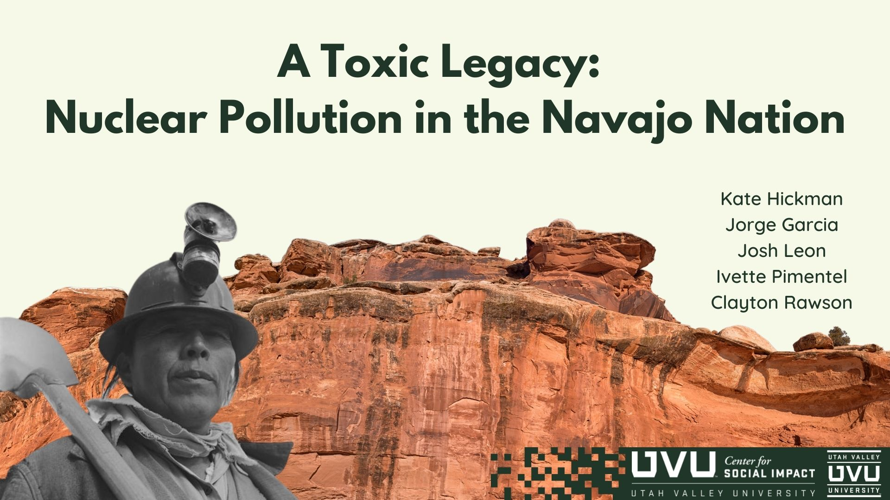

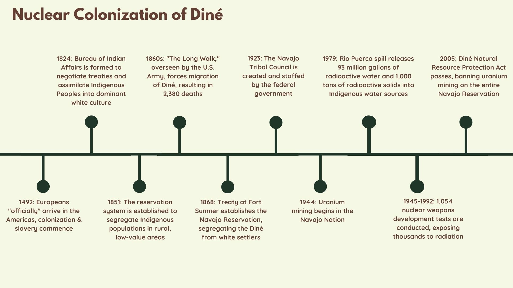
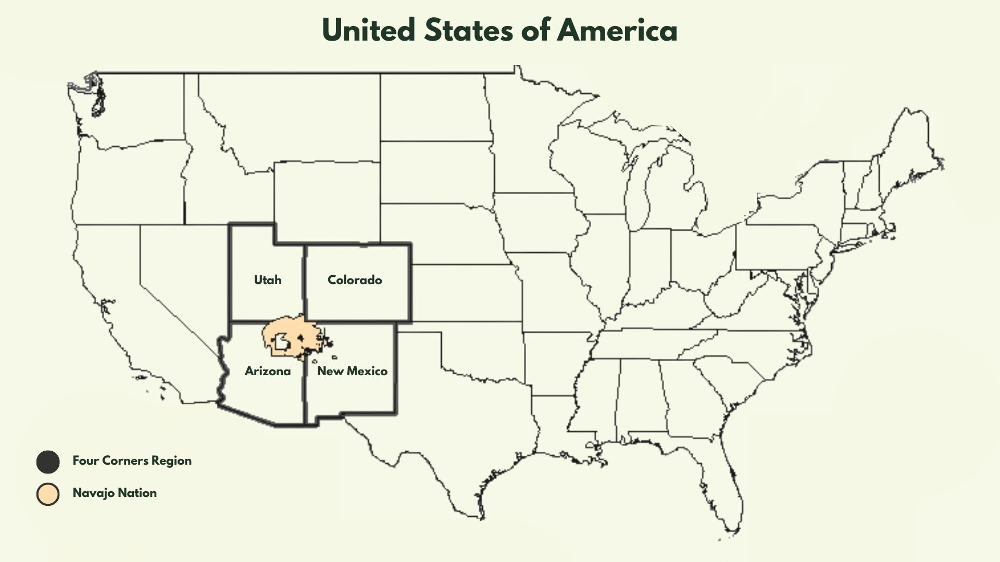

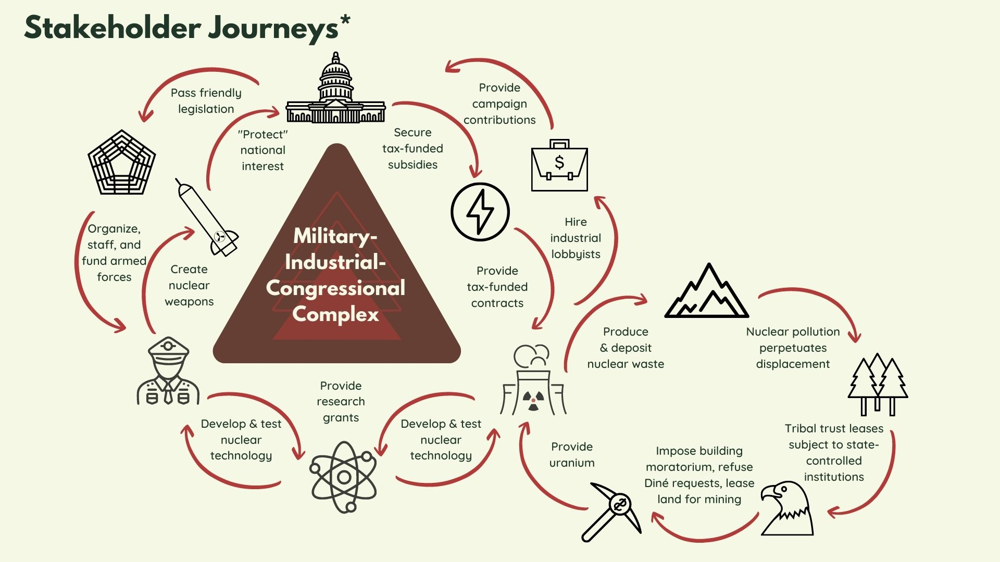
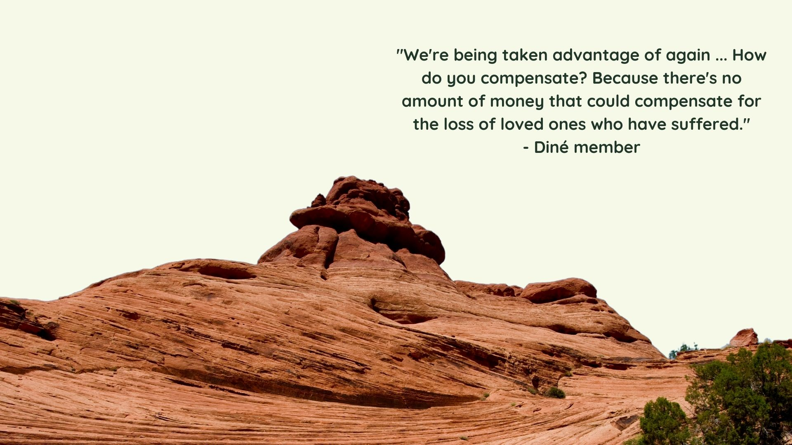
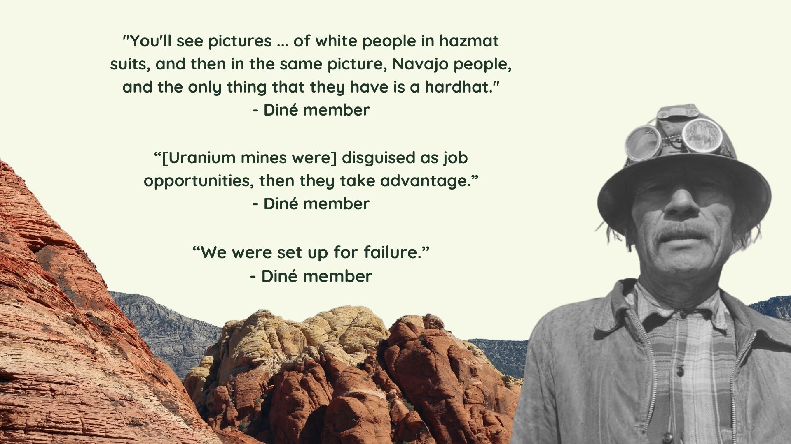

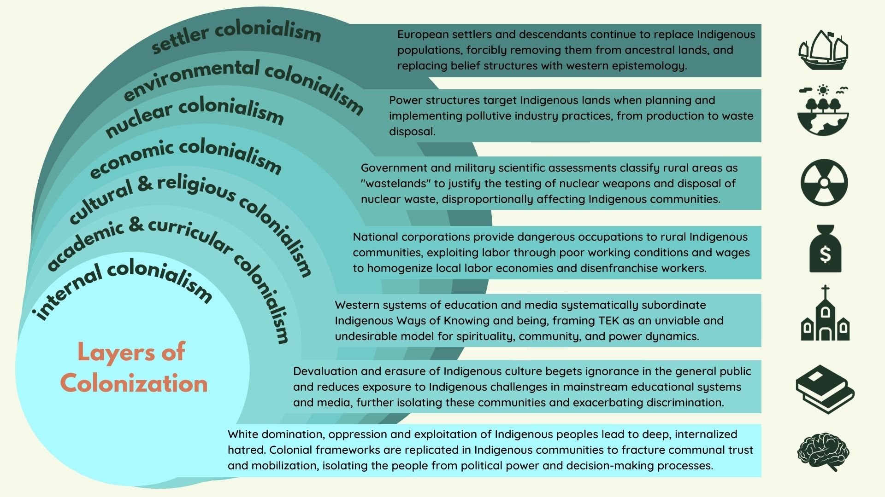

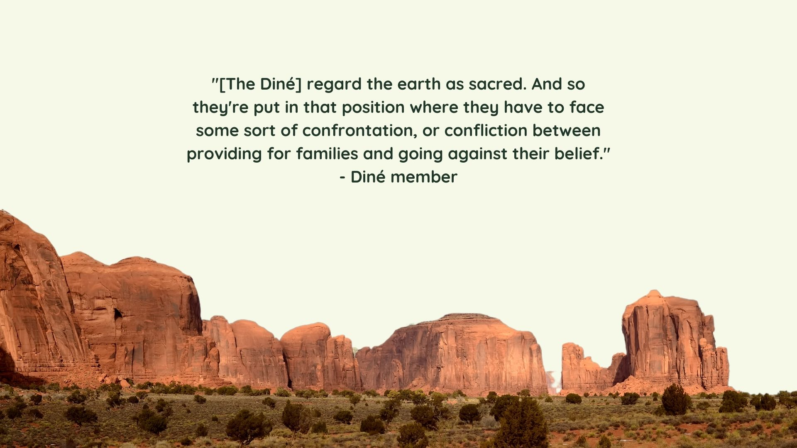

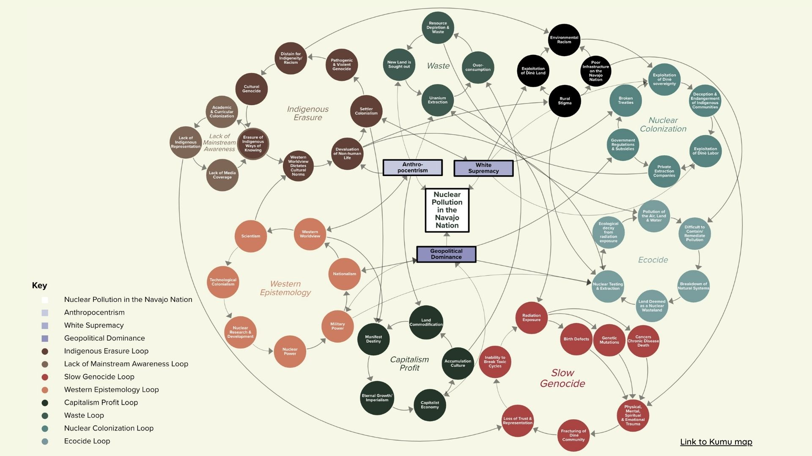
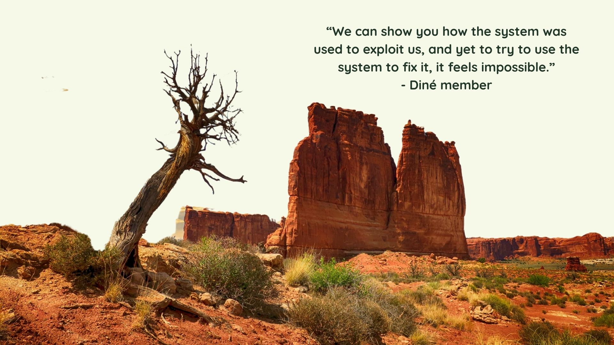

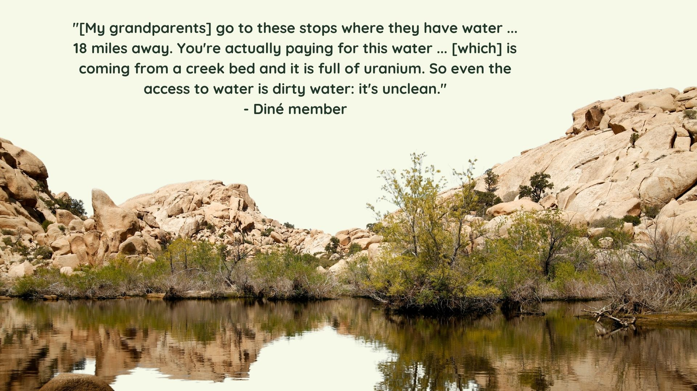

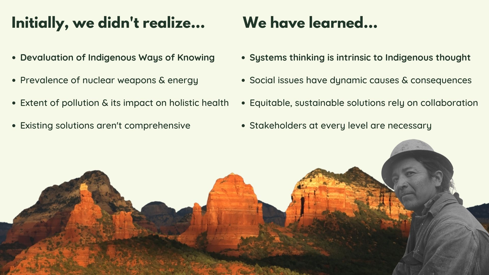
